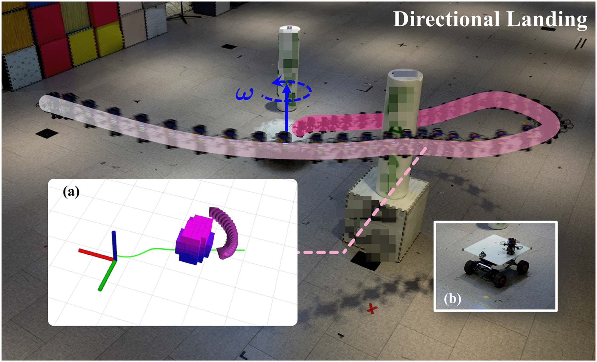
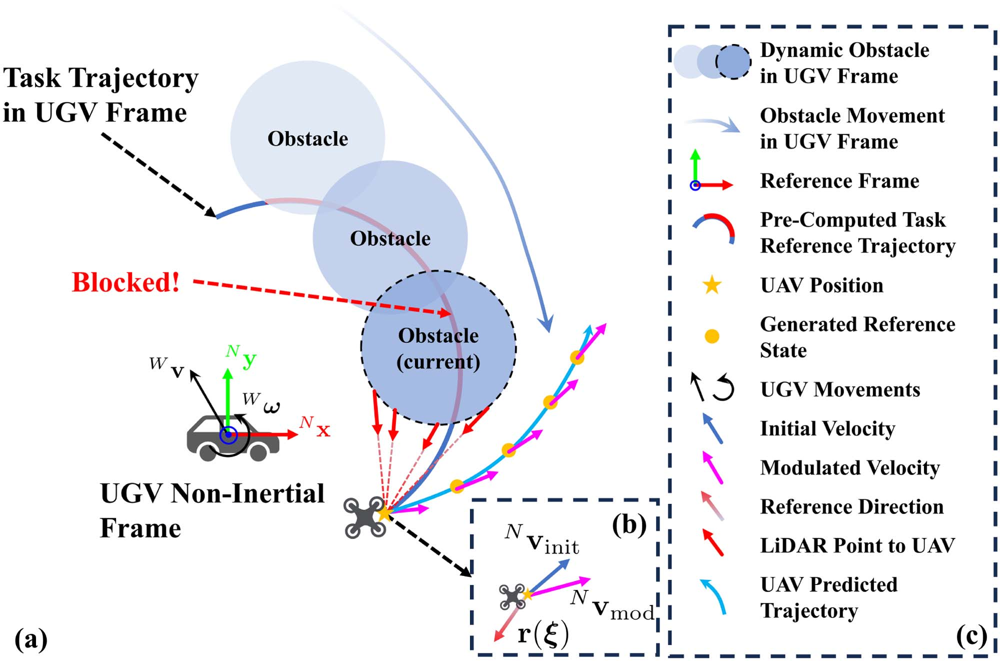
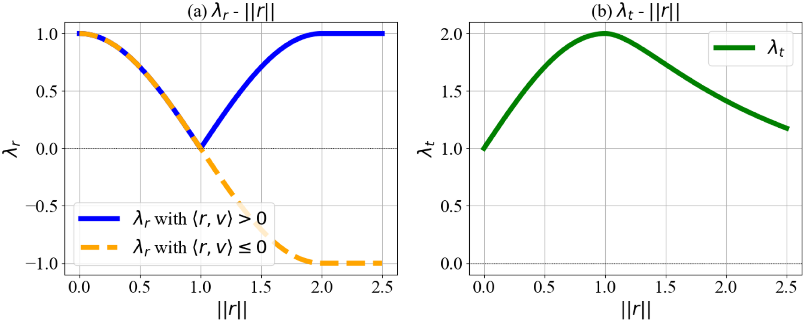
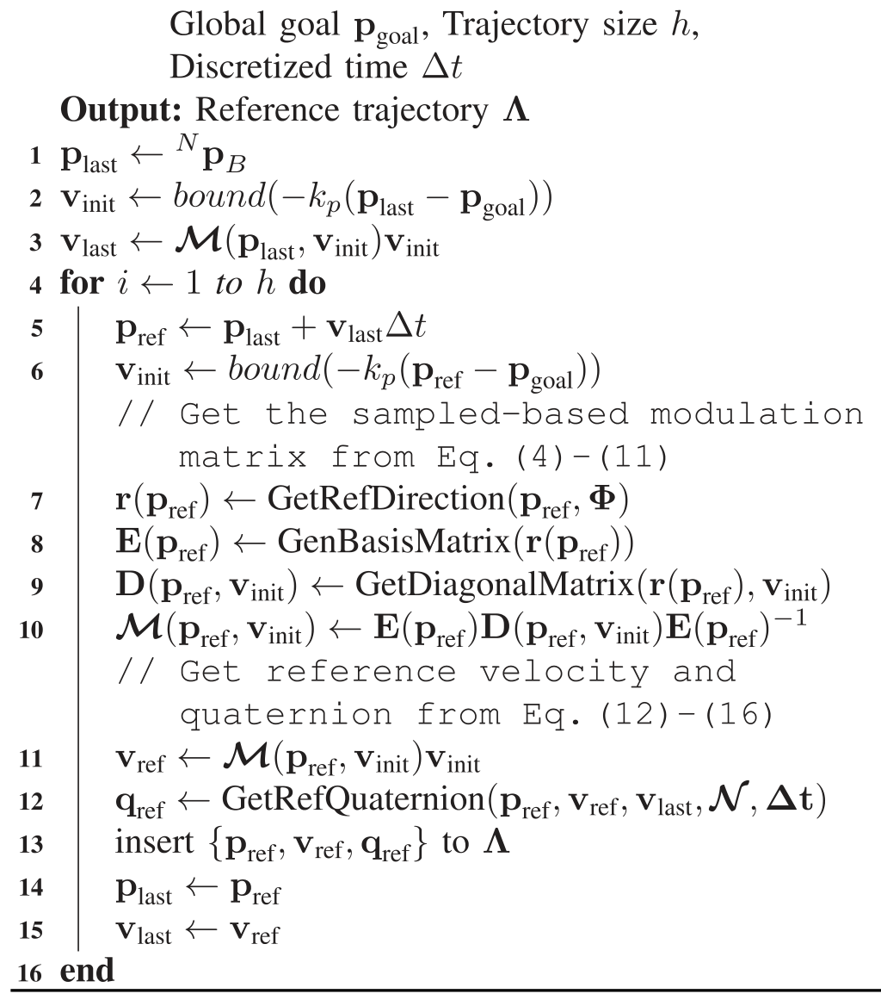
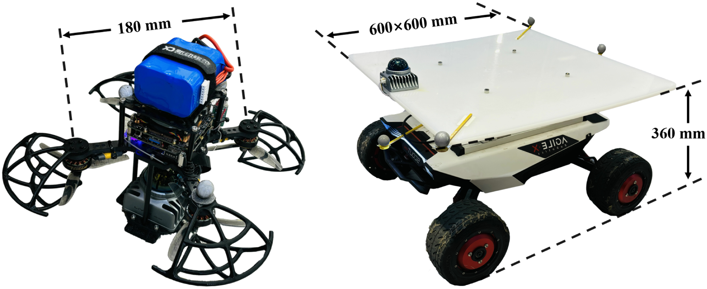
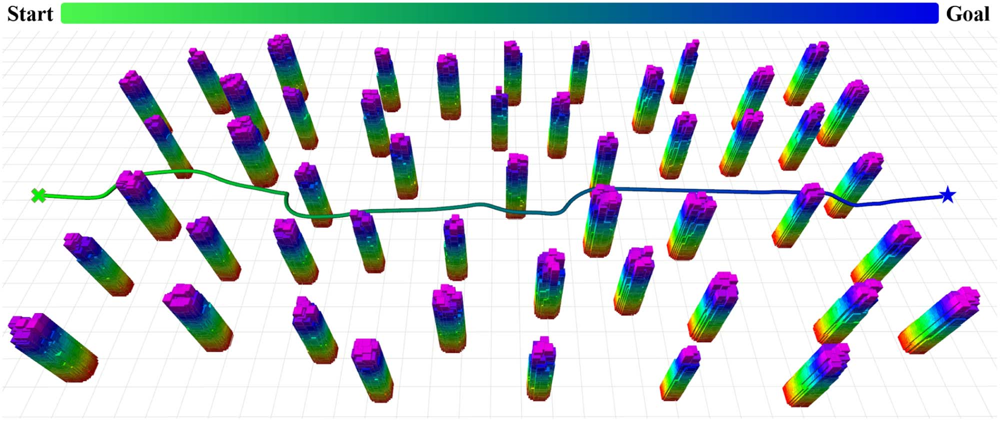
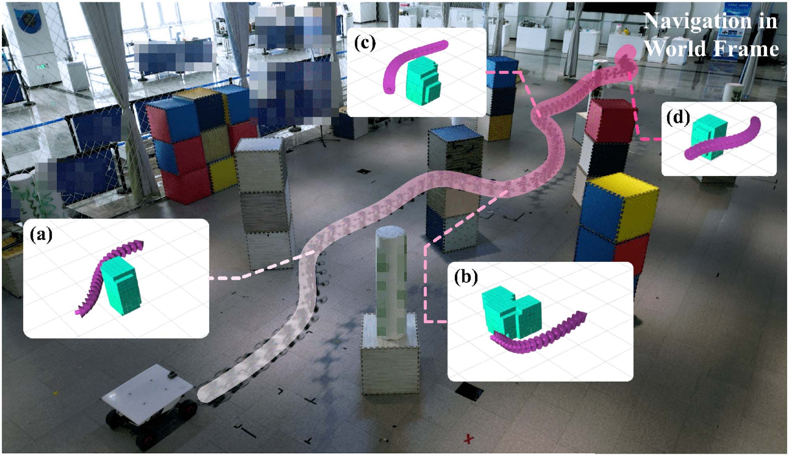
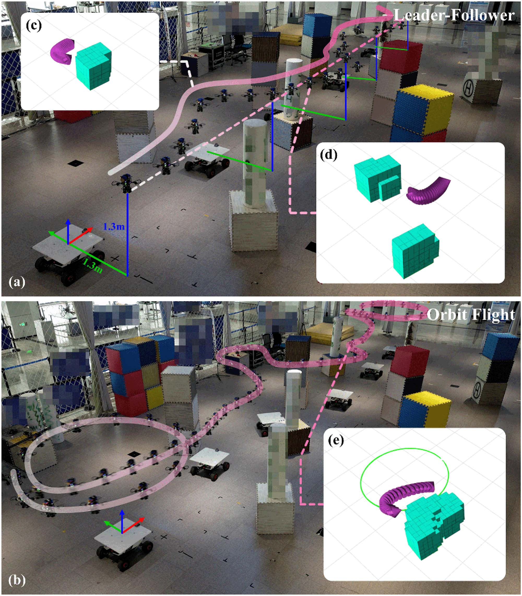
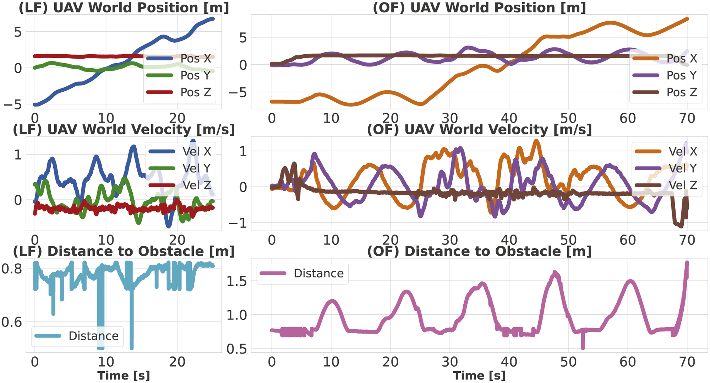

# 空地协同中无全局状态四旋翼避障控制

> **原文标题**：Global-State-Free Obstacle Avoidance for Quadrotor Control in Air-Ground Cooperation  
> **作者**：Baozhe Zhang, Xinwei Chen, Qingcheng Chen, Chao Xu, Fei Gao, Yanjun Cao  
> **发表信息**：*IEEE Robotics and Automation Letters*, Vol. 10, No. 7, July 2025, pp. 6688–6695  
> **原文 PDF**：[Global-State-Free Obstacle Avoidance for Quadrotor Control in Air-Ground Cooperation.pdf](../Global-State-Free%20Obstacle%20Avoidance%20for%20Quadrotor%20Control%20in%20Air-Ground%20Cooperation.pdf)

---

## 原文第 1 页

### 摘要

CoNi-MPC [Zhang et al. (2023)] 仅依赖相对状态，为空地协同任务中的 UAV 控制提供了高效框架，因而无需全局状态估计。然而，由于缺少环境信息，该方法难以避障。为此，本文提出 Cooperative Non-inertial frame-based Obstacle Avoidance（CoNi-OA），专门面向不依赖全局状态估计或障碍物预测的 UAV-UGV 协同场景。CoNi-OA 仅使用 UAV 单帧原始 LiDAR 数据生成调制矩阵，直接调整四旋翼速度实现避障。该方法可在 UGV 非惯性坐标系中实时生成无碰撞轨迹，每次迭代耗时少于 5 ms，并能在动态、不可预测环境中保持安全。本文贡献为：提出无全局状态非惯性坐标系下的 UAV-UGV 调制避障算法；仅凭单帧 LiDAR 数据快速生成轨迹，无需障碍物建模或预测；同时适用于静态和动态环境，并可扩展到无特征或未知场景。

**关键词**：避障；空地协同；非惯性模型；调制动力系统。

### I. 引言

UAV-UGV 对、leader-follower 系统、多智能体编队和自主降落平台等多机器人协同系统，已广泛用于监视、搜救和影视拍摄。CoNi-MPC 通过在 UGV 非惯性坐标系中主动控制 UAV，使系统无需 SLAM 和连续全局轨迹重规划，能够适应动态环境。但它没有考虑障碍物影响，无法保证 UAV 飞行安全。直接在 UGV 非惯性坐标系中控制 UAV，可以执行 leader-follower、定向降落和绕飞等任务，而不必预测 UGV 运动或持续重规划全局轨迹，也摆脱了 GPS、动作捕捉或环境视觉/几何特征的依赖。

该坐标变换同时带来避障挑战：世界惯性坐标系中的静态障碍物会因 UGV 未知运动而在非惯性坐标系中表现为“动态”且不可预测。UAV 因而必须实时避开两类障碍物，并满足动力学可行性。主要问题是：避开不可预测的动态障碍物；在动态场景中快速响应，避免 ESDF 或飞行走廊更新延迟；确保轨迹满足四旋翼动力学约束。

本文将 CoNi-OA 作为搭载 LiDAR 的四旋翼局部规划器，每次控制迭代仅使用一帧采样。方法直接由 LiDAR 点生成调制矩阵，调制高层规划器的初始速度，迭代产生符合非惯性四旋翼动力学的局部无碰撞轨迹，再由 CoNi-MPC 跟踪。与 [6] 在二维点质量模型上的方法不同，CoNi-OA 面向三维四旋翼刚体，支持更激进的机动。

### II. 相关工作

RRT、PRM 等高层规划方法在构型空间采样生成路径，主要假设障碍物静止；MPC、ESDF、安全走廊和 Ego-Planner 等优化方法需要在计算过程中更新环境信息，更新延迟可能造成动态场景碰撞。VO、RVO 和 AVO 通过速度空间避障，但依赖准确的障碍物速度和加速度估计，并可能陷入局部极小值。调制动力系统可沿障碍物法向和切向改变速度；[6] 的采样方法避免耗时的形状分析，但局限于二维点质量模型，未处理四旋翼刚体和非惯性坐标系问题。

## 原文第 2 页

### III. 预备知识

在 [1] 中，UGV 与 UAV 组成的协同系统可执行 leader-following、定向降落和绕飞。本文采用调制避障方法保证复杂交互中的飞行安全。

#### A. 非惯性坐标系中的四旋翼动力学

状态为 `x = [NpB; NvB; NqB] ∈ R6 × S3`，其中三项分别表示 UAV 机体坐标系 B 相对 UGV 机体坐标系 N 的位置、速度和姿态（单位四元数）。输入为 `u = [T; BΩB] ∈ R4`，`T = ΣTi` 为四个螺旋桨的质量归一化总推力，`BΩB` 为机体角速度：

`N ṗB = N vB`

`N v̇B = −[NβN]×NpB − 2[NΩN]×NvB − [NΩN]²×NpB + NqB ⊙ BTB ⊙ NqB⁻¹ − NaIMU_N`

`N q̇B = −1/2 NΩN ⊙ NqB + 1/2 NqB ⊙ BΩB` **(1)**

`NaIMU_N` 是 UGV IMU 加速度，`NΩN` 是角速度，`NβN` 是角加速度；`[·]×` 为斜对称矩阵算子，`⊙` 为 Hamilton 乘积。记动力系统为 `fN`，非惯性参数为 `N = [NaIMU_N; NΩN; NβN] ∈ R9`。若 `N = [(0,0,g);0;0]` 且 `g = 9.8 m/s²`，则它退化为世界惯性坐标系动力学 `fW`。

#### B. 调制动力系统避障

[6] 的 FOA 将调制矩阵 `M ∈ Rd×d` 应用于点质量动力系统：

`ξ̇ = M(ξ,v)v,  M(ξ,v) = E(ξ)D(ξ,v)E(ξ)⁻¹` **(2)**

其中 `ξ` 是位置，`v` 是高层规划速度，`E` 是基矩阵，`D` 是方向缩放的特征值矩阵。`M` 满秩时，系统保持渐近稳定且不会引入新极值点。四旋翼可先由点质量模型生成 `vmod := Mvinit` **(3)**，再由标准 MPC 跟踪；本文进一步使该过程符合式（1）的刚体动力学。

**图 1**：四旋翼使用 CoNi-OA 避开障碍物，并从固定方向降落到旋转 UGV；预生成无碰撞轨迹在降落时被阻挡。(a) 世界坐标系第三人称视角；(b) 成功降落。

**图 2**：点质量模型利用调制动力系统绕障导航。红色箭头为障碍物合成参考方向，紫色和橙色箭头分别为初始及调制速度方向。

## 原文第 3 页

### IV. 用于协同避障的基于采样的调制

CoNi-OA 将 UAV LiDAR 采样点表示在非惯性坐标系 N 中，并据此生成调制矩阵和遵守式（1）的无碰撞轨迹，再由 CoNi-MPC 跟踪。

#### A. 基于采样的调制矩阵

记采样点为 `ξo ∈ R3`，`o = 1,…,n`。每个点视为半径 `δ` 的球形障碍物：`Φ(t) = ⋃o=1n {ξ : ‖ξ−ξo‖ ≤ δ}`。**算法 1：GenBasisMatrix。** 加权参考方向为 `r(ξ) = Σξo∈Φ wo(ξ)(ξ−ξo)/‖ξ−ξo‖` **(4)**，权重为 `wo(ξ) = ŵo(ξ)/ŵsum`（`ŵsum>1`），否则为 `ŵo(ξ)` **(5)**，其中 `ŵsum = min(Σ ŵo,wmax)`。`ŵo(ξ) = (Dscal/Do(ξ))s`，`Do(ξ)=‖ξ−ξo‖−R` **(6)**；`R` 为包围四旋翼球体半径，`Dscal,s` 为距离缩放参数。

`r(ξ)` 是指向四旋翼的虚拟障碍物法向。用 Householder 变换生成基矩阵 `E(ξ)`，且 `Eᵀ=E⁻¹=E`。`D(ξ)=diag(λr,λt,λt)` 分别缩放法向和切向速度。法向特征值按 `λr = cos(π‖r‖/2)`（`‖r‖<2`），否则为 `−1` **(7)**；当 `⟨r,v⟩>0` 且 `‖r‖>1` 时反号 **(8)**。切向特征值为 `λt = 1+sin(π‖r‖/2)`（`‖r‖<1`），否则为 `2sin(π/(2‖r‖))` **(9)**。距离障碍物较远时，使用式（10）重新平滑缩放，权重见式（11），其中 `c=2`。

**图 3**：CoNi-OA 为 CoNi-MPC 增加避障能力。(a) UAV 使用 LiDAR 计算适应 UGV 不可预测运动的安全轨迹；(b) 调制任务轨迹速度并生成无碰撞轨迹；(c) 标注。

**图 4**：`λr` 和 `λt` 随 `‖r(ξ)‖` 的变化。

#### B. 基于调制的无碰撞轨迹生成

给定 `pgoal ∈ R3`，比例控制生成 `vinit = bound(−kp(pref−pgoal))` **(12)**，其中 `bound` 将范数限制为不超过 1.0。调制得 `vref=M(pref,vinit)vinit`，加速度为 `aref=(vref−vlast)/Δt` **(13)**。在每次规划迭代中令非惯性量 N 恒定，并利用微分平坦性定义 `t = aref − (−[NβN]×pref −2[NΩN]×vref −[NΩN]²×pref −NaN)` **(14)**，进而令 `NzB=t/‖t‖`。将其限制在 N 系 z 轴锥体内，假设 `NxC=[1,0,0]T`，由 `NyB=(NzB×NxC)/‖NzB×NxC‖`、`NxB=NyB×NzB` **(15)** 得 `Rref=[NxB,NyB,NzB]` **(16)** 及 `qref`。算法 2 生成符合 `fN` 的局部轨迹，并采用保守悬停输入 `uref=[g,0,0,0]T`。复杂度为 `O(nh)`，`n=|Φ|` 为 LiDAR 点数，`h=|Λ|` 为轨迹长度。

#### C. 实现

**图 5**：CoNi-OA 系统总览。算法 2 从相对 UGV 的期望运动轨迹中提取目标，以 LiDAR 点和相对位置为输入生成轨迹，再由基于 `fN` 的 CoNi-MPC 跟踪。

## 原文第 4 页

MPC 代价函数为 `L = Σk=0N−1(‖x(k)−xref(k)‖Q+‖u(k)−uh‖R)+‖x(N)−xref(N)‖Qfinal` **(17)**，其中 `xref` 为算法 2 生成轨迹的参考状态，`uh=[g;0]` 为参考输入。输入满足推力和机体角速度约束。CoNi-MPC 使用 ACADO Toolkit [28] 实现；UGV IMU 经 ROS 多机通信传输，用于估计 `NaN` 和 `NΩN`，难以获得的 `NβN` 设为 0。预测窗口为 2 s，离散时间为 0.1 s，实际控制频率至少 100 Hz。

## 原文第 5 页

### V. 实验

实验包括 leader-following、绕飞、定向降落等真实任务，并在仿真中与 Ego-Planner、VO 和 AVO 比较。还测试了 UGV 静止、四旋翼在世界惯性坐标系中面对静态障碍物的退化场景。

**图 6**：实验所用四旋翼和 UGV。

**图 7**：算法 2 生成的无碰撞轨迹由起点绿色过渡到目标点蓝色。

**图 8**：UGV 静止时的退化场景避障飞行；(a)–(d) 为遭遇障碍物时生成的轨迹。

真实平台使用 NOKOV 动作捕捉估计相对状态。四旋翼重 974.4 g，6S 电池下推重比 2.78。Intel N100（最高 3.40 GHz）和 16 GB 内存的机载计算机运行轨迹生成与 CoNi-MPC，Livox Mid-360 提供采样点。单次控制迭代平均耗时 0.24 ms；处理约 4000 点时，平均 4.91 ms 生成长度 20、`dt=0.1 s` 的轨迹，频率超过 100 Hz。

**图 9**：四旋翼在 (a) leader-following 和 (b) 绕飞任务中的避障飞行；(c)–(e) 为遭遇障碍物时生成的轨迹。

**图 10**：LF 和 OF 任务中的 UAV 数据，从上到下为位置、速度和到障碍物的距离。

#### B. 对比实验

在 ROS 和 Rviz 中将 CoNi-OA 与 Ego-Planner [7]、VO [29]、AVO [9] 比较。所有方法使用相同的 LiDAR、位置、速度和姿态观测及 CoNi-MPC 参数。地图为 `26 m × 20 m × 3 m`，障碍物数量为 100、150、200，UGV 运动约束分为慢速 `vmax=0.5,ωmax=0.5` 和快速 `vmax=1.5,ωmax=1.5`。LF 中 UAV 跟踪相对 UGV 的 `(1.0,0.0,0.5)`；OF 中跟踪以该点为中心、半径 1.0、角速度 0.5 的圆轨迹。每种条件进行 100 次试验；若 UAV 与障碍物距离小于 0.1 m，则失败。结果表明，CoNi-OA 在不同密度和 UGV 运动条件下的 LF、OF 成功率均更高。

**表 I**：CoNi-OA、Ego-Planner、VO 和 AVO 在不同障碍物密度、两种 UGV 运动约束下 LF 与 OF 任务的成功率。

## 原文第 6 页

### VI. 结论

本文提出非惯性坐标系下的调制协同避障算法 CoNi-OA。UAV 直接在 UGV 非惯性坐标系中控制，无需全局状态；方法仅使用单帧 LiDAR 点、无需显式检测或预测，迭代生成符合非惯性动力学的轨迹，并由 CoNi-MPC 跟踪。仿真和真实实验验证了其有效性与鲁棒性。局限在于 LiDAR 点更新频率较低，UGV 激烈机动时可能无法及时生成无碰撞轨迹。未来将集成高频 LiDAR，扩展到多机器人协同避障，并加入实时相对状态估计设备。

## 参考文献

参考文献 [1]–[29] 的作者、题名、期刊、卷期、页码及 DOI 信息均按原文保留。

---
