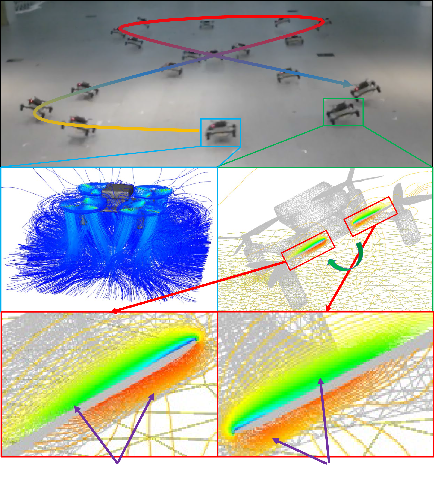
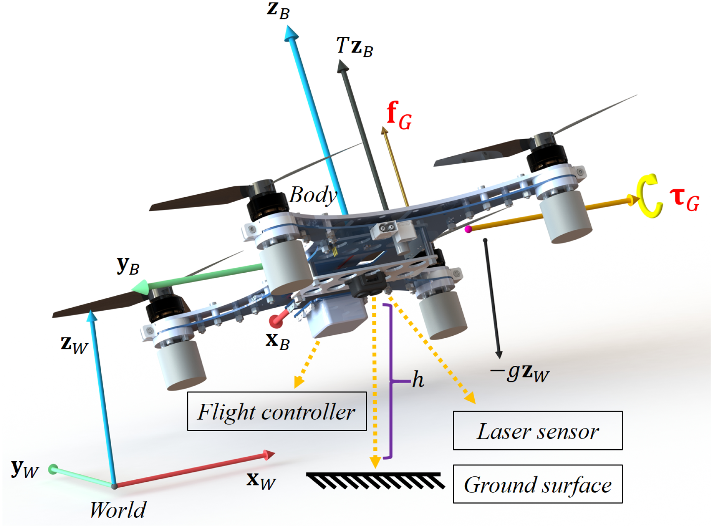
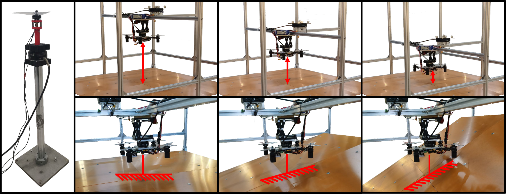
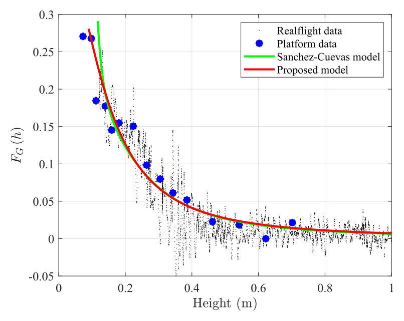
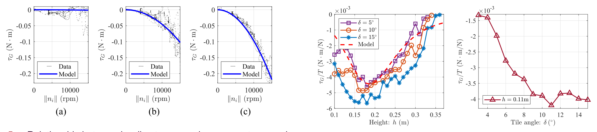
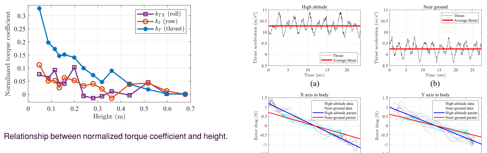
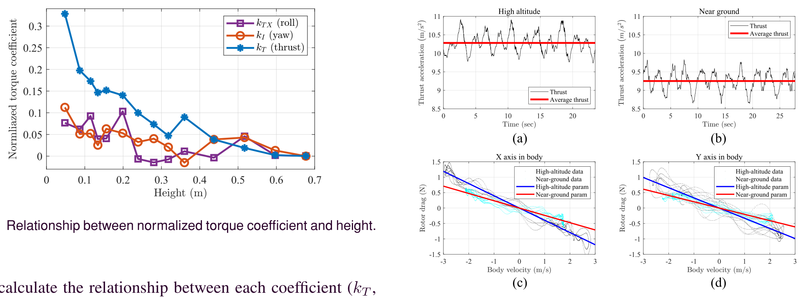
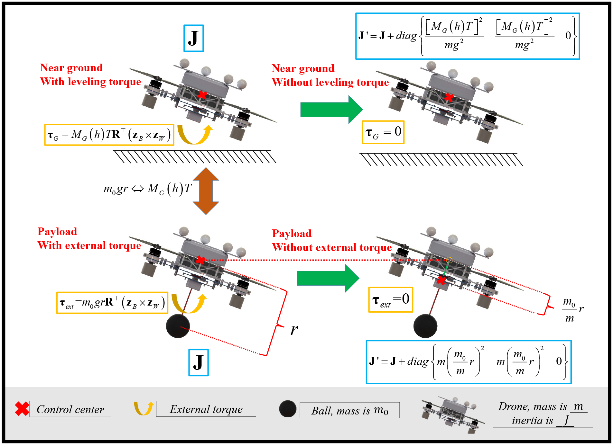
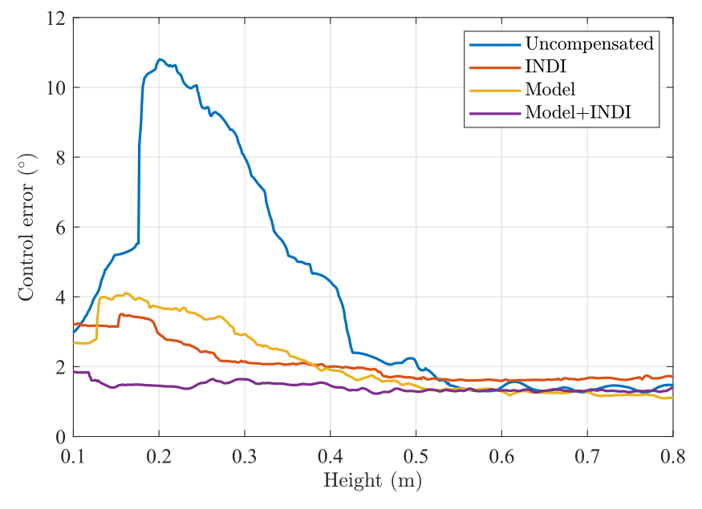

# 多旋翼近地效应建模与自适应控制（Ground-Effect-Aware Modeling and Control for Multicopters）：完整忠实学术翻译

> **原文标题**：Ground-Effect-Aware Modeling and Control for Multicopters  
> **作者**：Tiankai Yang, Kaixin Chai, Jialin Ji, Yuze Wu, Chao Xu, and Fei Gao  
> **发表信息**：IEEE/ASME TRANSACTIONS ON MECHATRONICS, VOL. 30, NO. 6, DECEMBER 2025  
> **原文 PDF**：[Ground-Effect-Aware Modeling and Control for Multicopters.pdf](../Ground-Effect-Aware Modeling and Control for Multicopters.pdf) ｜ **对应中文详解**：[19_多旋翼近地效应建模与自适应控制.md](../中文详解/19_多旋翼近地效应建模与自适应控制.md)  

---

## 原文第 1 页核心内容与翻译

Ground-Effect-Aware Modeling and Control for
Multicopters
Tiankai Yang
, Kaixin Chai
, Member, IEEE, Jialin Ji
, Yuze Wu
, Chao Xu
,
and Fei Gao
, Member, IEEE
摘要——多旋翼的地面效应带来了若干挑战，包括额外升力造成的控制误差、近地飞行时外部力矩可能引起的振荡，以及地面气流对旋翼阻力和混控矩阵等模型的影响。本文通过力测量平台和真实飞行等多种方法采集并分析多旋翼近地飞行的动力学数据。我们首次总结地面效应下多旋翼外部力矩的数学模型，并通过充分实验和分析验证地面气流对旋翼阻力与混控矩阵的影响。通过简化和推导，确认地面效应下多旋翼动力学模型具有微分平坦性。为减小这些扰动模型对控制的影响，我们提出结合动力学逆模型与扰动模型的控制方法，使高、低空均保持一致的控制效果。该方法通过前馈模型同时考虑并补偿地面效应引起的额外推力和旋翼阻力变化。地面效应调平力矩可等效表示为质心和转动惯量的变化，因此不必显式出现在动力学模型中。最终实验结果表明，本文方法将控制误差（RMSE）降低了 45.3%。
关键词——扰动建模；地面效应；多旋翼控制。
一、引言
由于机械结构简单且机动性高，多旋翼广泛应用于露天和室内环境。
Received 17 October 2024; revised 31 March 2025; accepted 25
May 2025. Date of publication 15 July 2025; date of current version 30
December 2025. This work was supported by the National Key R&D
Program of China under Grant 2023YFB4706600. Recommended by
Technical Editor C. Chen and Senior Editor C. Clevy. (Corresponding
author: Fei Gao.)
Tiankai Yang, Jialin Ji, Yuze Wu, Chao Xu, and Fei Gao are with the
Institute of Cyber-Systems and Control, College of Control Science and
Engineering, Zhejiang University, Hangzhou 310027, China, and also
with Huzhou Institute, Zhejiang University, Huzhou 313000, China (e-
mail: tkyang@zju.edu.cn; fgaoaa@zju.edu.cn).
Kaixin Chai is with Huzhou Institute, Zhejiang University, Huzhou
313000, China.
The supplementary material is available online at https://github.com/
ZJU-FAST-Lab/Ground-effect-controller.
Color versions of one or more figures in this article are available at
https://doi.org/10.1109/TMECH.2025.3583162.
Digital Object Identifier 10.1109/TMECH.2025.3583162

**图 1**： (a) 多旋翼贴近地面飞行，与地面保持较小距离。(b) 近地飞行多旋翼周围的气流；气流方向变化产生额外升力。(c) 近地倾斜多旋翼旋翼周围的气压（红色为高压，绿色为低压）。(d)、(e) 旋翼越靠近地面，上下表面压力差越大，从而产生使多旋翼趋于水平的力矩。
(a) Multicopter is flying close to the ground, ensuring a small
distance from the ground surface. (b) Airflow around a multicopter flying
near the ground. The change in the direction of the airflow results in
additional lift. (c) Air pressure around the rotors of a tilted multicopter
near the ground (red for high pressure and green for low pressure).
(d) and (e) Closer the rotor is to the ground, the greater the pressure
difference between the upper and lower surfaces, resulting in a torque
that tends to level the multicopter.

并且室内环境。然而，近地运行在许多应用中不可避免。例如，使用带机械臂的多旋翼抓取地面附近物体 [1]、[2]，规划近地轨迹以利用地面效应提供的额外推力节省能量 [3]，在隧道内飞行 [4] 或沿墙飞行 [5]，以及自动降落在物体表面 [6]、[7] 等。在这些场景中，多旋翼接近刚性结构时会受到地面或物体表面附近气流的扰动，显著影响安全性和稳定性。图 1(a) 展示了多旋翼贴近地面飞行的场景；图 1(b) 表明地面会显著改变多旋翼周围的气流。

---

## 原文第 2 页核心内容与翻译

YANG et al.: GROUND-EFFECT-AWARE MODELING AND CONTROL FOR MULTICOPTERS
7407
聚焦于精确建模地面效应产生的额外升力，通常采用随高度变化的外力函数。借助该模型可计算前馈控制信号，并在多旋翼保持固定高度和姿态飞行时抵消扰动。然而，地面效应施加于多旋翼的扰动不止于此。
第二类是旋翼阻力减小。旋转螺旋桨的叶片受到空气升力以及作用于旋转平面的阻力，该阻力通常与旋翼转速和前飞速度成正比 [12]。高空飞行时总推力接近悬停油门，旋翼阻力系数通常建模为常数 [13]、[14]。但多旋翼近地飞行需要更低油门，因此可推断旋翼阻力也会减小；近地气流可能使实际情况更复杂，后续实验将对此进行验证。
通常未被考虑的第三类因素，是近地高速飞行时升力气流的逸散。Kan 等人 [15]分析了近地前飞时额外推力的变化。悬停时，撞击地面的气流形成高压层，为多旋翼提供额外推力；高速前飞时，部分近地气流逸出，使额外推力减小。
这些问题使多旋翼难以在近地保持倾斜姿态以产生水平加速度。因此，现有方法仅适用于起飞、着陆和近地悬停等情况，难以跟踪近地轨迹，所以有必要探索地面效应下多旋翼的动力学模型。
为此，我们建立真实环境中的力和力矩测量平台（见第 IV 节），并通过真实飞行实验采集各种场景下的外部扰动数据。基于这些数据，我们建立地面效应外部力矩模型（见第 V-B 节），并验证其对旋翼阻力（第 V-D 节）和混控矩阵（第 V-C 节）的影响。我们简化阻力和推力模型，并将力矩模型转换为 Payload 模型（第 VI-A 节）。这些简化和等价关系使地面效应下多旋翼动力学模型保持微分平坦（第 VI 节），从而可根据轨迹生成前馈控制指令。我们将基于模型的控制方法（第 VII 节）与无模型方法结合，以提高控制精度（第 VIII 节）。
本文的贡献如下。
二、相关工作
A. 地面效应下的额外推力
叶片地面效应的研究最初针对直升机展开 [16]。直升机机身形状对地面效应参数的影响主要体现在螺旋桨半径以及叶片平面与地面之间的距离上，其他影响因素包括空气密度、旋翼转速、桨距角和沿旋转轴方向的来流速度。由于直升机只有一个旋翼，其动力学模型比多旋翼简单。对于多旋翼，整个机身下方形成气流对流区域，其地面效应强于各个旋翼效应的简单叠加。因此，研究者提出了适用于多旋翼的地面效应模型 [9]、[10]、[15]。Sanchez-Cuevas 等人 [9] 将直升机地面效应模型中的修正项引入多旋翼，无需辨识一系列多项式系数即可获得模型。
B. 地面效应控制方法
Sanchez-Cuevas 等人 [9] 根据环境信息和预先辨识的模型，为控制器提供姿态和推力前馈，以补偿“平台”造成的地面效应。Tripathi 等人 [17] 开发 INDI 和 L1 自适应控制器，处理着陆期间的地面效应及未知风等扰动，并将其作为无模型扰动补偿。Du 等人 [18] 采用类似的无模型 NDI 方法处理多旋翼起飞过程。Wei 等人 [11] 对地面效应额外推力建模，并采用基于模型的方法（带姿态前馈的 LQR 反馈）进行补偿。
一些数据驱动方法 [19]、[20]、[21]、[22] 依赖预先采集的大规模数据集，训练根据环境和状态信息预测扰动的网络，再将预测结果用于前馈补偿。这类方法通常具有良好控制性能，并能适应复杂气流条件，但预测网络往往缺少显式数学表示。我们的目标是通过基本分析推导精确数学模型，为该领域后续研究提供坚实基础。
Authorized licensed use limited to: National Institute of Technology- Delhi. Downloaded on August 24,2026 at 05:45:46 UTC from IEEE Xplore.  Restrictions apply.

---

## 原文第 3 页核心内容与翻译

C. 常被忽视的调平力矩模型
本文主要关注调平力矩的建模与补偿。已有工作通常采用两种解决方案。第一种是内环调参。在一定高度，倾角越大，地面效应产生的调平力矩越强，小角度下可视为线性。由于该力矩使姿态趋于水平，这种关系等价于在多旋翼下方固定一个载荷（第 VI-A 节详述），也等价于降低质心并增大转动惯量，可通过调整姿态环和角速度环增益处理。地面效应强度随高度变化，因此每个高度都应有合适参数；缺少模型使调参困难。Sanchez-Cuevas 等人 [9] 认为调平力矩不是主导因素，主要有助于稳定性，因而未建模或纳入控制框架。其研究关注多旋翼越过障碍物时特定螺旋桨产生的额外推力，即所谓将多旋翼推离障碍物的“障碍力矩”。由于实验在特定高度进行，调平力矩可通过飞控参数调节处理。Shi 等人提出的 Neural Landing [22] 也通过网络根据动力学和状态信息预测近地外力，未显式补偿调平力矩，但角速度误差增益等参数可减轻其引起的振荡；这些参数针对低空和着陆优化，可能降低高空控制精度。第二种是扰动观测器：可由观测器 [10]、[18]、[23]、[24] 获取调平力矩后进行补偿，但效果有限。该方法假设下一时刻外部力矩约等于上一时刻观测值，适用于缓慢变化的扰动；而质心沿 Z 轴偏移或地面效应产生的外部力矩与倾角成正比且高频变化，扰动估计会延迟，补偿无法消除振荡。
三、基本符号说明
本文涉及的部分坐标系、力和力矩如图 2 所示。用 [xW , yW , zW ] = I3 表示世界坐标系的三个正交单位基。I3 是

**图 2**：多旋翼的坐标系。

单位矩阵。多旋翼姿态记为 R = [xB, yB, zB]，其中 {xB, yB, zB} 是多旋翼机体系的一组正交基。
多旋翼几何中心在世界坐标系中的位置为 p；{v, a, j} 分别为其在世界坐标系中的速度、加速度和加加速度。 The Euler angles of the multicopter in the world
coordinate system are expressed in the order of Z −Y −X
rotation as ξ = {ϕ, γ, φ}. The rotation matrix around an axis
of Z −Y −X can be expressed as TZ(ϕ), TY (γ), and TX(φ),
respectively. The angular velocity and angular acceleration of
the multicopter in the body coordinate system are expressed as
ω and β, respectively.
多旋翼动力学模型可写为：
ma = −gzW + TzB + f G + f D
J ˙ω = −ω × Jω + τ B + τ G + τ ext
(1)
其中 m 和 J 分别为多旋翼质量和转动惯量，g 为重力加速度，TzB 为旋翼推力，f G 为额外力，τ B 为旋翼力矩，f D 为旋翼阻力，τ G 为调平力矩，τ ext 为未建模外部力矩。
For a quadrotor, the total thrust and torque in the body
coordinate system generated by the rotors are
 T
τ B

= MN 2 = diag

kT ,
√
2b
4 kT X,
√
2b
4 kT Y , kI

⎡
⎢⎢⎣
1
1
1
1
−1
1
1
−1
−1
1
−1
1
−1
−1
1
1
⎤
⎥⎥⎦
⎡
⎢⎢⎣
n12
n22
n32
n42
⎤
⎥⎥⎦
(2)
其中 b 表示对角旋翼之间的距离，ni 表示各旋翼转速，kT 为推力系数，kT X 和 kT Y 分别为横滚和俯仰方向的力矩系数，kI 为旋翼反扭矩系数，M 为四旋翼混控矩阵。
Authorized licensed use limited to: National Institute of Technology- Delhi. Downloaded on August 24,2026 at 05:45:46 UTC from IEEE Xplore.  Restrictions apply.

---

## 原文第 4 页核心内容与翻译

YANG et al.: GROUND-EFFECT-AWARE MODELING AND CONTROL FOR MULTICOPTERS
7409

**图 3**：
(a) 单旋翼平台，以及 (b)–(g) 四旋翼平台。

ni 为旋翼转速（单位：r/min），N 2 为由各旋翼转速平方组成的 4 × 1 矩阵。
四旋翼机械机架并非完全中心对称，且机身会阻碍旋翼气流，因此可假设 kT̸ = kT X̸ = kT Y 。
四、模型探索与验证方法
本节介绍如何设置实验环境，以采集和分析多旋翼在地面效应下的动力学数据。这些环境包括单旋翼平台［见图 3(a)］、四旋翼平台［见图 3(b)–(g)］以及真实飞行等。此外，我们引入 Spearman 相关系数 [25]，以确定与外部扰动相关的具体因素。
A. 真实环境中的动力学测量平台
我们分别搭建了单旋翼和四旋翼动力学测试平台。两者均配备六轴力和力矩传感器。
1) 单旋翼平台：该平台［见图 3(a)］固定在地面上，可在单个电机旋转时测量其旋翼转速、推力和力矩。旋翼远离地面放置，以尽量减小地面效应。部分连接机构采用柔性 3D 打印部件（热塑性聚氨酯（TPU）材料），能够有效降低旋翼旋转造成的传感器数据噪声。
2) 四旋翼平台：在图 3(b)–(g) 所示的平台中，整个四旋翼固定在铝型材框架上。框架与四旋翼之间固定有力和力矩传感器。在四旋翼下方放置一块树脂板（1.2 m × 1.2 m）以模拟地面。通过一系列机械结构可以调节树脂板的倾角和四旋翼的高度。该装置能够模拟四旋翼以向前倾斜姿态在近地面飞行的情形。采用阵列式激光传感器测量地面板与四旋翼之间的距离，并使用电子倾角仪确定地面的倾角。
需要特别指出的是，我们调节的是地面板的角度，而不是四旋翼的角度。换言之，我们通过倾斜地面板来模拟四旋翼的倾斜，同时保持四旋翼水平。这是因为如果四旋翼发生倾斜，就会产生与倾角相关的重力力矩。此外，旋翼旋转时还会产生与旋翼转速相关的力矩，这是由于传感器中心与旋翼推力线并不重合。这两个因素都会干扰地面效应所产生力矩的测量。
B. 补充方法
1) 真实飞行：除使用动力学测量平台外，我们还开展真实飞行实验，以采集四旋翼在近地面飞行期间经历的扰动数据。
我们引入如下外部扰动观测器：
˜aext = (a −g)f
imu −zBTf/m
˜τ = J ˙ωf + ωf × Jωf −τ B
(3)
其中，下标 (·)f 表示数据已经过低通滤波器处理，(a −g)imu 表示惯性测量单元（IMU）采集的原始加速度数据。
2) 机械模型：利用机械模型可以直接确定四旋翼的转动惯量和重心。由于机械模型的总质量与实际总质量近似相等，因此可以认为由机械模型计算得到的转动惯量也近似等于实际转动惯量。除用于模型探索和验证外，控制器在实际运行中也会直接调用这些参数。
3) 相关系数：为探索并验证地面效应引入的外部扰动与高度、旋翼转速和倾角等变量之间的关系，我们计算 Spearman 秩相关系数 [25]。这一统计工具用于评估非线性参数之间单调关系的存在性及其强度。
对于大小相同的两个数据集 xi 和 yi，分别将两组数据排序为 R(xi) 和 R(yi)。Spearman 秩相关系数 rs 可计算为
rs(x, y) = cov [R(x), R(y)]
σ [R(x)] σ [R(y)]
(4)
其中，cov[R(x), R(y)] 表示排序后变量的协方差，σ[R(x)] 和 σ[R(y)] 表示各自的标准差。
我们关注的变量包括高度、倾角和旋翼转速。在探索外部扰动与旋翼转速之间的相关性时，很难直接建立单个旋翼转速与四旋翼整体动力学之间的联系。因此，将旋翼转速转换为 N base
N base = diag(kT , kT X, kT Y , kI)−1MN 2.
(5)
在数据分析中，N base(1) 表示对应总推力 T 的综合旋翼转速，N base(2)、N base(3) 和 N base(4) 分别表示对应横滚、俯仰和偏航力矩（xW ⊤τ B、yW ⊤τ B 和 zW ⊤τ B）的综合旋翼转速。
扰动与各变量之间的 Spearman 秩相关系数以及参数辨识结果
Authorized licensed use limited to: National Institute of Technology- Delhi. Downloaded on August 24,2026 at 05:45:46 UTC from IEEE Xplore.  Restrictions apply.

---

## 原文第 5 页核心内容与翻译

详见 MAT.Part.4 [26]，相关实验将在第五节中介绍。
五、地面效应下的模型
A. 地面效应下的推力模型
1) 模型：旋翼产生的总推力为
T =
4
i=1
kT ni
2.
(6)
地面效应产生的附加力为
f G = FG(h)TzB
(7)
其中，FG(h) 是与地面到旋翼平面中心的距离 h 相关的函数
FG(h) =
g2
h2 + g1
(8)
其中，g1 和 g2 为常数。
已有研究 [9]、[10]、[15] 采用了 FG(h) 的多种形式。我们选择上述形式 (8)，主要是因为它简单、参数较少；更重要的是，其导数形式能够解释第五节 B 部分提出的地面效应调平力矩模型 (15)。
2) 实验：我们开展了一系列实验，用于验证地面效应下附加推力模型并辨识相关参数。
在四旋翼平台实验中，我们按照图 3(b) 所示将地面板调至水平。通过调节地面板与四旋翼之间的距离，采集旋翼转速、离地高度等必要数据。FG(h) 通过下式测量：
˜FG(h) = zW ⊤˜
f
˜T
−1
(9)
其中，˜f 和 ˜T 分别为力传感器测得的推力以及由式 (6) 得到的旋翼转速测量值。
在真实飞行实验中，四旋翼逐渐降低悬停高度，并采集 IMU 与旋翼转速数据，以估计 FG(h) 函数
˜FG(h) = mzW ⊤˜aext
˜T
(10)
其中，˜aext 是由式 (3) 得到的外力。
随后，数据如图 4 所示。式 (8) 的模型与平台实验和飞行实验数据均相符，总体上与 Sanchez 模型 [9] 一致。相关参数可被辨识，结果见 MAT.Part.4.1 [26]。
为证明 f G 不受四旋翼倾角影响，且沿四旋翼机体系的 z 轴方向，我们按照图 3(b)–(g) 所示逐步调节倾角和地面板高度，并采集相关数据。

**图 4**：额外推力 f G 的数据与模型。

在 MAT.Part.4.2 [26] 中计算了 f G 与各变量之间的相关系数：rs[f G, N base(1)] = 0.0054，表明 f G 与倾角 δ 不相关。
B. 地面效应产生的调平力矩
在低空飞行时，四旋翼相对于地面的倾角会使各旋翼受到不同程度的地面效应。距离地面更近的旋翼会获得更大的附加推力，从而产生使四旋翼姿态趋于水平的外部调平力矩 (τ G)。
1) 模型假设：关于调平力矩模型，可以作出如下合理假设。
τ G 与 δ：倾角增大时，对角旋翼与地面之间的距离差增大，导致推力差增大，调平力矩也随之增大。
τ G 与 T：总推力增大时，地面效应带来的附加推力也增大。上下位置旋翼之间的推力差将按比例增大，从而使调平力矩增大。
τ G 与 h：若附加推力函数 ˙FG(h) 在某一高度处的绝对导数值较大，则意味着在该高度附近，不同高度的旋翼会产生更大的推力差，进而产生更大的调平力矩。
2) 数学解释：我们进行数学推导，以解释上述假设和仿真结果。
假设地面效应附加力 τ G 分布在一个圆周上，该圆以四旋翼中心为圆心，以对角轴距 b 为直径。圆心位于离地高度 h 处，圆周各点的高度为 H(θ)，其中 θ ∈ [0, 2π)。距离地面最近的点对应 θ=0。D(θ) 表示地面效应力 τ G 在该圆周上的分布密度函数，其关系为：
2π
0
D (θ) dθ = FG(h)T
D (θ) = FG [H (θ)] T/2π
Authorized licensed use limited to: National Institute of Technology- Delhi. Downloaded on August 24,2026 at 05:45:46 UTC from IEEE Xplore.  Restrictions apply.

---

## 原文第 6 页核心内容与翻译

YANG et al.: GROUND-EFFECT-AWARE MODELING AND CONTROL FOR MULTICOPTERS
7411

**图 5**：调平力矩与平均旋翼速度的关系。
更多数据见 MAT.Part.2.2 [26]。黑点表示传感器采集的数据，蓝线表示模型预测的关系。(a) δ=15°、h=0.36 m；(b) δ=15°、h=0.31 m；(c) δ=15°、h=0.18 m。

H (θ) = h −b
2 sin δ cos θ
(11)
其中，δ 是体系 z 轴与世界坐标系之间的夹角。
我们假设在某一高度附近，˙FG(h) 为常数
FG [H (θ)] =FG(h) −b
2 sin δ cos θ ˙FG(h).
(12)
分布在圆周上的 |f G| 产生力矩 |τ G|
|τ G| =
2π
0
D (θ) b
2 cos θdθ
= bT
2π
π
0

FG(h) −b
2 sin δ cos θ ˙FG(h)

cos θdθ
= −1
8b2 sin δ ˙FG(h)T.
(13)
τ G 在机体系中的向量形式可写为
Rτ G = |τ G| (zB × zW ) = MG(h)T (zB × zW ) .
(14)
MG(h) 可表示为
MG(h) =
g5h
(h2 + g3h + g4)2 .
(15)
3) 使用真实平台标定参数：我们需要通过真实实验验证上述模型并标定参数。
如图 3(e)–(g) 所示，在四旋翼平台上调节地面板倾角和四旋翼高度，提高油门，并使四个旋翼保持一致转速。采集倾角、高度、旋翼转速和力矩数据。
从图 5 和图 6（更多数据见 MAT.Part.4.2 [26]）可以看出，τ G 与高度 h、倾角及平均旋翼转速均具有较强相关性。
1) τ G 与 T：图 5 展示了四旋翼平台上不同高度时调平力矩 τ G 与平均旋转速度 ∥ni∥ 的关系。可以看出，调平力矩与平均旋转速度的平方（或依据式 (6) 得到的推力）成正比

**图 6**：四旋翼平台测得的调平力矩。纵轴表示单位推力产生的调平力矩。每个数据点均由特定倾角和高度下所有旋转速度的数据拟合得到。

|τ G| ∼∥ni∥2 ∼T.
(16)
2) τ G 与 δ：如图 6(b) 所示，调平力矩与倾角成正比
|τ G| ∼δ (δ →0) .
(17)
然而，当倾角变大（δ > 10°）时，调平力矩不再增加。
3) τ G 与 h：从图 6(a) 可观察到，在倾角固定时，随着四旋翼高度逐渐降低，调平力矩先增大后减小。这验证了第五节 B-1 部分的前述假设，也标定了式 (15) 的参数。
结论 1：随着高度降低，调平力矩 |τ G| 会在距地面某一距离处达到最大值，随后逐渐减小，而不是单调增大。
C. 地面效应下的混控矩阵模型
地面效应会对四旋翼动力学模型产生多方面影响。我们怀疑，旋翼转速差产生的力矩也会受到地面效应影响，即式 (2) 混控矩阵中的部分参数 (kT X、kT Y、kI) 可能随四旋翼状态变化，因此开展实验进行验证。
我们将四旋翼固定在平台上［见图 3(b)–(d)］，调节四旋翼与地面板之间的距离，同时保证地面板水平，然后驱动四个旋翼以不同转速旋转，采集旋翼转速、高度和力矩数据。
地面板可相对于四旋翼的 Y 轴调节，但存在调节误差，无法做到完全水平；Y 轴上仍会存在调平力矩。因此，在研究推力差产生的力矩时，我们只关注 X 轴和 Z 轴 (kT X、kI)。我们在 MAT.Part.4.2 [26] 中计算 Spearman 相关系数：
rs[xW ⊤τ B, N base(2)] = 0.8400
以及 rs[xW ⊤τ B, h] = −0.0937。可见，机体力矩 τ B 与旋翼转速差 N base 密切相关，而与高度 h 无关。
Authorized licensed use limited to: National Institute of Technology- Delhi. Downloaded on August 24,2026 at 05:45:46 UTC from IEEE Xplore.  Restrictions apply.

---

## 原文第 7 页核心内容与翻译

**图 7**：归一化力矩系数与高度的关系。

我们分别计算各系数 (kT、kT X 和 kI) 与高度的关系，如图 7 所示。图中系数按以下过程归一化：
¯k(h) =
k(h)
k (+∞) −1.
(18)
如图 7 所示，四旋翼从高空下降至地面板附近时，与推力系数 kT（约 30%）的变化相比，旋翼转速差产生的力矩系数 (kT X 和 kI) 变化很小（小于 10%）。这种变化主要由近地面的机械振动引起，导致测量误差。
结论 2：混控矩阵的力矩参数 (kT X、kT X、kI) 不受地面效应影响。
D. 地面效应下的旋翼阻力
当多旋翼向前飞行时，会产生与运动方向相反的旋翼阻力。已有研究证明，该阻力与推力以及多旋翼机体系水平方向的飞行速度有关 [27]
f D (R, v, T) = −RD′√
TR⊤v
(19)
其中，D′ = diag(dx, dy, 0) 为阻力系数矩阵。
由于旋翼阻力项中包含推力 T，旋翼阻力的表达形式给多旋翼动力学微分平坦性的推导带来了困难。通常，多旋翼在高空飞行时推力保持在悬停油门附近，可视为固定值 [13]。四旋翼近地飞行时，由于 f G 提供了额外推力，悬停推力减小，因此理论上旋翼阻力也会减小。
为验证这一假设，我们分别在高空和低空开展飞行测试。本实验中（详细数据见附录），低空与高空平均推力之比如图 8(a)、(b) 所示
 ¯T(0.1)
 ¯T(2.0)
= 0.9486
(20)
根据式 (19)，该数值也应当等于低空与高空旋翼阻力之比。然而，实验结果

**图 8**：(a)、(b) 高空与近地飞行期间的推力差异；(c)、(d) 旋翼阻力。

如图 8(c)、(d) 所示
dx(0.1)
dx(2.0) = 0.5963, dy(0.1)
dy(2.0) = 0.6179.
(21)
由此得到结论。
结论 3：低空时旋翼阻力 fD 的下降幅度显著超过当前模型 (19) 的预测。
该现象的形成机制目前尚无法从理论上解释；在需要近地飞行时，我们选择对这些参数进行标定。但在工程应用中，可以将旋翼阻力视为与高度相关的函数，并通过实验测量具体曲线后进行插值
f D (R, v, h) = −RD(h)R⊤v.
(22)
六、地面效应下的微分平坦性
本节将说明，即使考虑地面效应，多旋翼仍保持微分平坦性。将多旋翼的位置和偏航角指定为平坦输出后，可以计算其推力、姿态、角速度、角加速度、力矩和旋翼转速
{p, v, a, j, s} , {ϕ, ˙ϕ, ¨ϕ}
↔Tref, {ξref, ωref, ˙ωref, τ Bref, nref} .
(23)
需要考虑的扰动类型越多，微分平坦性的推导过程就越复杂。
例如，仅考虑与速度相关的旋翼阻力时 [13]，多旋翼需要通过产生额外加速度进行补偿。然而，加速度与姿态耦合，因此阻力补偿需要从加速度一直考虑到姿态和角速度参考输出。对于受地面效应影响的多旋翼，推导过程还需考虑附加推力、随高度变化的旋翼阻力和调平力矩模型。
Authorized licensed use limited to: National Institute of Technology- Delhi. Downloaded on August 24,2026 at 05:45:46 UTC from IEEE Xplore.  Restrictions apply.

---

## 原文第 8 页核心内容与翻译

YANG et al.: GROUND-EFFECT-AWARE MODELING AND CONTROL FOR MULTICOPTERS
7413

**图 9**：六-A 节中的等效转动惯量。

**图 10**：六-A 节中的调平力矩负载模型。

在这些扰动中，受多种因素影响的调平力矩最为复杂。尽管我们已在第五节 B 部分标定参数，但该参数只能部分解释模型，精度并不完全可靠。力矩测量平台与真实飞行条件之间必然存在差异。因此，需要寻找一种合理方法简化或近似调平力矩模型，既不使模型失真，也不影响多旋翼的微分平坦性。
A. 为调平力矩设计的负载模型
我们将调平力矩等效为刚性连接在多旋翼下方的 Payload 球所产生的重力力矩。在内环姿态控制期间，可以列出四种彼此等效的动力学模型（见图 9）。
1) 带外部力矩的 Payload：带有 Payload 球的多旋翼欧拉方程（见图 10）可写为
J ˙ω = −ω × Jω + τ B + m0grR⊤(zB × zW )
(24)
其中，m 和 m0 分别为多旋翼和球的质量，r 为球到多旋翼中心的距离。
2) 不带外部力矩的 Payload：在模型 (24) 中，如果将控制中心从多旋翼重心下移至多旋翼与 Payload 球的整体重心，则欧拉方程可写为
J′ ˙ω = −ω × J′ω + τ B
(25)
其中，J′ 为新控制中心处的整体转动惯量
J′ = J + diag

m
 m0
m r
2
m
 m0
m r
2
0

.
(26)
3) 近地且带调平力矩：带调平力矩的多旋翼欧拉方程可写为
J ˙ω = −ω × Jω + τ B + MG(h)TR⊤(zB × zW ) .
(27)
4) 近地且不显式包含调平力矩：令
m0gr = MG(h)T.
(28)
采用同样的下移重心方法，可将调平力矩模型 (27) 改写为
J′ ˙ω = −ω × J′ω + τ B.
(29)
调整后的转动惯量 J′ 为
J′ = J + diag

[MG(h)T ]2
mg2
[MG(h)T ]2
mg2
0

.
(30)
考虑到推力保持在悬停油门附近，可假设
MG(h)T ≈mgMG(h)
1 + FG(h).
(31)
结合式 (30) 和 (31)，修正后的转动惯量 J′(h) 仅与离地高度有关（见图 9）。为处理其他未知扰动，我们提出一种结合基于模型和无模型抗扰能力的方法，将在第七节详细介绍。
B. 推力与姿态输出
包含附加推力、随高度变化的旋翼阻力和转动惯量的模型可写为
a = −gzW + [1 + FG(h)] TazB −RDa(h)R⊤v
J′(h) ˙ω = −ω × J′(h)ω + τ B
(32)
其中，Ta = T/m，Da(h) = D(h)/m 为归一化加速度。对下式左乘 zb：
a + gzW +

dax(h)xB
⊤v

xB +

day(h)yB
⊤v

yB
−[1 + FG(h)] TazB = 0.
(33)
参考推力可由下式得到
T = mzB⊤(a + gzW )
[1 + FG(h)]
.
(34)
参考姿态的推导可参见前述文献 [13]、[28]。
C. 其他输出
通过对加速度求导，可以得到角速度 ωref 和角加速度 ˙ωref 的参考输出。
Authorized licensed use limited to: National Institute of Technology- Delhi. Downloaded on August 24,2026 at 05:45:46 UTC from IEEE Xplore.  Restrictions apply.

---

## 原文第 9 页核心内容与翻译

式（32）的详细推导过程与前人工作 [13]、[28] 类似。在求导过程中，由于多旋翼执行近地飞行轨迹时通常不存在显著的 Z 轴速度，因此可假设

\[
\frac{d}{dt}D(h)=\frac{d^2}{dt^2}D(h)=0.
\]

于是可得到参考力矩输入

\[
\tau_{ref}=J'(h)\dot{\omega}_{ref}+\omega_{ref}\times J'(h)\omega_{ref}. \tag{35}
\]

其中，$J'(h)$ 使用式（30）和式（31）的结论，体现了调平力矩模型对微分平坦性的影响。

## 七、结合增量逆的基于模型控制器

本节利用前面介绍的模型补偿外部扰动，从而控制四旋翼飞行器在近地状态下飞行。最重要的部分是第 VII-C 节中的调平力矩补偿。

### A. 加速度指令

在建立准确的外力模型后，利用这些模型补偿扰动，以减小控制误差。期望合加速度为

\[
\begin{aligned}
a_{des}&=a_{ref}+a_E-a_D-a_G,\\
a_E&=K_P(p_{des}-\hat p)+K_V(v_{des}-\hat v),\\
a_D&=-\frac{R_D(h)}{m}R^\top v_{ref},\\
a_G&=\frac{T_{ref}}{m}F_G(h)z_B.
\end{aligned} \tag{36}
\]

其中，$a_{ref}$ 表示沿运动轨迹的参考加速度（式（23））；$a_E$ 是位置和速度误差反馈产生的加速度；$K_P$ 和 $K_V$ 是位置控制比例-微分（PD）控制器的参数；$a_D$ 和 $a_G$ 分别是由阻力模型（式（22））和附加推力模型（式（7））产生的加速度。

### B. 姿态、机体角速度和机体加速度指令

根据第 VI 节的微分平坦性原理，可由期望加速度得到期望姿态

\[
a_{des}\leftrightarrow\xi_{des}. \tag{37}
\]

当前姿态 $\hat\xi$ 与期望姿态 $\xi_{des}$ 之间的误差为

\[
\xi_e=\hat\xi\circ\xi_{des}. \tag{38}
\]

此处姿态均采用四元数形式，符号 $\circ$ 表示哈密顿四元数乘法。将其写成角度向量

\[
\xi'_e=\frac{2\cos^{-1}\xi^w_e}{\sqrt{1-(\xi^w_e)^2}}
\begin{bmatrix}\xi^x_e&\xi^y_e&\xi^z_e\end{bmatrix}^{\!\top}. \tag{39}
\]

其中，$[\xi^w\ \xi^x\ \xi^y\ \xi^z]$ 为姿态的四元数形式。随后可计算期望角速度和角加速度

\[
\omega_{des}=K_\xi\xi'_e+\omega_{ref},\qquad
\dot\omega_{des}=K_\omega(\omega_{des}-\omega_f)+\dot\omega_{ref}. \tag{40}
\]

其中，$K_\xi$ 和 $K_\omega$ 是姿态角控制的 PD 参数，$\omega_{ref}$ 和 $\dot\omega_{ref}$ 分别是由式（23）得到的参考角速度和参考角加速度。

### C. 推力和力矩指令

期望加速度在四旋翼 Z 轴上的投影对应旋翼需要产生的加速度。因此可得到期望推力

\[
T_{des}=m a_{des}\frac{\hat z_B}{|\hat z_B|}. \tag{41}
\]

根据期望角速度和期望角加速度，可计算电机所需的力矩

\[
{}^B\tau_{des}=J'(h)\cdot\dot\omega_{des}+\omega_{des}\times J'(h)\cdot\omega_{des}. \tag{42}
\]

随高度变化的转动惯量 $J'(h)$ 用于补偿近地效应引起的力矩影响。由于多种原因，上述方法无法完全补偿外部力矩。首先，利用力矩测量平台获得的参数并不完全准确；其次，还存在其他未建模力矩，例如重力力矩和陀螺力矩。因此，将 INDI [24] 与模型结合，输出控制力矩

\[
{}^B\tau_{des}=\hat\tau^B+J'(h)\cdot(\dot\omega_{des}-\dot\omega_f). \tag{43}
\]

实际实验中仍需对函数 $J'(h)$ 进行微调。此时，基于模型的补偿方法退化为调节角加速度误差的增益。这相当于在传统双环姿态控制器中，将角速度控制增益设为随高度变化的函数；它也类似于分段 PID 控制器，因此具有很高的工程应用可行性。

### D. 旋翼转速指令

根据式（2）中混控矩阵的逆矩阵，可由推力和力矩计算各电机的转速

\[
N_{des}^2=M^{-1}
\begin{bmatrix}T_{des}\\{}^B\tau_{des}\end{bmatrix}. \tag{44}
\]

通过油门输入控制旋翼转速（$t_i^{des}\in[0,1]$），并通过 BDhot 反馈旋转速度。电机建模 [29]、标定和转速控制方法见 MAT.Part.3 [26]。

我们对 APM 固件代码 [26] 进行了改进，使其与油门接口和电压补偿逻辑相匹配；相关代码已开源 [26]。

## 八、飞行实验

我们搭建了四旋翼飞行平台进行对比实验。该四旋翼具有更大的桨叶直径（$r=7$ 英寸）以及更小的螺旋桨离地距离（$h_{min}=7.2$ cm）。这些因素使四旋翼的近地效应更加明显。

## 原文第 10 页核心内容与翻译

### 表 I

**表 I：控制器对比。**

**图 11**：不同控制方法下的悬停姿态角误差。

通过悬停和轨迹跟踪实验，将第 VII 节的控制器与其他控制方法进行比较。四旋翼配备 CUAV V5+ 飞行控制器 [26]，可反馈 200 Hz 的 IMU 数据。采用支持 BDhot 的 APM 固件版本后，飞行控制器能够与电机控制器双向通信，并以 200 Hz 读取旋翼转速数据。四旋翼下方安装了 16 × 16 阵列激光传感器 [26]，以 100 Hz 测量其离地距离。计算平台采用 Intel NUC。NOKOV 动作捕捉系统 [26] 的标签支架固定在计算机顶部。通过扩展卡尔曼滤波器 [31]、[32] 融合动作捕捉系统与 IMU，得到平滑的位置结果（200 Hz）。

### A. 悬停实验

我们使四旋翼从高空飞至低空，并比较姿态角控制误差。在特定高度处，误差值定义为

\[
E(h_0)=\left\|\hat\xi-\xi_{des}\right\|_2\quad
(h\in[h_0-\Delta h,h_0+\Delta h]). \tag{45}
\]

图 11 展示了控制误差随高度的变化。未采用补偿时，低高度处的姿态角误差很大，在 $h=0.2$ m 处达到峰值。这与第 V-B 节的模型相对应，其中图 6 的调平力矩在 $h=0.18$ m 处达到最大值。

式（42）中的基于模型方法和 INDI [24] 均能有效减小控制误差，但与高空相比，近地处的姿态角误差仍会增大。当采用模型与增量逆相结合的方法（式（43））时，低高度处的误差与高高度处相同。

### B. 轨迹跟踪实验

我们生成了表 I 中用于跟踪实验的双纽线轨迹 [28]。

在无力矩补偿条件下以 $v=1$ m/s 执行轨迹，并开展四组实验，将本文的加速度补偿方法与 INDI [24]、神经着陆方法 [22] 以及无补偿方法 [13] 进行比较。

在 Z 轴方向，INDI 仅比无补偿略好。这可能是因为 INDI 通过实时估计补偿外力加速度。然而，Z 轴外力补偿中的微小误差就可能影响多旋翼的高度，而高度变化又会进一步影响 Z 轴外力，从而导致静态控制误差。

合理的方法是在期望状态下补偿预测的外力，本文方法正是如此。本文方法在 Z 轴方向表现最佳，这符合预期，因为 $f_G$ 的前馈曲线已根据该多旋翼进行了精细标定。在这四组实验中，INDI 在 XOY 平面内的控制性能最佳。这可能是因为外部力矩使姿态无法完美跟踪加速度，而 INDI 可以将加速度引入反馈回路进行补偿。

加入力矩补偿后，本文方法在 1 m/s 和 3 m/s 轨迹上的控制精度最佳。为评估控制器的极限性能，我们在 5 m/s 的高速下进行了轨迹测试。本文控制器达到 4.98 cm 的均方根误差（RMSE）。控制器整体表现良好，但低高度飞行仍会损害轨迹跟踪性能。详细实验数据见 MAT.Part.5 [26]。

## 原文第 11 页核心内容与翻译

## 九、讨论与未来工作

本文总结了近地效应下多旋翼的各种模型，并建立了相应的控制方法。我们考虑了近地效应下的附加推力、调平力矩和旋翼阻力模型，并验证了它们对混控矩阵的影响。然而，本研究仍存在若干局限性。首先，我们没有对高速前飞过程中的推力下降进行建模 [15]。这主要有两个原因：我们的模型主要在静态力测量平台上标定，且飞行速度尚未达到会造成显著升力损失的阈值。在我们的飞行场景中，飞行速度低于 4 m/s 的诱导速度，最低飞行高度大于螺旋桨半径，因此升力下降并不明显，未予考虑。然而，表 I 中的实验 6 和实验 7 表明，高速飞行会影响 Z 轴方向的控制效果。其次，我们对旋翼阻力下降的研究还不够充分。旋翼阻力的成因涉及复杂的气流现象 [12]，而近地效应使情况进一步复杂化。希望未来研究能够清晰解释这一现象。

REFERENCES
[1] J. Fishman, S. Ubellacker, N. Hughes, and L. Carlone, “Dynamic grasping
with a“soft” drone: From theory to practice,” in Proc. IEEE/RSJ Int. Conf.
Intell. Robots Syst., 2021, pp. 4214–4221.
[2] J. Saunders, S. Saeedi, and W. Li, “Autonomous aerial robotics for package
delivery: A technical review,” J. Field Robot., vol. 41, no. 1, pp. 3–49,
2024.
[3] S. Gao, C. Di Franco, D. Carter, D. Quinn, and N. Bezzo, “Exploiting
ground and ceiling effects on autonomous UAV motion planning,” in Proc.
IEEE Int. Conf. Unmanned Aircr. Syst., 2019, pp. 768–777.
[4] L. Wang, H. Xu, Y. Zhang, and S. Shen, “Neither fast nor slow: How
to fly through narrow tunnels,” IEEE Robot. Autom. Lett., vol. 7, no. 2,
pp. 5489–5496, Apr. 2022.
[5] R. Ding, Y.-H. Hsiao, H. Jia, S. Bai, and P. Chirarattananon, “Passive wall
tracking for a rotorcraft with tilted and ducted propellers using proximity
effects,” IEEE Robot. Autom. Lett., vol. 7, no. 2, pp. 1581–1588, Apr. 2022.
[6] C. Luo, X. Li, Y. Li, and Q. Dai, “Biomimetic design for unmanned aerial
vehicle safe landing in hazardous terrain,” IEEE/ASME Trans. Mechatron.,
vol. 21, no. 1, pp. 531–541, Feb. 2016.
[7] J. Ji, T. Yang, C. Xu, and F. Gao, “Real-time trajectory planning for
aerial perching,” in Proc. IEEE/RSJ Int. Conf. Intell. Robots Syst., 2022,
pp. 10516–10522.
[8] C. Powers, D. Mellinger, A. Kushleyev, B. Kothmann, and V. Kumar,
“Influence of aerodynamics and proximity effects in quadrotor flight,” in
Proc. Exp. Robot.: 13th Int. Symp. Exp. Robot., 2013, pp. 289–302.
[9] P. Sanchez-Cuevas, G. Heredia, and A. Ollero, “Characterization of the
aerodynamic ground effect and its influence in multirotor control,” Int. J.
Aerosp. Eng., vol. 2017, 2017, Art. no. 1823056.
[10] X. He, G. Kou, M. Calaf, and K. K. Leang, “In-ground-effect model-
ing and nonlinear-disturbance observer for multirotor unmanned aerial
vehicle control,” J. Dyn. Syst., Meas., Control, vol. 141, no. 7, 2019,
Art. no. 071013.
[11] P. Wei, S. N. Chan, S. Lee, and Z. Kong, “Mitigating ground effect on mini
quadcopters with model reference adaptive control,” Int. J. Intell. Robot.
Appl., vol. 3, no. 3, pp. 283–297, 2019.
[12] P.-J. Bristeau, P. Martin, E. Salaün, and N. Petit, “The role of propeller
aerodynamics in the model of a quadrotor UAV,” in Proc. IEEE Eur.
Control Conf., 2009, pp. 683–688.
[13] M. Faessler, A. Franchi, and D. Scaramuzza, “Differential flatness of
quadrotor dynamics subject to rotor drag for accurate tracking of high-
speed trajectories,” IEEE Robot. Autom. Lett., vol. 3, no. 2, pp. 620–626,
Apr. 2018.
[14] J. Svacha, K. Mohta, and V. Kumar, “Improving quadrotor trajectory
tracking by compensating for aerodynamic effects,” in Proc. Int. Conf.
Unmanned Aircr. Syst., 2017, pp. 860–866.
[15] X. Kan, J. Thomas, H. Teng, H. G. Tanner, V. Kumar, and K. Karydis,
“Analysis of ground effect for small-scale UAVs in forward flight,” IEEE
Robot. Autom. Lett., vol. 4, no. 4, pp. 3860–3867, Oct. 2019.
[16] I. Cheeseman and W. Bennett, “The effect of the ground on a helicopter
rotor in forward flight,” Aeronautical Res. Council Rep. Memoranda,
London, U.K., Tech. Rep. 3021, 1955.
[17] A. K. Tripathi, V. V. Patel, and R. Padhi, “Autonomous landing of
UAVs under unknown disturbances using NDI autopilot with l1 adap-
tive augmentation,” IFAC-PapersOnLine, vol. 50, no. 1, pp. 3680–3684,
2017. [Online]. Available: https://www.sciencedirect.com/science/article/
pii/S2405896317309321
[18] H. Du, Z. Pu, J. Yi, and H. Qian, “Advanced quadrotor takeoff control
based on incremental nonlinear dynamic inversion and integral extended
state observer,” in Proc. IEEE Chin. Guid., Navigation Control Conf.,
2016, pp. 1881–1886.
[19] P. Yu, Y. Su, L. Ruan, and T.-C. Tsao, “Compensating aerodynamics
of over-actuated multi-rotor aerial platform with data-driven iterative
learning control,” IEEE Robot. Autom. Lett., vol. 8, no. 10, pp. 6187–6194,
Oct. 2023.
[20] S. Saat, M. A. Ahmad, and M. R. Ghazali, “Data-driven brain emotional
learning-based intelligent controller-pid control of MIMO systems based
on a modified safe experimentation dynamics algorithm,” Int. J. Cogn.
Comput. Eng., vol. 6, pp. 74–99, 2025. [Online]. Available: https://www.
sciencedirect.com/science/article/pii/S2666307424000494
[21] T. KAI and R. KAKURAI, “A data-driven gain tuning method for auto-
matic hovering control of multicopters via just-in-time modeling,” IEICE
Trans. Fundam. Electron., Commun. Comput. Sci., vol. 106, pp. 644–646,
2022.
[22] G. Shi et al., “Neural lander: Stable drone landing control using learned
dynamics,” in Proc. IEEE Int. Conf. Robot. Autom., 2019, pp. 9784–9790.
[23] X. He, M. Calaf, and K. K. Leang, “Modeling and adaptive nonlin-
ear disturbance observer for closed-loop control of in-ground-effects
on multi-rotor UAVs,” in Proc. Dyn. Syst. Control Conf., 2017,
Art. no. V003T39A004.
[24] E. Tal and S. Karaman, “Accurate tracking of aggressive quadrotor trajec-
tories using incremental nonlinear dynamic inversion and differential flat-
ness,” IEEE Trans. Control Syst. Technol., vol. 29, no. 3, pp. 1203–1218,
May 2021.
[25] M. de Carvalho and F. J. Marques, “Jackknife euclidean likelihood-based
inference for Spearman’s rho,” North Amer. Actuarial J., vol. 16, no. 4,
pp. 487–492, 2012.
[26] YangTiankai, “Ground-effect-controller.” (n.d.). [Online]. Available:
https://github.com/ZJU-FAST-Lab/Ground-effect-controller
[27] J. M. Kai, G. Allibert, M. Hua, and T. Hamel, “Nonlinear feedback control
of quadrotors exploiting first-order drag effects,” IFAC Papersonline,
vol. 50, no. 1, pp. 8189–8195, 2017.
[28] Z. Wang, X. Zhou, C. Xu, and F. Gao, “Geometrically constrained trajec-
tory optimization for multicopters,” IEEE Trans. Robot., vol. 38, no. 5,
pp. 3259–3278, Oct. 2022.
[29] J. Brandt and M. Selig, “Propeller performance data at low reynolds
numbers,” in Proc. 49th AIAA Aerosp. Sci. Meeting Including New Horiz.
Forum Aerosp. Expo., 2011, Art. no. 1255.
[30] K.Zhangetal.,“Thevisual-inertial-dynamicalmultirotordataset,”inProc.
IEEE Int. Conf. Robot. Autom., 2022, pp. 7635–7641.
[31] V. Madyastha, V. Ravindra, S. Mallikarjunan, and A. Goyal, “Extended
Kalman filter vs. error state Kalman filter for aircraft attitude estimation,”
in Proc. AIAA Guid., Navigation, Control Conf., 2011, Art. no. 6615.
[32] J. Sola, “Quaternion kinematics for the error-state Kalman filter,” 2017,

## 原文第 12 页核心内容与翻译

### 作者简介

**Tiankai Yang** 于 2019 年获得中国西安西北工业大学探测、制导与控制技术学士学位。目前，他在中国杭州浙江大学 FAST 实验室攻读控制科学与工程博士学位，导师为 Fei Gao 教授。他的研究方向是空中机器人和无人车辆的控制与导航。

**Kaixin Chai（IEEE 会员）** 于 2022 年获得中国西安交通大学能源与动力工程学士学位。他曾在中国杭州浙江大学、中国香港城市大学以及韩国大田韩国科学技术院担任访问学生。他的研究兴趣包括感知规划、移动操作、机器人学和人形机器人全身控制。

**Jialin Ji** 于 2019 年获得浙江大学机械工程学院机电工程学士学位，并在中国浙江楚科钦荣誉学院获得工程教育高级荣誉班（ACEE）辅修学位；2024 年在 Fei Gao 指导下于浙江大学 FAST 实验室获得自动化博士学位。他的研究兴趣包括空中机器人的运动规划与自主导航。

**Yuze Wu** 于 2021 年获得浙江大学控制科学与工程学院自动化学士学位。目前，他在 Fei Gao 教授指导下于浙江大学 FAST 实验室攻读控制科学与工程博士学位。他的研究兴趣包括空中机器人的运动规划与控制、机器人强化学习及相关主题。

**Chao Xu** 于 2010 年获得美国宾夕法尼亚州伯利恒市 Lehigh University 机械工程博士学位。目前，他是浙江大学控制科学与工程学院副院长、教授，兼任杭州 ZJU Huzhou Institute 的首任院长以及 IET Cyber-Systems and Robotics 执行主编。他已在包括 Science Robotics、Nature Machine Intelligence 等在内的国际期刊发表或合著 100 余篇论文。他的研究兴趣包括飞行机器人和控制理论学习。

**Fei Gao（IEEE 会员）** 于 2019 年获得中国香港科技大学电子与计算机工程博士学位。目前，他是浙江大学控制科学与工程系终身副教授，也是 Differential Robotics Ltd. 创始人。他的研究兴趣包括空中机器人、自主导航、运动规划、优化以及定位与建图。

