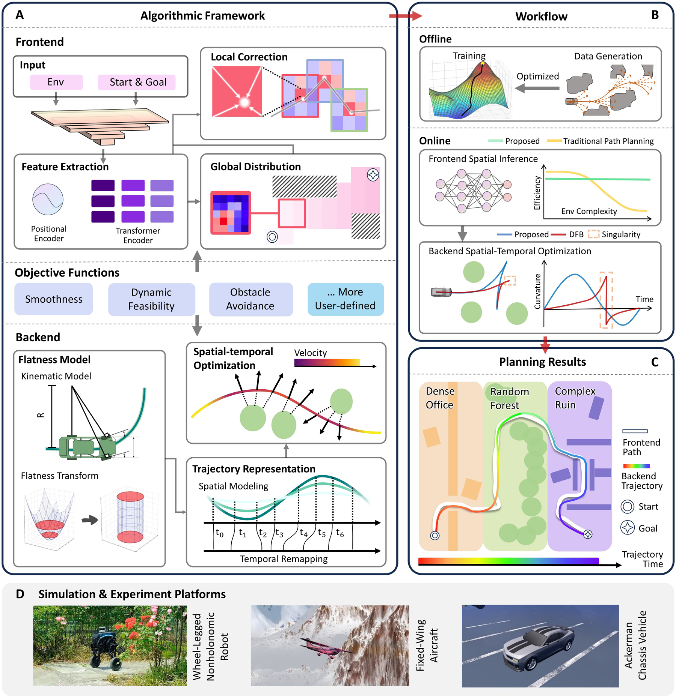
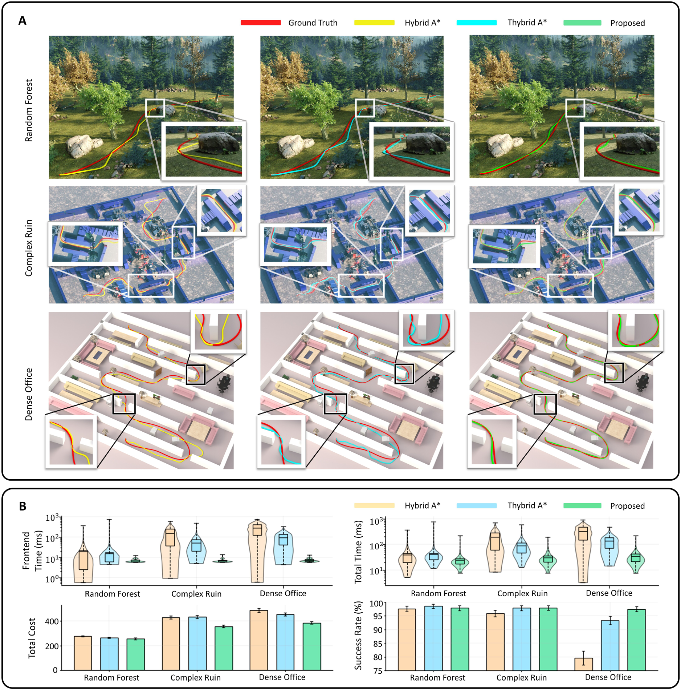
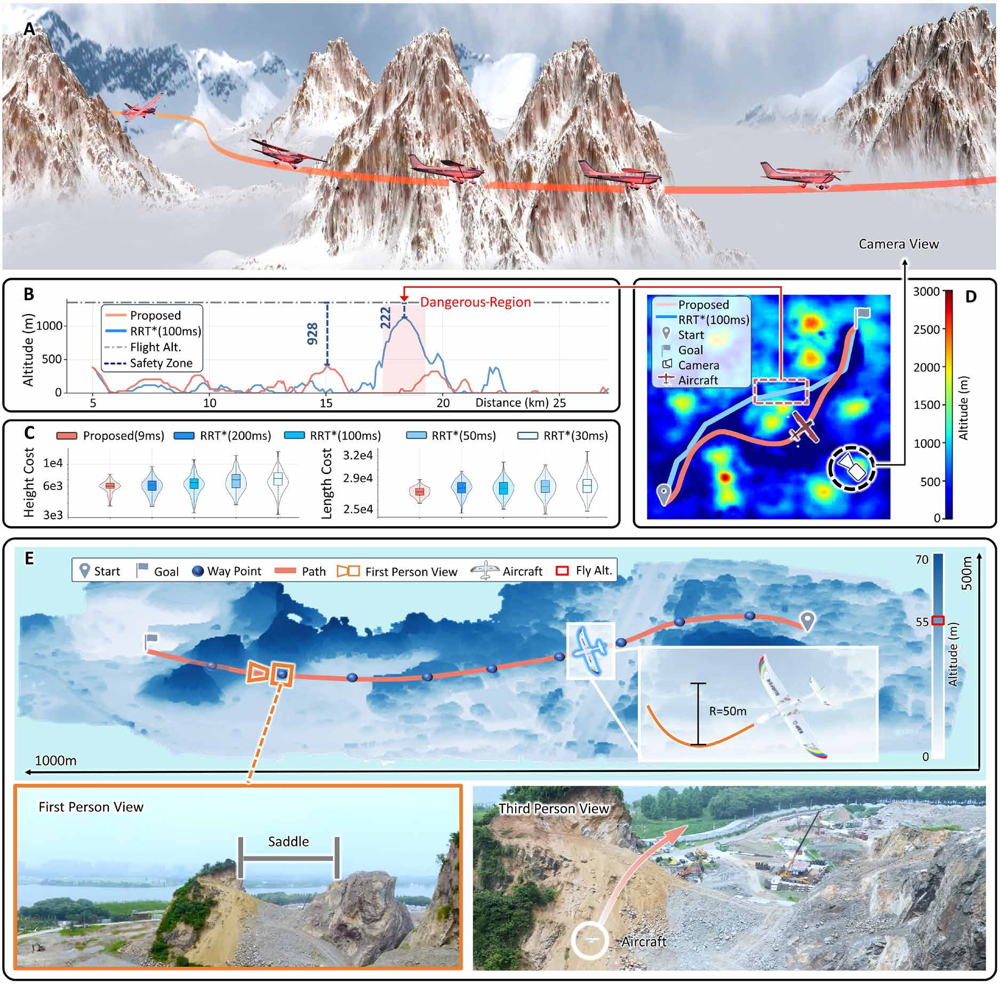
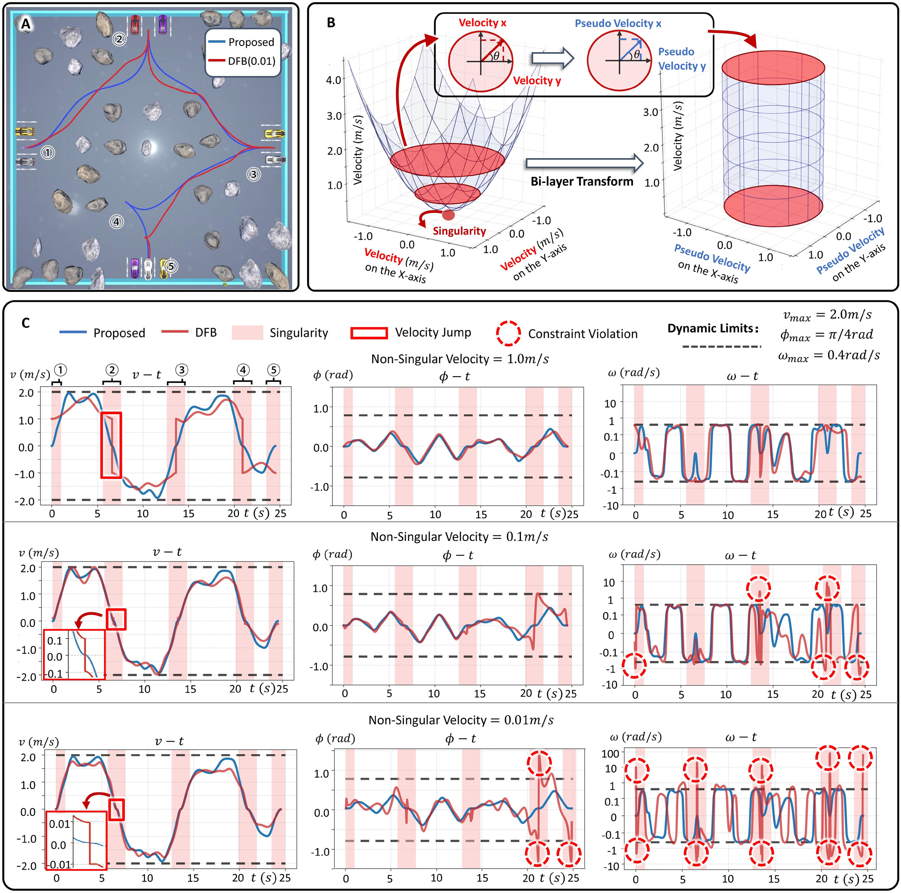
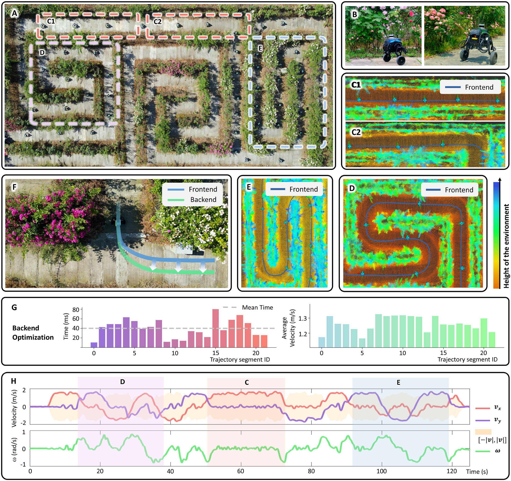
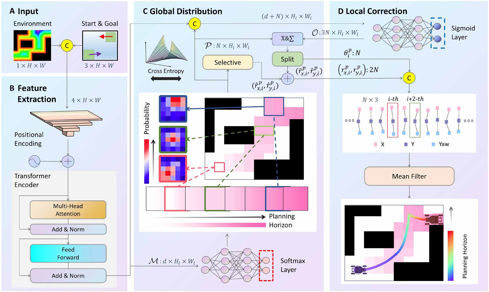
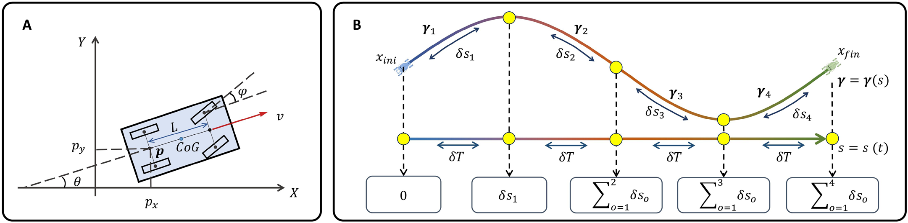

# 复杂环境下兼顾稳定性的车辆分层轨迹表征（Hierarchically Depicting Vehicle Trajectory with Stability in Complex Environments）：完整忠实学术翻译

> **原文标题**：Hierarchically Depicting Vehicle Trajectory with Stability in Complex Environments  
> **作者**：Zhichao Han, Mengze Tian, Zaitian Gongye, Donglai Xue, Jiaxi Xing, Qianhao Wang, Yuman Gao, Jingping Wang, Chao Xu, Fei Gao  
> **发表信息**：Science Robotics, 10, eads4551 (2025)  
> **原文 PDF**：[Hierarchically Depicting Vehicle Trajectory with Stability in Complex Environments.pdf](../Hierarchically Depicting Vehicle Trajectory with Stability in Complex Environments.pdf) ｜ **对应中文详解**：[20_复杂环境下兼顾稳定性的车辆分层轨迹表征.md](../中文详解/20_复杂环境下兼顾稳定性的车辆分层轨迹表征.md)  

---

## 原文第 1 页核心内容与翻译

Han et al., Sci. Robot. 10, eads4551 (2025)     18 June 2025
S c i e n c e R o b ot i c s | R e s e a r c h A r t i c l e
AU TO N O M O U S V E H I C L E S
Hierarchically depicting vehicle trajectory with stability 
in complex environments
Zhichao Han1,2†, Mengze Tian1†, Zaitian Gongye1, Donglai Xue2, Jiaxi Xing2, Qianhao Wang1,2, 
Yuman Gao1,2, Jingping Wang1,2, Chao Xu1,2, Fei Gao1,2*
自主机器人的快速发展带来了显著的社会和经济效益。然而，使机器人能够以类似人类的敏捷性在复杂环境中导航，仍然是一项艰巨挑战。与机器人不同，人类凭借更强的空间意识以及利用经验的能力，擅长寻找路径。受此启发，我们设计了一种神经网络来模拟人类直觉式的寻路能力，将全局环境信息与既往经验相结合，以识别可行通道。实验表明，与效率会在复杂场景中下降的传统算法不同，所提方法能够保持稳定的计算性能。为进一步提升运动质量，我们在平坦空间中引入了一种具有独特双层多项式轨迹表征的数值稳定时空轨迹优化器。该优化器利用微分平坦性提高效率，并从根本上消除原问题中的奇异性，即使在复杂机动场景中也能稳健地收敛到连续且可行的运动。经大规模迷宫实验验证，我们的分层运动规划器将前端路径规划与后端轨迹细化相结合，实现了稳健而高效的导航。我们预计，该规划器将推动机器人在复杂环境中的稳定导航，促进机器人自主化的发展。
## 引言
在不断演化的自然运动中，智慧生物展现出无与伦比的运动规划优雅性与效率。它们能够轻松、准确地穿越茂密森林或繁忙街道，体现了卓越的敏捷性和适应性（1–3）。相比之下，现代机器人在复杂环境中往往举步维艰。面对曲折复杂的障碍物，机器人可能迷失方向甚至完全停滞，暴露出实际部署能力的不足（4）。例如，拥挤城区中的配送机器人可能突然停止，或完全无法完成任务，从而削弱其可靠性和实用性。
### 从环境中直觉地描绘路径
人类与机器人导航能力的差异，源于人类更强的空间意识（5–7）。给定一张地图，即使年幼的儿童也能凭直觉描绘出从起点到终点的路线。人类善于借助直觉和经验提取环境关键特征，并迅速识别可行路径（8）。这种路径规划方式能够无缝适应不同场景，例如复杂建筑的布局或开放的运动场。相比之下，机器人依照预定义规则收集样本，试图理解环境连通性，随后再寻找路径（9）。这一过程对人类而言既费力又不自然。随着环境几何复杂度增加，机器人必须收集更多样本来理解场景，导致计算效率下降。因此，机器人需要费力拼接周围环境，而人类却能毫不费力地感知并导航；这凸显了运动规划能力的巨大差距，而这种差距源于人类先进的空间认知和经验利用能力。
受这些观察启发，我们使用神经网络模拟人类在起点与终点之间描绘曲线的过程，从而解决路径规划问题。该方法利用宏观环境信息和专家知识，高效描绘合理路径，不受环境几何复杂度的影响。我们方法的一个关键优势是时间稳定性，这显著增强了导航系统的可预测性与可靠性。
传统路径规划通常被表述为组合优化问题，算法一般从起点出发，通过迭代探索并采样低维构型空间来构建搜索树（10–17）。这类方法在复杂环境中往往表现不佳，产生大量无效采样，并增加计算和内存开销。此外，在狭窄环境中获得高质量解并保证完备性，通常需要提高状态空间分辨率，进而导致组合爆炸、时间稳定性下降以及实时性能受限。研究进展（18–25）表明，神经网络能够有效引导搜索或采样过程。然而，这些方法并未充分发挥神经网络的能力，因为它们从根本上仍依赖传统搜索或采样，使其性能天然易受环境复杂度影响，从而降低时间稳定性。相比之下，我们的模型直接从环境中提取初始引导路径，省去采样和搜索，实现近似恒定的推理时间。通过在图像域中统一路径规划，我们对地图尺度进行归一化并增强几何理解，从而更有效地避障。近期，一些研究利用生成模型（26）学习路径的空间分布，并将其应用于具身智能和任务规划（27、28）。然而，
1Institute of Cyber-­Systems and Control, College of Control Science and Engineer-
ing, Zhejiang University, Hangzhou, China. 2Huzhou Institute of Zhejiang University, 
Huzhou, China.
*Corresponding author. Email: fgaoaa@​zju.​edu.​cn
†These authors contributed equally to this work.
Copyright © 2025 The 
Authors, some rights 
reserved; exclusive 
licensee American 
Association for the 
Advancement of 
Science. No claim to 
original U.S. 
Government Works
Downloaded from https://www.science.org at The University of Newcastle-upon-Tyne on August 23, 2026

---

## 原文第 2 页核心内容与翻译

Han et al., Sci. Robot. 10, eads4551 (2025)     18 June 2025
S c i e n c e R o b ot i c s | R e s e a r c h A r t i c l e
这些方法所需的神经网络迭代推理会降低实时效率（29、30），因而限制计算资源受限的机载平台快速响应和重新规划的能力（31、32）。
### 将直觉路径精确优化为最优轨迹
在现实场景中，即使对人类而言，凭直觉在脑海中构想的路径也既不精确，也不一定满足运动学可行性，而是起到高层引导作用。在实际运动过程中，人类会频繁微调这些初步路线，以确保平稳且安全地导航。与既有研究（33、34）一致，我们假设人类导航遵循一种分层框架：先进行高层规划，再进行低层修正。例如，拉力赛车手会对预期行驶方向保持总体判断，例如预判在一段直行之后右转，这构成高层引导；随后，他们会进一步微调驾驶操作，以兼顾速度与安全性。
类似地，我们的神经网络充当高层路径规划器（前端），专注于确定近似的拓扑路线。前端生成的路径可能不够平滑或不具备完全可行性，所采用的运动学模型也相对粗略。为此，需要一个强大的轨迹优化模块（后端），在细致考虑系统高阶运动学约束的基础上，将前端生成的路径细化为空间—时间最优轨迹。然而，现有非完整车辆轨迹优化方法需要在效率、通用性和收敛稳定性之间权衡。由于非完整运动学的复杂性，大多数策略需要采用显著简化的运动范式（35、36）或离散运动过程（37–41）来维持算法效率。不过，为了在密集环境中保证更高的可执行性和成功概率，这些策略又需要进行精细离散化，从而损害规划过程的时间效率。在此前的研究中（42），我们使用最小能量轨迹表征（43）对平坦空间中的原始轨迹优化问题进行建模；大量实验表明，与传统离散运动方法相比，该方法具有显著的效率优势。然而，其基本原理存在奇异性，导致数值不稳定，使其在涉及复杂机动的场景中难以有效收敛到可行解。受该研究启发，我们采用微分平坦性实现高效求解。但不同于此前研究，我们引入辅助尺度变量，并专门设计了一种独特的双层分段多项式轨迹表征：以尺度参数化机器人的运动，并以时间参数化尺度变量。该创新在保证运动高阶连续性的同时，从数学上巧妙解决了原优化问题固有的奇异性问题，从而显著提高优化过程的数值稳定性。因此，我们的空间—时间优化能够在复杂场景中持续找到可行且高质量的轨迹，而基线方法则表现出数值不稳定和严重的约束违反。总体而言，如图 1 所示，我们将所提出的前端与后端结合起来，构建了一个学习增强的非完整车辆分层运动规划系统，在复杂环境中实现稳定的计算时间和优化收敛。
本研究主要关注 Ackermann 车辆等非完整地面机器人，也可扩展到包括固定翼飞行器在内的其他非完整平台，对不同环境和机器人系统具有很强适应性。大量仿真与对比表明，我们的深度路径规划模块使计算效率与环境复杂度解耦。轨迹优化器克服平坦模型奇异性，稳定收敛到满足高阶运动学约束的空间—时间最优解，而基线算法常出现数值不稳定并违反这些约束。
## 结果
### 实验概览与设置
为验证前端方法的效率和时间稳定性，我们使用 Ackermann 转向车辆在多种场景中开展实验，并与其他路径规划方法进行比较。结果表明，随着场景复杂度增加，与传统基线算法相比，我们的算法显著减少了计算时间，体现出其在各种规划问题中的稳健性。此外，我们使用后端轨迹优化细化各前端方法生成的路径。结果显示，与基线算法相比，我们的方法生成的初始路径只需很少的优化时间即可获得高质量轨迹，说明这些路径作为初始解时质量更高，也更有利于优化。我们还将路径规划方法扩展到固定翼飞行器，证明其能够依据环境高程图直接规划可行且安全的路径。在质量与效率的平衡方面，传统快速探索随机树星（RRT*）算法达到同等效果所需时间更长。随后，我们评估了所提出后端优化方法的数值稳定性，将其与近期基于平坦性的方法进行比较，并构造了需要车辆频繁前进和后退的复杂场景。结果表明，由于存在奇异性，基于平坦性的方法规划的轨迹不可避免地出现速度突变。此外，这些奇异性导致优化过程中数值不稳定，产生不能完全满足动力学约束的畸变轨迹。然而，所提出方法从根本上解决了平坦模型的奇异性问题，即使在复杂场景中也能规划出安全、完全平滑且满足动力学可行性的轨迹。最后，为验证规划器的实用性，我们将其部署于大规模室外迷宫场景。结果表明，机器人能够高效、安全地导航，并且对训练中未见过的障碍物和建图误差具有稳健性。在实现方面，我们在 NVIDIA RTX 4090 GPU 上训练网络，所有仿真测试则在配备 RTX 2060 GPU、Intel 10700 CPU 和 Ubuntu 20.04 操作系统的计算机上进行。
### 复杂环境中的时间稳定性
在该基准测试中，测试环境大小为 20 m × 20 m，分辨率为 0.1 m。为验证泛化能力，我们构建了如图 2A 所示的三种场景：(i) 随机森林：环境中存在约 60 个不规则障碍物
Downloaded from https://www.science.org at The University of Newcastle-upon-Tyne on August 23, 2026

---

## 原文第 3 页核心内容与翻译

Han 等，Sci. Robot. 10, eads4551 (2025)     2025 年 6 月 18 日
《Science Robotics》| 研究论文
（i）随机森林：环境中存在约 60 个不规则障碍物；（ii）密集办公室：环境中随机放置了墙壁，狭窄通道的宽度略大于机器人的尺寸；（iii）复杂废墟：机器人通常需要绕行才能到达目标。在每种场景中，我们随机生成 10,000 个环境；对于每个环境，采样 50 组起点和目标状态，以构造规划问题。对于每个问题，我们以高精度离散化构型空间，并搜索一条初始粗略曲线（44、45），再使用我们的轨迹优化方法对其进行细化。随后，我们沿每条轨迹均匀采样 200 个点，作为前端网络监督训练的真实值。
此外，我们确保对比实验所使用的环境在训练期间未曾出现。
我们将所提方法与经典的 Hybrid A*（11）以及近期提出的 THybrid A*（19）进行比较，后者将神经网络与搜索相结合。与所提方法类似，THybrid A* 使用 transformer（46）编码器从路径规划问题中提取特征。此外，我们还使用所提轨迹优化方法进一步优化所有前端算法生成的路径，以提升其质量。在每种场景中，我们测试了 1000 个此前未见过的案例，并绘制了前端算法生成的路径，如图 2A 所示。所提模型生成的

**图 1**：系统架构与平台细节。（A）算法框架：前端包括特征提取、全局分布和局部细化层。后端是基于微分平坦性的时空轨迹优化器，用于消除奇异性。（B）工作流程：将初始路径优化为真实值。在线推理生成一条粗略曲线，随后在空间和时间上对其进行优化，从而避免奇异性。（C）规划结果：在密集办公室、随机森林和复杂废墟环境中评估分层规划器。（D）平台：该规划器能够适配各种非完整平台。

Downloaded from https://www.science.org at The University of Newcastle-upon-Tyne on August 23, 2026

---

## 原文第 4 页核心内容与翻译

Han 等，Sci. Robot. 10, eads4551 (2025)     2025 年 6 月 18 日
《Science Robotics》| 研究论文
所提模型生成的路径比其他算法生成的路径更平滑，也更接近真实值。这是因为我们的算法无需搜索，而是直接利用真实值数据监督轨迹生成过程，从而模仿真实轨迹的行为。此外，我们定量分析了各种方法的计算时间、方差和成功率。鉴于最终轨迹优化算法的目标函数由能量损失和执行时间损失构成，我们还测量了这两项损失的均值，以评估最终输出轨迹的质量。前端计算时间、总规划时间、总体轨迹代价和成功率如图 2B 所示。更详细的指标汇总于表 1。
我们观察到，所提前端算法在各种环境中都保持了较高的成功率，并持续生成计算时间较短的路径。然而，随着环境变得更加复杂，其他算法的计算时间有所增加，原因在于它们缺乏整体理解能力，并且需要处理大量无关样本。尽管 THybrid A* 使用网络识别关键区域，但其本质上仍依赖离散状态空间搜索，在约束高度严格的环境中需要进行大量排列组合，从而降低了时间

**图 2**：各种复杂场景中的时间稳定性。（A）实验环境与规划结果。（B）使用小提琴图和柱状图进行指标比较。总时间是前端时间与后端时间之和。总损失是后端优化中的能量损失与时间损失之和。成功率根据优化后的轨迹是否避开障碍物确定：若轨迹避开障碍物，则该案例视为成功；否则视为失败。

Downloaded from https://www.science.org at The University of Newcastle-upon-Tyne on August 23, 2026

---

## 原文第 5 页核心内容与翻译

Han et al., Sci. Robot. 10, eads4551 (2025)     18 June 2025

稳定性。此外，如表 1 所示，即使在同一场景内，各搜索算法的计算时间也存在显著波动。这种不稳定性使性能预测更加困难，并影响整个导航系统的稳健性。实验结果还表明，在所有场景中，我们的算法始终需要最少的优化时间，并获得最高的轨迹质量。其主要原因在于，基线算法受到时间效率和内存限制，离散采样数量因而受限，导致构型空间表征不足，进而损害解的质量。

### 多用途自适应能力

我们验证了前端与另一种环境描述形式——地形高程图——的兼容性，并将其应用扩展到大规模固定翼导航任务。网络以地形高程图为输入，利用地形分析提升飞行安全性。仿真表明，我们的算法能够在 10 ms 内找到近似最优解；真实世界实验表明，该网络能够辅助固定翼飞行器安全飞行。

这里考虑一种常见场景：固定翼飞行器需要穿越山地和丘陵地形，最终到达给定高度上的目标状态，如图 3D 所示。为突出算法在该问题上的性能，我们将其与经典的基于采样的算法 RRT*（13）进行比较；理论上，在采样数量趋于无穷时，RRT* 可达到最优。考虑固定翼飞行器的最小转弯半径约束，我们将 RRT* 中两个状态之间的连接从直线段改为 Dubins 曲线（47、48）。在保证安全并避开潜在危险地形的前提下，我们希望固定翼飞行路径不仅平滑、短，而且在可能时选择高度更低或更平坦的地形，以获得更大的离地间隙。因此，我们使用两个指标衡量路径：长度代价，用于量化路径长度；高度代价，用于衡量地面高程。高度代价越小，表示路径经过的地形海拔越低，从而具有更大的相对离地间隙和更高的安全性。从这两个损失函数来看，所提模型直接生成的路径计算时间少于 10 ms，其质量与 RRT* 相当，而 RRT* 所需计算时间长一个数量级，如图 3C 所示。真实世界实验表明，神经网络生成的飞行路径能够作为有效航路点，引导固定翼飞行器无碰撞地穿越丘陵，如图 3E 所示。尤其是，该方法使固定翼平台能够平滑穿越山峰之间的鞍部，展现出其在复杂环境中导航的潜力。此外，真实世界固定翼实验的训练环境完全由合成数据构成。数据生成过程见补充结果中的“固定翼实验的补充信息”部分。

### 数值稳定的轨迹优化

尽管前端能够快速生成粗略路径，后端轨迹优化对于提升路径质量，以及确保其符合精确运动学模型和避碰要求，仍然至关重要。一些已有研究（42）利用微分平坦性简化轨迹优化问题，有效消除了运动方程约束，从而显著提高计算效率。然而，这种建模方法具有固有奇异性，无法保证约束的完全可行性。例如，如图 4B 所示，该方法依靠速度方向推断偏航角；当速度为零时，这一推断失效，并在求解过程中导致数值不稳定。相比之下，我们引入中间变量，对平坦模型进行平滑重映射，并设计了专用的轨迹表征。

**表 1**：不同场景中的定量基准。Model time 指神经网络的推理时间；Time ratio 表示各方法总时间相对于所提方法总时间的百分比。

| 场景 | 方法 | 搜索时间 (ms) | 模型时间 (ms) | 总时间 (ms) | 时间比 (%) | 时间方差 (ms²) | 优化时间 (ms) | 能量代价 | 时间代价 | 总代价 | 成功率 (%) |
|---|---|---:|---:|---:|---:|---:|---:|---:|---:|---:|---:|
| 稠密办公室 | Proposed | 0† | 7.193 | 7.193† | 100.0† | 1.755† | 27.68† | 58.32† | 326.3† | 384.6† | 97.5† |
| 稠密办公室 | Hybrid A* | 277.1 | 0 | 277.1 | 3852 | 31232 | 39.92 | 67.64 | 418.3 | 485.9 | 79.6 |
| 稠密办公室 | THybrid A* | 90.60 | 4.560† | 95.16 | 1323 | 4417 | 35.78 | 62.42 | 391.2 | 453.62 | 93.4 |
| 随机森林 | Proposed | 0† | 6.896 | 6.896† | 100.0† | 1.733† | 17.58† | 38.18† | 218.0† | 256.18† | 97.9 |
| 随机森林 | Hybrid A* | 18.98 | 0 | 18.98 | 275.2 | 1105 | 20.58 | 41.10 | 234.0 | 275.1 | 97.7 |
| 随机森林 | THybrid A* | 12.58 | 4.438† | 17.02 | 246.8 | 1201 | 19.91 | 39.20 | 223.8 | 263.0 | 98.6† |
| 复杂废墟 | Proposed | 0† | 6.830 | 6.830† | 100.0† | 1.389† | 24.00† | 53.37† | 302.3† | 355.67† | 98.0† |
| 复杂废墟 | Hybrid A* | 156.6 | 0 | 156.6 | 2293 | 16687 | 32.71 | 63.82 | 364.7 | 428.52 | 95.9 |
| 复杂废墟 | THybrid A* | 47.72 | 4.478† | 52.20 | 764.3 | 1822 | 30.62 | 65.24 | 367.5 | 432.74 | 97.9 |

†每个基准指标和场景中的最低值。

## 原文第 6 页核心内容与翻译

Han et al., Sci. Robot. 10, eads4551 (2025)     18 June 2025

该方法确保了高效优化，从根本上解决了这一问题，使系统能够在高度复杂的环境中稳定生成可行解。我们在涉及车辆多次前进和后退机动的挑战性场景中严格验证了轨迹优化算法，以突出其贡献。结果表明，与经过大量实验验证的强基线差分平坦（DFB）轨迹优化方法（42）相比，我们的算法具有更好的数值稳定性，并能稳健地生成可行解。

如图 4A 所示，测试环境模拟真实停车场景。车辆从指定起点出发，依次驶向预先设定且具有规定偏航角的中间点，最后倒车到指定终点。由图 4A 可见，奇异点导致 DFB 规划生成的轨迹更加曲折，而所提方法生成的轨迹明显更加平滑。为保证公平，两种方法的优化时间均设为 100 ms，并在所有方法中保持总轨迹时间和运动学约束不变。由于基线方法（42）在速度为零时会出现计算奇异性，我们在前进和后退过程中将速度固定为较小值（非奇异速度），并分析该参数的影响。我们给出了不同情况下速度 v、转向角 ϕ 和转向角速率 ω 随时间变化的曲线。

**图 3**：山地环境中的固定翼导航。（A）Unity3D 中固定翼飞行的可视化。（B）路径点处的地形高程。有限时间内由 RRT* 生成的路径并非最优，可能使固定翼飞行器过于贴近下方地形飞行，从而造成安全风险。（C）在不同计算时间下，从高度代价和长度代价方面对比我们的方法与 RRT*。（D）规划场景的地形高程图。（E）1000 m × 50 m 固定翼巡航实验。固定翼飞行器沿航路点飞行，避开飞行途中遇到的山峰。固定翼飞行器的最小转弯半径为 50 m，飞行高度为 55 m。实验使用 GPS 进行定位和导航。

## 原文第 7 页核心内容与翻译

Han et al., Sci. Robot. 10, eads4551 (2025)     18 June 2025

如图 4C 所示，这些曲线展示了不同情况下规划轨迹的速度 v、转向角 ϕ 和转向角速率 ω 随时间的变化，直观揭示了奇异性造成的数值不稳定。当非奇异速度为 0.1 m/s 时，轨迹的转向角速率约束无法严格满足；当非奇异速度为 0.01 m/s 时，转向角约束也被违反，高阶转向角速率超过约束一个数量级。尽管将非奇异速度设为 1.0 m/s 可以避免奇异性问题，但会在运动过程中引入不连续性，导致机械部件产生严重振动。相比之下，我们的方法始终表现出良好的数值稳定性，能够确保速度曲线平滑，并稳健收敛到满足动力学约束的解。

**图 4**：多次倒车场景中的数值稳定性。（A）规划轨迹的可视化。对于 DFB，前进和后退运动中的切换速度设为 0.01 m/s，以避免计算奇异性。（B）平坦空间中奇异点消除的可视化。变换前，当车辆速度为 0 m/s 时会出现奇异点，无法计算车辆航向角。通过采用我们的双层变换并引入伪速度，伪速度的幅值始终超过阈值，因此无论实际速度如何，都能恢复车辆航向角而不遇到奇异性。（C）我们的轨迹与 DFB 在不同参数下生成的轨迹之间的速度、转向角和转向角速率曲线对比。图中的黑色虚线表示动力学约束。

## 原文第 8 页核心内容与翻译

Han et al., Sci. Robot. 10, eads4551 (2025)     18 June 2025

轨迹的运动学不可行性或速度突变会妨碍低层控制器有效执行轨迹，导致跟踪误差增大和碰撞风险上升。为展示这一点，我们引入基于模型预测控制（MPC）的控制器测量该误差。根据补充结果“对比实验中的后端轨迹优化细节”部分提供的统计数据，与基线 DFB 相比，所提方法使最大位置跟踪误差降低 38.2%，最大角度跟踪误差降低 57.7%，从而提高了整个导航系统的可靠性和完整性。

### 大规模室外迷宫实验

所提系统完成了复杂环境中的大规模导航任务。图 5A 展示了一个面积约 50 m × 25 m、结构复杂且包含多个转角和蜿蜒通道的广阔迷宫区域。实验中，我们利用光探测与测距（LIDAR）构建了供系统规划使用的点云地图。系统快速、成功地完成前端路径规划，并以此引导实时后端优化，计算出考虑机器人非完整运动学的轨迹。如图 5B 所示，我们采用 Direct Drive 的 Diablo 作为实验平台。该平台搭载 NVIDIA Jetson Xavier 车载处理器，以及集成惯性测量单元（IMU）的 Ouster LIDAR，用于实时定位（49）。

我们测试了系统在复杂迷宫中快速规划轨迹的能力。图 5（C 至 E）展示了所提前端模型进行全局引导时的实时位置和姿态。Diablo 快速穿越迷宫中的横向蜿蜒通道（15 至 40 s）、笔直长走廊（50 至 70 s）和纵向蜿蜒通道（90 至 120 s），最终抵达目的地，总位移约 150 m。我们采用域随机化设计迷宫数据集，用于训练前端模型（50、51）；数据集包含 60,000 个迷宫环境，每个环境含 50 条路径。该模型直接部署在车载平台上，车载推理时间仅为 25 ms。我们将网络推理结果作为初值，应用后端轨迹优化方法进行实时细化。考虑到先前构建的地图与真实环境之间存在差异，且可能出现未知障碍物，仅依赖网络提供的概略引导可能导致不安全运动。如图 5F 所示，得益于快速后端优化，即使在高速运动中，机器人也能迅速避开此前未被考虑的障碍物。图 5G 表明，在资源受限的车载平台上，后端重规划平均耗时约 40 ms，每条重规划轨迹的平均速度为 1.3 m/s。

## 讨论

本研究提出了一种分层方法，将神经网络的空间提取能力与数值优化的稳健收敛能力相结合。这一互补系统能够在多种环境中高效、稳定地生成高质量轨迹，类似于人类先进行全局引导、再持续调整的直觉过程。

对于前端路径规划，我们设计了一种直接根据环境数据生成路径的神经网络，消除了大量采样的需要。图 2 所示的对比实验表明，即使在复杂环境中，所提方法也优于传统算法，具有更高的效率和稳定性。消融实验表明，与基线相比，我们在图像域中进行的网络建模使损失降低了 45%；详情见补充结果中的“关于网络架构的消融实验”部分。对于后端，我们设计了基于双层多项式的轨迹优化，将前端输出进一步细化为完全满足约束且平滑的轨迹。值得注意的是，我们的后端优化算法兼具基于平坦性方法的效率，并消除了奇异性以增强数值稳定性，确保即使在极端场景中也能可靠收敛到可行解。表 1 和图 4C 的实验分析表明，所提方法具有稳定而稳健的性能。

与基于学习的方法相比，传统算法具有分辨率完备性，即在分辨率足够高、充分考虑机器人的运动学尺寸并使用无限数量样本时，理论上能够保证找到最优可行解（13）。然而在实际应用中，海量样本会带来计算和内存负担，对高维构型空间进行搜索或采样还会导致组合爆炸。我们的学习方法确实缺乏完备性的理论证明，但实验表明，它在与训练集相似的环境中表现优异。在补充结果的“泛化性能测试”部分，我们在全新的环境中测试了模型；成功率下降约 20%，但在最坏情况下仍保持 76.5% 的成功率。这可能归因于网络能够提取与训练集相似的潜在特征，即使在陌生环境中也有望准确解读环境。

现实世界部署的主要挑战来自仿真与现实之间的域偏移。首先，与仿真中干净且确定性的条件不同，真实环境天然更加复杂、多样，通常存在传感器噪声、地图遮挡等不确定性。这些因素可能遮蔽或扭曲环境的真实几何结构，使规划器更难识别可行路径。此外，这类不确定性还可能以未预见的方式出现，使机器人的当前观测偏离训练分布，最终导致模型性能下降。其次，真实场景中可能出现意外边界情况：障碍物形状和结构的分布与仿真显著不同，使模型接触到训练期间未见过的地图配置，进一步降低性能。为缩小仿真到现实的差距，我们使用域随机化（51–53）扩充并多样化训练数据，从而增强网络的稳健性和泛化能力。此外，未来工作将着重开发保真度更高的场景仿真器（54），并引入多模态语义

## 原文第 9 页核心内容与翻译

Han et al., Sci. Robot. 10, eads4551 (2025)     18 June 2025
S c i e n c e R o b ot i c s | R e s e a r c h A r t i c l e
将信息输入规划器，以增强其环境理解能力和对不准确性的鲁棒性。

在应用中，我们的规划器以目标为导向，因此天然适合作为面向任务系统的基础模块。这一特性使其能够方便地集成到各种高层应用中，例如自主探索、精确跟踪以及复杂的搜索与救援任务。在这些应用中，目标点由决策模块提供，从而实现任务的无缝协调与执行。

所提出的方法也存在一些局限性。多个损失项的权重需要仔细调节，这一过程可能耗时较长。此外，我们的模型目前尚未考虑多模态特性。为减轻这一问题可能导致陷入不可行局部最优的风险，我们设计了以下策略。首先，通过高分辨率搜索或采样，并进一步进行后端优化，提高用于监督的真实数据的最优性。其次，在训练过程中，我们引入了任务特定的无监督

**图 5**：大规模室外迷宫实验。（A）展示 Diablo 穿越复杂迷宫的连续快照。（B）Diablo 的快照。（C）笔直长走廊。（D）横向蜿蜒迷宫。（E）纵向蜿蜒迷宫。（F）后端优化示意图。（G）轨迹优化结果柱状图。（H）机器人在迷宫导航过程中的状态。

Downloaded from https://www.science.org at The University of Newcastle-upon-Tyne on August 23, 2026

---

## 原文第 10 页核心内容与翻译

Han et al., Sci. Robot. 10, eads4551 (2025)     18 June 2025
S c i e n c e R o b ot i c s | R e s e a r c h A r t i c l e
损失项，例如非完整运动学损失和避障损失，引导路径远离局部最小值并进一步远离障碍物。第三，我们将方法设计为分层框架。所提出的高效且鲁棒的后端优化在大多数情况下都能将路径细化为高质量的可行轨迹。增强多模态性有助于更充分地探索解空间，从而改善全局最优性。一种有前景的改进方向是引入先进的生成模型（26、27、55）。然而，这些方法可能需要在生成质量与计算效率之间进行权衡，并且由于需要详细理解和建模数据分布，通常依赖充足的训练样本。人工智能（AI）领域和硬件方面的未来进展（56）有望解决这些问题，这也是我们今后的研究目标之一。
## 材料与方法
### 神经网络路径规划
#### 问题编码
基于学习的路径规划器输入导航起点和终点状态 (x1, xN)，以及大小为 H × W 的栅格环境 ε，并直接输出路径 p = {xp1, …, xpi, …, xpN}，该路径被序列化为多个状态点组成的序列。每个栅格的分辨率定义为 rs。路径中的每个状态点都与机器人的 SE(2) 状态相关联，包括其在二维（2D）空间中的位置和朝向角（57）。此外，ε 通常表示为欧氏符号距离场（ESDF）（58），其中每个元素表示该位置到障碍物的带符号距离。受文献（19）启发，我们采用起点-终点编码策略，在大小为 H × W 的张量上标记相应的区块。具体而言，将表示起点的区块赋值为 −1，将表示终点的区块赋值为 1，其余位置设为 0。为完整表示 SE(2) 空间，我们另外引入两个 H × W 张量，用于记录起点和终点位置处机器人朝向的余弦值与正弦值。其中一个张量表示对应起点和目标点区块的余弦值，另一个表示正弦值。具体来说，将上述环境表示与起点、终点的 SE(2) 状态表示拼接，形成图 6A 所示的 4 × H × W 张量，并将其作为网络输入。
#### 神经网络架构
我们的网络由三个主要组件组成：特征提取层（FEL）、全局分布层（GDL）和局部校正层（LCL），如图 6 所示。在实际应用中，直接在环境中定位特定状态点的位置具有挑战性且劳动量大（59）。因此，
受基于区域的卷积神经网络（R-CNN）（60）启发，我们的网络采用两阶段推理架构。首先，将 ε 均匀划分为 Hl × Wl 个区域候选框，每个候选框对应环境中大小为 H/Hl × W/Wl 的区块；每个候选框的中心点被指定为锚点。随后，使用 GDL 获取各状态点相对于区域候选框的概率分布，以估计点的粗略空间位置。接着，利用 LCL，根据环境特征和前一步得到的概率分布，进一步获得状态点的精确位置。直观而言，我们先近似确定每个状态点所在的区域候选框，再回归其相对于锚点的位置偏移，从而恢复该点的全局位置。
#### 计算流程
首先，图 6B 展示了 FEL 如何将路径规划问题编码到高维潜在空间中；潜在特征  被下采样为 d × Hl × Wl，以匹配区域候选框概率分布的形状。其中 d 表示用户定义的潜在特征维度。图 6C 展示了随后将  输入 GDL，得到路径上 N 个点在各区域候选框上的概率分布图 ，其大小为 N × Hl × Wl。第 i 个点属于第 (j, k) 个区域的概率记为 ϱi,j,k。显然，这些概率满足概率归一化原则
将概率分布  与潜在特征  拼接后输入 LCL，得到大小为 3N × Hl × Wl 的张量 ，如图 6D 所示。该张量为每个区域分配朝向角 bθi,j,k，以及相对于锚点的位置偏移 (bxi,j,k, byi,j,k)。直观地，可以从  中选取概率最高的区域，再从  中取得相应的位置偏移和朝向角，以准确恢复路径上任意点的 SE(2) 状态。然而，选择最高概率区域的操作不可微，会给训练带来困难。因此，我们基于  使用加权求和计算任意点的状态，从而实现可微化并促进有效训练。
其中，(rpx,i, rpy,i) 和 θpi 分别表示第 i 个状态点的位置和朝向角。r̂px,i 和 r̂py,i 表示基于概率分布  对锚点位置进行加权求和的结果。
Hl−1
∑
j=0
Wl−1
∑
k=0
ϱi,j,k = 1
(1)
rp
x,i =̂ rp
x,i +̃ rp
x,i
(2)̂
rp
x,i =
Hl−1
∑
j=0
Wl−1
∑
k=0
ϱi,j,k
(j+0.5)rs,̃ rp
x,i =
Hl−1
∑
j=0
Wl−1
∑
k=0
ϱi,j,kbx
i,j,k
rp
y,i =̂ rp
y,i +̃ rp
y,i
(3)̂
rp
y,i =
Hl−1
∑
j=0
Wl−1
∑
k=0
ϱi,j,k(k+0.5)rs,̃ rp
y,i =
Hl−1
∑
j=0
Wl−1
∑
k=0
ϱi,j,kby
i,j,k
θp
i =
Hl−1
∑
j=0
Wl−1
∑
k=0
ϱi,j,kbθ
i,j,k, ∀i ∈{1, … , N}
(4)
Downloaded from https://www.science.org at The University of Newcastle-upon-Tyne on August 23, 2026

---

## 原文第 11 页核心内容与翻译

Han et al., Sci. Robot. 10, eads4551 (2025)     18 June 2025
S c i e n c e R o b ot i c s | R e s e a r c h A r t i c l e
基于概率分布  对锚点位置进行加权计算，这也可以视为 GDL 的输出。为简便起见，
将由（r̂ᵖx,i，r̂ᵖy,i）组成的粗略路径定义为 p̂。另一方面，r̃ᵖx,i 和 r̃ᵖy,i 表示
基于  的位置偏移量加权和，其目的是修正 p̂ 并提升其整体质量，从而得到 p。此外，
为减小离群点的影响并提高平滑性，我们沿上述路径 p 使用滑动窗口对均值进行滤波。
如图 1 所示，我们希望规划出一条既能学习真实值行为策略，又能满足非完整运动和
避障基本约束的路径。因此，损失函数  由模仿真实值的监督项和单纯衡量路径有效性的
无监督项组成：

=wcece +wmsemse +wsmosmo +
wholhol +wcurcur +wuniuni +wobsobs
(5)

其中，w* 表示各损失对应的权重。这些定制的无监督损失项使网络能够更好地挖掘训练
数据中的潜在因果关系（61）。ce 表示锚点分类损失；由于 GDL 被建模为多分类问题，
ce 用于最大化包含真实点的区域概率。mse 是路径监督损失，用于约束输出路径各点
的 SE(2) 状态与相应真实值之间的均方误差。smo 表示用于增强规划路径平滑性的平滑
性损失。hol 表示非完整动力学损失，强调连接相邻点的直线方向与姿态角方向的一致性。
cur 表示曲率约束损失，对超过指定曲率阈值的情况进行惩罚。uni 表示均匀性损失，
用于促使路径上的点在空间中均匀分布，具体通过惩罚各点位置的方差实现。obs 表示避
障损失，用于惩罚与障碍物发生潜在碰撞。各损失的严格数学表达式及对应权重见补充结果
中“前端路径规划基准的参数和实验细节”部分。
### 双层轨迹优化
#### 微分平坦模型的重映射
微分平坦系统的特征是能够利用平坦输出及其有限阶导数的组合，以解析形式表示系统
状态。这里考虑如图 7A 所示的 Ackermann 运动学模型（62）。选取平坦输出
σ ≔(px，py)T，即后轮中心的位置。

**图 6**：前端架构。包含“C”的黄色圆圈表示拼接算子。(A) 网络输入。(B) FEL，
其中 Transformer 编码器提取高层特征。(C) GDL。该层根据环境几何结构推断路径
上的概率分布。选择模块根据概率分布  对锚点位置进行加权计算。(D) LCL。该层
根据预测分布生成路径的位置和偏航角。

Downloaded from https://www.science.org at The University of Newcastle-upon-Tyne on August 23, 2026

---

## 原文第 12 页核心内容与翻译

Han et al., Sci. Robot. 10, eads4551 (2025)     18 June 2025
S c i e n c e R o b ot i c s | R e s e a r c h A r t i c l e
车辆向前运动时机器人的其他高阶状态可表示如下：
其中，σ̇|t、σ̈|t 和 σ⃛|t 分别表示平坦输出关于时间的一阶、二阶和三阶导数。B ≔
[ 0 −1
1
0
]
表示为便于计算引入的辅助反对称矩阵。此外，v 表示相对于车辆车体坐标系的纵向
速度，a 表示纵向加速度，ϕ 表示前轮转角，ω 表示转向角速度，L 表示轴距。
尽管利用微分平坦性可以加快优化过程，但需要注意的是，当速度趋近于零时，式 7
和式 8 等状态可能出现奇异性。然而，我们引入伪弧来间接推导平坦模型，从根本上
消除奇异性问题：
其中，s ∈ ℝ+ 为伪弧。随后，基于尺度—时间映射，平坦输出的有限阶导数也可推导如下：
其中，γ̇|s、γ̈|s 和 γ⃛|s 分别表示平坦输出关于伪弧的一阶、二阶和三阶导数。特别地，
σ̇|t 表示机器人的实际运动速度，γ̇|s 定义为伪速度。此外，ṡ|t ≥ 0 的物理意义是
沿伪弧方向的速度大小。
将式 10 至式 12 代入式 6 至式 8，从而修改微分平坦模型。以 ϕ 和 ω 为例，二者
重新定义如下：
当机器人速度为零时，可以将 ṡ|t 设为零，同时保持伪速度 γ̇|s 非零。因此，式 13
和式 14 的分母严格为正，从而消除原有奇异点。下面将详细说明基于双层分段多项式
的 σ(t) = γ(s(t)) 参数形式。
#### 基于双层多项式的轨迹表征
为确保具有足够的自由度和光滑性，我们对 γ(s) 和 s(t) 使用分段多项式进行参数化，从而建立一个紧凑的非线性优化问题。
我们将轨迹 γ(s) 构造为 M 段、次数 D = 2u − 1 的多项式，其参数为
其参数分别为与每一段对应的伪弧 δs = (δs1, … , δsM)T ∈ℝM，以及系数矩阵 cp = ((cp1)T, … , (cpM)T)T ∈ℝ2Mu×2。
其中，u 表示控制维度。同样，伪弧 s(t) 表示为一维、时间均匀的 M 段多项式，
由每段时间间隔 δT 和系数矩阵参数化。
cs = ((cs1)T, … , (csM)T)T ∈ℝ2Mu。此外，我们要求双层分段多项式的各段严格对应，即对于每个时间间隔 δT，机器人都应遍历对应的伪弧：
v = ‖̇σ∣t‖2, θ = arctan2̇σy∣t,̇ σx∣t
(6)
a =̈
σT
∣ṫσ∣t
‖̇σ∣t‖2
, ϕ = arctan
̈σT
∣tḂσ∣tL
‖̇σ∣t‖3
2
(7)
ω = L⃛
σT
∣tḂσ∣t‖̇σ∣t‖3
2 −3̈σT
∣tḂσ∣ẗσT
∣ṫσ∣t‖̇σ∣t‖2
‖̇σ∣t‖6
2 +
̈
σT
∣tḂσ∣tL
2
(8)
σ = γ(s), s = s(t)
(9)̇
σ∣t =̇ γ∣ṡs∣t
(10)̈
σ∣t =̇ γ∣s̈s∣t +̇ s2
∣ẗγ∣s
(11)⃛
σ∣t =⃛s∣ṫγ∣s + 3̇s∣ẗγ∣s̈s∣t +̇ s3
∣t⃛γ∣s
(12)
ϕ = arctan
̈γT
∣sḂγ∣sL
‖̇γ∣s‖3
2
(13)
ω = L⃛
γT
∣sḂγ∣s‖̇γ∣s‖3
2 −3̈γT
∣sḂγ∣s̈γT
∣ṡγ∣s‖̇γ∣s‖2
‖̇γ∣s‖6
2 +
̈
γT
∣sḂγ∣sL
2̇
s∣t
(14)
s(i∗δT) =
i∑
j=1
δsj, ∀i ∈{1, 2, 3, … , M}
(15)

**图 7**：后端机制。(A) Ackermann 车辆模型。(B) 双层轨迹表征的可视化。平坦输出
γ 表示为由伪弧 s 参数化的分段多项式。同样，伪弧 s 也表示为由时间 t 参数化的分段多项式。

Downloaded from https://www.science.org at The University of Newcastle-upon-Tyne on August 23, 2026

---

## 原文第 13 页核心内容与翻译

Han et al., Sci. Robot. 10, eads4551 (2025)     18 June 2025
S c i e n c e R o b ot i c s | R e s e a r c h A r t i c l e
基于上述建模，γ 的第 i 段 γi 表示如下：
其中，β(x) ≔(1，x，x²，…，xᴺ)T 表示自然基函数。此外，由于双层多项式各段
之间严格对应，可以由式 15 进一步得到下式：
其中，s1(0) 设为 0。此外，M 段多项式 γ 可表示为：
为便于直观理解，我们将双层多项式的轨迹表征可视化，如图 7B 所示。在运动可行性
约束下，基于式 13 和式 14 的修正平坦模型并加入一阶时间正则化，最小控制努力问题
被表述为如下非线性约束优化问题：
约束条件如下：
其中，ρ ∈ℝ+ 表示用户定义的时间正则化项权重，用于限制总时长 Ts。
式 20 是边界条件，表示轨迹的初始状态和最终状态约束。式 21 是分段多项式连接处的连续性约束。式 22 是为避免奇异性而引入的最小伪速度约束，其中 α 为阈值。式 23 是伪速度的正定约束。 包含轨迹规划问题中通常考虑的不等式约束，包括动力学可行性约束和避障约束。为求解该约束非线性优化问题，我们采用轨迹的最小能量条件（43），将原问题重新表述为式 19 至式 24，并在不牺牲最优性的情况下消除式 20 和式 21 中的等式约束。随后，我们采用增广拉格朗日乘子法（63）松弛式 22 至式 24 中的不等式约束。该方法在使用高效的有限记忆 Broyden-Fletcher-Goldfarb-Shanno 算法（64）求解近似无约束问题的同时，迭代更新对偶变量。此外，为提高求解效率和精度，我们解析推导了目标函数及约束关于优化变量的梯度。
详细求解过程见补充方法中的“梯度反向传播链轨迹优化”一节。
### 统计分析
我们采用多种统计可视化方法评估并比较实验结果：箱线图和小提琴图（图 2B 和图 3C）、
折线图（图 3B 和图 4C）以及柱状图（图 2B 和图 5G）。小提琴图与箱线图叠加显示，
以同时呈现各组的详细分布和汇总统计量。小提琴图通过核密度估计表示数据的概率密度，
宽度表示不同数值水平处的数据集中程度。折线图用于展示关键变量随时间的变化。柱状图
显示不同条件下的平均性能。图 2B 中的竖直误差条表示均值的 95% 置信区间（CI）。
计算 CI 时，我们先计算标准误（SEM），再采用标准正态近似估计 95% CI：
其中 α = 0.05，z1−α/2 ≈ 1.96。x 为样本均值，s 为样本标准差，n = 1000 为样本量。
## 补充材料
PDF 文件包括：
方法
结果
表 S1 至 S6
图 S1 至 S9
讨论
影片 S1 至 S5 的图注
参考文献（65–70）
本稿的其他补充材料包括：
影片 S1 至 S5
## 参考文献与注释
	 1.	 E. A. Capaldi, G. E. Robinson, S. E. Fahrbach, Neuroethology of spatial learning: The birds
and the bees. Annu. Rev. Psychol. 50, 651–682 (1999).
	 2.	 K. M. I. Chu, S. H. Seto, I. N. Beloozerova, V. Marlinski, Strategies for obstacle avoidance
during walking in the cat. J. Neurophysiol. 118, 817–831 (2017).
	 3.	 J. Wiener, S. Shettleworth, V. P. Bingman, K. Cheng, S. Healy, L. F. Jacobs, K. J. Jeffery,
H. A. Mallot, R. Menzel, N. S. Newcombe, “Animal navigation: A synthesis” in Animal 
Thinking: Contemporary Issues in Comparative Cognition (MIT Press, 2011), pp. 51–76.
	 4.	 R. Alterovitz, S. Koenig, M. Likhachev, Robot planning in the real world: Research
challenges and opportunities. AI Mag. 37, 76–84 (2016).
γi
(si
)≔(cp
i
)Tβ
(
si −
i−1
∑
j=1
δsj
)
si(t)≔(cs
i
)Tβ(t), ∀t ∈[0, δT]
(16)
si(0) ≔
i−1
∑
j=1
δsj, si(δT) ≔si(0) + δsi
(17)
σ(t)=γ(s(t))=γi(s(t)), s(t)=si(t −(i−1)∗δT),
t ∈[
(i−1)∗δT, i∗δT]
(18)
min
cp,cs,δs,δT ∈ℝ+J =
Ts
∫
0
σ(u)
∣t (t)Tσ(u)
∣t (t)dt + ρTs
(19)

(
σ∣t(0) … σ(u−1)
∣t
(0), σ∣t
(Ts
) … σ(u−1)
∣t
(Ts
))
=0
(20)
(γ1 … γM, s1 … , sM, δs, δT) = 0
(21)
‖̇γs(s(t))‖2 > α
(22)̇
s∣t(t) ≥0
(23)

(
γ(s(t)), … , γ(u)
∣s (s(t)), s(t), … , s(u)
∣t (t)
)
≺0
(24)
P
x −z1−α∕2 ⋅s
√
n
≤μ≤x +z1−α∕2 ⋅s
√
n
= 1 −α
(25)
Downloaded from https://www.science.org at The University of Newcastle-upon-Tyne on August 23, 2026

---

## 原文第 14 页核心内容与翻译

Han et al., Sci. Robot. 10, eads4551 (2025)     18 June 2025
S c i e n c e R o b ot i c s | R e s e a r c h A r t i c l e
5.	 C. D. Harvey, F. Collman, D. A. Dombeck, D. W. Tank, Intracellular dynamics of
hippocampal place cells during virtual navigation. Nature 461, 941–946 (2009).
	 6.	 M. I. Sereno, R.-­S. Huang, A human parietal face area contains aligned head-­centered
visual and tactile maps. Nat. Neurosci. 9, 1337–1343 (2006).
	 7.	 B. A. Wandell, S. O. Dumoulin, A. A. Brewer, Visual field maps in human cortex. Neuron 56,
366–383 (2007).
	 8.	 A. D. Ekstrom, S. Y. Bookheimer, Spatial and temporal episodic memory retrieval
recruit dissociable functional networks in the human brain. Learn. Mem. 14, 645–654 
(2007).
	 9.	 S. K. Debnath, R. Omar, N. B. A. Latip, S. Shely, E. Nadira, C. K. N. C. K. Melor,
T. K. Chakraborty, E. Natarajan, A review on graph search algorithms for optimal energy 
efficient path planning for an unmanned air vehicle. Indones. J. Electr. Eng. Comput. Sci. 
15, 743–749 (2019).
	10.	 A.Bry, N. Roy, “Rapidly-­exploring random belief trees for motion planning under
uncertainty,” in Proceedings of the IEEE International Conference on Robotics and 
Automation (IEEE, 2011), pp. 723–730.
	11.	 D. Dolgov, S. Thrun, M. Montemerlo, J. Diebel, Path planning for autonomous vehicles in
unknown semi-­structured environments. Int. J. Robot. Res. 29, 485–501 (2010).
	12.	 J. D. Gammell, S. S. Srinivasa, T. D. Barfoot, “Informed RRT*: Optimal sampling-­based path
planning focused via direct sampling of an admissible ellipsoidal heuristic,” in Proceedings 
of the IEEE/RSJ International Conference on Intelligent Robots and Systems (IEEE, 2014),  
pp. 2997–3004.
	13.	 S. Karaman, E. Frazzoli, Sampling-­based algorithms for optimal motion planning. Int. J.
Robot. Res. 30, 846–894 (2011).
	14.	 R. Pepy, A. Lambert, H. Mounier, “Path planning using a dynamic vehicle model,” in 2006
2nd International Conference on Information & Communication Technologies (IEEE, 2006), 
vol. 1, pp. 781–786.
	15.	 M. Phillips, M. Likhachev, “Sipp: Safe interval path planning for dynamic environments,”
in 2011 IEEE International Conference on Robotics and Automation (ICRA) (IEEE, 2011),  
pp. 5628–5635.
	16.	 Z. Ren, S. Rathinam, M. Likhachev, H. Choset, Multi-­objective safe-­interval path planning
with dynamic obstacles. IEEE Robot. Autom. Lett. 7, 8154–8161 (2022).
	17.	 D. J. Webb, J. van den Berg, “Kinodynamic RRT*: Asymptotically optimal motion planning
for robots with linear dynamics,” in 2013 IEEE International Conference on Robotics and 
Automation (IEEE, 2013), pp. 5054–5061.
	18.	 J. Huh, D. D. Lee, V. Isler, “Learning continuous cost-­to-­go functions for non-­holonomic
systems,” in 2021 IEEE/RSJ International Conference on Intelligent Robots and Systems (IROS) 
(IEEE, 2011), pp. 5772–5779.
	19.	 J. J. Johnson, U. S. Kalra, A. Bhatia, L. Li, A. H. Qureshi, M. C. Yip, Motion planning
transformers: A motion planning framework for mobile robots. arXiv:2106.02791 [cs.RO] 
(2021).
	20.	 J. J. Johnson, L. Li, F. Liu, A. H. Qureshi, M. C. Yip, “Dynamically constrained motion
planning networks for non-­holonomic robots,” in 2020 IEEE/RSJ International Conference 
on Intelligent Robots and Systems (IROS) (IEEE, 2020), pp. 6937–6943.
	21.	 D. Kim, K. Huh, Neural motion planning for autonomous parking. Int. J. Control Autom.
Syst. 21, 1309–1318 (2023).
	22.	 L. Li, Y. Miao, A. H. Qureshi, M. C. Yip, Mpc-­mpnet: Model-­predictive motion planning
networks for fast, near-­optimal planning under kinodynamic constraints. IEEE Robot. 
Autom. Lett. 6, 4496–4503 (2021).
	23.	 A. H. Qureshi, A. Simeonov, M. J. Bency, M. C. Yip, “Motion planning networks,”
in 2019 International Conference on Robotics and Automation (ICRA) (IEEE, 2019),  
pp. 2118–2124.
	24.	 J. Wang, X. Jia, T. Zhang, N. Ma, M. Q.-­H. Meng, Deep neural network enhanced
sampling-­based path planning in 3D space. IEEE Trans Autom Sci Eng 19, 3434–3443 
(2022).
	25.	 R. Yonetani, T. Taniai, M. Barekatain, M. Nishimura, A. Kanezaki, “Path planning using
Neural A* search,” in Proceedings of the 38th International Conference on Machine Learning 
(MLResearchPress, 2021), pp. 12029–12039.
	26.	 J. Ho, A. Jain, P. Abbeel, “Denoising diffusion probabilistic models,” in Advances in Neural
Information Processing Systems 33 (NeurIPS 2020), H. Larochelle, M. Ranzato, R. Hadsell,  
M. F. Balcan, H. Lin, Eds. (Curran Associates, 2020), pp. 6840–6851.
	27.	 C. Chi, Z. Xu, S. Feng, E. Cousineau, Y. Du, B. Burchfiel, R. Tedrake, S. Song, Diffusion policy:
Visuomotor policy learning via action diffusion. Intl. J. Robot. Res., 
10.1177/02783649241273668 (2024).
	28.	 S. Huang, Z. Wang, P. Li, B. Jia, T. Liu, Y. Zhu, W. Liang, S.-­C. Zhu, “Diffusion-­based
generation, optimization, and planning in 3D scenes,” in 2023 IEEE/CVF  
Conference on Computer Vision and Pattern Recognition (CVPR) (IEEE, 2023),  
pp. 16750–16761.
	29.	 J. Carvalho, A. T. Le, M. Baierl, D. Koert, J. Peters, “Motion planning diffusion:
Learning and planning of robot motions with diffusion models,” in 2023 IEEE/RSJ 
International Conference on Intelligent Robots and Systems (IROS) (IEEE, 2023),  
pp. 1916–1923.
30.	 J. Liu, M. Stamatopoulou, D. Kanoulas, “Dipper: Diffusion-­based 2D path planner applied
on legged robots,” in 2024 IEEE International Conference on Robotics and Automation (ICRA) 
(IEEE, 2024), pp. 9264–9270.
	31.	 G. Zhao, T. Wu, Y. Chen, F. Gao, Learning speed adaptation for flight in clutter. IEEE Robot.
Autom. Lett. 9, 7222–7229 (2024).
	32.	 X. Zhou, Z. Wang, H. Ye, C. Xu, F. Gao, EGO-­planner: An ESDF-­free gradient-­based local
planner for quadrotors. IEEE Robot. Autom. Lett. 6, 478–485 (2021).
	33.	 A. D. Ekstrom, P. F. Hill, Spatial navigation and memory: A review of the similarities and
differences relevant to brain models and age. Neuron 111, 1037–1049 (2023).
	34.	 A. D. Ekstrom, E. A. Isham, Human spatial navigation: Representations across dimensions
and scales. Curr. Opin. Behav. Sci. 17, 84–89 (2017).
	35.	 W. Ding, L. Zhang, J. Chen, S. Shen, Safe trajectory generation for complex urban
environments using spatio-­temporal semantic corridor. IEEE Robot. Autom. Lett. 4, 
2997–3004 (2019).
	36.	 W. Lim, S. Lee, M. Sunwoo, K. Jo, Hybrid trajectory planning for autonomous driving in
on-­road dynamic scenarios. IEEE Trans. Intell. Transp. Syst. 22, 341–355 (2019).
	37.	 K. Bergman, D. Axehill, “Combining homotopy methods and numerical optimal control to
solve motion planning problems,” in 2018 IEEE Intelligent Vehicles Symposium (IV) (IEEE, 
2018), pp. 347–354.
	38.	 B. Li, Z. Shao, A unified motion planning method for parking an autonomous vehicle in
the presence of irregularly placed obstacles. Knowl. Based Syst. 86, 11–20 (2015).
	39.	 S. Shi, Y. Xiong, J. Chen, C. Xiong, A bilevel optimal motion planning (BOMP) model with
application to autonomous parking. Int. J. Intell. Robot. Appl. 3, 370–382 (2019).
	40.	 C. Sun, Q. Li, B. Li, L. Li, A successive linearization in feasible set algorithm for vehicle
motion planning in unstructured and low-­speed scenarios. IEEE Trans. Intell. Transp. Syst. 
23, 3724–3736 (2021).
	41.	 X. Zhang, A. Liniger, A. Sakai, F. Borrelli, “Autonomous parking using optimization-­based
collision avoidance,” in 2018 IEEE Conference on Decision and Control (CDC) (IEEE, 2018), 
pp. 4327–4332.
	42.	 Z. Han, Y. Wu, T. Li, L. Zhang, L. Pei, L. Xu, C. Li, C. Ma, C. Xu, S. Shen, F. Gao, An efficient
spatial-­temporal trajectory planner for autonomous vehicles in unstructured 
environments. IEEE Trans. Intell. Transp. Syst. 25, 1797–1814 (2024).
	43.	 Z. Wang, X. Zhou, C. Xu, F. Gao, Geometrically constrained trajectory optimization for
multicopters. IEEE Trans. Robot. 38, 3259–3278 (2022).
	44.	 B. J. Cohen, S. Chitta, M. Likhachev, “Search-­based planning for manipulation with motion
primitives,” in 2010 IEEE International Conference on Robotics and Automation (IEEE, 2010), 
pp. 2902–2908.
	45.	 M. Pivtoraiko, A. Kelly, “Kinodynamic motion planning with state lattice motion
primitives,” in 2011 IEEE/RSJ International Conference on Intelligent Robots and Systems 
(IEEE, 2011), pp. 2172–2179.
	46.	 A. Vaswani, N. Shazeer, N. Parmar, J. Uszkoreit, L. Jones, A. N. Gomez, Ł. Kaiser,
I. Polosukhin, “Attention is all you need,” in Advances in Neural Information Processing 
Systems 30 (NIPS 2017), I. Guyon, U. Von Luxburg, S. Bengio, H. Wallach, R. Fergus,  
S. Vishwanathan, R. Garnett, Eds. (Curran Associates, 2017).
	47.	 I. Lugo-­Cárdenas, G. Flores, S. Salazar, R. Lozano, “Dubins path generation for a fixed wing
UAV,” in 2014 International Conference on Unmanned Aircraft Systems (ICUAS) (IEEE, 2014), 
pp. 339–346.
	48.	 J. Reeds, L. Shepp, Optimal paths for a car that goes both forwards and backwards. Pac.
J. Math. 145, 367–393 (1990).
	49.	 W. Xu, Y. Cai, D. He, J. Lin, F. Zhang, FAST-­LIO2: Fast direct LiDAR-­inertial odometry. IEEE
Trans. Robot. 38, 2053–2073 (2022).
	50.	 J. B. Kruskal Jr., On the shortest spanning subtree of a graph and the traveling salesman
problem. Proc. Am. Math. Soc. 7, 48–50 (1956).
	51.	 J. Tobin, R. Fong, A. Ray, J. Schneider, W. Zaremba, P. Abbeel, “Domain randomization for
transferring deep neural networks from simulation to the real world,” in 2017 IEEE/RSJ 
International Conference on Intelligent Robots and Systems (IROS) (IEEE, 2017), pp. 23–30.
	52.	 T. Miki, J. Lee, J. Hwangbo, L. Wellhausen, V. Koltun, M. Hutter, Learning robust perceptive
locomotion for quadrupedal robots in the wild. Sci. Robot. 7, eabk2822 (2022).
	53.	 Y. Song, A. Romero, M. Müller, V. Koltun, D. Scaramuzza, Reaching the limit in
autonomous racing: Optimal control versus reinforcement learning. Sci. Robot. 8, 
eadg1462 (2023).
	54.	 M. Savva, A. Kadian, O. Maksymets, Y. Zhao, E. Wijmans, B. Jain, J. Straub, J. Liu, V. Koltun,
J. Malik, D. Parikh, D. Batra, “Habitat: A platform for embodied AI research,” in Proceedings 
of the IEEE/CVF International Conference on Computer Vision (ICCV) (IEEE, 2019).
	55.	 J. Song, C. Meng, S. Ermon, Denoising diffusion implicit models. arXiv:2010.02502 [cs.LG]
(2020).
	56.	 G. Moore, Cramming more components onto integrated circuits (1965).
	57.	 R. M. Murray, Z. Li, S. Shankar Sastry, A Mathematical Introduction to Robotic Manipulation
(CRC Press, 2017).
	58.	 L. Han, F. Gao, B. Zhou, S. Shen, “Fiesta: Fast incremental euclidean distance fields for
online motion planning of aerial robots,” in 2019 IEEE/RSJ International Conference on 
Intelligent Robots and Systems (IROS) (IEEE, 2019), pp. 4423–4430.
Downloaded from https://www.science.org at The University of Newcastle-upon-Tyne on August 23, 2026

---

## 原文第 15 页核心内容与翻译

Han et al., Sci. Robot. 10, eads4551 (2025)     18 June 2025
S c i e n c e R o b ot i c s | R e s e a r c h A r t i c l e
59.	 K. He, X. Zhang, S. Ren, J. Sun, “Deep residual learning for image recognition,” in
Proceedings of the IEEE Conference on Computer Vision and Pattern Recognition (IEEE, 2016), 
pp. 770–778.
	60.	 R. Girshick, J. Donahue, T. Darrell, J. Malik, “Rich feature hierarchies for accurate object
detection and semantic segmentation,” in Proceedings of the IEEE Conference on Computer 
Vision and Pattern Recognition (IEEE, 2014), pp. 580–587.
	61.	 F. Yang, C. Wang, C. Cadena, M. Hutter, iPlanner: Imperative path planning.
arXiv:2302.11434 [cs.RO] (2023).
	62.	 M. Tanelli, M. Corno, S. Saveresi, Modelling, Simulation and Control of Two-­Wheeled Vehicles
(John Wiley & Sons, 2014).
	63.	 R. Tyrrell Rockafellar, Augmented lagrange multiplier functions and duality in nonconvex
programming. SIAM J. Control 12, 268–285 (1974).
	64.	 D. C. Liu, J. Nocedal, On the limited memory BFGS method for large scale optimization.
Math. Program. 45, 503–528 (1989).
	65.	 P. Gabrovšek, Analysis of maze generating algorithms. IPSI Trans. Internet Res. 15, 23–30
(2019).
	66.	 P. H. Kim, “Intelligent maze generation,” thesis, Ohio State University, Columbus, OH
(2019).
	67.	 A. Kozlova, J. A. Brown, E. Reading, “Examination of representational expression in maze
generation algorithms,” in 2015 IEEE Conference on Computational Intelligence and Games 
(CIG) (IEEE, 2015), pp. 532–533.
	68.	 Z. Wang, A. C. Bovik, H. R. Sheikh, E. P. Simoncelli, Image quality assessment: From error
visibility to structural similarity. IEEE Trans. Image Process. 13, 600–612 (2004).
	69.	 T. A. Driscoll, L. N. Trefethen, Schwarz-­Christoffel Mapping (Cambridge Univ. Press, 2002).
	70.	 J. Lee, J. Hwangbo, L. Wellhausen, V. Koltun, M. Hutter, Learning quadrupedal locomotion
over challenging terrain. Sci. Robot. 5, eabc5986 (2020).
致谢：感谢 C. Feng 对网络结构设计的见解以及对环境与路径表征的讨论。他的反馈为我们提供了宝贵帮助。感谢 T. Wu 对稿件提出的宝贵建议。衷心感谢 FASTLAB 的 L. Xu、R. Zhang、G. Xu、M. Wang、M. Zhang 及其他同学，他们协助完成了室外实验。
资助：本工作得到国家自然科学基金（资助号 62322314）、国家重点研发计划（资助号 2023YFB4706600）及 HUAWEI Application Innovation Lab 的支持。作者贡献：Z.H. 参与前端和后端的设计与实现，参与稿件撰写并开展实验；M.T. 参与前端设计与实现，设计迷宫实验和固定翼导航，并参与部分稿件撰写；
designed the maze experiment and fixed-­wing navigation, and contributed in the partial 
manuscript writing. Z.G. and D.X. were involved in the maze experiment and provided 
consultation. J.X. fine-­tuned the fixed-­wing experiments. Q.W. was involved in developing the 
localization module for the maze experiment and offered input. Y.G. was engaged in graphic 
design and lent his guidance. J.W. designed the visualization of the benchmark in the front 
end. C.X. provided people and sites for experimental testing. F.G. supervised the research, 
provided financial support, offered crucial advice on software and system debugging, and 
修订稿件。利益冲突：作者声明不存在利益冲突。数据和材料可用性：论文中的数据和源代码见
are available at https://doi.org/10.5281/zenodo.14288814 and https://github.com/
ZJU-­FAST-­Lab/DPtraj.
Submitted 15 August 2024 
Accepted 23 May 2025 
Published 18 June 2025 
10.1126/scirobotics.ads4551
Downloaded from https://www.science.org at The University of Newcastle-upon-Tyne on August 23, 2026

---

## 原文第 16 页核心内容与翻译

Hierarchically depicting vehicle trajectory with stability in complex environments
Zhichao Han, Mengze Tian, Zaitian Gongye, Donglai Xue, Jiaxi Xing, Qianhao Wang, Yuman Gao, Jingping Wang, Chao
Xu, and Fei Gao
Sci. Robot. 10 (103), eads4551.  DOI: 10.1126/scirobotics.ads4551
View the article online
https://www.science.org/doi/10.1126/scirobotics.ads4551
Permissions
https://www.science.org/help/reprints-and-permissions
Use of this article is subject to the Terms of service
Science Robotics (ISSN 2470-9476) is published by the American Association for the Advancement of Science. 1200 New York Avenue
NW, Washington, DC 20005. The title Science Robotics is a registered trademark of AAAS.
Copyright © 2025 The Authors, some rights reserved; exclusive licensee American Association for the Advancement of Science. No claim
to original U.S. Government Works
Downloaded from https://www.science.org at The University of Newcastle-upon-Tyne on August 23, 2026

---
