# 考虑碰撞冲击的缆绳悬挂载荷无人机规划与控制（Impact-Aware Planning and Control for Aerial Robots With Suspended Payloads）：完整忠实学术翻译

> **原文标题**：Impact-Aware Planning and Control for Aerial Robots With Suspended Payloads  
> **作者**：Haokun Wang, Haojia Li, Boyu Zhou, Fei Gao, and Shaojie Shen  
> **发表信息**：IEEE TRANSACTIONS ON ROBOTICS, VOL. 40, 2024  
> **原文 PDF**：[Impact-Aware Planning and Control for Aerial Robots With Suspended Payloads.pdf](../Impact-Aware Planning and Control for Aerial Robots With Suspended Payloads.pdf) ｜ **对应中文详解**：[21_考虑碰撞冲击的缆绳悬挂载荷无人机规划与控制.md](../中文详解/21_考虑碰撞冲击的缆绳悬挂载荷无人机规划与控制.md)  

---

## 原文第 1 页核心内容与翻译

考虑碰撞冲击的缆绳悬挂载荷无人机规划与控制
Haokun Wang，IEEE 学生会员；Haojia Li，IEEE 学生会员；Boyu Zhou；Fei Gao，IEEE 会员；以及 Shaojie Shen
**摘要**——带缆绳悬挂载荷的四旋翼无人机在考虑冲击的规划与控制方面面临巨大挑战。该组合系统根据缆绳是否松弛而呈现两种运动模式，并具有复杂动力学。因此，在保持缆绳可伸缩特性的同时生成可行且敏捷的飞行轨迹，仍是一项具有挑战性的任务。本文提出一种新的考虑冲击的规划与控制框架，用于处理运动模式切换可能引起的冲击。我们利用增广拉格朗日方法求解带非线性互补约束的优化问题，在保持效率的同时以较高精度保证轨迹可行性；进一步提出混合非线性模型预测控制方法，以处理敏捷飞行中的模型失配问题。仿真和实验结果对所提方法进行了全面验证，显示出优于现有方法的性能。据我们所知，这是首次在真实实验中成功实现空中载荷系统多次运动模式自动切换。**

**索引词**——空中系统：应用；智能交通系统；运动与路径规划；运动控制。

**符号说明**
Q, L, W
四旋翼坐标系、载荷坐标系和世界坐标系。
ex, ey, ez ∈R3
世界坐标系各轴方向上的单位向量。
xB, yB, zB ∈R3
四旋翼坐标系各轴方向上的单位向量。
稿件于 2023 年 10 月 17 日收到；2024 年 2 月 25 日修回；2024 年 3 月 5 日接受。出版日期为 2024 年 3 月 25 日；当前版本日期为 2024 年 4 月 12 日。经审阅者意见评估，本文由客座副编辑 Alessandro Saccon 和编辑 P. Robuffo Giordano 推荐发表。本工作部分得到 Research Grants Council General Research Fund（RGC GRF）项目 RMGS20EG20、HKUST-DJI Joint Innovation Laboratory 以及国家自然科学基金会项目（资助号 62322314）的支持。（Haokun Wang 和 Haojia Li 对本文贡献相同。）（通信作者：Fei Gao；Boyu Zhou。）
Haokun Wang、Haojia Li 和 Shaojie Shen 就职于 Cheng Kar-Shun Robotics Institute, The Hong Kong University of Science and Technology, Hong Kong（电子邮箱：hwangeh@connect.ust.hk；hlied@connect.ust.hk；eeshao-jie@ust.hk）。
Boyu Zhou 就职于 School of Artificial Intelligence, Sun Yat-Sen University, Zhuhai 519082, China（电子邮箱：zhouby23@mail.sysu.edu.cn）。
Fei Gao 就职于 Institute of Cyber-Systems and Control, College of Control Science and Engineering, Zhejiang University, Hangzhou 310027, China，同时就职于 Huzhou Institute, Zhejiang University, Huzhou 313000, China（电子邮箱：fgaoaa@zju.edu.cn）。
视频补充材料见 https://sites.google.com/view/suspended-payload/。
本文包含作者提供的可下载补充材料，见 https://doi.org/10.1109/TRO.2024.3381555。
数字对象唯一标识符（DOI）：10.1109/TRO.2024.3381555
xQ, xL ∈R3
四旋翼和载荷的位置。
vQ, vL ∈R3
四旋翼和载荷的线速度。
RQ ∈R3
四旋翼的姿态。
ωQ ∈R3
四旋翼的机体系角速度。
mQ, mL ∈R
四旋翼和载荷的质量。
rQ, rL ∈R
四旋翼和载荷的安全裕度半径。
˜p ∈R3
从四旋翼指向载荷的向量。
p ∈S2
沿 ˜p 方向的单位向量。
˙p ∈R3
向量 p 关于时间的一阶导数。
l ∈R
四旋翼与载荷之间的距离。
l0 ∈R
缆绳长度。
f, fT ∈R
四旋翼推力和缆绳张力。
**引言**

带悬挂载荷的空中机器人在物流、运输、灾害救援等场景中发挥着重要作用。如图 1 所示，这类系统的一个独特之处在于敏捷飞行时具有两种运动模式。具体而言，可伸缩缆绳使系统能够根据缆绳处于绷紧还是松弛状态，在两种动力学模式之间运行（图 2）。利用悬挂载荷系统的模式切换很有吸引力，因为这使机器人能够在复杂、狭窄的空间中执行运输任务。例如，系统可以利用自身特点穿过狭窄窗口和难以到达的区域，辅助灭火与侦察任务。通过在松弛模式和绷紧模式之间平滑切换，这类机器人能够提高救援作业的效率与安全性。
然而，生成具有混合模式的可行且实用轨迹面临两项重大挑战。首先，由于机器人具有两种运动模式，需要使用两个独立的子系统动力学模型描述系统动力学；两套动力学描述的存在会显著增加可行规划和实际控制的复杂度。其次，两个子系统之间切换所产生的潜在冲击会破坏机器人状态的一致性。因此，需要设计一种简洁的系统动力学描述，有效捕捉复杂的模式切换行为。另一方面，考虑冲击的规划与控制方法对于生成可行轨迹并确保混合运动模式下的精确轨迹跟踪同样不可或缺。
1941-0468 © 2024 IEEE。允许个人使用，但再发表或再分发须获得 IEEE 许可。更多信息见 https://www.ieee.org/publications/rights/index.html。
授权许可使用范围仅限于 National Institute of Technology- Delhi。2026 年 8 月 24 日 05:46:40（UTC）从 IEEE Xplore 下载。适用相关限制。

---

## 原文第 2 页核心内容与翻译

WANG 等：考虑碰撞冲击的缆绳悬挂载荷无人机规划与控制
2479

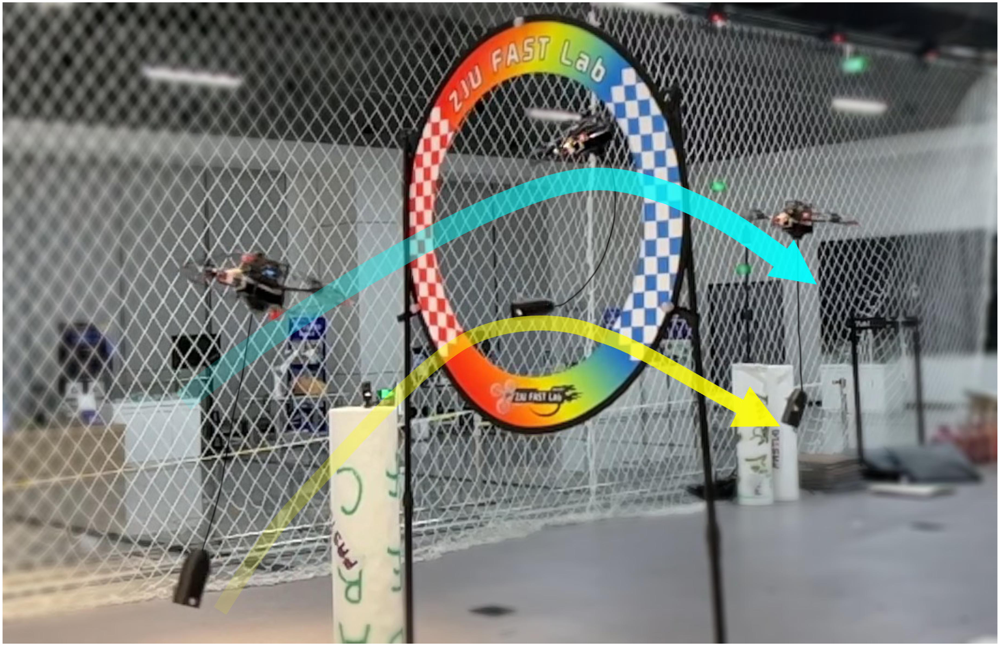

**图 1**：带缆绳悬挂载荷的四旋翼成功穿过狭窄的圆形门，展示了悬挂载荷系统中自然发生的运动模式切换。

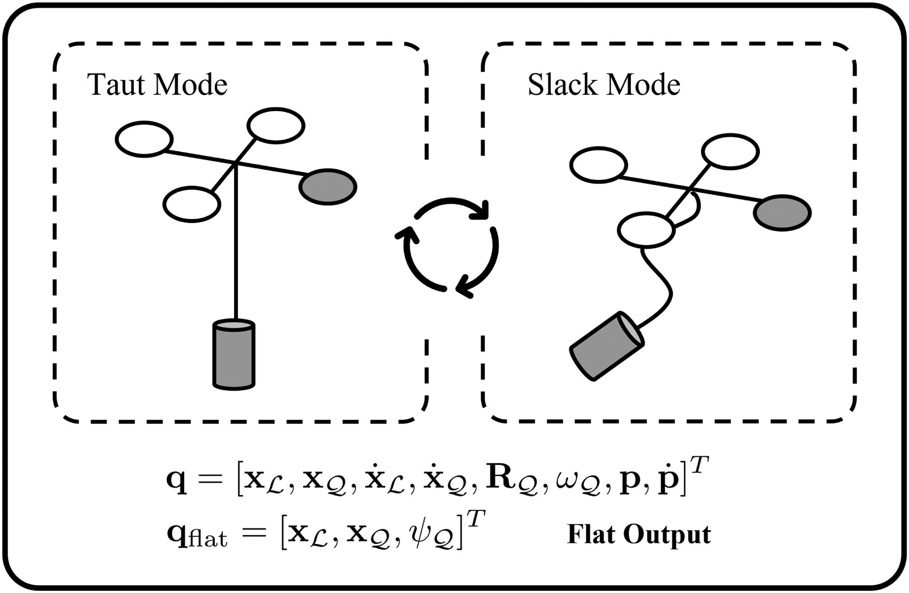

**图 2**：系统两种运动模式的示意图；图中给出了适用于两种模式的微分平坦输出。

因此，考虑冲击的规划与控制方法对于生成可行轨迹并确保混合运动模式下的精确轨迹跟踪至关重要。
建立统一而简洁的缆绳悬挂载荷系统动力学模型，是实现模式自动切换敏捷飞行的关键。已有工作提出利用平滑过渡函数，将当前子系统的平坦输出映射到后续子系统 [1]。然而，该方法存在两点不足：首先，难以通过轨迹规划约束机器人的行为 [2]；其次，轨迹规划与运动模式分配彼此独立 [3]。相比之下，带互补约束的统一动力学模型能够同时优化轨迹和运动模式分配。但已有方法过度简化了与机器人运动一致性相关的系统状态和控制输入约束，从而限制了轨迹的可行性与实用性 [4], [5]。
为解决保持机器人状态一致性并避免潜在非连续冲击这一难题，我们首先观察图 3 所示的理想轨迹。潜在冲击总是发生在模式切换时刻。更准确地说，当悬挂载荷系统从松弛模式切换到绷紧模式时，缆绳张力会急剧增大。因此，四旋翼会受到隐式非弹性碰撞，甚至可能坠毁。
基于上述观察，悬挂载荷系统要实现可行的敏捷飞行，需要满足两个基本特征。1）一致性：具有多种运动模式的可行轨迹必须保持状态连续性，尤其是在模式转换期间。2）紧凑性：理想的规划算法应同时优化轨迹和运动模式分配。此外，模式分配应由机器人自主确定，以最小化一般代价，例如能耗。一致性可确保机器人避免因状态突变而产生不可行状态；紧凑性则能在保持机器人较大可行域的同时避免冗余的模式切换。
在我们的考虑冲击框架中，采用多个分段多项式参数化，在不损失效率的情况下保持轨迹的内在一致性。用于选择特定模式的非线性互补约束，以及必要的状态和输入约束，被纳入一个紧凑的优化问题表述中。该问题是带非线性互补约束的优化问题（ONCC）。从实用性的角度出发，我们强调优化问题目标函数的简洁性和紧凑性。通过考虑严格且必要的约束来保证轨迹可行性，从而使运动模式自动转换。
尽管 ONCC 的形式紧凑，互补约束违反了若干基本约束资格（CQ）假设，例如 Mangasarian–Fromovitz CQ（MFCQ），这已在多项研究中讨论 [6], [7]。因此，许多常用的优化求解器（如 SNOPT [8] 和 Ipopt [9]）无法以足够的精度和效率获得轨迹 [6]。为克服这一挑战，我们提出一种面向悬挂载荷系统的高效考虑冲击的规划算法。该算法利用 Lewis and Overton 线搜索方法 [13] 以及有限内存 Broyden-Fletcher-Goldfarb-Shanno（L-BFGS）拟牛顿方法 [14]，对 Powell–Hestenes–Rockafellar 增广拉格朗日方法（ALM）[10], [11], [12] 进行了新颖实现。该线搜索方法使算法能够在保持效率的同时，于内层循环中求解非凸且部分非光滑的无约束优化问题；我们的实现还保留了框架外层循环中对偶变量的解析更新，以保持精度。
此外，实际飞行中同样需要考虑冲击的控制策略。尽管模型预测控制（MPC）方法已在悬挂载荷系统中表现出优异性能 [15], [16], [17]，但避免模式切换引起的冲击仍然具有挑战性。MPC 方法显著的控制效果依赖于准确的模型描述 [18], [19], [20]。系统动力学失配
授权许可使用范围仅限于 National Institute of Technology- Delhi。2026 年 8 月 24 日 05:46:40（UTC）从 IEEE Xplore 下载。适用相关限制。

---

## 原文第 3 页核心内容与翻译

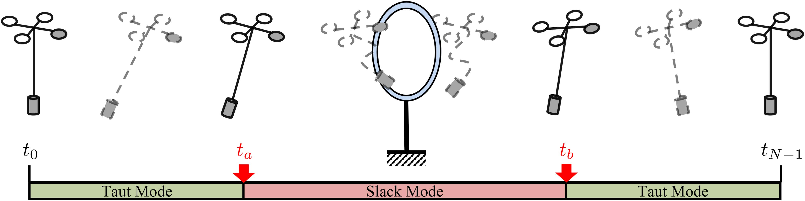

**图 3**：带缆绳悬挂载荷的四旋翼发生模式切换的轨迹。机器人需要无碰撞地穿过狭窄门洞。机器人具有两种运动模式：1）缆绳绷紧时，四旋翼与载荷作为一个整体运动；2）缆绳松弛时，载荷独立于四旋翼运动。模式切换时刻以红色标出。在运动的第一阶段（图左侧），缆绳绷紧，系统作为一个整体运动；穿过门洞时缆绳松弛；通过门洞后缆绳再次绷紧，使两个子系统重新耦合。

系统在模式转换点会出现巨大的跟踪误差。然而，仅考虑单一模型的常规 MPC 方法，在悬挂载荷系统发生模式转换的时刻存在固有的模型失配问题。我们提出混合非线性 MPC（HNMPC）方法来解决这一问题。HNMPC 使用离散切换变量，准确区分子系统动力学以匹配悬挂载荷系统的实际性能。
这使得模式转换附近的过大跟踪误差得以避免。

总之，本文为缆绳悬挂载荷四旋翼的可行、实用敏捷飞行提出了系统化解决方案。主要贡献如下。

1. 提出碰撞感知规划方法，以紧凑形式处理优化问题，并自动生成具有混合模式的可行轨迹（见第 IV 节）。
2. 设计混合非线性 MPC 方法解决模型失配问题（见第 V 节）。结果表明，该方法能在实际场景中显著降低控制误差，并在实验测试中防止悬挂系统灾难性故障。
3. 在仿真和实物实验中全面验证规划框架与控制器。据我们所知，本文首次在真实环境中成功实现自动模式切换飞行（见第 VI 节）。
4. 将代码开源，便于社区进一步验证和拓展相关工作。1

## II. 相关工作

本节回顾带缆绳悬挂载荷空中机器人的规划与控制研究。
需要指出的是，紧凑的悬挂载荷系统动力学描述、碰撞感知规划方法和鲁棒控制器，是实现实用飞行的必要条件。1（开源代码见 https://github.com/HKUST-Aerial-Robotics/IMPACTOR。）
### A. 带悬挂载荷空中机器人的混合系统动力学

Sreenath 等人 [1]、[2] 首先研究了缆绳悬挂载荷四旋翼的微分平坦性。缆绳有松弛和绷紧两种状态，因此系统在两种状态下的微分平坦输出不同。他们通过定义两个转换映射描述不同动力学模型之间的系统状态切换。已有工作 [4]、[5] 将互补约束引入轨迹优化模型，以紧凑形式构建多模式统一动力学模型，但无法在无需预先指定模式序列或添加张力惩罚项等额外操作的情况下自动切换模式。

我们利用互补约束提出统一系统动力学模型。与 [4]、[5] 的主要区别有两点：第一，采用多个多项式分段而非离散机器人状态，以保持轨迹的自然一致性；第二，将必要的状态-输入约束以 ONCC 的紧凑形式纳入模型。这两点对于混合模式轨迹的可行性和实用性都至关重要。

### B. 碰撞感知轨迹规划

当机器人与环境建立或解除接触 [21]、[22]、[23]，或子系统动力学发生切换时，通常会产生碰撞。例如，悬挂重载的缆绳由松弛变为绷紧，多指机器人手的指尖与被操纵物体表面建立或解除接触，以及双足机器人连续行走时周期性地与地面相互作用。已有工作 [21]、[22]、[23]、[24] 深入研究了操作和运动等接触动力学任务。

互补约束能以紧凑形式表达模式切换及接触的建立和解除。将含有多种动力学模式或环境接触的机器人运动规划问题建模为 ONCC 是自然的。然而，互补约束通常违反 MFCQ [7]，许多数值优化算法处理此类退化问题时无法保证收敛。已有工作 [4]、[21]、[24] 使用 SQP 求解 ONCC，并在双足机器人和缆绳悬挂载荷四旋翼轨迹规划中取得良好结果。ALM 在处理退化优化问题时具有良好鲁棒性 [6]、[25]、[26]。理论分析 [25]、[26] 表明，ALM 的收敛性仅依赖弱 CQ。SQP 与 ALM 原理相似，但后者具有更好的全局收敛保证 [7]。本文结合多项式参数化与最小控制 effort 理论 [27]，提出保留 ALM 框架的优化方法，实现准确优化并加快求解。

### C. 悬挂载荷系统的碰撞感知控制

由于存在混合模式，设计碰撞感知控制方法仍极具挑战。已有控制器 [28]、[29]、[30] 旨在最小化载荷摆角以实现稳定，但往往限制载荷运动范围，从而限制高速敏捷机动能力。一些几何控制器 [2]、[31] 基于 Lie 群建立无坐标动力学模型，采用由期望载荷位置确定载荷角、再由载荷角确定四旋翼姿态的级联结构，因而无法同时有效控制四旋翼和载荷。直接用于跟踪同时包含绷紧和松弛模式的轨迹可能并不合适。NMPC 工作 [15]、[16]、[17] 未考虑松弛模式。Crousaz 等人 [32]、[33] 给出了出色仿真，但线性化模型无法保证精度，且没有真实四旋翼验证。

本文的碰撞感知控制方法解决了以自然混合运动模式飞行的关键挑战。我们提出 HNMPC 区分双重系统动力学，以匹配机器人实际性能；该方法保留 MPC 在复杂场景中的预测性能，并提高混合模式轨迹跟踪的鲁棒性。

## III. 预备知识

本节给出缆绳悬挂载荷四旋翼的统一、紧凑动力学模型（见 III-A 节），随后介绍碰撞感知轨迹优化问题的基本形式（见 III-B 节）。

### A. 系统动力学

缆绳悬挂载荷四旋翼具有两种运动模式，每种模式都需要独立的子系统动力学模型。预先建立统一、紧凑的动力学模型，是生成可行实用轨迹的必要条件。使用互补约束表示自然模式切换有两个优点：不需要预先确定模式序列，还能在轨迹规划中约束机器人行为 [4]。其互补约束为：

$$f_T(t) \ge 0$$

$$l_0-l(t) \ge 0$$

$$f_T(t)(l_0-l(t))=0$$

其中，$l(t)$ 表示时刻 $t$ 四旋翼与载荷之间的距离，$f_T(t)$ 表示缆绳张力。等式表明系统在时刻 $t$ 只能处于一种模式：张力为零时为松弛模式，距离等于缆绳长度 $l_0$ 时为绷紧模式。

如图 2 所示，无论系统处于绷紧还是松弛模式，选取 $q_{flat}=[x_L,x_Q,\psi_Q]$ 作为平坦输出。因此运动方程为：

$$f_T=\left\|m_L(\ddot{x}_L+g e_z)\right\|$$

$$\tilde p=x_L-x_Q$$

$$l=\left\|\tilde p\right\|=\left\|x_L-x_Q\right\|$$

$$p=\frac{\tilde p}{\left\|\tilde p\right\|}$$

$$z_B=\frac{m_Q(\ddot{x}_Q+g e_z)-f_Tp}{\left\|m_Q(\ddot{x}_Q+g e_z)-f_Tp\right\|}=\frac{1}{f}(m_Q(\ddot{x}_Q+g e_z)-f_Tp)$$

## 原文第 5 页核心内容与翻译

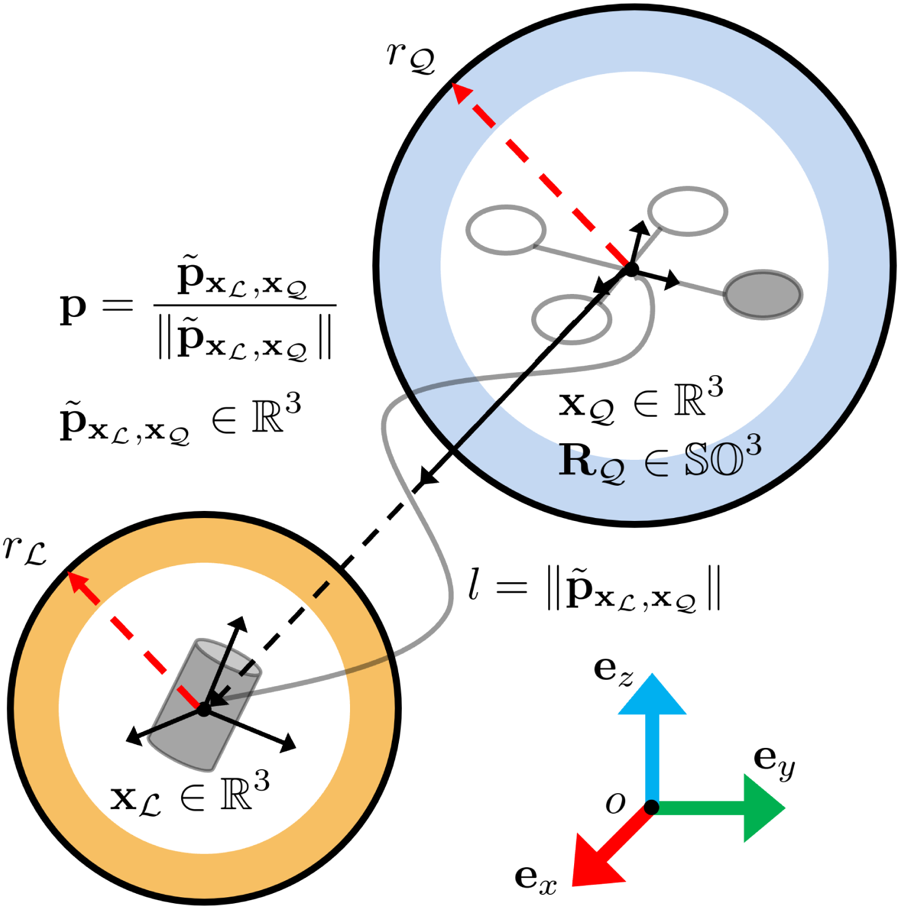

**图 4**：带缆绳悬挂载荷四旋翼的状态变量。这些状态变量用于描述悬挂载荷系统的动力学建模与控制。

\[
y_B=\frac{z_B\times x_C}{\|z_B\times x_C\|},\quad x_C=[\cos\psi,\sin\psi,0]^T \tag{9}
\]
\[
x_B=y_B\times z_B. \tag{10}
\]

在松弛模式下，载荷的运动遵循抛体模型。同时，利用 [34] 提出的微分平坦性，根据四旋翼位置 $x_Q$、偏航角 $\phi_Q$ 及其导数，可以计算包括角速度在内的四旋翼状态。因此，在松弛模式下，本文式 (8) 与 [34, (3)] 完全等价。在张紧模式下，利用 [1, Lemma 1] 推导四旋翼状态。首先，根据载荷位置 $x_L$ 及其相应导数计算四旋翼位置 $x_Q$ 及其导数；随后，像松弛模式一样，结合四旋翼位置 $x_Q$、偏航角 $\phi_Q$ 及其导数，计算完整的四旋翼状态。系统状态变量如图 4 所示。附录 A 以角速度为例，详细说明如何从平坦输出推导系统状态。

悬挂载荷系统的平坦性减少了轨迹规划中的决策变量数量，提高了优化效率。此外，紧凑的动力学模型是 HNMPC（见第 V 节）的关键组成部分，使我们能够准确预测悬挂载荷系统的行为，并在具有挑战性的场景中实现鲁棒控制。

### B. 轨迹优化问题
在考虑冲击的轨迹规划中，考虑如下一般约束优化问题：
\[
\min_{x=[w,T]}J(x),\quad \text{s.t. }g(q^{[k]}(t))\le0,\quad h(q^{[k]}(t))=0,\quad \forall t\in[0,\|T\|_1]. \tag{11}
\]
其中，$J:\mathbb R^s\to\mathbb R$ 为目标函数。决策变量 $x$ 的维度为 $s=N\times(M+1)+M$，其中 $N$ 和 $M$ 分别为机器人构型空间维度和轨迹段数。决策变量由两部分组成：1）所有轨迹段的端点 $w=[w_0^T,w_1^T,\ldots,w_M]^T\in\mathbb R^{N\times(M+1)}$；2）所有轨迹段的时间分配 $T=[\tau_0,\tau_1,\ldots,\tau_{M-1}]^T\in\mathbb R_{>0}^M$。函数 $g:\mathbb R^{N\times(k+1)}\to\mathbb R^I$ 和 $h:\mathbb R^{N\times(k+1)}\to\mathbb R^E$ 分别表示不等式约束和等式约束，$I$ 和 $E$ 分别表示约束总数。时刻 $t$ 的全部约束由系统状态的有限阶导数计算得到，记为
\[
q^{[k]}(t)=[q^T(t),\dot q^T(t),\ldots,q^{(k)T}(t)]^T. \tag{12}
\]
$M$ 段轨迹 $q$ 的第 $i$ 段表示为 $(2k-1)$ 次多项式：
\[
q_i(t)=c_i\phi(t-t_{i-1}),\quad t\in[t_{i-1},t_i]. \tag{13}
\]
其中 $c_i\in\mathbb R^{N\times2\tilde k}$ 为系数矩阵，$\phi$ 为基函数，$t_0=0$，$t_i=\sum_{j=1}^{i}\tau_{j-1}$，且 $i\in\{1,\ldots,M\}$。本文取 $\phi(a)=[1,a,a^2,\ldots,a^{2k-1}]^T$。各段轨迹须满足边界约束 $q_i(t_{i-1})=w_{i-1}$、$q_i(t_i)=w_i$ 及相应边界条件，并满足连续性约束 $q_{j-1}^{(r)}(t_{j-1})=q_j^{(r)}(t_{j-1})$（$r=0,\ldots,k$，$j=2,\ldots,M$）。

类似 MINCO 轨迹 [27] 和最小 snap 轨迹 [34] 的计算，在上述边界与连续性约束下求解二次规划，即可得到最优多项式系数。因此，给定 $w$ 和 $T$，即可得到轨迹 $q$。可行集为 $S=\{x\in\mathbb R^s\mid gx\le0,hx=0\}$。式 (11) 可以同时在空间和时间域优化轨迹，并可利用链式法则计算目标函数关于路点和时间分配的梯度。采用多项式基表示轨迹段时，可依据 [27, Theorem 2] 解析计算最小 effort 轨迹系数 $c_x$，再通过链式法则求得关于 $w$ 和 $T$ 的梯度。悬挂载荷系统的微分平坦性还可进一步降低决策变量维度。

### IV. 悬挂载荷系统的考虑冲击规划
本节研究带缆绳悬挂载荷的四旋翼如何获得具有混合模式、可行且实用的轨迹。首先，基于式 (11) 建立含互补约束及其他必要状态—输入约束的非线性轨迹优化问题（第 IV-A 节）；随后提出高效算法获得可行且一致的轨迹（第 IV-B 节）；最后详细说明多段多项式参数化以及用于保证可行性和实用性的状态—输入约束（第 IV-C 节）。完整框架如图 5 所示。

### A. 问题构造
目标函数包含控制能量和总时间惩罚：
\[
\min_x\ \underbrace{\int_0^{\|T\|_1}q^{(k)T}(\tau)Q_wq^{(k)}(\tau)d\tau}_{\text{拉格朗日项}}+\underbrace{\alpha\|T\|_1}_{\text{Mayer 项}} \tag{14a}
\]
\[
g(q^{[k]}(t))\le0 \tag{14b}\qquad h(q^{[k]}(t))=0 \tag{14c}\qquad \forall t\in[0,\|T\|_1]. \tag{14d}
\]
其中 $Q_w\in\mathbb R^{N\times N}$ 为正对角矩阵，$\alpha$ 为正标量，约束具体形式见表 I。

**注 1：** 目标函数只考虑能量和时间消耗有两点好处：最大限度提高轨迹可行性；由于未加入缆绳张力或方向惩罚项，优化轨迹会自然地产生缆绳松弛。

**注 2：** 上述等式和不等式约束完整描述互补约束。互补约束等价于两个不等式约束和一个等式约束的组合，即 $g_a(x)\le0$、$g_b(x)\le0$，以及 $h_c(x):=\langle-g_a(x),-g_b(x)\rangle=0$。

### B. 带约束的高效轨迹优化
第 IV-A 节的问题是典型 ONCC。SNOPT [8]、Ipopt [9] 等常用求解器无法获得理想解。研究表明，增广拉格朗日法（ALM）的局部或全局收敛不依赖约束资格条件（CQ），或仅依赖较弱条件，因而具有鲁棒性 [6], [7]。本文采用 ALM，通过四步处理互补约束造成的退化。

**1）初始化：** 算法为决策变量和拉格朗日乘子设置初值，并通过加入惩罚项将约束问题转为无约束子问题。Powell–Hestenes–Rockafellar 增广拉格朗日函数 [10], [11], [12] 为
\[
L_\rho(x,\lambda,\mu)=f(x)+\sum_{i=1}^{p}\frac\rho2\left(h_i(x)+\frac{\lambda_i}{\rho}\right)^2+\sum_{j=1}^{q}\frac\rho2\left(\max\left(0,g_j(x)+\frac{\mu_j}{\rho}\right)\right)^2. \tag{15}
\]
其中 $x\in S$ 为可行集内决策变量，$\lambda\in\mathbb R^p$、$\mu\in\mathbb R_+^q$ 为拉格朗日乘子，$p$、$q$ 为等式和不等式约束数，$\rho>0$ 为惩罚参数。为处理初值较差导致的低精度和慢收敛，通常采用 ALM 的尺度化形式，详见附录 B。初始化时利用 A* 算法分别为四旋翼和载荷搜索可行路径。所得无碰撞点对虽可作为初值，却常不满足动力学约束，因此引入预热策略，通过一个聚焦避障和动力学约束的小型优化问题细化点对位置，直至满足两类约束。

**2）内循环优化：** 每个无约束子问题由非线性求解器求解。采用基于弱 Wolfe 条件 [13] 的线搜索计算步长，并使用 L-BFGS [14] 等拟 Newton 梯度方法获得下降方向（见算法 1）。弱 Wolfe 线搜索提高了处理非光滑问题的鲁棒性。L-BFGS 只需一阶梯度而不需计算代价更高的二阶 Hessian，因而显著提高内循环效率。可根据具体问题选择算法，例如采用在弱 Wolfe 条件下具有收敛保证的非线性共轭梯度算法 [35], [36]。

**3）外循环更新：** 根据上一步最优解和约束违反量解析更新轨迹与拉格朗日乘子。对偶变量采用 shift 方法更新，而不是直接用惩罚值计算，以缓解惩罚参数 $\rho$ 变化造成的子问题与原问题不一致。对于等式约束，增大 $\rho$ 以降低违反程度；对于不等式约束，增大 $\rho$ 以同时降低违反程度和 shift 程度。实际中还依据初始解梯度信息计算尺度因子，调整问题条件数，以提高精度和鲁棒性，详见附录 B。

## 原文第 6 页核心内容与翻译

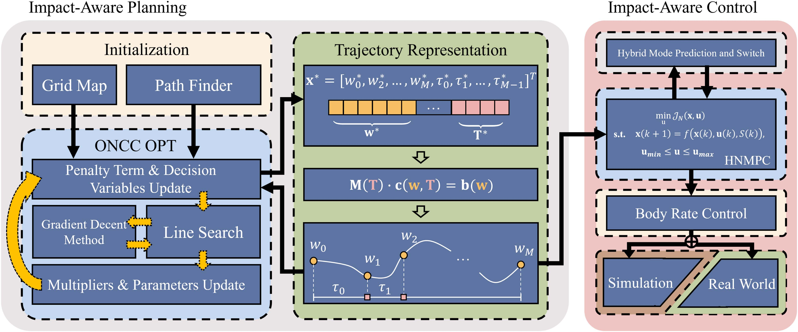

**图 5**：所提出的考虑冲击的规划与控制方法由轨迹优化和控制两部分组成。轨迹优化包括初始化、ONCC 优化和轨迹表示：初始化利用栅格地图与寻路模块生成初始无碰撞路径；ONCC 优化根据初始路径构造约束优化问题并转写为无约束问题，通过线搜索和梯度下降求解子问题，迭代更新对偶变量和惩罚参数直至最优；轨迹表示将路点和时间分配转换为连续多项式轨迹，作为控制参考输入。控制模块包括高层控制和低层控制：高层控制采用 HNMPC 跟踪规划轨迹，低层控制计算期望电机力矩并发送至四旋翼螺旋桨。整个系统可在仿真或真实环境中测试。

（本页承接第 IV 节内容，前述第 IV-A、IV-B 小节已完整翻译。）

## 原文第 7 页核心内容与翻译

**表 I**：轨迹优化中使用的状态—输入约束。

**算法流程承接：** 初始化利用 A* 和预热优化生成满足避障与动力学约束的初值；内循环用弱 Wolfe 线搜索与 L-BFGS 求解无约束子问题；外循环根据约束违反量更新对偶变量和惩罚参数，并重复迭代至收敛。

## 原文第 8 页核心内容与翻译

**算法 1：考虑冲击的轨迹优化。**

**INNER-OPTIMIZE** $(x^0,\rho,\lambda)$：令 $k\leftarrow0,B^0\leftarrow I$；当 $\|\nabla L_{\rho,\lambda}(x^k)\|>\delta$ 时，取 $d\leftarrow-B^k\nabla f(x^k)$，通过 `LINE SEARCH` $(x^k,d)$ [13] 求 $t$，更新 $x^{k+1}\leftarrow x^k+td$，用 L-BFGS [14] 更新 $B^{k+1}$，令 $k\leftarrow k+1$；循环结束后返回 $x^k$。

**ALM** $(x^0,n_{\max},\lambda_{\min},\lambda_{\max},\rho_{\max},\gamma)$：令 $k\leftarrow0,\rho^0\leftarrow1,\lambda^0\leftarrow0$；当 $C_{opt}$ 或 $C_{feas}$ 不满足时，若 $k>n_{\max}$ 则中止；调用 `INNER-OPTIMIZE` 得到 $x^*$；对 $c_i\in H\cup G$，若 $c_i\in H$ 或 $\rho^kc_j(x^k)\ge0$，则 $\lambda_i^k\leftarrow\lambda_i^k+\rho^kc_i(x^k)$，否则置零；更新 $\rho^k\leftarrow\min[(1+\gamma)\rho^k,\rho_{\max}]$，令 $k\leftarrow k+1$，返回 $x^*$。

**4）收敛检查：** 当满足最优性和精度条件时算法收敛，否则返回第 IV-B2 节求解新的无约束子问题：
\[
C_{opt}:\|\nabla L_\rho\|_\infty\le\epsilon_{opt}, \tag{16}
\]
\[
C_{feas}:=\max\left\{\max_i|h_i(x^k)|,\max_j[g_j(x^k)]_+\right\}\le\epsilon_{feas}. \tag{17}
\]
其中 $\epsilon_{opt}$、$\epsilon_{feas}$ 为正阈值。

ALM 为 ONCC 获得最优可行解的优势包括：内循环可直接使用 Lewis–Overton 线搜索 [13]、L-BFGS [14] 等成熟高效方法；外循环可依据约束违反量解析更新对偶变量，适合约束数量较大的问题；内循环无约束子问题的收敛可直接决定外循环原约束问题的收敛 [25]；算法无需满足 CQ [25], [26]。

### C. 轨迹表示与约束细节
在考虑冲击的规划框架中，多段多项式参数化对于保持轨迹自然一致性至关重要。它可以减少参数数量，直接计算导数而无需梯形配点 [37] 等冗余动力学约束，并可利用 [27] 的解析变形方法，在复杂场景中增加轨迹段数以提高可行性而不过度降低效率。本文用多项式函数保证轨迹（包括模式切换时刻）的加速度连续；同时采用密集采样，在每个采样点检查约束违反情况，并将违反惩罚反向传播至决策变量，使轨迹在时间和空间两个维度调整以提高可行性（如图 5 所示）。因此，即使在模式切换时刻，四旋翼和载荷的加速度也保持连续。下面说明必要状态—输入约束，汇总见表 I。

**1）避障：** 用式 (18) 的有符号距离函数描述机器人与障碍物关系：
\[
g_o(t,c)=\operatorname{sign}_E(M(t,c))=\begin{cases}-d(M(t,c),\partial E),&M(t,c)\cap E=\varnothing,\\d(M(t,c),\partial E),&\text{否则} .\end{cases} \tag{18}
\]
其中 $M(t,c)$ 表示机器人多个刚体构成的凸集，$E$ 和 $\partial E$ 分别为环境及其边界。悬挂载荷系统可用质点模型或凸多面体表示：
\[
M(t,c)=R(t,c)M_o+p(t,c). \tag{19}
\]
其中 $R(t,c)$ 是表示刚体旋转的对角分块矩阵，$p(t,c)$ 是平移向量，$M_o$ 是初始位置处的质点或刚体凸集。全维机器人通常用时变凸多面体描述运动中占据的空间。例如，分别用两个球体表示四旋翼和对应载荷。刚体满足 $M_o=\{[p_L,p_Q]^T\mid f_L(p_L)\le r_L,f_Q(p_Q)\le r_Q\}$，其中 $f_L(p)=\|p-x_L^0\|$、$f_Q(p)=\|p-x_Q^0\|$，$p\in\mathbb R^3$，$r_L,r_Q\in\mathbb R$。

**2）速度及高阶导数最大值约束：** 为使机器人运动保持在安全范围内，用速度和加速度约束限制动力学，定义 $g_v(t,c)=\|v(t,c)\|_2^2-v_{\max}^2$ 和 $g_a(t,c)=\|a(t,c)\|_2^2-a_{\max}^2$，其中 $v_{\max}$、$a_{\max}$ 为用户设定的最大值。在某些情况下，还可以加入 jerk 等高阶量约束，以提高飞行稳定性。

## 原文第 9 页核心内容与翻译

其中 $g_a(t,c)=\|a(t,c)\|_2^2-a_{\max}^2$，$v_{\max}$ 和 $a_{\max}$ 为用户设定的最大值。在某些情况下，还可以加入 jerk 等高阶量约束，以提高飞行稳定性。

**3）极限倾角约束：** 为保证安全，必须限制机器人运动期间可达到的最大倾角。记倾角 $\theta(t,c)$ 为机体坐标系 z 轴 $z_B$ 与世界坐标系 z 轴 $e_z$ 之间的夹角。机器人姿态由旋转矩阵 $R\in SO(3)$ 表示，可按 $\theta=\arccos(e_z^TRe_z)$ 计算，并用 $g_\theta(t,c)=\theta-\theta_{\max}$ 描述。

**4）最大和最小推力约束：** 加入推力上下限 $u(t,c)$ 有助于防止过于激进的飞行并保证抗扰稳定性 [38]。推力大小约束为 $g_u(t,c)=(u(t,c)-(u_{\max}+u_{\min})/2)^2-((u_{\max}-u_{\min})/2)^2$，其中 $u_{\max}$ 和 $u_{\min}$ 分别为最大和最小推力。

**5）机器人与载荷之间的距离：** 为防止碰撞，距离 $l(t,c)$ 至少应达到最小安全距离 $d_{safe}$，且不得超过缆绳长度 $l_0$，即 $g_l(t,c)=(l(t,c)-(l_0+d_{safe})/2)^2-((l_0-d_{safe})/2)^2$。

**6）最大张力约束：** 该约束用于避免缆绳张力超过由其物理属性决定的最大限制 $f_{T,\max}$ 而断裂。若最大张力设置过小，缆绳将不足以支撑载荷完成必要的极端运动，因而难以找到可行解。

**7）动力学约束：** 四旋翼和载荷轨迹同时优化时，需要引入等式约束保证合理的动力学关系。绷紧模式下，载荷加速度由张力和重力决定；松弛模式下，二者相对位置不受约束。因此 $h_{dyn}(t,c)=\|\tilde p(t,c)\|\cdot(a_L(t,c)+ge_z)+\|a_L(t,c)+ge_z\|\cdot\tilde p(t,c)$。

**8）互补约束：** 互补约束描述两种运动模式切换造成的冲击：$f_T(t,c)\ge0$，$l_0-l(t,c)\ge0$，且 $h_{comp}(t,c)=f_T(t,c)(l_0-l(t,c))=0$（20）。

算法 2：混合模式预测与切换。`MODE SWITCH` 在预测时域内逐步传播状态，根据四旋翼与载荷距离是否小于缆绳长度，将 $S(k)$ 设为 0 或 1，并返回模式序列。在本文中，缆绳张力变化由该互补约束描述。

## V. 缆绳悬挂载荷系统的混合非线性模型预测控制

本节提出 HNMPC 方法处理模型失配问题，使机器人能够敏捷且安全地飞行。由于多运动模式轨迹会受到空气阻力影响，我们引入含空气阻力的混合动力学模型（V-A 节）、混合模式预测与切换算法（V-B 节），并给出 HNMPC 形式（V-C 节）。

### A. 含空气阻力的混合动力学模型

载荷系统状态写为 $x=[x_L,x_Q,\dot x_L,\dot x_Q,R_Q,p,\dot p]^T$，包括载荷和四旋翼的位置、速度、四旋翼姿态、缆绳方向及其时间导数。控制输入为 $u=[f,\omega_Q]^T$，其中 $f$ 和 $\omega_Q$ 分别为推力和机体角速度。根据 Lagrange–d’Alembert 原理，系统微分方程由式（21）–（28）给出。

其中 $\hat v$ 为向量 $v$ 的斜对称矩阵。$s=1$ 表示绷紧模式，$s=0$ 表示松弛模式；$a_Q$ 和 $a_L$ 分别为四旋翼和载荷所受阻力。实现代码使用四元数表示姿态，但为便于说明使用旋转矩阵 $R_Q$。

采用与刚体速度成正比的线性阻力模型 [39]：$a_L=-k_Lv_L$（29），$a_Q=-k_Qv_Q$（30）。其中 $k_L,k_Q$ 为阻力系数，$v_L,v_Q$ 分别为载荷和四旋翼速度。由于仿真和实验中最大速度不超过 3 m/s（见 VI-C2 节），线性近似是合理的。需要更高速度时，载荷采用二次模型更合适。式（21）–（24）和（27）表示联合系统动力学，$\dot p,\ddot p$ 是方向向量 $p$ 的一阶、二阶导数。空气阻力取决于几何属性、运动状态和流体属性；载荷体积较大或四旋翼高速飞行时，会导致轨迹偏差和精度下降，因此必须将其准确纳入动力学模型。

### B. 双运动模式预测与切换

在 MPC 中，准确预测系统状态（如图 6 所示）至关重要。所提出算法基于含空气阻力的混合模型（算法 2），利用上一状态和切换变量，在预测窗口内逐时间步预测运动模式，直至确定全部模式；随后根据状态序列最小化目标函数，得到最优控制策略。

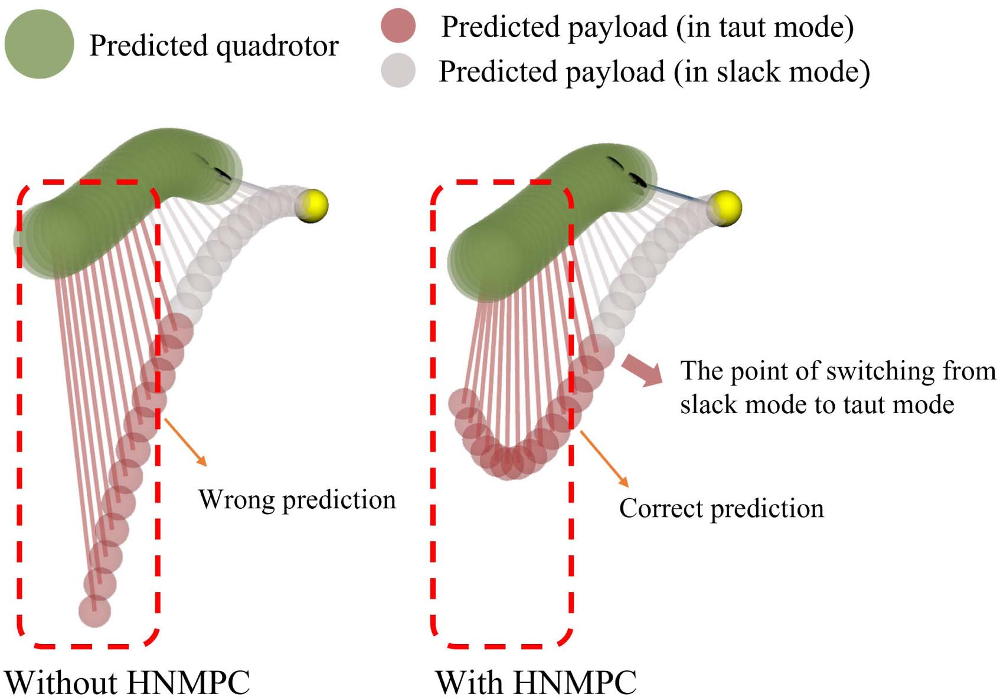

**图 6**：缆绳松弛时，不采用和采用混合模式切换时预测的四旋翼与载荷位置。未切换时载荷始终遵循松弛模型，距离 $l$ 大于缆绳长度 $l_0$，因而不可行；采用切换后可保持 $l\le l_0$。

### C. 混合模型预测控制形式

利用混合动力学模型和预测运动模式，我们基于传统 NMPC 构造二次优化问题，目标函数和约束为式（31a）–（31c）。其中 $H$ 为预测时域，$x_r(k),u_r(k)$ 为可由多项式轨迹获得的参考状态和输入，$f(x(k),u(k),S(k))$ 为离散动力学模型，式（31c）将推力和机体角速度限制在物理可行范围内。权重矩阵 $Q,R$ 按式（32）指数衰减，$b_x,b_u$ 决定衰减速度，以提高鲁棒性并减小估计噪声影响。

为保证实时运行，采用热启动策略：根据规划模块的参考轨迹生成初始猜测，得到可行解后，将上一控制步结果作为当前步初始猜测。将混合模型和模式预测纳入优化后，可求得同时考虑空气阻力和运动模式的最优控制策略，从而在复杂飞行中实现安全、准确的高性能控制。

## VI. 结果

本节通过仿真和真实世界实验验证面向冲击的规划与控制方法。首先与包括 SOTA 方法在内的基线算法比较计算效率和解精度（VI-B1 节）；随后通过消融实验验证 HNMPC 可降低跟踪误差（VI-B4 节）；最后设计两个复杂场景，在仿真（VI-C1 节）和真实环境（VI-C2 节）中执行敏捷飞行。据我们所知，这是首次在物理世界开展具有自动模式切换的敏捷飞行实验。视频见 https://sites.google.com/view/suspended-payload/。

### A. 系统配置

轨迹计算和可视化在配备 Intel Core i7-10875H（CPU 基准频率 2.3 GHz）的笔记本电脑上完成，运行 Ubuntu 20.04 和 ROS Noetic。方法使用 C++11 实现，不依赖硬件加速；对比算法使用 CasADi [40] 和 Ipopt [9]。硬件包括 NVIDIA Jetson Orin NX 16 GB 机载计算机、Kakute H7 自动驾驶仪、250-mm 碳纤维机架和 3-D 打印载荷，物理参数见表 V。HNMPC 基于 ACADO Toolkit [41], [42]，采用 RTI 方案和 qpOASES 求解器；机载执行频率为 100 Hz，飞控角速度环为 400 Hz。平均求解时间为机载 6.77 ms、笔记本电脑 2.65 ms。

### B. 基准比较

**1）避障：** 将 Zeng 等人 [5] 的 SOTA 方法记为 Ipopt+MP，将使用安全距离而非最小穿透约束的同一方法记为 Ipopt+SD。二者以离散系统状态为决策变量，构造含互补约束的优化问题并用 Ipopt 求解。Ipopt+SD 直接使用有符号距离函数；Ipopt+MP 通过对偶变量将其转换为约束，细节见 [43]。

我们进行了 12 组实验，比较平均、最大、最小时间代价和失败案例数（图 7、表 II）。结果表明：用多项式替代离散状态可降低平均时间代价；稳健无约束优化可提高效率并获得稳定结果。前两种方法为保证运动连续性需密集采样（采样数为 50），而多项式天然保证连续性并减少变量。Ipopt-MP 将非光滑约束转换为光滑可微对偶约束，因而比 Ipopt-SD 更稳定，但对偶变量数量随障碍物数增加，平均计算时间也显著增加；本文方法兼具稳定性和效率。

在成功率方面，Ipopt+SD 因非光滑安全距离约束可能无法收敛到期望精度，成功率显著较低。Ipopt+MP 虽能通过光滑最小穿透约束获得精确解，但障碍物较多时，由于离散状态采样稀疏而无法保证运动连续，成功率下降；本文方法仍保持较高成功率。相同地图上的比较也体现了 ALM 相对于 Ipopt 求解 ONCC 的优势：Ipopt+SD 更容易停在非最优解。

## 原文第 12 页核心内容与翻译

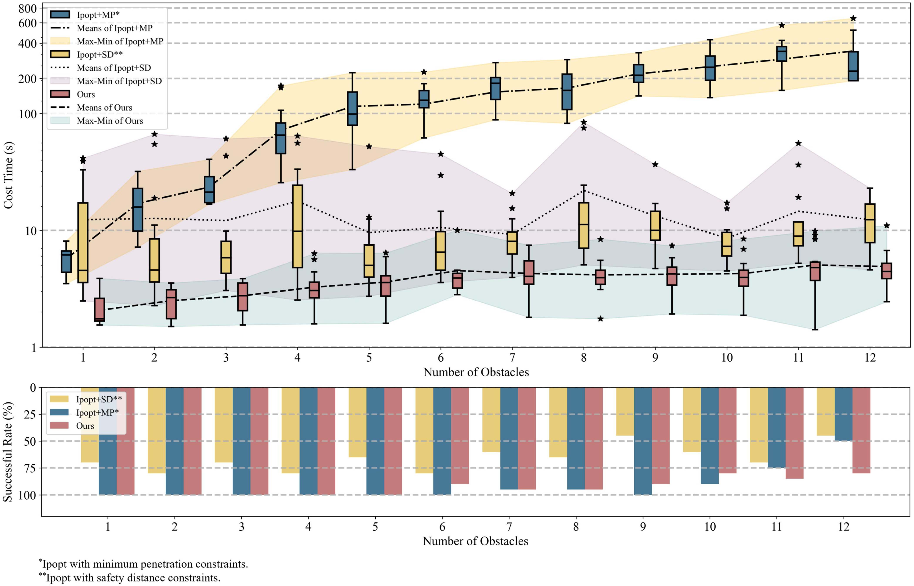

**图 7**：比较三种方法在避障任务中的优化时间和成功率。共 12 组仿真，每组包含 20 个障碍物数量不同的随机地图。上方蓝色箱线图表示 J. Zeng 等人 [5] 提出的 Ipopt+MP，其数据由原论文给出的分布参数生成；由于该方法参数多且没有开源实现，复现结果不如原论文，且本文方法优化时间提高一个数量级，因此可忽略具体实现差异。黄色箱线图表示使用安全距离约束、基于 CasADi [40] 实现的 Ipopt+SD；红色箱线图表示本文方法。半透明区域边界表示各方法在所有仿真中的最大、最小优化时间；下半部分显示各仿真组成功率。

TABLE II
RESULTS OF OBSTACLE AVOIDANCE TASKS

此外，成功率比较进一步体现 ALM 相对于 Ipopt 求解 ONCC 的优势。由于两种方法使用相同地图测试，Ipopt+SD 成功率较低的主要原因是更容易停在非最优解。

## 原文第 13 页核心内容与翻译

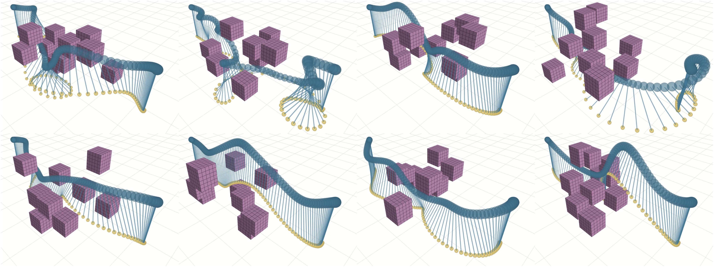

**图 8**：使用所提出轨迹规划方法进行避障的结果。与先前工作 [5] 中的拥挤场景类似，我们在世界坐标系中将载荷的起始位置和目标位置分别设为 xL,0 = [0.0, −2.5, 1.0]T 和 xL,T = [0.0, 2.5, 1.0]T。载荷的运动被限制在空间 P = {p = [x, y, z]T，x ∈[−1.5, 1.5]，y ∈[−1.5, 1.5]，z ∈[0.0, 2.0]} 内。我们共进行了 12 组实验，每组包含 20 次试验。每次试验中，障碍物均在载荷运动区域 P 内生成。障碍物为边长 0.5 m 的立方体。子图展示了 8 种障碍物密集的不同场景。我们的方法能够引导悬挂载荷系统穿过拥挤环境，并在避开碰撞的同时实现激进的飞行轨迹。

求解 ONCC 问题时的数值。我们的方法在障碍物较多的场景（例如场景 11 和 12）中也表现出更高的成功率。上述结果与经典研究 [7] 的发现一致：该研究在标准优化测试集上测试了 ALM 和包括 Ipopt 在内的其他求解器，并得出了相似结论。通过保持轨迹连续性并借助迭代优化提高解的精度，我们的方法能够在障碍物密集的地图中自然生成具有大姿态变化的可行轨迹（如图 8 所示）。
2) 优化消融实验：我们开展了消融实验，以评估所提出轨迹规划算法中的不同模块对优化效率和轨迹可行性的贡献。具体而言，我们在优化算法中移除特定算法模块，或用更基础的算法替换某些模块。
我们重点考察算法的三个关键组成部分：1) 初始化模块；2) 内循环优化算法模块；3) 外循环参数更新模块。
我们通过比较预热策略来测试初始值的影响。对于内循环优化模块，我们分别将本文方法采用的 L-BFGS 算法和 Lewis-Overton 线搜索算法替换为最速梯度下降和回溯线搜索算法，以比较不同无约束优化策略对轨迹优化的影响。最后，在外循环参数分别更新 1、3 和 5 次的条件下，我们记录不同模块组合的优化时间和轨迹可行性。我们设置了严格的收敛阈值，以确保外循环迭代次数始终大于 5。我们在 Drake 中测试不同模块组合优化得到的轨迹，并记录这些轨迹是否可行。结果见表 III。我们将场景 1 中使用包含全部算法模块的方法、经过 5 次迭代完成轨迹优化所需的时间作为基准，并记录其他方法组合的优化时间相对于该基准的比例。表中“✗”和“✔”分别表示优化后的轨迹能否在仿真中执行。

**表 III**：优化效率与轨迹可行性分析
通过分析数据，我们得到以下结论。
1) 优秀的初始值能够显著加快优化过程。不采用预热策略时，尽管经过多次外循环优化得到的最终轨迹是可行的，但所需优化时间会显著增加。
2) 内循环中求解无约束优化问题的方法，对于优化效率和轨迹可行性都至关重要。采用更高效、更有效的梯度下降和线搜索方法，能够显著提高优化速度和轨迹可行性。
授权许可使用仅限于：印度国家理工学院德里分校。下载时间：2026 年 8 月 24 日 05:46:40（UTC），来源：IEEE Xplore。不得进一步传播。

---

## 原文第 14 页核心内容与翻译

WANG 等：考虑碰撞冲击的缆绳悬挂载荷无人机规划与控制
2491

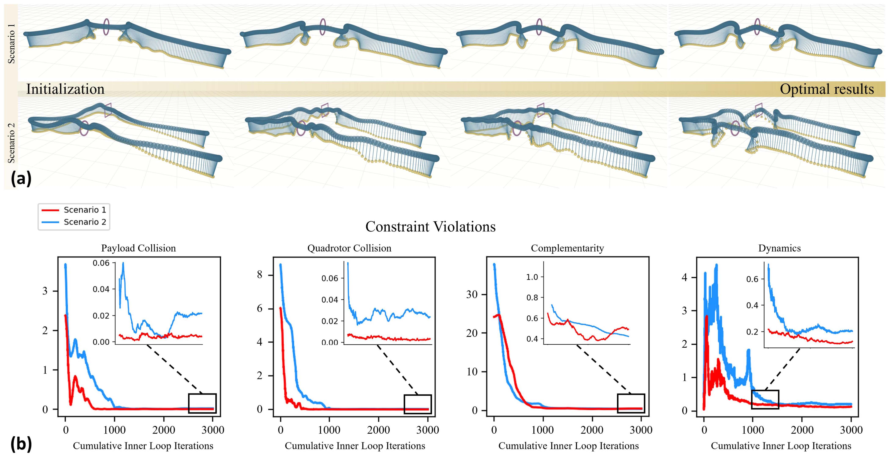

**图 9**：两个复杂场景中优化轨迹的可视化。(a) 优化过程中的轨迹形状。第一行展示场景 1 中从初始化（左）到最优结果（右）的轨迹演化，并可视化两个中间优化状态；第二行展示场景 2 的轨迹演化。(b) 轨迹优化过程中四项关键约束违反量的变化。从左到右，子图分别表示载荷碰撞约束、四旋翼碰撞约束、互补约束和动力学约束。红色曲线表示场景 1 的约束违反量，蓝色曲线表示场景 2 的约束违反量。图中放大了优化过程末期的约束违反量，表明所有约束均得到良好满足，也说明优化结果具有较高精度。

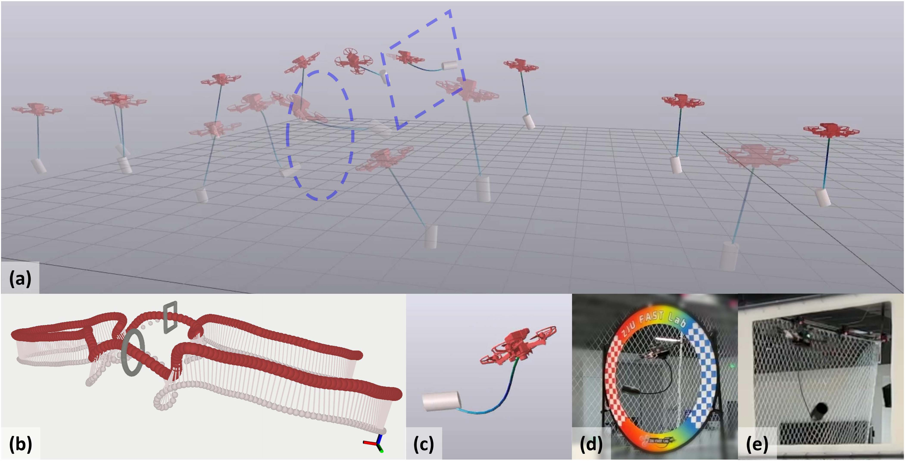

**图 10**：使用 Drake 对场景 2 中悬挂载荷系统运动进行的仿真。(a) 将不同时间步的多个系统状态叠加在同一场景中，以由浅到深的透明度表示时间顺序。悬挂载荷系统处于运动状态，在不同缆绳张力条件下展示两种模式。(b) 给出了复杂场景 2 的规划轨迹；轨迹中包含机器人穿过环形门的过程，以及仿真截图 (c) 和实际飞行截图 (d)。两者表明仿真结果与实际结果相近。(d)、(e) 还展示了悬挂载荷系统沿轨迹穿过两个门洞的实际效果，截图表明机器人处于松弛运动模式。

授权许可使用仅限于：印度国家理工学院德里分校。下载时间：2026 年 8 月 24 日 05:46:40（UTC），来源：IEEE Xplore。不得进一步传播。

---

## 原文第 15 页核心内容与翻译

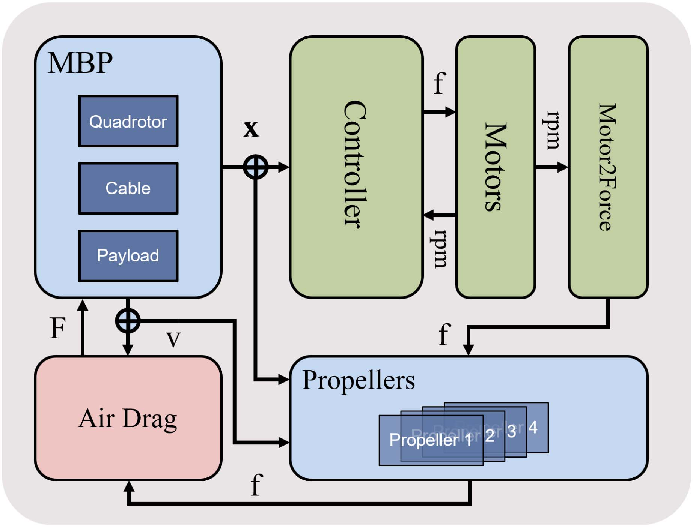

**图 11**：悬挂载荷系统的仿真示意图，展示不同模块之间的关系。左上方为由四旋翼、缆绳和载荷组成的多体系统（MBP）模块。各模块之间的接口按照实际机器人接口设计，以保证仿真的逼真度。

3) ALM 中外循环参数的多次更新对于提高轨迹可行性至关重要。每次更新 ALM 参数都会减少轨迹中的约束违反量，从而提高轨迹可行性。
3) HNMPC 鲁棒性探索：为探究所提出 HNMPC 方法的鲁棒性，我们在不同缆绳长度和载荷质量下测试控制器。实验过程如下：将系统设为与初始状态相似的松弛模式。仿真过程中，载荷在重力作用下自由下落，使缆绳逐渐绷直。四旋翼的目标位置和初始位置均设为世界坐标系原点 (0, 0, 0)，而载荷目标位置设为 (0, 0, −l0)，即原点正下方、与原点高度差等于缆绳长度 l0 的位置。我们记录足够长时间内四旋翼和载荷的状态，并计算各自的跟踪误差和收敛时间。收敛时间 tcov 是满足以下条件的最小 t：对于所有大于 t 的时刻，跟踪误差都保持低于阈值 Δ。
我们将四种载荷质量（50、100、150 和 200 g）与三种缆绳长度（50、60 和 70 cm）配对形成 12 种组合，每种组合测试 3 次，结果汇总于图 12 和图 13。图 12 展示不同组合的跟踪误差曲线，红色水平虚线表示计算收敛时间所用的阈值。每个列子图中，将相同缆绳长度的跟踪误差曲线分组展示。例如，第一列子图展示缆绳长度为 0.7 的组合，包括载荷和四旋翼的跟踪误差。此外，我们在图 13 中记录并可视化了不同系统跟踪误差收敛时间的均值和标准差。
表 IV
有无 HNMPC 时的控制效果对比
表 V
悬挂载荷系统配置
根据跟踪误差及其收敛时间数据，我们得到以下三点结论。
1) 在相同缆绳长度下，即使载荷质量不同，控制器的收敛时间
在缆绳长度相同的情况下，即使载荷质量不同，控制器的收敛时间几乎没有差异。
2) 随着缆绳长度增加，控制器的收敛时间仅呈现非常轻微的
随着缆绳长度增加，控制器收敛时间仅有非常轻微的增加（量级为数百毫秒）。
3) 即使碰撞行为导致速度不连续，控制器仍能引导系统收敛到稳定状态。即使载荷质量更大、碰撞行为更明显，跟踪误差的收敛时间也几乎不受影响。
即使碰撞行为导致速度不连续，控制器仍能引导系统收敛到稳定状态。即使载荷质量更大、碰撞行为更明显，跟踪误差的收敛时间也几乎不受影响。
4) 仿真中的 HNMPC 评估：为评估所提出的 HNMPC 方法，我们在两个复杂场景中分别采用和不采用 HNMPC 方法测试控制效果。每个场景下，两种控制策略各重复进行 5 次敏捷飞行仿真。表 IV 给出了跟踪误差的数值结果。
采用混合预测控制方法后，最大轨迹跟踪误差显著降低：场景 1 降低 31.4%，场景 2 降低 36.0%。尽管运动模式切换仅发生在总飞行时间的一小部分内（见图 15），两个场景中轨迹均方根误差（RMSE）仍分别最多降低 9.8% 和 9.4%。此外，我们还比较了两种控制策略在 X-Y 平面内跟踪误差的 RMSE 和最大值。表 IV 的数值表明，HNMPC 方法显著有助于降低 X-Y 平面内的跟踪误差。这说明敏捷飞行中的模式切换发生在三维空间，而不是简单地沿 Z 轴加速或减速。更详细的过程见补充视频。2
2[Online]. Available: https://youtu.be/6jo6N0TMt0o
Authorized licensed use limited to: National Institute of Technology- Delhi. Downloaded on August 24,2026 at 05:46:40 UTC from IEEE Xplore.  Restrictions apply.

---

## 原文第 16 页核心内容与翻译

WANG et al.: IMPACT-AWARE PLANNING AND CONTROL FOR AERIAL ROBOTS WITH SUSPENDED PAYLOADS
2493

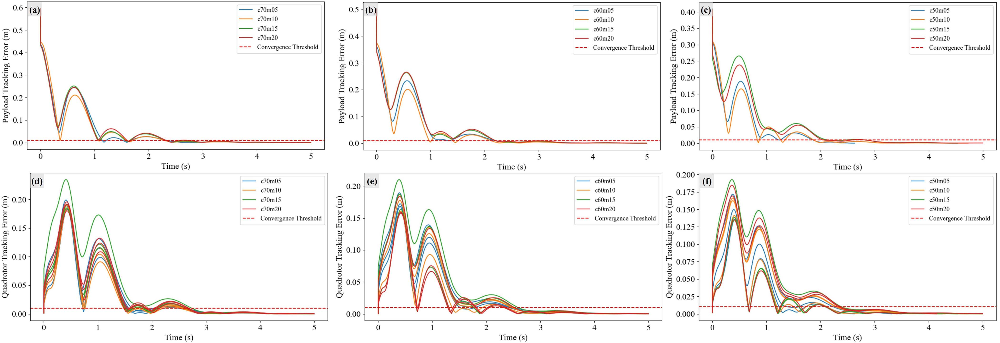

**图 12**：不同缆绳长度与载荷质量组合下的跟踪误差。第一行显示载荷跟踪误差，第二行显示四旋翼跟踪误差。左、中、右列分别对应 70、60 和 50 cm 的缆绳长度。每个子图以不同颜色表示同一缆绳长度下不同载荷质量的跟踪误差曲线。红色水平虚线为收敛阈值，本实验设置为 0.01 cm。

C. 穿越狭窄门洞
我们设计了两个复杂场景，以验证我们的规划与控制算法能够保证：1) 机器人通过狭窄通道时可以发生自然模式切换；2) 机器人能够完成长距离运动，同时保留自然模式切换能力。这两点对于确保悬挂载荷系统的实际应用至关重要。
1) 敏捷飞行仿真：我们根据场景布局生成点云地图，并在其中测试规划算法。我们将算法过程中的若干次迭代结果可视化，如图 9(a) 所示。可以观察到，从一条初始完全不可行的轨迹出发，该方法经过有限次数的迭代即可获得可行轨迹（优化收敛所需的计算时间在 1 min 以内）。
我们在图 9(b) 中展示了四个容易发生违反的关键约束（纵坐标表示轨迹上约束违反绝对值之和）。可以清楚看到，当轨迹趋近最优解时，所有约束值都很低。这表明我们的优化算法能够在较短计算时间内提供足够精确的解，从而确保规划飞行具有可行性。
并在其中测试规划算法，我们将算法过程中的若干次迭代结果可视化，
算法过程中的结果如图 9(a) 所示。可以观察到，从一条初始完全不可行的轨迹出发，该方法经过有限次数的迭代即可获得可行轨迹（优化收敛所需的计算时间在 1 min 以内）。图 9(b) 展示了四个容易发生违反的关键约束（纵坐标表示轨迹上约束违反绝对值之和）。可以清楚看到，当轨迹趋近最优解时，所有约束值都很低。这表明我们的优化算法能够在较短计算时间内提供足够精确的解，从而确保规划飞行具有可行性。
与现实高度相似的仿真环境能够显著加快我们的方法在实际应用中的部署过程。我们使用 Drake [44] 构建悬挂载荷系统示意图，如图 10 所示。为与实际情况一致，我们实现了不同的叶系统，并使每个模块的接口与真实机器人的接口保持一致，如图 11 所示。具体而言，我们使用一阶响应函数模拟四个电机信号输入，并通过螺旋桨模块模拟单个电机的推力模型。我们加入空气阻力模块，以模拟刚体上与速度相关的阻力。详细演示见补充视频。3,4
3[Online]: Available: https://youtu.be/wgSglmOJz0Y
4[Online]: Available: https://youtu.be/mPx3neVR-Bc

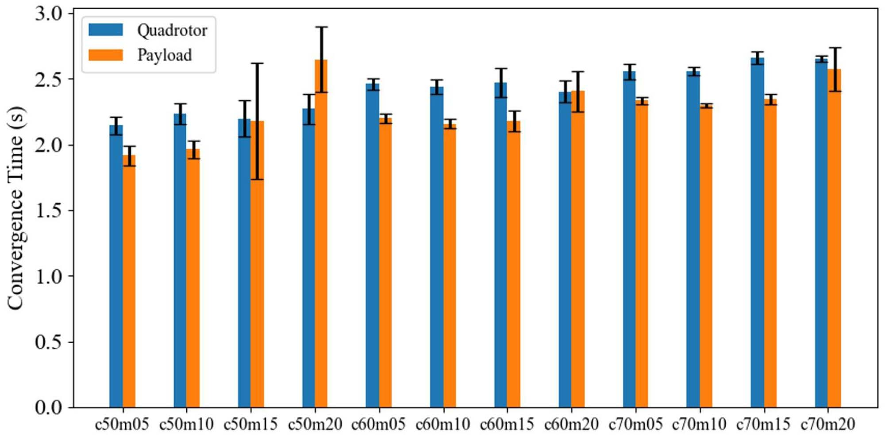

**图 13**：不同缆绳长度与载荷质量组合下稳定悬停的收敛时间。图中展示了三种缆绳长度与四种载荷质量形成的 12 种组合在目标位置稳定悬停时的收敛时间。蓝色柱表示四旋翼收敛时间，橙色柱表示载荷收敛时间；横轴为不同组合，纵轴为以秒计的收敛时间。

仿真系统的实现也将包含在我们的开源代码中。
2) 真实环境部署：如图 14 所示，我们进一步在真实环境中验证方法的可行性。我们复现上述两个复杂场景，测试机器人系统能否完成预期的敏捷飞行。机器人硬件的具体配置见图 16。此外，我们使用高精度运动捕捉系统获取四旋翼和载荷的实时运动状态。
我们记录了机器人在两个场景中的运动数据。在场景 1 中，机器人的平均速度和加速度分别为 0.78 m/s 和 2.74 m/s2，最大速度和加速度分别为 2.32 m/s 和 10.42 m/s2。在场景 2 中，机器人的平均速度和加速度分别为 0.93 m/s 和 2.55 m/s2，最大速度和加速度分别为 2.57 m/s 和 15.52 m/s2。我们发现，机器人的整体速度并不高。然而，机器人
Authorized licensed use limited to: National Institute of Technology- Delhi. Downloaded on August 24,2026 at 05:46:40 UTC from IEEE Xplore.  Restrictions apply.

---

## 原文第 17 页核心内容与翻译

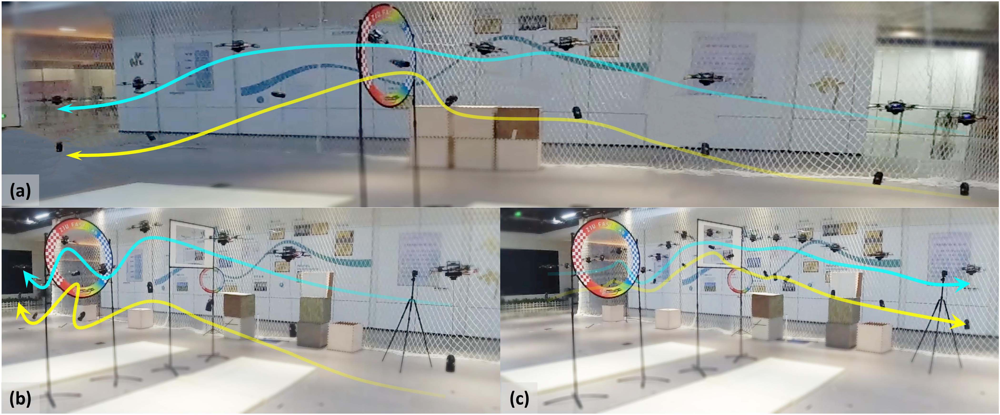

**图 14**：机器人穿越两个复杂场景的截图。场景 1 中，机器人从右向左穿过狭窄的环形门；场景 2 中，机器人穿过环形门到达轨迹中心，随后穿过矩形门抵达终点。截图展示了轨迹规划方法处理复杂环境、穿越狭窄通道的有效性，也体现了方法的实时性能。

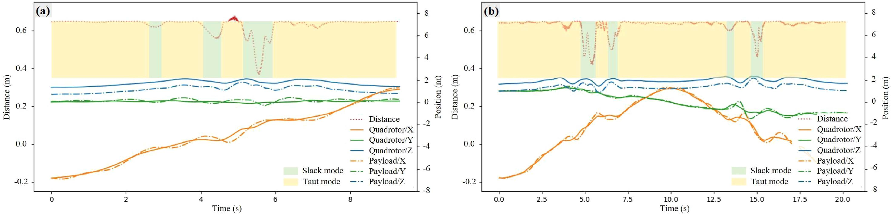

**图 15**：场景 1（左）和场景 2（右）中的系统轨迹与运动模式。(a) 三类信息：实线和点线分别表示四旋翼与载荷在 x、y、z 轴方向上的位置；虚线表示四旋翼与载荷之间的距离变化。绷紧模式和松弛模式对应的时间区间分别以橙色和浅绿色阴影标出。(b) 场景 2 的对应信息。

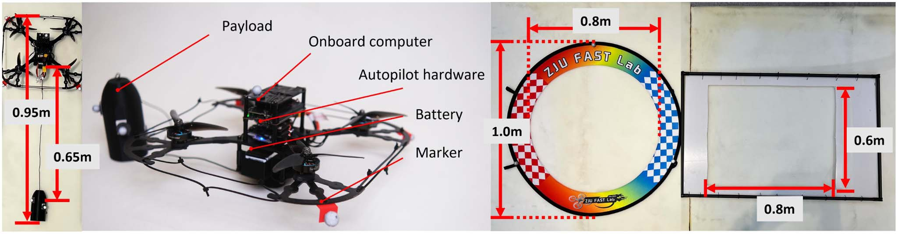

**图 16**：上部为悬挂载荷系统结构，下部为复杂场景中使用的两个狭窄通道。需要注意的是，缆绳绷紧时悬挂载荷系统的尺寸超过两个门洞的最大直径，因此难以通过。

由于运动模式切换，机器人需要较大的加速度来减小跟踪误差。需要指出的是，我们提出的 HNMPC 方法对于机器人完成飞行至关重要。尽管在仿真中使用经典 NMPC 方法会产生显著的控制误差，仿真机器人仍能勉强完成任务。在实际实验中，控制误差不可忽略，否则会导致机器人坠毁。我们进行了多次飞行测试，悬挂载荷系统能够很好地完成任务。这表明我们提出的 HNMPC 方法产生的控制误差更小，从而保证了敏捷飞行的可行性。
## VII. 结论
### A. 局限性与拓展
尽管我们努力构建紧凑的优化模型，并采用适当的优化方法获得最优轨迹，但本文仍存在一些局限性。具体而言，我们没有考虑在高速飞行期间利用有限的机载传感器进行环境感知和机器人状态估计所面临的挑战。在本研究中，我们依赖高精度运动捕获系统实现机器人定位，而该系统可能无法
Authorized licensed use limited to: National Institute of Technology- Delhi. Downloaded on August 24,2026 at 05:46:40 UTC from IEEE Xplore.  Restrictions apply.

---

## 原文第 18 页核心内容与翻译

WANG et al.: IMPACT-AWARE PLANNING AND CONTROL FOR AERIAL ROBOTS WITH SUSPENDED PAYLOADS
2495
在室外环境中使用。未来工作中，我们将逐步实现完全自主的悬挂载荷系统。
### B. 结论
本文强调了一致性和紧凑性对于悬挂载荷系统敏捷飞行的重要性。基于这两个基本特征，我们提出一种考虑冲击的规划算法，用于求解带非线性互补约束的优化问题；同时提出一种考虑冲击的控制方法，以应对混合模式飞行中固有的模型失配问题。所提出的方法系统性地解决了悬挂载荷系统在混合运动模式下生成可行且实用的敏捷飞行轨迹这一问题。充分的仿真和实验验证了所提方法的可行性与有效性。
\
基于这两个基本特征，本文提出考虑冲击的规划算法，用于求解带非线性互补约束的优化问题。
<!-- -->
同时提出考虑冲击的控制方法，
以应对混合模式飞行中固有的模型失配问题。
所提出的方法系统性地解决了
悬挂载荷系统在混合运动模式下生成可行且实用的敏捷飞行轨迹这一问题。
<!-- -->
充分的仿真和实验验证了所提方法的可行性与有效性。
## 附录 A
### 系统动力学
本附录以角速度为例，说明如何利用平坦输出计算系统状态。
当系统处于松弛模式时，式 (8) 等价于 [34, (3)]，可直接按照 [34, 第 III 节] 所述步骤计算四旋翼角速度。
当系统处于绷紧模式时，根据 [1, 引理 1]，可利用下式计算 $f_T\cdot p$：
fT · p = mL(¨xL + gez).
随后，根据式 (5) 和式 (7) 可计算四旋翼的位置及其高阶导数。此时，计算所需系统状态的后续步骤与 [34] 中的步骤相同。
下面给出直接计算角速度的公式，供读者参考。由平坦输出得到的机体系角速度为
ω(0) = ˙zB(0) · sin(ψ) −˙zB(1) · cos(ψ)−
˙zB(2) · zB(0) · sin(ψ) −zB(1) · cos(ψ)
1 + zB(2)
ω(1) = ˙zB(0) · cos(ψ) + ˙zB(1) · sin(ψ)−
˙zB(2) · zB(0) · cos(ψ) + zB(1) · sin(ψ)
1 + zB(2)
ω(2) = ˙zB(2) · ˙zB(1) −zB(1) · ˙zB(2)
1 + zB(3)
+ ˙ψ
其中，$\dot z_B$ 是四旋翼 z 轴的一阶导数，其表达式为
˙zB =
1
∥mQ(¨xQ + gez) −fT p∥· (mQ...xQ + mL...xL)·

I −(mQ(¨xQ + gez) −fT p)(mQ(¨xQ + gez) −fT p)T
(mQ(¨xQ + gez) −fT p)T (mQ(¨xQ + gez) −fT p)

.
需要注意的是，$\dot z_B$ 的计算依赖于 $x_Q$ 和 $x_L$ 的三阶导数。因此，为保证角速度的平滑性，必须确保 $x_Q$ 和 $x_L$ 的三阶导数平滑。在我们的实现中，采用七阶多项式函数表示 $x_Q$ 和 $x_L$ 的轨迹。
## 附录 B
### ALM 的实际构造
ALM 的实际构造为
Lρk

xk, λ
k
=wff

xk
+
i∈E∪Ik
Pρk

wcici

xk
, λ
k
i

(33)
其中
Pρk

wcici

xk
, λ
k
i

=
⎧
⎨
⎩
wcici

xk 
λ
k
i + 1
2ρwcici

xk
,
if ci ∈H ∪Gk
−1
2

λ
k
i
2
/ρk,
otherwise.
(34)
目标函数和约束的缩放系数
wf =
1
max {1, ∥∇f (x0) ∥∞}
wcj =
1
max {1, ∥∇cj (x0) ∥∞}, j = 1, . . ., m.
对偶变量更新
λk+1
j
=

λ
k
j + ρkwcjcj

xk
if j ∈Eor ρkwcjcj

xk
≥λ
k
j
0
otherwise.
REFERENCES
[1] K. Sreenath, N. Michael, and V. Kumar, “Trajectory generation and control
of a quadrotor with a cable-suspended load - A differentially-flat hybrid
system,” in Proc. IEEE Int. Conf. Robot. Automat., 2013, pp. 4888–4895.
[2] K. Sreenath, T. Lee, and V. Kumar, “Geometric control and differential
flatness of a quadrotor UAV with a cable-suspended load,” in Proc. 52nd
IEEE Conf. Decis. Control, 2013, pp. 2269–2274.
[3] S. Tang and V. Kumar, “Mixed integer quadratic program trajectory
generation for a quadrotor with a cable-suspended payload,” in Proc. IEEE
Int. Conf. Robot. Automat., 2015, pp. 2216–2222.
[4] P. Foehn, D. Falanga, N. Kuppuswamy, R. Tedrake, and D. Scaramuzza,
“Fast trajectory optimization for agile quadrotor maneuvers with a cable-
suspended payload,” in Proc. Robot.: Sci. Syst. XIII, Massachusetts Inst.
Technol., Cambridge, MA, USA, 2017, pp. 1–10.
[5] J. Zeng, P. Kotaru, M. W. Mueller, and K. Sreenath, “Differential flatness
based path planning with direct collocation on hybrid modes for a quadro-
tor with a cable-suspended payload,” IEEE Robot. Automat. Lett., vol. 5,
no. 2, pp. 3074–3081, Apr. 2020.
[6] T. A. Howell, K. Tracy, S. Le Cleac’h, and Z. Manchester, “CALIPSO:
A differentiable solver for trajectory optimization with conic and comple-
mentarity constraints,” in Proc. Int. Symp. Robot. Res., 2023, pp. 504–521.
[7] A. F. Izmailov, M. V. Solodov, and E. Uskov, “Global convergence of
augmented Lagrangian methods applied to optimization problems with
degenerate constraints, including problems with complementarity con-
straints,” SIAM J. Optim., vol. 22, no. 4, pp. 1579–1606, 2012.
[8] P. E. Gill, W. Murray, and M. A. Saunders, “SNOPT: An SQP algorithm
for large-scale constrained optimization,” SIAM Rev., vol. 47, no. 1,
pp. 99–131, 2005.
[9] A. Wächter and L. T. Biegler, “On the implementation of an interior-point
filter line-search algorithm for large-scale nonlinear programming,” Math.
Program., vol. 106, pp. 25–57, 2006.
[10] M.R.Hestenes,“Multiplierandgradientmethods,”J.Optim.TheoryAppl.,
vol. 4, no. 5, pp. 303–320, 1969.
[11] M. J. Powell, “A method for nonlinear constraints in minimization prob-
lems,” Optimization, vol. 14, pp. 283–298, 1969.
Authorized licensed use limited to: National Institute of Technology- Delhi. Downloaded on August 24,2026 at 05:46:40 UTC from IEEE Xplore.  Restrictions apply.

---

## 原文第 19 页核心内容与翻译

[12] R. T. Rockafellar, “Augmented Lagrange multiplier functions and duality
in nonconvex programming,” SIAM J. Control, vol. 12, no. 2, pp. 268–285,
1974.
[13] A. S. Lewis and M. L. Overton, “Nonsmooth optimization via quasi-
newton methods,” Math. Program., vol. 141, no. 1, pp. 135–163, 2013.
[14] D. C. Liu and J. Nocedal, “On the limited memory BFGS method for large
scale optimization,” Math. Program., vol. 45, no. 1, pp. 503–528, 1989.
[15] G. Li, A. Tunchez, and G. Loianno, “PCMPC: Perception-constrained
model predictive control for quadrotors with suspended loads using a
single camera and IMU,” in Proc. IEEE Int. Conf. Robot. Automat., 2021,
pp. 2012–2018.
[16] C. Y. Son, D. Jang, H. Seo, T. Kim, H. Lee, and H. J. Kim, “Real-time
optimal planning and model predictive control of a multi-rotor with
a suspended load,” in Proc. IEEE Int. Conf. Robot. Automat., 2019,
pp. 5665–5671.
[17] H. Li, H. Wang, C. Feng, F. Gao, B. Zhou, and S. Shen, “Autotrans: A
complete planning and control framework for autonomous UAV payload
transportation,” IEEE Robot. Automat. Lett., vol. 8, no. 10, pp. 6859–6866,
Oct. 2023.
[18] A. Romero, S. Sun, P. Foehn, and D. Scaramuzza, “Model predictive
contouring control for time-optimal quadrotor flight,” IEEE Trans. Robot.,
vol. 38, no. 6, pp. 3340–3356, Dec. 2022.
[19] Y. Song and D. Scaramuzza, “Policy search for model predictive control
with application to agile drone flight,” IEEE Trans. Robot., vol. 38, no. 4,
pp. 2114–2130, Aug. 2022.
[20] P. Drews, G. Williams, B. Goldfain, E. A. Theodorou, and J. M. Rehg,
“Aggressive deep driving: Combining convolutional neural networks and
model predictive control,” in Proc. Conf. Robot Learn., 2017, pp. 133–142.
[21] M. Posa, C. Cantu, and R. Tedrake, “A direct method for trajectory
optimization of rigid bodies through contact,” Int. J. Robot. Res., vol. 33,
no. 1, pp. 69–81, 2014.
[22] A. Aydinoglu, V. M. Preciado, and M. Posa, “Contact-aware controller
design for complementarity systems,” in Proc. IEEE Int. Conf. Robot.
Automat., 2020, pp. 1525–1531.
[23] A. Aydinoglu, P. Sieg, V. M. Preciado, and M. Posa, “Stabilization of
complementarity systems via contact-aware controllers,” IEEE Trans.
Robot., vol. 38, no. 3, pp. 1735–1754, Jun. 2022.
[24] M. Posa, S. Kuindersma, and R. Tedrake, “Optimization and stabilization
of trajectories for constrained dynamical systems,” in Proc. IEEE Int. Conf.
Robot. Automat., 2016, pp. 1366–1373.
[25] E.G.BirginandJ.M.Martínez,PracticalAugmentedLagrangianMethods
for Constrained Optimization. Philadelphia, PA, USA: SIAM, 2014.
[26] D. Fernández and M. V. Solodov, “Local convergence of exact and
inexact augmented Lagrangian methods under the second-order suffi-
cient optimality condition,” SIAM J. Optim., vol. 22, no. 2, pp. 384–407,
2012.
[27] Z. Wang, X. Zhou, C. Xu, and F. Gao, “Geometrically constrained trajec-
tory optimization for multicopters,” IEEE Trans. Robot., vol. 38, no. 5,
pp. 3259–3278, Oct. 2022.
[28] M. E. Guerrero, D. A. Mercado, R. Lozano, and C. D. García, “Passivity
based control for a quadrotor UAV transporting a cable-suspended payload
with minimum swing,” in Proc. IEEE 54th Conf. Decis. Control, 2015,
pp. 6718–6723.
[29] M. E. Guerrero-Sánchez, D. A. Mercado-Ravell, R. Lozano, and C. D.
García-Beltrán, “Swing-attenuation for a quadrotor transporting a cable-
suspended payload,” ISA Trans., vol. 68, pp. 433–449, 2017.
[30] I. Palunko, R. Fierro, and P. Cruz, “Trajectory generation for swing-free
maneuvers of a quadrotor with suspended payload: A dynamic pro-
gramming approach,” in Proc. IEEE Int. Conf. Robot. Automat., 2012,
pp. 2691–2697.
[31] F. A. Goodarzi, D. Lee, and T. Lee, “Geometric stabilization of a quadrotor
UAV with a payload connected by flexible cable,” in Proc. Amer. Control
Conf., 2014, pp. 4925–4930.
[32] C. De Crousaz, F. Farshidian, and J. Buchli, “Aggressive optimal control
for agile flight with a slung load,” in Proc. Workshop Mach. Learn.
Plan.Control Robot Motion, 2014, Art. no. 7.
[33] C. de Crousaz, F. Farshidian, M. Neunert, and J. Buchli, “Unified motion
control for dynamic quadrotor maneuvers demonstrated on slung load
and rotor failure tasks,” in Proc. IEEE Int. Conf. Robot. Automat., 2015,
pp. 2223–2229.
[34] D. Mellinger and V. Kumar, “Minimum snap trajectory generation and
control for quadrotors,” in Proc. IEEE Int. Conf. Robot. Autom., 2011,
pp. 2520–2525.
[35] Y.-H. Dai and C.-X. Kou, “A nonlinear conjugate gradient algorithm with
an optimal property and an improved Wolfe line search,” SIAM J. Optim.,
vol. 23, no. 1, pp. 296–320, 2013.
[36] A. Alhawarat and Z. Salleh, “Modification of nonlinear conjugate gradient
method with weak Wolfe–Powell line search,” in Proc. Abstr. Appl. Anal.,
2017, pp. 1–6.
[37] M. P. Kelly, “Transcription methods for trajectory optimization: A begin-
ners tutorial,” 2017, arXiv:1707.00284.
[38] Z. Wang, C. Xu, and F. Gao, “Robust trajectory planning for spatial-
temporal multi-drone coordination in large scenes,” in Proc. IEEE/RSJ
Int. Conf. Intell. Robots Syst., 2022, pp. 12182–12188.
[39] N. D. Potdar, G. C. H. E. de Croon, and J. Alonso-Mora, “Online trajectory
planning and control of a MAV payload system in dynamic environments,”
Auton. Robots, vol. 44, no. 6, pp. 1065–1089, 2020.
[40] J. A. Andersson, J. Gillis, G. Horn, J. B. Rawlings, and M. Diehl, “CasADI:
A software framework for nonlinear optimization and optimal control,”
Math. Program. Comput., vol. 11, pp. 1–36, 2019.
[41] B. Houska, H. Ferreau, and M. Diehl, “ACADO toolkit–An open source
framework for automatic control and dynamic optimization,” Optimal
Control Appl. Methods, vol. 32, pp. 298–312, 2011.
[42] B. Houska, H. J. Ferreau, and M. Diehl, “An auto-generated real-time iter-
ation algorithm for nonlinear MPC in the microsecond range,” Automatica,
vol. 47, no. 10, pp. 2279–2285, 2011.
[43] X. Zhang, A. Liniger, and F. Borrelli, “Optimization-based collision avoid-
ance,” IEEE Trans. Control Syst. Technol., vol. 29, no. 3, pp. 972–983,
May 2020.
[44] R. Tedrake, Drake development the team, “Drake: Model-based design and
verification for robotics,” 2019. [Online]. Available: https://drake.mit.edu
Haokun Wang (Graduate Student Member, IEEE)
received the B.Eng. degree in computer science and
engineering from the Southern University of Science
and Technology, Shenzhen, China, in 2019. He is
currently working toward the Ph.D. degree in robotics
and autonomous systems with the Aerial Robotics
Group, the Hong Kong University of Science and
Technology, Hong Kong, China.
His research interests include motion planning and
control for robotic systems.
Haojia Li (Graduate Student Member, IEEE) re-
ceived the B.Eng. degree in robotics engineering from
Northeastern University, Shenyang, China, in 2021.
He is currently working toward the Ph.D. degree
in electronic and computer engineering with Aerial
Robotics Group, Hong Kong University of Science
and Technology, Hong Kong, China.
His research interests include motion planning,
control, and autonomous navigation for mobile
robots.
Boyu Zhou received the B.Eng. degree in mechani-
cal engineering from Shanghai Jiao Tong University,
Shanghai, China, in 2018, and the Ph.D. degree in
electronic and computer engineering with the Hong
Kong University of Science and Technology, Hong
Kong, in 2022.
He is currently an Assistant Professor with the
School of Artificial Intelligence, Sun Yat-sen Univer-
sity, Guangzhou, China, where he directs the Smart
Autonomous Robotics Group. His research interests
include aerial robots, autonomous navigation, motion
planning, 3-D reconstruction, exploration, and swarm.
Authorized licensed use limited to: National Institute of Technology- Delhi. Downloaded on August 24,2026 at 05:46:40 UTC from IEEE Xplore.  Restrictions apply.

---

## 原文第 20 页核心内容与翻译

WANG et al.: IMPACT-AWARE PLANNING AND CONTROL FOR AERIAL ROBOTS WITH SUSPENDED PAYLOADS
2497
Fei Gao (Member, IEEE) received the Ph.D. degree in
electronic and computer engineering from the Hong
Kong University of Science and Technology, Hong
Kong, in 2019.
He is currently a tenured Associate Professor with
the Department of Control Science and Engineer-
ing, Zhejiang University, Hangzhou, China, where he
leads the Flying Autonomous Robotics group affili-
ated with the Field Autonomous System and Comput-
ing Laboratory. His research interests include aerial
robots, autonomous navigation, motion planning, op-
timization, and localization and mapping.
Shaojie Shen received the B.Eng. degree in elec-
tronic engineering from the Hong Kong University
of Science and Technology (HKUST), Hong Kong,
in 2009, the M.S. degree in robotics and the Ph.D.
degree in electrical and systems engineering from the
University of Pennsylvania, Philadelphia, PA, USA,
in 2011 and 2014, respectively.
He joined the Department of Electronic and Com-
puter Engineering, HKUST, in 2014, as an Assistant
Professor, and was promoted to Associate Professor
in 2020. His research interests include robotics and
unmanned aerial vehicles, with focus on state estimation, sensor fusion, com-
puter vision, localization and mapping, and autonomous navigation in complex
environments.
Authorized licensed use limited to: National Institute of Technology- Delhi. Downloaded on August 24,2026 at 05:46:40 UTC from IEEE Xplore.  Restrictions apply.

---
