# LEMON-Mapping大规模多时序点云融合与回环增强优化（LEMON-Mapping Loop-Enhanced Large-Scale Multi-Session Point Cloud Merging and Optimization for Globally Consistent Mapping）：完整忠实学术翻译

> **原文标题**：LEMON-Mapping Loop-Enhanced Large-Scale Multi-Session Point Cloud Merging and Optimization for Globally Consistent Mapping  
> **作者**：> - 作者: Lijie Wang, Xiaoyi Zhong, Ziyi Xu, Kaixin Chai, Anke Zhao, Tianyu Zhao, Changjian Jiang, Qianhao Wang, Xieyuanli Chen, and Fei Gao  
> **发表信息**：> - 期刊/会议: IEEE TRANSACTIONS ON AUTOMATION SCIENCE AND ENGINEERING, VOL. 23, 2026  
> **原文 PDF**：[LEMON-Mapping Loop-Enhanced Large-Scale Multi-Session Point Cloud Merging and Optimization for Globally Consistent Mapping.pdf](../LEMON-Mapping Loop-Enhanced Large-Scale Multi-Session Point Cloud Merging and Optimization for Globally Consistent Mapping.pdf) ｜ **对应中文详解**：[22_LEMON-Mapping大规模多时序点云融合与回环增强优化.md](../中文详解/22_LEMON-Mapping大规模多时序点云融合与回环增强优化.md)  

---

## 原文第 1 页核心内容与翻译

12318
IEEE TRANSACTIONS ON AUTOMATION SCIENCE AND ENGINEERING, VOL. 23, 2026
LEMON-Mapping: Loop-Enhanced Large-Scale
Multi-Session Point Cloud Merging and
Optimization for Globally Consistent Mapping
Lijie Wang , Xiaoyi Zhong , Ziyi Xu , Kaixin Chai , Anke Zhao , Graduate Student Member, IEEE,
**摘要**—多机器人协作对于构建全局一致的地图至关重要但充满挑战。传统的多机器人位姿图优化 (PGO) 方法确保了基本的全局一致性，但忽略了地图的几何结构，并且仅使用回环闭合作为位姿节点之间的约束，这会导致在重叠区域中出现发散和模糊。为了解决这个问题，我们提出了 LEMON-Mapping，这是一个用于大规模、多时序点云融合和优化的回环增强框架。我们重新审视了回环在多机器人建图中的作用，并提出了三个关键创新。首先，我们开发了一种鲁棒的回环处理机制，具有异常值剔除和召回策略以恢复有效的回环。其次，我们引入了空间光束法平差以减少发散并消除重叠区域中的模糊。第三，我们设计了一种基于 PGO 的优化，集成了细化的光束法平差约束，以将局部精度传播到全局。在公开和自收集数据集上的实验表明，在大型多机器人场景中，LEMON-Mapping 在准确性、一致性和可扩展性方面均优于传统方法。
**对从业者的说明**—在本文中，我们解决了不准确和不一致的大规模多机器人地图融合问题，传统的的多机器人 SLAM 忽略了几何结构，导致在重叠区域出现发散和模糊。在现实世界的探索中，多机器人建图旨在扩展覆盖范围，但不一致和不准确的地图融合会降低地图质量，并影响重定位、导航和机器人操作等下游应用，可能导致导航失败和不安全的行为。LEMON-Mapping 集成了鲁棒的回环处理、空间光束法平差和
Received 12 February 2026; revised 4 June 2026; accepted 27 June 2026.
Date of publication 2 July 2026; date of current version 9 July 2026. This
article was recommended for publication by Associate Editor D. Gurdur
Broo and Editor J. Liu upon evaluation of the reviewers’ comments. Date of
publication 2 July 2026; date of current version 9 July 2026. This work was
supported in part by the National Key Research and Development Program
of China under Grant 2023YFB4706600, in part by Zhejiang Provincial
Science and Technology Plan Project under Grant 2024C01170, and in part
by the National Natural Science Foundation of China under Grant 62322314.
(Corresponding authors: Qianhao Wang; Xieyuanli Chen; Fei Gao.)
Lijie Wang, Xiaoyi Zhong, Ziyi Xu, Anke Zhao, Tianyu Zhao, Qianhao
Wang, and Fei Gao are with the Institute of Cyber-Systems and Control, Zhe-
jiang University, Hangzhou 310027, China (e-mail: 3210101760@zju.edu.cn;
qhwangaa@zju.edu.cn; fgaoaa@zju.edu.cn).
Kaixin Chai is with Huzhou Institute, Zhejiang University, Huzhou 313000,
China.
Changjian Jiang is with the State Key Laboratory of Industrial Control
Technology, College of Control Science and Engineering, Zhejiang University,
Hangzhou 310027, China.
Xieyuanli Chen is with the College of Intelligence Science and Technology,
National University of Defense Technology, Changsha 410007, China (e-mail:
xieyuanli.chen@nudt.edu.cn).
This
article
has
supplementary
downloadable
material
available
at
https://doi.org/10.1109/TASE.2026.3709653, provided by the authors.
Digital Object Identifier 10.1109/TASE.2026.3709653
位姿图优化以重建准确且全局一致的多机器人地图，为多机器人协作、定位和自主导航提供可靠的支持。
**索引术语**—定位和建图，多机器人 SLAM，集群。
# I. 引言
大规模 3D 建图是现代机器人技术的一项基本能力，提供了丰富的几何信息，以支持诸如无人机巡检 [2]、[3]、[4]、自动驾驶 [5] 以及地面机器人的长期探索 [6] 等任务。此外，大规模 3D 地图对于具身人工智能等新兴领域至关重要，在这些领域中，智能体基于空间理解与复杂环境进行交互 [7]。它们还在端到端视觉运动导航系统中发挥关键作用 [8]，这些系统依赖于准确的环境先验来增强泛化能力。特别是，多机器人 3D 建图对于大规模和复杂的任务至关重要，在这些任务中，与单个智能体相比，机器人团队提供更广的覆盖范围和鲁棒性。在诸如搜索与救援 [9]、森林监测 [10] 和地下探索 [11] 等场景中，准确的点云融合对于在复杂和 GPS 拒止条件下实现多个机器人之间的合作至关重要。
基于 LiDAR 的同步定位与建图 (SLAM) 技术的快速发展 [12]-[20] 使得单个机器人能够执行实时定位和点云地图构建。然而，对于机载计算机，大多数现有的轻量级 SLAM 系统 [14]-[16] 都基于直接的 LiDAR 惯性里程计 (LiDAR-Inertial-Odometry) 方法。这些方法优先考虑位姿估计而不是地图构建，以实现实时性能。然而，由于缺乏特征提取和匹配，可能导致地图细节模糊和几何精度差。因此，基于轻量级方法的机载计算机重建的点云地图质量需要进一步提高。
为了提高点云地图的几何精度和质量，已经提出了各种策略。其中，一类方法利用位姿图优化 (PGO) [21] 来处理回环场景。由回环检测方法 [22]-[25] 检测到的回环闭合约束与里程计约束一起添加到位姿图中，以消除累积漂移并提高地图的全局一致性。然而，基于 PGO 的方法仅
1558-3783 © 2026 IEEE. All rights reserved, including rights for text and data mining, and training of artificial intelligence and
similar technologies. Personal use is permitted, but republication/redistribution requires IEEE permission.
See https://www.ieee.org/publications/rights/index.html for more information.
Authorized licensed use limited to: National Institute of Technology- Delhi. Downloaded on August 24,2026 at 05:44:47 UTC from IEEE Xplore.  Restrictions apply.

---

## 原文第 2 页核心内容与翻译

WANG et al.: LEMON-MAPPING: LOOP-ENHANCED LARGE-SCALE POINT CLOUD MERGING AND OPTIMIZATION
12319

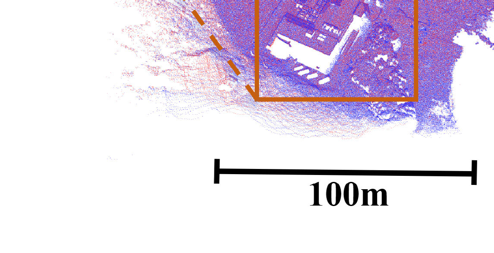

**图 1**：Fig. 1.
我们在 MARS-LVIG [1] 数据集的岛屿序列中的地图融合结果，图中的细节以框出并以两种形式显示：侧视图 (SV) 和鸟瞰图 (BEV)。

利用点云地图在回环检测期间提取描述子，而忽略了结构和几何信息。因此，尽管基于 PGO 的方法可以基于回环提高全局一致性，但它无法保证生成没有发散和模糊的准确地图。相比之下，另一类基于光束法平差 (BA) 的地图优化方法近年来在提高点云地图精度方面展示了令人印象深刻的能力 [26], [27], [28], [29], [30]。这些方法利用点云地图的结构特征，并通过最小化特征点和特征结构之间的几何残差来提高其质量。尽管基于 BA 的方法能够生成高质量地图，但它们对时间序列的依赖可能会阻止它们充分利用回环信息，这可能导致地图一致性较差。这种对顺序位姿的依赖也限制了基于 BA 的方法在多机器人系统中直接应用的适用性。
除了上述建图方法外，为了实现更大规模的地图重建和多机器人协作，几个多机器人 SLAM 系统 [31], [32] 和离线地图融合技术 [33], [34], [35], [36], [37], [38] 近年来显示出有希望的结果。总的来说，这些方法集中在两个方面：去除回环数据中的异常值以及通过多机器人 PGO 实现地图融合。然而，基于 PGO 的方法在单机器人和多机器人应用中从根本上是相同的，因为它们都使用里程计约束和回环约束来进行地图优化。如前一段所讨论的，这些方法既没有直接利用多机器人地图中的几何信息，也没有充分利用回环数据。因此，它们只能确保全局地图的基本对齐和一致性，但未能重建高质量的点云地图。特别是，它们经常在机器人之间的重叠区域出现未对齐的情况。最近，一些终身 (life-long) SLAM 系统 [18], [20] 通过 PGO 然后全面 BA 的范式处理多会话 (multi-session) 建图，其中 PGO 和全局 BA 是松散耦合的。为了保持可控的时间成本，该流程依赖于数据稀疏化或聚合。因此，它对初始 PGO 先验很敏感，并且通常无法在多机器人场景中实现无发散且全局一致的地图融合。
最终，无论是独立应用还是在当前松散耦合的范式中结合使用，现有的 PGO 和 BA 方法往往迫使在多机器人场景中的高分辨率地图精度和全局一致性之间进行权衡。
在现有方法优势的基础上并旨在解决其局限性，我们对以前的多机器人 SLAM 系统和地图融合技术进行了深入分析。多机器人建图的关键问题是在保持整个地图全局一致性的同时，解决子图的发散和模糊问题。我们认为，点云地图的融合本质上是一个数据驱动的局部配准问题，而不是一个以位姿为主导的位姿优化问题。基于这一观点，我们确定了实现有效的多机器人点云地图融合的两个基本挑战：(1) 地图融合应该被视为一种地图驱动的配准问题，而不是像 PGO 那样的以位姿为中心的优化任务。(2) 回环
（授权许可使用限制：National Institute of Technology- Delhi。于2026年8月24日 05:44:47 UTC从IEEE Xplore下载。适用限制。）

---

## 原文第 3 页核心内容与翻译

信息应该被充分利用，不仅用于确保全局一致性，还用于提高局部精度。
为了克服上述挑战，我们提出了 LEMON-Mapping，这是一个回环增强 (Loop-Enhanced) 的大规模多时序 (Multi-session) 地图融合和优化框架，它实现了全局一致和几何准确的点云建图。我们的框架重新审视了回环的能力，并从两个方面合理增强了其利用率。首先，我们引入了一种创新的回环召回机制，它为随后的空间 BA 提供了更全面的几何约束和增强的优化机会。其次，通过利用充足的有效回环，我们的空间 BA 可以有效处理多机器人地图，而传统的 BA 方法无法解决它们。空间 BA 在回环周围的局部空间窗口内执行，有效利用来自不同机器人的多次观测和丰富的约束。它直接在空间窗口内同等地优化来自不同机器人的位姿；因此，匹配相同几何特征（平面、直线）的多个机器人的位姿会被同时调整，从而重建局部准确且一致的地图。尽管空间 BA 提高了回环处的局部地图精度，但它缺乏全局地图融合的能力。为了解决这个问题，我们提出了一种合理的基于 PGO 的方法，该方法将局部 BA 约束和里程计约束有效结合，将我们的空间 BA 实现的局部对齐转移到整个地图，从而实现全局一致性和精度。我们进行了一系列广泛的实验，结果证明了我们的多时序地图融合方法的高建图精度和强可扩展性，如图 1 所示。
总而言之，这项工作的主要贡献可概括如下：
• 设计了一个可扩展的多时序点云地图融合与优化系统，该系统将两步 PGO 与空间 BA 集成在一起，以在大型和多机器人场景中实现高精度的 3D 建图。
• 设计了一个鲁棒的回环处理管线，包括剔除异常值和召回假阴性回环，这增强了用于地图融合的回环约束的可靠性和完整性。
• 引入了一种可用于多机器人建图的新颖空间 BA，它在基于回环的空间窗口上运行，以充分利用回环约束并同等地联合优化多机器人位姿。这提高了局部精度并减少了严重的地图发散。
• 开发了一种利用稀疏化 BA 约束的位姿图优化方案，该方案有效地将局部精度传播到全局范围，同时提高了一致性和精度。
## II. 相关工作
### A. 单地图维护与优化
单地图维护与优化已得到广泛研究，现有方法大体分为两类：基于 PGO 的方法和基于 BA 的方法。PGO
通过利用回环闭合约束来减小里程计的累积漂移，仍是 LiDAR SLAM 系统中广泛采用的后端方法
。然而，传统 PGO 框架关注的是位姿一致性，而不是点云地图质量，因此生成的地图几何质量较差。
相比之下，基于 BA 的方法通过最小化匹配基元的几何残差来联合优化扫描位姿
，从而提高地图精度。BALM [26] 引入特征参数的闭式解以降低计算复杂度，BALM2 [27] 进一步结合点聚类和更高效的二阶求解器。近期，BALM3 [30] 采用主化-最小化算法解耦扫描位姿，将时间复杂度降为线性，并支持大规模建图中的分布式优化。HBA [28] 采用分层 BA 策略，随后执行自顶向下的 PGO，从而实现大规模场景中的可扩展优化。PSS-BA [29] 为点云地图引入二次曲面建模，并通过渐进式平滑迭代优化地图质量。RSO-BA [43] 通过结合鲁棒核函数的二阶估计器提高鲁棒性。尽管具有上述优势，传统 BA 方法依赖基于时间的滑动窗口，无法纳入回环闭合引入的远距离空间约束。因此，将这些方法直接部署到多机器人场景中的实用性有限。
### B. 多时序地图融合
多时序地图融合旨在将多个智能体的子地图（无论是否具有初始位姿估计）整合为统一且全局一致的地图
multiple agents either with or without initial pose estimates,
。为实现这一目标，研究者提出了若干终身建图系统。LTA-OM [19]
利用长期关联机制将实时扫描无缝拼接到预存先验地图中，无需额外的地图融合操作。SLIM [18] 通过将稠密点云参数化为结构线和平面，并结合位姿稀疏化，大幅减少内存占用，从而解决多时序建图的可扩展性问题。此外，SMMR-Explore [44] 和 MR-GMMExplore [45] 等多机器人探索框架在通信受限条件下处理多机器人探索与地图融合。然而，前者受限于二维点云子地图，后者则因基于高斯混合模型（GMM）的子地图而丢失几何细节。因此，这些多机器人探索框架不适合重建大规模且几何精确的点云地图。SegMap [46] 从三维点云中提取语义特征
以估计 6-DoF 变换，并利用增量式 PGO 实现地图融合，但它高度依赖准确的语义分割。AutoMerge [34] 提出城市尺度的融合框架，但由于未能剔除回环异常值，其在复杂环境中的性能会下降。LAMM [33] 通过 M-Detector [47] 移除动态物体，并使用鲁棒回环检测方法 BTC [23] 来增强位置识别，但它仅使用 PGO 融合地图，可能出现严重的局部发散。
异常值剔除是多时序建图中的另一项关键挑战。
multi-session mapping. RANSAC [48] remains a standard
Authorized licensed use limited to: National Institute of Technology- Delhi. Downloaded on August 24,2026 at 05:44:47 UTC from IEEE Xplore.  Restrictions apply.

---

## 原文第 4 页核心内容与翻译

WANG et al.: LEMON-MAPPING: LOOP-ENHANCED LARGE-SCALE POINT CLOUD MERGING AND OPTIMIZATION
12321

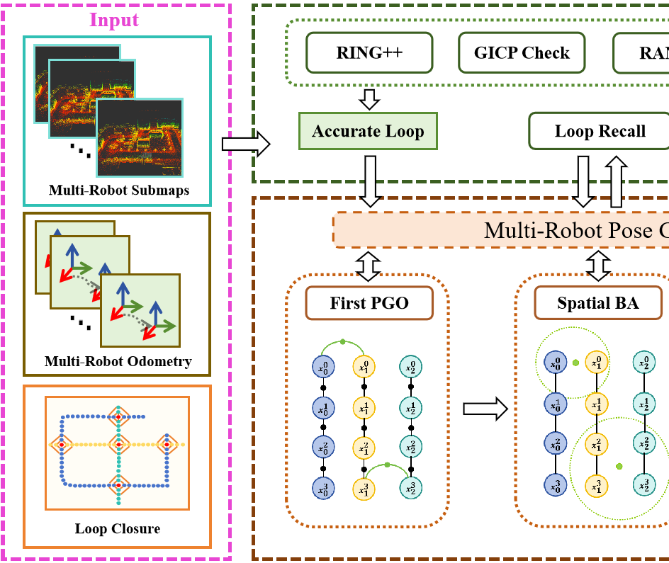

**图 2**：Fig. 2.
我们方法的框架。它以多机器人子图、里程计和回环为输入，并重建准确且全局一致的融合地图。(a) 回环处理模块，它剔除异常值并召回假阴性回环。(b) 地图融合模块，它通过两步 PGO 和空间 BA 实现多机器人地图融合。地图融合模块中的这三个步骤各自与多机器人位姿图进行着密切的交互。

模型异常值，但其有效性在高异常值比例和缺乏强先验的情况下会降低。PCM [35], [36], [37] 被用于 DCL-SLAM [31] 和 Disco-SLAM [32] 等系统中，它利用成对的几何一致性来进行回环验证。尽管对随机异常值具有鲁棒性，但其性能在多机器人场景中会因累积的里程计漂移而受到影响。此外，解决 NP 难的最大团问题会导致在处理大规模环境中密集的候选回环时计算时间过长。GNC [49] 优化了一系列渐进函数以实现无初始化的全局异常值剔除；然而，其准确性仍然受到异构多机器人里程计漂移的限制。

# III. 系统概述
## A. 问题公式化
我们的目标是通过融合来自不同机器人的多个子图来重建一个准确且一致的地图。在基于激光雷达的 SLAM 系统 [12], [13], [14], [16] 中，每个扫描点云固有地配准到其对应的激光雷达扫描位姿上，并且全局点云地图是通过将每个扫描配准到世界坐标系中构建的。因此，点云地图的质量与采集时的传感器位姿严格相关。
在多机器人系统中，位姿序列集可以表示为 S_N = {s_1, s_2, ..., s_N}，其中每个序列 s_k 对应一个单独的机器人。诸如 s_i 和 s_j 之类的不同序列具有不同的起点和初始方向，缺乏相对位姿变换的先验信息。因此，必须估计这些轨迹之间的相对变换，并利用重叠区域中的约束优化位姿以提高几何一致性。
该问题可公式化为寻找一组优化后的位姿序列 S^*_N = {s^*_1, s^*_2, ..., s^*_N}，使得所有轨迹对齐到一个公共坐标系（通常为 s^*_1），并且随后的多机器人地图在保持全局一致性的同时表现出最小的发散。

## B. LEMON-Mapping 框架

**图 2**：Fig. 2 说明了 LEMON-Mapping 的整体框架。我们的系统由两个主要组件组成：第 IV 节详述的回环处理模块和第 V 节及第 VI 节描述的地图融合模块。

回环处理模块接收多智能体里程计、子图和原始回环候选（包括机器人内部和机器人间的回环），鲁棒地过滤掉错误的约束以输出正确的回环。地图融合模块随后利用这些回环通过三个步骤优化多机器人轨迹：空间光束法平差 (BA) 和两个位姿图优化 (PGO) 步骤。由于这两个 PGO 步骤共享相似的公式，它们在第 VI 节中联合描述，而提出的空间 BA 则在第 V 节中单独讨论。

# IV. 回环处理模块
回环处理模块是支持空间 BA 和两步位姿图优化的基础组件。它由三个子模块组成：异常值剔除、回环分类和回环召回。该模块处理来自多个机器人的自回环 (self-loops) 和间回环 (inter-loops)，这些回环最初由鲁棒的回环检测方法 RING++ [24] 检测得到。

## A. 异常值剔除
回环数据可能包含不正确的约束，这严重影响 PGO 的准确性。为了解决这个问题，
（授权许可使用限制：National Institute of Technology- Delhi。于2026年8月24日 05:44:47 UTC从IEEE Xplore下载。适用限制。）

---

## 原文第 5 页核心内容与翻译

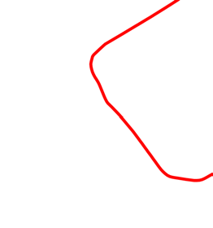

**图 3**：Fig. 3. Campus 1 数据集中的回环分类示例，图中标出了多机器人轨迹和两种类型的回环。

我们设计了一种使用广义迭代最近点 (GICP) [50] 结合随机采样一致性 (RANSAC) [48] 的异常值剔除方法。
该过程从统计离群点移除 (SOR) [51] 开始，它通过分析点到邻居距离的统计分布来过滤原始点云中的噪声。然后使用 GICP 来对齐滤波后的点云，并使用 RING++ 估计的变换进行初始化。为了验证对齐结果，两片点云之间的对应关系通过基于 RANSAC 的剔除方法进行优化，该方法丢弃与刚性变换不一致的异常值。仅当内点对应数量超过预定义阈值时，回环才会被接受。此外，GICP 的适应度分数被用作对齐质量的定量指标，具有较差分数或不收敛的对齐会被丢弃。这种两阶段滤波方法通过确保只保留几何上有效的对齐方式，增强了回环的可靠性。

## B. 回环分类
在异常值剔除过程之后，剩余的有效回环被分类，以促进高效的空间 BA。具体而言，我们根据回环的空间分布将其分为两种类型：聚集回环 (clustered loops) 和孤立回环 (isolated loops)。
我们实现了一个基于广度优先搜索 (BFS) 的区域生长算法。从每个回环的空间中心开始，算法在预定义半径内增量式搜索附近的回环。如果发现相邻的回环，则从它们的中心开始向外扩展搜索，递归地继续直到未检测到其他附近的回环为止。形成这种空间簇的回环被标记为聚集回环，而没有相邻回环的回环被标记为孤立回环。图 3 显示了此分类过程的一个示例。

## C. 回环召回
由于异常值剔除步骤采用了严格的标准以确保鲁棒性和准确性，它可能会无意中丢弃有效的回环。这些机器人轨迹之间缺失的约束阻碍了重叠区域发散的纠正，潜在地降低了融合的多机器人地图的一致性。为了解决这个问题，我们提出了一种回环召回机制来恢复以前被丢弃的有效回环。在第一次

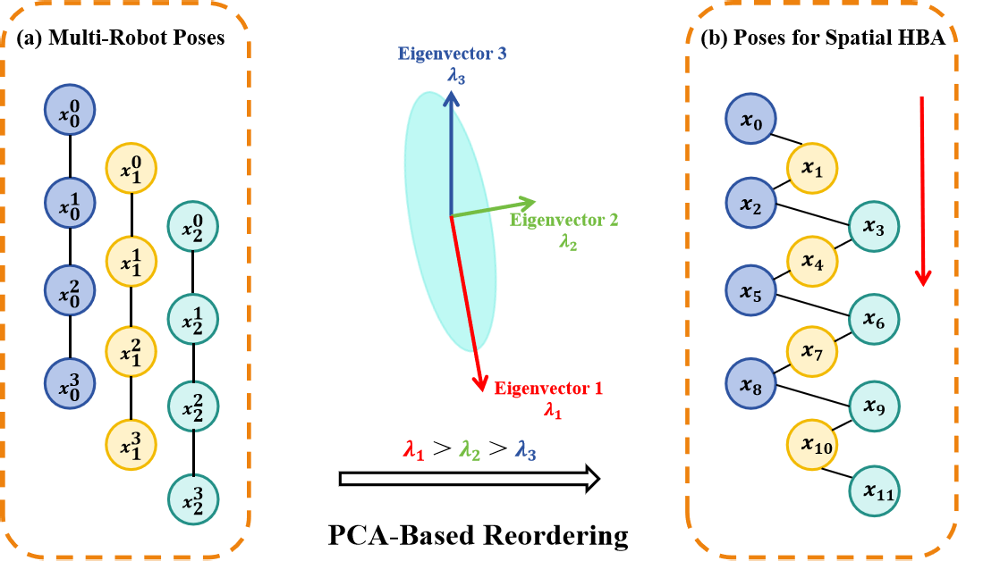

**图 4**：Fig. 4.
左图中的红色和绿色节点显示了不同机器人在某个回环处的轨迹。(a) 和 (b) 分别显示了 BA 优化前后的子图。我们的空间 BA 显著减少了发散并重建了局部一致的地图。

**图 5**：Fig. 5. (a) 显示了空间窗口中的多机器人位姿。(b) 显示了使用 PCA 进行空间 HBA 重新排序的位姿。

PGO（第 VI 节）使用有效回环将所有机器人轨迹对齐到同一坐标系后，更新后的位姿被用来重新评估以前被拒绝的回环。如果相关联的位姿之间的欧几里得距离低于一个阈值（在我们的系统中为 2m），则召回该回环。这种轻量级和基于距离的策略有效地恢复了有用的约束并增强了随后的优化。

# V. 空间光束法平差
传统的 BA 方法 [26], [27], [28] 在时间上有序数据的滑动窗口内联合优化顺序位姿。然而，它们很难处理涉及长时间跨度或来自不同智能体的对同一位置的重新访问的场景，使得它们不适用于多机器人系统。与它们不同的是，我们的空间 BA 同时在局部空间窗口中联合优化来自不同机器人的位姿。这种设计减少了跨时序的地图发散，如图 4 和图 9 所示。我们的 BA 特别关注回环区域，原因有两个：(1) 这些区域通常在子图之间表现出显著的空间重叠，并且遭受高度发散；(2) 它们包含多次观测
（授权许可使用限制：National Institute of Technology- Delhi。于2026年8月24日 05:44:47 UTC从IEEE Xplore下载。适用限制。）

---

## 原文第 6 页核心内容与翻译

WANG et al.: LEMON-MAPPING: LOOP-ENHANCED LARGE-SCALE POINT CLOUD MERGING AND OPTIMIZATION
12323

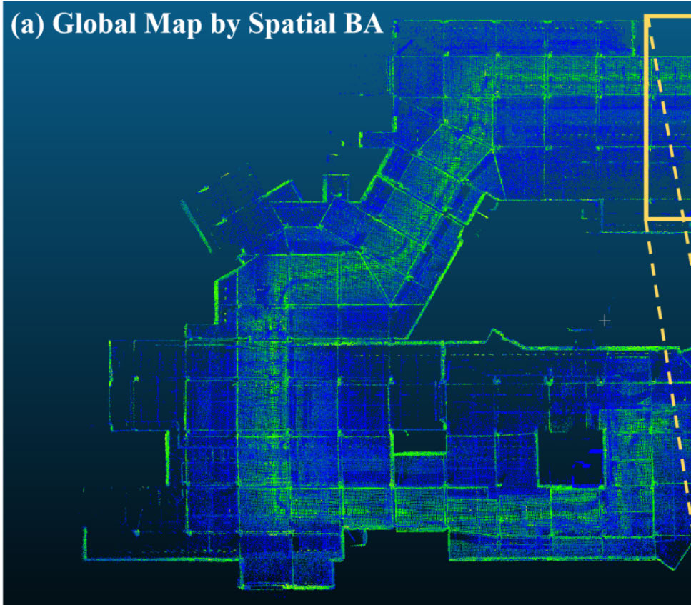

**图 6**：Fig. 6. 第一次位姿图优化，包含里程计和回环约束。第一个机器人的第一个位姿固定为世界坐标系。

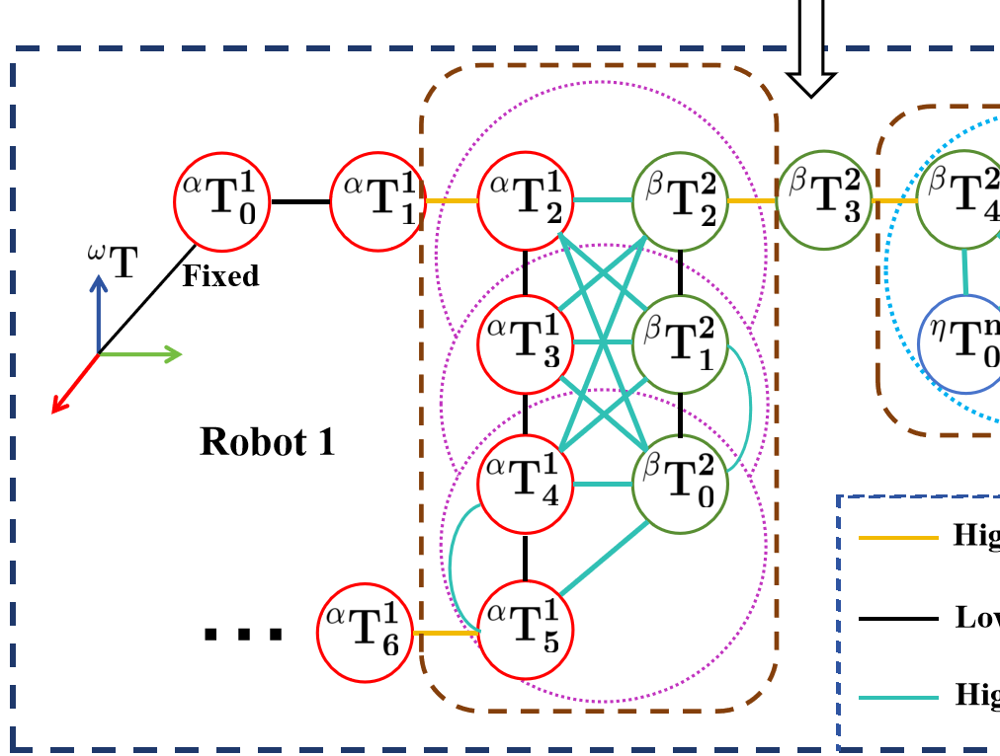

**图 7**：Fig. 7. 上半部分展示了回环处空间窗口内 BA 约束的稀疏化。稀疏的 BA 约束与赋予不同权重的里程计约束一起添加到下方的位姿图中。

来自不同时间或智能体的相同几何结构的特征，为精确的联合优化提供了丰富的约束。
空间 BA 在完成 FPGO 和回环召回步骤后对所有回环执行。根据第 IV 节中的回环分类原理，所有可用的回环分为两类。所有机器人的位姿被利用其空间位置构建成一棵 kd 树以便更快地搜索。对于每个回环，我们定义一个以涉及的两个位姿中点为中心的球形空间窗口。我们利用基于半径的搜索和位姿 kd 树，来有效地检索球形区域内的位姿。这些选择的位姿构成空间 BA 的局部优化窗口，确保仅优化回环周围空间相关的位姿数据。根据第 IV 节分类的回环类型，我们提出了针对它们各自特点设计的两种形式的空间 BA。对于孤立回环，我们应用了我们开发的扩散空间光束法平差 (DBA)。对于聚集回环，我们提出了一种空间变体的层次光束法平差 (HBA)。

## A. 用于孤立回环的 DBA
我们的 DBA 建立在 BALM2 [27] 的基础上。然而，它依赖于准确的初始平面估计，当由不同机器人观察到的同一平面由于地图发散而出现未对齐时，它可能无法可靠地收敛。

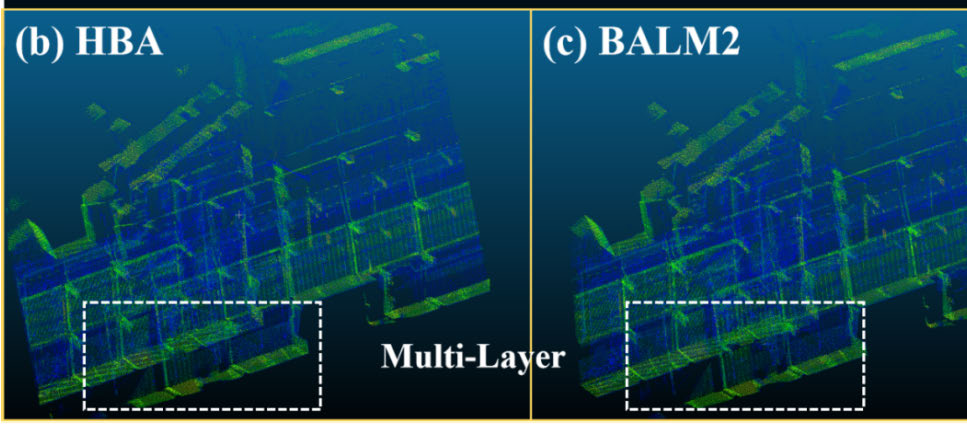

**图 8**：Fig. 8.
在我们的 Garage 数据集中的单机器人研究结果。(a) 显示了由我们的方法生成的全局地图。(b)-(d) 显示了不同方法在回环闭合附近局部地图的细节。

在这种情况下，相同的结构可能会被体素化为独立的多层平面（如图 4 (a) 所示），使得直接优化变得困难。为了解决这个问题，我们按机器人将在空间窗口内的位姿划分为不同的簇，每个簇拥有自己的点云，如图 4 左侧所示。然后，我们应用 GICP [50] 粗略地对齐这些簇，减少平面的分层现象，并为随后的优化实现可靠的平面估计。
然而，GICP 仅提供了多机器人子图的粗略对齐，而不是真正的精细融合。它只是调整不同位姿序列组装出的点云子图的相对变换，但它并未在帧级别上优化多机器人位姿，也未在单次扫描级别上细化点云。在结合了孤立回环进行初始位姿图优化之后，回环中心附近的位姿得到了有效的对齐和优化。然而，随着距回环中心距离的增加，FPGO 中回环约束的影响逐渐减弱，导致较远位姿的优化和对齐不够准确。因此，对于孤立回环，关键是弄清楚其影响范围有多大，并对齐周围受影响的位姿。我们开发了 DBA 来解决这个问题。
我们从一个局限在孤立回环附近小范围内的激光雷达位姿集开始。然后，我们通过逐步加入来自更广范围内的额外激光雷达位姿，以扩散的方式扩大该集合。其关键原则是，在回环影响区域内，离回环中心越远的位姿，对回环特征表示的准确性贡献越小。DBA 的细节如下。
为简化记号，本文采用如下表示法；更详细的信息请参见 [27]。本文将特征视为点簇，第 i 个特征的点簇
for the i-th feature is denoted by set Ci = {pi jk ∈R3|j =
1, . . . , Mp, k = 1, . . . , Ni j}, where Mp is the number of poses,
，记为集合 Ci，其对应的点簇坐标 ℜ(C) 定义为：
ℜ(Ci) ≜
Mp
X
j=1
Ni j
X
k=1
pi jk
1
 pT
i jk
1
=
 Pi
vi
viT
Ni

∈S4×4,
Authorized licensed use limited to: National Institute of Technology- Delhi. Downloaded on August 24,2026 at 05:44:47 UTC from IEEE Xplore.  Restrictions apply.

---

## 原文第 7 页核心内容与翻译

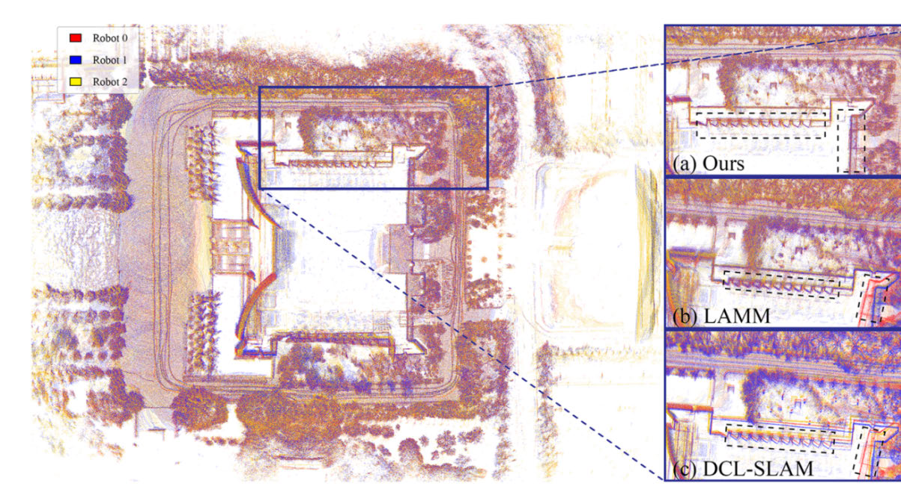

**图 9**：Fig. 9. S3E Library 的地图融合结果。选取三种方法重建的局部地图进行比较。我们的方法几乎消除了子地图发散，而 LAMM [33] 和 DCL-SLAM [31] 存在严重不一致。

Pi =
Mp
X
j=1
Ni j
X
k=1
pi jkpT
i jk,
vi =
Mp
X
j=1
Ni j
X
k=1
pi jk.
(1)
一个以 LiDAR 位姿 T =
(T1, · · · , TMp), and feature parameters π = (π1, · · · , πM f ),
为待定特征参数的 BA 形式，其中 Mf 为特征数量，其优化问题为：
min
T,π
XMf
i=1 c(πi, T)

.
(2)
使用平面特征时，每个代价项表示点到平面的欧氏距离平方，已被证明可写成如下形式（BALM2 [27]）：
ci(T) ≜c(πi, T) = λ3
0
@A
0
@
Mp
X
j=1
T jCfi jTT
j
1
A
1
A ,
A(Ci) ≜1
Ni
Pi −1
N2
i
vivT
i ,
Ci =
Pi
vi
vT
i
Ni

∈S4×4,
(3)
其中 λ3(A) 是矩阵函数 A 的第三大特征值，Cfi j ∈R4×4 为预先计算的矩阵，且
Cfi j =
Pfi j
v fi j
vT
fi j
Ni j

,
Pfi j =
Ni j
X
k=1
pfi jkpT
fi jk,
vfi j =
Ni j
X
k=1
p fi jk.
(4)
利用上述定义，当点簇构成平面特征时，可以使用 Levenberg-Marquardt (LM) 算法通过如下最优更新求解该问题：
∆T⋆= −(H + µI)−1 JT,
(5)
其中 µ 为阻尼参数，J 和 H 分别为代价函数的 Jacobian 矩阵和 Hessian 矩阵。在 DBA 中，我们根据位姿到回环的距离将位姿划分为 D 组，每组包含一组位姿，第 di 组的位姿数量记为 diMp（i = 0, ..., D）。下面首先说明，在这种增量式 BA 中，最优更新公式能够很好地近似对全部特征联合执行 BA；随后证明其算法复杂度低于传统 BA 方法，并且具有相对更高的置信度，因而实践性能更好。在第 i 个扩散过程中，将此前 i 个扩散过程中参与优化的所有位姿视为准确位姿并冻结其梯度，即不再进一步优化。因此，在优化第 i 个过程时，可将位姿分为两组 0T 和 1T，其数量分别为
numbers of Mp0 ≜Pi−1
k=0
dk Mp and Mp1 ≜diMp.
假设 1：参与 BA 的近距离 LiDAR 位姿 Mp0 具有显著小于外部位姿 Mp1 的测量噪声协方差 Σc fi j。根据矩阵 A 的定义，有
A(C) ∈S3×3. Hence, based on the differential assumption for
cost function in [30], the LM Jacobian and Hessian for DBA
can be partitioned conformably as:
H =
"
H00
H01
H10
H11
#
,
J =
J0
J1

.
使用式 (5) 的 LM 优化，可分别推导联合 BA 和 DBA 中组 Mp1 的位姿更新：
∆1Tjoint = −S−1(J1 −H10(H00 + µI0)−1J0),
Authorized licensed use limited to: National Institute of Technology- Delhi. Downloaded on August 24,2026 at 05:44:47 UTC from IEEE Xplore.  Restrictions apply.

---

## 原文第 8 页核心内容与翻译

WANG et al.: LEMON-MAPPING: LOOP-ENHANCED LARGE-SCALE POINT CLOUD MERGING AND OPTIMIZATION
12325
∆1TDBA = (−(H11 + µI1)−1J1),
(6)
其中 S = H11 + µI1 −H10(H00 + µI0)−1H01 为 Schur 补。
联合优化可以被看作是一种更新方法，它为 DBA 方法改进了耦合项 H10 = HT
01。
因此，根据等式 (7)，Hessian (rH) 和 Jacobian (rJ) 的两个细化率被定义为耦合贡献与主项的比率：
rH = ∥H10(H00 + µI0)−1H01∥
∥H11 + µI1∥
,
rJ = ∥H10(H00 + µI0)−1J0∥
∥J1∥
.
(7)
这两个细化率越小，被忽略的耦合项相对于活动块 (active-block) 项的影响就越不显著。在假设 1 下，内部位姿被视为高置信度锚点，因为它们在先前的扩散步骤中已被优化，并且得到了低噪声测量的支持。在局部噪声加权最小二乘解释中，这对应于更强的内部信息块 H00，使得当内部块在局部非退化时，(H00 + µI0)−1 相对较小。因此，Schur 修正项 H10(H00 + µI0)−1H01 和 H10(H00 +
µI0)−1J0 被抑制。因此，DBA 可以被解释为联合 BA 的活动块近似：当 rH 和 rJ 较小时，DBA 更新紧密匹配完整联合优化的活动块更新，同时避免了联合优化所有位姿的代价。在实践中，当在冻结的内部回环和活动的外部回环之间选择较小的交叉耦合时，这种近似得到了进一步的保证。
引理 1（DBA 计算复杂度的降低）：
令位姿总数为 M = PD−1
i=0 mi，其中
mi ≜diMp 表示第 i 个扩散组中的位姿数量，为简单起见。对所有位姿进行联合 BA 优化的复杂度为
O
 
Mf M + Mf M2 + M3 
.
相比之下，DBA 增量式地执行 BA，其总复杂度为
O
Mf
X
i
mi + Mf
X
i
m2
i +
X
i
m3
i
!
,
该复杂度严格不大于，并且通常远小于前者。特别是，当扩散组的大小相当，即 mi ≈M/D 时，二次项和三次项分别减少了大约 D 倍和 D2 倍。
证明：见附录 (A)。
□
该证明最多使用 D 个扩散步骤，而在实践中，DBA 是在对内部组位姿具有强置信度的情况下使用的，次数很少，远低于 D。
让我们使用协方差估计来估计估计位姿的置信度。表示 Cf = {Cfi j}, δCf =
{δCfi j}，并且根据 BALM2 将使用测量的簇 Cf 得到的收敛解记为 T⋆，我们得到：
δT⋆= H−1 ∂JT  
T⋆, C f
 
∂Cf
δCf ∼N (0, ΣδT⋆) ,
(8)
ΣδT⋆= H−1 ∂JT  
T⋆, Cf
 
∂Cf
ΣδCf
J
 
T⋆, C f
 
∂Cf
H−T
= H−1
0
（授权许可使用限制：National Institute of Technology- Delhi。于2026年8月24日 05:44:47 UTC从IEEE Xplore下载。适用限制。）

---

## 原文第 9 页核心内容与翻译

@
Mf
X
i=1
Mp
X
j=1
Li jΣcfi jLT
i j
1
A H−T.
(9)
并且我们可以获得
Σcfi j =
Ni j
X
k=1
Bfi jkΣpfi jk BT
fi jk ⪰0,
B fi jk ∈R9×3.
(10)
∂JT
∂cfi j
=
2
6664
...
∂(Jp)T
∂c fij
...
3
775 =
2
664
...
Lp
i j
...
3
775 ≜Li j ∈R6Mp×9.
(11)
引理 2（协方差排序：DBA 与联合 BA）：与上面的划分类似，令关于特征簇的 Jacobian 导数块为
Li j =
"
0Li j
1Li j
#
,
Σc fij ⪰0.
定义由簇噪声引起的联合位姿协方差扰动为
Σjoint
δT⋆= H−1
0
@
Mf
X
i=1
Mp
X
j=1
Li j Σc fi j L⊤
i j
1
A H−T,
并令 Σjoint
11
为其右下角块（联合 BA 下块 1 的协方差）。对于 DBA（块 0 冻结，仅优化块 1）定义
ΣDBA
1
= H−1
11
0
@
Mf
X
i=1
X
j∈group1
1Li j Σcfi j
1Li j
⊤
1
A H−T
11 .
于是，在 H 和 H00 满足通常的可逆性假设时，有如下半正定序关系：
ΣDBA
1
⪯Σjoint
11 .
因此，冻结良好测量的内部位姿（块 0）产生的活动位姿协方差不大于（并且通常小于）这些相同位姿在完整联合 BA 下的协方差。注意，该不等式的成立不需要假设内部位姿被测量得更好。
证明：见附录 (B)。
□

## B. 用于聚集回环的 HBA
对于来自具有显著空间重叠的不同机器人的两条轨迹，回环往往密集分布，相邻回环的关联点云地图通常共享大面积的公共区域。在这种情况下，至关重要的是联合处理整个重叠区域内的回环以保持局部一致性。为了解决这个问题，我们将 HBA [28] 调整并扩展到一个用于聚集回环场景的多机器人框架中。
原始的 HBA 依赖于来自单个机器人的时间有序位姿，假设相邻的位姿共享公共的点云特征。然而，在我们的设置中，通过回环簇内 kd 树半径搜索选择的位姿是无序的，并且可能
（授权许可使用限制：National Institute of Technology- Delhi。于2026年8月24日 05:44:47 UTC从IEEE Xplore下载。适用限制。）

---

## 原文第 10 页核心内容与翻译

来自不同的机器人。为了解决这个问题，我们使用主成分分析 (PCA) [52] 分析选定位姿的空间分布，并沿着由最大特征值定义的主轴对它们进行重新排序，如图 5 所示。
这种空间重新排序确保了优化序列中的相邻位姿在空间上也很接近，从而促进共享特征和有效的约束。一旦重新排序，所有位姿将在统一的优化窗口中一致处理，使增强的 HBA 能够准确对齐来自多个机器人的重叠区域的几何形状。

# VI. 两步位姿图优化
两步 PGO 用于对齐和细化多机器人轨迹的全局结构。细节如下。
## A. 第一次位姿图优化
在回环处理之后，我们执行第一次位姿图优化 (FPGO) 以粗略对齐所有机器人的轨迹。我们构建了一个中心化位姿图，如图 6 所示，其中每个机器人的位姿序列作为一个子图包含在内。该图包含了三种类型的约束：里程计、自回环和间回环。第一个机器人的第一个位姿被固定以定义世界坐标系的原点，确保其他轨迹对齐到这个全局参考系。建立这种初始对齐后，我们获得了所有机器人轨迹之间相对位置的粗略估计，这使我们能够恢复有效但以前被拒绝的回环（在第 IV 节中）。被召回的回环被加回到回环集中，并在 FPGO 中用作约束。这个包含优化和召回的过程会重复进行，直到没有新的回环被召回。

## B. 最终位姿图优化
尽管空间 BA 提高了回环闭合附近局部位姿的精度，但它并没有实现全局一致性，并且可能会破坏里程计的连续性。为了解决这个问题，我们开发了最终位姿图优化 (LPGO)。
我们构建具有两种类型约束的 LPGO：维持轨迹平滑性的里程计约束，以及保留局部精细结构的基于 BA 的稀疏化约束（见图 7）。对于每个机器人，在相邻位姿之间添加里程计约束，以保持时间连续性。在 BA 优化的位姿与未优化的位姿相邻的情况下，会应用高权重的里程计约束，以减轻由局部优化引入的潜在不连续性。相反，在两个未优化的位姿之间分配较低的权重，以允许更大的全局调整灵活性。此外，在空间 BA 窗口内，对表现出强几何重叠和可靠对应关系的位姿对分配高权重的 BA 约束，以保持局部精度。
我们对不同机器人的位姿对和同一机器人的位姿对之间的约束选择使用两种不同的度量。对于不同的机器人，我们评估它们从 RING++ [24] 获得的描述子的相似性，只有当相似性超过指定阈值时才添加 BA 约束。对于同一机器人内的位姿对，我们应用来自 [53] 的两两配准 (pair-wise registration) 技术，选择性地保留显著相互约束的位姿之间的约束。稀疏化过程如下。
对于连接属于同一个机器人的两个位姿节点的边 Ek，令 E0
k 和 E1
k 表示对应位姿的索引。这两个位姿之间的残差 ϵk 及其关联的协方差矩阵 Ωk 可以使用两两配准方法进行估计。为了清晰起见，我们将 E0
k 和 E1
k 处的位姿分别表示为 (RL0, tL0) 和 (RL1, tL1)。从坐标系 L0 到 L1 的相对变换计算为 RL0
L1 = R⊤
L0RL1 以及 tL0
L1 = R⊤
L0(tL1 −tL0)。基于最近邻匹配，我们获得了点对点的对应关系
{(PL0
u , PL1
u )}U
u=1，其中 U 表示匹配对的总数。这些对应关系用于表述与边 Ek 相关的配准残差函数 ϵreg
k
。
ϵreg
k
=
U
X
u=1
(RL0
L1PL1
u + tL0
L1 −PL0
u ),
(12)
配准残差函数 ϵreg
k
针对同一机器人 RL0
L1, tL0
L1 两个相对位姿的 Jacobian 矩阵由 (13) 计算得出。
Jreg
k
=
U
X
u=1
 −
 
PL0
u
 
×
0
0
I
 
.
(13)
配准函数 ϵreg
k
的协方差 Ωk
可按如下方式计算。
Ωk = Jreg⊤
k
Jreg
k .
(14)
协方差的最小特征值 λmin
k
= λmin(Ωk)
可用于表示第 E0
k-个位姿和第 E1
k-个位姿之间的约束能力。当两个节点的 λmin(Ωk) 
足够小时，它们之间的 BA 约束将被保留并添加到图 7 中的位姿图里。反之，对于具有较大 λmin(Ωk) 值的第 E0
k-个位姿和第 E1
k-个位姿之间，将不会添加来自 BA 的约束。
# VII. 实验
## A. 实验设置
所有算法均使用机器人操作系统 (ROS) [54] 以 C++ 实现。为了评估 LEMON-Mapping 的性能，我们在多个数据集上进行了实验，包括公开可用的 S3E [55]、GEODE
[56]、MARS-LVIG [1]、R3LIVE [57] 数据集，以及一个我们自己收集的数据集。GEODE、MARS-LVIG 和 R3LIVE
数据集被分割成具有重叠的多个序列 (session)，但每个部分的起点是不同的，且相对变换是未知的。我们自己收集的
数据集和公开数据集的参数分别如表 I 和表 II 所示。对于所有公开数据集，初始里程计
使用各自数据集推荐的 LiDAR-Inertial-Odometry 方法获得，而我们自己的数据集的初始里程计
使用 FAST-LIO2 [14] 生成。
评估结构如下。我们首先在第 VII-B 节中将我们提出的空间 BA 与两个最先进的基线 BALM2 [27] 和 HBA [28] 进行比较。
为了评估整个系统的定位性能，我们在第 VII-C 节中对我们的框架与 DCL-SLAM [31] 和 LAMM
（授权许可使用限制：National Institute of Technology- Delhi。于2026年8月24日 05:44:47 UTC从IEEE Xplore下载。适用限制。）

---

## 原文第 10 页核心内容与翻译

WANG et al.: LEMON-MAPPING: LOOP-ENHANCED LARGE-SCALE POINT CLOUD MERGING AND OPTIMIZATION
12327
表 I
自采集数据集概览
表 II
公开数据集概览
[33] in Section VII-C. Mapping quality and loop closure
processing are then thoroughly evaluated in Sections VII-D
and VII-E, respectively. Furthermore, an ablation study is
conducted in Section VII-F to dissect the individual contri-
butions of key components. We also investigate the scalability
of our approach under an increasing number of sessions
（第 VII-G 节）。最后，第 VII-H 节分析了运行时间和内存效率，以证明我们系统的实际可行性。
## B. 单机器人研究
我们在这里利用包含几个室内和室外场景的自收集单机器人数据集（表 I）。在数据采集过程中，z 轴值在每个场景中基本保持稳定，使其能够作为评估垂直漂移的参考。
我们数据集中的每个序列都包含启用空间 BA 的回环。我们将我们的空间 BA 与 BALM2 [27] 和 HBA [28] 进行比较，使用平均 z 轴漂移 (z-DRIFT) 和 z 轴均方根误差 (z-RMSE) 作为主要评估指标。这两个指标都是相对于第一帧的 z 值作为参考计算的，从而可以一致地评估随时间推移的垂直对齐情况。由于缺乏地面真实值，我们还使用 MapEval [58] 计算平均地图熵 (MME)，其中较低的值表示更好的地图一致性和更少的杂乱。为了确保公平

**表 III**
单机器人研究中的 MME, z-DRIFT 和 z-RMSE

**表 IV**
定位研究中 ATE(M) 的 RMSE

比较这三种 BA 方法的性能，所有方法都在没有进行任何先前的基于回环的优化的原始里程计轨迹上进行评估。为了在大规模场景中实现计算可行性，BALM2 在滑动窗口配置下运行。
表 III 展示了结果。我们的方法在 Library 和 Yard 场景的所有指标中都取得了最佳性能。此外，它在 z-DRIFT 和 z-RMSE 方面始终优于 BALM2 和 HBA，证明了其在减轻全局漂移方面的卓越能力。图 8 显示了 HBA、BALM2 和我们提出的方法在 Garage 序列中的建图性能，其中带框区域指示了发生回环的区域。可以看出，基线方法在该区域表现出显著的分层，而我们的方法实现了卓越的对齐。这一结果清楚地证明了我们的空间 BA 方法在处理回环区域方面的强大能力。
## C. 多机器人定位研究
为了进一步评估提出的框架，我们使用 MARS-LVIG [1]、GEODE [56] 和多机器人 S3E [55] 数据集进行了对比多机器人实验。我们的框架与多机器人 SLAM 系统 DCL-SLAM [31] 和多时序地图融合方法 LAMM [33] 进行了比较。
地图融合的准确性使用绝对轨迹误差 (ATE) 的均方根误差 (RMSE) 来评估（单位：米）。失败定义为 RMSE 大于 30 米的任何序列，在表中用“×”表示。如表 IV 所示，最佳值以粗体突出显示。我们的框架成功融合了所有
（授权许可使用限制：National Institute of Technology- Delhi。于2026年8月24日 05:44:47 UTC从IEEE Xplore下载。适用限制。）

---

## 原文第 11 页核心内容与翻译

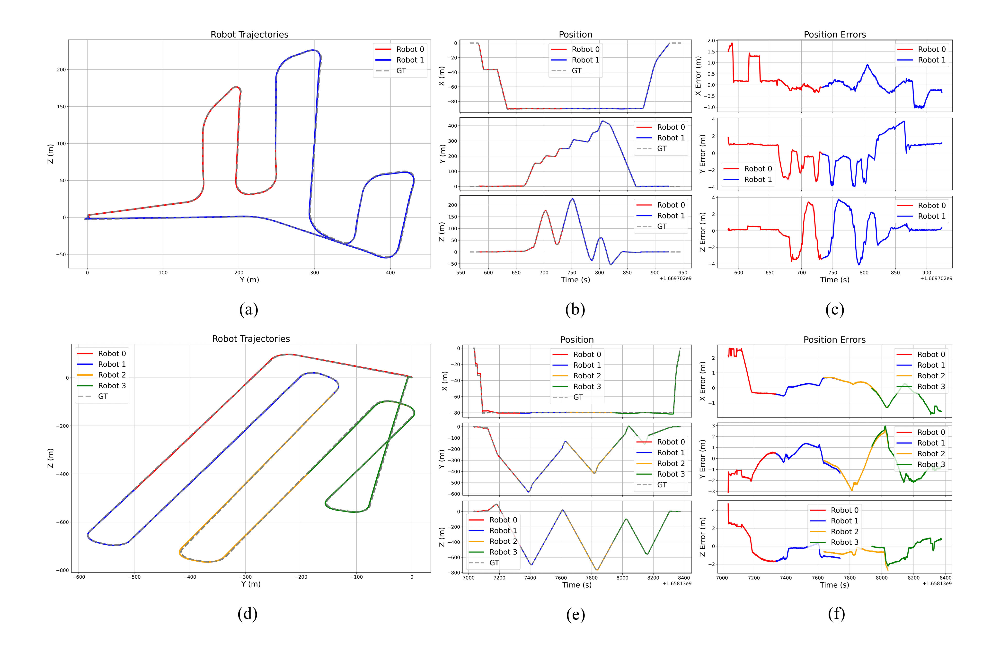

**图 10**：Fig. 10. MARS-LVIG Island ((a)-(c)) 和 Town ((d)-(f)) 中提出方法的优化轨迹、位置和位置误差。

序列，而 LAMM 和 DCL-SLAM 分别在四个和六个序列中失败。在成功的案例中，我们的框架实现了显著较低的 RMSE 值，表明具有更高的融合精度。
我们选择了一个三种方法都成功融合多机器人点云的场景进行展示。图 9 可视化了来自 S3E Library 序列的结果。左图显示了我们全局一致且准确的融合地图，而右侧部分显示了三种方法的局部融合地图。我们的方法产生了紧密对齐的局部地图，而 LAMM 和 DCL-SLAM 则表现出严重的局部发散。
轨迹与地面真实值的比较进一步证实了我们方法卓越的准确性。图 10 显示了不同场景下的优化轨迹和误差图。我们的框架生成的多机器人轨迹与地面真实值高度一致，同时跟踪误差保持在较低且稳定的水平，从而证明了我们方法的卓越性能和鲁棒性。图 11 和图 12 展示了我们的方法与基线之间多机器人轨迹的比较。我们的方法估计的轨迹紧跟每个机器人的地面真实值，表现出较低且稳定的误差。相比之下，基准方法在某些区域显示出显著的偏差，在其他区域显示出微小的局部不一致。大偏差可能是由不正确的回环闭合引起的，而局部不一致可能是由于缺乏光束法平差导致的，无法消除子图的发散。
这种性能差异可以归因于 LAMM 和 DCL-SLAM 仅仅依赖具有回环约束的 PGO，这忽略了重叠局部区域的精细优化。缺乏对点云地图几何结构的关注导致严重的局部多机器人地图发散。我们的框架明确地重新审视了回环闭合的作用，并通过在局部区域执行空间 BA 来增强利用率，同时通过最终的位姿图优化将精细化的结果传播到全局。这一过程有效地减少了发散并确保了一致的多时序地图融合。
## D. 多机器人建图质量评估
在本节中，我们评估多机器人建图质量。对于 MARS-LVIG 数据集，地面真实地图是由 DJI L1 LiDAR 传感器生成并使用 DJI Terra 系统处理的高精度点云。对于 S3E 数据集，由于没有地面真实地图可用，并且地面真实位姿不包含旋转信息，我们使用平均平面厚度和平面度指标来评估重建地图的几何质量。评估指标的详细定义在 MapEval [58] 中提供。
表 V 展示了我们的方法与 LAMM 之间建图质量的定量比较。我们的方法在所有数据集上都取得了最佳性能，包括更低的平均 Wasserstein 距离 (AWD)、更低的倒角
（授权许可使用限制：National Institute of Technology- Delhi。于2026年8月24日 05:44:47 UTC从IEEE Xplore下载。适用限制。）

---

## 原文第 12 页核心内容与翻译

WANG et al.: LEMON-MAPPING: LOOP-ENHANCED LARGE-SCALE POINT CLOUD MERGING AND OPTIMIZATION
12329

**图 11**：Fig. 11. 我们的方法、LAMM 和 DCL-SLAM 在 S3E Library 上的多机器人轨迹和误差比较。在图中，地面真实值显示为虚线。

距离 (CD)、更小的空间一致性得分 (SCS) 和更低的平均地图熵 (MME)。这些结果表明，我们的方法产生了与地面真实地图对齐得更好的高质量地图。在涵盖超过 100,000 平方米区域的这三个大型环境中，我们的 AWD 范围为 0.25 m 至 0.65 m，CD 范围为 0.43 m 至 1.11 m，证明了与地面真实地图的强一致性。此外，较低的 SCS 和 MME 值表明我们的方法实现了比 LAMM 更好的空间一致性，这可以归因于提出的空间 BA 和旨在提高局部精度和全局一致性的 LPGO。此外，图 13 可视化了 Island 数据集上的 Wasserstein 距离分布。如图 13 (a) 所示，误差集中在 3σ 边界 (0.93 m) 内，大多数体素在 0.25 m 左右。图 13 (b) 显示几乎所有体素的 Wasserstein 距离值都低于 0.5 m 并呈现空间一致的分布，表明重建的多机器人地图保持了高度的空间一致性。
表 VI 报告了 S3E 数据集中所有序列的平均平面厚度和平面度评估结果。与基线相比，我们的方法取得了最佳性能，

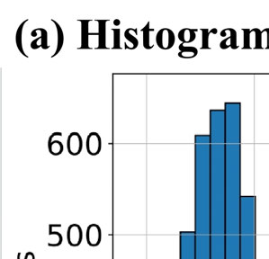

**图 12**：Fig. 12. 我们的方法在 S3E Tunnel 上的多机器人轨迹比较，同图 11。

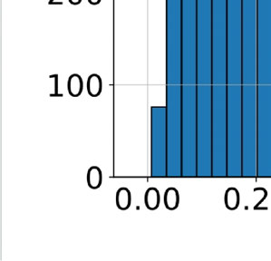

**图 13**：Fig. 13.
Island 数据集上 Wasserstein 距离误差的可视化。
(a) 所有体素上误差的直方图，其中虚线表示 3σ 边界 (0.93 m)。(b) 从多个坐标处可视化的体素级误差的空间分布，显示了整个环境中重建质量的一致性。

表明我们的空间 BA 显著提高了几何精度，并有效地减轻了基于 PGO 的方法中常见的多机器人地图发散现象。
### E. 回环处理研究
本节深入研究第 IV 节中的回环处理模块。我们在 S3E 数据集上开展全面实验，以验证整个回环处理流程的有效性。
Authorized licensed use limited to: National Institute of Technology- Delhi. Downloaded on August 24,2026 at 05:44:47 UTC from IEEE Xplore.  Restrictions apply.

---

## 原文第 13 页核心内容与翻译

表 V
建图质量评估
表 VI
几何精度比较

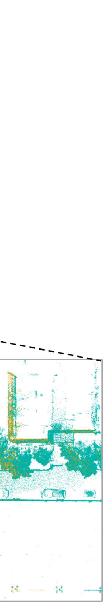

**图 14**：Fig. 14.
（a）显示启用回环召回后的 Laboratory 全局地图；（b）和（c）分别给出同一区域未使用和使用回环闭合时的放大视图。在（c）中，召回的回环信息改善了多机器人地图之间的对齐和一致性。

首先，我们突出回环召回模块的作用。我们
比较启用和不启用回环召回（LR）时 FPGO 的性能，使用 ATE 的 RMSE（m）作为指标，表中分别记为“RMSE w/ LR”和“RMSE w/o LR”。由于
S3E 数据集包含大量复杂及高度相似的场景，容易产生大量错误回环，因此选用它开展回环召回实验。
表 VII 展示了不同回环处理阶段的回环数量，以及
启用和不启用回环召回时 FPGO 的结果。实验表明，召回误删的回环后，FPGO 的误差更小、性能更好。回环召回除影响 PGO 外，还为后续光束法平差引入了额外约束。图 14 展示了
the results in our laboratory scene. (a) presents the global
表 VII
回环闭合召回比较
表 VIII
回环闭合异常值剔除比较
包含回环召回步骤的全局地图。（b）和（c）分别比较未使用和使用回环召回时的局部建图结果。可以明显看出，回环召回引入的额外约束显著改善了选定区域内的点云对齐。
为评估所提异常值剔除模块的有效性，我们将其与两种常用的回环异常值剔除方法 PCM [35] 和 GNC [49] 进行比较。所有方法均采用
相同的原始回环候选
from RING++ [24] as input. Since both PCM and GNC are
sensitive to parameter choices, we perform a parameter sweep
for each baseline. For PCM, we vary the pairwise consistency
threshold using 15 settings ranging from 0.02 to 50.0. For
GNC, we vary the robust residual truncation threshold ¯c using
9 settings ranging from 5 to 40.
Table VIII reports the loop rejection results. Since ground-
truth labels for loop closure candidates are unavailable, we
use the optimized trajectory as reference (obtained by full
framework) and regard a candidate as correct if the Euclidean
distance between the two associated poses is below 5 m.
保留的回环被视为预测正例，并据此计算回环数量、精确率、召回率和 F1 分数。对于 PCM 和 GNC，“Best-F1”表示最佳
result among all tested parameters, while “P≥Ours” denotes
the setting that preserves the most loops under the constraint
that its precision is no lower than ours. Entries marked with
“–” indicate that no tested setting satisfies this constraint. In
the table, bold F1 scores highlight the best result among ours
Authorized licensed use limited to: National Institute of Technology- Delhi. Downloaded on August 24,2026 at 05:44:47 UTC from IEEE Xplore.  Restrictions apply.

---

## 原文第 14 页核心内容与翻译

WANG et al.: LEMON-MAPPING: LOOP-ENHANCED LARGE-SCALE POINT CLOUD MERGING AND OPTIMIZATION
12331
表 IX
消融研究中的 ATE（m）RMSE
and the Best-F1 settings of PCM/GNC for each dataset, and
colored entries highlight notable loop loss under the precision-
constrained setting.
结果表明，我们的方法在异常值剔除与内点保留之间实现了更有利的平衡。在
Campus 1, Dormitory, and Library, our method achieves
higher F1 scores than both PCM and GNC under their Best-
F1 settings, while in Tunnel it remains comparable to the
best GNC result. More importantly, the P≥Ours results show
that, when constrained to reach the same precision level as
our method, the baselines often retain substantially fewer
loop closures, or fail to find a feasible parameter setting. For
example, in Library, GNC retains only 55 loop closures under
this constraint, compared with 238 retained by our method.
These results indicate that PCM and GNC are more sensitive
to the precision–recall trade-off, whereas the proposed loop
processing module preserves a sufficient number of reliable
loop closures while maintaining high precision, providing
clean and sufficiently dense constraints for the PGO and BA
stages.
### F. 消融研究
为理解各组件对框架的贡献，我们在 S3E、GEODE、MARS-LVIG 数据集及自采集数据集上开展消融实验。自采集数据集的所有序列被划分为两个时序。我们评估地图融合模块的三个变体：(1) 第一次位姿图
仅使用第一次位姿图优化 (FPGO)、(2) 第一次位姿图优化和空间光束法平差 (FPGO + BA) 以及 (3) 完整的 LEMON-Mapping 系统 (LEMON Full)。使用 ATE 的 RMSE (m) 进行定量比较。
表 IX 总结了结果，最佳值以粗体突出显示。完整的框架始终获得最低的 RMSE，验证了结合空间 BA 和两步 PGO 的有效性。对于 FPGO + BA 的变体，虽然局部 BA 提高了相对精度，但它可能会破坏里程计的连续性，因为它只优化了回环区域。因此，与单独使用 FPGO 相比，单独使用它可能会增加 RMSE。然而，最终的 PGO 结合了局部 BA 约束和里程计连续性，将局部精度传播到全局地图，并显着降低了 RMSE。

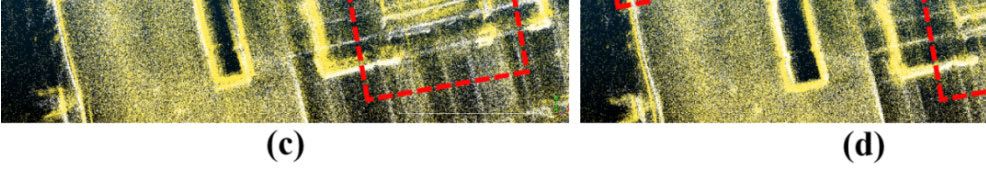

图 15 显示了我们飞行竞技场 (Flying Arena) 场景中上述三个变体的地图融合结果。(a) 和 (b) 展示了空间 BA 提高局部一致性和

**图 15**：Fig. 15. 我们飞行竞技场数据集中的消融实验结果。(a) 和 (b) 显示了 FPGO 和 FPGO + BA 的融合地图。(c) 和 (d) 显示了 FPGO + BA 和 LEMON-mapping 完整模型的融合地图。比较区域用红色框出。

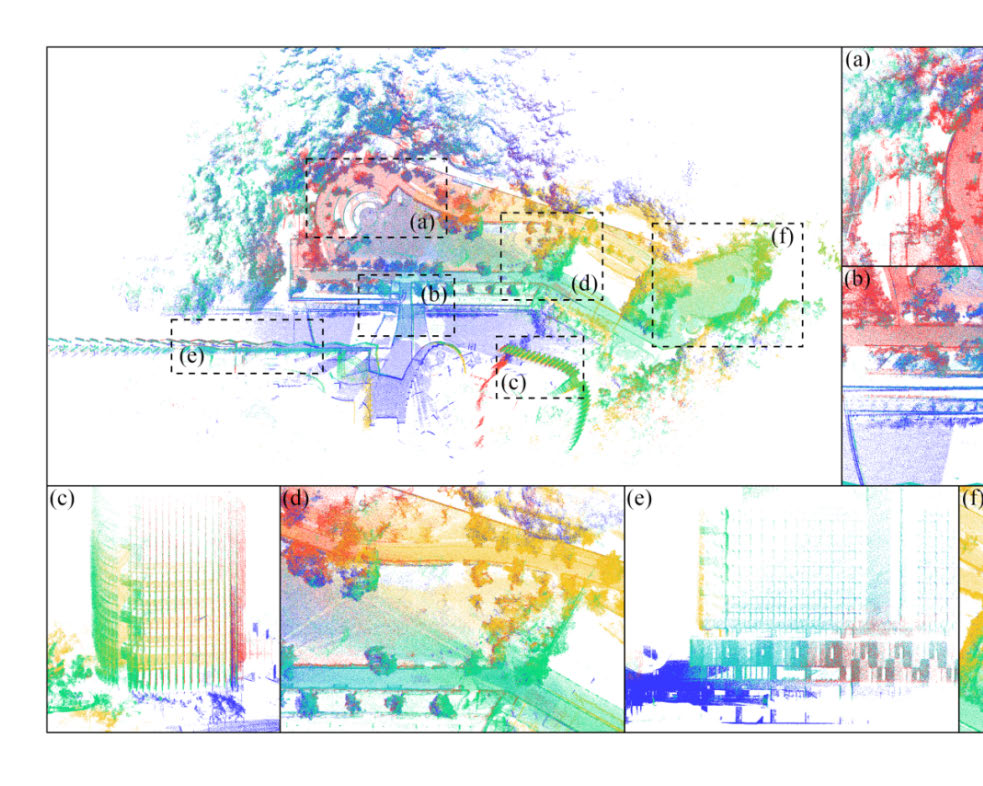

**图 16**：Fig. 16. S3E Library 中粗配准 (a) 和精细多机器人空间 BA (b) 的地图比较。可以清楚地看到，GICP 仅实现了多机器人子图的基本对齐。在上图中，树干和标志显示出明显的未对齐，并且道路边缘明显模糊。在下图中，台阶表现出严重的发散。相比之下，在进行精细的空间 BA 后，子图变得完全一致，具有出色的几何质量和清晰的边缘结构。

**表 X**
可扩展性研究结果

精度的功能，与仅使用 PGO 相比。图 15 中的 (c) 和 (d) 进一步说明了使用 BA 和最终位姿图优化 (LPGO) 进行精细化的地图比仅使用 BA 的地图具有更好的全局一致性，证实了 LPGO 在保持全局地图结构中的作用。
特别地，我们将粗略的 GICP 配准和提出的精细空间 BA 进行了可视化比较。图 16 (a) 显示了基于 GICP 的粗对齐的结果，其中仅实现了基本的子图对齐，并且在树干、交通标志和道路边界中出现了明显的未对齐现象。
（授权许可使用限制：National Institute of Technology- Delhi。于2026年8月24日 05:44:47 UTC从IEEE Xplore下载。适用限制。）

---

## 原文第 15 页核心内容与翻译

**图 17**：Fig. 17. R3LIVE HKU Park 的五个序列数据集的地图融合结果。(a)-(f) 的局部地图被放大以显示细节。

图 16 (b) 显示了应用提出的空间 BA 后的结果，其中子图变得完全一致，边缘结构清晰，几何质量显著提高。这证实了空间 BA 是高精度多机器人建图的关键组件。由于 GICP 仅确保粗略的子图级别对齐，提出的空间 BA 在位姿级别执行细粒度的联合优化，实现了全局一致和局部准确的地图重建。因此，原本发散的多机器人点云被优化以实现高度一致和精确的重建，接近在短距离单机器人建图中通常观察到的几何保真度。

## G. 可扩展性研究
大多数现有的地图融合框架仅限于涉及少数机器人（在 [31]、[32]、[33]、[46] 中少于五个）的场景，它们在大型部署中的可扩展性尚未得到证实。为了评估我们提出的框架的可扩展性，我们在 R3LIVE 数据集上进行了实验，我们将其细分为 5、10 和 20 个序列 (session) 组。成功的融合被定义为每个序列与其共享足够地图重叠的所有相邻序列正确对齐。
表 X 总结了三种情况的相应结果。我们的框架在所有实验中均实现了 100% 的成功率，包括 5 个序列、10 个序列和 20 个序列的场景。这些结果证明了 LEMON-Mapping 系统在处理大量多机器人地图融合时的可扩展性和鲁棒性。

图 17 可视化了 R3LIVE 数据集中 HKU Park 的五个序列情况的融合地图，包括鸟瞰图 (BEV) 视角的全局点云地图和 6 个放大的地图细节。这五个序列的地图在结构化和非结构化环境中都显示出良好的融合
效果和局部精度。

## H. 运行时间和内存效率分析
为了评估计算效率和可扩展性，我们将包含五个 S3E 序列的 LEMON-Mapping 与 HBA [28] 和全局完整的 BALM2 [27] 流程进行了比较。
如图 18（中）所示，我们的执行时间主要由回环数量决定，而不是由轨迹总长度决定。例如，在包含密集回环的序列（如 Campus 3（238 个回环）和 Library（191 个回环））中，由于频繁激活局部空间 BA 窗口，运行时间会增加。相反，Dormitory 序列（62 个回环）只需约 70 秒即可完成。图 18（上）显示计算预算主要由 HBA（约 67%–80%）和簇预处理（约 17%–28%，涉及 PCA 重新排序和 GICP 粗对齐）占据。这种分布非常符合我们的设计，即将计算重点放在解决关键重叠区域内的多机器人对齐不准的问题上。相比之下，Isolated DBA 和全局 PGO 对齐速度非常快，分别仅消耗了总运行时间的不到 5%。
内存效率的结果展示在图 18 的底部图表中。LEMON-Mapping 在所有序列中始终保持轻量级和有界的内存使用，甚至优于 HBA 基线。相比之下，“Full BA (fused)”流程由于全局 Hessian 矩阵的规模而需要大量的 30–50 GiB 内存。请注意，以原始 10Hz 速率执行传统的全局 BALM2 总是会触发内存不足 (OOM) 故障。为了能够进行可行的基线比较，它必须强制将 f 帧（例如，f = 30）聚合到单个子图中。
这种完整的 BA 高昂的内存进一步强调了
（授权许可使用限制：National Institute of Technology- Delhi。于2026年8月24日 05:44:47 UTC从IEEE Xplore下载。适用限制。）

---

## 原文第 16 页核心内容与翻译

WANG et al.: LEMON-MAPPING: LOOP-ENHANCED LARGE-SCALE POINT CLOUD MERGING AND OPTIMIZATION
12333

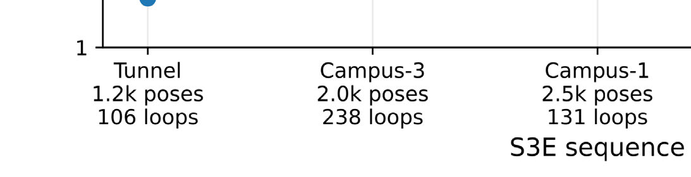

**图 18**：Fig. 18. S3E 数据集上的全面效率评估。（上）我们框架内各个模块的运行时间百分比细分。（中）跨不同序列的计算运行时间比较，并明确标注了每个数据集的位姿总数、回环数和完整 BA 降采样因子 f。（下）峰值内存消耗比较。

我们的方法在内存效率方面具有轻量级的特性。

我们的方法在内存效率方面具有轻量级的特性。
# VIII. 结论与未来工作
本文提出了 LEMON-Mapping，这是一个用于全局一致建图的回环增强型大规模多时序点云地图融合和优化框架。LEMON-Mapping 是一个适用于大量机器人的可扩展框架。与现有的仅依赖位姿的方法不同，它利用重叠点云的几何约束来实现精度的转移。它具有用于可靠选择和召回的回环处理模块，以及由两步位姿图优化和基于窗口的空间光束法平差驱动的地图融合模块。这种架构实现了跨无序的多机器人轨迹的几何感知、全局一致的优化。未来的工作将集中在两个主要方向。首先，为了进一步提高多时序建图的准确性，我们计划通过对点云残差进行概率建模，开发一种有原则的、定量的协方差估计策略，推导维度一致的信息矩阵以取代当前的启发式权重。其次，利用我们局部化空间 BA 极低的内存占用，我们计划引入多线程并行计算架构。通过同时优化独立的空间窗口，我们旨在大幅减少总体运行时间，并在大规模部署中实现高度优化的时空权衡。
# 附录
## 引理的证明
### A. 引理 1 的证明
证明：对所有 M 个位姿进行联合 BA 的复杂度为
Cjoint = O
 
Mf M + Mf M2 + M3 
,
其中这三项分别对应于评估特征残差、构建 Hessian 矩阵和求解 LM 线性系统。
通过组大小 mi 展开二次项和三次项，得到
M2 =
X
i
mi
!2
=
X
i
m2
i + 2
X
i< j
mimj,
M3 =
X
i
mi
!3
=
X
i
m3
i + (mixed cross-group terms).
因此，联合 BA 不仅包括每组的贡献
P
i m2
i 和 P
i m3
i ，还包括所有的跨组相互作用项
如 mimj, m2
i mj, 和 mim jmk，当多个组具有相当大小时，这些项占主导地位。
在 DBA 中，只有当前扩散组
i 中的位姿保持活动状态，而所有内部组都被冻结。因此，在扩散步骤 i 中执行的 BA 的复杂度为
O
 
Mf mi + Mf m2
i + m3
i
 
.
将所有扩散步骤相加得到总的 DBA 成本
CDBA = O
Mf
X
i
mi + Mf
X
i
m2
i +
X
i
m3
i
!
,
它消除了 Cjoint 中存在的所有跨组项。由于
X
i
m2
i ≤M2,
X
i
m3
i ≤M3,
DBA 的成本永远不会高于联合 BA。
此外，当组大致平衡，即
mi ≈M/D 时，我们得到
X
i
m2
i ≈M2
D ,
X
i
m3
i ≈M3
D2 ,
表明占主导地位的二次项和三次项分别减少了大约 D 和 D2 倍。这
证明 DBA 产生了严格更低的计算成本并实现了实质性的实际加速。
□
### B. 引理 2 的证明
证明：我们分两步进行。
1) 测量噪声项的块提取下界：
对于
每个
测量
簇
单次
测量的贡献为
Li j Σc fij L⊤
i j =
"0Li jΣ0Li j
⊤0Li jΣ1Li j
⊤
1Li jΣ0Li j
⊤1Li jΣ1Li j
⊤
#
,
Authorized licensed use limited to: National Institute of Technology- Delhi. Downloaded on August 24,2026 at 05:44:47 UTC from IEEE Xplore.  Restrictions apply.

---

## 原文第 17 页核心内容与翻译

该矩阵属于 AΣA⊤ 形式，因此为半正定矩阵。减去仅保留右下角块的
bottom-right block yields
LijΣL⊤
ij −
"
0
0
0
1LijΣ1Lij
⊤
#
=
"0LijΣ0Lij
⊤
0LijΣ1Lij
⊤
1LijΣ0Lij
⊤
0
#
.
右侧可写为
0Lij
0

Σ
0Lij
0
⊤
⪰0,
hence
LijΣL⊤
ij ⪰
"
0
0
0
1LijΣ1Lij
⊤
#
.
对所有测量求和仍保持半正定序关系，提取右下角块可得关键不等式
2
4X
i,j
Lij Σcfij L⊤
ij
3
5
11
⪰
X
i,j∈group1
1Li j Σc fi j
1Li j
⊤.
(15)
2) Schur-Complement Ordering for Hessian Inverses:
将 H 中关于 H00 的 Schur 补写为：
S ≜H11 −H10H−1
00H01.
由于 H10H−1
00H01 ⪰0, we have
S ⪯H11.
对于两个严格正定矩阵 A ⪯ B，有
B−1 ⪯A−1. Applying this to S ⪯H11 yields
H−1
11 ⪯S−1.
3) Combine VIII-B1 and VIII-B2: The bottom-right block
of the joint covariance can be written using the Schur com-
plement inverse S−1:
Σjoint
11
= S−1
2
4X
i,j
Li j Σcfi j L⊤
i j
3
5
11
S−T.
利用式 (15) 以及逆矩阵序关系 H−1
11 ⪯S−1 we obtain
Σjoint
11
= S−1
2
4X
i, j
Li jΣL⊤
i j
3
5
11
S−T
⪰S−1
0
@
X
i,j∈group1
1Li jΣ1Li j
⊤
1
A S−T
⪰H−1
11
0
@
X
i,j∈group1
1Li jΣ1Li j
⊤
1
A H−T
11
= ΣDBA
1
,
where the second PSD inequality follows from left- and right-
multiplying the PSD matrix P
i,j∈group1
1Li jΣ1Li j
⊤by S−1 and
noting H−1
11 ⪯S−1.
因此，ΣDBA
1
⪯Σjoint
11 , which proves the stated ordering.
□
REFERENCES
[1]
H. Li et al., “MARS-LVIG dataset: A multi-sensor aerial robots SLAM
dataset for LiDAR-visual-inertial-GNSS fusion,” Int. J. Robot. Res.,
vol. 43, no. 8, pp. 1114–1127, Jul. 2024.
[2]
Y. Ren et al., “Safety-assured high-speed navigation for MAVs,” Sci.
Robot., vol. 10, no. 98, p. 6187, Jan. 2025.
[3]
F. Zhu et al., “Swarm-LIO: Decentralized swarm LiDAR-inertial
odometry,” in Proc. IEEE Int. Conf. Robot. Autom. (ICRA), May 2023,
pp. 3254–3260.
[4]
F. Zhu et al., “Swarm-LIO2: Decentralized efficient LiDAR-inertial
odometry for aerial swarm systems,” IEEE Trans. Robot., vol. 41,
pp. 960–981, 2025.
[5]
Y. Cui et al., “Deep learning for image and point cloud fusion in
autonomous driving: A review,” IEEE Trans. Intell. Transp. Syst.,
vol. 23, no. 2, pp. 722–739, Feb. 2022.
[6]
Y. Ren, Y. Cai, F. Zhu, S. Liang, and F. Zhang, “ROG-map: An efficient
robocentric occupancy grid map for large-scene and high-resolution
LiDAR-based motion planning,” in Proc. IEEE/RSJ Int. Conf. Intell.
Robots Syst. (IROS), Oct. 2024, pp. 8119–8125.
[7]
F. Yang, C. Wang, C. Cadena, and M. Hutter, “IPlanner: Imperative path
planning,” in Proc. Robotics: Sci. Syst. XIX, Jul. 2023, p. 064.
[8]
P. Roth, J. Nubert, F. Yang, M. Mittal, and M. Hutter, “ViPlanner: Visual
semantic imperative learning for local navigation,” in Proc. IEEE Int.
Conf. Robot. Autom. (ICRA), Apr. 2024, pp. 5243–5249.
[9]
J. Scherer et al., “An autonomous multi-UAV system for search and
rescue,” in Proc. 1st Workshop Micro Aerial Vehicle Netw., Syst., Appl.
Civilian Use, May 2015, pp. 33–38.
[10] A. G. Ara´ujo, C. A. P. Pizzino, M. S. Couceiro, and R. P. Rocha, “A
multi-drone system proof of concept for forestry applications,” Drones,
vol. 9, no. 2, p. 80, Jan. 2025.
[11] T. Rouˇcek et al., “Darpa subterranean challenge: Multi-robotic explo-
ration of underground environments,” in Proc. MESAS. Cham, Switzer-
land: Springer, 2020, pp. 274–290.
[12] J. Zhang and S. Singh, “LOAM: LiDAR odometry and mapping in real-
time,” in Robotics: Science and Systems. Berkeley, CA, USA: Univ. of
California, Jul. 2014, pp. 1–9.
[13] T.-M. Nguyen, D. Duberg, P. Jensfelt, S. Yuan, and L. Xie, “SLICT:
Multi-input multi-scale surfel-based LiDAR-inertial continuous-time
odometry and mapping,” IEEE Robot. Autom. Lett., vol. 8, no. 4,
pp. 2102–2109, Apr. 2023.
[14] W. Xu, Y. Cai, D. He, J. Lin, and F. Zhang, “FAST-LIO2: Fast
direct LiDAR-inertial odometry,” IEEE Trans. Robot., vol. 38, no. 4,
pp. 2053–2073, Aug. 2022.
[15] C. Bai, T. Xiao, Y. Chen, H. Wang, F. Zhang, and X. Gao, “Faster-LIO:
Lightweight tightly coupled LiDAR-inertial odometry using parallel
sparse incremental voxels,” IEEE Robot. Autom. Lett., vol. 7, no. 2,
pp. 4861–4868, Apr. 2022.
[16] K. Chen, R. Nemiroff, and B. T. Lopez, “Direct LiDAR-inertial odome-
try: Lightweight LIO with continuous-time motion correction,” in Proc.
IEEE Int. Conf. Robot. Autom. (ICRA), May 2023, pp. 3983–3989.
[17] D. He, W. Xu, N. Chen, F. Kong, C. Yuan, and F. Zhang, “Point-LIO:
Robust high-bandwidth light detection and ranging inertial odometry,”
Adv. Intell. Syst., vol. 5, no. 7, Jul. 2023, Art. no. 2200459.
[18] Z. Yu, Z. Qiao, W. Liu, H. Yin, and S. Shen, “SLIM: Scalable and
lightweight LiDAR mapping in urban environments,” IEEE Trans.
Robot., vol. 41, pp. 2569–2588, 2025.
[19] Z. Zou et al., “LTA-OM: Long-term association LiDAR–IMU odometry
and mapping,” J. Field Robot., vol. 41, no. 7, pp. 2455–2474, 2024.
[20] Z. Liu et al., “Voxel-SLAM: A complete, accurate, and versatile light
detection and ranging-inertial simultaneous localization and mapping
system,” Adv. Intell. Syst., vol. 8, no. 4, Apr. 2026, Art. no. 202501081.
[21] R. K¨ummerle, G. Grisetti, H. Strasdat, K. Konolige, and W. Burgard,
“g2o: A general framework for graph optimization,” in Proc. IEEE Int.
Conf. Robot. Autom., May 2011, pp. 3607–3613.
[22] C. Yuan, J. Lin, Z. Zou, X. Hong, and F. Zhang, “STD: Stable triangle
descriptor for 3D place recognition,” in Proc. IEEE Int. Conf. Robot.
Autom. (ICRA), May 2023, pp. 1897–1903.
[23] C. Yuan, J. Lin, Z. Liu, H. Wei, X. Hong, and F. Zhang, “BTC: A
binary and triangle combined descriptor for 3-D place recognition,”
IEEE Trans. Robot., vol. 40, pp. 1580–1599, 2024.
[24] X. Xu et al., “RING++: Roto-translation invariant Gram for global
localization on a sparse scan map,” IEEE Trans. Robot., vol. 39, no. 6,
pp. 4616–4635, Dec. 2023.
[25] X. Chen et al., “OverlapNet: Loop closing for LiDAR-based SLAM,”
Authorized licensed use limited to: National Institute of Technology- Delhi. Downloaded on August 24,2026 at 05:44:47 UTC from IEEE Xplore.  Restrictions apply.

---

## 原文第 18 页核心内容与翻译

WANG et al.: LEMON-MAPPING: LOOP-ENHANCED LARGE-SCALE POINT CLOUD MERGING AND OPTIMIZATION
12335
[26] Z. Liu and F. Zhang, “BALM: Bundle adjustment for LiDAR mapping,”
IEEE Robot. Autom. Lett., vol. 6, no. 2, pp. 3184–3191, Apr. 2021.
[27] Z. Liu, X. Liu, and F. Zhang, “Efficient and consistent bundle adjust-
ment on LiDAR point clouds,” IEEE Trans. Robot., vol. 39, no. 6,
pp. 4366–4386, Dec. 2023.
[28] X. Liu, Z. Liu, F. Kong, and F. Zhang, “Large-scale LiDAR
consistent mapping using hierarchical LiDAR bundle adjustment,”
IEEE
Robot.
Autom.
Lett.,
vol. 8,
no. 3,
pp. 1523–1530,
Mar. 2023.
[29] J. Li, T.-M. Nguyen, S. Yuan, and L. Xie, “PSS-BA: LiDAR bundle
adjustment with progressive spatial smoothing,” in Proc. IEEE/RSJ Int.
Conf. Intell. Robots Syst. (IROS), Oct. 2024, pp. 1124–1129.
[30] R. Li, Z. Liu, H. Wei, Y. Cai, H. Li, and F. Zhang, “Efficient
and
distributed
large-scale
point
cloud
bundle
adjustment
via
majorization-minimization,” Int. J. Robot. Res., Jan. 2026, Art. no.
02783649251398874, doi: 10.1177/02783649251398874.
[31] S. Zhong, Y. Qi, Z. Chen, J. Wu, H. Chen, and M. Liu, “DCL-
SLAM: A distributed collaborative LiDAR SLAM framework for
a robotic swarm,” IEEE Sensors J., vol. 24, no. 4, pp. 4786–4797,
Feb. 2024.
[32] Y. Huang, T. Shan, F. Chen, and B. Englot, “DiSCo-SLAM: Distributed
scan context-enabled multi-robot LiDAR SLAM with two-stage global-
local graph optimization,” IEEE Robot. Autom. Lett., vol. 7, no. 2,
pp. 1150–1157, Apr. 2022.
[33] H. Wei et al., “Large-scale multi-session point-cloud map merging,”
IEEE Robot. Autom. Lett., vol. 10, no. 1, pp. 88–95, Jan. 2025.
[34] P. Yin et al., “AutoMerge: A framework for map assembling and
smoothing in city-scale environments,” IEEE Trans. Robot., vol. 39,
no. 5, pp. 3686–3704, Oct. 2023.
[35] J. G. Mangelson, D. Dominic, R. M. Eustice, and R. Vasudevan,
“Pairwise consistent measurement set maximization for robust multi-
robot map merging,” in Proc. IEEE Int. Conf. Robot. Autom. (ICRA),
May 2018, pp. 2916–2923.
[36] B. Forsgren, R. Vasudevan, M. Kaess, T. W. McLain, and J. G. Man-
gelson, “Group-K consistent measurement set maximization for robust
outlier detection,” in Proc. IEEE/RSJ Int. Conf. Intell. Robots Syst.
(IROS), Oct. 2022, pp. 4849–4856.
[37] B. Forsgren, M. Kaess, R. Vasudevan, T. W. McLain, and J. G. Mangel-
son, “Group- k consistent measurement set maximization via maximum
clique over k -uniform hypergraphs for robust multi-robot map merging,”
Int. J. Robot. Res., vol. 43, no. 14, pp. 2245–2273, Dec. 2024.
[38] L. Wang, L. Guo, Z. Xu, Q. Wang, F. Gao, and X. Chen, “LiDAR-
VGGT: Cross-modal coarse-to-fine fusion for globally consistent and
metric-scale dense mapping,” IEEE Robot. Autom. Lett., vol. 11, no. 4,
pp. 4721–4728, Apr. 2026.
[39] N. S¨underhauf and P. Protzel, “Towards a robust back-end for pose
graph SLAM,” in Proc. IEEE Int. Conf. Robot. Autom., May 2012,
pp. 1254–1261.
[40] E. Mendes, P. Koch, and S. Lacroix, “ICP-based pose-graph SLAM,”
in Proc. IEEE Int. Symp. Saf., Secur., Rescue Robot. (SSRR), Oct. 2016,
pp. 195–200.
[41] T. Shan, B. Englot, D. Meyers, W. Wang, C. Ratti, and D. Rus, “LIO-
SAM: Tightly-coupled LiDAR inertial odometry via smoothing and
mapping,” in Proc. IEEE/RSJ Int. Conf. Intell. Robots Syst. (IROS), Oct.
2020, pp. 5135–5142.
[42] C. Jiang et al., “RISED: Accurate and efficient RGB-colorized mapping
using image selection and point cloud densification,” in Proc. IEEE Int.
Conf. Robot. Autom. (ICRA), Jun. 2025, pp. 3277–3283.
[43] T. Ma, B. Xia, Y. Ou, J. Wang, and S. Xu, “Robust second-order LiDAR
bundle adjustment algorithm using mean squared group metric,” IEEE
Trans. Autom. Sci. Eng., vol. 22, pp. 12831–12844, Feb. 2025.
[44] J. Yu et al., “SMMR-explore: SubMap-based multi-robot exploration
system with multi-robot multi-target potential field exploration method,”
in Proc. IEEE Int. Conf. Robot. Autom. (ICRA), Xi’an, China, May 2021,
pp. 8779–8785.
[45] Y. Wu et al., “MR-GMMExplore: Multi-robot exploration system
in unknown environments based on Gaussian mixture model,” in
Proc. IEEE Int. Conf. Robot. Biomimetics (ROBIO), Dec. 2022,
pp. 1198–1203.
[46] R. Dub´e, A. Cramariuc, D. Dugas, J. Nieto, R. Siegwart, and C. Cadena,
“SegMap: 3D segment mapping using data-driven descriptors,” in
Proc. Robot., Sci. Syst., Jun. 2018, Art. no. 003,doi: 10.15607/
RSS.2018.XIV.003.
[47] H. Wu, Y. Li, W. Xu, F. Kong, and F. Zhang, “Moving event detection
from LiDAR point streams,” Nature Commun., vol. 15, no. 1, p. 345,
Jan. 2024.
[48] M. A. Fischler and R. C. Bolles, “Random sample consensus: A
paradigm for model fitting with applications to image analysis and
automated cartography,” Commun. ACM, vol. 24, no. 6, pp. 381–395,
Jun. 1981.
[49] H. Yang, P. Antonante, V. Tzoumas, and L. Carlone, “Graduated non-
convexity for robust spatial perception: From non-minimal solvers
to global outlier rejection,” IEEE Robot. Autom. Lett., vol. 5, no. 2,
pp. 1127–1134, Apr. 2020.
[50] A. Segal, D. Haehnel, and S. Thrun, “Generalized-ICP,” in Proc. Robot.,
Sci. Syst., Jun. 2009, p. 435.
[51] R. B. Rusu, Z. C. Marton, N. Blodow, M. Dolha, and M. Beetz, “Towards
3D point cloud based object maps for household environments,” Robot.
Auto. Syst., vol. 56, no. 11, pp. 927–941, Nov. 2008.
[52] A. Ma´ckiewicz and W. Ratajczak, “Principal components analysis
(PCA),” Comput. Geosci., vol. 19, no. 3, pp. 303–342, 1993.
[53] J. Li, T.-M. Nguyen, M. Cao, S. Yuan, T.-Y. Hung, and L. Xie, “Graph
optimality-aware stochastic LiDAR bundle adjustment with progressive
spatial smoothing,” IEEE Trans. Intell. Transp. Syst., vol. 26, no. 11,
pp. 19076–19091, Nov. 2025.
[54] M. Quigley et al., “ROS: An open-source robot operating system,” in
Proc. ICRA Workshop Open Source Softw., 2009, vol. 3, no. 3, p. 5.
[55] D. Feng et al., “S3E: A multi-robot multimodal dataset for collaborative
SLAM,” IEEE Robot. Autom. Lett., vol. 9, no. 12, pp. 11401–11408,
Dec. 2024.
[56] Z. Chen et al., “Heterogeneous LiDAR dataset for benchmarking robust
localization in diverse degenerate scenarios,” Int. J. Robot. Res., vol. 45,
no. 1, pp. 6–22, Jan. 2026.
[57] J. Lin and F. Zhang, “R3LIVE: A robust, real-time, RGB-colored,
LiDAR-inertial-visual tightly-coupled state estimation and mapping
package,” in Proc. Int. Conf. Robot. Autom. (ICRA), May 2022,
pp. 10672–10678.
[58] X. Hu et al., “MapEval: Towards unified, robust and efficient SLAM
map evaluation framework,” IEEE Robot. Autom. Lett., vol. 10, no. 5,
pp. 4228–4235, May 2025.
Lijie Wang received the B.Eng. degree (Hons.) in
robotics engineering from the Chu Kochen Honors
College, Zhejiang University, Hangzhou, China, in
2025, where he is currently pursuing the M.Phil.
degree in control engineering, under the supervision
of Prof. Fei Gao. He worked on multi-sensor fusion
and SLAM with a concentration on LiDAR-visual
fusion and multi-session mapping. His research
interests include physical world modeling, manip-
ulation, 3-D geometry, and the world-action model.
Xiaoyi Zhong received the bachelor’s degree in
control science and engineering from Zhejiang Uni-
versity, Hangzhou, China, in 2025, where he is
currently pursuing the master’s degree under the
supervision of Prof. Fei Gao. His research inter-
ests include LiDAR mapping, radar perception, and
uncertainty modeling.
Ziyi Xu received the bachelor’s degree in robot engi-
neering from Zhejiang University, Hangzhou, China,
in 2025. He is currently pursuing the master’s degree
in robotics and data science with EPFL, Lausanne,
Switzerland. His research interests include motion
planning, ergodic control, and imitation learning for
robot manipulation.
Authorized licensed use limited to: National Institute of Technology- Delhi. Downloaded on August 24,2026 at 05:44:47 UTC from IEEE Xplore.  Restrictions apply.

---

## 原文第 19 页核心内容与翻译

Kaixin Chai received the degree in energy and
power engineering from Xi’an Jiaotong University
in 2022. After graduation, he began his research
in robotics and worked as a Visiting Student at
Zhejiang University, the City University of Hong
Kong, and Korea Advanced Institute of Science
and Technology. His research interests include
perception-aware planning, mobile manipulation,
and humanoid whole-body control.
Anke Zhao (Graduate Student Member, IEEE)
received the B.E. degree in robot engineering from
Zhejiang University, Hangzhou, China, in 2024,
where he is currently pursuing the master’s degree in
control science and engineering with the School of
Control Science and Engineering, under the supervi-
sion of Prof. Fei Gao. His research interests include
state estimation, motion planning, and reinforcement
learning for robotics.
Tianyu Zhao received the degree from Northeastern
University in 2024. He is currently pursuing the
master’s degree with the School of Control Science
and Engineering, Zhejiang University, under the
supervision of Prof. Fei Gao. His research interests
include autonomous navigation and reinforcement
learning motion control.
Changjian Jiang received the B.Eng. and M.Eng.
degrees from Zhejiang University, Hangzhou, China.
His research interests include 3-D scene recon-
struction, SLAM, Gaussian splatting, and robotic
perception.
Qianhao Wang received the M.Eng. and Ph.D.
degrees in control science and engineering from
Zhejiang University, Hangzhou, China, in 2022 and
2026, respectively. His research interests include
motion planning, computational geometry, LiDAR
SLAM,
and
autonomous
navigation
for
aerial
robotics.
Xieyuanli
Chen
(Member, IEEE) received the
bachelor’s degree in electrical engineering and
automation from Hunan University in 2015, the
master’s degree in robotics from the National
University of Defense Technology in 2017, and
the Ph.D. degree from the Photogrammetry and
Robotics Laboratory, University of Bonn, Germany.
His research interests are embodied AI, localization,
mapping, robot perception, robot learning, and robot
manipulation. He serves as an Associate Editor
for IEEE TRANSACTIONS ON ROBOTICS, IEEE
ROBOTICS AND AUTOMATION LETTERS, ICRA, and IROS.
Fei Gao (Member, IEEE) received the Ph.D. degree
in electronic and computer engineering from The
Hong Kong University of Science and Technol-
ogy, Hong Kong, in 2019. He is currently a
tenured Associate Professor with the Department
of Control Science and Engineering, Zhejiang Uni-
versity, where he leads the Flying Autonomous
Robotics (FAR) Group affiliated with the Field
Autonomous System and Computing (FAST) Lab-
oratory. His research interests include aerial robots,
autonomous navigation, motion planning, optimiza-
tion, and localization and mapping.
Authorized licensed use limited to: National Institute of Technology- Delhi. Downloaded on August 24,2026 at 05:44:47 UTC from IEEE Xplore.  Restrictions apply.

---
