# LF-VISLAM：面向移动平台负成像平面大视场相机的 SLAM 框架

> **原文标题**：LF-VISLAM A SLAM Framework for Large Field-of-View Cameras With Negative Imaging Plane on Mobile Agents  
> **作者**：Ze Wang，Kailun Yang，Hao Shi，Peng Li，Fei Gao，Jian Bai，Kaiwei Wang  
> **发表信息**：IEEE Transactions on Automation Science and Engineering，2024，21(4)，DOI: 10.1109/TASE.2023.3324495。  
> **原文 PDF**：[LF-VISLAM A SLAM Framework for Large Field-of-View Cameras With Negative Imaging Plane on Mobile Agents.pdf](../LF-VISLAM A SLAM Framework for Large Field-of-View Cameras With Negative Imaging Plane on Mobile Agents.pdf) ｜ **对应中文详解**：[23_LF-VISLAM负成像平面超大视场相机视觉惯导SLAM.md](../中文详解/23_LF-VISLAM负成像平面超大视场相机视觉惯导SLAM.md)  

---

## 原文第 1 页核心内容与翻译

IEEE TRANSACTIONS ON AUTOMATION SCIENCE AND ENGINEERING, VOL. 21, NO. 4, OCTOBER 2024
6321
LF-VISLAM: A SLAM Framework for Large
Field-of-View Cameras With Negative Imaging
Plane on Mobile Agents
Ze Wang , Kailun Yang , Hao Shi , Graduate Student Member, IEEE, Peng Li , Fei Gao , Member, IEEE,
Abstract— Simultaneous Localization And Mapping (SLAM)
has become a crucial aspect in the fields of autonomous driving
and robotics. One crucial component of visual SLAM is the Field-
of-View (FoV) of the camera, as a larger FoV allows for a wider
range of surrounding elements and features to be perceived.
However, when the FoV of the camera reaches the negative half-
plane, traditional methods for representing image feature points
using u, v, 1T become ineffective. While the panoramic FoV is
advantageous for loop closure, its benefits are not easily realized
under large-attitude-angle differences where loop-closure frames
cannot be easily matched by existing methods. As loop closure
on wide-FoV panoramic data further comes with a large number
of outliers, traditional outlier rejection methods are not directly
applicable. To address these issues, we propose LF-VISLAM, a
Visual Inertial SLAM framework for cameras with extremely
Large FoV with loop closure. A three-dimensional vector with
unit length is introduced to effectively represent feature points
even on the negative half-plane. The attitude information of the
SLAM system is leveraged to guide the feature point detection
of the loop closure. Additionally, a new outlier rejection method
based on the unit length representation is integrated into the
loop closure module. We collect the PALVIO dataset using a
Panoramic Annular Lens (PAL) system with an entire FoV of
360◦×(40◦∼120◦) and an Inertial Measurement Unit (IMU) for
Visual Inertial Odometry (VIO) to address the lack of panoramic
Manuscript received 15 September 2023; accepted 8 October 2023. Date
of publication 24 October 2023; date of current version 16 October 2024.
This article was recommended for publication by Associate Editor S.-L.
Chen and Editor Z. Li upon evaluation of the reviewers’ comments. This
work was supported in part by the National Natural Science Foundation of
China under Grant 12174341, in part by the National Key Research and
Development Program of China under Grant 2022YFF0705500, in part by
Hangzhou SurImage Technology Company Ltd., and in part by Hangzhou
Huanjun Technology Company Ltd. (Ze Wang and Kailun Yang contributed
equally to this work.) (Corresponding authors: Kaiwei Wang; Kailun Yang.)
Ze Wang is with the State Key Laboratory of Modern Optical Instrumenta-
tion and the Huzhou Institute, Zhejiang University, Zhejiang 310027, China
(e-mail: wangze0527@zju.edu.cn).
Kailun Yang is with the School of Robotics and the National Engineering
Research Center of Robot Visual Perception and Control Technology, Hunan
University, Changsha 410082, China (e-mail: kailun.yang@hnu.edu.cn).
Hao Shi and Peng Li are with the State Key Laboratory of Modern
Optical Instrumentation, Zhejiang University, Zhejiang 310027, China (e-mail:
haoshi@zju.edu.cn; peng_li@zju.edu.cn).
Fei Gao is with the State Key Laboratory of Industrial Control Technology
and the Huzhou Institute, Zhejiang University, Zhejiang 310027, China
(e-mail: fgaoaa@zju.edu.cn).
Jian Bai and Kaiwei Wang are with the State Key Laboratory of Extreme
Photonics and Instrumentation, Zhejiang University, Zhejiang 310027, China
(e-mail: bai@zju.edu.cn; wangkaiwei@zju.edu.cn).
Color versions of one or more figures in this article are available at
https://doi.org/10.1109/TASE.2023.3324495.
Digital Object Identifier 10.1109/TASE.2023.3324495
SLAM datasets. Experiments on the established PALVIO and
public datasets show that the proposed LF-VISLAM outperforms
state-of-the-art SLAM methods. Our code will be open-sourced
at https://github.com/flysoaryun/LF-VISLAM.
Note to Practitioners—Motivated by the challenges of handling
large-FoV cameras in SLAM applications, this paper proposes
LF-VISLAM, a novel SLAM framework that uses a large-FoV
camera and IMU sensors. Our framework is equipped with a
loop closure thread that can use attitude information to eliminate
accumulated errors. We have made algorithmic adjustments and
optimizations to the negative half-plane features to better adapt to
cameras with large FoV. Experimental evaluations demonstrate
that LF-VISLAM significantly outperforms traditional SLAM
methods. Additionally, the code will be open-sourced, providing
easy access for research and implementation. Overall, LF-
VISLAM is a promising solution to improve the performance
of SLAM in challenging environments of autonomous driving
and robotics.
Index Terms— SLAM, large field-of-view cameras, visual iner-
tial odometry, loop closure.
I. INTRODUCTION
T
HE advancement of robotics and autonomous vehicles
has led to a growing application of SLAM in mobile
navigation systems [1], [2], [3], [4], [5], [6], [7], [8]. The
use of cameras with a large Field-of-View (FoV) has also
become increasingly common in these systems, e.g., aerial-
and ground vehicles in Fig. 1, as they allow for sensing a wider
range of elements and features in the surrounding environment,
which can be beneficial for higher-level vision perception
and odometry tasks [9], [10], [11], [12], [13], [14], [15].
Some modern panoramic cameras [16], [17], [18] even have a
negative plane field, which enables ultra-wide understanding
of the surrounding environment, where imaging points can
appear on the negative plane (z<0, see Fig. 2).
Currently, there are various SLAM frameworks [19], [20],
[21] that can accommodate different types of camera models,
such as pinhole, fisheye, and the omnidirectional camera
model proposed by Scaramuzza et al. [22]. Taking VINS-
Mono [20], a SLAM system based on optimization, as an
example, in both front-end and back-end of the visual pro-
cessing, the entire framework uses
u, v, 1T to represent
the location of image feature points in the homogeneous
coordinates. In this context, the variables u and v represent
the pixel coordinates of a point in the image plane. The
1545-5955 © 2023 IEEE. Personal use is permitted, but republication/redistribution requires IEEE permission.
See https://www.ieee.org/publications/rights/index.html for more information.
Authorized licensed use limited to: National Institute of Technology- Delhi. Downloaded on August 24,2026 at 05:46:40 UTC from IEEE Xplore.  Restrictions apply.

---

## 原文第 2 页核心内容与翻译

6322
IEEE TRANSACTIONS ON AUTOMATION SCIENCE AND ENGINEERING, VOL. 21, NO. 4, OCTOBER 2024

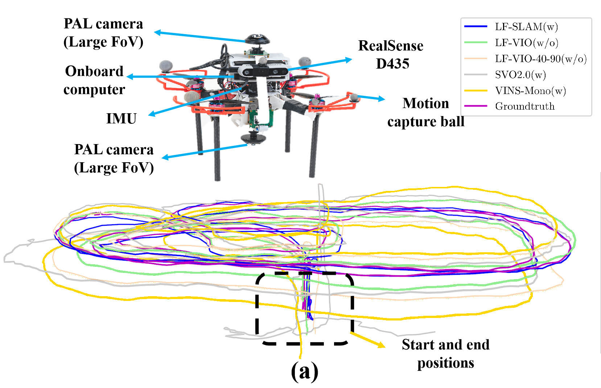

**图 1**：所提出的 LF-VISLAM 面向大视场相机，适用于空中和地面车辆等移动平台。(a) 上方为飞行实验平台，配备两台环形全景透镜（PAL）相机、RealSense D435 传感器、带 IMU 的飞控系统和机载计算机；下方为 PALVIO 数据集 ID01 序列上不同 SLAM 系统的轨迹结果。(b) 上方为车辆实验平台，配备 PAL 相机、IMU 传感器、Ouster LiDAR 和机载计算机；下方为 PALVIO 数据集 IDL01 序列上不同 SLAM 系统的长轨迹结果。LF-VISLAM 不仅具有更高的定位精度，也适用于移动平台的多种场景。

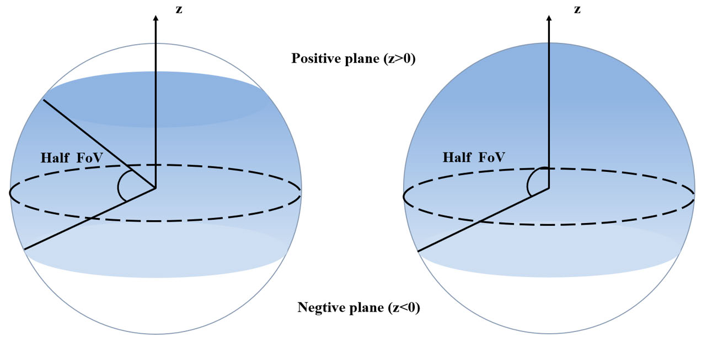

**图 2**：左图展示环形全景相机或折反射相机的一半视场，右图展示鱼眼相机的一半视场。虚线圆上方为正平面，下方为负平面。

value 1 serves as a scale factor. The system itself does not
take into account the existence of a complex plane and a
camera with a large FoV. Most existing systems [19], [20], [21]
follow the same strategy by directly discarding points within
the negative half-plane. This poses a significant issue as this
negative semi-planar region is present in various large-FoV
systems such as fisheye, panoramic annular, and catadioptric
cameras, and discarding these features results in the loss of
important information. Near 180◦, the values of u and v
increase rapidly, which negatively affects algorithms such as
PnP and epipolar constraints used to solve the rotation matrix
and translation vector, resulting in reduced tracking accuracy
and even failures.
Another challenge lies in the loop closure detection
algorithm for panoramic frames. Loop closure refers to the
detection and correction of errors in the estimated trajectory
when the robot revisits a previously visited location. It is an
important aspect of SLAM algorithms to improve accuracy
and consistency. Existing panoramic Visual Inertial Odometry
(VIO) [4] or Visual Odometry (VO) [1], [3], [11], [23], [24],
[25] frameworks do not incorporate a loop closure module.
While the panoramic FoV can be beneficial for loop closure,
its advantages are limited under significant attitude differences,
where loop-closure frames are difficult to match using existing
methods [19], [20]. Yet, the full potential of the ultra-wide
FoV cannot be realized without a proper loop closure design.
Further taking VINS-Mono [20] for example, when the differ-
ence between the yaw angle and the tilt angle of two frames
is very large, even if it is the same position, the loop-closure
frames still cannot be recognized.
To address these issues, we propose LF-VISLAM, a SLAM
framework for cameras with large FoV. Instead of using
traditional representations, we propose to utilize a feature
point vector with unit length to represent the features even on
the negative plane (Sec. III-A). We then introduce a sliding-
window-based tightly-coupled monocular odometry for state
estimation under the unit vector representation (Sec. III-B).
An improved loop closure detection method is seamlessly
integrated into the LF-VISLAM framework to effectively
incorporate large-FoV attitude guidance and further boost the
success rate of descriptor matching (Sec. III-C). The outliers
are finally identified using our proposed Efficient Perspective-
n-Point (EPnP) RANdom SAmple Consensus (RANSAC)
method to take into account the negative imaging plane case
when checking the inlier unit vector feature points (Sec. III-D).
Specifically, during initialization, epipolar geometry is used
to initialize the system when there is sufficient parallax
between two frames. Additionally, feature extraction is per-
formed on the raw panoramic image, bypassing the need
for complex panorama unfolding and cropping into multiple
pinhole sub-images, making our method fast and suitable for
real-time mobile robotic agents. The essential matrix [26] is
then decomposed into a rotation matrix and translation vector,
and the correct values are selected. Triangulation and EPnP
alternation methods [27] are used to initialize the depth of
feature points and all poses within the sliding window, and
a tightly-coupled optimization method is applied to re-solve
all the rotation and translation matrices in the sliding window.
Further, using the sliding window method to maintain the state
and map information of the robot greatly shortens the time for
SLAM to solve the optimization.
After the vision initialization, the IMU data and image data
are aligned to recover the scale information. In our approach,
the optimization problem is solved by taking into account the
visual re-projection error, the IMU pre-integration error, and
the marginalization error. Given that the SLAM system can
obtain attitude information during the loop closure process,
Authorized licensed use limited to: National Institute of Technology- Delhi. Downloaded on August 24,2026 at 05:46:40 UTC from IEEE Xplore.  Restrictions apply.

---

## 原文第 3 页核心内容与翻译

WANG et al.: LF-VISLAM: A SLAM FRAMEWORK FOR LARGE FIELD-OF-VIEW CAMERAS
6323

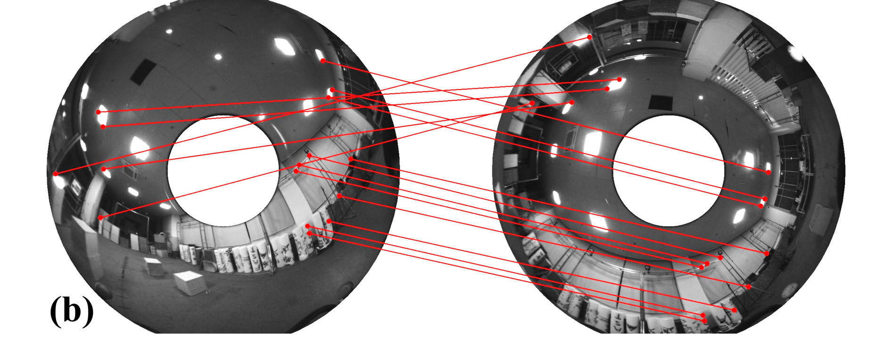

**图 3**：具有较大姿态差异的闭环图像（为便于展示，对全景图的亮度和对比度进行了增强）：(a) 偏航角差异较大；(b) 倾斜角差异较大。

we put forward to leverage this information to enhance the
efficiency and accuracy of the loop closure, which allows
for robust matching of frames, even when there is a large
difference in tilt- and yaw angle, leading to an improvement
in the accuracy of the loop closure, as shown in Fig. 3. The
Yaw angle refers to the angle between the projection of the
body coordinate system’s x-axis onto the x-O-y plane of the
world coordinate system and the world coordinate system’s
x-axis. The z-axis of the world coordinate system is opposite
to the direction of gravity. The Tilt angle represents the angle
between the body coordinate system’s z-axis and the world
coordinate system’s z-axis.
Although there are many open-source datasets [28], [29],
[30], there is a lack of large-FoV camera-based databases for
visual odometry. We introduce a new panoramic indoor visual
SLAM dataset, termed as the PALVIO dataset, to overcome
the limited availability of panoramic visual odometry datasets
with ground-truth location and pose, which is collected using
a Panoramic Annular Lens (PAL) system with a full FoV
of 360◦×(40◦∼120◦), an IMU sensor, and a motion capture
device (refer to Fig. 1 (a)). We conduct extensive experiments
to evaluate our proposed LF-VISLAM framework on both
the established PALVIO benchmark and a public fisheye
camera dataset [18] with a FoV of 360◦×(0◦∼93.5◦). Our
investigations on different FoVs demonstrate the importance of
the negative-plane information for an SLAM system, and the
proposed method outperforms state-of-the-art VIO and SLAM
frameworks. Moreover, we show that our method is beneficial
when integrated with a LiDAR-visual-inertial odometry [18].
In summary, we deliver the following contributions:
• We propose LF-VISLAM, a SLAM framework for
cameras with a large FoV, which includes a new
method for robust initialization and a method to assist
the descriptor extraction with VIO attitude informa-
tion. In LF-VISLAM, a novel RANSAC method is
designed for outlier rejection during pose transformation
estimation.
• We create and release the PALVIO dataset, the first
dataset for evaluating vehicles using cameras with a
large field-of-view and IMU sensors. The dataset includes
ground-truth location and pose obtained via a motion
capture device.
• We experimentally validate and compare LF-VISLAM
with conventional methods using both ground and aerial
vehicles. LF-VISLAM outperforms state-of-the-art VIO
and SLAM methods on multiple wide-FoV datasets and
experiment sequences with a negative plane.
This article extends our conference work [31] with the
following content:
• Extension of large-FoV visual-inertial-odometry: We
present a complete large-FoV SLAM system that inte-
grates loop closure blocks, enhancing overall performance
by incorporating loop closure information.
• Innovative loop closure design: Our work introduces a
novel approach to improve descriptor extraction in loop
closure detection. We leverage VIO attitude information
and propose a RANSAC-based method to reject outlier
points, enabling accurate pose transformation estimation
between loop-closure frames and keyframes.
• Extended experimental validation: We evaluate our sys-
tem on long-trajectory sequences, demonstrating its
suitability for mobile navigation agents like aerial and
ground vehicles. This validation showcases the practical
applicability of our system in real-world scenarios.
II. 相关工作
In this section, a brief review of representative works is
presented on small-FoV SLAM and panoramic Simultaneous
Localization And Mapping (SLAM) frameworks.
A. 小视场 SLAM
SLAM is the process of estimating the 3D pose (i.e., local
position and orientation) and velocity relative to a local starting
position, using various input signals like visual- and IMU data.
Qin et al. [20] proposed VINS, a robust and versatile monoc-
ular vision inertial state estimator. Recently, the Semi-direct
Visual-inertial Odometry (SVO2.0) [19] has been introduced
for monocular and multi-camera systems. Campos et al. [21]
proposed ORB-SLAM3, an accurate open-source library for
vision, visual-inertial, and multi-map SLAM. LiDAR-visual-
inertial sensor fusion frameworks have also been developed
in recent years such as LVI-SAM [18] and R3LIVE [32].
In addition to feature-point-based methods, there are also
direct methods for VO and VIO which are more sensitive
to light than feature-point-based methods. Engel et al. [33]
proposed Direct Sparse Odometry (DSO) using a fully direct
probabilistic model and Wang et al. [34] combined it with
inertial systems and stereo cameras. The above algorithms only
consider cameras with a narrow FoV. For cameras with a large
FoV, only the positive half-plane information can be used to
solve the SLAM problem.
Overall, SLAM frameworks have been broadly investigated
in recent years, and various methods have been proposed
to improve their accuracy, robustness, and real-time perfor-
mance [35]. Yet, it is worth noting that a large part of these
methods are designed for monocular cameras, while others are
Authorized licensed use limited to: National Institute of Technology- Delhi. Downloaded on August 24,2026 at 05:46:40 UTC from IEEE Xplore.  Restrictions apply.

---

## 原文第 4 页核心内容与翻译

6324
IEEE TRANSACTIONS ON AUTOMATION SCIENCE AND ENGINEERING, VOL. 21, NO. 4, OCTOBER 2024
designed for multi-camera systems, stereo cameras, or LiDAR-
camera fusion systems [36]. Differing from these existing
methods, we propose LF-VISLAM, a universal SLAM system
designed for large-FoV cameras like panoramic annular and
fisheye cameras. In particular, LF-VISLAM is a complete
SLAM system, which takes the ultra-wide viewing angle of
these omnidirectional sensors into consideration and makes
use of the feature points appearing on the negative imaging
plane with an attitude-guided loop closure design.
B. 全景 SLAM
Panoramic cameras can help SLAM systems deliver better
robustness in environments with weak textures due to their
wider sensing range and the captured richer features [14],
[37], [38]. Therefore, there are many visual odometry, visual-
inertial odometry, and SLAM frameworks based on panoramic
cameras. Sumikura et al. [39] proposed OpenVSLAM, which
is a VO framework supporting panoramic cameras. Wang et
al. [23] put forward CubemapSLAM, a piecewise-pinhole
monocular fisheye-image-based visual SLAM system. Chen et
al. [1], [40] tackled visual odometry with a panoramic annular
camera. More recently, Wang et al. [24] proposed PAL-SLAM,
which works with panoramic annular cameras. Huang et
al. [25] proposed 360VO, a direct visual odometry algorithm.
Ahmadi et al. [41] presented HDPV-SLAM, a novel
visual SLAM method that uses a panoramic camera and
a tilted multi-beam LiDAR scanner to generate accurate
and metrically-scaled vehicle trajectories. Yuwen et al. [42]
proposed a method for actively improving the positioning
accuracy of visual SLAM by controlling the gaze of a posi-
tioning camera mounted on an autonomous guided vehicle
using a panoramic cost map. Liu et al. [43] presented a
novel online topological mapping method, 360ST-Mapping,
which leverages omnidirectional vision and semantic informa-
tion to incrementally extract and improve the representation
of the environment. Karpyshev et al. [44] introduced the
MuCaSLAM for improving the computational efficiency and
robustness of visual SLAM algorithms on mobile robots using
a neural network to predict whether the current image contains
enough ORB features that can be matched with subsequent
frames.
However, the above and many current visual odometry
and visual-inertial odometry frameworks do not have modules
for loop closure [45], [46], [47], whereas some panoramic
SLAM frameworks [23], [48] convert panoramic images into
multiple pinhole images, which can be processed in parallel
via a multi-thread program, but this paradigm sacrifices the
360◦consistency of the panoramic images.
In this work,
we propose a large-FoV-oriented SLAM framework with loop
closure directly performed on panoramas to fully materialize
the benefits of 360◦visual content.
III. LF-VISLAM：所提出的框架
In
this
section,
we
explain
in
detail
our
proposed
LF-VISLAM framework for large-FoV cameras with a neg-
ative plane, as shown in Fig. 4. The LF-VISLAM framework
mainly comprises two independent threads: the Visual-Inertial-
Odometry (VIO) system and the loop closure. The VIO system
mainly consists of two parts: the initialization described in
Sec. III-A and the backend optimization detailed in Sec. III-
B. The VIO system provides pose and position information,
as well as 3D coordinates of feature points, to the loop closure
method presented in Sec. III-C. The components denoted via
red solid line boxes in the VIO system bring the negative
half-plane information into the optimization. The red dot line
in the VIO system denotes the adjustments of traditional
algorithms to introduce negative half-plane information. The
loop closure consists of feature descriptor extraction, DBoW
query, RANSAC method, and pose graph optimization as
described in Sec. III-D. We now elaborate on each component
in the proposed LF-VISLAM. The red solid line box in loop
closure improves loop matching performance and improves
robustness through outlier removal.
A. 初始化
Our optimization approach to the SLAM problem leverages
proper initial values, which are crucial for visual-inertial
systems due to their non-convexity.
The camera model serves as a bridge from pixel coordinates
to the physical world. Therefore, the choice of the camera
model is important. As an example, pinhole cameras are
naturally unable to characterize the negative half-plane of the
camera due to the limitations of their models. The panoramic
optical system [1] utilizes refraction- or reflection-based
optical imaging principles, giving it a large field of view.
Therefore, a more appropriate camera model such as the model
introduced by Scaramuzza et al. [22] is required for large
field-of-view cameras, especially for those which can observe
the camera’s rear field-of-view. For an imaging system with
a negative half-plane field-of-view, to utilize its full image
information, one needs to describe the pixel coordinate system
by projecting it onto a spherical model, where the internal
reference required for the projection can be obtained via
checkerboard calibration [22]. Each pixel point ui ∈R2 in the
pixel coordinate system thus corresponds to a vector pointing
from the center of the sphere to the surface of the unit sphere
wi ∈S2. The point in unit sphere wi can be obtained via
Eq. (1)(2):
w =
v
||v||2
,
(1)
v =


xi
yi
a0 + a1ρ + a2ρ2 + . . . anρ N

, ρ =
q
x2
i + y2
i ,
(2)
where the coefficients ai(i = 1, 2 . . . N) are the polynomial
parameters and xi, yi denotes the pixel point position. The
polynomial coefficients are obtained through a calibration
process using a tool such as the OmniCalib calibration tool-
box [22] specifically designed for panoramic cameras.
We propose to characterize the feature point vectors
α, β, γ T using vectors with α2 + β2 + γ 2 = 1 constraints,
and such vectors can represent points in the negative half-plane
of the camera coordinate system. Other camera models such
as MEI [49] and Kannala-Brandt [50] can also be obtained
Authorized licensed use limited to: National Institute of Technology- Delhi. Downloaded on August 24,2026 at 05:46:40 UTC from IEEE Xplore.  Restrictions apply.

---

## 原文第 5 页核心内容与翻译

WANG et al.: LF-VISLAM: A SLAM FRAMEWORK FOR LARGE FIELD-OF-VIEW CAMERAS
6325

**图 4**：所有模块在线运行时的 SLAM 系统概览。左侧为 VIO 系统，右侧为完整系统流程。红色实线框表示本文提出的方法，红色虚线框表示根据应用进行修改的部分。VIO 系统将求得的位姿信息（姿态和位置）以及特征点信息（标识符、图像中的位置和三维位置）传递给闭环线程。

**图 5**：极线约束。两个对应特征的向量及其旋转和平移位于同一平面内。

as a mapping relationship from pixel points to unit sphere
vectors. In our experiments on the PALVIO dataset and long
trajectories, the model from Scaramuzza et al. [22] is chosen
for efficiency and distortion considerations. Algorithms must
also be adjusted to work with cameras that have a negative
plane. In our framework, we leverage Shi-Tomasi corners [51]
and the Lucas-Kanade method [52] to extract and track these
corners. The polar geometry RANSAC method is used to elim-
inate the outlier points, for which the constraint is formulated
as shown in Eq. (3)(4):
xT
2

t
c j
ci
∧R
c j
ci

x1 = 0,
(3)
x1 =


α1
β1
γ1

, x2 =


α2
β2
γ2

,
(4)
where x1 and x2 are the unit vectors corresponding to the
same space point P1 in Fig. 5, O1 is the center of the camera
corresponding to the i-th frame, O2 is the center of the
camera corresponding to the j-th frame, and the notation [t
c j
ci ]∧
denotes the skew-symmetric cross product matrix of t
c j
ci ∈R3.
1) Extrinsic Parameter Rb
c Estimation: Rb
c and qb
c denote
the same rotation from the camera coordinate system to
the IMU system as the rotation matrix and the quaternion,
respectively. We assume that the relative rotation between the
camera and IMU remains constant, and from i-th and i + 1-th
frame, we can obtain Eq. (5):
qc
b ⊗qbi
bi+1 = qci
ci+1 ⊗qc
b,
(5)
where ⊗is quaternion multiplication, qbi
bi+1 is computed using
IMU integration, and qci
ci+1 is computed using the epipolar
constraint and essential matrix decomposition. Transforming

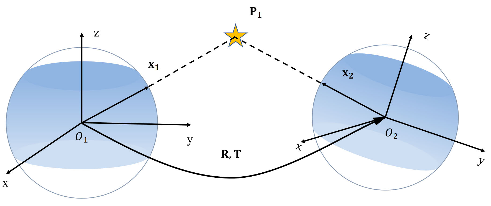

**图 6**：本质矩阵分解。本质矩阵分解得到四组解，但只有第一组解符合实际情况。

the above Eq. (5) using quaternion matrices rules, we can
obtain the equation as shown in Eq. (6):
nh
qbi
bi+1
i
L −

qci
ci+1

R
o
qc
b = 0.
(6)
Using the multi-frame information, we can estimate qc
b via
Singular Value Decomposition (SVD), and then obtain Rb
c
using the commonly-used quaternion-to-rotation matrix trans-
formation algorithm.
2) Vision-Only SfM: We start by identifying two frames
with a large degree of parallax. We then use the epipolar
constraint to calculate the essential matrix. By decomposing
this matrix, we obtain four possible sets of solutions. To select
the correct solution, we use a method that chooses R
c j
ci and
t
c j
ci that maximize the number of feature point pairs while
satisfying the condition that the dot product between the
landmarks and the feature point is always positive, as shown
in Eq. (7) and in Fig. 6:
−−−→
O1P1 · −→
x1 > 0 && −−−→
O2P1 · −→
x2 > 0.
(7)
Using the obtained R and t, we can triangulate the landmarks
xl, yl, zl
T via Eq. (8):
λ


α
β
γ

= Rw
ci


xl
yl
zl

+ tw
ci,
(8)
where λ is the scale factor,
α, β, γ 
is the unit vector repre-
senting the landmark, and R and t are the rotation matrix and
the translation vector respectively, obtained from the previous
step.
We use the EPnP method [27] on the landmarks to obtain the
Rw
ci and tw
ci between the initialization frames. We then alternate
between using triangulation and EPnP methods to acquire
Authorized licensed use limited to: National Institute of Technology- Delhi. Downloaded on August 24,2026 at 05:46:40 UTC from IEEE Xplore.  Restrictions apply.

---

## 原文第 6 页核心内容与翻译

6326
IEEE TRANSACTIONS ON AUTOMATION SCIENCE AND ENGINEERING, VOL. 21, NO. 4, OCTOBER 2024

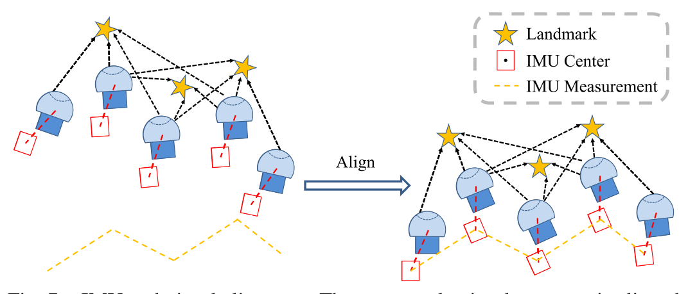

**图 7**：Fig. 7.
IMU and visual alignment. The up-to-scale visual structure is aligned
with the pre-integrated IMU measurements.

the three-dimensional spatial positions of all Rw
ci, tw
ci, and
landmarks in the sliding window. Finally, we resolve Rw
ci and
tw
ci, using the re-projection error to construct the optimization
problem as shown in Eq. (9):
min
Rwci ,twci



M
X
l=1
N
X
m=1
||


αl
βl
γl

−
Rcic jpm + tcic j
||Rcic jpm + tcic j||2
||2


,
(9)
where M is the number of vectors transformed by image
observations and N is the number of landmarks.
3) Visual-Inertial Alignment: The process of aligning visual
and inertial data is illustrated in Fig. 7. We match the visual
structure obtained from SfM with the IMU pre-integration
data. We then calibrate the gyroscope bias by solving the
optimization problem as shown in Eq. (10)(11):
min
δbw
X
k∈all_ f rame
||qc0
bk+1
−1 ⊗qc0
bk ⊗0bk
bk+1 −


1
0
0
0

||
2
,
(10)
0bk
bk+1 ≈ˆ0bk
bk+1 ⊗

1
1
2J0
bwδbw

,
(11)
where 0bk
bk+1 and ˆ0bk
bk+1 are the true-state and nominal-state
rotation increment between frame k and frame k + 1, δbw is
the gyroscope bias, and J is the Jacobian matrix. Afterward,
we estimate the initial velocity, gravity vector, and metric
scale, and align the gravity direction with the Z axis.
Our novel initialization method incorporates a suite of
algorithms that address the epipolar constraint, triangulation,
and re-projection error while considering the feature vector
represented by a unit vector.
B. Tightly-Coupled Large-Fov Monocular Odometry With a
Sliding Window
After
the
estimation
process,
we
employ
a
sliding-
window-based tightly-coupled monocular odometry for state
estimation. The state vector χ is defined as in Eq. (12):
χ = [s1, . . . , sN, ob
c0, . . . , ob
cN , λd1, . . . , λdm],
sk = [pw
bk, vw
bk, qw
bk,ba, bg],
ob
ci = [pb
ci, qb
ci].
(12)
Here, N represents the total number of sliding windows, pw
bk,
vw
bk, and qw
bk are the position, velocity, and attitude quaternion
of the body system in the world system in the kth frame, ba
and bg are the accelerometer and gyroscope biases, pb
ci and qb
ci
are the translation and attitude quaternion of the camera system
in the body system in the ith frame. The inverse distance of
the mth feature from its first observation to the unit sphere is
represented by λdm.
During the optimization process, the calibration parameters
tB
cN will be updated and converge to a reasonable value. The
optimization takes into account IMU measurements, visual
observations, and marginalization residuals. The optimization
objective is shown in Eq. (13):
min
χ

||rp −Hpχ||2 +
X
k∈B
||rB

ˆzbk
bk+1, χ

||2
P
bk
bk+1
+
X
(i, j)∈C
||rC
ˆz
c j
l , χ

||2
P
c j
l

,
(13)
where rB

ˆzbk
bk+1, χ

and rC
ˆz
c j
l , χ

are the IMU measurement
residual [53] and the camera measurement residual, respec-
tively. rp and Hp represent prior information. The optimization
is performed within a sliding window to maintain a low
computational complexity.
1) Visual Measurement Residual: To handle the negative
plane of large-FoV panoramic cameras, we propose using a
unit sphere to define our visual residual. The λd represents the
inverse distance from the unit sphere to the lth feature point
observed in the ith image. Our visual measurement residual
is defined as in Eq. (14):
rc
ˆz
c j
l , χ

=
 b1 b2
T ·
ˆ¯P
c j
l −
P
c j
l
||P
c j
l ||
!
,
(14)
P
c j
l
= Rc
b

R
b j
w

Rw
bi

Rb
c
1
λd
π−1
s
ˆ¯xci
lˆ¯yci
l

+ pb
c

+ pw
bi −pw
b j

−pb
c

,
(15)
where b1 and b2 are two orthogonal bases that span the tangent
plane of ˆ¯P
c j
l , and P
c j
l
is computed using rotation matrices,
translation vectors, and the inverse mapping relationship from
the unit 3D coordinate point to the pixel point. We use the
Ceres Solver [54] to solve the nonlinear maximum posterior
estimation problem and a Huber loss function to reduce the
influence of outliers for better system robustness.
C. Loop Closure
Our proposed loop closure system is designed to work in
conjunction with our VIO system described above. The loop
closure system operates independently of the VIO. It requires
input such as the position of feature points in the image, their
corresponding 3D coordinates in the camera coordinate sys-
tem, as well as the current rotation matrix Rw
c and translation
vectors Tw
c of the VIO system at time t. The overall flow of
the VIO system with loop closure is illustrated in Fig. 4. When
receiving information from the VIO system, we first apply the
pose information to transform the image. To extract mean-
ingful information from the transformed image, we employ
the DBoW method [55]. DBoW converts the extracted fea-
ture points’ descriptors into a Bag-of-Words (BoW) vector
Authorized licensed use limited to: National Institute of Technology- Delhi. Downloaded on August 24,2026 at 05:46:40 UTC from IEEE Xplore.  Restrictions apply.

---

## 原文第 7 页核心内容与翻译

WANG et al.: LF-VISLAM: A SLAM FRAMEWORK FOR LARGE FIELD-OF-VIEW CAMERAS
6327

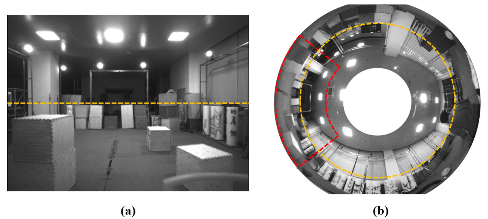

**图 8**：Fig. 8.
Comparison on FoV. (a) The pinhole camera’s FoV is 87◦×58◦. (b)
The panoramic camera’s FoV is 360◦×(40◦∼120◦). The orange dashed line
is the horizontal line of the stationary position. The red dashed line denotes
the area (a) in the FoV of (b).

representation. This BoW vector is then used to check for
similarities with historical frames in our database.
It is important to note that with large-FoV cameras, loop clo-
sure detection can be more prone to errors due to mismatched
feature points. To combat this, we propose an improved loop
closure detection method that effectively eliminates outliers
and includes attitude guidance for enhancing the accuracy and
precision of loop closure.
1) Improved Loop Closure Detection: In matching loop-
closure frames, feature matching methods are involved and
they rely on descriptors, such as BRIEF [56], SuperPoint [57],
and GMS [58]. For large-FoV cameras with a negative imaging
plane, when the attitude difference is too large, the descrip-
tor information difference is significant. Therefore, direct
matching of the original image is often not very effective,
which will be unfolded in Sec. IV. Compared with pinhole
cameras, cameras with a large FoV have a higher probability
of matching in the loop closure (see a comparison of the FoV
of a conventional pinhole camera and a panoramic annular
camera in Fig. 8).
Yet, at the same time, the loop closure detection rate is
not high, due to the large difference between the pose of the
loop-closure frames and the keyframes. Therefore, we propose
to use the pose information provided by VIO to remap the
images and then extract the descriptors, which can greatly
improve the success rate of descriptor matching. For each
point in the original image denoted as [u, v]T , the coordinates
of the transformed point are [u1, v1]T , and the transformation
relationship is shown in Eq. (16).
u1
v1

= πs

Rw
b Rb
cπ−1
s
u
v

,
(16)
where Rw
b is the rotation matrix from the body coordinate sys-
tem to the world coordinate system, Rb
c is the rotation matrix
from the camera coordinate system to the body coordinate
system, and πs means the mapping relationship from the unit
3D coordinate point to the pixel point.
2) Epipolar Constraint RANSAC: Since features have more
outlier points in loop-closure matching than in a conventional
VIO system (i.e., in the neighboring-frame matching), if the
feature points are incorrectly matched, it will seriously affect
the pose solving between loop-closure frames and keyframes,
thus affecting the accuracy of loop-closure optimization,
so the RANSAC method is crucial in loop-closure threads.
In loop closure, the pair of two points x1, x2, is obtained via

**图 9**：Fig. 9.
Epipolar constraint. The orange pentagrams indicate landmarks and
each pentagram corresponds to the two vectors on the right, where vector
vertices on the green line are retained and on the red line are removed.

descriptors matching as shown in Fig. 9, and they are used for
solving the pose via Eq. (17)(18):
xT
2

t
c j
ci
∧R
c j
ci

x1 = 0,
(17)
x1 =


α1
β1
γ1

, x2 =


α2
β2
γ2

,
(18)
where the notation [t
c j
ci ]∧denotes the skew-symmetric cross
product matrix of t∈R3. Given x1, t
c j
ci , and R
c j
ci , if x2 satisfies
the epipolar constraint, −x2 must also satisfy the constraint.
This does not happen with cameras that have only a positive
imaging half-plane. For large-FoV cameras with a negative
plane, the number of outlier points, which can be rejected
using only the epipolar constraint, is relatively small. The point
pairs matched via the descriptor in the loop closure thread have
a higher error rate compared to the point pairs matched via the
optical flow in the VIO system during initialization. Therefore,
we propose a novel method to avoid this situation. Points on
the red epipolar line, as depicted in Fig. 9, can be effectively
eliminated in our method. Our epipolar constraint RANSAC
method has the following four steps:
1) Each time 8 points are selected from all pairs of points,
and then the essence matrix is calculated and the score of
each point is calculated. We eliminate outlier points that
do not satisfy the epipolar constraint.
2) The decomposition of the highest scoring essential matrix
yields four groups Rm and tm(m=1, 2, 3, 4).
3) The dot product between Qi and RmPi should be greater
than the threshold, and again we use the scoring mecha-
nism to eliminate the remaining outlier points.
This process is summarized via pseudocode in Algorithm 1.
D. EPnP RANSAC for Unit Vector Feature Points
Since we use the unit vectors as introduced to characterize
the feature points, EPnP [27] needs to consider the negative
imaging plane case when checking the inlier points. We make
sure that the angle between the map point and the feature
point in the camera coordinate system is less than the threshold
value, to filter out inlier points. The pseudocode of this process
is summarized in Algorithm 2.
1) Pose graph optimization: Pose graph optimization plays
a role in error correction in loop closure thread. To optimize
each node in the pose graph, we minimize the following cost
Authorized licensed use limited to: National Institute of Technology- Delhi. Downloaded on August 24,2026 at 05:46:40 UTC from IEEE Xplore.  Restrictions apply.

---

## 原文第 8 页核心内容与翻译

6328
IEEE TRANSACTIONS ON AUTOMATION SCIENCE AND ENGINEERING, VOL. 21, NO. 4, OCTOBER 2024
Algorithm 1 Epipolar Constraint RANSAC Method
Input: pairs of feature points sets {P}, {Q}, iteration number K
Output: points status sets {S} (1: inlier point, 0: outlier point),
the flag that the algorithm has a solution f lag (1:
success, 0: failure)
begin
Initialization: Ebest,best_score ←0
match_num ←elementNumber({P});
if match_num < 8 then
f lag ←0;
return f lag;
end
for i ←1 to K do
Randomly choose 8 pairs of points {P j}, {Q j};
E ←ComputeEssentialMatrix({P j}, {Q j});
score, {Stmp} ←CheckInliers(E, {P}, {Q});
if score > best_score then
best_score ←score;
Ebest ←E;
{Sbest} ←{Stmp};
end
end
Rm, tm ←DecomposeEssentialMat(Ebest);
{Ci} ←triangulatePoints(Rm,tm,{Pi}, {Qi});
for i ←1 to match_num do
for j ←1 to m do
PdotC = PT
i Ci/||Ci||2;
Ctmp = R jCi + t j;
QdotC = QT
i Ctmp/||Ctmp||2;
if PdotC < th and QdotC < th and
QT
i R jPi < th2 then
good j ←good j + 1;
Sj[i] ←0;
end
end
end
if gooda >= goodb then
for i ←1 to match_num do
if Sa[i] == 0 then
Sbest[i] ←0
end
end
end
f lag ←1,{S} ←{Sbest};
return f lag, {S};
end
function to optimize the whole graph of loop-closure edges
and sequential edges via Eq. (19)(20):
min
p,ψ



X
(i, j∈L)
||ri, j||2 +
X
(i, j∈S)
||ρ

ri, j

||2


,
(19)
ri, j

pw
i , ψi, pw
j , ψ j

=
"
R
 ˆφi, ˆθi, ψi
−1
pw
j −pw
i

−ˆpi
ij
ψ j −ψi −ˆ
ψi j
#
,
(20)
where ˆφi and ˆθi are the fixed estimates of roll and pitch
angles because, for a VIO system, the accelerometer prevents
divergence of roll and pitch angles. ρ is the Huber norm
function. S and L are the sets of all sequential edges and
loop-closure edges.
Pose graph saving and loading allow us to use priori maps
for loop closure. We only save descriptors of every keyframes
Algorithm 2 Our EPnP RANSAC Method
Input: pairs of feature points set and matched landmark Points
{P}, {W}, iteration number K
Output: Rotation Matrix R, translation vector t, points status
sets {S},the flag that the algorithm has a solution f lag
begin
Initialization: best_score ←0
match_num ←elementNumber({P});
if match_num < 4 then
f lag ←0;
return f lag;
end
for i ←1 to K do
Randomly choose 4 pairs of points {P j}, {W j};
Rtmp, ttmp ←ComputePoseByEpnp({P j}, {W j});
score, {Stmp} ←CheckInliers(Rtmp, ttmp, {P}, {W});
if score > best_score then
best_score ←score;
R ←Rtmp;
t ←ttmp;
{Sbest} ←{Stmp};
end
end
f lag ←1,{S} ←{Sbest};
return R, t, f lag, {S};
end
and the ith keyframe’s state as shown in Eq. (21):
i, ˆpw
i , ˆqw
i , v, ˆpi
iv, ˆ
ψiv, D(α, β, γ, des)

,
(21)
where i,
ˆpw
i , and
ˆqw
i
are the frame index, position, and
orientation. v, pi
iv, and
ˆ
ψiv are the loop closure index, relative
position, and yaw. D(α, β, γ, des) is the feature set containing
the unit 3-D location and its descriptor with our attitude-guided
transformation.
IV. EXPERIMENTS
In this section, we conduct experiments to confirm the effec-
tiveness of the proposed components and the LF-VISLAM
system. In Sec. IV-A, we describe the datasets used in our
experiments. In Sec. IV-B, we study the effects using different
FoV inputs for the performance of visual inertial odometry and
certify the importance of using the information on the negative
imaging plane. In Sec. IV-C, we verify our method is bene-
ficial when integrated with LiDAR-visual-inertial odometry.
We further evaluate our attitude-guided descriptor extraction
algorithm in Sec. IV-D. We compare our LF-VISLAM system
against state-of-the-art SLAM methods in Sec. IV-E, specifi-
cally analyze the results on long sequences in Sec. IV-F, and
finally assess the efficiency of our system in Sec. IV-G.
A. Datasets
1) PALVIO dataset: To address the lack of panoramic
visual odometry datasets with ground-truth location and pose,
we have created and made publicly available the PALVIO
dataset. This dataset is collected using two panoramic annular
cameras, a CUAV-v5 nano IMU sensor, and a RealSense
D435 sensor, all of which are synchronized with ground-truth
location and pose data captured by a motion capture system.
Authorized licensed use limited to: National Institute of Technology- Delhi. Downloaded on August 24,2026 at 05:46:40 UTC from IEEE Xplore.  Restrictions apply.

---

## 原文第 9 页核心内容与翻译

WANG et al.: LF-VISLAM: A SLAM FRAMEWORK FOR LARGE FIELD-OF-VIEW CAMERAS
6329
TABLE I
ACCURACY ANALYSIS OF LF-VIO USING IMAGES WITH DIFFERENT FOVS ON THE PALVIO ID06 SET
The panoramic cameras capture monocular images with a res-
olution of 1280×960 at a rate of 30Hz and a field of view of
360◦×(40◦∼120◦). We record all datasets using Robot Oper-
ating System (ROS) and the data are raw without additional
processing. The IMU sensor provides angular velocity and
acceleration data at 200Hz. The motion capture system (Vicon
T40s) provide position and attitude data at 100Hz, serving as
the ground truth. A total of ten sequences (ID01∼ID10) are
collected in an indoor area of 8m×10m. The data from both
the stereo panoramic cameras and the RealSense camera are
available for public use, and in this work, we primarily use
the data from the top panoramic camera for our experiments.
The displacement of the ID01∼ID10 dataset is not significant.
To test the robustness and loop-closure effects of our LF-
VISLAM, we have also collected long-trajectory sequences
IDL01 and IDL02. The long-trajectory sequences are captured
using a mynteye camera module, which includes a panoramic
camera, an IMU sensor, and an Ouster LiDAR sensor. The
panoramic cameras capture monocular images with a reso-
lution of 1280×720 at a rate of 30Hz, the LiDAR sensor
provides LiDAR points at 10Hz, and the IMU sensor provides
angular velocity and acceleration data at 200Hz.
2) LVI-SAM dataset: To evaluate the generalizability of
our approach, we further use the LVI-SAM dataset [18].
The data collection sensor suite consisted of a Velodyne
VLP-16 LiDAR sensor, a FLIR BFS-U3-04S2M-CS cam-
era, a MicroStrain 3DM-GX5-25 IMU sensor, and a Reach
RS+ GPS. The Jackal- and Handheld datasets are gathered
using an unmanned ground vehicle. The field of view of
the fisheye camera used in the experiments is approximately
360◦×(0◦∼93.5◦). To evaluate the performance, we use the
LVI-SAM dataset, in conjunction with GPS measurements as
the ground truth.
B. Investigation on Different Field-of-View
To validate the significance of the information from the
negative plane, we evaluate the impact of using inputs with
different FoVs by extracting features only from the corre-
sponding angle range. First, we gradually reduce the FoV from
40◦∼120◦to 40◦∼80◦with a step of 10◦, as shown in Fig. 10,
and conduct experiments using our LF-VIO framework on the
PALVIO ID06 dataset, which is selected as a representative
sequence. The results, shown in Table I, indicate that using

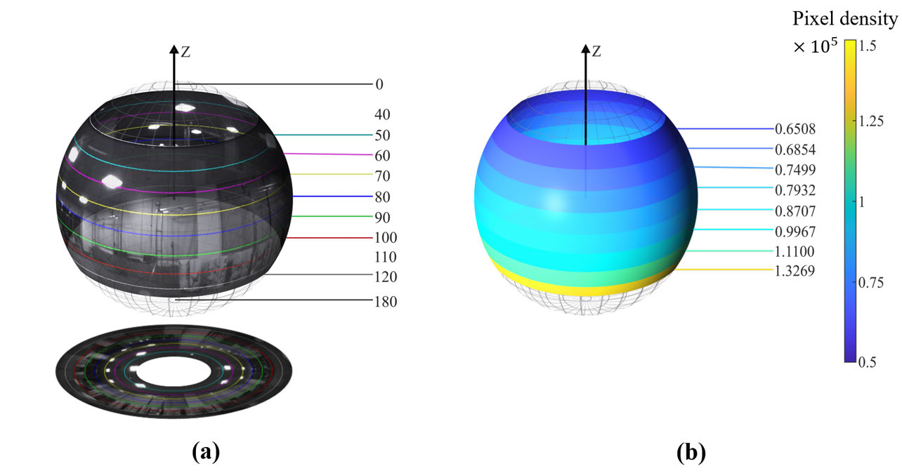

**图 10**：Fig. 10.
Variation of (a) FoVs and (b) pixel density with a step of 10◦using
the annular images.

the entire FoV of the panoramic camera (40◦∼120◦) results
in the best performance in terms of RPEt and ATE. However,
when the FoV is reduced to only the positive plane, i.e., in the
cases of 40◦∼90◦and 40◦∼80◦, the performance significantly
degrades, verifying the importance of the information from the
negative imaging plane.
Next, we repeat the experiment by decreasing the FoV from
50◦∼120◦to 90◦∼120◦. In the worst-case scenario, when only
the information from the negative plane is used (90◦∼120◦),
the VIO framework still performs effectively. However, when
incorporating slightly more information from the positive
plane, i.e., in the cases of 80◦∼120◦and 70◦∼120◦, the
performance returns to the same level as that of using only
the positive plane. This confirms once again the importance
of information from the negative plane and the efficacy of our
method in making use of negative-plane features that were
ignored in prior works.
We also observe that the performance of the FoV range
of 50◦∼120◦is not superior to that of 40◦∼120◦, due to the
lowest vector density in the range of 40◦∼50◦. The information
from this band may not significantly improve the performance
of the system. To visualize the density of the pixels in the
image, we map each pixel onto a unit sphere and divide it
into intervals of 10◦, as shown in Fig. 10(b) and Table II.
Each pixel in the original image can be represented by a
vector with a magnitude of 1. However, when the vectors from
various FoVs are projected onto the corresponding FoV on the
sphere, their densities vary. We calculate the vector density of
different field-of-view regions on the unit sphere and find that
Authorized licensed use limited to: National Institute of Technology- Delhi. Downloaded on August 24,2026 at 05:46:40 UTC from IEEE Xplore.  Restrictions apply.

---

## 原文第 10 页核心内容与翻译

6330
IEEE TRANSACTIONS ON AUTOMATION SCIENCE AND ENGINEERING, VOL. 21, NO. 4, OCTOBER 2024
TABLE II
PIXEL DENSITY ANALYSIS AT DIFFERENT VIEW BANDS
TABLE III
COMPARISON OF SLAM METHODS ON THE LVI-SAM DATASET [18] (WITHOUT LOOP)
the density in the range of 40◦∼50◦is the lowest, resulting in
the lowest accuracy among all field-of-view bands. Although
this band provides significant information, it has a lower pixel
accuracy compared to other regions, and thus, incorporating
information from this band may not improve the accuracy of
the SLAM system.
C. Generalization to LiDAR-Visual-Inertial Odometry
The proposed method, which supports the negative half-
plane, can be seamlessly integrated with LiDAR-Visual-
Inertial Systems like LVI-SAM [18]. The accuracy of the
system with and without the proposed method are compared in
Table III using two datasets, namely the Handheld- and Jackal
datasets provided by [18]. The experiments are conducted on
a laptop with an R7-5800H processor. The recording camera
has a FoV of 360◦×(0◦∼93.5◦).
In this experiment, we make modifications to the visual
component of the LVI-SAM system [18]. We utilize a unit
vector approach to represent feature points and update the
visual algorithms accordingly while maintaining the setup of
the original MEI camera model [49]. The original LVI-SAM
system uses a large mask to address the issues associated with
feature points on the negative plane or those close to 180◦.
However, our system has successfully overcome this chal-
lenge by reducing the size of the mask, leading to improved
performance. The results of our modified system referred to
as LF-LVI-SAM, show consistent improvements against LVI-
SAM [18], in mean and root mean square error of relative pose
error (RPE) in Mean and RMSE of RPE (%), RPEr (degree/m)
and ATE (m). The RPE results on the Handheld and Jackal
datasets are presented in Table III. In summary, our method
not only enhances the precision of visual-inertial odometry
systems but is also effective for LiDAR-VIO systems with a
FoV extending to the negative half-plane.
D. On the Effectiveness of Attitude-Guide Descriptors
To verify that the introduction of attitude-guided descriptors
is more effective than the direct extraction of descriptors,
we explore different settings including (a) transforming the
images with attitude guidance and extracting BRIEF descrip-
tors for matching using Hamming distance, (b) directly
extracting BRIEF descriptors [56] for matching, (c) directly
extracting SuperPoint descriptors [57] for matching, and
(d) the GMS solution [58] in comparison experiments with
small attitude angle differences, large yaw angle differ-
ences, and large tilt angle differences, as shown in the
three rows in Fig. 11, respectively. To facilitate a fair
comparison, our RANSAC is used to remove the out-
liers for the above methods. The original number of ORB
points [21] in the GMS is 1000, and the rest only uses
500 points.
As shown in the first row, when the difference between the
attitude angles of the two images is very small, our method
matches more error points compared with the other three
methods, but all the outlier points can be removed by the
RANSAC method. As shown in the second row, when the
difference between the yaw angles of the two images is large,
the conventional BRIEF and the learning-based SuperPoint
basically do not match the correct points at all, and the
performance of GMS and our method is close. As shown in
the third row, when the yaw angles of the two panoramic
images differ significantly, our algorithm has an obvious
advantage over the other three algorithms, in which BRIEF
and SuperPoint methods struggle to match correct points,
and the GMS solution matches relatively more yet all close
points, so the effect is rather unsatisfactory. Thus, our method
is more effective than other algorithms under large attitude
angle differences, despite that the learning-based GMS uses a
bigger number of original points for matching. It is possible to
perform loop closure even when the angle difference is very
large so that the success rate of loop-closure matching can be
Authorized licensed use limited to: National Institute of Technology- Delhi. Downloaded on August 24,2026 at 05:46:40 UTC from IEEE Xplore.  Restrictions apply.

---

## 原文第 11 页核心内容与翻译

WANG et al.: LF-VISLAM: A SLAM FRAMEWORK FOR LARGE FIELD-OF-VIEW CAMERAS
6331

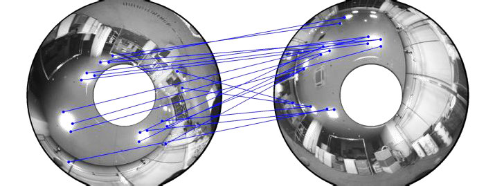

**图 11**：Fig. 11.
(a) The BRIEF descriptor with attitude guidance and matching (Ours). (b) The conventional BRIEF descriptor and matching. (c) The SuperPoint
descriptor and matching [57]. (d) The GMS matching [58]. For illustration purposes, the illumination and contrast of the panoramic images are improved.
The three rows indicate scenarios with small angle differences, large yaw angle differences, and large tilt angle differences, respectively. The entire blue and
red points represent all the matched points, and the red points are the remaining points after applying our RANSAC method.

**图 12**：Fig. 12.
Examples of top trajectories and error analyses on the PALVIO benchmark for different SLAM systems.

improved, promising for improving pose estimation accuracy
with large-FoV panoramic cameras.
E. Comparison on the Established PALVIO Dataset
Since most of the data in the established PALVIO dataset
are collected in indoor areas, these sequences are suitable
for loop-closure accuracy experiments. Our LF-VISLAM is
an addition of loop closure threads to LF-VIO [31]. At the
same time, we also compare with SVO2.0 [19] and VINS-
Mono [20], both of which have loop closure threads for a fair
comparison in Table IV and Fig. 12. We utilize the Relative
Pose Error in translation (RPEt) [59], Relative Pose Error in
rotation (RPEr) [59], and Absolute Trajectory Error (ATE) [59]
as the evaluation metrics of the overall system error. The above
four methods all use the Scaramuzza et al.’s omnidirectional
camera model [22] to keep a fair comparison.
Due to the characteristics of large-FoV panoramic cameras
with a negative imaging plane, VINS and SVO2.0, relying on a
representation of [u, v, 1]T , can only make use of the positive
half-plane image. Thus, even if similar images are detected, the
useful feature point pairs are still rejected. For VINS-Mono-
Loop, even if its loop closure threads are enabled, it does not
trigger the loop-closure optimization with dissimilar images
and insufficient feature points.
As shown in Table IV, it can be seen that in all sequences
(ID01 to ID10), LF-VISLAM has the highest precision in
RPEt and ATE compared to the previous LF-VIO [31],
SVO2.0 [19], and VINS-Mono(w) [20]. Compared with our
large-FoV VIO framework LF-VIO, LF-VISLAM significantly
elevates the performance. The effect of our loop closure in
ID08 is visualized in Fig. 13(a) and IDL02 in Fig. 13(b),
which demonstrates that our method can successfully close
the loop even at very long distances. Moreover, LF-VISLAM
also has better precision scores in RPEt than LF-VIO and
VINS-Mono in all sequences and SVO2.0 in most sequences.
We present Top Trajectory, Translation, and Rotation Errors
for sequences ID01, ID06, and ID10, as shown in Fig. 12.
Evidently, our method is more accurate and more robust than
other algorithms.
F. Comparison on the Long Trajectory Dataset
To verify the effect of our SLAM algorithm on long
trajectories, we record longer trajectory data with a mobile
car to evaluate the robustness and accuracy of LF-VISLAM.
Authorized licensed use limited to: National Institute of Technology- Delhi. Downloaded on August 24,2026 at 05:46:40 UTC from IEEE Xplore.  Restrictions apply.

---

## 原文第 12 页核心内容与翻译

6332
IEEE TRANSACTIONS ON AUTOMATION SCIENCE AND ENGINEERING, VOL. 21, NO. 4, OCTOBER 2024
TABLE IV
COMPARISON OF SLAM METHODS ON THE PALVIO DATASET. “W”: WITH LOOP CLOSURE, “W/O”: WITHOUT LOOP CLOSURE

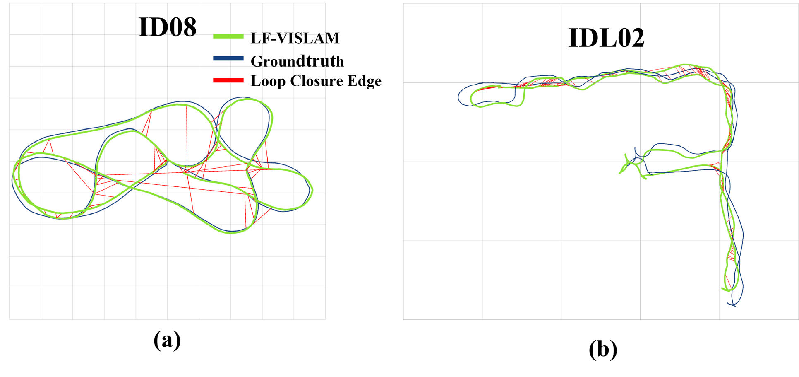

**图 13**：Fig. 13.
LF-VISLAM’s loop closure effect in ID08 on the PALVIO dataset
and IDL02. (a) The side length of each gray square is 1m. (b) The side length
of each gray square is 10m.

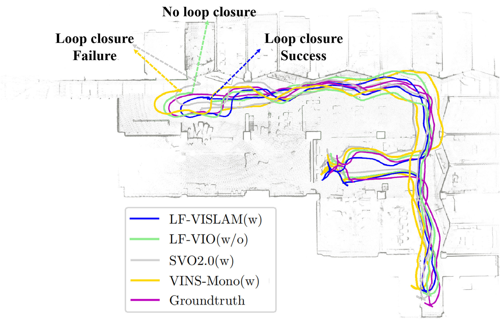

**图 14**：Fig. 14.
Top trajectory on IDL02 and loop closure effect at the start position.

Meanwhile, to verify the effectiveness of the loop closure
algorithm our path is a closed loop. Due to the long trajectory
path, it is not suitable to use motion capture devices. We use
Fast-LIO2 [60] with LiDAR SLAM and the closed-loop Scan
Context++ algorithm [61] as the ground truth for comparison.
We use the ground vehicle platform (see Fig. 1(b)) to collect
two sequences of data as IDL01 and IDL02, with trajectory
lengths of 254.055m and 172.431m, respectively. Due to the
panoramic loop with camera distortions and severe attitude
changes, there are a large number of scenes with large dif-
ferences in yaw angle variations in our dataset. As shown in
Table V, LF-VISLAM clearly outperforms SVO2.0 [19] and
VINS-Mono [20] in closing the loop under such scenarios
with large yaw changes. In the IDL01 sequence, 327 loop
images are detected, of which 325 are correct, with a correct
rate of 99.39%. In the IDL02 sequence, 103 loop images
are detected, of which 102 are correct, with a correct rate
of 99.03%. In Fig. 1(b) and Fig. 14, we show the top-view
trajectory results on IDL01 and IDL02, and it can be clearly
seen that our algorithm closes the loop smoothly at the starting
point, while SVO2.0 and VINS fail the loop closure.
G. Speed Analysis
In this subsection, we present the efficiency of our proposed
method LF-VISLAM, comprised of the VIO system and the
closure threads. The elapsed time of LF-VISLAM compared
with different SLAM methods are shown in Fig. 15. The time
consumption increase of our algorithm LF-VISLAM is not
much compared with VINS. As SVO2.0 uses multi-thread
management methods in its processes to reduce the time
overhead, its time consumption is the least.
In our VIO system, if the image-to-map mapping rela-
tionship is stored in memory, the image mapping process
takes approximately 1∼2ms. However, this operation is not
necessary for the front end of the LF-VISLAM system.
Instead, the feature tracking and optical flow computation take
15ms and 3ms respectively, and the total front-end cost is
around 40ms. The back-end mainly consists of a solver that
takes about 30ms, leading to a total cost of around 60ms.
Authorized licensed use limited to: National Institute of Technology- Delhi. Downloaded on August 24,2026 at 05:46:40 UTC from IEEE Xplore.  Restrictions apply.

---

## 原文第 13 页核心内容与翻译

WANG et al.: LF-VISLAM: A SLAM FRAMEWORK FOR LARGE FIELD-OF-VIEW CAMERAS
6333
TABLE V
COMPARISON OF SLAM METHODS ON THE LONG TRAJECTORY DATASET. “W”: WITH LOOP CLOSURE, “W/O”: WITHOUT LOOP CLOSURE

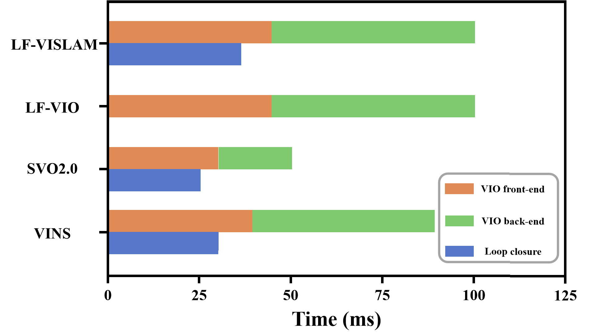

**图 15**：Fig. 15.
Elapsed time compared with different SLAM methods.

It is worth noting that the front-end and back-end operate
independently. In the loop closure thread, loop detection takes
about 3∼5ms, the DBoW query takes about 10∼20ms, the
improved RANSAC method takes about 10∼15ms, and loop
graph optimization takes about 3∼5ms. Since the two threads
run independently and the running frequency of LF-VISLAM
mainly depends on the running speed of the VIO system, it can
reach a rate of at least 10Hz on a computer with a built-
in quad-core Intel i7-8550U processor, which is suitable for
real-time applications on mobile navigation agents. We have
tested our algorithm LF-VISLAM on the NUC11TNKi5 hard-
ware platform and our algorithm can run in real time. The
NUC11TNKi5 is equipped with an Intel Core i5-1135G7
processor running at 2.40GHz with 8 cores.
H. Discussion
Panoramic imaging has a larger FoV than pinhole imaging,
so its perception range is larger, and panoramic visual odome-
try is more robust to a single under-textured environment such
as a white wall. Compared with other algorithms, we make
full use of as much information especially on the negative
plane as possible to improve the accuracy and robustness of
the odometry. Moreover, we use attitude information solved in
the VIO system to improve loop closure accuracy. Of course,
repeated scenes such as stairs, in the same building may cause
loop closure to fail, and additional processing is required such
as distance estimation between loop-closure frames to provide
constraints for handling such challenging scenarios.
V. CONCLUSION
In this article, we have proposed LF-VISLAM, a frame-
work for large-FoV cameras with a negative plane on mobile
navigation agents. LF-VISLAM leverages a unit-length vector
for representing feature points to incorporate feature points
on the negative plane, which are unused in previous works.
Our large-FoV visual-inertial-odometry further introduces
algorithmic adjustments according to the proposed feature
representation, and on top of which, an attitude-guided loop
closure algorithm is designed to form the entire SLAM system
for unleashing the full potential of the ultra-wide 360◦FoV.
The proposed LF-VISLAM has the following advantages:
1) It incorporates feature points on the negative plane, leading
to a more robust SLAM system; 2) An attitude-guided loop
closure algorithm is designed which addresses the challenge
posed by large differences in tilt and yaw angles; 3) It has
good generalization capacity to long-trajectory sequences and
LiDAR-visual-inertial data.
However, there is open room to further improve LF-
VISLAM: 1) The current system is not well compatible with
multi-camera systems; 2) Due to the limited light entering
the panoramic annular lens camera, it may not be suitable for
low-light environments. In the future, we intend to incorporate
additional sensors, such as multiple large-FoV cameras and
wheel speedometers, to enhance the accuracy and robustness
of the system. We also aim to explore the use of line features
or surface features in the surrounding scene to fully exploit
the potential of large-FoV cameras.
REFERENCES
[1] H. Chen et al., “PALVO: Visual odometry based on panoramic annular
lens,” Opt. Exp., vol. 27, no. 17, pp. 24481–24497, 2019.
[2] W. Hu, K. Wang, H. Chen, R. Cheng, and K. Yang, “An indoor
positioning framework based on panoramic visual odometry for visually
impaired people,” Meas. Sci. Technol., vol. 31, no. 1, Jan. 2020,
Art. no. 014006.
[3] H. Seok and J. Lim, “ROVO: Robust omnidirectional visual odometry
for wide-baseline wide-FOV camera systems,” in Proc. Int. Conf. Robot.
Autom. (ICRA), May 2019, pp. 6344–6350.
[4] H. Seok and J. Lim, “ROVINS: Robust omnidirectional visual iner-
tial navigation system,” IEEE Robot. Autom. Lett., vol. 5, no. 4,
pp. 6225–6232, Oct. 2020.
[5] Q. Sun, J. Yuan, X. Zhang, and F. Duan, “Plane-edge-SLAM: Seamless
fusion of planes and edges for SLAM in indoor environments,” IEEE
Trans. Autom. Sci. Eng., vol. 18, no. 4, pp. 2061–2075, Oct. 2021.
[6] H.-J. Liang, N. J. Sanket, C. Fermüller, and Y. Aloimonos, “SalientDSO:
Bringing attention to direct sparse odometry,” IEEE Trans. Autom. Sci.
Eng., vol. 16, no. 4, pp. 1619–1626, Oct. 2019.
[7] Z. Yang and S. Shen, “Monocular visual–inertial state estimation with
online initialization and camera–IMU extrinsic calibration,” IEEE Trans.
Autom. Sci. Eng., vol. 14, no. 1, pp. 39–51, Jan. 2017.
[8] C. Li, X. Zhang, H. Gao, R. Wang, and Y. Fang, “Bridging the
gap between visual servoing and visual SLAM: A novel integrated
interactive framework,” IEEE Trans. Autom. Sci. Eng., vol. 19, no. 3,
pp. 2245–2255, Jul. 2022.
[9] Y. Qian, M. Yang, and J. M. Dolan, “Survey on fish-eye cameras and
their applications in intelligent vehicles,” IEEE Trans. Intell. Transp.
Syst., vol. 23, no. 12, pp. 22755–22771, Dec. 2022.
Authorized licensed use limited to: National Institute of Technology- Delhi. Downloaded on August 24,2026 at 05:46:40 UTC from IEEE Xplore.  Restrictions apply.

---

## 原文第 14 页核心内容与翻译

6334
IEEE TRANSACTIONS ON AUTOMATION SCIENCE AND ENGINEERING, VOL. 21, NO. 4, OCTOBER 2024
[10] K. Yang, X. Hu, H. Chen, K. Xiang, K. Wang, and R. Stiefelhagen,
“DS-PASS: Detail-sensitive panoramic annular semantic segmentation
through SwaftNet for surrounding sensing,” in Proc. IEEE Intell. Vehi-
cles Symp. (IV), Oct. 2020, pp. 457–464.
[11] M. Lin, Q. Cao, and H. Zhang, “PVO: Panoramic visual odometry,” in
Proc. Int. Conf. Adv. Robot. Mechatronics (ICARM), 2018, pp. 491–496.
[12] B. Gao, D. Wang, B. Lian, and C. Tang, “LOVINS: Lightweight omni-
directional visual-inertial navigation system,” in Proc. IEEE Int. Conf.
Signal Process., Commun. Comput. (ICSPCC), Aug. 2021, pp. 1–6.
[13] H. Chen, K. Yang, W. Hu, J. Bai, and K. Wang, “Semantic visual
odometry based on panoramic annular imaging,” Acta Opt. Sinica,
vol. 41, no. 22, 2021, Art. no. 2215002.
[14] A. Jaus, K. Yang, and R. Stiefelhagen, “Panoramic panoptic segmen-
tation: Towards complete surrounding understanding via unsupervised
contrastive learning,” in Proc. IEEE Intell. Vehicles Symp. (IV),
Jul. 2021, pp. 1421–1427.
[15] H. Shi et al., “PanoFlow: Learning 360◦optical flow for surrounding
temporal understanding,” IEEE Trans. Intell. Transp. Syst., vol. 24, no. 5,
pp. 5570–5585, May 2023.
[16] D. Sun, X. Huang, and K. Yang, “A multimodal vision sensor for
autonomous driving,” Proc. SPIE, vol. 11166, p. 160, Oct. 2019.
[17] K. Yang, X. Hu, L. M. Bergasa, E. Romera, and K. Wang, “PASS:
Panoramic annular semantic segmentation,” IEEE Trans. Intell. Transp.
Syst., vol. 21, no. 10, pp. 4171–4185, Oct. 2020.
[18] T. Shan, B. Englot, C. Ratti, and D. Rus, “LVI-SAM: Tightly-coupled
LiDAR-visual-inertial odometry via smoothing and mapping,” in Proc.
IEEE Int. Conf. Robot. Autom. (ICRA), May 2021, pp. 5692–5698.
[19] C. Forster, M. Pizzoli, and D. Scaramuzza, “SVO: Fast semi-direct
monocular visual odometry,” in Proc. IEEE Int. Conf. Robot. Autom.
(ICRA), May 2014, pp. 15–22.
[20] T. Qin, P. Li, and S. Shen, “VINS-mono: A robust and versatile
monocular visual-inertial state estimator,” IEEE Trans. Robot., vol. 34,
no. 4, pp. 1004–1020, Aug. 2018.
[21] C. Campos, R. Elvira, J. J. G. Rodríguez, J. M. Montiel, and
J. D. Tardós, “ORB-SLAM3: An accurate open-source library for visual,
visual–inertial, and multimap SLAM,” IEEE Trans. Robot., vol. 37,
no. 6, pp. 1874–1890, Dec. 2021.
[22] D. Scaramuzza, A. Martinelli, and R. Siegwart, “A toolbox for easily
calibrating omnidirectional cameras,” in Proc. IEEE/RSJ Int. Conf. Intell.
Robots Syst., Oct. 2006, pp. 5695–5701.
[23] Y. Wang et al., “CubemapSLAM: A piecewise-pinhole monocular fish-
eye SLAM system,” in Proc. Asian Conf. Comput. Vis., 2018, pp. 34–49.
[24] D. Wang, J. Wang, Y. Tian, K. Hu, and M. Xu, “PAL-SLAM: A feature-
based SLAM system for a panoramic annular lens,” Opt. Exp., vol. 30,
no. 2, pp. 1099–1113, 2022.
[25] H. Huang and S.-K. Yeung, “360VO: Visual odometry using a single
360 camera,” in Proc. Int. Conf. Robot. Autom. (ICRA), May 2022,
pp. 5594–5600.
[26] R. I. Hartley, “An investigation of the essential matrix,” GE CRD,
Schenectady, NY, USA, Tech. Rep., 1995.
[27] V. Lepetit, F. Moreno-Noguer, and P. Fua, “EPnP: An accurate O(n)
solution to the PnP problem,” Int. J. Comput. Vis., vol. 81, no. 2,
pp. 155–166, Feb. 2009.
[28] A. Geiger, P. Lenz, C. Stiller, and R. Urtasun, “Vision meets robotics:
The KITTI dataset,” Int. J. Robot. Res., vol. 32, no. 11, pp. 1231–1237,
Sep. 2013.
[29] M. Burri et al., “The EuRoC micro aerial vehicle datasets,” Int. J. Robot.
Res., vol. 35, no. 10, pp. 1157–1163, Sep. 2016.
[30] D. Schubert, T. Goll, N. Demmel, V. Usenko, J. Stückler, and
D. Cremers, “The TUM VI benchmark for evaluating visual-inertial
odometry,” in Proc. IEEE/RSJ Int. Conf. Intell. Robots Syst. (IROS),
Oct. 2018, pp. 1680–1687.
[31] Z. Wang, K. Yang, H. Shi, P. Li, F. Gao, and K. Wang, “LF-
VIO: A visual-inertial-odometry framework for large field-of-view
cameras with negative plane,” in Proc. IEEE/RSJ Int. Conf. Intell. Robots
Syst. (IROS), Oct. 2022, pp. 4423–4430.
[32] J. Lin and F. Zhang, “R3LIVE: A robust, real-time, RGB-colored,
LiDAR-inertial-visual tightly-coupled state estimation and mapping
package,” in Proc. Int. Conf. Robot. Autom. (ICRA), May 2022,
pp. 10672–10678.
[33] J. Engel, V. Koltun, and D. Cremers, “Direct sparse odometry,”
IEEE Trans. Pattern Anal. Mach. Intell., vol. 40, no. 3, pp. 611–625,
Mar. 2018.
[34] R. Wang, M. Schwörer, and D. Cremers, “Stereo DSO: Large-scale
direct sparse visual odometry with stereo cameras,” in Proc. IEEE Int.
Conf. Comput. Vis. (ICCV), Oct. 2017, pp. 3923–3931.
[35] H. Yin, S. Li, Y. Tao, J. Guo, and B. Huang, “Dynam-SLAM: An accu-
rate, robust stereo visual-inertial SLAM method in dynamic environ-
ments,” IEEE Trans. Robot., vol. 39, no. 1, pp. 289–308, Feb. 2023.
[36] C.-C. Chou and C.-F. Chou, “Efficient and accurate tightly-coupled
visual-LiDAR SLAM,” IEEE Trans. Intell. Transp. Syst., vol. 23, no. 9,
pp. 14509–14523, Sep. 2022.
[37] S. Gao, K. Yang, H. Shi, K. Wang, and J. Bai, “Review on panoramic
imaging and its applications in scene understanding,” IEEE Trans.
Instrum. Meas., vol. 71, pp. 1–34, 2022.
[38] K. Yang, J. Zhang, S. Reiß, X. Hu, and R. Stiefelhagen, “Captur-
ing omni-range context for omnidirectional segmentation,” in Proc.
IEEE/CVF Conf. Comput. Vis. Pattern Recognit. (CVPR), Jun. 2021,
pp. 1376–1386.
[39] S. Sumikura, M. Shibuya, and K. Sakurada, “OpenVSLAM: A versatile
visual SLAM framework,” in Proc. 27th ACM Int. Conf. Multimedia,
Oct. 2019, pp. 2292–2295.
[40] H. Chen, W. Hu, K. Yang, J. Bai, and K. Wang, “Panoramic annular
SLAM with loop closure and global optimization,” Appl. Opt., vol. 60,
no. 21, pp. 6264–6274, 2021.
[41] M. Ahmadi, A. A. Naeini, M. M. Sheikholeslami, Z. Arjmandi,
Y. Zhang, and G. Sohn, “HDPV-SLAM: Hybrid depth-augmented
panoramic visual SLAM for mobile mapping system with tilted LiDAR
and panoramic visual camera,” 2023, arXiv:2301.11823.
[42] X. Yuwen, H. Zhang, F. Yan, and L. Chen, “Gaze control for active
visual SLAM via panoramic cost map,” IEEE Trans. Intell. Vehicles,
vol. 8, no. 2, pp. 1813–1825, Feb. 2023.
[43] H. Liu, H. Huang, S.-K. Yeung, and M. Liu, “360ST-mapping: An online
semantics-guided topological mapping module for omnidirectional
visual SLAM,” in Proc. IEEE/RSJ Int. Conf. Intell. Robots Syst. (IROS),
Oct. 2022, pp. 802–807.
[44] P. Karpyshev et al., “MuCaSLAM: CNN-based frame quality assessment
for mobile robot with omnidirectional visual SLAM,” in Proc. IEEE 18th
Int. Conf. Autom. Sci. Eng. (CASE), Aug. 2022, pp. 368–373.
[45] C. Won, H. Seok, Z. Cui, M. Pollefeys, and J. Lim, “OmniSLAM:
Omnidirectional localization and dense mapping for wide-baseline
multi-camera systems,” in Proc. IEEE Int. Conf. Robot. Autom. (ICRA),
May 2020, pp. 559–566.
[46] H. Matsuki, L. von Stumberg, V. Usenko, J. Stückler, and D. Cremers,
“Omnidirectional DSO: Direct sparse odometry with fisheye cameras,”
IEEE Robot. Autom. Lett., vol. 3, no. 4, pp. 3693–3700, Oct. 2018.
[47] M. Ramezani, K. Khoshelham, and C. Fraser, “Pose estimation by
omnidirectional visual-inertial odometry,” Robot. Auton. Syst., vol. 105,
pp. 26–37, Jul. 2018.
[48] H. Xu et al., “Omni-swarm: A decentralized omnidirectional visual–
inertial–UWB state estimation system for aerial swarms,” IEEE Trans.
Robot., vol. 38, no. 6, pp. 3374–3394, Dec. 2022.
[49] C. Mei and P. Rives, “Single view point omnidirectional camera cal-
ibration from planar grids,” in Proc. IEEE Int. Conf. Robot. Autom.,
Apr. 2007, pp. 3945–3950.
[50] J. Kannala and S. S. Brandt, “A generic camera model and calibration
method for conventional, wide-angle, and fish-eye lenses,” IEEE Trans.
Pattern Anal. Mach. Intell., vol. 28, no. 8, pp. 1335–1340, Aug. 2006.
[51] J. Shi and Tomasi, “Good features to track,” in Proc. IEEE Conf.
Comput. Vis. Pattern Recognit. (CVPR), Jun. 1994, pp. 593–600.
[52] B. D. Lucas and T. Kanade, “An iterative image registration technique
with an application to stereo vision,” in Proc. 7th Int. Joint Conf. Artif.
Intell., vol. 2, 1981, pp. 674–679.
[53] C. Forster, L. Carlone, F. Dellaert, and D. Scaramuzza, “On-manifold
preintegration for real-time visual-inertial odometry,” IEEE Trans.
Robot., vol. 33, no. 1, pp. 1–21, Feb. 2017.
[54] S. Agarwal and K. Mierle. Ceres Solver. Accessed: Oct. 18. [Online].
Available: http://ceres-solver.org
[55] D. Gálvez-López and J. D. Tardos, “Bags of binary words for fast place
recognition in image sequences,” IEEE Trans. Robot., vol. 28, no. 5,
pp. 1188–1197, Oct. 2012.
[56] M. Calonder, V. Lepetit, C. Strecha, and P. Fua, “BRIEF: Binary robust
independent elementary features,” in Proc. Eur. Conf. Comput. Vis.,
2010, pp. 778–792.
[57] D. DeTone, T. Malisiewicz, and A. Rabinovich, “SuperPoint: Self-
supervised interest point detection and description,” in Proc. IEEE/CVF
Conf. Comput. Vis. Pattern Recognit. Workshops (CVPRW), Jun. 2018,
pp. 337–33712.
Authorized licensed use limited to: National Institute of Technology- Delhi. Downloaded on August 24,2026 at 05:46:40 UTC from IEEE Xplore.  Restrictions apply.

---

## 原文第 15 页核心内容与翻译

WANG et al.: LF-VISLAM: A SLAM FRAMEWORK FOR LARGE FIELD-OF-VIEW CAMERAS
6335
[58] J. Bian, W.-Y. Lin, Y. Matsushita, S.-K. Yeung, T.-D. Nguyen, and
M.-M. Cheng, “GMS: Grid-based motion statistics for fast, ultra-robust
feature correspondence,” in Proc. IEEE Conf. Comput. Vis. Pattern
Recognit. (CVPR), Jul. 2017, pp. 2828–2837.
[59] Z. Zhang and D. Scaramuzza, “A tutorial on quantitative trajectory
evaluation for visual(-inertial) odometry,” in Proc. IEEE/RSJ Int. Conf.
Intell. Robots Syst. (IROS), Oct. 2018, pp. 7244–7251.
[60] W. Xu, Y. Cai, D. He, J. Lin, and F. Zhang, “FAST-LIO2: Fast
direct LiDAR-inertial odometry,” IEEE Trans. Robot., vol. 38, no. 4,
pp. 2053–2073, Aug. 2022.
[61] G. Kim, S. Choi, and A. Kim, “Scan context++: Structural place recog-
nition robust to rotation and lateral variations in urban environments,”
IEEE Trans. Robot., vol. 38, no. 3, pp. 1856–1874, Jun. 2022.
Ze Wang is currently pursuing the Ph.D. degree in
optical engineering with the State Key Laboratory
of Extreme Photonics and Instrumentation, Zhe-
jiang University (ZJU). His latest research interests
include SLAM and panoramic perception.
Kailun Yang received the dual B.S. degree in
measurement technology and instrument from the
Beijing Institute of Technology (BIT) and Eco-
nomics, Peking University (PKU), in 2014, and the
Ph.D. degree in information sensing and instrumen-
tation from the State Key Laboratory of Extreme
Photonics and Instrumentation, Zhejiang University
(ZJU), in 2019. He performed a Ph.D. intern-
ship with the Robotics and eSafety (RobeSafe)
Research
Group,
University
of
Alcalá
(UAH),
from 2017 to 2018. He was a Post-Doctoral
Researcher
with
the
Computer
Vision
for
Human-Computer
Interac-
tion
(CV:HCI)
Laboratory,
Karlsruhe
Institute
of
Technology
(KIT),
from 2019 to 2023. He is currently an Associate Professor with the School
of Robotics and the National Engineering Research Center of Robot Visual
Perception and Control Technology, Hunan University (HNU). For more
information visit the link (https://yangkailun.com).
Hao Shi (Graduate Student Member, IEEE) received
the B.S. degree in optoelectronic information sci-
ence and engineering from the Beijing Institute
of Technology (BIT) in 2021. He is currently
pursuing the Ph.D. degree in information sensing
and instrumentation with the State Key Laboratory
of Extreme Photonics and Instrumentation, Zhe-
jiang University (ZJU). He performed an internship
with the Aerospace Information Research Insti-
tute, Chinese Academy of Sciences (AIRCAS),
from 2020 to 2021. His latest research interests
include SLAM and computer vision.
Peng Li received the B.S. and Ph.D. degrees from
the Nanjing University of Science and Technology
in 2005 and 2010, respectively. He is currently an
Associate Professor with the State Key Laboratory of
Extreme Photonics and Instrumentation. In October
2010, he started his post-doctoral research with
the University of Washington. He joined Zhejiang
University in September 2013 and has been mainly
researching optical imaging and intelligent sensing.
To date, he owns 40 patents and has published more
than 50 refereed research papers.
Fei Gao (Member, IEEE) received the Ph.D. degree
in electronic and computer engineering from The
Hong Kong University of Science and Technol-
ogy, Hong Kong, in 2019. He is currently a
tenure-track Associate Professor with the College
of Control Science and Engineering, Zhejiang Uni-
versity, Hangzhou, China, where he codirects the
Field Autonomous System and Computing Labo-
ratory and leads the Flying Autonomous Robotics
Group. His research interests include aerial robots,
swarms, autonomous navigation, motion planning,
and localization and mapping.
Jian Bai received the B.S. degree in computer
science and technology and the M.S. and Ph.D.
degrees in optical engineering from Zhejiang Uni-
versity, China, in 1989, 1992, and 1995, respectively.
From 1998 to 2000, he carried out his post-doctoral
research with Osaka University, Japan. He is cur-
rently the Director of the Institute of Optical
Engineering and a Professor with the College of
Optical Science and Engineering, Zhejiang Univer-
sity. He is the author of more than 260 articles.
He holds over 90 Chinese national patents. His
research interests include optical design and optical testing, especially refrac-
tive/diffractive optical imaging, measurement of long focal length lenses,
accelerometers of micro-opto-electromechanical systems, and panoramic
annular imaging.
Kaiwei Wang (Member, IEEE) received the B.S.
and Ph.D. degrees from Tsinghua University in
2001 and 2005, respectively. He is currently a
Full Professor with the State Key Laboratory of
Extreme Photonics and Instrumentation and the
Deputy Director of the National Optical Instrument
Engineering Research Center, Zhejiang Univer-
sity. In October 2005, he started his post-doctoral
research with the Center of Precision Technolo-
gies (CPT), Huddersfield University, funded by the
Royal Society International Visiting Post-Doctoral
Fellowship and the British Engineering Physics Council. He joined Zhejiang
University in February 2009 and has been mainly researching intelli-
gent optical sensing technology and visual assisting technology for the
visually impaired. To date, he owns 80 patents and has published more
than 150 refereed research papers. For more information visit the link
(http://wangkaiwei.org).
Authorized licensed use limited to: National Institute of Technology- Delhi. Downloaded on August 24,2026 at 05:46:40 UTC from IEEE Xplore.  Restrictions apply.

---
