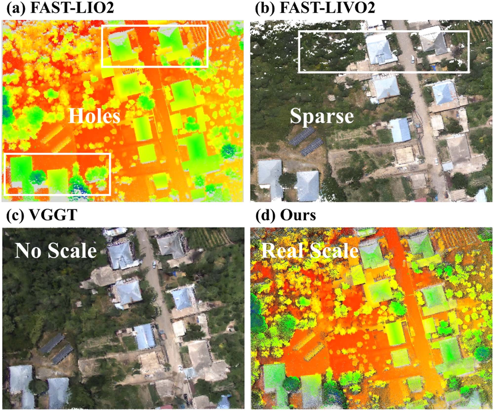
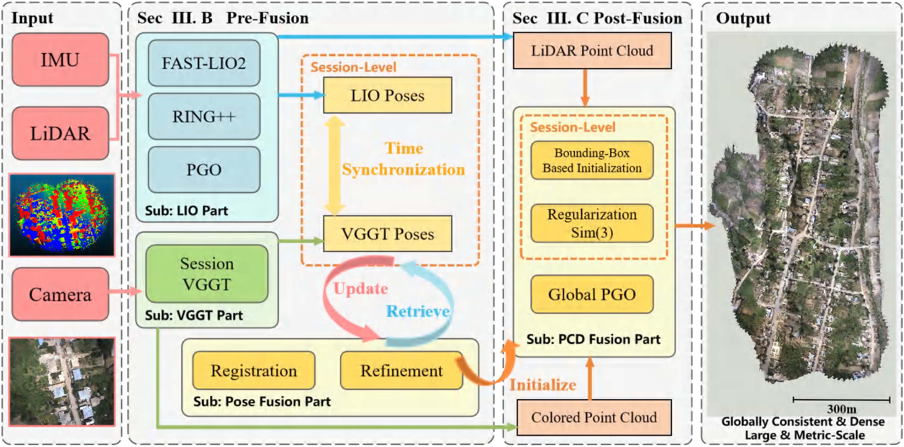
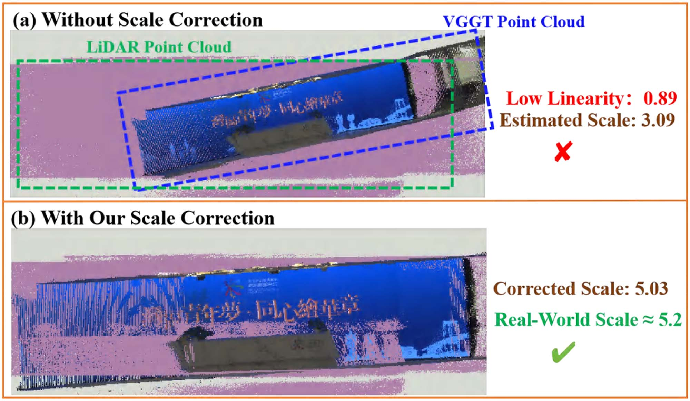
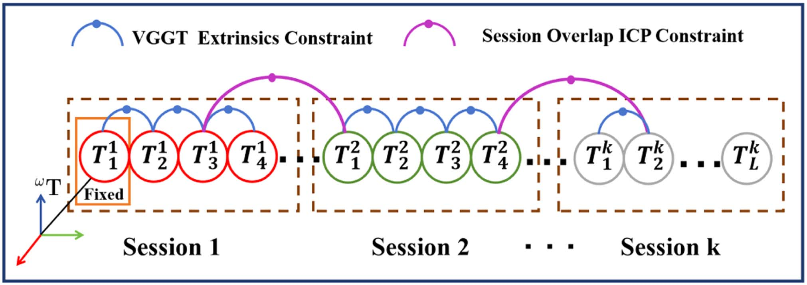
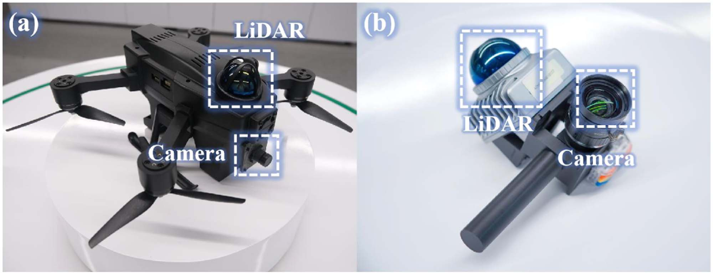
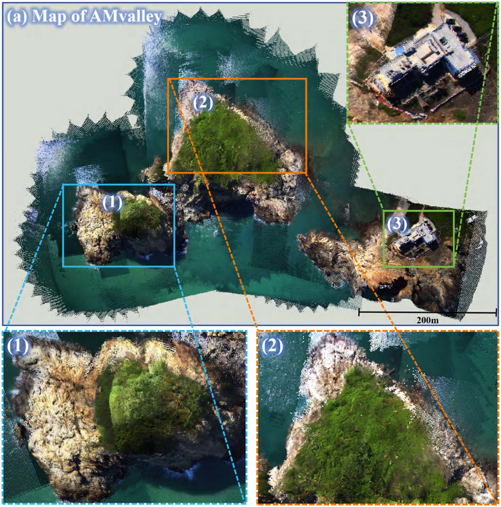
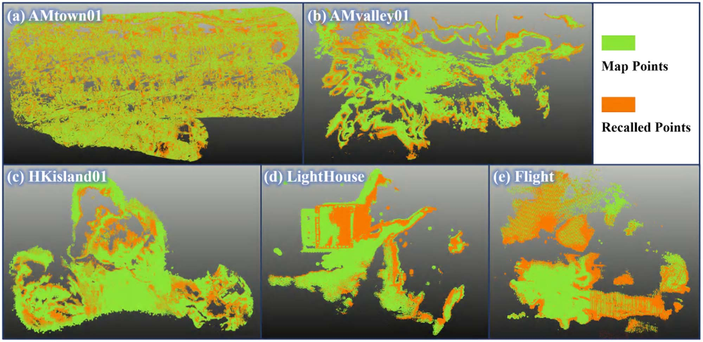
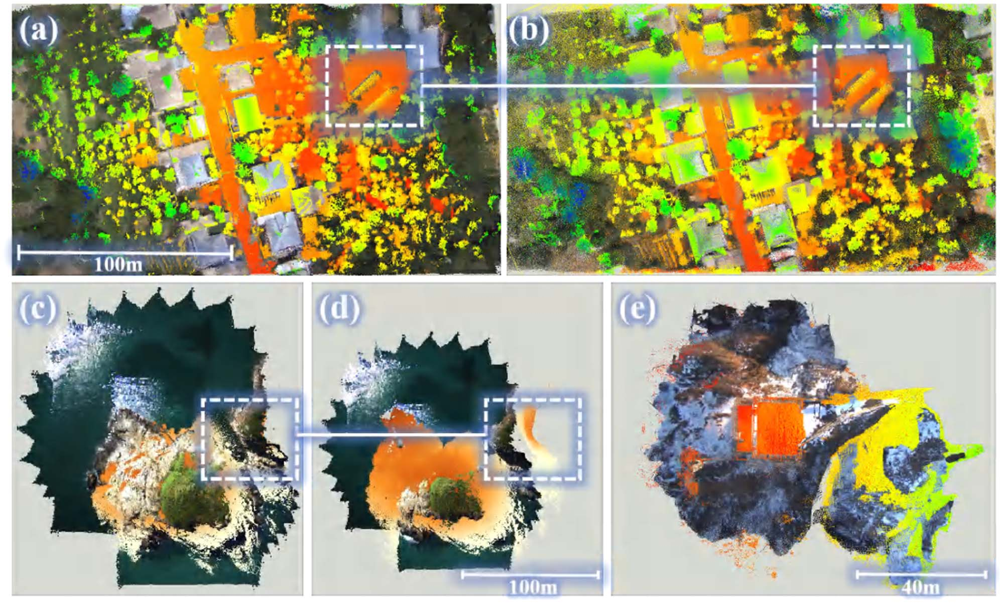
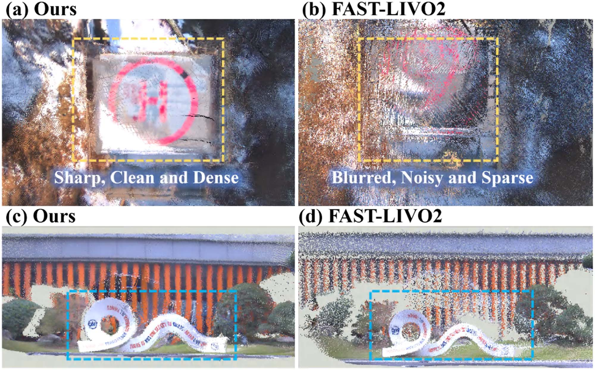

# LiDAR-VGGT：跨模态粗到精融合的全局一致米制稠密建图

> **原文标题**：LiDAR-VGGT: Cross-Modal Coarse-to-Fine Fusion for Globally Consistent and Metric-Scale Dense Mapping  
> **作者**：Lijie Wang, Lianjie Guo, Ziyi Xu, Qianhao Wang, Fei Gao, and Xieyuanli Chen  
> **发表信息**：IEEE Robotics and Automation Letters (RA-L), Vol. 11, No. 4, April 2026。

---

## 原文第 1 页

### 摘要

大规模 RGB 点云重建是机器人领域的重要任务，可支持感知、导航和场景理解。尽管 LiDAR 惯性视觉里程计（LIVO）不断发展，其性能仍对外参标定高度敏感。与此同时，VGGT 等三维视觉基础模型在大环境中的可扩展性有限，并且先天缺少米制尺度。为克服这些局限，我们提出 LiDAR-VGGT：通过两阶段粗到精融合管道，将 LiDAR 惯性里程计与当前最先进的 VGGT 模型耦合。首先，预融合模块稳健地估计每个会话的 VGGT 位姿和具有粗略米制尺度的 RGB 点云；随后，后融合模块增强跨模态三维相似变换，并采用基于边界框的正则化，减小 LiDAR 与相机视场角不一致造成的尺度畸变。多个数据集上的大量实验表明，与基于 VGGT 的方法和 LIVO 基线相比，LiDAR-VGGT 获得了更好的视觉质量和更高的密度。本文方法及新型 RGB 点云评测工具包均已开源。

**索引词**：SLAM，建图，传感器融合。

### I. 引言

在复杂环境中重建精确 RGB 点云，是感知、导航和场景理解等关键机器人能力的基础。大规模三维重建还服务于具身导航、多机器人协作和自动驾驶，分别用于安全探索非结构化环境、支持协同任务以及提供定位和规划所需的环境模型。

经典 LIVO 管道通过融合多模态测量，在位姿估计和地图重建方面取得了进展，但高度依赖精确外参标定和严格时间同步，削弱了真实部署中的鲁棒性。LiDAR 扫描的固有稀疏性也阻碍了稠密、高保真 RGB 三维重建（图 1）。

三维视觉基础模型为稠密场景重建开辟了新途径。DUSt3R 和 MASt3R 可直接从图像预测稠密点云，但受限于图像对并需要后融合。VGGT 能在一次推理中，从多帧未标定 RGB 图像联合执行位姿估计、深度预测和稠密三维重建；然而，其显存限制了可处理的帧数，且结果缺少米制尺度。

**图 1**： (a)、(b) 分别为 FAST-LIO2 [1] 和 FAST-LIVO2 [2] 的点云，因 LiDAR 扫描覆盖有限而稀疏并存在空洞；(c) 为 VGGT 生成的稠密但尺度不确定的地图；(d) 为本文方法生成的具有准确米制尺度的稠密地图。

## 原文第 2 页

为处理长图像序列，近期方法将图像划分为较小会话并对齐相邻会话。这只能约束子图的相对尺度，无法建立全局一致的米制尺度；少量共享帧的低质量重建还会导致相邻子图错误对齐。

基于 LiDAR 的 SLAM 通过回环检测和位姿图优化（PGO）自然提供精确米制运动估计和全局一致性。LiDAR-VGGT 在粗融合阶段利用 LIO 位姿，通过尺度 RANSAC 和线性度验证剔除 Sim(3) 离群点；在精融合阶段，使用带边界框正则化的稳定跨模态 Sim(3) 配准，并通过全局 PGO 消除会话间发散。

现有 RGB 点云评测多依赖二维渲染指标，忽略三维几何结构和真值地图。由于错位或结构畸变会影响三维空间中的颜色正确性，我们提出直接作用于真值地图、同时评估颜色保真度和几何一致性的指标。

本文贡献为：提出首个融合 LiDAR 与 VGGT、实现大规模米制精确稠密全局一致 RGB 点云重建的系统；设计包含粗预融合和精后融合的统一管道；发布联合考虑几何一致性与真值颜色保真度的开源评测工具包。

### II. 相关工作

#### A. 多模态 SLAM 与重建

经典多模态 SLAM 融合 LiDAR、相机和 IMU 以估计轨迹并重建三维场景。R3LIVE、FAST-LIVO 和 FAST-LIVO2 将 LiDAR 点与图像像素或图像块紧密耦合，以实现鲁棒定位和高精度 RGB 地图。NeRF、3DGS、LiDAR-NeRF、SiLVR、Gaussian-LIC 及 GS-LIVO 等工作引入新的地图表示或融合方式，提升了可扩展性和几何精度。但这些管道通常需要准确外参和精确时间同步，且 LiDAR 的稀疏距离测量限制了重建密度。

#### B. 前馈式场景重建

DUSt3R 从图像对预测稠密点图并通过全局对齐恢复几何，但输入增多时一致性下降。Spann3R、MV-DUSt3R+、SLAM3R 和 Fast3R 分别通过记忆模块、多帧输入、局部到世界对齐或更大图像集合改善可扩展性。VGGT 统一执行多帧位姿估计、深度预测和稠密重建；VGGT-Long 与 VGGT-SLAM 将长序列划分为子图并执行 Sim(3) 或 SL(4) 配准，但仍缺少可靠的全局米制尺度，并易受低质量共享点云影响。

## 原文第 3 页

**图 2**：LiDAR-VGGT 系统概览。系统以 IMU、LiDAR 和相机多模态数据为输入，输出具有米制尺度的全局一致稠密重建。管道由预融合模块（第 III-B 节）和后融合模块（第 III-C 节）组成：前者融合 LIO 与 VGGT 位姿建立近似真实世界尺度，后者通过稳定跨模态 Sim(3) 配准和全局位姿图优化细化 RGB 点云。

### III. 方法

#### A. 问题表述与系统概览

VGGT 以 $N$ 张 RGB 图像 $S_N=\{I_1,I_2,\ldots,I_N\}$ 为输入，其中 $I_i\in\mathbb{R}^{3\times H\times W}$，输出
$$f(S_N)=(g_i,D_i,P_i,Tr_i)_{i=1}^{N}. \tag{1}$$
$g_i$ 为相机内外参，$D_i$ 为深度图，$P_i$ 为点图，$Tr_i$ 为点跟踪特征网格。长序列被划分为 $K$ 个重叠会话，每个会话包含 $L$ 帧并独立生成 RGB 点云。目标是估计 $P_k$ 与 LIO 点云 $L_k$ 之间的 $T_k^{V\rightarrow L}\in Sim(3)$，再细化相邻会话的相对变换并合并为一致全局地图。

#### B. 粗预融合模块

图像序列先下采样，以保留可靠推理所需的帧间视差并降低计算成本；FAST-LIO2 构建 LiDAR 地图，RING++ 用于回环检测，回环约束经 PGO 优化得到全局一致地图。

**位姿配准**：将 LiDAR 位姿按外参转换为世界系相机位姿，并为每个 VGGT 位姿匹配时间最近者：
$$j^*(i)=\arg\min_j|t_i^{VGGT}-t_j^{Cam}|. \tag{2}$$
对匹配位姿的平移集合使用闭式 Umeyama 方法，联合恢复尺度、旋转和平移。

**线性度验证与旋转修正**：对相机位姿序列执行 PCA，设特征值 $lambda_1\ge\lambda_2\ge\lambda_3$，线性度为
$$\ell=1-\frac{\lambda_2+\lambda_3}{\lambda_1}. \tag{3}$$
$\ell$ 越大表示运动越接近直线。高线性度序列采用相对旋转平均并通过 SVD 投影到 $SO(3)$，以修正不稳定初始旋转。

**尺度 RANSAC 与细化**：令 $s_k$ 为初始尺度、$\ell_k$ 为线性度，尺度阈值为
$$\text{threshold}=k_\sigma\sigma_s,\quad \sigma_s=\text{std}(\{s_k\}),\quad k_\sigma=2. \tag{4}$$
用 softmax 将线性度转为采样概率
$$p_k=\frac{\exp(\alpha\ell_k)}{\sum_{k=1}^{K}\exp(\alpha\ell_k)},\quad \alpha=\frac{1}{\text{cov}}=\frac{\frac1K\sum_{k=1}^{K}s_k}{\sigma_s}. \tag{5--6}$$
候选尺度 $s_c$ 的内点为 $I(s_c)=\{k\mid|s_k-s_c|<\text{threshold}\}$。迭代后结合最近内点尺度和重叠位姿的 Sim(3) 尺度，修正离群尺度。

## 原文第 4 页

**图 3**： (a) LIO 位姿线性度低，位姿配准后产生错误尺度；(b) 尺度修正恢复了接近真实值的准确尺度。

**图 4**：全局 PGO 结构；第一个会话的第一帧固定为世界参考系。

#### C. 精后融合模块

利用前端估计将 $P_k$ 变换为 $P'_k$。相机与 LiDAR 的 FOV 差异会使无约束 Sim(3) 过拟合并产生尺度漂移，因此采用
$$\min_{s_2>0,R_2\in SO(3),t_2\in\mathbb{R}^3}\sum_{i=1}^{M}\|q_i-(s_2R_2p_i+t_2)\|^2+\lambda(s_2-s_1^*)^2. \tag{8}$$
其中 $s_1^*$ 是预融合尺度，$\lambda=\beta nD^2$，$\beta\in(0,1]$，$n$ 为源地图点数，$D$ 为边界框对角线长度。尺度正则项破坏联合闭式解，因此采用交替优化：最近邻建立对应关系，固定旋转和平移更新尺度，再更新旋转和平移。尺度解为
$$s_2=\frac{\sum_{i=1}^{M}(q_i-t_2)^\top R_2p_i+\lambda s_1^*}{\sum_{i=1}^{M}\|R_2p_i\|^2+\lambda}. \tag{10}$$

**全局位姿图优化**：PGO 包含 VGGT 位姿提供的会话内约束，以及重叠区域 ICP 提供的会话间约束。GTSAM 优化后，将所有 RGB 点云重新投影到共同全局坐标系。

#### D. RGB 点云地图评测

颜色距离 CD 测量重建点云与参考点云的平均双向颜色差异，颜色保真度 CF 以分贝表示：
$$CD=\frac{1}{2N_s}\sum_i\|c_i^s-c_{\pi(i)}^r\|_2+\frac{1}{2N_r}\sum_j\|c_j^r-c_{\pi'(j)}^s\|_2,\quad CF=-20\log_{10}(CD). \tag{11}$$
CD 越小、CF 越高表示颜色保真度越好。LCR 衡量局部颜色差异低于阈值的参考点比例：
$$LCR_{r\rightarrow s}(\tau,r_g)=\frac1{N_r}\sum_j\mathbb{I}(\min_{i\in N_s(x_j^r;r_g)}\|c_i^s-c_j^r\|_2\le3\tau). \tag{12}$$
CCS 对占用体素的 RGB 协方差迹求平均，较小值表示颜色更一致：
$$CCS=\frac1{N_v}\sum_{k=1}^{N_v}\operatorname{tr}(\Sigma_c^{(k)}). \tag{13}$$

## 原文第 5 页

### IV. 实验

在 MARS-LVIG、FAST-LIVO2、MUN_FRL 和自建数据集上评估方法。MARS-LVIG 是大规模空中数据集，每条序列覆盖约 $10^5m^2$。我们先与 VGGT-Long、VGGT-SLAM、SLAM3R 比较整体建图质量，再进行预融合和后融合消融，最后开展多模态比较及鲁棒性分析。

**图 5**：两种数据采集平台；(a) 无人机设备用于室外采集，(b) 手持设备用于室内采集。

**表 I**：实验数据集概览。

#### B. 建图质量实验

将 VGGT-Long 记为 V-Long，将 VGGT-SLAM 两种模式记为 V-Sim(3) 和 V-SL(4)。MARS-LVIG 真值为 DJI L1 与 DJI Terra 生成的高精度点云，MUN_FRL 真值由已知外参和真值位姿插值、再投影图像获得。使用 CloudCompare 匹配尺度并对齐第一帧。

表 II 中，本文方法在 CD、ICP 重叠率、AWD 和 Fitness 四项几何指标上均最佳。除覆盖超过 $450000m^2$ 且纹理相似区域较多的 AMvalley01 外，其余数据集重叠率均超过 50%。大规模序列中纯 LiDAR SLAM 累积明显漂移，而 LiDAR-VGGT 的 AWD 接近 1 m，并在三个数据集获得最佳 AC。表 III 表明其颜色指标均接近最优。图 7 的 $\tau=0.1,r_g=0.5m$ 结果显示颜色整体一致；空白区域主要由 VGGT 点云几何质量不足造成。

**图 6**：MARS-LVIG HKisland01 上的大规模建图结果；放大区域显示点云稠密、一致且具有准确米制尺度。

**图 7**：五条序列上的 LCR 可视化；地图相对真值保持良好局部颜色一致性，中间空洞主要源于 VGGT 点云偏离真值。

## 原文第 6 页

#### C. 配准消融实验

以 LiDAR 点云为参考，比较普通 Sim(3)、稳定跨模态 Sim(3) 和仅含位姿配准的预融合模块，计算每个会话的 RMSE、CD、AWD 和空间一致性得分 SCS。SCS 越小表示局部误差越均匀、地图质量越好。

**表 IV**：配准消融对比。

本文方法在几乎所有指标上优于普通 Sim(3)，预融合因缺少直接点云融合而最差。不同 FOV 的跨模态匹配中，普通 Sim(3) 的无约束尺度更新导致尺度畸变；正则项则有效保持准确尺度。

**图 8**：MARS-LVIG 单会话上的普通 Sim(3) 与正则化 Sim(3) 对比；前者尺度畸变严重，后者以很小尺度误差实现准确对齐。(e) 为本文方法在 MUN_FRL 上的结果。

#### D. 多模态对比与鲁棒性分析

与 FAST-LIO2、R3LIVE 和 FAST-LIVO2（分别记为 LIO2、R3、LIVO2）比较。LIVO2 因定位精度高，在颜色和大多数几何指标上最佳；本文方法在几乎所有颜色指标上第二好且优于 R3。AWD、CD# 等几何指标受 VGGT 几何保真度限制，不如 LIO2 和 LIVO2，但仍优于 R3。本文重建点数达到 $1.5\times10^9$ 至 $6.0\times10^9$，最多为 LIVO2 和 R3 的 4.5 至 125 倍，并因此提供更多配准对应候选，在 AC 上最佳。

自建数据集具有大致标定外参与可靠硬件同步，MUN_FRL 具有准确外参但缺少同步。缺少同步或精确标定时，LIVO2 性能明显下降并生成模糊地图；本文方法基本不受影响，生成更清晰、锐利和稠密的点云。

**表 V**：与 LiDAR 方法的综合评估。

## 原文第 7 页

## 原文第 8 页

**图 9**： (a)、(b) 比较本文方法与 FAST-LIVO2 在 MUN_FRL 上的结果，(c)、(d) 展示 TechnologyPark 上的结果。得益于点与像素的对应关系，本文重建明显更稠密、更锐利、更干净。

### V. 结论

本文提出 LiDAR-VGGT，通过粗到精融合管道将 LiDAR 与 VGGT 集成，实现大规模、稠密、米制精确且全局一致的重建。LiDAR 惯性里程计通过跨模态配准稳健初始化并细化 VGGT 位姿和地图。据我们所知，这是首个结合 LiDAR 与 VGGT 的工作，证明 LiDAR 融合能够恢复 VGGT 重建结果的真实世界米制属性。未来将研究把 LiDAR 线索直接嵌入 VGGT 主干网络，实现端到端跨模态重建。

## 参考文献

参考文献 [1]-[37] 保留原论文英文书目信息与引用编号，以保证作者、题名、期刊及页码信息可核验。
