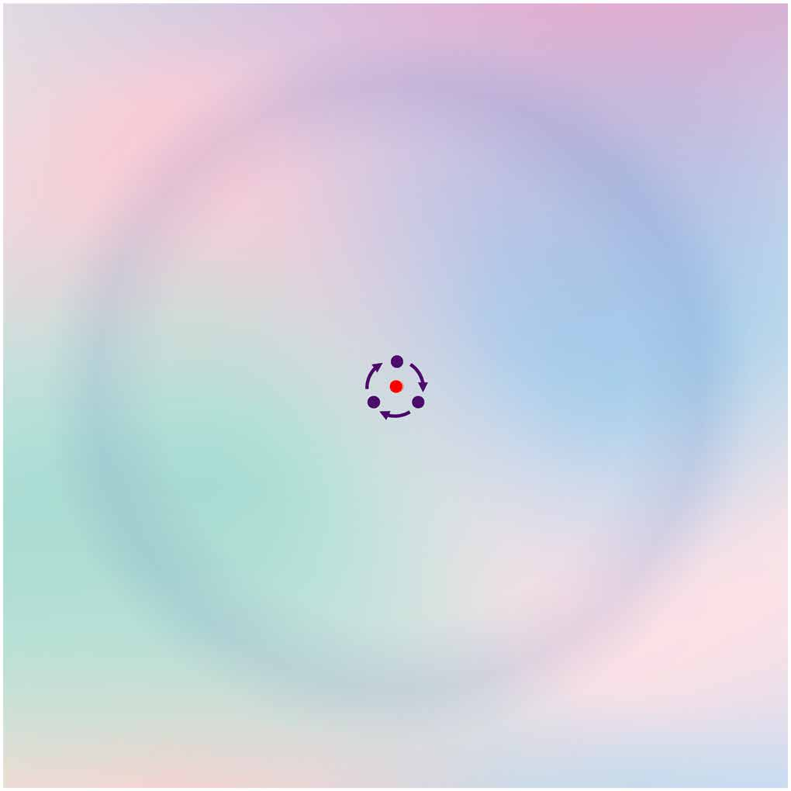
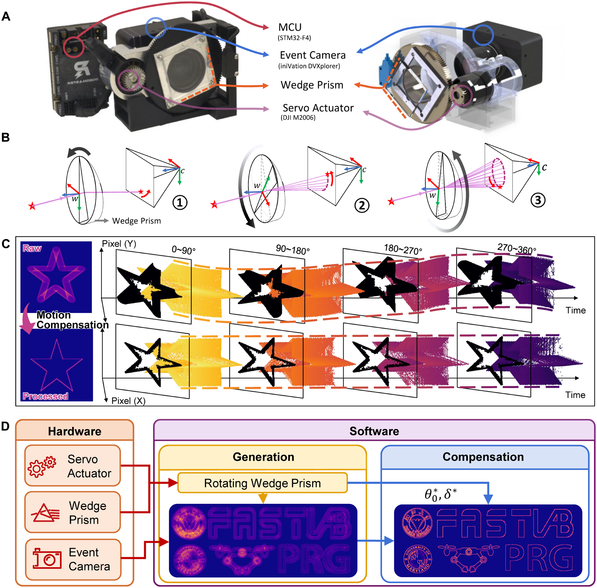
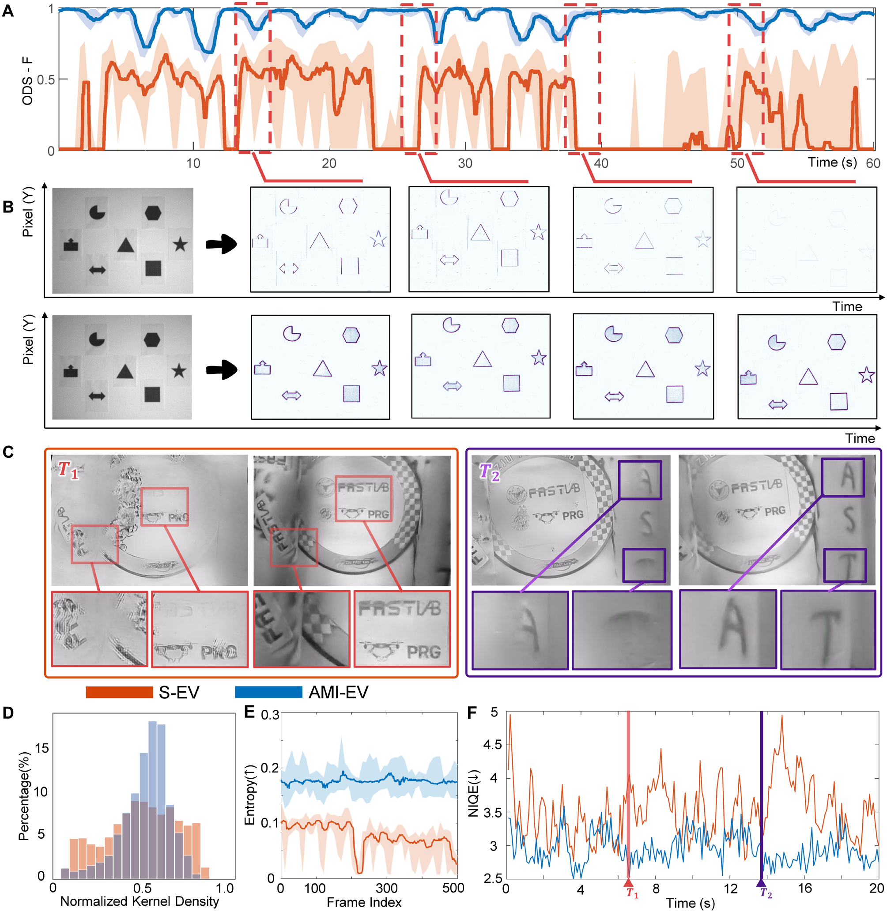
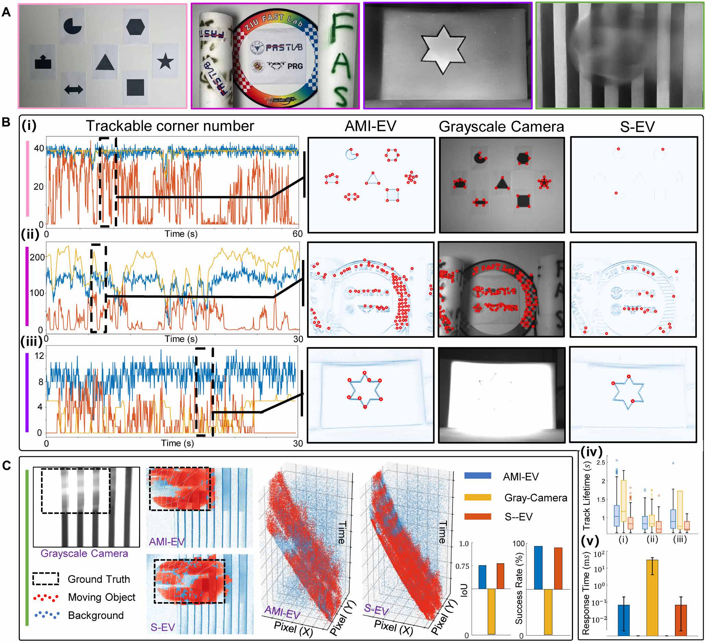
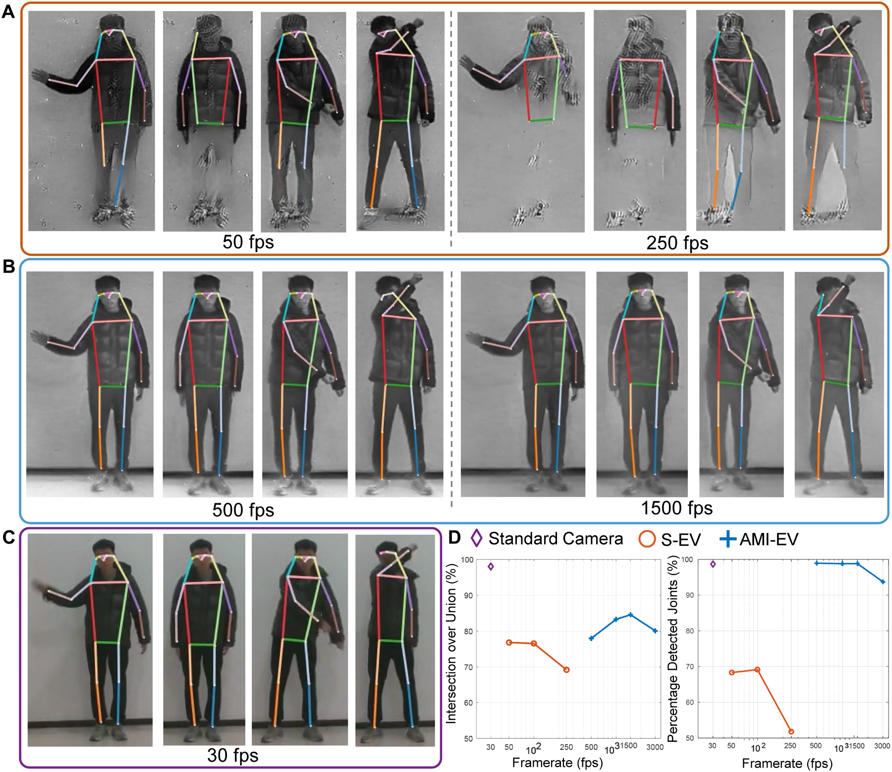
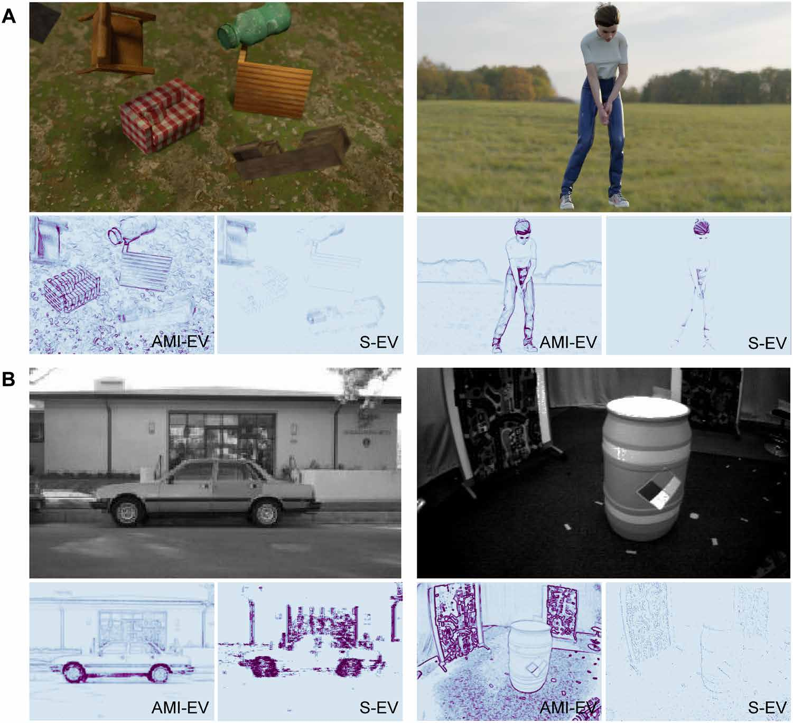
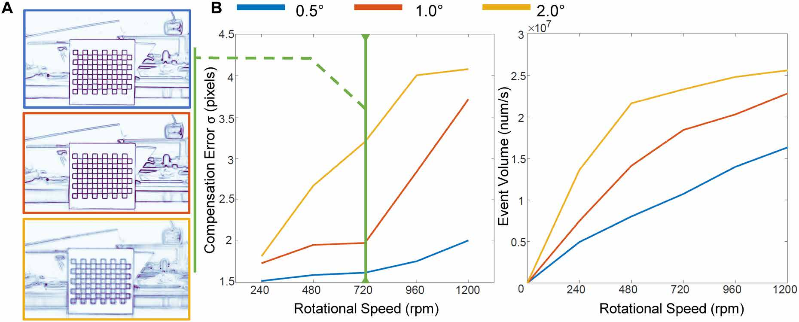
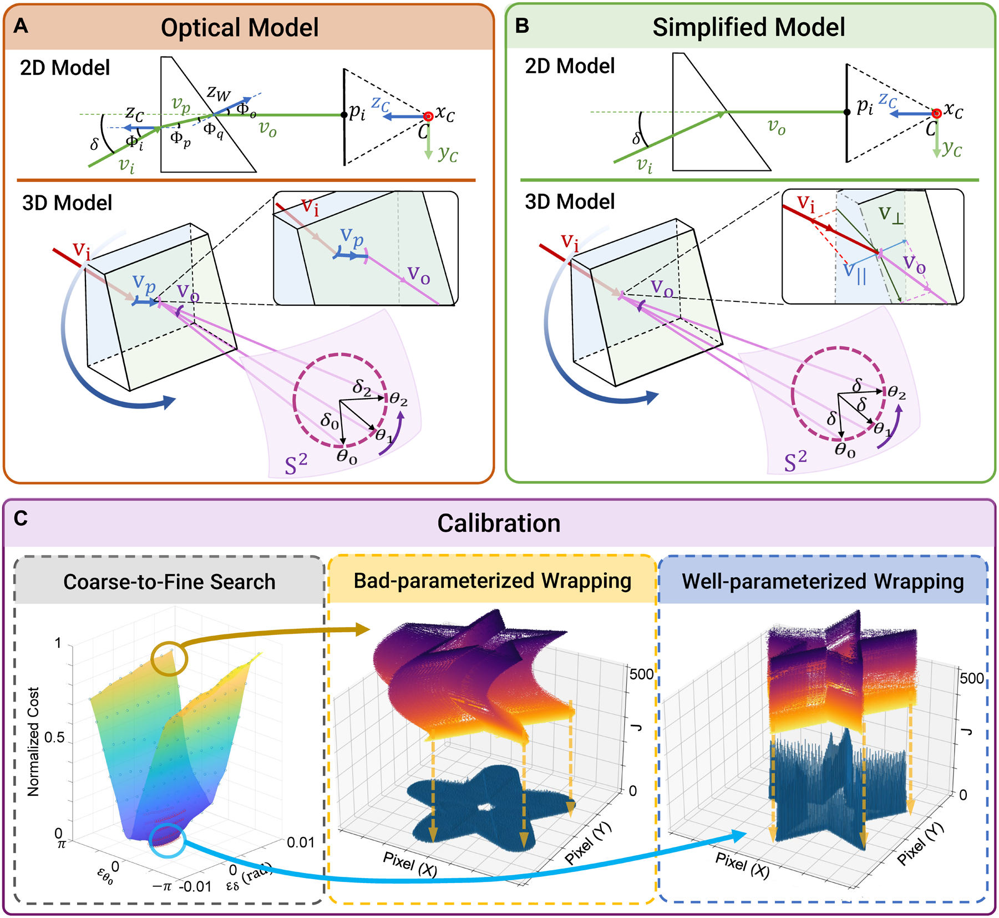

# 微跳视仿生事件相机机器人视觉感知系统

> **原文标题**：Microsaccade-Inspired Event Camera for Robotics  
> **作者**：Botao He，Ze Wang，Yuan Zhou，Jingxi Chen，Chahat Deep Singh，Haojia Li，Yuman Gao，Shaojie Shen，Kaiwei Wang，Yanjun Cao，Chao Xu，Yiannis Aloimonos，Fei Gao，Cornelia Fermüller  
> **发表信息**：He 等，*Science Robotics* 9，eadj8124（2024），2024 年 5 月 29 日。  
> **原文 PDF**：[Microsaccade-Inspired Event Camera for Robotics.pdf](../Microsaccade-Inspired%20Event%20Camera%20for%20Robotics.pdf)

---

## 原文第 1 页

### 摘要

神经形态视觉传感器，即事件相机，使极低反应时间的视觉感知成为可能，为高动态机器人应用开辟了新途径。然而，事件相机的输出同时取决于运动和纹理；当物体边缘与相机运动方向平行时，事件相机无法捕获这些边缘。这是传感器固有的问题，因而难以仅通过算法解决。人类视觉通过细小且不自主的眼球运动应对知觉衰减，其中最显著的一类称为微跳视。注视时，眼睛持续进行幅度很小的运动，微跳视能够显著维持纹理的稳定性和持续性。受此启发，我们设计了一种事件视觉感知系统，同时保持低反应时间和稳定纹理。

该系统在事件相机光阑前安装旋转楔形棱镜，使入射光偏转并触发事件。旋转楔形棱镜的几何光学特性允许通过算法补偿附加的旋转运动，从而在不受外部运动影响的情况下获得稳定的纹理外观和高信息输出。硬件装置与软件方案集成为人工微跳视增强事件相机（artificial microsaccade–enhanced event camera，AMI-EV）。基准比较表明，在普通相机和事件相机都难以有效工作的场景中，AMI-EV 记录的数据质量更高。多项真实世界实验进一步展示了该系统促进机器人低层和高层视觉任务的潜力。

### 引言

在人类视觉感知方面，人类仍然优于最先进的机器人。人类视觉系统经过数百万年的演化，能够高效获取在环境中行动所需的信息。人类视觉的一个特征是注视性眼动，即眼球细小且不自主的位移。其中幅度最大的一类称为微跳视（1）。它们通过在注视期间向视觉神经元产生运动和刺激、增强空间细节感知，确保视觉不会衰减（2，3）。没有微跳视，人类无法持续感知静止物体。图 1 和 Movie 1 给出了示例。本文的问题是：能否将这种主动感知机制用于机器人视觉？

事件相机采用每个像素上的模拟微电路，可达到数微秒时间分辨率，并具有远高于普通相机的动态范围。它已用于动态障碍物感知（5–8）、复杂光照下定位（9–12）、自主巡检（13）和空间态势感知（14）。但事件相机只对运动作出响应：当亮度对数变化超过阈值时像素才触发事件。因此，读数出现在图像边缘，却同时依赖运动和场景纹理。与相机运动方向平行的边缘不会产生事件，事件相机也就无法产生稳定、持续的纹理，准确且长期的数据关联十分困难。

已有软件方法使用角点特征（15–17）、光流（18–20）、二维或三维事件地图以及重建强度图像（12，17，21，22）缓解问题，但相机缓慢运动或静止时仍易受噪声影响。事件相机与普通相机融合（23–26）会降低动态范围；结构光和激光方案（27–31）适应性受限。用云台摇动事件相机模拟微跳视（32，33）又需要较大扭矩，难以由轻量执行器实现。我们的目标是构造一种人工微跳视（AMI）机制，连续改变入射光方向，使系统能够看到场景各个方向的边缘。

## 原文第 2 页：提出的方案

本文从硬件—软件协同设计角度解决准确、稳定事件驱动数据关联的根本挑战。AMI-EV 在事件相机前放置旋转楔形棱镜，主动在边缘等空间频率较高的区域触发事件，即使传感器不移动，也能保持纹理外观和高信息输出。图 2A 展示硬件，图 2B 展示折射，图 2C 展示成像；旋转机构和补偿算法见“材料与方法”和 Movie S1。该补偿算法可使系统直接接入现有事件视觉算法。系统也发布了硬件设计、AMI 生成/标定/补偿软件、仿真平台和公共数据集转换器。

**图 1**：微跳视抵抗视觉衰减的示例。注视红点数秒后，蓝色环和背景会逐渐消退，因为微跳视受到抑制，眼睛无法提供防止周边视觉衰减的有效刺激。在紫色点之间跳视时，即使跳视幅度通常只有 0.5° 至 1.0°，蓝色环仍会持续被感知。Movie 1：微跳视及所提出系统的概览。

## 原文第 3 页：AMI 生成与补偿

楔形棱镜旋转时主动改变入射光方向。起始时棱镜以某一姿态将入射光偏转固定角度；随后执行器驱动光学偏转模块绕相机 z 轴 `zc` 旋转，使偏转方向持续变化。入射光在图像平面上沿近似圆形轨迹运动并连续产生事件，因此输出事件流包含场景的全部边界信息。与移动相机的方案（32，33）相比，本系统的运动部件不包含相机等脆弱部件，更适合高速旋转；恒速旋转也比振动更平滑。补偿将同一入射光线触发的事件移回同一像素，从而恢复清晰边缘。由于执行器配有绝对位置传感器，参数只需标定一次即可用于后续记录。

**图 2**：系统硬件和软件概览。(A) 真实硬件及 CAD 模型；(B) 楔形棱镜旋转时入射光的折射；(C) 事件生成与补偿，左侧图像由右侧事件流累积得到；(D) 系统总览。

## 原文第 4 页：纹理增强的定量评估

我们在事件流、累积事件图像和重建强度图像三种表示上验证效果，并与标准事件相机（S-EV）比较。定制平台配备 S-EV、AMI-EV 和 Intel RealSense D435（36），后者提供 RGB、灰度及深度图像。事件流实验使用核密度估计（KDE）计算事件位置密度，以分布方差衡量均匀性；AMI-EV 方差为 0.196，S-EV 为 0.425，说明前者输出更稳定，低密度噪声成分也更少（图 S10）。

累积事件图像实验用 Canny（40）从灰度图提取边缘作为真值，再进行图像配准，并以 ODS-F 分数和熵评价。AMI-EV 在运动时仍能稳定、完整记录边缘，且更少依赖相机运动。重建实验以 1000 fps 生成视频，并用 NIQE（47）评价，NIQE 越低越好。相机静止时，S-EV 因知觉衰减而性能下降；AMI 主动提供环境信息，因而有效缓解该问题。极少数情况下，棱镜运动抵消相机运动产生的光流，AMI-EV 性能会小幅下降。

**图 3**：纹理增强效果。(A) 用 ODS-F 衡量累积事件图像的结构完整性；(B) 时间快照；(C) 重建灰度图像比较；(D) 原始和增强事件流的事件密度分布；(E) 累积事件图像的熵；(F) 用 NIQE 定量比较重建图像质量。

## 原文第 5 页：特征检测、匹配与运动分割

特征检测和匹配是低层视觉的代表性任务，也是多种机器人应用的基础。我们在结构化、非结构化、复杂光照和动态环境中比较角点检测、跟踪和运动分割。AMI-EV 提供不依赖相机运动的高质量特征，角点数量更多、寿命更长、响应时间更短；当运动方向与多数边缘平行时，S-EV 明显退化而 AMI-EV 保持稳定。运动分割图中，蓝色为背景，红色为独立运动物体。

**图 4**：特征检测和匹配评估。(A) 四项实验环境；(B) 角点检测与跟踪结果；(C) 运动分割结果。

## 原文第 6 页：人体检测与姿态估计

我们在挥手、甩臂、棒球击球和乒乓球击球四种动作上进行人体姿态估计。前两种动作较慢，后两种较快，会使 RGB 帧产生运动模糊。AMI-EV 在人体检测和关节定位方面优于 S-EV 与普通相机。IoU 衡量人体检测性能，PDJ 衡量关节定位精度和完整性；由于传感器采样帧率差异很大，结果采用横轴为对数尺度的半对数图表示。

**图 5**：人体检测和姿态估计。(A–C) 三种相机在四种动作上的结果；(D) 指标比较。帧率表示 E2VID（43）的输出配置。

## 原文第 7 页：讨论与未来工作

**图 6**：发布软件包生成的图像。(A) 含多个运动物体的三维渲染场景和高尔夫场景；(B) 转换器输出，包括 Neuromorphic-Caltech101 与 Multi Vehicle Stereo Event Camera Dataset 的事件计数图像。

通过模拟生物微跳视机制，我们提出并评估了能够增强纹理、支持高质量数据关联的事件视觉系统。旋转楔形滤光片维持稳定纹理和高信息输出，补偿算法抵消滤光片运动。补偿结果与主流事件数据处理方法兼容，准确率和延迟损失很小。低层短时间光流估计会引入约 0.19 像素端点误差，但保持稳定纹理的收益更大；高层识别和检测任务中的损失可以忽略。

与 S-EV 相比，该装置获取更多环境信息，同时保留高动态范围和高时间分辨率优势。代价是机械结构带来的额外能耗，以及新的数据处理要求。未来可用电光材料和光学相控阵（63）替代机械结构，或根据场景速度自适应调节旋转速度。当前补偿还带来约 1.5–2.0 像素误差、计算开销，并合并两种极性的事件；未来可采用定向椭圆拟合、直接处理事件流的方法，或训练神经网络（包括 SNN）回归逐像素补偿函数。

## 原文第 8 页：材料与方法

### 硬件架构

平台尺寸为 82 mm × 54 mm × 62 mm，总重 322 g，其中事件相机（含镜头）131 g，外部 MCU 41 g。系统包含光学偏转、执行器、事件相机和 MCU 四个模块。平台使用 DJI M2006 无刷直流电机、自定义减速齿轮和绝对位置编码器；执行器重 57 g，在 1500 rpm 时提供 0.11 N·m 扭矩。DVXplorer 分辨率为 640 × 480，并支持与外部传感器同步；MCU 控制执行器、接收位置反馈并同步相机。

### 偏转角和转速

增大楔形棱镜倾角和转速会增加事件数量，也会增大补偿误差。单帧至少覆盖四分之一旋转周期；对 33 ms 事件计数图像，旋转周期应为 132 ms，即至少 455 rpm。实验发现 0.5° 和 1.0° 棱镜超过 720 rpm 后误差明显上升，因此真实实验统一采用 720 rpm。特征检测和匹配使用 1.0° 棱镜，其余实验、仿真器和转换器使用 0.5° 棱镜。

**图 7**：不同偏转角和转速下的补偿误差与数据量。(A) 720 rpm 时的补偿效果；(B) 定量结果。

### 光学模型、标定和补偿

二维楔形棱镜模型依据 Snell 定律描述入射光 `vi` 经两次折射后的输出光 `vo`；棱镜折射率设为 1.55，空气折射率为 1.0。相机内参矩阵为 `K`：

$$p_i=K\cdot g(v_i,z_w)\cdot v_i$$

旋转模型加入随时间变化的角度 `theta`：

$$I(m,n)=K\cdot G(v_i,z_w(\theta))\cdot v_i$$

为降低标定的内存和计算量，将 `vi` 分解为垂直和平行于 `zw(theta) × zc` 的分量，把轨迹近似为只含 `delta` 和 `theta` 两个参数的圆；在 90° 视场内误差小于 2 像素。标定先用棱镜折射角和编码器零位设定初值，收集 2 s 的事件及编码器数据，将 `(x,y,t)` 转换到 `(x,y,theta)`，再将事件反向变换到初始角度。由变换事件构造 IWE，以图像清晰度定义代价函数，并通过粗到细搜索得到 `delta` 和 `theta_b`。最优解唯一，在一定区域内具有凸性。

**图 8**：系统光学模型、模型简化和标定过程。(A) 二维楔形棱镜相机模型及三维旋转模型；(B) 简化模型；(C) 粗到细搜索、较差轨迹估计和较好轨迹估计。

## 原文第 9 页：补充材料与声明

补充材料包括 Methods、图 S1–S13、References（76–83）、Movies S1–S4 和 MDAR Reproducibility Checklist。作者感谢为论文提供建议及真实世界实验帮助的合作者。研究得到 National Natural Science Foundation of China 和 National Science Foundation 项目资助。作者声明无利益冲突；评估结论所需数据已发布于 `https://zenodo.org/records/8157775`。

### 编辑摘要

事件相机适合感知动态物体，却不擅长维持稳定、持续的纹理。He 等人受微跳视启发，在事件相机光阑前安装旋转楔形棱镜以改变入射光方向并稳定纹理。实验表明，与标准事件相机相比，增强事件相机能够获取更多环境信息并估计高速运动，具有用于机器人视觉的潜力。

## 参考文献

正文引用编号保持不变；作者、题名、期刊、页码、DOI 和 URL 按原文保留。完整参考文献为原文 References and Notes 的 1–83 项。

**原文 DOI**：10.1126/scirobotics.adj8124

## 原文第 10 页

硬件蓝图、实验参数和补偿流程按原文保留；正文中的图号、公式编号及引用编号与 PDF 一致。

## 原文第 11 页

光学模型使用 Snell 定律、旋转矩阵和针孔相机模型；符号、变量及数学关系按原文保留。

## 原文第 12 页

模型简化将每个像素的轨迹表示为圆形近似，以减少参数数量并避免离散化误差。

## 原文第 13 页

标定通过事件扭曲、IWE 构造和清晰度代价函数进行粗到细优化。

## 原文第 14 页

参考文献 1–78：作者、题名、期刊、页码及 DOI 按原文保留。

## 原文第 15 页

参考文献 79–83、致谢、经费、作者贡献、利益冲突和数据可用性声明按原文保留。

## 原文第 16 页

编辑摘要、在线阅读地址、许可说明、期刊信息和版权声明按原文保留。
