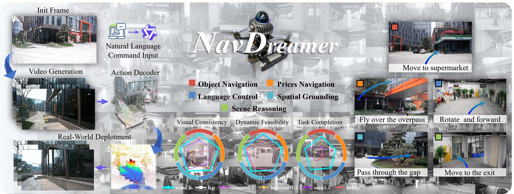
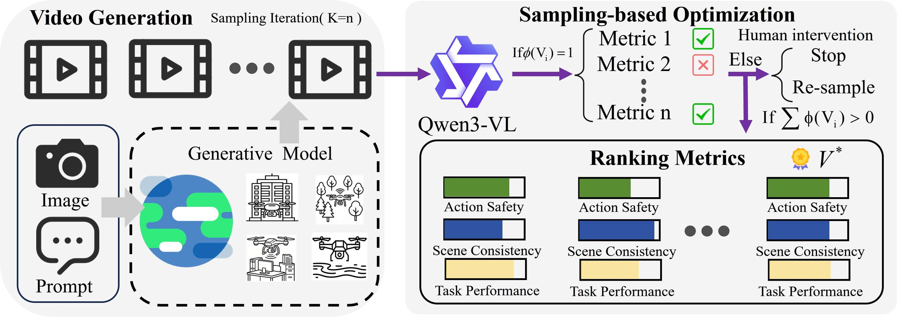
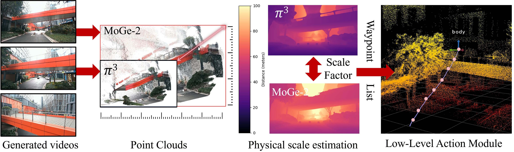
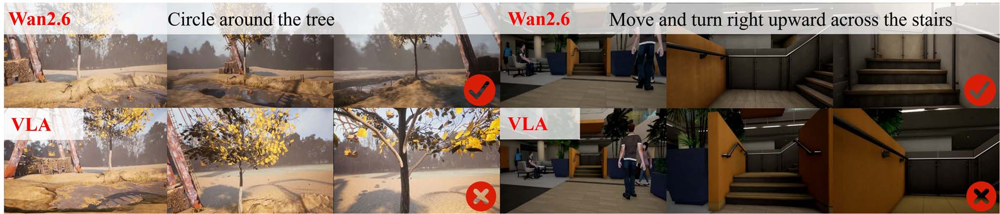
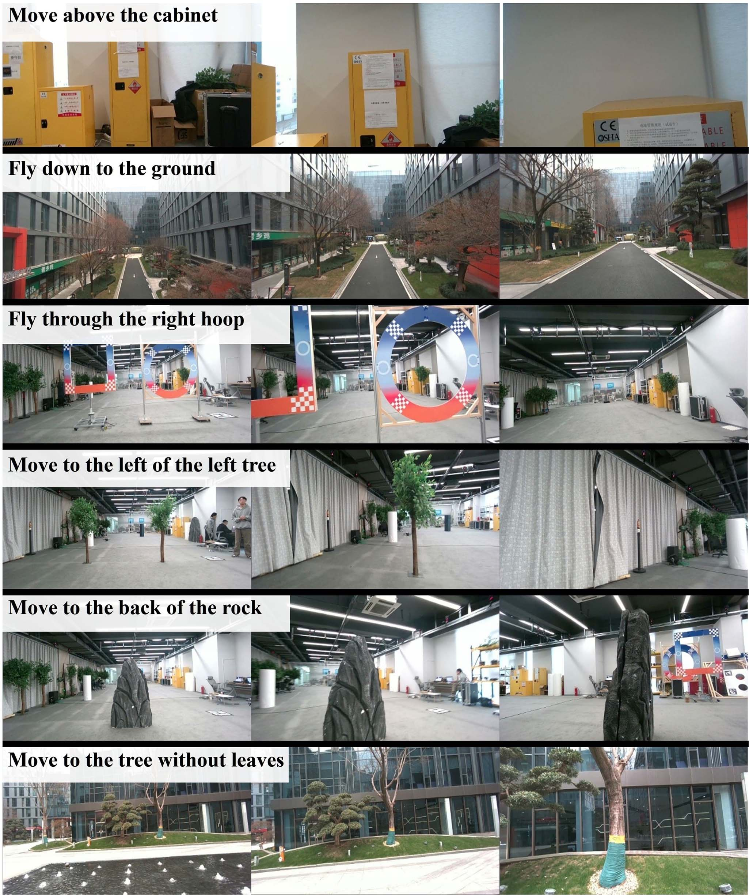
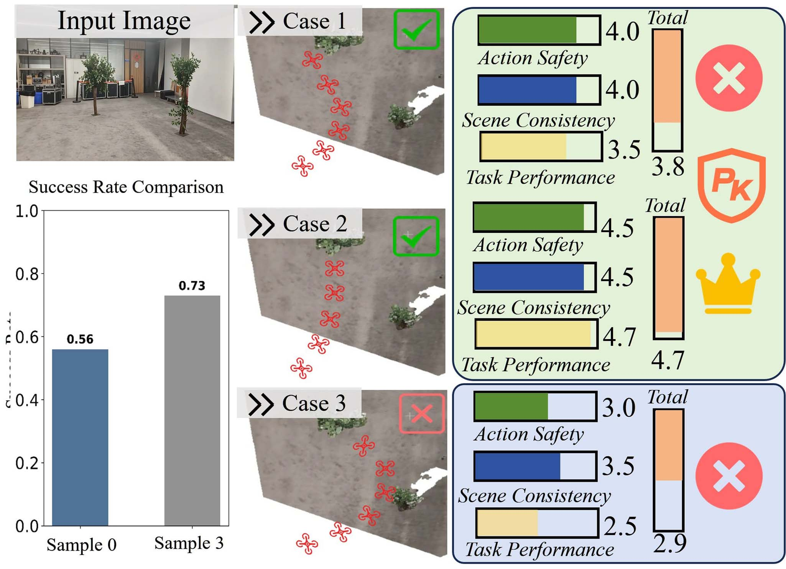
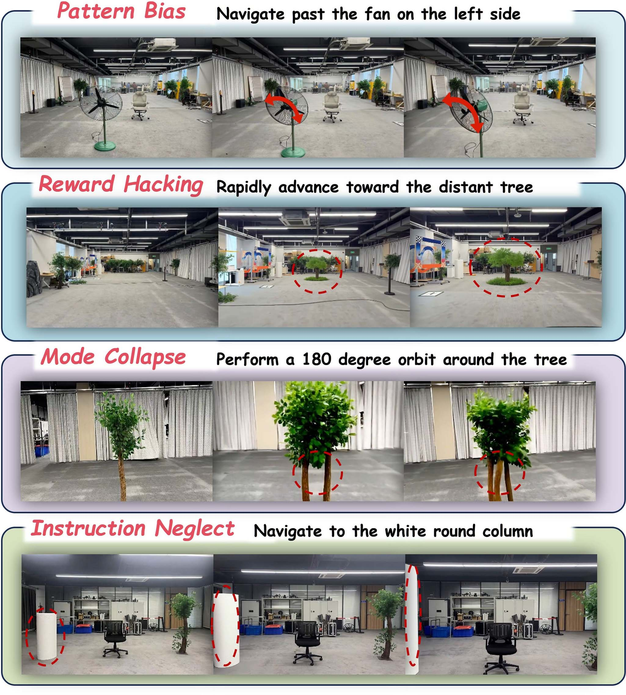

# NavDreamer基于视频生成模型的零样本三维具身导航（NavDreamer Video Models as Zero-Shot 3D Navigators）：完整忠实学术翻译

> **原文标题**：NavDreamer Video Models as Zero-Shot 3D Navigators  
> **作者**：Xijie Huang, Weiqi Gai, Tianyue Wu, Congyu Wang, Qiaoyu Zheng, Zhiyang Liu, Xin Zhou, Yuze Wu, Fei Gao（Member, IEEE）  
> **原文 PDF**：[NavDreamer Video Models as Zero-Shot 3D Navigators.pdf](../NavDreamer Video Models as Zero-Shot 3D Navigators.pdf) ｜ **对应中文详解**：[26_NavDreamer基于视频生成模型的零样本三维具身导航.md](../中文详解/26_NavDreamer基于视频生成模型的零样本三维具身导航.md)  

---

## 原文第 1 页

NavDreamer: Video Models as Zero-Shot
3D Navigators
Xijie Huang
, Weiqi Gai
, Tianyue Wu, Congyu Wang
, Qiaoyu Zheng
, Zhiyang Liu, Xin Zhou
,
Yuze Wu
, and Fei Gao
, Member, IEEE
**摘要**——现有基于视觉-语言-动作（VLA）的导航方法受限于稀缺的机器人数据，以及无法捕捉开放世界三维导航动态的静态图像-文本表征。本文提出 NavDreamer，一种基于视频的零样本三维导航框架，利用生成式视频模型丰富的时空先验和物理先验。借助互联网规模预训练带来的强泛化能力，我们根据语言指令和当前观测使用视频模型生成高层视觉导航规划。为减轻生成预测固有的随机性，我们提出基于采样的优化方法，利用视觉-语言模型（VLM）对视频评分并进行筛选。随后，逆动力学模型从最优视频规划中解码可执行的三维航路点，再由低层规划器执行，以提高安全性。针对缺少视频导航评测基准的问题，我们提出涵盖目标物导航、精确导航、空间定位、语言控制和场景推理的基准，并选取表现最佳的视频模型作为基础骨干。大量真实世界实验和消融研究验证了流程在新环境中的泛化能力及其有效性。
Index Terms—Aerial systems, perception and autonomy, motion
igation methods are limited by scarce robotic data and static
image-text representations that fail to capture the dynamics of
open-world 3D navigation. We propose NavDreamer, a video-based
framework for zero-shot 3D navigation that builds on the rich
spatiotemporal and physical priors of generative video models.
Motivated by the strong generalization enabled by internet-scale
pre-training, we use video models to generate high-level visual
navigation plans from language instructions and current obser-
vations. To mitigate the inherent stochasticity of these generative
predictions, we introduce a sampling-based optimization method
that utilizes a Vision-Language Model (VLM) for video scoring
and selection. Subsequently, an inverse dynamics model is em-
ployed to decode executable 3D waypoints from the optimal video
plan. These waypoints are then fed into a low-level planner to
allow safer execution. Given the lack of existing benchmarks for
evaluating video models in navigation, we introduce a benchmark
covering object navigation, precise navigation, spatial grounding,
language control, and scene reasoning. We identify and employ
the best-performing video model as our foundational backbone.
Through extensive real-world experiments and ablation studies,
we evaluate the generalization to novel environments and validate
the effectiveness of our proposed pipeline.
Index Terms—Aerial systems, perception and autonomy, motion
and path planning, vision-based navigation.
## I. 引言
T
HE pursuit of generalist agents capable of open-world
navigation remains a core vision in robotics. While Vision-
Language-Action (VLA) models [1], [2], [3] have demonstrated
promising generalization, the robotics domain has yet to witness
Received 25 March 2026; accepted 2 July 2026. Date of publication 16 July
2026; date of current version 24 July 2026. This article was recommended for
publication by Associate Editor Z. Wu and Editor P. Vasseur upon evaluation of
the reviewers’ comments. This work was supported in part by the National Key
R&D Program of China under Grant 2023YFB4706600, in part by the Zhejiang
Provincial Science and Technology Plan Project under Grant 2024C01170,
and in part by the National Natural Science Foundation of China under Grant
62322314. (Corresponding authors: Yuze Wu; Fei Gao.)
Xijie Huang, Congyu Wang, Qiaoyu Zheng, Yuze Wu, and Fei Gao are with
the State Key Laboratory of Industrial Control Technology, Zhejiang Univer-
sity, Hangzhou 310027, China, and also with Differential Robotics, Hangzhou
311121, China (e-mail: wuyuze000@zju.edu.cn; fgaoaa@zju.edu.cn).
Weiqi Gai is with Differential Robotics, Hangzhou 311121, China, and also
with Beihang University, Beijing 100191, China.
Tianyue Wu is with the State Key Laboratory of Industrial Control Technol-
ogy, Zhejiang University, Hangzhou 310027, China.
Zhiyang Liu and Xin Zhou are with Differential Robotics, Hangzhou 311121,
China.
This
article
has
supplementary
downloadable
material
available
at
https://doi.org/10.1109/LRA.2026.3713727, provided by the authors.
Digital Object Identifier 10.1109/LRA.2026.3713727
its own “aha moment” like LLMs [4], [5]. The current limitation
primarily stems from two fundamental bottlenecks. First, unlike
internet-scale text, high-fidelity robotic data relies on costly,
labor-intensive collection methods like manual remote con-
trol [6] or teleoperation [2], severely hindering data scaling [7].
Second, current VLAs are typically built upon static image-text
backbones [8]. This static paradigm is inherently lossy, lacking
the expressiveness to capture crucial temporal dependencies and
physical dynamics, such as collisions or falling [9].
Recently, the rapid progress in generative video models [10],
[11], [12] has introduced a promising paradigm to address these
challenges. First, unlike robotic action data, video datasets are
available at an internet scale, enabling models to achieve signif-
icant zero-shot generalization across unseen tasks and environ-
ments [13]. Second, video serves as a high-fidelity representa-
tion that captures intricate temporal and spatial information that
language and static images often fail to resolve [9]. Furthermore,
video functions as a unified state-action space, providing a
universal interface to represent behaviors across diverse robotic
platforms [14]. This shared abstraction facilitates knowledge
sharing by naturally capturing state-action trajectories within a
consistent pixel space.
Driven by the superior generalization of video models, an
increasing number of works have investigated transferring video
priors to manipulation policies [15], [16]. Yet, a primary bot-
tleneck in these approaches lies in the difficulty of decoding
precise, low-level robotic actions from pixel space [17], [18].
In contrast, navigation primarily relies on high-level direc-
tional guidance, making it a much more natural fit for video-
based planning. Benefiting from internet-scale pre-training, this
paradigm unlocks remarkable zero-shot generalization across
unseen tasks and diverse environments, ranging from indoor
spaces to unconstrained outdoors. Despite these advantages,
translating the complex navigation intents embedded within
these generated videos into physical execution is non-trivial. In
particular, aligning these extracted visual intents with the actual
metric scale of the open world poses a critical challenge. Fur-
thermore, due to the inherent stochasticity of generative video
models, selecting the optimal visual plan remains a persistent
problem.
Previous work has primarily focused on utilizing future frame
prediction as an auxiliary signal to augment the navigation pol-
icy [19], which is exclusively applied to goal-image-conditioned
tasks. In contrast, we propose NavDreamer as shown in Fig. 1,
which directly utilizes the generative video model as a 3D high-
level navigation planner and achieves zero-shot generalization
on language-conditioned tasks. It serves as a unified interface
2377-3766 © 2026 IEEE. All rights reserved, including rights for text and data mining, and training of artificial intelligence and similar technologies.
Personal use is permitted, but republication/redistribution requires IEEE permission. See https://www.ieee.org/publications/rights/index.html for more information.
Authorized licensed use limited to: National Institute of Technology- Delhi. Downloaded on August 24,2026 at 05:44:47 UTC from IEEE Xplore.  Restrictions apply.

---

## 原文第 2 页

**图 1**：系统概览。左：该流程利用生成式视频模型，将文本指令和单张 RGB 图像转换为可执行轨迹。右：我们在五类导航任务上评估该框架。

that bridges the gap between high-level language instructions
and executable navigation trajectories. To mitigate the stochas-
ticity in generative models, we first employ a sampling-based
optimization strategy. Unlike the energy-based (e.g., goal-image
similarity) sampling methods [19], we use VLM to evaluate the
video quality from different dimensions [20]. To obtain more
precise actions, NavDreamer decodes waypoints from the gener-
atedvideosusingπ3 [21],withabsolutescaleambiguityrectified
by incorporating metric depth priors from MoGe-2 [22]. These
calibrated waypoints are then fed into a low-level planner [23]
for flight execution. NavDreamer demonstrates zero-shot gen-
eralization to novel objects and environments. Furthermore, we
introduce a comprehensive benchmark for video-based naviga-
tionspanningfivedimensions:objectnavigation,precisenaviga-
tion, spatial grounding, scene reasoning, and language control.
Extensive experiments and ablations provide key insights into
leveraging generative video models for 3D navigation.
In summary, our contributions are: (1) We propose a zero-shot
3D navigation pipeline that combines a generative video model
and an inverse dynamics model to interpret high-level com-
mands; (2) We design a 3D navigation benchmark to evaluate
state-of-the-art video models across five critical dimensions; (3)
We explore various design choices through ablation studies to
understand their effects on video-based 3D navigation perfor-
mance.
## II. 相关工作
### A. 面向机器人的生成式视频模型
The rapid advancement of generative video models [10], [11],
[12] has demonstrated remarkable zero-shot generalization to
unseen scenarios [13], sparking a profound interest in robotics.
One line of research treats video models as high-fidelity neural
simulation engines to synthesize large-scale, diverse robotic
trajectories for policy pre-training [24]. Another line utilizes
video models as policy, which can be categorized into direct
training and interface-based paradigms. In the context of direct
training, some works integrate future frame prediction as a mul-
timodal objective within the VLA paradigm to enforce physical
consistency and foresight [25]. Others adopt pre-trained video
models as VLA backbones to replace traditional VLMs, arguing
that pre-trained video generators possess a more profound un-
derstanding of physical and spatiotemporal dynamics [12], [15],
[16], [26]. Alternatively, another paradigm treats video as a form
of visual planning, where video models serve as an interface
between visual imagination and robotic action. These methods
first generate full-pixel future videos based on given conditions,
subsequently extracting executable poses or trajectories from
the generated frames [14], [27]. While recent works such as
SparseVideoNav [28] have successfully demonstrated the poten-
tial of this generative pipeline in 2D navigation, extending such
capabilities to unconstrained 3D aerial environments remains
largely unexplored.
### B. 三维导航与自主系统
In recent years, UAV navigation has made significant strides
across various specialized tasks, including drone racing [29],
aerobatic [30], and gap traversal [31]. While these expert-based
systems demonstrate high precision in specific domains, ex-
tending their capabilities to open-world semantic reasoning
and broad task generalization remains a significant research
objective. The emergence of VLA has introduced a unified
paradigm to address these challenges. Notably, AerialVLN [32]
and CityNav [33] established large-scale benchmarks for out-
door aerial navigation. Frameworks like VLA-AN [3] utilize
multi-stage training pipelines to improve scene understanding
and navigation precision. Nevertheless, these rely extensively
on large human-annotated datasets for post-training VLM back-
bones. This reliance may pose challenges when transferring
the generalization and semantic understanding of VLMs to the
robotics domain, primarily due to the significant disparity in
data scale. While training-free approaches [34] offer a more
resource-efficient alternative, their application is currently often
focused on relatively fundamental object-oriented navigation
tasks, constrained by the rule-based strategies used to extract
navigationalcuesfromVLMs.Recentwork[35]leveragesworld
models for future frame synthesis to provide similarity-based
Authorized licensed use limited to: National Institute of Technology- Delhi. Downloaded on August 24,2026 at 05:44:47 UTC from IEEE Xplore.  Restrictions apply.

---

## 原文第 3 页

HUANG et al.: NAVDREAMER: VIDEO MODELS AS ZERO-SHOT 3D NAVIGATORS
10515

**图 2**：基于生成采样的优化框架。模型生成 K 个视频样本，Qwen3-VL 从动作安全性、场景一致性和任务完成度三个方面对其进行评估。

guidance for the policy, yet its deployment is restricted to
constrained benchmarks such as image-goal navigation.
## III. 方法
Given an input image I and a language instruction c, Nav-
Dreamer first employs a video generation model to synthesize a
predictive navigation sequence conditioned on these inputs. No-
tably,thisgenerativeprocessproducesintuitiveandinformation-
dense visual cues that serve as high-level guidance. Qwen3-
VL [36] serves as an optimal video selector based on instruction
alignment and environmental constraints, similar to [37]. The
selected video is temporally subsampled at fixed intervals (e.g.,
3 Hz) into an image sequence. We then employ π3 [21] to
decode waypoints (e.g., x, y, z, and yaw) from image sequences.
To address the inherent scale ambiguity of π3, which is even
more severe in 3D outdoor environments, we apply a robust
scale recovery method using metric depth estimates [22] as a
reference. These calibrated waypoints serve as the foundation
for the low-level planning module, where the final trajectory is
optimized in accordance with the real-time obstacle distribution.
### A. 基于生成采样的优化
Enhancing interpretability is a core objective in learning-
based robotics. Given an observation I0 and instruction c, the
generative process is defined as V ∼P(V|I0, c). Since video
generation is stochastic and identical conditions may yield di-
vergent outcomes, we generate K = 3 independent candidates
{V1, . . . , VK} with different seeds to leverage sample diversity
and mitigate instability. To enhance reliability, Qwen3-VL is
utilized to evaluate these samples. As shown in Fig. 2, we define
a binary success indicator Φ(Vi) ∈{0, 1} to verify whether a
candidate sequence represents a successful and safe execution:
Φ(Vi) =

1,
if VLM-Judge(c, Vi) is True
0,
otherwise
(1)
where a true result signifies that the video is both task-consistent
and collision-free. c denotes the task instruction used by the
VLM to evaluate whether the generated video is safe and con-
sistent with the intended navigation objective. This binary filter
forms the set of valid candidates Vvalid = {Vi|Φ(Vi) = 1}. Then,
we perform a fine-grained evaluation based on three metrics:
dynamic feasibility (scdf), visual consistency (scvc), and task
completion (sctc), each ranging from 0.0 to 5.0. During evalua-
tion, we observed that partitioning scores into integer-bounded
intervals provides better stability over a fully continuous decimal
scale. Consequently, we define five distinct intervals bounded by
integers from 0 to 5, which map directly to five qualitative levels:
Failure, Poor, Average, Good, and Excellent. The overall quality
score R(Vi) is calculated via a weighted sum:
R(Vi) = wdf · scdf + wvc · scvc + wtc · sctc
(2)
where wdf, wvc, wtc
represent the predefined importance
weights for each dimension. Since the generated videos gen-
erally exhibit high baseline performance in both dynamic feasi-
bility and visual consistency, as shown in Table I, a higher weight
is allocated to wtc to provide clearer differentiation among
candidate sequences. The final optimal video V∗is selected as
the sample that maximizes the reward:
V∗= arg maxVi∈Vvalid R(Vi)
(3)
This VLM-based evaluation acts as the primary safeguard
against generative hallucinations (e.g., falsely synthesizing non-
existent clearances or gaps), actively filtering out physically
implausible trajectories.
### B. 从视频获取高层动作
While π3 [21] attempts to predict absolute metric geometry,
its native scale estimation frequently degrades, especially in
3D outdoor environments. Therefore, we deliberately decouple
its relative geometric predictions from this unreliable scale,
utilizing a robust recovery module to recalibrate the trajectory.
Givenanimagesequence{It}N
t=1,wefirstemployametricdepth
estimator (e.g., MoGe-2 [22]) to obtain the reference depth maps
Dref
t as shown in Fig. 3. Concurrently, π3 is utilized to generate
a sequence of local pointmaps Xt ∈RH×W ×3. For each frame
Authorized licensed use limited to: National Institute of Technology- Delhi. Downloaded on August 24,2026 at 05:44:47 UTC from IEEE Xplore.  Restrictions apply.

---

## 原文第 4 页

**图 3**：高层航路点解码与度量尺度对齐。π3 从生成的 RGB 视频中提取初始航路点和点云，MoGe-2 提供度量尺度深度参考以消除尺度歧义。通过交叉参考两个模型得到的全局尺度因子，将合成轨迹转换为具有物理尺度的航路点列表。

**表 I**
不同三维导航任务中视频模型的定量比较。我们在目标物导航、精确导航、空间定位、语言控制和场景推理五个类别上，依据视觉一致性（VC）、动态可行性（DF）和任务完成度（TC）三项核心指标评估开源与闭源模型。每个分数是五次独立采样试验的平均性能，最佳结果以粗体标出。“HUN”和“COS”分别表示 HUNYUANVIDEO-1.5 和 COSMOS-PREDICT2.5。
NAVIGATION TASKS. WE EVALUATE OPEN-SOURCE AND CLOSED-SOURCE
MODELS ACROSS FIVE SPECIALIZED CATEGORIES BASED ON THREE CORE
METRICS: VISUAL CONSISTENCY (VC), DYNAMIC FEASIBILITY (DF), AND
TASK COMPLETION (TC). EACH REPORTED SCORE REPRESENTS THE MEAN
PERFORMANCE OVER FIVE INDEPENDENT SAMPLING TRIALS, WITH THE BEST
RESULTS HIGHLIGHTED IN BOLD. (NOTE: “HUN” AND “COS” STAND FOR
HUNYUANVIDEO-1.5 AND COSMOS-PREDICT2.5).
t, we define a valid observation mask Mt to filter out outliers
and extreme values (e.g., sky or extremely far objects), typically
constrained within a reliable sensing range τ ∈[0.5, 30] meters:
Mt = {(u, v)|τmin < Dref
t (u, v) < τmax}
(4)
The per-pixel scale ratio st(u, v) is computed within the
valid region defined by Mt, where Zpred
t
(u, v) represents the
normalized depth derived by projecting the 3D point cloud
reconstructed by π3 onto the corresponding image plane. To
improve robustness against depth noise and geometric misalign-
ments,weadoptamedian-basedconsensustoestimatetheglobal
scale factor S:
S = median
⎛
⎝
N

t=1

Dref
t (u, v)
Zpred
t
(u, v)

(u,v)∈Mt
⎞
⎠
Finally, the normalized positions wt ∈R3 extracted from π3
are transformed into the metric space as Wt = S · wt, ensuring
the decoded trajectory aligns with the physical ground truth for
low-level navigation. Notably, the yaw angle ψt is inherently
scale-invariant andis thereforeutilizeddirectlywithout applying
the scale factor S.
### C. 低层轨迹生成
Sincethewaypoints derivedfromvideosynthesis maycontain
errors in absolute physical scale, applying them directly to a
position controller is inherently unsafe and prone to instability.
To enable the system to safely handle estimation inaccuracies
and real-world uncertainties, we use Ego-Planner [23] as our
low-levelnavigationmodule.Thismodulereceivesa3Dposition
goal and plans a collision-free trajectory in real time. The system
monitors the Euclidean distance to the current target; once this
distance falls below a threshold, the next waypoint in the list is
sent to the planner. This approach allows the overall flight path
to combine the intended behaviors from the high-level video
model with the safety of real-time obstacle avoidance.
Furthermore, independent yaw control is implemented to
enhance the operational flexibility of the system. By decou-
pling the high-level semantic waypoints from low-level exe-
cution, our real-time planning approach enhances robustness
in unstructured environments. Crucially, even if unpredicted
dynamic changes or moving obstacles occur during the com-
putational latency of the video generation phase, the low-level
planner’s high-frequency reactive control enables safe collision
avoidance.
## IV. 实验
To fully evaluate the potential of video models in 3D naviga-
tion, we conducted extensive experiments and ablation studies
focusing on four questions: (1) What is the comparative effi-
cacyofcurrentstate-of-the-artopen-sourceversusclosed-source
video models in multifaceted navigation tasks? (2) How can
precise actions be extracted from synthesized videos? (3) How
does the system perform in real-world deployments and how
well does it generalize? (4) In what ways do the sampling-based
Authorized licensed use limited to: National Institute of Technology- Delhi. Downloaded on August 24,2026 at 05:44:47 UTC from IEEE Xplore.  Restrictions apply.

---

## 原文第 5 页

HUANG et al.: NAVDREAMER: VIDEO MODELS AS ZERO-SHOT 3D NAVIGATORS
10517
optimization method and prompt levels impact the reliability of
the generated trajectories?
To achieve this, we first designed a suite of diverse tasks and
suitable metrics for evaluating 3D navigation, as most existing
metrics for video models only focus on visual clarity and tem-
poral smoothness. We then benchmarked the performance of
several state-of-the-art open-source and closed-source models
on these tasks. For action extraction, we performed ablation
studies on the scale recovery components to demonstrate their
abilitytoresolvethescaleambiguity.Throughdiversetasksfrom
indoor to outdoor, we demonstrate that generative video models
exhibit zero-shot generalization across unseen scenes. Then, we
analyzed the impact of sampling iterations on the success rate
and examined how different prompt engineering strategies affect
the stability and accuracy of the generated videos. Finally, we
analyze the failure modes of video models in 3D navigation.
### A. 视频模型评估
Ensuring physical plausibility and instruction alignment is
critical for video-based navigation. However, models vary in
their understanding of different tasks due to discrepancies in
training data and architectures. To evaluate this, we designed
15 distinct tasks covering five dimensions: Object Navigation
(Obj Nav), Precise Navigation (Pre Nav), Spatial Grounding
(Spa Gro), Language Control (Lan Con) and Scene Reasoning
(Sce Rea). We benchmarked several open-source models, in-
cluding Wan 2.2 I2V 14B [10], HunyuanVideo-1.5 I2V 8B [11],
Cosmos-Predict 2.5 14B [12], and LVP [27], alongside the
closed-source Wan 2.6.1
To quantify performance, we established a navigation metric
focused on the following three aspects:
1) Visual Consistency: This evaluates whether the scene ge-
ometry remains stable during navigation, strictly penal-
izing artifacts such as static background rotation or the
hallucination of non-existent objects.
2) Dynamic Feasibility: This assesses whether the camera
motion adheres to dynamic constraints. It explicitly penal-
izes environmental collisions and physically implausible
state transitions (e.g., exceeding maximum velocity or
acceleration limits).
3) Task Completion: This evaluates whether the generated
video aligns with the instruction’s intent, including both
task success and the quality of the intermediate motion.
To enhance evaluation robustness, we perform five indepen-
dentsamplingsforeachmodelpertask.WhileQwen3-VLexcels
at relative assessment for selecting optimal candidates, it lacks
the necessary calibration for isolated absolute scoring, because
it cannot maintain a consistent standard across different batches
of video inputs. Therefore, to maintain objective and accurate
benchmarking, we invited experienced UAV pilots to score the
synthesizedvideosusingthesamerubricastheVLMpromptand
took the average of all their scores as the final result, enabling
the results to better reflect real-world navigation quality.
As shown in Table I, Wan2.6 achieves the highest overall per-
formance across nearly all metrics with 1-2 minutes of latency.
Notably, HunyuanVideo-1.5 exhibits specialized proficiency in
1https://tongyi.aliyun.com/wan/
**表 II**
NavDreamer 与 VLA 基线的成功率比较。

**图 4**：Fig. 4.
Visualization of tasks requiring spatiotemporal understanding.

object navigation and spatial grounding, surpassing Wan2.2 in
these target-centric dimensions. Nevertheless, it falls consid-
erably behind Wan2.2 in scene reasoning tasks, suggesting a
more constrained capacity for scene understanding. Regarding
Cosmos-Predict2.5, while it demonstrates basic competence in
simple object navigation, its performance drops significantly in
rare actions. In these instances, the model frequently suffers
from severe mode collapse. For example, when tasked with
traversing a circular frame, Cosmos-Predict2.5 not only fails
to complete the objective but also produces severely unstable
videos. While LVP gets high scores in consistency and feasibil-
ity, this is an artifact of generating static frames to artificially
maximize stability, which accounts for its low success rate. We
attribute this behavior to its training on manipulation datasets,
which may provide weaker ego-motion priors for 3D navigation.
Furthermore, while the aforementioned video models require
several minutes to generate a single video, we also evaluated
Helios, which features high-speed real-time video generation
at 19.5 FPS on a single NVIDIA H100 GPU [38]. However, it
exhibits a low success rate on our navigation tasks, which limits
its direct deployment on robotic platforms.
### B. VLA 导航基准
We designed a 15-task benchmark in AirSim [39] across
five core categories (evaluated over 5 trials each), with suc-
cess rates detailed in Table II. Qualitatively, traditional VLM-
based methods [34] often reduce complex spatial tasks (e.g.,
“circle around the tree”) to 2D planar navigation, failing to
capture 3D relationships. Conversely, video models leverage
rich spatial-geometric priors regarding 3D structures, naturally
synthesizing plausible vertical trajectories for tasks like “move
and turn right upward across the stairs”. These findings strongly
indicate that generative video models offer a significantly deeper
understandingof3Dspatiotemporaldynamicsthanconventional
VLM-based methods, as shown in Fig. 4.
### C. 真实世界结果
Real-world deployment: The platform is equipped with an
Intel RealSense camera for visual perception and LiDAR for
pose estimation. Given a task image and prompt, the inputs are
sent to the Wan2.6 video model via an API. Once the video
is generated, an action decoder deployed on an NVIDIA RTX
4070 Ti extracts a waypoint sequence.
Authorized licensed use limited to: National Institute of Technology- Delhi. Downloaded on August 24,2026 at 05:44:47 UTC from IEEE Xplore.  Restrictions apply.

---

## 原文第 6 页

**表 III**
各模块延迟分解。

**图 5**：NavDreamer 在从室内到室外的不同环境和任务中实现零样本泛化。更多细节见补充视频。

The low-level action module then plans a trajectory in real
time using these waypoints together with the current state es-
timated by Fast-LIO2 [40]. This estimation process utilizes
LiDAR and IMU data to provide accurate positioning. Both
the low-level planning and the pose estimation modules are de-
ployed on a Jetson Orin NX2 for efficient on-board processing.
The inference latency of each individual module is detailed in
Table III, evaluated using the MoGe-2 ViT-L model with 15
downsampled frames at a 420 × 238 resolution for both the
action decoder and scale estimation.
Zero-shot Generalization: As illustrated in Fig. 5, we evaluate
NavDreamer on 20 distinct real-world tasks, encompassing ob-
ject navigation, common-sense reasoning, 3D spatial flight, and
semantic scene understanding. Each task was evaluated over
three trials, yielding an overall success rate of approximately
85%. Compared with navigation pipelines that are primarily
designed for target-centric outputs, our method is particularly
2https://www.nvidia.com/en-us/autonomous-machines/embedded-
systems/jetson-orin/

**图 6**：尺度校正评估。(a) 真值点云；(b) 尺度对齐前后的重建点云；(c) 五个场景上的平均尺度误差。注：(a) 和 (b) 按完全相同的物理尺度渲染。

suitable for tasks requiring temporally extended and viewpoint-
coordinated motion. For instance, to observe an object occluded
behind an obstacle, the agent must bypass the obstruction
while performing smooth, natural yaw rotations to maintain
a continuous line of sight. Compared with previous methods
that suffer from limited representational capacity and need to
rely on complex hand-coded rules to achieve these tasks, our
approach captures these coordinated behaviors through learned
spatiotemporal priors. Additional real-world demonstrations are
provided in the supplementary video.
### D. 消融研究
Ablation Study on Performance Components: We first eval-
uate the effectiveness of the absolute physical scale estimation
within the action decoder. Since physical scale errors predom-
inantly occur in open outdoor environments, we evaluate our
approach across five outdoor scenes and compute the mean error.
Specifically, the relative scale error is defined as Erel = |S−Sgt|
Sgt
,
where S and Sgt denote the estimated and ground-truth scale
factors, respectively. The ground truth scale is derived from
LiDAR point clouds. As illustrated by comparing (A) and (B)
in Fig. 6, the scale-corrected point cloud closely aligns with the
ground truth. Furthermore, as shown in Fig. 6(c), the original
physical scale decoded by π3 yields a mean relative error of 54%
(averaged across five scenes). This severe degradation occurs
because the model may fail to find reasonable implicit references
in unseen environments, leading to the failure of absolute scale
estimation in such outdoor scenes. However, with our proposed
scale correction, we can successfully reduce the relative error to
6%, which significantly enhances navigation reliability in open
outdoor scenarios.
Furthermore, we investigate the impact of the sampling-based
optimization method by varying stochastic seeds across multiple
trials and evaluating success rate with experienced UAV pilots.
As shown in Fig. 7, increasing the sampling budget significantly
improves the task success rate, at the cost of additional computa-
tional overhead. This highlights a key advantage of video-based
planning: by sampling multiple future visual trajectories, the
system can filter out unsafe behaviors and select better candi-
dates via VLM-based evaluation.
Prompt design in 3D navigation: We observe that while sim-
ple prompts achieve comparable success rates in single-period
tasks, complex multi-period maneuvers require detailed tempo-
ral descriptions to ensure the synthesized videos accurately align
with human intent. Thus, we selected six challenging tasks and
sampled each task five times using Wan2.6 as the base model.
We categorized the prompt descriptions into four hierarchical
Authorized licensed use limited to: National Institute of Technology- Delhi. Downloaded on August 24,2026 at 05:44:47 UTC from IEEE Xplore.  Restrictions apply.

---

## 原文第 7 页

HUANG et al.: NAVDREAMER: VIDEO MODELS AS ZERO-SHOT 3D NAVIGATORS
10519

**图 7**：基于采样的优化方法消融。指令：首先接近右侧树木，然后向左沿弧线飞行，最后停在左侧树木前方。

**表 IV**
不同提示策略下的性能评估。
levels of detail: (1) Simple: basic task descriptions; (2) Dynamic-
Aware: simple descriptions augmented with physical and kine-
matic constraints; (3) Decomposed: highly detailed constraints
that decompose motion into specific sub-events with precise
timing; and (4) Prompt-Rewritten: the simple descriptions pro-
cessed through an automated prompt rewriting interface. As
shown in Table IV, the second setting outperforms the first by
6% in dynamic feasibility and enhances the task success rate by
5%.Whilethethirdsettingmaintainslevelsofvisualconsistency
and dynamic feasibility similar to the second, it achieves a sig-
nificant 27% improvement in task success rate. We attribute this
significant improvement to the detailed action decomposition.
Interestingly, the results for the Prompt-Rewritten setting show
a notable improvement over settings (1) and (2) in terms of
success rate. However, it suffers a 15% decrease compared to
the Decomposed setting. This discrepancy arises because when
the initial prompt lacks sufficient detail, the automated rewriting
process tends to introduce semantic ambiguity. This can lead to
misinterpretations of sophisticated behaviors, resulting in mis-
sion failure. These findings demonstrate that providing detailed
kinematic constraints and explicit intent explanations is key to
adapting video models for downstream robotic applications.
### E. 视频模型在三维导航中的失效模式
Additionally, our qualitative evaluation identified four pri-
mary failure modes that reflect the current limitations of video-
based world models in 3D navigation, as shown in Fig. 8.
Pattern Bias: Just like LLMs inherit and amplify social stereo-
types from uncurated internet data [41], many video models also

**图 8**：基于视频的三维导航典型失效模式定性分析。

exhibit strong pattern biases. For example, as shown in the first
row of Fig. 8, models often assume that an electric fan is rotating.
We hypothesize that this occurs because most fans in the training
datasets are shown moving, so the model follows this common
pattern regardless of whether the fan in our specific scene is
actually powered.
Reward Hacking: During testing, many models exhibit “de-
ceptive” strategies to satisfy the prompt’s visual requirements
without performing the real physical movement. For example,
in the ’fast move’ task, the camera is required to reach a tree
at the far end of the scene within five seconds. If the generated
motion is too slow to reach the target on time due to an error,
the model may simply hallucinate a new tree directly in front of
the camera to satisfy the prompt.
Mode Collapse: When tasked with rare actions or scenarios
that involve significant environmental transitions, video models
often suffer from severe instabilities, a phenomenon particularly
evident in Cosmos-Predict 2.5. As shown in the third row of
Fig. 8, during an orbital flight around a tree, the model fails
to maintain object integrity, resulting in the hallucination of
multiple redundant branches. These violent fluctuations indicate
a breakdown in the model’s ability to maintain spatial and
temporal coherence under complex dynamics.
Instruction Neglect: As depicted in the fourth row of Fig. 8,
models occasionally disregard specific constraints or commands
within the prompt. For example, when instructed to navigate
toward a white column, the generated video fails to execute the
requested motion but only keeps moving forward. While this
behavior is more prevalent in complex tasks due to linguistic
ambiguity or limited reasoning capacity, it also manifests in sim-
pler scenarios despite using the same prompts but is effectively
mitigated by our sampling-based optimization.
Authorized licensed use limited to: National Institute of Technology- Delhi. Downloaded on August 24,2026 at 05:44:47 UTC from IEEE Xplore.  Restrictions apply.

---

## 原文第 8 页

## V. 结论与未来工作
We introduce NavDreamer, a framework leveraging genera-
tive video models for zero-shot 3D navigation. We first propose
a navigation benchmark spanning five dimensions to evaluate
different video models. Then, by employing VLM-based trajec-
tory selection and an inverse dynamics model with metric depth
priors, we enable reliable, scale-accurate navigation. Extensive
real-world experiments demonstrate the practical utility of gen-
erative video models for 3D navigation within our proposed
pipeline. In addition, NavDreamer can be further extended to
long-horizon tasks through sub-goal decomposition, similar to
recent VLA works [2].
Although our framework demonstrates zero-shot 3D navi-
gation capabilities, it encounters significant challenges when
executing tasks requiring high agility and precision, such as
aggressive aerobatic maneuvers or traversing narrow hoops.
Furthermore, the substantial computational latency remains a
critical bottleneck, as current video models typically require
one to two minutes to synthesize a complete sequence, thereby
limiting performance in high-reactivity scenarios that demand
immediate feedback. To address these limitations, our future
work will focus on fine-tuning generative video models on spe-
cialized aerial robot datasets, while simultaneously investigating
model distillation techniques [42] to achieve the lightweight
inference necessary for real-time 3D navigation.
REFERENCES
[1] M. J. Kim et al., “OpenVLA: An open-source vision-language-action
model,” in Proc. Mach. Learn. Res., vol. 270, 2024, pp. 2679–2713.
[2] K. Black et al., “π0.5: A vision-language-action model with open-world
generalization,” in Proc. 9th Annu. Conf. Robot Learn., vol. 1, no. 2, 2025,
pp. 17–40.
[3] Y. Wu et al., “VLA-AN: An efficient and onboard vision-language-
action framework for aerial navigation in complex environments,” 2025,
arXiv:2512.15258.
[4] T. Brown et al., “Language models are few-shot learners,” in Proc. Adv.
Neural Inf. Process. Syst., 2020, vol. 33, pp. 1877–1901.
[5] J. Kaplan et al., “Scaling laws for neural language models,” 2020,
arXiv:2001.08361.
[6] X. Wang et al., “UAV-Flow colosseo: A real-world benchmark for flying-
on-a-word UAV imitation learning,” in Proc. Adv. Neural Inf. Process.
Syst., 2025, vol. 38.
[7] G. A. Team, “Gen-0: Embodied foundation models that scale with phys-
ical interaction,” Generalist AI Blog, 2025. [Online]. Available: https:
//generalistai.com/blog/gen-0
[8] M. J. Kim et al., “Cosmos policy: Fine-tuning video models for visuomotor
control and planning,” 2026, arXiv:2601.16163.
[9] S. Yang et al., “Position: Video as the new language for real-world decision
making,” in Proc. Int. Conf. Mach. Learn., 2024, pp. 56465–56484.
[10] T. Wan et al., “WAN: Open and advanced large-scale video generative
models,” 2025, arXiv:2503.20314.
[11] B.
Wu
et
al.,
“HunyuanVideo
1.5
technical
report,”
2025,
arXiv:2511.18870.
[12] A. Ali et al., “World simulation with video foundation models for physical
AI,” 2025, arXiv:2511.00062.
[13] T. Wiedemer et al., “Video models are zero-shot learners and reasoners,”
2025, arXiv:2509.20328.
[14] Y. Du et al., “Learning universal policies via text-guided video generation,”
in Proc. Adv. Neural Inf. Process. Syst., 2023, vol. 36, pp. 9156–9172.
[15] N. GEAR, “DreamZero: World action models are zero-shot policies,”
2026. [Online]. Available: https://dreamzero0.github.io/
[16] J. Pai, L. Achenbach, V. Montesinos, B. Forrai, O. Mees, and E. Nava,
“mimic-video: Video-action models for generalizable robot control be-
yond VLAs,” 2025, arXiv:2512.15692.
[17] O. M. Andrychowicz et al., “Learning dexterous in-hand manipulation,”
Int. J. Robot. Res., vol. 39, no. 1, pp. 3–20, 2020.
[18] J. Luo, C. Xu, J. Wu, and S. Levine, “Precise and dexterous robotic
manipulation via human-in-the-loop reinforcement learning,” Sci. Robot.,
vol. 10, no. 105, 2025, Art. no. eads5033.
[19] A. Bar, G. Zhou, D. Tran, T. Darrell, and Y. LeCun, “Navigation
world models,” in Proc. Comput. Vis. Pattern Recognit. Conf., 2025,
pp. 15791–15801.
[20] J. Liu et al., “Improving video generation with human feedback,” in Proc.
Adv. Neural Inf. Process. Syst., 2025, vol. 38, pp. 82155–82192.
[21] Y. Wang et al., “π3: Permutation-equivariant visual geometry learning,”
in Proc. Int. Conf. Learn. Representations, 2026.
[22] R. Wang et al., “MoGe-2: Accurate monocular geometry with metric
scale and sharp details,” in Proc. Adv. Neural Inf. Process. Syst., 2025,
pp. 35928–35959.
[23] X. Zhou, Z. Wang, H. Ye, C. Xu, and F. Gao, “EGO-planner: An ESDF-free
gradient-based local planner for quadrotors,” IEEE Robot. Automat. Lett.,
vol. 6, no. 2, pp. 478–485, Apr. 2021.
[24] J. Jang et al., “DreamGen: Unlocking generalization in robot learning
through video world models,” in Proc. Conf. Robot Learn., 2025, vol. 295,
pp. 5170–5194.
[25] J. Cen et al., “WorldVLA: Towards autoregressive action world model,”
2025, arXiv:2506.21539.
[26] Y. Shen et al., “VideoVLA: Video generators can be generalizable robot
manipulators,” in Proc. Adv. Neural Inf. Process. Syst., 2025, vol. 38,
pp. 95597–95621.
[27] B. Chen et al., “Large video planner enables generalizable robot control,”
2025, arXiv:2512.15840.
[28] H. Zhang et al., “Sparse video generation propels real-world beyond-the-
view vision-language navigation,” 2026, arXiv:2602.05827.
[29] E. Kaufmann, L. Bauersfeld, A. Loquercio, M. Müller, V. Koltun, and
D. Scaramuzza, “Champion-level drone racing using deep reinforcement
learning,” Nature, vol. 620, no. 7976, pp. 982–987, 2023.
[30] Z. Han et al., “Reactive aerobatic flight via reinforcement learn-
ing,” IEEE Robot. Automat. Lett., vol. 10, no. 10, pp. 11014–11021,
Oct. 2025.
[31] T. Wu et al., “Precise aggressive aerial maneuvers with sensorimotor
policies,” Sci. Robot., vol. 11, no. 115, 2026, Art. no. eaeb0180.
[32] S. Liu, H. Zhang, Y. Qi, P. Wang, Y. Zhang, and Q. Wu, “AerialVLN:
Vision-and-language navigation for UAVs,” in Proc. IEEE/CVF Int. Conf.
Comput. Vis., 2023, pp. 15338–15348.
[33] J. Lee et al., “CityNav: A large-scale dataset for real-world aerial naviga-
tion,” in Proc. IEEE/CVF Int. Conf. Comput. Vis., 2025, pp. 5912–5922.
[34] C. Y. Hu et al., “See, point, fly: A learning-free VLM framework for
universal unmanned aerial navigation,” in Proc. Conf. Robot Learn., 2025,
pp. 4697–4708.
[35] W. Zhang et al., “Aerial world model for long-horizon visual generation
and navigation in 3D space,” 2025, arXiv:2512.21887.
[36] S. Bai et al., “Qwen3-VL technical report,” 2025, arXiv:2511.21631.
[37] D. Song, J. Liang, A. Payandeh, A. H. Raj, X. Xiao, and D. Manocha,
“VLM-social-Nav: Socially aware robot navigation through scoring using
vision-language models,” IEEE Robot. Automat. Lett., vol. 10, no. 1,
pp. 508–515, Jan. 2025.
[38] S. Yuan, Y. Yin, Z. Li, X. Huang, X. Yang, and L. Yuan, “Helios: Real
real-time long video generation model,” 2026, arXiv:2603.04379.
[39] S. Shah, D. Dey, C. Lovett, and A. Kapoor, “AirSim: High-fidelity visual
and physical simulation for autonomous vehicles,” in Proc. Field Service
Robot., Results 11th Int. Conf., 2017, pp. 621–635.
[40] W. Xu, Y. Cai, D. He, J. Lin, and F. Zhang, “FAST-LIO2: Fast di-
rect LiDAR-inertial odometry,” IEEE Trans. Robot., vol. 38, no. 4,
pp. 2053–2073, Aug. 2022.
[41] I.O.Gallegosetal.,“Biasandfairnessinlargelanguagemodels:Asurvey,”
Comput. Linguistics, vol. 50, no. 3, pp. 1097–1179, 2024.
[42] T. Yin et al., “Improved distribution matching distillation for fast im-
age synthesis,” in Proc. Adv. Neural Inf. Process. Syst., 2024, vol. 37,
pp. 47455–47487.
Authorized licensed use limited to: National Institute of Technology- Delhi. Downloaded on August 24,2026 at 05:44:47 UTC from IEEE Xplore.  Restrictions apply.

---
