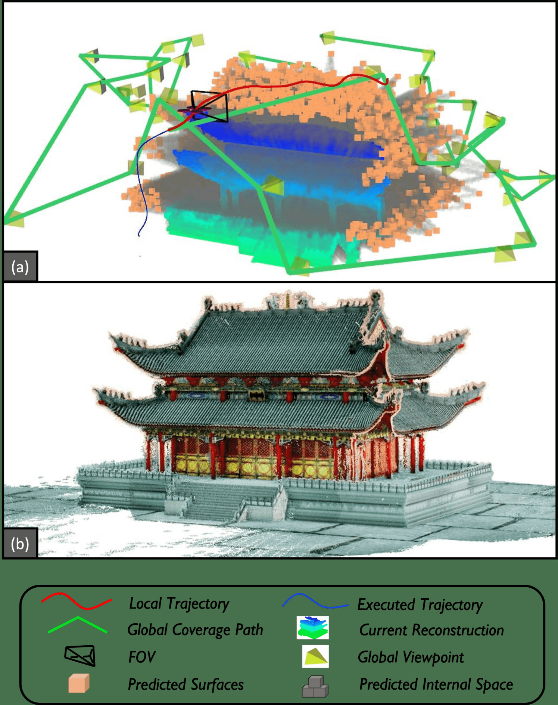
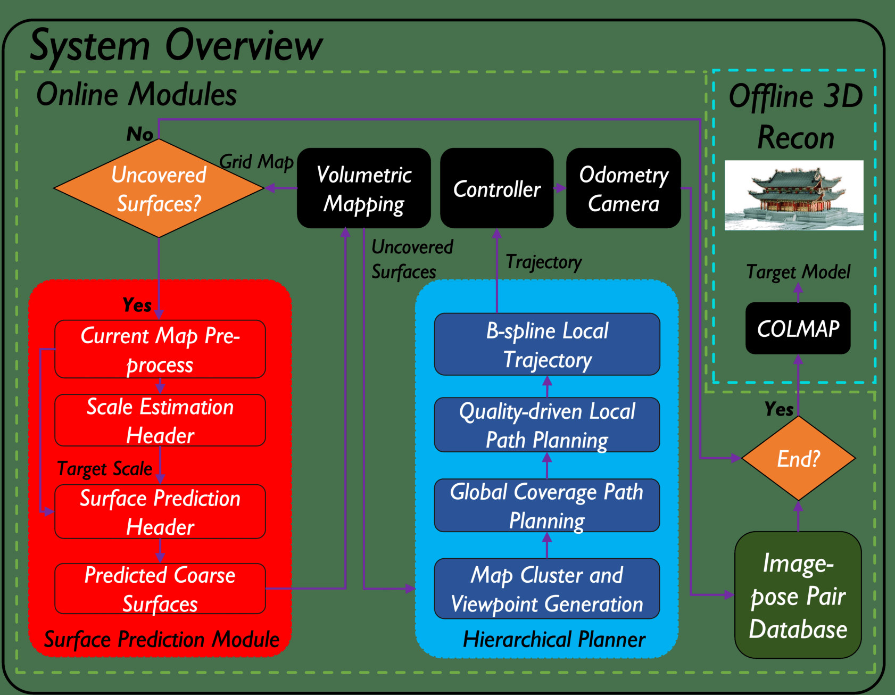
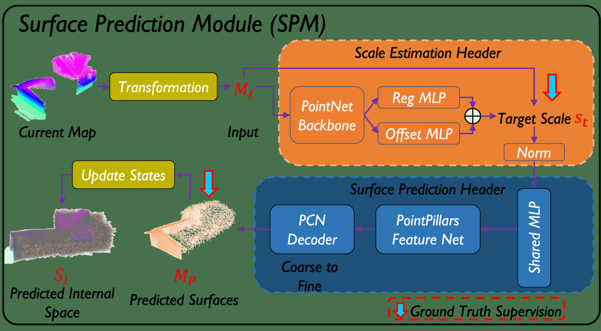
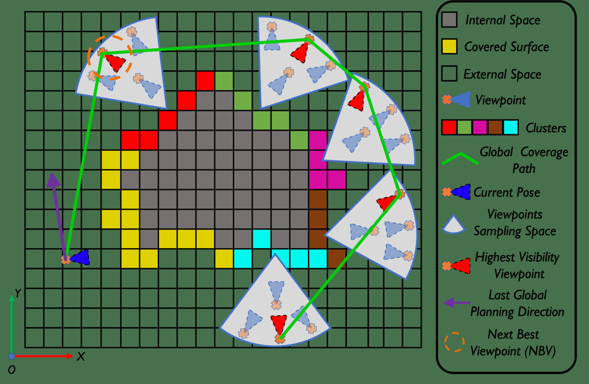
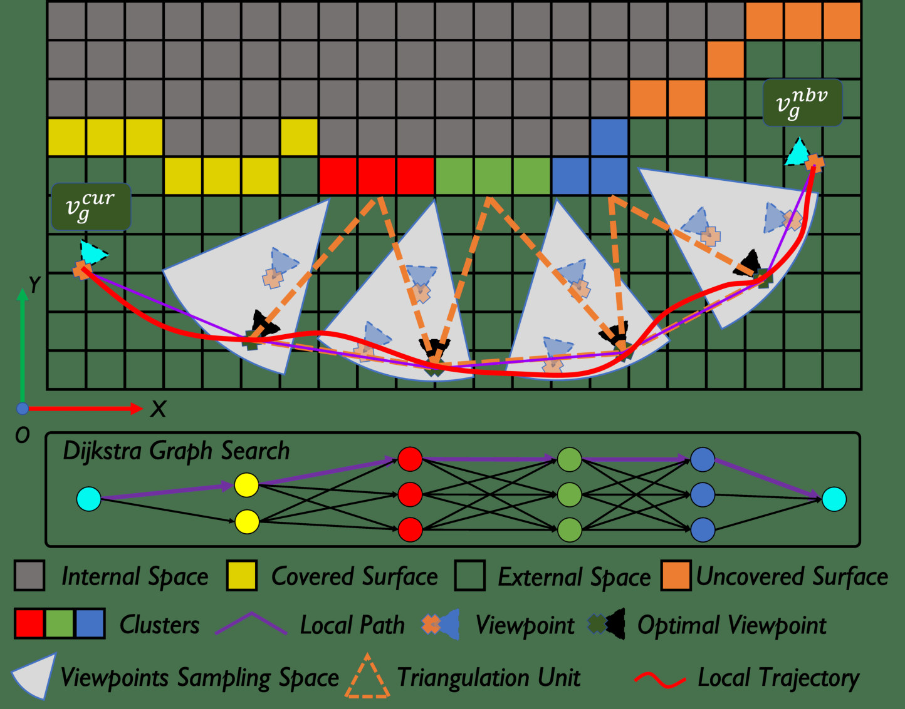
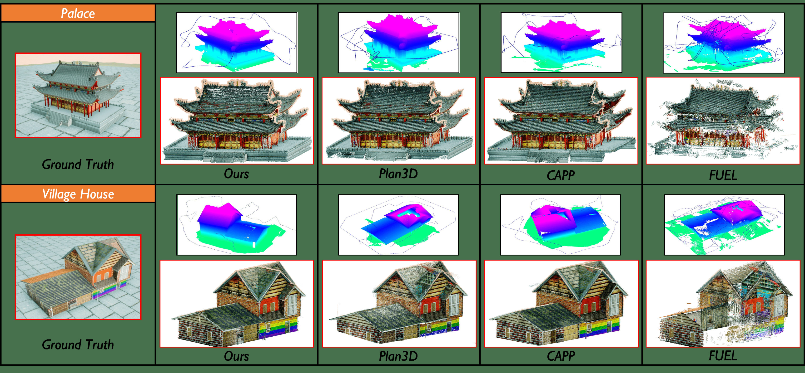

# PredRecon基于预测增强的高效高质量自主空中三维重建（PredRecon A Prediction-boosted Planning Framework for Fast and High-quality Autonomous Aerial Reconstruction）：完整忠实学术翻译

> **原文标题**：PredRecon A Prediction-boosted Planning Framework for Fast and High-quality Autonomous Aerial Reconstruction  
> **作者**：> - 作者: Chen Feng, Haojia Li, Fei Gao, Boyu Zhou, and Shaojie Shen  
> **发表信息**：> - 期刊/会议: 2023 IEEE International Conference on Robotics and Automation (ICRA)  
> **原文 PDF**：[PredRecon A Prediction-boosted Planning Framework for Fast and High-quality Autonomous Aerial Reconstruction.pdf](../PredRecon A Prediction-boosted Planning Framework for Fast and High-quality Autonomous Aerial Reconstruction.pdf) ｜ **对应中文详解**：[27_PredRecon基于预测增强的高效高质量自主空中三维重建.md](../中文详解/27_PredRecon基于预测增强的高效高质量自主空中三维重建.md)  

---

## 原文第 1 页核心内容与翻译

PredRecon：一种用于快速、高质量自主空中重建的预测增强规划框架
Chen Feng2, Haojia Li2, Fei Gao3,4, Boyu Zhou1,†, and Shaojie Shen2
摘要——面向高质量三维模型的自主无人机三维重建路径规划，已在多种应用中得到广泛研究。然而，现有大多数工作采用“先探索后利用”、基于先验或基于探索的策略，存在重复飞行、效率低和自主性不足的问题。本文提出 PredRecon，一种预测增强规划框架，可自主生成具有高三维重建质量的路径。我们的思路来源于人类能够根据局部观测粗略推断完整结构这一事实。因此，我们设计表面预测模块（SPM），根据当前局部重建结果预测目标的粗略完整表面。随后，在线体素建图生成尚未覆盖、等待无人机观测的表面。最后，分层规划器为三维重建规划运动：依次寻找高效的全局覆盖路径，规划用于最大化多视图立体（MVS）性能的局部路径，并生成用于采集图像—位姿对的平滑轨迹。我们在逼真仿真器中开展基准测试，验证了 PredRecon 相较经典方法和最新方法的性能。开源代码发布于 https://github.com/HKUST-Aerial-Robotics/PredRecon。
I. 引言
近年来，高质量三维重建已成为文化遗产数字化、AR/VR 和结构检测等多种应用中的活跃研究方向。无人机（UAV）具有高度灵活性，适合对目标区域进行快速、准确且完整的三维重建。要有效提升重建质量和效率，必须采用自主空中重建路径规划框架。
现有重建规划工作 [1]±[7] 在目标区域重建中的效率并不理想。首先，许多早期方法 [1]±[4] 采用“先探索后利用”策略，需要两条扫描航迹，或依赖粗略先验模型来获得重建路径。这些策略存在以下缺点：1）两条扫描航迹降低了任务完成效率；2）由于需要输入先验模型，任务无法完全自动化；3）仅依据粗略模型或先验模型进行规划，无法根据实际观测实时调整飞行路径，因此不能保证目标区域细节的准确性和完整性。近期，在线规划方法 [5]±[7] 已被提出，它们只需单条扫描航迹且不依赖先验模型，部分解决了上述问题。
1School of Artificial Intelligence, Sun Yat-Sen University, Zhuhai, China.
2Department of Electronic and Computer Engineering, The Hong Kong
University of Science and Technology, Hong Kong, China.
3State Key Laboratory of Industrail Control Technology, Institute of
Cyber-Systems and Control, Zhejiang University, Hangzhou, China.
4Huzhou Institute, Zhejiang University, Huzhou, China.
{cfengag, hlied, eeshaojie}@ust.hk,
fgaoaa@zju.edu.cn, zhouby23@mail.sysu.edu.cn
† Corresponding Author

**图 1**：图 1。（a）执行三维重建轨迹期间所提框架结果示意图；（b）所提框架生成的上述目标三维重建结果。

然而，由于目标区域事先未知，需要投入大量时间探索未知区域，其效率仍不够理想。此外，其中一些方法的计算时间难以接受，通常会导致不期望的走走停停行为，甚至需要与外部高性能计算机通信。
为解决上述问题，我们提出 PredRecon，一种预测增强规划框架，能够在未知环境中通过单次飞行高效重建目标区域的高质量三维模型。我们的方法受到以下事实启发：人类能够依据知识和经验，根据局部观测合理推断不完整结构。推断出的结构或表面可支持更有针对性的视点生成，进而以更高效率覆盖整个目标，而无需耗费大量时间探索未知空间。基于这一思路，我们引入基于学习的表面预测模块（SPM），根据当前局部
2023 IEEE International Conference on Robotics and Automation (ICRA 2023)
May 29 - June 2, 2023. London, UK
2023 IEEE International Conference on Robotics and Automation (ICRA) | 979-8-3503-2365-8/23/$31.00 ©2023 IEEE | DOI: 10.1109/ICRA48891.2023.10160933
Authorized licensed use limited to: National Institute of Technology- Delhi. Downloaded on August 24,2026 at 05:48:52 UTC from IEEE Xplore.  Restrictions apply.

---

## 原文第 2 页核心内容与翻译

**图 2**：图 2。所提三维重建预测增强路径规划框架概览。

重建结果。随后，在线体素建图从预测结果和当前重建结果中提取尚未完整观测的表面，将其作为未覆盖部分。接着，分层规划器以由粗到细的方式，为重建未覆盖表面生成运动轨迹。首先寻找实现完整覆盖的高效全局路径；其次，在全局路径的引导下，从当前位置到下一最佳视点（NBV）规划局部路径段，同时优化影响 MVS 性能的关键因素；最后生成可执行的局部轨迹，以采集目标的图像—位姿对。
采集到的数据库由 COLMAP [8]±[10] 处理，以获得稠密三维重建结果。我们在逼真仿真环境中将所提方法与经典方法和最新方法比较。结果表明，在基准场景中，我们的方法具有更高效率和更好重建质量。基准实验还表明，该方法自主性更高，并能在典型机载计算机上实现实时规划。本文贡献如下：
1）表面预测模块（SPM），直接从局部重建信息推断目标完整表面，在无需额外探索的情况下实现目标高效全局覆盖。
2）基于 SPM 的分层规划器，在线充分考虑 MVS 相关因素和全局覆盖，获得更高的重建质量和效率。
3）基准对比实验验证 PredRecon 的性能，且实现源代码已公开。
II. 相关工作
A. 表面预测与补全
表面预测与补全是三维重建中的重要研究课题。现有工作大致可分为基于几何和基于学习的方法。基于几何的方法利用局部输入数据的几何启发式规则预测完整表面。一些经典工作 [11]±[14] 通过对不完整局部孔洞进行平滑插值生成完整表面模型。这些方法假设可直接依据几何输入结构推断整个表面，因此在大部分飞行时间内难以良好工作。
基于学习的方法以表面体素化得到的点云作为输入，通过隐式参数化模型（深度神经网络）直接输出完整表面模型 [15]±[18]，对复杂情况具有更好的适应性。我们的 SPM 属于此类。然而，现有多数方法的精度不稳定，主要受归一化影响。因此，需要额外检测器预测目标模型的尺度和中心。此外，许多方法为提高精度采用 3D CNN，但复杂网络结构会导致推理速度变慢。
基于该方法 [15]，我们的 SPM 直接以地图点云为输入，无需额外归一化检测器即可实现端到端表面预测。此外，我们优化了网络结构，使其更轻量并具有更高精度（第 VI-C 节）。
B. 空中重建路径规划
为了实现高效、高质量的三维重建，多年来人们一直深入研究视点路径规划，即在选择最少视点的同时最大化其对重建质量的贡献。其基本问题是如何建立视点选择与质量之间的联系。一些方法 [2, 19, 20] 将视点信息增益（定义为粗略模型的覆盖程度）作为规划目标。此外，其他工作 [1, 21] 为每个表面分配一个覆盖半球，确保所选视点从多种观察方向扫描完整表面。
基于 MVS 的方法 [5, 7, 22, 23] 考虑 MVS 因素来确定最优视点，以获得更好的深度估计，本文也采用这一思路。[5, 7] 将问题表述为信息路径规划问题，而 [22, 23] 采用基于可重建性启发式规则的选择策略。这些方法都考虑了立体匹配和三角化因素。本文在基于 MVS 的工作基础上构建分层规划器，同时对 MVS 启发式代价采用更简洁的表述。此外，规划器充分利用 SPM 结果，生成具有高重建效率和质量的路径。
III. 系统概述
图 2 展示了由在线模块和离线模块组成的所提流程。在线子系统包括 SPM（第 IV 节）、在线体素建图（第 IV-C 节）和分层规划器（第 V 节）。SPM 根据当前局部地图预测目标模型完整表面的尺度和点云（第 IV 节）。随后，在线体素建图利用 SPM 结果提取剩余未覆盖表面（第 IV-C 节）。之后，分层规划器寻找全局路径并生成局部轨迹，以最大化全局覆盖效率和 MVS 性能。UAV 从里程计和机载相机获取图像—位姿对（第 V 节）。
1208
Authorized licensed use limited to: National Institute of Technology- Delhi. Downloaded on August 24,2026 at 05:48:52 UTC from IEEE Xplore.  Restrictions apply.

---

## 原文第 3 页核心内容与翻译

**图 3**：图 3。所提 SPM 的总体架构（第 IV 节）。

如果建图未发现未覆盖表面，在线子系统将结束飞行。随后，使用离线 COLMAP 处理图像—位姿对数据库，获得目标的三维重建模型。
IV. 表面预测模块
如图 3 所示，SPM 能够在完全未知的环境中根据局部地图预测目标的完整表面。表面预测无需额外时间探索未知环境，因此能有效减少冗余飞行。此外，它有助于生成数量更少但足以观测目标的视点，从而降低后续规划器的复杂度。
A. 数据预处理
SPM 的输入是当前局部地图（第 IV-C 节）的下采样点云 MC，点数固定为 NC。不同于以往工作 [15]±[17]，我们通过局部变换 Tp 直接处理 MC 中的每个点 pi ∈MC，如下：
Tp(pi, CC) = pi −CC,
(1)
其中 CC 是 MC 的质心。随后，每个变换后的点存储于 MI，并送入预测网络。
B. 预测网络结构
与以往的点云补全工作 [15]±[17, 24] 相比，我们的预测网络采用端到端方式，无需额外的归一化检测器。此外，网络实现中不使用三维卷积操作，从而满足实时性和轻量化要求。该网络由两个头部组成：尺度估计头和表面预测头。

为便于后续表面预测，引入尺度估计头来预测目标的粗略尺度。输入 MI 表示为 NC × 3 矩阵，其中包含每个点的三维坐标 (x, y, z)。具体而言，我们利用 PointNet [25] 作为骨干网络，因为它具有置换不变性和有效的全局特征提取能力。随后设置两个多层感知机（MLP）作为输出分支。回归 MLP 直接给出向量 (xs, ys, zs)，表示三个轴向上的尺度。为进一步提高尺度估计精度，将 PointNet 后的局部特征图输入偏移 MLP，以获得相应偏移量 (∆xs, ∆ys, ∆zs)。因此，目标尺度 st 可表示为：
st = max(xs + ∆xs, ys + ∆ys, zs + ∆zs).
(2)
在训练阶段，我们使用 Huber 损失监督各轴向的尺度估计。最后，将输入点云 MI 缩小 st 倍进行归一化。

表面预测头负责根据归一化后的 MI 生成目标的完整表面。我们使用共享 MLP 将归一化 MI 中的每个点编码为特征图 F。随后在 F 上采用 PointPillars Feature Net [26] 作为编码器，借助其伪图像操作，以较低计算成本聚合不同区域的几何信息。此外，PointPillars 适用于该问题，因为我们希望网络具备空间感知能力，能够扩展或补全不同区域的局部表面。与 PCN [15] 类似，我们还采用由粗到细的解码器，以生成用于全局和局部几何学习的预测结果。细粒度预测 Yfine 和粗粒度预测 Ycoarse 均包含 NC 个点。对于损失函数，使用置换不变的 Chamfer 距离监督网络输出与真实值 Ygt 之间的差异，如下所示：
cd(X, Y ) =
1
|X|
X
x∈X
min
y∈Y ||x−y||2
2+ 1
|Y |
X
y∈Y
min
x∈X ||x−y||2
2
(3)
L = cd(Ycoarse, Ygt) + cd(Yfine, Ygt).
(4)
随后，将 MI 与逆归一化后的 Yfine 拼接为 2NC × 3 矩阵，作为预测表面 MP。为确定正确的视点采样空间，我们采用 GHPR [27] 处理 MP，得到内部空间 SI；该空间是视点生成的禁入区域。
C. 结合预测的体素建图
为了在线评估目标已重建的部分，我们参考 [28] 构建体素地图，为 SPM 提供局部观测。我们将从两个或更多不同视点观测到的表面定义为完整观测表面。SPM 推理完成后，体素建图从预测结果中提取这些尚未完整观测的表面，作为分层规划器的目标未覆盖区域。
V. 分层规划器
有了未覆盖表面后，路径规划可表述为生成路径，以高效且完整地覆盖目标的未覆盖表面。为实现这一目标，所提规划器采用分层规划范式，分为两个步骤：全局覆盖路径规划（第 V-A 节），以及面向质量的局部路径规划，用于数据采集和轨迹生成（第 V-B 节）。
1209
Authorized licensed use limited to: National Institute of Technology- Delhi. Downloaded on August 24,2026 at 05:48:52 UTC from IEEE Xplore.  Restrictions apply.

---

## 原文第 4 页核心内容与翻译

**图 4**：图 4。全局覆盖路径规划：（1）对未覆盖表面进行聚类；（2）通过双重采样生成视点；（3）由 ATSP 求解器给出全局覆盖路径（第 V-A 节）。

A. 全局覆盖路径规划
该规划阶段输出高效的全局视点访问序列，以覆盖未覆盖表面，如图 4 所示。首先，对未覆盖表面执行基于欧氏距离和法向量的聚类方法，提取待访问的 NG 个簇。随后，类似于 [5]，我们采用双重采样方法生成 4-DoF 视点：对于每个簇，在从其中心指向法向方向的扇形圆柱体内采样一组覆盖视点，如图 4 所示。最后，选择每个簇中表面可见性比率最高的视点，构成 VG = {v1
g, v2
g, ..., vNG
g
}，其中 vi
g = (Pi
g, θi
g)，表示位置和偏航角。视点的表面可见性比率定义为：
r(v, s) = N(v)
N(s),
(5)
其中，v 为视点，s 为被观测表面，N(v) 为从 v 能够看到的 s 中可见点数量，N(s) 为 s 中的点数量。
为从当前位置出发找到经过每个视点的最短路径，我们将该问题表述为非对称旅行商问题（ATSP）[29]。通过设计合适的代价矩阵 ΥG，ATSP 可由现有成熟算法求解。因此，考虑路径长度和偏航变化后，两个视点之间的代价 cg(vi
g, vj
g) 如下：
cg(vi
g, vj
g) = L(Pi
g, Pj
g)
vmax
+
min(||θi
g −θj
g||1, 2π −||θi
g −θj
g||1)
ω
,
(6)
其中，L(Pi
g, Pj
g) 表示在自由空间中由 A∗ 算法搜索得到的 Pi
g 与 Pj
g 之间的路径长度，vmax 和 ω 分别为最大速度和偏航角变化率。
有时，多个全局覆盖路径具有相近代价，会导致路径优化结果不稳定，进而产生不一致的飞行方向和较低效率。因此，生成稳定解时必须充分考虑全局一致性。我们将上一次全局规划方向定义为从上一次当前位置 Plast
cur 指向上一次 NBV Plast
nbv 的向量 dlast
g
，并引入全局一致性代价 cGC(vi
g)：
dlast
g
=
Plast
nbv −Plast
cur
||Plast
nbv −Plast
cur ||2
,
(7)
cGC(vi
g) = arccos
Pi
g −Pnow
cur
||Pi
g −Pnow
cur ||2
· dlast
g
.
(8)
于是，对于视点索引集合 ζ = {1, 2, ..., NG}，ΥG 的完整形式为：
ΥG(k, h) =









0,
k == h or h = 0
cg(vk
g, vh
g ),
k, h ∈ζ
[β1cg(vk
g, vh
g )+
k == 0 and h ∈ζ
β2cGC(vh
g )],
(9)
因此，通过使用 ΥG 求解上述 ATSP，可以找到从当前位置出发、访问全部未覆盖表面的高效全局覆盖路径。
B. 质量驱动的局部路径规划
全局规划主要关注快速、完整地覆盖目标。为进一步提高重建质量，局部规划优化从当前位置到 NBV 的一段路径，并充分考虑与 MVS 相关的因素，如图 5 所示。
不同于全局规划，局部段所覆盖的簇会进一步细分为更小的簇；同时，局部规划中的视点采样空间由两个相邻簇共同确定，如图 5 所示。局部视点集合表示为 VL = {V P1：{v1,1
l
, v1,2
l
, ..., v1,n
l
}, ..., V Pi：{vi,1
l , vi,2
l , ..., vi,k
l , ...}}，簇表示为 CL = {cls1, cls2, ..., clsj, ...}。
许多已有研究 [9, 30, 31] 表明，高质量 MVS 重建很大程度上取决于以下因素：可见性 Svis、相对距离 Sdis 和三角化角 Sang，分别见公式（10）、（11）、（12）和（13）。为优化局部路径的 MVS 性能，我们将 MVS 结构分解为若干基本三角化单元，其中每个单元定义为局部路径中两个相邻视点及其共同可见的簇表面。此外，该路径的 MVS 性能可视为路径中所有三角化单元的重建质量 Q 之和。于是，三角化单元的 Q 可写为：
Q(v1, v2, s) = Svis · Sdis · Sang,
(10)
其中，s 为两个视点 v1 和 v2 下的簇表面。Svis 是两个视点可见性比率（r ∈ [0, 1]）的评分，表示为：
Svis(v1, v2, s) = r(v1, s) + r(v1, s)
2
.
(11)
设 dis1 和 dis2 为两个视点到表面质心的距离。我们希望 Sdis 接近 1，使两个视点图像具有相近分辨率，从而获得更好的深度估计。公式如下：
Sdis(v1, v2, s) = min(dis1, dis2)
max(dis1, dis2).
(12)
1210
Authorized licensed use limited to: National Institute of Technology- Delhi. Downloaded on August 24,2026 at 05:48:52 UTC from IEEE Xplore.  Restrictions apply.

---

## 原文第 5 页核心内容与翻译

**图 5**：图 5。基于图搜索的质量驱动局部路径规划。
通过充分考虑与 MVS 相关的因素，生成由重建质量驱动的局部路径及其对应轨迹（第 V-B 节）。

Sang 用于衡量三角测量性能，包括准确性和可匹配性。设 ϵ 为 vec1 与 vec2 之间的夹角。ε1 为 s 的法向量 Ns 与 vec1 之间的夹角，ε2 为 Ns 与 vec2 之间的夹角。因此，Sang 可写为：
vech = Cs −vh,
Sang(v1, v2, s) = exp(−(ϵ −ϵd + ε1 −ε2
κ
)2),
(13)
其中，Cs 为 s 的质心，ϵd 为期望的三角测量角，κ 为用于保证数值稳定性的小常数。因此，结合运动代价，我们可以将 MVS 启发式代价 cMV S 和总局部代价 cl 表述为：
cMV S(v1, v2, s) =
1
Q(v1, v2, s),
(14)
cl(v1, v2, s) = α1cMV S(v1, v2, s)+(1−α1)cg(v1, v2). (15)
假设总共有 NL 个簇，则 VL 的数量应为 NL + 1，以满足所定义的 NL 个三角测量单元。为优化局部路径的质量驱动代价 cl，我们将其表述为图搜索问题。随后采用 Dijkstra 算法搜索最优局部路径。
path, PL = {v1,i1
l
, v2,i2
l
, ..., v
NL+1,iNL+1
l
} that minimizes the
proposed cost:
min
NL
X
k=1
cl(vk,ik
l
, vk+1,ik+1
l
, clsk).
(16)
最后，借助 [32]，我们将局部路径 PL 转换为兼顾 MVS 性能的安全、平滑、满足动力学约束且时间最短的 B-spline 局部轨迹，从而有效采集图像—位姿对。
VI. 实验
A. 实现细节
为了训练 SPM，我们使用合成 CAD 模型集 Houses3K [33] 创建包含部分点云和完整点云的建筑场景数据集。此外，我们还在 Unreal Engine (UE41) 中收集其他类型的建筑模型。具体而言，我们利用 Blender2 生成部分点云
1https://www.unrealengine.com/en-US/
2https://www.blender.org/
表 I
两个场景中的路径规划与三维重建结果。
方法
先验
模型
路径
长度（m）
时间
（s）
召回率
（%）
精确率
（%）
F 值
（%）
Palace
Plan3D [2]
%
375.5
507.7
74.48
82.57
78.32
CAPP [1]
!
243.6
322.6
69.21
85.86
76.64
FUEL [6]
%
371.1
469.8
40.31
38.38
39.32
Ours
%
213.1
252.7
74.67
86.45
80.13
Village House
Plan3D [2]
%
239.3
310.6
64.28
72.86
68.30
CAPP [1]
!
193.4
242.3
80.30
84.60
82.40
FUEL [6]
%
405.1
506.8
44.35
36.46
40.02
Ours
%
153.2
184.6
84.54
83.13
83.83
涵盖不同建筑类别的 12900 个模型。此外，我们在数据预处理阶段将 NC 设置为 8192。训练方面，SPM 在单张 NVIDIA RTX 3070Ti 上训练 200 个 epoch，用时 13 小时。训练时采用 Adam [34] 优化器，初始学习率为 1e-4，批大小为 16，并在第 150 个 epoch 将学习率衰减至 1e-5。
在分层规划中，我们在公式 (9) 中设置 β1 = 1.0、β2 = 5.0，在公式 (13) 中设置 ϵd = 22.5°、κ = 0.2，并在公式 (15) 中设置 α1 = 0.8。在全局覆盖路径规划中，使用 Lin-Kernighan-Helsgaun 启发式求解器 [35] 求解 ATSP。
在所有实验中，均使用 geometric controller [36] 对 (x, y, z, θ) 轨迹进行跟踪控制。SPM 运行在 NVIDIA RTX 3070 Ti 上（GPU 内存占用：约 1 GB），其他模块运行在 Intel Core i9-10900K CPU 上。
B. 基准比较
我们在逼真的 UE4 AirSim 仿真器中开展仿真实验。在两个高纹理场景 Palace（15 × 25 × 14m3）和 Village House（14 × 11 × 12m3）中进行基准测试。所提方法与三种方法进行比较：Plan3D [2]（先探索后利用）、CAPP [1]（基于先验）和 FUEL [6]（基于探索）。由于 Plan3D [2] 和 CAPP [1] 没有开源代码，我们使用自行实现的版本。实验平台为搭载前视相机的 UAV，相机 FOV 为 [80°，60°]，图像分辨率为 1280 × 720 px。在两个场景中，均将 vmax 限制为 0.85m/s，将 ω 限制为 0.5rad/s。Plan3D [2] 首先执行用于粗略模型的预定义飞行，然后使用我们的规划器生成全局路径。CAPP [1] 根据输入的先验模型，同样使用我们的规划器生成全局覆盖路径。FUEL [6] 在探索包含目标的未知环境时采集目标的图像—位姿对。每种方法采集的数据均通过 COLMAP 处理，以获得重建的三维模型。
我们使用两个方面的指标评估性能：效率（路径长度和时间）以及重建质量（F-score）。平均比较结果列于表 I 和图 6。与其他方法相比，我们的时间和路径长度均显著更短，这主要是因为我们的规划器借助 SPM 预测提供了更高效的全局覆盖路径，并得到
1211
Authorized licensed use limited to: National Institute of Technology- Delhi. Downloaded on August 24,2026 at 05:48:52 UTC from IEEE Xplore.  Restrictions apply.

---

## 原文第 6 页核心内容与翻译

**图 6**：图 6。所提方法、Plan3D [2]、CAPP [1] 和 FUEL [6] 在两个场景（宫殿和乡村住宅）中的基准比较（重建三维模型、体素地图及执行轨迹）。

表 II
各模块的计算时间。
SPM
全局
规划
局部
规划
轨迹
优化
总计
计算
时间（ms）∼26.8
∼93.5
∼0.5
∼3.7 ∼124.7
SPM 预测的支持。关于重建质量，
我们参考 [37] 中的评估流程和指标。首先，对重建模型与真实值之间的点云进行配准。随后以 0.05m 的体素尺寸对两个点云进行均匀重采样，并通过 Precision 和 Recall 进行比较。Precision 表示靠近真实点的重建点所占的比例，Recall 定义为靠近重建点的真实点所占的比例。我们将两点之间的距离小于 0.1m 视为近邻点。之后，F-score 定义为
F −score = 2(P recision×Recall)
P recision+Recall。图 6 和表 I 展示了
图 6 和表 I 展示了四种方法在两个场景中各自重建模型的重建质量。显然，所提方法取得了更高的 Precision、Recall 和 F-score，这主要是因为我们的局部规划旨在优化 MVS 性能，并且每当预测结果和地图更新时，方法都会实时重新规划路径，以补充完整细节。尽管在 Village House 场景中我们的 Precision 略低于 CAPP [1]，但我们的方法不需要先验模型。如表 II 所示，所提系统每次可在约 100ms 内完成规划，这使真实 UAV 的机载计算机具备足够的实时规划频率。
C. SPM 预测性能
与点云补全任务相比，我们系统中的表面预测更为困难，因为没有提供用于归一化的精确尺度和中心。然而，根据 Chamfer Distance 和 F-score 指标，即使没有先验尺度和中心，我们的 SPM 在使用生成数据（第 VI-A 节，左）和 ShapeNet 数据集（右）完成上述任务时仍优于 PCN [15]，如表 III 所示。就重建表面而言，PCN [15] 生成的表面比 SPM 生成的粗略预测结果更加平滑。
表 III
点云补全性能比较。
Method
#Param(M)
L1 CD (1e-3m)
L2 CD (1e-4m)
F-score (%)
our SPM
28.20
13.6404 / 9.4461
14.7100 / 3.9368
52.6050 / 68.6693
PCN [15]
28.91
15.5221 / 10.4897
18.3987 / 4.7431
50.1210 / 65.7207
 
VII. 结论
本文提出了一种预测增强规划框架，用于通过自主单次飞行实现高效、高质量的三维重建。所提 SPM 根据部分地图预测完整表面，为路径规划器提供全局信息。
在此基础上，分层规划器依次为三维重建规划运动：寻找高效的全局覆盖路径，优化由重建质量驱动的局部路径以提升 MVS 性能，并生成相应的平滑局部轨迹。通过引入 SPM 并考虑 MVS 相关因素，该方法显著提升了重建效率和质量。在逼真仿真环境中的高难度基准测试表明，与现有经典方法和最新方法相比，PredRecon 具有良好性能。本方法的局限性在于真实世界测试不足，以及 SPM 的泛化性和鲁棒性有限。未来，我们计划进一步优化 SPM 架构以改进数据表示，并开展更具挑战性的真实世界测试。
1212
Authorized licensed use limited to: National Institute of Technology- Delhi. Downloaded on August 24,2026 at 05:48:52 UTC from IEEE Xplore.  Restrictions apply.

---

## 原文第 7 页核心内容与翻译

REFERENCES
[1] H. Zhang, Y. Yao, K. Xie, C.-W. Fu, H. Zhang, and H. Huang,
ªContinuous aerial path planning for 3d urban scene reconstruction.º
ACM Trans. Graph., vol. 40, no. 6, pp. 225±1, 2021.
[2] B. Hepp, M. Nieûner, and O. Hilliges, ªPlan3d: Viewpoint and
trajectory optimization for aerial multi-view stereo reconstruction,º
ACM Transactions on Graphics (TOG), vol. 38, no. 1, pp. 1±17, 2018.
[3] Q. Kuang, J. Wu, J. Pan, and B. Zhou, ªReal-time uav path planning
for autonomous urban scene reconstruction,º in 2020 IEEE Interna-
tional Conference on Robotics and Automation (ICRA).
IEEE, 2020,
pp. 1156±1162.
[4] X. Zhou, K. Xie, K. Huang, Y. Liu, Y. Zhou, M. Gong, and H. Huang,
ªOffsite aerial path planning for efficient urban scene reconstruction,º
ACM Transactions on Graphics (TOG), vol. 39, no. 6, pp. 1±16, 2020.
[5] S. Song, D. Kim, and S. Choi, ªView path planning via online
multiview stereo for 3-d modeling of large-scale structures,º IEEE
Transactions on Robotics, vol. 38, no. 1, pp. 372±390, 2021.
[6] B. Zhou, Y. Zhang, X. Chen, and S. Shen, ªFuel: Fast uav exploration
using incremental frontier structure and hierarchical planning,º IEEE
Robotics and Automation Letters, vol. 6, no. 2, pp. 779±786, 2021.
[7] S. Song, D. Kim, and S. Jo, ªActive 3d modeling via online multi-
view stereo,º in 2020 IEEE International Conference on Robotics and
Automation (ICRA).
IEEE, 2020, pp. 5284±5291.
[8] J. L. SchÈonberger and J.-M. Frahm, ªStructure-from-motion revisited,º
in Conference on Computer Vision and Pattern Recognition (CVPR),
2016.
[9] J. L. SchÈonberger, E. Zheng, M. Pollefeys, and J.-M. Frahm, ªPixel-
wise view selection for unstructured multi-view stereo,º in European
Conference on Computer Vision (ECCV), 2016.
[10] J. L. SchÈonberger, T. Price, T. Sattler, J.-M. Frahm, and M. Pollefeys,
ªA vote-and-verify strategy for fast spatial verification in image
retrieval,º in Asian Conference on Computer Vision (ACCV), 2016.
[11] M. Kazhdan and H. Hoppe, ªScreened poisson surface reconstruction,º
ACM Transactions on Graphics (ToG), vol. 32, no. 3, pp. 1±13, 2013.
[12] J. Davis, S. R. Marschner, M. Garr, and M. Levoy, ªFilling holes in
complex surfaces using volumetric diffusion,º in Proceedings. First
international symposium on 3d data processing visualization and
transmission.
IEEE, 2002, pp. 428±441.
[13] M. Berger, A. Tagliasacchi, L. Seversky, P. Alliez, J. Levine, A. Sharf,
and C. Silva, ªState of the art in surface reconstruction from point
clouds,º Eurographics 2014-State of the Art Reports, vol. 1, no. 1, pp.
161±185, 2014.
[14] W. Zhao, S. Gao, and H. Lin, ªA robust hole-filling algorithm for
triangular mesh,º The Visual Computer, vol. 23, no. 12, pp. 987±997,
2007.
[15] W. Yuan, T. Khot, D. Held, C. Mertz, and M. Hebert, ªPcn: Point
completion network,º in 2018 International Conference on 3D Vision
(3DV).
IEEE, 2018, pp. 728±737.
[16] H. Xie, H. Yao, S. Zhou, J. Mao, S. Zhang, and W. Sun, ªGrnet:
Gridding residual network for dense point cloud completion,º in
European Conference on Computer Vision.
Springer, 2020, pp. 365±
381.
[17] L. Pan, X. Chen, Z. Cai, J. Zhang, H. Zhao, S. Yi, and Z. Liu,
ªVariational relational point completion network,º in Proceedings of
the IEEE/CVF conference on computer vision and pattern recognition,
2021, pp. 8524±8533.
[18] J. Shi, L. Xu, P. Li, X. Chen, and S. Shen, ªTemporal point cloud
completion with pose disturbance,º IEEE Robotics and Automation
Letters, vol. 7, no. 2, pp. 4165±4172, 2022.
[19] A. Hornung, B. Zeng, and L. Kobbelt, ªImage selection for improved
multi-view stereo,º in 2008 IEEE Conference on Computer Vision and
Pattern Recognition.
IEEE, 2008, pp. 1±8.
[20] P.-P. VÂazquez, M. Feixas, M. Sbert, and W. Heidrich, ªAutomatic view
selection using viewpoint entropy and its application to image-based
modelling,º in Computer Graphics Forum, vol. 22, no. 4.
Wiley
Online Library, 2003, pp. 689±700.
[21] M. Roberts, D. Dey, A. Truong, S. Sinha, S. Shah, A. Kapoor, P. Han-
rahan, and N. Joshi, ªSubmodular trajectory optimization for aerial 3d
scanning,º in Proceedings of the IEEE International Conference on
Computer Vision, 2017, pp. 5324±5333.
[22] N. Smith, N. Moehrle, M. Goesele, and W. Heidrich, ªAerial path
planning for urban scene reconstruction: A continuous optimization
method and benchmark,º 2018.
[23] C. Peng and V. Isler, ªAdaptive view planning for aerial 3d reconstruc-
tion,º in 2019 International Conference on Robotics and Automation
(ICRA).
IEEE, 2019, pp. 2981±2987.
[24] Z. Huang, Y. Yu, J. Xu, F. Ni, and X. Le, ªPf-net: Point fractal network
for 3d point cloud completion,º in Proceedings of the IEEE/CVF
conference on computer vision and pattern recognition, 2020, pp.
7662±7670.
[25] C. R. Qi, H. Su, K. Mo, and L. J. Guibas, ªPointnet: Deep learning
on point sets for 3d classification and segmentation,º in Proceedings
of the IEEE conference on computer vision and pattern recognition,
2017, pp. 652±660.
[26] A. H. Lang, S. Vora, H. Caesar, L. Zhou, J. Yang, and O. Beijbom,
ªPointpillars: Fast encoders for object detection from point clouds,º
in Proceedings of the IEEE/CVF conference on computer vision and
pattern recognition, 2019, pp. 12 697±12 705.
[27] S. Katz and A. Tal, ªOn the visibility of point clouds,º in Proceedings
of the IEEE International Conference on Computer Vision, 2015, pp.
1350±1358.
[28] L. Han, F. Gao, B. Zhou, and S. Shen, ªFiesta: Fast incremental
euclidean distance fields for online motion planning of aerial robots,º
arXiv preprint arXiv:1903.02144, 2019.
[29] Z. Meng, H. Qin, Z. Chen, X. Chen, H. Sun, F. Lin, and M. H. Ang, ªA
two-stage optimized next-view planning framework for 3-d unknown
environment exploration, and structural reconstruction,º IEEE Robotics
and Automation Letters, vol. 2, no. 3, pp. 1680±1687, 2017.
[30] O. Mendes, S. Hadfield, N. Pugeault, and R. Bowden, ªNext-best
stereo: Extending next-best view optimisation for collaborative sen-
sors,º 2016.
[31] O. Mendez, S. Hadfield, N. Pugeault, and R. Bowden, ªTaking the
scenic route to 3d: Optimising reconstruction from moving cameras,º
in Proceedings of the IEEE International Conference on Computer
Vision, 2017, pp. 4677±4685.
[32] B. Zhou, F. Gao, L. Wang, C. Liu, and S. Shen, ªRobust and efficient
quadrotor trajectory generation for fast autonomous flight,º IEEE
Robotics and Automation Letters, vol. 4, no. 4, pp. 3529±3536, 2019.
[33] D. Peralta, J. Casimiro, A. M. Nilles, J. A. Aguilar, R. Atienza,
and R. Cajote, ªNext-best view policy for 3d reconstruction,º arXiv
preprint arXiv:2008.12664, 2020.
[34] D. P. Kingma and J. Ba, ªAdam: A method for stochastic optimiza-
tion,º arXiv preprint arXiv:1412.6980, 2014.
[35] K. Helsgaun, ªAn effective implementation of the lin±kernighan trav-
eling salesman heuristic,º European journal of operational research,
vol. 126, no. 1, pp. 106±130, 2000.
[36] T. Lee, M. Leoky, and N. H. McClamroch, ªGeometric tracking control
of a quadrotor uav on se (3),º in Decision and Control (CDC), 2010
49th IEEE Conference on, 2010, pp. 5420±5425.
[37] A. Knapitsch, J. Park, Q.-Y. Zhou, and V. Koltun, ªTanks and temples:
Benchmarking large-scale scene reconstruction,º ACM Transactions on
Graphics (ToG), vol. 36, no. 4, pp. 1±13, 2017.
1213
Authorized licensed use limited to: National Institute of Technology- Delhi. Downloaded on August 24,2026 at 05:48:52 UTC from IEEE Xplore.  Restrictions apply.

---
