# Primitive-Swarm超轻量高扩展大规模无人机集群规划器（Primitive-Swarm An Ultra-Lightweight and Scalable Planner for Large-Scale Aerial Swarms）：完整忠实学术翻译

> **原文标题**：Primitive-Swarm An Ultra-Lightweight and Scalable Planner for Large-Scale Aerial Swarms  
> **作者**：作者使用“基于可达性分析的时间最优路径参数化”（Time-Optimal Path Parameterization via Reachability Analysis，简称 TOPP-RA）。白话理解如下：  
> **发表信息**：## 3. 论文发表时的通用做法，以及各自的长短处  
> **原文 PDF**：[Primitive-Swarm An Ultra-Lightweight and Scalable Planner for Large-Scale Aerial Swarms.pdf](../Primitive-Swarm An Ultra-Lightweight and Scalable Planner for Large-Scale Aerial Swarms.pdf) ｜ **对应中文详解**：[28_Primitive-Swarm超轻量高扩展大规模无人机集群规划器.md](../中文详解/28_Primitive-Swarm超轻量高扩展大规模无人机集群规划器.md)  

---

## 原文第 1 页：正文与翻译

Primitive-Swarm: An Ultra-Lightweight and Scalable
Planner for Large-Scale Aerial Swarms
Jialiang Hou
, Graduate Student Member, IEEE, Xin Zhou
, Neng Pan
, Ang Li
, Yuxiang Guan
,
Chao Xu
, Senior Member, IEEE, Zhongxue Gan
, and Fei Gao
, Member, IEEE
**摘要**——实现大规模空中集群十分困难，因为计算效率与可扩展性之间存在固有矛盾。
due to the inherent contradictions in balancing computational
efficiency and scalability. This article introduces primitive-swarm,
an ultra-lightweight and scalable planner designed specifically for
large-scale autonomous aerial swarms. The proposed approach
adopts a decentralized and asynchronous replanning strategy.
Within it is a novel motion primitive library consisting of time-
optimal and dynamically feasible trajectories. They are generated
utilizing a novel time-optimal path parameterization algorithm
based on reachability analysis. Then, a rapid collision check-
ing mechanism is developed by associating the motion primitives
with the discrete surrounding space according to conflicts. By
considering both spatial and temporal conflicts, the mechanism
handles robot-obstacle and robot–robot collisions simultaneously.
Then, during a replanning process, each robot selects the safe and
minimum cost trajectory from the library based on user-defined
requirements. Both the time-optimal motion primitive library and
the occupancy information are computed offline, turning a time-
consuming optimization problem into a linear-complexity selection
problem. This enables the planner to comprehensively explore
the nonconvex, discontinuous 3-D safe space filled with numerous
obstacles and robots, effectively identifying the best hidden path.
Benchmark comparisons demonstrate that our method achieves
the shortest flight time and traveled distance with a computation
time of less than 1 ms in dense environments. Super large-scale
swarm simulations, involving up to 1000 robots, running in real
time, verify the scalability of our method. Real-world experiments
validate the feasibility and robustness of our approach. The code
will be released to foster community collaboration.
本文提出 Primitive-Swarm，一种专为大规模自主空中集群设计的超轻量、可扩展规划器。该方法采用去中心化、异步重规划策略，构建由时间最优且满足动力学约束的轨迹组成的运动基元库，并通过基于可达性分析的时间最优路径参数化算法生成这些轨迹。随后，方法根据冲突关系将运动基元与离散周围空间关联，快速处理空间和时间冲突，从而同时实现机器人—障碍物与机器人—机器人碰撞检查。重规划时，每架机器人根据用户定义的要求，从库中选择安全且代价最小的轨迹。运动基元库和占用信息均离线计算，使耗时的优化问题转化为线性复杂度的选择问题。基准实验表明，在密集环境中，该方法的计算时间低于 1 ms，同时取得最短飞行时间和飞行距离；最多 1000 架机器人的实时集群仿真验证了其可扩展性，真实实验验证了可行性与鲁棒性。

**关键词**——自主空中飞行器；碰撞规避；运动规划；集群机器人；轨迹优化。
Received 2 September 2024; accepted 21 February 2025. Date of publication
26 May 2025; date of current version 13 June 2025. This work was supported in
part by the National Natural Science Foundation of China under Grant 62322314
and in part by the Shanghai Municipal Science and Technology Major Project
under Grant 2021SHZDZX0103. This article was recommended for publication
by Associate Editor F. Morbidi and Editor D. Hsu upon evaluation of the
reviewers’ comments. (Jialiang Hou and Xin Zhou contributed equally to this
work.) (Corresponding authors: Fei Gao; Zhongxue Gan.)
Jialiang Hou is with the Academy for Engineering and Technology, Fudan
University, Shanghai 200433, China, and also with the Huzhou Institute of
Zhejiang University, Huzhou 313000, China (e-mail: jlhou19@fudan.edu.cn).
Xin Zhou, Neng Pan, Chao Xu, and Fei Gao are with the Institute of
Cyber-Systems and Control, Zhejiang University, Hangzhou 310027, China, and
also with the Huzhou Institute of Zhejiang University, Huzhou 313000, China
(e-mail: fgaoaa@zju.edu.cn).
Ang Li is with the Huzhou Institute of Zhejiang University, Huzhou 313000,
China, and also with the School of Aeronautic Science and Engineering, Beihang
University, Beijing 100191, China.
Yuxiang Guan and Zhongxue Gan are with the Academy for Engineer-
ing and Technology, Fudan University, Shanghai 200433, China (e-mail:
ganzhongxue@fudan.edu.cn).
This
article
has
supplementary
downloadable
material
available
at
https://doi.org/10.1109/TRO.2025.3573667, provided by the authors.
Digital Object Identifier 10.1109/TRO.2025.3573667
I. INTRODUCTION
L
ARGE-SCALE aerial swarms offer immense potential for
addressing various challenging tasks, including air traffic
and space colonization [1]. To achieve these objectives, a funda-
mental requirement is the creation of a planner that can generate
trajectories for each robot, ensuring safe and reliable navigation
toward their individual targets.
Inthecontextofswarmplanning,eachrobotmustnavigatenot
only to avoid other members within the swarm but also to effec-
tively avoid collisions with obstacles present in the environment.
As the number of robots and the density of obstacles increase,
theinteractionsamongrobotswithinthecontinuouslyexpanding
joint state space, combined with frequent robot-obstacle inter-
actions, lead to a combinatorial explosion, rendering real-time
online trajectory generation practically infeasible. Despite the
significanteffortsdevotedbyresearchersinthisarea,theabsence
of an ultra-lightweight and scalable planner tailored for large-
scale autonomous aerial swarms remains evident. To address
this research gap, we propose a swarm planner called primitive-
swarm, which aims to reduce robot–robot and robot-obstacle
interactions to formulate low-complexity trajectory generation.
Swarm planning algorithms face inherent contradictions in
computational efficiency and scalability due to robot interac-
tions. To develop an ideal swarm planner, reducing these inter-
actions is essential, where the key is breaking down the high-
dimensional trajectory generation problem into easier-to-solve
local subproblems. For this purpose, this work employs motion
primitive-based methods in a decentralized and asynchronous
manner, stitching together simple motion primitives to form a
complex global trajectory. This transformation reduces the high-
dimensionalonlinetrajectoryplanningproblemtoseverallinear-
complexity selection problems while avoiding high-frequency
robot-obstacle interactions in problem-solving.
In practise, typical primitive-based methods generate the
primitivelibrarymainlybyuniformlysamplingeither inthestate
or control spaces of a robot (see Section II-B for an extensive
literature review). In addition, collision checking is typically
performed individually for each primitive via sample points.
This strategy requires map inflation or extra data structure like
kd-trees to account for robot size, and requires explicit memory
storage for each sensor frame, as each gird or point of the
surrounding objects may be indexed repeatedly by different
primitives. As the number of primitives increases, the time
complexity of these methods grows. It becomes a limitation for
resource-limited platforms, which may only allow a small set of
1941-0468 © 2025 IEEE. All rights reserved, including rights for text and data mining, and training of artificial intelligence and similar technologies.
Personal use is permitted, but republication/redistribution requires IEEE permission. See https://www.ieee.org/publications/rights/index.html for more information.
Authorized licensed use limited to: National Institute of Technology- Delhi. Downloaded on August 24,2026 at 05:45:47 UTC from IEEE Xplore.  Restrictions apply.

---

## 原文第 2 页：正文与翻译

primitives for real-time usage, consequently compromising the
possibility of finding feasible candidate trajectories. Moreover,
most of these methods only support fixed time allocation for
trajectories, leading to a lack of time optimality, which limits
the quality of handling both space and time conflicts among a
team of moving robots.
Under the aforementioned constraints, the development of
a primitive-based planning framework specifically tailored for
swarm robots becomes important. This swarm planning frame-
work must fulfill the following requirements.
1) The primitive generation module should be capable of
producing high-optimality and dynamically feasible tra-
jectories while maintaining ultra-lightweight online com-
putational costs.
2) The collision checking module must efficiently handle
robot-obstacle and robot–robot conflicts, ensuring low
computational costs for both environment representation
and primitive selection, and then generates high-quality
candidate trajectories.
3) The trajectory should accommodate user-defined require-
ments across various aspects.
To address these requirements, we have designed the corre-
sponding modules as follows.
1) Primitive generation module: We construct an innovative
motion primitive library offline using time-optimal path param-
eterization (TOPP) to reduce the computational costs for online
planning. This library comprises various primitives that consider
time optimality and the robot’s dynamical constraints.
2) Collision checking module: For efficient collision check-
ing, we devise an index system which stores the occupancy
status between primitives and the surrounding space, referred
to as spatial and spatio-temporal occupancy relationships. In
contrast to the traditional trajectory-to-environment approaches
that index and check collisions in the environment from sampled
points on trajectories, our method takes an environment-to-
trajectory approach, which indexes and labels unsafe trajecto-
ries from environmental information based on the occupancy
relationships. Note that in this article the word environment
includes obstacles and other robots. Robot-obstacle and robot–
robot collision avoidance are achieved by leveraging spatial and
spatio-temporal occupancy relationships, respectively. Further-
more, by constructing these occupancy relationships offline, we
achieve remarkably high online search efficiency. This makes
our computational cost dependent only on the number of point
clouds and other robots’ trajectories, not on the number of
primitives, allowing us to set a sufficiently high number of
primitives to ensure high-quality candidates, even on resource-
limited onboard processors. Furthermore, our collision checking
method operates directly on raw point clouds without the need
for computationally expensive kd-tree construction or obstacle
inflation.
3) Trajectory selection module: Our design of a trajectory
selection module incorporates goal-approaching progress and
boundary constraints, enabling each robot to approach its global
goal as swiftly as possible while respecting the environment’s
boundaries. Importantly, the collision checking and trajectory
selectionprocessesareentirelydecoupledinourplanningframe-
work. The complexity of trajectory selection remains unaffected
by collision checking, thus enhancing the scalability of the
swarm.
In summary, all robots share the same motion primitive library
based on which the collision checking module efficiently han-
dles robot-obstacle and robot–robot conflicts, marking unsafe
primitives. During each replanning step, each robot selects the
minimum cost trajectory from safe primitives for execution.
This planner minimizes unnecessary online computational costs
and demonstrates the capability to be deployed on large-scale
swarms.
We compare our method with multiple representative state-
of-the-art planners [2], [3], [4], [5], [6], [7], [8]. The results
demonstrate that our method cannot only generate trajectories
with the shortest flight time and distance but also require the
lowest computational cost in dense environments. We imple-
ment super large-scale autonomous swarms up to 1000 robots
as depicted in Fig. 1, which validates the scalability of our
method. Furthermore, we validate the feasibility and robustness
of our method on size, weight, and power (SWaP) constrained
quadrotor platforms in the real world. The contributions of this
article are summarized as follows.
1) A novel motion primitive library that generates time-
optimal and dynamically feasible trajectories offline, lead-
ing to reduced online computational costs.
2) A fast collision checking method that precomputes spatial
and spatio-temporal occupancy relationships to handle
both robot-obstacle and robot–robot collisions in batches.
3) An ultra-lightweight and scalable planner that transforms
high-dimensional trajectory generation into several linear-
complexity selection problems.
4) Open-source code1 of our system that is extensively val-
idated by simulations and real-world experiments. To the
best of authors’ knowledge, our work is the first to handle a
swarm of up to 1000 agents while considering high-order
dynamics and unknown environments, even achieved the
shortest flight time.
II. RELATED WORK
A. Trajectory Planning for Aerial Swarms
Bioinspired flocking algorithms [9], [10] plan trajectories for
groups of robots based on simple rules, but they face challenges
in dense environments and precise individual robot control. Ve-
locity obstacle-based methods [11], [12], [13] compute feasible
velocities for robots to avoid collisions, but their first-order
integrator dynamics models and constant velocity assumptions
are not suitable for highly agile quadrotors. In order to achieve
rapid swarm motions in dense real-world environments, some
methods [2], [14], [15], [16], [17] adopt a centralized approach
to jointly plan the global trajectories of all robots. Augugliaro
and Mellinger [14], [15], [16] formulated joint planning as
a sequential convex program and a mixed integer quadratic
program, respectively. Hönig and Park [2], [17] use B´ezier
curves and Bernstein polynomials to generate safe and conser-
vative trajectories, respectively. However, these methods rely
on known environments, global localization devices, and entail
1[Online]. Available: https://github.com/ZJU-FAST-Lab/Primitive-Planner
Authorized licensed use limited to: National Institute of Technology- Delhi. Downloaded on August 24,2026 at 05:45:47 UTC from IEEE Xplore.  Restrictions apply.

---

## 原文第 3 页：正文与翻译

HOU et al.: PRIMITIVE-SWARM: AN ULTRA-LIGHTWEIGHT AND SCALABLE PLANNER FOR LARGE-SCALE AERIAL SWARMS
3631

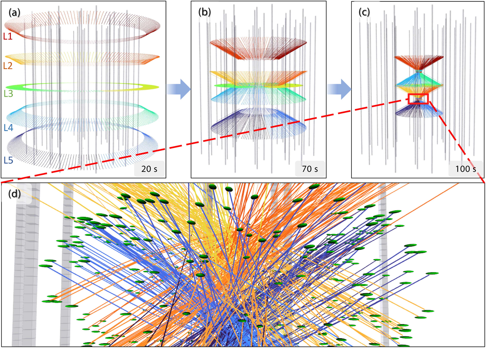

**图 1**：未知环境中的大规模（1000 架无人机）空中交通仿真。绿色椭球表示无人机，灰色柱体表示作为障碍物的摩天大楼，彩色曲线表示无人机实际执行的轨迹。如 (a) 所示，无人机从 L1 至 L5 五个高度层出发，随后分别飞往 L4、L5、L3、L1 和 L2。 (a)、(b)、(c) 分别为整个飞行过程在 20 s、70 s 和 100 s 时的快照；(d) 是 (c) 中红框区域的放大图。值得注意的是，所有无人机均在独立线程中运行，采用去中心化、异步架构。

high computational costs, thereby limiting the full-autonomy
and scalability of swarm systems.
In contrast, some methods [7], [18], [19] adopt a decentralized
approach to improve computational efficiency. However, the
assumption of synchronous replanning limits their applicability
in real-world scenarios. Tordesillas et al. [3] proposed a de-
centralized and asynchronous algorithm that handles multirobot
and dynamic obstacles in convex obstacle environments. Zhou
et al. [4] established a fully autonomous decentralized quadrotor
swarm system suitable for nonconvex unknown environments.
However,thechallengeoftemporaloptimizationleadstotwisted
trajectories when multiple robots encounter each other. To ad-
dress this issue, Zhou et al. [5] deployed a spatial-temporal
trajectory optimization algorithm [20].
In our previous work [21], we proposed a group planning
strategy aimed at enhancing the scalability of swarm systems.
However, these methods [3], [4], [5], [21] require complex
environment representation, such as inflated grid maps or
convex obstacles, and demand good initial trajectories for
nonlinear
trajectory
optimization,
leading
to
substantial
onboard computation. Furthermore, the inclusion of nonconvex
collision avoidance terms for robot-obstacle and robot–robot
interactions makes the trajectory susceptible to infeasible
local minima, resulting in replanning failure. In addition, the
generated trajectory is searched only within a limited portion
of the solution space around the initial values.
The proposed method effectively mitigates these challenges
and introduces an ultra-lightweight algorithm suitable for
TABLE I
EVALUATION OF MOTION PRIMITIVE-BASED METHODS
large-scale autonomous swarms. Comprehensive benchmark
comparisons with representative state-of-the-art methods are
conducted in Section VIII, which are then summarized in Fig. 2
to give an intuitive knowledge of some main characteristics
of the proposed method. In Fig. 2, computation efficiency is
evaluatedinTableII, Figs. 13, 14, and18(c). Trajectoryqualityis
compared in Figs. 15–18 where the proposed method generates
the smoothest trajectory while maintaining the maximum speed
along the whole flight. Flight time and flight distance in Table II
are also metrics of trajectory quality. High scalability is the
main characteristic of this work as featured in Figs. 1 and 21
and analyzed in Section VIII-F. RBP receives a relatively low
grade in this metric for its high computation time (see Table II).
System autonomy refers to the ability of navigating in the real
world relying on only onboard sensing and computation. RBP is
a centralized trajectory planner that requires a high-performance
ground computer and a prebuilt map, thus, it lacks autonomy.
MADER and AMSwarmX are decentralized swarm planners
Authorized licensed use limited to: National Institute of Technology- Delhi. Downloaded on August 24,2026 at 05:45:47 UTC from IEEE Xplore.  Restrictions apply.

---

## 原文第 4 页：正文与翻译

TABLE II
BENCHMARK COMPARISONS IN A 12 M RADIUS CIRCULAR EMPTY SPACE CONTAINING EIGHT DRONES

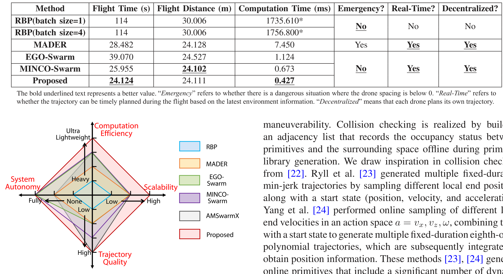

**图 2**：与 RBP [2]、MADER [3]、EGO-Swarm [4]、MINCO-Swarm [5] 和 AMSwarmX [8] 的定性比较。坐标轴刻度由内向外依次表示：计算效率——高负担、中等、轻量、超轻量；可扩展性——低、中、高；轨迹质量——低、中、高、极高；系统自主性——无、部分自主、完全自主。定性比较的详细讨论见第 II-A 节。

validated with prebuilt maps in simulation only. Although both
of them have the potential of using online generated maps, a lot
of future work is required. EGO-Swarm, MINCO-Swarm, and
the proposed method are all fully autonomous methods validated
in real-world experiments.
B. Motion Primitive-Based Trajectory Planning
Motion primitive-based methods are commonly employed
for generating multiple paths or trajectories for single-robot
autonomous navigation. They effectively reduce the planning
problem’s
complexity
and
can
cover
a
wide
solution
space simultaneously. A summary of typical methods is
presented in Table I. The index “time parameterized” means
whether the primitive library consists of time-parameterized
continuous trajectories, whose higher derivatives (i.e., velocity,
acceleration, jerk, and more) can be easily obtained. The index
“dynamical feasibility” records how dynamical feasibility
are guaranteed. The index “collision checking” contains the
theoretical computation time for both robot-obstacle and
robot–robot collision avoidance. If a method being compared is
initially designed for robot-obstacle avoidance only, we assume
the space swept by nearby drones as a normal static obstacle,
thus compatible with the compared method.
Zhang et al. [22] proposed an offline motion primitive library
that samples fixed-length paths with only position information,
lacking dynamical details and not fully exploiting the robot’s
maneuverability. Collision checking is realized by building
an adjacency list that records the occupancy status between
primitives and the surrounding space offline during primitive
library generation. We draw inspiration in collision checking
from [22]. Ryll et al. [23] generated multiple fixed-duration
min-jerk trajectories by sampling different local end positions
along with a start state (position, velocity, and acceleration).
Yang et al. [24] performed online sampling of different local
end velocities in an action space a = vx, vz, ω, combining them
with a start state to generate multiple fixed-duration eighth-order
polynomial trajectories, which are subsequently integrated to
obtain position information. These methods [23], [24] generate
online primitives that include a significant number of dynami-
cally infeasible trajectories, necessitating a rechecking mecha-
nism [27] to filter out feasible ones. Collins et al. [25] employed
adaptive end velocity sampling based on a robot’s reference
velocity, enhancing the dynamical reliability of motion primitive
libraries. Florence et al. [26] performed online sampling of a set
of constant control variables considering a quadrotor dynam-
ics model. These variables are then integrated forward for a
fixed duration to generate dynamically feasible primitives. The
aforementioned methods [23], [24], [25], [26] suffer from the
drawback of checking collisions for each primitive individually
on a fusion map or kd-tree. As the number of primitives in-
creases, these methods become progressively time-consuming.
In contrast, Bucki et al. [28] accelerated collision checking using
apyramidpartitioningmethod,butitresultsinmoreconservative
trajectories and performs poorly in dense environments.
In summary, the aforementioned methods fail to simultane-
ously meet the following three critical requirements:
1) ultra-lightweight online computational cost;
2) time-optimal and dynamically feasible primitives;
3) fast collision checking methods capable of handling both
robot-obstacle and robot–robot conflicts in batches.
These limitations have hindered the advancement of motion
primitive libraries in autonomous navigation. The proposed
method is the first to successfully integrate all three aspects and
deploy motion primitives on autonomous swarms, to the best of
authors’ knowledge.
C. Time-Optimal Trajectory Generation
Time-optimal trajectory generation address the problem of
finding the fastest way to traverse a region while adhering to
dynamical constraints. Mellinger et al. [29] findthetime-optimal
trajectory by optimizing time allocation through backtracking
Authorized licensed use limited to: National Institute of Technology- Delhi. Downloaded on August 24,2026 at 05:45:47 UTC from IEEE Xplore.  Restrictions apply.

---

## 原文第 5 页核心内容与翻译

HOU et al.: PRIMITIVE-SWARM: AN ULTRA-LIGHTWEIGHT AND SCALABLE PLANNER FOR LARGE-SCALE AERIAL SWARMS
3633

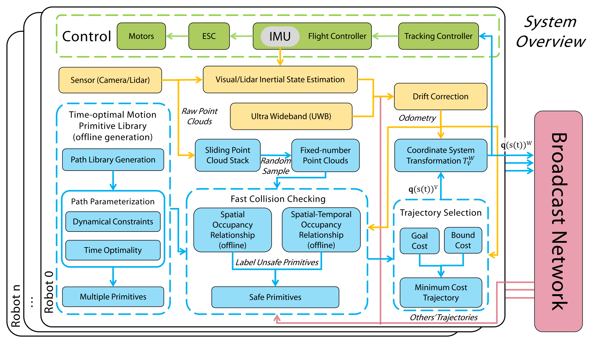

**图 3**：Fig. 3.
Overview of our decentralized and asynchronous autonomous aerial swarm system, which includes state estimation (yellow), planning (blue), control
(green), and communication (red) modules. W refers to the world coordinate system and V is called the velocity-aligned frame defined by current drone position
and velocity in Section VI-A.

gradient descent. Then, dynamical feasibility is achieved by
temporal scaling. However, both strategies consume significant
computation as the number of trajectory pieces grows. Liu et
al. [30] managed to achieve comparable performance with only a
single scaling operation, but it is only valid for rest-to-rest trajec-
tories. Sun et al. [31] adopted a dual-level optimization scheme
by analytically estimating the projected gradient by leveraging
the dual solution of the low-level quadratic programming, result-
ing in enhanced precision. However, computing the projected
gradient remains less effective. Richter et al. [32] addressed this
challenge by treating each duration as an independent variable
and employing total duration as a regularization term. They
optimize time allocation through gradient descent and ensuring
that actuator constraints are met through scaling. However, the
optimal time allocation is sensitive to constraints, resulting in the
potential to disrupt a trajectory. Burri et al. [33] relieved the sen-
sitivity by converting constraints as weighted objectives and op-
timizing through nonlinear programming, but at the cost of being
dependent of initial values and the risk of constraints violation.
III. SYSTEM OVERVIEW
The proposed decentralized and asynchronous autonomous
aerial swarm system is depicted in Fig. 3. Each robot inde-
pendently handles state estimation, planning, and control, and
communicates its trajectory through a broadcast network, re-
sulting in a loosely coupled system. Detailed implementation
information for the state estimation, control, and communication
modules is provided in Section VII.
The planning module receives the output of the state estima-
tion module and generates new trajectories. The planner operates
infoursteps.First,themotionprimitivelibrarymodulegenerates
multiple time-optimal primitives offline, taking into account
dynamical constraints (see Section IV). Second, the sliding point
cloud stack stores the raw point clouds of the latest Nf frames.
From the stack, fixed-number point clouds are sampled using a
random sample method [34] to maintain environment fidelity.
Trajectories of other robots within two planning horizons [as
defined in Fig. 10(c)] are transmitted to the current robot through
the peer-to-peer broadcast network. The fast collision check-
ing method removes unsafe primitives by querying the spatial
and spatio-temporal occupancy relationships (see Section V).
Then, the minimum cost trajectory q(t)V is selected among
safe primitives from the velocity frame V (see Section VI-A)
according to user-defined requirements. Finally, the trajectory
q(t)W in the world coordinate system W is obtained through
the transformation T W
V
(see Section VI). The control module
then executes the trajectory q(t)W.
IV. TIME-OPTIMAL MOTION PRIMITIVE LIBRARY
We divide the process of generating the time-optimal motion
primitive library into two steps: path library generation (spa-
tial) and path parameterization (temporal). The former involves
constructing paths using fundamental geometric primitives. The
latter addresses time allocation for the generated paths by
solving the TOPP problem, which aims to find the quickest path
traversal while satisfying to dynamic constraints.
A. Path Library Generation
The configuration of an n-degree-of-freedom robot system is
denoted by an n-dimensional vector q ∈Rn. According to the
principles of differential flatness [29], the configuration space
Authorized licensed use limited to: National Institute of Technology- Delhi. Downloaded on August 24,2026 at 05:45:47 UTC from IEEE Xplore.  Restrictions apply.

---

## 原文第 6 页核心内容与翻译

**图 4**：Fig. 4.
Example of path library generation (Note: Path refers to a geometric
curve without temporal information). (a) Seven orange arcs representing paths.
(b) Front view of the path library obtained by rotating the arcs in (a) around the
x-axis with an angle interpolation of Dangle = 30◦. (c) Side view of the path
library, where both blue and orange arcs represent paths. The origin of all paths
coincides with the origin of the velocity-aligned coordinate system V. All paths
start tangent to the x-axis. The orange and red dots represent the end points of
each path.

of a quadrotor is represented as follows:
q = [px, py, pz, ψ]T
(1)
where (px, py, pz)T denotes the center of mass in the global
coordinate system and ψ denotes the yaw angle. In actual flight,
ψ can be arbitrarily set [29], or it is usually set to be the angle
between the projection of the x-axis of the Body frame on the
horizontal plane and the x-axis of the World frame [35].
With above insight, we construct a path library P(iprim, s) :
N × R+ →R3 byrotatingmultiplearcs withtheparameters: the
number of arcs Na and rotation angle interpolation Dangle. These
arcs begin at the origin of the coordinate system and are tangent
to the x-axis at the origin, as shown in Fig. 4(a). They share a
common length l while having distinct radii r. The initial angle
θ is the rotation of an arc around x-axis, as shown in Fig. 4(b).
Here, iprim ∈N is the index of a primitive and s ∈R+ is the
function parameter, which is used only to retrieve path values
and has no actual physical meaning. In the following content,
we use the notation P that omits the argument to stands for
P(iprim, s). For instance, in Fig. 4(a), we choose Na = 7 arcs,
with the following parameters:
l = 5 m, r ∈{6, 8, 12, 20, 36, 78, ∞} m
θ ∈{0◦, −10◦, −20◦, 0◦, −10◦, −20◦, 0◦}
(2)
where r = ∞corresponds to a straight line. We rotate these arcs
around the x-axis using Dangle = 30◦, resulting in a path library
comprising 73 geometric paths [see Fig. 4(b) and (c)]. Vary-
ing the rotation start angles θ enhances the spatial distribution
coverage of the path library, ensuring comprehensive coverage
of the robot’s anticipated travel area. Adjusting parameters like
Na, Dangle, l, r, and θ enables the generation of diverse path
libraries that align with user-defined needs and environmental
considerations.
B. Path Parameterization
To parameterize a generated geometric path from the path
library q(s)s∈[0,send] ∈P, the time parameterization process in-
volves establishing a scalar function s(t) : [0, T] →[0, send],
enabling the reconstruction of a trajectory q(s(t))t∈[0,T ]. More-
over, in the following paper, □′ denotes differentiation with
respect to the path parameter s, and ˙□denotes differentiation

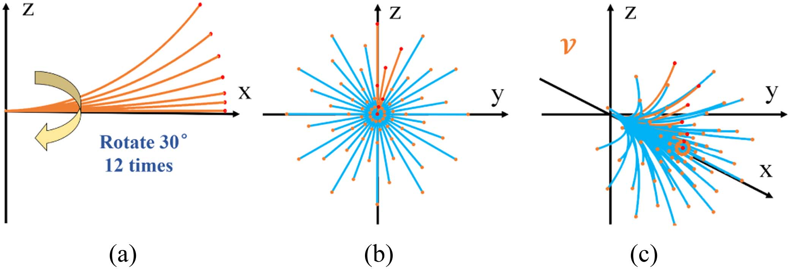

**图 5**：Fig. 5.
Time parameterization process for path q(s) with specified start and
end velocities, ˙s0 and ˙sN. Step 1 involves discretizing s. In Step 2, dynamical
constraints are applied to each discrete position si. Step 3 encompasses the
sequential computation of the controllable set Ki(IN) (illustrated as blue
intervals) in a backward manner, starting from the discrete positionsN. In Step 4,
we iteratively select the largest admissible control u∗

i from the discrete position
s0 in a forward manner. The optimal state x∗
i+1 := x∗
i + 2Δiu∗
i (represented
as red points) ensures that it remains within the corresponding controllable set
Ki+1(IN).
with respect to time t. As depicted in Algorithm 1, for each
geometry path q(s) ∈P, distinct start and end velocities of the
quadrotors are set according to
∥˙q(s0)∥∈{0, 0.1, . . ., vmax} m/s
∥˙q(send)∥= 0 m/s
(3)
where the velocity direction aligns with the path tangent. Here,
vmax represents the permissible maximum robot velocity. Var-
ied start velocities ˙q(s0) are used for velocity selection (see
Section VI-B) during each replanning. The negative effect
caused by such small velocity discontinuity can be safely ne-
glected through our experiment. The setting ˙q(send) = 0 m/s is
employed to ensure numerical stability.
For a given path q(s), the initial and final velocities along
the path, ˙s0 and ˙sN, are specified. We employ an effective and
robust time-optimal parameterization technique known as time-
optimal path parameterization algorithm based on reachability
analysis (TOPP-RA) [36]. The key concept of this approach
lies in iteratively calculating reachable and controllable sets at
discrete positions {si} along the path through the solution of
compact linear programs (LPs). Illustrated in Fig. 5, TOPP-RA
Authorized licensed use limited to: National Institute of Technology- Delhi. Downloaded on August 24,2026 at 05:45:47 UTC from IEEE Xplore.  Restrictions apply.

---

## 原文第 7 页核心内容与翻译

HOU et al.: PRIMITIVE-SWARM: AN ULTRA-LIGHTWEIGHT AND SCALABLE PLANNER FOR LARGE-SCALE AERIAL SWARMS
3635
Algorithm 1: Parameterization for Path Library P.
Require: Path Library P
Ensure: Time-optimal motion primitive library P(t)
1:
end speed ˙q(send) = 0
2:
for each path q(s) ∈P do
3:
for each start speed ˙q(s0) in Equ. 3 do
4:
˙s0 = ∥˙q(s0)∥/∥q′(s0)∥
5:
˙send = ∥˙q(send)∥/∥q′(send)∥
6:
q(s(t)) = TOPP-RA (q(s), ˙s0, ˙send)
7:
P(t).push_back(q(s(t)))
8:
end for
9:
end for
10:
returnP(t)
involves four fundamental stages: path discretization, formula-
tion of constraints, computation of controllable sets (backward
pass), and construction of optimal controls (forward pass). This
methodology offers a comprehensive strategy to implement time
parameterization with high efficiency and reliability.
1) Path Discretization: The interval [0, send] is divided into
N segments and N + 1 grid points
0 =: s0, s1, . . ., sN−1, sN := send
(4)
as shown in Fig. 5, Step 1.
Successive differentiation of q(s) yields the following ex-
pressions:
˙q = q′ ˙s, ¨q = q′′ ˙s2 + q′¨s.
(5)
Please note the difference between □′ and ˙□.
We define the path acceleration ¨si and the squared velocity
˙s2
i by
ui := ¨si, xi := ˙s2
i
(6)
within the interval [si, si+1]. They are interrelated as follows:
dxi
dt = d ˙s2
i
dt = 2 ˙si¨si = 2dsi
dt ¨si = 2dsi
dt ui
(7a)
dxi = 2dsiui.
(7b)
Equation (7b) establishes a linear connection among x, u,
and s
xi+1 = xi + 2Δiui, i = 0, . . . ,N −1
(8)
where Δi := si+1 −si.
According to (8), the terms ui and xi are referred to as the
control and state of the ith discrete position si. Any sequence
x0, u0,..., xN−1, uN−1, xN, uN that satisfies (8) is denoted as
a path parameterization. Our objective is to determine the se-
quence that minimizes the total time T of the trajectory q(s(t)).
2) Constraints Formulation: The dynamic constraints of the
quadrotor are set to
|| ˙q|| ≤vmax, −amax ≤¨q{x,y,z} ≤amax
(9)
where vmax and amax denote the upper bounds for velocity and
acceleration, respectively, and q{x,y,z} refers to the individual
elements along each axis. By substituting (5) into (9), the con-
straints on ˙q and ¨q are translated into constraints on ˙s2 and ¨s
as
q′(s)T q′(s) ˙s2 ≤v2
max
(10a)
−amax ≤(q(s)′′ ˙s2 + q(s)′¨s){x,y,z} ≤amax
(10b)
which are then applied at each discrete position si. Substituting
(6) into (10) leads to linear constraints on xi and ui, expressed
as
Ci := aiui + bixi + ci ≤0
(11)
where a, b, and c are the coefficients of the linear expression.
For (10a), a = 0, b = q′(s)T q′(s), c = −v2
max; for (10b), a =
±q(s)′
{x,y,z}, b = ±q(s)′′
{x,y,z}, c = amax. The ith stage sets of
admissible states and controls are defined as
Xi := {x|∃u : (u, x) ∈Ci}, Ui(x) := {u|(u, x) ∈Ci}. (12)
ThisprocessisshowninFig.5,Step2,butnotethatthissubfig-
ure is just an inaccurate visualization of constraints formulation.
Becausewedonotexplicitlyformulateanyconstraintsof ˙s2 (i.e.,
x) but only formulate constraints of x and u together in (11),
which are then directly incorporated into linear programming in
(13b) of Step 3.
3) Controllable Sets Computation (backward): Given a set
of states I, where xi+1 ∈Ii+1, we can determine the lower and
upper bounds (x−, x+) for an admissible state xi by solving the
following two LPs:
x−:= min
x,u x, x+ := max
x,u x
(13a)
s.t. (ui, xi) ∈Ci, x + 2Δiu ∈Ii+1.
(13b)
The interval (x−, x+) is referred to as the one-step set Qi(Ii+1),
signifying the existence of a state ˜x ∈Ii+1 and an admissible
control u ∈Ui that guides the system from x ∈Qi to ˜x.
As illustrated in Fig. 5, Step 3, starting with ˙sN = ∥˙q∥/∥q′∥
i-stage controllable set Ki(IN) can be iteratively computed as
follows:
KN(IN) = ˙s2
N, Ki(IN) = Qi(Ki+1(IN)).
(14)
The derived i-stage controllable set Ki(IN) implies the exis-
tence of a state xN ∈IN and a sequence of admissible controls
ui, . . ., uN−1 that guide the system from x ∈Ki to xN.
Throughout this process, if Ki(IN) = ∅or x0 /∈K0, it indi-
cates that the path q(s) cannot be time-parameterized under such
boundary conditions and dynamic constraints and, thus, should
be excluded from the primitive library.
4) Optimal Controls Construction (Forward): In this proce-
dure, the optimal states and controls are determined in a greedy
manner: at each stage i, the highest admissible control u is cho-
sen if it results in the next state falling within the (i + 1)-stage
controllable set. The greedy strategy is reasonable because u
defined in (6) indicates the growth rate of the trajectory progress
parameter s, which is monotonically increasing with respect to
time t.
Authorized licensed use limited to: National Institute of Technology- Delhi. Downloaded on August 24,2026 at 05:45:47 UTC from IEEE Xplore.  Restrictions apply.

---

## 原文第 8 页核心内容与翻译

Given a state x∗
i, the optimal control u∗
i is obtained by solving
the following:
u∗
i = arg max
u
u
(15a)
s.t. u ∈Ui(xi), x∗
i + 2Δiu ∈Ki+1.
(15b)
With the known start velocity of the path x∗
0 = ˙s2
0, we can
iteratively compute the optimal states for each stage using the
above method, as depicted in Fig. 5, Step 4.
The optimal time allocation t0:N is then determined by
˙saverage =

x∗
i +

x∗
i+1

/2
(16a)
Δt = (si+1 −si)/ ˙saverage
(16b)
ti+1 = ti + Δt.
(16c)
Subsequently, a geometric path is parameterized by the time set
t0:N to obtain a time-optimal and dynamically feasible trajectory
q(s(t)). Only trajectories that are parametrically feasible are
included in the motion primitive library P.
As constraints are imposed on a finite number of discrete
positions, it is essential to analyze satisfaction errors. The high-
accuracy interpolation scheme introduces a satisfaction error of
O(Δ2), which is influenced by the number of discrete positions
N. Setting N = 1000 has proven to yield satisfactory solution
accuracy. For a more detailed exploration of the satisfaction
error, please refer to [36]. The Seidel’s LP algorithm [37] is
employed to solve the LP problems in (13) and (15), providing
exact solutions. All computations are performed offline to com-
pose a time-optimal and dynamically feasible motion primitive
library.
V. FAST COLLISION CHECKING
Asthescaleofswarmgrowsandthedensityofobstaclesinten-
sifies, the environment becomes increasingly fragmented. This
fragmentation necessitates the planner to thoroughly explore the
accessible free space, resulting in a rapid escalation of collision
checks. Consequently, the adoption of an efficient collision
checking method becomes crucial for ensuring swift and reli-
able responses to complex environments. However, traditional
methods [23], [24], [25], [26] adopt piece-by-piece, sample-
by-sample approaches for robot-obstacle collision checking. As
shown in Fig. 6, these methods frequently repeat the query of
the interaction between the robot and obstacles, making the time
complexity dependent on the number of primitives multiplied by
thenumberofsamplepointsforeachprimitive.Whenaddressing
robot–robot collision checking, a similar mechanism is applied,
resulting in a time complexity estimated at O(mnh), where
m, n, h represent the primitive number, sample number, and
swarm scale, respectively.
To surmount these challenges and ensure effective spatial
coverage and scalability within the swarm system, we draw
inspiration from the work by [22] and present a novel approach
to expedited collision checking for swarm planning. Zhang et
al. [22] proposed an efficient way for collision checking by
detecting and storing the occupancy information offline and
then the collision checking module can perform efficient table
queries only in flight. We extended this method by designing

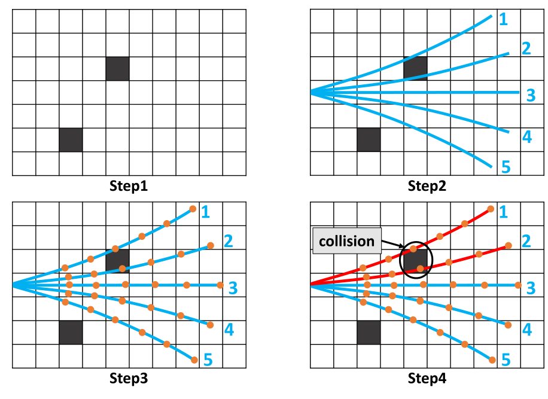

**图 6**：Fig. 6.
Illustration of typical robot-obstacle collision checking methods [23],
[24], [25], [26] depicted in four distinct steps. Obstacles are depicted as dark
boxes. Primitives are represented by blue curves, and their corresponding sample
points are indicated as orange dots. Unsafe primitives are highlighted in red.

a mechanism for robot–robot conflict detecting, which should
consider not only static obstacles, but the movements of nearby
robots as well.
A. Offline Generated Spatial and Spatio-Temporal Occupancy
Relationships
To improve the collision checking efficiency for motion prim-
itives, our method establishes offline spatial and spatio-temporal
occupancy relationships by precomputing an index system that
stores the occupancy status between primitives P(t) and the
surrounding space. The foundation of this index system in-
volves a twofold process: discretizing the spatial space into grids
and subsequently associating motion primitives passing through
each grid.
First, the continuous space is discretized into distinct grids.
For each grid, a search operation is conducted to identify and cat-
egorize motion primitives that traverse the grid’s vicinity within
a predefined radius d. This implies that there will be a collision
between the motion primitive and the grid at some point in time.
For those primitives that have been checked for conflicts, both
the primitive ID and the time interval during which the primitive
enters and exits the search radius to the grid are recorded. We
refer to this record as spatial and spatio-temporal occupancy
relationships, which is employed to index infeasible primitives
from unsafe environmental grids.
The procedure for constructing occupancy relationships is
detailed in Algorithm 2. The inputs include the motion primitive
library P(t), the spatial resolution sres ∈R+ to discretize the
space, the time step tres ∈R+ of sampling P(t), the radius
d ∈R+ including d1 and d2 indicating the required clearance
to avoid obstacles and other robots, respectively. The out-
puts include spatial occupancy relationship Ro, denoting grid-
primitive associations, and spatio-temporal occupancy relation-
ship Rt, signifying grid-primitive-time interval associations.
In the initial step (Line 1), the function SplitCoverageSpace
computes the set of all grids G := {g1, g2, · · · }, gi ∈R3 that
are inside the axis-aligned bounding box of spatial resolution of
sres traversed by at least one motion primitive in P(t). The com-
putational complexity is O(m) with m represents the primitive
Authorized licensed use limited to: National Institute of Technology- Delhi. Downloaded on August 24,2026 at 05:45:47 UTC from IEEE Xplore.  Restrictions apply.

---

## 原文第 9 页核心内容与翻译

HOU et al.: PRIMITIVE-SWARM: AN ULTRA-LIGHTWEIGHT AND SCALABLE PLANNER FOR LARGE-SCALE AERIAL SWARMS
3637
Algorithm 2: Offline Occupancy Relationships
Require:P(t), sres, tres, d1, d2
Ensure:Ro, Rt
/∗G, D, T for Occupancy Relationships ∗/
1:
G = SplitCoverageSpace(P(t), sres)
2:
D = DiscretePrimitives(P(t), tres)
3:
T = BuildKDTree(D.column(3))
/∗Ro for robot-obstacle collision checking ∗/
4:
ID1 = T .QueryBallPoint(G, d1)
5:
Ro.allocate(size(G))
6:
for i from 1 to size(G) do
7:
Itmp = SortByID(ID1[i]), last_id = 0
8:
for isp from 1 to size(Itmp) do
9:
iprim = D[isp, 2]
10:
if iprim == last_id then
11:
continue
12:
end if
13:
Ro[i].push_back(iprim)
14:
last_id = iprim
15:
end for
16:
end for
/∗Rt for robot–robot collision checking ∗/
17:
ID2 = T .QueryBallPoint(G, d2)
18:
Rt.allocate(size(G))
19:
for i from 1 to size(G) do
20:
Itmp = SortByID(ID2[i]), last_id = 0
21:
for isp from 1 to size(Itmp) do
22:
iprim = D[isp, 2], τ = D[isp, 4]
23:
if iprim != last_id then
24:
Rt[i].push_back(iprim, τ.tstart, τ.tend)
25:
else
26:
Rt[i].back().tend = τ.tend
27:
end if
28:
last_id = iprim
29:
end for
30:
end for
31:
returnRo, Rt
number because the boundary of G is only obtained at the termi-
nal points of each motion primitive. Function DiscretePrimitives
(Line 2) outputs D, a 2-D table visualized in Fig. 7 that encodes
sampled points from P(t) with time step tres and can be indexed
using the notation D[row id, column id] with id starts from 1.
The computational complexity of constructing D is O(Σm
i=1ni)
with ni the sample number of primitive i. For precise collision
detection, dense point sampling on each primitive is essential.
While increasing the number of primitives and point samples
enhances accuracy, it also escalates time complexity. To strike
a balance, we use the sample position in D to build a class of
kd-tree T (Line 3) of complexity O(kn log n) [38] with n the
total sample number and k the degree of the kd-tree. T has a
method QueryBallPoint that finds sampled 3-D points p ∈D
that are within the radius d from each grid center. Function
QueryBallPoint returns the results to ID := {iD0, iD1, . . . } that
satisfies size(ID) = size(G). The complexity of this function is
O(size(G) log n).

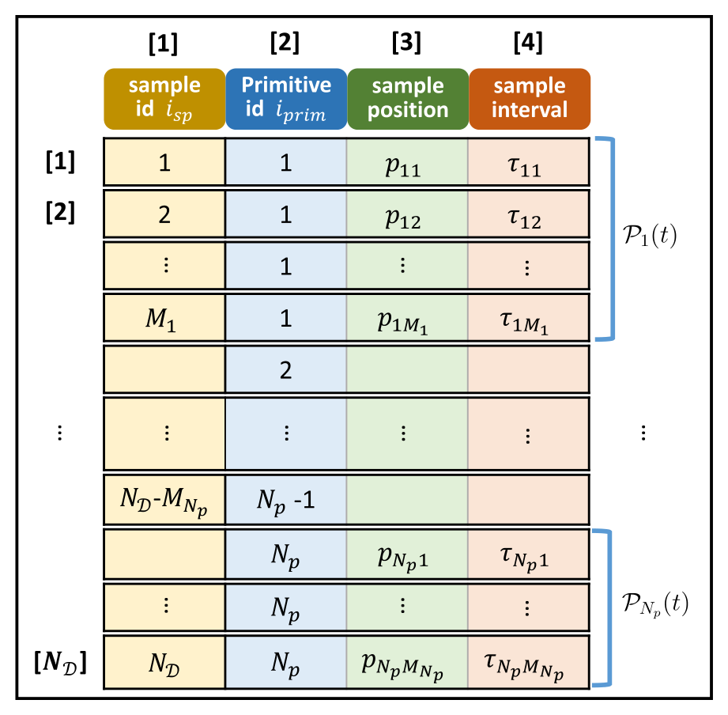

**图 7**：Fig. 7.
Visualization of the 2-D table D that encodes index from the primitives
Pi(t), where i ∈{1, 2, . . .Np}. The numbers in brackets represent row and
column indices. The sample number for each primitive is denoted as Mi,
i ∈{1, 2, . . .Np}. Because the optimized time allocation for each primitive
varies, the number of sample points Mi also varies based on the same time
resolution tres. Sample interval τij := [tstart, tend]ij, i ∈{1, 2, . . .Np}, j ∈
{1, 2, . . .Mi}, tend −tstart = tres. Sample positions are sampled at the middle
point of the time interval: pij = Pi((tstart,ij + tend,ij)/2). The total number

of entries in the table is size(D) = ND = Np
i=1 Mi.

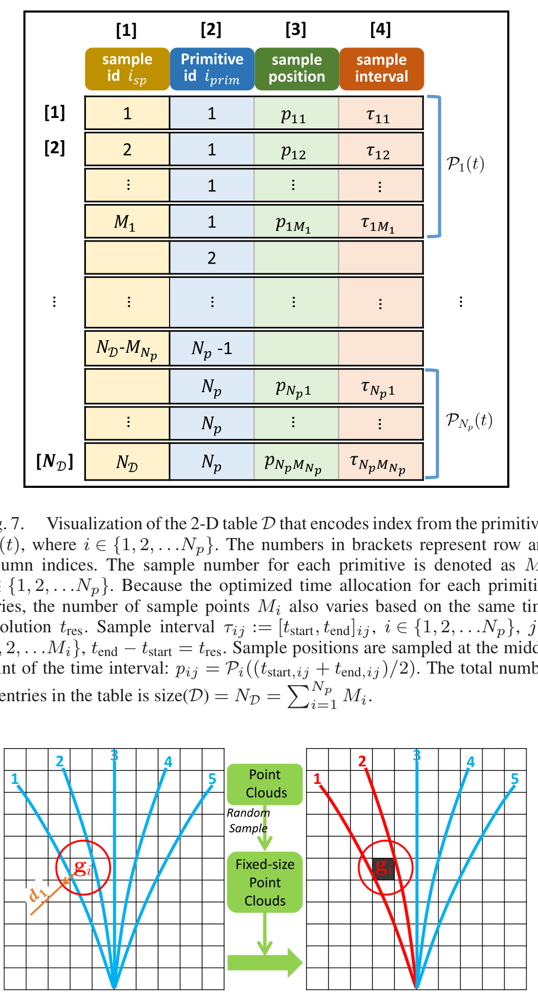

**图 8**：Fig. 8.
Robot-obstacle collision checking. The grid gi associates primitives
1 and 2, i.e., Ro[i] = {1, 2} according to Algorithm 2. d1 represents the query
distance. The dark grid represents obstacles. The blue primitives are considered
safe, while the red primitives are marked as unsafe.

The function SortByID(ID[i]) (Line 7, 20; O(size(ID[i])2)
complexity) sorts the rows of ID[i] in increasing order of isp,
ensuring that rows sampled from the same motion primitive
are stacked together like D. The following code in the for-loop
(Line 8–15, Line 21–29) stores the conflicted primitive ID iprim
and the ID with the time interval {iprim, tstart, tend} of each
grid G into the algorithm output Ro, Rt. These represent the
spatial occupancy relationship and spatial-temporal occupancy
relationship, respectively. Elements of Ro and Rt are retrieved
with the notation Ro[i] and Rt[i], where i ∈N denotes the index
of each grid gi.
B. Online Robot-Obstacle Collision Checking
In Fig. 8, the spatial occupancy relationship Ro stores
the grids G with its conflicted primitives. We set the query
Authorized licensed use limited to: National Institute of Technology- Delhi. Downloaded on August 24,2026 at 05:45:47 UTC from IEEE Xplore.  Restrictions apply.

---

## 原文第 10 页核心内容与翻译

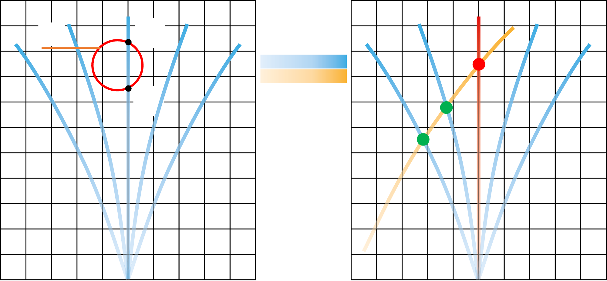

**图 9**：Fig. 9.
Robot–robot collision checking. The grid gi corresponds to the time in-
terval [t1, t2] of primitive 3, i.e., Rt[i] = {{3, t1, t2}} according to Algorithm
2. d2 denotes the query distance. The yellow primitive represents the trajectory
of another robot. The blue primitives are considered safe, while red primitive is
marked as unsafe.

distance as
d = d1 =
√
3
2 sres + rinfl
(17)
where rinflis a safe distance required between the drone and
obstacles.
Then, for any obstacle part that falls within a grid of in-
dex i, we can retrieve the collided primitives from Ro[i] with
O(1) complexity. During real-world implementations, when the
sensor receives the point clouds of obstacles, we employ the
random sample method [34] to obtain fixed-number Npc of point
clouds while ensuring the fidelity of environments. We then
project these point clouds onto the grids G, and the associated
primitives are batch-labeled as unsafe. The time consumption
of the robot-obstacle collision checking is only related to the
number of point clouds and remains independent of the number
of primitives. The proposed method reduces the number of point
clouds to a fixed number Npc so that collision checking can
be finished quickly in deterministic time. The time complexity
of our method to process a frame of point cloud is O(Npc).
Furthermore,toensurerobotsafety,typicalmethods[4],[5],[39]
usually inflate a grid map online by a specific safety distance. In
contrast, our method requires only an offline setting of the safe
distance rinflwithout incurring any online computational cost on
map inflation.
C. Online Robot–Robot Collision Checking
In Fig. 9, the spatio-temporal occupancy relationship Rt
stores the ID and time interval of the conflicted primitive with
each grid in G. We set the query distance as follows:
d = d2 =
√
3
2 sres + 2rrobot
(18)
where rrobot is the radius of robots.
We communicate and receive the trajectories of other robots
within two planning horizons [as defined in Fig. 10(c)], because
robots beyond this distance are sure to be collision-free in the
next trajectory planning. Then, we project these trajectories onto
the grids G along with the time interval [tstart, tend]l indicating
when the drone l will occupy that grid gi. For each motion
primitive with ID iprim in Rt[i], the corresponding time inter-
val [tstart, tend]iprim,i is retrieved and compared with [tstart, tend]l.
If [tstart, tend]iprim,i ∩[tstart, tend]l̸ = ∅, then iprimth primitive will
collided with drone l in the future, thus, iprimth primitive is
marked unsafe. The time consumption of the robot–robot col-
lision checking is only related to the number of trajectories of
other robots. The algorithm complexity of our method is O(Nd)
with Nd the number of drones within the two planning horizons.
In summary, the proposed method minimizes unnecessary
online computation costs for collision checking and operates
directly on raw point clouds without any computationally ex-
pensive environment representation. Its time complexity is in-
dependent of the total number of primitives, as quantitatively
demonstrated in Section VIII-B. Thus, in an onboard processor,
the number of primitives can be set sufficiently high to provide
high-quality candidates.
VI. ONLINE LOCAL REPLANNING
To react to incremental environmental sensing in unknown
surroundings, the planner repeatedly generates trajectories. Tra-
jectory replanning is triggered based on two criteria: 1) reaching
a specified time threshold, or 2) detecting any collision along the
current executing trajectory.
A. Velocity-Aligned Coordinate System
As introduced in Section IV-A, for any trajectory in the motion
primitive library P, the start position q(s0) ≡0 and direction of
the velocity ˙q(s0) is tangent to the x-axis. Therefore, to ensure
trajectory continuity, we have to align the direction of the start
velocity ˙q(s0) with the direction of robot’s present velocity
vcur. To achieve this, a velocity-aligned coordinate system V
is established based on vcur, depicted in Fig. 10(a). This system
is defined as follows:
xaxis =
vcur
∥vcur∥
yaxis = xaxis × g
zaxis = xaxis × yaxis
(19)
where xaxis, yaxis, zaxis represent the axes of V, while g sym-
bolizes the normalized gravity vector. All primitives share a
common origin in V and are tangential to the x-axis at their
respective starting velocity. The selection of start velocities for
all primitives is determined by the magnitude of the current
velocity ∥vcur∥.
The transformation T W
V from the velocity-aligned coordinate
system V to the world frame W is defined as follows:
RW
V = [xaxis, yaxis, zaxis]
(20)
T W
V =

RW
V
pstart
0T
1

(21)
where RW
V is a rotation matrix, and pstart represents the robot’s
position within the world coordinate system W.
In practice, we perform a transformation of environmental
information, such as obstacles and other trajectories, from the
Authorized licensed use limited to: National Institute of Technology- Delhi. Downloaded on August 24,2026 at 05:45:47 UTC from IEEE Xplore.  Restrictions apply.

---

## 原文第 11 页核心内容与翻译

HOU et al.: PRIMITIVE-SWARM: AN ULTRA-LIGHTWEIGHT AND SCALABLE PLANNER FOR LARGE-SCALE AERIAL SWARMS
3639
(a)
(b)
(c)

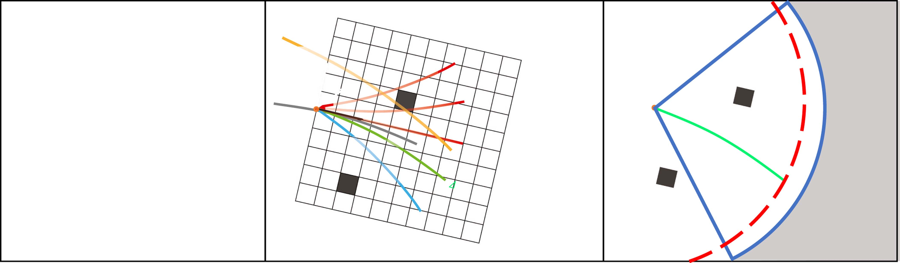

**图 10**：Fig. 10.
Online local replanning. (a) Velocity-aligned coordinate system V. (b) Trajectory selection. Dark grids represent obstacles, and the yellow curve shows
another robot’s trajectory. Decreasing transparency indicates progressing time on the trajectory. The orange star marks the global goal. Primitive 4 is chosen as the
new trajectory with the lowest cost which is defined in Section VI-B. (c) Receding horizon strategy. The red dashed line depicts the planning horizon, while the
blue sector represents the robot’s perception range. The light gray region signifies unexplored territory.

world coordinate system W to the velocity frame V, which
corresponds to the coordinate frame of the primitive library.
B. Trajectory Selection
In Fig. 10(b), we begin by excluding unsafe primitives from
collision checking. Subsequently, we formulate a cost function
C for each safe primitive based on user-defined specifications.
The cost function C is expressed as follows:
C = λgCgoal + λbCbound, where
Cgoal = ∥pend −pgoal∥−∥pstart −pgoal∥
Cbound =
CB,
if pend /∈B
0,
if pend ∈B
(22)
where λg and λb represent corresponding weights, and pstart
denotes the robot’s position in the world coordinate system W,
CB > 0 is a constant scalar. The goal cost Cgoal aims to maximize
the improvement of getting close to the pgoal. The boundary cost
Cbound penalizes end positions pend outside the allowed bounds
B, like some user-defined flyable areas.
The proposed approach can also accommodate other desired
criteria by extending the cost function C, such as yaw angle
change rate. Finally, we select the primitive with the minimum
cost as the new trajectory to be executed.
C. Receding Horizon Strategy
Weemployarecedinghorizonstrategyfortheimplementation
of replanning in autonomous swarm navigation, illustrated in
Fig. 10(c). When the conditions for replanning are met, the
planner selects an optimal local trajectory to execute as in
Section VI-B. The replanning process is reiterated until the
robots successfully reach their global goals. The local trajectory
is planned within a planning horizon, which is determined by
the robot’s perception range. This planning horizon confines
the scope of trajectory calculation. Moreover, the initiation
of replanning for robots is carried out asynchronously. This
strategic approach empowers robots to promptly respond to
dynamic environment changes and conflicts with other robots.
Simultaneously, the long-term planning to achieve their global
goals is upheld.
VII. IMPLEMENTATION DETAILS
For simulations, our simulator encompasses a quadrotor dy-
namics model, a random map generator, a simulated depth
sensor, and communication module. All the simulations share
the same parameter configuration for trajectory planning, except
for the number of robots, their corresponding start positions and
goals, and obstacles placed according to different experiment
requirements. With the exception of the large-scale simulations
(see Section VIII-F), all simulations and comparisons were con-
ducted on a personal computer with an Intel Core i7 10700 CPU
(8 cores, 16 threads), an NVIDIA GeForce GTX 1660 Ti GPU,
and 32 GB random-access memory (RAM). For the large-scale
simulation of swarms, we utilized the ecs.hfg6.20xlarge work-
station,2 which is further detailed in Section VIII-F. Notably,
all drones were operated within independent parallel threads
to maintain a decentralized and asynchronous system architec-
ture. In our real-world experiments, we utilize an open-source
quadrotor platform [5].
VIII. EVALUATION
In this section, we validate the proposed method through
simulations and real-world experiments.
A. Success Rate Analysis of Motion Primitive Library
The success rate of autonomous navigation is evaluated in
different scenarios. We utilize three motion primitive libraries
with varying numbers of trajectories Nt ∈{37, 61, 109} (as
shown in Fig. 11) and three environments with different numbers
of obstacles Nobs ∈{100, 150, 200}. The cylindrical obstacles
have an average radius of 0.6 m, distributed in a 26 × 20 × 3 m
space (see Fig. 15). In each of the nine scenarios, one drone starts
2[Online].
Available:
https://www.alibabacloud.com/solutions/sap?spm=
a3c0i.23458820.2359477120.13.61d67d3fDISyrx
Authorized licensed use limited to: National Institute of Technology- Delhi. Downloaded on August 24,2026 at 05:45:47 UTC from IEEE Xplore.  Restrictions apply.

---

## 原文第 12 页核心内容与翻译

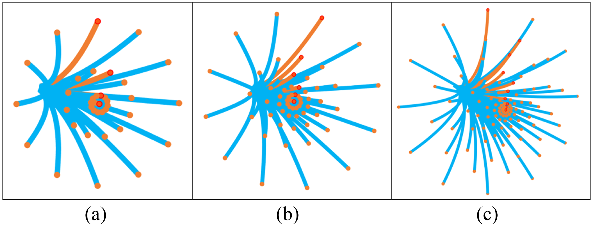

**图 11**：Fig. 11.
Three motion primitive libraries. (a) r ∈{8, 20, 78, ∞}m. (b)
r ∈{6, 12, 20, 36, 78, ∞}m. (c) r ∈{2, 3, 4, 6, 8, 12, 20, 36, 78, ∞}m; In
the all three figures, l = 3m, θ = {0◦, −10◦, −20◦, 0◦. . ., 0◦}, Dangle = 30◦.
(a) Low (37 trajectories). (b) Medium (61 trajectories). (c) High (109 trajecto-
ries).

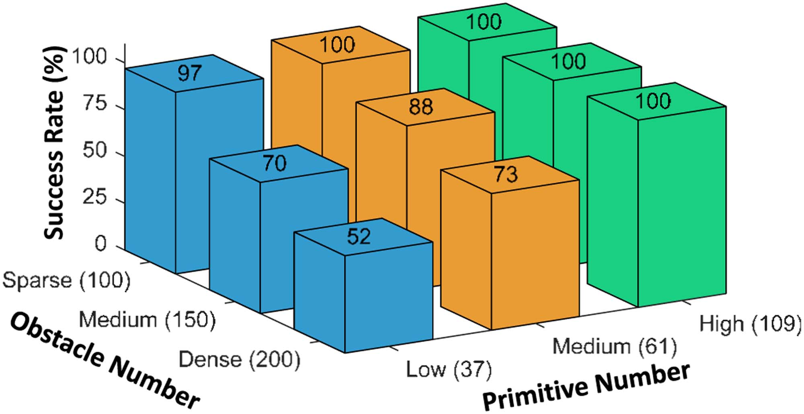

**图 12**：Fig. 12.
Success rate (% ) in different configurations.

from a random point (x = −18 m, y ∈[−9, +9] m, z = 1 m) at
one side of the map and navigates to a goal position (x = 18 m,
y ∈[−9, +9] m, z = 1 m) and repeats for 100 times. The suc-
cess rate is recorded and presented in Fig. 12.
From the results, the motion primitive library with a low
number of trajectories performs poorly in dense environments
due to its limited flexibility and difficulty in fitting complex
trajectories. However, by increasing the primitive number in
the motion primitive library to enhance flexibility, our planner
demonstrates robust performance in all environments. There-
fore, the proposed method is capable of handling autonomous
navigation tasks by designing a reasonable primitive number for
primitive library in complex and dense environments. In later
tests, we mostly increase the primitive number to 181 to further
increase the possibility of finding better trajectories.
B. Fast Collision Checking
We evaluate the efficiency of the proposed collision checking
method in two experiments.
1) Robot-obstacle collision checking: In Section V, we dis-
cussed that the proposed method scales better in primitive
number than the typical collision checking method illustrated
in Fig. 6. This point is validated in Fig. 13(a). For the typi-
cal method, we generate discrete acceleration commands and
impose them onto a system with zero initial position and ve-
locity, leading to different trajectories. Then, each trajectory is
truncated to the same length of the proposed primitive library.
Collision checking is then performed with the same map and the
time to compute is recorded in Fig. 13(a). As we analyzed, the
computation time of the traditional method grows linearly with
the number of trajectories, while the proposed method shows a
slow increase, which means a higher scalability.
In fact, the time complexity of the proposed method is lin-
ear to the number of point cloud, as we check collision for
each obstacle point. Therefore we conduct another two tests in
Fig. 13(b) and (c). The occupancy ratio indicates the percentage
of obstacles in space under the given map resolution. Generally
speaking, areas with an occupancy ratio exceeding 30% will
be difficult to navigate. For reference, this ratio in Fig. 15 is
approximately 15% . From Fig. 13(b) and (c), the computation
time increases linearly with the occupancy ratio, and the more
primitives there are, the faster the growth. In addition, the
resolution has a very significant impact on the computation
time, as the point cloud density is directly proportional to the
inverse of the resolution cubed. For the vast majority of scenes
with an occupancy ratio less than 30%, the collision checking
time at a resolution of 0.1 m is usually less than 0.5 ms, and if
the resolution is increased to 0.2 m, the computation time will
further decrease to below 0.2 ms.
2) Robot–robot collision checking: We conducted experi-
ments with 8 drones evenly distributed in a circular empty space
with a radius of 12 m, as illustrated in Fig. 16. The drones
exchanged positions using three different motion primitive li-
braries. Each scenario was run 20 times, and the results are
shown in Fig. 14. The collision checking time, averaged across
all 8 drones, consistently remained between 0.35 and 0.37 ms
in all three situations.
In summary, the proposed method enables rapid conflict
checking without the need for computationally expensive envi-
ronment representation or obstacle inflation. Its time complexity
remains independent of the number of primitives, allowing a
sufficiently high number of primitives to be used on an onboard
processor, providing high-quality candidates.
C. Single-Robot Simulation and Comparison
The proposed planner serves as a high-performance single-
robot local planner when the number of robots is set to one.
We compared the proposed method with four state-of-the-art
local planners: Mapless (2021) [40], EGO-Planner (2020) [39],
and MINCO-Single (2022, the single-robot version of MINCO-
Swarm [5], which uses the trajectory representation called
MINCO [20]). Mapless is a lightweight approach using a kd-
tree data structure. EGO-Planner and MINCO-Single are on-
line optimization methods with an inflated map. Except that,
MPL (2018, Motion Primitive Library) [7] is compared as a
representative sampling-based planner. All methods are open-
sourced, and we use default parameters. The flight area con-
tains 200 obstacles distributed in a 26 × 20 × 3 m space. To
ensure fairness, we test all methods with the same perception
range (except for MPL which uses global map), initial posi-
tion [−18.0, −9.0, 1.0] m, and goal position [18.0, 9.0, 1.0] m.
The number of primitives Nt is set to 181 for the proposed
method. The results are presented in Fig. 15(c). The executed
trajectories of the five methods in a random map are illus-
trated in Fig. 15(a), and their velocity profiles are shown in
Fig. 15(b). MPL as a base planning library only supports global
Authorized licensed use limited to: National Institute of Technology- Delhi. Downloaded on August 24,2026 at 05:45:47 UTC from IEEE Xplore.  Restrictions apply.

---

## 原文第 13 页核心内容与翻译

HOU et al.: PRIMITIVE-SWARM: AN ULTRA-LIGHTWEIGHT AND SCALABLE PLANNER FOR LARGE-SCALE AERIAL SWARMS
3641
(a)
(b)
(c)

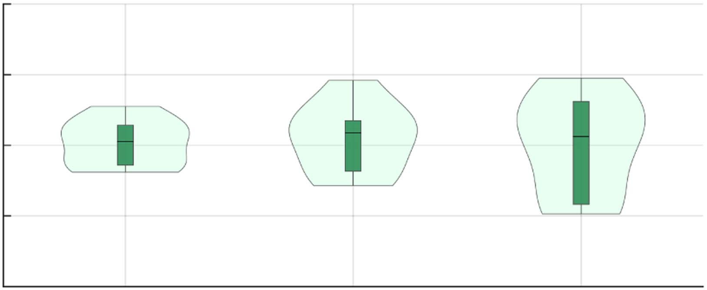

**图 13**：Fig. 13.
Computation time for checking robot-obstacle collisions.

**图 14**：Fig. 14.
Computation time for checking robot–robot collisions.

planning, which means it plans the whole trajectory at a once.
Therefore, its computation time is significantly larger than other
methods.
From Fig. 15(a), three optimization-based methods (Mapless,
EGO-Planner, MINCO-Single) always show more pronounced
twists and turns within a local area, while sampling-based
methods (the proposed, MPL) generate smoother trajectories
in trajectory shape. We think the reason is that the trajectory
optimization problems formulated by the first three methods
are always constrained by both the cluttered environment and
nonlinear robot dynamics and are highly nonconvex, thus, the
solution is always restricted within a local optimum, making
the planner short-sighted. By contrast, sampling-based methods
explore a larger freespace in candidate primitive evaluation.
Compared to MPL, the proposed method generates a shorter
trajectory own to the high quality of the motion primitive library.
From Fig. 15(b), the proposed method managed to keep the
maximum speed during the whole flight also thanks to the time-
optimal primitives that have already handled the prior-known
drone dynamics offline.
From the result, EGO-Planner tends to produce more conser-
vative trajectories due to the convex hull constraint of B-spline.
Mapless adopts a lightweight kd-tree data structure for envi-
ronment representation, but the cost of rebuilding the kd-tree
and the O(log n) time complexity of querying collision status
cannot be neglected. Moreover, Mapless performs poorly in
dense environments, as demonstrated in the attached video, due
to its O(n log n) time complexity [40] with respect to trajectory
sampling, which limits its ability to find freespace. These meth-
ods always face a tradeoff between environment representation
and trajectory generation, both of whose computational cost
cannot be simultaneously reduced in these methods. In contrast,
the proposed method eliminates the need for map inflation.
Furthermore, the computation time is hardly affected by the
number of primitives, as shown in Figs. 13 and 14, thereby
minimizing the online computational cost while ensuring high-
quality trajectories.
D. Swarm Simulation and Comparison
We compare the proposed method with RBP (2020) [2],
EGO-Swarm (2021) [4], MINCO-Swarm (2022) [5], MADER
(2021) [3], R-MADER (2023) [6], and AMSwarmX (2023) [8].
All of the above are open-source works that have demonstrated
effectivenessinthefieldofaerialswarmplanninginrecentyears.
Comparisonsareconductedinbothemptyandclutteredspace,
to show the capability of interagent collision avoidance and
avoid dense obstacles. The drone radius is set to 0.15 m, the
desired speed is set to 1 m/s, and all other parameters are
maintained at their default values. For RBP, we adjust the
plan_time_scale parameter to achieve the best performance.
Primitive number Nt of the proposed method is set to 181. The
meanings of flight distance and computation time are consistent
with those in Section VIII-C.
1) Comparison Without Obstacles: Eight drones exchange
positions in a circular empty space with a radius of 12 m. The
results are summarized in Table II. Since RBP is a central-
ized method, the computation time represents the total time of
planning global trajectories for all drones, thus marked with ∗.
For other methods, the computation time indicates the time of
planning a local trajectory for each drone. All data represent
the average values across eight drones over 10 experiments. The
executed trajectories of all methods are depicted in Fig. 16. RBP
and EGO-Swarm generate conservative trajectories due to the
convex hull constraint of the Bernstein polynomial, leading to
a compressed solution space. MADER employs MINVO basis
to alleviate this issue but still faces challenges in robot–robot
avoidance, resulting in multiple stops when drones encounter
each other, which can be seen in the attached video. RBP
incurs high computation cost, making it unsuitable for real-time
planning on onboard devices.
2) Comparison With Obstacles: This part includes a qual-
itative experiment to evaluate the smoothness of the trajec-
tory shape and a more in-depth quantitative experiment with
Authorized licensed use limited to: National Institute of Technology- Delhi. Downloaded on August 24,2026 at 05:45:47 UTC from IEEE Xplore.  Restrictions apply.

---

## 原文第 14 页核心内容与翻译

(a)
(b)
(c)

**图 15**：Fig. 15.
Single-robot comparison. (a) Visualization of executed trajectories. The drone starts from the same initial and goal positions in all methods. The gray
pillars represent obstacles, and the colored curves depict the executed trajectories of each method. (b) Velocity profile comparison. (c) Metrics comparisons using
violin graphs. Flight time and flight distance are metrics used to evaluate the drone’s performance in reaching the global goal.

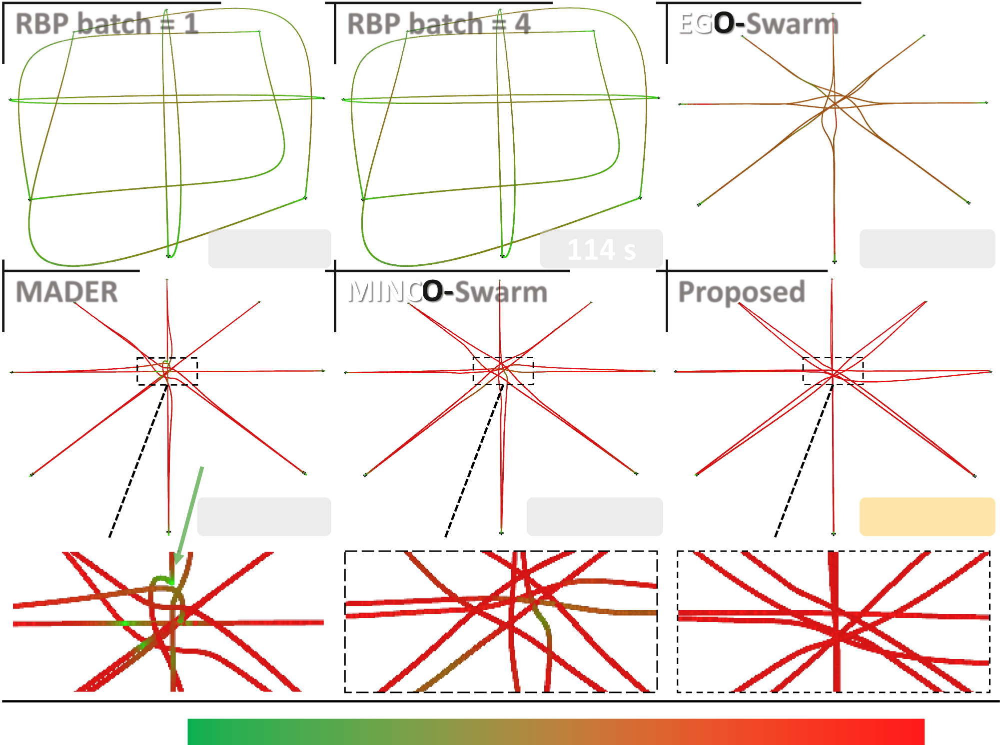

**图 16**：Fig. 16.
Trajectory comparisons of eight drones exchanging positions. The
data in the bottom right corner shows the average flight time of the eight drones.
The colored curves represent the trajectories of the drones. We use a color bar
from green to red to show the change in drone speed from small to large.

multiple indicators. In this section, we choose EGO-Swarm
(2021) [4], MINCO-Swarm (2022) [5], R-MADER (2023) [6],
and AMSwarmX (2023) [8] for comparison. RBP [2] is excluded
because it is a centralized planner. MADER [3] is also ignored
because we have already chosen its successor R-MADER.
For the qualitative experiment, we tested these method with
200 cylindrical obstacles distributed in a 26 × 20 × 3 m space,
as shown in Fig. 17. The average radius of obstacles is 0.6 m.
Drone spacing of the start points and the spacing of the goals are
both set to 2 m, and the order of start points and goals is reversed.
From Fig. 17, R-MADER, EGO-Swarm, MINCO-Swarm
generated trajectories with a more tortuous shape. In this test,
we modify the R-MADER parameter Radius of the planning
sphere (Ra) from 30 to 7 m, otherwise no solution can be found.
A larger Ra increases the dimension of the solution space, which
is beneficial for finding solutions that are in line with long-term
interests, but it also significantly increases the difficulty of
optimization, especially when the number of constraints

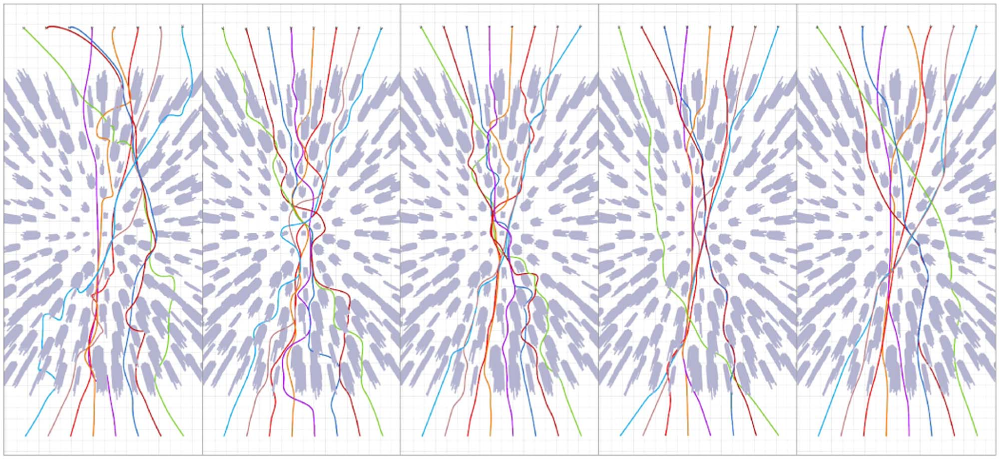

**图 17**：Fig. 17.
Smoothness comparison by trajectory shape. Eight drones fly through
the obstacle area from the bottom to the top of the image. All images are captured
from a top-down perspective.

increases substantially in complex scenarios. 7 m is a balance
point through continuous testing in this scenario. AMSwarmX
and the proposed method both generated smoother trajectories.
AMSwarmX is an alternating-minimization-based approach
whose key idea is pulling the trajectory to some attraction
points pi,r located in free space. To find the important pi,r
and for obstacle distance query, AMSwarmX uses A∗search
as the front end and requires a prebuilt Octomap. This limits
its application in unknown scenarios with onboard sensors.
Furthermore, AMSwarmX is the only synchronous planner
with information shared and trajectories planned at each same
planning round.3 Part of the reason why the proposed method
generates smoother trajectories is analyzed in Section VIII-C.
Furthermore, we conducted more in-depth quantitative ex-
periments. Several illustrative pictures are shown in Fig. 18.
The independent variables in this experiment are the number of
drones and obstacles, the former is used to evaluate the ability
of reciprocal collision avoidance, and the latter is for evaluating
obstacles avoidance. The numbers of drones are set to 20, 40, 60,
and 80, and the numbers of obstacles are set to 50 and 150. In the
scenario with 150 obstacles, we only tested the largest 80-drone
3[Online].
Available:
https://github.com/utiasDSL/AMSwarmX/blob/
master/amswarmx/src/runner/run_am_swarm.cpp
Authorized licensed use limited to: National Institute of Technology- Delhi. Downloaded on August 24,2026 at 05:45:47 UTC from IEEE Xplore.  Restrictions apply.

---

## 原文第 15 页核心内容与翻译

HOU et al.: PRIMITIVE-SWARM: AN ULTRA-LIGHTWEIGHT AND SCALABLE PLANNER FOR LARGE-SCALE AERIAL SWARMS
3643
(a)
(b)
(c)

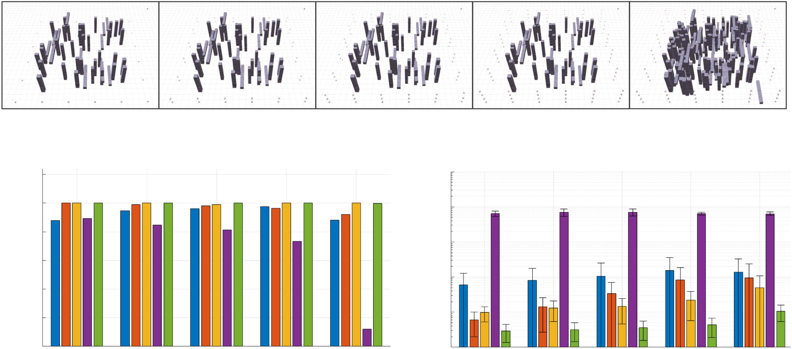

**图 18**：Fig. 18.
Swarm planning comparison with varying drone number and obstacle number. Each test runs for 30 times and before each restart, the start and goal
points are randomly reshuffled. (a) S1–S5: five experiment configurations. (b) Success rate comparison. (c) Computation time comparison.

swarm to simultaneously evaluate the planner performance in
extreme scenarios. Success rate and computation time are the
metrics we used. Among them, success rate is defined as the
ratio of drones that safely reach the goal point, computation
time is the time spent on a single trajectory planning. Each data
point is the average value of all drones (20 to 80) in 30 ran-
dom start-goal configurations. For computation time, we used a
logarithmic scale and plotted its standard deviation. R-MADER
runs on the 80-core workstation, the same platform used for
1000-drone simulation in Section VIII-F, since each agent of
R-MADER requires about 1 CPU core. Other methods run on the
8-core-16-thread personal computer introduced in Section VII.
A successful flight is defined as reaching the goal point
withoutanycollisions.ForsuccessratecomparisoninFig.18(b),
all methods except R-MADER have shown a relatively high
success rate. Among them, the success rate of EGO-Swarm
gradually decreases with the increasing number of drones and
obstacles, while that of AMSwarmX appears to be less related to
the experimental setup. It is speculated that the main reason for
this phenomenon is that AMSwarmX prebuilds the map and uses
front-end global search to find high-quality feasible space for the
back-end trajectory planner. The other methods (EGO-Swarm,
MINCO-Swarm, The Proposed) only consider local information
perceived by simulated sensors in real time, so the success rate
for later methods is easily affected by environment. In fact,
the success rate of AMSwarmX is underestimated because,
although AMSwarmX is a decentralized planner, in terms of
code implementation, all drones run within the same program,
and a collision of any drone will terminate the entire swarm. The
success rate of R-MADER is heavily affected by the number of
obstacles. A possible reason is that R-MADER uses a multi-
tude of separation planes to separate free space from obstacles.
This strategy leads to the issues of computational burden and
conservatism with the increasing number of obstacles, which
further results in long computation time and slower response
to changing environment. Referring to the computation time
depicted in Fig. 18(c), the proposed method exhibits a notable
advantage, with computation times typically amounting to just
one-third of those required by other methods. This result shows
the effectiveness of the proposed method that transforms online
trajectory optimization into a primitive selection problem.
E. Eleven Hours Continuous Flight
This experiment is for evaluating the tolerance for occasional
situations that are difficult to be modeled and specifically ad-
dressed. Due to the low probability of occurrence, long-term
continuous flight testing is required. Existing swarm planning
works have not yet conducted such tests, making it difficult to
assess the robustness of their works against occasional events.
In this experiment, we designed the following experiment: A
dense obstacle scenario of 6 × 6 × 3 m is randomly generated
along with 20 drones, and then a goal point setting software
randomly sends goal points to each drone. Whenever a drone
reaches a goal point, it will receive another random goal point.
After at least 1 h of continuous flight, the simulator randomly
regenerates a new map and repeats the above process 11 times.
This experiment also simulates an aerial logistics system, where
the goal setting software simulates a logistics dispatch station,
assigning delivery tasks to each drone. Each logistics aircraft
needs to avoid obstacles (such as buildings or mountains) and
other logistics aircraft during flight.
The result is shown in Figs. 19 and 20, and the attached video
11 Hours Flight. We have compiled a histogram of the time
taken to reach the goals. Flight time can effectively demonstrate
the performance of the algorithm in long-duration navigation, as
anomalies encountered during flight often lead to a significant
increase in flight time. Moreover, for the delivery missions
mentioned earlier, flight time is often one of the most critical
metrics for users, provided that safety is ensured, which will be
analyzed in Section VIII-F. This section focuses more on the
timeliness of the method.
Authorized licensed use limited to: National Institute of Technology- Delhi. Downloaded on August 24,2026 at 05:45:47 UTC from IEEE Xplore.  Restrictions apply.

---

## 原文第 16 页核心内容与翻译

(a)
(b)
(c)

**图 19**：Fig. 19.
Long-time continuous flight. 20 drones fly in a 6 × 6 × 3 m cluttered
space. Goals are randomly assigned once a drone reaches the current goal.
Drones continuously fly for more than one hour in each round and repeat for
11 rounds with different obstacles. (a) and (c) Trajectories 20 drones traveled
over a period of approximately 10 minutes. The red circle in (b) shows a “big
wall” of randomly generated obstacles, making the collision avoidance more
challenging.

As shown in Fig. 20, the vast majority of goal points can
be reached within 20 s. For reference, the proportion of flights
within 20 s is 99.1%, and within 50 s is 99.94% . For some flights
with particularly long durations, readers can see at 15 s into the
accompanying video 11 Hours Flight, in the lower left scene, a
red trajectory and a yellow trajectory drone getting stuck in front
of a big obstacle. Although they eventually escaped the blocking
obstacle, a considerable amount of time was still spent. The root
cause of this issue is that this article, as a local planning algo-
rithm, only considers the current environmental information and
lacks the ability for long-term planning and decision-making.
Therefore, it is more suitable for avoiding nearby moving or
stationary obstacles, even if the obstacle number is very high.
In contrast, AMSwarmX [8] in Section VIII-D introduces a
global search based on A∗to find the long-term path. The
other works, including EGO-Swarm [4], MINCO-Swarm [5],
and R-MADER [6], are all local planners and are theoreti-
cally unsuitable for dealing with large obstacles or maze-like
scenarios. Local planning algorithms, including the method in
this article, often need to be paired with a guidance front end
responsible for high-level decision-making to form a complete
autonomous navigation system for complex environments. In
summary, the experiments in this section validate the robustness
and reliability of the proposed method in cluttered environments,
and can handle larger obstacles to some extent.
F. Large-Scale Swarm Simulation
Scalability is a critical metric for evaluating autonomous
swarm
algorithms.
We
demonstrate
the
capabilities
of

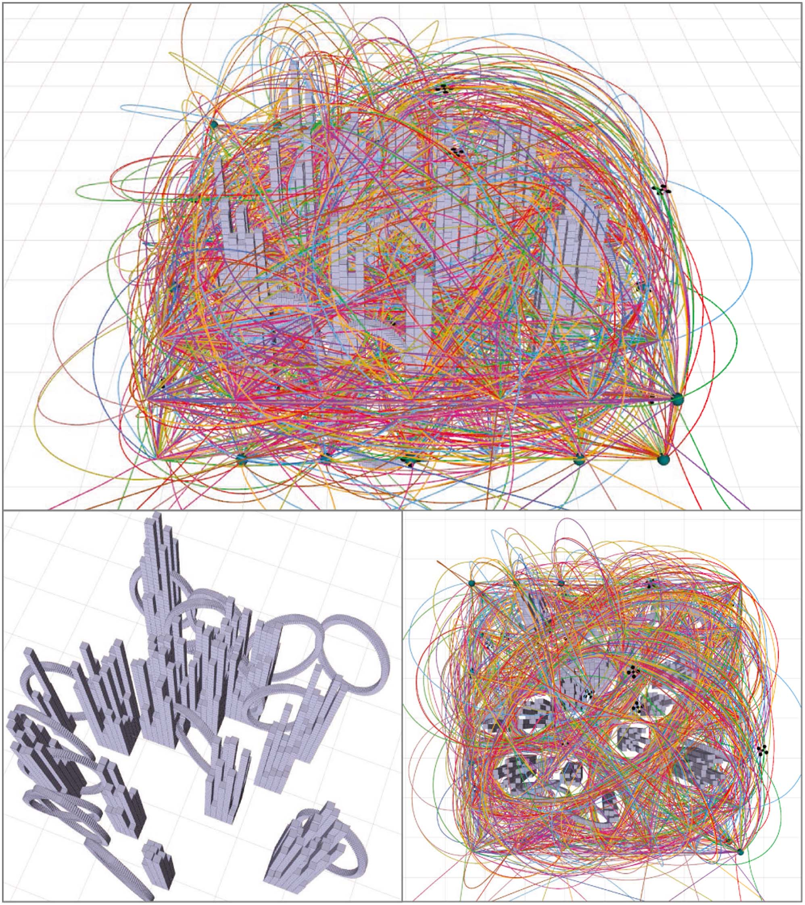

**图 20**：Fig. 20.
(a) Histogram of the flight time used to reach a goal. (b) Cases of
long flight time. Note that (a) and (b) are continuous on the horizontal axis. (c)
Histogram of the flight velocity sampled at 10 Hz. (d) Goal number reached
during the flight. Note that we omitted the legend, as the trends of all curves are
essentially consistent.

large-scale fully autonomous swarms consisting of 1000 drones
navigating in unknown environments. Since each robot needs
hundreds of megabytes of memory for simulated obstacle sens-
ing and a lot computing for simulated drone motion in real time,
we conduct this experiment on a high-performance cloud work-
station of model ecs.hfg6.20xlarge.4 Its CPU contains 80 virtual
cores running on Intel Xeon Platinum 8269CY and the memory
size is 384 GB. Each robot runs in independent robot operation
system (ROS) nodes to maximize the similarity to real-world
deployment. In this evaluation, we replace the simulated depth
map with point cloud acquired around each robot below 5 m
distance, because depth rending consumes huge amount of GPU
computing that only supercomputers can afford but will only
make very slight differences to the results of trajectory planning.
In other benchmark simulations and real-world experiments, the
trajectories are shared via the loopback network and wireless
network, respectively. However, in this large-scale simulation,
we use interprocess memory sharing to share the trajectories as
ROS can not support so many connections. The total CPU usage
during the flight is about 80% .

**图 21**：Fig. 21 illustrates the entire process of trajectory planning
for 1000 drones, which perform position exchange on a 300-
m-radius circle to maximize the collision avoidance. The initial
spacing between adjacent drones is 1.88 m. Velocity limit is set
to 1 m/s, primitive length l is set to 6 m, with Dangle = 15◦and
Na = 15, which result in the number of primitives Nt = 361.
The radius of the drone rrobot is 0.15 m. The corresponding video
is The 1000-Drone Position Swap. (f)–(g) are the maximum
or minimum values among all the drones at each timestamp.
Fig. 21(f) indicates that as all drones converge toward the center

4[Online].
Available:
https://www.alibabacloud.com/solutions/sap?spm=
a3c0i.23458820.2359477120.13.61d67d3fDISyrx
Authorized licensed use limited to: National Institute of Technology- Delhi. Downloaded on August 24,2026 at 05:45:47 UTC from IEEE Xplore.  Restrictions apply.

---

## 原文第 17 页核心内容与翻译

HOU et al.: PRIMITIVE-SWARM: AN ULTRA-LIGHTWEIGHT AND SCALABLE PLANNER FOR LARGE-SCALE AERIAL SWARMS
3645
(a)
(c)
(d)
(e)
(f)
(g)
(h)
(b)

**图 21**：Fig. 21.
1000-drone position swap in cluttered environment. (a)–(e) Procedure of the flight. (f) Minimum-to-maximum number of nearby drones within a 20-m
radius around each drone. (g) Minimum distance to obstacles of all the drones at each timestamp. (h) Minimum-to-maximum drone-to-drone distance of each drone
at every timestamp.

of the circle, the number of drones around each one gradually
increases, reaching a peak of 1000 at the vicinity of the center
around the 300 s timestamp. For the drones at the outermost
edge, there are still at least 500 drones within a 20-m radius.
This situation implies the most challenging inter-robot collision
avoidance. Even under such a dense distribution of obstacles and
drones, the planner managed to keep a safe distance to obstacles
and other robots, as shown in Fig. 21(g) and (h). The minimum
distance in (h) is 0.293 m, which is slightly shorter than the
0.3 m inter-robot safe clearance defined as twice the radius of
the drone. This indicates that the current drone density is nearly
reaching the upper limit of the planner’s capabilities. In (h), the
maximum inter-robot distance reduces to about 2.5 m near the
timestamp of 300s. In fact, for a global optimal solution, both
the maximum and minimum distance should be close to the
0.3 m spacing constraint. This implies that all drones achieve
the densest arrangement, which also means the shortest flight
distance. In contrast, the proposed method in this article, being
a real-time planning algorithm, only has local environmental
information within a few seconds into the future, hence, the
generated trajectories are relatively conservative.
In Fig. 1, we conduct another test where drones are separated
into 5 layers. The start and the goal points are both located on
the circle with a radius of 300 m. The quasi-linear appearance of
accumulated trajectories stems from the vast scale disparity be-
tween the experimental area and drones. In addition, each drone
dynamically selects collision-free trajectories from our motion
primitive library in real time. The total flight processes can be
observed in the attached video. The results demonstrate that our
proposed method excels in swarm scalability, showcasing its
potential for handling large-scale swarm scenarios effectively.
For optimization-based methods that necessitates providing a
well-defined initial guess for nonlinear trajectory optimization
in nonconvex freespace, as the number of drones increases along
with their trajectories, the environment becomes partitioned into
numerous subspaces, each with unique local minimum. This
division poses challenges in trajectory optimization, especially
in determining a suitable initial guess, making it difficult to
find a suitable local minimum or even just a safe solution.
Consequently, the scalability of swarms becomes constrained.
In contrast, the proposed method operates directly on the raw
point cloud without the need for additional environment repre-
sentation and obstacle inflation. Moreover, collision checking
and the linear complexity trajectory selection are completely
decoupled, ensuring that they do not affect each other. This
allows for the use of a big motion primitive library to cover
the entire reachable space simultaneously, greatly enhancing the
scalability of the swarm. As a result, our swarm algorithm is
ultra-lightweight and well-suited for deployment in large-scale
swarms.
G. Real-World Experiments
We conduct real-world experiments to validate the proposed
method in both single-robot and swarm scenarios. The planning
algorithmisdeployedonSWaPconstrainedquadrotorplatforms.
Authorized licensed use limited to: National Institute of Technology- Delhi. Downloaded on August 24,2026 at 05:45:47 UTC from IEEE Xplore.  Restrictions apply.

---

## 原文第 18 页核心内容与翻译

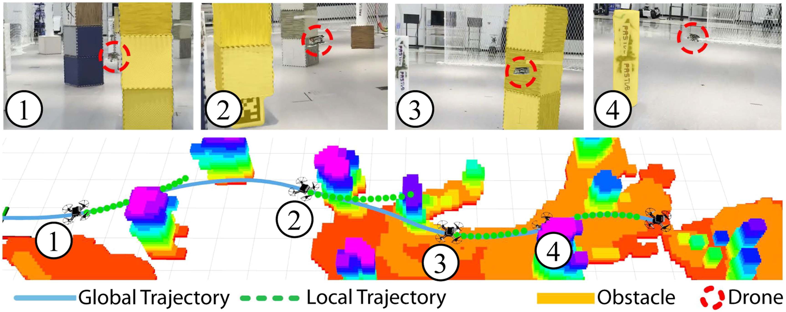

**图 22**：Fig. 22.
Single-robot real-world experiment. The SWaP constrained quadrotor rapidly navigates through a series of obstacles one by one, achieving a maximum
expected speed of 2 m/s using time-optimal primitives.

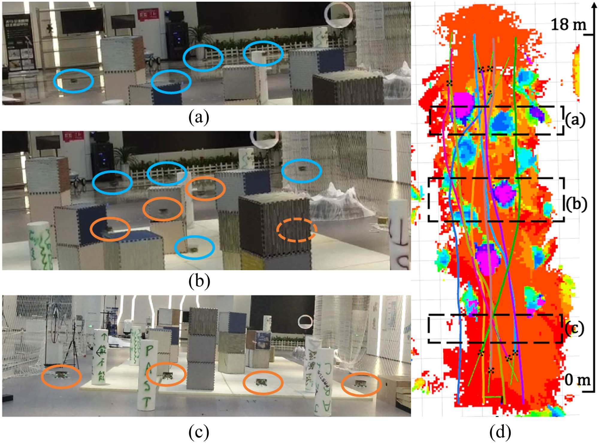

**图 23**：Fig. 23.
Swarm real-world experiment. Colored ellipses indicate the positions
of quadcopters. The orange ellipses mark the four drones that fly forward
and the blue ellipses mark the four drones that fly backward. The orange
dashed ellipse represents a quadcopter behind an obstacle. The dashed box
indicatesthescreenshotlocation.Coloredcurvesdepicttheexecutedtrajectories.
(a) Screenshot of four qudarotors on the back side. (b) Screenshot of eight
quadrotors encountering. (c) Screenshot of four qudarotors on the front side.
(d) Executed trajectories of all quadrotors.

An offline motion primitive library is generated, con-
taining 109 time-optimal and dynamically feasible trajec-
tories. The library parameters include Na = 7 arcs, dif-
ferent radii r ∈{2, 3, 4, 6, 8, 12, 20, 36, 78, ∞}m, length l =
3m,
different
start
angles
θ ∈{0◦, −10◦, −20◦, 0◦, −10◦,
−20◦, 0◦, −10◦, −20◦, 0◦}, and rotation angle interpolation
Dangle = 30◦. The environments consist of various obstacles
randomly placed, including cubes and cylinders, with an average
distance of around 1 m between them, creating challenging
navigation scenarios for the quadrotors, especially in swarm
experiments. Importantly, all experiments are conducted without
using any external localization or computing devices. All state
estimation, planning, control, and communication modules run
solely on the onboard computer. Each quadrotor independently
and asynchronously executes planning tasks in unknown en-
vironments, maintaining a decentralized autonomous system
architecture.
1) Single-Robot Experiments: We perform two single-robot
autonomous navigation experiments with quadrotors, setting the
speed and acceleration limits to 2 m/s and 6 m/s2, respectively.
In the indoor experiment, the quadrotor’s global goal is set
18 m ahead. It rapidly avoids obstacles one by one at a speed
of almost 2 m/s. Fig. 22 displays screenshots capturing the
entire flight process. In the outdoor experiment, the quadrotor’s
global goal is set 40 m ahead. It successfully avoids multiple
trees at an approximate speed of 2 m/s in an unknown natural
environment. The results is in the attached video. These two
experimentsdemonstratethepracticalityoftheproposedmethod
in single-robot autonomous navigation.
2) Swarm Experiments: In the swarm real-world navigation
experiments, we set the maximum speed and acceleration of
each quadrotor to 1 m/s and 3 m/s2, respectively. We conduct
a bidirectional cross-flight experiment as depicted in Fig. 23.
Four drones fly toward the goal of the 18 m in front and four
drones fly back, they will cross in the middle of the scenario.
The screenshots of their start and encountering positions are
shown in Fig. 23(a)–(c), and the trajectories of all quadrotors are
presented in Fig. 23(d). Fig. 23(a)–(c) illustrates screenshots of
their starting and encountering positions, and Fig. 23(d) presents
the trajectories of all quadrotors. They fly toward their respective
goalsatanapproximatespeedof1 m/s.Theexperimentconfirms
the practicality of the proposed planner in swarm scenarios.
## IX. 结论
For time and space consumption in simulations and exper-
iments, the offline generation process of the motion primitive
librarytakesabout38.6sandoutputsa75.3MB motionprimitive
library when Nt = 109. This library size is easily accommo-
dated in modern RAM with several gigabytes of storage. In
practice, only the occupancy relationship Ro, Rt, and other
essential information like the end position pend need to be
loaded into RAM for fast access. The majority of the library
that describes the exact shape of each trajectory can be stored in
low-speed and cheap storage such as an SD card.
In the multiagent literature, movement oscillation caused by
deadlock is a common issue [13], [41], where agents generate
commands for each robot itself without having a high-level
Authorized licensed use limited to: National Institute of Technology- Delhi. Downloaded on August 24,2026 at 05:45:47 UTC from IEEE Xplore.  Restrictions apply.

---

## 原文第 19 页核心内容与翻译

HOU et al.: PRIMITIVE-SWARM: AN ULTRA-LIGHTWEIGHT AND SCALABLE PLANNER FOR LARGE-SCALE AERIAL SWARMS
3647
coordination. Fortunately however, this issue is naturally mit-
igated by our method, owing to real-world randomness, asyn-
chronously triggered planning, and a wide space coverage of our
trajectory representation. Similarly, deadlock is also reported to
hardly occur in other trajectory planning methods [5], [42] in
normal situations.
Acceleration discontinuity is a flaw of this work, which arises
because replanning can be triggered at any time, and the accel-
eration at that moment cannot be anticipated when generating
motion primitives. A feasible solution to achieve continuity is
to disallow triggering replanning at any time and only allow
switching to the next primitive after the execution of the current
primitive is completed, while also fixing the derivatives of the
initial and final states of all primitives to be some predefined
common values. However, the cost of this strategy is a slower
response of the planner to dynamic environments.
综上，本文提出了一种面向大规模自主空中集群的超轻量、可扩展规划器。该规划器将高维轨迹生成问题转换为若干线性复杂度的选择问题，从而尽量降低在线计算开销，并能够部署到最多容纳 1000 架机器人的大规模集群中。
REFERENCES
[1] G.-Z. Yang et al., “The grand challenges of science robotics,” Sci. Robot.,
vol. 3, no. 14, 2018, Art. no. eaar7650.
[2] J. Park, J. Kim, I. Jang, and H. J. Kim, “Efficient multi-agent trajectory
planning with feasibility guarantee using relative bernstein polynomial,”
in Proc. IEEE Int. Conf. Robot. Autom., 2020, pp. 434–440.
[3] J. Tordesillas and J. P. How, “MADER: Trajectory planner in multia-
gent and dynamic environments,” IEEE Trans. Robot., vol. 38, no. 1,
pp. 463–476, Feb. 2022.
[4] X. Zhou, J. Zhu, H. Zhou, C. Xu, and F. Gao, “Ego-swarm: A fully
autonomous and decentralized quadrotor swarm system in cluttered envi-
ronments,” in Proc. IEEE Int. Conf. Robot. Autom., 2021, pp. 4101–4107.
[5] X. Zhou et al., “Swarm of micro flying robots in the wild,” Sci. Robot.,
vol. 7, no. 66, 2022, Art. no. eabm5954.
[6] K. Kondo, R. Figueroa, J. Rached, J. Tordesillas, P. C. Lusk, and J. P. How,
“Robust MADER: Decentralized multiagent trajectory planner robust to
communication delay in dynamic environments,” IEEE Robot. Autom.
Lett., vol. 9, no. 2, pp. 1476–1483, Feb. 2024.
[7] S. Liu, K. Mohta, N. Atanasov, and V. Kumar, “Towards search-based
motion planning for micro aerial vehicles,” 2018, arXiv:1810.03071.
[8] V. K. Adajania, S. Zhou, A. K. Singh, and A. P. Schoellig, “Amswarmx:
Safeswarmcoordinationincomplexenvironmentsviaimplicitnon-convex
decomposition of the obstacle-free space,” in Proc. IEEE Int. Conf. Robot.
Autom., 2024, pp. 14555–14561.
[9] C. W. Reynolds, “Flocks, herds and schools: A distributed behavioral
model,” in Proc. 14th Annu. Conf. Comput. Graph. Interactive Techn.,
1987, pp. 25–34.
[10] G. Vásárhelyi, C. Virágh, G. Somorjai, T. Nepusz, A. E. Eiben, and T.
Vicsek, “Optimized flocking of autonomous drones in confined environ-
ments,” Sci. Robot., vol. 3, no. 20, 2018, Art. no. eaat3536.
[11] P. Fiorini and Z. Shiller, “Motion planning in dynamic environments
using velocity obstacles,” Int. J. Robot. Res., vol. 17, no. 7, pp. 760–772,
1998.
[12] J. Van den Berg, M. Lin, and D. Manocha, “Reciprocal velocity obstacles
for real-time multi-agent navigation,” in Proc. IEEE Int. Conf. Robot.
Autom., 2008, pp. 1928–1935.
[13] J. Van Den S. J. Berg M. Guy Lin, and D. Manocha, “Reciprocal n-body
collision avoidance,” in Proc. Robot. Res.: 14th Int. Symp., 2011, pp. 3–19.
[14] F. Augugliaro, A. P. Schoellig, and R. D’Andrea, “Generation of collision-
free trajectories for a quadrocopter fleet: A sequential convex program-
ming approach,” in Proc. IEEE/RSJ Int. Conf. Intell. Robots Syst., 2012,
pp. 1917–1922.
[15] D. Mellinger, A. Kushleyev, and V. Kumar, “Mixed-integer quadratic
program trajectory generation for heterogeneous quadrotor teams,” in
Proc. IEEE Int. Conf. Robot. Autom., 2012, pp. 477–483.
[16] A. Kushleyev, D. Mellinger, C. Powers, and V. Kumar, “Towards a swarm
of agile micro quadrotors,” Auton. Robots, vol. 35, no. 4, pp. 287–300,
2013.
[17] W. Hönig, J. A. Preiss, T. S. Kumar, G. S. Sukhatme, and N. Ayanian,
“Trajectory planning for quadrotor swarms,” IEEE Trans. Robot., vol. 34,
no. 4, pp. 856–869, Aug. 2018.
[18] Y. Chen, M. Cutler, and J. P. How, “Decoupled multiagent path planning
via incremental sequential convex programming,” in Proc. IEEE Int. Conf.
Robot. Autom., 2015, pp. 5954–5961.
[19] C. E. Luis and A. P. Schoellig, “Trajectory generation for multiagent point-
to-point transitions via distributed model predictive control,” IEEE Robot.
Autom. Lett., vol. 4, no. 2, pp. 375–382, Apr. 2019.
[20] Z. Wang, X. Zhou, C. Xu, and F. Gao, “Geometrically constrained trajec-
tory optimization for multicopters,” IEEE Trans. Robot., vol. 38, no. 5,
pp. 3259–3278, Oct. 2022.
[21] J. Hou, X. Zhou, Z. Gan, and F. Gao, “Enhanced decentralized autonomous
aerial robot teams with group planning,” IEEE Robot. Autom. Lett., vol. 7,
no. 4, pp. 9240–9247, Oct. 2022.
[22] J. Zhang, C. Hu, R. G. Chadha, and S. Singh, “Falco: Fast likelihood-based
collision avoidance with extension to human-guided navigation,” J. Field
Robot., vol. 37, no. 8, pp. 1300–1313, 2020.
[23] M. Ryll, J. Ware, J. Carter, and N. Roy, “Efficient trajectory planning
for high speed flight in unknown environments,” in Proc. 2019 Int. Conf.
Robot. Autom., 2019, pp. 732–738.
[24] X. Yang, J. Cheng, and N. Michael, “An intention guided hierarchical
framework for trajectory-based teleoperation of mobile robots,” in Proc.
IEEE Int. Conf. Robot. Autom., 2021, pp. 482–488.
[25] M. Collins and N. Michael, “Efficient planning for high-speed mav flight
in unknown environments using online sparse topological graphs,” in Proc.
IEEE Int. Conf. Robot. Autom., 2020, pp. 11450–11456.
[26] P. Florence, J. Carter, and R. Tedrake, “Integrated perception and control
at high speed: Evaluating collision avoidance maneuvers without maps,”
in Algorithmic Foundations of Robotics XII. Berlin, Germany: Springer,
2020, pp. 304–319.
[27] M. W. Mueller, M. Hehn, and R. D’Andrea, “A computationally efficient
motion primitive for quadrocopter trajectory generation,” IEEE Trans.
Robot., vol. 31, no. 6, pp. 1294–1310, Dec. 2015.
[28] N. Bucki, J. Lee, and M. W. Mueller, “Rectangular pyramid partitioning
using integrated depth sensors (RAPPIDS): A fast planner for multicopter
navigation,” IEEE Robot. Autom. Lett., vol. 5, no. 3, pp. 4626–4633,
Jul. 2020.
[29] D. Mellinger and V. Kumar, “Minimum snap trajectory generation and
control for quadrotors,” in Proc. IEEE Int. Conf. Robot. Autom., 2011,
pp. 2520–2525.
[30] S. Liu et al., “Planning dynamically feasible trajectories for quadrotors
using safe flight corridors in 3-D complex environments,” IEEE Robot.
Autom. Lett., vol. 2, no. 3, pp. 1688–1695, Jul. 2017.
[31] W. Sun, G. Tang, and K. Hauser, “Fast UAV trajectory optimization
using bilevel optimization with analytical gradients,” IEEE Trans. Robot.,
vol. 37, no. 6, pp. 2010–2024, Dec. 2021.
[32] A. Bry, C. Richter, A. Bachrach, and N. Roy, “Aggressive flight of fixed-
wing and quadrotor aircraft in dense indoor environments,” Int. J. Robot.
Res., vol. 34, no. 7, pp. 969–1002, 2015.
[33] M. Burri, H. Oleynikova, M. W. Achtelik, and R. Siegwart, “Real-time
visual-inertial mapping, re-localization and planning onboard mavs in
unknown environments,” in Proc. IEEE/RSJ Int. Conf. Intell. Robots Syst.,
2015, pp. 1872–1878.
[34] J.S.Vitter,“Fastermethodsforrandomsampling,”Commun.ACM,vol.27,
no. 7, pp. 703–718, 1984.
[35] M. Faessler, A. Franchi, and D. Scaramuzza, “Differential flatness of
quadrotor dynamics subject to rotor drag for accurate tracking of high-
speed trajectories,” IEEE Robot. Autom. Lett., vol. 3, no. 2, pp. 620–626,
Apr. 2018.
[36] H. Pham and Q.-C. Pham, “A new approach to time-optimal path param-
eterization based on reachability analysis,” IEEE Trans. Robot., vol. 34,
no. 3, pp. 645–659, Jun. 2018.
[37] R. Seidel, “Small-dimensional linear programming and convex hulls made
easy,” Discr. Comput. Geometry, vol. 6, no. 3, pp. 423–434, 1991.
[38] R. A. Brown, “Building a Balanced k-d Tree in O(kn log n) Time,” J.
Comput. Graph. Tech., vol. 4, no. 1, pp. 50–68, Mar. 2015.
[39] X. Zhou, Z. Wang, H. Ye, C. Xu, and F. Gao, “EGO-planner: An ESDF-free
gradient-based local planner for quadrotors,” IEEE Robot. Autom. Lett.,
vol. 6, no. 2, pp. 478–485, Apr. 2021.
Authorized licensed use limited to: National Institute of Technology- Delhi. Downloaded on August 24,2026 at 05:45:47 UTC from IEEE Xplore.  Restrictions apply.

---

## 原文第 20 页核心内容与翻译

[40] J. Ji, Z. Wang, Y. Wang, C. Xu, and F. Gao, “Mapless-planner: A robust
and fast planning framework for aggressiveautonomousflightwithout map
fusion,” in Proc. IEEE Int. Conf. Robot. Autom., 2021, pp. 6315–6321.
[41] J. A. DeCastro, J. Alonso-Mora, V. Raman, D. Rus, and H. Kress-Gazit,
“Collision-free reactive mission and motion planning for multi-robot
systems,” Robot. Res.: Vol. 1, pp. 459–476, 2018.
[42] J. Alonso-Mora, T. Naegeli, R. Siegwart, and P. Beardsley, “Collision
avoidance for aerial vehicles in multi-agent scenarios,” Auton. Robots,
vol. 39, pp. 101–121, 2015.
Jialiang Hou (Graduate Student Member, IEEE) re-
ceived the B.Eng. degree in process equipment and
control engineering from the East China University of
Science and Technology, Shanghai, China, in 2019.
He is currently working toward the Ph.D. degree in
computer application technology with Fudan Univer-
sity, Shanghai, China.
His research interests include motion planning for
aerial swarm robots and autonomous navigation.
Xin Zhou received the B.Eng. degree in electrical en-
gineering and automation from the China University
of Mining and Technology, Xuzhou, China, in 2019
and the Ph.D. degree in electronic information from
Zhejiang University, Hangzhou, China, in 2024.
HeiscurrentlyaPostdoctoralFellowwiththeHong
Kong University of Science and Technology, Hong
Kong. His research interests include motion planning
and mapping for aerial swarm robotics.
Neng Pan received the B.Eng. degree in control
engineering from Zhejiang University, Hangzhou,
China, in 2021 and the M.Eng degree in electronic
information engineering from Zhejiang University,
Hangzhou, China, in 2024.
He is currently a Robotic Engineer with Skysys
Technology Company, Ltd., Suzhou, China. His re-
search interests include UAV design, control, and
planning.
Ang Li received the B.S. degree in aircraft design
and engineering from Northwestern Polytechnical
University, Xian, China, in 2018. He is currently
working toward the Ph.D. degree in aircraft design
with Beihang University, Beijing, China.
His current interests include motion planning,
aerial swarm, and target tracking.
Yuxiang Guan received B.S. and M.Sc. degrees
in environment engineering from Keele University,
Staffordshire, U.K., in 2014 and 2015, respectively,
and the Ph.D. degree in electronic information engi-
neering from Fudan University, Shanghai, China, in
2025.
His current research interests include multiagent
dynamic and task scheduling and allocation.
Chao Xu (Senior Member, IEEE) received the Ph.D.
degree in mechanical engineering from Lehigh Uni-
versity, Bethlehem, PA, USA, in 2010.
He is currently an Associate Dean and Professor
with the College of Control Science and Engineering,
Zhejiang University, Hangzhou, China. He is also the
inaugural Dean of ZJU Huzhou Institute, Hangzhou,
China,aswellasplaystheroleoftheManagingEditor
for IET Cyber-Systems and Robotics. His research
expertise is Flying Robotics, Control-theoretic Learn-
ing. He has authored or coauthored more than 100
papers in international journals, including Science Robotics, Nature Machine
Intelligence, etc.
Zhongxue Gan received the Ph.D. degree in mechan-
ical engineering from the University of Connecticut,
Mansfield, CT, USA, in 1993.
He was a Research Fellow of ABB company,
Zurich, Switzerland, during 1990–2005, and he was
promoted to Chief Scientist of ABB Global Robotics
and flexible Automation in 2002. From 2006 to 2014,
he was a Chief Scientist and Vice Chairman of the
Board with ENN Group, Langfang, China. Since
2017, he has been a Distinguished Professor with
Fudan University, Shanghai, China, and been the
Dean of Institute of AI and Robotics, Fudan University.
Dr. Gan was the recipient of China International Science and Technology
Cooperation Award by Ministry of Science and Technology of the People’s
Republic of China, in 2010.
Fei Gao (Member, IEEE) received the Ph.D. degree in
electronic and computer engineering from the Hong
Kong University of Science and Technology, Hong
Kong, in 2019.
He is currently a tenured Associate Professor with
the Department of Control Science and Engineer-
ing, Zhejiang University, Hangzhou, China, where he
leads the Flying Autonomous Robotics (FAR) group
affiliated with the Field Autonomous System and
Computing (FAST) Laboratory. His research interests
include aerial robots, autonomous navigation, motion
planning, optimization, and localization and mapping.
Authorized licensed use limited to: National Institute of Technology- Delhi. Downloaded on August 24,2026 at 05:45:47 UTC from IEEE Xplore.  Restrictions apply.

---
