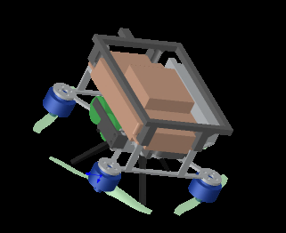
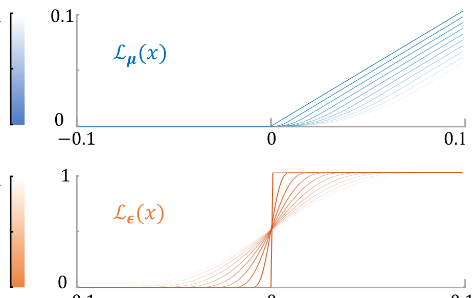
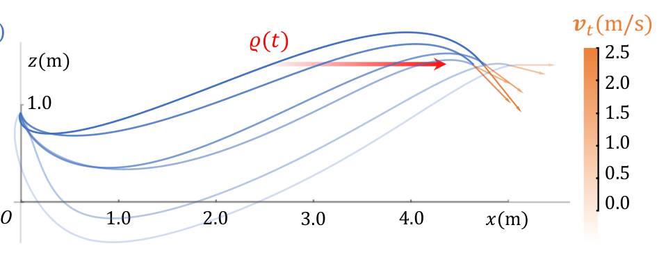
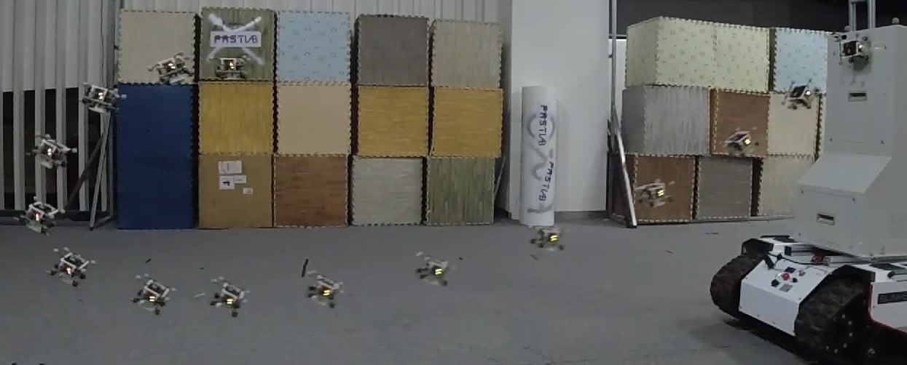
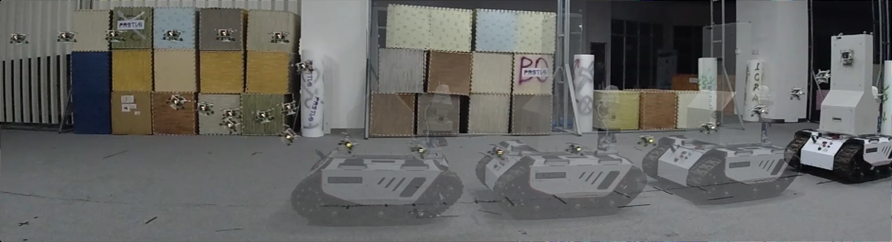
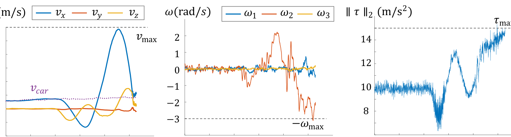
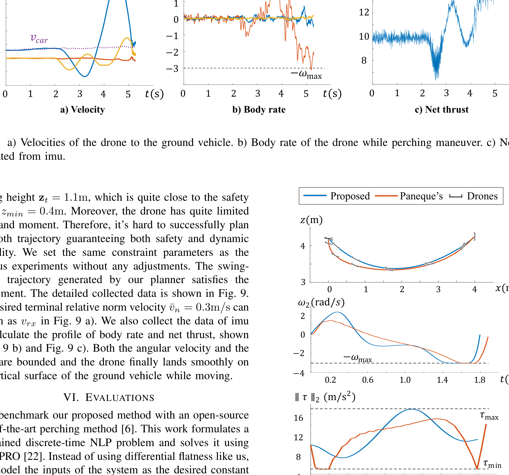
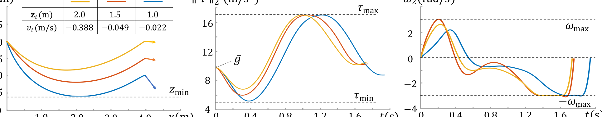

# 实时空中停泊轨迹规划（Real-Time Trajectory Planning for Aerial Perching）：完整忠实学术翻译

> **原文标题**：Real-Time Trajectory Planning for Aerial Perching  
> **作者**：Jialin Ji, Tiankai Yang, Chao Xu, Fei Gao  
> **发表信息**：详见原文  
> **原文 PDF**：[Real-Time Trajectory Planning for Aerial Perching.pdf](../Real-Time Trajectory Planning for Aerial Perching.pdf) ｜ **对应中文详解**：[29_实时空中停泊轨迹规划.md](../中文详解/29_实时空中停泊轨迹规划.md)  

---

## 原文第 1 页核心内容与翻译

实时空中停泊轨迹规划
Jialin Ji, Tiankai Yang, Chao Xu, and Fei Gao
跟踪阶段
停泊阶段

**图 1**：移动平台垂直表面上的空中停泊。无人机首先跟踪地面车辆（红色），接收到触发信号后规划并执行停泊轨迹（蓝色）。由于无人机的推重比很低（1.7）且接近地面，规划器生成摆动形轨迹，以同时保证安全性和动力学可行性。

摘要——本文提出一种新的空中停泊轨迹规划方法。与已有工作相比，本文能够自适应地调整终端状态和轨迹持续时间，而不是预先确定二者。此外，在满足安全性和动力学可行性的前提下，规划器能够最小化切向相对速度。这一特性对于机动能力较低的微型空中机器人，或可用空间不足的场景尤其重要。我们还设计了灵活的变换策略，在减少优化变量的同时消除终端约束。另外，本文考虑精确的 SE(3) 运动规划，确保无人机直到最后时刻才接触停泊平台。所提方法在机载计算机上通过掌尺寸微型空中机器人进行了验证：该机器人推力和力矩均十分有限（推重比为 1.7），并在移动倾斜表面上完成停泊。充分的实验结果表明，规划器可在 20 ms 内生成最优轨迹，并在 2 ms 内通过热启动重新规划。
I. 引言
自主空中机器人凭借重量轻、灵敏度高和机动性强等优势，已广泛应用于诸多领域。然而，有效载荷和飞行时间有限，严重制约了这些优势的发挥。一些研究人员研究了在各种表面上着陆和停泊的方法，使无人机在执行监测、采样或充电任务时降低能耗。这些工作能够将机器人引导至目标，并在运动过程中调整其姿态。
本工作得到国家自然科学基金项目（批准号：62003299、62088101）资助。
浙江大学控制科学与工程学院工业控制技术国家重点实验室，浙江杭州 310027；浙江大学湖州研究院，浙江湖州 313000。
Email: {jlji, fgaoaa}@zju.edu.cn
通信作者：Fei Gao。
然而，这些方法通常预先设定机器人的期望终端位姿和速度；当可用空间不足时，这可能导致动力学不可行。此外，它们难以同时处理复杂约束并实现较高的计算效率。总体而言，规划最优停泊轨迹仍有三个难以解决的要求：
1) 终端状态调整：为获得更大的优化自由度，飞行持续时间和机器人的终端状态都应自适应调整，而不应预先确定。
2) 碰撞避免：无人机直到最后时刻才允许接触停泊平台，这要求进行 SE(3) 运动规划。
3) 高频重规划：由于感知扰动或自身运动会导致停泊点变化，因此必须频繁重规划。
本文提出一种有效的联合优化方法 1，能够生成满足上述全部要求的时空最优轨迹。该方法将显著增强停泊能力，尤其适用于地面车辆或飞行载体等移动平台上的停泊。要实现完美停泊，着陆瞬间相对于表面的切向速度应为零，以避免擦伤表面。
现有大多数停泊系统会根据不同的停泊机构设定固定的期望终端速度：夹爪机构为零速度 [1]–[6]，吸盘 [7, 8] 和黏附机构 [9]–[14] 则需要较大的法向速度。然而，这种约束要求无人机提前俯冲；当空间不足时，容易与地面发生碰撞。这一
1https://github.com/ZJU-FAST-Lab/Fast-Perching
2022 IEEE/RSJ International Conference on Intelligent Robots and Systems (IROS)
October 23-27, 2022, Kyoto, Japan
2022 IEEE/RSJ International Conference on Intelligent Robots and Systems (IROS) | 978-1-6654-7927-1/22/$31.00 ©2022 IEEE | DOI: 10.1109/IROS47612.2022.9981489
Authorized licensed use limited to: National Institute of Technology- Delhi. Downloaded on August 24,2026 at 05:48:51 UTC from IEEE Xplore.  Restrictions apply.

---

## 原文第 2 页核心内容与翻译

现象在机动能力有限的微型 UAV 中更为常见。为解决这一问题，我们设计了灵活的终端变换，在保证安全性和动力学可行性的前提下最小化切向相对速度。对于与移动目标的碰撞，现有大多数方法 [15] 检测包围空中机器人的包围体与停泊平台定义的无限平面之间的交集。然而，这种近似会使生成的轨迹过于保守。为此，我们将移动平台建模为圆盘，并且仅当机器人落入该圆盘投影范围时，才约束机器人位于平台的停泊侧。我们设计了一种数值技术，将这一复杂的混合整数非线性问题转化为更简单的形式。
本文贡献概括如下：
1) 提出一种高度通用的最优轨迹生成方法，用于在移动倾斜表面上停泊。
2) 设计机器人与移动平台之间动态碰撞避免的一般解析形式，充分考虑 SE(3) 运动规划。
3) 引入灵活的终端变换，从而消除复杂约束，并自适应调整终端状态，以同时保证安全性和动力学可行性。
4) 充分的仿真和真实实验验证了实现方法的性能。规划可在 20 ms 内完成，采用热启动的重规划耗时少于 2 ms。
II. 相关工作
以往大多数工作 [7]–[14] 研究在垂直墙面上的停泊，通常设计吸盘或黏附夹爪等专用机构，使机器人利用规定的终端法向速度附着在玻璃或瓷砖等光滑表面上。另有一些工作 [1]–[6] 关注在圆柱体或电缆上的停泊：机器人悬停并逐渐接近目标，然后利用爪子或类似夹具停泊。
许多现有方法 [9, 13, 14] 使用分段多项式对轨迹进行参数化，并在平坦输出空间中执行规划。这种方法构造的问题更易求解，但难以设置非线性约束。Thomas 等人 [13] 提出了一种四旋翼规划与控制策略，并设计了定制的干式黏附夹爪，以满足在光滑表面上停泊所需的条件。该方法充分考虑执行器约束，并利用一系列线性近似构造二次规划（QP）。这种方法无法调整轨迹的飞行时间，而且线性化过程过于简化。Mao 等人 [14] 同样构造了一个 QP，用于约束终端状态和速度边界。他们迭代增加轨迹时间，并递归求解 QP，直到满足推力约束；这一过程比直接求解非线性规划（NLP）快得多。然而，该
𝑧𝑏
𝓟(𝑡)
移动平台
无人机
𝐞1
𝐞2
𝐞3

**图 3**：建模概览与符号定义。

方法无法用于限制角速度或其他复杂的非线性约束。此外，简单延长飞行时间也不一定能保证空中停泊的动力学可行性。
其他方法 [6, 15] 构造受约束的离散时间非线性模型预测控制（MPC），以满足复杂约束，但需要更多计算时间。Vlantis 等人 [15] 首次研究了四旋翼降落在倾斜移动平台上的问题。该方法设计空中机器人的控制输入，使其首先接近平台，同时保持平台位于相机视场内，最终降落在平台上。然而，这一复杂问题是在地面站上计算的，机器人机载运行的仅是低层控制器。此外，倾斜表面的坡度很小，因此降落难度并不高。Paneque 等人 [6] 针对电力线停泊构造了离散时间多重射击 NLP 问题，计算具备感知能力、无碰撞且满足动力学可行性的机动轨迹，引导机器人到达期望终端状态。值得注意的是，生成的机动轨迹同时考虑了停泊轨迹和后续恢复轨迹。然而，该方法同样存在计算时间过长的问题，也无法智能地调整终端状态。
III. 建模与符号说明
本文采用 [16] 针对四旋翼提出的简化动力学模型，其构型由平移 p ∈R3 和旋转 R ∈SO(3) 定义。平移动力学取决于重力加速度 ¯g 和推力 ˜f；转运动力学以机体角速度 ω ∈R3 作为输入。简化模型写为





τ = ˜fRe3/m,
¨p = τ −¯ge3,
˙R = Rˆω,
(1)
其中 τ 表示净推力，ei 是 I3 的第 i 列，ˆ· 表示向量叉乘的反对称矩阵形式。此外，我们将对称四旋翼的底部建模为
10517
Authorized licensed use limited to: National Institute of Technology- Delhi. Downloaded on August 24,2026 at 05:48:51 UTC from IEEE Xplore.  Restrictions apply.

---

## 原文第 3 页核心内容与翻译

圆盘，如图 3 所示，记为
C(t) =
n
x = R(t)B¯ru + c(t)
∥u∥≤1, u ∈R2
o
,
(2)
其中 B = (e1, e2) ∈R3×2，¯r 表示圆盘半径。用 ¯l 表示无人机质心到底部的长度，因此圆盘中心为 c(t) = p(t) −¯lzb(t)。设停泊平台的未来位置估计为 ϱ(t)，期望停泊表面的法向量记为 zd，则移动平台的停泊平面写为
P(t) =
n
aT x ≤b(t)
x ∈R3
o
,
(3)
其中 a = −zd，b(t) = aT ϱ(t)。利用微分平坦性，我们在多旋翼平坦输出空间中进行优化。本文采用 TMINCO [17]，一种最小控制量多项式轨迹类别。s 阶 TMINCO 实际上是具有固定边界条件的 2s 阶多项式样条。它从中间点 q 和时间分配 T 到样条系数 c 提供线性复杂度的光滑映射，记为 c = M(q, T)。该样条是经过 q 的 s 阶积分器的唯一控制量最小解。给定任意代价函数 F(c, T)，相应函数为 J(q, T) = F(M(q, T), T)。TMINCO 可由 ∂F/∂c 和 ∂F/∂T 以线性复杂度计算 ∂J/∂q 和 ∂J/∂T，随后高层优化器即可高效优化目标。
IV. 激进停泊规划
A. 问题表述
估计移动目标的未来运动 ϱ(t) 后，我们希望得到一条平滑、无碰撞且动力学可行的轨迹 p(t)，其终端速度和姿态与倾斜表面的相应状态一致。综合上述最优停泊要求，可得到如下问题：
min
p(t),T Jo =
Z T
0
∥p(s)(t)∥2dt + ρT,
(4a)
s.t. T > 0,
(4b)
p[s−1](0) = po,
(4c)
p(T) = ϱ(T) −¯lzd,
(4d)
zb(T) = zd,
(4e)
∥p(1)(t)∥≤vmax, ∀t ∈[0, T],
(4f)
∥ω(t)∥≤ωmax, ∀t ∈[0, T],
(4g)
τmin ≤∥τ(t)∥≤τmax, ∀t ∈[0, T],
(4h)
eT
3 p(t) ≥zmin, ∀t ∈[0, T],
(4i)
p(1)(T) = ϱ(1)(T)（理想情况下），
(4j)
C(t) ∈P(t) if ∥p(t) −ϱ(t)∥≤¯d,
(4k)
其中，式 (4a) 的代价函数权衡平滑性和激进程度。执行器约束包括式 (4f) 的速度、式 (4g) 的机体角速度和式 (4h) 的推力限制。式 (4i) 和式 (4k) 分别是针对地面和停泊平台的安全约束，
0.1
0
−0.1
0.1
0
−0.1
ℒ𝝐(𝑥)
ℒ𝝁(𝑥)
𝜖
0
0.1
𝜇
0
0.1
1
0.1
0
0

**图 4**：当 µ 和 ϵ 趋近于 0 时，精确罚函数 Lµ[·] 的 C2 平滑函数和光滑 logistic 函数 Lϵ[·] 趋近于理想形式。

其中 ¯d 表示停泊表面的尺寸。边界条件包括式 (4c) 的初始状态、式 (4d) 的终端位置、式 (4e) 的停泊姿态和式 (4j) 的终端相对速度。非理想条件下对式 (4j) 的修改将在 IV-D 中讨论。
我们采用 s = 4、N 段的 TMINCO，以获得最小 snap 和足够的优化自由度。于是，∂Jo/∂c 和 ∂Jo/∂T 的梯度可计算为
∂Jo
∂ci
=2
Z Ti
0
β(3)(t)β(3)(t)Tdt
!
ci,
(5a)
∂Jo
∂Ti
=cT
i β(3)(Ti)β(3)(Ti)Tci + ρ,
(5b)
其中 β(t) = (1, t, . . . , tN)T 是自然基。
B. 执行器约束
首先，净推力 τ(t) = p(2)(t) + ¯ge3 受式 (4h) 的约束。受 [18] 启发，可构造如下罚函数对其进行约束：
Gτ(t) = Lµ[∥τ(t)∥2 −τ 2
max] + Lµ[τ 2
min −∥τ(t)∥2],
(6)
其中，Lµ[·] 是精确罚函数的 C2 平滑形式，如图 4 所示，定义为
Lµ[x] =





0,
x ≤0,
(µ −x/2)(x/µ)3,
0 < x ≤µ,
x −µ/2,
x > µ.
(7)
其次，机体角速度 ω = RT(t)Ṙ(t) 的限制也可通过类似的罚函数进行约束：
Gω(t) = Lµ

∥ω(t)∥2 −τ 2
max

.
(8)
为避免奇异性并简化计算，我们利用 Hopf 纤维化 [19] 施加该约束，从而有
zb(t) = R(t)e3 = τ(t)/∥τ(t)∥2,
(9a)
˙zb(t) = fDN [τ(t)] p(3)(t),
(9b)
ω2
1 + ω2
2 = ∥˙zb∥,
(9c)
10518
Authorized licensed use limited to: National Institute of Technology- Delhi. Downloaded on August 24,2026 at 05:48:51 UTC from IEEE Xplore.  Restrictions apply.

---

## 原文第 4 页核心内容与翻译

根据简化动力学 [16]，zb 与推力方向一致，ωi 表示角速度 ω 的第 i 个分量。式 (9b) 中的函数 fDN[·] 定义为
fDN [x] =

I3 −xxT
xT x

/∥x∥2.
(10)
由于停泊过程中偏航角 ψ 变化很小，因此可以忽略 ω3。
最后，速度限制式 (4f) 的罚函数也可写为
Gv(t) = Lµ
h
∥p(1)(t)∥2 −v2
max
i
.
(11)
C. 碰撞避免
与前述约束类似，避免与地面碰撞的式 (4i) 可转换为如下罚函数：
Gg(t) = Lµ

z2
min −∥eT
3 p(t)∥2
.
(12)
根据 C(t)（式 (2)）和 P(t)（式 (3)）的定义，式 (4k) 中的约束 C(t) ∈ P(t) 等价于
aT (R(t)B¯ru + c(t)) −b(t) ≤0,
(13a)
sup
∥u∥≤1
aT (R(t)B¯ru) + aT c(t) −b(t) ≤0,
(13b)
¯r∥BT R(t)T a∥+ aT c(t) −b(t) ≤0.
(13c)
根据结合 Hopf 纤维化的微分平坦性 [19]，若记 zb = [a, b, c]T ∈ S2，则可写出满足 R(qabc)e3 = zb 的如下单位四元数 qabc：
qabc =
1
p
2(1 + c)




1 + c
−b
a
0



.
(14)
由此可得到不含偏航角的机器人旋转矩阵 R，因此
BT RT =
1 −
a2
1+c
−ab
1+c
−a
−ab
1+c
1 −
b2
1+c
−b
!
(15)
然而，只有当 ∥p(t) −ϱ(t)∥≤¯d，即无人机靠近平台时，才应启用式 (13c) 的约束。这构成了一个混合整数非线性规划问题。为此，我们设计光滑 logistic 函数 Lϵ[·]，将整数变量纳入非线性规划，其定义为
Lϵ[x] =









0,
x ≤−ϵ,
1
2ϵ4 (x + ϵ)3(ϵ −x),
−ϵ < x ≤0,
1
2ϵ4 (x −ϵ)3(ϵ + x) + 1,
0 < x ≤ϵ,
1,
x > ϵ,
(16)
其中 ϵ 是可调的正参数。于是，式 (4k) 的罚函数可写为
Gc(t) = Lµ [F1(t)] · Lϵ [F2(t)] ,
(17)
其中 F1(t) 和 F2(t) 定义为
F1(t) = ¯r∥BT R(t)T a∥+ aT c(t) −b(t),
(18a)
F2(t) = ∥p(t) −ϱ(t)∥2 −¯d2.
(18b)
2.5
1.5
0.5
0.0
1.0
2.0
𝑂
1.0
2.0
3.0
4.0
𝑥(m)
𝒑(𝑡)
𝑧(m)
𝜚(𝑡)
1.0

**图 5**：动力学可行性约束下、具有不同终端竖直速度 vt 的优化轨迹。vt 较小的轨迹会与地面碰撞。参数设置如下：着陆位置高度为 1.5 m，τmax = 17 m/s²，τmin = 5 m/s²，ωmax = 3 rad/s。

D. 灵活的终端变换
由于我们在平坦输出空间中规划轨迹，终端状态应由 p[s−1](T) 确定。因此，除终端位置式 (4d) 外，终端速度、加速度和 jerk 也需要优化或确定。理想情况下应满足式 (4j)，但空间不足时这一硬约束可能与式 (4i) 的碰撞避免约束冲突。如图 5 所示，在旋翼推力和角速度限制下，终端竖直速度为零的优化轨迹会撞地。因此，设定如下变换
p(1)(T) = ϱ(1)(T) −¯vnzd + Vvt,
(19)
其中 V = (v1, v2) ∈ R3×2，v1、v2 是垂直于 zb 的两个正交单位向量。期望法向相对速度 ¯vn 取决于停泊机构，切向相对速度 vt ∈ R2 成为新的优化变量，取代 p(1)(T)。同时引入正则项以最小化切向相对速度
Jt = ∥vt∥2.
(20)
终端姿态约束式 (4e) 等价于
τ(T)/∥τ(T)∥2 = zd.
(21)
考虑该约束和终端状态的推力限制，设计如下变换：
p(2)(T) = (τm + τr · sin(τf)) · zd −¯ge3,
(22)
其中 τm = (τmax + τmin)/2，τr = (τmax − τmin)/2。因此，用新的优化变量 τf ∈ R 替换 p(2)(T)，即可同时消除式 (4e) 和式 (4h) 的约束。对于终端加加速度，由于根据式 (9b) 它与终端角速度相关，因此应设 p(3)(T) = 0，以减小机器人接触平台时的相对角速度。
E. 其他实现细节
上述以罚函数表示的约束应在整条轨迹上满足。这些无限约束无法直接求解。受 [17] 启发，我们
可以利用积分将其转化为有限约束
10519
Authorized licensed use limited to: National Institute of Technology- Delhi. Downloaded on August 24,2026 at 05:48:51 UTC from IEEE Xplore.  Restrictions apply.

---

## 原文第 5 页核心内容与翻译

支架
磁铁
胶黏剂

**图 6**：实验中使用的四旋翼平台及停泊机构。

这些罚函数。为获得合理的近似，带梯度的时间积分罚函数 J⋆ 可通过以下方式容易地推导：
I⋆
i =Ti
κ
κi
X
j=0
¯ωjG⋆( j
κTi), J⋆=
M
X
i=1
I⋆
i ,
(23a)
∂J⋆
∂ci
=∂I⋆
i
∂G⋆
∂G⋆
∂ci
, ∂J⋆
∂Ti
= I⋆
i
Ti
+ j
κ
∂I⋆
i
∂G⋆
∂G⋆
∂t ,
(23b)
其中，整数 κ 控制求积的相对分辨率。(¯ω0, ¯ω1, . . . , ¯ωκi−1, ¯ωκi) =
(1/2, 1, · · · , 1, 1/2) 为遵循梯形法则的求积系数 [20]。
i = (1, 2, · · · , N) 表示第 i 段，j = (1, 2, · · · , κ)。
综上所述，我们将原问题转化为无约束非线性优化问题，其代价函数为
J = Jo +
X
w⋆J⋆, ⋆= {τ, ω, v, g, c, t},
(24)
其中 w⋆ 为各项代价的权重系数。
为提高优化效率并使时间均匀分配，我们令各段持续时间 Ti 相等，并采用
变换 T = eT ′ 消除约束式 (4b)。因此，优化变量现在为
T ′ ∈R, q ∈R3×N, vt ∈R2, τf ∈R.
(25)
我们将 vt 的初值设为 0，将 τf 的初值设为 (τmax + τmin)/2，并将 T ′
的初值设为 0。通过求解边值问题获得 q 的初始猜测。采用上述方法获得
所有优化变量的梯度后，再使用 L-BFGS [21] 高效求解该问题。
V. 停泊实验
由于我们的规划器适用于大多数主动式/被动式停泊装置，我们为实验设计了
一种简易的停泊机构，如图 6 所示。
该装置由一个可对铁质表面提供正压力的磁铁和一种可提供足够摩擦力的
胶黏剂组成。四旋翼平台重量为 0.36kg，推重比为 1.7。机载主计算机
采用 NVIDIA Jetson Xavier NX；四旋翼的状态估计由 PX4 Autopilot 根据
VICON 位姿和 IMU 数据，通过 EKF 计算得到。
a)
b)
c)

**图 7**：不同倾斜表面上的停泊实验。

我们采用基于 Hopf 纤维化 [19] 的控制器，以避免奇异性，并使规划与控制
中的姿态计算保持一致。
首先，我们在不同的静态倾斜表面上开展停泊实验，如图 7 所示。考虑到
控制和估计误差，我们将期望终端范数速度设为 ¯vn = 0.3m/s，以确保无人机
的磁铁能够在轨迹末端吸附到铁质表面上。其他约束参数设置为 vmax =
6m/s、τmin = 5m/s2、τmax = 15m/s2、ωmax = 3rad/s。可以看到，针对
不同的停泊任务，无人机能够规划出不同的轨迹：a) 距离 3m 的 45◦ 倾斜
表面；b) 人员举起的、任意朝向且距离 3m 的白板；c) 距离 2.5m 的垂直
表面。这些实验结果充分验证了我们方法的鲁棒性。
跟踪阶段
停泊阶段

**图 8**：动态实验的坐标系定义。

为验证规划器的自适应性，我们还开展了在运动平台倾斜表面上进行停泊的
实验，如图 8 所示。地面机器人以 0.6m/s 的速度向前运动，空中机器人
在其后方跟随（红色标记）。无人机接收到指令后，在机载计算机上规划停泊
轨迹，并以 10Hz 的频率进行重规划。无人机与地面车辆之间的水平距离
为 2.3m，而该
10520
Authorized licensed use limited to: National Institute of Technology- Delhi. Downloaded on August 24,2026 at 05:48:51 UTC from IEEE Xplore.  Restrictions apply.

---

## 原文第 6 页核心内容与翻译

10
8
12
14
0
2
4
1
3
5
𝑡(s)
𝜏max
∥𝜏∥2 (m/s2)
0
−3
0
2
4
1
2
−1
−2
1
3
5
𝜔(rad/𝑠)
−𝜔max
𝑡(s)
𝜔1
𝜔2
𝜔3
a) Velocity
b) Body rate
c) Net thrust
0
2
4
1
3
5
𝑡(s)
0
4
2
−2
𝑣(m/s)
𝑣𝑥
𝑣𝑦
𝑣𝑧
6
𝑣𝑐𝑎𝑟
𝑣max

**图 9**：a）无人机相对于地面车辆的速度；b）停泊过程中无人机的机体角速度；c）根据 IMU 计算得到的净推力。

着陆高度 zt = 1.1m，与安全高度 zmin = 0.4m 非常接近。此外，无人机的推力和力矩都相当有限。因此，很难成功规划出同时保证安全性和动力学可行性的平滑轨迹。我们未作任何调整，采用了与前述实验相同的约束参数。我们的规划器生成的摆动形轨迹满足要求。采集到的详细数据如图 9 所示。期望的终端相对范数速度 ¯vn = 0.3m/s 在图 9 a）中可表示为 vrx。我们还采集了 imu 数据，并计算了机体角速度和净推力曲线，如图 9 b）和图 9 c）所示。角速度和推力均受到约束，最终无人机在地面车辆运动的同时平稳地停泊到其垂直表面上。
VI. 评估
我们将本文方法与一种开源的先进停泊方法 [6] 进行基准比较。
我们将本文方法与一种开源的先进停泊方法 [6] 进行基准比较。该工作将问题表述为一个带约束的离散时间 NLP 问题，并使用 ForcesPRO [22] 求解。不同于本文采用微分平坦性的方法，该工作将系统输入建模为期望的恒定推力导数，并直接控制各个旋翼的推力。为公平比较两种方法，我们对每个电机的推力设置较宽松的约束，并将整体净推力约束设置为与本文相同，从而使文献 [6] 与本文的动力学模型相近。由于该方法面向感知感知和电力线停泊这一特定目标，我们移除了感知、碰撞避免及其他特定约束。同样地，我们也固定本文规划器的终端状态，并移除碰撞避免约束。机器人的初始位置和终端位置分别设为 (0, 0, 4.2) 和 (4.0, 0, 4.25)。此外，要求轨迹满足静止到静止（rest-to-rest）。我们为动力学约束设置相同的参数：vmax = 6m/s、τmin = 5m/s2、τmax = 17m/s2、ωmax = 3rad/s。
对于本文规划器，我们设 N = 10、κ = 16，这意味着约束被施加在 160 个小分段上。对于 Paneque 方法，我们设 N = 40，因此其分段相对更稀疏。以垂直表面情形为例，两种方法生成的轨迹对比如图 10 所示。
1
2
3
4
𝑥(m)
0
3
4
𝑧(m)
Proposed
Paneque’s
Drones
0.2
1.0
1.8
0.6
1.4
0
2
−2
−4
𝑡(s)
𝜔2(rad/𝑠)
−𝜔max
𝜏max
0.2
1.0
1.8
0.6
1.4
𝑡(s)
∥𝜏∥2 (m/s2)
𝜏min
12
16
8
4

**图 10**：Paneque 规划器与本文规划器在垂直表面停泊任务中生成的轨迹对比。

如图 10 所示，可以看出两条轨迹的持续时间和位置总体相近。由于离散时间 NLP 具有更多自由度，其控制输入可以快速变化，并且所需的控制量 更小。然而，由于离散分辨率有限，其推力和机体角速度不如本文方法平滑。
我们还评估了两种方法在不同坡度的倾斜表面上进行停泊时的计算时间。所有仿真实验均在配备 Intel Core i5-12600 CPU 的台式机上运行。如表 I 所示，本文方法所需的计算开销低得多。
此外，我们开展了若干仿真，以测试不同情况下终端状态的调整，结果如图 11 所示。
10521
Authorized licensed use limited to: National Institute of Technology- Delhi. Downloaded on August 24,2026 at 05:48:51 UTC from IEEE Xplore.  Restrictions apply.

---

## 原文第 7 页核心内容与翻译

𝐳𝑡(m)
2.0
1.5
1.0
𝑣𝑡(m/s)
−0.388
−0.049
−0.022
1.5
0.5
0
1.0
2.0
1.0
2.0
3.0
4.0
𝑧(m)
𝑥(m)
𝑧min
4
8
12
16
0
0.4
0.8
1.2
1.6
𝜏max
𝜏min
𝑡(s)
∥𝜏∥2 (m/s2)
𝑔
0
0.4
0.8
1.2
1.6
𝑡(s)
−4
−2
0
2
𝜔max
−𝜔max
𝜔2(rad/𝑠)
2.5

**图 11**：用于测试不同情况下终端状态调整的仿真。

表 I：计算时间对比
方法
平均计算时间（ms）
−70◦
−90◦
−110◦
本文方法
1.47251
4.60674
17.7263
Paneque 方法
257.533
101.450
81.520

**图 11**：当着陆位置高度 zt 从 2.0 m 降低到 1.0 m 时，为同时保证安全性和可行性，生成轨迹的切向速度 vt 随之增大。

VII. 结论与未来工作
本文提出了一种用于运动倾斜表面空中停泊的高通用性轨迹规划框架。
本文提出了一种用于在运动倾斜表面上进行空中停泊的高通用性轨迹规划框架。本文方法针对动态碰撞避免进行 SE(3) 运动规划，并能够在空间不足时自适应调整终端状态。充分的实验和基准比较验证了规划器的鲁棒性。由于无人机倒置时 Hopf 纤维化存在奇异性，本文方法无法直接用于这一特殊情况。未来，我们将改进该方法以解决这一问题。此外，我们还将把该方法扩展到自主停泊，使状态估计和目标检测完全由机载传感器获得。
REFERENCES
[1] W. Chi, K. Low, K. H. Hoon, and J. Tang, “An optimized perching
mechanism for autonomous perching with a quadrotor,” in 2014 IEEE
international conference on robotics and automation (ICRA).
IEEE,
2014, pp. 3109–3115.
[2] J. Thomas, G. Loianno, K. Daniilidis, and V. Kumar, “Visual servoing
of quadrotors for perching by hanging from cylindrical objects,” IEEE
robotics and automation letters, vol. 1, no. 1, pp. 57–64, 2015.
[3] K. M. Popek, M. S. Johannes, K. C. Wolfe, R. A. Hegeman, J. M.
Hatch, J. L. Moore, K. D. Katyal, B. Y. Yeh, and R. J. Bamberger,
“Autonomous grasping robotic aerial system for perching (agrasp),”
in 2018 IEEE/RSJ International Conference on Intelligent Robots and
Systems (IROS).
IEEE, 2018, pp. 1–9.
[4] K. Hang, X. Lyu, H. Song, J. A. Stork, A. M. Dollar, D. Kragic, and
F. Zhang, “Perching and resting—a paradigm for uav maneuvering
with modularized landing gears,” Science Robotics, vol. 4, no. 28, p.
eaau6637, 2019.
[5] W. Roderick, M. Cutkosky, and D. Lentink, “Bird-inspired dynamic
grasping and perching in arboreal environments,” Science Robotics,
vol. 6, no. 61, p. eabj7562, 2021.
[6] J. L. Paneque, J. R. Martinez-de Dios, A. Ollero, D. Hanover, S. Sun,
A. Romero, and D. Scaramuzza, “Perception-aware perching on
powerlines with multirotors,” IEEE Robotics and Automation Letters,
2022.
[7] H. Tsukagoshi, M. Watanabe, T. Hamada, D. Ashlih, and R. Iizuka,
“Aerial manipulator with perching and door-opening capability,” in
2015 IEEE International Conference on Robotics and Automation
(ICRA).
IEEE, 2015, pp. 4663–4668.
[8] C. C. Kessens, J. Thomas, J. P. Desai, and V. Kumar, “Versatile
aerial grasping using self-sealing suction,” in 2016 IEEE international
conference on robotics and automation (ICRA).
IEEE, 2016, pp.
3249–3254.
[9] D. Mellinger, N. Michael, and V. Kumar, “Trajectory generation
and control for precise aggressive maneuvers with quadrotors,” The
International Journal of Robotics Research, vol. 31, no. 5, pp. 664–
674, 2012.
[10] L. Daler, A. Klaptocz, A. Briod, M. Sitti, and D. Floreano, “A perching
mechanism for flying robots using a fibre-based adhesive,” in 2013
IEEE International Conference on Robotics and Automation.
IEEE,
2013, pp. 4433–4438.
[11] E. W. Hawkes, D. L. Christensen, E. V. Eason, M. A. Estrada,
M. Heverly, E. Hilgemann, H. Jiang, M. T. Pope, A. Parness, and M. R.
Cutkosky, “Dynamic surface grasping with directional adhesion,” in
2013 IEEE/RSJ International Conference on Intelligent Robots and
Systems.
IEEE, 2013, pp. 5487–5493.
[12] A. Kalantari, K. Mahajan, D. Ruffatto, and M. Spenko, “Autonomous
perching and take-off on vertical walls for a quadrotor micro air
vehicle,” in 2015 IEEE International Conference on Robotics and
Automation (ICRA).
IEEE, 2015, pp. 4669–4674.
[13] J. Thomas, M. Pope, G. Loianno, E. W. Hawkes, M. A. Estrada,
H. Jiang, M. R. Cutkosky, and V. Kumar, “Aggressive flight with
quadrotors for perching on inclined surfaces,” Journal of Mechanisms
and Robotics, vol. 8, no. 5, p. 051007, 2016.
[14] J. Mao, G. Li, S. Nogar, C. Kroninger, and G. Loianno, “Aggres-
sive visual perching with quadrotors on inclined surfaces,” in 2021
IEEE/RSJ International Conference on Intelligent Robots and Systems
(IROS).
IEEE, 2021, pp. 5242–5248.
[15] P. Vlantis, P. Marantos, C. P. Bechlioulis, and K. J. Kyriakopoulos,
“Quadrotor landing on an inclined platform of a moving ground
vehicle,” in 2015 IEEE International Conference on Robotics and
Automation (ICRA).
IEEE, 2015, pp. 2202–2207.
[16] M. W. Mueller, M. Hehn, and R. D’Andrea, “A computationally
efficient motion primitive for quadrocopter trajectory generation,”
IEEE transactions on robotics, vol. 31, no. 6, pp. 1294–1310, 2015.
[17] Z. Wang, X. Zhou, C. Xu, and F. Gao, “Geometrically constrained tra-
jectory optimization for multicopters,” IEEE Transactions on Robotics,
pp. 1–20, 2022.
[18] Z. Wang, C. Xu, and F. Gao, “Robust trajectory planning for spatial-
temporal multi-drone coordination in large scenes,” arXiv preprint
arXiv:2109.08403, 2021.
[19] M. Watterson and V. Kumar, “Control of quadrotors using the hopf
fibration on so (3),” in Robotics Research.
Springer, 2020, pp. 199–
215.
[20] W. H. Press, S. A. Teukolsky, W. T. Vetterling, and B. P. Flannery,
Numerical recipes 3rd edition: The art of scientific computing.
Cam-
bridge university press, 2007.
[21] D. C. Liu and J. Nocedal, “On the limited memory bfgs method for
large scale optimization,” Mathematical programming, vol. 45, no. 1,
pp. 503–528, 1989.
[22] A. Domahidi and J. Jerez, “Forces professional,” Embotech AG,
url=https://embotech.com/FORCES-Pro, 2014–2019.
10522
Authorized licensed use limited to: National Institute of Technology- Delhi. Downloaded on August 24,2026 at 05:48:51 UTC from IEEE Xplore.  Restrictions apply.

---
