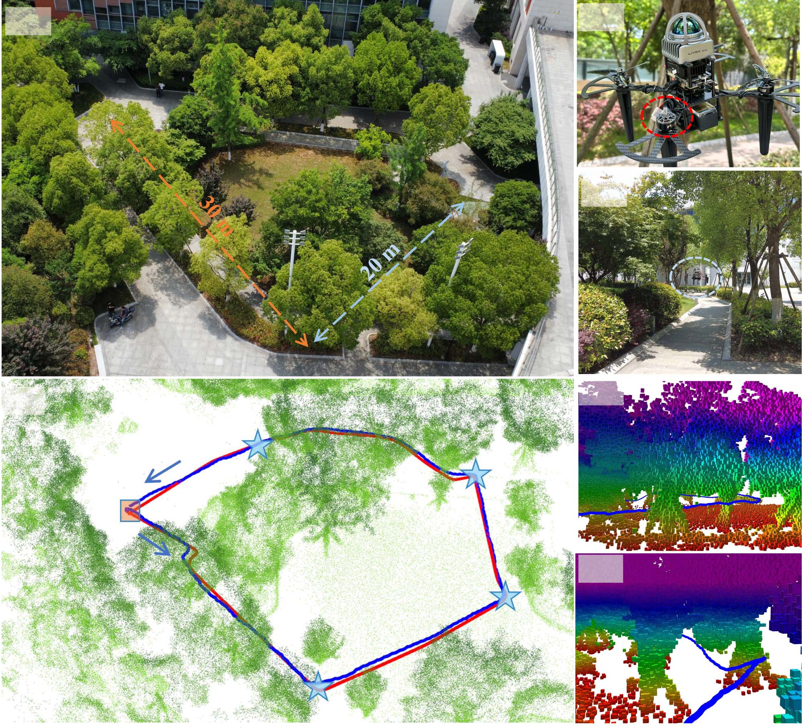
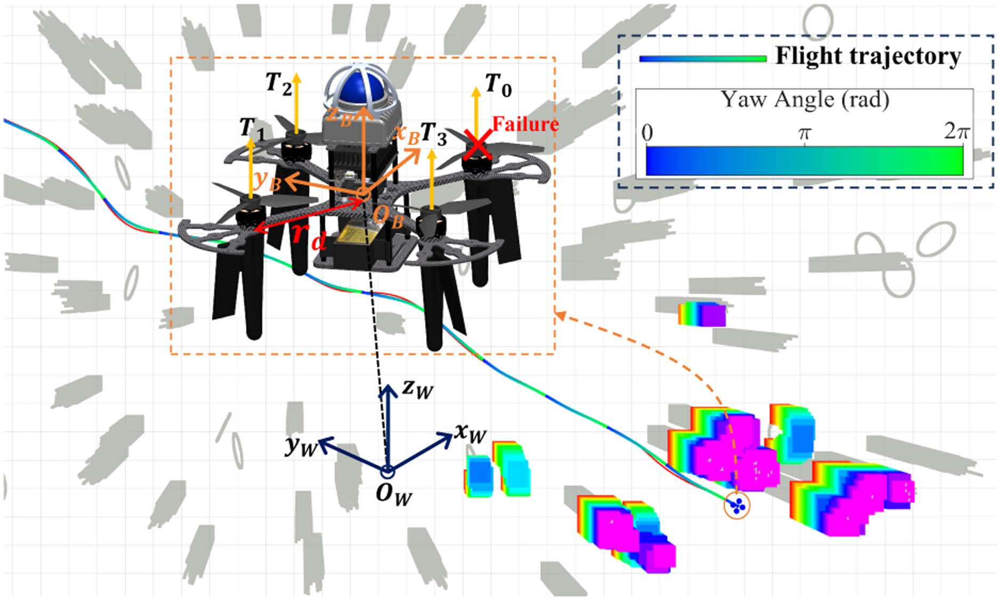
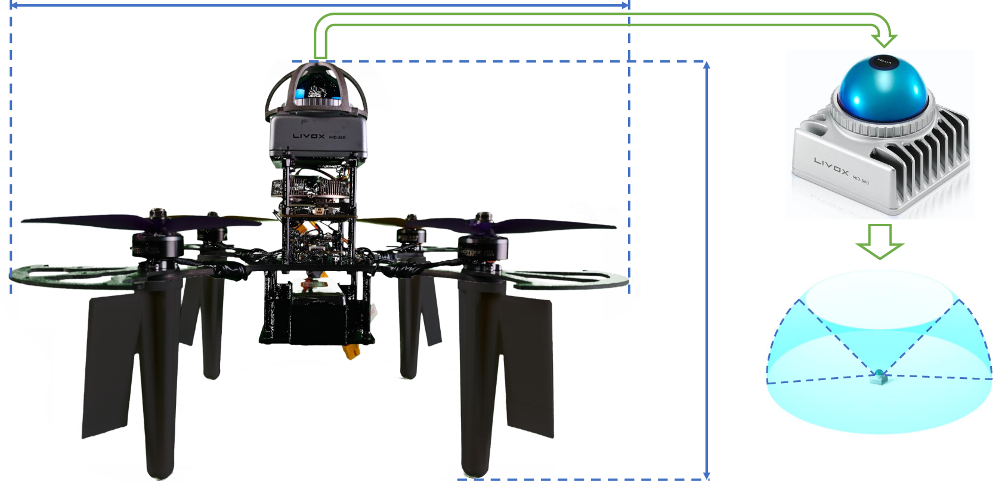
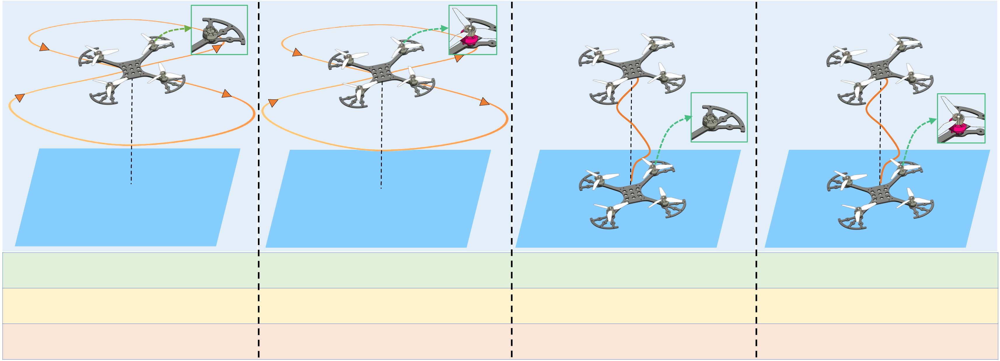
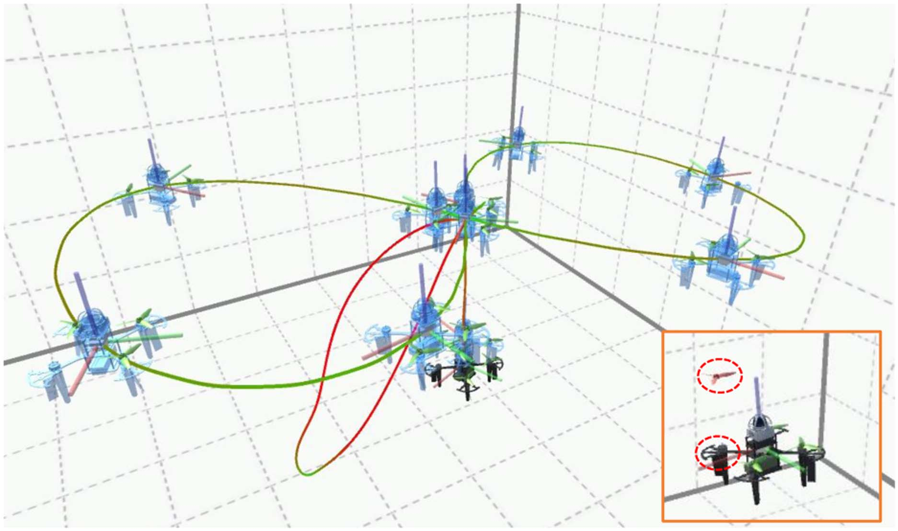
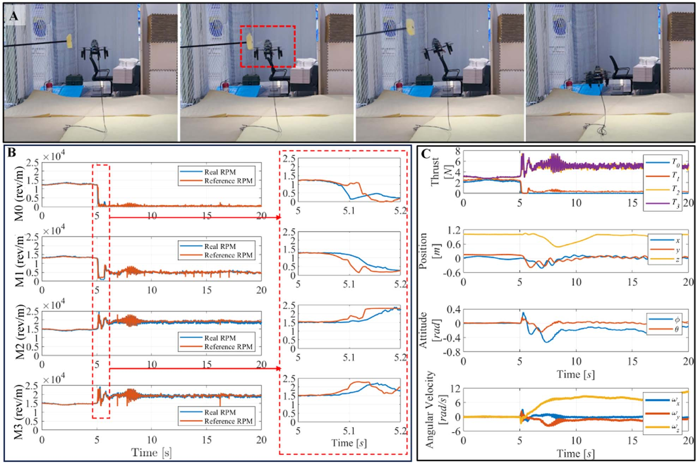
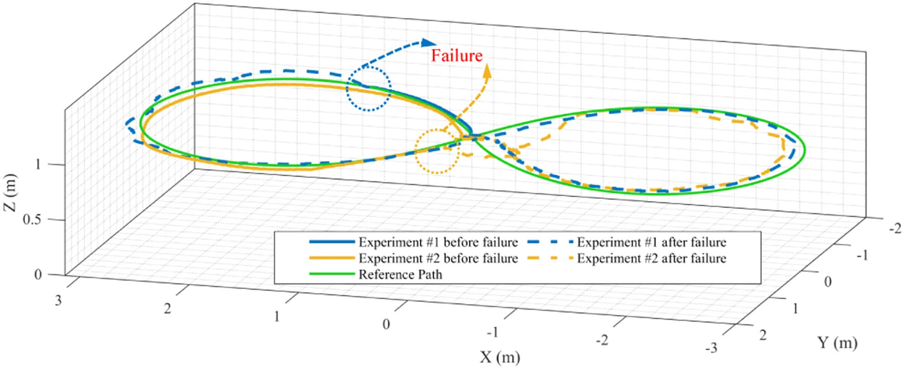
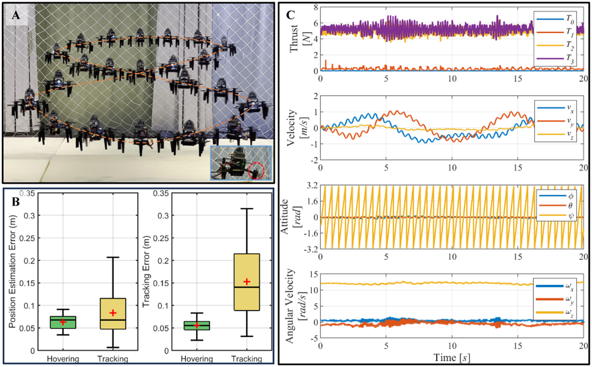
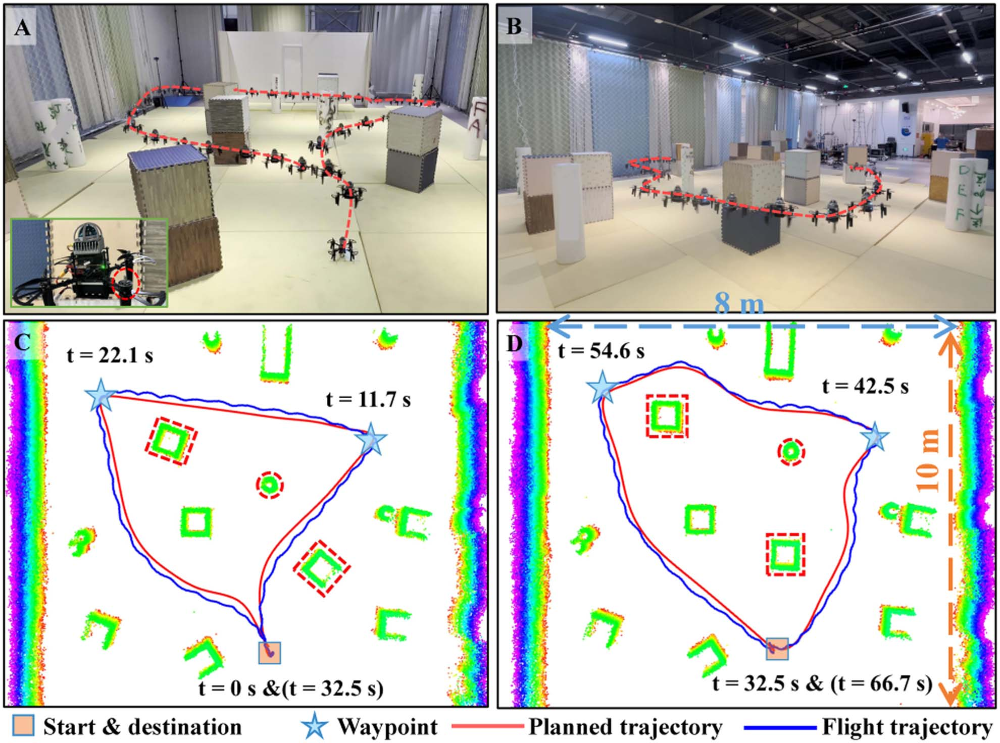

# 旋翼故障感知四旋翼未知环境自主飞行（Rotor-Failure-Aware Quadrotors Flight in Unknown Environments）：完整忠实学术翻译

> **原文标题**：Rotor-Failure-Aware Quadrotors Flight in Unknown Environments  
> **作者**：> - 作者: Xiaobin Zhou, Miao Wang, Chengao Li, Can Cui, Ruibin Zhang, Yongchao Wang, Chao Xu, Fei Gao  
> **发表信息**：> - 期刊/会议: IEEE Transactions on Aerospace and Electronic Systems (TAES)  
> **原文 PDF**：[Rotor-Failure-Aware Quadrotors Flight in Unknown Environments.pdf](../Rotor-Failure-Aware Quadrotors Flight in Unknown Environments.pdf) ｜ **对应中文详解**：[30_旋翼故障感知四旋翼未知环境自主飞行.md](../中文详解/30_旋翼故障感知四旋翼未知环境自主飞行.md)  

---

## 原文第 1 页核心内容与翻译

旋翼故障感知四旋翼未知环境自主飞行
XIAOBIN ZHOU
MIAO WANG
Nanjing University, Suzhou, China
CHENGAO LI
Hong Kong Polytechnic University Hong Kong
CAN CUI
RUIBIN ZHANG
Zhejiang University, Hangzhou, China
YONGCHAO WANG
Beihang University, Beijing, China
CHAO XU
FEI GAO
Zhejiang University, Hangzhou, China
四旋翼发生旋翼故障时，由于旋翼不平衡，可能产生高速旋转和振动，从而给未知环境中的自主飞行带来显著挑战。
收稿日期：2025 年 5 月 26 日；修回日期：2025 年 10 月 3 日和 12 月 27 日；录用日期：2026 年 2 月 7 日。出版日期：2026 年 2 月 12 日；当前版本日期：2026 年 4 月 20 日。
DOI：10.1109/TAES.2026.3664067
本稿件由 L. R. Garcia Carrillo 负责审稿。
本工作部分受中国国家自然科学基金（项目编号 62303412 和 62403419）、北京交通大学轨道交通自主运行先进实验室（项目编号 RAO2026K09）以及浙江省自然科学基金（湖州市，项目编号 2023YZ01）资助。
Authors’ addresses: Xiaobin Zhou and Miao Wang are with the School of
Robotics and Automation, Nanjing University, Suzhou 215163, China, E-
mail: (xbzhou_zju@zju.edu.cn; wmubuntu1991@gmail.com); Chengao
Li is with the Department of Aeronautical and Aviation Engineering, The
Hong Kong Polytechnic University, Hong Kong, SAR, China, E-mail:
(cheng-ao.li@connect.polyu.hk); Can Cui, Ruibin Zhang, Chao Xu, and
Fei Gao are with the Institute of Cyber-Systems and Control, College of
Control Science and Engineering, Zhejiang University, Hangzhou 310027,
China,
E-mail:
(cuican1990@zju.edu.cn;
ruibin_zhang@zju.edu.cn;
cxu@zju.edu.cn; fgaoaa@zju.edu.cn); Yongchao Wang is with the School
of Aeronautic Science and Engineering, Beihang University, Beijing,
100191, China, E-mail: (wangyongchao@buaa.edu.cn). (Xiaobin Zhou
and Miao Wang contributed equally to this work.) (Corresponding author:
Fei Gao.)
这给未知环境中的自主飞行带来了挑战。针对旋翼故障的主流方法依赖容错控制（FTC）和预定义轨迹跟踪。据作者所知，针对未知复杂环境中故障后四旋翼的在线故障检测与诊断（FDD）、轨迹规划和 FTC 尚未实现。本文提出一种旋翼故障感知四旋翼导航系统，以减轻旋翼不平衡的影响。首先，设计一种结合电机动力学的复合 FDD 非线性模型预测控制器，以确保快速故障检测和飞行稳定性。其次，设计一种旋翼故障感知规划器，利用 FDD 结果进行时空联合优化；同时设计一种配备四个反扭矩板的 LiDAR 四旋翼平台，以实现高速旋转条件下的可靠感知。最后，通过与当前先进方法进行大量基准测试，凸显所提方法在处理旋翼故障（包括螺旋桨卸载和电机停转）方面的优越性能。实验结果首次证明，所提方法能够使四旋翼在具有挑战性的环境（包括杂乱房间和未知森林）中发生旋翼故障时仍实现自主飞行。
符号说明
FB, Fw
四旋翼机体坐标系和世界坐标系。
xw, yw, zw ∈R3
世界坐标系的单位向量。
xB, yB, zB ∈R3
四旋翼坐标系的单位向量。
η, v ∈R3
四旋翼的位置和线速度。
wB = [p, q, r]T ∈R3
四旋翼的角速度。
αB ∈R3
四旋翼的角加速度。
R ∈SO(3)
四旋翼的旋转矩阵。
D ∈R3×3
旋翼阻力系数。
τ ∈R3, T ∈R
四旋翼的力矩和总推力。
m0 ∈R, g ∈R3
四旋翼的质量和重力向量。
t ∈R4
四旋翼的推力向量。
Iv ∈R3×3
四旋翼的惯性矩阵。
kd,ψ ∈R
气动偏航阻尼系数。
kn ∈R
推力系数。
kt ∈R
偏航力矩系数。
wi ∈R
电机转速。
ui ∈R
旋翼的指令输入。
I. 引言
多旋翼飞行器凭借出色的机动性和灵活性，广泛应用于野外探索、洞穴勘测以及外行星探测等场景 [1]，[2]，[3]。然而，旋翼故障是多旋翼飞行器的一项显著脆弱性。如文献 [4] 所报道，采用共轴旋翼构型的 NASA Ingenuity 直升机在成功运行三年后发生旋翼叶片故障，最终导致任务结束。旋翼故障不仅会扰乱正常飞行，还会对周围人员造成严重安全风险 [5]。
为确保故障后飞行安全，在无外部辅助设备的情况下，必须具备自主且可靠的旋翼故障感知导航系统。要使受损四旋翼在未知环境中实现自主飞行，
经授权许可使用。来源：IEEE Xplore。限制条件适用。

---

## 原文第 2 页核心内容与翻译

必须明确考虑飞行稳定性、避碰和动力学可行性，以应对以下实际挑战。
第一个挑战在于旋翼故障后迅速恢复飞行稳定性并实现精确的位置跟踪。四旋翼在正常飞行期间突发旋翼故障时，会面临姿态控制发散和高度损失等问题。针对旋翼故障，既采用主动容错控制（FTC）[6]，[7]，也采用被动 FTC [8]。主动 FTC 侧重实时故障检测与诊断（FDD），并重构控制器结构以动态处理故障。相比之下，被动 FTC 利用系统冗余和预先设计的鲁棒性处理故障，无需重构控制器 [9]。由于四旋翼冗余度有限且被动 FTC 具有保守性，主动 FTC 得到了更广泛的研究，以提升旋翼故障后的系统性能。
FDD 在为主动 FTC 提供故障信息方面发挥着关键作用。FDD 的计算延迟若超过可接受阈值，可能导致受损四旋翼在沿用原控制器结构运行时进入不可逆状态。因此，文献 [10] 和 [11] 假设故障信息先验已知，未考虑 FDD 计算延迟。实际上，旋翼故障可能发生在四旋翼的任意电机或螺旋桨上，没有有效的 FDD 机制便无法观测。此外，与预先设计、由代码触发的电机停转故障相比，螺旋桨损坏或电机臂断裂等旋翼故障给 FDD 带来了更大挑战。应对第一个挑战需要将精心设计的 FDD 算法与控制重构策略结合起来。
第二个挑战在于确保未知环境中的可靠感知与避碰，同时适应旋翼故障后改变的动力学可行性。为保持推力平衡，故障旋翼对面的旋翼推力被限制在较低幅值 [12]。这一约束显著改变了四旋翼的推重比和偏航力矩，进而改变安全飞行包络与动力学可行性 [13]。因此，轨迹规划必须考虑旋翼故障前后动力学可行性的变化。此外，偏航力矩不平衡会引起高速旋转和振动，严重降低自主导航系统的感知性能 [14]。因此，许多相关研究依赖全球定位系统或运动捕捉系统（MCS）进行故障后轨迹跟踪 [12]，[15]，限制了其在未知复杂环境中的适用性。在缺乏全局信息且存在未知障碍物的场景中，不依赖实时感知的全局轨迹跟踪无法确保飞行安全。应对第二个挑战需要一种能够考虑高速旋转和动力学可行性变化的可靠感知与轨迹规划系统。
基于上述观察与分析，本文提出一种面向挑战性环境的四旋翼旋翼故障感知导航系统。

**图 1**：图 1。森林中发生旋翼故障的四旋翼自主航点导航。a(1) 为飞行环境的鸟瞰图。a(2) 和 a(3) 为真实世界实验中的第三人称视角快照，此时四旋翼穿过狭窄通道。b(1)–b(3) 展示实验的三维点云地图及其细节视图。规划轨迹和飞行轨迹分别以红色和蓝色路径表示。起点和终点以橙色方块标记，四个航点以浅蓝色星形标出。
首先，为提高不同飞行阶段真实旋翼故障的 FDD 速度，提出一种复合 FDD 机制，将基于模型和无模型方法结合起来，并以机载每分钟转数（RPM）和状态估计作为输入。其次，为确保旋翼故障前后的避碰并保持动力学可行性，提出一种基于无约束非线性规划的旋翼故障感知轨迹规划方法。我们设计一种基于 LiDAR 的轻量四旋翼平台，在起落架上安装四个反扭矩板，以降低旋转速度并实现可靠感知。第三，在多种场景中开展仿真和实验（见图 1）。本文的主要贡献如下。
1) 提出一种融合复合 FDD 和非线性模型预测控制器（NMPC）的 FTC 系统，以确保及时响应和精确轨迹跟踪。结果证明，所提方法能够在各种物理旋翼故障下防止飞行控制失效。
2) 开发一种旋翼故障感知规划方法，用于解决避碰问题，并能自动生成可行轨迹。此外，通过机械设计和传感器选型，定制的 LiDAR 四旋翼考虑了高速旋转条件下的可靠感知。
经授权许可使用。来源：IEEE Xplore。限制条件适用。

---

## 原文第 3 页核心内容与翻译

3) 所提出的导航系统在全面仿真和真实世界实验中得到了广泛测试。据作者所知，我们首次成功实现了四旋翼在未知且复杂环境中的故障后导航。

本文其余部分的组织如下。第 II 节回顾相关工作。第 III 节和第 IV 节分别介绍四旋翼动力学和整体系统架构。第 V 节介绍所提出的导航策略。第 VI 节给出仿真和真实世界实验结果。最后，第 VII 节对全文进行总结。

II. 相关工作

本节回顾旋翼故障条件下四旋翼鲁棒 FTC 系统和自主飞行方面的既有研究，重点讨论快速 FDD、动力学可行性和高速旋转等挑战，因为这些因素会影响四旋翼在未知环境中的故障后飞行安全。

A. 针对旋翼故障的 FTC 与 FDD

尽管四旋翼安全飞行控制已经取得了重大进展，旋翼故障带来的安全问题仍阻碍其广泛应用。当一个完整旋翼丧失时，仅剩三个旋翼保持工作，导致四旋翼绕偏航轴失控旋转，并产生高速旋转和剧烈振动。针对这些问题，已有研究提出了多种控制策略，包括比例–积分–微分控制器 [10]，[11]、线性二次型调节器 [16] 以及增量非线性动态逆 [13]。这些方法的核心思想是牺牲偏航控制，以维持高度和位置控制。然而，上述工作通常假设旋翼故障信息已知，而不是通过实时 FDD 获取。

FDD 研究主要集中于识别电机和螺旋桨损坏，方法大体分为基于模型和无模型两类 [17]，[18]，[19]。遗憾的是，[17] 中的无模型 FDD 方法仅通过轻微螺旋桨损坏实验进行了验证。基于模型的方法利用四旋翼模型和状态估计，对电机和螺旋桨损坏程度进行量化。例如，Mao 等人 [19] 通过分析电机转速与推力之间的关系，并结合失配指标，提出了一种评估螺旋桨部分损坏的方法。与部分旋翼故障相比，完整旋翼故障下的 FDD 和 FTC 对检测效率提出了更严格的要求。为此，Yu 等人 [12] 引入固定时间观测器，以估计由代码注入的电机停转所引起的故障；Ke 等人 [8] 则提出了一种统一的被动 FTC，可在不依赖故障信息的情况下应对最多三个旋翼故障。

尽管已有这些进展，现有研究仍难以解决不同飞行阶段中螺旋桨故障和电机故障的快速检测问题。当前多数方法要么专门检测单一类型的故障，要么局限于特定运行条件，例如悬停或低速飞行期间由代码触发的电机故障，此时系统动力学相对稳定。此外，从起飞到轨迹跟踪的飞行阶段具有不同的动力学特性，这增加了统一故障检测系统的设计复杂度。

B. 未知环境中的故障后飞行

由于动力学可行性降低以及机体高速旋转，旋翼故障条件下的复杂环境自主导航飞行对四旋翼而言是一项挑战。该领域早期研究主要关注部分执行器故障（例如桨尖损失和电机效率降低）[20]，[21]，[22]，[23] 以及外部扰动（例如悬挂载荷和空气阻力）[24]，[25]，[26]，[27] 条件下的轨迹规划。近期轨迹规划研究引入最大推力限制，以分析机动能力的变化 [21]。然而，这些研究依赖简化动力学模型和运动捕捉系统（MCS），限制了其在未知环境中的实用性。

此外，旋翼故障会使四旋翼高速旋转，从而在相机中造成运动模糊，并使基于 LiDAR 的感知系统产生倾斜的点云数据。为应对这一挑战，Sun 等人 [14] 比较了事件相机和普通相机在故障后四旋翼状态估计中的有效性。实验结果表明，在低照度条件下，事件相机能够提供可靠定位，并支持室外环境中的轨迹跟踪。此外，Chen 等人 [28] 开发了一种具备更强感知能力和续航能力的自旋转空中机器人，实现了机体高速旋转条件下的自主导航。然而，[28] 中的轨迹规划方法没有考虑旋翼故障引起的系统动力学变化。

总之，由于动力学可行性降低和高速旋转，旋翼故障四旋翼在未知环境中的自主导航仍是一个具有挑战性的问题。此外，如何将 FDD 结果整合到自主感知、规划和控制中，尚未在故障后四旋翼上得到验证。

III. 预备知识

A. 符号说明

本文中，实数集合记为 R，diag[d1, d2, d3] 表示对角线上元素为 d1、d2 和 d3 的对角矩阵。对于矩阵 A ∈ Rm×n 或向量 x ∈ Rn，转置分别记为 AT 或 xT。x 的欧几里得范数记为 ∥x∥，定义为 ∥x∥ = √(xT x)。四旋翼的坐标系由两个右手坐标系组成：惯性坐标系 Fw：{xw, yw, zw}，其中 zw 指向上方、与重力方向相反；机体坐标系 FB：{xB, yB, zB}，其中 xB 指向前方，zB 与推力方向一致（见图 2）。带下标 B 的矩阵和向量均在机体坐标系中表示，不带下标的矩阵和向量均在惯性坐标系中表示。从 Fw 到 FB 的变换由旋转矩阵 R 定义，R 以四元数 q = [qw, qx, qy, qz]T 参数化。

**图 2**：旋翼故障四旋翼的推力编号、惯性坐标系、机体坐标系和飞行轨迹示意图。

B. 四旋翼动力学

四旋翼基于刚体运动学和动力学方程建模如下：

m0 η̈ = T zB − RDRT v + m0 g  (1)

q̇ = 1/2 q ⊗ [0; wB]  (2)

Iv αB = τ − wB × Iv wB − A(r)  (3)

其中，η 表示四旋翼重心的位置。v、T、D、m0 和 g = [0, 0, −g0]T 分别表示速度向量、总推力、旋翼阻力系数、质量和重力向量。在转动动力学中，⊗ 表示四元数乘法，wB = [p, q, r]T 表示坐标系 FB 相对于 Fw 的角速度，αB 为相应的角加速度。Iv 表示四旋翼的惯性矩阵，τ = [τx, τy, τz]T 为旋翼产生的总力矩。此外，A(r) = [0, 0, kd,ψr]T 表示旋转运动诱导的力矩，kd,ψ 为气动偏航阻尼系数。变量和参数的详细信息列于符号表中。需要指出的是，上述动力学模型未描述某些未建模效应，例如气动不确定性、风扰动和传感器噪声。虽然这些因素可能影响状态估计和控制精度，但所提出的框架通过融合 LiDAR-惯性里程计和 NMPC 来减轻其影响。

总推力和旋翼产生的力矩取决于四个旋翼的推力，可表示为：

[ T ; τ ] = Mt t  (4)

其中，t = [T0, T1, T2, T3]T 表示推力向量，每个旋翼的推力定义为 0 ≤ Ti = kn wi² ≤ T；T 为每个电机的推力上限，i = 0, 1, 2, 3。这里，kn 为螺旋桨推力系数，wi 为第 i 个电机的转速。控制效能矩阵 Mt 为：

Mt = [1 1 1 1; −√2/2 rd √2/2 rd √2/2 rd −√2/2 rd; −√2/2 rd √2/2 rd −√2/2 rd √2/2 rd; −κt −κt κt κt]  (5)

其中，rd 为横滚或俯仰方向旋翼间距离的一半，κt 表示偏航力矩系数。在实时控制应用中，电机达到指令推力水平存在延迟。为对此进行建模，将电机动力学纳入模型：

Ṫi = 1/σ (ui − Ti)  (6)

其中，σ 是根据经验数据得到的时间常数，ui 表示指令输入。

IV. 系统概述

A. 软件框架

为实现旋翼故障条件下的四旋翼自主飞行，将图 3 所示、由感知、规划和控制模块组成的软件框架集成到机载计算机中。机载计算由 NVIDIA Jetson Orin NX 执行。这是一种强大的嵌入式边缘计算平台，配备 8 核 CPU、1024 核 GPU 和 16 GB RAM。该硬件运行 Ubuntu 和机器人操作系统（ROS），可为实时 NMPC 和感知模块提供充足的计算能力。机载计算机与飞行控制器之间通过 MAVROS [29] 通信。四旋翼软件系统主要由以下子系统组成。

1) 控制单元：高层系统包含 FTC 框架，包括控制器和 FDD 模块；二者在 NVIDIA Jetson Orin NX 上以 200 Hz 运行，最终输出四个电机所需的 RPM。低层控制单元维持 RPM 的闭环控制，由飞行控制器（Kakute H7 V1.3）和电子调速器（ESC，Tekko 32 F4）组成。控制过程如下：飞行控制器从 NVIDIA Jetson Orin NX 接收所需 RPM 指令，并通过 DShot 协议向 ESC 发送数字信号。ESC 解码 DShot 信号，通过控制电压和电流调节电机转速；同时利用内置传感器测量实际电机转速，并通过 DShot 协议将反馈发送给飞行控制器。飞行控制器依据反馈 RPM 数据修正控制信号，实现精确的电机转速闭环调节。

2) 规划单元：为在复杂环境中生成旋翼故障感知轨迹，本文提出一种集成于机载计算机中的规划模块，用于处理机载传感器采集的点云。实时规划器基于实时感知生成平滑且无障碍物的轨迹，具体方法将在下一节介绍。

## 原文第 5 页核心内容与翻译

**图 4**：所设计四旋翼平台及其组件说明。

### B. 不同飞行阶段的复合 FDD

四旋翼旋翼故障主要发生在电机和螺旋桨两个关键部件。电机故障通常源于过载或冷却不足导致的过热，螺旋桨故障通常由碰撞造成的物理损伤或材料疲劳引起。主动 FTC 方法必须依赖快速故障检测。本文提出复合 FDD 系统，将基于模型和无模型方法结合，以提高诊断速度和准确性。

对于电机故障诊断，采用 ESC 通过 DShot telemetry 报告的实时电机转速 \\(\\hat{\\omega}_i\\)，并与参考转速 \\(\\omega_i\\) 比较：\\(M_i=\\hat{\\omega}_i/\\omega_i\\)。\tag{13} 当 \\(M_i\\le\\gamma_M\\) 时，控制模式切换至 FTC 模式。螺旋桨故障观测器为 \\(\\hat{T}_a=T_fz_B+m_0g-m_0\\ddot{\\eta}_f-RDR^Tv\\) (14)，\\(\\hat{\\tau}_a=\\tau_f-I_v\\alpha_{B,f}-w_{B,f}\\times I_vw_{B,f}-A(r)\\) (15)，且 \\( [||\\hat{T}_a||;\\hat{\\tau}_a]=M_tt^*\\) (16)。其中各量含义与原文一致，\\(t^*\\) 为四旋翼推力损失，\\(M_t\\) 为控制效能矩阵。螺旋桨损伤指标为 \\(P_i=\\hat{T}_i/T\\) (17)；当 \\(P_i>\\gamma_P\\) 时隔离故障螺旋桨并触发控制器重构和轨迹规划。

起飞时高度低、恢复空间小，可用反应时间显著短于轨迹跟踪阶段。因此采用低通滤波后的加速度 \\(\\ddot{\\eta}_f\\) 和角加速度 \\(\\alpha_{Bf}\\) 及时检测故障。

## 原文第 6 页核心内容与翻译

理想垂直起飞时四个电机等推力升速；若起飞期间发生电机和螺旋桨故障，则会出现显著角加速度和线加速度异常。Rotor #0 检测指标为：
\\[
Q_0=\\begin{cases}1,&\\text{if }\\ddot{\\eta}_{f,x}\\ge\\gamma_{Q,0}\\text{ and }\\ddot{\\eta}_{f,y}\\le-\\gamma_{Q,1},\\\\0,&\\text{otherwise},\\end{cases}\\tag{18}
\\]
其中阈值为 \\(\\gamma_{Q,0}\\)、\\(\\gamma_{Q,1}\\)；也可使用 \\(\\alpha_{Bf,x}\\)、\\alpha_{Bf,y}\\) 与 \\(\\gamma_{Q,2}\\)、\\(\\gamma_{Q,3}\\)。Rotor #1、#2、#3 同理。FDD 还可结合电机侧和螺旋桨侧线索检测磨损、过热和间歇性部分推力下降；轴不对中等转速-推力不一致也可检测，极细微或极短暂异常可能漏检。

### C. 旋翼故障感知轨迹规划

首先由 dynamic A* 算法 [32] 生成无碰撞路径，再由后端细化时空轨迹。该框架以线性复杂度变形 flat-output 轨迹，并依据 (1)–(3) 重构完整状态。对于 M 段、m 维、次数 \\(N_0=2s-1\\) 的多项式轨迹（\\(s=3\\)），\\(c=\\mathcal{M}(q_p,T^p)\\) (19)，其中 \\(q_p\\) 为中间航点，\\(T^p\\) 为时间分配，\\(c\\) 为系数矩阵 [1]。\\(p(t)=p_g(t-t_{g-1})\\) (20)，\\(p_g(t)=c_g^T\\beta(t)\\) (21)，\\(\\beta(t)\\) 为自然多项式基。轨迹生成优化为 \\(\\min_{q_p,T^p}[J_t,J_s,J_d,J_c]\\cdot\\lambda_p\\) (22)，四项分别惩罚总时间、平滑性、动力学可行性和碰撞。总时间 \\(J_t=\\sum_{g=0}^{M}T_g\\) (23)，平滑性为 \\(J_s=\\int\\|p^{(s)}(t)\\|_2^2dt\\) (24)，动力学代价由速度、加速度和 jerk 超限项 (25)–(29) 构成；故障后采用较低的 \\(a_{max,f}\\)。

## 原文第 7 页核心内容与翻译

在 \\(a_z=v_z=0\\) 时：
\\[
m_0a_{xy}=Tz_{B,xy}-f_{xy},\\quad m_0a_z=Tz_{B,z}-m_0g_0.\\tag{30}
\\]
由单位推力方向约束得 \\(T^2-(m_0g_0)^2=(f_{xy}+m_0a_{xy})^2\\) (31)，以及 \\(a_{xy}=[\\sqrt{T^2-(m_0g_0)^2}-f_{xy}]/m_0\\) (32)。为安全起见，假设故障旋翼对侧旋翼也不可用，故障后 \\(0\\le T\\le T_{f,max}=2T\\)，\\(f_{xy}\\le f_{max}=\\|RDR^T\\|v_{max}\\)，加速度上限更新为：
\\[
a_{max,f}=\\gamma_{a,f}\\left|\\frac{\\sqrt{T_{f,max}^2-(m_0g_0)^2}-f_{max}}{m_0}\\right|.\\tag{33}
\\]
其中 \\(0<\\gamma_{a,f}\\le1\\) 为安全系数。速度和 jerk 阈值依据平台特性及实验经验确定 [33], [34]；式 (33) 是故障后的主要安全约束。障碍物为平面 \\((x_p-s_p)^Tv_p=0\\) (34)，点到平面的距离为 \\(d_o=(p_p-s_p)^Tv_p\\) (35)，碰撞代价为式 (36)。

## 原文第 8 页核心内容与翻译

### VI. 仿真与真实世界实验

通过仿真和真实世界实验评估方法，重点考察故障后稳定控制、未知障碍物和低照度环境中的动力学可行无碰撞导航，以及实际环境表现。参数见 Table I。轨迹优化采用 LBFGS [35]，NMPC 采用 ACADO [36] 与 qpOASES [37]，频率 200 Hz，\\(N=20\\)、\\(dt=50\\) ms。FTC 参数为 \\(Q_p=diag(100,100,600)\\)、\\(Q_v=diag(5,5,5)\\)、\\(Q_q=diag(60,60,60,60)\\)、\\(Q_w=diag(1,1,1)\\)、\\(Q_t=diag(1,1,1,1)\\)、\\(R_N=diag(1,1,1,1)\\)、\\(\\gamma_M=0.2\\)、\\(\\gamma_P=0.8\\)；\\(\\lambda_p=[10.0,1.0,10000.0,10000.0]^T\\)，安全距离 0.3 m。RMSE 定义见 (37)。

### A. FTC 系统仿真

与无需 FDD 的均匀被动 FTC [8] 和固定时间 FDD 主动 FTC [12] 比较，基线记为 UnifP [8]、FixedA [12]。四组测试见 Fig. 5：Test #1、#2 在飞行中注入螺旋桨和电机故障，Test #3、#4 在起飞中注入故障。Test #1、#2 使用 2.0 m/s 的 lemniscate 轨迹，每组 20 次。所提方法的 FDD 时间分别为 0.184 s 和 0.028 s，FixedA 分别为 0.253 s 和 0.225 s；成功率分别为 90%、100%，FixedA 为 60%、70%，两者 FAR、MDR 均为 0%。Test #3、#4 中检测时间为 0.020 s，前两种方法最小高度为 −0.262 m、−9.278 m，所提方法为 0 m，前两者坠毁而所提方法成功起飞。Jetson Orin NX 上 NMPC 平均和最大计算时间为 1.88 ms、3.17 ms；低功耗平台可能需要降低频率或使用更高效求解器。

### B. FTC 系统实验

闭环轨迹跟踪实验通过代码触发电机停止、敲击和卸载螺旋桨诱发故障。木棒敲击悬停飞行器时电机暂时卡滞；\\(t=5.102\\) s 的实际与期望转速为 10 185 和 1528 r/min，正常跟踪始于 \\(t=5.075\\) s，故 FDD 在 27 ms 内完成。进入 FTC 后，相邻电机提高转速抵消重力，对侧电机以最小推力维持稳定；高度从 1.0 m 降至 0.45 m 后恢复至 1.0 m，同时以 11.0 rad/s 旋转。两次 1.0 m/s lemniscate 跟踪实验最大误差为 0.32、0.34 m，RMSE 均为 0.15 m。主动卸载螺旋桨实验的轨迹尺寸为 x 方向 6.0 m、y 方向 3.0 m、z 方向 1.0 m，最大速度 1.0 m/s；位置估计 RMSE 为 0.07 m，跟踪 RMSE 由悬停时 0.06 m 增至 0.14 m。高速旋转下滚转和俯仰仍保持稳定。未建模气动不确定性、环境扰动和传感器退化仍可能影响故障后飞行，未来可加入鲁棒或自适应组件。

## 原文第 9 页核心内容与翻译

**图 5**：Fig. 5.
设置四组测试，以验证所提方法在电机和螺旋桨故障下的鲁棒性。在 Test #1 和 Test #2 中，旋翼故障在轨迹跟踪过程中注入；在 Test #3 和 Test #4 中，旋翼故障发生在四旋翼起飞过程中。

表 II
轨迹跟踪过程中 FTC 系统的性能比较

**图 6**：Fig. 6.
在 Test #1 中采用所提方法的仿真可视化结果 [2]，其中四旋翼悬停时发生螺旋桨脱落故障。绿色和红色路径分别表示参考 8 字形轨迹和实际飞行轨迹。
测试的具体结果见表 II。图 6 展示了 Test #1 中所提方法的可视化结果，其中四旋翼悬停时发生螺旋桨脱落故障。图 7(a) 展示了 Test #1 中四旋翼进行轨迹跟踪时采用所提方法得到的飞行轨迹可视化结果。在图 7(b) 中，基于推力损失的估计

**图 7**：Fig. 7.
在 Test #1 中，四旋翼进行轨迹跟踪时 Propeller #0 发生故障，采用所提方法得到的 FDD 和 FTC 结果。(a) 参考轨迹和飞行轨迹的可视化结果。(b) 四个螺旋桨推力系数损失的估计结果。(c) 所提 FTC 控制下的推力和状态响应时间历程。
所提方法识别出 rotor 0 的异常推力指令，该指令超过 80% 的临界阈值，使故障诊断在 0.184 s 内完成。FixedA [12] 的 FDD 时间为 0.253 s。图 7(c) 展示了轨迹跟踪中的状态响应。发生故障后，四旋翼约需 3 s 恢复滚转和俯仰姿态稳定性，同时进入角速度为 11.0 rad/s 的高速偏航旋转模式。在 Test #2 中，基于电机转速的 FDD 方法检测到异常转速，并在 0.028 s 内完成诊断，而 [12] 的 FDD 时间为 0.225 s。所提方法在 Test #1 和 Test #2 飞行阶段的成功率 (SucR) 分别为 90% 和 100%，高于 FixedA [12] 的 60% 和 70%。两种方法的误报警率 (FAR) 和漏检率 (MDR) 均为 0%。这表明针对不同类型旋翼故障设计专用 FDD 方法能显著提高 FDD 效率，进而提升 SucR 和飞行安全性。
2) 起飞阶段的 FTC：我们开展 Test #3 和 Test #4，以评估起飞过程中 Motor #0 的旋翼故障，
ZHOU ET AL.: ROTOR-FAILURE-AWARE QUADROTORS FLIGHT IN UNKNOWN ENVIRONMENTS
6379
Authorized licensed use limited to: National Institute of Technology- Delhi. Downloaded on August 24,2026 at 05:44:48 UTC from IEEE Xplore.  Restrictions apply.

---

## 原文第 10 页核心内容与翻译

表 III
悬停过程中 FTC 系统的性能比较。
(成功：✓；失败：×)
结果见表 III。四旋翼的加速度和角加速度测量值达到预设阈值，使故障检测在 0.020 s 内完成。FixedA [12] 在螺旋桨故障和电机故障下的 FDD 时间分别为 0.195 s 和 0.190 s。对于 [8]、[12] 和所提方法，最小高度 (MiniA) 分别为 −0.262 m、−9.278 m 和 0 m。结果表明，[8] 和 [12] 的起飞尝试均导致坠毁，而所提方法即使在旋翼故障下也能实现成功且稳定的起飞。Test #4 中重复得到相似结果。与 Test #1 和 Test #2 的轨迹跟踪飞行相比，起飞阶段允许的 FDD 时间更加严格，因此需要针对该阶段设计高效率的 FDD 和 FTC 方法。
我们在 NVIDIA Jetson Orin NX 上以 200 Hz 的频率评估 NMPC 的计算性能。平均计算时间为 1.88 ms，最大计算时间为 3.17 ms。结果证实，该平台具备支持四旋翼控制中 NMPC 实时运行的足够计算能力。然而，由于 Raspberry Pi 等低功耗平台的计算能力有限，要达到如此高的频率较为困难。在这种情况下，需要降低 NMPC 频率，或为 NMPC 优化问题开发更高效的求解器，以确保实时运行的可行性。
B. FTC 系统实验
我们开展闭环飞行轨迹跟踪测试，以验证所提算法，包括故障检测和控制重构。通过代码触发电机停止故障、敲击螺旋桨以及卸载螺旋桨的方式，在四旋翼中诱发旋翼故障。
如图 8(a) 所示，实验人员用木棒直接敲击悬停四旋翼的螺旋桨，模拟碰撞导致电机暂时卡滞。四旋翼螺旋桨切入海绵，受外部碰撞力和电机故障影响，四旋翼瞬间倾斜。该电机在碰撞过程中停止，触发电机故障的 FDD 机制。图 8(b) 展示了四个电机的期望和实际 RPM。在 t = 5.102 s 时，实际和期望 RPM 分别为 10 185 和 1528 r/min。此外，t = 5.075 s 时仍可观察到正常的电机转速跟踪，因此可推断 FDD 在 27 ms 内完成。如图 8(c) 所示，FDD 完成后，

**图 8**：Fig. 8.
所提方法在电机故障下的实验结果。(a) 用木棒敲击螺旋桨诱发电机停止故障的实验快照。(b) 四个电机的参考 RPM 与实时测量 RPM 对比。(c) 所提 FTC 系统控制下的推力和状态响应时间历程。

**图 9**：Fig. 9.
针对电机停止故障的轨迹跟踪实验结果。
控制系统切换至 FTC 模式后，故障电机相邻的两个电机迅速提高转速以抵消重力，而故障电机对侧的电机产生最小推力以维持稳定。四旋翼高度先从悬停高度 1.0 m 降至 0.45 m，随后在以 11.0 rad/s 旋转的同时恢复至 1.0 m。此外，如图 9 所示，在四旋翼以 1.0 m/s 的速度跟踪 8 字形轨迹时，通过代码触发方式开展了两次电机停止故障实验。两次实验的最大跟踪误差分别为 0.32 m 和 0.34 m，RMSE 均为 0.15 m。
如图 10(a) 所示，我们还通过主动卸载一个螺旋桨评估轨迹跟踪性能。8 字形轨迹在 x、y、z 方向的尺寸分别为 6.0 m、3.0 m 和 1.0 m，最大速度为 1.0 m/s。图 10(b) 给出了位置估计和轨迹跟踪的 RMSE，其中 MCS 提供真实位置 [38]。悬停和轨迹跟踪期间的位置估计 RMSE 均为 0.07 m。悬停期间的跟踪 RMSE 为 0.06 m，轨迹跟踪期间增至 0.14 m。尽管存在高速旋转，四旋翼在滚转和俯仰通道仍表现出可靠的跟踪性能和稳定性，如图 10(c) 所示。此外，尽管所提系统在仿真和真实世界实验中均表现出较强的性能，
Authorized licensed use limited to: National Institute of Technology- Delhi. Downloaded on August 24,2026 at 05:44:48 UTC from IEEE Xplore.  Restrictions apply.

---

## 原文第 11 页核心内容与翻译

**图 10**：所提方法针对螺旋桨卸载故障的 FDD 和 FTC 结果。(a) 即使移除一个螺旋桨，四旋翼仍沿 8 字形轨迹自主飞行。(b) 位置估计误差和轨迹跟踪误差。(c) 所提 FTC 系统控制下推力和状态响应的时间历程。

**图 11**：针对螺旋桨卸载故障，在室内有周围障碍物的环境中进行自主航路点导航。(a) 和 (b) 真实世界实验的前视图和侧视图快照。(c) 和 (d) 航路点导航实验中，三维点云地图内第一轮和第二轮飞行轨迹的可视化。
包括气动不确定性、环境扰动和传感器性能下降在内的未建模动力学带来的挑战，也会进一步影响故障后的四旋翼飞行。将鲁棒或自适应组件纳入控制和规划框架，是未来值得研究的方向。

**C. 室内自主导航**

为全面评估所提规划方法的自主导航能力，我们在室内环境中开展航路点导航实验。对于一个螺旋桨已卸载的四旋翼，进行以下两类测试：1) 四旋翼穿越六个预定义航路点，同时面对人工移动的障碍物，以评估其在复杂环境中的避障性能（见图 11）；2) 在低照度条件和障碍物密集的环境中进一步测试四旋翼的自主导航能力，以评估其在黑暗环境中的性能。^2 图 11 中的总飞行时间为 66.7 s，期间四旋翼以最高 1.0 m/s 的速度自主运行。在除六个预定义航路点之外完全不了解环境的情况下，规划器仍能高效计算平滑轨迹，使四旋翼即使在操作员移动障碍物时也能够自主导航（见图 11 中标出的障碍物）。飞行 RMSE 为 0.08 m，最大旋转速度为 10.7 rad/s。我们还分析了运行于 NVIDIA Jetson Orin NX 上的导航模块计算时间。LiDAR 惯性里程计和轨迹规划器的平均处理时间均小于 20 ms。
**D. 野外自主飞行**

我们在一片未知森林中开展室外飞行实验，覆盖面积约为 30 × 20 m2，如图 1 所示。与室内实验相比，室外测试面临更多挑战。森林中树木粗细不一，且天然植被多样。最小宽度小于 1.0 m 的通道要求四旋翼调整高度和位置，以穿越这一杂乱环境。速度和方向不断变化的风扰动会使枝条和树叶摆动，从而对地图、规划和控制的稳定性产生不利影响。如图 1 所示，四旋翼以 0.8 m/s 的速度成功穿过密集的树木区域，飞行 RMSE 为 0.09 m，最大旋转速度为 12.6 rad/s。结果表明，所提导航系统能够稳健地处理室外环境。
**VII. 结论**

本研究强调了在未知环境中发生旋翼故障时，确保四旋翼自主导航和飞行稳定性的重要性。为满足这些关键要求，我们设计了一种复合式、基于 FDD 的 FTC 系统，能够主动且及时地获取电机和螺旋桨故障信息，同时从起飞到轨迹跟踪全过程抑制旋翼不平衡引起的振动。此外，我们提出了一种旋翼故障感知规划算法，将四旋翼动力学可行性和避障要求纳入优化问题。所提方法系统性地应对了旋翼故障四旋翼在复杂环境中实现无碰撞飞行的挑战。全面的仿真和实验验证表明，所提方法具有实用性和有效性。然而，当前系统仍存在局限性。特别是，同时失去两个旋翼的情形会对可控性造成严峻挑战，本研究尚未解决这一问题。此外，强风条件可能引入不可预测的扰动，导致控制性能下降。应对这些场景将是未来研究的重要方向。

^2 [在线]：https://sojustfish.github.io/Rotor-Failure-Aware/
ZHOU ET AL.: ROTOR-FAILURE-AWARE QUADROTORS FLIGHT IN UNKNOWN ENVIRONMENTS
6381
Authorized licensed use limited to: National Institute of Technology- Delhi. Downloaded on August 24,2026 at 05:44:48 UTC from IEEE Xplore.  Restrictions apply.

---

## 原文第 12 页核心内容与翻译

REFERENCES
[1] X.Zhouetal.,“Swarmofmicroflyingrobotsinthewild,”Sci.Robot.,
vol. 7, no. 66, 2022, Art. no. eabm5954.
[2] C. Cui, X. B. Zhou, M. Wang, F. Gao, and C. Xu, “FastSim: A
modular and plug-and-play simulator for aerial robots,” IEEE Robot.
Automat. Lett., vol. 9, no. 6, pp. 5823–5830, Jun. 2024.
[3] W. Tabib, K. Goel, J. Yao, C. Boirum, and N. Michael, “Autonomous
cave surveying with an aerial robot,” IEEE Trans. Robot., vol. 38,
no. 2, pp. 1016–1032, Apr. 2022.
[4] A. Witze, “First aircraft to fly on Mars dies—but leaves a legacy of
science,” Nature, vol. 626, no. 7998, pp. 244–244, 2024.
[5] E. Ackerman, “Swiss post suspends drone delivery service after
second crash,” IEEE Spectr. Technol. Eng. Sci. News, vol. 42, no.
1, pp. 10–20, Jul. 2019.
[6] Y. H. Wu, K. J. Hu, X. M. Sun, and Y. H. Ma, “Nonlinear control of
quadrotor for fault tolerance: A total failure of one actuator,” IEEE
Trans. Syst., Man, Cybern. Syst., vol. 51, no. 5, pp. 2810–2820, May
2021.
[7] J. Stephan, L. Schmitt, and W. Fichter, “Linear parameter-varying
control for quadrotors in case of complete actuator loss,” J. Guidance,
Control, Dyn., vol. 41, pp. 2232–2246, 2018.
[8] C. X. Ke, K. Y. Cai, and Q. Quan, “Uniform passive fault-tolerant
control of a quadcopter with one, two, or three rotor failure,” IEEE
Trans. Robot., vol. 39, no. 6, pp. 4297–4311, Dec. 2023.
[9] Y. M. Zhang and J. Jiang, “Bibliographical review on reconfigurable
fault-tolerant control systems,” Annu. Rev. Control, vol. 32, no. 2,
pp. 229–252, 2008.
[10] V. Lippiello, F. Ruggiero, and D. Serra, “Emergency landing for a
quadrotor in case of a propeller failure: A PID based approach,”
in Proc. IEEE Int. Symp. Safety, Secur. Rescue Robot., 2014,
pp. 4782–4788.
[11] A. Merheb, H. Noura, and F. Bateman, “Emergency control of AR
drone quadrotor UAV suffering a total loss of one rotor,” IEEE/ASME
Trans. Mechatron., vol. 22, no. 2, pp. 961–971, Apr. 2017.
[12] X. Yu, S. C. Zhou, K. X. Guo, Y. M. Zhang, and L. Guo, “Integrated
reconfiguration mechanism for quadrotors with capability analysis
against rotor failure,” J. Guidance, Control, Dyn., vol. 46, no. 2,
pp. 401–409, 2023.
[13] S. H. Sun, X. R. Wang, Q. P. Chu, and C. de Visser, “Incremental non-
linear fault-tolerant control of a quadrotor with complete loss of two
opposing rotors,” IEEE Trans. Robot., vol. 37, no. 1, pp. 116–130,
Feb. 2021.
[14] S. H. Sun, G. Cioffi, C. de Visser, and D. Scaramuzza, “Autonomous
quadrotor flight despite rotor failure with onboard vision sensors:
Frames vs. events,” IEEE Robot. Automat. Lett., vol. 6, no. 2,
pp. 580–587, Apr. 2021.
[15] C. X. Ke, K. Y. Cai, and Q. Quan, “Uniform fault-tolerant control
of a quadcopter with rotor failure,” IEEE/ASME Trans. Mechatron.,
vol. 28, no. 1, pp. 507–517, Feb. 2023.
[16] M. W. Mueller and R. D’Andrea, “Stability and control of a quadro-
copter despite the complete loss of one, two, or three propellers,” in
Proc. IEEE Int. Conf. Robot. Automat., 2014, pp. 45–52.
[17] W. S. Liu, C. Liu, S. Sajedi, H. Su, X. Liang, and M. H. Zheng, “An
audio-based risky flight detection framework for quadrotors,” IET
Cyber- Syst. Robot., vol. 6, no. 1, 2024, Art. no. e12105.
[18] M. O’Connell, J. Cho, M. Anderson, and S. J. Chung, “Learning-
based minimally-sensed fault-tolerant adaptive flight control,” IEEE
Robot. Automat. Lett., vol. 9, no. 6, pp. 5198–5205, Jun. 2024.
[19] J. Mao, J. Yeom, S. Nair, and G. Loianno, “From propeller dam-
age estimation and adaptation to fault tolerant control: Enhancing
quadrotor resilience,” IEEE Robot. Automat. Lett., vol. 9, no. 5,
pp. 4297–4304, May 2024.
[20] Y. Nam, K. Lee, H. S. Shin, and C. Kwon, “Fault tolerant motion
planning for a quadrotor subject to complete rotor failure,” Aerosp.
Sci. Technol., vol. 154, 2024, Art. no. 109529.
[21] X. B. Zhou, M. Wang, C. Cui, Y. C. Wang, C. Xu, and F. Gao,
“Internal and external disturbances aware motion planning and con-
trol for quadrotors,” IET Cyber- Syst. Robot., vol. 6, no. 3, 2024,
Art. no. e12122.
[22] Z. Liu and L. L. Cai, “Simultaneous planning and execution for safe
flight of quadrotors suffering one rotor loss and disturbance,” IEEE
Trans. Aerosp. Electron. Syst., vol. 59, no. 5, pp. 5731–5747, Oct.
2023.
[23] A. Chamseddine, Y. M. Zhang, C. A. Rabbath, C. Join, and D. Theil-
liol, “Flatness-based trajectory planning/replanning for a quadro-
tor unmanned aerial vehicle,” IEEE Trans. Aerosp. Electron. Syst.,
vol. 48, no. 4, pp. 2832–2848, Oct. 2012.
[24] H. J. Li, H. K. Wang, C. Feng, F. Gao, B. Y. Zhou, and S. J.
Shen, “Autotrans: A complete planning and control framework for
autonomous UAV payload transportation,” IEEE Robot. Automat.
Lett., vol. 8, no. 10, pp. 6859–6866, Oct. 2023.
[25] L. Q. Wang, H. Xu, Y. C. Zhang, and S. J. Shen, “Neither fast nor
slow: How to fly through narrow tunnels,” IEEE Robot. Automat.
Lett., vol. 7, no. 2, pp. 5489–5496, Apr. 2022.
[26] Y. W. Wu, Z. M. Ding, C. Xu, and F. Gao, “External forces resilient
safe motion planning for quadrotor,” IEEE Robot. Automat. Lett.,
vol. 6, no. 4, pp. 8506–8513, Oct. 2021.
[27] G. Y. Shi, W. Hönig, X. C. Shi, Y. S. Yue, and S. J. Chung,
“Neural-swarm2: Planning and control of heterogeneous multirotor
swarms using learned interactions,” IEEE Trans. Robot., vol. 38,
no. 2, pp. 1063–1079, Apr. 2022.
[28] N. Chen et al., “A self-rotating, single-actuated UAV with extended
sensor field of view for autonomous navigation,” Sci. Robot., vol. 8,
no. 76, 2023, Art. no. eade4538.
[29] MAVROS Contributors, “MAVROS (MAVLink extendable commu-
nication node for ROS),” GitHub repository. [Online]. Available:
https://github.com/mavlink/mavros
[30] W. Xu, Y. X. Cai, D. J. He, J. R. Lin, and F. Zhang, “FAST-LIO2:
Fast direct LiDAR-inertial odometry,” IEEE Trans. Robot., vol. 38,
no. 4, pp. 2053–2073, Aug. 2022.
[31] D. Brescianini and R. D’Andrea, “Tilt-prioritized quadrocopter at-
titude control,” IEEE Trans. Control Syst. Technol., vol. 28, no. 2,
pp. 376–387, Mar. 2020.
[32] B. Y. Zhou, F. Gao, L. Q. Wang, C. H. Liu, and S. J. Shen, “Robust and
efficient quadrotor trajectory generation for fast autonomous flight,”
IEEE Robot. Automat. Lett., vol. 4, no. 4, pp. 3529–3536, Oct. 2019.
[33] X. Zhou, Z. P. Wang, H. K. Ye, C. Xu, and F. Gao, “EGO-planner:
An ESDF-free gradient-based local planner for quadrotors,” IEEE
Robot. Automat. Lett., vol. 6, no. 2, pp. 478–485, Apr. 2021.
[34] Y. Ren et al., “Safety-assured high-speed navigation for MAVs,” Sci.
Robot., vol. 10, no. 98, 2025, Art. no. eado6187.
[35] D. C. Liu and J. Nocedal, “On the limited memory BFGS method
for large scale optimization,” Math. Programm., vol. 45, no. 1,
pp. 503–528, 1989.
[36] B. Houska, H. J. Ferreau, and M. Diehl, “Acado toolkit—An open-
source framework for automatic control and dynamic optimization,”
Opt. Control Appl. Methods, vol. 32, no. 3, pp. 298–312, 2011.
[37] H. J. Ferreau, C. Kirches, A. Potschka, H. G. Bock, and M. Diehl,
“QPOASES: A parametric active-set algorithm for quadratic pro-
gramming,” Math. Program. Comput., vol. 6, pp. 327–363, 2014.
[38] NOKOV Science & Technology Co., Ltd., “Nokov optical motion
capture system,” 2022. [Online]. Available: https://en.nokov.com/
Xiaobin Zhou received the B.S. degree in me-
chanical engineering from Northeastern Univer-
sity, Shenyang, China, in 2015, and the Ph.D.
degree in mechanical engineering from Hunan
University, Changsha, China, in 2021.
From 2018 to 2021, he was a Visiting Stu-
dent with Concordia University, Montreal, QC,
Canada, and Beihang University, Beijing, China.
From 2021 to 2022, he was an Engineer with
XPeng AeroHT. From 2022 to 2025, he was a
Postdoctoral Fellow with Zhejiang University.
He is currently an Assistant Professor with the School of Robotics and
Automation, Nanjing University, China. His research interests include
aerial robot design, autonomous navigation, and multirobot systems.
Authorized licensed use limited to: National Institute of Technology- Delhi. Downloaded on August 24,2026 at 05:44:48 UTC from IEEE Xplore.  Restrictions apply.

---

## 原文第 13 页核心内容与翻译

Miao Wang received the Ph.D. degree in cyber
science and engineering from Southeast Univer-
sity, Nanjing, China, in 2023.
He then conducted postdoctoral research with
Zhejiang University, focusing on path planning
and swarm control. He is currently an Asso-
ciate Research Fellow with Nanjing University,
Nanjing. His research interests include UAV
structural design, trajectory/path planning, and
swarm intelligence and control, aiming to im-
prove the efficiency and reliability of unmanned
aerial systems through innovative design and control strategies.
Chengao Li received the B.Eng. degree in
aerospace engineering from the University of
Nottingham Ningbo China, Ningbo, China, in
2024.HeiscurrentlyworkingtowardtheM.Phil.
degree in aeronautical and aviation engineering
with the Department of Aeronautical and Avia-
tion Engineering, The Hong Kong Polytechnic
University, Hong Kong.
In 2024, he was a Research Assistant with
Zhejiang University, Hangzhou, China. His re-
search interests include aerial robotics, au-
tonomous systems, and aviation engineering.
Can Cui received the B.S. degree in control sci-
ence and engineering from Zhejiang University,
Hangzhou, China, in 2012, and the M.Sc. de-
gree in computer science from The University of
Hong Kong, Hong Kong, in 2014. He is currently
working toward the Ph.D. degree in control sci-
enceandengineeringwiththeCollegeofControl
Science and Engineering, Zhejiang University.
He is currently a Researcher with the Huzhou
Institute of Zhejiang University, Huzhou, and he
is also the CEO of Ningbo Novation Technology
Comapny, Ltd. His research interests include aerial robotics, autonomous
navigation, and simulation systems.
Ruibin
Zhang
received
the
B.S.
degree
in mechatronics from Zhejiang University,
Hangzhou, China, in 2021, where he is currently
working toward the Ph.D. degree in automation
under the supervision of Fei Gao, with the FAST
Lab, Zhejiang University.
His research interests include environmental
perception, motion planning, and autonomous
navigation for mobile robots.
Yongchao Wang received the Ph.D. degree in
aircraft design from Beihang University, Bei-
jing, China, in 2021.
He is a Postdoctoral Fellow with the School
of Aeronautic Science and Engineering, Bei-
hang University. His research interests include
the trajectory planning and control for the mul-
tiple quadcopter aerial transportation system,
multi-UAV cooperative decision-making, and
reinforcement learning.
Chao Xu received the Ph.D. degree in mechan-
ical engineering from Lehigh University, Beth-
lehem, PA, USA, in 2010.
He is currently an Associate Dean and a Pro-
fessor with the College of Control Science and
Engineering, Zhejiang University, Hangzhou,
China. He is the inaugural Dean with ZJU
Huzhou Institute, Hangzhou, as well as plays
the role of the Managing Editor for IET Cyber-
Systems & Robotics. He has authored or coau-
thored more than 100 papers in international
journals, including Science Robotics, Nature Machine Intelligence, etc. His
research interests include flying robotics and control-theoretic learning.
Fei Gao received the Ph.D. degree in electronic
and computer engineering from the Hong Kong
University of Science and Technology, Hong
Kong, in 2019.
He is currently a tenured Associate Professor
with the Department of Control Science and
Engineering, Zhejiang University, Hangzhou,
China. He is also the Founder of Differential
Robotics Ltd. His research interests include
aerial robots, autonomous navigation,motion
planning, optimization, and localization and
mapping.
ZHOU ET AL.: ROTOR-FAILURE-AWARE QUADROTORS FLIGHT IN UNKNOWN ENVIRONMENTS
6383
Authorized licensed use limited to: National Institute of Technology- Delhi. Downloaded on August 24,2026 at 05:44:48 UTC from IEEE Xplore.  Restrictions apply.

---
