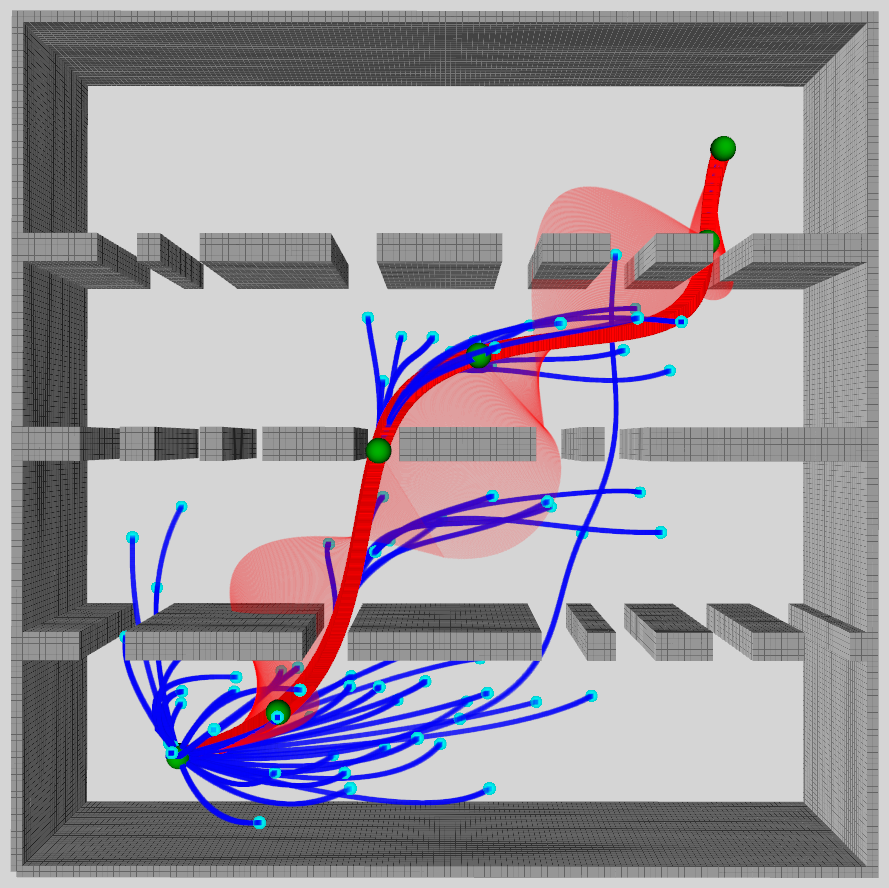
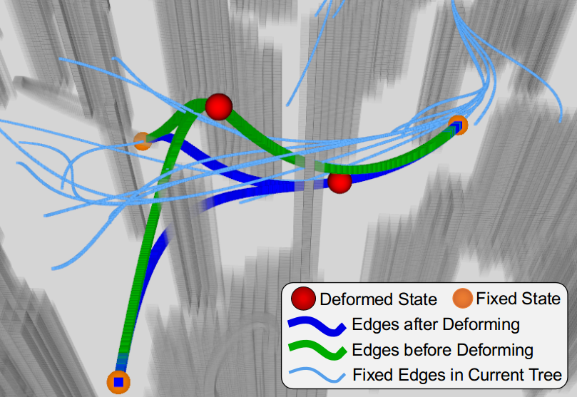
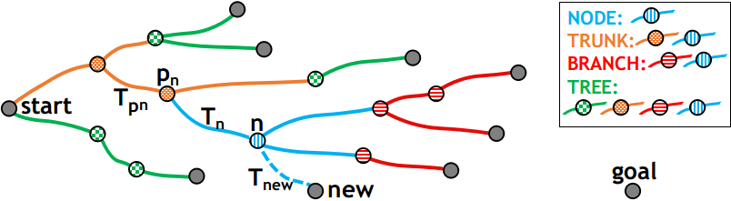
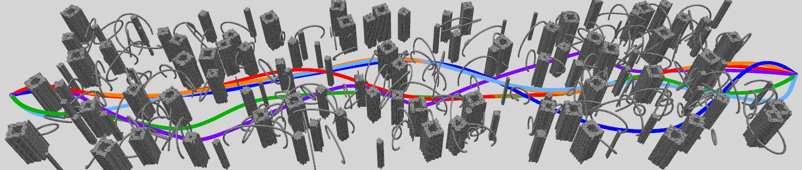
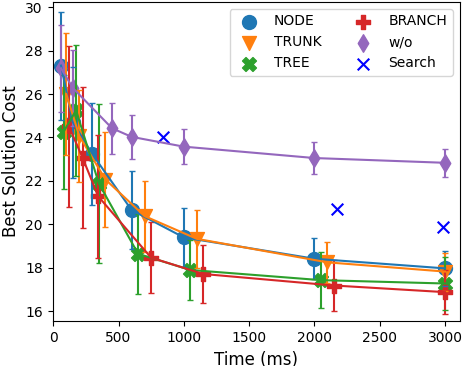

# STD-Trees时空可变形搜索树运动动力学规划（STD-Trees Spatio-temporal Deformable Trees for Multirotors Kinodynamic Planning）：完整忠实学术翻译

> **原文标题**：STD-Trees Spatio-temporal Deformable Trees for Multirotors Kinodynamic Planning  
> **作者**：Hongkai Ye、Chao Xu、Fei Gao  
> **发表信息**：IEEE ICRA 2023  
> **原文 PDF**：[STD-Trees Spatio-temporal Deformable Trees for Multirotors Kinodynamic Planning.pdf](../STD-Trees Spatio-temporal Deformable Trees for Multirotors Kinodynamic Planning.pdf) ｜ **对应中文详解**：[31_STD-Trees时空可变形搜索树运动动力学规划.md](../中文详解/31_STD-Trees时空可变形搜索树运动动力学规划.md)  

---

## 原文第 1 页核心内容与翻译

STD-Trees：面向多旋翼运动动力学规划的时空可变形搜索树
Hongkai Ye、Chao Xu、Fei Gao

摘要——在同伦类数量极多的受约束解空间中，单独使用基于采样的运动动力学规划器往往收敛效率很低。为缓解这一问题，本文引入局部优化，通过以变形单元的形式优化搜索树来促进轨迹树生长，每个单元包含一个树节点及与其相连的全部边。变形同时在空间和时间维度进行，通过高效优化节点状态与边的时间长度实现。变形单元只改变树的局部结构，却能提升相应子树的整体质量。为兼顾计算负担和优化程度，本文研究并比较了由不同变形单元组合而成的多种树部分变形模式，结果均表现出更快的收敛速度。该变形方法可以方便地集成到不同的基于 RRT 的运动动力学规划方法中；数值实验表明，引入时空变形能够显著加快收敛，并优于仅进行空间变形的方法。

I. 引言
最小时间与控制轨迹生成 [1] 长期以来一直用于多旋翼规划，将轨迹生成视为带约束的优化问题。当避碰也被视为约束的一部分时，许多工作 [2]–[6] 首先针对无碰撞几何路径求解最短路径，然后在其附近的自由空间中生成满足运动动力学约束的轨迹。这样得到的局部最优结果属于由先前几何路径决定的某个同伦类。然而，最优轨迹可能位于该特定同伦类之外。较短的路径并不必然对应代价更低的轨迹，因此分层规划过程中目标函数缺乏一致性，会损害对全局最优轨迹的推理能力。

本文提出一种全局轨迹优化方法，旨在获得近似最优的无碰撞轨迹。不同于分层方法，本文将问题拆分为目标相同的较小子问题，并在全局探索整个受约束解空间的过程中直接遵守约束。通过连接离散化的状态样本来生长轨迹树，从而搜索具有不同局部极小值的空间，并在线确定最佳同伦类。单独使用基于采样的变体 [7]–[9] 收敛缓慢，因为恰好在最优解附近采样到状态的概率极低。充分采样有助于组织轨迹树，但耗时过多。Hauer 和 Tsiotras [10] 提出了 DRRT，首先利用样本位置的局部优化来促进路径规划问题的收敛。

本文将这一思想扩展到轨迹规划，并将这种局部优化组件称为变形单元，即一个状态采样节点及与其相连的轨迹边的集合。对于涉及系统动力学的规划，额外的时间维度至关重要。因此，本文提出同时在空间和时间中进行时空（ST）变形，使轨迹树保持更好的组织结构，如图 1 所示。在保持效率的同时设计实用目标函数会带来一些困难。本文采用从状态边界值到解多项式系数的解析映射，以加快代价评估。由于变形整棵树可能开销过高，本文还提出了由不同单元组合形成的多种变形模式。

本文的主要贡献如下：
1) 提出一种用于全局轨迹优化的集成式基于采样的多旋翼运动动力学规划器，通过变形树的部分结构，在形状和时间维度上共同促进轨迹树生长。
2) 提出多种由不同变形单元组合而成的树变形模式，以平衡优化程度和计算负担。

本文得到国家自然科学基金项目（批准号 62003299 和 62088101）及中央高校基本科研业务费的资助。所有作者均来自浙江大学工业控制技术国家重点实验室（中国杭州 310027）以及浙江大学湖州研究院（中国湖州 313000）。通信作者：Fei Gao。电子邮箱：(hkye, cxu, and fgaoaa)@zju.edu.cn。代码：https://github.com/ZJU-FAST-Lab/std-trees

(a) 采用 ST 变形。
(b) 不采用变形。

**图 1**：加入相同数量节点后当前树及最佳轨迹。采用变形进行规划能够获得组织更好的树结构，整体质量更高，并得到更平滑的轨迹。

II. 相关工作
基于采样的几何最短路径规划已经被研究了很长时间。总体而言，不同算法在解空间探索，以及对新样本所带来信息的利用这两个过程上有所差异，由此产生不同的收敛性能。

## 原文第 2 页核心内容与翻译

原始 RRT 算法 [11] 将状态节点简单连接到当前树中的最近节点，探索速度很快，但 Karaman 和 Frazzoli 在 [12] 中证明它会收敛到次优解，并由此提出 RRT* 算法。RRT* 根据从起点出发的最佳代价值选择父节点，并重连局部树结构，在概率为 1 的意义下收敛到最优解。RRT# [13] 解决了 RRT* 利用信息不足的问题，通过级联重连将新信息传播到树的其他部分，并维护由代价一致节点组成的良好生长树。为获得更高的收敛率，近期工作改进采样策略，直接在 Informed Set [14]、Relevant Region Set [15] 或 GuILD 的 Local Subset [16] 中采样。然而，这些设计依赖 L2-Norm 目标；对于目标各异的应用，无法得到采样集的解析形式。

许多研究将局部优化与全局搜索结合，以提升几何最短路径规划的收敛速度。RABIT* [17] 采用 CHOMP [18] 为发生碰撞的边寻找可行替代连接，从而加速搜索。但其收敛率高度依赖于在类似 BIT* [19] 的批量采样和搜索过程中不断收缩基于 L2-Norm 的 informed set；较重的优化也可能妨碍探索不同同伦类。DRRT [10] 不需要任何 informed sampling set，而是优化树中已有部分节点的位置来最小化整棵树的代价。它在每次迭代中维护覆盖搜索空间的良好生长树，因此所得路径质量较高，收敛速度得到改善，这启发了本文的工作。对于运动动力学轨迹规划，INSAT [20] 将轨迹优化结合到离散图搜索中，但高维图搜索使求解时间仍难以接受，而且在每次节点扩展时都会多次优化长轨迹。加权 A* [21]–[23] 虽可加速搜索，但由于放宽了可采纳性准则，最终会生成次优解。在本文的组合方案中，基于采样的搜索从全局角度渐近地推理最优解，而优化只变形树的有限部分，从而保持效率。

III. 问题定义
本文要解决的问题是在复杂环境中高效地为多旋翼寻找近似最优轨迹。从较高层次看，它可表述为一个优化问题。按照 [8, 9, 23, 24]，所最小化的代价是在时间和能量之间的折中，适用于许多应用。约束包括避障、系统动力学、运动学以及起点和终点约束。

根据多旋翼系统的微分平坦性质 [1]，可使用链式积分器的线性模型表示其动力学，四个平坦输出为 px、py、pz（各轴位置）和 ψ（偏航角），它们及其导数构成状态变量。因此，轨迹规划问题可表述为最优控制领域中的线性二次最小时间（LQMT）问题 [8]。对于每个轴（本文不考虑偏航轴），其形式如下：

min
u(t) J =
Z τ
0
(ρ + 1
2u(t)2)dt
(1a)

s.t.
Ax(t) + Bu(t) −˙x(t) = 0,
(1b)
x(0) = xstart, x(τ) = xgoal,
(1c)
G(x(t), u(t)) ⪯0, ∀t ∈[0, τ],
(1d)

其中，τ 为轨迹持续时间，ρ 为在时间和能量之间进行惩罚折中的权重，xstart 为初始状态，xgoal 为目标状态，G ⪯ 0 表示避障约束和高阶导数限制约束。

IV. 时空可变形搜索树
非线性约束，尤其是同伦类丰富的环境，会使整个解空间高度非凸。直接应用非线性规划几乎必然陷入局部极小值。为避免这一局限，本文提出算法 1 所示的基于采样的方法。该算法框架与 DRRTd [10] 类似，但采用了不同的变形方式。总体上，它以运动动力学 RRT* [8] 为基础，融合 RRT# [13] 的特点，并在每次迭代中增加一步，对当前轨迹树的形状和时间持续时间进行变形（第 12、13 行）。搜索框架通过逐步添加状态样本来探查解空间，将问题拆分为较小的子问题。每个子问题都具有式 (1) 的形式，但边界状态不同；求解一个子问题即可得到一个轨迹段（树边）。

A. 树的生长
每次迭代采样状态节点后，根据求解 LQMT 子问题估计的从起点代价值，在 BackwardNear 节点集合 Xbackward 中寻找其最佳父节点。若找到满足条件的最佳父节点，则将采样节点和新边加入树中。随后，该节点尝试连接目标节点以寻找可行解。接下来执行核心步骤，即通过优化若干轨迹边的形状和时间持续时间来进行树变形。该步骤无需增加节点即可降低整棵树的代价。由于投入更多时间进行利用意味着减少探索，变形仅在找到第一个可行解后激活。最后，由于加节点会改变隐式图结构，算法重连部分节点，以期改善其从起点代价值；重连以级联方式执行，将新节点带来的信息传播到树的其他部分。关于算法 1 第 4、5、6 行函数的详细信息，读者可参阅 [8, 9]，本文主要关注树变形部分。

最终轨迹树由许多作为树边的轨迹段组成；起点到终点之间的最优轨迹，则由一系列连续状态之间的轨迹段链组成。

## 原文第 3 页核心内容与翻译

算法 1 时空可变形搜索树
1: 记号：树 T，状态 x，变形单元 U，环境 E，变形类型 L ∈{NODE, TRUNK, BRANCH, TREE}
2: 初始化：T ←∅∪{xstart}
3: 当未满足终止条件时循环
4: xnew ←Sampling(E)
5: Xbackward ←BackwardNear(T, xnew)
6: xn ←ChooseParent(Xbackward, xnew)
7: T ←T ∪{xn, xnew}
8: 如果 TryConnectGoal(xnew, xgoal) 成功则
9: 找到一个解。
10: 结束条件判断
11: 如果找到第一个解则
12: U ←SelectDeformationUnits(xn, L)
13: DeformInOrder(U)
14: 结束条件判断
15: RewireInCascade(T, xnew)
16: 结束循环
17: 返回 T

B. 树边表示
可见，求解 LQMT 子问题是搜索过程的基础，并且每次迭代会多次调用，因此必须尽可能快速。设积分器模型为 s 阶模型，则状态变量为 x(t) = [p(t), · · · , p(s−1)(t)]T，控制量为 u(t) = p(s)(t)。根据 [8, 25]，若暂时忽略所有不等式约束（式 (1d)），无约束 LQMT 问题的最优控制律可由 s−1 次多项式参数化，随后 x(t) 中的每个状态变量均可通过最多 s 次积分得到。因此 p(t) = cTβ(t)，t ∈[0, T]，其中 c ∈R2s 为多项式系数向量，T 为时间持续时间，β(t) = (1, t, t2, · · · , t2s−1)T 为自然基。

由此可知，给定时间持续时间 T 和边界条件 d = [xT(t)|t=0, xT(t)|t=T]T ∈R2s 后，特定 LQMT 问题的最优解即被完全确定，因为已不存在自由度。边界条件可以直接采样，初始 T 按照 [8] 计算。正如我们先前的工作 [26] 所述，多项式系数向量 c 与边界条件向量 d 之间存在光滑双射，也就是多项式的两种描述 {c, T} 与 {d, T} 之间存在解析变换：

d = Af(T)c, c = Ab(T)d, (2)

**图 2**：一个变形单元的变形过程。在该示例中，被变形节点有两个子节点，子节点与父节点一起固定。仅优化被变形边的时间持续时间和被变形节点的状态。

其中 Af(T) 和 Ab(T) 是正向映射矩阵和反向映射矩阵，其元素均可解析确定，具体元素值的计算见 [26]。随后既可以用 {c, T} 计算一条边的代价：

Js(c, T) = ρT +
Z T
0
1
2cTβ(s)(t)β(s)(t)Tc dt
= ρT + 1
2cTQ(T)c, (3)

也可以用 {d, T} 计算：

Js(d, T) = Js(x(t)|t=0, x(t)|t=T, T)
= ρT + 1
2dTM(T)d,
d = [x(t)|t=0; x(t)|t=T], M(T) = ATb(T)Q(T)Ab(T), (4)

上述计算均可解析完成。此前忽略的约束 (1d) 在之后进行检查；若满足约束，则生成一条树边，其代价可用于估计受约束解空间中两个状态样本之间的最优转移代价。轨迹边的这两种表示支持下面的树变形过程。

C. 树变形
在树生长过程中加入新节点时，树中会收集解空间的新信息。然而，由于采样不足，部分节点的从起点代价值可能无法很好地估计实际代价，表现为树生长不理想，尤其是在时间维度上。对边进行变形可以提升树的质量。

给定当前树结构 T，每个节点 n ∈T 包含以下信息：
• xn：节点 n 对应的状态；
• pn：n 在 T 中的父节点；
• Tn：从 pn 到 n 的边的时间持续时间；
• cn：从 pn 到 n 的边的系数向量；
• Cn：n 在 T 中的直接子节点集合；
• gn：沿 T 到达 n 的从起点代价值。

## 原文第 4 页核心内容与翻译

1) 变形单元：若重新定位某个节点、固定其他所有节点并保持节点之间的连接不变，则只有与该重新定位节点相连的边会受到影响。因此，如图 2 所示，本文将一个节点、其父节点到该节点的边以及连接到其子节点的边组成一个变形单元。在一个单元内，通过优化节点状态和这些边的时间持续时间来执行变形；其他节点的状态及边的时间持续时间均保持不变。变形单元的元素集合记为

{xn, Tn} = {xn, Tn, Ti, |i ∈Cn}, (5)

其中 n 是被变形的节点，Tn = {Tn, Ti, |i ∈Cn} 包含所有连接到 n 的边的时间持续时间。注意，与将边系数作为决策变量相比，将节点状态设为决策变量可以隐式消除树节点之间连续性要求施加的等式约束，并减少决策变量数量。

2) 目标设计：优化变形单元时，需要设计合适的目标。变形之后应当能够改善整棵树的质量，从而更有可能找到更优甚至最优解。Hauer 等人 [10] 指出，固定数量采样节点的从起点代价值之和，可以作为所选样本集覆盖的解空间最优值函数的估计。考虑到优化变形单元只会改变节点 n 及其所有后代节点的从起点代价值，而不会影响其他节点，本文将目标设为

gn + Σi∈Dn gi, (6)

其中 Dn 是 n 的全部后代节点集合。还可以为每个节点分配 w ∈[0, 1] 的权重，用来表示该节点构成最终最佳轨迹的可能性；也可用对到达代价的启发式估计替代该权重。该目标表示对以 n 为根的子树进行优化。

随着树不断生长，有 gn = c(xpn, xn) + gpn, (7)，其中 c(xi, xj) 是连接节点 i 和 j 的边代价，可由式 (4) 解析估计。于是，可以用每条树边代价的加权和计算目标。边 (i, j) 的权重通过统计从起点出发、在子树中到达任意其他节点的所有路径中使用该边的路径总数得到。因此目标可写为

gn + Σi∈Dn gi = Σi∈Tn Σj∈Ci djc(xi, xj) = dnc(xpn, xn) + Σi∈Cn dic(xn, xi) + C = Σi∈{n}∪Cn dic(xpi, xi) + C, (8)

其中 Tn 是以 n 为根的子树，dn = 1 + nbdes(n)，nbdes(n) 是 n 的后代节点数，C 是树中其他所有边代价之和，与变形单元中的元素无关。因此，该目标只依赖于变形单元中的边，却表达了子树的质量，并可估计解空间某一部分的值函数。

3) 无约束形式：在树生长过程中，为了更快地探索整个解空间，本文暂时忽略约束并在之后检查。执行变形时，希望更加关注变形单元覆盖的局部空间，并利用树中已经获得的信息。此时应直接处理避障和运动动力学可行性约束（式 (1d)）。

记 G(p[s](t)) ∈ Rs+1 ⪯ 0 为函数型约束，包含避障约束以及速度、加速度和最高 s 阶高阶导数等动力学限制。为消除这些不等式约束，构造惩罚函数，将硬约束转化为软约束。由于这类约束包含无限多个不等式，难以直接处理，本文通过对约束违背进行积分将其转化为有限维形式，并用采样惩罚函数的加权和估计积分。实际上，这些约束在不同边之间是解耦的，即 t ∈[0, Ti] 时的 G(p[s](t)) 仅由 ci 和 Ti 决定。因此，对参数化为 {ci, Ti} 的一条轨迹边，惩罚函数为

Jf(ci, Ti, ki) = Ti/ki Σj=0ki ωj X Tmax[G(ci, Ti, t), 0], (9)

其中 ki 是该边上的采样数，X ∈ Rs+1≥0 是 G 各项对应的惩罚权重向量，(ω0, ω1, · · ·, ωki−1, ωki) = (1/2, 1, · · ·, 1, 1/2) 是按梯形法则得到的求积系数，max[ ] 表示逐元素比较，t = j/ki · Ti 是采样时间戳。将惩罚按边并入目标后，一个变形单元的无约束优化问题为

min xn,Tn Σi∈{n}∪Cn di(Js(ci, Ti) + Jf(ci, Ti, ki)),

ci = { Ab(Ti)[xTpn, xTn]T, i=n; Ab(Ti)[xTn, xTi]T, i∈Cn } (10)

其中 {xn, Tn} 为决策变量。

4) 时空优化：对于变形单元中的一条边 {ci, Ti}，i ∈{n}∪Cn，通过链式法则可得到关于 {xn, Tn} 的解耦目标梯度如下：

∂Js/∂xn = (∂Js/∂ci)(∂ci/∂xn) = Q(T)ci, ∂Jf/∂xn = (∂Jf/∂G)(∂G/∂ci)(∂ci/∂xn), (11)
∂Js/∂Ti = ρ + cTi Q̇(Ti)ci, ∂Jf/∂Ti = Jf/Ti + (∂Jf/∂G)(∂G/∂t)j/ki, (12)

∂Jf/∂G = Ti/ki Σj=0ki ωj X ⊙ max[Sign[G(ci, Ti, j/ki)], 0], (13)

∂ci/∂xn = { [A01b(Ti) A11b(Ti)]T, i=n; [A00b(Ti) A10b(Ti)]T, i∈Cn }, (14)

其中 ⊙ 是 Hadamard 乘积，Sign[·] 表示逐元素指示数值的符号，Amnb(T) 表示按 s 阶划分 Ab(T) 后得到的块元素。相对于其他边时间持续时间的边梯度均为 0。条件分支的计算反映出 xn 作为一条边的尾状态或头状态时的不同情形。

上述公式中唯一尚未定义的部分是 ∂G/∂ci 和 ∂G/∂t。对于避障，希望边的位置与障碍物保持一定间距，因此定义 Go = r − F(pi(t)), (15)，其中 r > 0 是期望的障碍物间距，F(p(t)) 根据边上的位置计算其到最近障碍物的最小距离；该距离可由增量构建 [27, 28] 或批量构建 [29] 的距离场预先计算。对于运动动力学可行性，限制高阶导数幅值并定义 Gk = pi(k)(t)2 − m2k, k ∈{1, 2, · · ·, s}, (16)，其中 mk 是允许的第 k 阶导数最大值。相应梯度为

∂Gk/∂ci = 2β(k)(t)pi(k)(t)T, ∂Gk/∂t = 2β(k+1)(t)T ci pi(k)(t),
∂Go/∂ci = −β(t) ∂F/∂pi(t), ∂Go/∂t = −β̇(t)T ci ∂F/∂pi(t), (17)

其中 ∂F/∂p(t) 通过对距离场插值计算。{ci, Ti} 与 {xpi, xi, Ti} 之间的解析变换无需矩阵求逆，因此能高效计算目标和梯度。得到梯度后，使用数值优化求解该优化问题。由于距离场 F 的插值会引入非光滑性，BFGS 等 Newton 型方法有时不准确或会失败，因此本文采用 bundle methods 处理这一问题，并使用 Limited Memory Bundle Method（LMBM）[30]。 
## 原文第 5 页核心内容与翻译

**图 3**：变形模式示意图。起始节点和所有叶节点保持固定。

公式 (13)：
\[
\frac{\partial J_f}{\partial G}=\frac{T_i}{k_i}\sum_{j=0}^{k_i}\omega_jX\odot\max[\operatorname{Sign}[G(c_i,T_i,j/k_i)],0].
\]
公式 (14)：
\[
\frac{\partial c_i}{\partial x_n}=\begin{cases}[A_b^{01}(T_i)^T\ A_b^{11}(T_i)^T]^T,&i=n\\[A_b^{00}(T_i)^T\ A_b^{10}(T_i)^T]^T,&i\in C_n.\end{cases}
\]
其中，\(\odot\) 是 Hadamard 乘积，\(\operatorname{Sign}[\cdot]\) 表示逐元素指示数值符号，\(A_b^{mn}(T)\) 表示将 \(A_b(T)\) 按阶数 \(s\) 划分后得到的块元素。相对于其他边时间持续时间的边梯度均为 0。条件分支反映了 \(x_n\) 是边的尾状态还是头状态。

上述公式中唯一尚未定义的部分是 \(\partial G/\partial c_i\) 和 \(\partial G/\partial t\)。为实现避障，定义
\[
G_o=r-F(p_i(t)), \tag{15}
\]
其中 \(r>0\) 是期望的障碍物间距，\(F(p(t))\) 计算边上给定位置到最近障碍物的最小距离。该距离可由增量构建 [27, 28] 或批量构建 [29] 的距离场预先计算。为保证运动动力学可行性，限制高阶导数幅值并定义
\[
G_k=p_i^{(k)}(t)^2-m_k^2,\quad k\in\{1,2,\cdots,s\}, \tag{16}
\]
其中 \(m_k\) 是允许的第 \(k\) 阶导数最大值。相应梯度为
\[
\frac{\partial G_k}{\partial c_i}=2\beta^{(k)}(t)p_i^{(k)}(t)^T,\quad \frac{\partial G_k}{\partial t}=2\beta^{(k+1)}(t)^Tc_ip_i^{(k)}(t),
\]
\[
\frac{\partial G_o}{\partial c_i}=-\beta(t)\frac{\partial F}{\partial p_i(t)},\quad \frac{\partial G_o}{\partial t}=-\dot\beta(t)^Tc_i\frac{\partial F}{\partial p_i(t)}. \tag{17}
\]
其中，\(\partial F/\partial p(t)\) 通过距离场插值计算。\(\{c_i,T_i\}\) 与 \(\{x_{p_i},x_i,T_i\}\) 之间的解析变换无需矩阵求逆，因此能高效计算目标和梯度。得到梯度后，使用数值优化求解该问题。由于距离场 \(F\) 的插值会引入非光滑性，BFGS 等 Newton 型方法有时不准确或会失败，因此采用 bundle methods；本文使用 Limited Memory Bundle Method（LMBM）[30]。

### 5) 变形模式

优化一个变形单元可以在其他树部分保持不变的同时，更充分地探索其周围的局部解空间。算法 1 的每次迭代中，当前树拓扑可能因添加新节点以及执行 `RewireInCascade`（第15行）而改变。对更多树部分施加变形可以提高整体树质量，但会增加计算负担。因此提出四种模式：
1. **NODE**：仅优化包含 \(n\) 及与其相连边的一个变形单元。
2. **TRUNK**：沿父指针从 \(n\) 向上追溯至起始节点的直接子节点，优化沿途单元，并按从该子节点到 \(n\) 的顺序变形；这是 DRRT [10] 的策略。
3. **BRANCH**：优化以 \(n\) 为根的子树中的所有节点和边，按从 \(n\) 开始的广度优先顺序处理，排除叶节点。
4. **TREE**：优化整棵树中除起始节点和叶节点外的所有节点和边，按从起始节点直接子节点开始的广度优先顺序处理。
各模式的有效性和效率将在第 V-B 节研究。

## 原文第 6 页核心内容与翻译

### V. 数值结果

#### A. 实验设置

数值比较中设 \(s=3\)，即用三阶积分器对多旋翼系统建模。时间权重 \(\rho=100\)。动力学限制为速度 5 m/s、加速度 7 m/s²、加加速度 15 m/s³。碰撞检测地图预先构建为分辨率 0.1 m 的占据栅格，障碍物膨胀 0.2 m。实验 V-B 使用 3.4 GHz Intel i7-6700 台式机；实验 V-B 和 V-C 使用 2.6 GHz Intel i7-10750H 计算机。

#### B. 模式比较

将无变形方法（w/o）及第 IV-C.5 节四种变形模式相互比较，并与基于搜索的运动动力学规划器比较。基于搜索的方法采用加权 A* [22]，以 1.7、2.3、2.8 三种权重放大启发式项。每种变体运行 100 次，时间预算 3 s。一次试验的环境和最终轨迹见图 4。图 5 表明，所提出方法在毫秒内找到首个解并快速收敛；与基线（w/o）相比，所有时空变形模式的收敛速率均显著提高。

**图 4**：模式比较环境及一次试验的最终轨迹。NODE、TRUNK、BRANCH、TREE、w/o 和权重 1.7 的基于搜索方法分别为浅蓝、橙、红、绿、紫和深蓝色。所提出模式生成了更平滑且代价更低的轨迹，尤其是 BRANCH（红色）。

**图 5**：变形模式与基于搜索方法 [23] 的收敛性比较。短线表示标准差。未放大启发式项的方法需要数十秒，未显示。

不同模式的时空变形规划均带来改进。其中 BRANCH 略优于 TREE，且显著优于 NODE 和 TRUNK。原因可能是新采样点带来的潜在改进主要位于子树，树的其他部分较少受影响；因此仅变形子树在计算成本与树质量改进之间取得了良好平衡。相比之下，不同权重的基于搜索方法需要更长时间才能得到解，且代价更高。

#### C. 变形比较

所提出变形方法兼容不同的基于采样的运动动力学规划器，并集成到 kRRT、kRRT* 和 kRRT# 三种 RRT 方法中。时空变形、仅空间变形和不变形分别用后缀 -ST、-S 和无后缀表示；每种变形采用 BRANCH 模式。每种方法运行 100 次，时间预算 7 s。图 6 表明，对所有 RRT 方法，两种变形都显著加快收敛。表 I 的统计结果显示，时空变形比仅空间变形产生执行时间和代价更低的轨迹，说明在时间维度变形是有效的。

**图 6**：不同搜索方案的收敛性比较，将时空变形（-ST）和仅空间变形（-S）与独立的基于采样运动动力学规划器比较。短线表示标准差。

**表 I**：相同计算时间后不同变形方法的轨迹持续时间和代价。

| 方法 | 轨迹持续时间（s）（均值 / 标准差） | 轨迹代价（均值 / 标准差） |
|---|---:|---:|
| kRRT-w/o | 21.65 / 2.39 | 26.40 / 2.98 |
| kRRT-S | 21.42 / 1.83 | 22.18 / 1.84 |
| kRRT-ST | 14.49 / 0.74 | 16.49 / 0.99 |
| kRRT*-w/o | 18.12 / 0.34 | 21.65 / 0.44 |
| kRRT*-S | 17.47 / 0.63 | 18.18 / 0.53 |
| kRRT*-ST | 13.75 / 0.45 | 15.37 / 0.57 |
| kRRT#-w/o | 18.37 / 0.49 | 21.87 / 0.47 |
| kRRT#-S | 16.94 / 0.73 | 17.61 / 0.58 |
| kRRT#-ST | 13.47 / 0.56 | 15.12 / 0.64 |

## 原文第 7 页核心内容与翻译

### VI. 结论

本文提出一种面向多旋翼飞行器的基于采样的运动动力学规划方法，通过对选定树边在空间和时间上进行变形，将局部优化结合到规划中。优化在变形单元内高效执行，变形单元包含一个节点的状态以及与其相连边的时间持续时间。尽管只有树的有限部分发生变形，每次添加节点后子树的整体质量都得到改善，并能维持一棵生长良好的树。通过变形选定节点的状态及相关边的时间持续时间，而无需添加更多节点，规划收敛得到改善。基准结果表明，集成所提出的变形方法可显著加快收敛速度。本文公开了源代码。

### 第5–7页处理范围说明

第5–7页已翻译至第 VI 节结论；第7页后半部分为参考文献，保留原文以保持作者、题名、出版信息和引用编号准确。第8页及以后未处理。
