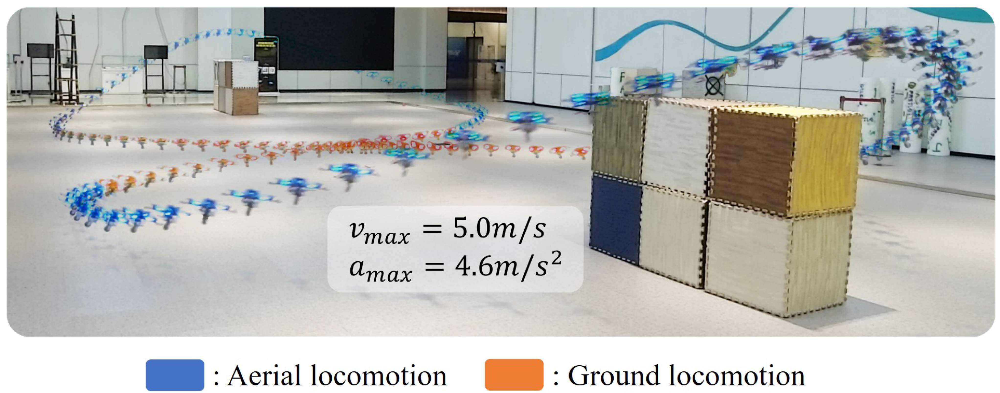
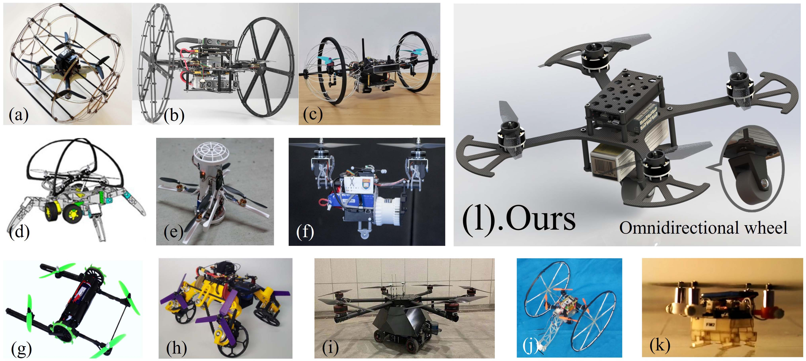
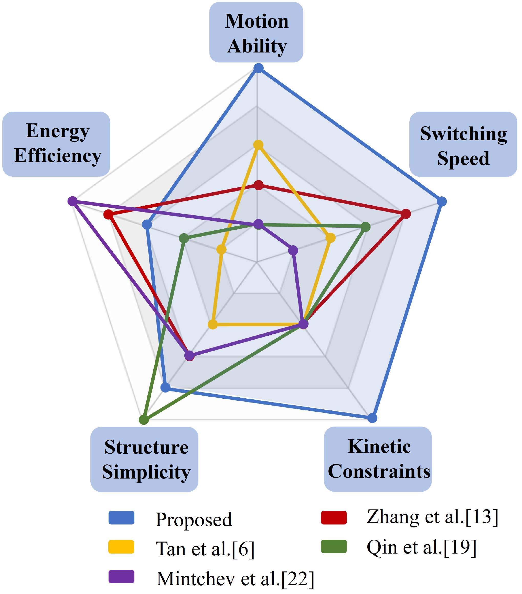
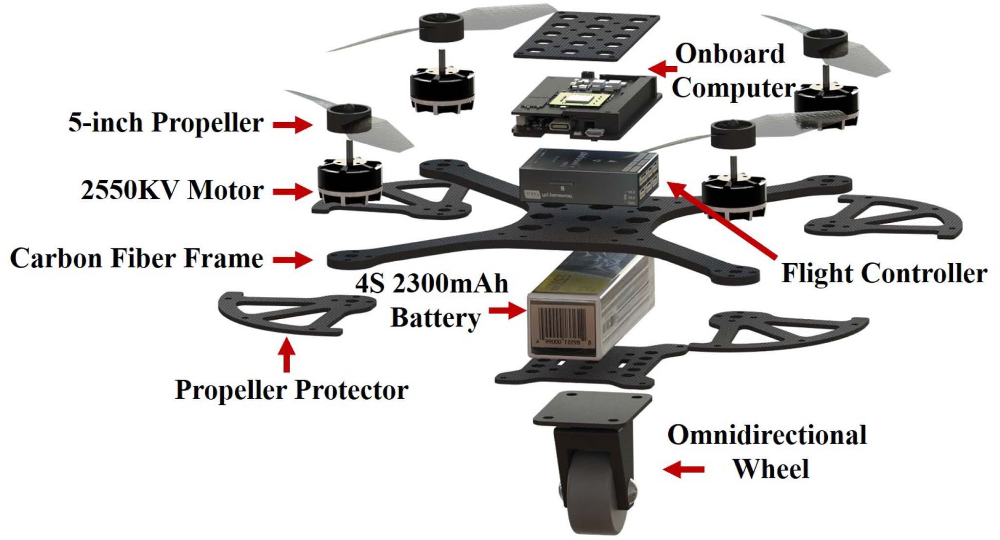
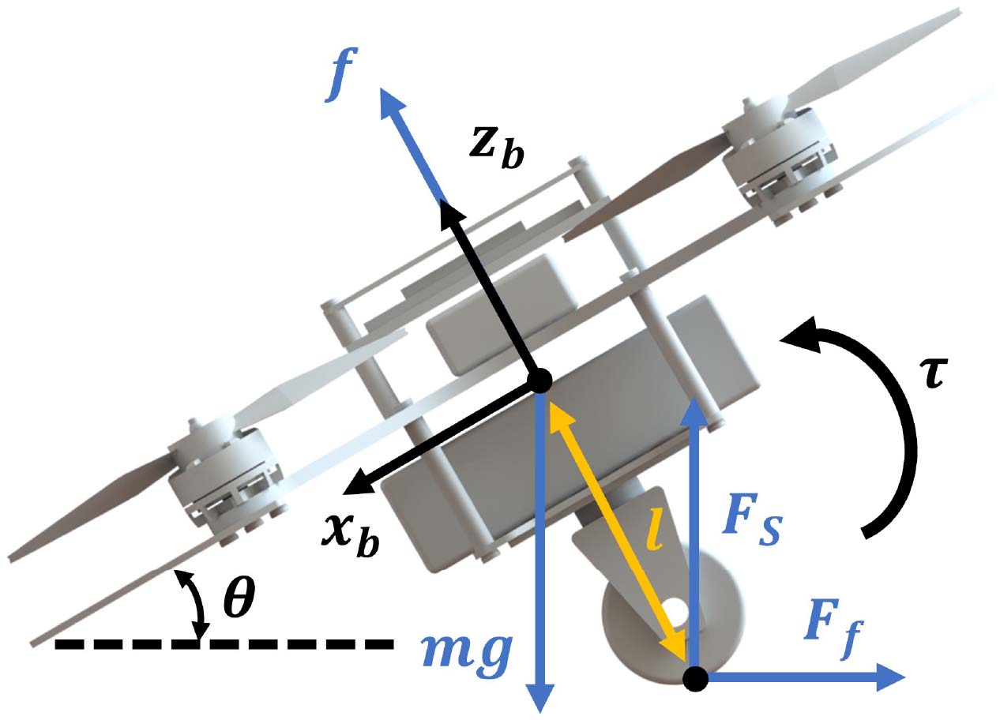
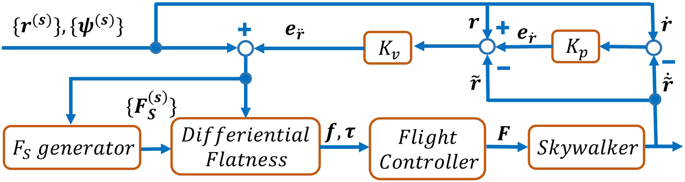
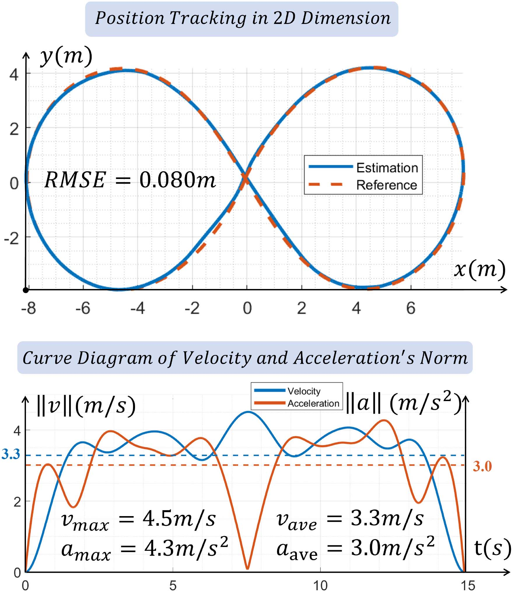
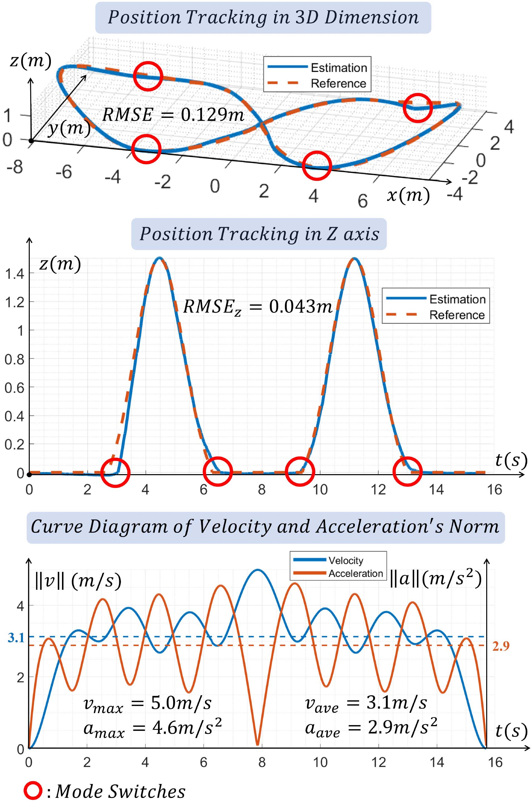
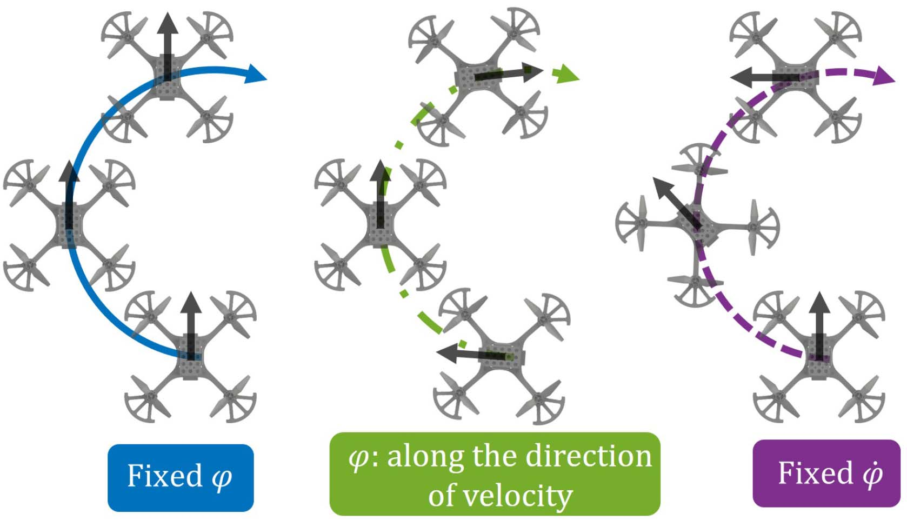
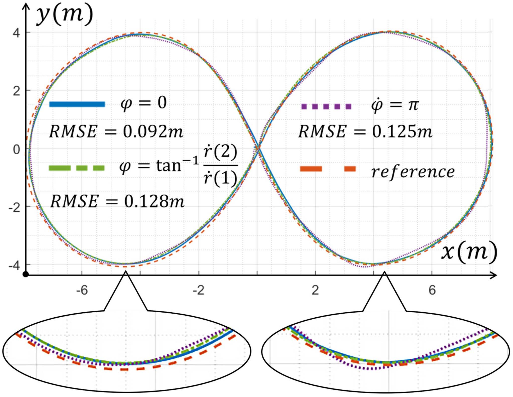

# Skywalker紧凑灵活空地全向移动机器人（Skywalker A Compact and Agile Air-Ground Omnidirectional Vehicle）：完整忠实学术翻译

> **原文标题**：Skywalker A Compact and Agile Air-Ground Omnidirectional Vehicle  
> **作者**：Neng Pan、Jinqi Jiang、Ruibin Zhang、Chao Xu、Fei Gao  
> **发表信息**：IEEE Robotics and Automation Letters (RA-L), Vol. 8, No. 5, May 2023  
> **原文 PDF**：[Skywalker A Compact and Agile Air-Ground Omnidirectional Vehicle.pdf](../Skywalker A Compact and Agile Air-Ground Omnidirectional Vehicle.pdf) ｜ **对应中文详解**：[32_Skywalker紧凑灵活空地全向移动机器人.md](../中文详解/32_Skywalker紧凑灵活空地全向移动机器人.md)  

---

## 原文第 1 页核心内容与翻译

Skywalker：紧凑灵活的空地全向移动机器人
Neng Pan
, Jinqi Jiang
, Ruibin Zhang
, Chao Xu
, Senior Member, IEEE, and Fei Gao
, Member, IEEE
摘要——利用多旋翼飞行器与地面车辆的互补优势，空地车辆凭借出色的机动性和卓越的续航能力，在各个领域展现出巨大潜力。然而，现有大多数工作采用复杂机构，且未能开发出能够高精度跟踪挑战性轨迹的控制器，这严重限制了其应用。在本文中，我们首先提出一种名为 Skywalker 的空地车辆设计，其基于现成的全向轮，采用简洁而坚固的机构。此外，我们在考虑支撑力和摩擦力的情况下推导了该车辆的微分平坦性，并提出一种适用于高速空地混合轨迹跟踪和平滑模式切换的统一控制器。同时，我们开展了全面实验并进行了基准对比，以验证系统的优异性能。实验表明，该系统能够跟踪速度最高达 5.0 m/s 的轨迹，并最多节省 75.2% 的能量。
索引词——空中系统：应用；空中系统：机构与控制；运动控制。
I. 引言
I
近年来，多旋翼飞行器凭借高机动性和悬停能力，在包裹配送、空中摄影以及未知环境探索等多个领域受到广泛关注 [1]。然而，限制多旋翼飞行器应用的最突出短板是其较低的能量效率 [2]。例如，大规模环境探索和长距离配送受益于多旋翼飞行器的机动性，但同时也对其续航能力提出了巨大挑战。此外，当任务要求携带较大载荷这一多数任务中的必要条件时，多旋翼飞行器的能量效率会显著下降，使这一困境更加严峻。
相比之下，其他广泛使用的无人车辆，例如无人地面车辆（UGV）[3]，通常具有令人满意的能量效率——典型地面车辆可运行
Manuscript received 18 August 2022; accepted 28 February 2023. Date of
publication 14 March 2023; date of current version 20 March 2023. This letter
was recommended for publication by Associate Editor M. Garratt and Editor P.
Pounds upon evaluation of the reviewers’ comments. This work was supported
in part by the National Natural Science Foundation of China under Grants
62003299 and 62088101, and in part by the Fundamental Research Funds for
the Central Universities. (Corresponding author: Fei Gao.)
Neng Pan, Ruibin Zhang, Chao Xu, and Fei Gao are with the State Key
Laboratory of Industrial Control Technology, Zhejiang University, Hangzhou
310027, China, and also with the Huzhou Institute, Zhejiang University, Huzhou
313000, China (e-mail: panneng_zju@zju.edu.cn; 3170106067@zju.edu.cn;
cxu@zju.edu.cn; fgaoaa@zju.edu.cn).
Jinqi Jiang is with the School of Future Technology, Harbin Institute of
Technology, Harbin 150001, China (e-mail: Jinqi_J@163.com).
Digital Object Identifier 10.1109/LRA.2023.3256920
1–3 小时，而多旋翼飞行器的典型续航时间为 5–30 分钟 [4]。这主要是因为多旋翼飞行器的大部分能量都消耗在抵消重力上，而地面车辆主要需要克服的是摩擦力。然而，运动学约束和机动性不足限制了地面车辆的应用。例如，道路被石块阻挡时，地面车辆可能不得不绕行，而多旋翼飞行器则可以直接飞越障碍物。
因此，将多旋翼飞行器与地面车辆结合起来，在保持多旋翼飞行器强大机动性的同时发挥地面车辆高能量效率的互补优势，是一种直观的思路。这类空地车辆还可应用于管道、污水渠和隧道等空中运动受限的狭窄场景，从而将多旋翼飞行器拓展到更广泛的领域。同时，单独的空地车辆即可完成大规模环境探索和救援等挑战性任务，而这些任务通常需要由多旋翼飞行器和地面车辆组成的协作机器人系统来完成，如文献 [5] 所述。
此前研究人员已经开发了许多种空地车辆构型 [6]–[23]，但其中大多数存在一些主要缺陷，具体将在第 II 节讨论。
在本文中，我们基于以往工作的启发，开发了一种采用简洁而坚固机构的新型空地车辆构型，并将其命名为 Skywalker。此外，我们提出了一种考虑支撑力和摩擦力、基于微分平坦性的统一控制器。随后，我们开展了全面实验，展示系统跟踪高速轨迹和进行平滑模式切换的优异能力。最后，我们将该系统与其他不同构型的代表性工作进行比较，发现它在大多数性能指标上均优于其他系统。图 3 展示了基准对比结果，具体内容见第 V 节。
本文的主要贡献总结如下：
1) 设计了一种采用基于全向轮的简洁机构的空地车辆。
2) 在考虑支撑力和摩擦力的情况下，推导了该车辆的微分平坦性。
3) 提出了一种适用于高速空地运动和平滑模式切换的统一控制器。
4) 开展了全面实验，验证系统的控制性能和能量效率，并与其他代表性工作进行了基准对比。
本文的组织结构如下：第 II 节介绍以往工作的优缺点；第 III 节介绍所提系统的机械设计与实现；第 IV 节详细阐述所提系统的建模、微分平坦性变换和控制器设计；第 V 节给出全面实验和基准对比；最后，第 VI 节总结全文。
2377-3766 © 2023 IEEE. Personal use is permitted, but republication/redistribution requires IEEE permission.
See https://www.ieee.org/publications/rights/index.html for more information.

---

## 原文第 2 页核心内容与翻译

PAN 等：SKYWALKER：一种紧凑灵活的空地全向移动机器人
2535

**图 1**：
空地模式切换实验示意图。

**图 2**：
不同系统的对比。（a）Kalantari 等人 [12] 的基于被动笼的车辆；（b）Zhang 等人 [13] 的基于被动轮的车辆；（c）Yang 等人 [17] 的基于被动轮的车辆；（d）Li 等人 [20] 的基于六足底盘的车辆；（e）Morton 等人 [23] 的基于驱动轮的车辆；（f）Qin 等人 [19] 的基于被动轮的车辆；（g）Mintchev 等人 [22] 的基于驱动轮的车辆；（h）David 等人 [11] 的基于驱动轮的车辆；（i）Tan 等人 [6] 的基于驱动轮的车辆；（j）Tanaka 等人 [8] 的基于驱动轮的车辆；（k）Mulgaonkar 等人 [21] 的基于腿式机构的车辆；（l）本文基于全向轮的车辆。

所提系统。第 IV 节详细阐述所提系统的建模、微分平坦性变换和控制器设计。第 V 节给出全面实验和基准对比。最后，第 VI 节总结全文。
II. 相关工作
A. 基于驱动轮的车辆
实现空地运动的一种基本思路，是为多旋翼飞行器增加驱动轮。Tan 等人 [6] 将一架六旋翼飞行器安装在四轮驱动底盘上，使车辆在空中和地面运动模式下都易于控制，如图 2（i）所示。Suarez 等人 [7] 采用了类似设计。Tanaka 等人 [8] 在四旋翼飞行器两侧增加两个驱动轮，使地面运动模式的动力学表现为差速车，如图 2（j）所示。文献 [9]、[10]、[11] 采用了类似的驱动轮，如图 2（h）所示。Mintchev 等人 [22] 提出了一种可变形车辆，其机械臂可以折叠，并通过履带在地面行驶。该设计使车辆具备出色的越野能力，但导致模式切换迟缓。作为获得更好地面控制性能的代价，上述带有额外执行器的设计相对较重，会给车辆的空中运动模式增加不可忽略的负担，这可能背离节省能量的初衷。
Authorized licensed use limited to: National Institute of Technology- Delhi. Downloaded on August 24,2026 at 05:48:52 UTC from IEEE Xplore.  Restrictions apply.

---

## 原文第 3 页核心内容与翻译

这会增加飞行运动模式下车辆的负担，与节省能量的初衷相矛盾。
B. 基于被动轮的车辆
研究人员 [12]–[18] 在无人机上安装较轻的被动轮、圆柱形笼体或球形外壳，如图 2(a)–(c) 所示。这些车辆主要由推力的水平分量驱动，因此不需要额外的执行器，机构也更加简洁。Qin 等人 [19] 在仿生旋翼机底部安装一个小型被动轮，以尽量减小额外装置的重量，如图 2(f) 所示。
然而，这些设计大多存在一个共同缺点：偏航角控制需要同时抵抗较大的摩擦力，导致低推力下的控制性能较差。此外，现有工作都没有实现能够在地面运动模式下跟踪高速（∥v∥> 1.5 m/s）轨迹的系统，这与多旋翼飞行器较强的激进轨迹跟踪能力（∥v∥> 5 m/s）形成对比。
另一方面，基于驱动轮或被动轮的典型设计通常具有非完整运动学约束，
例如差速车辆模型 [11]、[13]–[17]、[23] 或 Ackerman 模型 [6]、[7]，从而导致偏航角与速度控制相互耦合。在摄影、探索以及其他必须主动控制偏航角以获得更大传感器感知范围的场景中，这些约束会严重限制其应用。
C. 控制
从运动控制角度看，采用统一动力系统的既有工作 [12]–[19] 大多没有针对两种运动模式提出统一控制器，而是倾向于分别设计两个控制器，通常会导致模式切换迟缓。此外，如 [24] 所述，稳定子系统之间的缓慢切换可能引发不稳定，这一特性给车辆的规划与控制带来了挑战。
要实现统一控制，需要一种能够描述车辆在两种运动模式下动力学的统一方法。
对于多旋翼飞行器，简化控制过程的典型方法是采用微分平坦变换，该方法也便于规划过程 [25]。
However, unlike multicopters, ground vehicles are subjected to
support and friction forces, which breaks the property of differ-
ential flatness deduced in [25]. Therefore, a unified controller
based on differential flatness considering support and friction
forces for high-speed trajectory tracking is urgently needed.
III. 硬件设计与实现
In general, the proposed air-ground vehicle can be built with a
generic multicopter and a wheel that can be driven by the thrust
and rotate freely along its shaft and installation axis.
In practice, we use a quadrotor as the multicopter part to
simplify modeling and control. The quadrotor is built with a
carbon fiber board with a wheelbase of 250 mm. The quadrotor
consists of four T-Motor F60 KV2550 brush-less motors, a
Hobbywing 60 A 4-in-1 ESC, Gemfan 51477 propellers, a
Holybro Pixhawk4 Mini flight controller running PX4 firmware
and an ACE 4S 2300mAh Li-Po battery. The maximum thrust of
the vehicle is 7.2 kg. To ensure the the endurance and mobility
TABLE I
WEIGHT OF EACH COMPONENT
of the vechile, the maximum take-off weight is set at 50% of the
maximum thrust, which indicates the vehicle can carry payloads
up to 2.7 kg. To avoid the propellers from crashing into the
ground during arming and disarming, we install four propeller
protectors below the motors.
For the wheel part, we attach an off-the-shelf passive omni-
directional wheel, which is widely used in carts and suitcases,
to the bottom of the quadrotor. The wheel weighs 105 g, adding
little burden to the vehicle in aerial locomotion mode, yet pro-
viding the vehicle with a relatively simple way to move freely
on the ground.
The onboard computer is NVIDIA Xavier NX, which com-
municates with the flight controller via MAVROS, transmitting
IMU and control command data. The weight of each component
is listed in Table I, and the illustration of hardware is shown in
Fig. 4.
IV. 控制
A. 动力学模型
下面介绍后续讨论所需的两个坐标系：机体坐标系 (xb −yb −zb) 和 FLU（Forward-Left-Up，前-左-上）世界坐标系 (xw −yw −zw)。得益于统一的推进系统，空中和地面动力学的唯一差别在于支撑力 FS 是否为零，因此本节重点讨论地面运动模式的动力学。受力分析如图 5 所示。
首先，假设车轮半径、偏心距和空气阻力均可忽略，且车辆在平坦地面上运动。接着，假设车轮始终沿车体速度方向运动，因为车轮的转动过程相对瞬时，可以忽略。令车辆状态为 x = {r, R}，其中 r 为车辆质心在世界坐标系中的位置，R 为机体相对于世界坐标系的旋转矩阵。输入为 u = {f, τ}，其中 f 为总推力，τ 为推力产生的力矩。于是，根据牛顿-欧拉方程，可得动力学模型：
m¨r = −mge3 + FSe3 + Rfe3 −RβFfe1,
(1)
M ˙ω = τ −ω × Mω + RT (FSe3 −RβFfe1) × le3.
(2)
在式 (1) 中，m 为车辆总质量，g 为重力加速度，e3 = (0, 0, 1)T，e1 = (1, 0, 0)T，FS 为支撑力，
Authorized licensed use limited to: National Institute of Technology- Delhi. Downloaded on August 24,2026 at 05:48:52 UTC from IEEE Xplore.  Restrictions apply.

---

## 原文第 4 页核心内容与翻译

PAN 等：SKYWALKER：一种紧凑灵活的空地全向移动机器人
2537

**图 3**：
基准比较的激光雷达示意图。

**图 4**：
硬件示意图。（铝柱、螺栓等结构部件已隐藏）

**图 5**：
车辆在地面运动模式下的受力分析。

其中，Ff 为摩擦力，Rβ =
⎡
⎣
cos(β)
−sin(β)
0
sin(β)
cos(β)
0
0
0
1
⎤
⎦,
β = tan−1( ˙r(2)
˙r(1)).
在式 (2) 中，M 为惯性矩阵，ω 为机体系中的角速度，l 为质心与车轮中心之间的距离。
根据摩擦定律，有 Ff = FSμ，其中 μ 为滚动摩擦系数。
B. 考虑摩擦力的微分平坦性
本节参考文献 [26] 中的推导，说明考虑摩擦力时，以 u 为输入的车辆动力学仍具有微分平坦性。我们选择的平坦输出为
ξ =

r[s0], ϕ[s1], F [s2]
S

,
(3)
其中，x[s] 表示有限阶导数 (x, ˙x, . . ., x(s)) 的堆叠，s0、s1 和 s2 分别为导数阶数，ϕ 为偏航角。与多旋翼飞行器通常采用的平坦输出 [25] 相比，我们增加了一个额外项 F [s2]
S
，该项将在下一小节讨论。下面详细给出平坦性变换
(x, u) = Ψ(ξ)
(4)
，用于车辆动力学式 (1) 和式 (2)。
首先，用机体轴 xb = Re1 和 yb = Re2 左乘式 (1)，
(Rei)T

¨r + ge3 −FS
m e3 −R f
me3 + Rβ
FS
m μe1
= 0,
∀i ∈{1, 2} ,
(5)
其中，
(Rei)T R f
me3 = ei
T RT R f
me3 = 0, ∀i ∈{1, 2} .
令
ζ =

¨r + ge3 −FS
m e3 + Rβ
FS
m μe1
,
(6)
可得 xb ⊥ζ 且 yb ⊥ζ，因此 zb // ζ。当系统处于稳态位置时，ζ = (g −FS/m)e3，表明 zb 与 ζ 方向相同。因此有
zb = N(ζ),
(7)
其中 N(x) =
x
∥x∥。用 zb 左乘式 (1)，可得
f = zb
T (m¨r + mge3 −FSe3 + RβFSμe1).
(8)
接下来，利用 Hopf 丛 [27] 将偏航四元数 qϕ 和倾斜四元数 qz 分解为
qϕ = (cos(ϕ/2), 0, 0, sin(ϕ/2))T .
(9)
根据 Hopf 丛，qz 可将 e3 旋转至 zb，从而有：
qz =
1
2(1 + zb(3))
(1 + zb(3), −zb(2), zb(1), 0)T .
(10)
旋转矩阵为
R = R(qz ⊗qϕ),
(11)
其中，R 表示从四元数到旋转矩阵的变换。根据 ˙R = Rˆω，有 ω = (RT ˙R)∨，其中 ˆω
Authorized licensed use limited to: National Institute of Technology- Delhi. Downloaded on August 24,2026 at 05:48:52 UTC from IEEE Xplore.  Restrictions apply.

---

## 原文第 5 页核心内容与翻译

其中，(ˆω)∨= ω 表示 ω 的反对称矩阵，
ω = 2(qz ⊗qϕ)−1 ⊗( ˙qz ⊗qϕ + qz ⊗˙qϕ).
(12)
展开式 (12) 可得：
ω =
⎡
⎣
˙zb(1)sϕ −˙zb(2)cϕ −˙zb(3)(zb(1)sϕ −zb(2)cϕ)/(1+ zb(3))
˙zb(1)cϕ + ˙zb(2)sϕ −˙zb(3)(zb(1)cϕ + zb(2)sϕ)/(1+ zb(3))
( ˙zb(1)zb(2) −˙zb(2)zb(1))/(1+ zb(3)) + ˙ϕ
⎤
⎦,
(13)
其中，sϕ 和 cϕ 分别表示 sin(ϕ) 和 cos(ϕ)，对式 (7) 求导可得
˙zb = DN (ζ)T
...r −
˙FS
m e3 + Rβ ˆ˙β FS
m μe1 + Rβ
˙FS
m μe1
,
(14)
其中，DN(x) = (I −xxT /xT x)/∥x∥。
此外，利用 ω、˙ω 和 R，根据式 (2) 可以得到 τ。由于 ˙ω 可以表示为平坦输出 ξ 的组合，因此可知该车辆的动力学系统是微分平坦的。
C. 支撑力生成
作为微分平坦输出的一个维度，FS 的轨迹独立于 (r[s0], ψ[s1])。地面运动模式能够节省的能量由支撑力 FS 决定：FS 越大，车辆消耗的能量越少。为在保持 FS 轨迹平滑且可执行的同时提高能量效率，需要设计合理而精细的函数。
由于平坦输出的其他维度 (r[s0], ψ[s1]) 由规划器生成，我们根据水平加速度 ah = [¨r(1),¨r(2)] 和倾角 θ(qz) 为 FS 设计了分段函数。
FS(ah) =
⎧
⎨
⎩
FSpre,
0 < ∥ah∥≤alower
mg −
m∥ah∥
tan(θmax),
alower < ∥ah∥≤aupper
0,
∥ah∥> aupper ∪r(3) > 0
(15)
其中，
aupper = tan(θmax)g,
alower = tan(θmax)(g −FSpre/m).
1) 0 < ∥ah∥≤alower：当 ∥ah∥ 较小时，由于车辆具有类似倒立摆的结构，需要足够大的力矩来稳定姿态。在这种情况下，我们将 FS 设为常数 Fpre，以避免频繁改变推力而引起振动。根据倾角 θ(qz)，可以推导出车辆维持稳定平衡所需的支撑力下限：
FS(θ) =
2tan( π
2 −θmax)mg
sin2θ + 2tan( π
2 −θmax).
(16)
对于最大倾角 θmax 小于 π/4 的车辆，FS 随 θ 增大而减小，因此有：
FSpre =FSmin =FS(θmax)=
2tan( π
2 −θmax)mg
sin2θmax+2tan( π
2 −θmax).
(17)

**图 6**：
空中和地面两种运动模式的统一级联位置-速度控制器框架。

2) alower < ∥ah∥≤aupper：当 ∥ah∥ 大于最大倾角 θmax 和 FSpre 条件下车辆能够提供的加速度时，车辆必须减小支撑力，以释放更多推力来满足期望加速度。
3) ∥ah∥> aupper：由于 FS 应始终为正，车辆在地面运动模式下能够执行的最大加速度为 alim。当要求车辆到达 ∥ah∥> aupper 的期望状态时，我们将 FS 设为零，并将 ∥ah∥ 限制为 aupper。在这种情况下，车辆无法跟上轨迹；但可以在规划阶段为地面运动模式增加加速度约束，从而避免这种情况。
4) r(3) > 0：当期望高度 r(3) > 0 时，系统不与地面接触，因此直接将 FS 设为零。同时，利用链式法则可以容易地得到 FS 的各阶导数。
D. 统一控制器设计
得益于第 IV-B 节推导的统一微分平坦变换，我们可以对两种运动模式采用统一控制器。控制器框架如图 6 所示，主要是一个级联位置-速度控制器。首先给定期望状态 (r[s0], ϕ[s1])，并将速度控制器的比例误差叠加到 ¨r 上。然后依据准则 (15) 计算期望支撑力。随后，通过应用平坦性变换 (4)，得到总推力 f 以及指令 {R, ω, τ}，再由飞控将其转换为各电机的推力 F。最后，将位置比例误差反馈至速度控制器。所提控制器的轨迹跟踪性能将在第 V 节中进行评估。
E. 推力系数在线辨识
注意，第 IV-B 节计算的是总推力 f。实际中飞控要求的推力信号通常是归一化数值 F ∈[0, 1]，因此需要推力系数 kf 将 f 转换为 F： F =
f
mkf .
kf 可通过预先标定测得，但会随电池电压、空气密度、螺旋桨完整性等因素变化。因此采用带遗忘因子的递归最小二乘算法 [28] 在线辨识 kf，算法形式为：
xk+1 = xk +
Pkak+1
λ + aT
k+1Pkak+1
(bk+1 −aT
k+1xk),
Pk+1 = Pk
λ
1 −
aT
k+1ak+1Pk
λ + aT
k+1ak+1Pk
,
(18)
其中，ai 和 bi 是观测值，xi 是待更新的目标量，P0 = 1/a2
0，λ 为遗忘因子，通常取值范围为 [0.95,1]。根据模型
Authorized licensed use limited to: National Institute of Technology- Delhi. Downloaded on August 24,2026 at 05:48:52 UTC from IEEE Xplore.  Restrictions apply.

---

## 原文第 6 页核心内容与翻译

PAN 等：SKYWALKER：一种紧凑灵活的空地全向移动机器人
2539

**图 7**：
地面运动轨迹跟踪实验。

通常取值范围为 [0.95,1]。根据模型
ˆ
ah = kfFh,
(19)
其中，âh 是世界坐标系中的水平加速度估计值，Fh 是投影到 xW yW 平面上的归一化推力。我们将 kf 取为 xi，将 âh 取为 bi，将 Fh 取为 ai。实际中，该算法能够很好地收敛。
V. 验证
本节通过综合实验验证系统的控制性能、模式切换能力和能量效率，并与其他不同构型空地车辆的代表性研究进行基准对比。轨迹通过指定航路点生成，并采用 MINCO [29]（一种无约束控制代价最小化方法）进行参数化。航向指令 ϕ 设定为沿速度方向。车辆的位置和姿态由运动捕捉系统估计。轨迹跟踪性能采用均方根误差（RMSE）作为评价指标，其计算公式为：
RMSE =
k
i=1 ∥˜ri −ri∥2
k
,
(20)
其中，k 为采样数据的数量，˜ri 为车辆位置的估计值，ri 为期望位置。
A. 地面轨迹跟踪
在该实验中，使车辆在地面执行八字形轨迹。最大速度为 4.5 m/s，平均速度为 3.3 m/s，最大加速度为 4.3 m/s2，平均加速度为 3.0 m/s2。结果如图 7 所示，RMSE 为 0.080 m。

**图 8**：
混合运动轨迹跟踪实验，其中车辆分别执行两次空中到地面以及地面到空中的运动模式切换。

B. 混合轨迹跟踪
在该实验中，使车辆执行空地混合轨迹，其中车辆分别执行两次空中到地面以及地面到空中的运动模式切换。最大速度为 5.0 m/s，平均速度为 3.1 m/s，最大加速度为 4.6 m/s2，平均加速度为 2.9 m/s2。结果如图 1 和图 8 所示，可以看出车辆能够平滑且无缝地完成运动模式切换。三维运动和 z 轴的 RMSE 分别为 0.129 m 和 0.043 m，表明系统具有出色的混合轨迹跟踪能力。
C. 航向角自由执行验证
得益于全向轮设计，车辆的航向角控制与速度控制相互解耦。在该实验中，使车辆执行相同的 r[s1] 八字形轨迹，同时执行不同的 ϕ[s2] 轨迹，如图 9 所示，具体为
⎧
⎨
⎩
ϕ = 0,
ϕ = tan−1 ˙r(2)
˙r(1),
˙ϕ = π.
Authorized licensed use limited to: National Institute of Technology- Delhi. Downloaded on August 24,2026 at 05:48:52 UTC from IEEE Xplore.  Restrictions apply.

---

## 原文第 7 页核心内容与翻译

**图 9**：
航向角自由执行验证实验中不同航向角指令的示意图。

**图 10**：
地面运动模式下不同航向角指令对应的轨迹跟踪实验。
结果如图 10 所示。当 ϕ = 0 时，RMSE 为 0.092 m；当
ϕ = tan−1 (ṙ(2)/ṙ(1)) 时，RMSE 为 0.128 m；当 ϕ̇ = π 时，
RMSE 为 0.125 m。结果表明，该系统具有出色的航向角跟踪能力。

### D. 效率验证
在本实验中，使车辆执行两条呈“8”字形的轨迹，两条轨迹的差异在于高度
（r(3) = 0、1 m），并记录总续航时间 T。空中运动持续 476 s，而地面运动
持续 1626 s。总消耗能量 W 可根据电池电压 U 和容量 Q 计算；本实验中，
U = 14.8 V、Q = 2300 mAh，且 W = UQ。随后可计算功率 P = W/T。

空中运动模式的功率 Pa 为 257 W，地面运动模式的功率 Pg 为 75 W。此外，
我们测量了车辆的待机功率 Ps，包括机载计算机、飞行控制器及其他部件，
其值为 15 W。因此，修正后的节能效率为：

η = 1 − (Pg − Ps)/(Pa − Ps) × 100% = 75.2%。

(21)

**表 II**：
基准对比表。

### E. 基准比较
在本小节中，我们将所提出的系统与不同构型的其他代表性工作进行比较，
即 [6]、[13]、[19] 和 [22]。由于无法获得其他工作的硬件系统，很遗憾，
实验条件的变量未能得到严格控制。数据主要采集自相应论文。为使比较更加
全面，我们采用以下性能指标进行基准评估：

1) **运动能力**：以车辆能够跟踪的最快混合轨迹进行评价；速度越快，性能越好。
2) **切换速度**：以模式切换的平均耗时进行评价；耗时越短，性能越好。
3) **运动学约束**：以车辆地面运动模式所受的运动学约束进行评价；约束越少，性能越好。
4) **结构简洁性**：由式 (22) 进行评价；数值越大，性能越好。

ξ = 1 − (mextra/mtotal) × 100%，

(22)

其中，mextra 是地面运动模式的额外部件质量，mtotal 是除载荷外的车辆总质量。

5) **能量效率**：根据式 (21)，以车辆在地面运动模式下相对于空中运动模式
   所能节省的能量进行评价；节省越多，性能越好。

结果如表 II 和图 3 所示。在运动能力方面，Skywalker 比排名第二的车辆快 66%；
在切换速度方面，Skywalker 可实现无缝模式切换，而其他系统耗时 1–20 s；在
运动学约束方面，Skywalker 不受运动学约束，而其他系统均存在非完整约束；在
结构简洁性方面，Qin 等人 [19] 提出的系统表现出色，Skywalker 位居第二；在
能量效率方面，Mintchev 等人 [22] 提出的车辆最多可节省 96.2% 的能量，表现
十分突出，Skywalker 也展现出令人满意的性能。总之，其他工作都存在一些主要
缺陷，而 Skywalker 在多个方面表现优异，缺点很少。
---

## 原文第 8 页核心内容与翻译

（原文第 8 页）
VI. 结论
在本工作中，我们首先提出了一种基于现成全向轮、机构简洁的空地车辆硬件
设计。随后，给出了考虑支撑力和摩擦力的微分平坦性变换，并提出了一种适用于
高速空地运动的统一级联控制器。之后，我们通过全面实验验证了不同运动模式下
的控制性能以及地面运动模式的效率。最后，通过与其他代表性工作进行基准比较，
结果表明，所提出的系统在多个方面具有出色性能，同时缺点很少。
REFERENCES
[1] Q. Quan, Introduction to Multicopter Design and Control. Berlin,
Germany: Springer, 2017.
[2] L. Quan, L. Han, B. Zhou, S. Shen, and F. Gao, “Survey of UAV motion
planning,” IET Cyber- Syst. Robot., vol. 2, no. 1, pp. 14–21, 2020.
[3] J. Y. Wong, Theory of Ground Vehicles. Hoboken, NJ, USA: Wiley, 2022.
[4] X. Dai, Q. Quan, J. Ren, and K.-Y. Cai, “An analytical design-optimization
method for electric propulsion systems of multicopter UAVs with desired
hovering endurance,” IEEE/ASME Trans. Mechatron., vol. 24, no. 1,
pp. 228–239, Feb. 2019.
[5] J. Delmerico, E. Mueggler, J. Nitsch, and D. Scaramuzza, “Active au-
tonomous aerial exploration for ground robot path planning,” IEEE Robot.
Automat. Lett., vol. 2, no. 2, pp. 664–671, Apr. 2017.
[6] Q. Tan, X. Zhang, H. Liu, S. Jiao, M. Zhou, and J. Li, “Multimodal dy-
namicsanalysisandcontrolforamphibiousfly-drivevehicle,”IEEE/ASME
Trans. Mechatron., vol. 26, no. 2, pp. 621–632, Apr. 2021.
[7] A. Suarez, A. Caballero, A. Garofano, P. J. Sanchez-Cuevas, G. Heredia,
and A. Ollero, “Aerial manipulator with rolling base for inspection of pipe
arrays,” IEEE Access, vol. 8, pp. 162516–162532, 2020.
[8] K. Tanaka et al., “A design of a small mobile robot with a hybrid
locomotion mechanism of wheels and multi-rotors,” in Proc. IEEE Int.
Conf. Mechatron. Automat., 2017, pp. 1503–1508.
[9] H. C. Choi et al., “Baxter: Bi-modal aerial-terrestrial hybrid vehicle for
long-endurance versatile mobility,” in Proc. Int. Symp. Exp. Robot., 2020,
pp. 60–72.
[10] A. Kalantari et al., “Drivocopter: A concept hybrid aerial/ground vehicle
for long-endurancemobility,”in Proc.IEEE Aerosp.Conf.,2020,pp.1–10.
[11] N. B. David and D. Zarrouk, “Design and analysis of FCSTAR, a hybrid
flying and climbing sprawl tuned robot,” IEEE Robot. Automat. Lett.,
vol. 6, no. 4, pp. 6188–6195, Oct. 2021.
[12] A. Kalantari and M. Spenko, “Design and experimental validation of
hyTAQ, a hybrid terrestrial and aerial quadrotor,” in Proc. IEEE Int. Conf.
Robot. Automat., 2013, pp. 4445–4450.
[13] R. Zhang, Y. Wu, L. Zhang, C. Xu, and F. Gao, “Autonomous and adaptive
navigation for terrestrial-aerial bimodal vehicles,” IEEE Robot. Automat.
Lett., vol. 7, no. 2, pp. 3008–3015, Apr. 2022.
[14] D. D. Fan et al., “Autonomous hybrid ground/aerial mobility in unknown
environments,” in Proc. IEEE/RSJ Int. Conf. Intell. Robots Syst., 2019,
pp. 3070–3077.
[15] J. Colmenares-Vázquez, P. Castillo, N. Marchand, and D. Huerta-García,
“Nonlinear control for ground-air trajectory tracking by a hybrid vehicle:
Theory and experiments,” IFAC-PapersOnLine, vol. 52, no. 8, pp. 19–24,
2019.
[16] Y. Hada et al., “Development of a bridge inspection support system using
two-wheeled multicopter and 3D modeling technology,” J. Disaster Res.,
vol. 12, no. 3, pp. 593–606, 2017.
[17] J. Yang, Y. Zhu, L. Zhang, Y. Dong, and Y. Ding, “SytaB: A class of
smooth-transition hybrid terrestrial/aerial bicopters,” IEEE Robot. Au-
tomat. Lett., vol. 7, no. 4, pp. 9199–9206, Oct. 2022.
[18] C. J. Dudley, A. C. Woods, and K. K. Leang, “A micro spherical rolling
and flying robot,” in Proc. IEEE/RSJ Int. Conf. Intell. Robots Syst., 2015,
pp. 5863–5869.
[19] Y. Qin, Y. Li, X. Wei, and F. Zhang, “Hybrid aerial-ground locomotion
with a single passive wheel,” in Proc. IEEE/RSJ Int. Conf. Intell. Robots
Syst., 2020, pp. 1371–1376.
[20] K. Li, B. Han, Y. Zhao, and C. Zhu, “Motion planning and simulation of
combined land-air amphibious robot,” in Proc. IOP Conf. Ser.: Mater. Sci.
Eng., 2018, vol. 428, no. 1, Art. no. 12057.
[21] Y. Mulgaonkar et al., “The flying monkey: A mesoscale robot that can run,
fly, and grasp,” in Proc. IEEE Int. Conf. Robot. Automat., 2016, pp. 4672–
4679.
[22] S. Mintchev and D. Floreano, “A multi-modal hovering and terrestrial
robot with adaptive morphology,” in Proc. 2nd Int. Symp. Aerial Robot.,
2018.
[23] S. Morton and N. Papanikolopoulos, “A small hybrid ground-air vehicle
concept,” in Proc. IEEE/RSJ Int. Conf. Intell. Robots Syst., 2017, pp. 5149–
5154.
[24] D. Liberzon, Switching in Systems and Control, vol. 190. Berlin, Germany:
Springer, 2003.
[25] D. Mellinger and V. Kumar, “Minimum snap trajectory generation and
control for quadrotors,” in Proc. IEEE Int. Conf. Robot. Automat., 2011,
pp. 2520–2525.
[26] Z. Wang, C. Xu, and F. Gao, “Robust trajectory planning for spatial-
temporal multi-drone coordination in large scenes,” in Proc. IEEE/RSJ
Int. Conf. Intell. Robots Syst., 2022, pp. 12182–12188.
[27] M. Watterson and V. Kumar, “Control of quadrotors using the hopf
fibration on So (3),” in Robotics Research. Berlin, Germany: Springer,
2020, pp. 199–215.
[28] C. Paleologu, J. Benesty, and S. Ciochina, “A robust variable forgetting
factor recursive least-squares algorithm for system identification,” IEEE
Signal Process. Lett., vol. 15, no. 9, pp. 597–600, Oct. 2008.
[29] Z. Wang, X. Zhou, C. Xu, and F. Gao, “Geometrically constrained trajec-
tory optimization for multicopters,” IEEE Trans. Robot., vol. 38, no. 5,
pp. 3259–3278, Oct. 2022.
Authorized licensed use limited to: National Institute of Technology- Delhi. Downloaded on August 24,2026 at 05:48:52 UTC from IEEE Xplore.  Restrictions apply.

---
