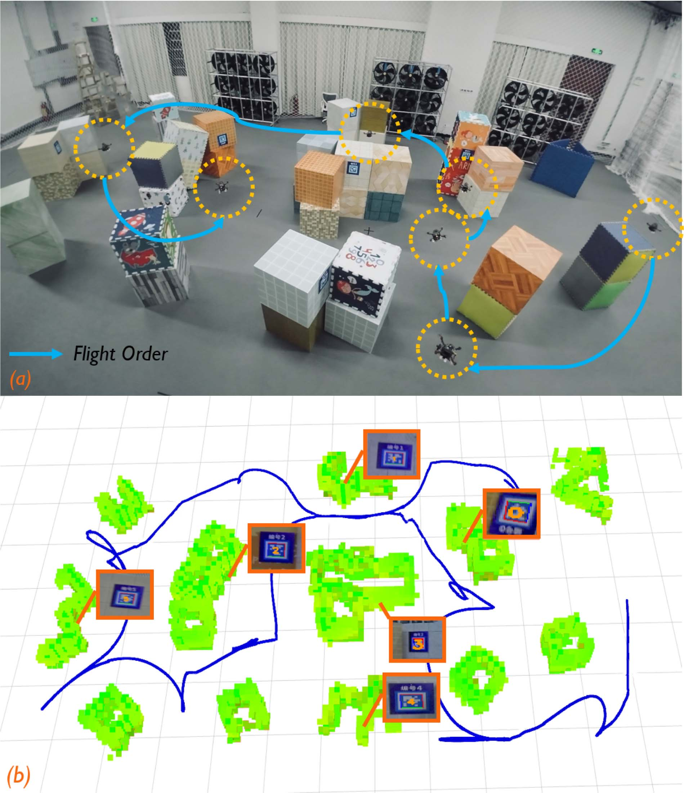
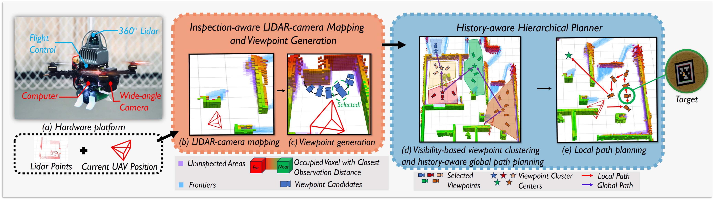
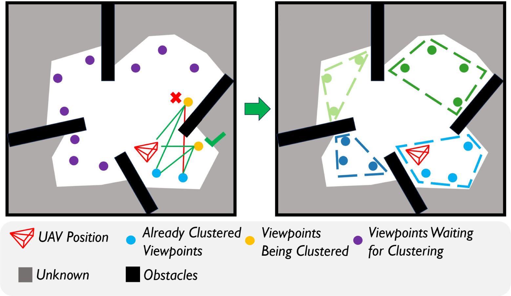
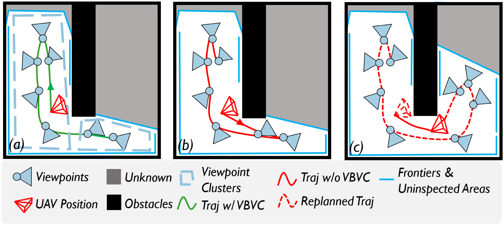
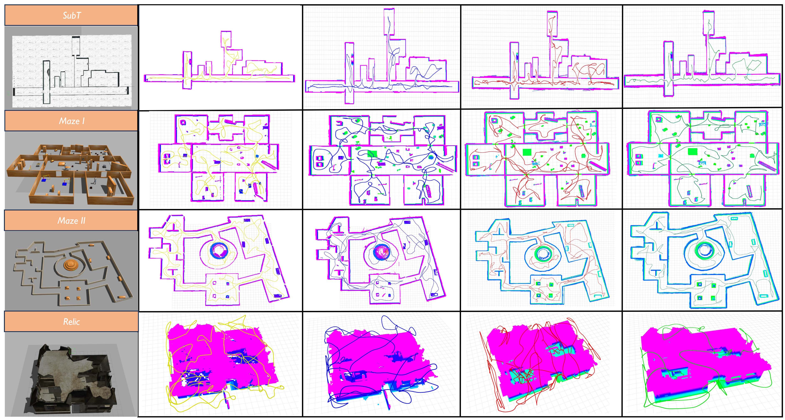
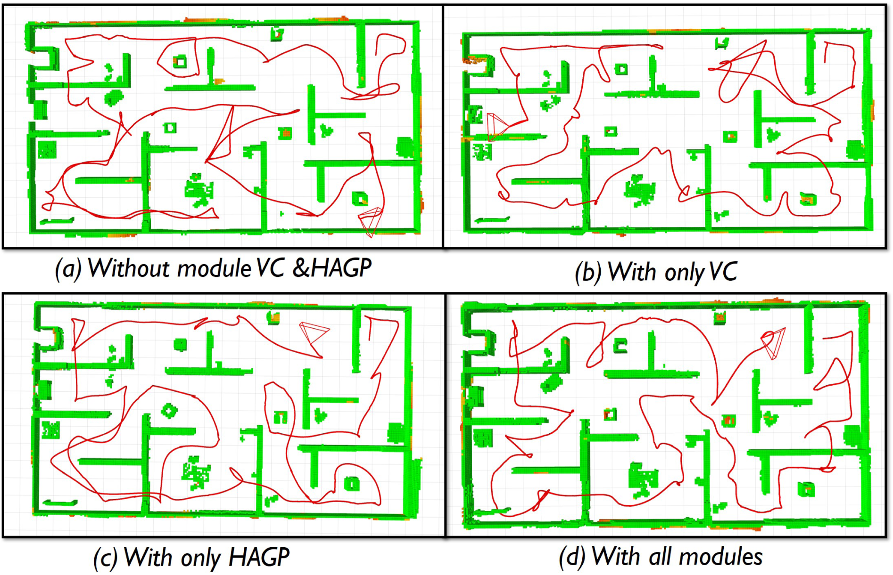
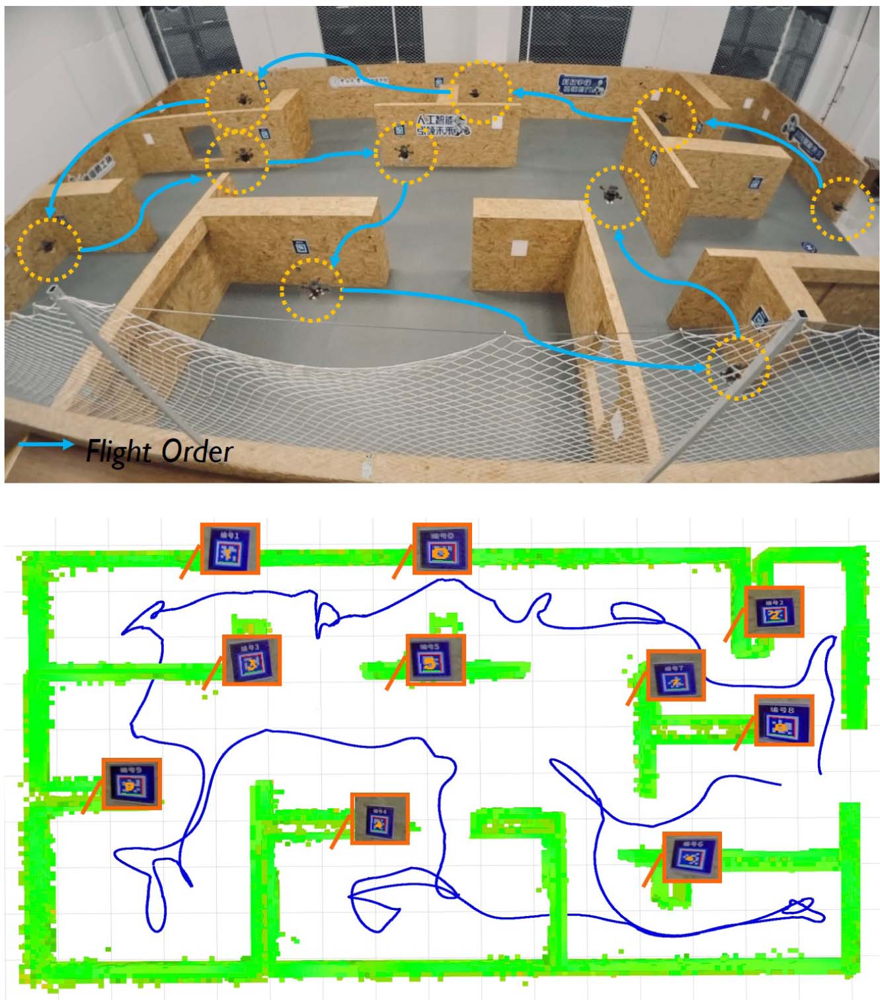

# Star-Searcher复杂未知环境自主目标搜索系统（Star-Searcher A Complete and Efficient Aerial System for Autonomous Target Search in Complex Unknown Environments）：完整忠实学术翻译

> **原文标题**：Star-Searcher A Complete and Efficient Aerial System for Autonomous Target Search in Complex Unknown Environments  
> **作者**：> 元数据 (作者, 期刊, 链接)  
> **发表信息**：- 期刊: IEEE ROBOTICS AND AUTOMATION LETTERS, VOL. 9, NO. 5, MAY 2024  
> **原文 PDF**：[Star-Searcher A Complete and Efficient Aerial System for Autonomous Target Search in Complex Unknown Environments.pdf](../Star-Searcher A Complete and Efficient Aerial System for Autonomous Target Search in Complex Unknown Environments.pdf) ｜ **对应中文详解**：[33_Star-Searcher复杂未知环境自主目标搜索系统.md](../中文详解/33_Star-Searcher复杂未知环境自主目标搜索系统.md)  

---

## 原文第 1 页核心内容与翻译

Star-Searcher: A Complete and Efficient Aerial
System for Autonomous Target Search in
Complex Unknown Environments
Yiming Luo
, Graduate Student Member, IEEE, Zixuan Zhuang
, Neng Pan
,
Chen Feng
, Graduate Student Member, IEEE, Shaojie Shen
, Fei Gao
, Member, IEEE, Hui Cheng
,
and Boyu Zhou
**摘要**——本文研究复杂未知环境中利用无人机（UAV）自主搜索目标的问题。为弥补该任务缺少系统性方法的空白，我们提出 Star-Searcher：一个配备专用传感器套件、建图模块和规划模块的空中系统，用于提高搜索效率。针对检查要求增加所带来的路径规划困难，我们设计了结合基于可见性的视点聚类方法的层次化规划器，将规划分解为全局和局部子问题，从而实时实现高效的全局与局部路径覆盖。此外，全局路径规划采用历史感知机制，减小频繁地图变化造成的运动不一致，显著提高搜索效率。我们在仿真和真实世界中与当前先进方法进行比较，结果表明，本文方法具有更短的飞行路径、更少的耗时和更高的目标搜索完整度。我们将把方法开源以服务社区。¹

**索引词**——空中系统：感知与自主；空中系统：应用；搜救机器人。
## I. 引言
无人机（UAV）因体积小、机动性强而受到重视，在灾害搜救、资源勘探和环境监测等应用中不可或缺。在这些任务中，无人机能够替代人类探索完全未知且危险的环境，并同时执行目标搜索。本文关注利用无人机在复杂未知环境中自主搜索目标这一挑战。
稿件收稿日期为 2023 年 11 月 5 日；录用日期为 2024 年 2 月 28 日。发表日期为 2024 年 3 月 20 日；当前版本日期为 2024 年 3 月 29 日。经审阅者意见评估后，本刊副编辑 K. Alexis 和编辑 G. Loianno 推荐发表本文。（通信作者：Boyu Zhou。）
Yiming Luo、Zixuan Zhuang、Hui Cheng 和 Boyu Zhou 就职于中国广州 510275 的 Sun Yat-Sen University（电子邮箱：yim-ing.luo2001@gmail.com；zhouby23@mail.sysu.edu.cn）。
Neng Pan 和 Fei Gao 就职于中国杭州 310007 的 Zhejiang University 工业控制技术国家重点实验室、网络系统与控制研究所。
Chen Feng 和 Shaojie Shen 就职于中国香港特别行政区 The Hong Kong University of Science and Technology 电子与计算机工程系。
本文附有作者提供的可下载补充材料：
https://doi.org/10.1109/LRA.2024.3379840
数字对象唯一标识符（DOI）：10.1109/LRA.2024.3379840
1https://github.com/SYSU-STAR/STAR-Searcher
自主目标搜索与自主探索领域密切相关；自主探索是机器人学中的基础领域，已受到广泛关注 [1]、[2]、[3]、[4]、[5]。尽管二者存在一定相似性，但本质上有所不同。自主探索主要关注将未知区域建图为占据区域或自由区域。相比之下，自主目标搜索要求无人机同时执行两个相关但不同的任务，即探索和检查。前者只需对未知空间进行粗略建图，后者则要求在潜在目标可能所在的占据空间中进行细致的视觉检查，并满足观测距离和视角等更严格的约束。因此，要实现快速目标搜索，必须具备一种能够处理多样化感知需求，并使运动在两项任务之间无缝切换的高效系统。目前，针对自主目标搜索的系统性方法仍存在空缺，即尚缺少一种既能保证搜索完整度、又不牺牲任务效率的方法。
尤其是在路径规划方面，自主目标搜索具有显著挑战。额外的细致检查要求带来大量检查视点，使求解最短路径的计算负担大幅增加。此外，搜索过程中场景地图和未检查区域是逐步构建的；地图发生变化时，无人机必须调整路径。地图变化可能使新规划路径明显偏离上一条路径，造成来回运动，降低搜索效率。为了实现平滑、稳定的飞行，必须实时规划路径，并保证相邻规划结果保持一致。
在路径规划方面，自主目标搜索也面临显著挑战。细致检查的额外要求会产生大量检查视点，从而显著增加求解最短路径的计算负担。此外，搜索过程中场景地图和未检查区域是逐步构建的；当地图发生变化时，无人机必须调整其路径。地图的这些变化可能导致新规划路径明显偏离上一条路径，产生来回运动，进而严重影响搜索效率。为实现平滑、稳定的飞行，必须实时规划路径，并确保连续路径保持一致。
针对上述挑战，我们提出 Star-Searcher：复杂未知环境中完整且高效的自主目标搜索空中系统。该系统集成专用传感器套件、建图和规划模块，以提高任务效率与完整度。系统利用多种传感器，在探索未知空间和检查表面区域之间无缝切换。我们从两个方面解决路径规划问题。首先，提出结合基于可见性的视点聚类方法的层次化规划器，将复杂的大规模规划任务分解为两个更易处理的子任务：以视点簇为层级的全局路径规划，以及以单个视点为层级的局部路径规划。
我们的空中系统集成了专用传感器套件、建图模块和规划模块，旨在提高任务效率与完整度。系统利用多种传感器，在探索未知空间和检查表面区域之间无缝切换。我们从两个方面应对路径规划挑战。首先，提出一种由基于可见性的视点聚类方法支持的层次化规划器，将复杂的大规模规划任务分解为两个更易处理的子任务：以视点簇为层级的全局路径规划
2377-3766 © 2024 IEEE. Personal use is permitted, but republication/redistribution requires IEEE permission.
更多信息见：https://www.ieee.org/publications/rights/index.html
授权许可使用仅限于 National Institute of Technology- Delhi。2026 年 8 月 24 日 05:46:40（UTC）从 IEEE Xplore 下载。适用相关限制。

---

## 原文第 2 页核心内容与翻译

**图 1**： (a) 在包含 6 个 AprilTag 的复杂场景中进行的自主目标搜索测试；(b) AprilTag 搜索结果和执行轨迹。实验视频见：https://youtu.be/08ll_oo_DtU。

以及以单个视点为层级的局部路径规划。视点聚类将被障碍物分隔的视点分组为不同簇，并将相互可见的视点聚合为凸集。该策略为生成依次访问不同区域的合理全局路径提供区域级引导，并确保覆盖每个凸集的局部路径简单直接。其次，为减轻频繁地图变化引起的运动不一致问题，全局路径规划引入历史感知机制，同时考虑历史运动趋势以及到达所有视点的访问代价。这可以避免连续规划迭代中出现犹豫不定的全局路径，显著提升搜索效率.
我们在仿真中将本文方法与当前先进的快速探索方法和以物体为中心的搜索方法进行了比较。结果表明，本文方法具有更优的搜索性能，在所有实验中均实现了最短路径长度、最短飞行时间和最高完整度。我们还使用完全机载的设备，在复杂真实环境中验证了系统。我们计划将代码开源。本文贡献总结如下：
r 一种配备专用传感器套件、建图模块和新型规划模块的空中系统，可在探索与检查之间无缝切换，从而在复杂未知环境中实现全面、快速的自主目标搜索。
r 一种由基于可见性的视点聚类增强的层次化规划方法，可实时生成视点簇层级的全局路径和单视点层级的局部路径，并减少绕行。
r 一种用于全局路径规划的历史感知机制，利用历史路径信息防止连续规划过程出现不一致，从而显著提高任务效率。
r 通过大量仿真和真实世界实验进行验证。源代码将公开。
## II. 相关工作
自主目标搜索的关键步骤是探索未知环境。研究者已广泛研究多种快速自主探索方法，其中基于前沿的方法最为流行 [6]、[7]、[8]、[9]、[10]、[11]。前沿的概念最初用于划定未知区域与已知区域之间的边界 [6]，相关方法采用贪心策略，在每一步选择最近的前沿。后续研究提出了更合理的选择策略，以提高探索效率。下一最佳视点选择策略被提出并得到广泛应用 [12]。每个采样视点都通过效用函数进行评估，该函数衡量访问视点能够获得的信息增益和所需路径长度。效用函数的设计也得到更深入的研究 [13]、[14]、[15]、[16]。近期方法将遍历所有视点的问题表述为旅行商问题 [1]、[2]、[17]，从而提高任务效率。
在探索规划方法的基础上，一些研究在探索过程中引入了物体搜索技术 [3]、[4]、[5]、[18]、[19]、[20]。其中一些方法通过信息采样，在检测到物体时支持更高分辨率的再次观测 [3]。Papatheodorou 等人 [5] 针对以物体为中心的探索提出效用函数，确保所有背景体素都具有足够的接近程度。Kim 等人 [4] 采用二维空间分割方法，将搜索融入探索过程。Meera 等人 [21] 使用基于高斯过程的目标占据模型。此外，受 DARPA Subterranean Challenge 启发，一些系统将多个机器人结合起来协同搜索物体 [22]、[23]、[24]。有研究提出协同探索策略，使机器人能够协调探索，同时保留独立探索能力 [22]。Roucek 等人 [23] 开发异构探索机器人系统，并提高单智能体鲁棒性。其他方法 [24] 在任务中融合多种传感器，以提高感知精度。
然而，这些方法在探索与目标搜索之间进行权衡，缺乏对自主目标搜索的细致考量，并存在严重的效率问题。相比之下，我们明确界定自主目标搜索问题，并设计了适用的空中平台。此外，本文的历史感知层次化规划器以简洁的飞行路径实现快速搜索。
## III. 问题表述
自主目标搜索问题是在有界三维空间 V ⊂R3 内，搜索由视觉传感器检测到的未知数量目标。该空间表示为一组立方体体素。通过持续更新每个体素 v 的占据概率 Po(v)，将初始未知空间 Vunk = V 逐步划分为两部分：Vfree ⊂V（自由空间）和 Vocc ⊂V（占据空间）。由于目标的可见表面（记为 Vtar）位于 Vocc 的体积内，无人机必须对所有
授权许可使用仅限于 National Institute of Technology- Delhi。2026 年 8 月 24 日 05:46:40（UTC）从 IEEE Xplore 下载。适用相关限制。

---

## 原文第 3 页核心内容与翻译

LUO 等：STAR-SEARCHER：用于自主目标搜索的完整且高效的空中系统
4331

**图 2**：Star-Searcher 系统概览。(a) 空中系统的硬件平台；(b) 无人机利用 LIDAR 点云和相机投影更新地图信息，并对前沿和未检查区域进行聚类；(c) 针对每个前沿和未检查区域簇生成一组视点，并依据信息增益和观察角度评分，选择得分最高的视点；(d) 执行基于可见性的视点聚类，并据此进行历史感知的全局路径规划；(e) 局部路径规划。

对 Vocc 中的体素进行搜索，以保证搜索完整性。Vocc 中尚未被视觉传感器以期望精度观测到的体素标记为 Vuni。由于大多数传感器的感知范围在表面处终止，一些中空空间或角落空间无法建图。这些空间记为 Vres。当整个区域都已完成搜索时，任务才被视为完全完成，即满足 Vfree ∪ Vocc = V \ Vres，且 Vuni = ∅。
## IV. 系统设计
如第 III 节所述，自主目标搜索需要在仔细观测未检查区域 Vuni 的同时，对占据空间和自由空间进行同步识别。通过使用多种传感器识别 Vocc 并更新 Vuni，可以提高任务效率。如图 2(a) 所示，我们为无人机配备了 360 度 LIDAR 和广角 RGB 相机。尽管外观较为常规，但该平台仅包含针对具体问题精心配置的必要传感器组件。360 度 LIDAR 的广域感知范围有助于快速获取周围环境的几何信息，使无人机能够迅速识别占据区域，再利用 RGB 相机进行详细检查。借助广角相机，无人机可以覆盖更大空间并更快检测目标。
图 2(b)–(e) 所示的算法框架由建图模块和规划模块组成。建图模块以体素形式表示环境，持续融合 LIDAR 与相机数据，更新每个体素的占据状态以及其到相机的最近观测距离（第 V-A 节）。随后提取并聚类前沿和未检查区域，生成相应视点，并选择信息增益高且观察角度合适的视点（第 V-B 节）。接着，历史感知的层次化规划器（第 VI 节）利用视点和此前的路径规划结果规划全局路径与局部路径，从而同步识别自由空间和占据空间，并对未检查区域进行彻底检查。在全局路径规划过程中采用基于可见性的视点聚类方法（第 VI-A 节），以形成更合理的访问顺序并降低计算负担。
## V. 检查感知的 LIDAR-相机建图与视点生成
探索中使用的传统占据建图缺少体素观测距离的信息。这一限制妨碍了规划检查路径以确保目标得到彻底搜索。此外，现有方法忽略了面向未检查表面的观察角度，较大的观察角度会对目标检测产生不利影响，因而可能漏检目标。
我们的建图模块通过融合 LIDAR 与相机的测量结果解决第一个问题，为每个占据体素提供其最近观测距离，从而支持更精确的彻底检查路径规划。此外，我们引入了视点选择评分机制，避免在未检查区域采用过大的观察角度。
### A. 携带检查信息的 LIDAR-相机建图
我们的体积环境表示基于文献 [25]。除占据概率外，我们还更新每个占据体素到相机的最近观测距离。当获取新的一帧 LIDAR 点云时，使用全部点云通过射线投射方法更新占据概率。同时，我们可以将已被建图为占据状态的体素投影到相机坐标系中，更新位于相机视场（FOV）内且未被任何占据区域遮挡的体素的最近观测距离。最近观测距离大于最大观测距离 dmax 的体素被标记为未检查区域 Vuni。当这些体素在 dmax 范围内被扫描后，即从未检查区域中移除。
在 RGB 图像中持续进行目标检测；当检测到目标时，通过将像素坐标转换为世界坐标，将对应体素映射到 Vtar。需要指出的是，还可以采用类似方法将与观测准确度有关的其他信息整合到地图中。不过，对这些相关因素开展全面研究超出了本文的研究范围。
授权许可使用仅限于：National Institute of Technology- Delhi。下载时间：2026 年 8 月 24 日 05:46:40（UTC），来源：IEEE Xplore。使用受限制。

---

## 原文第 4 页核心内容与翻译

B. 视点生成
根据占用信息和观测距离，提取第 III 节定义的前沿区域 [6] 和未检查区域。未检查区域与前沿区域意味着目标可能存在，或地图中仍可扩展的区域。因此，我们在这些区域附近进行视点采样。与 [1] 类似，我们采用基于 PCA 的方法沿坐标轴分割过大的聚类。在每个聚类中心周围的球形空间中采样若干视点位置及其对应的偏航角。随后依据两个标准对每个聚类中的所有视点进行评分：信息增益和观测角度。
● 信息增益：UAV 在每个视点获得的信息由激光雷达可观测前沿区域数量 Nunknown 与相机在 dmax 内可观测的未检查体素数量 Nuninspected 的加权组合确定，即
Sinfo = ωuni · Nuninspected + ωunk · Nunknown
(1)
其中，ωuni 和 ωunk 分别表示未检查体素和前沿区域的权重。在实验中，我们为 ωuni 设置了更大的值。
● 观测角度：为确保目标检测的准确性并减小极端观测角度造成的误差，我们根据从聚类中心指向视点的向量与每个聚类的平均法向量 navg 之间的接近程度对视点评分，即
Snor =
pc,v · navg
||pc,v|| ||navg||
(2)
每个聚类的平均法向量由 PCL 软件包根据该聚类内各体素中心点的法向量取平均得到。每个视点的最终得分计算如下：
SV P = Snor · Sinfo
(3)
最后，如图 2(c) 所示，我们选取每个聚类中得分最高的视点。
## VI. 历史感知的层次化规划器
为实时规划更少绕行和重复访问的路径，同时探索未知区域并覆盖未检查区域，我们采用层次化规划策略。首先进行基于可见性的视点聚类（第 VI-A 节），并进行全局路径规划（第 VI-B 节），以确定视点聚类的访问顺序。随后，在第一个视点聚类内进行局部路径规划，高效覆盖前沿区域和未检查区域（第 VI-C 节）。我们的全局规划器引入历史路径信息，使重新规划的路径与先前路径保持一致（第 VI-B 节）。
 A. 基于可见性的视点聚类
借助较大的感知范围，UAV 能够快速识别占用表面，以进行全面的视觉检查。然而，这也会显著增加所需视点的数量，包括用于覆盖前沿区域的视点。规划一条访问这些视点中每一个的最短路径会导致过高的计算时间，使系统无法及时响应环境变化。为应对

**图 3**：基于可见性的视点聚类示意图。如果某个视点到当前聚类中所有视点均具有无碰撞射线，则将其分配到该聚类。

针对这一问题，我们提出一种视点聚类方法，将全部视点智能地划分为多个子集。随后生成经过这些子集的全局路线，以及依次访问子集内视点的局部路径，从而在可控的计算时间内形成高效路径。
所提出的基于可见性的视点聚类方法如图 3 所示。我们将当前 UAV 位置指定为第一个聚类的起点。在每次聚类迭代中，对当前聚类中心周围指定半径 Rvp 内的视点执行射线投射，并按照视点距聚类中心的距离确定优先级。如果某个视点发出的射线与已有聚类中的任一视点之间不和障碍物相交，则将该视点纳入聚类，并将聚类中心重新计算为其中所有视点位置的平均值。一个聚类确定后，选择距离其中心最近的未聚类视点，作为新一轮聚类的起点。该过程不断迭代，依据视点之间的相互可见性和接近程度逐步形成不同的视点聚类，直至所有视点均完成聚类，从而为高效目标搜索提供路径规划依据。
所提出的聚类方法保证了每个聚类内视点之间的相互可见性，并带来多项优势。首先，可见性使同一聚类中的视点能够被包含在一个无碰撞凸集内。这意味着 UAV 无需为避碰而绕行，即可高效访问同一聚类中的所有视点。其次，被障碍物遮挡的视点会自然地被划分到不同聚类中，为规划合理的全局路径提供隐式的区域引导，使路径随后访问彼此分离的区域。此外，该方法还能有效减少严重的重复访问。例如，图 4(b)–(c) 展示了这样一种情形：UAV 优先访问障碍物后方的视点，发现另一个未探索区域后转向该区域，导致后续出现严重的重复访问。相比之下，先彻底探索一个凸聚类再移动到下一个聚类，可以使 UAV 无需绕过障碍物，也无需重新访问之前已检查的区域。
 B. 历史感知的全局路径规划
完成视点聚类后，我们的规划器从 UAV 的当前位置出发，计算一条经过所有视点聚类中心的较短全局路径。该问题可以表述为非对称旅行商问题（ATSP）[1]。每当地图更新时，规划器都会重新规划。然而，重新规划后完全刷新全局路径可能由于相近的路径代价导致不同区域的访问顺序发生剧烈变化，
授权许可使用仅限于 National Institute of Technology- Delhi。2026 年 8 月 24 日 05:46:40（UTC）从 IEEE Xplore 下载。适用相关限制。

---

## 原文第 5 页核心内容与翻译

LUO 等：STAR-SEARCHER：一种用于复杂未知环境自主目标搜索的完整高效空中系统
4333

**图 4**：采用（图 a）和不采用（图 b）基于可见性的视点聚类（VBVC）时所规划轨迹的对比。不采用视点聚类时，UAV 计算访问全部视点的最短路径，并选择障碍物后方的视点作为下一个目标。到达该视点后，UAV 发现新的区域并生成额外视点。因此，它按照红色虚线所示重新规划轨迹，最终导致后续重复访问，如图 c 所示。

**图 5**：历史感知全局路径规划示意图。找到锚点中心后，使用 A* 算法计算各对锚点中心之间的多条无碰撞最短路径，并将其串联起来更新历史感知全局路径。不采用历史感知路径时会产生犹豫不决的轨迹，如图 (d) 中的红色曲线所示。

由于路径代价相近，不同区域的访问顺序可能发生剧烈变化，从而造成图 5(d) 所示的犹豫飞行。实际上，每次只有少数区域发生更新，其他区域保持不变。对于这些未变化区域，保持先前规划路径中的访问顺序，可以确保规划和飞行的一致性；新更新的区域则应合理地整合到未变化区域的访问规划中。我们的方法利用前一条全局路径中的相对访问顺序生成新的全局路径。
在每次全局路径规划中，我们考虑所有视点聚类中心，计算一条临时最短路径，并维护一条历史感知路径。尽管这需要额外计算，更新历史感知路径所增加的计算时间很小。历史感知路径以临时最短路径初始化。

**图 5**：图 5 展示了更新过程。为使新视点聚类的顺序与上一条历史感知路径一致，我们首先为每个新聚类找出最近的旧视点聚类，并计算其中心之间的距离。随后，根据这些最近中心在上一条历史感知路径中的顺序对新视点聚类排序。在更新很少的区域中，如果新视点聚类仅发生轻微变化，则将中心距离变化小于阈值 $d_{anchor}$ 的中心指定为锚点中心，并将其关联的视点聚类标记为未变化。UAV 的当前位置也视为一个锚点中心。对于非锚点视点聚类，需要将其与锚点聚类整合以形成连贯的新路径。为此，我们选择相邻锚点聚类对作为起点和终点，提取它们之间的非锚点聚类并计算最短路径。该问题可表述为具有固定起点和终点的 TSP，并可转换为 ATSP [17]。将多条锚点聚类对之间的最短路径串联，即可得到新的历史感知路径。最后比较历史感知路径与临时最短路径的代价。如果二者差值 $D_{cost}$ 较小，则采用历史感知路径；否则采用临时最短路径，并将历史感知路径重置为临时最短路径。

 C. 局部路径规划
全局路径为访问不同区域提供合理顺序。在全局路径引导下，我们进一步进行更详细的局部路径规划。具体而言，我们选择第一个视点聚类中的全部视点进行访问，并将 UAV 当前位置作为起点、全局路径中第二个视点聚类的中心作为终点，构建一个 ATSP。为提高 UAV 运动的平滑性，计算访问代价时考虑 UAV 速度的变化。我们将 UAV 速度分解为沿 UAV 与视点连线方向及其垂直方向的分量，将两个方向的运动建模为恒加速度运动：初始位置为 UAV 当前位置，终点为各视点，初始速度分别为 vali 和 vper，最终位移分别为当前位置到视点的距离 l 和 0；然后通过计算两个方向运动所需的时间得到相应代价。因此，从 UAV 位置 p 到视点 vpi 的代价函数定义如下：
tali =
⎧
⎪
⎨
⎪
⎩
√
v2
ali+2aalil−vali
aali
,
if v2
max−v2
ali
2aali
< l
vmax−vali
aali
+
l−
v2max−v2
ali
2aali
vmax
,
else
(4)
C(p, vpi) = max

tali, 2vper
aper
, |φ −φj|
ωmax

(5)
其中，φ 和 ωmax 分别表示 UAV 的偏航角和最大角速度。两点 vpi 与 vpj 之间的代价定义为：
C(vpi, vpj) = max
L(vpi, vpj)
vmax
, |φi −φj|
ωmax

(6)
授权许可使用仅限于 National Institute of Technology- Delhi。2026 年 8 月 24 日 05:46:40（UTC）从 IEEE Xplore 下载。适用相关限制。

---

## 原文第 6 页核心内容与翻译

其中 $L(v_{pi},v_{pj})$ 表示两个视点之间的距离。获得局部路径后，我们遵循 [26] 提出的框架生成平滑且安全的轨迹，并将其发送给控制器执行。
D. 计算复杂度分析
由于生成的视点数量很多，使用全部视点进行路径规划会带来显著的计算负担。不同视点之间访问代价的计算占用了大部分资源；两个视点相距越远，搜索路径并计算访问代价所需时间越长。然而，规划路径通常会避免连续访问两个代价较高的点，使这类计算既不必要又耗时。我们的分层规划器在全局规划时只计算视点聚类中心之间的代价，在局部规划时只计算待访问的第一个聚类内部视点之间的代价。因此，该方法将计算复杂度从 O(N 2) 转换为全局路径规划的 O(n1 2) 和局部路径规划的 O(n2 2)。其中 N 表示全部视点总数，n1 表示视点聚类数量，n2 表示第一个聚类中的视点数量，通常 N >> n1,n2。此外，局部规划中的视点通常彼此邻近，无需计算远距离视点之间的代价。因此，规划器在仿真和真实世界实验中均可按 10 Hz 运行，具备良好的实时性。
## VII. 实验结果
A. 实现细节
我们在公式 1 中设置 ωuni = 0.8、ωunk = 0.2。视点聚类中设置 Rvp = 3 m。ATSP 使用 Lin-Kernighan-Helsgaun 启发式求解器 [27]。真实世界实验采用 Mid360 LIDAR 和高效的 LIDAR-惯性定位系统 [28]，并使用几何控制器 [29] 跟踪 (x, y, z, φ) 轨迹。所有模块均运行在 Jetson Orin NX 16 GB 平台上。
B. 基准对比
我们在 Gazebo 中开展仿真实验，在四个场景中评估方法：SubT [24]（68 m x 18 m x 2 m）、maze I（33 m x 27 m x 2 m）、maze II（60 m x 50 m x 2 m）和 relic（10 m x 10 m x 7 m）。每个场景放置 8 个 apriltag [30]，有效识别距离设为 3.0 m。
我们将所提方法与 FUEL [1]（一种快速探索方法）和 Semantic [5]（一种基于 NBVP 的目标搜索方法）比较。由于 Semantic [5] 尚未完全开源，我们使用自行实现的版本（不包括目标建图）。所提方法和 Semantic [5] 使用配备 8 m 量程 LIDAR 与视场角为 [68, 51] 度 RGB 相机的 UAV。FUEL [1] 使用深度相机；我们为 FUEL [1] 设置两种不同感知距离，以展示直接将探索方法用于目标搜索的局限性。其中一种感知距离等于有效识别距离，以保证完整性，另一种设为 4 m。
一种感知距离等于有效识别距离，以保证完整性，另一种设为 4 m。此外，在消融实验中，我们为 FUEL [1] 配置与所提方法相同的传感器设置、观测距离约束。每个体素边长设为 0.1 m，最大观测距离 dmax 设为 3.0 m。动力学限制设置为 υmax = 2.0 m/s、amax = 1.5 m/s2、ωmax = 1.2 rd/s。每种方法在每个场景中以相同配置运行 5 次。我们评估效率（飞行长度和时间）以及搜索完整性（识别出的 apriltag 数量）。表 I 给出各场景结果，而
图 6 展示不同场景中的执行轨迹。结果表明，由于缺乏面向目标搜索的有效规划方法，FUEL [1] 和 Semantic [5] 会产生大量重复访问和绕行。相比之下，我们的方法通过保证对每个被占据体素进行充分观测，实现了较高的搜索完整性；同时取得了最短路径长度和飞行时间。这得益于视点聚类方法避免了绕行和重复访问，历史感知全局路径规划也产生了更加一致的路径，从而提高效率。
C. 消融实验
表 II 和图 7 展示了我们在小型迷宫（24 m x 12 m x 2 m）中针对视点聚类（模块 VC）和历史感知全局规划（模块 HAGP）进行的测试。当两个模块均未启用时，该设置等价于 FUEL [1]
使用 LIDAR-相机建图模块，通过考虑全部视点求解路径。图 7(b) 及对应表格数据表明，视点聚类模块考虑了视点之间的可见性，减少了跨越障碍物的绕行。不使用视点聚类模块时，计算
授权许可使用仅限于 National Institute of Technology- Delhi。2026 年 8 月 24 日 05:46:40（UTC）从 IEEE Xplore 下载。适用相关限制。

---

## 原文第 7 页核心内容与翻译

LUO 等：STAR-SEARCHER：一种用于复杂未知环境自主目标搜索的完整高效空中系统
4335

**图 6**：仿真实验中所提方法（绿色）、FUEL-3m [1]（黄色）、FUEL-4m [1]（蓝色）和 Semantic [5]（红色）生成的轨迹。

**图 7**：消融实验中的执行轨迹。我们测试了不使用视点聚类（模块 VC）或历史感知全局规划（模块 HAGP）时的方法。

会随着视点数量累积而急剧增加，导致算法执行延迟。Exp 2 与 Exp 4 的对比证明，历史感知全局规划能够提高规划的一致性和效率。总之，结合全部模块后，算法生成的路径简洁且一致，重复访问更少，同时具备良好的实时性。
D. 真实世界实验
我们进一步通过真实世界实验验证方法。考虑到相机运动模糊，将动力学限制设置为 υmax = 1.6 m/s、amax = 0.8 m/s2、ωmax = 0.9 rd/s。最大观测距离 dmax 设为 2.0 m，在该距离内可以稳定识别 apriltag。所有模块均在机载运行，不依赖外部设备。

**图 8**：在需要寻找 10 个 apriltag 的迷宫中开展的实验。

第一个场景是一个杂乱的室内环境（14 m x 7 m x 2 m），其中有 6 个 apriltag；第二个场景是一个迷宫（15 m x 8.5 m x 2 m），其中有 10 个 apriltag。每个 apriltag 的尺寸为 0.12 m x 0.12 m。各 apriltag 在世界坐标系中的三维坐标预先测量，并通过激光测距完成标定。利用 SLAM 模块 [28] 获取的 UAV 位姿，以及相机坐标系中识别出的 apriltag 位姿，可以计算 apriltag 在世界坐标系中的位置。每次实验均成功识别全部 apriltag，坐标误差为 0.2 m 至 0.4 m。两个场景分别耗时 110 s 和 180 s，更多细节见视频。在线生成的地图和轨迹如图 1 和图 8 所示。这些实验验证了系统在复杂真实世界场景中的能力。
授权许可使用仅限于 National Institute of Technology- Delhi。2026 年 8 月 24 日 05:46:40（UTC）从 IEEE Xplore 下载。适用相关限制。

---

## 原文第 8 页核心内容与翻译

## VIII. 结论
本文提出了一种面向复杂未知环境自主目标搜索的系统化解决方案。我们开发了一个包含专用传感器套件、建图和规划模块的空中系统，以提高任务效率和完整性。分层规划器利用基于可见性的视点聚类方法提供区域引导，实时生成全局路径和局部路径。我们引入历史感知机制，以避免连续全局规划过程中运动的不一致性。大量仿真和真实世界实验验证了所提方法的有效性。
未来工作包括：将当前方法扩展到多 UAV 集群；研究复杂动态环境中的自主目标搜索；以及面向动态目标开展自主搜索。
## 参考文献
[1] B. Zhou, Y. Zhang, X. Chen, and S. Shen, “Fuel: Fast UAV exploration
using incremental frontier structure and hierarchical planning,” IEEE
Robot. Automat. Lett., vol. 6, no. 2, pp. 779–786, Apr. 2021.
[2] C. Cao, H. Zhu, H. Choset, and J. Zhang, “TARE: A hierarchical frame-
work for efficiently exploring complex 3D environments,” Proc. Robot.:
Sci. Syst., vol. 5, 2021, pp. 1–8.
[3] T. Dang, C. Papachristos, and K. Alexis, “Autonomous exploration and
simultaneous object search using aerial robots,” in Proc. IEEE Aerosp.
Conf., 2018, pp. 1–7.
[4] H. Kim, H. Kim, S. Lee, and H. Lee, “Autonomous exploration in a
cluttered environment for a mobile robot with 2D-map segmentation and
objectdetection,”IEEERobot.Automat.Lett.,vol.7,no.3,pp. 6343–6350,
Jul. 2022.
[5] S. Papatheodorou, N. Funk, D. Tzoumanikas, C. Choi, B. Xu, and S.
Leutenegger, “Finding things in the unknown: Semantic object-centric
exploration with an MAV,” in Proc. IEEE Int. Conf. Robot. Automat.,
2023, pp. 3339–3345.
[6] B. Yamauchi, “A frontier-based approach for autonomous exploration,”
in Proc. IEEE Int. Symp. Comput. Intell. Robot. Automat. Comput. Princ.
Robot. Automat., 1997, pp. 146–151.
[7] W. Gao, M. Booker, A. Adiwahono, M. Yuan, J. Wang, and Y. W. Yun, “An
improved frontier-based approach for autonomous exploration,” in Proc.
IEEE 15th Int. Conf. Control, Automat., Robot. Vis., 2018, pp. 292–297.
[8] J. Faigl and M. Kulich, “On determination of goal candidates in frontier-
based multi-robot exploration,” in Proc. IEEE Eur. Conf. Mobile Robots,
2013, pp. 210–215.
[9] M. Kulich, J. Kubalík, and L. Pˇreuˇcil, “An integrated approach to goal
selection in mobile robot exploration,” Sensors, vol. 19, no. 6, 2019,
Art. no. 1400.
[10] C. Dornhege and A. Kleiner, “A frontier-void-based approach for au-
tonomous exploration in 3D,” Adv. Robot., vol. 27, no. 6, pp. 459–468,
2013.
[11] L. Heng, A. Gotovos, A. Krause, and M. Pollefeys, “Efficient visual explo-
ration and coverage with a micro aerial vehicle in unknown environments,”
in Proc. IEEE Int. Conf. Robot. Automat., 2015, pp. 1071–1078.
[12] A. Bircher, M. Kamel, K. Alexis, H. Oleynikova, and R. Siegwart, “Reced-
ing horizon’ next-best-view’ planner for 3D exploration,” in Proc. IEEE
Int. Conf. Robot. Automat., 2016, pp. 1462–1468.
[13] A. Akbari and S. Bernardini, “Informed autonomous exploration of
subterranean environments,” IEEE Robot. Automat. Lett., vol. 6, no. 4,
pp. 7957–7964, Oct. 2021.
[14] L. Schmid, M. Pantic, R. Khanna, L. Ott, R. Siegwart, and J. Nieto, “An
efficient sampling-based method for online informative path planning
in unknown environments,” IEEE Robot. Automat. Lett., vol. 5, no. 2,
pp. 1500–1507, Apr. 2020.
[15] Z. Xu, D. Deng, and K. Shimada, “Autonomous UAV exploration
of dynamic environments via incremental sampling and probabilistic
roadmap,” IEEE Robot. Automat. Lett., vol. 6, no. 2, pp. 2729–2736,
Apr. 2021.
[16] H. H. González-Banos and J.-C. Latombe, “Navigation strategies for
exploring indoor environments,” Int. J. Robot. Res., vol. 21, no. 10/11,
pp. 829–848, 2002.
[17] B. Zhou, H. Xu, and S. Shen, “Racer: Rapid collaborative exploration with
a decentralized multi-UAV system,” IEEE Trans. Robot., vol. 39, no. 3,
pp. 1816–1835, Jun. 2023.
[18] G. Best, J. Faigl, and R. Fitch, “Online planning for multi-robot active per-
ception with self-organising maps,” Auton. Robots, vol. 42, pp. 715–738,
2018.
[19] R. Ashour, T. Taha, J. M. M. Dias, L. Seneviratne, and N. Almoosa,
“Exploration for object mapping guided by environmental semantics using
UAVs,” Remote Sens., vol. 12, no. 5, 2020, Art. no. 891.
[20] A.AsgharivaskasiandN.Atanasov,“ActiveBayesianmulti-classmapping
from range and semantic segmentation observations,” in Proc. IEEE Int.
Conf. Robot. Automat., 2021, pp. 1–7.
[21] A. A. Meera, M. Popovi´c, A. Millane, and R. Siegwart, “Obstacle-aware
adaptive informative path planning for UAV-based target search,” in Proc.
IEEE Int. Conf. Robot. Automat., 2019, pp. 718–724.
[22] M. Kulkarni et al., “Autonomous teamed exploration of subterranean
environments using legged and aerial robots,” in Proc. IEEE Int. Conf.
Robot. Automat., 2022, pp. 3306–3313.
[23] T. Roucek et al., “System for multi-robotic exploration of underground
environments CTU-CRAS-NORLAB in the DARPA subterranean chal-
lenge,” 2021, arXiv:2110.05911.
[24] G. Best, R. Garg, J. Keller, G. A. Hollinger, and S. Scherer, “Resilient
multi-sensorexplorationofmultifariousenvironmentswithateamofaerial
robots,” in Proc. Robot.: Sci. Syst., 2022.
[25] L. Han, F. Gao, B. Zhou, and S. Shen, “Fiesta: Fast incremental Euclidean
distance fields for online motion planning of aerial robots,” in Proc.
IEEE/RSJ Int. Conf. Intell. Robots Syst., 2019, pp. 4423–4430.
[26] B. Zhou, F. Gao, L. Wang, C. Liu, and S. Shen, “Robust and efficient
quadrotor trajectory generation for fast autonomous flight,” IEEE Robot.
Automat. Lett., vol. 4, no. 4, pp. 3529–3536, Oct. 2019.
[27] K.Helsgaun,“AneffectiveimplementationoftheLin–Kernighantraveling
salesman heuristic,” Eur. J. Oper. Res., vol. 126, no. 1, pp. 106–130,
2000.
[28] W. Xu and F. Zhang, “FAST-LIO: A fast, robust LiDAR-inertial odometry
package by tightly-coupled iterated Kalman filter,” IEEE Robot. Automat.
Lett., vol. 6, no. 2, pp. 3317–3324, Apr. 2021.
[29] T. Lee, M. Leok, and N. H. McClamroch, “Geometric tracking control of a
quadrotor UAV on se(3),” in Proc. IEEE 49th Conf. Decis. Control, 2010,
pp. 5420–5425.
[30] J. Wang and E. Olson, “AprilTag 2: Efficient and robust fiducial detection,”
授权许可使用仅限于 National Institute of Technology- Delhi。2026 年 8 月 24 日 05:46:40（UTC）从 IEEE Xplore 下载。适用相关限制。

---
