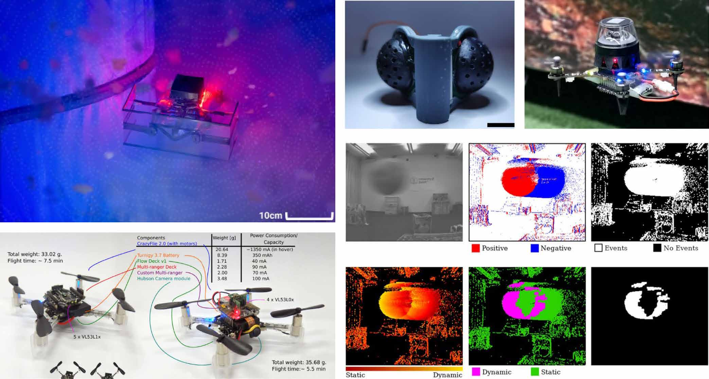

# 复兴超声波传感构建鲁棒自主系统（The Forgotten Spectrum Reviving Ultrasound for Robust Autonomy）：完整忠实学术翻译

> **原文标题**：The Forgotten Spectrum Reviving Ultrasound for Robust Autonomy  
> **作者**：Xin Zhou、Fei Gao  
> **发表信息**：*Science Robotics*，第 11 卷第 112 期，文章号 eaef8847，2026 年 3 月 25 日  
> **原文 PDF**：[The Forgotten Spectrum Reviving Ultrasound for Robust Autonomy.pdf](../The Forgotten Spectrum Reviving Ultrasound for Robust Autonomy.pdf) ｜ **对应中文详解**：[34_复兴超声波传感构建鲁棒自主系统.md](../中文详解/34_复兴超声波传感构建鲁棒自主系统.md)  

---

## 原文第 1 页核心内容与翻译

Zhou and Gao，Sci. Robot. 11，eaef8847（2026）　2026 年 3 月 25 日
《Science Robotics》｜焦点
传感器
《被遗忘的频谱：复兴超声波传感，构建鲁棒自主系统》
Xin Zhou1,2 and Fei Gao1,2*
看似过时的超声波结合边缘 AI 降噪技术，可以在视觉失效时使自主系统更加鲁棒。
机器人越来越需要在标准感知假设不成立的条件下运行。例如搜索救援中充满烟雾的建筑物、用于巡检的黑暗公用设施隧道、具有玻璃或其他透明结构的环境，以及具有雪、雾或强眩光的户外环境。在移动自主系统中，常用的相机和激光雷达 (LIDAR) 可以提供有关环境的几何和外观信息。然而，在现实世界非理想条件下，这些传感器的性能仍会下降 (1)。因此，许多机器人在可靠性最重要的情况下仍然很脆弱。在本期《Science Robotics》中，Velmurugan 等人介绍了 Saranga (2)，这是一个用于手掌大小的空中机器人的感知和导航栈，它使用超声波作为低功耗感知模态，在视觉退化的环境中进行导航。
# 为什么超声波被边缘化
声学传感器（如超声波测距或麦克风阵列）已在各个领域得到广泛应用。然而，在机器人领域，超声波传感器通常与短量程、粗分辨率和易受干扰联系在一起 (3)。在空中机器人上，螺旋桨噪声会进一步降低回波质量。在这些限制下，超声波通常被认为仅适用于简单的接近感测，而不适用于可靠的自主系统。
然而，这一结论主要是基于过去超声波在许多机器人系统中的使用方式。在自然界中，重约 2 克的大黄蜂蝙蝠使用超声波回声定位安全飞行，并能探测到小至 8 毫米的物体 (4)。超声波通过压力波而不是光子与环境相互作用。因此，它可以在视觉退化的条件下运行，并且可以检测出对光学传感器来说具有挑战性的薄的或透明的障碍物。主要的困难是回波噪声，其中多径返回、衰减和干扰会降低信号质量。在空中机器人上，螺旋桨引起的噪声进一步掩盖了信号。
# 视觉退化环境中的现代超声波
Saranga 通过将现代计算与精心设计的低功耗超声波感知硬件相结合，解决了上述问题 (2)。它使用了一个双低功耗超声波传感器套件，并解决了超声波返回信号极其低的峰值信噪比问题。该方法使用了两个互补的步骤：阻挡螺旋桨引起的超声波噪声的物理降噪，以及一个深度学习降噪模型，该模型利用长时间的回波时间历史，使用合成数据流水线加上有限的真实噪声数据进行训练。
结果是，一架尺寸为 0.16 米、成本约 400 美元且感知功耗仅为 1.2 毫瓦的手掌大小的四旋翼飞行器，可以仅依靠机载感知和计算，不依赖任何外部基础设施，在浓雾、黑暗和雪地等杂乱环境中导航，并绕过薄的和透明的障碍物。光学和电磁传感器很难在上述所有条件下可靠运行。这些结果表明，超声波可以成为视觉退化环境中自主系统的一种有效感知模态，前提是硬件和计算栈是围绕其噪声特性设计的。
更广泛地说，超声波不仅是一个备用的测距传感器；它还可以直接馈入自主导航流水线中。利用随时间变化的回波序列，系统可以估计何时不确定，例如区分开放空间和平滑反光表面（这可能会混淆视觉）。对于计算和功耗受限的小型机器人，这可以指导系统设计。与其为了罕见的边缘情况增加较重的传感器，不如增加一种低功耗模态加上简单的推断，以提高鲁棒性。这也表明基准测试不仅应该报告平均精度，还应该报告在受控退化条件下的性能表现，例如雾密度、照明、螺旋桨转速和多径严重程度，在这些条件下可能会发生突发且涉及安全的故障。
# 重新审视传统感知模态
许多其他感知模态也被用于机器人技术。例如声纳、红外接近传感器、飞行时间传感器、触觉和力传感器、热像仪、事件相机、光流传感器、麦克风阵列、Wi-Fi 或其他基于无线电的传感器、气压计、磁力计以及化学或气体传感器等。这些传感器在早期的系统或小众应用中很常见。后来，随着计算机视觉和激光雷达的改进，它们在主流自主系统中变得不那么突出，尤其是在无人机、人形机器人和自动驾驶领域。
当然，这些模态也有缺点，因此很多在主流系统中被取代 (5)。红外感知通常量程短，并且对材料和几何形状敏感。热像仪在黑暗中可以工作，但细节较少且对比度弱。麦克风阵列受到噪声和混响的影响。
1College of Control Science and Engineering, Zhejiang University, Hangzhou, China. 2Differential Robotics 
(Hangzhou) Technology Co. Ltd., Hangzhou, China.
*通信作者。电子邮箱：fgaoaa@​zju.​edu.​cn
版权所有 © 2026 作者。保留部分权利；美国科学促进会为独家被许可方。不主张原始美国政府作品的权利。
下载自 https://www.science.org，下载地点：纽卡斯尔大学，2026 年 8 月 23 日

---

## 原文第 2 页核心内容与翻译

Zhou and Gao，Sci. Robot. 11，eaef8847（2026）　2026 年 3 月 25 日
《Science Robotics》｜焦点
基于无线电的感知中，接收到的信号强度会随着遮挡、多径和局部结构的变化而变化。气压计会漂移，磁力计会受到附近材料的干扰，气体传感器可能会响应缓慢且存在交叉敏感性。尽管如此，每种模态都有其优势，这些优势往往被实际限制所掩盖。
正如 Saranga (2) 所阐述的，一个实用的教训是传感器选择可以更多地受到原理驱动：根据哪些物理信号在目标条件下保持可靠来选择传感器模态，而不是默认使用视觉或激光雷达然后修补其故障。使这些模态可用可能需要现代计算和使能技术。例如，时间模型可以使用多模态历史而不是单一快照，基于学习的降噪可以从噪声测量中提取微弱的结构。数据驱动的校准也可以减少传感器之间的差异和漂移。如图 1（B 到 E）所示，人工复眼可以实现超宽视场和出色的角度选择性 (6)；高度压缩的全景图像 (7) 和稀疏测距测量 (8) 可以实现微型自主飞行；事件相机可以帮助避开快速移动的障碍物 (9)。
为了使这种混合系统得到更广泛的探索和使用，我们需要更好的算法和实用工具。这些包括简单的校准、将这些模态与标准视觉和激光雷达对齐的开源数据集，以及更好地衡量传感器融合质量的清晰评估。封装也是困难的。声学、热和基于无线电的传感器与平台硬件相互作用，包括电机、外壳和电磁干扰屏蔽，但这在理想化的感知研究中经常被忽略。如果我们把这些相互作用看作设计约束而不是单纯的噪声，那么旧的传感器可能会成为现代自主系统中可靠的组成部分。
参考文献与注释
	 1.	 M. Tranzatto, T. Miki, M. Dharmadhikari, L. Bernreiter,
M. Kulkarni, F. Mascarich, O. Andersson, S. Khattak,  
M. Hutter, R. Siegwart, K. Alexis, Cerberus in the DARPA 
Subterranean Challenge. Sci. Robot. 7, eabp9742 (2022).
	 2.	 M. Velmurugan, P. Brush, C. Balfour, R. J. Przybyla,
N. J. Sanket, Milliwatt ultrasound for navigation in 
visually degraded environments on palm-­sized aerial 
robots. Sci. Robot. 11, eadz9609 (2026).
	 3.	 F. Dümbgen, A. Hoffet, M. Kolundžija, A. Scholefield,
M. Vetterli, Blind as a bat: Audible echolocation on small 
robots. IEEE Robot. Autom. Lett. 8, 1271–1278 (2022).
	 4.	 D. R. Griffin, A. Novick, M. Kornfield, The sensitivity of
echolocation in the fruit bat, Rousettus. Biol. Bull. 115, 
107–113 (1958).
5.	 Y. Tian, Y. Chang, F. H. Arias, C. Nieto-­Granda, J. P. How,
L. Carlone, Kimera-­multi: Robust, distributed, dense 
metric-­semantic slam for multi-­robot systems. IEEE 
Trans. Robot. 38, 2022–2038 (2022).
	 6.	 Y. Zhou, Z. Sun, Y. Ding, Z. Yuan, X. Qiu, Y. B. Cao, Z. Wan,
Z. Long, S. Poddar, S. Kumar, W. Ye, C. L. J. Chan,  
D. Zhang, B. Ren, Q. Zhang, H.-­S. Kwok, M. G. Li, Z. Fan, 
An ultrawide field-­of-­view pinhole compound eye using 
hemispherical nanowire array for robot vision. Sci. 
Robot. 9, eadi8666 (2024).
	 7.	 T. van Dijk, C. De Wagter, G. C. de Croon, Visual route
following for tiny autonomous robots. Sci. Robot. 9, 
eadk0310 (2024).
	 8.	 K. N. McGuire, C. De Wagter, K. Tuyls, H. J. Kappen,
G. C. de Croon, Minimal navigation solution for a swarm 
of tiny flying robots to explore an unknown 
environment. Sci. Robot. 4, eaaw9710 (2019).
	 9.	 D. Falanga, K. Kleber, D. Scaramuzza, Dynamic obstacle
avoidance for quadrotors with event cameras. Sci. 
Robot. 5, eaaz9712 (2020).
**致谢**
**资金**：这项工作得到了中国国家重点研发计划（资助号 2023YFB4706600）、浙江省科技计划项目（资助号 2024C01170）和中国国家自然科学基金（资助号 62322314）的支持。**竞争利益**：F.G. 和 X.Z. 声明他们与 Differential Robotics (Hangzhou) Technology Co. Ltd. 存在关联。本文是以个人身份撰写的，所表达的观点仅代表作者本人，不代表公司。作者声明没有其他竞争利益。
10.1126/scirobotics.aef8847
A
E
C
B
D

**图 1**：适用于自主机器人的多样化和创新感知模态。(A) 视觉退化条件下用于导航的超声波回波和降噪 (2)。(B) 用于运动跟踪的无透镜复眼 (6)。(C) 用于视觉路线跟随的高度压缩全景图像 (7)。(D) 用于探索和返回的信号强度信息和单点测距传感器 (8)。(E) 用于动态障碍物检测和避障的事件相机 (9)。

图片来源：《Science Robotics》（2、6–9）。
下载自 https://www.science.org，下载地点：纽卡斯尔大学，2026 年 8 月 23 日

---

## 原文第 3 页核心内容与翻译

《被遗忘的频谱：复兴超声波传感，构建鲁棒自主系统》
Xin Zhou and Fei Gao
Sci. Robot. 11 (112), eaef8847.  DOI: 10.1126/scirobotics.aef8847
在线查看文章
https://www.science.org/doi/10.1126/scirobotics.aef8847
转载与使用许可
https://www.science.org/help/reprints-and-permissions
本文的使用受服务条款约束。
《Science Robotics》（ISSN 2470-9476）由美国科学促进会出版，地址为 1200 New York Avenue NW, Washington, DC 20005。Science Robotics 是 AAAS 的注册商标。
版权所有 © 2026 作者。保留部分权利；美国科学促进会为独家被许可方。不主张原始美国政府作品的权利。
下载自 https://www.science.org，下载地点：纽卡斯尔大学，2026 年 8 月 23 日

---
