# 差速驱动机器人族通用轨迹优化框架（Universal Trajectory Optimization Framework for Differential Drive Robot Class）：完整忠实学术翻译

> **原文标题**：Universal Trajectory Optimization Framework for Differential Drive Robot Class  
> **作者**：Mengke Zhang、Nanhe Chen、Hu Wang、Jianxiong Qiu、Zhichao Han、Qiuyu Ren、Chao Xu、Fei Gao、Yanjun Cao  
> **发表信息**：IEEE Transactions on Automation Science and Engineering (T-ASE), Vol. 22, 2025  
> **原文 PDF**：[Universal Trajectory Optimization Framework for Differential Drive Robot Class.pdf](../Universal Trajectory Optimization Framework for Differential Drive Robot Class.pdf) ｜ **对应中文详解**：[35_差速驱动机器人族通用轨迹优化框架.md](../中文详解/35_差速驱动机器人族通用轨迹优化框架.md)  

---

## 原文第 1 页核心内容与翻译

**摘要**——差速驱动机器人凭借原理简单的特点，被广泛应用于各种场景，从家用服务机器人到灾害响应野外机器人均有涉及。这类机器人的非完整动力学以及可能存在的侧向滑移，使得获得可行且高质量的轨迹十分困难。尽管现实应用中存在多种驱动机构，但它们共享相似的驱动原理，即控制独立驱动履带或车轮之间的相对运动，以实现直线和角运动。因此，亟需一种能够为各种差速驱动机器人高效计算轨迹的综合轨迹优化方法。本文提出一种通用轨迹优化框架，使这些机器人能够在受限计算时间内生成高质量轨迹。我们引入一种基于运动状态或其积分量（如角速度和线速度）多项式参数化的新型轨迹表示，使机器人运动从本质上符合其控制原理。轨迹优化问题被构造为在优先保证安全性和运行效率的同时，最小化计算复杂度。随后，我们构建完整的自主规划与控制系统，以验证该方法的可行性和鲁棒性。我们在拥挤环境中使用三种差速驱动机器人开展了大量仿真和真实世界测试，以验证所提方法的有效性。

**给实践人员的说明**——差速驱动机器人机械结构简单、机动性高，因此被广泛应用于许多领域。然而，在需要高性能运动时，现有方法在实践中存在局限。由于采用笛卡尔空间中的状态表示，路径规划难以直接考虑非完整约束。现有轨迹优化方法无法有效约束角速度，也难以将前进和后退运动建模为连续轨迹。本文提供一种新型轨迹表示，能够从本质上利用差速驱动机器人的运动性能，保证其适用于不同平台，并缩短轨迹生成时间，从而满足实时性能要求。在此基础上，我们提出一个鲁棒的规划与控制框架，实现高效导航。我们在 https://zju-fast-lab.github.io/DDR-opt/ 发布源代码，便于实践人员扩展和部署。通过大量实验，我们验证了该框架在复杂环境中导航的能力。

**关键词**——运动规划，轨迹优化，差速驱动机器人族，非完整动力学。

收稿日期：2024 年 9 月 27 日；修订日期：2025 年 1 月 9 日；接受日期：2025 年 3 月 3 日。出版日期：2025 年 3 月 12 日；当前版本日期：2025 年 4 月 18 日。本文经副编辑 Z. Liu 和编辑 J. Yi 根据审稿人意见评审后推荐发表。本工作得到国家自然科学基金（项目编号 62103368）资助。（通信作者：Yanjun Cao。）

Mengke Zhang、Nanhe Chen、Zhichao Han、Qiuyu Ren、Chao Xu、Fei Gao 和 Yanjun Cao 就职于浙江大学控制科学与工程学院工业控制技术国家重点实验室，中国杭州 310027；同时就职于浙江大学湖州研究院及湖州市自主系统重点实验室，中国湖州 313000（电子邮箱：mkzhang233@zju.edu.cn；yanjunhi@zju.edu.cn）。Hu Wang 和 Jianxiong Qiu 就职于浙江中烟工业有限责任公司，中国杭州 310024。

本文提供可下载的补充材料，网址为 https://doi.org/10.1109/TASE.2025.3550676，由作者提供。数字对象标识符：10.1109/TASE.2025.3550676

## I. 引言

差速驱动（DD）凭借原理简单，已成为移动机器人中占主导地位且应用广泛的驱动方式。现实应用中采用了多种驱动机构，包括图 1 所示的双轮标准差速驱动（SDD）机器人、滑移转向差速驱动（SKDD）机器人和履带式差速驱动（TDD）机器人。这些机器人共享一种驱动原理：通过控制两侧车轮或履带之间的速度差实现转向，并遵循非完整动力学。非完整动力学的非线性使得机器人在约束高度密集的环境中难以保证状态和控制输入的平滑性。理想情况下，DD 可实现最小为零的转弯半径，因此特别适合在拥挤环境中导航。然而，对于配备履带或多对驱动轮的机器人，车轮或履带与地面之间的相互作用会使法向速度分量为零的点偏离机器人的几何中心，从而导致几何中心发生侧向滑移。在轨迹生成方面，现有方法通常面临权衡：要么忽略侧向滑移以简化规划器，要么计算短而精确的轨迹以确保计算效率。我们的目标是开发一种通用且高效的 DD 机器人族轨迹优化框架，在考虑非完整约束和潜在侧向滑移的同时，充分利用这些机器人的运动能力，生成可执行轨迹。

基于上述动机，我们将所提算法应具备的属性概括为以下关键标准：(a) **通用性**：尽管 DD 平台具有不同的驱动机构，但它们共享一种驱动原理。这些机器人的运动通常可由线速度和角速度描述，而二者与驱动轮或履带的旋转速度相关。轨迹应捕捉 DD 机器人族的运动特性，并引入瞬时旋转中心（ICR）[1] 等概念，准确地对运动学进行建模。相应的轨迹优化方法还应能够获得可执行的最优轨迹。满足这些要求的通用方法能够支持后续算法开发，使规划框架更易维护，并促进不同平台之间更便捷的协作。

(b) **轨迹质量**：机器人的轨迹应当可行且平滑，以便控制器降低轨迹跟踪误差并减少能耗。不同方向的运动，包括前进和后退，都应建模在同一条轨迹中。机器人运动学应能够通过轨迹方便地建模，还需要进行时空优化。(c) **计算效率**：在复杂环境中导航通常需要频繁重规划，因此重规划时间对系统性能十分重要。算法应在有限时间内生成可行轨迹。这种灵活性不仅保证规划的连续性，还使机器人能够快速响应场景变化，从而增强其在复杂环境中的适应能力。

尽管人们已经研究了多种规划方法，但据我们所知，尚未发现一种工作能够完全满足上述要求。传统的基于搜索的方法虽然能够适配各种运动学模型，具有通用性，但受限于离散采样数量，难以生成高质量轨迹。利用机器人位置参数化的策略（例如基于微分平坦性（DF）的方法）能够提高计算效率。然而，这些方法可能引入奇异性[2]，导致状态表达式具有非线性，尤其是在低速度下。如 VII-C 节所示，这些奇异性会对规划器性能产生不利影响。基于最优控制问题（OCP）的方法对轨迹进行离散化并优化控制输入，需要求解规模更大的非线性规划问题。非完整约束和侧向滑移的存在，使位置轨迹难以建模；而控制输入的离散化也难以同时保证平滑性和计算效率。

---

## 原文第 2 页核心内容与翻译

ZHANG et al.: UNIVERSAL TRAJECTORY OPTIMIZATION FRAMEWORK FOR DIFFERENTIAL DRIVE ROBOT CLASS  
13031

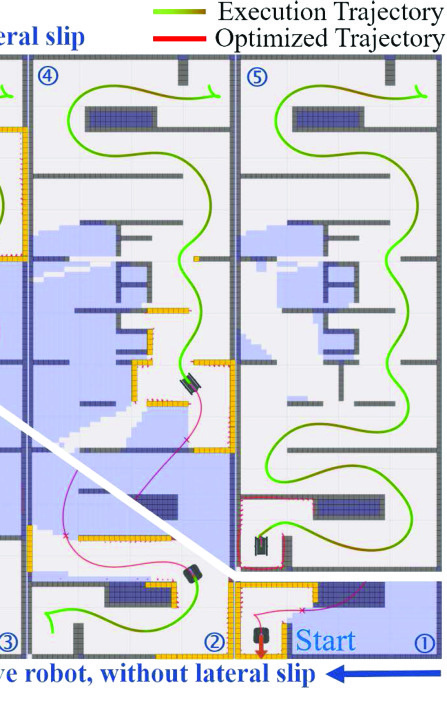

**图 1**：差速驱动（DD）机器人的各种驱动机构，以及相应的运动学模型和规划结果。(a) 双轮标准差速驱动（SDD）机器人；(b) 滑移转向（SKDD）机器人；(c) 履带式（TDD）机器人。

**图 2**：两类机器人在狭窄环境中的优化轨迹与仿真执行结果。机器人应在线建图以感知环境，并通过重规划避开障碍物。为验证规划器性能，特别设计的地图要求机器人在起点和终点都执行旋转或反向运动。右上角从左到右的快照展示了带有侧向滑移的 TDD 机器人的运动和建图过程。左下角从右到左展示了不会发生侧向滑移的 SDD 机器人。

在本文中，我们提出一种基于运动状态多项式参数化的新型轨迹表示方法，以下简称 MS 轨迹。我们直接对机器人的运动状态或其积分量（例如线速度和角速度）进行参数化，使轨迹自然满足机器人的非完整约束，同时有效建模侧向滑移。对运动状态进行优化，可保证运动学约束是优化变量的线性组合，从而确保最优性。同时，与 OCP 相比，这种参数化使控制输入能够由更平滑、复杂度更低的多项式计算得到，进而降低计算复杂度。采用基于运动状态的数值积分，可以将轨迹解析地转换为位置，从而能够施加笛卡尔空间约束。计算效率和通用的轨迹表示为具有相似特征的 DD 平台提供了可行轨迹。

基于该轨迹表示，我们开发了一个 DD 机器人通用轨迹规划系统，能够高效生成高质量轨迹。为保证鲁棒性，我们采用轨迹预处理，避免由初值和前端路径误差引起的拓扑变化。考虑到采用轮速控制时运动学参数存在不确定性，我们使用扩展卡尔曼滤波器（EKF）估计运动学参数，并设计非线性模型预测控制（NMPC），基于该估计结果跟踪期望轨迹。狭窄环境中的优化轨迹及仿真执行结果如图 2 所示。

本文的主要贡献如下：
1. 提出一种通用的 MS 轨迹表示方法，根据运动状态描述 DD 机器人族的运动，并能够描述非完整动力学和侧向滑移。

---

## 原文第 3 页核心内容与翻译

2. 一种高效的基于 MS 轨迹的优化方法，能够在满足机器人运动学和安全约束的同时快速计算平滑轨迹。
3. 一种适用于多种 DD 平台的鲁棒轨迹规划与控制框架。
4. 大量仿真和真实世界实验验证了所提方法的有效性，该方法将以开源软件包的形式发布。
## II. 相关工作
DD 机器人的运动规划已得到广泛研究。
基于启发函数的方法 [3]–[7] 和基于采样的方法 [8]–[12] 因易于处理用户定义的约束而广泛用于机器人运动规划。这些方法通常将环境离散化，并通过图搜索或采样生成连接起点和终点的可行路径。然而，当考虑运动学或动力学时，它们可能具有较高的计算开销。
一些方法 [12]、[13] 考虑了运动学并能保证运动连续性，但仍需在计算成本与路径质量之间进行严格且难以实现的平衡。DWA [14]、[15] 和 LQR [16]、[17] 等方法可用于机器人控制，并因 DD 机器人的运动学特性而广泛应用，但无法保证其最优性。
对于相对简单的 SDD 机器人，研究 [18]、[19] 通过插值并优化关键路点来优化路径。Wang 等人 [20] 在不考虑时间信息的情况下，通过最小化路径长度和最大曲率获得最优路径。尽管可以采用插值方法补充时间信息，但无法保证轨迹在空间和时间上的最优性。
Kurenkov 等人 [21] 使用 Chomp [22] 规划机器人的位置与姿态，并利用拉格朗日方法约束非完整动力学，但等式约束使其计算效率较低。
近年来，基于多项式的轨迹优化方法 [23]、[24]、[25] 已应用于空中机器人运动规划。这些方法通常用于不具有非完整动力学约束的四旋翼飞行器，也可用于具有微分平坦性质的地面机器人轨迹优化 [2]、[26]，以高效率获得最优轨迹。 然而，微分平坦性会因非完整动力学引入奇异性，导致低速时优化性能较差，并依赖 hybrid A* [3] 等前端方法提供初始路径以选择前进或倒退运动。Xu 等人 [27] 进一步规划姿态角，并使用增广拉格朗日方法处理非完整动力学，但满足等式约束需要多次迭代，效率较低。此外，微分平坦性无法对侧向滑移建模，因为姿态被定义为质心速度方向。
由于 SKDD 和 TDD 机器人机械原理中固有且不可避免的侧向滑移，它们通常需要更精确的建模方法，包括动力学模型 [28] 和运动学模型 [1]、[29]、[30]、[31]。许多

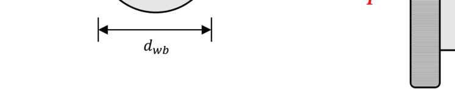

**图 3**：SDD（左）和 TDD（右）机器人的运动学模型。绿色
点表示机器人的机体 ICR，蓝色点表示驱动轮与地面接触点处的 ICR。对于履带式机器人，滑移会导致履带的 ICR 与其在地面上的投影不重合。(xIv, yIl)、(xIv, yIr)、(xIv, yIv) 分别表示左履带、右履带和机体 ICR 在机器人机体坐标系中的位置。

方法 [30]、[32]–[34] 采用运动学模型估计参数，以减小跟踪误差，同时保持良好的计算效率。一些方法 [35] 将机器人的运动学参数纳入运动规划，但通常需要过度简化运动学模型。基于最优控制 [36]、[37] 和 MPC 变体 [38]、[39] 的方法也用于计算轨迹。然而，为实现实时性能，这些方法只能在相对较短的时间范围内计算轨迹，无法保证全局最优性。Rös­mann 等人 [40]、[41] 考虑侧向滑移的时间和速度，提出了基于超图并使用 G2o [42] 实现的 Timed Elastic Band（TEB）规划器。然而，生成最优轨迹可能需要较长时间，而且对 DD 机器人单独考虑侧向滑移速度并不合理。

本文提出一种新的基于运动状态的轨迹表示与轨迹优化算法，结合基于多项式的轨迹优化和状态传播的优点。通过使用更少的变量表示长轨迹，在计算成本与表征复杂运动的能力之间取得平衡。基于运动状态的方法使轨迹能够内在地满足运动学模型。我们基于该方法引入在线参数估计和 NMPC 控制器，从而改善优化轨迹的跟踪性能。
## III. 轨迹表征
本节重点介绍一种基于运动状态多项式参数化的新型轨迹表示方法。表 I 给出了本节使用的符号，包括与机器人状态相关的变量和概念、用于明确含义的上标与下标以及轨迹表示。
### A. DD 机器人的运动学模型
如图 3 所示，我们使用瞬时旋转中心（ICR）[1] 估计 DD 机器人的运动。借助 ICR，可以将机器人机体坐标系的原点定义为机器人的几何中心，并使其 x 轴与机器人姿态方向一致。机器人的

---

## 原文第 4 页核心内容与翻译

瞬时平移速度和旋转速度可表示如下：
ω = Vr −Vl
yIl −yIr
,
(1)
vx = Vr + Vl
2
−Vr −Vl
yIl −yIr
yIl + yIr
2

,
(2)
vy = −Vr −Vl
yIl −yIr
xIv = −ωxIv.
(3)
对于 SDD 机器人，车轮的 ICR 位于各自与地面的接触点处，其中 yIl = −yIr = dwb/2，dwb 为驱动轮轮距，且不存在侧滑（xIv = 0）。机体坐标系原点位于两个驱动轮的中点。为保持通用性，我们使用式 (1)–(3) 在不同驱动机构之间进行轨迹计算。
### B. 运动状态轨迹
不同于经典的笛卡尔坐标轨迹表示，我们直接在运动状态域中表示轨迹。该轨迹由姿态 θ 和前向弧长 s 关于时间的多项式组成：
θi(t) = βT(t)cθ,i,
si(t) = βT(t)cs,i,
(4)
其中，β(t) = [1, t, t2, . . . , t2h−1]T 是自然基。式 (4) 的导数就是运动状态，例如线速度 vx = ˙s 和角速度 ω = ˙θ。为区别于通常由位置 x 和 y 定义的轨迹，我们将这种轨迹称为运动状态（MS）轨迹。我们将轨迹划分为 M 段，每段均表示为阶数为 2h − 1 的二维多项式。
由于终态由笛卡尔坐标系中的位置定义，因此需要通过积分将 MS 轨迹中的位置转换为笛卡尔坐标。机器人在任意时刻 t 的 x 坐标可计算为：
x(t) =
Z t
0
[vx(τ) cos θ(τ) −vy(τ) sin θ(τ)]dτ + x0
=
Z t
0
[˙s(τ) cos θ(τ) + xIv˙θ(τ) sin θ(τ)]dτ + x0.
(5)
类似地，y 坐标可计算为：
y(t) =
Z t
0
[˙s(τ) sin θ(τ) −xIv˙θ(τ) cos θ(τ)]dτ + y0,
(6)
其中 (x0, y0) 为起始位置。然而，直接获得式 (5)–(6) 的解析解较为困难。因此，我们选择数值积分方法进行近似。具体而言，我们采用 Simpson 法，将积分表示为采样点的加权和：
Z b
a
f(x)dx ≈b −a
6

f(a) + 4f
a + b
2

+ f(b)

,
(7)
其中 f(x) 为被积函数，[a, b] 为积分区间。
由于优化过程中需要梯度，对于 MS 轨迹形式，需要同时考虑积分精度和计算复杂度。Simpson 法使用低阶多项式和少量采样点进行近似，因而具有较低的计算复杂度。我们将每段划分为 n 个区间，并在每个区间执行式 (7) 的近似。以 x 轴为例，整个轨迹的积分近似可表示为：
˜xf =
M
X
i=1
xi(ci, Ti) + x0,
xi(ci, Ti) = Ti
6n
n
X
j=1
(ˆx j,0
i
+ 4ˆx j,1
i
+ ˆx j,2
i ),
ˆx j,l
i = ˙sm(T j,l
i ) cos(θi(T j,l
i )) + xIv˙θi(T j,l
i ) sin(θi(T j,l
i )). (8)

---

## 原文第 5 页核心内容与翻译

表 II
优化问题符号说明

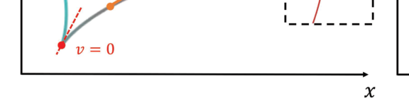

**图 4**：x−y 空间与 θ−s 空间中的轨迹对比。
x−y 空间（左）与 θ−s 空间（右）中的轨迹对比。在 x−y 空间中使用微分平坦性进行规划时，运动方向发生变化的位置会出现奇异点（红点）。然而，这些运动可以在 θ−s 空间中表示为平滑轨迹。

显然，每段需要 2n+1 个采样点。y 轴坐标的位置近似值可以用类似方式计算。
考虑数值积分误差，若将积分区间 [a, b] 划分为 n 个区间，则式 (7) 的最大误差可表示为：
emax = (b −a)5
180n4 max
x
| f (4)(x)|.
(9)
It can be found that the integral error is proportional to
the fourth derivative of the integrand function. Since the
integrand function of Eq.(8) is higher-order continuous, the
error can be kept within an acceptable range. We provide
further experiments in Sec. VII-A to demonstrate that the
integral error does not affect the performance of the planner.
与基于微分平坦性的轨迹相比，MS 轨迹能够避免非完整动力学造成的奇异性。这意味着同一条统一轨迹可以同时表示前进和反向运动，而不必由规划前端预先指定，如图 4 所示。此外，该方法还考虑了侧向滑移（vy ≠ 0）。与直接优化 OCP 中控制输入量的方法相比，多项式轨迹更加平滑，可以减小状态传播误差；对于长轨迹，还能通过减少优化变量降低计算复杂度。
## IV. 优化问题
本节使用 MS 轨迹给出轨迹优化问题。一般轨迹优化约束和 DD 机器人特有的约束分别在第 V 节中介绍。表 II 列出了本节引入的附加符号。
### A. 轨迹优化问题表述
Based on the novel representation of trajectories defined
above, we construct the optimization problem as:
min
c,T
J0 =
Z Ts
0
σ(h)(t)TWσ(h)(t)dt + ϵTTs,
(10a)
s.t.
σ[h−1](0) = σ[h−1]
0
,
(10b)
θ[h−1](Ts) = θ[h−1]
f
, s[h−1]/[0](Ts) = s[h−1]/[0]
f
,
(10c)
˜x f = xf , ˜y f = yf ,
(10d)
σ[h−1]
i
(Ti) = σ[h−1]
i+1 (0),
(10e)
Ts =
M
X
i=1
Ti, Ti > 0,
(10f)
Cd(σ(t), . . . , σ(h−1)(t)) ≤0, d ∈D, t ∈[0, Ts].
(10g)
The quadratic control effort [43] with time regularization
is adopted as a cost functional by Eq.(10a) for motion
smoothness [44], where W ∈R2×2 is a diagonal matrix
and ϵT
> 0 is the weight. Eqs.(10b)–(10c) indicates that
the trajectory should satisfy the initial conditions σ[h−1]
0
and
final conditions θ[h−1]
f
, s[h−1]/[0]
f
. Specifically, we set s0 to 0.
Eq.(10d) indicates that the trajectory should reach the desired
final position (xf , y f ). Eq.(10e) indicates that the trajectory
should be high-order continuous. Eq.(10f) defines the total
time of the trajectory and constrains the time of each segment
to be positive. Eq.(10g) indicates the penalty functions of the
additional inequality constraint set D.
To solve the optimization problem, we adapt the ΣMINCO
[25] trajectory class for our trajectory representation by trans-
forming the optimization variables for this problem. With the
ΣMINCO class, the polynomial coefficients c can be uniquely
transformed by the initial state σ[h−1]
0
, the final state σ[h−1]
f
,
the intermediate points wσ′ and the time T:
K(T)c = [σ[h−1]
0
, σ′
1, 0, . . . , σ′
M−1, 0, σ[h−1]
f
]T,
(11)
where K(T) ∈R2Mh×2Mh is an invertible banded matrix as
given by [25], and 0 = 02×(2h−1) is a zero matrix. With Eq.(11),
we can ensure the polynomial trajectory, represented by c, T,
naturally satisfies the initial and final conditions Eq.(10b)(10c)
and continuity Eq.(10e).
Authorized licensed use limited to: National Institute of Technology- Delhi. Downloaded on August 24,2026 at 05:45:47 UTC from IEEE Xplore.  Restrictions apply.

---

## 原文第 6 页核心内容与翻译

ZHANG et al.: UNIVERSAL TRAJECTORY OPTIMIZATION FRAMEWORK FOR DIFFERENTIAL DRIVE ROBOT CLASS
13035
然而，期望终点通常用笛卡尔坐标表示，而不是用 xf , yf instead of the final arc length
s f , which means the final state σ[h−1]T
f
in Eq.(11) is not
fixed, specifically the final arc length s f is not fixed. The
distance that the trajectory travels cannot be determined prior
to optimization, and therefore sf should not be given but
rather be part of the optimization variables. Hence, we need to
consider the gradient of the optimization problem with respect
to s f . We assume that the gradient of the objective function
J with respect to c has already been computed as ∂J
∂c . As
detailed in [25], we present the gradient of J with respect to
s f without proof as:
∂J
∂s f
= K−T ∂J
∂c e(2M−1)h+1,
(12)
where ei is the ith column of the unit matrix I2Mh ∈R2Mh×2Mh.
Here we choose h = 3 to minimize the linear and angular
jerk, thereby achieving smooth trajectories.
B. Inequality Constraints and Gradient Conduction
For the optimization objective given by Eq.(10a), we can
easily compute the gradient. Considering the strict positive
constraint of time Eq.(10f), we transform the optimization
variables from the real time Ti ∈R+ to the unconstrained
variables τi ∈R with a smooth bijection:
τi =
( √2Ti −1 −1
Ti > 1
1 −
q
2
Ti −1
Ti ≤1.
(13)
对于式 (10g) 中的不等式约束，可以采用惩罚方法 with a first-order relaxation function L1(·) [26]. To
approximate the value of the penalty function, we discretely
sample the constraint points of the trajectory to constrain it,
thus ensuring that the entire trajectory satisfies the constraints:
Ci, j
d (c, T) = Cd

cT
i β
 j
nTi

, . . . , cT
i β(h−1)
 j
nTi

, xi,j, yi, j

,
Id(c, T) = ςd
M
X
i=1
n
X
j=0
Ti
n ν jL1(Ci,j
d (c, T)),
(14)
where
ςd
is
the
weight
of
the
constraint
d.
(ν0, ν1, . . . , νn−1, νn) = (0.5, 1, . . . , 1, 0.5) are the coefficients
from the trapezoidal rule. Here the number of samples n
is the same as the integration intervals in Eq.(8), which
avoids over-calculation. However, the coefficients ci and the
time Ti can only represent the current motion states and
their higher-order derivatives, but not the current position.
That is because the position is the result of the integration,
which depends on the previous motion states. Therefore, the
constraint function Ci, j
d for the sampling point is also defined
as a function of xi,j, yi, j.
Finally, the optimization problem can be reformulated from
Eq.(11) (13) (14) as:
min
wσ′,τ,sf Js = J0(c(wσ′, τ, sf ), T(τ))
+
X
Id(c(wσ′, τ, s f ), T(τ)).
(15)
Without loss of generality, we give the gradient of the
constraint function Ci, j
d with respect to the optimized variables
based on the chain rule, and for simplicity, we omit subscripts:
∂Cd
∂c =
h−1
X
h=0
β(h)
 ∂Cd
∂σ(h)
T
+ ∂x
∂c
∂Cd
∂x + ∂y
∂c
∂Cd
∂y ,
(16)
∂Cd
∂T =
h−1
X
h=0
∂σ(h)
∂T
∂Cd
∂σ(h) + ∂x
∂T
∂Cd
∂x + ∂y
∂T
∂Cd
∂y .
(17)
Thus, we can give the derivative of the constraint function
Id:
∂Id
∂c = ςd
M
X
i=1
n
X
j=0
Ti
n ν j
∂Cd
∂c
∂L1(Cd)
∂Cd
,
(18)
∂Id
∂T = ςd
M
X
i=1
n
X
j=0
ν j
1
nL1(Cd)ei + Ti
n
∂Cd
∂T
∂L1(Cd)
∂Cd

,
(19)
where ei is the ith column of the identity matrix IM ∈RM×M.
The gradients of σ(h) with respect to c and T can be easily
computed. However, x, y involve integrals of σ and ˙σ, so they
have gradients for all previous sampling points. For example,
the gradient of the penalty function Ci,j
d with respect to xi,j is
gi,j
x at a sampling point, which corresponds to the point after
the jth sampling interval of ith segment, and we can get its
gradient with respect to c from Eq.(8) as:
Γi,j = ˆx j,0
i
+ 4ˆx j,1
i
+ ˆx j,2
i ,
∂xi,j
∂cm
∂Cd
∂xi, j = gi,j
x
Tm
6n
n
X
k=1
∂Γm,k
∂cm
!
, m ∈[1, i −1],
∂xi,j
∂ci
∂Cd
∂xi, j = gi,j
x
Ti
6n
j
X
k=1
∂Γi,k
∂ci
!
.
(20)
同理，关于 T 的梯度为：
∂xi,j
∂Tm
∂Cd
∂xi, j = gi, j
x
n
X
k=1
Γm,k
6n + Tm
6n
∂Γm,k
∂Tm

, m ∈[1, i −1],
∂xi,j
∂Ti
∂Cd
∂xi, j = gi, j
x
j
X
k=1
Γi,k
6n + Ti
6n
∂Γi,k
∂Ti

.
(21)
For convenience, we compute the gradient of the sampled
point ∂Γi, j
∂Ti
and ∂Γi,j
∂ci
from Eq.(8) and save them in vectors
while integrating to compute the whole trajectories. Therefore,
we only need to compute the gradient of the constraint function
on σ(h), x and y, after which it can be transferred to the
optimized variables using the chain rule.
 C. 终端位置约束
Unlike trajectories based on differential flatness in the
Cartesian frame, the final position of the MS trajectory is
computed by integral approximation and could result in a
significant difference from the desired destination. Therefore,
it is necessary to add final position constraints specifically to
reduce the error between the final position of the trajectory
(˜x f , ˜yf ) and the desired position (x f , yf ). Using the integral
Authorized licensed use limited to: National Institute of Technology- Delhi. Downloaded on August 24,2026 at 05:45:47 UTC from IEEE Xplore.  Restrictions apply.

---

## 原文第 7 页核心内容与翻译

利用式 (8)，x 轴约束可写为：
Cf x(c, T) = ˜x f (c, T) −x f .
(22)
Unlike other constraints, final position constraints are gen-
erally given with a maximum error emax. Although we can
assign a large penalty weight to guarantee the accuracy, it
may change the topology of the trajectory or slow down the
convergence. Moreover, if we only use the penalty function
method, the optimization results may not meet the required
accuracy. 为迭代减小该误差，引入 Powell-Hestenes-Rockafellar 增广拉格朗日方法
(PHR-ALM) [45], [46], [47]. We define J ′
s as an uncon-
strained optimization problem in Eq.(15) excluding the final
position constraints and transformed with the penalty function.
The new optimization problem can be expressed as:
Jρ(wσ′, τ, s f , λ) = J ′
s
+
X
ι=x,y
ρ
2∥Cfι(c(wσ′, τ, s f ), T(τ))
+ λι
ρ ∥2,
(23)
where λ is the dual variable and ρ > 0 is the weight of the
augmentation term. Next, it can be updated as follows:
8
ˆ<
ˆ:
wσ′k+1, τk+1, sk+1
f
= argminJρ(wσ′, τ, sf, λk),
λk+1
ι
= λk
ι + ρkCfι, ι = x, y,
ρk+1 = min[(1 + ϱ)ρk, ρmax],
(24)
where ϱ > 0 ensures that ρk is an increasing non-negative
sequence, and ρmax is used to avoid ρk becoming too large.
L-BFGS [48] is used to solve the optimization problem
argminJρ. The iterative calculation according to Eq.(24) is
performed until the following condition is met:
q
(˜x f −xf )2 + (˜y f −yf )2 < emax,
(25)
i.e., we can gradually control the error of the final position
within the set range emax.
## V. DD 机器人的约束
In this section, we focus on the specific form of Cd in
Eq.(10g), which fundamentally ensures the efficient and safe
operation of differential drive robots. To ensure the dynamic
feasibility of the trajectory, we introduce velocity and accel-
eration constraints in Sections V-A and V-B. The safety
constraint, discussed in Section V-C, is used to prevent colli-
sions. Additionally, the Segment Duration Balance constraint,
introduced in Section V-D, serves as an auxiliary constraint to
improve the numerical properties of the optimization process.
### A. 线速度与角速度耦合
Different from Ackerman or quadrotor platforms, the linear
velocity and angular velocity of DD robots are closely coupled
as both are produced from the two driving wheels. Any
changes in the left or right wheels can affect the forward speed
or turning rate simultaneously. Therefore, it is necessary to
consider the constraints of linear and angular velocities with
the relation constraint, instead of linear and angular velocities
separately. Considering that calculating an accurate ωmax −vx
profile by dynamics is inefficient, we approximate it with the
kinematic model. Assuming that the maximum velocity of the
two wheels is fixed, the maximum angular velocity versus
velocity can be obtained using Eq.(1)(2):
ωmax(vx) = 2(vM −|vx|)
yIl −yIr
,
(26)
where ωmax is the current maximum angular velocity, and vM is
the maximum velocity when moving forward in a straight line.
Additionally, we assume xIv = 0. However, a more common
scenario is that the maximum angular velocity of the robot
cannot reach the maximum value calculated by Eq.(26). We
still assume that the maximum value of angular velocity and
linear velocity are linearly related. If the maximum angular
velocity when vx = 0 is ωM, we can rewrite Eq.(26) as:
ωmax(vx) = vM −|vx|
vM
ωM.
(27)
Considering that some robots have extra limitations when
reversing, i.e., the maximum reverse velocity may be less than
the maximum forward velocity, we constrain them separately.
Assuming that the maximum reverse velocity is vM ≤0, we
can give the velocity and angular velocity constraints:
Cm+( ˙σ) = ηωωvM + ωMvx −vMωM, ηw ∈{−1, 1},
Cm−( ˙σ) = −ηωωvM −ωMvx + vMωM, ηw ∈{−1, 1},
(28)
where Cm+ and Cm−are constraints for forward and reverse,
respectively. Specifically, we can set vM = 0 to prohibit
reversing.
Although we make an assumption of a linear relationship,
more precise constraints can be determined in real experiments
using any differentiable constraint functions if necessary.
### B. 线加速度与角加速度
To smooth the trajectory of the robot and to take into
account the moment limitations of the actuator, we also set
constraints on the linear acceleration a and angular accel-
eration α of the robot. However, calculating time-varying
acceleration limits through dynamics is unnecessary. We sim-
plify by setting a constant maximum value for each of them,
and their corresponding constraint functions are:
Ca( ¨σ) = a2 −a2
M,
Cα( ¨σ) = α2 −α2
M,
(29)
where aM and αM are the maximum values of linear and
angular acceleration, respectively.
### C. 安全性
We use the Euclidean Signed Distance Field (ESDF) to
constrain the distance from the robot to obstacles. We take
γb points χb,l ∈R2 along the profile of the robot. χb,l are the
coordinates of the profile points in the body frame and are
specified before the optimization. Then their positions in the
world frame can be calculated:
pb,l(x, y, θ) = [x, y]T + R(θ)χb,l, l ∈{1, 2, . . . , γb},
(30)
Authorized licensed use limited to: National Institute of Technology- Delhi. Downloaded on August 24,2026 at 05:45:47 UTC from IEEE Xplore.  Restrictions apply.

---

## 原文第 8 页核心内容与翻译

ZHANG et al.: UNIVERSAL TRAJECTORY OPTIMIZATION FRAMEWORK FOR DIFFERENTIAL DRIVE ROBOT CLASS
13037
其中 x、y 为机体坐标系原点的位置，R(θ) 为机器人的旋转矩阵。保证轮廓点的 ESDF 值大于安全距离 ds，即可防止机器人与障碍物碰撞。
因此，安全约束可表示为：
Cs,l(x, y, θ) = ds −E(pb,l(x, y, θ)), l ∈{1, 2, . . . , γb},
(31)
其中 E(·) 为通过双线性插值得到的 ESDF 值。
在复杂环境或机器人不对称时，可以约束更多轮廓点，以充分利用安全空间；也可以只约束一个点 χb=[0,0]T，将机器人建模为圆形，从而提高优化效率。
### D. 分段时长平衡
During the optimization process, the time duration of the
segments could become unbalanced. If the time Ti of segment
i is too long, it will result in larger intervals between the
sampling points, which can hinder the accurate approximation
of the sampling constraint function and increase the error in
the integration. Therefore, we aim to keep the time allocated
to each segment within a certain range of deviation, ensuring
that they do not vary excessively from one another. For the
ith segment, we give the balanced duration constraint:
CTlow(Ti) = ϵlow
1
M
M
X
m=1
Tm −Ti,
CTupp(Ti) = Ti −ϵupp
1
M
M
X
m=1
Tm,
(32)
where ϵlow ∈[0, 1) is the lower limit and ϵupp > 1 is the upper
limit. With Eq.(32), each segment’s time is constrained within
a certain range of the average, which ensures that the duration
of each segment is neither too long nor too short.
## VI. 规划与控制系统设计
在上述轨迹优化基础上，我们进一步为差速驱动机器人族构建完整的规划与控制系统。系统引入全局路径搜索提供初值，并通过轨迹预处理减少拓扑变化、增强鲁棒性；同时估计机器人的运动学参数，并据此设计控制器。系统框图如图 5 所示。
### A. 全局路径搜索
我们使用 Jump Point Search（JPS）[4] 作为全局规划器，搜索从初始位置到终点的路径。JPS 能够快速生成全局路径，这对快速重规划场景十分重要。
### B. 轨迹预处理
Considering that JPS does not consider any kinematic infor-
mation, sampling on the global path to directly get the initial
values of the trajectory is not reasonable. The global path is
composed of coordinate points {pg} ∈R2 without orientation,

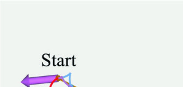

**图 5**：采用本文规划器的示例导航系统概览。
Overview of the a example navigation system with our planner. In
perception, lidar is used for Lidar-Inertial Odometry (LIO) and mapping.
With the result of odometry and ESDF map, our planner uses Jump Point
Search (JPS) to get the global path (brown) and to generate the initial MS
trajectory (purple). Trajectory pre-processing (blue) ensures close alignment
of the trajectory with the global path. The Augmented Lagrangian Method
(ALM) iteratively optimizes the trajectory to satisfy constraints (yellow) and
reach the desired final positions (red). The system uses pre-integration to get
the reference trajectory and selects appropriate NMPC controller depending
on the driving method.

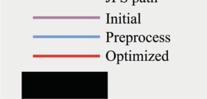

**图 6**：规划结果。由于初始值获取存在误差，初始
trajectory may be inside obstacles (purple). By using trajectory preprocessing
(blue), we can make the trajectory as close as possible to the front path
(brown) before optimization, thus avoiding optimization failure. The optimized
trajectory (red) can better satisfy the constraints.

which will result in poor initial orientation and may lead to
a significant difference between the initial trajectory and the
global path, as shown in Fig. 6. The lack of kinematic infor-
mation may also lead to poorly assigned velocities. Therefore,
it is necessary to perform preprocessing to get better initial
values before trajectory optimization Eq.(23). After getting
the global path and sampling to get the initial values, we
can achieve better initial values through preprocessing with
a simpler optimization.
When using JPS to get the initial trajectory, we can also
determine the initial value of the final position for each
trajectory segment, expressed as pw0 ∈RM×2. We apply
constraints on the final position of each segment:
Is f (pi
f (c, T)) =
M
X
i=1
(pi
f −pi
w0)2,
(33)
where pi
f is the integrated final position of the ith segment,
and pi
w0 is the initial final position of the ith segment. Equation
(33) ensures that the trajectory’s topology and success rate are
not adversely affected by poor initial values, by bringing the
processed trajectory closer to the global path. Additionally, it
ensures the trajectory’s integral final position is closer to the
desired final position.
Authorized licensed use limited to: National Institute of Technology- Delhi. Downloaded on August 24,2026 at 05:45:47 UTC from IEEE Xplore.  Restrictions apply.

---

## 原文第 9 页核心内容与翻译

Similar to Sec. IV-A, we design the optimization problem
as:
min
wσ′p,τp,sf Jpre = J0(c(wσ′
p, τp), Tp(τp))
+
X
Id′(c(wσ′
p, τp), Tp(τp)),
(34)
where d′ = {m, a, α, Tlow, Tupp, sf}. By considering Eq.(28),
Eq.(29), Eq.(32), and Eq.(33) via the penalty function method,
we can generate a trajectory that is closer to the initial global
path and more dynamically feasible. Here we set a large
convergence tolerance to reduce its computation time.
C. Replanning Strategy
1) Starting Positions of Replanning: Considering the com-
putation time of the planner, we set a time interval TR as the
expected computation time. At time tc, when the robot initiates
replanning, we select the position pR at time tc + TR as the
starting position for replanning. As long as the planner com-
pletes the computation within TR and transmits the trajectory
to the controller, the controller can replace the old trajectory
with the new one at tc + TR, ensuring the smoothness of the
trajectory.
2) Selection of Starting Positions of JPS: Considering that
changes in topology can greatly impact the current motion of
the robot, we do not use the robot’s current position as the
starting position for replanning. Instead, we search forward
along the current trajectory for a certain period of time TJ
and get the last safe point pJ as the starting position of JPS,
thus reducing topology changes. It is worth noting that pJ is
different from pR. The path from pR to pJ will be connected
to the JPS path as part of the global path.
3) Truncation: Since trajectory optimization requires more
computation time compared to the front-end, we truncate
the reference paths whose lengths are over lmax and use the
front part for optimization. Generally, replanning does not
need to precisely reach the interim destination. We relax
the final position constraint during replanning, i.e., we set a
large convergence condition emax in Eq.(25), thus saving the
replanning time.
D. Parameter Estimation
In Sec. III-A, we introduce ICRs to describe the kinematic
model for the different DD robots. To improve accuracy, it is
necessary to perform online estimation for ICRs. Inspired by
[33], we use the Extended Kalman Filter (EKF) to estimate
the position of the ICRs. The ICRs are modeled as constants
disturbed by random noise. We denote the state of the robot
as ST = [x, y, θ, yIl, yIr, xIv]T and express the kinematic as
follows:
2
6666664
˙x
˙y
˙θ
˙yIl
˙yIr
˙xIv
3
7777775
=
2
6666664
vx cos θ −vy sin θ + Υx
vx sin θ + vy cos θ + Υy
ω + Υω
ΥyIl
ΥyIr
ΥxIv
3
7777775
,
(35)
where Υ· denotes zero-mean Gaussian noise. We use Eq.(35)
as the state propagation model. Given that the robot’s position
can be directly obtained from the localization module, we set
the observation equation to OB = [xob, yob, θob]T. Based on
the observation equation, we can calculate the filter gain and
update the state and covariance.
Considering that we also need EKF for state estimation,
we can perform state estimation simultaneously to obtain the
robot’s current kinematic parameters.
E. Controller Design
Given the robot’s kinematics Eq.(1–3), and the reference
trajectory given in Sec. IV, we use Nonlinear Model Predictive
Control (NMPC) by solving the optimal control problem in a
receding horizon manner. Generally, the localization module
provides only position information, so we use the position as
the state of NMPC rather than directly using motion states.
NMPC minimizes the error between the predicted state and
the reference state for a finite forward horizon [t0, t0 + Th],
where t0 is the current time and Th is the prediction horizon.
We set a fixed time step dt and the corresponding horizon
length N = Th/dt to discretize the trajectory. Here, the timestep
i represents time ti = t0 + i dt. Subsequently, the optimal
control problem is transformed into the following nonlinear
programming:
U∗= arg min
u
k+N−1
X
i=k
(pT
i Wppi + uT
i Wuui) + pT
NkWppNk,
s.t.
pi+1 = f(pi, ui), umin < ui < umax,
(36)
where k is the current timestep, pi, ui are the state and input
of timestep i, pi = pr
i −pi, ui = ur
i −ui are the state and input
errors, pNk ≡pr
k+N −pk+N is the final-state error, pr
i, ur
i are
the reference state and input of timestep i calculated from the
optimized trajectory. Wp and Wu are the weight matrices of
the corresponding terms. We solve this NMPC problem using
ACADO [49] with qpOASES [50]. For the robot controlled
via two-wheel speed, we set the differential equation as:
˙p =
2
4
vx cos θ −vy sin θ
vx sin θ + vy cos θ
ω
3
5 ,
(37)
where vx, vy, ω are the robot’s kinematics corresponding to
Eq.(1–3), and the robot’s kinematic parameters are estimated
in real time by Sec. VI-D.
For the robot controlled by linear velocity vx and angular
velocity ω, we set the differential equation as:
˙p =
2
4
vx cos θ
vx sin θ
ω
3
5 .
(38)
Considering the computation cost of the integration to get
the reference position pr
i from the reference MS trajectory,
the controller, upon receiving a trajectory, will perform pre-
integration at a specific sampling interval tsp and store the
results {psp
j }. When calculating the reference position pr
i, the
controller will find the nearest pre-integrated time jtsp and
corresponding position psp
j , and start the integral process from
psp
j
to get the more accurate value.
Authorized licensed use limited to: National Institute of Technology- Delhi. Downloaded on August 24,2026 at 05:45:47 UTC from IEEE Xplore.  Restrictions apply.

---

## 原文第 10 页核心内容与翻译

ZHANG et al.: UNIVERSAL TRAJECTORY OPTIMIZATION FRAMEWORK FOR DIFFERENTIAL DRIVE ROBOT CLASS
13039

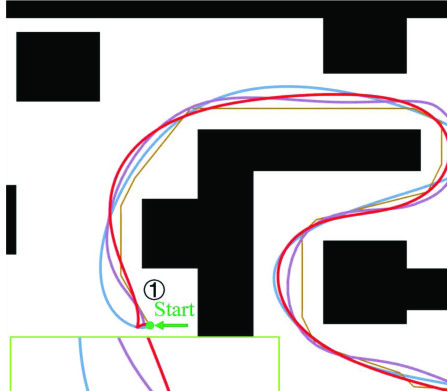

**图 7**：实验规划结果。
Integral error test environment. The orange point is the starting
position. Final positions are randomly sampled and not plotted.

**图 8**：积分误差测试结果。上图的横轴为轨迹
length and the y-axis is the final position error. The bottom graph shows
the statistical results, with outliers defined as values more than 1.5IQR
(interquartile range) from the top of the box.

VII. BENCHMARK AND SIMULATIONS
In this section, we first evaluate the numerical integra-
tion errors caused by the trajectory representation, which
are proved to have trivial effects. Then we validate the
effectiveness of the proposed method and test it in various
environments. We recommend readers refer to the submitted
video for more detailed comparisons.
A. Integral Error Analysis
In this section, we focus on the impact of integration error.
To test the general performance, we design three environments
based on the difficulty of planning as shown in Fig. 7:
Sparse: A 20m × 20m environment with 65 randomly
generated square obstacles with a size of 1m × 1m. Dense: A
20m × 20m environment with 213 randomly generated square
obstacles with a size of 0.5m × 0.5m. The space between
obstacles is significantly reduced, making navigation more
challenging. Spiral: A spiral environment with size 20m×20m,
where only one turning direction is allowed to move from the
outside to the inside and the robot needs to rotate continuously
and move over long distances.
The maximum velocity of the robot is set to 3m/s, and the
maximum angular velocity is set to 4rad/s. The initial value of
trajectory time is set to 0.8s per segment, and the number of
intervals n per segment is set to 10. We randomly sample the
final positions within the reachable area of the map for more
than 1000 experiments for statistical generalization.
The results, as shown in Fig. 8, indicate that the integration
error is below 10−5m for all maps and most lengths, which
demonstrates that the integration error will not impact the

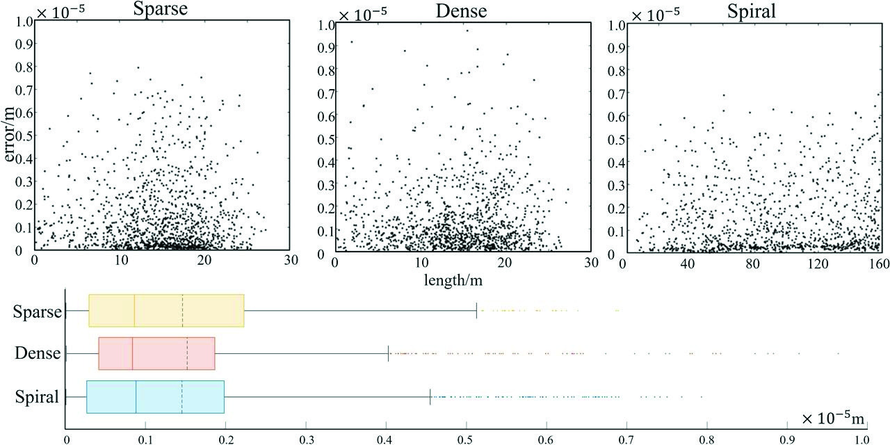

**图 9**：不同方法的可视化对比。本文方法与 TEB
are set to allow moving backward. To better illustrate the details, we zoom in
three areas( 1O to 3O) with distinct differences. Specifically, in region 2O, we
show the via-points of TEB.

performance of our proposed trajectory optimization. There-
fore, it is reasonable to ignore the integration error.
B. Simulation and Benchmarks
Experimental Setup: All simulation experiments are con-
ducted on a desktop computer running Ubuntu 18.04, equipped
with an Intel Core i7-10700K CPU. We compared our pro-
posed method with two widely recognized motion planning
algorithms for DD robots: Timed Elastic Band (TEB) plan-
ner [41] and a Differential Flatness-based (DF) planner [2].
TEB considers temporal optimization while guaranteeing path
continuity and smoothing through an elastic band model. Our
reference for the DF method is drawn from our prior work,
which notably offers a more constrained approach for angular
velocity and acceleration, crucial for adhering to the robot’s
kinematic constraints because of nonholonomic dynamics. All
methods utilize a global pointcloud for map construction and
set the kinematic model to a SDD model. Considering robot’s
decoupled velocity and angular acceleration constraints, we set
lower bounds for TEB to maintain kinematic feasibility. For
the DF method, which requires pre-specification of the robot’s
movement direction (forward or backward), we simplify this
by assuming only forward movement. We model the robot as
a point mass and set the same safety distance for all methods.
Quantitative Evaluation: We perform extensive quantitative
tests in environments of size 20m × 20m with randomly
generated obstacles. We use different numbers of obstacles
to characterize the complexity of the environment, while
categorizing the length of trajectories according to the distance
between the starting and final positions. In each case, we
randomly assign feasible starting and ending positions and
conduct at least 1000 experiments. In each experiment, we
record the kinematics of the trajectories, including the mean
linear acceleration (MLA), the mean linear jerk (MLJ), the
mean angular acceleration (MYA), and the mean angular
jerk (MYJ), as shown in Table. III. We also compute the
average computation time (CT), the trajectory length (TL),
the trajectory duration (TD), the mean velocity (MV) and the
success rate (SR) for each case, as shown in Table. IV. The
optimization is considered to fail when it does not converge
or penalty functions are not satisfied.
One of the simulation results is shown in Fig. 9. Simulation
results suggest that the proposed method notably outperforms
Authorized licensed use limited to: National Institute of Technology- Delhi. Downloaded on August 24,2026 at 05:45:47 UTC from IEEE Xplore.  Restrictions apply.

---

## 原文第 11 页核心内容与翻译

TABLE III
COMPARISON OF KINEMATICS IN DIFFERENT CASES
TABLE IV
COMPARISON OF COMPUTATION TIME, TRAJECTORY INFORMATION AND SUCCESS RATE IN DIFFERENT CASES
others in trajectory performance. TEB generates trajectories
composed of via-points, which can only generate piecewise
smooth trajectories. As shown in Table. III, kinematic metrics
of the proposed method demonstrate superior smoothness. By
modeling the trajectory as a high-order polynomial, we ensure
the continuity, making the trajectory easier for the controller
to track compared to the TEB method with discrete control
input quantities. Due to the nonholonomic dynamics, although
[2] proposed methods to make the DF trajectory better satisfy
the kinematic constraints, these methods are limited to being
“confined within certain limits”, such as the angular accelera-
tion. As shown in Table. III, the values of MYA and MYJ
are both larger than those of the proposed method, which
will lead to overly aggressive motion and negatively affect
the control of the orientation angle. The proposed method
can adapt to different scenarios and is robust under various
environmental complexities and trajectory lengths. In contrast,
the nonlinearity of DF affects the computational efficiency and
still fails to satisfy constraints such as angular acceleration
in some scenarios. TEB requires more control points by
discretizing trajectories, which will lead to longer computation
time or more difficult convergence.
When considering the case of xIv , 0, which is common
in TDD robots, the interaction between the tracks and the
ground causes lateral movement of the geometric center. To
validate the effectiveness of the proposed method, we set
yIl = −yIr = 0.3m and xIv = 0.2m under the same envi-
ronmental settings as before.. We recorded the computation
time (CT), the mean velocity of the geometric center (MV),
and the success rate (SR), as shown in Table. V. The pro-
posed method consistently achieved feasible trajectories with
TABLE V
COMPARISON WHEN CONSIDERING THE CASE OF xIv , 0
high efficiency and robustness across various environments.
However, the increased complexity of the kinematic model
resulted in a slight increase in computation time. The average
velocity of the geometric center also increased, which is
mainly caused by the lateral slip. Due to the lateral slip, the
geometric center cannot rotate with zero radius, resulting in
poor trajectory tracking if xIv is not considered, as illustrated
in Fig. 10(b). TEB plans the lateral velocity vy separately;
however, in reality, vy is related to ω as described in Eq. 3.
Independently planning vy does not conform to the robot’s
motion model, leading to significant tracking errors, as shown
in Fig. 10(a). In contrast, the proposed method incorporates
slip into the trajectory representation, resulting in improved
tracking performance, as demonstrated in Fig. 10(c).
When the shape cannot be simply modeled as a circle,
we can select checkpoints along the robot’s contour to better
model its shape. As shown in Fig. 11, using safety circles
centered at these checkpoints can construct the robot’s enve-
lope with as small as possible error. By applying the safety
constraints in Sec. V-C, the proposed method can fully utilize
the safe space while ensuring the safety of the trajectory.
Authorized licensed use limited to: National Institute of Technology- Delhi. Downloaded on August 24,2026 at 05:45:47 UTC from IEEE Xplore.  Restrictions apply.

---

## 原文第 12 页核心内容与翻译

ZHANG et al.: UNIVERSAL TRAJECTORY OPTIMIZATION FRAMEWORK FOR DIFFERENTIAL DRIVE ROBOT CLASS
13041

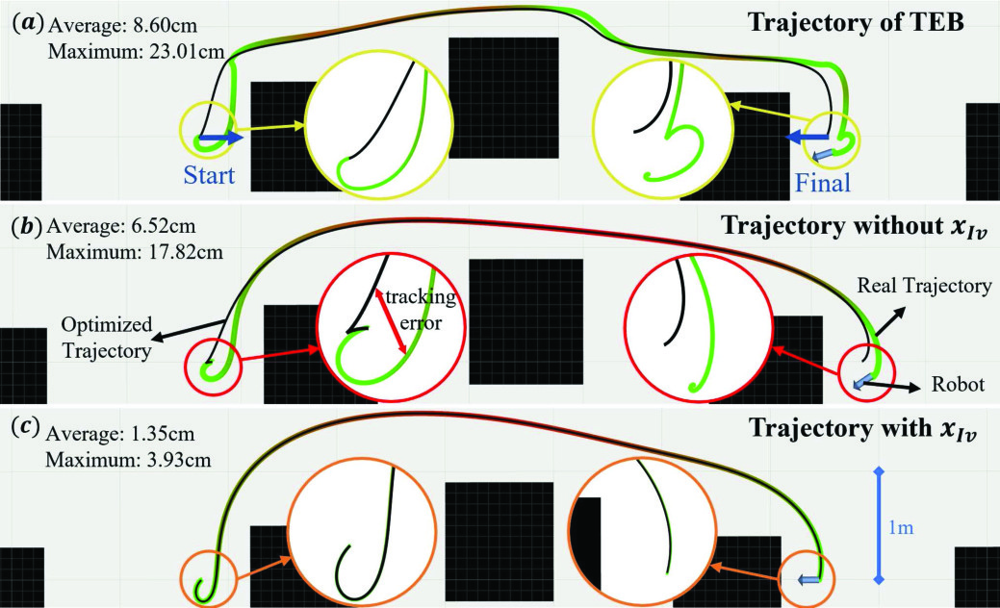

**图 10**：TEB（a）以及本文方法不考虑（b）和
with (c) lateral slip of xIv, when lateral slip cannot be ignored. We calculate
the average tracking error and maximum tracking error of the controller. By
modeling lateral slip into the MS trajectory, the controller achieves better
performance in tracking the proposed trajectory.

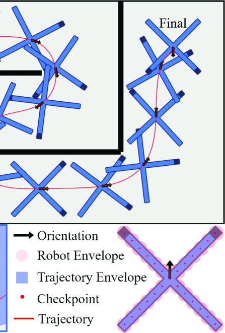

**图 11**：考虑机器人形状的轨迹优化。机器人为 X-
shaped designed, with selected checkpoints marked on it shown in the bottom
right. Circles centered on these checkpoints are used to enclose the robot’s
outline. Two parts of the trajectory( 1O and 2O) are zoomed in to illustrate the
trajectory envelope in the bottom left, showing how the optimized trajectory
considers the robot shapes.

C. Replanning Experiments
Additional tests are conducted for the two methods: the DF
method and the proposed method, both of which fulfill real-
time requirements. A series of targets are set up within the
environment, and the robot should sequentially reach these
targets, as shown in Fig. 12. Both methods replan at the same
frequency. For clarity, the starting positions of the two methods
are staggered, as indicated by Fig. 12 1O. The DF method
uses differential flatness to represent the trajectory, where the
robot’s state can be expressed through Cartesian coordinates
x, y and their derivatives. Based on this representation, we can
get the angular velocity ω and the angular acceleration α:
ω = ˙x¨y −˙y¨x
˙x2 + ˙y2 ,
α = ˙x...y −˙y...x
˙x2 + ˙y2 −2(˙x¨y −˙y¨x)(˙x¨y + ˙y¨x)
(˙x2 + ˙y2)2
.
(39)
It is noteworthy that the linear velocity of the robot, vx =
p
˙x2 + ˙y2, in the denominator can adversely impact the

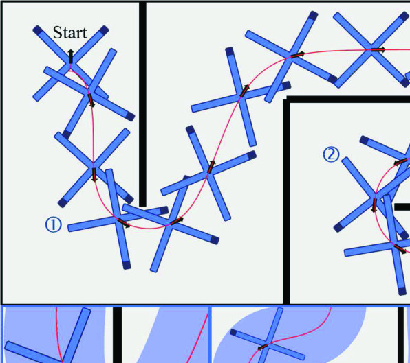

**图 12**：不同机器人平台的规划结果。
Patrolling with DF and Proposed methods, the next target is
provided to the planner upon nearing the current target. We zoom in four
position( 1O – 4O) to show the smoothness and efficiency difference. 1O is the
starting position, with the initial state directed towards the positive right-hand
side. We use the gradient color to show the angular velocity in 2O- 4O. The
robot moves around the obstacle in 2O. In 3O and 4O, a new target is provided
to the planner, prompting the robot to turn towards the new target.

**图 13**：重新规划的仿真结果。（a）U 形环境。（b）
designed environment containing many obstacles that may be obscured.

performance of the DF method, particularly at low velocities.
When the robot starts moving, as shown in Fig. 12 1O, abrupt
changes in orientation may occur within the DF trajectory.
Furthermore, the nonlinearity of Eq.(39) affects the optimal-
ity of the DF trajectory, leading to discrepancies between
pre- and post-replanning trajectories and compromising the
smoothness of execution results. In contrast, the proposed
method is devoid of such nonlinearity, yielding better exe-
cution results. Given that the optimization objective Eq.(10a)
of the proposed method considers ω and α, in contrast to
the DF method which employs Eq.(39) as constraints without
integrating it into minimizing control effort, the resulting
angular velocity profile of the proposed trajectory exhibits a
significantly smoother behavior, as demonstrated in Fig. 12 2O.
This difference becomes particularly pronounced when the
robot is in motion and the target is behind it, as shown in
Fig. 12 3O and
4O.
In order to show the application of the proposed method
in a fully autonomous simulation, we conduct replanning
simulation tests in unknown maps, as shown in Fig. 13.
The simulator receives and executes velocity commands and
broadcasts the current position of the robot. We simulate the
Authorized licensed use limited to: National Institute of Technology- Delhi. Downloaded on August 24,2026 at 05:45:47 UTC from IEEE Xplore.  Restrictions apply.

---

## 原文第 13 页核心内容与翻译

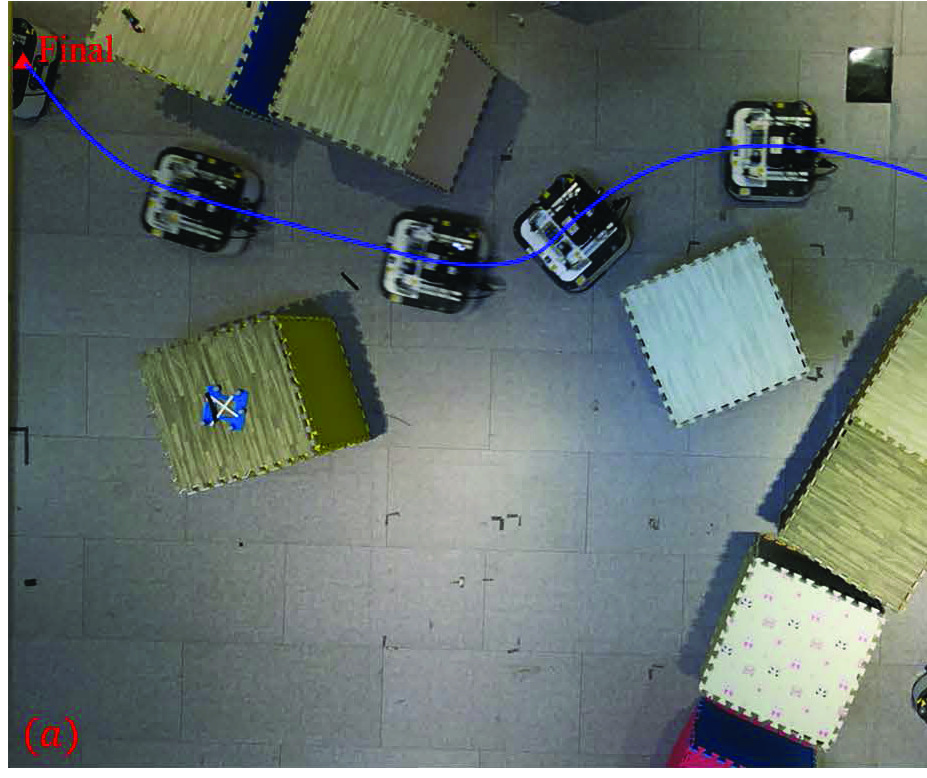

**图 14**：规划结果。（a）双轮 SDD 机器人。（b）四轮 SKDD 机器人。（c）SKDD 起点处的地图与规划结果
robot. (d)Real trajectory of the SKDD robot.

TABLE VI
AVERAGE COMPUTATION TIME OF REPLANNING
Lidar using a laser simulator.1 The robot need to receive point
clouds during runtime to build maps. The detection range is
set to 7m, the truncation length is lmax = 8m. The convergence
condition for Eq.(25) is set to e′
max = 0.1m, whereas without
truncation, the convergence condition is emax = 0.01m. The
grid size of the map is 0.1m and the replanning frequency is
set to 12.5Hz.
We design a complex U-shaped environment, and the results
are shown in Fig. 13(a). We tabulate the running time of each
part, as shown in Table. VI, which proves that the proposed
method can complete the computation in real-time. Here we
set the expected computation time TR = 20ms, and in almost
all cases, the planner can complete the computation in time.
The expected computation time TR is much less than time
used for mapping and actuator control, thereby minimizing
the impact of the planner on the system’s response speed and
enhancing the robot’s applicability in time-sensitive scenarios.
To validate the effectiveness of the proposed method, we
specifically design an environment as shown in Fig. 13(b),
where some obstacles are easily obscured and rapid replanning
is necessary to ensure safety. We adopt the strategy from [51],
which involves forcing the robot to move away from obstacles
to broaden the field of view. Our proposed method enables the
robot to reach the final position safely.
VIII. REAL-WORLD EXPERIMENTS
To verify the practical application and universality of the
proposed method, we conducted tests with different DD plat-
forms in various environments:
• A two-wheeled SDD robot with a pre-built map and the
motion capture system, simulating tasks in flat indoor
scenarios such as cleaning or service robots.
1https://github.com/ZJU-FAST-Lab/laser simulator
• A faster and more flexible four-wheeled SKDD robot
equipped with Lidar for localization and mapping in var-
ious unknown environments, testing the method’s ability
to replan in complex unknown environments.
• A TDD robot equipped with Lidar for localization and
mapping, evaluating the method’s adaptability in narrow
and unknown environments with low acceleration for
common heavy-load tracked robots.
A. Two-Wheeled SDD Robots
We employ the TRACER MINI2 as the two-wheeled SDD
robot platform, which is controlled through linear and angular
velocity. We pre-build the map and utilize the motion capture
system3 for localization. We intentionally task the robot with
large-angle maneuvers, where there is a significant difference
between the initial orientation and the upcoming forward
direction. We constrain the maximum velocity to vmax=1.0m/s
and the maximum angular velocity to ωmax=1.0rad/s. The
result is shown in Fig. 14(a), demonstrating the capability of
our proposed method to produce smooth motion.
B. Four-Wheeled SKDD Robots
We employ the SCOUT MINI4 as our SKDD robot plat-
form, which is controlled through linear and angular velocity.
We randomly place obstacles and use FAST-LIO [52] for
localization, and limit the perception range to 7m. The robot’s
maximum velocity is set to vmax=2.0m/s and the maximum
angular velocity to ωmax=1.5rad/s. Replanning is executed at a
rate of 10.0Hz, aligning with the frequency of FAST-LIO. The
combination of limited perception range, occluded obstacles,
and high velocity presents a significant challenge to motion
planning. Given the large running velocity and large robot size,
the method must rapidly generate new trajectories to navigate
sudden obstacles. As shown in Fig. 14(b), the robot travels
through a random forest environment to reach the final posi-
tion. At the starting position, due to obstruction, a part of the
map is unknown, as shown in Fig. 14(c). The robot can safely
2https://www.agilex.ai/chassis/2
3https://www.nokov.com/
4https://www.agilex.ai/chassis/11
Authorized licensed use limited to: National Institute of Technology- Delhi. Downloaded on August 24,2026 at 05:45:47 UTC from IEEE Xplore.  Restrictions apply.

---

## 原文第 14 页核心内容与翻译

ZHANG et al.: UNIVERSAL TRAJECTORY OPTIMIZATION FRAMEWORK FOR DIFFERENTIAL DRIVE ROBOT CLASS
13043

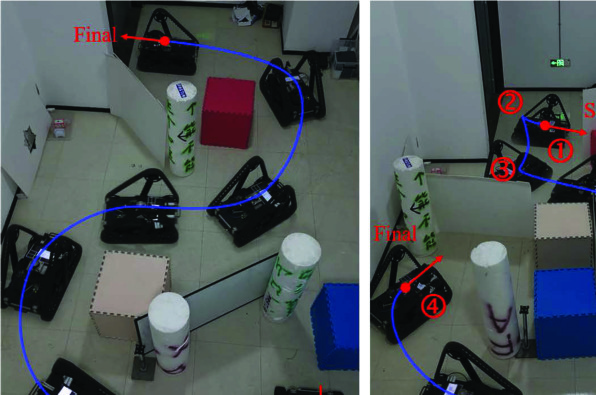

**图 15**：狭窄复杂空间中的规划结果。

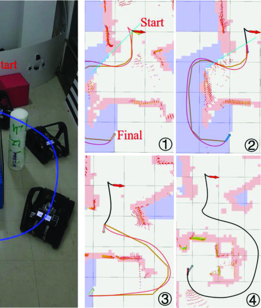

**图 16**：真实机器人实验结果。
Planning results for the TDD robot. (a) Planning results in the
complex environment. (b) Results of trajectory topology change due to
occlusion. 1O- 4O are parts of the replanning results of (b). Orange lines are
the results of JPS, red lines are the current optimized trajectory, and black
lines represent trajectories that have already been passed.

reach the final position while constructing the map, as shown
in Fig. 14(d). In addition, we also specifically design narrow
and complex maps to test the proposed method, as shown in
Fig. 15. Experimental results show that the proposed method
can generate smooth motions within complex environments.
C. TDD Robots
We employ the CubeTrack [53] as the TDD platform, which
is controlled by the rotational speed of the two tracks. We
use FAST-LIO for localization and limit the perception range
of the Lidar to 7m from the robot. We limit the maximum
rotational speed of both tracks to Vmax = 0.5m/s and replan at a
rate of 10Hz. The rotating arms change the mass distribution of
the robot and therefore affect the ICRs, which need to be esti-
mated online. Given the heavy mass of the robot, its linear and
angular accelerations are inherently low, which necessitates a
sufficiently smooth trajectory to minimize tracking errors and
ensure safe navigation through narrow spaces. As shown in
Fig. 16(a), the robot can safely reach the final position in
the narrow environment. To account for the occlusion caused
by obstacles and rotating arms, the robot needs to perform
additional maneuvers to explore the accessible areas. As shown
in Fig. 16(b), at position
1O, the optimized trajectory chooses
to go backwards to leave the confined space even though JPS
does not specify backward obstacle avoidance. At position
2O,
the optimistic rule chooses to pass from the left side since no
obstacle on the left side is observed. However, at position
3O,
the robot observes the wall and replans to leave the wrong
direction in the confined space. Eventually, the robot reaches
the final position safely.
IX. CONCLUSION
In this paper, we propose an efficient planning and control
system for the differential drive robot class. We introduce a
novel MS trajectory, which ensures the continuity and linearity
of the higher-order kinematics of the trajectory representation
while reducing computational complexity. We present the
optimization problem and methods for handling correspond-
ing constraints, including kinematic constraints and safety
constraints specific to DD platforms. We provide trajectory
preprocessing, parameter estimation, and an NMPC-based
controller to enhance our planner and control system. Simula-
tion results demonstrate the high computational efficiency of
our method while ensuring the quality of the trajectory. In real-
world experiments, we validated the efficiency and robustness
of our system across various platforms.
For future work, we will further refine the planner to
account for the effects of sideslip. Additionally, we aim to
enhance the system’s capabilities, including risk-awareness
in replanning and the ability to handle challenging terrains,
thereby expanding the potential applications of our system.
REFERENCES
[1]
J. L. Mart´ınez, A. Mandow, J. Morales, S. Pedraza, and A. Garc´ıa-
Cerezo, “Approximating kinematics for tracked mobile robots,” Int.
J. Robot. Res., vol. 24, no. 10, pp. 867–878, Sep. 2005.
[2]
M. Zhang, C. Xu, F. Gao, and Y. Cao, “Trajectory optimization for 3D
shape-changing robots with differential mobile base,” in Proc. IEEE Int.
Conf. Robot. Autom. (ICRA), May 2023, pp. 10104–10110.
[3]
D. Dolgov, S. Thrun, M. Montemerlo, and J. Diebel, “Path planning for
autonomous vehicles in unknown semi-structured environments,” Int.
J. Robot. Res., vol. 29, no. 5, pp. 485–501, Apr. 2010.
[4]
D. Harabor and A. Grastien, “Online graph pruning for pathfinding on
grid maps,” in Proc. AAAI Conf. Artif. Intell., 2011, vol. 25, no. 1,
pp. 1114–1119.
[5]
N. Gupta, C. Ordonez, and E. G. Collins, “Dynamically feasible,
energy efficient motion planning for skid-steered vehicles,” Auto. Robots,
vol. 41, no. 2, pp. 453–471, Feb. 2017.
[6]
X. Zhou, X. Yu, Y. Zhang, Y. Luo, and X. Peng, “Trajectory planning
and tracking strategy applied to an unmanned ground vehicle in the
presence of obstacles,” IEEE Trans. Autom. Sci. Eng., vol. 18, no. 4,
pp. 1575–1589, Oct. 2021.
[7]
J. Wen, X. Zhang, H. Gao, J. Yuan, and Y. Fang, “E3MoP: Efficient
motion planning based on heuristic-guided motion primitives prun-
ing and path optimization with sparse-banded structure,” IEEE Trans.
Autom. Sci. Eng., vol. 19, no. 4, pp. 2762–2775, Oct. 2022.
[8]
D. J. Webb and J. van den Berg, “Kinodynamic RRT: Asymptotically
optimal motion planning for robots with linear dynamics,” in Proc. IEEE
Int. Conf. Robot. Autom., May 2013, pp. 5054–5061.
[9]
F. Burget, M. Bennewitz, and W. Burgard, “BI2RRT*: An efficient
sampling-based path planning framework for task-constrained mobile
manipulation,” in Proc. IEEE/RSJ Int. Conf. Intell. Robots Syst. (IROS),
Oct. 2016, pp. 3714–3721.
[10] J. Wang, W. Chi, C. Li, C. Wang, and M. Q.-H. Meng, “Neural RRT*:
Learning-based optimal path planning,” IEEE Trans. Autom. Sci. Eng.,
vol. 17, no. 4, pp. 1748–1758, Oct. 2020.
[11] J. Wang, M. Q.-H. Meng, and O. Khatib, “EB-RRT: Optimal motion
planning for mobile robots,” IEEE Trans. Autom. Sci. Eng., vol. 17,
no. 4, pp. 2063–2073, Oct. 2020.
[12] M.
Kim,
J.
Ahn,
and
J.
Park,
“TargetTree-RRT*:
Continuous-
curvature path planning algorithm for autonomous parking in com-
plex environments,” IEEE Trans. Autom. Sci. Eng., vol. 21, no. 1,
pp. 606–617, Jan. 2024.
Authorized licensed use limited to: National Institute of Technology- Delhi. Downloaded on August 24,2026 at 05:45:47 UTC from IEEE Xplore.  Restrictions apply.

---

## 原文第 15 页核心内容与翻译

[13] J. Wang, W. Chi, C. Li, and M. Q.-H. Meng, “Efficient robot motion
planning using bidirectional-unidirectional RRT extend function,” IEEE
Trans. Autom. Sci. Eng., vol. 19, no. 3, pp. 1859–1868, Jul. 2022.
[14] D. Fox, W. Burgard, and S. Thrun, “The dynamic window approach
to collision avoidance,” IEEE Robot. Autom. Mag., vol. 4, no. 1,
pp. 23–33, Mar. 1997.
[15] H. Yang, X. Xu, and J. Hong, “Automatic parking path planning of
tracked vehicle based on improved A* and DWA algorithms,” IEEE
Trans. Transport. Electrific., vol. 9, no. 1, pp. 283–292, Mar. 2023.
[16] J. Cornejo, J. Magallanes, E. Denegri, and R. Canahuire, “Trajectory
tracking control of a differential wheeled mobile robot: A polar coor-
dinates control and LQR comparison,” in Proc. IEEE 25th Int. Conf.
Electron., Electr. Eng. Comput. (INTERCON), Aug. 2018, pp. 1–4.
[17] J. Ni, Y. Wang, H. Li, and H. Du, “Path tracking motion control method
of tracked robot based on improved LQR control,” in Proc. 41st Chin.
Control Conf. (CCC), Jul. 2022, pp. 2888–2893.
[18] E. Heiden, L. Palmieri, S. Koenig, K. O. Arras, and G. S. Sukhatme,
“Gradient-informed path smoothing for wheeled mobile robots,” in Proc.
IEEE Int. Conf. Robot. Autom. (ICRA), May 2018, pp. 1710–1717.
[19] Z. Jian, S. Zhang, J. Zhang, S. Chen, and N. Zheng, “Parametric path
optimization for wheeled robots navigation,” in Proc. Int. Conf. Robot.
Autom. (ICRA), May 2022, pp. 10883–10889.
[20] X. Wang, B. Hu, and M. Zhou, “OGBPS: Orientation and gradient
based path smoothing algorithm for various robot path planners,”
in Proc. IEEE Int. Conf. Robot. Biomimetics (ROBIO), Dec. 2019,
pp. 1453–1458.
[21] M. Kurenkov et al., “NFOMP: Neural field for optimal motion planner
of differential drive robots with nonholonomic constraints,” IEEE Robot.
Autom. Lett., vol. 7, no. 4, pp. 10991–10998, Oct. 2022.
[22] N. Ratliff, M. Zucker, J. A. Bagnell, and S. Srinivasa, “CHOMP:
Gradient optimization techniques for efficient motion planning,” in Proc.
IEEE Int. Conf. Robot. Autom., May 2009, pp. 489–494.
[23] B. Zhou, F. Gao, L. Wang, C. Liu, and S. Shen, “Robust and efficient
quadrotor trajectory generation for fast autonomous flight,” IEEE Robot.
Autom. Lett., vol. 4, no. 4, pp. 3529–3536, Oct. 2019.
[24] X. Zhou, Z. Wang, H. Ye, C. Xu, and F. Gao, “EGO-planner: An ESDF-
free gradient-based local planner for quadrotors,” IEEE Robot. Autom.
Lett., vol. 6, no. 2, pp. 478–485, Apr. 2021.
[25] Z. Wang, X. Zhou, C. Xu, and F. Gao, “Geometrically constrained
trajectory optimization for multicopters,” IEEE Trans. Robot., vol. 38,
no. 5, pp. 3259–3278, Oct. 2022.
[26] Z. Han et al., “An efficient spatial–temporal trajectory planner for
autonomous vehicles in unstructured environments,” IEEE Trans. Intell.
Transp. Syst., vol. 25, no. 2, pp. 1797–1814, Feb. 2024.
[27] L. Xu et al., “An efficient trajectory planner for car-like robots on uneven
terrain,” in Proc. IEEE/RSJ Int. Conf. Intell. Robots Syst. (IROS), Oct.
2023, pp. 2853–2860.
[28] W. Yu, O. Y. Chuy, E. G. Collins, and P. Hollis, “Analysis and exper-
imental verification for dynamic modeling of a skid-steered wheeled
vehicle,” IEEE Trans. Robot., vol. 26, no. 2, pp. 340–353, Apr. 2010.
[29] J. R. Fink and E. A. Stump, “Experimental analysis of models for
trajectory generation on tracked vehicles,” in Proc. IEEE/RSJ Int. Conf.
Intell. Robots Syst., Sep. 2014, pp. 1970–1977.
[30] Z. Ziye, L. Haiou, C. Huiyan, H. Jiaming, and G. Hongming,
“Kinematics-aware model predictive control for autonomous high-speed
tracked vehicles under the off-road conditions,” Mech. Syst. Signal
Process., vol. 123, pp. 333–350, May 2019.
[31] T. Wang, Y. Wu, J. Liang, C. Han, J. Chen, and Q. Zhao, “Analysis
and experimental kinematics of a skid-steering wheeled robot based on
a laser scanner sensor,” Sensors, vol. 15, no. 5, pp. 9681–9702, Apr.
2015.
[32] J. Yi, H. Wang, J. Zhang, D. Song, S. Jayasuriya, and J. Liu, “Kinematic
modeling and analysis of skid-steered mobile robots with applications
to low-cost inertial-measurement-unit-based motion estimation,” IEEE
Trans. Robot., vol. 25, no. 5, pp. 1087–1097, Oct. 2009.
[33] J. Pentzer, S. Brennan, and K. Reichard, “Model-based prediction of
skid-steer robot kinematics using online estimation of track instanta-
neous centers of rotation,” J. Field Robot., vol. 31, no. 3, pp. 455–476,
May 2014.
[34] Z. Qin, L. Chen, J. Fan, B. Xu, M. Hu, and X. Chen, “An improved real-
time slip model identification method for autonomous tracked vehicles
using forward trajectory prediction compensation,” IEEE Trans. Instrum.
Meas., vol. 70, pp. 1–12, 2021.
[35] J. Pace, M. Harper, C. Ord´o˜nez, N. Gupta, A. Sharma, and E. G. Collins,
“Experimental verification of distance and energy optimal motion plan-
ning on a skid-steered platform,” Proc. SPIE, vol. 10195, pp. 51–58,
May 2017.
[36] G. Huski´c, S. Buck, M. Herrb, S. Lacroix, and A. Zell, “High-speed path
following control of skid-steered vehicles,” Int. J. Robot. Res., vol. 38,
no. 9, pp. 1124–1148, Aug. 2019.
[37] G. Rigatos, “A nonlinear optimal control approach for tracked mobile
robots,” J. Syst. Sci. Complex., vol. 34, no. 4, pp. 1279–1300, Aug.
2021.
[38] Z. Dorbetkhany, A. Murbabulatov, M. Rubagotti, and A. Shintemirov,
“Spatial-based model predictive path following control for skid steering
mobile robots,” in Proc. 18th IEEE/ASME Int. Conf. Mech. Embedded
Syst. Appl. (MESA), Nov. 2022, pp. 1–6.
[39] A. Prado, M. Torres-Torriti, J. I. Yuz, and F. A. Cheein, “Tube-based
nonlinear model predictive control for autonomous skid-steer mobile
robots with tire–terrain interactions,” Control Eng. Pract., vol. 101, May
2020, Art. no. 104451.
[40] C. Roesmann, W. Feiten, T. Woesch, F. Hoffmann, and T. Bertram,
“Trajectory modification considering dynamic constraints of autonomous
robots,” in Proc. 7th German Conf. Robot., May 2012, pp. 1–6.
[41] C. R¨osmann, W. Feiten, T. W¨osch, F. Hoffmann, and T. Bertram,
“Efficient trajectory optimization using a sparse model,” in Proc. Eur.
Conf. Mobile Robots, Sep. 2013, pp. 138–143.
[42] R. K¨ummerle, G. Grisetti, H. Strasdat, K. Konolige, and W. Burgard,
“G2o: A general framework for graph optimization,” in Proc. IEEE Int.
Conf. Robot. Autom., May 2011, pp. 3607–3613.
[43] D. P. Bertsekas, Dynamic Programming and Optimal Control. Belmont,
MA, USA: Athena Scientific, 1995.
[44] T. Flash and N. Hogan, “The coordination of arm movements: An
experimentally confirmed mathematical model,” J. Neurosci., vol. 5,
no. 7, pp. 1688–1703, Jul. 1985.
[45] M. R. Hestenes, “Multiplier and gradient methods,” J. Optim. Theory
Appl., vol. 4, no. 5, pp. 303–320, Nov. 1969.
[46] M. J. Powell, “A method for nonlinear constraints in minimization
problems,” in Optimization. New York, NY, USA: Academic, 1969,
pp. 283–298.
[47] R. T. Rockafellar, “Augmented Lagrange multiplier functions and
duality in nonconvex programming,” SIAM J. Control, vol. 12, no. 2,
pp. 268–285, 1974.
[48] D. C. Liu and J. Nocedal, “On the limited memory BFGS method
for large scale optimization,” Math. Program., vol. 45, nos. 1–3,
pp. 503–528, Aug. 1989.
[49] B. Houska, H. J. Ferreau, and M. Diehl, “ACADO toolkit—An open-
source framework for automatic control and dynamic optimization,”
Optim. Control Appl. Methods, vol. 32, no. 3, pp. 298–312, May 2011.
[50] H.
J.
Ferreau,
C.
Kirches,
A.
Potschka,
H.
G.
Bock,
and
M. Diehl, “qpOASES: A parametric active-set algorithm for quadratic
programming,” Math. Program. Comput., vol. 6, no. 4, pp. 327–363,
2014.
[51] B. Zhou, J. Pan, F. Gao, and S. Shen, “RAPTOR: Robust and perception-
aware trajectory replanning for quadrotor fast flight,” IEEE Trans.
Robot., vol. 37, no. 6, pp. 1992–2009, Dec. 2021.
[52] W. Xu, Y. Cai, D. He, J. Lin, and F. Zhang, “FAST-LIO2: Fast
direct LiDAR-inertial odometry,” IEEE Trans. Robot., vol. 38, no. 4,
pp. 2053–2073, Aug. 2022.
[53] C. Xuan et al., “Novel design of reconfigurable tracked robot with
geometry-changing tracks,” in Proc. IEEE/RSJ Int. Conf. Intell. Robots
Syst. (IROS), Oct. 2024, pp. 10953–10960.
Mengke Zhang (Graduate Student Member, IEEE)
received the B.Eng. degree in automation from Zhe-
jiang University, Hangzhou, China, in 2021, where
he is currently pursuing the Ph.D. degree with
the Fast Laboratory. His research interests include
motion planning and uneven terrains.
Authorized licensed use limited to: National Institute of Technology- Delhi. Downloaded on August 24,2026 at 05:45:47 UTC from IEEE Xplore.  Restrictions apply.

---

## 原文第 16 页核心内容与翻译

ZHANG et al.: UNIVERSAL TRAJECTORY OPTIMIZATION FRAMEWORK FOR DIFFERENTIAL DRIVE ROBOT CLASS
13045
Nanhe Chen received the B.Eng. degree in robotics
engineering from Zhejiang University, Hangzhou,
China, in 2023, where he is currently pursuing the
M.S. degree in control science and engineering with
the Fast Laboratory. His research interests include
motion planning and multi-robot systems.
Hu Wang received the B.Eng. degree in electrical
engineering and automation from the Huazhong Uni-
versity of Science and Technology. He is currently
working with China Tobacco Zhejiang Industrial
Company Ltd. His research interests include control
theory and equipment energy saving.
Jianxiong Qiu received the M.Eng. degree in engi-
neering. He is currently working with China Tobacco
Zhejiang Industrial Company Ltd. His research
interests include equipment management, control
research, and green energy-saving.
Zhichao Han received the B.Eng. degree in automa-
tion from Zhejiang University, Hangzhou, China,
in 2021, where he is currently pursuing the Ph.D.
degree with the Fast Laboratory, under the supervi-
sion of Prof. Fei Gao. His research interests include
motion planning and robot learning.
Qiuyu Ren received the B.Eng. degree in automa-
tion from the College of Electrical Engineering,
Zhejiang University, China, in 2021. He is currently
pursuing the Ph.D. degree in electronic information
with the College of Control Science and Engi-
neering, Zhejiang University. His research interests
include UAV tracking and model predictive control
(MPC).
Chao Xu (Senior Member, IEEE) received the
Ph.D. degree in mechanical engineering from Lehigh
University in 2010. He is currently the Associate
Dean and a Professor with the College of Control
Science and Engineering, Zhejiang University. He is
the Inaugural Dean of ZJU Huzhou Institute. His
research expertise is flying robotics and control-
theoretic learning. He has published over 100 articles
in international journals, including Science Robotics
(Cover Paper) and Nature Machine Intelligence
(Cover Paper). He will join the organization com-
mittee of the IROS-2025 in Hangzhou. He is a Managing Editor of IET
Cyber-Systems and Robotics.
Fei Gao (Member, IEEE) received the Ph.D. degree
in electronic and computer engineering from The
Hong Kong University of Science and Technol-
ogy, Hong Kong, in 2019. He is currently a
tenured Associate Professor with the Department
of Control Science and Engineering, Zhejiang Uni-
versity, where he leads the Flying Autonomous
Robotics (FAR) Group affiliated with the Field
Autonomous System and Computing (FAST) Lab-
oratory. His research interests include aerial robots,
autonomous navigation, motion planning, optimiza-
tion, and localization and mapping.
Yanjun Cao received the Ph.D. degree in com-
puter and software engineering from the University
of Montreal, Polytechnique Montreal, Canada, in
2020. He is currently an Associate Researcher with
Huzhou Institute, Zhejiang University, as a PI in the
Center of Swarm Navigation. He leads the Field
Intelligent Robotics Engineering (FIRE) Group of
the Field Autonomous System and Computing Lab-
oratory (FAST Lab). His research focuses on key
challenges in multi-robot systems, such as collabora-
tive localization, autonomous navigation, perception,
and communication.
Authorized licensed use limited to: National Institute of Technology- Delhi. Downloaded on August 24,2026 at 05:45:47 UTC from IEEE Xplore.  Restrictions apply.

---
