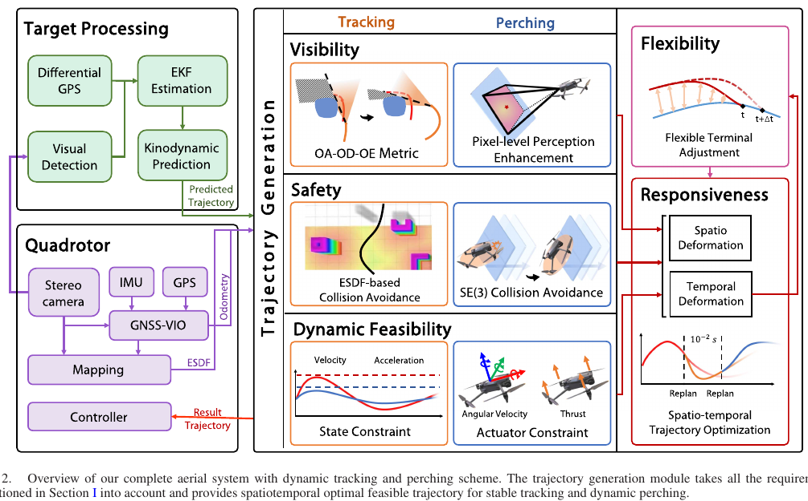
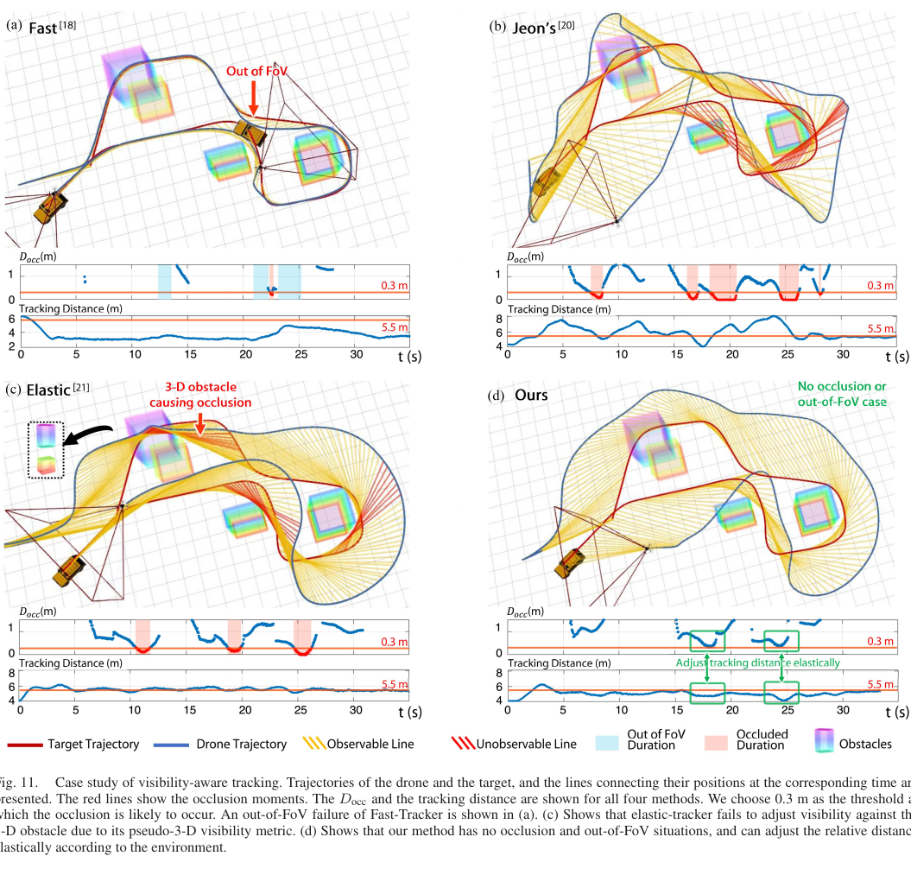
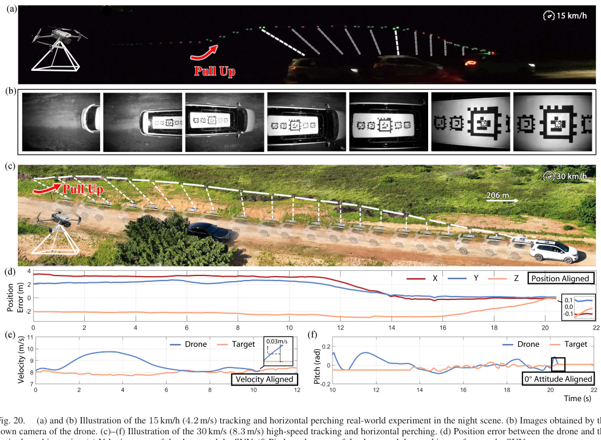
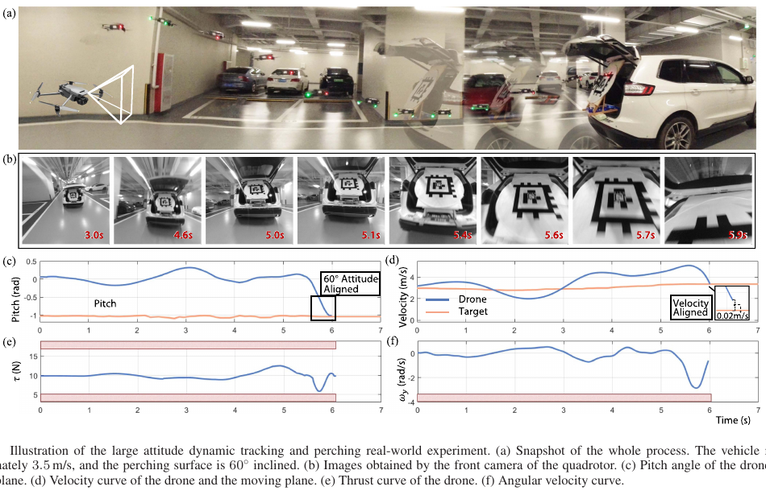

# 动态场景下四旋翼自适应跟踪与停泊——中文详解

> 英文题目：Adaptive Tracking and Perching for Quadrotor in Dynamic Scenarios  
> 作者：Yuman Gao, Jialin Ji, Qianhao Wang, Rui Jin, Yi Lin, Zhimeng Shang, Yanjun Cao, Shaojie Shen, Chao Xu, Fei Gao  
> 期刊：*IEEE Transactions on Robotics*, Vol. 40, 2024, pp. 499–519  
> DOI：10.1109/TRO.2023.3335670  
> 原始 PDF：[点击打开](../Adaptive%20Tracking%20and%20Perching%20for%20Quadrotor%20in%20Dynamic%20Scenarios.pdf)

## 1. 一句话概括

这篇论文把“看得住移动目标”和“最后贴到移动平台上”做成一套完整无人机系统：无人机预测车辆运动，主动改变跟踪位置避免遮挡和出画面；收到停泊指令后，联合调整轨迹形状、飞行时间和接触状态，在推力、角速度、机体几何和相机视野限制下完成移动平台停泊。

论文最醒目的结果是：系统部署在商用 DJI Mavic 3 上，仅用机载计算，以 20 Hz 重规划；真机完成了约 30 千米/小时（8.3 米/秒）的 SUV 车顶停泊，以及约 3.5 米/秒、接触面倾斜 60° 的后备箱停泊。

## 2. 外行先理解：任务为什么远比“跟车降落”复杂

完整任务包含两个连续阶段：

1. **跟踪阶段**：无人机跟随汽车，保持合适距离和视角，不被建筑、卡车等障碍挡住；
2. **停泊阶段**：在某个合适时刻接近汽车，使接触瞬间的位置、速度和姿态与停泊面匹配。

困难来自五类要求同时存在：

- **可见性**：目标不能离相机太近、太远、出视场或被遮挡；
- **安全**：无人机既不能撞一般障碍，也不能在最终接触前提前碰到车；
- **动力学可行**：高速大姿态动作不能超过速度、加速度、推力和机体角速度能力；
- **灵活性**：目标在动，接触时刻一变，目标位置、速度和姿态全都跟着变；
- **响应性**：目标突转、障碍出现、估计扰动都会让旧轨迹失效，必须频繁重算。

多数单点创新只处理其中一两项。本文价值在于把目标感知、预测、地图、可见性、停泊几何、动力学和时空轨迹优化连成闭环。

## 3. 论文发表时的常见做法

### 3.1 移动目标跟踪

| 做法 | 原理 | 优点 | 局限 |
|---|---|---|---|
| 图像视觉伺服 | 用目标在图像中的偏差直接控制无人机 | 反应快、计算小 | 看得短，难提前考虑障碍、遮挡和动力学限制 |
| 模型预测控制 | 在有限预测窗口内同时优化跟踪误差和控制 | 能加入约束 | 时域、模型精度和算力相互制约 |
| 微分平坦轨迹规划 | 在位置、偏航及其导数空间优化平滑轨迹 | 变量少、适合四旋翼 | 既要视野又要任意障碍遮挡时，代价设计不容易 |
| 路径搜索 + 平滑 | 先找可行路径，再优化轨迹 | 容易获得初值 | 两阶段若不联合考虑时间和可见性，结果可能曲折或仍遮挡 |

此前方法可能把视线当一根无遮挡直线，或只在固定高度构造二维可见扇形；但真实相机视场是三维锥体，障碍也是任意三维形状。本文重点解决这种三维可见性。

### 3.2 移动平台着陆与倾斜面停泊

| 做法 | 优点 | 局限 |
|---|---|---|
| 比例—积分—微分控制、李雅普诺夫控制 | 工程成熟、实时性高 | 主要修正当前状态误差，难处理复杂接触前约束 |
| 图像视觉伺服降落 | 不必完整重建三维状态 | 通常只要求到达落点，不控制大倾角接触姿态 |
| 二次规划 + 线性近似 | 求解快 | 姿态碰撞、角速度等非线性表达有限；固定/递增时间未必能找到可行空间形状 |
| 离散非线性规划/模型预测控制 | 能明确加入复杂状态、控制和碰撞限制 | 变量多，可能数百毫秒；控制曲线受离散分辨率影响 |
| 本文连续平坦轨迹优化 | 轨迹形状、时间和终态联合调整，毫秒级求解 | 仍是局部非线性优化，依赖目标预测、地图和惩罚参数 |

## 4. 完整系统输入、输出和数据流

> 图：左侧是目标和无人机感知，中央把跟踪/停泊的可见性、安全、动力学要求送入轨迹生成，右侧联合做空间与时间变形。来源：原论文 Fig. 2，PDF 第 4 页。

### 4.1 无人机自身感知

DJI Mavic 3 保留原有定位和建图功能，使用双目相机、惯性测量单元、卫星定位等形成 GNSS-VIO（全球导航卫星系统—视觉惯性里程计）和环境地图；地图进一步生成欧几里得有符号距离场，用于快速查询任意点距最近障碍多远。

### 4.2 目标感知与预测

目标相对位置由两类信息融合：

- 非固定差分 GPS 提供较粗、米级相对定位；
- 视觉标记检测提供较细、厘米级相对观测。

作者用递归视觉标签标记精确停泊位置，再通过扩展卡尔曼滤波估计汽车位置、航向、水平/垂直速度和转弯角速度。

### 4.3 规划器输出

规划器输出带时间参数的位置和偏航轨迹。通过四旋翼微分平坦性，可进一步恢复期望速度、加速度、姿态、推力和机体角速度，发送给飞控执行。

这不是从 RGB 图像直接输出电机命令的端到端学习系统，核心是基于模型的几何规划与连续优化。

## 5. 目标怎样预测未来

目标状态写为

$$
\chi=(\varrho_x,\varrho_y,\varrho_z,\theta,v_h,v_v,\omega_\varrho)^T,
$$

其中 $\theta$ 是车头方向，$v_h/v_v$ 是水平/垂直速度，$\omega_\varrho$ 是转弯角速度。滤波采用“恒定转弯率和速度”模型。

只按当前速度外推可能让预测穿进障碍，因此作者再用“恒定转弯率和加速度”运动基元，尝试不同控制输入，选择碰撞自由且控制努力较小的候选，得到未来目标轨迹及离散目标点。

这属于短时运动模型，不是学习式行为预测。它适合汽车短时间内运动连续的情况；若驾驶员突然倒车、急转或目标检测中断，预测会失配，只能靠下一次重规划修正。

## 6. 跟踪阶段：怎样既追上又不丢目标

论文把可见性失败拆成三个指标：观测距离、观测角度和遮挡效应。

### 6.1 观测距离

水平和垂直距离分别限制在合理区间。靠得太近会碰撞或让目标充满画面，太远则检测精度下降。近距离违反使用较强的三次惩罚；水平距离超过上界时使用平滑线性惩罚，使系统在障碍密集处还有余地临时拉开或缩短距离。

### 6.2 观测角度

期望偏航角指向目标：

$$
\psi_e=\operatorname{atan2}(e_2^T(\varrho-p),e_1^T(\varrho-p)).
$$

代价 $(\psi-\psi_e)^2$ 同时推动无人机调整位置和机头方向，使目标尽量位于正前方，而不是只要求无人机在目标附近。

### 6.3 三维遮挡效应

相机到目标之间的“可信视场锥”用一串球近似。第 $i$ 个球的中心和半径为

$$
c_i=p+\lambda_i(\varrho-p),\qquad
r_i=\rho\lambda_i\|p-\varrho\|.
$$

距离场给出球心到最近障碍距离 $\Xi(c_i)$；当 $r_i>\Xi(c_i)$ 时施加惩罚。这个梯度有两个效果：

1. 把无人机推向视线更开阔的位置；
2. 在横向空间有限时，自动缩短跟踪距离，让视场锥变窄。

第二点就是“弹性可见性”的来源。它不是死守 5.5 米距离，而是在窄缝附近可以主动贴近目标以减少遮挡概率。

### 6.4 先找可见初始路径，再连续优化

作者先沿上一视点—上一目标的射线取样，寻找能看见当前预测目标的新视点；若不行，再沿目标预测轨迹取样。找到视点后沿视线延长到期望距离或障碍边缘，再用 A* 连接相邻视点。

这条离散路径只作初始化。后端用三阶 MINCO 表示位置、二阶 MINCO 表示偏航，联合优化平滑度、时间、障碍、速度、加速度，以及三种可见性代价。

## 7. 停泊阶段：接触前最后一刻怎样保持安全

### 7.1 机体和平台几何

无人机机腹用随姿态旋转的圆盘表示，平台用可接近侧半空间表示。圆盘所有点都留在半空间内，等价于一个紧凑解析不等式。只在无人机接近平台时用平滑逻辑函数激活，避免远处过度约束。

这比把无人机当质点更真实，也比用大包围球更少保守。它明确考虑大姿态下机体先于质心触碰表面的风险。

### 7.2 像素级感知增强

停泊目标的视觉标签被投影到图像坐标 $(u_c,v_c)$，代价 $u_c^2+v_c^2$ 鼓励标签留在图像中心。约束只在预设观测距离区间激活：太远时不让低质量观测过分束缚轨迹，太近时也避免和最终大姿态要求硬冲突。

因为四旋翼加速必须倾斜，视线姿态和运动耦合。优化器会同时移动机体位置并调整姿态，而不只是转动相机。

### 7.3 推力和机体角速度

总推力由

$$
\tau=p^{(2)}+\bar g e_3
$$

得到，并限制在上下界内。机体横滚/俯仰角速度通过 Hopf 纤维化映射转成推力方向变化和位置三阶导数约束；偏航角速度近似由偏航轨迹导数给出。

### 7.4 灵活终端状态

接触时的位置和偏航跟随目标预测：

$$
p(T)=\varrho(T)-\bar lz_s(T),\qquad \psi(T)=\theta(T).
$$

理想速度还应和平台同步，并保留吸附所需法向接近速度。但严格零切向相对速度可能要求无人机提前下探，撞地或超过角速度/推力能力。论文引入切向相对速度 $\nu=[\nu_x,\nu_y]$：

$$
p^{(1)}(T)=\varrho^{(1)}(T)
+\nu_xx_s(T)+\nu_yy_s(T)-\bar v_nz_s(T).
$$

代价 $\|\nu\|^2$ 使切向速度尽量小，但安全和动力学可行优先。终端推力用正弦参数化，天然落在推力上下限；终端 jerk 设为零，以降低接触时相对角速度。

## 8. 统一的时空轨迹优化

### 8.1 为什么要同时优化空间和时间

同一条几何路径飞得慢一些，推力和角速度可能降低；但仅延长时间也不一定能解决接触姿态或撞地冲突，有时必须改变路径形状。本文因此同时改变中间点和各段持续时间。

### 8.2 MINCO 轨迹

MINCO（Minimum Control Effort Polynomial，最小控制代价多项式）用中间点 $m$ 和每段时间 $T$ 紧凑表示分段多项式：

$$
z(t)=M_{m,T}(t).
$$

带状矩阵分解使系数生成和梯度回传都具线性时间/空间复杂度，适合高频重规划。

### 8.3 把约束转成可优化代价

连续约束在各段按梯形积分采样，离散视点约束在特定绝对时刻施加。等式终端条件通过变量重参数化直接满足；时间下界用可微变量替换消除。

最终形式是无约束非线性优化：平滑和时间代价，加上障碍、可见性、动力学、相对高度和终端切向速度惩罚。作者同时使用合适权重和优化后安全/动力学检查；因此不能把“无约束形式”误解为系统没有物理约束。

## 9. 仿真对比：效果和计算时间

所有仿真在 Intel Core i5-9400F、GeForce GTX 2060 上运行。

### 9.1 跟踪方法对比

对比 Fast-Tracker、Jeon 方法和 Elastic-Tracker。稀疏、中等、稠密障碍的平均间距分别为 6、5、4 米。共同参数包括：无人机最大速度 3 米/秒、目标最大速度 1.5 米/秒、无人机/目标最大加速度 6/2 米/秒²、最大角速度 3 弧度/秒、视场角 $80°\times65°$、图像 640×480、期望距离 5.5 米（原论文 Table I，PDF 第 12 页）。

平均计算时间如下：

| 方法 | 路径搜索 | 轨迹优化 | 总计 |
|---|---:|---:|---:|
| Fast-Tracker | 9.56 ms | 0.38 ms | 9.94 ms |
| Jeon | 11.32 ms | 3.20 ms | 14.32 ms |
| Elastic-Tracker | 1.24 ms | 2.34 ms | 3.58 ms |
| 本文 | **0.96 ms** | 1.85 ms | **2.81 ms** |

来源：原论文 Table II，PDF 第 12 页。Fast-Tracker 优化本身更快，是因为它没有可见性项；论文同时记录它更多的出视场、过近和遮挡失败。

> 图：Fast-Tracker 出视场；Jeon 方法出现多段遮挡；Elastic-Tracker 的伪三维可见性无法处理双层障碍；本文在窄处自动把距离缩到约 4 米，避免遮挡。来源：原论文 Fig. 11，PDF 第 14 页。

### 9.2 停泊方法对比

对比 Paneque 离散多重打靶非线性规划、Mao 二次规划迭代和本文方法。对 30°、60°、90° 终端角度，平均计算时间为：

| 方法 | 30° | 60° | 90° |
|---|---:|---:|---:|
| Paneque | 239.59 ms | 308.05 ms | 208.81 ms |
| Mao（设置 A） | 3.42 ms | 2.36 ms | 无可行解 |
| Mao（设置 B） | 16.65 ms | 13.73 ms | 无可行解 |
| 本文 | **3.76 ms** | **4.31 ms** | **16.68 ms** |

来源：原论文 Table IV，PDF 第 13 页。Mao 方法的低耗时不能脱离“90° 条件无可行解”理解；论文分析其只延长时间而不改变空间形状，紧执行器约束下仍会失败。Paneque 能找到可行轨迹，但离散非线性问题更慢、控制曲线也较不平滑。

### 9.3 停泊可见性消融

对 0、0.5、1.5 弧度终端俯仰做有/无感知项比较。0 和 0.5 弧度使用下视相机，1.5 弧度使用前视相机；预期观测距离为 0.2–2.0 米。加入感知项后，目标在空间和时间上的可观测范围都明显增加（原论文 Fig. 15、Table VI，PDF 第 16 页）。

## 10. 商用无人机/SUV 真机系统

### 10.1 平台和工程实现

- 无人机：DJI Mavic 3；
- 目标平台：全尺寸 SUV；
- 前视和下视相机用于检测；延迟较大的云台相机没有用于目标检测；
- 停泊后无人机与表面由魔术贴固定；
- 估计、感知、规划和控制均在机载运行；
- 嵌入式平台比仿真计算机约慢 8 倍，仍达到 20 Hz 重规划（原论文第 16 页）。

### 10.2 真实遮挡跟踪

作者测试 L 形转弯和左右交错障碍：车辆转弯或有卡车靠近视线时，无人机提前横移以保持观察。与 DJI Mavic 3 商业 ActiveTrack 对比中，后者在车辆贴近卡车右转时丢失目标，本文方法主动避开遮挡并继续跟踪（原论文 Fig. 17、19，第 17 页）。

### 10.3 夜间 15 千米/小时和白天 30 千米/小时

夜间案例目标速度 15 千米/小时（4.2 米/秒），下视补光和视觉感知范围设为 0–2 米；优化器自动拉高无人机以维持目标观测。

高速案例 SUV 速度 30 千米/小时（8.3 米/秒），无人机最高约 10 米/秒，最终 $x-y$ 平面停泊误差 **10.7 厘米**。作者把误差主要归因于目标估计/链路延迟和轨迹跟踪，风与地效由积分控制抵消（原论文第 19 页正文）。

> 图：上半部分是夜间 15 千米/小时可见性感知停泊；下半部分是 30 千米/小时路测及位置、速度、俯仰对齐曲线。来源：原论文 Fig. 20，PDF 第 18 页。

论文 Table VII 还给出多场景结果：

| 场景 | 目标速度 | 无人机最高/平均速度 | 最终误差 |
|---|---:|---:|---:|
| 室内 | 1.5 m/s | 2.65 / 2.21 m/s | 3.31 cm |
| 道路 | 4.0 m/s | 5.13 / 4.76 m/s | 4.47 cm |
| 夜间野外 | 4.0 m/s | 5.22 / 4.47 m/s | 8.36 cm |
| 野外 | 4.0 m/s | 5.37 / 4.69 m/s | 5.87 cm |
| 野外 | 6.0 m/s | 7.53 / 6.87 m/s | 10.92 cm |
| 野外 | 8.0 m/s | 9.51 / 8.44 m/s | 14.19 cm |

来源：原论文 Table VII，PDF 第 18 页。表中的 8.0 米/秒场景误差 14.19 厘米与正文特定 30 千米/小时案例的 10.7 厘米不是同一统计项，不应互相替换。

### 10.4 60° 大姿态后备箱停泊

SUV 约 3.5 米/秒，停泊面在后备箱内倾斜 60°。3.0–5.7 秒间，无人机尽量把标签保持在前视图像中心；最终姿态和速度与移动面同步，推力及角速度保持在论文设定的可行范围。

> 图：前视相机连续观察后备箱标签，末端完成 60° 姿态和速度对齐。来源：原论文 Fig. 21，PDF 第 19 页。

## 11. 主要创新

1. 用距离、角度和三维视场锥统一构造可微可见性指标，并允许跟踪距离随环境弹性变化；
2. 用像素投影直接优化停泊阶段的目标居中，同时考虑四旋翼姿态—运动耦合；
3. 将移动目标未来状态与轨迹终端条件绑定，时间变化时位置、速度、姿态一起更新；
4. 通过切向相对速度松弛解决严格终端状态与安全/执行器限制的冲突；
5. 用机腹圆盘—平台半空间的解析几何约束处理接触前 $SE(3)$ 碰撞；
6. 以 MINCO 联合优化空间和时间，在商用无人机有限算力上达到 20 Hz；
7. 从仿真对比、消融到全尺寸车辆路测，验证系统级闭环。

## 12. 局限和适用边界

### 12.1 目标仍是合作式目标

精确停泊依赖视觉标签，粗相对定位依赖目标侧差分 GPS。对没有标签、无法通信的普通车辆，需要更强的无标记检测、六自由度姿态估计和不确定性处理。

### 12.2 依赖环境地图和距离场

一般障碍避让及遮挡梯度使用欧几里得有符号距离场。地图错误、细障碍漏检或动态障碍未及时进入地图，都会破坏规划依据。

### 12.3 目标预测模型较简单

恒转弯率/速度滤波和恒转弯率/加速度运动基元适合短时连续车辆运动，但无法表达复杂驾驶意图。论文靠 20 Hz 重规划纠偏，并未给出长时行为预测保证。

### 12.4 软惩罚与离散采样不等于形式化安全保证

连续约束通过积分采样转成代价，论文用优化后检查防止明显违反。高风险部署仍要加入更密后验检查、冗余急停和物理安全裕度。

### 12.5 简化动力学未显式预测所有空气动力效应

车辆尾流、强侧风、近地效应和接触冲击没有进入规划模型。高速实验中风和地效由底层积分控制抵消，这不保证更大车速、更强风或不同机型同样有效。

### 12.6 结果不能直接外推

30 千米/小时、60°、10.7 厘米都是特定平台、道路、传感器和参数下的实验结果，不是所有环境的性能上限或保证值。

## 13. 复现建议

1. **先分阶段复现**：先完成目标预测和可见跟踪，再做静态倾斜面停泊，最后组合移动目标。
2. **统一时间戳**：相机、差分 GPS、无人机里程计和车辆预测若有几十毫秒偏差，高速时就会产生明显位置误差。
3. **检查坐标链**：相机、机体、世界、停泊面四套坐标的外参和法向符号是最常见错误源。
4. **距离场要有梯度质量**：不仅需要距离正确，还需梯度连续；稀疏/跳变地图会让遮挡优化方向不稳定。
5. **保留路径搜索初值**：不要让连续优化从直线盲猜开始，尤其在遮挡和狭窄通道里。
6. **高频后验检查**：优化后以更细时间步检查机体圆盘、一般障碍、推力和角速度；失败即保持跟踪或执行恢复轨迹。
7. **按相机切换策略复现**：论文根据终端角度选择下视或前视相机，约 30° 是其设备上的工程分界，不是通用常数。
8. **终端法向速度按机构重定**：魔术贴、磁铁、吸盘和抓手所需接触速度不同。
9. **不要混用两代论文结果**：2022 年 Fast-Perching 是停泊规划原型；本论文增加完整感知、可见跟踪和 SUV 路测，公式和实验条件并非完全相同。

## 14. 外行读完应记住的结论

这项工作最重要的不是单个“高速降落动作”，而是把看、预测、绕障、保持视线、改变接触时刻和大姿态控制放进一个反复运行的规划闭环。它展示了模型驱动轨迹优化在真实商业无人机上的高完成度；同时，合作式标签/GPS、地图质量和软约束安全仍是迁移到更开放环境时必须解决的边界。
