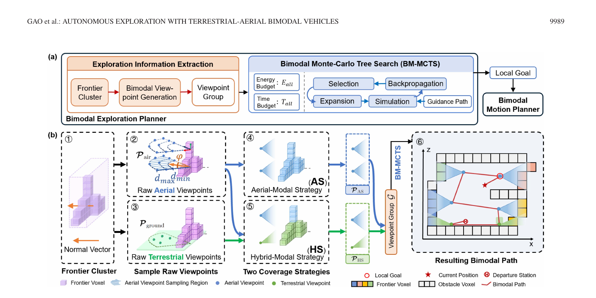
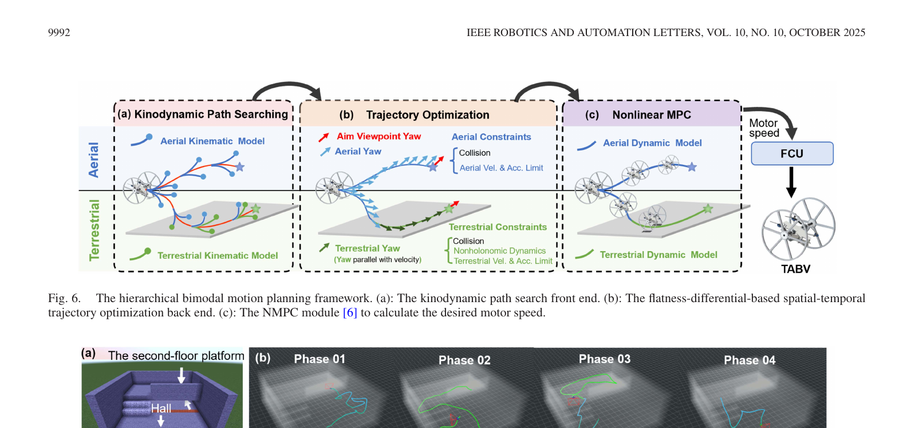
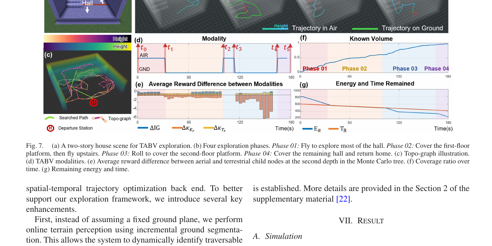
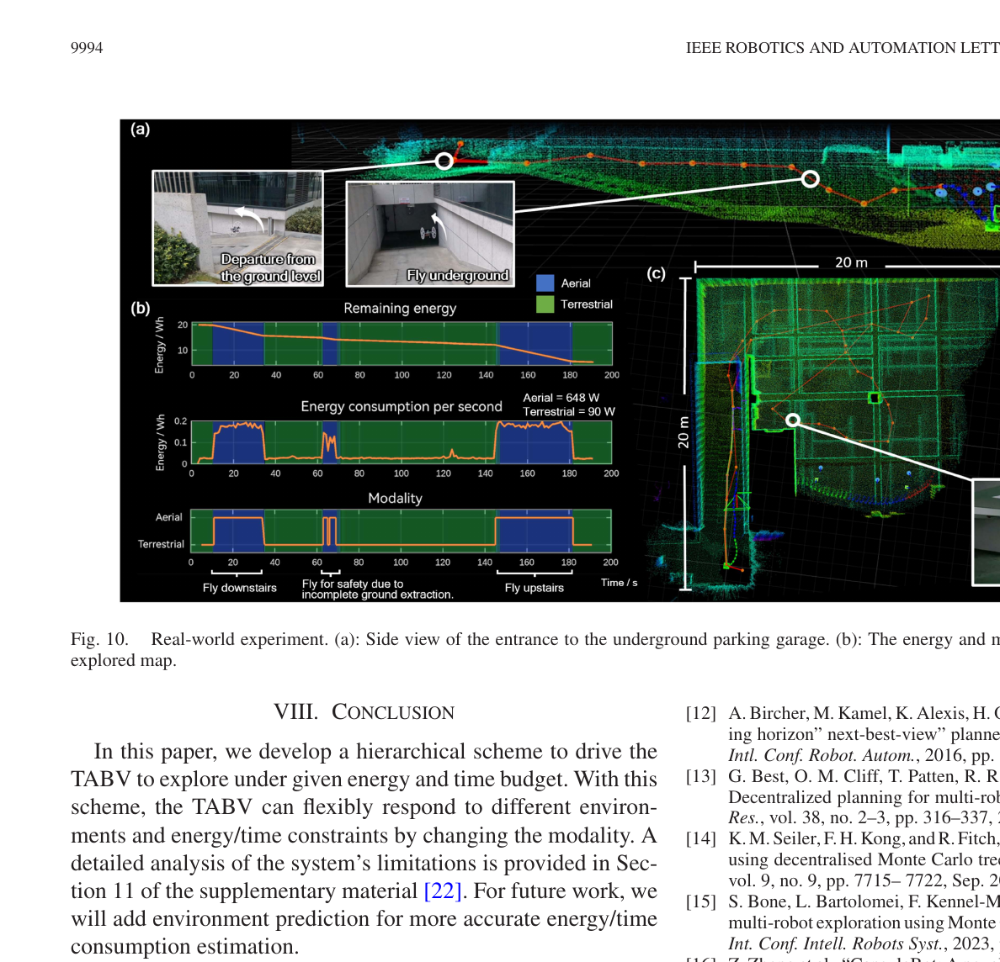

# Autonomous Exploration With Terrestrial-Aerial Bimodal Vehicles (空地双模态机器人自主环境探索)

> **元数据** 
> **作者:** Yuman Gao, Ruibin Zhang, Tiancheng Lai, Yanjun Cao, Chao Xu, Fei Gao
> **期刊:** IEEE Robotics and Automation Letters (RA-L), Vol. 10, No. 10, October 2025
> **链接/DOI:** 10.1109/LRA.2025.3597510
> **本地原文:** [原始 PDF](../Autonomous%20Exploration%20With%20Terrestrial-Aerial%20Bimodal%20Vehicles.pdf)

---

## 1. 核心思想与一句话概括
**一句话概括：** 
本文提出了一种针对空地双模态机器人（Terrestrial-Aerial Bimodal Vehicles, TABV）的分层自主环境探索框架，通过引入一种考虑能量与时间双重约束的扩展蒙特卡洛树搜索（Bimodal Monte Carlo Tree Search, BM-MCTS）算法，结合改进的双模态运动规划器，使机器人能够根据环境特征和剩余资源，在“高机动高能耗的飞行模式”与“长续航低机动的地面模式”之间切换，从而在论文采用的资源模型和测试场景中提高探索收益，并为返航预留预算。

**核心思想：**
传统的单模态机器人（如单纯的无人机UAV或无人车UGV）在探索任务中存在固有的运动学和动力学局限：无人机视野好、机动性强但续航极短；无人车续航长但难以跨越复杂地形。多机器人协作系统虽能互补，但引入了复杂的集群协同与多机SLAM难题。本文利用兼具地面行驶与空中飞行能力的单一“空地双模态机器人”，将其探索问题转化为在一个有界的能量与时间预算内，通过选择最佳视点序列及对应运动模态，以最大化未知空间感知（即信息增益）的受限优化问题。

---

## 2. 外行导读与研究背景

**研究背景：**
自主环境探索在搜救、工程测绘、隧道巡检等领域具有广泛的应用价值。在实际灾后或复杂未知环境中，机器人面临着严苛的物理限制：电池容量有限（能量约束）和任务完成时限（时间约束）。如果机器人在电量耗尽前未能返回起点，不仅任务失败，还会丢失搜集到的宝贵数据（尤其在通信受阻的地下或灾后环境中）。因此，“如何在有限的能量和时间内，尽可能多地探索未知区域并安全返回”成为了核心痛点。

**外行导读（打个比方）：**
想象你是一名在复杂山区进行搜救的探险队员。你同时拥有一辆越野车（对应地面模式，省油但遇到断崖过不去）和一个喷气背包（对应飞行模式，能飞越一切障碍但极其耗油）。你的总油量和搜救时间都是有限的。如果你全程使用喷气背包，虽然探索得很快，但很快就会没油死在半路上；如果你全程开车，可能一整天都绕不过一个陡坡。
本文提出的系统就像给这名探险队员配备一个资源预算助手：BM-MCTS 会估计候选视点、运动方式、剩余能量和时间，决定什么时候在地面省电、什么时候起飞跨越障碍，并剔除按当前模型估计无法在预算内返回的方案。这里的“可返回”依赖能耗模型、时间估计、地图和状态估计准确性，不是对任意真实环境的无条件安全保证。

---

## 3. 当前研究现状与技术路线对比

| 研究方向/技术路线 | 典型代表 | 优势 | 劣势/局限性 | 本文解决方案 (TABV+BM-MCTS) |
| :--- | :--- | :--- | :--- | :--- |
| **单模态飞行机器人探索** | Cieslewski等(2017), TARE (2021) | 视野广阔，可跨越复杂的三维障碍，高机动性。 | 能量消耗极大，续航时间极短，无法支持大范围、长航时任务。 | 采用双模态，平坦区域使用地面模式大幅降低能耗，延长整体任务寿命。 |
| **单模态地面机器人探索** | 传统UGV前沿探索算法 | 承载能力强，续航持久，适合大面积平坦区域。 | 遇到阶梯、断崖或崎岖废墟时直接瘫痪，无法全空间覆盖。 | 遇到地面无法通行的障碍时，切换至飞行模式直接跨越。 |
| **空地多智能体协作系统** | CRASH (2018), CSIRO团队 | 结合两者优势，UGV做基站或主力，UAV进行补充探索。 | 系统极为复杂，需解决多机协同规划、通信和多机SLAM闭环问题。 | 单机双模态，无需多机通信与复杂的联合SLAM，系统集成度高，部署更简单。 |
| **通用双模态机器人(无特定探索规划)** | Rollocopter (DARPA地下挑战赛) | 硬件上具备空地双模态能力。 | 探索算法未专门针对双模态调度进行优化，未显式考虑能量与时间预算。 | 提出BM-MCTS算法，显式建模能量(E)与时间(T)，智能调度模态切换。 |

---

## 4. 核心术语与定义

- **TABV (Terrestrial-Aerial Bimodal Vehicles)**: 空地双模态机器人。本文使用的平台在飞行模式下功耗约为地面模式的7.2倍。
- **Modality (模态)**: 机器人的运动状态，分为空中模态 (Aerial, $A$) 和地面模态 (Terrestrial, $T$)。
- **Frontier (前沿)**: 已知自由空间与未知空间交界处的体素(Voxel)，代表了潜在的探索方向。
- **Information Gain (IG, 信息增益)**: 在某一个视点(Viewpoint)处，机器人传感器视野(FoV)内能够覆盖到的未知前沿体素的数量，表征探索收益。
- **BM-MCTS (Bimodal Monte Carlo Tree Search)**: 双模态蒙特卡洛树搜索，本文核心决策算法，用于在给定能量和时间预算下，搜索最优的视点序列和模态切换策略。

---

## 5. 核心算法与理论模型 (深度解析，含大量公式)

本文将探索任务建模为视点序列规划问题。目标是在有限的时间和能量下最大化信息增益，同时把按当前时间/能耗模型返回起点所需的预算纳入规划。

### 5.0 先看清系统输入和输出

这套系统不是只输出一个“飞或滚”的开关，而是分层完成四件事：

1. 激光雷达和定位模块持续更新三维占据地图、未知—已知边界以及可通行地面。
2. 视点生成器为每一组前沿同时准备“全飞行覆盖方案”和“地面优先、必要时飞行的混合方案”。
3. 双模态蒙特卡洛树搜索在能量、剩余时间、信息增益和返航代价之间做多步权衡，输出下一局部目标及其运动模态。
4. 双模态运动规划器把高层选择变成连续轨迹，再由非线性模型预测控制器换算成电机速度。

因此，高层搜索负责“去哪、用哪种方式”，底层规划控制负责“怎样安全且动力学可行地到达”。论文的主要创新在高层资源受限决策，但真机成功依赖整条链路。

> **图读法（来源：原论文 Fig. 2，第 3 页）**：下半部分的蓝色方案表示只生成空中视点，绿色方案表示优先生成地面视点、再用空中视点补齐。两种方案不是预先二选一，而是一起送进双模态蒙特卡洛树，让预算和未来收益决定最终红色路径。

### 5.1 问题数学建模
形式化定义如下，设 $\mathcal{P} = \{\mathcal{P}_i \mid i=0, \dots, n\}$ 为选定的视点序列：
$$ \mathcal{P}^* = \arg\max_{\mathcal{P}} IG(\mathcal{P}) $$
$$ \text{s.t.} \quad E_r(\mathcal{P}) \ge 0 $$
$$ \quad\quad T_r(\mathcal{P}) \ge 0 $$
其中 $E_r(\mathcal{P})$ 和 $T_r(\mathcal{P})$ 分别代表访问完所有节点并返回起点后，剩余的能量和时间。
为了处理这些不等式约束，作者使用惩罚函数法将其转化为无约束优化问题：
$$ \mathcal{P}^* = \arg\min_{\mathcal{P}} \left( -IG(\mathcal{P}) + \kappa_{E_r}(E_r(\mathcal{P})) + \kappa_{T_r}(T_r(\mathcal{P})) \right) $$
其中 $\kappa_{E_r}(\cdot)$ 和 $\kappa_{T_r}(\cdot)$ 是指数惩罚项。因为能量耗尽会导致直接坠机/瘫痪（任务彻底失败），而时间超限相对可容忍，所以能量惩罚曲线比时间惩罚曲线更陡峭。

### 5.2 视点生成 (Viewpoint Generation)
为了充分覆盖前沿集群 $C$，系统生成两组候选视点：
1. **纯空中策略 (Aerial-Modal Strategy, AS)**: 仅在空中采样圆柱形坐标系下的视点，集合记为 $\mathcal{P}_{AS}$。
2. **混合模态策略 (Hybrid-Modal Strategy, HS)**: 优先在可通行的地面体素采样，如果地面无法完全覆盖，再补充空中视点，集合记为 $\mathcal{P}_{HS}$。
两组视点构成候选组 $\mathcal{G} = \{\mathcal{P}_{AS}, \mathcal{P}_{HS}\}$，供 MCTS 决策。

### 5.3 能量与时间代价建模
两视点 $\mathcal{P}_i, \mathcal{P}_j$ 之间的转移时间 $T$ 和能量 $E$ 估计为：
$$ T(\mathcal{P}_i, \mathcal{P}_j, M) = \max \left\{ \frac{\text{length}(\mathcal{P}_i, \mathcal{P}_j)}{v_{M,\text{max}}}, \frac{\text{dyaw}(\mathcal{P}_i, \mathcal{P}_j)}{\omega_{M,\text{max}}} \right\} $$
$$ E(\mathcal{P}_i, \mathcal{P}_j, M) = P_M \cdot T(\mathcal{P}_i, \mathcal{P}_j, M) $$
其中 $M \in \{T, A\}$ 为模态，$P_M$ 为模态 $M$ 下的恒定平均功率。

### 5.4 BM-MCTS 算法流程
蒙特卡洛树的每个节点 $v$ 代表一个视点 $\mathcal{P}$，每个分支代表遍历序列。节点包含剩余能量 $E_R(v)$ 和返回时间 $T_R(v)$ 等属性。算法分为四步：

#### (1) 选择 (Selection)
基于置信上限 (UCB) 递归选择子节点进行展开。评分函数平衡了探索与利用：
$$ U(v_k) = G(v_k) - \sqrt{\frac{2 \ln n_s}{n(v_k)}} $$
$$ G(v_k) = -N(R_p(v_k)) + R_t(v_k) $$
其中 $R_p$ 为过程增益（信息量），$R_t$ 为终止代价（能量与时间惩罚），$N(x)$ 为归一化函数。

#### (2) 展开 (Expansion)
从节点 $v_i$ 随机选择一个未展开的潜在子节点 $v_{i+1}$。扩展条件不仅要求距离小于阈值，还要求模态策略的连贯性。展开后更新当前到达该节点的剩余能量：
$$ E_R(v_{i+1}) = E_R(v_i) - E(\mathcal{P}_i, \mathcal{P}_{i+1}, M(\mathcal{P}_{i+1})) $$

#### (3) 模拟 (Simulation)
**核心难点：** 为了评估展开节点 $v_i$ 到底好不好，需要估算从 $v_i$ 出发，遍历剩余未知前沿最终返回起点的代价。
作者通过求解一个“分组旅行商问题 (Grouped TSP)”来生成引导路径 (Guidance Path)。在此过程中，维持一个全局拓扑图 (Topo-graph)，通过 $A^*$ 搜索快速保守地估计路径长度。
估算的最终剩余能量（到达叶子节点并返航）为：
$$ E_r(v_i) = E_R(v_i) - \sum_{q=i}^{k-1} E(\mathcal{G}_q, \mathcal{G}_{q+1}, (T+A)/2) - E(\mathcal{G}_k, \mathbf{p}_H) $$
这里 $(T+A)/2$ 表示在未确定的未来路径中取空地模态的平均耗能作为保守估计，$\mathbf{p}_H$ 为起点。

#### (4) 回溯 (Backpropagation)
- 过程增益 $R_p(v) = IG(v) / n_{IG}(v)$：与分支上所有节点相关，采用累计折扣回溯（折扣率 $\gamma_{IG}=0.8$）。
- 终端代价 $R_t(v)$：仅与叶子节点相关，采用子树内所有叶子节点的平均代价进行回溯。

**剪枝条件 (Prune Condition):** 如果到达节点 $v_i$ 后的剩余能量，甚至不足以支撑机器人从 $v_i$ 直接返回起点（即 $E_R(v_i) - E(\mathcal{G}_i, \mathbf{p}_H) < 0$），则该节点被直接剪枝，不再展开。这能在论文的代价估计模型下过滤明显无法返航的方案，但不能理解成现实中的绝对返航保证，因为实际功耗、定位误差和临时障碍仍可能偏离估计。

### 5.5 双模态运动规划器改进
获得了 MCTS 输出的局部目标后，底层的运动规划器(基于作者前作改进)进行轨迹生成：
1. **在线地形感知**：不依赖预设地平面假设，通过增量式地面分割实时识别可通行区域。
2. **模态感知规划**：前端针对飞行目标生成飞行运动基元，针对地面目标生成双模态基元并对空中运动施加惩罚。后端优化引入了非完整约束（地面运动）和双模态偏航角规划。

> **图读法（来源：原论文 Fig. 6，第 6 页）**：蓝色上半区是空中动力学，绿色下半区是地面运动学。前端用不同运动基元搜索，后端把速度、加速度、碰撞和地面非完整约束加入差分平坦轨迹优化，最后再由非线性模型预测控制器输出电机速度。这解释了为什么高层树搜索不能直接等同于可执行轨迹。

### 5.6 一个具体的预算决策例子

假设下一片未知区域可以“飞 20 秒到达”或“滚 70 秒到达”。按照仿真模型，飞行每秒耗能 7 单位，地面每秒 1 单位，那么两种方案的粗略能耗分别是 140 和 70。若任务只剩 30 秒，系统会更偏向飞；若还有 300 秒但电量紧张，地面方案更合理。真实算法还会把信息增益、返航路径、偏航时间和后续视点一起放进树中，而不是只比较这一段。

这个例子也说明能量预算和时间预算不是同一个指标。飞行可能同时“更快”和“更费电”，地面滚动则相反；BM-MCTS 的作用就是在两种资源之间动态交换，而不是固定规定“能滚绝不飞”。

---

## 6. 实验验证与量化分析 (多维度数据)

### 6.1 仿真参数设置
- 能量单位：定义地面模式每秒消耗1单位能量 ($P_T=1$)，飞行模式每秒消耗7单位能量 ($P_A=7$)。两者能耗差为 7 倍。
- 速度上限：$v_{T,\text{max}} = 0.5$ m/s， $v_{A,\text{max}} = 1.0$ m/s。

### 6.2 两层别墅探索 (多阶段行为分析)
在一个 15m×15m×6m 的 Minecraft 两层别墅中测试（总预算 $E=1000, T=600$）：
- **阶段 01 (探索大厅)**: 能量和时间都充足。系统优先考虑 $IG$ 增益，机器人选择起飞，以极短的时间覆盖大厅。
- **阶段 02 (一楼平台)**: 机器人进入2米高的一楼平台。此时无论飞行还是爬行，获取的信息差不多。但因为第一阶段耗能严重，系统判定能量比时间更宝贵，果断降落，全程使用**地面模态**探索一楼平台。
- **阶段 03 (二楼平台)**: 探索完一楼后，机器人起飞(跃层)并在二楼降落，再次使用地面模式滚动探索二楼，极大地节省了能量。
- **阶段 04（返航）**：大部分区域覆盖完毕后，机器人起飞补全零星区域，并按规划轨迹返回起点；这是该次仿真中的实际结果。

> **图读法（来源：原论文 Fig. 7，第 6 页）**：青色为飞行轨迹、绿色为地面轨迹。模态曲线显示机器人并非周期性切换，而是在楼层跃迁或剩余预算发生明显变化时切换。能量曲线下降速度在飞行段更陡，直观对应“飞行功耗约为地面的 7 倍”这一模型。

### 6.3 不同预算的自适应性分析 (能量/时间权衡)
在 40m×16m 办公区域测试，定义“模态比”(地面时间/空中时间)：
- **时间充足但能量吃紧**：机器人倾向于使用地面模态（图中模态比高达 5.06），以慢速但节能的方式爬行。
- **能量充足但时间吃紧**：机器人倾向于使用空中模态（模态比低至 0.19），以高耗能换取高速度，快速完成任务。
- **结果**：系统能随预算变化调整地面/飞行选择，在这些仿真设置中找到收益较高且满足模型预算的方案；论文没有证明其对所有场景都能得到全局最优解。

### 6.4 真实世界物理部署
- **硬件平台**：自研 TABV（1.85 kg），搭载 Livox 360 激光雷达和 Jetson Xavier NX，运行 FAST-LIO2。
- **功耗实测**：空中功耗 648W，地面功耗 90W（比值为 7.2）。
- **实验场景**：地下车库，预算设定为 $E=20$ Wh，$T=900$ s。
- **行为表现**：机器人在平坦区域保持地面滚动降低功耗，遇到不平整阶梯时自动起飞跨越，最终在能量耗尽前安全返回出发点。

> **图读法（来源：原论文 Fig. 10，第 8 页）**：上方白色轨迹展示进入地下车库、跨越楼梯和返回的路线；左下三条曲线分别是剩余能量、单位时间能耗和模态。蓝色飞行段的耗能斜率显著高于绿色地面段；右侧是约 20 米见方的最终点云地图。

### 6.5 实验结论应当怎样理解

- 论文重点证明“资源变化时会合理改变模态”，并没有证明 BM-MCTS 对所有建筑都给出全局最优视点序列。
- 仿真把地面和空中功率简化成常数，真实测试测得 648 W 与 90 W，但起飞瞬态、坡度、轮胎打滑和风扰都会让实际功耗变化。
- 真机采用 20 Wh 服务能量预算和 900 秒时间预算，展示了完整闭环；论文没有提供大规模统计意义上的多场景成功率，因此不能仅凭一次车库实验断言长期可靠性。
- 系统的定位使用 FAST-LIO2 激光雷达—惯性里程计。如果定位或地面分割失败，上层预算规划即使正确也可能执行失败。

---

## 7. 创新点突破与局限性

**创新点突破：**
1. **全新的视角定义探索问题**：将机器人自主探索从纯粹的“路径规划”和“覆盖优化”，升级为复杂的“资源调度与模态切换”问题，极大拓展了探索任务的边界。
2. **BM-MCTS算法的优雅设计**：传统前沿探索难以具备长远视野（多为贪心策略）。本文通过 MCTS 的推演能力，实现了非近视 (non-myopic) 的多步规划，巧妙地利用分组 TSP 和拓扑图在模拟阶段解决了巨大状态空间下的代价估算问题。
3. **软硬结合的完整系统闭环**：不仅停留在算法理论，更将感知（实时地形分割）、前端基元搜索、后端轨迹优化、直至底层控制打通，在真实定制硬件上实现了端到端的验证。

**局限性分析 (补充材料中提及的潜在问题)：**
1. **耗能估算的局限**：目前的 $E_r$ 和 $T_r$ 估算基于简单的几何路径和恒定功率模型。在实际飞行中，风阻、加减速过程的额外功耗可能会导致估算偏差。
2. **未知环境的极端情况**：若在返航阶段，预先估计的返航最短路径突然被动态障碍物或新发现的坍塌阻断，由于系统保留的能量余量可能不足以进行大范围重规划，会导致坠机失败。
3. **计算复杂度**：分组TSP和拓扑图搜索随着地图的扩大，MCTS 的迭代计算时间仍会显著增加，对机载算力 (Jetson Xavier NX) 是一个考验。

---

## 8. 复现提示与工程经验

对于试图复现或在此基础上二次开发的工程师与研究员，提供以下建议：
1. **参数调优 (`Hyper-parameters`)**：
   - MCTS 中的能量与时间惩罚指数的底数 ($a_1, b_1, a_2, b_2$) 极其关键。如果在仿真中发现机器人老是回不来，说明能量惩罚曲线不够陡，应当增大 $\kappa_{E_r}$ 的权重。
   - 论文实验采用探索权重 $\epsilon=0.05$ 和折扣系数 $\gamma_{IG}=0.8$；迁移到地图尺度、传感器量程或能耗比例不同的平台时仍应重新做敏感性测试。
2. **拓扑图 (Topo-graph) 维护**：
   - 稀疏拓扑图是降低树搜索查询开销的工程核心。在 MCTS 的模拟阶段反复对全体素地图运行 A* 会显著增加耗时，因此宜维护稀疏节点拓扑图作为查询结构来估算引导路径长度。
3. **地面分割算法 (Ground Segmentation)**：
   - 物理机器人的模态切换依赖于当前地形是否被分割为“可通行地面”。如果 LiDAR 点云的法线估计在粗糙地面上抖动，可能导致机器人频繁起降。建议在分割模块加入时空平滑滤波（如基于历史帧的概率更新）。
4. **底层控制器集成**：
   - 在真实机器人上，从地面模态直接跃升到空中模态的瞬间，电机会有极大的瞬态电流冲击。系统在能量预算模型中，应适当为这种“模态切换瞬间”预留一定的突发能量损耗，这在文中的静态公式 (4) 中未被显式表达，但在工程中不可忽略。
