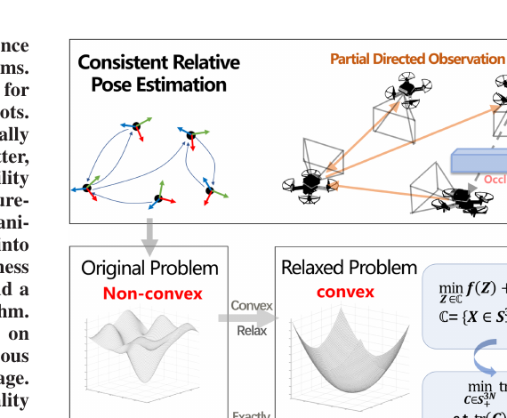
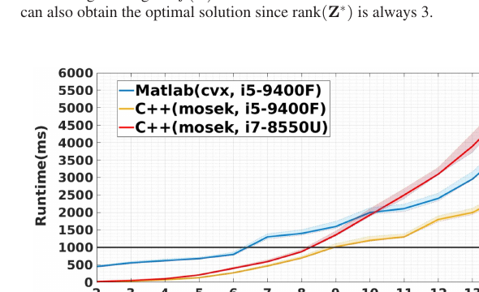
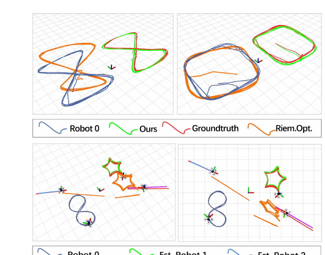

# 《Bearing-Based Relative Localization for Robotic Swarm With Partially Mutual Observations》中文详解

> 中文题名：基于方位测量的部分相互观测机器人集群相对定位  
> 作者：Yingjian Wang、Xiangyong Wen、Yanjun Cao、Chao Xu、Fei Gao  
> 发表：IEEE Robotics and Automation Letters，第 8 卷第 4 期，2023 年 4 月，页 2142–2149  
> DOI：10.1109/LRA.2023.3248378  
> 开源实现：[ZJU-FAST-Lab/CertifiableMutualLocalization](https://github.com/ZJU-FAST-Lab/CertifiableMutualLocalization)  
> [原始 PDF](../Bearing-Based%20Relative%20Localization%20for%20Robotic%20Swarm%20With%20Partially%20Mutual%20Observations.pdf) ｜ [其他论文总览](README.md)

## 1. 先说结论：这篇论文真正解决了什么

多机器人开始协作前，必须先把各自的“局部地图坐标系”对齐。否则 A 说“目标在我的前方 2 米”，B 并不知道这个方向在自己的坐标系里对应哪里。

本文研究的具体问题是：每台机器人都有自己的有尺度里程计轨迹，并能用相机测到某些队友所在的方向，但由于视场有限和遮挡，观测关系是一个不完整的有向图——A 看得到 B，B 不一定看得到 A；有些机器人之间甚至从未直接互相看见。怎样把多个时刻的这些信息统一起来，求出所有机器人局部坐标系之间一致的相对旋转和平移？

论文的答案是：先把所有机器人、所有时刻的里程计和方位观测写进同一个全局优化问题；通过消去距离和平移，把核心难题化成“只求旋转”的非凸问题；再用半定松弛把它转成可全局求解的凸问题；有噪声时额外加入低秩代价并做凸迭代，最后从低秩解中恢复旋转、距离和平移。

需要特别澄清：本文不是仅凭一张静态方位图“凭空恢复绝对尺度”。它使用了机器人在多个时刻的本地里程计位移，论文中的里程计是有尺度的；方位测量负责连接不同机器人的局部坐标系。

*图：部分有向观测图、原始非凸问题、半定松弛和低秩恢复的整体关系。来源：原论文 Fig. 1，PDF 第 1 页。*

## 2. 面向外行的任务背景

### 2.1 为什么每台机器人“知道自己走了多远”还不够

视觉惯性里程计或轮式里程计可以告诉一台机器人：从启动位置出发，我向前走了多少、转了多少。但每台机器人启动时各自把当前位置当作原点，坐标轴方向也不相同。因此会出现多个彼此不一致的小坐标系。

集群协作需要的是共同参考系。例如多机编队、协同探索、共同搬运都要求大家对“东、西、前、后”和具体位置达成一致。这就是相对定位或坐标系对齐问题。

### 2.2 相机的“方位观测”能提供什么

相机检测到队友后，可以从图像坐标算出一条单位方向向量：队友位于我的左前方、右上方等。这个量称为方位或视线方向。单次方位观测没有距离，就像人看到远处灯光只知道方向，不知道它离自己 5 米还是 50 米。

但机器人移动后会形成新的观察几何。把多时刻方位、每台机器人的本地运动轨迹以及多机器人之间的观测链同时使用，就能约束不同局部坐标系之间的旋转和平移。

### 2.3 “部分相互观测”是什么意思

论文把机器人建模为有向图：节点是机器人；边 `i → j` 表示机器人 i 获得了机器人 j 的一系列方位测量。普通相机视场有限，且障碍物会遮挡，所以这张图通常不完整，也不对称。

“部分”不是指观测质量只有一部分，而是指机器人只能看到团队中的一部分成员；“有向”则强调 A 看到 B 并不自动意味着 B 也看到 A。本文的重要价值，就是不要求所有机器人两两互视，也不要求每对机器人都有直接观测。

## 3. 发表时的常见做法及其优缺点

| 路线 | 通用做法 | 优点 | 主要不足 |
|---|---|---|---|
| 基于地图的多机器人定位 | 各机器人共享环境特征或局部地图，通过跨机器人回环检测和特征匹配估计相对位姿 | 可同时服务建图；环境特征丰富时信息量大 | 需要较多通信和计算；弱纹理、重复纹理环境容易退化 |
| 测距/方位滤波 | 用扩展卡尔曼滤波、粒子滤波等持续融合机器人间测距或方位 | 适合在线递推，工程上常见 | 对初值和数据关联敏感；状态维度随机器人数量增大 |
| 两机器人几何求解 | 对一对互相可见的机器人求相对六自由度位姿 | 问题规模小，容易单独验证 | 只能处理可直接观测的一对机器人，难以统一利用部分有向图中的间接信息 |
| 局部非线性优化 | 在旋转流形上做黎曼优化，或用 Levenberg–Marquardt 最小二乘 | 实现直接，好的初值下速度快 | 原问题高度非凸，随机或较差初值可能落入错误的局部极小值 |
| 本文方法 | 全团队联合建模，半定松弛后做凸优化；有噪声时用凸迭代促进低秩 | 不依赖手工给出的接近真值初值；可利用没有直接互视的观测链 | 半定规划比普通局部优化更重；仍要求观测图和运动具备足够可观性 |

这篇论文的重点不是发明新的相机检测器，而是给“已经获得的带身份方位观测与本地里程计”设计一个具有全局优化性质的求解器。它也不处理匿名观测的数据关联；匿名视觉观测是后续 FACT 工作进一步解决的问题。

## 4. 系统输入、输出与基本假设

### 4.1 输入

对每台机器人 i，算法需要：

1. 多个时间戳下的本地里程计位姿，包括本地旋转和有尺度平移；
2. 当 i 看见 j 时，相机坐标系中的单位方位向量；
3. 方位观测对应的机器人身份，从而能够建立有向边 `i → j`；
4. 机器人之间的数据交换，使参与优化的机器能够收集相应轨迹和观测。

### 4.2 输出

输出是所有机器人局部坐标系之间一致的相对位姿：

- 相对旋转：不同机器人坐标轴如何对齐；
- 相对平移：不同机器人局部原点在共同参考系中的位置；
- 观测时机器人间距离，可在旋转求出后闭式恢复。

任意选一台机器人作为参考系即可；整体坐标系的绝对位置和绝对朝向本来就无法由相对观测决定，也不是任务所需。

### 4.3 论文证明所依赖的条件

论文在无噪声情况下给出半定松弛紧致性的充分条件：观测图不能有孤立节点。直观地说，任何机器人若完全不与团队发生观测联系，其坐标系当然无法对齐。

“没有孤立节点”是论文定理中的图条件，不等于任意运动都一定可观。若机器人几乎不动、观测方向长期平行，关键叉积或里程计位移接近零，数值上仍可能缺少有效约束。

## 5. 完整算法流程

### 步骤 1：建立有向观测图

把 N 台机器人作为节点。机器人 X 看见 Y 的一系列测量形成有向边 `X → Y`。同一条边上会积累多个时间戳的本地里程计和方位数据。

### 步骤 2：用两个时间戳消去局部坐标系原点

以 A 观察 B 为例，在时间 j 时，机器人 A 看向 B 的方向为 `b_AB^j`，未知距离为 `d_AB^j`。把 A、B 的本地里程计通过未知的坐标系旋转放到共同参考系中，可写出位置相等关系。

选两个时间戳 j1、j2 相减后，A、B 各自局部坐标系的固定平移原点被消掉，剩下机器人在这段时间内的里程计位移、两次视线方向、两次未知距离与相对旋转之间的关系。

### 步骤 3：消去距离，得到只含旋转的误差

论文给出两种推导：

- 叉积形式：用两次方位方向的叉积构造与未知距离正交的方向，直接消去距离；
- Schur 补形式：先把旋转和距离共同写入二次问题，再通过 Schur 补边缘化距离。

论文推荐第一种叉积形式，因为第二种需要规模随测量数量增长的大矩阵乘法和稠密伪逆；第一种的矩阵更稀疏，内存和计算更友好。

把所有边、所有时间对的误差相加后，得到统一的旋转问题。其变量数量只与机器人数量有关，而不随方位测量数量持续增加，这是方法扩展性的关键来源。

### 步骤 4：把非凸旋转问题提升为半定规划

旋转矩阵必须满足正交约束和行列式为 1，因此直接优化属于非凸问题。论文把所有旋转拼成矩阵 R，并引入 Gram 矩阵：

$$
Z=R^\mathsf{T}R.
$$

理想情况下 Z 的秩为 3，每个对角块为三阶单位阵。论文保留“半正定、对角块为单位阵”等凸约束，暂时去掉非凸的秩等于 3 约束，从而得到可用现成求解器全局求解的半定规划。

白话理解：原问题像在崎岖山地里找最低点，局部算法可能停在小山谷；半定松弛把问题抬到更高维空间，形成一个凸“碗”，先把全局最低点稳定找出来，再投影回合法旋转。

### 步骤 5：无噪声时利用紧致性恢复旋转

论文证明：在无噪声且图中无孤立节点时，松弛问题只有对应真值的解，且其秩为 3。因此可以对 Z 做秩 3 分解，再对每个旋转块做奇异值分解，把数值结果投影到合法三维旋转矩阵。

### 步骤 6：有噪声时加入线性低秩代价并凸迭代

真实方位和里程计都有噪声，直接半定松弛得到的 Z 往往高于秩 3，简单截断会损失信息并造成较大位姿误差。

为此论文加入一个促进最小秩的凸线性代价，并交替执行：

1. 固定当前秩代价矩阵，求一次带秩代价的半定规划；
2. 对当前 Z 做特征分解；
3. 根据较小特征值对应的空间更新秩代价矩阵；
4. 重复到解稳定，再恢复旋转、距离和平移。

作者报告实际通常 2–4 次迭代即可。权重参数在“更贴合测量”和“更接近秩 3”之间做权衡。

### 步骤 7：闭式恢复距离和平移

旋转确定后，原来的测量方程对未知距离和平移变成线性关系，可以用闭式最小二乘恢复。最终所有轨迹都能表达在选定参考机器人的坐标系中。

## 6. 实验设计与可核实结果

### 6.1 无噪声全局最优性测试

论文用 2、5、10、15 台机器人生成随机测量，每种规模运行 100 次。对比方法包括：

- 本文凸迭代；
- 不加秩代价的纯半定规划；
- 黎曼流形局部优化；
- Levenberg–Marquardt 局部最小二乘。

Fig. 5 显示，在无噪声测试中，本文两种半定方法在所有规模的 100 次测试中都获得全局最优解；两种随机初始化的局部方法会落入局部极小值，而且机器人数量增加时问题更明显。这里的“100%”指这组仿真中的全局最优命中率，不是现实环境中的定位成功率。

### 6.2 运行时间与扩展性

作者分别测试 MATLAB/CVX 与 C++/MOSEK，在桌面 i5-9400F 和机载 i7-8550U 上随机器人数量变化的耗时。Fig. 6 中黑线是 1 秒，即 1 Hz 更新参考线。结果表明 C++ 实现显著快于 MATLAB；规模增大后耗时仍会上升，14 台机器人时图中不同实现约为 2.5–4.9 秒。因此它适合低频坐标系校准，并不意味着任意大集群都可高频实时运行。

*图：不同机器人数量、软件实现和处理器上的运行时间；黑线为 1 Hz 参考。来源：原论文 Fig. 6，PDF 第 7 页。*

### 6.3 噪声鲁棒性

五机器人仿真中，作者对方位观测加入不同等级噪声，每档做 100 次随机试验。Fig. 7 比较本文凸迭代、纯半定规划、黎曼局部优化和真值对应代价。本文方法持续得到秩 3 解和最低测量代价；纯半定规划因解的秩升高，恢复后的结果更差；局部优化的测量代价最高。

要注意，“代价甚至低于真值”不是估计比真值更真实，而是带噪声数据下，对测量残差的最佳拟合可能偏离真实位姿，这是统计估计中的正常现象。

### 6.4 真机实验

论文做了两组实验：

1. 两架无人机沿预设三维轨迹运动并互相观测；
2. 四机器人混合集群，包括两台无人地面车和两架无人机。作者特意删除两架无人机之间的方位观测，验证没有直接边时仍可借助其他机器人的观测链恢复相对位姿。

检测平台使用鱼眼相机和带标签的发光二极管标记；动作捕捉系统提供本地里程计并作为真值。Fig. 9 显示，本文恢复后的多机器人轨迹与真值更一致，而局部优化落入错误解。Fig. 10 表明四机器人实验在第 5 秒积累足够数据后，本文持续得到秩 3 解，并保持更低的目标代价和旋转残差。

*图：两无人机实验与两车两机实验中的轨迹对齐结果；后者去除了两架无人机之间的直接方位观测。来源：原论文 Fig. 9，PDF 第 8 页。*

## 7. 论文的核心创新

1. **从成对求解扩展到整张部分有向图。** 所有机器人的测量被统一融合，未直接相见的机器人也可通过观测链对齐。
2. **给四次型旋转问题构造凸松弛。** 论文不仅提出半定规划，还给出无噪声条件下松弛紧致性的证明。
3. **用凸迭代修复噪声下的高秩问题。** 低秩代价不是简单事后截断，而是在求解过程中推动结果回到可恢复旋转的结构。
4. **把变量规模与测量数量解耦。** 方位距离被消去后，优化变量主要随机器人数量增长，适合累计较多观测。
5. **提供 MATLAB 与 C++ 实现。** 论文明确给出开源仓库，便于验证公式与运行时间。

## 8. 局限、适用边界与容易误解之处

### 8.1 它不是匿名检测算法

观测图中的边已经知道“谁看到了谁”。若视觉检测只能输出“这里有一架无人机”而不知道身份，还需要数据关联模块；本文并未解决该问题。

### 8.2 它依赖本地里程计质量

方位信息与多时刻本地运动共同构成约束。严重的里程计漂移、不同步或错误时间戳会直接污染统一优化。论文真机实验把动作捕捉位姿作为本地里程计，因此没有覆盖真实视觉惯性里程计长期漂移的全部困难。

### 8.3 图连通只是必要工程条件的一部分

孤立机器人必然不可定位；而即使图连通，长时间静止、共线运动、几乎平行的视线也可能造成弱可观或病态数值。论文未来工作也明确提出要规划合适队形以满足可观性。

### 8.4 计算不是常数时间

半定规划的矩阵规模随机器人数量增长。论文展示的是最多 15 台左右的运行时间曲线，不能由此推断百机系统仍可直接用同一集中式求解器实时运行。

### 8.5 “全局最优”针对所建模的测量代价

凸优化保证的是当前模型和输入数据下的全局最优，不会自动纠正错误身份、严重外点、时间错位或不准确的传感器外参。论文的鲁棒性实验主要是高斯型方位噪声，而不是大比例错误检测。

## 9. 复现提示

1. 先从开源仓库复现无噪声仿真，检查半定解秩为 3，再逐步加入方位噪声；不要一开始就上真机。
2. 严格统一时间戳、坐标轴约定和旋转乘法方向。机器人 A 看 B 的方向必须清楚是表达在相机系、机体系还是本地里程计系。
3. 标定相机到机体/里程计坐标系的外参；一个小角度外参误差会系统性地影响所有方位。
4. 在建立时间对时，避免选择间隔太短、里程计位移太小或两次视线几乎平行的数据，否则叉积接近零，约束贡献很弱。
5. 记录半定解的特征值谱、测量残差和恢复后旋转的正交误差，不能只看优化器是否返回“成功”。
6. 真机部署时建议保留外点剔除和观测质量门限。原论文核心求解器并非为大量错误身份或恶性外点专门设计。
7. 论文使用 CVX、MOSEK、Manopt 和 `lsqnonlin` 做比较；若更换求解器，应分别记录建模时间与求解时间，避免把接口开销误认为算法耗时。

## 10. 外行阅读抓手

阅读这篇论文时，可以一直抓住三层关系：

1. **物理层：** 每台机器人知道自己怎么动，也能看到部分队友的方向；
2. **几何层：** 两个时间戳相减消去坐标原点，叉积再消去看不见的距离；
3. **优化层：** 剩下的旋转问题很非凸，先放到半定矩阵空间求全局解，再用低秩结构恢复真实旋转。

如果只记一句话：这篇论文不是“从一个角度猜距离”，而是“把全队多时刻的运动和单向视线拼成一张几何网络，再用可全局求解的凸优化统一对齐所有局部坐标系”。

## 11. 核验依据

- 任务定义、相关工作与贡献：原论文第 1–2 页；
- 两种建模和变量消元：原论文第 3–4 页，式 (1)–(23)；
- 半定松弛、紧致性与凸迭代：原论文第 5–6 页，Problem IV.1–IV.3、Algorithm 1；
- 仿真与运行时间：原论文第 6–7 页，Fig. 5–7；
- 真机平台和结果：原论文第 7–8 页，Fig. 8–10。
