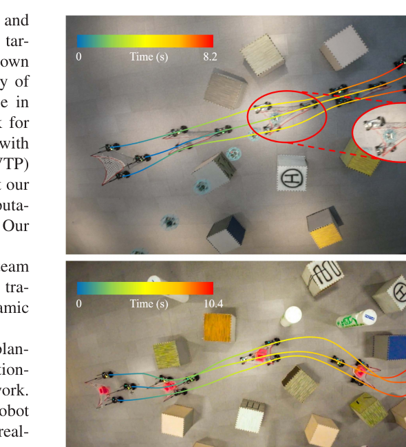
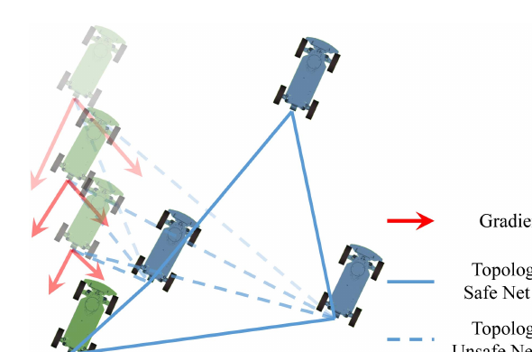
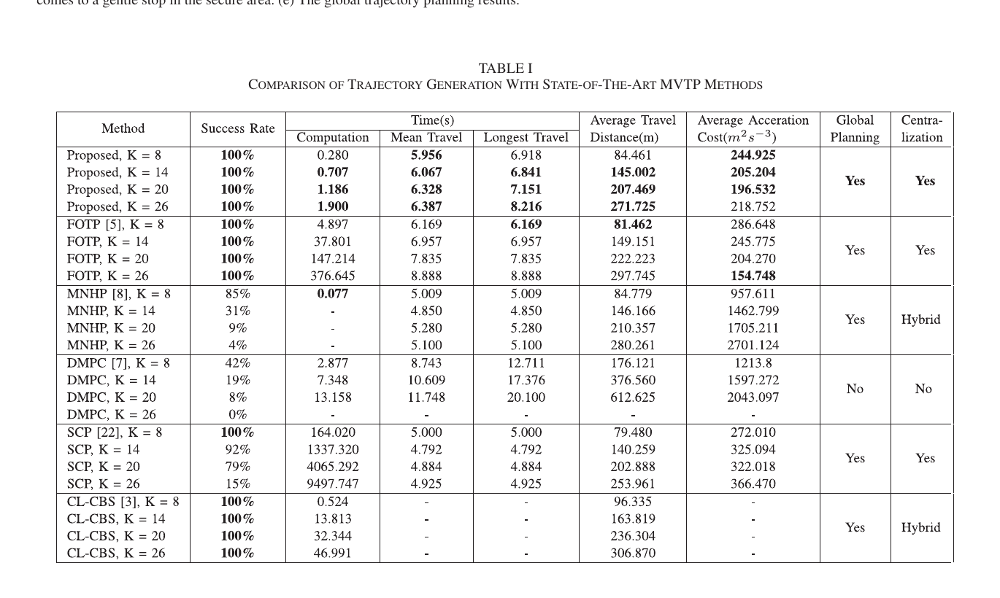
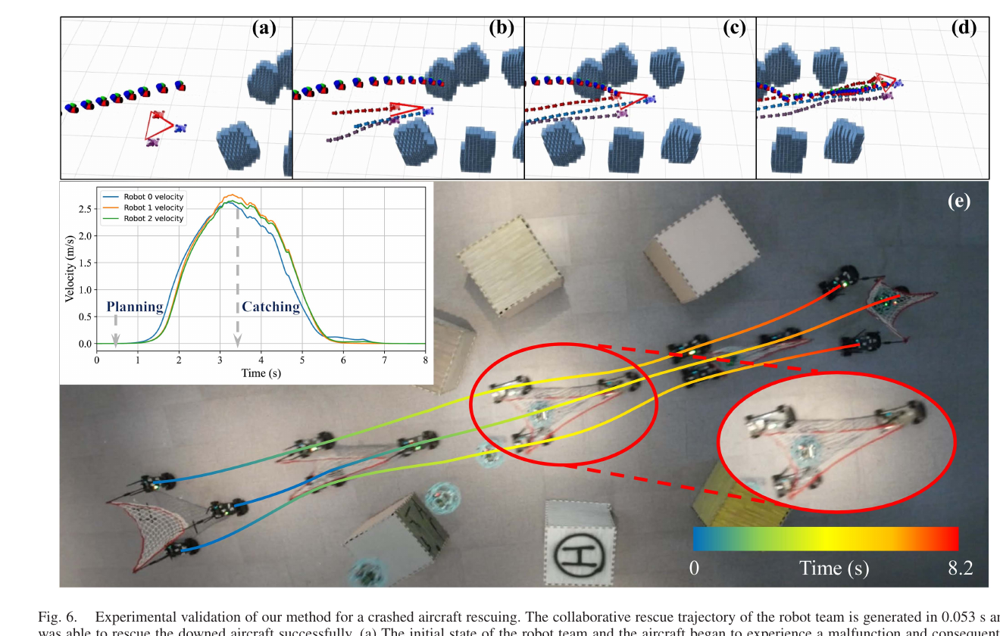

# 《Collaborative Planning for Catching and Transporting Objects in Unstructured Environments》中文详解

> 中文题名：非结构化环境下多机器人协同捕获与运输规划  
> 作者：Liuao Pei、Junxiao Lin、Zhichao Han、Lun Quan、Yanjun Cao、Chao Xu、Fei Gao  
> 发表：IEEE Robotics and Automation Letters，第 9 卷第 2 期，2024 年 2 月，页 1098–1105  
> DOI：10.1109/LRA.2023.3335770  
> 补充材料 DOI：10.5281/zenodo.8376633  
> [原始 PDF](../Collaborative%20Planning%20for%20Catching%20and%20Transporting%20Objects%20in%20Unstructured%20Environments.pdf) ｜ [其他论文总览](README.md)

## 1. 一句话结论

本文让多台像汽车一样不能横着走的地面机器人共同拉住一张网，在障碍密集、没有规则道路的环境里同时规划所有机器人的平滑轨迹，使它们既能接住预计会坠落的目标，也能继续协同运输物体；规划过程中同时约束单车运动极限、车体和障碍物碰撞、车车碰撞、网不能过度拉伸、机器人不能穿过网边，以及落点必须进入网所围区域。

真正的技术重点是：作者把这些强耦合、原本不光滑的几何关系改写成连续可微的代价或约束，并配合紧凑的分段多项式轨迹表示，把集中式多机器人优化做到可以在线求解。

*图：上半部分为三车拉网接住坠落无人机，下半部分为机器人团队在非结构化障碍环境中协同运输。来源：原论文 Fig. 1，PDF 第 2 页。*

## 2. 任务背景：为什么“几台车拉一张网”很难规划

### 2.1 单车避障只是最基础的一层

普通自动驾驶规划只要让一辆车从起点到终点，并满足速度、加速度、转向角和避障约束。本文中的机器人采用类似汽车的非完整运动学：它可以前进、后退和转弯，却不能像全向底盘那样横向平移。因此地图上看似很宽的缝隙，若转弯空间不够，车也无法通过。

### 2.2 多车不是各走各的

三台或更多机器人共同拉网时，一台车的路线变化会立即改变网的形状，并影响其他车可走的位置。如果分别规划再拼起来，常见结果是：

- 两车在时间上相撞；
- 网的一条边被拉得过长；
- 一台车穿过另外两车之间的网边，造成网拓扑翻转或缠绕；
- 各车虽然都到达落点附近，但网没有覆盖坠落点；
- 为了避障，队形变得太小，接不住目标。

这就是强耦合：每台车的时间、位置、朝向与其他所有车有关。

### 2.3 “捕获”比“运输到固定终点”更难

运输通常给每台机器人指定明确终点。捕获坠落目标时，真正的要求是：在已知落点和落地时间附近，让目标落入网围成的多边形。每台车最终究竟停在哪里，可以根据障碍物和运动能力自由调整。

若强行指定一个固定规则队形，会浪费大量可行解。本文把每台车的末端位置也作为优化变量，让系统自己决定网该扩多大、如何变形以及接住后在哪片安全区域停车。

## 3. 发表时常见的多车规划方法

多车辆轨迹规划大致分为解耦式和耦合式两类。

| 方法类型 | 常见做法 | 优点 | 典型问题 |
|---|---|---|---|
| 优先级/顺序规划 | 先规划高优先级车辆，后续车辆把已有轨迹当动态障碍 | 规模较小、实现直观 | 低优先级车辆容易无路可走；拥挤环境会死锁；结果依赖优先级 |
| 分布式模型预测控制 | 每台车只优化未来一小段，交换局部预测轨迹 | 可在线滚动运行，不必集中求解全部变量 | 视野短、行为贪心，容易绕远或进入局部不可行状态 |
| 冲突搜索 | 先生成各车路径，发现冲突后逐步添加时空约束 | 能系统处理冲突，成功率通常较好 | 机器人数量和冲突增加时搜索树迅速膨胀；输出路径不一定平滑 |
| 集中式轨迹优化 | 把所有车辆完整状态和控制一起优化 | 能统一考虑未来，解的质量高 | 变量非常稠密、计算开销大；非凸约束多，依赖初值 |
| 本文方法 | 集中优化所有车辆，但只优化多项式航点、时间和末端位置；把几何关系平滑化 | 同时保留全局耦合与较高求解效率 | 仍是局部数值优化；目前限于二维、依赖地图和较合理初始路径 |

论文将本文与 FOTP、MNHP、分布式模型预测控制、顺序凸规划和车辆式冲突搜索等方法比较。本文不是搜索算法，而是以混合 A* 路径为初值的连续轨迹优化器。

## 4. 输入、输出和任务假设

### 输入

1. 二维栅格地图或可生成安全走廊的障碍物表示；
2. 每台车的初始状态、期望运动方向以及车辆几何尺寸；
3. 速度、纵向/横向加速度、最大转向角等运动边界；
4. 网的邻接关系与每条网边允许的最大长度；
5. 待捕获目标的预计落点和落地时间；
6. 若做运输任务，还需给定相应目标状态或运输要求；
7. 混合 A* 为各车提供的初始几何路径。

论文假设目标落点和落地时间已经由外部感知/预测模块给出。它不研究如何检测坠落目标、预测弹道或估计落点。

### 输出

输出是所有车辆的带时间连续轨迹，包括位置、朝向、速度、加速度、曲率和执行时间。轨迹可直接交给每台车的模型预测控制器进行跟踪。

### 安全含义

论文里的安全主要是优化模型在离散约束采样和连续多项式表示下满足的几何、运动学约束，不是对感知误差、控制跟踪误差和落点预测误差给出的概率安全证明。

## 5. 核心概念的白话解释

### 5.1 非完整约束

汽车不能直接横移，朝向与运动方向绑定。规划器不能把车当成平面上的小圆点随意移动，否则得到的路径实际无法跟踪。

### 5.2 微分平坦

作者选择后轴中心的二维位置作为“平坦输出”。只要位置曲线足够光滑，其一阶、二阶导数就能计算速度、车头朝向、纵向/横向加速度、转向角和曲率。

这相当于把“同时优化位置、角度、速度、转角等很多状态”简化成“主要优化一条二维光滑曲线”，显著减少变量和等式约束。

### 5.3 安全走廊

先沿混合 A* 初始路径在地图中膨胀出一串无障碍凸多边形，然后约束车辆整个多边形车体都在走廊内，而不是只保证车中心不撞障碍。这样能减少把长方形车辆近似为圆带来的保守性。

### 5.4 尺寸安全与拓扑安全

- 尺寸安全：相邻两车之间的距离不能超过对应网边长度，避免把网过度拉伸或损坏。
- 拓扑安全：任何机器人都不能越过不与自己相邻的网边。白话说，队伍可以伸缩和变形，但不能“翻面”或让车从网线中钻过去。

*图：优化梯度推动绿色和蓝色车辆改变位置，使不安全的虚线网边恢复为拓扑安全状态。来源：原论文 Fig. 3，PDF 第 5 页。*

## 6. 完整算法流程

### 步骤 1：为每台车生成初始路径与安全走廊

在二维栅格地图中用混合 A* 生成符合车辆转弯特性的初始路径。对路径采样并膨胀无障碍凸走廊。该初值主要解决“从哪一侧绕障碍”的拓扑选择；多车间的时空碰撞由后续联合优化处理。

### 步骤 2：用分段多项式表示轨迹

每台车的二维位置轨迹被分成多个多项式段，每段次数为 `2s−1`。相邻段之间要求位置及若干阶导数连续，从而得到可平滑执行的速度和加速度。

论文利用已有最优性条件，把多项式系数进一步由航点和每段持续时间唯一参数化。优化变量不再是所有时间点的稠密状态，而主要是：

- 各段航点；
- 各段持续时间；
- 捕获任务中的末端位置。

正的时间变量通过光滑双射映射到无约束虚拟变量，方便通用数值求解。

### 步骤 3：加入单车运动和环境约束

由位置导数计算并限制：

- 最大纵向速度；
- 最大纵向加速度；
- 最大横向加速度；
- 最大曲率/转向角。

车辆被表示为凸多边形。优化过程中，车体每个顶点都需满足所在安全走廊的半空间不等式，保证完整车身而非仅车中心位于无障碍区域。

### 步骤 4：连续可微地处理车车避碰

两台多边形车辆之间的精确距离涉及最大、最小操作，直接使用会在切换最近边或最近顶点时产生不可导点。

论文采用其所称的 maximum-minimum smoothing Minsky difference 方法，计算凸多边形有符号距离的平滑下界，并用 log-sum-exp 平滑最大/最小运算。这样求解器可以获得稳定梯度，将车体推离碰撞区域。

### 步骤 5：约束网的尺寸和拓扑

对每个时刻和每条相邻网边，加入距离不超过网边上限的约束。对每台车及所有非相邻网边，利用车到网边所在有向直线的符号关系保持拓扑次序。

这种约束方式不要求网始终保持规则三角形或正多边形；只要不超长、不翻转，队形可以根据障碍自由变形。

### 步骤 6：构造可微的自适应捕获代价

对预测落点向任意方向发射射线，按与队形多边形边界交点的奇偶性判断落点在网内还是网外，并构造带符号距离：网内为负，网外为正。

作者设计分段光滑的捕获代价：

- 落点在网外时，强烈推动网覆盖落点；
- 落点刚进入边界时，保持函数和梯度连续；
- 落点在网内后，继续鼓励它靠近更安全的中心区域。

由于每台车的末端位置可调整，优化器能选择适合当前障碍布局的非规则甚至非凸队形，不必强求固定几何形状。

### 步骤 7：把约束变成平滑惩罚并联合求解

总体目标包含控制努力、总时间和协同捕获代价。速度、加速度、曲率、走廊、车车距离和网关系被转成可积分的光滑惩罚项。最终得到无显式约束问题，用有限内存拟牛顿法 L-BFGS 求解。

### 步骤 8：下发轨迹并闭环跟踪

中央计算平台同时生成全队轨迹，再分别发送给机器人。真机使用与规划相同运动学模型的模型预测控制器跟踪时空轨迹。

## 7. 实验与量化结果

### 7.1 基准测试设置

所有方法在 Intel i7-12700 处理器、32 GB 内存上测试。每个机器人规模生成 100 个案例，每个案例含 8 个随机尺寸和位置的障碍物；需要初值的方法使用同一混合 A* 初值。指标包括成功率、计算时间、平均/最长执行时间、总路程和加速度代价。

### 7.2 8–26 台车的结果

原论文 Table I 的关键数据如下：

| 机器人数量 K | 本文成功率 | 本文计算时间 | FOTP 成功率/时间 | CL-CBS 成功率/时间 |
|---:|---:|---:|---:|---:|
| 8 | 100% | 0.280 s | 100% / 4.897 s | 100% / 0.524 s |
| 14 | 100% | 0.707 s | 100% / 37.801 s | 100% / 13.813 s |
| 20 | 100% | 1.186 s | 100% / 147.214 s | 100% / 32.344 s |
| 26 | 100% | 1.900 s | 100% / 376.645 s | 100% / 46.991 s |

本文在四个规模的 100 个随机案例中均为 100% 成功。FOTP 也保持 100%，但变量稠密导致计算时间增长快。CL-CBS 也保持 100%，但它输出的是带时间序列的路径，不直接优化平滑性，且规模增加时搜索耗时上升。

另外三组基线在 26 台车时的成功率分别为：MNHP 4%、分布式模型预测控制 0%、顺序凸规划 15%。这些数字只对应论文的特定随机场景、参数和成功判据，不能简单外推到所有地图。

*图：不同方法在 8、14、20、26 台车上的成功率、计算时间和轨迹质量。来源：原论文 Table I，PDF 第 7 页。*

### 7.3 真机捕获实验

实验场地为 6 m × 12 m，含随机障碍物；三台车辆把网的三个顶点固定在车尾。中央平台为第八代 Intel i5-8700、16 GB 内存。

实验假设已知无人机预计坠落的位置和时间。本文为三台车生成协同救援轨迹耗时 0.053 秒。车队先以接近最大加速度加速，并在接近最大速度时完成捕获；随后因为末端位置被放松，能够在安全区域平滑减速停车。全程同时满足车体安全、网尺寸安全和拓扑安全。

*图：从故障坠落、车队加速变形、扩大网面捕获到安全停车的完整过程及速度曲线。来源：原论文 Fig. 6，PDF 第 7 页。*

## 8. 创新点

1. **把捕获目标写成连续可微代价。** 队形无需预先指定为规则多边形，可以主动变形扩大可捕获区域。
2. **把网的物理关系引入轨迹优化。** 尺寸安全与拓扑安全贯穿整段轨迹，而不是到终点才检查。
3. **完整考虑多边形车体。** 环境避障和车车避碰尽量利用真实几何，减少圆形近似造成的保守性。
4. **紧凑参数化保留集中式协同。** 所有车辆仍在一个问题里共同优化，但避免把每个离散时刻的全部状态和控制都作为变量。
5. **同时验证捕获与运输。** 论文不仅展示仿真指标，还以三台实际车辆完成坠落无人机捕获和物体运输。

## 9. 局限与适用边界

### 9.1 当前是二维地面规划

论文模型面向车式机器人和二维障碍地图。作者明确把扩展到三维运输列为未来工作；三维情况下还要规划队形高度，使悬挂或承载物越过障碍。

### 9.2 落点和落地时间必须外部提供

系统没有包含目标检测、故障判断、三维跟踪和弹道预测。若落点预测误差大，即便轨迹优化完全正确，也可能接空。

### 9.3 网被简化为几何边约束

尺寸上限和拓扑关系得到建模，但柔性网的弹性、下垂、气动、接触冲击和目标落网后的振动没有进入动力学模型。“提供缓冲”由实验现象说明，不是完整柔性体仿真。

### 9.4 仍然是非凸局部优化

平滑化使梯度可用，并不等于保证全局最优。混合 A* 初值、走廊拓扑和惩罚权重仍影响收敛。论文的高成功率来自其测试分布，不能理解为理论上任意场景必成功。

### 9.5 论文未把执行误差纳入安全裕度证明

规划模型和控制器一致有助于跟踪，但真实车辆会有轮胎侧滑、延迟、定位误差和通信误差。工程部署需要额外膨胀障碍物、缩短允许网长并对轨迹做在线监测。

### 9.6 集中式架构存在通信与单点风险

中央平台要获得所有机器人的状态并下发轨迹。规模更大或无线网络不稳定时，延迟和丢包会成为论文仿真没有完全覆盖的问题。

## 10. 复现提示

1. 优先获取论文补充材料和作者软件；公式中的约束采样、惩罚权重、时间映射和梯度实现细节主要在补充材料中。
2. 先复现单车：验证多项式轨迹能正确恢复朝向、速度、加速度和曲率，再增加车车避碰和网约束。
3. 检查前进/倒车符号 `η`。在速度接近零处，朝向和曲率的导数表达容易数值不稳定，需要与原实现保持一致。
4. 安全走廊必须容纳完整车体；只检查后轴中心会得到视觉上不碰、车角实际擦障的错误结果。
5. 平滑最大/最小函数的温度参数过大，会低估碰撞；过小则梯度尖锐、优化困难，应做灵敏度测试。
6. 不要只检查起点和终点的网拓扑。约束采样密度需覆盖高速段和急转段，并进行更密集的事后连续碰撞检查。
7. 真机前加入轨迹跟踪误差裕量、急停逻辑和目标落点置信区间；0.053 秒只是一次论文实验的规划耗时，不含感知和预测链路。
8. 公平比较时要统一地图、初值、车辆几何、动力学边界、超时时间与成功判据；否则不同论文报告的成功率不可直接横比。

## 11. 外行阅读抓手

可以把整套算法想成“一个会变形的移动蹦床”：

- 混合 A* 先告诉每台车大致从哪边绕；
- 多项式优化把粗路线变成可驾驶的平滑路线；
- 车体安全约束防止车撞墙或互撞；
- 网长约束防止把蹦床拉坏；
- 拓扑约束防止车辆从网线中穿过去；
- 捕获代价让落点进入蹦床内部，并尽量靠近安全区域；
- 时间优化让所有车辆在正确时刻共同到位。

## 12. 核验依据

- 任务、贡献和相关方法：原论文第 1–2 页；
- 车辆模型、微分平坦与多项式参数化：第 3 页，式 (1)–(6)；
- 车体走廊、车车避碰：第 4 页，式 (7)–(13)；
- 网尺寸/拓扑与捕获代价：第 5 页，式 (14)–(22)、Fig. 3–4；
- 基准测试：第 6–7 页，Fig. 5、Table I；
- 真机平台与 0.053 秒结果：第 7–8 页，Fig. 6 和 Real-World Experiments。
