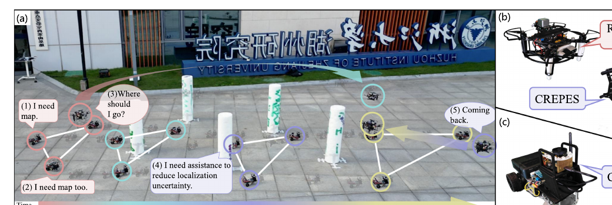
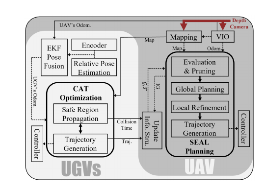
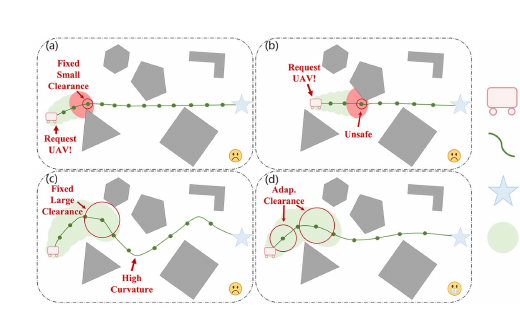
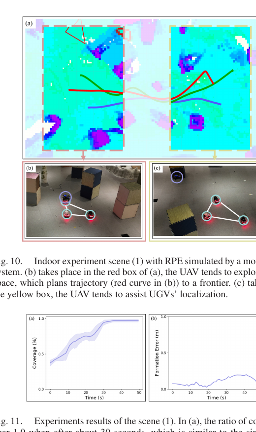

# 《Cost-Effective Swarm Navigation System via Close Cooperation》中文详解

> 中文题名：紧密协作下的高性价比集群导航系统  
> 作者：Nanhe Chen、Zhehan Li、Lun Quan、Xinwei Chen、Chao Xu、Fei Gao、Yanjun Cao  
> 发表：IEEE Robotics and Automation Letters，第 9 卷第 11 期，2024 年 11 月，页 9343–9350  
> DOI：10.1109/LRA.2024.3408511  
> [原始 PDF](../Cost-Effective%20Swarm%20Navigation%20System%20via%20Close%20Cooperation.pdf) ｜ [其他论文总览](README.md)

## 1. 先纠正一个容易被题名误导的理解

这不是“多架无人机用少数激光雷达共享安全走廊”的论文。原文研究的是一个空地异构团队：**1 架无人机帮助多台地面机器人导航**。

全系统只有无人机搭载一台有限视场的 Intel RealSense D435 深度相机，用它完成视觉惯性定位、探索和三维环境建图。地面车没有相机或激光雷达等环境感知器，论文称其为“盲地面机器人”；它们只有低成本轮编码器，并借助无人机提供的地图、无人机—地面车相对位姿和无人机自身里程计来定位和避障。

作者的核心观点是：高性价比不只是给每台机器人换便宜传感器，而是通过任务分工与运动规划，让一台会飞的传感器在“探索未知环境”和“及时支援地面车定位”之间做调度；同时让地面车根据自身定位不确定性主动留出不同安全距离，尽量减少呼叫无人机的次数。

*图：1 架带 RealSense D435 深度相机的无人机支持 3 台无环境感知地面车在未知场地保持三角队形导航；所有机器人安装 CREPES 相对位姿估计装置。来源：原论文 Fig. 1，PDF 第 2 页。*

## 2. 任务背景：为什么要让无人机充当“移动公共传感器”

### 2.1 给每台机器人完整传感器，性能好但系统成本高

常见集群导航方案为每台机器人配深度相机或三维激光雷达，让各自独立定位、建图和避障。优点是没有明显的单点依赖；缺点是传感器、计算平台、标定和维护成本按机器人数量成倍增长。

### 2.2 空中和地面机器人天生擅长不同任务

无人机视点高、移动灵活，适合快速观察和建图，但载重、续航有限。地面车续航长、能搬运重物，却容易被障碍遮挡，视野也低。把两者简单放在同一团队并不会自动产生协作价值，关键是让无人机收集的信息真正服务地面车的未来路线。

### 2.3 有限视场使调度问题变得困难

作者此前的 ColAG 系统使用 360° 三维激光雷达帮助“盲”地面车。本文进一步把无人机传感器降为有限视场深度相机，因此无人机不能同时看遍四周：

- 它必须主动探索，才能逐步建出未知区域地图；
- 它还要靠近某台地面车，提供可靠相对位姿，压低该车的定位不确定性；
- 地面车数量增加后，无人机不可能一直跟着每一台车；
- 如果调度只看眼前最近目标，无人机会在探索点和求助车辆之间反复奔波。

论文将这两个矛盾结合为“顺序探索与辅助定位”调度，并让地面车轨迹规划适应无人机支援的间歇性。

## 3. 发表时的通用做法与本文位置

| 路线 | 通用做法 | 优点 | 不足 |
|---|---|---|---|
| 每机完整感知 | 每台地面车都装深度相机/激光雷达并独立避障 | 冗余高，单机自主性强 | 硬件与计算成本随规模增长 |
| 先探索、后导航 | 无人机先把整片区域建图，随后地面车开始执行 | 地面车获得较完整地图 | 两阶段串行，任务等待时间长，空地协同不紧密 |
| 持续视野约束 | 让所有地面车始终处于无人机视场内以维持相对定位 | 状态关系简单 | 队形和通行空间受限；障碍密集或车多时效率低 |
| 早期 ColAG | 无人机用 360° 激光雷达支持盲地面车，使用较粗调度 | 环境感知强、视野完整 | 传感器更重更贵；未同时处理编队规划，车多时调度效率下降 |
| 本文 | 一台有限视场深度相机；无人机联合调度探索与定位支援；地面车按不确定性自适应避障 | 最少环境传感器配置下仍能未知环境导航和保持队形 | 依赖无人机、共享地图和相对位姿链路；系统调度较复杂 |

论文的“高性价比”是架构层面的最小硬件配置：全队只有一台环境感知相机。论文没有给出美元成本或“节省 60%”之类财务数据，因此不能把高性价比换算成未经验证的成本比例。

## 4. 系统组成、输入与输出

### 4.1 无人机端

- 深度相机：唯一的环境感知传感器；
- 视觉惯性里程计：估计无人机自身运动；
- 建图模块：把深度图融合为环境地图；
- SEAL 规划器：Sequential Exploration and Aiding Localization，中文可译为“顺序探索与辅助定位”；
- 轨迹生成与级联比例—积分—微分控制器：执行探索和支援航迹。

### 4.2 地面车端

- 轮编码器：提供短时间运动增量；
- 空地相对位姿估计设备：获得无人机与地面车之间的相对位置和姿态；
- 扩展卡尔曼滤波器：融合轮里程计、无人机里程计和相对位姿；
- CAT 优化器：Collision-Adaptive Trajectory，中文可译为“碰撞裕度自适应轨迹优化”；
- 模型预测控制器：跟踪规划轨迹。

*图：左侧为地面车的状态融合与 CAT 优化，右侧为无人机建图与 SEAL 规划；实线表示空地机器人之间传递的信息。来源：原论文 Fig. 3，PDF 第 3 页。*

### 4.3 输入与输出

系统运行时输入包括深度图和惯性数据、无人机视觉惯性里程计、空地相对位姿、地面车轮编码器、各地面车当前/计划轨迹，以及建图产生的“已知自由区域—未知区域边界”。

输出包括：

- 逐步扩展的环境地图；
- 所有地面车在无人机世界坐标系中的状态和协方差；
- 无人机下一轮应访问的探索前沿或定位支援视点及飞行轨迹；
- 地面车满足避障、互避、动力学与队形相似性的时空轨迹。

## 5. 整体闭环怎样工作

1. 无人机用深度相机和视觉惯性里程计建局部地图，并提取已知自由空间与未知空间之间的边界，即探索前沿。
2. 每台地面车用扩展卡尔曼滤波融合轮里程计、无人机里程计和相对位姿，得到自身状态及不确定性。
3. 地面车向无人机报告当前轨迹、预测碰撞时间和需要支援的信息。
4. SEAL 规划器给探索前沿和最紧急的地面车支援请求打分、筛选，并规划无人机的访问顺序。
5. 无人机飞行时继续建图；当访问求助车辆附近视点时，用相对位姿观测收紧该车的定位协方差。
6. 地面车把自身未来协方差传播成一串椭圆安全区域，并据此调整避障距离，通过 CAT 生成轨迹。
7. 新地图、新定位和新轨迹不断反馈，形成探索、支援和地面导航的闭环。

## 6. SEAL：无人机如何同时安排探索和定位支援

### 6.1 两类信息结构

无人机维护两类条目：

- 地面车信息：信息增益、预测碰撞时间、未来轨迹、定位协方差以及绕预计未来位置采样的候选视点；
- 前沿信息：前沿包含的栅格、平均位置、包围盒、候选观察视点和对地面车路线的价值。

候选支援视点围绕地面车预计未来位置，在圆柱坐标中采样，并让相机朝向圆柱中心。这样无人机不是飞向地面车当前所在的旧位置，而是拦截其未来路线上的合适观测位置。

### 6.2 地面车求助紧迫度

算法估算无人机从当前位置飞到某台车候选视点需要多长时间，再除以该车预测发生碰撞的剩余时间。比值越高，表示“再不去就来不及”，支援优先级越高。

预测碰撞不是只看车辆名义中心轨迹，而是考虑定位协方差传播后的安全区域。随着轮里程计漂移增大，椭圆变大，车辆可能更早与障碍物安全边界相交，从而触发支援。

### 6.3 探索前沿价值

不是所有未知边界都值得无人机去看。论文根据前沿相对地面车轨迹的方向和距离计算信息增益：位于地面车前进方向、靠近其未来路线的未知区域更重要。

作者随后按信息增益排序，用动态窗口聚类/剪枝，只留下最重要的一小批前沿。这样避免把大量前沿全部送入组合优化，剪枝复杂度为 `O(n log n)`。

### 6.4 带时间窗的非对称旅行商问题

筛选后的探索前沿和最多一个紧急地面车请求共同构成访问节点。无人机需要决定访问顺序，并保证在地面车预计碰撞之前到达支援视点。

论文把问题建模为带时间窗的非对称旅行商问题。前沿节点的时间窗基本放开，紧急地面车节点的最晚访问时间取预测碰撞时间。作者用 Google OR-Tools 在线求解。

### 6.5 局部视点细化与轨迹生成

全局调度阶段每个条目只用一个代表视点。确定访问顺序后，论文在有向无环图上用 A* 从每个条目的多个候选视点中选更好的组合，再调用探索轨迹规划器生成平滑、安全、动力学可行的无人机航迹。

这形成四层流程：评价 → 剪枝 → 全局访问顺序 → 局部视点与连续轨迹。

## 7. CAT：地面车如何根据定位不确定性调整路线

### 7.1 为什么固定安全距离不合适

如果始终用很小的障碍物安全距离，轮里程计漂移时风险高，地面车频繁请求无人机纠正定位；无人机就无法专心探索。

如果始终用很大的安全距离，路线会过度绕行，在窄环境中甚至无路可走。论文因此让安全距离随定位不确定性变化。

*图：固定小裕度会频繁请求无人机，固定大裕度会产生高曲率绕行；CAT 根据定位安全椭圆选择自适应裕度。来源：原论文 Fig. 7，PDF 第 6 页。*

### 7.2 传播三倍标准差安全椭圆

扩展卡尔曼滤波输出二维位置协方差。论文根据地面车运动模型沿未来轨迹传播协方差，并用

$$
(p-\hat p)^\mathsf{T}P_{xy}^{-1}(p-\hat p)\le 9
$$

表示安全椭圆。右侧的 9 对应三倍标准差边界。椭圆越长，说明沿某方向的位置越不确定。

### 7.3 自适应障碍距离

某个轨迹约束点的避障距离设为：

$$
d_{ada}=\min(d_{min}+d_{tr},\ d_{max}),
$$

其中 `d_tr` 是该点不确定性椭圆的长轴，`d_min`、`d_max` 是上下限。定位准确时靠近 `d_min`，定位变差时逐步加大，但不会无限膨胀。

### 7.4 联合轨迹目标

地面车轨迹采用 MINCO 紧凑多项式表示，并用有限内存拟牛顿法 L-BFGS 优化。目标包含七类代价：

1. 控制努力；
2. 总执行时间；
3. 自适应障碍物避让；
4. 队形相似性；
5. 机器人之间相互避碰；
6. 动力学可行性；
7. 约束点分布均匀性。

因此地面车并非简单跟随无人机，而是自主规划全队地面轨迹；无人机只提供公共感知、地图和间歇定位帮助。

## 8. 实验设置与量化效果

### 8.1 主要参数

论文设置无人机最大速度 1.8 m/s、最大偏航角速度 30°/s；深度相机视场为 80° × 60°，最大有效距离 5.0 m。仿真中地面车在密集环境最大速度 0.2 m/s、稀疏环境 0.4 m/s；真机为 0.35 m/s。CAT 的最小、最大避障距离分别为 0.15 m、1.0 m。

### 8.2 V 形凹障碍测试

论文比较本文、每台机器人都有深度相机的 Quan 方法，以及使用 360° 激光雷达但缺少主动探索/编队规划的 Li 方法。每种运行 10 次，成功条件是所有地面车穿过区域且不误入 V 形凹槽。

- 本文成功率：90%；
- Quan 方法：30%；
- Li 方法：30%。

这里本文的优势来自无人机主动探索地面车前方未知空间，避免局部规划器把车辆引入凹障碍的死胡同。

### 8.3 大场景 SEAL 仿真

稀疏和密集场景均为 64 m × 40 m × 2 m，分别随机放置 90 和 350 根柱状障碍物；测试 3、5、7 台地面车，每种配置运行 3 次。

Table III 显示，本文所有配置的停车时间占比不超过 0.722%。在稀疏 7 车场景，本文平均行驶时间 204.641 s，而 Li 方法为 301.179 s；Li 方法在所有密集场景测试中失败，因此表中没有对应数据。与每车都有深度相机的 Quan 方法相比，本文的行驶时间、停车占比和队形误差整体相近，说明一台共享相机通过紧密协作能够接近全员感知配置的导航表现。

### 8.4 CAT 消融实验

在密集环境、5 台地面车配置中，原论文 Table IV 给出：

| 障碍裕度 | 平均行驶时间 | 平均停车时间 | 平均队形误差 |
|---|---:|---:|---:|
| 固定小裕度 | 463.193 s | 32.151 s | 1.347 m |
| 固定大裕度 | 451.523 s | 2.549 s | 0.162 m |
| CAT 自适应 | 432.901 s | 3.127 s | 0.087 m |

固定小裕度导致频繁等待无人机支援；固定大裕度减少停车，但路线更绕；自适应方案在该测试中同时取得更短行驶时间和更小队形误差。

### 8.5 室内与室外真机

每台机器人使用 Intel Core i7-1165G7 运行算法。室内测试用动作捕捉系统计算相对位姿，但不把绝对位姿直接给机器人；作者给相对位姿加入均值 0、标准差 0.2 的高斯噪声，并设置只有无人机进入以地面车为中心、半径 2.0 m 的虚拟圆柱时才可获得相对位姿。四个场景包含凸/凹障碍和窄缝，停车占比为 1.416%–5.408%（原论文 Table V 的场景 1–4）。

室外实验不依赖基础设施，使用 CREPES 相对位姿系统；场地约 6 m × 14 m，放置 5 个障碍物。Fig. 1 展示一机三车保持三角队形通过未知环境，Table V 中该场景停车占比为 1.565%。

*图：无人机有时飞向未知前沿建图，有时靠近地面车提供定位；场景 1 的地图覆盖率约 30 秒后接近 1，队形误差在密集区域升高。来源：原论文 Fig. 10–11，PDF 第 8 页。*

## 9. 论文的创新点

1. **极简环境感知硬件。** 不是每车降配，而是全队仅保留一台有限视场深度相机。
2. **探索与定位支援同一调度。** 前沿价值和地面车碰撞截止时间被放进统一访问规划，而不是两个互不相干模块。
3. **预测未来求助。** 候选视点围绕地面车预计未来位置采样，优先级由飞抵时间与预测碰撞时间的比值决定。
4. **地面车主动适应间歇支援。** CAT 把定位协方差转成轨迹安全距离，减少无谓等待和无人机往返。
5. **同时维持地面队形。** 相比作者此前的盲导航系统，本文把编队相似性和互避碰加入地面车优化。

## 10. 局限与适用边界

### 10.1 无人机是关键单点资源

无人机失效、深度相机失效或通信中断后，地面车缺少独立环境感知。系统适合能接受集中感知依赖、且无人机可覆盖任务区域的场景，不适合把每台车的故障独立性放在首位的安全关键任务。

### 10.2 地面车并非真正“什么都没有”

每车仍需要轮编码器、计算平台、无线通信和相对位姿估计设备。户外实验依赖 CREPES；论文没有证明任意相对定位系统、任意遮挡条件下都能达到同样结果。

### 10.3 共享地图和坐标关系必须可靠

所有地面车根据无人机地图避障。如果空地外参、时间同步、地图传输或相对位姿有系统误差，协方差椭圆未必能完全包住真实误差。

### 10.4 规模验证有限

仿真测试到 7 台地面车，真机主要是一机三车。地面车继续增多时，一架无人机的访问调度、通信和建图带宽可能成为瓶颈。

### 10.5 安全是概率/裕度意义而非硬证明

三倍标准差椭圆依赖滤波协方差可信和近似高斯误差。若出现错误匹配、严重非高斯漂移或地图动态变化，实际误差可能越过椭圆。

### 10.6 对高速动态环境覆盖不足

论文场景以静态柱体、箱体和较慢地面车为主；地面车真机最大速度 0.35 m/s。方法对快速移动障碍、拥挤人群和高速车辆的效果仍需额外验证。

## 11. 复现建议

1. 先分别复现状态融合、地图共享、单车 CAT，再接入 SEAL；否则很难定位问题来自感知、坐标变换还是调度。
2. 扩展卡尔曼滤波的协方差必须经过一致性检验。若协方差被低估，CAT 会给出过小安全距离；可用归一化估计误差平方等指标校准。
3. 确保地图、无人机里程计、相对位姿和地面车轮里程计时间同步。高速飞行时几十毫秒时差就会使支援视点和地图发生错位。
4. 重现实验时记录无人机用于探索、飞向支援点和实际观测的时间占比，而不只记录地面车总行驶时间。
5. 带时间窗旅行商问题的节点数依赖前沿剪枝。必须复核剪枝阈值，避免遗漏地面车必经区域的关键前沿。
6. CAT 中 `d_min`、`d_max` 和协方差长轴的单位必须一致；对真实车体还需叠加几何半径和跟踪误差裕量。
7. 需要安全停机逻辑：若预测无人机无法在碰撞时间前到达，地面车应减速或停车，而不是继续依赖尚未到来的定位帮助。
8. 原文只说代码将发布，复现前应核对作者实验室仓库和补充材料当前可用性，不应假设所有模块都已完整开源。

## 12. 外行阅读抓手

可把系统想成“一个会飞的巡检员带着几台没有眼睛的搬运车”：

- 巡检员先看哪里，不仅取决于哪里未知，还取决于哪台车快要因定位不准而碰撞；
- 搬运车不会被动等待，它根据“自己有多没把握”主动离障碍远一点；
- 巡检员一旦靠近并重新校准，搬运车的安全椭圆缩小，就能走更直接的路线；
- 通过这种双向配合，一台相机承担了全队环境感知，但也带来了对无人机和通信的集中依赖。

## 13. 核验依据

- 系统真实配置、贡献和相关工作：原论文第 1–3 页，Fig. 1–3；
- SEAL 信息结构、剪枝和全局/局部规划：第 3–5 页，式 (1)–(17)、Fig. 4–6；
- CAT 安全区域传播与轨迹优化：第 5–6 页，式 (18)–(22)、Fig. 7；
- 参数和仿真：第 6–7 页，Fig. 8–9、Table III–IV；
- 室内/室外真机：第 7–8 页，Table V、Fig. 10–12。
