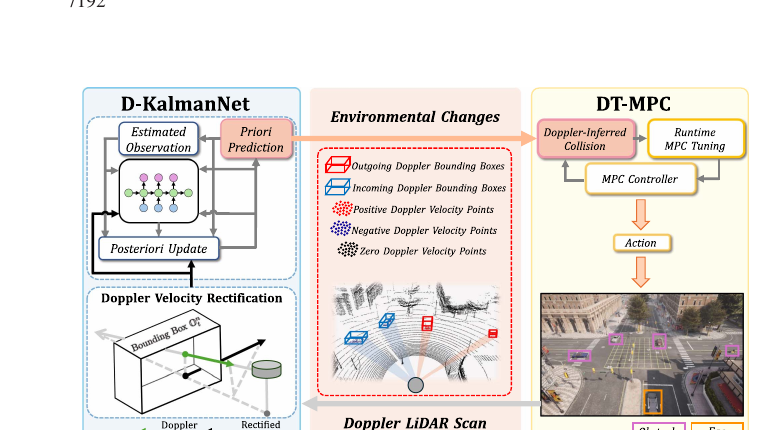
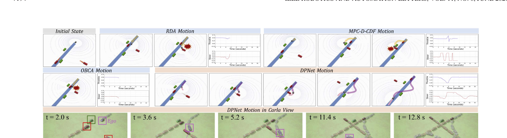
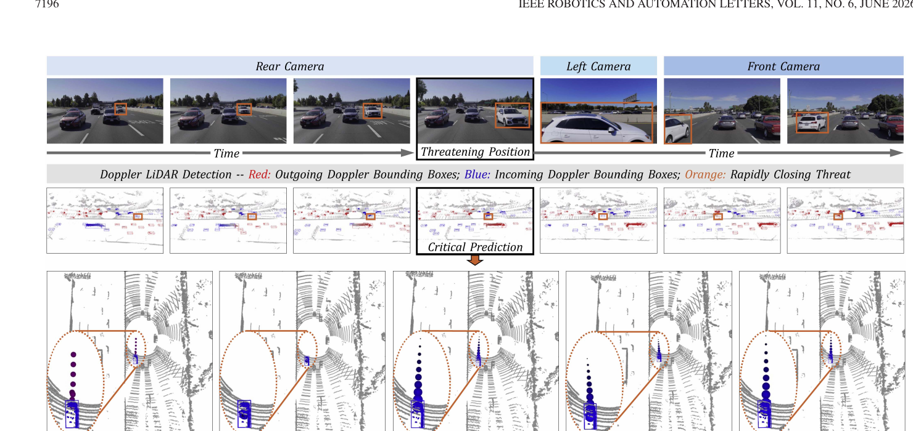

# DPNet：多普勒激光雷达高动态环境运动规划

> **原文信息**
> - 英文题目：*DPNet: Doppler LiDAR Motion Planning for Highly-Dynamic Environments*
> - 作者：Wei Zuo、Zeyi Ren、Chengyang Li、Yikun Wang、Mingle Zhao、Shuai Wang、Wei Sui、Fei Gao、Yik-Chung Wu、Chengzhong Xu
> - 期刊：*IEEE Robotics and Automation Letters*，第 11 卷第 6 期，2026 年 6 月
> - DOI：[10.1109/LRA.2026.3685933](https://doi.org/10.1109/LRA.2026.3685933)
> - 本地原始论文：[DPNet Doppler LiDAR Motion Planning for Highly-Dynamic Environments.pdf](../DPNet%20Doppler%20LiDAR%20Motion%20Planning%20for%20Highly-Dynamic%20Environments.pdf)
> - 本文页码说明：下文“PDF 第 X 页”按本地 PDF 从 1 开始计数；对应期刊页码为 7190—7197。

## 1. 一句话先讲明白

普通激光雷达只能告诉机器人“障碍物现在在哪里”，DPNet 使用多普勒激光雷达额外给出的瞬时径向速度，先预测高速障碍物下一步会去哪里，再让模型预测控制器提前改变安全距离和动作，因此机器人不用等危险真正发生才绕行。

这篇论文最值得注意的不是单独提出一个神经网络，而是把“带速度的激光雷达感知—障碍物跟踪—未来碰撞判断—在线控制参数调整”接成了闭环。

## 2. 任务背景：为什么高速动态避障比静态避障难很多

在静态环境里，机器人看到墙或箱子以后，只要规划一条不穿过障碍物的路径即可。动态环境多了一层时间关系：机器人在未来某一时刻到达某个位置时，行人或车辆也可能恰好到达那里。因此，“空间上现在没有障碍”不等于“沿这条路走就是安全的”。

高速障碍物会把问题进一步放大：

1. **速度估计有延迟。** 普通激光雷达连续观察多个时刻的位置，再用位置差估计速度。障碍物突然加速或变向时，历史趋势很快过时。
2. **预测误差会传到规划器。** 规划器避开的通常是预测位置；预测框偏一点，机器人就可能把一条危险路线误判成安全路线。
3. **固定安全距离很难兼顾安全与可行性。** 距离设得大，密集环境中可能无路可走；设得小，又来不及躲避快速接近的目标。
4. **车载算力有限。** 跟踪多个物体、滚动预测和反复优化必须在很短时间内完成。

多普勒激光雷达利用频率变化测量反射点沿激光方向的速度。它仍不是“直接输出物体完整二维速度”的魔法传感器：单点只给径向分量，而且有噪声；不同表面点的观测方向也不同。论文解决的正是如何把这些点级速度整理为物体运动，并真正送进闭环控制。

## 3. 发表时常见做法，以及各自的优缺点

| 技术路线 | 通常怎么做 | 优点 | 主要问题 |
| --- | --- | --- | --- |
| 普通激光雷达 + 位置差分/卡尔曼滤波 | 先检测障碍物位置，再用多帧位置估速度 | 工程成熟、计算量小 | 高速或突变运动下存在滞后；模型选错会持续偏差 |
| 学习式轨迹预测 | 用循环网络、图神经网络等从大量轨迹中学习未来运动 | 能表示复杂交互 | 训练数据与算力需求大；换场景时泛化和安全边界难保证 |
| 物理模型 + 学习修正 | 保留卡尔曼预测结构，由网络学习难以手工设定的部分 | 比纯网络轻量，也能利用物理先验 | 仍依赖观测质量和检测关联正确 |
| 固定参数模型预测控制 | 在有限预测时间内反复优化控制量，固定安全距离 | 可显式加入运动学和控制约束 | 参数不合适时过于保守、性能次优，甚至优化无解 |
| 执行反馈自动调参 | 根据闭环执行结果调模型预测控制参数 | 能适应实际系统 | 碰撞规避任务中，不能把“真实碰撞”当成正常学习信号 |
| **DPNet** | 多普勒速度校正 + 学习卡尔曼增益 + 基于“推演碰撞”的在线安全距离调节 | 能早看见高速威胁，模型较轻，控制约束仍显式存在 | 依赖正确的目标框；调参规则是启发式，不是全局最优 |

论文没有把强化学习方法纳入端到端对比，脚注明确给出的原因是：作者认为这些方法在高动态场景中缺少安全保证。因此，论文结果只能支持“优于所选的四类优化/滤波基线”，不能泛化成“优于所有学习式规划器”。

## 4. 系统到底吃什么、吐什么

### 4.1 输入

- 当前帧多普勒点云。每个点至少包含三维坐标和一个标量多普勒速度。
- 障碍物边界框，用于把点云分配给不同目标。
- 机器人当前状态、参考路径、车辆运动学约束和控制上下限。
- 上一轮模型预测控制的未来状态序列，用来检查新的障碍物预测是否会与旧方案相撞。

一个很重要的实验条件是：论文端到端实验用**障碍物边界框真值**对多普勒点进行分组（PDF 第 5 页实验设置）。所以论文重点验证的是“速度理解和规划”，不是完整的目标检测系统。

### 4.2 输出

实验中的自身机器人被建模为类汽车轮式机器人，状态为平面位置和朝向，动作为线速度与角速度。DPNet 每轮优化一串未来动作，但滚动控制只执行第一个动作，下一帧再重新感知和规划。

### 4.3 完整闭环

1. 多普勒激光雷达采集点坐标和径向速度。
2. 按目标框分组，校正并融合一个目标上的多点速度。
3. 多普勒卡尔曼神经网络更新每个障碍物状态，并预测整个规划时域的目标框。
4. 用上一轮未执行的未来轨迹与最新目标预测做“虚拟碰撞”检查。
5. 如果预测有碰撞，在线调整不同障碍物、不同预测时刻的安全距离。
6. 用模型预测控制求机器人动作，只执行第一步，再进入下一轮。

*图：DPNet 从多普勒速度校正、障碍物状态更新到在线调节模型预测控制的整体信息流。来源：原论文 Fig. 2，PDF 第 3 页。*

## 5. 核心方法，按外行能跟上的顺序解释

### 5.1 把“沿视线的速度”还原成目标平面运动

多普勒点的速度不是车辆在地面上的完整速度，而是速度在激光视线方向上的投影。论文先根据激光俯仰角把测量投影到二维平面，再利用刚体一致性融合属于同一个目标框的所有点。

白话理解：假设一辆车是刚体，车门、车顶和车尾虽然被不同激光束击中，但它们共享同一个整体平移速度。单个点只提供一条方向上的线索；多个方向的线索合在一起，就能更稳定地估计车辆的线速度。论文指出真实多普勒速度测量的典型噪声标准差约为 0.1 米/秒，因此多点融合不是可有可无的步骤（PDF 第 3 页）。

这里还隐藏着一个假设：分到同一框里的点确实属于同一个刚体。如果两个物体被错误合成一个框，“刚体一致性”就不再成立。

### 5.2 用 D-KalmanNet 保留物理模型和数据修正能力

D-KalmanNet 是 Doppler Kalman Neural Network，即“多普勒卡尔曼神经网络”。它不是端到端直接猜轨迹，而是保留卡尔曼滤波的三段式结构：

1. 用恒加速度模型从当前状态推到下一时刻；
2. 计算预测观测与真实观测的差，即“新证据与旧预测冲突了多少”；
3. 用学习得到的卡尔曼增益决定该相信模型多少、相信新观测多少。

障碍物状态同时表示平面位置、沿两个坐标方向分解后的速度和加速度。循环神经网络接收上一状态、先验预测、预测观测和当前真实观测，输出卡尔曼增益。这样做的意义是：

- 恒加速度模型提供结构和高效率；
- 网络不用从零学习全部运动规律，只学习“怎样纠正模型与噪声”；
- 循环结构能利用时间历史，对突然加速和观测噪声作适应性权衡。

训练时需要带真值的车辆轨迹；部署时网络只参与状态更新，随后仍按显式状态转移模型向前滚动多步。

### 5.3 用预测出来的碰撞触发调参，而不是等真实撞上

普通模型预测控制常把安全距离设成一个常数。DPNet 将它拆成：

- **强制最小距离**：任何时候都要保留的底线；
- **多普勒自适应距离**：根据威胁紧迫性和预测远近动态缩放。

系统把上一轮规划中尚未执行的状态当成“如果继续这么走，我未来大概会在哪里”，再与本轮 D-KalmanNet 预测出的障碍物框逐时刻比较。小于阈值就记作一次多普勒推断碰撞。

空间因子对更早出现的碰撞赋予更高优先级，时间因子则承认远期预测更不确定。论文默认参数为：碰撞检查阈值 0.5 米、强制距离 0.1 米、自适应部分 0.4 米，空间与时间衰减率分别为 0.2 和 0.05（PDF 第 5 页）。这些是论文实验配置，不是对所有平台都通用的推荐值。

### 5.4 求解带动态碰撞代价的模型预测控制

目标函数同时考虑参考路径跟踪和碰撞惩罚，约束包含车辆状态演化及线速度、角速度上下限。碰撞项原本是非凸的，作者利用拉格朗日对偶把它改写成双凸形式，再以交替方向乘子法求到一个稳定点。

这里应准确理解“求解保证”：论文说算法收敛到该改写问题的**驻点**，并不等于找到全局最优解，也不等于对任意感知错误都有形式化的绝对安全保证。

## 6. 代表性运行效果

*图：在两个静态和两个高速动态障碍物场景中，RDA、MPC-D-CBF、OBCA 与 DPNet 的运动对比；DPNet 利用速度预测在早期左转，从横向运动障碍物后方通过。来源：原论文 Fig. 4，PDF 第 5 页。*

*图：AevaScene 高速公路场景中，一辆约 25 米/秒快速接近的车辆；下排比较真值、普通卡尔曼滤波、加入多普勒的卡尔曼滤波、KalmanNet 与 D-KalmanNet 的未来轨迹。来源：原论文 Fig. 6，PDF 第 7 页。*

## 7. 实验如何做，结果到底说明什么

### 7.1 Carla 闭环规划实验

系统在 Linux 与机器人操作系统 ROS Noetic 中实现，使用带多普勒激光雷达插件的 Carla 仿真器。所有规划器使用 15 步预测时域，每步 0.1 秒。DynaBARN 随机生成动态障碍物轨迹、加速度和 `6 ± 2` 米/秒速度；1、3、5、7 个障碍物的每种设置各运行 100 次（PDF 第 5—6 页，Table I）。

| 动态障碍物数 | OBCA 成功率 | RDA 成功率 | MPC-D-CBF 成功率 | DPNet 去掉在线调参 | 完整 DPNet |
| ---: | ---: | ---: | ---: | ---: | ---: |
| 1 | 76% | 87% | 100% | 99% | **100%** |
| 3 | 41% | 54% | 74% | 85% | **88%** |
| 5 | 21% | 35% | 42% | 55% | **57%** |
| 7 | 2% | 26% | 30% | 39% | **45%** |

最拥挤的 7 障碍物设置中，完整 DPNet 比去掉在线调参的版本高 6 个百分点，说明速度预测本身和控制器在线调节都在起作用。完整规划器的平均迭代时间为 222.4 毫秒，RDA 为 180.9 毫秒；因此不应把论文中“低于 1.5 毫秒”误写成完整规划循环耗时。低于 1.5 毫秒只指 DT-MPC 的调参步骤：3、5、7 障碍物时分别为 0.621、0.997、1.498 毫秒（PDF 第 6 页，Table II）。

7 障碍物时，DPNet 平均通过时间为 17.441 秒，RDA 为 22.886 秒，说明它不只是扩大距离“慢慢躲”，也能利用运动方向从障碍物后方通过。

### 7.2 AevaScene 真实多普勒数据上的跟踪

训练集共 100 段序列，城市和高速公路各 50 段；每段 100 帧、10 赫兹。作者随机用 80 段训练（两类各 40），其余 20 段测试，训练 2000 个轮次（PDF 第 5 页）。对比方法为普通卡尔曼滤波、KalmanNet、加入多普勒的传统卡尔曼滤波和本文 D-KalmanNet。

评价指标是以分贝表示的归一化均方误差，数值越负越好。10 赫兹、预测 5 步的城市场景中，D-KalmanNet 为 `-45.00 ± 7.35 dB`，加入多普勒的传统卡尔曼滤波为 `-32.74 ± 6.18 dB`，优势为 12.26 dB；预测延长到 10 步时，D-KalmanNet 仍有 `-34.30 ± 7.65 dB`（PDF 第 6 页，Table III）。

### 7.3 嵌入式计算量

在 NVIDIA Jetson Orin NX 16 GB 上，网络约占 107 MB 图形处理器显存。跟踪 1 个目标时超过 100 赫兹；同时跟踪 10 个目标时为 14.36 赫兹、中央处理器占用率 42%（PDF 第 7 页，Table IV）。这证明跟踪网络较轻，但不代表整个感知检测和规划系统都能以 14.36 赫兹运行。

## 8. 真正的创新点

1. **把多普勒速度用于闭环规划，而不只用于检测或里程计。** 原文将其称为首次把多普勒激光雷达与运动规划统一起来。
2. **结构化的小网络。** 网络只学习卡尔曼增益，减少了纯学习预测对数据量和模型规模的需求。
3. **用“想象中的碰撞”代替真实事故作为调参触发信号。** 这一点适合安全任务，因为系统可以在执行前调整。
4. **把威胁紧迫性映射为时空变化的安全距离。** 近时刻、近障碍物获得更强关注，远期预测不过度束缚规划。

## 9. 局限、失效模式与适用边界

### 9.1 论文已经展示的失效模式

两个速度分别为 6.10 和 5.28 米/秒的障碍物靠近时，边界框发生严重欠分割，被合成一个速度约 3.45 米/秒的虚假目标，错误继续传给规划器并导致碰撞（PDF 第 7 页，Fig. 7）。这说明系统安全性的上限首先受目标检测和实例分割质量限制。

### 9.2 方法层面的边界

- 端到端闭环只在 Carla 中验证；真实 AevaScene 数据只验证跟踪，没有真实车辆闭环避障。
- 实验使用目标框真值分组，实际部署仍需可靠的检测、分割和数据关联前端。
- 障碍物采用刚体、平面恒加速度近似；行人肢体、可变形物体或强交互运动可能偏离模型。
- 在线参数更新是启发式规则。论文明确承认它通常不是碰撞损失的最优解，未来考虑可微优化或策略搜索。
- 完整模型预测控制迭代在密集场景达到百毫秒量级；高速实体平台还需核对控制周期是否满足制动距离要求。

## 10. 复现时最值得先检查的事项

1. **先复现数据接口。** 确认传感器提供的是带符号的径向速度，并统一传感器、车体和世界坐标系；方向符号错一次，接近目标会被当成远离目标。
2. **不要跳过实例分组。** 论文使用真值框；工程复现应单独统计漏检、假检、框抖动、欠分割及身份切换，再评估它们对速度和碰撞率的影响。
3. **按原文拆开计时。** 分别记录点云分组、速度校正、D-KalmanNet、DT-MPC 调参和完整优化器耗时，不能用调参模块的 1.5 毫秒代表全系统。
4. **复核训练划分。** AevaScene 的同一段轨迹不能同时进入训练和测试；否则连续帧高度相似，会高估泛化能力。
5. **从简单场景逐级增加难度。** 先做单目标恒速，再做多目标加速、交叉和贴近，最后才做检测框合并等故障注入。
6. **安全距离按平台重标定。** 0.1、0.4、0.5 米来自论文类汽车模型，不能直接移植到尺寸、制动和延迟不同的无人机或车辆。
7. **报告完整失败率。** 除平均误差外，应报告最小间距、碰撞率、求解失败率和尾部时延，因为高动态避障最怕少量灾难性失败。

## 11. 外行读完应记住什么

DPNet 的核心思想可以浓缩成一句话：**传感器如果能直接看到运动，就应当让规划器使用这份“现在正在怎么动”的证据，而不是只看位置后再慢慢猜速度。**

但它并没有消除检测错误，也没有在真实道路上证明完整闭环安全。正确评价是：论文在受控仿真和真实数据跟踪上证明了多普勒速度、物理启发学习滤波和在线模型预测控制调参的组合很有潜力，同时清楚暴露了边界框错误会如何击穿整个系统。
