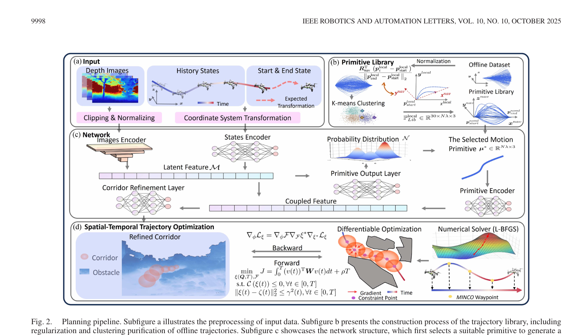
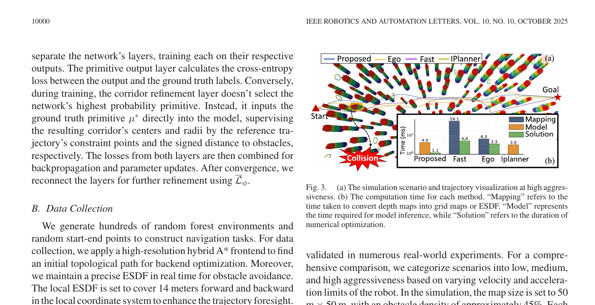
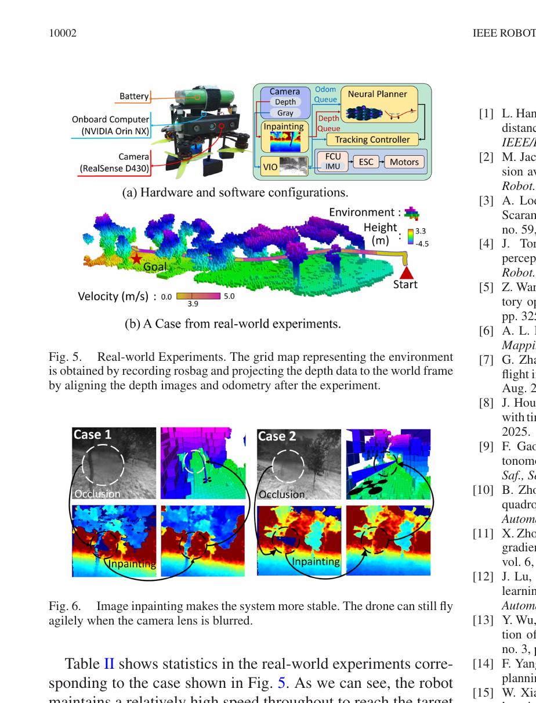

# 嵌入优化神经网络的自主飞行可行动力学轨迹生成

> 元数据 (作者, 期刊, 链接)
> 作者: Zhichao Han, Long Xu, Liuao Pei, and Fei Gao
> 期刊: IEEE ROBOTICS AND AUTOMATION LETTERS, VOL. 10, NO. 10, OCTOBER 2025
> 链接: https://doi.org/10.1109/LRA.2025.3595077
> 本地原文: [原始 PDF](../Dynamically%20Feasible%20Trajectory%20Generation%20With%20Optimization-Embedded%20Networks%20for%20Autonomous%20Flight.pdf)

## 1. 核心思想与一句话概括
**核心思想**：提出一种视觉局部规划系统，让神经网络先根据深度图预测“轨迹应该从哪里穿过”的多段球形安全走廊，再让在线数值优化器在走廊中求解连续、满足速度和加速度限制的多项式轨迹；训练时，轨迹优化结果还能反向影响走廊预测网络。

**一句话概括**：它不是让网络直接猜一条最终轨迹，而是让网络快速提出安全约束，再由模型优化器负责把约束变成可执行轨迹，从而在纯学习和传统建图规划之间取得折中。

## 2. 外行导读与研究背景
无人机（UAV）自主飞行中的导航模块至关重要。传统模块化方法使用深度相机感知环境，构建环境地图（如ESDF），然后应用运动规划算法计算避障最优轨迹。这种方法引入了物理延迟，缺乏模块间集成，且需大量人工调参。
近年来，基于学习的端到端导航备受关注，可直接从传感器数据生成轨迹，但由于黑盒特性，难以调试，且难以施加复杂的动态约束，导致生成的轨迹可能不可行或过于激进（容易炸机）。
本文整合了轨迹优化和神经网络，直接从深度图像生成安全区域（飞行走廊），并在此基础上进行高效的轨迹优化，解决传统方法的延迟问题和学习方法缺乏动力学可行性保障的痛点。

### 2.1 这篇论文位于自主飞行系统的哪一层

完整无人机系统通常包括状态估计、环境感知、路径/轨迹规划、控制和电机执行。本文主要替换的是**局部建图与轨迹规划**环节：输入仍需要深度相机、里程计、起点和局部目标；输出是一条带时间的三维轨迹，再交给跟踪控制器执行。它没有解决全局目标选择、视觉里程计失效、目标检测或电机故障等问题。

对外行最重要的区别是：

- **路径**只描述空间中从哪里走；
- **轨迹**还规定每个时刻在哪里、速度和加速度多大；
- **控制指令**才是飞控最终执行的推力和姿态命令。

本文输出的是第二类，不是直接输出四个电机转速。

## 3. 当前研究现状与技术路线对比 (表格)
| 方法类型 | 代表工作 | 优点 | 缺点 |
| --- | --- | --- | --- |
| 传统优化规划 | Fast, Ego-planner | 轨迹动力学可行，可解释性强 | 依赖显式建图，计算延迟高，面对复杂环境易陷入局部最优或规划失败 |
| 纯学习规划 | 端到端CNN/RL等 | 无需显式建图，推理速度快 | 黑盒模型，理论安全性和动力学可行性难以保证，高动态下易崩溃 |
| 双层优化/学习结合 | Iplanner, BarrierNet | 结合优化与学习，推理快 | Iplanner使用样条插值，不能严格保证动态约束；BarrierNet依赖预定义形状，不适合非结构化杂乱环境 |
| 本文方法（优化嵌入网络） | 网络预测走廊＋在线时空轨迹优化 | 不需要在线构建大范围欧氏有符号距离场；约束可解释，优化层可参与训练 | 需要昂贵的离线专家数据和轨迹库；约束采用离散采样与罚函数，仍受感知误差和数值求解影响 |

从工程成熟度看，传统建图＋优化仍是更常见的默认方案；纯学习和优化嵌入网络属于研究型可选路线。本文证明该混合路线能在高动态场景取得很强结果，但尚不能据此认为显式地图已经被普遍淘汰。

## 4. 核心术语与定义
- **MINCO（Minimum Control，最小控制量轨迹表示）**：用少量航点和分段时间唯一恢复分段多项式轨迹，并高效计算控制努力和梯度；它并不意味着各段时间必须相等。
- **隐式函数定理 (Implicit Function Theorem)**: 一种用于导出最优解与优化参数之间关系的数学方法，使原本不可导的优化过程可微。
- **飞行走廊 (Flight Corridors)**: 用于建模安全约束的一系列自由凸几何体，将轨迹限制在其中以确保安全。
- **双层优化 (Bilevel Optimization)**: 外层（无模型神经网络）从深度信息提取走廊，内层（基于模型的轨迹规划）执行时空最优轨迹求解。

## 5. 核心算法与理论模型 (深度解析，含大量公式)
本方法的架构分为四个主要部分：深度图像特征提取、轨迹库匹配、飞行走廊生成和可微时空轨迹优化。

> **图读法（来源：原论文 Fig. 2，第 4 页）**：上排先把连续专家轨迹正则化并聚类成 30 个运动图元；中间网络根据 10 帧深度图和历史状态选择一个图元，再预测各段球形走廊的中心和半径；下排数值优化器在走廊中求 MINCO 轨迹。反向箭头说明优化结果的梯度会回到网络，而不是把优化器当作训练后完全独立的模块。

### 5.1 输入预处理与坐标统一

网络输入由三部分组成：最近 10 帧深度图、最近的运动状态、局部起点和终点状态。深度值截断到 10 米后归一化；状态和目标统一变换到以当前机体运动方向为参考的局部导航坐标系。这样做减少了“同一种局部几何因为全局朝向不同而被网络当成不同样本”的负担。

### 5.2 离线运动图元库为什么必要

作者先在数百个随机森林和随机起终点任务中，用高分辨率混合 A*、精确欧氏有符号距离场和后端优化生成约 40 万条专家轨迹。经过失败样本剔除和归一化后，保留约 30 万条，再用 K-Means 聚类成 30 类运动图元。

网络不是从无限多种曲线中凭空生成，而是先判断当前深度场景更像哪一种典型运动模式，例如左绕、右绕、上穿或下穿；随后再细调走廊中心和半径。这显著缩小在线搜索空间，但也把离线数据分布带入了模型。

### 5.3 走廊不是传统凸多面体

这里的走廊由一串球形约束组成，每个球有中心 $\zeta_\phi$ 和半径 $\gamma_\phi$。球心规定轨迹大致应经过哪里，半径表示可调整余量。网络先给出粗走廊，优化器再在其中调整航点和分段时间。球形表示计算简单且便于求导，但面对很薄、很长或尖锐的自由空间时，可能比任意凸多面体更保守。

**双层优化模型建立：**
外层使用神经网络获取安全约束（飞行走廊），内层执行轨迹优化。优化目标为：
$$ \min_{\phi} J = J(\xi^*_{Q^*, T^*}(t)) $$
$$ s.t. \mathcal{F}_\phi \in \mathcal{E}_{free}, $$
$$ \xi^*_{Q^*, T^*}(t) = \arg\min_{\xi_{Q,T}(t) \in \mathbb{F}(\phi)} J = J(\xi^*_{Q,T}(t)) $$
其中，$\phi$为神经网络参数，$J$为控制能量与时间惩罚：
$$ J = \int_0^T (\xi^{(u)})^T \xi^{(u)} dt + \rho T $$

**空间安全约束实例化为连续时间不等式：**
$$ \mathcal{C}(\xi(t), \xi^{(1)}(t), ..., \xi^{(u)}(t)) \le 0, \forall t \in [0, T] $$
$$ ||\xi(t) - \zeta_\phi(t)||_2^2 \le \gamma_\phi^2(t), \forall t \in [0, T] $$
离散化后：
$$ ||\xi_i\left(\frac{jT}{\lambda N}\right) - \zeta_{\phi,i,j}||_2^2 \le \gamma_{\phi,i,j}^2 $$

**可微轨迹优化前向过程（利用罚函数转化为无约束问题）：**
$$ \min_{\xi_{Q,T}(t)} L_{\mathcal{F}(\zeta_\phi, \gamma_\phi)} = \int_0^T (\xi^{(u)}(t))^T \xi^{(u)}(t) dt + \rho T + \sum_{i=1}^N\sum_{j=1}^\lambda w_C L_1(\mathcal{C}) + w_F L_1(||\xi_{i,j} - \zeta_{\phi,i,j}||_2^2 - \gamma_{\phi,i,j}^2) $$
通过 L-BFGS 求解最优解 $\xi^*$。

这里需要避免“严格保证”这一误读：论文把连续约束在每个轨迹分段内采样若干约束点，并通过罚函数交给有限内存 BFGS 数值求解器。相比直接回归轨迹，它更明确地在线检查动力学和走廊约束；但有限采样、有限迭代、深度漏检和跟踪误差仍会影响真实安全性。

**反向传播（基于隐式函数定理）：**
根据非线性规划的一阶最优性条件：
$$ \nabla_\xi L_{\mathcal{F}(\zeta_\phi, \gamma_\phi)}(\xi^*) = 0 $$
应用全微分算子并推导，得到雅可比矩阵，从而求得参数梯度：
$$ \nabla_\phi J_\xi = \nabla_\phi \mathcal{F} \left[ \begin{matrix} \nabla_{\xi, \zeta_\phi} L_{\mathcal{F}}(\xi^*) \\ \nabla_{\xi, \gamma_\phi} L_{\mathcal{F}}(\xi^*) \end{matrix} \right] (\nabla_{\xi,\xi} L_{\mathcal{F}}(\xi^*))^{-1} \nabla_{\xi^*} J_\xi $$

白话理解是：不必把优化器每一次迭代全部展开并保存，只需利用“最优点处梯度为零”这一条件，计算最优轨迹随着走廊参数变化的方向。这样既节省训练显存，也让网络学到“什么走廊最终能产生低代价轨迹”，而不只模仿专家走廊的表面形状。

## 6. 实验验证与量化分析 (多维度数据)
仿真实验设定了不同激进程度（Low, Middle, High）的场景。
对比方法：Fast, Ego, Iplanner。

**量化结果 (高激进场景 High, v=8m/s, a=10m/s^2)：**
- **最大速度 (M.V m/s)**: 本文方法 8.0(8.0), Fast 7.9(8.0), Ego 7.5(8.0), Iplanner 7.6(8.0)
- **最大加速度 (M.A m/s^2)**: 本文方法 6.5(8.5), Fast 7.5(10.0), Ego 9.5(10.0), Iplanner 6.8(**44.3超限**)
- **执行时间 (Exe.T s)**: 本文方法 10.13, Fast 10.50, Ego 12.88, Iplanner 9.28
- **成功率 (Suc.R %)**: 本文方法 **93.0%**, Fast 75.0%, Ego 78.0%, Iplanner 71.5%

在这组高激进仿真中，本文方法的成功率最高；表中统计的最大速度和最大加速度没有超过相应设定限制。Iplanner 的一次最大加速度统计达到 44.3 米/秒²，明显超过其表中 8.0 米/秒²的设定值。这里描述的是论文测试样本的统计结果，不是对任意输入的严格动力学保证。

> **图读法（来源：原论文 Fig. 3，第 6 页）**：左侧红色位置表示碰撞，本文轨迹成功穿过高密度圆柱障碍；右侧把耗时拆成在线建图、模型推理和数值求解。本文不在线构建大范围距离场，网络推理约 4 毫秒，优化求解约 1.1 毫秒；因此“约 1 毫秒”只指优化层，不是完整规划链总延迟。

### 6.1 泛化实验

作者另外建立了带高斯噪点的随机森林和形状不规则的洞穴场景，各生成 100 个、长度约 25–35 米的随机任务：

- 只在规则圆柱森林训练的模型，在噪声森林和洞穴中的成功率分别为 90% 和 79%。
- 使用新环境数据重新训练后，成功率分别提高到 98% 和 90%。

这说明架构能够适应非规则环境，但适应主要来自重新训练，而不是完全零样本泛化。把“新环境仍有 79%–90%”与“重训后 90%–98%”分开看，才能准确理解学习模块的能力边界。

**真实世界飞行实验：**
在密度为0.05棵树/平方米的森林中进行全自主飞行（纯机载计算，无外部定位）。
该组真机数据的最高速度为 5.0 米/秒、最大加速度为 5.6 米/秒²，说明论文系统能在这些林区和试验参数下完成机载闭环飞行；10 次试验仍不足以推出对任意林区、光照和感知退化都具有同样鲁棒性。

论文共进行 10 次不同林区的真实飞行，训练数据全部来自仿真，不包含真实深度图。作者随机选择距离机器人超过 50 米的目标；其中一个场景约 28,461.37 平方米，树密度约 0.05 棵/平方米，树半径约 1–2 米。表 II 对图 5 对应案例给出的最大速度为 5.0 米/秒、最大加速度为 5.6 米/秒²，均未超过设定的 5 米/秒和 6 米/秒²限制。

> **图读法（来源：原论文 Fig. 5–6，第 8 页）**：上部展示 Orin NX、RealSense D430、惯性/里程计和控制器组成的真机以及一次森林飞行；下部展示镜头被灰尘或污渍遮挡时，深度图空洞修复前后的差异。修复能减少把空洞误认为障碍而导致的保守或失败，但它也可能填出并不存在的深度，因此仍需保留异常检测。

### 6.2 这些实验没有证明什么

- 仿真碰撞模型、深度图和状态估计比真实世界理想；成功率不能直接外推到雨、雾、强光和高速运动模糊。
- 在线优化显式加入约束，不代表整个系统获得形式化安全证明。感知漏检后，走廊本身就可能穿过真实障碍。
- 真实实验展示了 10 次飞行和一个案例统计，但没有提供所有飞行的完整成功率、失败类型分布和长期硬件可靠性。
- 与传统方法的在线耗时比较体现了“把昂贵计算移到离线训练”的收益；离线约 30 万条轨迹的数据生成成本也应计入复现代价。

## 7. 创新点突破与局限性
**创新点：**
1. **轻量化运动图元库**：提出一种基于正则化运动图元库的专用神经网络，用于提取环境中的安全引导区域（多模态空间约束）。
2. **可微轨迹优化层**：将时空轨迹优化作为可微模块嵌入神经网络联合训练，使在线输出能直接接受动力学和走廊约束检查；它显著减少直接回归轨迹的不可行输出，但不能“彻底解决”感知和数值误差。
3. **隐式梯度反向传播**：利用隐式函数定理，无需展开整个迭代优化图即可计算梯度，降低训练显存与长迭代链的梯度问题。

**局限性：**
1. **未知环境泛化性下降**：在包含未见过的非结构化噪声或不规则障碍物（如洞穴）的环境中，成功率较训练环境有一定下降（从98%降至90%左右），这是基于数据驱动方法普遍存在的泛化性问题。
2. **相机遮挡和模糊鲁棒性**：深度相机依赖于视觉输入，相机镜头的污染（如灰尘、水滴）可能会导致深度图出现空洞。

## 8. 复现提示与工程经验
- **损失函数设计**：设计了安全惩罚损失 $\mathcal{L}_{sf}$ 用于将走廊推离障碍物（利用预计算的ESDF获取符号距离）；以及可行性损失 $\mathcal{L}_{feas}$ 用于惩罚神经网络初始参数产生的不可行约束。
- **课程学习 (Curriculum Learning)**：为了防止网络直接在最终任务上训练陷入局部最优，采用了渐进式训练策略指导网络。
- **深度图预处理**：对输入的深度图进行截断（最大10米）并归一化到0~1，有效提高了模型训练稳定性。
- **网络结构与效率**：网络采用残差卷积处理10帧深度图，结合多层感知机处理里程计和起终点状态。在 Orin NX 上，图 3 报告模型推理约 4 毫秒、优化约 1.1 毫秒；复现时必须分别统计图像预处理、网络、优化、状态估计和控制通信延迟。
- **工程Trick (Inpainting)**：为应对真实飞行中的镜头污染，采用基于Navier-Stokes流体动力学方程的Inpainting图像修复技术填补深度图空洞，显著提升了系统从Sim2Real的稳定性。
