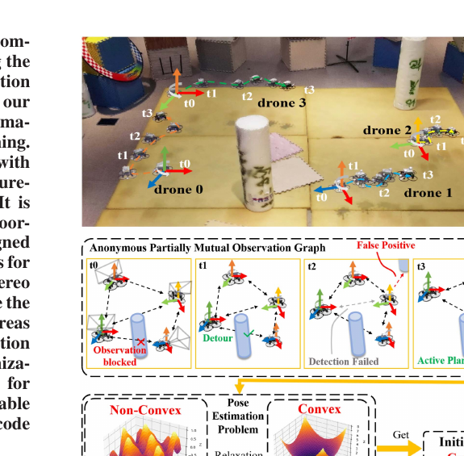
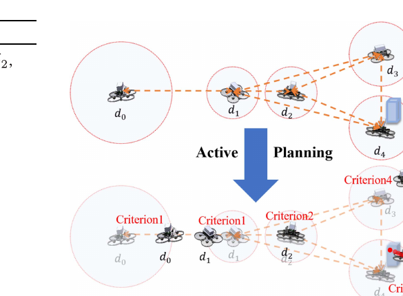
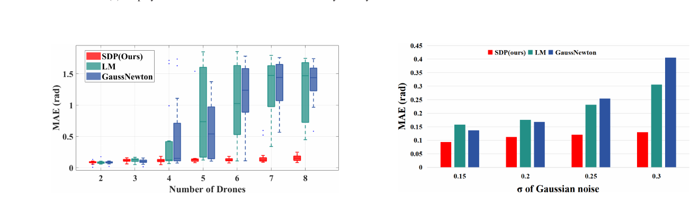
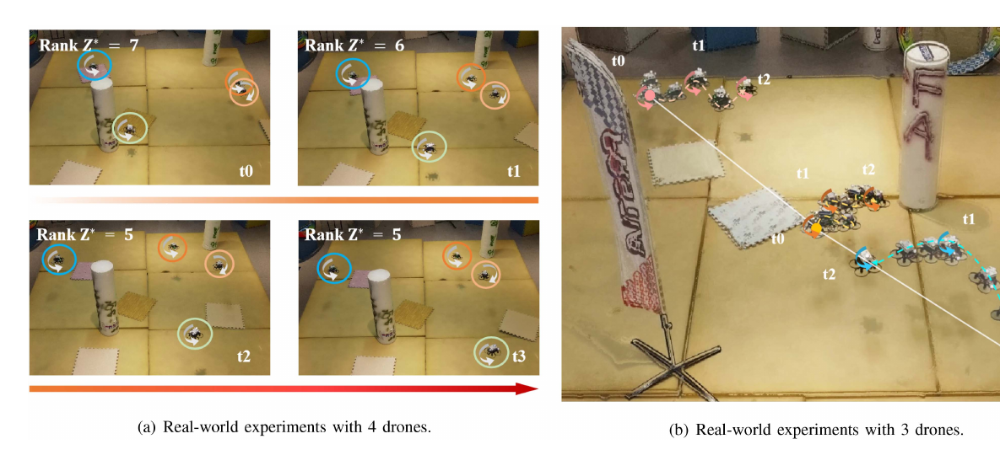

# 《FACT: Fast and Active Coordinate Initialization for Vision-Based Drone Swarms》中文详解

> 中文题名：FACT：面向视觉无人机集群的快速主动坐标系初始化  
> 作者：Yuan Li、Anke Zhao、Yingjian Wang、Ziyi Xu、Xin Zhou、Chao Xu、Jinni Zhou、Fei Gao  
> 发表：IEEE Robotics and Automation Letters，第 10 卷第 2 期，2025 年 2 月，页 931–938  
> DOI：10.1109/LRA.2024.3518101  
> 开源代码：[ZJU-FAST-Lab/FACT-Coordinate-Initialization](https://github.com/ZJU-FAST-Lab/FACT-Coordinate-Initialization)  
> [原始 PDF](../FACT%20Fast%20and%20Active%20Coordinate%20Initialization%20for%20Vision-Based%20Drone%20Swarms.pdf) ｜ [其他论文总览](README.md)

## 1. 一句话结论

FACT 解决的是无人机集群“刚启动、还没有共同坐标系”时的相对位姿初始化：每架约 300 克的无人机只用双目灰度相机和惯性测量单元，检测周围无人机并获得方向与距离；检测结果不带机器人身份，视线又会被障碍物遮挡。系统把视觉惯性里程计和这些匿名观测汇总，先用半定规划稳定求相对旋转，再用匈牙利算法匹配身份并恢复相对平移；若观测还不够，机器人会在互不相交的安全球内主动移动，改变队形、寻找新视角和避开障碍。

这篇论文的重要性在于，它不是孤立的数学求解器，而是把视觉检测、匿名数据处理、凸优化、主动观测、避障和真机执行组成完整初始化闭环。

*图：无人机主动移动形成多轮匿名、部分互视观测；非凸相对位姿问题经对偶半定松弛得到全局解并完成初始化。来源：原论文 Fig. 1，PDF 第 1 页。*

## 2. 为什么“初始化”是集群协作的第一道门槛

### 2.1 每台无人机一启动，坐标系都不一样

视觉惯性里程计可以估计无人机相对自身起点的运动，但每架无人机都把自己的起点当原点，水平方向也各自定义。A 机的 `(1,0,0)` 和 B 机的 `(1,0,0)` 并不是同一个物理位置和方向。

多机编队、避碰、协同探索前，需要先求出每个局部坐标系相对某个参考机的旋转和平移。这个首次对齐过程就是坐标系初始化。初始化错误会把后续所有队友轨迹都放错位置，直接导致碰撞或任务失败。

### 2.2 为什么不用全球卫星导航或动作捕捉

室内、洞穴、密林等环境没有可靠全球卫星导航信号，动作捕捉系统只能覆盖专门实验场。微型无人机又受尺寸、重量和功耗限制，难以给每架机增加全向激光雷达、超宽带测距或巨大身份标签。

论文选择的最小传感器组合是双目相机加惯性测量单元：

- 双目相机同时提供检测框、视线方向和深度；
- 惯性测量单元提供重力方向；
- 视觉惯性里程计提供每架无人机相对自身初始坐标系的运动。

### 2.3 视觉互相看有六个实际困难

论文在引言中归纳的困难可以用白话表述为：

1. 小飞机算力和载荷有限；
2. 检测框只说明“那里有一架无人机”，不告诉它是几号机；
3. 相机视场和检测距离有限；
4. 障碍物和队友会遮挡，观测图不完整；
5. 视觉、深度和里程计都有噪声，机器人越多状态维度越高；
6. 为积累不同视角必须移动，但初始化尚未完成，机器人还不知道其他机器人的公共坐标位置，移动本身存在互撞风险。

FACT 同时处理这六个问题。

## 3. 发表时的通用做法与不足

| 路线 | 常见做法 | 优点 | 不足 |
|---|---|---|---|
| 基于共同环境特征 | 多机交换图像特征或地图，通过跨机回环求相对位姿 | 环境纹理好时约束丰富 | 通信、计算量大；弱纹理和重复纹理环境容易退化 |
| 带身份测距/方位 | 用超宽带或视觉标签直接知道被观测机器人身份 | 数据关联简单，滤波容易实现 | 需要额外硬件或明显标签；大规模系统部署复杂 |
| 匿名扩展卡尔曼/粒子滤波 | 同时维护多个身份假设并递推状态 | 可持续在线更新 | 对初值敏感；粒子数和假设数随规模增长，微型机算力压力大 |
| 局部非线性优化 | 用 Gauss–Newton 或 Levenberg–Marquardt 求旋转 | 实现成熟、好初值下快速 | 原问题非凸，机器人多、观测不完整或噪声大时容易落入局部极小 |
| 预定义/随机运动采集观测 | 让机器人按固定轨迹或随机控制移动 | 实现简单 | 初始化前无法可靠互避，可能撞队友或障碍物；也可能采到重复、退化视角 |
| FACT | 匿名观测求和消去身份；半定松弛求旋转；二分图匹配求平移；主动安全移动补观测 | 从估计到运动形成完整闭环，对初值不敏感 | 需要成对互视假设、可靠双目深度和全机数据交换；对旋转对称队形仍有挑战 |

论文指出相关匿名滤波方法没有开放代码且结构复杂，因此实验中的直接基线是对同一个旋转目标函数使用 Gauss–Newton 和 Levenberg–Marquardt，而不是声称对所有既有滤波方法都做了实测比较。

## 4. 输入、输出和关键假设

### 输入

对每架无人机，系统使用：

1. 双目灰度和深度图；
2. 惯性测量单元数据；
3. 视觉惯性里程计给出的多时刻本地旋转和平移；
4. 视觉检测产生的匿名三维相对向量；
5. 无线网络交换的全队观测和里程计；
6. 单机避障规划器所需的环境障碍信息。

### 输出

- 每架无人机相对参考机的三维旋转；
- 每架无人机相对参考机的三维平移；
- 观测与真实机器人身份之间的匹配；
- 初始化尚未完成时，下一观察位置和无碰撞轨迹。

### 必须理解的互视假设

FACT 的旋转建模依赖：如果 A 的一次扫描观测到 B，B 在对应扫描中也观测到 A，两个三维观测向量在统一坐标系后应方向相反、和为零。

作者通过所有机器人原地旋转 360°、使用相同检测设备并设定统一有效探测距离来满足“每一条已有边成对互视”。与此同时，并非所有机器人对之间都有观测，所以整个网络仍是部分互视/部分连接的。它不是“单向观测也可直接进入匿名求和”的算法。

## 5. 六个系统模块

论文把系统分为六部分：

1. 自定位：由双目/惯性生成视觉惯性里程计；
2. 单机运动规划：前往下一观察点并避障；
3. 飞行控制：跟踪轨迹；
4. 视觉观测：检测无人机并生成方向和距离；
5. 相对位姿估计：先旋转后平移；
6. 主动规划：观测不足时决定下一步怎样安全移动。

运行顺序是：原地 360° 扫描 → 交换观测和里程计 → 检查信息是否足够 → 足够则求相对位姿，不足则生成观察点 → 单机规划与控制移动 → 再扫描，直到完成。

## 6. 视觉观测怎样生成

### 6.1 检测网络

作者在真实采集的自定义数据集上微调 YOLOv8n。网络输入由深度和灰度组合：灰度通道复制以适配常见三通道输入格式。选择轻量网络是为了适配尺寸、重量、功耗受限的无人机。

### 6.2 跟踪不是身份识别

BoT-SORT 在连续图像中把同一检测目标暂时串成轨迹，用于统计本轮扫描看到了多少架无人机。这个跟踪编号只是当前图像流中的索引，不是真实机器人身份。跨机器人坐标系的数据关联仍由后面的几何匹配解决。

### 6.3 从二维框得到三维向量

系统在检测框内筛选有效深度并计算平均值，再把检测框中心通过相机模型反投影为三维向量。这个向量同时包含：

- 方向，即目标在相机的哪个方位；
- 长度，即双目估计的目标距离。

系统没有做全图稠密三维重建来识别队友，而是只在检测框内取深度，降低计算量。

## 7. 旋转估计：匿名观测为何还能相消

### 7.1 成对观测的几何关系

若无人机 y 看见 z，得到从 y 指向 z 的三维向量；z 同时看见 y，得到相反方向的向量。把二者都用视觉惯性里程计和待求坐标系旋转变换到同一参考系后，理想情况下两向量之和为零。

### 7.2 用“全体求和”绕过身份未知

普通做法先问每个检测框对应哪架机器人，再建立成对误差。FACT 利用互视向量成对抵消的性质：在同一时刻，把所有机器人看到的所有三维向量变换到同一参考系后直接求和。无论每条观测具体属于谁，只要每对互视都完整，真值下总和应为零。

因此，身份排列被求和操作消掉，旋转估计阶段不需要先做组合爆炸的数据关联。

### 7.3 多时刻最小二乘

真实数据含视觉和里程计噪声，总和不会严格为零。论文把每个时刻的向量和作为误差，对所有观察时刻的平方误差求和，待求变量是所有无人机局部初始坐标系相对参考机的旋转。

### 7.4 从三维旋转降到只求偏航角

惯性测量单元可以用重力对齐横滚角和俯仰角；视觉惯性系统主要缺少全局水平偏航。因此 FACT 不必在完整三维旋转群上优化，只需求每架机绕竖直轴的二维旋转。

这样拼接旋转矩阵的尺寸从 `3 × 3N` 降为 `2 × 2N`，提升后的半定矩阵从 `3N × 3N` 降为 `2N × 2N`，显著减少机载求解负担。

### 7.5 对偶半定松弛

偏航旋转仍受正交约束，原问题非凸。论文引入 Gram 矩阵

$$
\Gamma=\Xi^\mathsf{T}\Xi,
$$

把目标写为 `tr(ΛΓ)`，并约束 Γ 半正定、每个对角块为二阶单位阵，得到标准半定规划。论文沿用 SE-Sync 类同步问题的对偶半定松弛，把原非凸旋转估计转到凸集合上求解。

求得 Γ 后做奇异值分解恢复各机偏航角，再与惯性测量单元给出的横滚/俯仰组合成三维旋转。论文采用的充分信息判据是 `rank(Γ*) ≤ N+1`；秩过高意味着还需更多有效观察。

“凸问题有全局最优”指对松弛问题而言。工程上仍要检查松弛秩条件，不能只看到求解器收敛就认定原旋转已唯一恢复。

## 8. 平移估计：从二分图匹配到观测链

旋转确定后，来自两台互视无人机的三维向量变换到同一坐标系时应互为相反数。FACT 为某个观察机建立代价矩阵：

- 行：该机看到的匿名观测；
- 列：其他所有机器人的观测；
- 元素：一对候选观测在统一旋转后，向量和的欧氏范数。

在“一条观测只匹配一个对应观测”的约束下，这变成最小权二分图匹配，用匈牙利算法求解。匹配完成后，就知道某条匿名向量对应哪台无人机，并可直接得到有观测机器人之间的相对平移。

由于整体图只是部分连接，参考机未必直接看到所有成员。系统在匹配图上用深度优先搜索寻找观测链，例如 `x → y → z`，再把链上相对平移和旋转逐段组合，得到 x 到 z 的平移。

因此 FACT 的“先旋转、后平移”不是任意拆分：平移匹配代价高度依赖旋转对齐是否正确，旋转失败会传导到身份匹配和平移。

## 9. 主动安全规划

### 9.1 初始化前怎样避免机器人互撞

虽然还没有公共坐标系，每台机器人能在本地扫描中测得最近队友距离 `d_min`。若每台机器人只在以自身为中心、半径不超过 `d_min/2` 的球内移动，各球互不相交。

考虑轨迹跟踪误差，论文实际取移动半径

$$
d_r=0.4d_{min},
$$

留出额外余量。然后单机规划器负责绕开静态障碍物。

### 9.2 四条选择下一观察点的准则

1. 视场边缘存在目标：朝最接近丢失风险的目标方向移动，尽量保持可见；
2. 附近机器人过密：随机上升或下降，在保持离地安全距离的同时降低碰撞风险；
3. 以上均不满足：相对最近机器人方向向左或向右 90° 移动，改变队形并产生新观测几何；
4. 以小概率选择当前没有机器人出现的新方向，尝试发现尚未连入观测图的成员。

若目标点落在障碍物中，系统缩短移动距离进行微调，再由单机避障规划器生成安全轨迹。

*图：不同无人机分别因视场边缘、局部拥挤、侧向改队形和随机探索选择下一观察点；d4 的目标落在障碍物内，因此被微调。来源：原论文 Fig. 4，PDF 第 6 页。*

## 10. 实验与量化效果

### 10.1 仿真比较

作者对 2–8 架随机初始化无人机分别进行 20 次试验，环境含障碍物，并对视觉观测和视觉惯性里程计加入噪声。比较方法是：

- FACT 的半定规划；
- Levenberg–Marquardt 局部优化；
- Gauss–Newton 局部优化。

Fig. 6 显示，2–3 架时三种方法误差接近；规模增加、观测更不完整后，局部方法的平均绝对旋转误差和离散程度迅速增大，而 FACT 维持较低误差。Fig. 7 的四机噪声试验也显示，噪声增加时 FACT 的误差增长慢于两种局部方法。

原论文 Table I 给出旋转估计时间：

| 无人机数量 | FACT 半定规划 | Levenberg–Marquardt | Gauss–Newton |
|---:|---:|---:|---:|
| 2 | 0.004 s | 0.005 s | 0.012 s |
| 4 | 0.021 s | 0.084 s | 0.081 s |
| 6 | 0.109 s | 0.408 s | 0.388 s |
| 8 | 0.253 s | 2.043 s | 3.434 s |

这里时间只对应旋转估计，不含视觉检测、飞行采样、平移匹配和通信。FACT 的优势随规模增加而明显，但论文只测到 8 架，不能直接外推到几十或上百架。

*图：左侧为 2–8 架无人机各 20 次试验的旋转平均绝对误差箱线图；右侧为四机在不同高斯噪声下的误差。来源：原论文 Fig. 6–7，PDF 第 7 页。*

### 10.2 真机平台

每架无人机约 300 克，只使用双目灰度相机和惯性测量单元作为里程计与互相观测传感器，机载计算平台为 Nvidia Orin NX。实验在无全球卫星导航信号、含随机障碍物的室内区域进行，测试 2–4 架无人机；NOKOV 动作捕捉系统只用于获得旋转真值和评估误差，不参与算法初始化。

论文对 FACT 和两种局部优化方法分别测试 4 次。Fig. 8 表明 3、4 架时 FACT 在旋转误差和耗时上均更好。平移阶段的匈牙利算法耗时约 0.4 ms，因此在论文规模下可实时完成匹配。

### 10.3 秩如何随主动观测变化

四机实验 Fig. 5(a) 给出决策矩阵秩随观察增加的序列 7 → 6 → 5 → 5。第三次观察时到达 `N+1=5` 的判据；第四次观察不再降低秩，但能利用额外数据减小噪声影响。

### 10.4 旋转对称队形

三架无人机等间距共线时，匿名观测可能存在旋转对称的多解。一次真机实验中，其中一架无人机恰好触发第 4 条随机探索准则，主动移动打破对称，最终成功初始化。

这是一个有价值的案例，但不能理解为已从理论上解决所有对称退化。论文结论明确把改进主动规划以处理旋转对称列为未来工作。

*图：左侧四机多轮主动观测使矩阵秩收敛到 N+1；右侧三机从等间距共线的旋转对称队形中移动并完成初始化。来源：原论文 Fig. 5，PDF 第 7 页。*

## 11. 核心创新

1. **匿名观测求和。** 通过互视向量全体相消，在旋转估计前不必枚举机器人身份排列。
2. **旋转估计凸化。** 借助重力对齐降到偏航角同步，再用对偶半定松弛获得稳定的全局优化求解。
3. **旋转和平移分阶段。** 旋转解出后，身份和相对平移变成二分图匹配；间接成员通过图搜索连接。
4. **把可观测性不足反馈到运动。** 用矩阵秩判断是否继续采集，而不是固定采几帧就结束。
5. **初始化阶段也考虑安全。** 无共同坐标系时用局部最近距离构造互不相交安全球，再配合障碍物规划。
6. **轻量真机闭环。** 双目灰度相机、惯性测量单元和 Orin NX 即完成检测、估计、主动飞行与避障。

## 12. 局限与适用边界

### 12.1 互视配对假设很关键

匿名求和依赖已有观测成对出现。如果 A 检出 B、B 因遮挡或漏检没有检出 A，未抵消向量会污染旋转误差。论文用 360° 扫描、相同传感器和统一有效距离提高互视性，但真实强遮挡环境仍可能违反假设。

### 12.2 深度质量决定平移质量

检测框平均深度可能混入背景、桨叶空洞或遮挡物。距离偏差会影响互视向量抵消和后续平移匹配。论文没有覆盖雨雾、强光、透明障碍等双目深度困难条件。

### 12.3 平移依赖旋转和图连通

旋转误差会改变二分图代价矩阵，导致身份错配；参考机与某成员之间若没有任何观测链，深度优先搜索也无法恢复平移。

### 12.4 半定规划的规模仍会增长

降到 `2N × 2N` 已显著减负，但它不是常数复杂度。论文仿真最多 8 架，真机最多 4 架；更大集群还需验证求解时间、内存和无线数据交换。

### 12.5 对称退化尚未系统解决

随机探索在一个三机案例中恰好破坏对称，但不是对所有对称构型的确定性保证。论文也把这点列为未来方向。

### 12.6 它解决初始化，不等于完整持续定位

FACT 给出初始坐标系关系。长时间飞行后视觉惯性里程计继续漂移，仍需持续的相对状态估计或重初始化机制。

### 12.7 安全球依赖最近距离和执行精度

`0.4 d_min` 为互撞留有几何余量，但若最近距离测量异常、通信不同步、目标更新异步或轨迹跟踪误差过大，实际安全仍需底层紧急避碰兜底。

## 13. 复现提示

1. 直接从作者开源仓库和论文公开统计入手，确认 MOSEK Fusion C++ 接口与模型版本；半定求解器的许可证和数值容差会影响部署。
2. 先用真值三维观测验证匿名向量求和和旋转估计，再接入 YOLOv8n、BoT-SORT 和真实双目深度，逐层隔离误差。
3. 必须区分 BoT-SORT 轨迹编号和机器人真实身份，不能把短时跟踪编号误当作最终数据关联。
4. 记录每轮扫描中每对机器人的双向检测情况。发现单向边时应丢弃、补扫或加鲁棒权重，不能无条件送入互视相消模型。
5. 标定左右相机、相机—惯性测量单元外参和每机坐标轴；多机间无需共享绝对偏航，但重力方向和时间戳必须可靠。
6. 同时监测半定矩阵特征值、秩、旋转残差和匹配代价。秩达到判据后也可再采一轮，论文 Fig. 5 表明冗余观测有助于抗噪。
7. 做对称性单元测试：等距直线、规则多边形、镜像构型都应测试；不要依赖随机准则每次都幸运地打破退化。
8. 真机安全上，把 `0.4 d_min` 之外的控制误差、机体半径和通信延迟纳入额外裕量，并保留紧急悬停/降落策略。
9. 对比局部优化时应使用同一目标函数、观测和停止条件。论文的 Gauss–Newton、Levenberg–Marquardt 结果不能代表所有可能的滤波或全局方法。

## 14. 外行阅读抓手

可以把 FACT 想成陌生人闭眼前先排队认位置：

- 每个人只看得到若干其他人，而且暂时叫不出名字；
- 两个人互相指向对方时，两根箭头方向相反；把全场所有箭头放到同一方向系里相加，正确朝向下会互相抵消；
- 先由这个“全场箭头和”对齐大家的朝向；
- 朝向对齐后，再找哪两根箭头最像一对相反向量，相当于把匿名观测配上身份；
- 若信息还不够，大家只在各自不会相撞的小范围内换位置，再看一轮；
- 直到数学上的秩指标说明坐标系已经可以恢复。

## 15. 核验依据

- 任务、六项挑战、相关方法与贡献：原论文第 1–3 页；
- 六模块系统循环和视觉观测生成：第 3 页；
- 匿名旋转建模与半定松弛：第 3–5 页，式 (1)–(10)；
- 二分图平移匹配与图搜索：第 5 页，式 (11)–(12)、Fig. 3；
- 主动安全规划：第 5–6 页，Algorithm 1、Fig. 4；
- 仿真时间、误差与抗噪：第 6–7 页，Fig. 6–7、Table I；
- 真机平台、0.4 ms 匹配、秩和对称案例：第 7–8 页，Fig. 5、Fig. 8。
