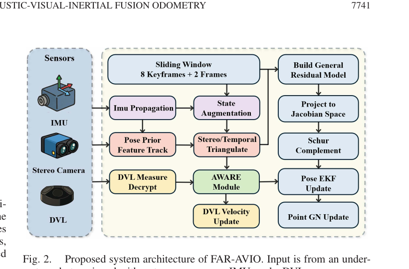
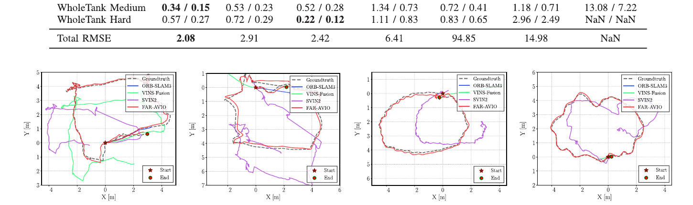
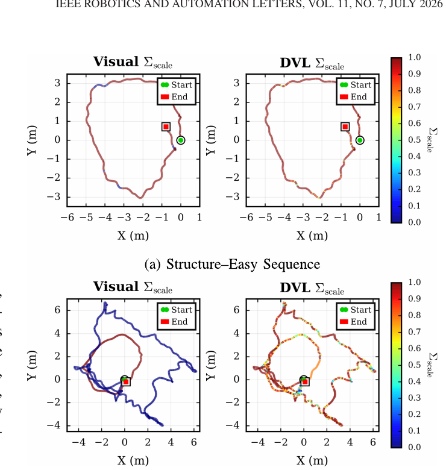

# FAR-AVIO：快速鲁棒的声学—视觉—惯性融合里程计与在线标定

> **原文信息**
> - 英文题目：*FAR-AVIO: Fast and Robust Schur-Complement Based Acoustic-Visual-Inertial Fusion Odometry With Sensor Calibration*
> - 作者：Hao Wei、Peiji Wang、Qianhao Wang、Yang Gu、Tong Qin、Fei Gao、Yulin Si
> - 期刊：*IEEE Robotics and Automation Letters*，第 11 卷第 7 期，2026 年 7 月
> - DOI：[10.1109/LRA.2026.3688065](https://doi.org/10.1109/LRA.2026.3688065)
> - 本地原始论文：[FAR-AVIO Fast and Robust Schur-Complement Based Acoustic-Visual-Inertial Fusion Odometry With Sensor Calibration.pdf](../FAR-AVIO%20Fast%20and%20Robust%20Schur-Complement%20Based%20Acoustic-Visual-Inertial%20Fusion%20Odometry%20With%20Sensor%20Calibration.pdf)
> - 页码说明：下文按本地 PDF 从 1 开始计页；对应期刊页码为 7740—7747。

## 1. 一句话先讲明白

FAR-AVIO 把双目相机、惯性测量单元和水下多普勒计程仪紧密融合：用舒尔补在卡尔曼滤波器内消去大量三维地图点，尽量保留多视角几何信息却不让计算量爆炸；同时在线判断相机和声学测速是否可信，并校准惯性单元与多普勒计程仪的安装关系。

它想解决的核心矛盾是：**图优化定位通常精确但重，滤波定位通常快但容易丢掉点级约束；水下机器人既需要精度，也没有无限算力。**

## 2. 为什么水下定位特别难

地面机器人可以用卫星定位，水下机器人通常收不到卫星信号；外部基站也不一定存在。因此机器人需要靠自身传感器估计“我在哪里、朝向哪里、速度多大”。这类随时间积分的位置估计叫里程计。

相机与惯性测量单元在陆地和空中很常见，但水下有几种特殊困难：

1. **光衰减和照明不均。** 画面变暗、颜色衰退，同一个物体在不同距离看起来差别很大。
2. **水体浑浊和海洋雪。** 悬浮颗粒造成散射和大量移动亮点，视觉特征可能持续几十秒甚至数分钟不可靠。
3. **弱运动激励。** 水下机器人常平稳、缓慢地移动，加速度计信号相对噪声太弱，惯性偏差和初始化不易估准。
4. **安装误差会进入速度融合。** 多普勒计程仪与惯性单元之间的旋转、平移只要有误差，就会把正确的声学速度投到错误方向。
5. **嵌入式算力和功耗有限。** 机器人还要运行控制、通信和任务算法，定位后端不能独占处理器。

多普勒计程仪（Doppler Velocity Log，简称 DVL）向海底或水体发射声波，根据回波频率变化测量沿波束方向的速度。它不依赖可见光，正好可以在相机退化时补位；但底锁丢失、散射或水流也会让它出现噪声和离群值。

## 3. 发表时的通用方案

| 路线 | 典型处理方式 | 优点 | 局限 |
| --- | --- | --- | --- |
| 纯视觉或视觉—惯性里程计 | 跟踪图像特征，以惯性信息补足短时运动 | 相机小、成本低，成熟开源系统多 | 水下长期无纹理、浑浊和弱惯性激励会导致漂移或跟踪失败 |
| 松耦合声光融合 | 把 DVL 已算好的三维速度当作外部速度先验 | 接入简单、计算较轻 | 没有从底层波束和联合几何建模，传感器间信息利用不足 |
| 紧耦合因子图 | 把位姿、偏差、地图点、声学量测放入大图联合优化 | 能充分利用多帧和多传感器约束，精度高 | 非线性迭代开销大，嵌入式实时运行困难 |
| 传统滤波融合 | 用扩展卡尔曼滤波更新位姿和速度 | 更新快、内存可控 | 常把视觉压成低维位姿/速度，不能完整利用所有点级多视角约束 |
| **FAR-AVIO** | 固定滑窗 + 舒尔补等效视觉残差 + DVL 波束模型 + 在线健康评估和外参标定 | 尝试兼得点级几何、固定维状态与较低计算量 | 实现更复杂；性能依赖传感同步、运动可观测性和健康评分设计 |

论文与 AQUA-SLAM 等图优化方法的关系不是“完全不同的传感器”，而是使用相近的视觉、惯性和 DVL 信息，却把后端改成适合固定维滤波更新的形式。

## 4. 输入、输出和系统信息流

### 4.1 输入传感器

- **双目相机**：提供左右图像以及跨时间、跨相机的特征观测。
- **惯性测量单元**：提供加速度和角速度。
- **DVL**：四个不同方向的换能器提供单波束多普勒速度。

### 4.2 内部状态

滤波状态包含位置、速度、姿态、加速度计零偏、陀螺仪零偏，以及相机和 DVL 相对机体的外参。系统维护固定大小的滑动窗口；原文 Fig. 2 标为 8 个关键帧加 2 个普通帧。

### 4.3 输出

- 机器人连续的三维位置、速度和姿态；
- 惯性传感器偏差；
- DVL 与惯性单元之间的外参估计；
- 经过更新的三维视觉路标点，可用于稠密重建或后续任务。

*图：双目相机、惯性测量单元和 DVL 进入固定滑窗；视觉残差经雅可比投影和舒尔补后更新位姿，DVL 经 AWARE 可靠性判断后更新速度。来源：原论文 Fig. 2，PDF 第 2 页。*

## 5. 完整算法流程

1. 高频惯性数据传播当前位置、速度和姿态，并同步传播误差协方差。
2. 用惯性预测的相机位姿帮助下一帧图像跟踪，减轻快速运动和模糊影响。
3. 新帧到来后决定是否成为关键帧；固定窗口满时移除旧帧。
4. 汇总同一三维路标在多个关键帧中的像素重投影误差。
5. 把误差投影到雅可比空间，用舒尔补消去三维路标增量，得到只依赖滤波状态的等效观测。
6. 执行扩展卡尔曼滤波位姿更新；再用轻量的高斯—牛顿步骤更新每个路标点。
7. 从四个 DVL 波束恢复三维速度及其协方差，考虑 DVL 安装旋转、杠杆臂和机体角速度，形成速度残差。
8. AWARE 在线健康模块评估视觉与 DVL 的当前质量，缩放其测量噪声，严重退化时暂时门控掉该传感器。
9. 在运动提供足够信息时，滤波器同时收敛 DVL—惯性单元外参。

## 6. 关键技术的白话解释

### 6.1 误差状态扩展卡尔曼滤波

机器人姿态是旋转，不能像普通三维向量那样随意相加。误差状态滤波保存一个完整的“名义状态”，只让卡尔曼滤波估计它附近的小误差，例如“位置还差几厘米、朝向还差一点角度”。更新后把小误差注入名义状态，再把误差归零。这种做法适合旋转空间，也方便处理惯性传播。

### 6.2 为什么地图点会拖慢滤波器

每个图像特征都对应一个三维路标。如果把几百上千个路标全部塞进滤波状态，协方差矩阵会快速变大，更新代价随状态维度升高。简单滤波器常选择不保留这些点，只把视觉前端压成相对位姿；代价是多帧对同一点的细粒度约束被损失。

FAR-AVIO 先写出所有观测的线性化关系：像素误差同时由“机器人状态误差”和“路标位置误差”造成。然后做两步降维：

1. 把观测投影到由状态雅可比和路标雅可比张成的空间，得到等效观测与相应噪声；
2. 用舒尔补代数消元，消去路标误差，只留下与机器人状态有关的等效残差。

白话类比：多张照片都在讨论“相机站错了位置”还是“墙上的点标错了位置”。舒尔补先把“如果墙点怎样调整”在数学上消掉，浓缩成只针对相机状态的一组证据，再交给滤波器。信息被重新表达，而不是简单删掉观测。

更新机器人位姿后，系统再单独对每个路标做一次轻量高斯—牛顿更新，避免地图与新位姿不一致。固定大小滑窗和路标独立性共同使更新开销不随全程地图无限增长。

### 6.3 DVL 为什么从四束声波得到三维速度

单个换能器只测到速度在自己波束方向上的投影。标准 Janus 布局用四束非共面的声波，从四个标量建立一个超定线性方程；已知波束方向后，用最小二乘恢复三维速度。原文还从每束噪声推导了三维速度协方差，而不是把 DVL 输出当成完全准确的黑盒。

预测 DVL 读数时，不能只旋转机体中心速度。DVL 与惯性单元相隔一段距离，机体转动会让 DVL 安装点产生额外线速度，因此论文模型包含“角速度叉乘杠杆臂”这一项。它也是在线估计外参有价值的原因。

### 6.4 AWARE：坏传感器不能把其他传感器一起拖垮

AWARE 是 Adaptive Weight Adjustment and Reliability Evaluation，即“自适应权重调整与可靠性评估”。对视觉，它参考特征跟踪统计与重投影误差；对 DVL，它参考速度一致性和残差。每类传感器维护近期不健康事件队列和可靠性尺度：

- 质量正常时，尺度接近 1，按名义权重融合；
- 质量下降时，增大等效不确定性，让该传感器对结果影响变小；
- 严重异常时，暂时拒绝该次更新。

这不是事后把轨迹“平滑一下”，而是在每次融合前决定该信谁。

### 6.5 视觉前端也针对水下和大视差做了处理

系统检测 Shi—Tomasi 角点，以金字塔 Lucas—Kanade 光流做时间跟踪，并用惯性预测位姿作为初值。双目匹配时只在极线附近的小窗口搜索，这对长基线双目尤其重要：左右图视差大，完全无约束的光流容易跑错。

## 7. 实验平台、基线与结果

### 7.1 数据与评价方式

论文使用公开 Tank 数据集的 8 个序列，包含同步双目、惯性、DVL 和深度数据。轨迹分为 Structure、HalfTank、WholeTank 三类，并按速度、光照和无纹理区域分为不同难度。真值由安装在水下结构上的 AprilTag 标记和 TankGT 流程生成（PDF 第 5 页）。

对比方法包括 AQUA-SLAM、UVA-SLAM、SVIN2、ORB-SLAM3 和 VINS-Fusion。各方法使用相同的相机/惯性内参与外参，并按方法能力运行双目—惯性或双目—惯性—DVL配置。评价是与真值对齐后的绝对平移误差均方根。

### 7.2 定位精度

FAR-AVIO 在 8 个序列均完成运行，误差均方根依次为 0.11、0.16、0.13、0.19、0.33、0.25、0.34、0.57 米（PDF 第 6 页，Table I）。它不是每个序列都第一，例如 AQUA-SLAM 在 WholeTank-Hard 为 0.22 米，优于 FAR-AVIO 的 0.57 米；但 FAR-AVIO 在各序列通常排名第一或第二，纯视觉—惯性方法在困难序列出现米级漂移或失败。

Structure-Hard 上，FAR-AVIO 为 `0.13 ± 0.04 m`，AQUA-SLAM 为 `0.50 ± 0.24 m`，相对降低约 74%。论文表中“Total RMSE”一行 FAR-AVIO 为 2.08，AQUA-SLAM 为 2.42；应把它理解为作者表格定义下的汇总值，不应擅自当成单序列平均误差。

*图：四个代表序列中不同方法轨迹与真值的对比；红色 FAR-AVIO 轨迹总体更贴近虚线真值，部分纯视觉—惯性基线明显漂移。来源：原论文 Fig. 4，PDF 第 6 页。*

### 7.3 运行时间和资源

运行负载先在 AMD Ryzen 9 7950X、32 GB 内存桌面机上比较公开实现。嵌入式测试使用 NVIDIA Jetson Orin NX 8 GB：

| 模块 | VINS-Fusion | FAR-AVIO |
| --- | ---: | ---: |
| 视觉前端 | 27.69 ms | 20.21 ms |
| 视觉后端更新 | 33.76 ms | 6.08 ms |
| DVL 更新 | 无 | 0.78 ms |
| 其他 | 0.20 ms | 1.21 ms |
| **总计** | **61.65 ms，约 16 Hz** | **28.28 ms，约 35 Hz** |

数据来自 PDF 第 7 页 Table II。主要收益来自视觉后端：舒尔补滤波更新把 33.76 毫秒降到 6.08 毫秒。AQUA-SLAM 与 UVA-SLAM 没有进入这项运行时间实测；原文只说其 ORB-SLAM 风格后端的代价预计不低，因此不能把“预计”写成已经测得的速度结论。

### 7.4 AWARE 消融

在容易的 Structure-Easy 序列，相机和 DVL 可靠性尺度几乎都保持在 1；在浑浊、照明不均、特征缺失的 WholeTank-Hard 序列，视觉尺度显著下降，而 DVL 尺度仍接近 1，系统自动转向更依赖声学速度（PDF 第 7 页，Fig. 6）。

*图：容易序列中视觉和 DVL 均保持高置信；困难序列中视觉轨迹颜色转向低尺度，而 DVL 仍较稳定。来源：原论文 Fig. 6，PDF 第 7 页。*

Table III 所列 6 个 Tank 序列中，完整 FAR-AVIO 全部完成；去掉 AWARE 后只完成 Structure-Easy，其余标为跟踪失败或滤波发散。声学—惯性版本 FAR-AIO 在更难序列也有失败，说明“只依赖 DVL”并不是最终答案，多传感器互补和健康判断需要同时存在。

### 7.5 在线外参标定

数值仿真从单位变换、中等扰动和小扰动三种初值出发，DVL—惯性外参都向真值收敛。实测 Tank 数据中，标定使误差降低约 10%—25%；在更大外参扰动的仿真中，不标定时误差超过 3—9 米，标定后恢复到 0.124—0.574 米，汇总平均由 8.152 米降到 0.263 米（PDF 第 8 页，Table IV 及正文）。

论文也明确提醒：可靠标定需要足够的旋转激励。机器人近乎静止或只做平移时，外参收敛会很慢，此时最好给出合理的离线初值。

## 8. 创新点怎么理解

1. **不是简单把 DVL 速度接到现有视觉里程计后面。** 它从波束多普勒关系、几何恢复、协方差到杠杆臂残差完整建模。
2. **把舒尔补嵌入固定维滤波后端。** 在不把所有路标放进状态的前提下利用多视角点级约束，缩小图优化精度与滤波效率的差距。
3. **传感器健康管理进入紧耦合更新。** AWARE 根据实时质量调权和门控，使长期视觉退化不直接污染全部状态。
4. **联合在线校准 DVL—惯性外参。** 更换安装或初值较粗时，不要求专门的标定动作序列，但仍需要实际运动提供可观测性。

## 9. 局限与适用边界

- 实验集中在 Tank 数据集和水槽结构，没有证明在大范围开放海域、强水流、软质海床或长时间底锁丢失下同样有效。
- AprilTag 真值环境适合量化，但与无标记海底任务仍有差距。
- AWARE 的质量指标依赖视觉跟踪统计与 DVL 一致性；若两个传感器同时给出“看似一致但共同错误”的量测，健康评分未必能发现。
- 舒尔补基于线性化和当前估计。初值很差、视觉外点大量存在时，等效残差仍可能误导滤波器。
- 在线外参不是无条件可观测，尤其需要旋转运动；近静止或纯平移时应依赖较好的先验。
- 论文声称已开源完整实现，但正文没有给出仓库地址；复现前需通过论文项目页或作者公开渠道核对代码版本，不能仅凭“已开源”假设依赖环境。

## 10. 复现清单

1. **先做时间同步。** 相机、惯性和 DVL 延迟会直接表现成外参或速度残差，必须测量时间戳来源和队列延迟。
2. **从单波束数据开始核验。** 检查频移到径向速度的符号、声速设定、四束方向矩阵和各束噪声；不要只比较设备厂商最终三维速度。
3. **准确测量杠杆臂。** 先给 DVL—惯性平移和旋转一个合理初值，再让在线标定收敛。
4. **复现固定滑窗策略。** 新帧若是关键帧就边缘化最旧帧，否则丢弃倒数第二新帧；窗口管理错误会改变计算量和观测几何。
5. **逐模块核对残差。** 分别画视觉重投影残差、DVL 速度残差、AWARE 尺度和卡尔曼创新，避免只看最终轨迹。
6. **注入退化测试。** 人为遮挡相机、加入图像模糊、丢弃 DVL 波束和扰动外参，验证 AWARE 是否真的降权，以及恢复后是否平滑回到名义权重。
7. **按论文口径计时。** 前端、舒尔补视觉更新、DVL 更新和其他输入输出分别统计；桌面与 Orin NX 结果不能混用。
8. **评估可观测性。** 在包含多个方向旋转的轨迹上标定，再测试纯平移；若后者不收敛，这是可观测性限制，不一定是代码错误。

## 11. 外行读完应记住什么

FAR-AVIO 的价值不是“水下多装一个声纳就稳了”，而是展示了三件事必须一起做：**把不同传感器的物理量测建对、用合适的代数方法控制计算规模、在运行中识别哪个传感器正在变坏。**

它在公开水槽数据和嵌入式平台上给出了很强的精度—效率折中，但结论仍应限定在论文实验范围内。真正部署到海里时，时间同步、底锁质量、外参激励和多传感器同时退化仍是决定成败的工程问题。
