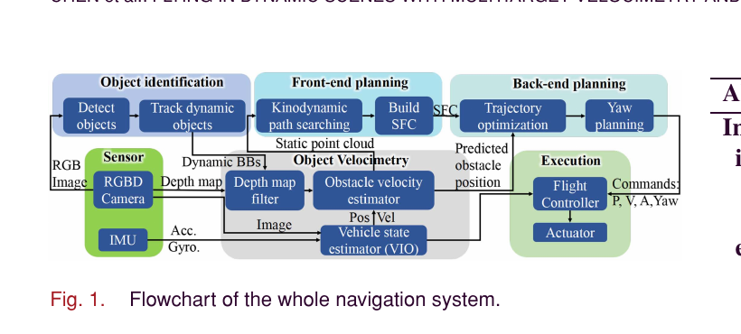
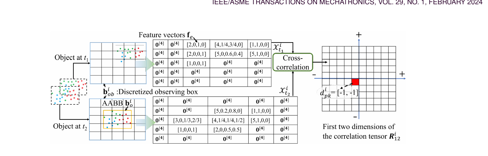
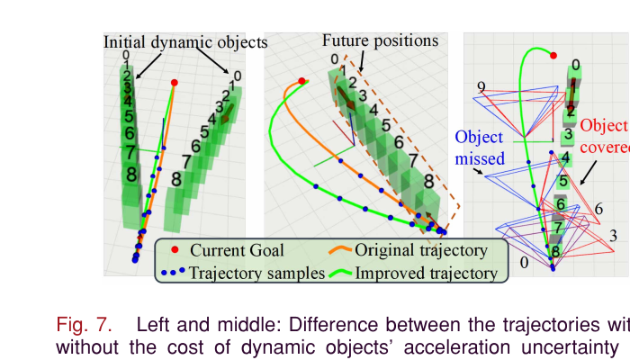
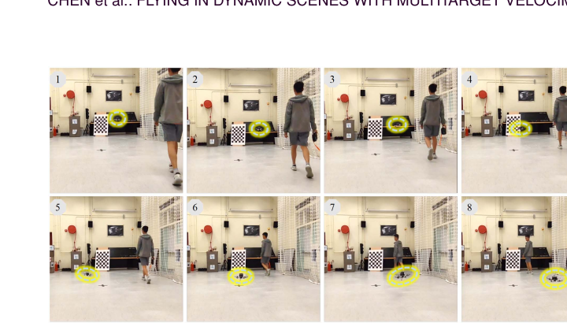

# 动态场景自主飞行：多目标测速与感知增强规划

> **原文信息**
> - 英文题目：*Flying in Dynamic Scenes With Multitarget Velocimetry and Perception-Enhanced Planning*
> - 作者：Han Chen、Chih-Yung Wen、Fei Gao、Peng Lu
> - 期刊：*IEEE/ASME Transactions on Mechatronics*，第 29 卷第 1 期，2024 年 2 月；在线发表时间为 2023 年 7 月
> - DOI：[10.1109/TMECH.2023.3289180](https://doi.org/10.1109/TMECH.2023.3289180)
> - 原文公开代码：[AutoFly-demo](https://github.com/chenhanpolyu/AutoFly-demo)
> - 本地原始论文：[Flying in Dynamic Scenes With Multitarget Velocimetry and Perception-Enhanced Planning.pdf](../Flying%20in%20Dynamic%20Scenes%20With%20Multitarget%20Velocimetry%20and%20Perception-Enhanced%20Planning.pdf)
> - 页码说明：下文按本地 PDF 从 1 开始计页；对应期刊页码为 521—532。

## 1. 一句话先讲明白

这项工作让一架只带单个彩色—深度相机和机载小电脑的四旋翼，在有人移动的未知环境中完成“识别人—持续跟踪—估计三维速度—预测未来占用—生成安全轨迹—主动转头继续看人”的完整闭环。

它的关键观念是：**规划不能只被动使用感知结果，也可以主动改变无人机偏航角，让摄像头持续看住最危险的移动目标，从而反过来提高测速和避障质量。**

## 2. 任务背景：为什么“看见行人”还不等于能安全绕开

低空航拍、跟拍和室内巡检中，无人机可能遇到行人、车辆和静态设施。遥控者既要取景又要躲障碍，很容易来不及反应，因此需要自主避障。

静态飞行在论文发表时已经有较成熟的局部地图、路径搜索和轨迹优化方案；动态环境仍难，原因包括：

1. **要先区分谁在动。** 深度图噪声、无人机自身位姿误差会让静态物体看起来在移动。
2. **同一个物体不同角度看见的点不一样。** 无人机移动后，行人点云的“可见表面中心”会变化；只比较两个点云中心，会把视角变化误当成物体运动。论文称之为 ego-occlusion，可理解为“自运动造成的可见部分变化”。
3. **恒速预测不可靠。** 行人会停、转向或因无人机靠近而改变动作，越往未来预测越不确定。
4. **单相机视场窄。** 无人机沿速度方向朝前看时，侧面接近的危险目标很快离开画面；目标一丢，速度估计就变差。
5. **微型机载电脑没有大图形处理器。** 检测、跟踪、点云计算、轨迹优化都要在中央处理器上实时运行。

## 3. 当时常见做法与本文选择

| 模块 | 常见做法 | 好处 | 主要不足 | 本文做法 |
| --- | --- | --- | --- | --- |
| 动静分类 | 从连续深度点云估速度，再按阈值分类 | 不依赖物体类别 | 深度噪声和自身定位误差易把静态物体判成动态 | 先用彩色图像类别先验识别人/车，再只对动态候选测速 |
| 目标检测跟踪 | 每帧运行深度检测网络并做检测关联 | 语义强、恢复方便 | 机载中央处理器负担大；密集目标的框重叠关联不稳 | 轻量检测器只在初始化或跟踪失败时运行，平时用快速相关滤波跟踪 |
| 三维速度 | 比较两帧点云中心，配卡尔曼滤波 | 实现简单 | 可见表面变化造成“伪位移” | 体素局部特征 + 三维互相关寻找最佳整体平移 |
| 动态规划 | 恒速预测 + 固定安全半径 | 计算直接 | 未来越远误差越大却仍按同一半径处理 | 用目标最大加速度让未来占用范围随时间扩大 |
| 相机视向 | 偏航始终对齐飞行速度 | 控制自然、适合向前看 | 侧后方目标容易离开画面 | 离散搜索未来偏航，奖励看见近距离动态目标并限制偏航跳变 |
| 轨迹优化 | B 样条或控制点碰撞代价 | 常见、实现成熟 | 时间分配可能需手工放松 | 安全走廊 + MINCO 多项式，联合优化空间与时长 |

事件相机、激光雷达或云台相机也能改善动态感知，但论文面向低成本微型平台，选择一个 Intel RealSense D435i 彩色—深度相机，不增加云台和高功耗图形处理器。

## 4. 系统输入、输出与完整闭环

### 4.1 输入

- 对齐的彩色图与深度图；
- 惯性测量单元的加速度和角速度；
- 视觉—惯性里程计给出的无人机位姿；
- 用户目标点和无人机动力学限制。

### 4.2 输出

- 每个动态目标的身份、类别、三维位置、速度和不确定性；
- 一条含位置、速度、加速度和时间分配的三维轨迹；
- 随轨迹变化的偏航角；
- 发给飞行控制器的位置、速度、加速度与偏航指令。

### 4.3 信息流

*图：彩色—深度相机与惯性数据同时服务于目标识别、目标测速、视觉—惯性定位和前后端规划，最终输出飞行指令。来源：原论文 Fig. 1，PDF 第 3 页。*

系统每轮大致执行：

1. 在彩色图上检测潜在动态类别，建立多个目标跟踪器。
2. 用二维框切出深度区域，得到每个目标的三维点云。
3. 将两帧目标点云转换为带局部颜色与点数特征的体素张量，通过互相关估计位移和速度。
4. 每个目标用卡尔曼滤波平滑，并在短暂遮挡时短期外推。
5. 静态点进入可复用局部地图；动态框内部和经过区域从静态地图中删除，避免留下“幽灵障碍”。
6. 混合 A* 搜索一条带时间的动力学可行路径，同时检查动态目标预测位置。
7. 由路径生成无静态障碍的凸安全走廊，再优化平滑轨迹和时间。
8. 根据未来轨迹、目标预测与相机视场单独规划偏航角。
9. 执行一段并持续做安全检查；只有旧路径不安全时才重跑较重的搜索或优化。

## 5. 感知部分详解

### 5.1 为什么“检测 + 轻量跟踪”适合小电脑

作者使用 YOLO-fastest-V2 做图像目标检测，并预先列出常见动态类别，例如行人和汽车。检测到后，用快速判别尺度空间跟踪器持续更新框。每个目标有唯一编号和类别标签。

检测器只在首次运行或任一跟踪器失效时再次调用；新检测框以交并比与现有目标关联。这样比每帧完整检测省计算，同时能在短时遮挡后恢复目标。原文报告：在双核四线程、2.9 吉赫兹中央处理器上，以 848×480 彩色图运行时，该模块占用约 5%—10% 中央处理器（PDF 第 3 页）。

代价是它依赖类别先验。没列入或检测器没学过的移动物体，可能不会进入动态测速管线。

### 5.2 三维互相关测速：不是追一个点，而是对齐两团结构

两帧深度图先按二维目标框分割，再转到世界坐标。对第二帧的每个目标建立三维轴对齐包围盒，并按目标在帧间可能的最大位移向外扩张成“观察盒”。两帧目标点都放进同一观察盒，离散成体素。

每个体素不只记录“有点/没点”，而是构造四维局部特征：

- 体素中的点数；
- 这些点归一化红、绿、蓝颜色的平均值。

这样，即使深度值轻微抖动，局部形状和颜色分布仍可帮助匹配。作者对两帧三维特征张量做快速傅里叶变换，计算互相关；相关峰的位置就是让两团局部结构最吻合的三维体素位移，再除以帧间隔得到速度。

*图：论文用二维简图解释实际三维算法；上下两组体素包含点数和平均颜色，互相关峰的索引给出目标位移。来源：原论文 Fig. 2，PDF 第 4 页。*

相比点云中心差，这种方法利用整个物体的形状和局部特征。当相机移动导致“这次看到左侧、下次看到右侧”时，几何结构对齐比质心更不容易产生假速度。

### 5.3 卡尔曼滤波负责平滑与短遮挡外推

每个目标按编号维护独立卡尔曼滤波器，状态至少包含位置和速度，以恒速模型预测。如果图像跟踪短暂中断，滤波器继续外推；目标重新出现后恢复观测更新。这里的恒速只是短期状态模型，规划阶段还会额外考虑加速度不确定性。

## 6. 规划部分详解

### 6.1 带视场软约束的混合 A*

前端搜索状态包含位置和速度，以加速度作为控制输入，所以路径天然带有时间和动力学信息。扩展每个节点时会：

- 查询静态点云最近距离；
- 用目标当前位置和速度预测该时刻的位置；
- 检查无人机速度上限；
- 判断候选点是否在相机视场内。

静态安全距离包含机器人/障碍物尺寸、控制跟踪误差和深度测量误差；动态安全距离还加上卡尔曼滤波位置不确定性。视场外不是硬禁止，而是增加较大代价：如果前方视场完全被挡，搜索器仍能短暂进入未知区域，不至于直接无解。

### 6.2 静态安全走廊和 MINCO 轨迹

搜索路径离散成关键点，随后用一串首尾相连、内部无静态点的凸多面体组成安全飞行走廊。轨迹采用五阶分段多项式，位置、速度和加速度在段连接处连续，因此姿态变化更平滑，能减少相机运动模糊。

MINCO 是 Minimum Control，即“最小控制代价”轨迹表示。优化变量不是每个密集采样点，而是段间状态和每段时间；目标同时包含：

- 控制能量；
- 总飞行时间；
- 超速、超加速度惩罚；
- 离开静态安全走廊的惩罚；
- 与动态目标未来占用重叠的惩罚。

最后使用有限内存 BFGS 梯度优化器求解空间和时间。

### 6.3 动态目标为什么需要“越来越大的未来盒子”

如果只按恒速预测，行人未来位置是一条线。论文给每类动态目标一个最大可能加速度；在预测时间 `Δt` 后，把恒速位置周围扩成半边长随 `最大加速度 × Δt² / 2` 增长的长方体。时间越远，盒子越大，表示“我越不确定他到底在哪里”。

碰撞代价在盒子中心附近更强、边缘更弱，梯度把无人机轨迹推离高概率区域。这里不是严格的概率分布学习，而是用先验最大加速度构造可计算的不确定区域。

### 6.4 主动偏航：为了看清危险，允许机身不完全朝着速度方向

作者先得到位置轨迹，再在多个未来时刻采样若干候选偏航角。每个候选角的得分包括：

- 有多少动态目标落入相机视场；
- 目标越近，额外得分越高；
- 与前一时刻偏航差越小越好；
- 超过最大偏航变化的连接直接不考虑。

把每个时刻的候选角当成分层图节点，用动态规划寻找累计得分最高的一串偏航角。它尤其照顾近距离危险目标，同时避免偏航突变干扰高度和姿态控制。

*图：左、中展示加入目标加速度不确定性后，轨迹离未来占用区域更远；右图比较原始蓝色视场与优化后红色视场，后者持续覆盖动态目标。来源：原论文 Fig. 7，PDF 第 10 页。*

## 7. 实验与量化效果

### 7.1 感知仿真

Gazebo 场景包含 6 个以 1.2—2.0 米/秒往复运动的人体模型，以及桌子、箱子、柱子等静态物体。深度截断为 8 米。作者分别测试相机悬停和沿 50 条人为保证静态无碰撞的轨迹移动（PDF 第 8—9 页）。

| 方法/设置 | 速度平均误差 | 位置平均误差 | 多目标跟踪准确率 |
| --- | ---: | ---: | ---: |
| 本文，静态相机 | 0.22 m/s | 0.12 m | 91.1% |
| 本文，移动相机 | 0.35 m/s | 0.14 m | 89.8% |
| 去掉图像检测跟踪，移动相机 | 0.45 m/s | 0.26 m | 77.3% |
| 既有方法 [5]，移动相机 | 0.49 m/s | 0.27 m | 74.5% |
| 既有方法 [4]，移动相机 | 0.51 m/s | 0.30 m | 70.6% |

数据来自 PDF 第 9 页 Table II。本文移动相机结果中的漏检率、误检率、身份错配率分别为 7.5%、0.3%、1.1%；禁用图像检测后，误检率升到 7.1%。

对 3 米内近距离目标，主动偏航时速度误差 0.43 米/秒、位置误差 0.18 米、多目标跟踪准确率 92.1%；不使用主动偏航时分别为 0.61 米/秒、0.34 米、91.4%。平均连续跟踪时长从 0.51 秒增加到 1.32 秒（PDF 第 9 页）。

“自运动遮挡”专项实验中，一个直径 1.5 米球体沿横向以 1 米/秒运动，真实纵向速度为零。本文错误纵向速度最大绝对值为 0.09 米/秒，而比较方法 [4]、[5] 分别为 0.46、0.43 米/秒。

### 7.2 完整系统仿真

无人机依次飞往相同的 50 个随机目标，最大速度 2.5 米/秒、总推力加速度上限 20 米/平方秒，飞行高度限制在 2 米以下。结果来自 PDF 第 9 页 Table III：

| 方法 | 总飞行时间 | 实际最高速度 | 碰撞数 | 平均重规划时间 |
| --- | ---: | ---: | ---: | ---: |
| **完整方法** | 394.4 s | 2.503 m/s | **0** | 7.96 ms |
| 去掉加速度不确定性代价 | 380.1 s | 2.506 m/s | 2 | 7.13 ms |
| 去掉主动偏航 | 391.2 s | 2.501 m/s | 5 | 7.20 ms |
| 方法 [4] | 441.9 s | 2.231 m/s | 7 | 8.87 ms |

完整方法不是用时最短的消融版本，因为保留不确定性会更谨慎；但它是唯一零碰撞方案。这个结果同时说明主动偏航并非仅改善图像展示，它在闭环中减少了碰撞。

### 7.3 真机平台与现场测试

真机为 Q250 四旋翼，机载电脑是 LattePanda Alpha 864s（Intel m3-8100Y），RealSense D435i 以 848×480、30 赫兹输出彩色和深度图，位姿由机载视觉—惯性里程计提供。

- 静态室内测试：速度上限 1.8 米/秒，总推力加速度上限 15 米/平方秒。
- 行人动态避障：行人约 1.5 米/秒迎面行走；巡航上限 1.5 米/秒，避障时允许到 2.2 米/秒，总推力加速度上限 16 米/平方秒，水平加速度约 12.5 米/平方秒。论文视频展示连续 5 次成功绕行。
- 室外测试：树林和路障场景的明暗强度差约 70 倍，系统完成自主飞行。

*图：无人机在机载视觉与计算条件下绕开迎面行人，黄色圈标出无人机位置。来源：原论文 Fig. 8，PDF 第 11 页。*

真机测试证明了工程可行性，但论文没有给出大规模随机真机试验的统计碰撞率；“视频连续 5 次成功”不能等同于任意动态场景 100% 成功。

## 8. 创新点

1. **用体素局部特征互相关估计三维目标位移。** 它针对深度相机点云和相机自运动造成的可见面变化设计，而不是直接套用质心差。
2. **语义检测与几何测速分工。** 彩色图负责可靠地说“这是可能移动的人/车”，深度点云负责算位置和速度，兼顾鲁棒性和中央处理器负担。
3. **把恒速模型误差显式转成随时间扩大的占用区域。** 规划器不再假装远期预测与近期同样可靠。
4. **规划反过来服务感知。** 偏航角以多目标可见性和距离风险规划，是“主动感知”思想在小型无人机上的完整实现。
5. **感知、地图、搜索、轨迹和控制形成实机闭环，并公开代码与硬件方案。**

## 9. 局限与适用边界

- **只识别预设动态类别。** 未知形态的移动机器人、飘动物体等可能被当成静态；类别检测失败后，后端再精确也无法补救。
- **依赖有效深度。** 强阳光、透明/反光表面、超出 D435i 有效距离或严重遮挡会让点云不足。
- **恒速滤波 + 最大加速度盒仍是简化模型。** 它没有学习人群交互和意图；急转、冲刺或多个目标相互遮挡时可能过度乐观或保守。
- **目标框误差会污染点云。** 二维框包含背景或只覆盖部分人体时，互相关峰可能错位。
- **主动偏航受机体耦合限制。** 四旋翼改变偏航会影响相机、空气动力和控制，论文用偏航间隔约束缓解，但没有形式化安全保证。
- **静态地图复用可能保留过时结构。** 虽然动态框区域会被删除，漏检目标仍可能在地图中留下残影。
- **实验动态目标以行人为主，速度中等。** 不能直接推断可避开高速车辆、飞鸟或对抗性穿越机。

## 10. 复现与工程检查清单

1. **先校准并同步彩色、深度、惯性和里程计。** 主动偏航时，微小外参或时间误差会让静态点产生明显假运动。
2. **按原文验证前端计算量。** 记录检测触发频率、每个跟踪器耗时和目标数；“检测器不每帧运行”是低算力成立的关键。
3. **单独复现 ego-occlusion 球体实验。** 真实横向运动时检查错误轴速度，目标是接近论文 0.09 米/秒，而不只是总体速度看起来平滑。
4. **检查观察盒尺寸和体素分辨率。** 盒子太小会截断真实位移，太大则互相关量增大且峰值不突出；体素太细受深度噪声影响，太粗损失位移精度。
5. **动态框必须从静态地图清除。** 同时处理当前框和目标经过区域，否则路径规划会被残影堵住。
6. **分别做三个消融。** 完整系统、去不确定性、去主动偏航都要跑相同目标和随机种子，比较碰撞、飞行时间、规划时延和最小距离。
7. **限制深度有效范围。** 原文实验截断为 8 米；换相机后应通过实测噪声重新选择，而不是照搬。
8. **真机逐级加难。** 先静态地图，再单行人横穿、迎面、短时遮挡、多行人交叉，最后才提高相对速度。
9. **安全员与急停必不可少。** 论文算法不是认证安全控制器，真实动态避障测试应设置软围栏、保护网和远程急停。

## 11. 外行读完应记住什么

这篇论文并不是简单说“用人工智能识别人，然后躲开”。它把问题拆得很工程化：轻量语义识别决定谁值得跟踪，三维互相关解决怎么测速，不确定性轨迹解决预测会越来越不准，主动偏航解决单相机看不住侧面目标。

最有启发性的结论是：**机器人不只可以规划“身体往哪里走”，还可以规划“传感器往哪里看”。** 当感知质量会决定安全时，观察动作本身就是规划的一部分。
