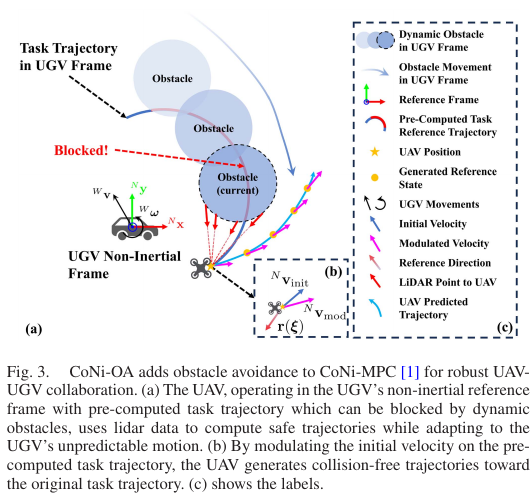
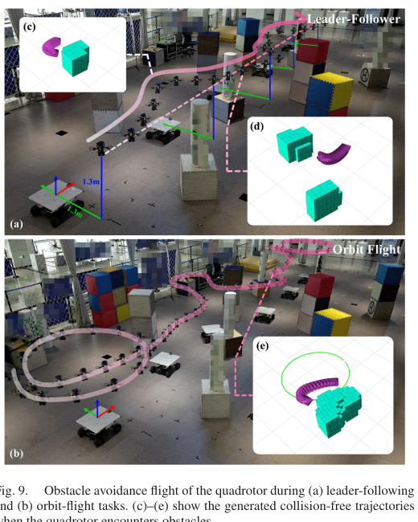
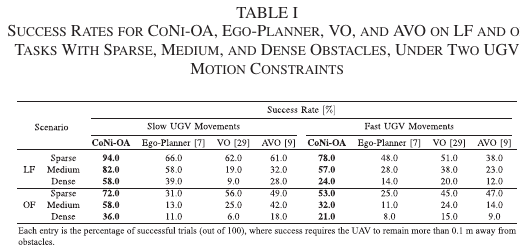

# 空地协同中无全局状态四旋翼避障控制——中文详解

> 英文题目：Global-State-Free Obstacle Avoidance for Quadrotor Control in Air-Ground Cooperation  
> 作者：Baozhe Zhang, Xinwei Chen, Qingcheng Chen, Chao Xu, Fei Gao, Yanjun Cao  
> 期刊：*IEEE Robotics and Automation Letters*, Vol. 10, No. 7, July 2025, pp. 6688–6695  
> DOI：10.1109/LRA.2025.3568314  
> 原始 PDF：[点击打开](../Global-State-Free%20Obstacle%20Avoidance%20for%20Quadrotor%20Control%20in%20Air-Ground%20Cooperation.pdf)

## 1. 一句话概括

论文提出 CoNi-OA（Cooperative Non-inertial frame-based Obstacle Avoidance，基于协作非惯性坐标系的避障）：**无人机不在世界地图里规划，而是在地面车自身的运动坐标系里，用当前一帧激光雷达点云直接弯折期望速度，滚动生成一条符合四旋翼动力学的短轨迹，再由模型预测控制器跟踪。**

它不需要无人机在世界坐标中的位置，也不需要识别、跟踪并预测每个障碍物的速度；但仍需要无人机相对地面车的状态、地面车惯性测量和机载激光雷达点云。

## 2. 背景：为什么“跟着地面车飞”还要换坐标系

空地协同任务包括无人机跟随车辆、绕车盘旋、向车上定向降落等。常规方案先估计无人机和车辆各自在世界坐标中的位置，再预测车辆轨迹、规划无人机世界轨迹。这通常依赖全球卫星定位、动作捕捉或同步定位与建图。

在无纹理、无卫星信号或未知环境里，全局定位可能不可靠。作者此前的 CoNi-MPC（Cooperative Non-inertial frame-based Model Predictive Control，基于协作非惯性坐标系的模型预测控制）换了思路：直接在地面车坐标系中描述“无人机位于车后 1.3 米、高 1.3 米”，于是无需知道整套系统在世界地图的绝对位置。

但这带来一个反直觉问题：世界中静止的柱子，在随车辆平移和转动的坐标系里看起来会移动。又因为地面车运动不受无人机控制，这些“动态障碍物”的运动难以预测。原 CoNi-MPC 没有环境避障，本文就是补上这一环。

## 3. “无全局状态”不等于“无状态估计”

论文标题容易被误解。它消除的是对**世界坐标全局状态**的依赖，不是完全不用定位。

系统仍需：

- 无人机相对地面车的位置、速度和姿态；
- 地面车的加速度和角速度等惯性量；
- 无人机激光雷达点相对地面车坐标系的变换；
- 高层协同任务给出的相对目标点或任务轨迹。

真机实验中的相对状态由 NOKOV 动作捕捉系统计算（原论文第 6 页）。因此论文证明了控制/规划公式不依赖全局状态，但尚未证明在野外完全依靠机载相对定位即可工作；作者也在结论中把集成实时相对估计设备列为未来工作。

## 4. 发表时常见避障方法与本文定位

| 路线 | 常见做法 | 优点 | 在本文任务中的困难 |
|---|---|---|---|
| 采样式全局/局部搜索 | 快速扩展随机树、概率路图等在配置空间找路径 | 理论与工具成熟 | 常假设障碍短期静止；动态环境需频繁重规划 |
| 轨迹优化/模型预测控制 | 在目标函数或约束中加入距离场、安全走廊 | 可生成平滑、动力学可行轨迹 | 距离场/走廊更新有延迟；时域、算力和最优性需折中 |
| 速度障碍及其扩展 | 在速度空间排除将发生碰撞的速度 | 动态反应快 | 需要可靠估计障碍物速度、加速度；噪声点云下识别和关联困难 |
| 调制动力系统 | 用矩阵缩小朝向障碍的速度、增强切向速度 | 直接、连续、计算快 | 旧方法常需障碍几何模型，或只处理二维质点 |
| CoNi-OA | 从单帧三维点云构造调制矩阵，并生成非惯性系四旋翼参考轨迹 | 不建模/预测单个障碍，单次轨迹生成低于 5 毫秒 | 仍是局部反应式方法；受雷达更新率和相对状态质量限制 |

## 5. 系统输入、输出与模块关系

### 5.1 输入

- 高层协同任务预先给出的相对轨迹或当前相对目标点；
- 无人机当前相对位置和状态；
- 地面车惯性测量：加速度、角速度；
- 无人机机载 Livox Mid-360 当前一帧原始点云；
- 无人机尺寸、推力和机体角速度限制。

### 5.2 输出

CoNi-OA 输出长度为若干离散点的局部参考轨迹，包括相对位置、速度和姿态。CoNi-MPC 再输出总推力和机体角速度命令。

> 图：原任务轨迹在地面车坐标系里被障碍堵住；算法把原始速度沿障碍切向弯折，逐步生成重新回到任务轨迹的局部安全参考。来源：原论文 Fig. 3，PDF 第 4 页。

## 6. 非惯性坐标系中的四旋翼动力学

论文把地面车机体系记为 $N$，无人机机体系记为 $B$。无人机状态为相对位置、相对速度和相对姿态：

$$
x=[{}^Np_B,{}^Nv_B,{}^Nq_B].
$$

输入为质量归一化总推力和机体角速度：

$$
u=[T,{}^B\Omega_B].
$$

相对加速度不仅包含无人机推力，还包含地面车坐标系运动引入的项：

- 地面车平移加速度；
- 旋转产生的科里奥利项；
- 离心项；
- 角加速度项。

这就是为什么不能把普通世界坐标四旋翼模型原样搬过来。若把地面车非惯性量设置为“仅保留重力、无平移和旋转”，该模型就退化为普通世界坐标四旋翼模型，因此 CoNi-OA 也可用于普通单机静态环境避障。

实际实现中，作者把难以获得的地面车角加速度设为零，相当于假设每个预测窗内角速度恒定（原论文第 6 页）。这是一个明确的近似。

## 7. 核心算法：一帧点云怎样“弯折”速度

### 7.1 把每个激光点当成小球障碍

当前帧点云为 $\Phi=\{\xi_o\}$。每个点被视为半径很小的球形障碍。无人机本身用包围球半径 $R$ 表示；到点 $o$ 的有效距离为

$$
D_o(\xi)=\|\xi-\xi_o\|-R.
$$

距离越近，点权重越大：

$$
\hat w_o(\xi)=\left(\frac{D^{scal}}{D_o(\xi)}\right)^s.
$$

权重还经过归一化和最大总权重限制，避免大量密集点让数值无限放大。

### 7.2 把很多点合成为一个“虚拟障碍法向”

把所有障碍点指向无人机的单位向量加权求和：

$$
r(\xi)=\sum_{\xi_o\in\Phi}w_o(\xi)
\frac{\xi-\xi_o}{\|\xi-\xi_o\|}.
$$

白话说，$r$ 告诉系统“危险主要从哪个方向逼近、危险程度多大”。算法无需先把点云分割成“这是柱子、那是移动的人”，也无需关联前后帧。

### 7.3 建立法向—切向基底

通过 Householder 变换构造正交矩阵 $E$，其第一轴与 $r$ 对齐，另外两轴张成切向平面。然后使用

$$
M=EDE^{-1},\qquad D=\operatorname{diag}(\lambda_r,\lambda_t,\lambda_t)
$$

调制原始速度。

$\lambda_r$ 控制朝向或离开障碍的法向速度，$\lambda_t$ 控制绕过障碍的切向速度。接近障碍时，算法先增强切向绕行；过近时则更倾向沿法向远离。远离障碍或本来就在离开障碍时，额外公式让调制逐渐消失，避免无意义改变任务速度。

### 7.4 不只生成速度，还生成可跟踪的四旋翼姿态

高层目标点先经比例控制得到限幅原始速度：

$$
v_{init}=\operatorname{bound}[-k_p(p_{ref}-p_{goal})].
$$

调制后

$$
v_{ref}=M(p_{ref},v_{init})v_{init}.
$$

相邻速度差给出参考加速度；再扣除非惯性坐标系带来的加速度项，得到无人机所需推力方向，由此构造参考姿态。论文还把姿态限制在地面车坐标竖轴周围的安全圆锥内，以避免生成过度倾斜的姿态。

### 7.5 在固定点云上向前滚动 20 步

一次规划中，论文假定当前点云和地面车非惯性量在短预测窗内不变，反复执行“求目标速度—调制—积分位置—恢复姿态”，形成离散参考轨迹。实验参数为 20 点、每点间隔 0.1 秒，即 2 秒预测窗。

算法复杂度为 $O(nh)$：$n$ 是当前帧点数，$h$ 是轨迹长度。这里“不预测障碍”减少了障碍跟踪开销，但把同一帧冻结 2 秒也意味着快速变化只能靠下一帧重新规划纠正。

## 8. CoNi-MPC 怎样跟踪参考轨迹

参考位置、速度和姿态送入 CoNi-MPC。控制器在非惯性模型下最小化状态跟踪误差和控制偏差，并显式限制总推力、横滚/俯仰角速度和偏航角速度。

模型预测控制使用 ACADO Toolkit 实现，预测窗 2 秒，离散步长 0.1 秒；实际控制循环至少 100 Hz。地面车惯性量通过 ROS 多机通信发送给无人机。

因此，两层分工是：

- CoNi-OA 快速改变“应该往哪里飞”；
- CoNi-MPC 处理“在车体非惯性坐标中怎样用推力和角速度跟上”。

## 9. 实验平台与计算开销

- 无人机质量 974.4 克，6S 电池下推重比 2.78；
- 机载计算机 Intel N100，最高 3.40 GHz，16 GB 内存；
- 激光雷达 Livox Mid-360；
- 相对状态由 NOKOV 动作捕捉计算；
- 单次 CoNi-MPC 控制迭代平均 **0.24 毫秒**；
- 约 4000 点输入时，生成 20 点、步长 0.1 秒的轨迹平均 **4.91 毫秒**，支持超过 100 Hz 的生成频率。

来源：原论文实验章节第 6–7 页。

## 10. 真机任务

作者展示三类空地协同任务：

1. **领航—跟随**：无人机跟随地面车固定相对点；
2. **绕车盘旋**：无人机按相对圆轨迹飞行；
3. **定向降落**：地面车以 0.5 弧度/秒旋转，预设降落轨迹被障碍截断，无人机绕障后落到车上。

在领航—跟随实验中，相对目标为 $(0,-1.3,1.3)$ 米；盘旋任务半径 1.5 米、角速度 0.5 弧度/秒。遇到障碍后，无人机先偏离任务轨迹避让，再迅速返回。

> 图：粉色轨迹展示领航—跟随和绕车盘旋，插图显示单帧点云下生成的局部绕障轨迹。来源：原论文 Fig. 9，PDF 第 7 页。

## 11. 仿真基准：完整成功率

作者在 $26\times20\times3$ 米地图中设置 100、150、200 个障碍，分别代表稀疏、中等和稠密；地面车随机接收目标并不可预测地运动。慢速约束为 $v_{max}=0.5$、$\omega_{max}=0.5$，快速约束为 $1.5$ 和 $1.5$。每个设置 100 次试验；无人机任何时刻距障碍小于 0.1 米即失败。

| 任务/密度 | CoNi-OA 慢/快 | EGO-Planner 慢/快 | VO 慢/快 | AVO 慢/快 |
|---|---:|---:|---:|---:|
| 跟随/稀疏 | 94 / 78 | 66 / 48 | 62 / 51 | 61 / 38 |
| 跟随/中等 | 82 / 57 | 58 / 28 | 19 / 38 | 32 / 23 |
| 跟随/稠密 | 58 / 24 | 39 / 14 | 9 / 20 | 28 / 12 |
| 盘旋/稀疏 | 72 / 53 | 31 / 25 | 56 / 45 | 49 / 47 |
| 盘旋/中等 | 58 / 32 | 13 / 11 | 25 / 24 | 42 / 14 |
| 盘旋/稠密 | 36 / 21 | 11 / 8 | 6 / 15 | 18 / 9 |

> 数值单位为成功率百分比；来源：原论文 Table I，PDF 第 7 页。

> 图：论文原始成功率表。来源：原论文 Table I，PDF 第 7 页。

这些结果说明 CoNi-OA 在所有设置中最高，但也说明它不是“必然安全”：跟随/稠密/快速只有 24%，盘旋/稠密/快速只有 21%。环境越密、地面车越激进，单帧反应式规划和实际动力学越容易跟不上。

比较时还要注意：EGO-Planner、速度障碍（Velocity Obstacle，VO）和加速度—速度障碍（Acceleration-Velocity Obstacle，AVO）原本面向惯性坐标。作者为对比把它们改成使用相同相对观测；VO/AVO 没有专门障碍检测器，而是把每个网格点当小障碍估速度和加速度。因此表格反映论文设定下的系统对比，不代表这些方法在所有标准实现中的绝对排名。

## 12. 创新点

1. 将调制动力系统扩展到非惯性坐标系中的三维四旋翼刚体，而非二维质点；
2. 每次仅用一帧原始点云，不显式建障碍形状、数据关联或运动预测；
3. 从调制速度进一步构造符合非惯性四旋翼动力学的参考位置、速度和姿态；
4. 与相对状态 CoNi-MPC 形成规划—控制闭环，并能退化为普通世界坐标单机避障；
5. 在跟随、盘旋、定向降落和普通静态导航中验证统一框架。

## 13. 局限和适用边界

### 13.1 受激光雷达更新率限制

论文结论明确指出，雷达点云更新相对较低时，地面车激进机动会使安全轨迹生成不够及时。未来方向是接入更高频雷达。

### 13.2 短窗口内冻结点云和非惯性量

生成 2 秒轨迹时把当前点云和地面车运动量视为常量。高频重规划能修正误差，但它不是障碍未来运动的真实预测。

### 13.3 相对定位仍依赖外部动作捕捉

真机没有展示完全机载的无人机—地面车相对状态估计。野外应用还需要视觉、超宽带、相对激光定位或其他传感前端。

### 13.4 地面车角加速度被设为零

地面车突然改变转速时，预测模型会暂时失配；这正是激进旋转下可能恶化的来源之一。

### 13.5 是局部反应式避障，不负责全局绕路

调制场根据当前目标和局部点云反应。论文没有证明对 U 形陷阱、狭窄死胡同或必须先远离目标的拓扑环境一定能脱困，复杂场景仍应增加全局/拓扑引导。

### 13.6 点云密度与机体包围球影响保守性

点云稀疏可能漏掉细障碍，包围球过大则会过度保守。论文的 4000 点和半径参数不能不经验证直接迁移到其他雷达、机身或速度范围。

## 14. 复现建议

1. 先在世界惯性坐标中令非惯性量退化，验证普通单机避障，再接入地面车旋转和平移项。
2. 严格做时间同步和坐标外参标定：雷达点、无人机相对状态和地面车惯性量必须都落在同一 $N$ 坐标系。
3. 分别可视化 $r$、$\lambda_r$、$\lambda_t$、原始速度和调制速度，检查障碍两侧是否出现不连续跳变。
4. 用真实机体尺寸设置包围球 $R$，再叠加状态估计、控制跟踪和雷达延迟的安全裕度。
5. 对点云数量、轨迹长度 $h$ 和控制频率一起做耗时测试；论文的 4.91 毫秒对应约 4000 点和 20 步。
6. 为局部无解或距离快速缩小时增加紧急刹停/爬升状态机，不要只依赖速度调制。
7. 仿真复现 Table I 时必须采用相同失败阈值、任务轨迹、地面车随机运动和对比方法改造，否则成功率不可直接比。

## 15. 外行应该怎样评价这篇论文

它的价值不在“完全不定位”或“100% 避障”，而在于提出一种非常直接的空地协同局部安全层：目标运动用相对坐标描述，障碍用当前点云反应，动力学由非惯性模型预测控制处理。它尤其适合没有可靠全局地图、环境变化快、算力有限的近场协同任务；但若要变成野外产品，还需要可靠机载相对定位、更高频感知、全局脱困策略和紧急安全机制。
