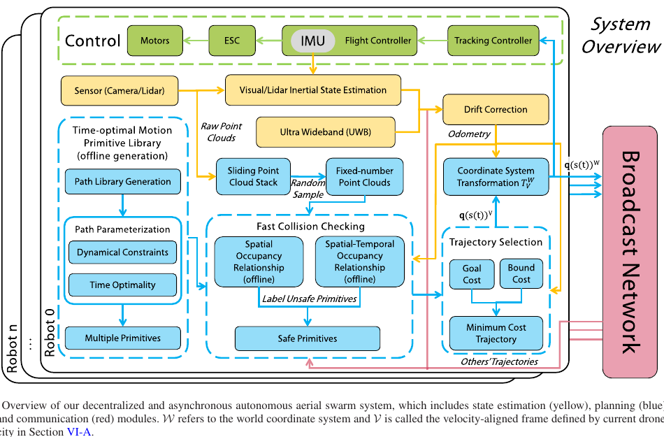
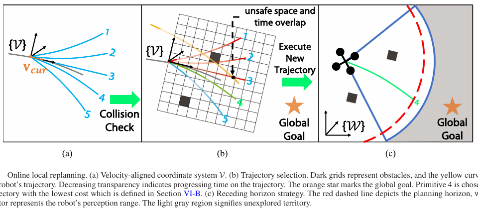
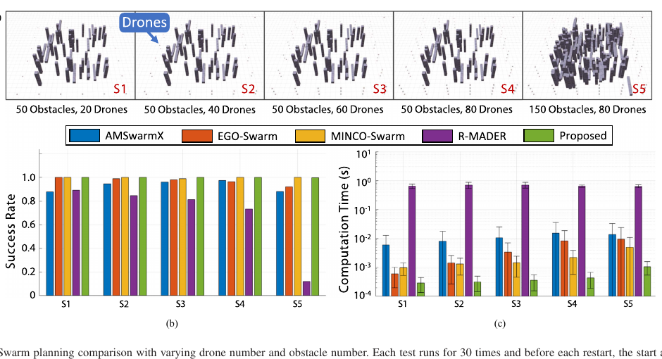
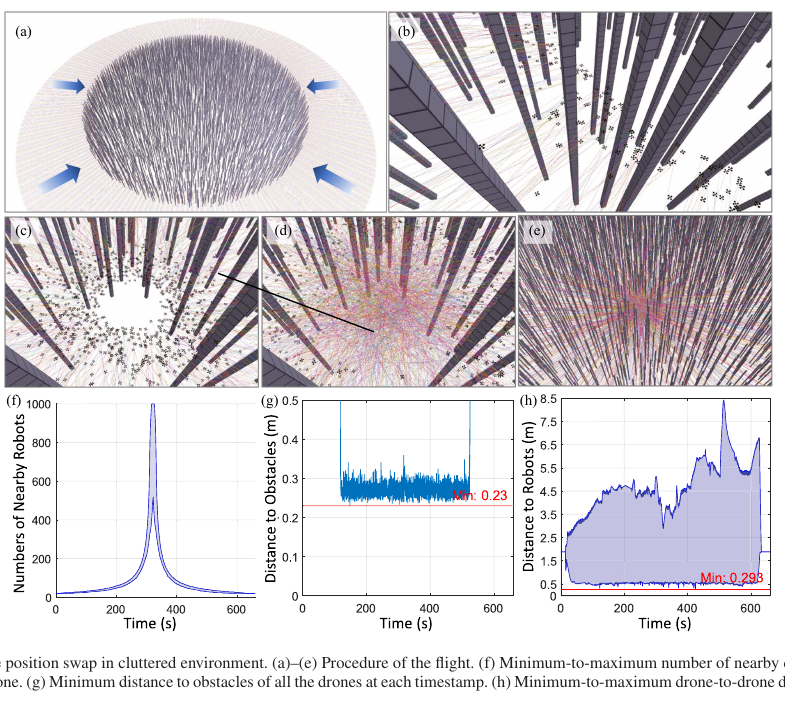

# Primitive-Swarm：超轻量、可扩展的大规模无人机集群规划器——中文详解

> 原论文：Jialiang Hou, Xin Zhou, Neng Pan, Ang Li, Yuxiang Guan, Chao Xu, Zhongxue Gan, Fei Gao, “Primitive-Swarm: An Ultra-Lightweight and Scalable Planner for Large-Scale Aerial Swarms,” *IEEE Transactions on Robotics*, Vol. 41, 2025, pp. 3629–3648。  
> DOI：10.1109/TRO.2025.3573667  
> 原始 PDF：[点击打开](../Primitive-Swarm%20An%20Ultra-Lightweight%20and%20Scalable%20Planner%20for%20Large-Scale%20Aerial%20Swarms.pdf)  
> 开源代码（论文脚注）：[ZJU-FAST-Lab/Primitive-Planner](https://github.com/ZJU-FAST-Lab/Primitive-Planner)

## 1. 一句话先讲明白

Primitive-Swarm 的核心不是“在线解一个很大的轨迹优化问题”，而是：**离线提前制作大量满足速度、加速度限制的快速飞行动作；在线只用点云和邻机轨迹批量排除会碰撞的动作，再从剩余动作中选一个最接近目标的执行。**

这相当于给每架无人机准备一本“动作菜单”。危险动作在毫秒内被划掉，机器人只需在安全菜单里点菜。把昂贵计算前移到离线阶段，是它能扩展到 1000 架仿真无人机的主要原因。

这篇论文**不使用深度学习，也不是同步定位与建图论文**。它属于基于运动基元、可达性分析、碰撞索引和局部滚动规划的几何/优化规划方法。

## 2. 任务背景：为什么集群轨迹规划会迅速变难

一架无人机在未知环境中飞行，要同时解决两类冲突：

1. 不能撞环境里的柱子、墙、树等障碍物；
2. 不能撞正在运动的其他无人机。

无人机数量增加时，第二类冲突的组合数迅速膨胀；障碍物变密时，可用空间又会被切成许多狭窄、非凸的小区域。若把所有无人机未来几秒的连续轨迹放进一个联合优化器，变量和约束会随集群规模急剧增长，实时求解非常困难。

论文希望同时满足四个工程要求：

- 每架无人机独立规划，避免中央计算机成为瓶颈；
- 不要求所有无人机同时开始一次规划；
- 能直接利用机载传感器得到的原始点云；
- 即使候选动作很多，在线计算时间仍然很低。

## 3. 论文发表时的通用做法，以及各自的长短处

| 技术路线 | 通常怎样做 | 优点 | 主要问题 |
|---|---|---|---|
| 集中式联合规划 | 在一个优化问题中同时求所有无人机轨迹 | 能统一处理相互避让 | 依赖全局信息和强算力，规模扩大后计算负担重 |
| 分布式轨迹优化 | 每架无人机接收邻机轨迹，再优化自己的样条或多项式 | 更适合真实系统，轨迹通常较平滑 | 障碍和邻机约束形成高度非凸问题，依赖初值，容易进入局部最优 |
| 速度障碍、群集规则 | 根据邻居位置/速度即时修改运动指令 | 反应快、实现简单 | 常采用低阶动力学或恒速假设，不够适合高机动四旋翼 |
| 传统运动基元 | 在线或离线生成一组短轨迹，逐条采样做碰撞检测 | 能同时探索多个方向，较少依赖非线性优化初值 | 候选越多，逐条检测越慢；固定时长动作也未必时间最优 |
| Primitive-Swarm | 离线生成时间最优动作库和占用索引；在线反向查询并选择 | 在线开销低，候选数可以较大，适于分布式异步集群 | 是局部规划器；需要离线库；动作切换会产生加速度不连续 |

特别要注意：论文并不是简单地“减少候选轨迹”。相反，它希望保留足够多的候选轨迹来覆盖复杂自由空间，只是换了一种碰撞查询方向，使在线耗时不再直接随候选数增长。

## 4. 系统到底输入什么、输出什么

### 4.1 每架无人机的在线输入

- 当前状态估计：位置、速度等；
- 最近若干帧传感器点云，经过随机采样后保留固定数量；
- 全局目标点及允许飞行边界；
- 邻近无人机通过点对点广播发送的短期轨迹；
- 离线生成并载入的运动基元库、空间占用关系和时空占用关系。

### 4.2 在线输出

规划器输出一条短时、带时间参数的局部轨迹。它被转换到世界坐标系后交给跟踪控制器，最终形成电机控制指令。轨迹执行过程中持续感知；到达重规划时间，或发现当前轨迹将碰撞时，再选下一条。

> 图：每架无人机独立完成状态估计、点云处理、碰撞筛选、轨迹选择与控制，只广播自身轨迹。蓝色部分是本文规划核心。来源：原论文 Fig. 3，PDF 第 5 页。

## 5. 完整算法流程

可以把算法分成“离线备课”和“在线答题”两部分。

### 5.1 离线步骤一：先造几何路径库

论文先生成若干长度相同、曲率不同的圆弧和直线，再绕前进轴旋转，从而覆盖三维空间里的不同转向方向。所有路径都从速度对齐坐标系的原点出发，并在起点与该坐标系的前向轴相切。

这里的“路径”只有空间形状，还没有规定每个位置应在什么时刻到达。路径库可以通过圆弧数、半径、长度、旋转角步长和初始角等参数调节覆盖范围。

### 5.2 离线步骤二：给每条路径安排最快且可行的时间

作者使用“基于可达性分析的时间最优路径参数化”（Time-Optimal Path Parameterization via Reachability Analysis，简称 TOPP-RA）。白话理解如下：

- 路径已经像一条铁轨固定下来；
- 算法要决定沿铁轨每一段跑多快；
- 既希望总用时最短，又必须满足无人机的速度和加速度上限。

对路径参数 $s$，定义

$$
x_i=\dot{s}_i^2,\qquad u_i=\ddot{s}_i,
$$

离散相邻点满足

$$
x_{i+1}=x_i+2\Delta_i u_i.
$$

这样，原本关于路径速度和加速度的限制可以写成 $x_i$ 和 $u_i$ 的线性约束。算法先从终点向起点反推“哪些速度还能到达终点”，再从起点向终点贪心选择最大的可行加速度。每一步求解的是小型线性规划，而不是大型非线性优化。

论文将路径离散为 1000 段，并用 Seidel 线性规划算法求解；这一切都在离线阶段完成。不同起始速度对应不同动作，因此在线可以根据当前实际速度选择连续性较好的候选库。

### 5.3 离线步骤三：建立两张“反向碰撞索引表”

传统做法是“拿每条轨迹去查环境”：对每个候选动作采样，再逐点查询是否撞障碍。假设有很多动作，这会反复查询同一片空间。

本文反过来做成“拿环境去查轨迹”：

1. 把动作库覆盖的空间划成网格；
2. 离线记录每个网格会与哪些动作发生空间冲突，形成 $R_o$；
3. 再记录动作在什么时间区间经过该网格，形成 $R_t$。

$R_o$ 用于障碍物碰撞，$R_t$ 用于邻机碰撞。安全距离已经包含在离线查询半径里，所以在线无需对地图做膨胀。

### 5.4 在线步骤一：建立“沿当前速度朝前”的局部坐标系

动作库的所有动作都沿局部 $x$ 轴起飞。在线时，算法用当前速度方向建立速度对齐坐标系，把点云、目标和邻机轨迹变换进这个坐标系。于是同一本动作库可以随无人机朝向旋转使用。

当当前速度非常接近零时，坐标轴定义和初始动作选择需要工程上的专门处理；这是复现时容易忽视的边界情况。

### 5.5 在线步骤二：批量划掉会撞障碍的动作

固定数量的障碍点投影到局部网格后，直接查 $R_o$，即可得到所有与这些格子冲突的动作编号，并把它们批量标为不安全。

因此，机器人—障碍物检测的在线复杂度是 $O(N_{pc})$，$N_{pc}$ 为保留的点云数量；它不直接依赖动作库里有多少条轨迹。

### 5.6 在线步骤三：批量划掉会撞邻机的动作

邻机广播的轨迹被投影到网格，同时记录它占用网格的时间区间。查 $R_t$ 后，只有“占据同一空间且时间重叠”的动作才被判为冲突。

这个区别很重要：两架无人机经过同一个位置，只要时刻不同，就不应被当成碰撞。论文给出的在线复杂度为 $O(N_d)$，其中 $N_d$ 是两个规划视野内的邻机数量。

### 5.7 在线步骤四：从安全动作里选代价最小的一条

论文的基础代价很简洁：

$$
C=\lambda_g C_{goal}+\lambda_b C_{bound}.
$$

$C_{goal}$ 衡量执行动作后离全局目标近了多少，$C_{bound}$ 惩罚动作终点超出用户规定的飞行边界。作者指出还可加入偏航变化等偏好。

这一步不是连续轨迹优化，只是对安全候选做线性复杂度的打分和选择。

> 图：候选动作先接受空间—时间碰撞检查，再选最接近目标者；只执行滚动视野中的一段，随后再次规划。来源：原论文 Fig. 10，PDF 第 11 页。

## 6. 为什么它快，以及“可扩展”究竟指什么

速度来自三次计算转移：

- 动力学可行性和时间最优性从在线转到离线；
- 候选逐条碰撞检测转成环境网格对候选编号的批量查询；
- 非凸连续优化转成安全候选的简单打分。

“可扩展”并不等于计算成本与无人机数量完全无关。邻机越多，处理邻机轨迹仍会增加；传感点越多，障碍检查也会增加。论文真正证明的是：候选动作库可以做得较大，而碰撞检查不会按“动作数 × 每条动作采样点数”增长；每架无人机又可独立异步工作。

## 7. 实验设计与量化结果

以下数值均来自原论文实验章节，不能把不同硬件上的时间直接横向混为一谈。

### 7.1 候选库数量与导航成功率

作者在 $26\times20\times3$ 米空间布置 100、150、200 个圆柱障碍，对 37、61、109 条动作的库分别做 100 次导航测试。论文 Fig. 12 显示：候选较少时在稠密环境表现明显下降，增加动作数后成功率更稳健。后续多数实验使用 181 条动作。

这说明高成功率并非“菜单越小越快”，而是依赖快速索引让系统有能力保留较大的菜单。

### 7.2 碰撞检测耗时

- 在空间占用率低于 30%、地图分辨率为 0.1 米的多数测试中，机器人—障碍物检测通常低于 0.5 毫秒；若分辨率改为 0.2 米，则进一步低于 0.2 毫秒（原论文第 12 页、Fig. 13）。
- 8 架无人机交换位置时，三种不同规模动作库的机器人—机器人检测平均都在 0.35–0.37 毫秒之间（原论文第 12 页、Fig. 14）。

### 7.3 八机无障碍交换位置基准

在半径 12 米的圆形空间中，8 架无人机交换位置。论文 Table II（PDF 第 4 页）报告：

| 方法 | 平均飞行时间（秒） | 平均飞行距离（米） | 单次规划计算时间（毫秒） |
|---|---:|---:|---:|
| MADER | 28.482 | 24.128 | 7.450 |
| EGO-Swarm | 39.070 | 24.527 | 1.124 |
| MINCO-Swarm | 25.955 | **24.102** | 0.673 |
| Primitive-Swarm | **24.124** | 24.111 | **0.427** |

集中式 RBP 的两个批处理配置飞行时间均为 114 秒，计算时间约 1735.610 和 1756.800 毫秒；它与每架无人机独立局部规划的计时含义不同，不能简单说成相同条件下“快多少倍”。

### 7.4 20–80 架无人机、50–150 个障碍的比较

作者与 AMSwarmX、EGO-Swarm、MINCO-Swarm、R-MADER 比较，每个设置随机重排起终点 30 次。除 R-MADER 在密集障碍中的成功率明显降低外，多数方法成功率都较高；Primitive-Swarm 的单次规划时间通常约为其他方法的三分之一。图中的对数纵轴很容易造成肉眼误读，应以量级理解而不是从柱高估算精确倍数。

> 图：S1–S5 从 20 架/50 障碍增加到 80 架/150 障碍；绿色为本文方法。来源：原论文 Fig. 18，PDF 第 15 页。

### 7.5 11 小时连续仿真

20 架无人机在 $6\times6\times3$ 米随机稠密环境中持续接收新目标，共进行 11 轮、每轮至少 1 小时。99.1% 的目标在 20 秒内到达，99.94% 在 50 秒内到达（原论文第 16 页、Fig. 20）。少数长耗时案例是在“大墙”前被局部规划困住，最终才绕出。

这既验证了长时间运行的鲁棒性，也直接暴露了缺少长期路径决策的局限。

### 7.6 1000 架无人机仿真

1000 架无人机在半径 300 米圆周上交换位置，速度上限 1 米/秒，动作库 361 条。最密集阶段每架周围 20 米范围内可出现 500–1000 架邻机。全过程观测到的最小机间距是 **0.293 米**，略低于按两倍机体半径设定的 0.3 米安全间距（原论文 Fig. 21(h)，PDF 第 17 页）。

> 图：1000 架无人机穿越柱状障碍并交换位置；下方曲线给出邻机数量、最近障碍距离和机间距离。来源：原论文 Fig. 21，PDF 第 17 页。

这项仿真运行在 80 个虚拟核心、384 GB 内存的云工作站上，总 CPU 使用约 80%；轨迹通信还改用了进程间内存共享。因此，它证明的是算法架构和并行实现能扩到 1000 架，**不是证明一块普通机载计算机能集中模拟或控制 1000 架**。

### 7.7 真机实验

- 单机室内与室外未知环境：速度、加速度上限分别设为 2 米/秒和 6 米/秒²；无人机以接近 2 米/秒绕过障碍。
- 八机双向交叉：每机速度、加速度上限为 1 米/秒和 3 米/秒²，4 架向前、4 架向后交叉通过。
- 真机不使用外部定位或外部计算设备；状态估计、规划、控制与通信均在机载端运行（原论文第 18 页）。

## 8. 论文真正的创新点

1. **把时间最优性放进离线动作库。** 动作不是随意采样的定时曲线，而是在速度和加速度约束下通过 TOPP-RA 参数化。
2. **以环境索引轨迹，而不是逐条轨迹索引环境。** 这是候选动作数增加后在线耗时仍低的关键。
3. **用空间表和时空表统一处理两类碰撞。** 静态障碍只看空间重叠，邻机还检查时间重叠。
4. **分布式、异步、局部滚动执行。** 每架无人机可按自身事件触发规划，无需等全体同步。
5. **从单机、八机真机到 1000 机仿真进行多尺度验证。** 同时给出长达 11 小时的连续运行测试。

## 9. 局限和适用边界

### 9.1 它是局部规划器，不负责穿迷宫

算法只看有限感知/规划视野，遇到 U 形陷阱、大墙或迷宫可能长时间徘徊。复杂环境需要另配全局或拓扑引导前端。论文在 11 小时实验中明确展示了“大墙”导致长耗时的案例。

### 9.2 加速度切换不连续

重规划可在任意时刻触发，而离线动作无法预知切换瞬间的当前加速度，因此拼接处只自然满足位置、速度方向等条件，加速度可能跳变。论文把它列为方法缺陷。限制只能在动作结束时切换可改善连续性，却会降低动态响应速度。

### 9.3 安全不是严格连续时间证明

动作、点云和网格都经过离散化，且 1000 机实验的最小距离 0.293 米略小于设定 0.3 米。这说明实际安全裕度必须包含网格、采样、通信、估计和控制误差，而不能把表查询本身理解为绝对安全证书。

### 9.4 通信延迟和丢包仍是工程风险

邻机避碰依赖广播轨迹。论文系统是松耦合的，但没有像专门的鲁棒通信延迟规划器那样给出严格延迟保证。规模扩大时，网络带宽和轨迹时钟一致性同样重要。

### 9.5 动作库需要存储并受参数覆盖范围限制

109 条动作的离线生成约耗时 38.6 秒，输出库约 75.3 MB（原论文第 18 页）。动作库覆盖不到的曲率、速度或机型动力学范围，在线再快也无法选出合适动作；更换机型或约束后通常要重新生成。

## 10. 复现建议

1. **先复现单机，再开邻机冲突。** 先验证速度对齐坐标、点云投影、空间索引和动作切换，再增加时空索引。
2. **核对三套分辨率。** 路径离散、空间网格和时间采样共同决定漏检风险与内存，不能只调一个参数。
3. **把动作膨胀半径写进离线库版本。** 机体半径或安全距离改变后，旧 $R_o/R_t$ 不能继续当作正确索引使用。
4. **保证所有机器人共享时间基准。** 时空占用区间若时钟偏移，会把本应错开的轨迹误判安全。
5. **低速/悬停单独处理坐标系。** 当前速度接近零时，速度方向不稳定，需保留上一朝向或采用目标方向作为备选轴。
6. **真实系统要为误差留余量。** 点云噪声、状态估计延迟、轨迹广播延迟和控制跟踪误差都应计入 $r_{infl}$ 与 $r_{robot}$。
7. **大范围环境接入全局引导。** 可用低频 A*、拓扑图或任务级航路点提供方向，Primitive-Swarm 负责近场高速避碰。

## 11. 外行读完应记住的三点

1. 这不是“1000 架一起解一个巨型方程”，而是每架拿同一本离线动作菜单独立作选择。
2. 真正巧妙处是反向碰撞索引：看到一个危险网格，就立刻知道哪些动作要被划掉。
3. 它在局部、实时、大候选集和大规模集群方面很强，但仍需要全局引导、通信保障和更连续的动作拼接来组成完整工程系统。
