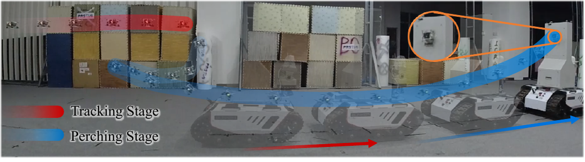
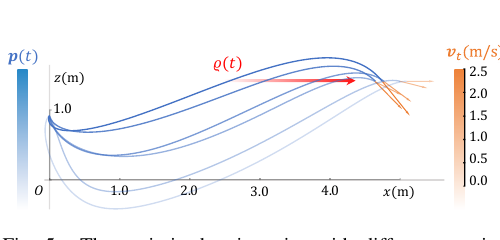
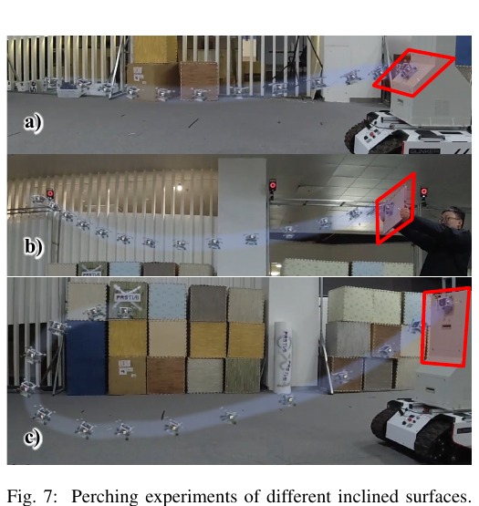
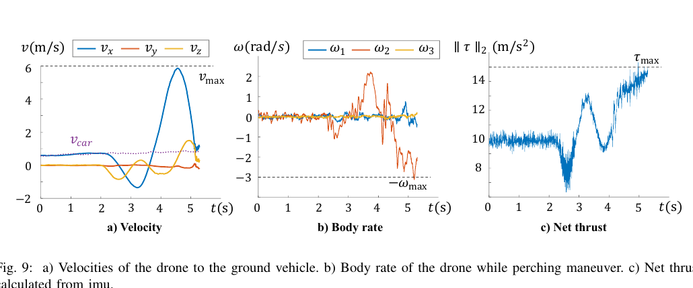

# 实时空中停泊轨迹规划（Real-Time Trajectory Planning for Aerial Perching）中文详解

> 作者：Jialin Ji, Tiankai Yang, Chao Xu, Fei Gao  
> 会议：2022 IEEE/RSJ International Conference on Intelligent Robots and Systems（IROS 2022），pp. 10516–10522  
> DOI：10.1109/IROS47612.2022.9981489  
> 原始 PDF：[点击打开](../Real-Time%20Trajectory%20Planning%20for%20Aerial%20Perching.pdf)  
> 论文给出的代码：[ZJU-FAST-Lab/Fast-Perching](https://github.com/ZJU-FAST-Lab/Fast-Perching)

## 1. 一句话概括

论文让一架推力余量很小的微型四旋翼，能够在有限空间中实时规划一条“最后时刻才接触”的停泊轨迹：规划器同时调整飞行时间和接触速度；如果零切向相对速度会导致撞地或超过电机能力，就允许很小的切向滑动，以安全和动力学可行为先。

它解决的是**接触前最后几秒的运动规划**，不是完整的目标检测或定位系统。论文实验仍使用 VICON 动作捕捉和机载惯性数据做状态估计，这一点不能与后续 2024 年“动态跟踪与停泊完整系统”混淆。

## 2. 什么是“停泊”，为什么比普通降落难

普通水平降落通常让无人机降低高度、减小速度，最后脚架接地。空中停泊更像鸟落在树枝或无人机吸附墙面：接触面可以倾斜甚至竖直，接触瞬间的姿态、位置和相对速度必须配合磁铁、吸盘、黏附材料或抓手。

本文真机使用“磁铁提供法向吸力、黏性材料提供摩擦”的简易机构。若接触法向速度太小，磁铁可能吸不上；若切向速度太大，又会擦过或滑落。与此同时，四旋翼姿态由推力方向决定，想让机身在最后时刻大角度贴向墙面，必然要求特定的加速度、角速度和推力变化。

> 图：无人机先跟随地面车（红色），收到触发后执行蓝色摆动形停泊轨迹。来源：原论文 Fig. 1，PDF 第 1 页。

## 3. 论文要解决的三个关键矛盾

### 3.1 终端状态不能事先锁死

移动平台未来的位置随接触时间变化。若预先固定“2 秒后、这个位置、这个速度、这个姿态”，就会大幅压缩可行解空间。对推重比只有 1.7 的小飞机，可能根本无法在限定空间内完成。

### 3.2 接触前不能提前撞平台

规划时不能把无人机只当一个点。它在大姿态机动中会转动，桨盘或机腹可能先碰到平台。问题必须在三维位置与三维姿态共同构成的 $SE(3)$ 空间中考虑。

### 3.3 算得慢就无法反复重规划

移动目标的预测、定位和飞行跟踪都有误差，因此不能只规划一次。论文要求初次求解在 20 毫秒内，使用上一条结果热启动时约 2 毫秒，从而支持 10 Hz 真机重规划。

## 4. 当时常见做法与优缺点

| 路线 | 常见做法 | 优点 | 不足 |
|---|---|---|---|
| 特定停泊机构 + 预设终端速度 | 为抓手设零相对速度，为吸盘/黏附机构设较大法向撞击速度 | 机构和动作容易配套设计 | 终端条件固定，空间不足或推力弱时可能无解 |
| 分段多项式 + 二次规划 | 在线性近似下约束终点、速度和推力 | 求解较快 | 难准确表达角速度、姿态碰撞等非线性约束；单纯延长时间也未必可行 |
| 非线性模型预测控制/多重打靶 | 离散动力学，直接约束状态、控制和障碍 | 表达能力强 | 变量多、计算较慢；离散控制可能不够平滑，终端状态常需预先给定 |
| 本文方法 | 微分平坦轨迹 + 终端状态重参数化 + 连续惩罚 + L-BFGS | 变量少、可联合调时间与终态，适合机载重规划 | 依赖局部优化和参数权重；实验感知尚未完全机载闭环 |

## 5. 输入、输出和系统边界

### 5.1 规划器输入

- 无人机当前的位置、速度、加速度等边界状态；
- 预测的移动停泊面位置 $\varrho(t)$ 和法向量 $z_d$；
- 机体几何参数和停泊面尺度；
- 最大速度、推力上下限、最大机体角速度；
- 最低安全高度、期望接触法向速度等任务参数。

### 5.2 规划器输出

- 一条分段多项式位置轨迹 $p(t)$；
- 优化后的总飞行时间 $T$；
- 由位置高阶导数恢复出的姿态、推力和机体角速度；
- 适应安全/动力学约束的终端切向相对速度。

规划器不负责从图像检测停泊面。真机状态估计由 VICON 位姿与 PX4 自驾仪惯性测量经扩展卡尔曼滤波融合得到（原论文第 5 页）。

## 6. 核心概念的白话解释

### 6.1 微分平坦性

对四旋翼，若知道位置曲线及其若干阶导数，并给定偏航，就能代数计算姿态、总推力和角速度。于是规划器不必直接优化所有电机转速和姿态变量，只需优化位置多项式，问题会小很多。

### 6.2 TMINCO 轨迹表示

论文采用 TMINCO（Minimum Control Effort Polynomial，最小控制代价多项式）表示分段轨迹。给定中间点和每段时间，它能以线性复杂度得到唯一的平滑多项式系数，并高效把梯度传回优化变量。

本文使用 $s=4$、$N$ 段轨迹，优化最小 snap（位置四阶导数）并保留足够的终端状态自由度。

### 6.3 Hopf 纤维化映射

推力方向就是机体竖轴方向。论文用 Hopf 纤维化关系，从推力向量平滑恢复姿态，并把机体横滚/俯仰角速度约束转成位置三阶导数（jerk，常译“急动度”）的约束。这样避免直接用欧拉角带来的奇异和复杂导数。

## 7. 数学问题到底怎样构造

### 7.1 基本目标

轨迹目标在平滑和快速之间权衡：

$$
\min_{p(t),T}\;J_o=\int_0^T\|p^{(s)}(t)\|^2dt+\rho T.
$$

第一项不希望轨迹剧烈变化，第二项不希望为了容易满足约束而无限拖长时间。

### 7.2 动力学约束

规划全过程需满足：

- 速度不超过 $v_{max}$；
- 总推力在 $[\tau_{min},\tau_{max}]$；
- 机体角速度不超过 $\omega_{max}$；
- 高度不低于 $z_{min}$。

这些约束通过二阶连续的平滑惩罚函数转入目标。以推力为例：

$$
G_\tau=L_\mu(\|\tau\|^2-\tau_{max}^2)
+L_\mu(\tau_{min}^2-\|\tau\|^2).
$$

软惩罚不等于数学上的绝对硬保证，所以论文用较大权重并在优化后检查。复现时不能只看求解器“收敛”，还要重新密集采样验证约束。

### 7.3 用机腹圆盘而不是一个点做碰撞检测

论文把四旋翼下侧建模为随姿态旋转的圆盘 $C(t)$，移动停泊面建模为半空间 $P(t)$。只有当无人机投影进入平台附近时，才激活“圆盘必须留在平台可接近一侧”的约束。

这个“只有靠近才激活”原本带有离散逻辑，会形成混合整数非线性问题。作者用平滑逻辑函数近似开关，使其仍可由连续梯度优化器求解。相比把平台当无限平面，它不至于在远处或投影范围外过度限制轨迹。

### 7.4 最关键的终端速度松弛

理想接触要求无人机速度与平台速度相同，同时保留机构所需的小法向接触速度。但论文发现：空间低、推力弱时，坚持零切向相对速度会迫使轨迹提前下探，甚至撞地。

因此终端速度改写为

$$
p^{(1)}(T)=\varrho^{(1)}(T)-\bar v_n z_d+Vv_t,
$$

其中 $\bar v_n$ 是预设法向接触速度，$V$ 的两列是停泊面上的两个切向，$v_t$ 是交给优化器决定的切向相对速度。代价中加入

$$
J_t=\|v_t\|^2,
$$

所以只有为避免撞地或动力学超限确有必要时，优化器才会容许较大的切向速度。

> 图：终端速度选择不同，轨迹下探程度明显不同；过小的切向调整可能让轨迹穿过最低安全高度。来源：原论文 Fig. 5，PDF 第 4 页。

### 7.5 终端姿态和终端推力一起重参数化

接触时机体竖轴应对齐停泊面法向。作者把终端加速度写成

$$
p^{(2)}(T)=(\tau_m+\tau_r\sin\tau_f)z_d-\bar g e_3,
$$

其中 $\tau_m$、$\tau_r$ 由推力上下限决定。这样无论自由变量 $\tau_f$ 取何值，终端推力都不会超出范围，同时姿态方向自动对齐停泊面。终端 jerk 设为零，使接触时相对角速度较小。

### 7.6 无限时刻约束怎样变成有限计算

速度、推力、角速度和碰撞条件本应对每一个连续时刻成立。论文在每段轨迹上用梯形积分采样约束违反量，形成有限代价；采样数 $\kappa$ 决定近似精度。

最终优化变量是：总时间的无约束变量 $T'$、中间点 $q$、终端切向速度 $v_t$ 和终端推力参数 $\tau_f$。总时间用 $T=e^{T'}$ 保证正数，求解器采用有限内存 BFGS（L-BFGS）算法。

## 8. 从输入到飞行的完整流程

1. 获取无人机当前边界状态与移动平台未来轨迹；
2. 根据起终边界解一个简单边值问题，得到中间点初值；
3. 初始化 $v_t=0$，建立 TMINCO 多项式；
4. 从位置曲线恢复推力、姿态和角速度；
5. 计算平滑度、时间、速度、推力、角速度、地面、平台碰撞和终端滑动代价；
6. 将梯度传回中间点、时间和终端参数；
7. 用 L-BFGS 迭代；
8. 密集检查轨迹，输出给基于同一姿态映射的控制器；
9. 平台预测变化后，用上一解热启动重新规划。

## 9. 真机实验：平台、设置与效果

### 9.1 硬件

- 四旋翼质量 0.36 千克，推重比 1.7；
- NVIDIA Jetson Xavier NX 机载计算机；
- PX4 自驾仪惯性数据；
- VICON 外部动作捕捉提供位姿，扩展卡尔曼滤波融合；
- 磁铁加黏性材料的简易停泊机构。

这说明“规划在机载运行”是成立的，但“感知完全机载”并不成立。

### 9.2 静态不同倾角

论文测试了 3 米外的 45° 倾斜铁面、由人举起且方向任意的白板，以及 2.5 米外的竖直面。共同设置为：期望法向接触速度 0.3 米/秒，最大速度 6 米/秒，推力范围 5–15 米/秒²，最大角速度 3 弧度/秒（原论文第 5 页）。

> 图：45° 倾斜面、人工移动的任意姿态板和竖直面停泊。红框为接触区域。来源：原论文 Fig. 7，PDF 第 5 页。

### 9.3 移动平台

地面车以 0.6 米/秒前进，无人机初始水平距离 2.3 米，停泊高度 1.1 米，最低安全高度 0.4 米。系统以 10 Hz 重规划，生成摆动形轨迹，在推力和角速度约束内完成移动竖直面停泊（原论文第 5–6 页）。

> 图：移动平台实验中，无人机速度、机体角速度和总推力均随末端大姿态动作明显变化。来源：原论文 Fig. 9，PDF 第 6 页。

## 10. 基准实验与可核对数值

作者把本文方法与 Paneque 等人的离散时间非线性规划方法比较。为公平起见，去掉了两者特有的感知和碰撞项，并设置相同起终点、静止到静止边界和动力学限制。所有测试运行在 Intel Core i5-12600 桌面处理器上。

| 接触面角度 | 本文平均计算时间 | Paneque 方法平均计算时间 |
|---:|---:|---:|
| −70° | 1.47251 毫秒 | 257.533 毫秒 |
| −90° | 4.60674 毫秒 | 101.450 毫秒 |
| −110° | 17.7263 毫秒 | 81.520 毫秒 |

来源：原论文 Table I，PDF 第 7 页。离散非线性规划具有更多自由度，在对比中所需控制努力略小，但其推力和角速度曲线受离散分辨率影响，平滑性弱于本文连续多项式轨迹（原论文 Fig. 10，第 6 页）。

论文摘要和贡献部分还报告：常规初次规划在 20 毫秒内，以上一条轨迹热启动的重规划低于 2 毫秒。表中的 1.47–17.73 毫秒是特定简化基准，不应与完整真机循环混为同一统计量。

终端调整仿真中，接触高度从 2.0 米降低至 1.5、1.0 米时，优化出的切向速度分别为 −0.388、−0.049、−0.022 米/秒（按原论文 Fig. 11 图内表格，PDF 第 7 页）。这些数值反映特定坐标方向和场景，重点是算法会随空间变化主动改变终端状态，而不是越接近零就普遍越好。

## 11. 创新点

1. 同时优化轨迹形状、总时间和终端切向速度，而不是把接触时刻和终态固定；
2. 用终端重参数化同时满足接触姿态和终端推力范围，并减少优化变量；
3. 用随姿态旋转的圆盘和有限平台几何处理接触前碰撞；
4. 将复杂约束转为平滑可导代价，配合 TMINCO 和 L-BFGS 实现毫秒级求解；
5. 在低推重比微型无人机和移动倾斜平台上验证，而不仅是高性能仿真模型。

## 12. 局限与适用边界

### 12.1 论文没有实现完全机载感知

真机依赖 VICON。作者在结论中明确把“用全机载传感器完成状态估计和目标检测”列为未来工作。因此它适合作为停泊运动规划核心，不能直接当作即插即用的野外自主停泊系统。

### 12.2 Hopf 映射存在倒立奇异情况

论文指出无人机完全倒立时存在奇异性，当前方法不能直接覆盖这一极端姿态。

### 12.3 软惩罚和离散采样不是严格安全证明

约束通过有限采样积分和权重实现。若采样太疏或权重不合适，采样点之间仍可能违规；工程上必须增加后验连续检查和安全余量。

### 12.4 局部非线性优化依赖初值

论文通过边值问题给中间点初值，并在重规划时热启动。障碍/几何更复杂或初值穿越不可行区时，L-BFGS 仍可能进入差的局部解。

### 12.5 动力学模型较简化

论文使用总推力和机体角速度层面的简化四旋翼模型，没有显式建模近墙气流、地效、磁铁碰撞冲击或单电机饱和差异。更激进或更重的平台需要重新验证。

## 13. 复现建议

1. 从开源代码的 TMINCO 和梯度单元测试开始，不要先上真机。
2. 对终端位置、速度、加速度、jerk 的坐标方向逐项画图，尤其检查停泊面法向正负号。
3. 优化后以明显高于优化采样率的时间步长重新检查最低高度、圆盘—平台距离、推力和角速度。
4. 先复现静态水平或 45° 接触，再增加竖直面、移动目标和热启动。
5. 真机应设置“优化失败/后验检查失败即退出停泊”的安全状态机，并保留可恢复轨迹。
6. 接触法向速度必须和具体磁铁、吸盘、黏附材料匹配；论文的 0.3 米/秒不是通用常数。
7. 使用视觉或激光前端时，把估计延迟纳入 $\varrho(t)$ 预测，否则规划器虽快，输入仍然是过时目标。

## 14. 与 2024 年后续工作的关系

本论文是后续《Adaptive Tracking and Perching for Quadrotor in Dynamic Scenarios》的停泊规划基础。2024 年工作增加了可见性感知跟踪、目标预测、像素级感知增强、联合时空优化和商业无人机/SUV 路测，并修订了部分终端与时间处理。阅读顺序建议先用本文理解停泊优化，再读 2024 年完整系统；不要把后续系统的 30 千米/小时 SUV 实验倒推成本文已完成的实验。
