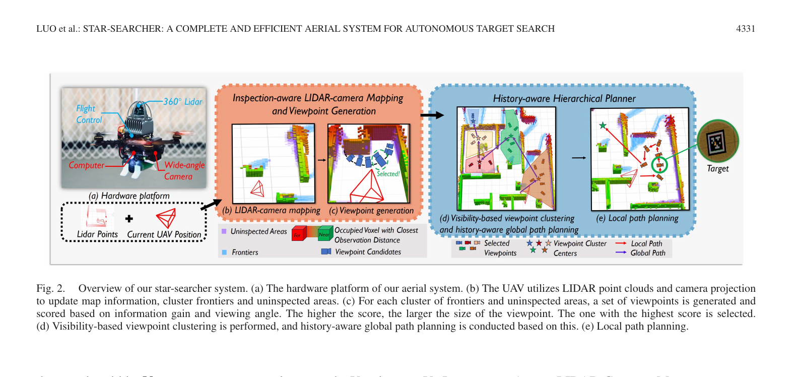
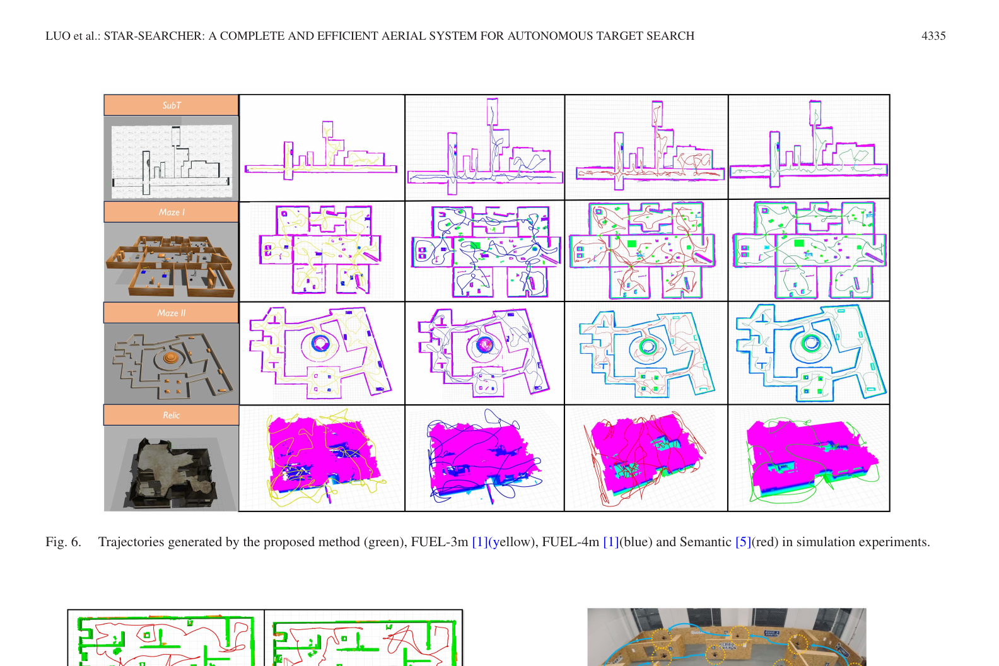
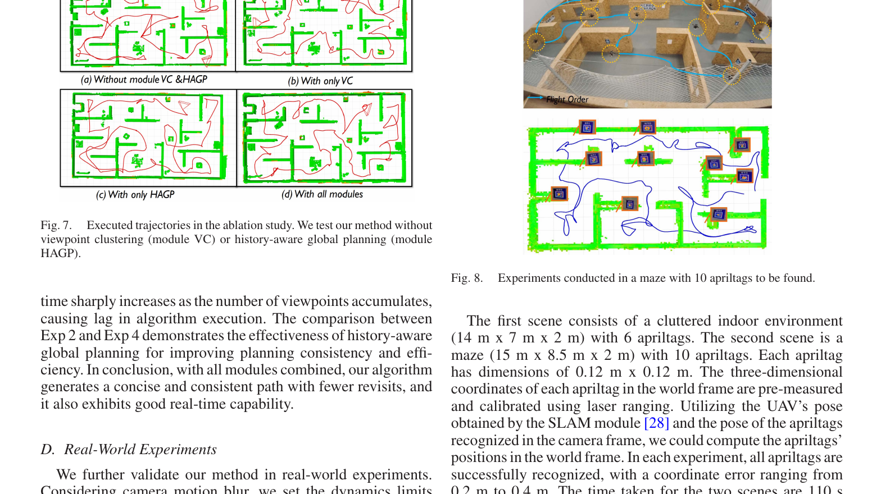

# Star-Searcher：复杂未知环境自主目标搜索系统详解

> 元数据 (作者, 期刊, 链接)
- **作者**: Yiming Luo, Zixuan Zhuang, Neng Pan, Chen Feng, Shaojie Shen, Fei Gao, Hui Cheng, and Boyu Zhou
- **期刊**: IEEE ROBOTICS AND AUTOMATION LETTERS, VOL. 9, NO. 5, MAY 2024
- **代码链接**: https://github.com/SYSU-STAR/STAR-Searcher
- **论文链接**: https://doi.org/10.1109/LRA.2024.3379840
- **本地原文**: [原始 PDF](../Star-Searcher%20A%20Complete%20and%20Efficient%20Aerial%20System%20for%20Autonomous%20Target%20Search%20in%20Complex%20Unknown%20Environments.pdf)

## 1. 核心思想与一句话概括
**一句话概括**：Star-Searcher 是一个配备专用传感器套件、建图和规划模块的空中自主目标搜索系统，通过历史感知的层次化规划器和基于可见性的视点聚类方法，在复杂未知环境中兼顾空间探索与表面目标细致检查；论文实验显示它能减少漏检，但并不构成对任意遮挡环境“无死角”的理论保证。

**核心思想**：该工作弥合了“空间探索（Exploration）”与“目标搜索/检查（Inspection）”之间的鸿沟。传统的探索只关注将未知空间标记为已知，而目标搜索则要求对被占据的障碍物表面进行严格的视点约束（如观测距离、视角）以进行细致观察。本文通过引入层次化规划（全局视点聚类+局部路径覆盖）和保留规划历史（History-aware mechanism），大幅减少了频繁地图更新引起的路径重规划和折返，提升了搜索效率和目标发现完整度。

## 2. 外行导读与研究背景
**研究背景**：无人机(UAV)在灾害搜救、资源勘探和环境监测中发挥着关键作用，特别是能够在复杂未知和危险的环境中替代人类执行任务。这些任务往往要求无人机自主搜索可能隐藏在复杂地形中的特定目标。

**外行导读**：想象一下，你进入一个未知洞穴寻找藏在墙角或石头后面的标记。你需要做两件事：先粗略看清洞穴结构（“探索”），再贴近墙面和物体表面检查有没有目标（“检查”）。如果每获得一点新地图就把整条路线推倒重来，很容易反复折返。Star-Searcher 用 360 度激光雷达快速建立几何地图，用广角彩色相机识别目标，再把待检查位置分组并记住已经承诺执行的一段路线，从而在论文实验中减少折返、缩短搜索时间。是否能搜全仍取决于表面是否可达、地图是否正确以及检测器是否漏检。

### 2.1 “探索完成”为什么不等于“目标搜索完成”

普通三维探索只要求把体素分成未知、空闲和障碍。一面墙只要被激光雷达远远扫到，就可能算作“已经建图”；但相机如果离墙太远、观察角度太斜或被遮挡，墙上的小目标依然无法可靠识别。Star-Searcher 因此为每个障碍表面额外记录最近的有效相机观测距离，把“空间已经知道这里有墙”和“这面墙已经被足够近地检查”分成两个状态。

这项任务的完成标准也更严格：不仅要扩展地图，还要让所有可达表面都在限定距离和视角下进入相机视野，最后才谈目标是否被检出。论文用 AprilTag 作为可重复测量的目标替身；真实搜救中的人、火源或缺陷检测器需要另行接入。

### 2.2 系统输入、输出与边界

- **输入**：360 度激光雷达点云、广角相机图像、无人机当前位姿，以及目标检测器的识别结果。
- **中间表示**：占据体素、未知前沿、尚未近距离检查的障碍表面、候选视点和视点簇。
- **输出**：全局视点簇访问顺序、当前簇内的局部视点路径，以及交给控制器执行的平滑局部轨迹。
- **不在本文范围内**：动态目标跟踪、语义检测网络训练、弱光成像、多机协同和移动障碍预测。

## 3. 当前研究现状与技术路线对比

| 对比维度 | 传统前沿基探索 (Frontier-based) | 物体中心搜索 (Object-centric) | Star-Searcher (本文方法) |
| :--- | :--- | :--- | :--- |
| **代表方法** | Yamauchi (1997), FUEL (2021) | Papatheodorou (2023), Kim (2022) | 提出的History-aware层次化规划 |
| **核心目标** | 快速将未知空间映射为空闲或占据 | 在探索中引入物体检测效用 | 完全自动化的目标搜索（探索+检查） |
| **感知约束** | 较少考虑严格的距离与视角约束 | 通过局部高分辨率重观测进行 | 严格考虑表面观测距离($d_{max}$)与视角(视线与法向量夹角) |
| **路径规划** | 贪心选择最近前沿或全局TSP | 效用函数驱动，保证背景体素接近度 | 基于可见性视点聚类(全局聚类，局部TSP)，避免折返 |
| **计算复杂度** | 全局所有视点计算，复杂度高$O(N^2)$ | 效用评估开销随地图增大而增加 | 降维：全局$O(n_1^2)$，局部$O(n_2^2)$，计算快、实时性强 |
| **连贯性处理** | 每次地图更新全局重规划，易产生偏离 | 依赖即时效用，可能出现折返 | 历史感知机制(History-aware)，利用Anchor保持轨迹连贯性 |

## 4. 核心术语与定义
- **自主目标搜索 (Autonomous Target Search)**：在未知环境中寻找特定目标的过程，要求对所有占据空间表面进行全面且满足特定条件（如距离、视角）的检查。
- **空间状态定义**：
  - $V_{unk}$：未知空间 (Unknown space)。
  - $V_{free}$：空闲空间 (Free space)。
  - $V_{occ}$：占据空间 (Occupied space，即障碍物)。
  - $V_{tar}$：潜在目标可能存在的表面体素 (Target surfaces)。
  - $V_{uni}$：未检查区域 (Uninspected areas)，即属于$V_{occ}$但尚未被视觉传感器以期望精度观测到的体素。
  - $V_{res}$：无法被传感器建图的死角或中空空间 (Residual areas)。
- **视点 (Viewpoint)**：无人机进行观测的空间三维位置和偏航角的组合，用于覆盖前沿（Frontier）和未检查区域（$V_{uni}$）。
- **基于可见性的视点聚类 (Visibility-based Viewpoint Clustering)**：将相互可见且无障碍物遮挡的视点归为一个凸集聚类，以简化规划任务。
- **历史感知 (History-aware)**：在全局路径规划时，引入上一时刻的规划历史信息，通过设定“锚点”（Anchor），减少频繁重规划带来的轨迹跳变。

## 5. 核心算法与理论模型 (深度解析)

> **图读法（来源：原论文 Fig. 2，第 3 页）**：左侧是机载计算机、360 度激光雷达和广角相机；橙色模块把激光占据地图与相机检查距离合在一起；蓝色模块先按可见性聚类视点，再规划全局簇顺序和当前簇内局部路径。目标检测只是这条链上的一个消费者，规划器本身主要依据“哪些表面还没被合格观察”。

### 5.0 一次在线规划周期

1. 新点云到来后，以光线投射更新空闲、占据和未知体素。
2. 把已占据体素投影到相机图像，只有在视场内、无遮挡且距离不超过阈值时，才标记为已检查。
3. 从未知边界和未检查表面生成候选视点，并依据可见未知量、未检查量和表面法向评分。
4. 将彼此可直线看见的视点组成簇，降低全局旅行商问题规模。
5. 用上一轮路径中的锚点保持未变化区域的访问顺序，只重排真正变化的部分。
6. 在第一个视点簇内求局部访问顺序，再交给轨迹生成与飞控执行。

这个循环随地图扩展反复进行。所谓“历史感知”不是训练出来的长期记忆，而是显式保存和复用上一轮规划结构。

### 5.1 检查感知的LIDAR-Camera建图
系统采用体素化的环境表示，不仅更新体素的占据概率，还更新每个占据体素到相机的最近观测距离。具体来说，当新一帧激光雷达点云到来时进行光线投射更新占据概率。同时，将已占据的体素投影到相机坐标系下，更新在视野（FOV）内且无遮挡体素的观测距离。如果最近观测距离大于最大允许距离 $d_{max}$，则将该体素标记为未检查区域 $V_{uni}$。一旦在 $d_{max}$ 内被扫描，就从 $V_{uni}$ 中移除。

### 5.2 视点生成与评分机制
对于提取出的前沿和未检查区域，进行基于PCA的分割。在每个聚类簇中心的周围球面空间采样多个视点及偏航角。视点得分由信息增益 $S_{info}$ 和视角 $S_{nor}$ 共同决定。

1. **信息增益**：
   $$ S_{info} = \omega_{uni} \cdot N_{uninspected} + \omega_{unk} \cdot N_{unknown} $$
   其中，$N_{uninspected}$ 是在 $d_{max}$ 距离内相机视野中可观测到的未检查体素数量，$N_{unknown}$ 是雷达可观测到的未知前沿体素数量。$\omega_{uni}$ 和 $\omega_{unk}$ 是对应的权重，实验中为了偏重目标搜索赋予未检查体素更大权重（$\omega_{uni}=0.8, \omega_{unk}=0.2$）。

2. **视角得分**：
   为了防止极端视角导致目标漏检，倾向于选择与簇表面法线正对的视点：
   $$ S_{nor} = \\frac{p_{c,v} \cdot n_{avg}}{||p_{c,v}|| ||n_{avg}||} $$
   其中 $p_{c,v}$ 是从簇中心到视点 $v$ 的向量，$n_{avg}$ 是聚类簇的平均法向量。

3. **最终得分**：
   $$ S_{VP} = S_{nor} \cdot S_{info} $$
   为每个簇选取最高分的视点作为代表视点。

### 5.3 历史感知层次化规划 (History-aware Hierarchical Planner)
直接为所有视点规划全局最优路径会面临极大的计算瓶颈，并难以适应环境的快速更新。为此，系统设计了基于聚类的双层规划架构。

#### 5.3.1 基于可见性的视点聚类 (全局降维)
系统以无人机当前位置为起始聚类簇。在特定半径 $R_{vp}$ 内进行光线投射，如果一个视点与现有簇内的所有视点之间都没有障碍物遮挡（即具有完全的相互可见性），则该视点被加入该簇，从而保证每个簇都能被一个无碰撞的凸集包围。随后取未聚类视点继续此过程直到全部聚类完成。

#### 5.3.2 历史感知的全局路径规划
利用聚类结果，全局规划器构建一个非对称旅行商问题（ATSP），通过访问所有簇的中心来决定区域访问顺序。为避免地图更新导致新路径发生剧烈变化（即无人机反复横跳的Indecisive flight），系统维护了一条**历史感知路径**。
设定一个阈值 $d_{anchor}$。在新一轮规划中，如果新旧簇中心的距离小于该阈值，则这些中心被称为**锚点 (Anchor centers)**，意味着该区域未发生剧烈变化，保持原有访问顺序。
对于非锚点区域，则选取相邻锚点作为起点和终点，提取它们之间的未锚定簇，并计算这两点间通过未锚定簇的最短TSP路径，然后拼接到历史感知路径上。最终比较新拼接的历史感知路径代价与从零计算的临时最短路径代价，若代价差 $D_{cost}$ 较小，则采用并继承历史路径。

#### 5.3.3 局部路径规划与动力学代价

全局层只决定先访问哪些区域；局部层在第一个视点簇内求一条访问所有视点的非对称旅行商路径，并把第二个簇中心作为终点，使下一轮全局移动保持连贯。

规划代价不是简单的欧氏距离。系统把无人机当前速度分成三个部分：

- 沿当前位置到候选视点连线方向的速度，决定前进或制动所需时间 $t_{ali}$；
- 垂直于该连线的速度，需要先用允许的横向加速度消除，对应时间近似为 $t_{per}=2v_{per}/a_{per}$；
- 当前偏航角转到候选视点观察方向所需时间 $t_{yaw}=|\phi-\phi_j|/\omega_{max}$。

沿线方向的 $t_{ali}$ 使用恒加速度模型计算：距离较短时只加速或减速，距离足够长时先加速到最大速度、再匀速飞行。最终从当前位置 $p$ 到视点 $vp_i$ 的代价取三项中的最大值：

$$
C(p,vp_i)=\max\left(t_{ali},\frac{2v_{per}}{a_{per}},\frac{|\phi-\phi_i|}{\omega_{max}}\right).
$$

取最大值的含义是平移、横向速度调整和偏航可以同时进行，真正到达并对准目标所需时间由最慢的那一项决定。该代价比“距离除以最大速度”更接近真实飞行，但仍是简化模型，最终可执行性还要依赖后续轨迹生成与控制器。

#### 5.3.4 计算复杂度优势
未经聚类的全局TSP复杂度为 $O(N^2)$。通过所提架构，全局规划复杂度降阶为 $O(n_1^2)$（$n_1$为簇的数量），局部规划复杂度为 $O(n_2^2)$（$n_2$为单个簇内视点数）。在 $N \gg n_1, n_2$ 的情况下，算法计算量急剧下降，可稳定保持在 10 Hz 的运行频率。

## 6. 实验验证与量化分析 (多维度数据)

### 6.1 仿真基准测试 (Benchmark Comparisons)
在Gazebo平台对4个场景进行了测试（SubT, maze I, maze II, relic），每个场景放置8个AprilTag目标。有效识别距离为 3.0 m，最大飞行速度设为 2.0 m/s。
对比对象为 FUEL（高效探索算法）和 Semantic（基于NBVP的目标搜索算法）。
- **任务效率（路径长度与飞行时间）**：Star-Searcher 在所有测试场景下均取得了最短路径和最少时间。例如在SubT地下场景中，Star-Searcher平均路径长度为 253 m，飞行时间 256 s。而具有相同3m观测距离的 FUEL 算法，则需要 359 m 和 378 s。
- **搜索完整度 (Completeness)**：在所有的测试中，Star-Searcher 均稳定识别出了 8/8 个目标。相比之下，当放宽 FUEL 算法的观测距离到 4m 时，由于无法深入表面细节，它只能平均识别 5.6 个目标，存在严重的目标遗漏。

> **图读法（来源：原论文 Fig. 6，第 7 页）**：每一行是一个环境，每一列依次为本文方法、FUEL-3m、FUEL-4m 和 Semantic。绿色本文轨迹通常更紧凑；把 FUEL 的观测距离从 3 米放宽到 4 米会缩短路线，却牺牲近距离检查质量。这里反映的是“搜索完整度—路径效率”折中，不应只按轨迹最短判断优劣。

### 6.1.1 对比是否公平

FUEL 原本是快速未知空间探索方法，不以表面目标完整检查为设计目标；Semantic 属于目标导向搜索方法。作者为 FUEL 设置 3 米和 4 米两种观察距离，是为了说明仅靠改变探索器的感知半径不能同时得到短路线和高检查完整度。因此，这组实验更像“把现有探索/语义搜索方法移植到新任务后的系统比较”，不是所有算法都针对同一目标重新优化后的纯规划器竞赛。

论文在 Gazebo 中使用 SubT、Maze I、Maze II 和 Relic 四个场景，每个场景放置 8 个 AprilTag；最大速度 2 米/秒，并对每种配置运行 5 次。表 I 同时报告飞行时间、路径长度和搜索完整度，阅读时三项应一起看。

### 6.2 消融实验 (Ablation Study)
在面积为 24m x 12m 的小迷宫场景中对两个核心模块进行了独立验证：
- **无视点聚类 (w/o VC)**：当移除视点聚类模块，由于需要处理的视点数量爆炸，单次规划计算时间从 0.016s 飙升至数秒甚至更高，严重拖慢了系统的实时响应能力，甚至导致无人机发生碰撞和折返。
- **无历史感知 (w/o HAGP)**：移除该模块后，无人机在环境地图边缘不断扩展时，全局排序频繁打乱，产生了极大的路径震荡。结果显示，平均路径长度从 120m 增加到 144m，飞行时间从 117s 增加到 137s，验证了利用 Anchor 机制平滑轨迹的有效性。

> **图读法（来源：原论文 Fig. 7–8，第 7 页）**：左侧四张图分别移除视点聚类、只保留聚类、只保留历史规划和启用全部模块；红色折返明显表示规划顺序反复变化。右侧是放置 10 个 AprilTag 的迷宫真机及其在线地图、轨迹和目标坐标。

### 6.3 真实世界实验 (Real-World Experiments)
系统不仅在仿真中表现优异，而且成功部署到全自主无人机硬件中。
- **硬件配置**：Jetson Orin NX (16GB), Livox Mid360 (雷达), 广角RGB相机。为应对相机的运动模糊，真机限速 $v_{max}=1.6$ m/s，最大观测距离 $d_{max}=2.0$ m。
- **测试结果**：
  - 场景一：杂乱室内环境 (14x7x2m, 6个Tag)，耗时 110s。
  - 场景二：复杂迷宫环境 (15x8.5x2m, 10个Tag)，耗时 180s。
  这两处测试中的所有 AprilTag 都被检出，坐标估计误差约为 0.2–0.4 米，说明整条感知—建图—规划—控制链能在该机载平台和这两个场景中闭环运行；它不是对更难自然目标或任意场景的普遍性能保证。

### 6.4 如何理解真机结果

- 论文两处真实场景分别放置 6 个和 10 个 AprilTag，搜索时间约为 110 秒和 180 秒；它证明系统能在 Jetson Orin NX 16 GB 上闭环运行，但样本量仍小。
- AprilTag 具有高对比度、姿态和尺寸已知，明显比烟雾中的人体、裂缝或自然物体容易检测。实际应用必须重新评估有效观测距离、视角、光照和漏检概率。
- 真机最大速度设为 1.6 米/秒，低于仿真的 2 米/秒，原因包括相机运动模糊和安全余量。规划器计算快不代表传感器可以无限提速。
- 目标坐标误差来自相机识别、无人机位姿、相机—雷达外参和时间同步共同作用，不能只归因于目标检测器。

## 7. 创新点突破与局限性

### 7.1 创新点突破
1. **填补领域空白**：系统性地弥合了自主勘探(Exploration)与精细检查(Inspection)之间的鸿沟，打造了一套硬件极简但算法匹配度极高（全向雷达扫盲+广角相机微搜）的空中目标搜索系统。
2. **基于可见性的降维聚类**：利用视线无碰撞可见性将散乱的表面视点聚合为凸集，缩小大规模旅行商问题（TSP）的求解规模，在论文测试中兼顾检查覆盖率和规划效率；实际覆盖仍受地图、传感器视场、目标检测和可达性影响。
3. **减轻路径震荡的历史感知机制**：针对未知地图增量更新带来的重规划问题，利用“锚点”保留部分已有规划，再把新视点接入后续路径；消融实验显示它能减少该测试中的折返和规划顺序抖动，但不能消除所有动态更新造成的重规划。

### 7.2 局限性与未来展望
1. **动态环境适应性不足**：目前的系统主要针对静态环境及静态目标进行建模，并未针对存在移动障碍物或者移动目标的场景做针对性的动态避障和目标重识别设计。
2. **单机能力上限**：系统高度依赖单台无人机。在面对广袤的室外或大型地下场景时，电池续航和单机搜索效率将成为瓶颈。未来考虑将该方法扩展至多智能体 (Multi-UAV swarm) 协同搜索框架中。
3. **目标感知的多模态融合**：当前实验使用AprilTag验证，未来可以结合红外热成像仪或者低光照相机，以进一步满足火灾救援和暗弱环境下的实战需求。

## 8. 复现提示与工程经验
- **传感器布局经验**：硬件选择是系统成功的一半。使用类似于 Livox Mid-360 这种大视角的3D固态雷达来快速构建 $V_{occ}$，配合大视场角的RGB相机，可以最大化每次位姿采样的覆盖面积（即极大化 $S_{info}$）。
- **参数调优（权重平衡）**：公式 $S_{info}$ 中的权重分配会改变探索与近距离检查的偏好。论文目标搜索实验使用 $\omega_{uni} = 0.8, \omega_{unk} = 0.2$；换传感器量程、地图尺度或目标检测器后应重新测试，而不能把这组数值当作覆盖完整度保证。
- **速度与视觉检测的折中**：在真机复现时，切勿盲目追求飞行速度。虽然算法具有良好的动力学规划能力，但真实环境中相机的曝光率和运动模糊决定了目标识别率。因此，真机实验中必须根据相机的帧率下调 $v_{max}$ 和角速度，以防止飞掠目标时抓拍失败。
- **算法求解器**：层次化 TSP 的求解依赖高效启发式实现。复现时应使用论文代码对应的求解器，并分别记录视点数量、全局排序和局部规划耗时；能否达到约 10 Hz 取决于场景规模、实现和机载算力。
