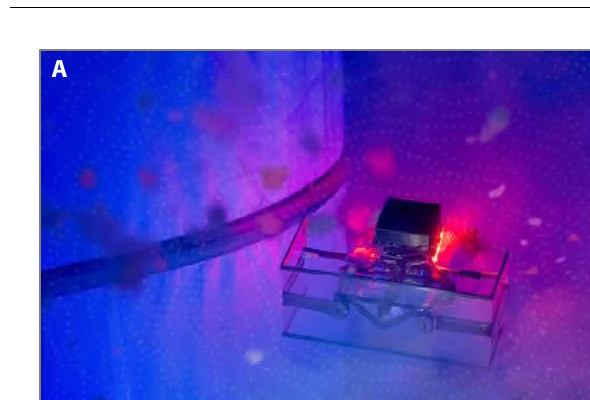
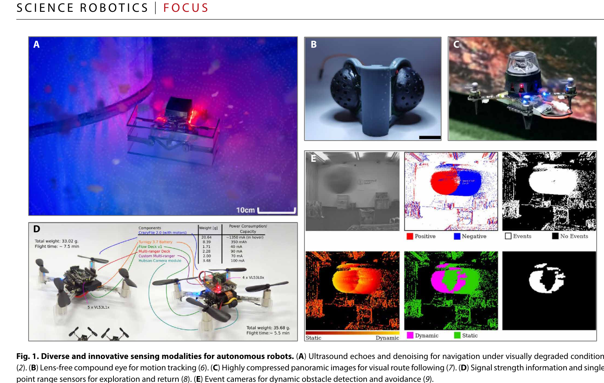

# 被遗忘的频谱：复兴超声波以构建鲁棒自主系统

> **原文信息**
> - 英文题目：*The Forgotten Spectrum: Reviving Ultrasound for Robust Autonomy*
> - 作者：Xin Zhou、Fei Gao
> - 文献类型：*Science Robotics* Focus 评论文章，不是 Saranga 系统的完整技术论文
> - 发表信息：*Science Robotics*，第 11 卷第 112 期，文章号 eaef8847，2026 年 3 月 25 日
> - DOI：[10.1126/scirobotics.aef8847](https://doi.org/10.1126/scirobotics.aef8847)
> - 本地原始论文：[The Forgotten Spectrum Reviving Ultrasound for Robust Autonomy.pdf](../The%20Forgotten%20Spectrum%20Reviving%20Ultrasound%20for%20Robust%20Autonomy.pdf)
> - 页码说明：本地 PDF 有 3 页，正文实际为前 2 页，第 3 页是在线文章与版权信息。

## 1. 先说明这篇文章是什么

这不是一篇给出完整网络结构、损失函数和实验表格的原创系统论文，而是一篇两页的 Focus 评论。作者借同一期 *Science Robotics* 中 Velmurugan 等人的 Saranga 系统说明一个更广泛的观点：机器人不应惯性地把视觉或激光雷达当作唯一主传感器；在烟雾、黑暗、雪、强眩光、玻璃和薄障碍物环境中，低功耗超声波配合现代硬件降噪与边缘人工智能，可能比主流光学方案更可靠。

因此，下文会详细解释原文的技术逻辑和工程意义，但不会把评论文章没有提供的网络层数、训练损失、测距精度或成功率“补写”出来。若要复现 Saranga，应继续阅读原文引用 [2]：*Milliwatt ultrasound for navigation in visually degraded environments on palm-sized aerial robots*。

## 2. 一句话概括

**选择传感器应看哪一种物理信号在目标环境中仍然可靠，而不是先默认使用相机或激光雷达，再为它们的失效打补丁；经过软硬件协同设计，曾被视为低端测距器的超声波也能进入自主导航主链路。**

## 3. 任务背景：主流光学感知为什么会在关键时刻失效

相机和激光雷达能提供丰富外观或几何信息，因此是机器人导航的通用做法。但它们都依赖光子与环境交互：

- 搜救建筑里的烟雾会散射光；
- 黑暗管廊没有足够照明；
- 雪、雾和强眩光让成像或测距质量突降；
- 玻璃和薄结构可能让视觉/激光产生穿透、弱回波或错误几何；
- 小型无人机又无法随意增加重型传感器和高功耗计算平台。

这些并非“平均准确率下降一点”的问题。导航感知可能突然失效，而失效恰好发生在救援、巡检等最需要可靠性的场景。

超声波通过空气压力波传播，不依赖可见光，因而在视觉退化条件中仍能工作，也能对薄或透明障碍物产生回波。原文用自然界作直观例子：约 2 克的熊蜂蝠依靠超声回声定位飞行，能够探测约 8 毫米物体（PDF 第 1 页；该数字来自原文引用 [4]）。

## 4. 为什么超声波过去只被当作“倒车雷达”

传统机器人超声波常被认为：

- 探测距离短；
- 空间分辨率粗；
- 容易受多径反射影响；
- 回波衰减后信噪比低；
- 无人机螺旋桨本身会产生强声学噪声，掩盖目标回波。

当系统只看单次回波、用固定阈值报一个最近距离时，这些缺点非常突出。所以主流自主导航逐渐转向相机和激光雷达，超声波退到简单近距离防撞角色。

Focus 文章认为，这个结论部分来自**过去的使用方式**，不代表超声波的物理上限。现代低功耗计算能够利用长时间回波历史，硬件也能在噪声进入传感器前先阻断一部分干扰。

## 5. 当前通用传感方案对比

| 传感方式 | 常见优势 | 典型失效或代价 | 在小型自主机器人中的位置 |
| --- | --- | --- | --- |
| 普通相机 | 分辨率高、语义和纹理丰富、价格低 | 黑暗、雾烟、眩光、无纹理和透明物体困难 | 常作为主传感器，但需照明或备份模态 |
| 激光雷达 | 直接三维测距、几何精度高 | 烟尘散射、透明/镜面材料、重量功耗和成本 | 中大型平台常用，小型无人机受载荷限制 |
| 热成像 | 黑暗中可工作 | 细节少、温差小时对比弱，几何深度有限 | 搜救辅助感知 |
| 毫米波/无线电 | 雨雾穿透和测速能力较好 | 多径、局部结构干扰；高分辨率阵列和处理有代价 | 全天候补充模态 |
| 事件相机 | 高动态范围、低延迟、适合快速运动 | 输出稀疏、静止场景信息少，算法门槛高 | 高速运动感知 |
| 传统超声波 | 低成本、低功耗、不依赖光、能感知透明/薄物体 | 短距、低分辨率、旋翼噪声和多径严重 | 通常只做近距备份 |
| **现代超声波方案** | 物理隔噪 + 长历史学习去噪 + 板载推理 | 仍需平台专用封装、标定、数据与工具链 | 原文主张可直接进入导航管线 |

原文还提到红外距离、触觉/力觉、气压计、磁力计、麦克风阵列、无线信号、化学/气体传感器等“非主流”模态。它们各有明显缺点，但也可能在特定退化条件下保留独特信息。

## 6. Saranga 路线：原文实际提供了哪些技术信息

### 6.1 输入与输出边界

Focus 原文明确说 Saranga 使用**双低功耗超声波传感器套件**，处理极低峰值信噪比回波，并利用长时域回波时间历史。它没有给出输入张量尺寸、采样频率、网络层数或最终输出的数学定义。

从文中能安全确认的系统级输入输出是：

- 输入：连续超声回波历史，以及传感器/平台产生的真实噪声环境；
- 处理：硬件物理降噪和深度学习去噪；
- 输出用途：为机载感知和导航提供环境信息，并可估计系统何时不确定；
- 最终闭环：手掌大小无人机依靠板载感知与计算在视觉退化环境中导航，不依赖外部基础设施。

### 6.2 第一道防线：先在物理层阻挡旋翼噪声

螺旋桨噪声与目标超声回波可能共享频段。如果原始信号已经被强干扰淹没，单靠普通软件滤波很难恢复。Saranga 的第一步是用谨慎的硬件设计阻挡螺旋桨诱发的超声噪声，提高进入后端的信号质量。

这体现了软硬件协同：传感器安装位置、外壳、挡板和电机距离不是最后再处理的机械细节，而是感知算法成立的组成部分。

### 6.3 第二道防线：从长历史中找连续结构

单次回波容易被随机噪声和多径误导。深度学习去噪模型观察长时间的回波历史，寻找随机器人运动持续存在的弱结构。训练数据来自合成管线，并混入有限的真实噪声数据。

这里应避免旧稿中的过度推断：Focus 原文没有说明模型究竟是循环神经网络、长短期记忆网络、一维卷积还是其他结构，也没有给出损失函数。因此可确认的是“长时域深度学习去噪”，不能进一步指定网络实现。

### 6.4 不只是输出一个距离，也要表达“不确定”

原文强调超声波可直接进入自主管线。借助时间序列，系统可以判断自己何时不确定，例如区分真正开放空间与会让视觉困惑的光滑反射表面。对于小型机器人，这种不确定性可指导多模态权重、减速或重新观察，而不是只输出一个看似确定的距离值。

## 7. 原论文图示

*图：Saranga 超声波无人机在视觉退化环境中的回波与去噪导航示例，是综合 Fig. 1 的 A 子图。来源：原论文 Fig. 1A，PDF 第 2 页。*

*图：原文并列展示超声波、无透镜复眼、压缩全景视觉、单点距离与信号强度、事件相机等方案，说明文章主题并非只推广一种传感器，而是重新评估不同物理模态。来源：原论文 Fig. 1，PDF 第 2 页。*

## 8. 文中报告的效果：哪些可以确认，哪些没有提供

Focus 对 Saranga 给出的可确认数字和场景为（PDF 第 1 页）：

- 四旋翼尺寸约 **0.16 米**；
- 整机成本约 **400 美元**；
- 超声波感知功耗仅 **1.2 毫瓦**；
- 只使用板载感知与计算，不依赖外部设施；
- 能在杂乱环境的浓雾、黑暗和雪中导航；
- 能绕开薄障碍物和透明障碍物。

这篇 Focus 没有给出：导航成功率、碰撞次数、测距误差、最大速度、有效距离、网络参数量、推理时延、雾密度或与激光雷达的同条件数值表。因此不能把“能够导航”擅自改写为“准确率达到某百分比”，也不能用消费级激光雷达功耗作未经原文控制的倍数比较。

## 9. 这篇 Focus 的真正贡献

### 9.1 原则驱动的传感器选择

先问“任务环境会破坏哪种物理信号、保留哪种物理信号”，再选传感器。烟雾破坏光学传播但不一定阻断声波；透明材料对光学困难，却可能产生明显声学回波。

### 9.2 低端传感器 + 现代计算不等于低端系统

传统传感器的历史评价往往基于单帧阈值和弱计算平台。长时序模型、学习去噪和数据驱动标定可能从噪声测量中提取过去无法利用的结构。

### 9.3 平均精度不够，应测试受控退化

作者建议基准不仅报告理想条件平均准确率，还应控制并扫描：雾密度、照明、螺旋桨转速和多径严重程度。安全关键系统需要知道性能在哪个退化点突然崩溃。

### 9.4 把平台噪声当作设计约束

声学、热学和无线传感会与电机、外壳和电磁屏蔽强耦合。把这些作用只当作后处理噪声，会错过从机械布局和封装提高信噪比的机会。

## 10. 局限、风险与适用边界

### 10.1 Focus 本身的证据边界

- 它是评论文章，核心实验来自被评论的 Saranga 论文；本篇没有足够细节支持独立复现。
- 图 1A 来自 Saranga，其他子图来自不同论文，不能把 B—E 的性能当成 Saranga 系统能力。
- 文章主张重新重视超声波，不是声称它全面替代视觉和激光雷达。

### 10.2 超声波仍有物理限制

- 波束宽、角分辨率和可生成的空间细节通常不及高分辨率相机/激光雷达；
- 多径可把墙面或角落反射解释成错误距离；
- 软材料、斜面和几何结构会改变回波强度；
- 空气吸收、温湿度与传感频率影响可用距离；
- 多个超声发射器之间可能互相干扰；
- 平台布局改变后，原有噪声模型和学习模型可能不再适用。

### 10.3 工具链尚不成熟

原文明确指出还需要更好的算法和实用工具，包括简便标定、与视觉/激光对齐的开放数据集，以及更清楚的融合质量评价。超声波生态还没有视觉同步定位与建图那样丰富的标准数据、标定和开源组件。

## 11. 面向工程复现的步骤

1. **先读被评论的 Saranga 原始技术论文。** 本 Focus 只能指导方向，不能替代传感器电路、采样和网络实现细节。
2. **保存原始回波，不只保存厂商距离值。** 长历史学习去噪需要连续波形或回波时间历史；一个最终距离数字已经丢失大部分信息。
3. **测平台自身噪声。** 分别记录电机关闭、不同转速、不同机动和不同安装位置的回波，建立噪声地图。
4. **先做硬件降噪，再训练模型。** 比较挡板、隔振、传感器朝向与旋翼距离；如果原始信噪比没有改善，网络很可能只记住某一平台噪声。
5. **合成数据与真实噪声分开核验。** 记录合成场景覆盖的材料、入射角和多径；真实测试必须包含训练没见过的房间和表面。
6. **输出置信度并接入安全策略。** 低置信时减速、悬停、改变观察角或切换其他模态，而不是强行输出一个距离。
7. **建立受控退化矩阵。** 扫描雾浓度、照度、旋翼转速、透明/薄障碍物和多径房间，报告成功率、最小距离、假阳性、假阴性、功耗和尾部时延。
8. **重新装配后必须重测。** 电机、外壳、挡板或安装角变化都会改变声学环境，不能默认旧模型直接迁移。

## 12. 外行读完应记住什么

这篇文章的重点不是“超声波比相机高级”，而是：**不同传感器观察的是不同物理世界。** 在正常光照里，相机可能给出最多信息；在浓雾、黑暗或玻璃环境里，压力波可能更值得信任。

现代自主系统的鲁棒性往往来自互补，而不是把所有希望压在最流行的单一传感器上。Saranga 的案例说明，极低功耗超声波加上物理隔噪、长时序学习和板载推理，有机会把过去的辅助传感器升级成安全关键环境中的主要信息源；但要复现具体性能，必须回到被评论的原始系统论文和完整实验，而不能从这篇两页 Focus 推导不存在的细节。
