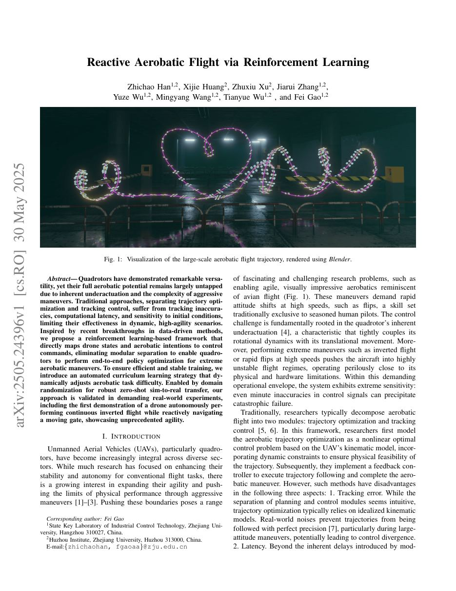
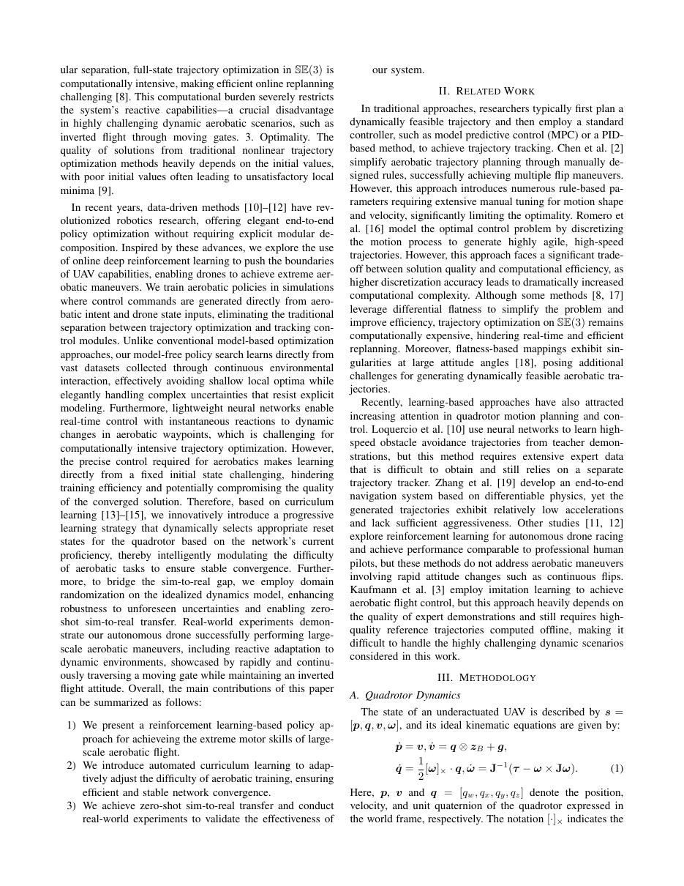
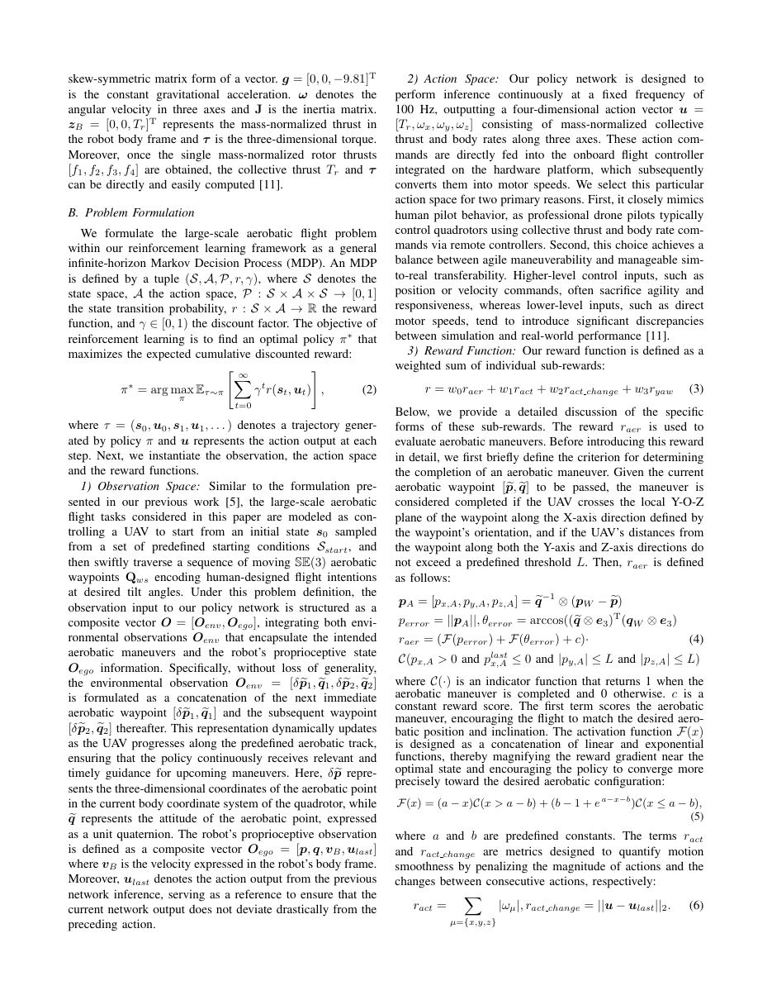
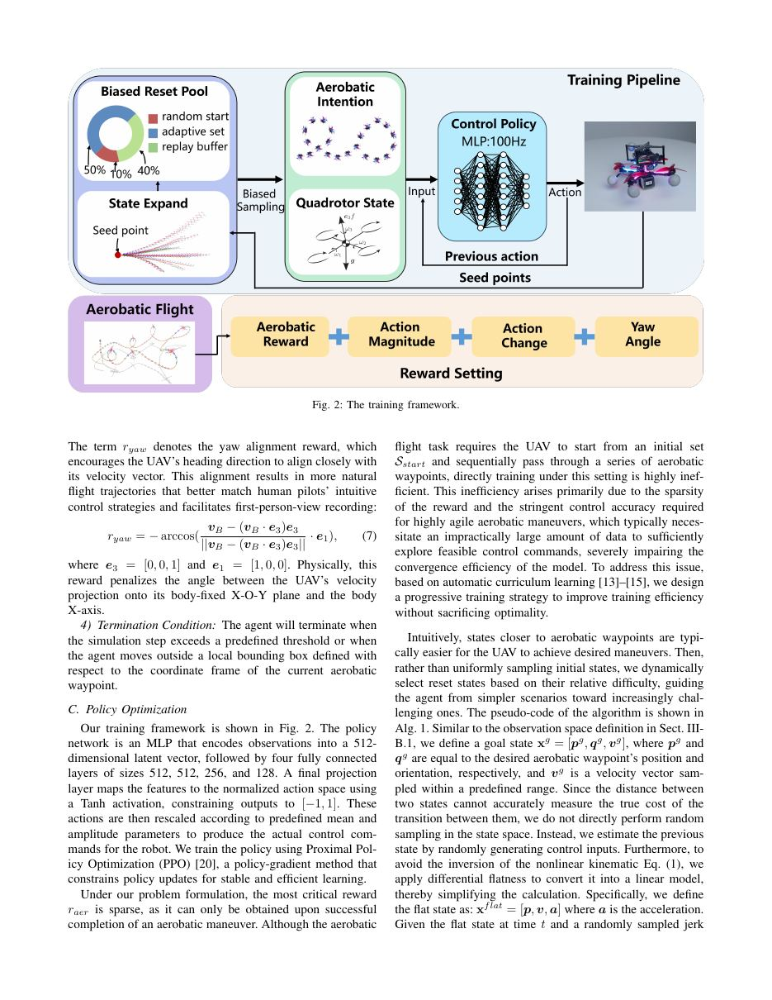
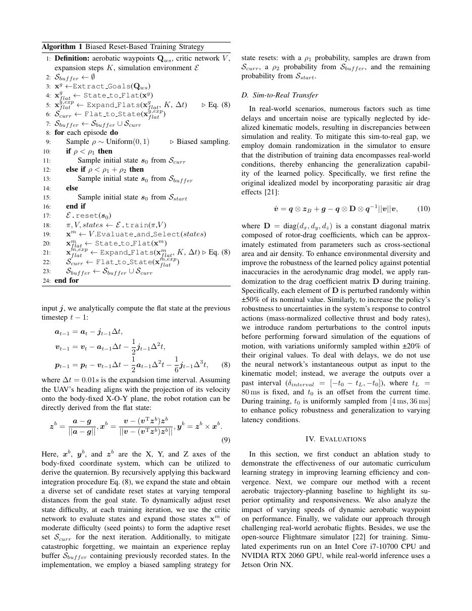
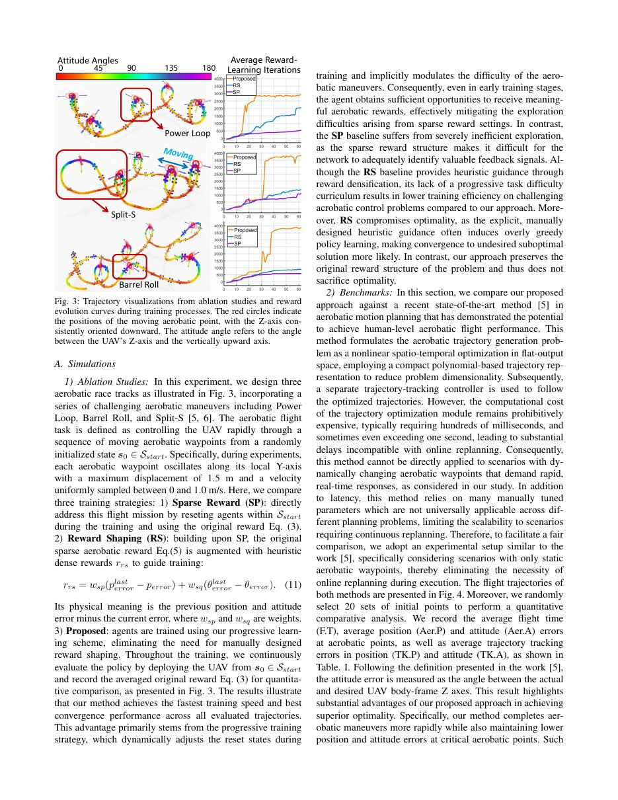
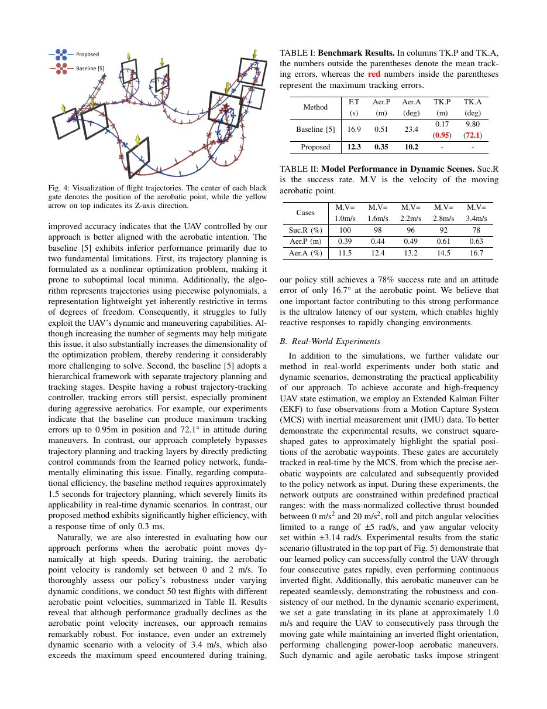
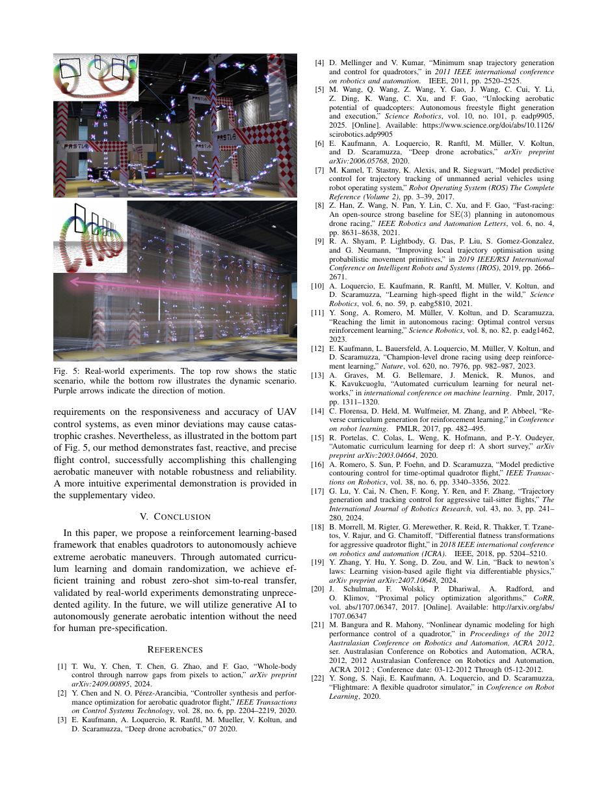

# 《Reactive Aerobatic Flight via Reinforcement Learning》中文详解：原文忠实翻译

> 原文标题：Reactive Aerobatic Flight via Reinforcement Learning
> 原文 PDF：[02_Reactive_Aerobatic_Flight_via_Reinforcement_Learning.pdf](../02_Reactive_Aerobatic_Flight_via_Reinforcement_Learning.pdf)
> 对应中文详解：[02_强化学习反应式特技飞行.md](../中文详解/02_强化学习反应式特技飞行.md)
> 翻译范围：按本地英文 PDF 逐页整理；图号、公式、表号和参考文献以原文页面为准。
> 使用说明：页面图片是原文核对依据。PDF 文本层对双栏、公式和表格的提取可能不完整，遇到提取异常时以页面图片和原 PDF 为准。

---

## 原文第 1 页



arXiv:2505.24396v1 [cs.RO] 2025 年 5 月 30 日。《基于强化学习的反应式特技飞行》；作者：Zhichao Han、Xijie Huang、Zhuxiu Xu、Jiarui Zhang、Yuze Wu、Mingyang Wang、Tianyue Wu、Fei Gao。

图 1：使用 Blender 渲染的大型特技飞行轨迹的可视化。

摘要：四旋翼无人机已表现出非凡的多功能性，但其全部特技飞行潜力在很大程度上尚未开发

由于固有的欠驱动特性和激进机动的复杂性。传统方法将轨迹优化与跟踪控制分开处理，但存在跟踪不准、计算延迟以及对初始条件敏感等问题，限制了其在动态、高机动场景中的效果。受近期数据驱动方法进展的启发，本文提出一种基于强化学习的框架，直接把无人机状态和特技飞行意图映射为控制命令，取消两个模块之间的割裂，使四旋翼能够通过端到端策略执行极限特技飞行。为保证训练高效、稳定，本文引入自动课程学习策略，动态调整特技任务难度；并通过域随机化提高策略的稳健性，实现从仿真到真实环境的零样本迁移。真实飞行实验验证了该方法，包括无人机在反应式通过移动门的同时自主连续完成倒飞，展示了较强的机动能力。

一、简介

无人机（UAV），特别是四旋翼无人机，已经越来越成为各个领域不可或缺的一部分。虽然许多研究都集中在增强它们执行传统飞行任务的稳定性和自主性，但人们越来越有兴趣通过积极的机动来扩展它们的敏捷性并突破身体表现的极限[1]-[3]。突破这些界限构成了一个范围

Corresponding author: Fei Gao

1浙江大学工业控制技术国家重点实验室,杭州 310027 2浙江大学湖州学院,湖州 313000

E-mail:{zhichaohan, fgaoaa}@zju.edu.cn

令人着迷且具有挑战性的研究问题，例如实现敏捷、视觉上令人印象深刻的特技飞行，让人想起鸟类飞行（图 1）。这些机动需要在高速下快速改变姿态，例如翻转，这是经验丰富的人类飞行员传统上独有的技能。控制挑战从根本上根源于四旋翼无人机固有的欠驱动[4]，这一特性将其旋转动力学与其平移运动紧密耦合。此外，执行倒飞或高速快速翻转等极端机动会将飞机推入高度不稳定的飞行状态，其运行危险接近其物理和硬件限制。在这种要求严格的操作范围内，系统表现出极高的灵敏度：即使控制信号中的微小误差也可能导致灾难性故障。传统上，研究人员通常将特技飞行分解为两个模块：轨迹优化和跟踪控制[5, 6]。在此框架中，研究人员首先将特技飞行轨迹优化建模为基于无人机运动学模型的非线性最优控制问题，并结合动态约束以确保轨迹的物理可行性。随后，他们使用反馈控制器来执行轨迹跟踪并完成特技机动。然而，此类方法存在以下三个方面的缺点： 1.跟踪误差。虽然规划和控制模块的分离看起来很直观，但轨迹优化通常依赖于理想化的运动学模型。 现实世界的噪声会阻碍轨迹的完美精确度 [7]，特别是在大姿态机动期间，可能导致控制发散。

2. 延迟。除模块化方法本身引入的固有延迟外，

## 原文第 2 页



SE(3) 中的空间分离、全状态轨迹优化是计算密集型的，使得高效的在线重新规划具有挑战性 [8]。这种计算负担严重限制了系统的反应能力，这在极具挑战性的动态特技飞行场景中是一个关键缺点，例如通过移动门的倒飞。 3. 最优性。传统非线性轨迹优化方法的解的质量在很大程度上取决于初始值，较差的初始值通常会导致局部最小值不令人满意[9]。近年来，数据驱动的方法[10]-[12]彻底改变了机器人研究，提供了优雅的端到端策略优化，而不需要显式的模块化分解。受这些进步的启发，我们探索使用在线深度强化学习来突破无人机能力的界限，使无人机能够实现极限特技飞行。我们在模拟中训练特技策略，其中控制命令直接从特技飞行意图和无人机状态输入生成，消除了轨迹优化和跟踪控制模块之间的传统分离。与传统的基于模型的优化方法不同，我们的无模型策略搜索直接从通过连续环境交互收集的大量数据集中学习，有效地避免浅层局部最优，同时优雅地处理阻碍显式建模的复杂不确定性。 此外，轻量级神经网络可以对特技飞行航路点的动态变化做出即时反应，从而实现实时控制，这对于计算密集型轨迹优化来说是一个挑战。然而，特技飞行所需的精确控制使得直接从固定初始状态学习具有挑战性，阻碍了训练效率并可能损害收敛解的质量。因此，在课程学习[13]-[15]的基础上，我们创新性地引入了一种渐进式学习策略，根据网络当前的熟练程度动态地为四旋翼无人机选择合适的重置状态，从而智能调节特技飞行任务的难度以确保稳定收敛。此外，为了弥合模拟与真实的差距，我们在理想化动力学模型上采用域随机化，增强对不可预见的不确定性的鲁棒性，并实现零样本模拟到真实的转换。现实世界的实验表明，我们的自主无人机成功地执行了大规模特技飞行，包括对动态环境的反应性适应，通过快速、连续地穿过移动门同时保持倒转飞行姿态来展示。总的来说，本文的主要贡献可以概括如下：

1）我们提出了一种基于强化学习的策略方法，用于实现大规模特技飞行的极限运动技能。

2）引入自动化课程学习，自适应调整特技训练难度，保证

高效稳定的网络收敛。

3）我们实现了零样本模拟到真实的迁移并进行

现实世界的实验来验证我们系统的有效性。

二.相关工作

在传统方法中，研究人员通常首先规划动态可行的轨迹，然后采用标准控制器（例如模型预测控制（MPC）或基于 PID 的方法）来实现轨迹跟踪。陈等人。 [2]通过手动设计规则简化特技飞行轨迹规划，成功实现多次翻转机动。然而，这种方法引入了许多基于规则的参数，需要对运动形状和速度进行大量手动调整，从而显着限制了最优性。罗梅罗等人。 [16]通过离散运动过程来建模最优控制问题，以生成高度敏捷、高速的轨迹。然而，这种方法面临着解决方案质量和计算效率之间的重大权衡，因为更高的离散精度会导致计算复杂性急剧增加。尽管一些方法 [8, 17] 利用差分平坦度来简化问题并提高效率，但 SE(3) 上的轨迹优化在计算上仍然昂贵，阻碍了实时和高效的重新规划。此外，基于平坦度的映射在大姿态角下表现出奇点[18]，为生成动态可行的特技飞行轨迹带来了额外的挑战。最近，基于学习的方法在四旋翼无人机运动规划和控制方面也引起了越来越多的关注。洛克尔西奥等人。 [10]使用神经网络从教师演示中学习高速避障轨迹，但这种方法需要大量难以获得的专家数据，并且仍然依赖于单独的轨迹跟踪器。张等人。 [19]开发了一种基于可微物理的端到端导航系统，但生成的轨迹表现出相对较低的加速度并且缺乏足够的攻击性。其他研究 [11, 12] 探索了自主无人机竞赛的强化学习，并实现了与专业人类飞行员相当的性能，但这些方法并没有解决涉及快速姿态变化（例如连续翻转）的特技飞行。考夫曼等人。 [3]采用模仿学习来实现特技飞行控制，但这种方法在很大程度上依赖于专家演示的质量，并且仍然需要离线计算的高质量参考轨迹，使得难以处理本工作中考虑的极具挑战性的动态场景。

三．方法论

A. 四旋翼无人机动力学

欠驱动无人机的状态用 s = [p, q, v, ω] 描述，其理想运动学方程为： ṗ = v, v̇ = q ⊗ zB + g, q̇ = 1 2 [ω]× · q, ω̇ = J−1 (τ − ω × Jω)。 (1) 其中，p、v 和 q = [qw, qx, qy, qz] 分别表示四旋翼无人机在世界坐标系中的位置、速度和单位四元数。符号[·]×表示

## 原文第 3 页



向量的斜对称矩阵形式。 g = [0, 0, -9.81]T 是恒定的重力加速度。 ω 表示三轴角速度，J 是惯性矩阵。

**公式（按原文提取）**

```text
zB = [0, 0, Tr]T
```

表示机器人主体框架中的质量归一化推力，τ 是三维扭矩。此外，一旦获得单个质量归一化转子推力[f1，f2，f3，f4]，就可以直接轻松地计算集体推力Tr和τ[11]。

B. 问题表述

我们在强化学习框架内将大规模特技飞行问题表述为通用的无限时域马尔可夫决策过程（MDP）。 MDP 由元组 (S, A, P, r, γ) 定义，其中 S 表示状态空间，A 表示动作空间，P: S × A × S → [0, 1] 状态转移概率，r: S × A → R 奖励函数，γ ∈ [0, 1) 折扣因子。强化学习的目标是找到一个最优策略 π*，使预期累积折扣奖励最大化：

**公式（按原文提取）**

```text
π∗ = arg max π Eτ∼π
```

” ∞

X t=0 γt r(st, ut)

#, (2) 其中 τ = (s0, u0, s1, u1,...) 表示策略 π 生成的轨迹，u 表示每一步的动作输出。接下来，我们实例化观察、动作空间和奖励函数。

1）观测空间：与我们之前的工作[5]中提出的公式类似，大型特技飞行

本文考虑的飞行任务被建模为控制无人机从从一组预定义的启动条件 Sstart 采样的初始状态 s0 开始，然后快速遍历一系列移动 SE(3) 特技航点 Qws，以所需的倾斜角度编码人类设计的飞行意图。在这个问题定义下，我们策略网络的观测输入被构造为一个复合向量 O = [Oenv, Oego]，整合了封装预期特技飞行的环境观测 Oenv 和机器人的本体感受状态 Oego 信息。具体而言，不失一般性，环境观测值 Oenv = [δ e p1, e q1, δ e p2, e q2] 被公式化为下一个立即特技飞行航路点 [δ e p1, e q1] 及其后的后续航路点 [δ e p2, e q2] 的串联。随着无人机沿着预定义的特技飞行轨道前进，这种表示会动态更新，确保策略持续收到针对即将进行的演习的相关且及时的指导。这里，δ e p 表示特技航路点在四旋翼当前机身坐标系中的三维坐标，而 e q 表示特技航路点的姿态，以单位四元数表示。机器人的本体感受观测被定义为复合向量 Oego = [p, q, vB, ulast]，其中 vB 是机器人身体框架中表示的速度。 另外，ulast表示之前网络推理的动作输出，作为参考，保证当前网络输出不会与之前的动作有太大偏差。

2) 行动空间：我们的策略网络旨在

以 100 Hz 的固定频率连续进行推理，输出由质量归一化的集体推力和沿三个轴的身体速率组成的四维动作向量 u = [Tr, ωx, ωy, ωz]。这些动作命令直接输入到集成在硬件平台上的机载飞行控制器中，随后将其转换为电机速度。我们选择这个特定的行动空间有两个主要原因。首先，它非常模仿人类飞行员的行为，因为专业无人机飞行员通常通过遥控器使用集体推力和机身速率命令来控制四旋翼无人机。其次，这种选择实现了敏捷可操作性和可管理的模拟真实可迁移性之间的平衡。较高级别的控制输入（例如位置或速度命令）通常会牺牲敏捷性和响应能力，而较低级别的输入（例如直接电机速度）往往会在仿真和实际性能之间引入显着差异[11]。

3）奖励函数：我们的奖励函数定义为

各个子奖励的加权总和：

**公式（按原文提取）**

```text
r = w0raer + w1ract + w2ract change + w3ryaw (3)
```

下面，我们详细讨论一下这些子奖励的具体形式。奖励率用于评估特技飞行。在详细介绍这个奖励之前，我们首先简单定义一下确定特技飞行完成的标准。给定当前要经过的特技航路点[ep, e q]，如果无人机沿航路点方向定义的X轴方向穿过该航路点的局部Y-O-Z平面，并且无人机沿Y轴和Z轴方向与航路点的距离不超过预定义的阈值L，则认为机动完成。那么，raer定义如下：

pA = [px,A, py,A, pz,A] = e q−1 ⊗ (pW − e p) perror = ||pA||, θerror = arccos((e q ⊗ e3)T (qW ⊗ e3) raer = (F(perror) + F(θerror) + c)· (4) C(px,A > 0 且 plast

x,A ≤ 0 且 |py,A| ≤ L 和 |pz,A| ≤ L) 其中 C(·) 是指示函数，当特技飞行完成时返回 1，否则返回 0。 c 是一个恒定的奖励分数。第一项对特技飞行进行评分，鼓励飞行匹配所需的特技飞行位置和倾斜度。激活函数 F(x) 被设计为线性函数和指数函数的级联，从而放大接近最佳状态的奖励梯度，并鼓励策略更精确地收敛到所需的特技配置：F(x) = (a − x)C(x > a − b) + (b − 1 + ea−x−b)C(x ≤ a − b), (5) 其中 a 和 b 是预定义常数。术语“ract”和“racchange”是旨在通过分别惩罚动作幅度和连续动作之间的变化来量化运动平滑度的指标：

**公式（按原文提取）**

```text
ract = X
```

µ={x,y,z} |ωµ|，实际变化 = ||u − ulast||2。 (6)

## 原文第 4 页



图 2：训练框架。策略网络根据无人机状态和特技航路点输出控制量，环境返回状态与奖励；自动课程学习模块根据当前策略表现调整初始状态分布。

术语 ryaw 表示偏航对齐奖励，它鼓励无人机的航向与其速度矢量紧密对齐。这种对齐会产生更自然的飞行轨迹，更好地匹配人类飞行员的直观控制策略并促进第一人称视角记录：

**公式（按原文提取）**

```text
ryaw = − arccos(
```

vB − (vB·e3)e3 ||vB − (vB·e3)e3|| · e1), (7) 其中 e3 = [0, 0, 1] 且 e1 = [1, 0, 0]。从物理上讲，这种奖励会惩罚无人机在其机身固定 X-O-Y 平面上的速度投影与机身 X 轴之间的角度。

4) 终止条件：代理将在以下情况终止：

模拟步骤超过预定义的阈值，或者当代理移动到相对于当前特技航路点的坐标系定义的局部边界框之外时。

三、策略优化

我们的训练框架如图 2 所示。策略网络是一个 MLP，它将观测值编码为 512 维的潜在向量，后面是四个大小分别为 512、512、256 和 128 的全连接层。最后的投影层使用 Tanh 激活将特征映射到归一化动作空间，将输出限制为 [−1, 1]。然后根据预定义的平均值和幅度参数重新调整这些动作，以产生机器人的实际控制命令。我们使用近端策略优化（PPO）[20]来训练策略，这是一种限制策略更新以实现稳定和高效学习的策略梯度方法。根据我们的问题表述，最关键的奖励很少，因为它只能在成功完成特技飞行后才能获得。虽然特技飞行任务需要无人机从初始设定Sstart开始，依次经过一系列特技航路点，但直接在此设置下训练效率极低。这种低效率的出现主要是由于高度敏捷的特技飞行所需的奖励稀疏和严格的控制精度，这通常需要不切实际的大量数据来充分探索可行的控制命令，严重损害了模型的收敛效率。为了解决这个问题，基于自动课程学习[13]-[15]，我们设计了一种渐进式训练策略，在不牺牲最优性的情况下提高训练效率。 直观上，距离特技飞行航路点越近的州通常更容易让无人机实现所需的机动。然后，我们不是均匀地采样初始状态，而是根据相对难度动态选择重置状态，引导代理从更简单的场景转向更具挑战性的场景。该算法的伪代码如 Alg 所示。 1. 与《Sect.》中观察空间的定义类似。 III- B.1，我们定义一个目标状态xg

**公式（按原文提取）**

```text
= [pg , qg , vg ], where pg
```

qg 和 qg 分别等于所需特技飞行航路点的位置和方向，vg 是在预定义范围内采样的速度矢量。由于两个状态之间的距离无法准确衡量它们之间转移的真实成本，因此我们不直接在状态空间中进行随机采样。相反，我们通过随机生成控制输入来估计先前的状态。此外，为了避免非线性运动学方程的反演。 (1)，我们应用微分平坦度将其转换为线性模型，从而简化计算。具体来说，我们将平坦状态定义为：xflat

**公式（按原文提取）**

```text
= [p, v, a] where a is the acceleration.
```

给定时间 t 处的平坦状态和随机采样的加加速度

## 原文第 5 页



算法 1 基于偏置重置的训练策略

1: 定义：特技飞行航路点 Qws、价值网络 V、扩展步骤 K、模拟环境 E 2: Sbuffer ← ∅ 3: xg ←提取目标(Qws) 4: xg flat ← 状态到 Flat(xg) 5: xg,exp flat ← 展开 Flats(xg flat, K, Δt) ▷ 方程 1 (8) 6: Scurr ← Flat to State(xg,exp flat) 7: Sbuffer ← Sbuffer ∪ Scurr 8: 对于每集做 9: Sample ρ ∼ Uniform(0, 1) ▷ 有偏差采样。 10: if ρ < ρ1 then 11: 从 Scurr 中采样初始状态 s0 12: else if ρ < ρ1 + ρ2 then 13: 从 Sbuffer 中采样初始状态 s0 14: else 15: 从 Sstart 中采样初始状态 s0 16: end if 17: E.reset(s0) 18: π, V, states ← E.train(π,V) 19: xm ← V.Evaluate and Select(states) 20: xm flat ← State to Flat(xm) 21: xm,exp flat ← Expand Flats(xm flat, K, Δt) ▷ 等式. (8) 22: Scurr ← Flat to State(xm,exp flat) 23: Sbuffer ← Sbuffer ∪ Scurr 24: 输入 j 结束，我们分析计算前一个时间步 t − 1 的平坦状态： at−1 = at − jt−1Δt, vt−1 = vt − at−1Δt − 1 2 jt−1Δ2 t, pt−1 = pt − vt−1Δt − 1 2 at−1Δ2 t − 1 6 jt−1Δ3 t, (8) 其中 Δt = 0.01s 是膨胀时间间隔。假设无人机的航向与其速度在机身固定 X-O-Y 平面上的投影对齐，则机器人旋转可以直接从平面状态导出： zb

**公式（按原文提取）**

```text
=
```

a − g ||a − g||, xb

**公式（按原文提取）**

```text
=
```

v − (vT

zb)zb ||v − (vTzb)zb||, yb

= zb × xb。 (9)

这里，xb、yb和zb是身体固定坐标系的X、Y和Z轴，可以用来推导四元数。通过递归地应用这个后向积分过程方程。 (8)，我们扩展状态并在距目标状态不同时间距离处获得一组不同的候选重置状态。为了动态调整重置状态难度，在每次训练迭代中，我们使用批评者网络来评估状态并扩展那些中等难度的状态 xm （种子点）以形成下一次迭代的自适应重置集 Scurr。此外，为了减轻灾难性遗忘，我们维护一个包含先前记录状态的体验重放缓冲区 Sbuffer。在实现中，我们采用有偏采样策略进行状态重置：以 ρ1 概率从 Scurr 中抽取样本，从 Sbuffer 中抽取 ρ2 概率，剩余概率从 Sstart 中抽取。

D. 模拟到真实的传输

在现实场景中，理想化的运动学模型通常会忽略时间延迟和不确定噪声等众多因素，从而导致模拟与现实之间的差异。为了缩小这种模拟与真实的差距，我们在模拟器中采用域随机化，以确保训练数据的分布包含真实世界的条件，从而强化学习策略的泛化能力。具体来说，我们首先通过结合寄生空气阻力效应来完善原始理想化模型[21]： v̇ = q ⊗ zB + g − q ⊗ D ⊗ q−1 ||v||v, (10) 其中 D = diag(dx, dy, dz) 是由转子阻力系数组成的常数对角矩阵，可以根据横截面积和空气密度等参数进行近似估计。为了增强环境多样性并提高学习策略的鲁棒性，以防止气动阻力模型中潜在的不准确性，我们在训练期间对阻力系数矩阵 D 应用随机化。具体来说，D 的每个元素在其标称值的 ±50% 范围内随机扰动。同样，为了提高策略对系统对控制行为（质量归一化集体推力和身体速率）响应的不确定性的鲁棒性，我们在对运动方程进行正向模拟之前对控制输入引入随机扰动，并在原始值的±20%范围内均匀采样变化。 为了处理延迟，我们不使用神经网络的瞬时输出作为运动学模型的输入；相反，我们对过去的时间间隔 (δinterval = [−t0 − tL, −t0]) 的输出进行平均，其中 tL = 80 ms 是固定的，t0 是与​​当前时间的偏移量。在训练期间，t0 从 [4 ms，36 ms] 中均匀采样，以增强策略的稳健性和对不同延迟条件的泛化。

四．评价

在本节中，我们首先进行消融研究，以证明我们的自动课程学习策略在提高学习效率和收敛性方面的有效性。接下来，我们将我们的方法与最近的特技飞行轨迹规划基线进行比较，以突出其卓越的最优性和响应能力。我们还分析了动态特技航路点的不同速度对性能的影响。最后，我们通过挑战现实世界的特技飞行来验证我们的方法。此外，我们使用开源Flightmare模拟器[22]进行训练。模拟实验在 Intel Core i7-10700 CPU 和 NVIDIA RTX 2060 GPU 上运行，而现实世界的推理则使用 Jetson Orin NX。

## 原文第 6 页



0 45 90 135 180 姿态角 动力回路 移动 Split-S 桶滚 平均奖励学习迭代

图 3：消融研究和奖励的轨迹可视化

训练过程中的进化曲线。红色圆圈表示移动特技航路点的位置，Z轴始终向下。姿态角是指无人机Z轴与垂直向上轴之间的夹角。

A. 模拟

1）消融研究：在这个实验中，我们设计了三个

如图 3 所示的特技飞行跑道，包含一系列具有挑战性的特技飞行动作，包括 Power Loop、Barrel Roll 和 Split-S [5, 6]。特技飞行任务被定义为从随机初始化状态 s0 ∈ Sstart 通过一系列移动特技航路点快速控制无人机。具体来说，在实验过程中，每个特技飞行航路点沿其局部 Y 轴振荡，最大位移为 1.5 m，采样速度均匀在 0 至 1.0 m/s 之间。在这里，我们比较三种训练策略： 1）稀疏奖励（SP）：通过在训练期间重置 Sstart 中的代理并使用原始奖励方程来直接解决此飞行任务。 （3）。

2) 奖励塑造（RS）：建立在原始 SP 的基础上

稀疏特技奖励方程（5）通过启发式密集奖励 rrs 进行增强，以指导训练：

**公式（按原文提取）**

```text
rrs = wsp(plast
```

误差 - perror) + wsq(θlast 误差 - θerror)。 (11) 其物理意义是先前的位置和姿态误差减去当前的误差，其中wsp和wsq是权重。

3）建议：使用我们的渐进式学习方案来训练代理，从而无需手动设计

奖励塑造。在整个训练过程中，我们通过从 s0 ∈ Sstart 部署无人机来不断评估策略，并记录平均原始奖励方程。 （3）进行定量比较，如图3所示。结果表明，我们的方法在所有评估的轨迹上实现了最快的训练速度和最佳的收敛性能。这一优势主要源于渐进式训练策略，该策略在训练期间动态调整重置状态并隐式调节特技动作的难度。因此，即使在早期训练阶段，智能体也有足够的机会获得有意义的特技奖励，有效缓解了稀疏奖励设置带来的探索困难。相比之下，SP 基线的探索效率严重低下，因为稀疏的奖励结构使得网络难以充分识别有价值的反馈信号。尽管 RS 基线通过奖励致密化提供了启发式指导，但与我们的方法相比，它缺乏渐进的任务难度课程，导致在挑战性杂技控制问题上的训练效率较低。此外，RS 会损害最优性，因为明确的、手动设计的启发式指导常常会导致过度贪婪的策略学习，从而更有可能收敛到不期望的次优解决方案。相反，我们的方法保留了问题的原始奖励结构，因此不会牺牲最优性。

2）基准：在本节中，我们比较我们提出的

针对特技运动规划中最新最先进的方法[5]，该方法已证明具有实现人类水平特技飞行性能的潜力。该方法将特技飞行轨迹生成问题表述为平坦输出空间中的非线性时空优化，采用紧凑的基于多项式的轨迹表示来降低问题维度。随后，使用单独的轨迹跟踪控制器来跟踪优化的轨迹。然而，轨迹优化模块的计算成本仍然非常昂贵，通常需要数百毫秒，有时甚至超过一秒，导致与在线重新规划不兼容的大量延迟。因此，正如我们的研究所考虑的那样，该方法不能直接应用于需要快速实时响应的动态变化特技飞行航路点的场景。除了延迟之外，该方法还依赖于许多手动调整的参数，这些参数并不普遍适用于不同的规划问题，从而限制了需要连续重新规划的场景的可扩展性。因此，为了便于公平比较，我们采用了与工作[5]类似的实验设置，特别考虑只有静态特技航路点的场景，从而消除了执行过程中在线重新规划的必要性。两种方法的飞行轨迹如图4所示。此外，我们随机选择20组初始点进行定量比较分析。 我们记录特技飞行点的平均飞行时间（F.T）、平均位置（Aer.P）和姿态（Aer.A）误差，以及位置（TK.P）和姿态（TK.A）的平均轨迹跟踪误差，如表所示。 I. 按照工作 [5] 中提出的定义，姿态误差被测量为实际和期望的无人机机身 Z 轴之间的角度。这一结果凸显了我们提出的方法在实现卓越最优性方面的巨大优势。具体来说，我们的方法可以更快地完成特技飞行，同时在关键特技飞行点保持较低的位置和姿态误差。这样的

## 原文第 7 页



提议的基线 [5]

图 4：飞行轨迹的可视化。每个黑色的中心

门表示特技航路点的位置，顶部黄色箭头表示其Z轴方向。准确性的提高表明我们的方法控制的无人机更符合特技飞行意图。基线 [5] 表现出较差的性能，主要是由于两个基本限制。首先，其轨迹规划被表述为非线性优化问题，使其容易出现次优局部最小值。此外，该算法使用分段多项式表示轨迹，这是一种轻量级表示，但在自由度方面具有固有的限制性。因此，它很难充分利用无人机的动态和机动能力。尽管增加分段数量可能有助于缓解此问题，但它也大大增加了优化问题的维度，从而使其解决起来更具挑战性。其次，基线[5]采用分层框架，具有单独的轨迹规划和跟踪阶段。尽管拥有强大的轨迹跟踪控制器，但跟踪误差仍然存在，尤其是在激进的特技飞行中。例如，我们的实验表明，在机动过程中，基线在位置上可产生最大跟踪误差高达 0.95m，在姿态上可产生最大跟踪误差为 72.1°。相比之下，我们的方法通过直接从学习的策略网络预测控制命令来完全绕过轨迹规划和跟踪层，从根本上消除了这个问题。 最后，关于计算效率，基线方法需要大约1.5秒的轨迹规划，这严重限制了其在实时动态场景中的适用性。相比之下，我们提出的方法表现出明显更高的效率，响应时间仅为 0.3 毫秒。当然，我们也有兴趣评估当特技航路点高速动态移动时我们的方法的表现如何。训练时，特技航路点速度随机设置在0~2 m/s之间。为了彻底评估我们的策略在不同动态条件下的稳健性，我们以不同的特技航路点速度进行了 50 次测试飞行，如表二所示。结果表明，尽管随着特技航路点速度的增加，性能逐渐下降，但我们的方法仍然非常稳健。例如，即使在速度为 3.4 m/s 的极端动态场景下，这也超过了训练时遇到的最大速度，

表 I：基准结果。在 TK.P 和 TK.A 列中，

括号外的数字表示平均跟踪误差，而括号内的红色数字表示最大跟踪误差。方法 F.T (s) Aer.P (m) Aer.A (度) TK.P (m) TK.A (度) 基线 [5] 16.9 0.51 23.4 0.17 (0.95) 9.80 (72.1) 建议 12.3 0.35 10.2 - -

表 II：动态场景中的模型性能。苏克R

是成功率。 M.V 是移动特技航路点的速度。事例 M.V= 1.0m/s M.V= 1.6m/s M.V= 2.2m/s M.V= 2.8m/s M.V= 3.4m/s Suc.R (%) 100 98 96 92 78 Aer.P (m) 0.39 0.44 0.49 0.61 0.63 Aer.A (%) 11.5 12.4 13.2 14.5 16.7 我们的策略仍然实现了 78% 的成功率，特技飞行点的姿态误差仅为 16.7°。我们相信，促成如此强劲性能的一个重要因素是我们系统的超低延迟，这使得我们能够对快速变化的环境做出高度反应性的响应。

B. 真实世界实验

除了模拟之外，我们还在静态和动态场景下的实际实验中进一步验证了我们的方法，证明了我们方法的实际适用性。为了实现准确、高频的无人机状态估计，我们采用扩展卡尔曼滤波器 (EKF) 将运动捕捉系统 (MCS) 的观测结果与惯性测量单元 (IMU) 数据融合。为了更好地证明实验结果，我们构建了方形门来近似突出特技飞行航路点的空间位置。这些门由 MCS 实时准确跟踪，从中计算出精确的特技飞行航路点，然后将其提供给策略网络作为输入。在这些实验中，网络输出被限制在预定义的实际范围内：质量归一化集体推力限制在 0 m/s2 和 20 m/s2 之间，滚动和俯仰角速度限制在 ±5 rad/s 范围内，偏航角速度设置在 ±3.14 rad/s 范围内。静态场景的实验结果（如图 5 顶部所示）表明，我们学习的策略可以成功地控制无人机快速通过四个连续的门，甚至可以执行连续的倒飞。此外，这种特技飞行可以无缝重复，证明了我们方法的稳健性和一致性。 在动态场景实验中，我们设置了一个以大约1.0 m/s的速度在其平面上平移的门，并要求无人机在保持倒飞方向的同时连续通过移动门，执行具有挑战性的动力环特技飞行。这种动态、敏捷的特技飞行任务要求严格

## 原文第 8 页



图 5：真实世界的实验。最上面一行显示静态

场景，而底行则说明动态场景。紫色箭头表示运动方向。对无人机控制系统的响应能力和准确性提出了要求，因为即使是微小的偏差也可能导致灾难性的坠毁。尽管如此，如图 5 底部所示，我们的方法展示了快速、反应性和精确的飞行控制，成功地完成了这一具有挑战性的特技飞行，具有显着的鲁棒性和可靠性。补充视频中提供了更直观的实验演示。

五、结论

在本文中，我们提出了一种基于强化学习的框架，使四旋翼无人机能够自主实现极限特技飞行。通过自动化课程学习和领域随机化，我们实现了高效的训练和强大的零样本模拟到真实的迁移，并通过现实世界的实验进行了验证，展示了前所未有的敏捷性。未来，我们将利用生成式人工智能自主生成特技飞行意图，而不需要人类预先指定。

REFERENCES

[1] T. Wu, Y. Chen, T. Chen, G. Zhao, and F. Gao, “Whole-body control through narrow gaps from pixels to action,” arXiv preprint arXiv:2409.00895, 2024. [2] Y. Chen and N. O. Pérez-Arancibia, “Controller synthesis and performance optimization for aerobatic quadrotor flight,” IEEE Transactions on Control Systems Technology, vol. 28, no. 6, pp. 2204–2219, 2020. [3] E. Kaufmann, A. Loquercio, R. Ranftl, M. Mueller, V. Koltun, and

D. Scaramuzza, “Deep drone acrobatics,” 07 2020.

[4] D. Mellinger and V. Kumar, “Minimum snap trajectory generation and control for quadrotors,” in 2011 IEEE international conference on robotics and automation. IEEE, 2011, pp. 2520–2525. [5] M. Wang, Q. Wang, Z. Wang, Y. Gao, J. Wang, C. Cui, Y. Li, Z. Ding, K. Wang, C. Xu, and F. Gao, “Unlocking aerobatic potential of quadcopters: Autonomous freestyle flight generation and execution,” Science Robotics, vol. 10, no. 101, p. eadp9905,

2025. [Online]. Available: https://www.science.org/doi/abs/10.1126/

scirobotics.adp9905 [6] E. Kaufmann, A. Loquercio, R. Ranftl, M. Müller, V. Koltun, and D. Scaramuzza, “Deep drone acrobatics,” arXiv preprint arXiv:2006.05768, 2020. [7] M. Kamel, T. Stastny, K. Alexis, and R. Siegwart, “Model predictive control for trajectory tracking of unmanned aerial vehicles using robot operating system,” Robot Operating System (ROS) The Complete

Reference (Volume 2), pp. 3–39, 2017.

[8] Z. Han, Z. Wang, N. Pan, Y. Lin, C. Xu, and F. Gao, “Fast-racing: An open-source strong baseline for SE(3) planning in autonomous drone racing,” IEEE Robotics and Automation Letters, vol. 6, no. 4, pp. 8631–8638, 2021. [9] R. A. Shyam, P. Lightbody, G. Das, P. Liu, S. Gomez-Gonzalez, and G. Neumann, “Improving local trajectory optimisation using probabilistic movement primitives,” in 2019 IEEE/RSJ International Conference on Intelligent Robots and Systems (IROS), 2019, pp. 2666– 2671. [10] A. Loquercio, E. Kaufmann, R. Ranftl, M. Müller, V. Koltun, and

D. Scaramuzza, “Learning high-speed flight in the wild,” Science

Robotics, vol. 6, no. 59, p. eabg5810, 2021. [11] Y. Song, A. Romero, M. Müller, V. Koltun, and D. Scaramuzza, “Reaching the limit in autonomous racing: Optimal control versus reinforcement learning,” Science Robotics, vol. 8, no. 82, p. eadg1462, 2023. [12] E. Kaufmann, L. Bauersfeld, A. Loquercio, M. Müller, V. Koltun, and

D. Scaramuzza, “Champion-level drone racing using deep reinforcement learning,” Nature, vol. 620, no. 7976, pp. 982–987, 2023.

[13] A. Graves, M. G. Bellemare, J. Menick, R. Munos, and K. Kavukcuoglu, “Automated curriculum learning for neural networks,” in international conference on machine learning. Pmlr, 2017, pp. 1311–1320. [14] C. Florensa, D. Held, M. Wulfmeier, M. Zhang, and P. Abbeel, “Reverse curriculum generation for reinforcement learning,” in Conference on robot learning. PMLR, 2017, pp. 482–495. [15] R. Portelas, C. Colas, L. Weng, K. Hofmann, and P.-Y. Oudeyer, “Automatic curriculum learning for deep rl: A short survey,” arXiv preprint arXiv:2003.04664, 2020. [16] A. Romero, S. Sun, P. Foehn, and D. Scaramuzza, “Model predictive contouring control for time-optimal quadrotor flight,” IEEE Transactions on Robotics, vol. 38, no. 6, pp. 3340–3356, 2022. [17] G. Lu, Y. Cai, N. Chen, F. Kong, Y. Ren, and F. Zhang, “Trajectory generation and tracking control for aggressive tail-sitter flights,” The International Journal of Robotics Research, vol. 43, no. 3, pp. 241– 280, 2024. [18] B. Morrell, M. Rigter, G. Merewether, R. Reid, R. Thakker, T. Tzanetos, V. Rajur, and G. Chamitoff, “Differential flatness transformations for aggressive quadrotor flight,” in 2018 IEEE international conference on robotics and automation (ICRA). IEEE, 2018, pp. 5204–5210. [19] Y. Zhang, Y. Hu, Y. Song, D. Zou, and W. Lin, “Back to newton’s laws: Learning vision-based agile flight via differentiable physics,” arXiv preprint arXiv:2407.10648, 2024. [20] J. Schulman, F. Wolski, P. Dhariwal, A. Radford, and O. Klimov, “Proximal policy optimization algorithms,” CoRR, vol. abs/1707.06347, 2017. [Online]. Available: http://arxiv.org/abs/ 1707.06347 [21] M. Bangura and R. Mahony, “Nonlinear dynamic modeling for high performance control of a quadrotor,” in Proceedings of the 2012 Australasian Conference on Robotics and Automation, ACRA 2012, ser. Australasian Conference on Robotics and Automation, ACRA, 2012, 2012 Australasian Conference on Robotics and Automation, ACRA 2012; Conference date: 03-12-2012 Through 05-12-2012. [22] Y. Song, S. Naji, E. Kaufmann, A. Loquercio, and D. Scaramuzza, “Flightmare: A flexible quadrotor simulator,” in Conference on Robot Learning, 2020.
