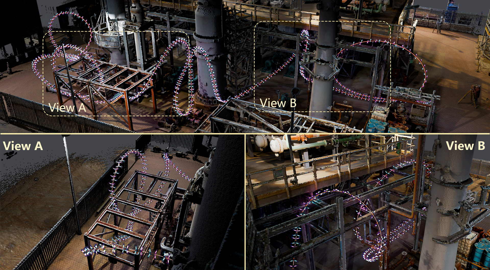
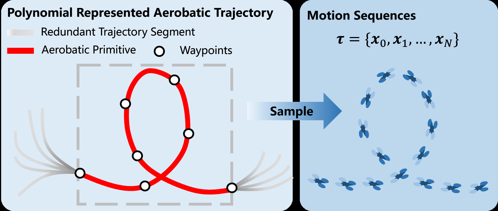
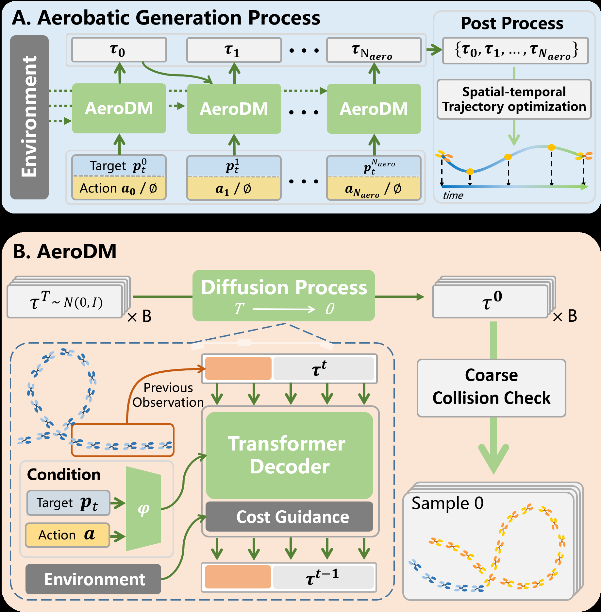
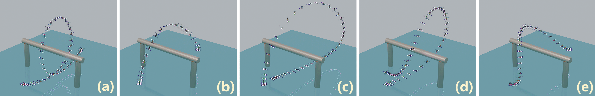
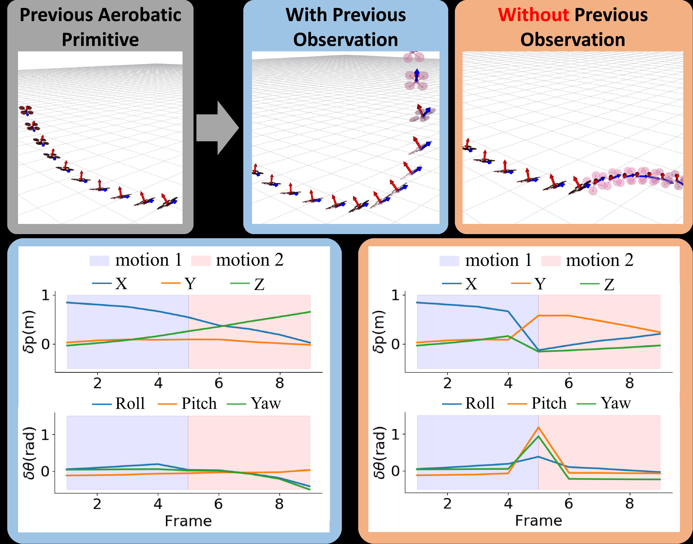
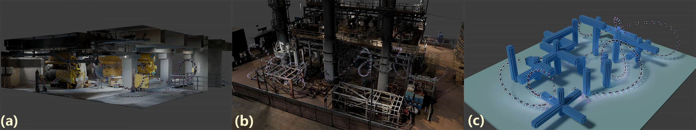
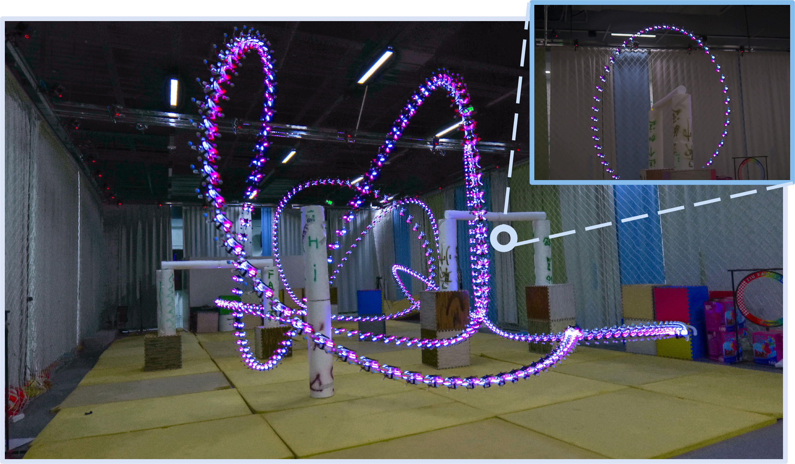
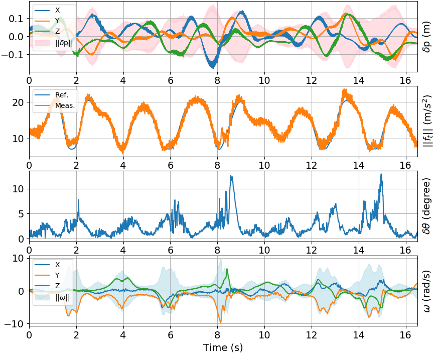

# 扩散模型自动生成特技飞行（03_Automatic_Generation_of_Aerobatic_Flight_via_Diffusion_Models）：完整忠实学术翻译

> **原文标题**：03_Automatic_Generation_of_Aerobatic_Flight_via_Diffusion_Models  
> **作者**：Yuhang Zhong、Anke Zhao、Tianyue Wu、Tingrui Zhang、Fei Gao  
> **发表信息**：IEEE/RSJ IROS 2025，DOI 10.1109/IROS60139.2025.11246023  
> **原文 PDF**：[03_Automatic_Generation_of_Aerobatic_Flight_via_Diffusion_Models.pdf](../03_Automatic_Generation_of_Aerobatic_Flight_via_Diffusion_Models.pdf) ｜ **对应中文详解**：[03_扩散模型自动生成特技飞行.md](../中文详解/03_扩散模型自动生成特技飞行.md)  

---

## 原文第 1 页核心内容与翻译

### 本页译文

本文研究复杂环境中的特技飞行自动生成问题。长时域特技轨迹通常需要人工逐个设计动作，既耗时，也难以同时满足避障、动力学可行性和视觉效果要求。作者提出基于扩散模型的生成框架，把复杂动作拆成可组合的短时特技基元，并以历史轨迹作为动作衔接的先验。目标航路点和可选动作约束使生成结果可以编辑；推理阶段通过分类器引导和批量采样降低碰撞风险，最后用时空轨迹优化保证动力学可执行性。仿真和真实飞行实验验证了该方法生成长时域特技轨迹的可行性。

复杂环境下基于扩散模型的特技飞行自动生成
Yuhang Zhong、Anke Zhao、Tianyue Wu、Tingrui Zhang、Fei Gao

**图 1**：本文方法能够自动生成连续的长时域特技机动，使无人机以满足动力学约束的运动轨迹穿越复杂的工业厂房。

摘要：在复杂环境中完成具有表现力的特技飞行，需要事先人工设计关键机动；随着飞行轨迹时间跨度增加，这一过程既复杂又耗时。本文提出一种利用扩散模型自动生成并扩展特技飞行轨迹的框架。方法的核心是将复杂机动分解为特技动作基元。每个基元由一段较短的状态序列组成，包含特定的关键动作，可作为合成长轨迹的基本单元。模型利用历史轨迹观测作为动态先验，以保证动作衔接连续；同时引入目标航路点和可选的动作约束，使生成结果可以按用户意图编辑。模型推理时，通过分类器引导和批量采样实现避障；生成结果还要经过时空轨迹优化后处理，以保证动力学可行性。
∗通讯作者：Fei Gao。
本工作部分得到国家重点研发计划项目（项目编号 2024YFC3015804）和国家自然科学基金项目（项目编号 62322314）的支持。
1 浙江大学控制科学与工程学院网络系统与控制研究所，杭州 310027，中国。
2 浙江大学湖州研究院，湖州 313000，中国。
电子邮箱：{YuhangZhong, AnkeZhao, tianyueh8erobot, tingruizhang, fgaoaa}@zju.edu.cn
由此得到的轨迹还需满足动力学可执行性。大量仿真和真实飞行实验验证了各组成部分的设计，表明该方法具备部署到真实无人机并执行长时域特技飞行的可行性。

## 一、引言
复杂环境中的自由式特技飞行是无人机极具观赏性的极限运动之一 [1]。通过规划安全而灵活的机动，并创造性地组合这些高动态动作，可以形成令人印象深刻的飞行效果。然而，设计过程十分复杂，因为避障、动力学可行性和视觉表现等相互竞争的要求必须同时满足。已有工作通常通过轨迹优化，人工调整航路点等轨迹参数 [2]–[5] 来解决这一问题。但这类方法严重依赖繁琐的参数调节和特技飞行领域经验，即使设计基本动作，对非专业使用者也构成较高门槛。为解决这一问题，本文提出一种高效的特技飞行自动生成框架。
2025 IEEE/RSJ International Conference on Intelligent Robots and Systems (IROS 2025)
October 19-25, 2025. Hangzhou, China
2025 IEEE/RSJ International Conference on Intelligent Robots and Systems (IROS) | 979-8-3315-4393-8/25/$31.00 ©2025 IEEE | DOI: 10.1109/IROS60139.2025.11246023
Authorized licensed use limited to: Universita degli Studi di Genova. Downloaded on August 24,2026 at 05:40:21 UTC from IEEE Xplore.  Restrictions apply.

---

## 原文第 2 页核心内容与翻译

### 本页译文

直接从长时域示范中学习需要大量高质量数据，而把短片段简单拼接起来又会破坏特技动作严格的姿态顺序和时空连续性。本文把特技基元定义为能够单独描述关键姿态变化、又能与其他基元平滑连接的状态序列。模型读取前一段动作的历史观测，学习基元之间的隐含动态关系；生成时还可以用分类器引导样本远离障碍。由于扩散模型本身不能保证推力、角速度等执行约束，作者在生成后加入轨迹优化，将离散动作转换为连续、可执行的飞行轨迹。

多样化特技飞行的生成，使使用者只需很少的人工干预，就能设计复杂的长时域、多动作轨迹。
近年来，扩散模型表现出刻画多峰分布的能力，已用于人体运动合成 [6]–[8] 和轨迹规划 [9]–[11]，能够生成具有不同风格和专门行为的逼真运动序列。
基于这一能力，本文研究其在特技飞行生成中的应用。一个直接想法是从长时域特技飞行示范中学习，但高质量示范数据需要大量人工设计和较长生成时间，因此较为稀缺。
已有一些工作尝试通过组合短时域序列实现长时域生成 [12]–[15]，但用于特技飞行时会遇到两个关键问题。第一，特技动作要求姿态按照严格的顺序变化，例如盘旋动作需要连续完成绕 z 轴 360° 旋转。轨迹被切成短片段用于训练后，模型难以学习连续姿态之间准确的时序和协调关系，生成的动作可能不完整。第二，图像生成 [16] 可以容忍像素层面的不连续，而特技飞行要求严格的时空连续性。简单拼接短运动片段必然产生明显跳变；对于要求状态无缝演化的高动态动作，这是一个严重缺陷。因此，需要一种既具有模块化特点、又符合运动学规律的表示方式，以实现长时域特技动作的连续组合。
本文通过学习特技动作基元来解决上述问题。特技动作基元是一段动作帧序列，用于记录随时间变化的关键姿态，并且可以与其他基元平滑组合，从而连续生成任意长时间的特技飞行。基元可以显式接受动作风格和目标航路点的条件约束，用户只需调整直观的参数，就能生成符合特定要求的轨迹。但是，如果模型不知道前面已经执行的动作，就很难保证基元之间的连续性。为此，作者将历史轨迹观测作为动作衔接的先验信息加入模型结构，使模型能够学习基元转换所对应的潜在运动规律。

模型虽然可以生成质量较高的动作，但训练时没有使用环境信息，因此无法保证在未见过的环境中避障。作者在每个基元生成阶段采用批量采样，并结合分类器引导 [17]、[18]，将生成过程引向指定的目标分布；这是一种常用的引导方法。同时，在每次推理时对生成轨迹进行粗略碰撞检查，以进一步提高避障成功率。

扩散模型可以通过位置控制或速度控制生成机器人可执行的轨迹 [19]、[20]，但在特技飞行中，系统还需要精确控制推力和角速度等执行器级指令。模型在训练中虽然会隐式地学习这些控制信号，却没有明确保证动力学可行性，而这一点对实际飞行至关重要。因此，作者在生成后加入轨迹优化，使最终轨迹满足动力学约束。特别是，在基于微分平坦性的轨迹优化框架 [21]–[23] 中，姿态和角速度的优化具有很强的非线性。为使优化过程能够收敛到较好的局部解，作者设计了分层优化框架，从而提高实际部署的可行性。

本文的主要贡献如下：
1) 通过学习特技动作基元并加入额外的避障策略，扩散模型仅使用短时域示范训练，也能在复杂环境中生成任意长时域的轨迹。
2) 设计分层轨迹优化后处理方法，保证生成的特技轨迹满足物理可执行性。
3) 仿真和实验结果表明，该方法能够在复杂环境中生成多种不同形式的特技飞行轨迹。
## 二、相关工作
### A. 四旋翼特技飞行生成
特技飞行生成同时要求姿态快速变化和轨迹满足动力学约束，因此难度很高。现有方法大体可以分为两类。基于规则的方法 [2]、[4]、[24]、[25] 采用动作分解策略，把复杂动作划分为不同阶段。Kaufmann 等人 [2] 和 Lu 等人 [4] 使用竖直圆或圆弧，使无人机能够完成超出平面运动限制的基本三维特技动作，但这类方法对动态环境的适应能力有限，而且每种动作都需要耗费大量工作调节参数。

随着轨迹优化方法在四旋翼应用中取得较好效果 [26]–[29]，越来越多的研究将特技飞行生成表述为轨迹优化问题，以利用优化方法的灵活性。文献 [3]、[5] 通过调整时空参数生成尾座式飞行器的特技轨迹，使其能够在开放的室内和室外环境中连续执行多种动作。然而，已有方法主要关注开放环境中的特技轨迹生成，忽略了与障碍物的必要交互。更重要的是，这些方法需要精心设计初始值，才能避免陷入较差的局部最优；其根本原因是姿态约束与障碍物约束耦合后具有很强的非线性，使优化问题呈现非凸特征。
21236
Authorized licensed use limited to: Universita degli Studi di Genova. Downloaded on August 24,2026 at 05:40:21 UTC from IEEE Xplore.  Restrictions apply.

---

## 原文第 3 页核心内容与翻译

### 本页译文

特技动作基元由位置、姿态和状态标志组成，并以固定长度输入扩散模型。不同动作的持续时间不同，因此状态标志用于区分有效动作帧和填充帧。训练数据来自开放空间中的优化轨迹，动作前后加入过渡片段，并通过绕世界坐标 z 轴旋转进行数据增强。AeroDM 是一个条件扩散模型，条件包括前序状态、目标航路点和动作类别。训练时逐步向动作序列加入高斯噪声，推理时从噪声开始反向去噪，直接预测原始动作序列，并用重建损失和速度损失约束结果。

### B. 用于运动生成的扩散模型
扩散模型已经成为多种运动生成任务中广泛采用的方法。在运动规划中，研究者利用扩散模型生成位置和速度分布理想的轨迹；为满足具体任务约束，还会加入强化学习奖励 [9] 或面向任务的代价函数 [10]、[11]，引导轨迹分布逐步调整。在人体运动合成中，扩散模型具有建模高维空间的能力，可以学习复杂的运动表示；文本指定的运动风格 [6] 和部分状态约束 [30] 等条件输入，进一步提高了生成运动的编辑灵活性。
但是，上述方法主要关注固定长度的运动序列，对扩散模型在长时域任务中的潜力研究不足。近期研究使用基于策略的方法 [19]、[20] 生成操作和视觉导航动作序列，但由于依赖马尔可夫假设，往往会形成只顾眼前的生成行为，表现为对即将出现的障碍反应滞后，以及特技动作执行不完整。与这些方法不同，本文学习能够表达关键特技运动规律的特技基元，并通过合理组合基元和设计引导条件，在保持动力学约束和环境交互一致性的同时，生成连贯的长时域特技运动。
## 三、特技飞行扩散模型
### A. 特技动作基元表示
特技动作基元表示为一组等时间间隔采样的状态序列
τ = {x0, x1 · · · , xNa}，其中 xi = {s, p, r} ∈R10；p ∈R3 表示四旋翼的位置，r ∈R6 表示连续的六自由度姿态表示 [31]。不同动作的执行时长不同，因此离散状态序列的长度也不同，这与扩散模型输出固定长度的要求不一致。为此，引入状态标志 s ∈{0, 1}：当 s 从 0 变为 1 时，动态截断生成结果；s = 0 表示当前状态属于实际动作，s = 1 表示填充状态。这样既能生成可变长度的动作基元，又能保持网络输出维度不变。为覆盖数据集中的最长动作，将输出序列长度 Na 设置为最大基元时长，较短序列则通过 s 引导的截断自然结束。
### B. 数据准备
本文采用基于优化的方法生成专家数据集，重点收集开放空间中的短时域特技动作。由于生成轨迹采用连续多项式表示，如图 2 所示，特技动作基元可以从完整轨迹的特定片段中采样得到。

**图 2**：特技动作基元的生成过程。先从完整轨迹中截取包含特技动作的片段，再从片段中采样离散运动序列，并加入冗余轨迹片段以模拟不同特技动作基元之间的过渡。

为了便于动作动态衔接，本文在每个基元前后有意加入冗余轨迹片段。这样也有利于构造模型条件，因为前一段轨迹的运动序列可以作为先验观测，帮助模型学习无缝过渡。此外，将特技基元的末状态视为目标航路点，并作为条件输入模型，以增强可控性。不同特技动作按照预先制定的动作设计规则随机采样。需要指出的是，生成的示范本身与环境无关；在模型推理时再动态加入环境信息，实现考虑障碍物的轨迹生成，具体见 III-E 节。
### C. 用于生成特技动作基元的条件扩散模型
本文提出条件扩散模型 AeroDM（Aerobatic Diffusion Model）[17]、[18]，用于生成特技动作基元。模型在给定条件 c 下学习去噪过程 pθ(τ t−1|τ t, c)，把纯高斯噪声 N(0, I) 逐步还原为原始数据分布 p(τ 0|c)。本文的条件 c 包括前序状态观测、表示 τ 末端位置的目标航路点 pt，以及表示特技动作风格的动作输入 a。去噪过程是前向过程 q(τ t|τ t−1, c) 的逆过程；前向过程通过逐步加入更强的噪声破坏数据结构。预测的样本分布可写为：
pθ(τ 0|c) =
Z
p(τ T |c)
T
Y
t=1
pθ(τ t−1|τ t, c)dτ 1:T ,
(1)
其中 p(τ T ) = N(0, I)。训练时，在前向过程中加入高斯噪声：
q(τ t|τ t−1, c) = N(√αtτ t−1, (1 −αt)I),
(2)
其中 αt ∈(0, 1) 是预先设定的调度参数。本文不直接预测扩散噪声 ϵ，而是直接预测原始样本 τ 0，以便明确地加入几何约束。重建损失可写为：
21237
Authorized licensed use limited to: Universita degli Studi di Genova. Downloaded on August 24,2026 at 05:40:21 UTC from IEEE Xplore.  Restrictions apply.

---

## 原文第 4 页核心内容与翻译

### 本页译文

模型采用扩散 Transformer 建模动作序列中的时间关系，当前正在去噪的基元与历史观测共同经过注意力层处理。目标点、动作类别和扩散时间步分别编码后，通过交叉注意力加入网络。为避障，作者根据贝叶斯关系把障碍代价的梯度加入去噪过程，使生成结果倾向于远离障碍物。由于这种引导不能提供绝对安全保证，推理时一次生成多个候选，并对每个候选进行离散帧和帧间插值检查，淘汰发生碰撞的轨迹。

**图 3**：扩散过程的结构。(A) 整体过程示意图；(B) 特技飞行扩散模型的详细结构。

as:
Lrecon = Eτdata∼p(τdata),t∼[1,T ][
τdata −τθ(τ t, t)
2
2].
(3)
受文献 [30] 启发，本文引入速度损失，鼓励动作基元内部实现平滑过渡：
Lvel =
1
Na −1
Na−1
X
i=1
(xθ
i −xθ
i−1) −(xdata
i
−xdata
i−1 )
2
2 .
(4)
如图 3(a) 所示，特技动作生成过程通过特技扩散模型迭代进行。在第 i 步，模型根据目标航路点、可选的动作信号以及环境相关引导，生成当前特技基元 τ。该过程持续进行，直到轨迹序列 {..., τi−1, τi} 达到预先设定的特技动作数量 Naero。生成完成后，将各基元拼接，并在后处理阶段进一步优化。需要指出的是，推理时可以省略动作输入，以生成多样化的动作风格。
### D. 网络结构
如图 3(B) 所示，本文采用扩散 Transformer 建模特技基元序列中的时间关系。模型使用仅含解码器的 Transformer 主干，将去噪时间步 t 的轨迹 τt 与前一基元的历史观测 τt−1 一起送入自注意力层处理，从结构上约束生成基元 τt 与前序基元连续衔接。去噪时间戳 t、目标航路点 pt 和动作 a 等条件输入，先分别通过 MLP 嵌入 φ 编码，再经交叉注意力模块加入 Transformer。
### E. 避障策略
生成的特技基元本身不能保证在杂乱环境中避障。为解决这一问题，模型推理时加入避障代价引导。该方法由贝叶斯公式给出的条件概率关系推导得到：
p(τ t−1|τ t, O) ∝p(τ t−1|τ t)p(O|τ t−1),
(5)
其中 p(τ t−1|τ t) 是去噪过程，p(O|τ t−1) 是实现避障的似然概率。按照文献 [10] 的推导，该结果可以近似表示为高斯分布：
p(τ t−1|τ t, O) ≈N(τ t−1, µ + Σg, Σ),
(6)
其中 µ 和 Σ 分别是 p(τ t−1|τ t) 的均值和方差，g 表示能量函数：
g = ∇τ t−1 log p(O|τ t−1)|τ t−1=µ
(7)
=
X
i
λi∇τ t−1ci(τ t−1)|τ t−1=µ.
碰撞代价函数使用原始地图预先计算的带符号距离场 sdf(x)。当 sdf(x) 小于 d 时加入惩罚：
gc(τ) =
−sdf(τ) + d
sdf(τ) ≤d
0
sdf(τ) > d .
(8)
代价引导能够提高避障成功率，但不能保证绝对无碰撞。因此，随着多个特技基元在前序基元基础上迭代生成，碰撞概率会逐步累积。为此，作者采用批量采样，并对每次生成的结果 τ 额外进行粗碰撞检查。检查模块找出违反安全条件（sdf(τi) < 0）的轨迹，然后从样本中随机选取无碰撞轨迹，反复替换发生碰撞的轨迹。这个冗余步骤能够有效提高特技飞行的总体成功率。
## 四、基于轨迹优化的后处理
本节利用时空轨迹优化，将离散的特技动作基元转换为满足动力学约束的连续轨迹。第三节已经说明，特技扩散模型会生成密集的动作帧序列，记录整个动作过程中的位置和姿态变化，并给出具有无碰撞性质的明确拓扑信息。

基于这些输出，提取能够体现关键姿态变化的航路点，并生成用于描述自由空间的轻量级安全飞行走廊，将其作为轨迹优化的重要输入和约束。作者从体现关键飞行动作的关键帧中迭代采样稀疏航路点。关键帧的判定方式如下：
21238
Authorized licensed use limited to: Universita degli Studi di Genova. Downloaded on August 24,2026 at 05:40:21 UTC from IEEE Xplore.  Restrictions apply.

---

## 原文第 5 页核心内容与翻译

### 本页译文

后处理阶段从扩散模型输出的密集序列中提取姿态变化明显的关键帧，并根据关键帧生成安全飞行走廊。轨迹用 MINCO 表示，优化目标包括平滑代价、时间代价和动作姿态对齐代价，同时满足初末状态、速度、推力、角速度和安全走廊约束。由于 z 轴角速度的强非线性容易使优化陷入较差的局部解，作者先暂时去掉该约束求得初值，再恢复全部约束进行第二阶段精化。这样既改善收敛，也保留最终的动力学限制。

**图 4**：五种特技轨迹动作风格：(a) 动力翻转（Power Loop）；(b) 桶滚（Barrel Roll）；(c) Split-S；(d) 伊梅尔曼转弯（Immelmann Turn）；(e) 贴墙飞行（Wall Ride）。

当某一帧相对于前一帧绕机体 z 轴的角度偏差超过预设阈值 α 时，将其确定为关键帧，并以第一帧作为参考起点。沿各航路点得到的相应机体 z 轴方向 zref 作为动作参考，用于轨迹优化。为了生成安全飞行走廊，作者采用文献 [32] 的方法，高效生成覆盖整个动作基元且能够提供足够自由空间的多面体。此外，扩散模型生成的序列包含从数据集中学习到的较优时间信息，作者直接从该序列得到相邻航路点之间的时间戳，作为优化的初始时间估计。

完成上述准备后，轨迹优化问题写成如下形式：
min
p(t),TJ = Ls + LT + Latt,
(9)
s.t. p(i)(0) = x(i)
0 , i = 0, ..., s −1,
(10)
p(i)(T) = x(i)
f , i = 0, ..., s −1,
(11)
G⋆≤0, ⋆= v, ft, ω
(12)
Gsafe ≤0,
(13)
其中，采用 MINCO 类方法 [33] 表示轨迹，航路点 p(t) 和时间段 T 是优化变量。代价函数中的 Ls 和 LT 分别表示常规规划问题中的平滑代价和时间代价。Latt 是使飞行动作与关键帧参考方向保持一致的代价，定义为：
Latt =
n
X
i=0
−cos(ft(Ts(i))⊤zref
i
∥ft(Ts(i))∥
),
(14)
其中 Ts(i) = Pi j=0 Tj，ft 表示世界坐标系中的合推力，可根据微分平坦性计算得到。对速度 v、合推力 ft 和角速度 ω 施加动力学约束 G⋆，具体形式见文献 [23]。为保证飞行安全，约束每个轨迹段始终位于对应的第 i 个多面体内部：
Gsafe =
Z Tsum
0
Aip(t) −bi dt,
(15)
其中 Ai 和 bi 是相应多面体的参数。优化过程中发现，绕 z 轴角速度的强非线性可能使优化陷入较差的局部最优，导致角速度约束被明显违反，进而影响实际飞行性能。为解决这一问题，作者提出两阶段的分层优化策略。第一阶段暂时去掉绕 z 轴角速度约束，求解一个放宽后的问题，以避开局部最优；得到的初始解作为第二阶段的热启动，在第二阶段恢复全部动力学约束并进行完整优化。该设计在保留严格动力学约束的同时改善了整体优化效果，具体飞行表现见第五节 C 部分。
## 五、实验结果
本节通过一系列实验验证本文方法的关键设计，并评估其在真实场景中的表现。实验说明：1）明确加入目标点和动作语义条件，可以提高特技轨迹的可编辑性；2）引入历史状态能够在保持动作灵活性的同时，减小不同动作基元之间的突变；3）所提出的避障策略能够明显提高复杂环境中的特技飞行成功率；4）后处理对于将离散规划结果转化为动力学可执行轨迹、并部署到真实系统中是必要的。
### A. 实现细节
模型在包含五种特技动作基元的数据集上训练（图 4）。每个基元的目标航路点都在 [0, 8] × [−6, 6] × [−1, 1] 的空间范围内以 1.0 m 的分辨率均匀采样得到。为建模不同特技基元之间的动态衔接，在每个基元前后随机采样航路点，并生成补充轨迹。随后在全局坐标系中对数据进行增强，对每个基元分别施加 90°、180° 和 270° 的离散 z 轴旋转。利用这种对称性，可以在保持动力学可行性的同时生成全方向动作，最终得到 450,000 个训练基元。网络采用仅含解码器的 Transformer，包括 4 层、4 个多头注意力和 256 维隐变量。扩散过程设置为 30 步去噪，并使用指数噪声调度器。每个动作基元持续 6 s，以 0.1 s 的间隔离散为 Na = 60 个时间步。为
扩散过程设置为 30 步去噪，并使用指数噪声调度器。每个动作基元持续 6 s，以 0.1 s 的间隔离散为 Na = 60 个时间步。为
21239
Authorized licensed use limited to: Universita degli Studi di Genova. Downloaded on August 24,2026 at 05:40:21 UTC from IEEE Xplore.  Restrictions apply.

---

## 原文第 6 页核心内容与翻译

### 本页译文

实验首先检验目标点和动作条件的作用。只提供目标点时，轨迹终点能够靠近指定位置；加入动作条件后，生成动作会更符合“动力翻转”等语义。历史状态条件可以减少相邻动作基元之间的位置和姿态突变。避障实验比较无代价引导、无粗碰撞检查和完整方法，结果表明代价引导是主要贡献，粗碰撞检查则进一步拦截了由前序碰撞状态带来的风险。真实飞行实验在狭窄室内环境中连续执行五种动作，后处理后的姿态和位置误差均保持较小。

**图 5**：上：以“动力翻转”动作为条件的特技飞行生成结果 (a)，以及不使用动作条件的模型结果 (b)；下：特技动作基元终点与给定目标之间距离误差的箱线图。

为保证动作衔接连续，模型将前 5 帧历史观测作为先验上下文。
### B. 仿真消融实验
1）目标条件和动作条件：为验证目标条件与动作条件的有效性，作者比较三种模型：无约束生成、仅使用目标条件的生成，以及目标与动作联合条件的生成。为评估目标条件，在以下四种场景中分别随机采样 50 个目标航路点，并生成 5,000 个特技动作基元：

• 分布内采样（IDS）：目标在训练分布范围内采样。

• 近分布外采样（N-OODS）：目标在训练分布外、但靠近分布边界的位置采样，范围为 [9, 12] × [−9, 9] × [−1, 1]。

• 远分布外采样（F-OODS）：目标在远离训练分布的位置采样，范围为 [12, 16] × [−12, 12] × [−1, 1]。

• 无条件采样（UncondS）：目标位于训练分布内，但由无约束模型生成。

图 5 用箱线图表示基元终点位置与目标航路点之间的距离分布。分析表明，仅使用目标条件的模型能够可靠地引导轨迹在指定目标附近结束；无条件模型由于没有目标信息，终点会随机散布。值得注意的是，模型对靠近分布边界的目标也具有一定泛化能力。

为评估动作条件，图 5 给出了两个模型针对同一目标生成的 10 条轨迹：一个仅使用目标条件，另一个同时使用目标和动作条件。当输入“动力翻转”指令时，使用动作条件的模型能够生成与该语义意图明确一致的动作（图 5(a)）；不使用动作条件的模型生成的动作则不一致。上述消融结果表明，目标条件提供了明确的空间引导，而动作条件允许通过人工指定的指令灵活塑造轨迹，从而能够受控地生成面向任务的特技动作。

**图 6**：有无前序动作基元信息的模型对比。平滑性用相邻帧之间的位置差 δp 和欧拉角差 δθ 衡量。

目标条件提供了明确的空间引导，而动作条件允许通过人工指定的指令灵活塑造轨迹，从而能够受控地生成面向任务的特技动作。

2）衔接平滑性：为验证历史状态条件对于平滑动态衔接的必要性，作者比较两个模型：一个可以访问前序基元状态，另一个不能访问。两个模型都从同一段前序轨迹出发生成特技基元。通过计算相邻帧之间沿坐标轴的位置差 δp 和欧拉角差 δθ 来量化运动平滑性。结果如图 6 所示。没有前序观测的模型无法理解动态衔接过程，导致姿态突然变化超过 1 rad、位置突然变化超过 0.5 m，这在实际飞行中是不可执行的。相比之下，使用历史观测的模型即使在激烈动作衔接时也能生成状态连续的动作，姿态调整平滑，位置更新连续，并且符合无人机动力学。这说明模型学到了无人机飞行的内在动力学规律。

3）避障：作者在图 7 所示的三种场景中测试该方法。工厂环境包含细小、复杂且无规则的障碍物；室内工业车间十分狭窄，墙体阻挡了飞行空间，对避障策略提出了很大挑战。作者将 pt 设置在无碰撞位置，引导无人机穿过复杂环境并覆盖整个飞行区域。为获得可靠结果，采用 5 个不同的随机种子进行消融实验，每次推理的批量采样数设置为 500。每组实验比较本文方法、无引导基线（不使用代价引导生成样本）和无检查基线（不执行粗碰撞检查）。成功率定义为所有生成轨迹中无碰撞轨迹所占的比例，其中同时对单个动作帧以及相邻帧之间插值得到的轨迹进行更精细的碰撞检查。
21240
Authorized licensed use limited to: Universita degli Studi di Genova. Downloaded on August 24,2026 at 05:40:21 UTC from IEEE Xplore.  Restrictions apply.

---

## 原文第 7 页核心内容与翻译

### 本页译文

在随机森林、室外工厂和室内工业车间三类环境中，完整方法在连续动作数量增加时仍保持较高的无碰撞成功率，明显优于无引导和无粗检查基线。真实飞行结果表明，经过后处理的轨迹能够被飞控稳定跟踪，最大姿态误差小于 15°，最大位置误差小于 0.15 m。实验说明，生成模型负责提供多样、可编辑的动作候选，连续轨迹优化负责把这些候选变成满足动力学约束的飞行参考。

**图 7**：无人机在三种场景中执行特技动作的示意图：(a) 狭窄的室内工业车间；(b) 复杂的室外工业厂房；(c) 随机森林环境。

表 1：不同环境和消融配置下的成功率（%）。

| 环境 | 配置 | 1 个动作 | 2 个动作 | 3 个动作 | 5 个动作 | 10 个动作 |
|---|---|---:|---:|---:|---:|---:|
| 随机森林 | 本文方法 | 99.9 ± 0.1 | 99.8 ± 0.2 | 99.7 ± 0.3 | 99.7 ± 0.3 | 99.4 ± 0.6 |
| 随机森林 | 无引导 | 51.8 ± 8.0 | 7.0 ± 3.0 | 3.1 ± 2.1 | 0.7 ± 0.7 | 0.0 ± 0.0 |
| 随机森林 | 无检查 | 97.7 ± 2.1 | 85.4 ± 4.2 | 79.9 ± 5.7 | 72.0 ± 6.0 | 53.6 ± 9.4 |
| 室外工厂 | 本文方法 | 100.0 ± 0.0 | 99.9 ± 0.1 | 99.8 ± 0.2 | 99.5 ± 0.5 | 97.2 ± 2.8 |
| 室外工厂 | 无引导 | 57.5 ± 3.5 | 9.7 ± 0.9 | 5.8 ± 1.2 | 0.0 ± 0.0 | 0.0 ± 0.0 |
| 室外工厂 | 无检查 | 97.0 ± 1.0 | 82.5 ± 1.7 | 61.9 ± 3.3 | 23.9 ± 3.3 | 7.0 ± 1.6 |
| 室内车间 | 本文方法 | 99.9 ± 0.1 | 100.0 ± 0.0 | 97.9 ± 2.1 | 98.4 ± 1.6 | 97.1 ± 2.9 |
| 室内车间 | 无引导 | 65.7 ± 18.1 | 43.3 ± 20.3 | 15.4 ± 9.8 | 10.7 ± 8.5 | 0.4 ± 0.4 |
| 室内车间 | 无检查 | 81.1 ± 12.3 | 62.9 ± 19.9 | 35.6 ± 17.0 | 26.0 ± 16.5 | 2.6 ± 2.6 |

**图 8**：真实环境中四旋翼执行本文方法生成的、包含五种不同动作的特技飞行轨迹快照。

碰撞检查同时作用于单个动作帧，以及相邻帧之间插值得到的轨迹。对于每个基线方法，随着特技动作数量 Naero 增加，作者统计不同随机种子下成功率的中位数及其波动范围。

实验结果汇总于表 1。与两个基线相比，本文方法在所有场景中都取得了更高的成功率。比较结果表明，代价引导对提高避障能力的作用最明显，但在所有情况下都不能保证轨迹无碰撞。具体而言，如果前面生成的动作基元已经发生碰撞，后续基于它生成的动作也可能受到影响。粗碰撞检查模块因此成为一种轻量而有效的保护措施，能够在轨迹最终生成阶段拦截碰撞风险。

### C. 真实环境实验
为验证本文方法在真实环境中的适用性，作者在一个狭窄、障碍物密集的室内

**图 9**：数值分析。δp 表示 X、Y、Z 三个轴向的位置误差以及总跟踪误差
其中，δp 表示 X、Y、Z 三个轴向的位置误差以及总跟踪误差 ∥δp∥。Ref. 和 Meas. 分别表示规划轨迹得到的合推力 ∥ft∥，以及根据惯性测量单元（IMU）实际测得的数据计算得到的合推力。δθ 表示描述期望姿态与实际姿态之间误差的四元数所对应的旋转角。ω 表示飞行过程中的角速度，包括 X、Y、Z 轴角速度及其范数 ∥ω∥。

作者在尺寸为 12 × 6 × 4 m3 的空间中执行这些轨迹，实验使用 NOKOV 动作捕捉系统1。真实飞行结果见图 8，数值分析见图 9。图 9 表明，后处理将推力和角速度限制在可执行范围内，使底层控制器能够准确跟踪控制信号。因此，姿态和位置跟踪误差都较小，最大误差分别小于 15° 和
1https://www.nokov.com/
21241
Authorized licensed use limited to: Universita degli Studi di Genova. Downloaded on August 24,2026 at 05:40:21 UTC from IEEE Xplore.  Restrictions apply.

---

## 原文第 8 页核心内容与翻译

### 本页译文

本文证明了特技动作基元、条件扩散生成和轨迹优化结合的可行性。当前方法主要通过被动避障与环境交互，对场景的主动理解仍然有限，因而还不能保证生成的动作都具有与环境相互配合的视觉效果。后续工作将研究场景感知的特技生成，使无人机能够根据环境结构动态设计动作，例如穿过狭窄间隙时主动调整翻转轨迹。

0.15 m。这说明后处理对于实际特技飞行轨迹生成具有关键作用。扩散模型输出的位置和姿态参考是离散的，控制器难以将其精确转换为执行器级指令并进行跟踪，直接使用可能导致飞行失败。
## 六、结论与后续工作
本文挖掘了扩散模型生成长时域、多动作特技飞行轨迹的潜力。工作的主要贡献是学习带有特定条件的特技动作基元，并利用轨迹代价进行引导，从而实现自动生成和编辑。后处理进一步保证了动力学可行性，使该方法能够直接部署到真实无人机上。

但是，本文方法主要通过被动避障与环境发生交互，因此还不能生成真正体现对环境深入理解、并具有丰富视觉效果的动作。后续工作将研究场景感知的特技生成，使轨迹能够根据环境特征动态设计，例如在狭窄间隙中完成翻转。随着对环境理解能力的提高，作者认为该方法能够生成更具观赏性的动作，使飞行灵活性与周围环境更好地结合，从而进一步提升飞行表现和视觉效果。
参考文献
[1] D. Tezza, D. Caprio, D. Laesker, and M. Andujar, “Let’s fly! an
analysis of flying fpv drones through an online survey.,” in iHDI@
CHI, 2020.
[2] E. Kaufmann, A. Loquercio, R. Ranftl, M. M¨uller, V. Koltun, and
D. Scaramuzza, “Deep drone acrobatics,” ArXiv, vol. abs/2006.05768,
2020.
[3] G. Lu, Y. Cai, N. Chen, F. Kong, Y. Ren, and F. Zhang, “Trajectory
generation and tracking control for aggressive tail-sitter flights,” The
International Journal of Robotics Research, vol. 43, pp. 241 – 280,
2022.
[4] G. Lu, W. Xu, and F. Zhang, “On-manifold model predictive control
for trajectory tracking on robotic systems,” IEEE Transactions on
Industrial Electronics, vol. 70, pp. 9192–9202, 2023.
[5] E. Tal, G. Ryou, and S. Karaman, “Aerobatic trajectory generation for a
vtol fixed-wing aircraft using differential flatness,” IEEE Transactions
on Robotics, vol. 39, pp. 4805–4819, 2022.
[6] A. Serifi, E. Z¨urich, S. D. Research, D. R. S. E. K. R. GRANDIA,
E. Z. S. M. GROSS, and S. M. B¨acher, “Robot motion diffusion
model: Motion generation for robotic characters,” in ACM SIGGRAPH
Conference and Exhibition on Computer Graphics and Interactive
Techniques in Asia, 2024.
[7] H. Yi, J. Thies, M. J. Black, X. B. Peng, and D. Rempe, “Gener-
ating human interaction motions in scenes with text control,” ArXiv,
vol. abs/2404.10685, 2024.
[8] S. Cohan, G. Tevet, D. Reda, X. B. Peng, and M. van de Panne,
“Flexible motion in-betweening with diffusion models,” in Interna-
tional Conference on Computer Graphics and Interactive Techniques,
2024.
[9] M. Janner, Y. Du, J. B. Tenenbaum, and S. Levine, “Planning with
diffusion for flexible behavior synthesis,” in International Conference
on Machine Learning, 2022.
[10] J. Carvalho, A. T. Le, M. Baierl, D. Koert, and J. Peters, “Motion
planning diffusion: Learning and planning of robot motions with diffu-
sion models,” 2023 IEEE/RSJ International Conference on Intelligent
Robots and Systems (IROS), pp. 1916–1923, 2023.
[11] S. Huang, Z. Wang, P. Li, B. Jia, T. Liu, Y. Zhu, W. Liang, and S.-C.
Zhu, “Diffusion-based generation, optimization, and planning in 3d
scenes,” 2023 IEEE/CVF Conference on Computer Vision and Pattern
Recognition (CVPR), pp. 16750–16761, 2023.
[12] J.-H. Tseng, R. Castellon, and C. K. Liu, “Edge: Editable dance
generation from music,” 2023 IEEE/CVF Conference on Computer
Vision and Pattern Recognition (CVPR), pp. 448–458, 2022.
[13] U. A. Mishra, S. Xue, Y. Chen, and D. Xu, “Generative skill chaining:
Long-horizon skill planning with diffusion models,” in Conference on
Robot Learning, 2023.
[14] S. Yang, Z. Yang, and Z.
Wang, “Longdancediff:
Long-term
dance
generation
with
conditional
diffusion
model,”
ArXiv,
vol. abs/2308.11945, 2023.
[15] G. Tevet, S. Raab, S. Cohan, D. Reda, Z. Luo, X. B. Peng, A. Bermano,
and M. van de Panne, “Closd: Closing the loop between simulation and
diffusion for multi-task character control,” ArXiv, vol. abs/2410.03441,
2024.
[16] A. Lugmayr, M. Danelljan, A. Romero, F. Yu, R. Timofte, and L. V.
Gool, “Repaint: Inpainting using denoising diffusion probabilistic
models,” 2022 IEEE/CVF Conference on Computer Vision and Pattern
Recognition (CVPR), pp. 11451–11461, 2022.
[17] P. Dhariwal and A. Nichol, “Diffusion models beat gans on image
synthesis,” ArXiv, vol. abs/2105.05233, 2021.
[18] Y. Song, J. N. Sohl-Dickstein, D. P. Kingma, A. Kumar, S. Ermon,
and B. Poole, “Score-based generative modeling through stochastic
differential equations,” ArXiv, vol. abs/2011.13456, 2020.
[19] C. Chi, Z. Xu, S. Feng, E. Cousineau, Y. Du, B. Burchfiel, R. Tedrake,
and S. Song, “Diffusion policy: Visuomotor policy learning via action
diffusion,” The International Journal of Robotics Research, 2024.
[20] A. K. Sridhar, D. Shah, C. Glossop, and S. Levine, “Nomad: Goal
masked diffusion policies for navigation and exploration,” 2024 IEEE
International Conference on Robotics and Automation (ICRA), pp. 63–
70, 2023.
[21] D. Mellinger and V. R. Kumar, “Minimum snap trajectory generation
and control for quadrotors,” 2011 IEEE International Conference on
Robotics and Automation, pp. 2520–2525, 2011.
[22] M. Faessler, A. Franchi, and D. Scaramuzza, “Differential flatness
of quadrotor dynamics subject to rotor drag for accurate tracking of
high-speed trajectories,” IEEE Robotics and Automation Letters, vol. 3,
pp. 620–626, 2017.
[23] Z. Wang, C. Xu, and F. Gao, “Robust trajectory planning for spatial-
temporal multi-drone coordination in large scenes,” 2022 IEEE/RSJ
International Conference on Intelligent Robots and Systems (IROS),
pp. 12182–12188, 2021.
[24] Y. Chen and N. O. P´erez-Arancibia, “Controller synthesis and perfor-
mance optimization for aerobatic quadrotor flight,” IEEE Transactions
on Control Systems Technology, vol. 28, pp. 2204–2219, 2020.
[25] S. Lupashin, A. P. Schoellig, M. Sherback, and R. D’Andrea, “A
simple learning strategy for high-speed quadrocopter multi-flips,”
2010 IEEE International Conference on Robotics and Automation,
pp. 1642–1648, 2010.
[26] X. Zhou, X. Wen, Z. Wang, Y. Gao, H. Li, Q. Wang, T. Yang, H. Lu,
Y. Cao, C. Xu, and F. Gao, “Swarm of micro flying robots in the
wild,” Science Robotics, vol. 7, 2022.
[27] B. Zhou, H. Xu, and S. Shen, “Racer: Rapid collaborative explo-
ration with a decentralized multi-uav system,” IEEE Transactions on
Robotics, vol. 39, pp. 1816–1835, 2022.
[28] Y. Gao, J. Ji, Q. Wang, R. Jin, Y. Lin, Z. Shang, Y. Cao, S. Shen,
C. Xu, and F. Gao, “Adaptive tracking and perching for quadrotor in
dynamic scenarios,” IEEE Transactions on Robotics, vol. 40, pp. 499–
519, 2023.
[29] Z. Zhang, Y. Zhong, J. Guo, Q. Wang, C. Xu, and F. Gao, “Auto
filmer: Autonomous aerial videography under human interaction,”
IEEE Robotics and Automation Letters, vol. 8, pp. 784–791, 2023.
[30] G. Tevet, S. Raab, B. Gordon, Y. Shafir, D. Cohen-Or, and
A.
H.
Bermano,
“Human
motion
diffusion
model,”
ArXiv,
vol. abs/2209.14916, 2022.
[31] Y. Zhou, C. Barnes, J. Lu, J. Yang, and H. Li, “On the continuity of ro-
tation representations in neural networks,” 2019 IEEE/CVF Conference
on Computer Vision and Pattern Recognition (CVPR), pp. 5738–5746,
2018.
[32] Q. Wang, Z. Wang, C. Xu, and F. Gao, “Fast iterative region inflation
for computing large 2-d/3-d convex regions of obstacle-free space,”
ArXiv, vol. abs/2403.02977, 2024.
[33] Z. Wang, X. Zhou, C. Xu, and F. Gao, “Geometrically constrained tra-
jectory optimization for multicopters,” IEEE Transactions on Robotics,
vol. 38, pp. 3259–3278, 2021.
21242
Authorized licensed use limited to: Universita degli Studi di Genova. Downloaded on August 24,2026 at 05:40:21 UTC from IEEE Xplore.  Restrictions apply.

---
