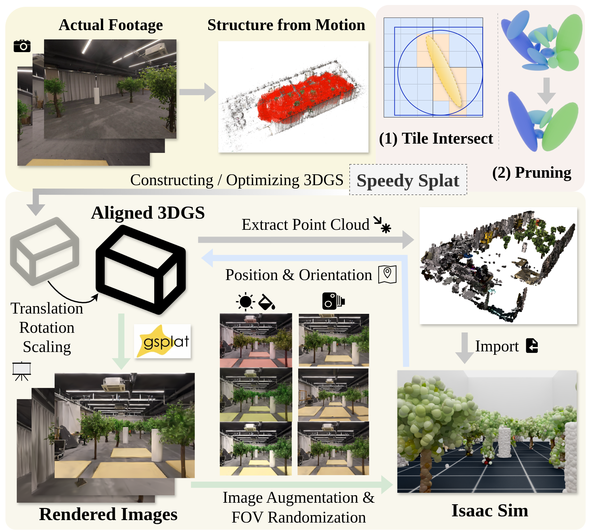
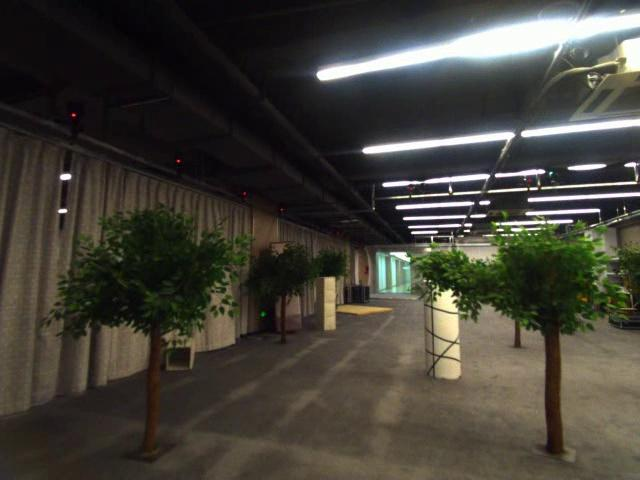
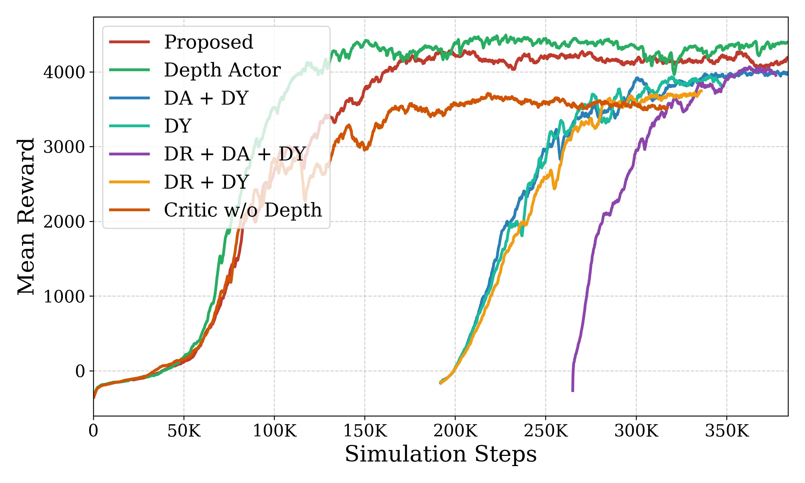
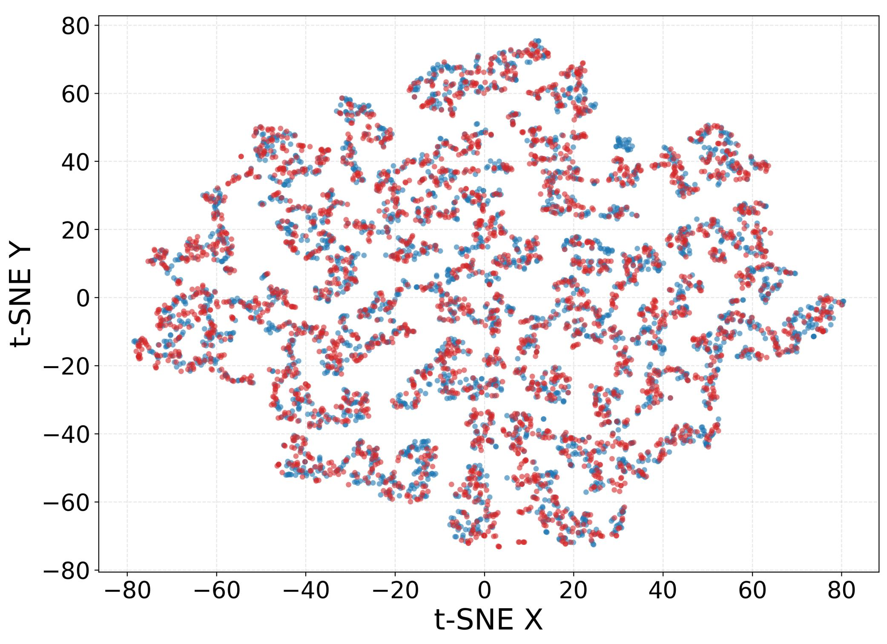
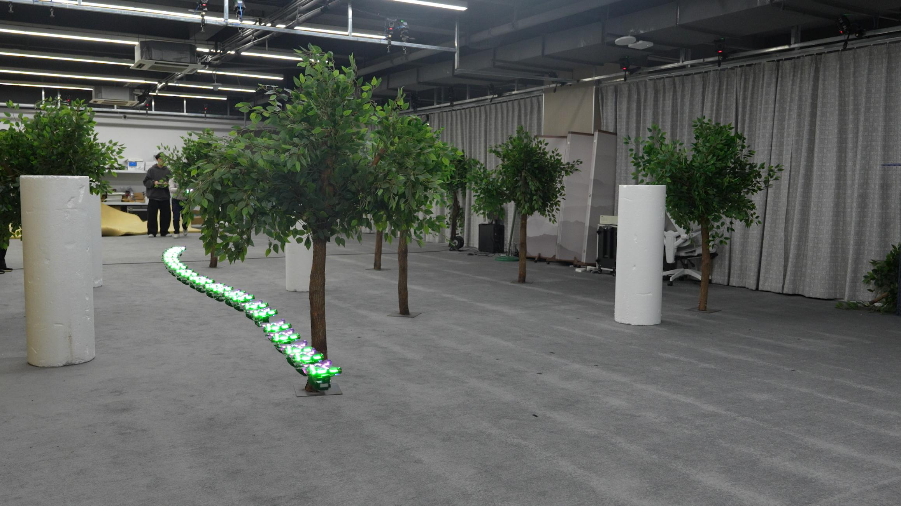
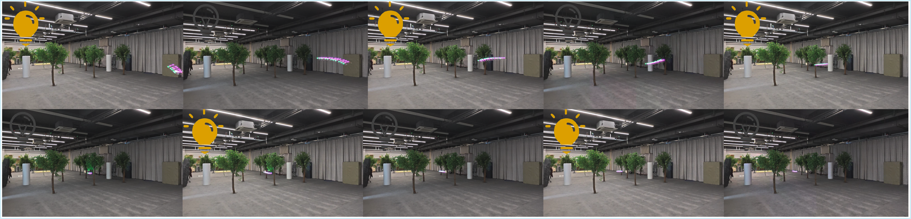

# 单目RGB杂乱环境飞行（04_Flying_in_Clutter_on_Monocular_RGB）：完整忠实学术翻译

> **原文标题**：04_Flying_in_Clutter_on_Monocular_RGB  
> **作者**：Xijie Huang、Jinhan Li、Tianyue Wu、Xin Zhou、Zhichao Han、Fei Gao  
> **发表信息**：arXiv:2512.17349v1，2025-12-19  
> **原文 PDF**：[04_Flying_in_Clutter_on_Monocular_RGB.pdf](../04_Flying_in_Clutter_on_Monocular_RGB.pdf) ｜ **对应中文详解**：[04_单目RGB杂乱环境飞行.md](../中文详解/04_单目RGB杂乱环境飞行.md)  

---

## 原文第 1 页核心内容与翻译

### 本页译文

本文研究只使用单目 RGB 图像的杂乱环境自主飞行。与激光雷达和深度相机相比，普通彩色相机体积、重量和功耗更小，但单幅图像没有直接的距离信息，且仿真图像与真实图像存在明显差异。作者提出将三维高斯泼溅场景重建与对抗域适应结合起来，在高保真三维环境中训练强化学习策略，使网络学习跨域稳定的导航线索，并在真实环境中进行零样本迁移。

利用域适应在三维辐射场中学习单目 RGB 杂乱环境飞行
Xijie Huang1,2, Jinhan Li1,2, Tianyue Wu1,2, Xin Zhou2
Zhichao Han1,2,†, and Fei Gao1,2,†
真实环境
飞行方向
单目 RGB 相机
仿真环境
真实环境
100
80
60
40
20
90
80
成功率（%）
Action Pro 5
图像
训练
3DGS
渲染
采集数据
三维环境构建
仿真环境
特征对齐
域适应
单目 RGB 图像
真实环境
仿真环境

**图 1**：基于 RGB 的导航框架总览。上方展示本文方法如何减小仿真与真实环境之间的差异；下方展示三维环境构建和域适应流程。
摘要译文：现代自主导航系统大多依赖激光雷达和深度相机。本文研究飞行机器人能否仅凭单目 RGB 图像在杂乱环境中导航。由于真实数据采集成本高，仿真训练具有明显优势，但视觉仿真到真实差异会阻碍策略部署。为此，本文将三维高斯泼溅（3DGS）环境的真实感与对抗域适应结合，在高保真仿真环境中训练，并显式减小仿真和真实特征之间的差异，使策略利用跨环境稳定的线索。实验表明，该策略能够零样本迁移到真实环境，在不同光照和非结构化障碍物条件下实现安全、灵活的飞行。

摘要：现代自主导航系统主要依赖激光雷达和深度相机。本文研究一个基本问题：飞行机器人能否仅使用单目 RGB 图像在杂乱环境中导航？真实数据采集成本很高，在仿真中学习策略是一条有吸引力的途径；但将策略直接部署到真实环境，会受到明显的视觉仿真到现实差异影响。为此，本文将三维高斯泼溅（3DGS）环境的真实感与对抗域适应结合起来，在高保真仿真中训练的同时，显式减小仿真和真实特征之间的差异，使策略依赖跨域稳定的线索。实验结果表明，该策略能够零样本迁移到真实环境，在光照变化的非结构化环境中实现安全、灵活的飞行。
## 一、引言
对于无人机而言，有效理解环境是实现安全、稳定导航的基础。深度传感器和激光雷达需要多个部件之间进行精确的外参标定 [1]，而单目 RGB 相机体积、重量和功耗更小，适合载荷和硬件条件受限的小型无人机及柔性机体。
†通信作者：Zhichao Han、Fei Gao
1 浙江大学工业控制技术国家重点实验室，中国杭州 310027。
2 Differential Robotics，中国杭州 311121。
E-mail:{xijiehuang, fgaoaa}@zju.edu.cn
单目 RGB 是一种紧凑而自然的感知方式，具有体积、重量和功耗方面的优势。然而，现有方法还没有充分利用这一潜力。传统方法把导航拆分为定位、建图和轨迹优化 [2]，难以从单目图像中稳定提取几何结构；数据驱动方法 [3]、[4] 虽然提供了端到端方案，但大多仍依赖激光雷达 [5] 或深度传感器 [6] 提供的明确几何先验。因此，仍需回答：飞行机器人能否仅依靠单目 RGB 信息实现稳定的自主导航？
真实数据采集成本较高，在仿真中训练是更高效的选择。
但在仿真中直接用原始单目图像学习导航策略有两个主要困难。
难点。第一，与深度图或点云不同，单目 RGB 数据本身是隐式的，并且存在尺度歧义 [7]，因此难以用传统的基于规则的方法对其中隐含的几何结构和导航信息进行建模。第二，视觉模态中的仿真到真实差异尤其明显，会严重阻碍完全通过仿真训练得到的控制策略向真实环境迁移。

---

## 原文第 2 页核心内容与翻译

### 本页译文

作者先用视频扫描真实场景，再用 COLMAP 恢复相机位姿并构建三维高斯场景。为满足强化学习的大批量训练需求，利用 Speedy Splat 剪除贡献较小的高斯点，并用 gsplat 并行完成投影、排序和合成。9 个场景用于训练，1 个场景用于评价。策略直接读取低分辨率彩色图像和无人机状态，评价网络在训练时额外读取模拟器深度图，帮助强化学习获得更稳定的价值估计。

仿真运行和真实飞行之间还存在复杂的光照变化、丰富的纹理以及传感器噪声。这些因素会造成明显的视觉分布变化，使仿真中训练的策略在真实环境部署时性能下降甚至失效。现有方法通常采用光流等显式中间表示 [8] 绕开几何歧义，或采用视觉域随机化 [7] 减小分布差异。但前者会增加模块延迟并损失语义信息，后者依赖不完全真实的图像增强，可能损害性能。
本文提出一套针对上述问题的导航框架。
首先，为解决隐含几何结构难以建模的问题，
采用端到端强化学习（RL），
直接从原始 RGB 图像中学习导航策略。
这种数据驱动方式使智能体
能够从光度信息中隐式提取可靠的导航线索。
其次，为克服视觉仿真到真实差异，
引入结合域适应（DA）的高保真仿真流程。
使用三维高斯泼溅（3DGS）[9] 重建真实场景，
建立具有较高真实感的训练环境。
为降低标准 3DGS 在强化学习训练中的高昂计算开销，
通过模型裁剪和并行后端 [10] 加速流程。
这些优化使系统能够实时渲染，并达到约
该流程的峰值渲染速度约为每秒 30,000 帧。受文献 [11] 启发，本文进一步加入对抗域适应机制 [12]，对齐仿真与真实环境的特征分布。最终，所提方法实现了成功的零样本迁移，在障碍物随机分布且光照变化的真实场景中表现出稳定的导航能力。
本文的主要贡献概括如下：
1) 提出使用单目 RGB 输入进行导航的端到端训练范式。
2) 使用模型裁剪和并行后端加速 3DGS 渲染。
3) 使用域适应弥合 3DGS 仿真域与无人机相机域之间的差异，促进稳定的仿真到真实迁移。
4) 通过仿真和真实环境实验验证该流程能够实现安全、灵活的自主飞行。
## 二、相关工作
### A. 基于几何传感器的自主导航
利用能够提供明确几何信息的传感器，无人机自主导航已经取得了显著进展。Loquercio 等人 [13] 使用模仿学习将深度图像直接映射为控制动作，并在自然环境中展示了高速飞行能力。随后，Zhang 等人 [6] 利用可微分仿真器提供一阶梯度信息，以高效更新策略，并通过基于深度输入的强化学习实现稳健避障。除深度方法外，另一些研究关注高维点云处理。例如，近期工作 [5] 提出处理原始激光雷达数据的方法，使无人机能够安全绕过细小障碍物。

但是，这些方法依赖激光雷达和深度相机，而这类传感器通常价格更高、重量更大、能耗也更高。此外，在需要理解环境语义的场景中，单纯依靠几何信息的方法可能并不是最优选择。
### B. 基于单目 RGB 的视觉导航
为解决几何传感器的局限，研究逐渐转向基于单目 RGB 输入的导航。早期工作 [14]、[15] 使用强化学习在仿真中训练避碰策略。CAD2RL [7] 提出仿真到现实的方法，通过大规模视觉域随机化实现向真实环境的迁移。然而，模拟器的视觉真实感有限，无法提供足够逼真的训练数据，这种差异扩大了仿真到现实的差距，并降低了策略在真实环境中的性能。
另一种常见路线是在将 RGB 图像送入控制策略前，先提取明确的几何特征。深度估计 [16] 和光流估计 [17] 方法把这些特征作为中间表示，以简化学习任务。虽然这种方式有效，但额外处理模块会增加计算量和推理延迟 [8]，依赖中间表示还不可避免地造成信息损失，限制高层任务的性能。
随着三维高斯泼溅（3DGS）用于高保真场景重建，逼真训练环境有了新的实现途径。GraD-Nav [18] 提出在逼真的 3DGS 环境中训练导航策略。尽管该方法在仿真中取得了效果，但它主要面向简单的穿门任务，并依赖人工设计的奖励塑形（例如轨迹航路点），这种依赖限制了智能体的探索能力，容易得到次优策略。
## 三、RGB 导航任务训练流程
### A. 3DGS 表述与环境集成
原始三维高斯泼溅方法把场景表示为一组三维高斯基元。每个基元由空间均值、完整协方差矩阵、与视角有关的辐射值以及不透明度参数化。渲染时，将投影区域覆盖某个像素的所有高斯基元按由前到后的顺序进行体积合成，得到该像素的颜色：
C =
X
i∈N
ciαi
i−1
Y
j=1
(1 −αj),
(1)
其中，N 表示与该像素相交的高斯基元集合，ci 是第 i 个高斯基元与视角有关的颜色（辐射值），αi ∈[0, 1] 是它在该像素处的有效不透明度。

---

## 原文第 3 页核心内容与翻译

### 本页译文

彩色图像经过卷积网络编码后，与速度、姿态、目标方向和高度等状态拼接，再输入门控循环单元。循环状态使策略能够利用连续画面中的变化来判断障碍物的相对运动。策略输出总推力以及滚转、俯仰、偏航参考角，由串级控制器转换为飞控和电机可执行的控制量。奖励同时考虑目标距离变化、到达目标、碰撞、速度、高度和动作平滑性；高度越界、碰撞或到达目标时结束当前回合。

然而，强化学习训练通常需要较大的批量。为满足这一要求，本文采用 Speedy Splat [19] 提出的 3DGS 裁剪方法。每个高斯基元投影到二维图像平面后形成椭圆，高斯基元与图块的映射严格限制在与投影椭圆相交的图块内，而不是采用原始 3DGS 使用的方形包围区域（其半径为 r = ⌈3√λmax⌉，其中 λmax 是投影二维协方差矩阵的最大特征值）。为稀疏化基元，给每个高斯基元 Gi 分配一个轻量级重要性分数
˜Ui = (∇giIg)2
(2)
其中 Ig 是最终渲染图像，gi 是第 i 个高斯基元 Gi 投影后的二维标量值。训练过程中根据该分数裁剪高斯基元。本文通过视频扫描构建了 10 个不同场景，每个场景都重新布置障碍物，例如增加、删除或移动障碍物。如图 2 所示，对每段视频使用 COLMAP 的运动恢复结构（SfM）[20] 进行重建，再由 Speedy Splat 生成对应的 3DGS 模型，其中 9 个场景用于训练，1 个场景用于评价。
随后，将每个场景的尺度和坐标系变换到与仿真世界一致，并把相应的点云几何导入 Isaac Sim，用于深度渲染和碰撞检测。相比之下，RGB 观测由训练好的 3DGS 模型根据无人机当前位置和姿态实时渲染。该渲染过程使用 gsplat 库 [10] 加速，对高斯投影、排序和合成进行向量化、GPU 批量处理，流程峰值渲染速度达到每秒 30,000 帧。
帧/秒。
### B. 策略学习
#### 1）Actor 策略
网络接收两个输入：
策略网络接收两个输入：由 3DGS 实时渲染的 60×80 RGB 图像 Irgb，以及 20 维无人机状态向量 st。状态向量定义为：
st = [vb, R, dg, zc, zt, alast]
(3)
其中 vb ∈R3 表示机体系速度，R ∈R9 表示旋转矩阵，dg ∈R3 表示归一化目标方向，zc、zt ∈R 分别表示当前高度和目标高度，alast 表示上一时刻动作。首先用归一化模块统一处理图像 Irgb 和状态 st。随后，三层 CNN 从归一化图像中提取特征，并展平为 4480 维隐向量 zrgb；再将该视觉嵌入与归一化状态向量 st 拼接。拼接后的表示输入含 512 个隐藏单元的 GRU，以提取时间动态信息，最后经 MLP 和投影层输出动作。

**图 2**：基于 3DGS 构建仿真环境的流程。采用 Speedy Splat 裁剪模型，并使用 gsplat 进行并行光栅化；对齐后的点云地图导入 Isaac Sim，用于深度渲染和碰撞检测。
为加快渲染，本文使用 Speedy Splat 进行模型裁剪，并使用 gsplat 作为并行光栅化后端；对齐后的点云地图随后导入 Isaac Sim，用于深度渲染和碰撞检测。

输出归一化动作 at = [T, ϕ, θ, ψ]，再通过串级 PID 控制器转换为力矩和推力指令。
#### 2）Critic 策略
Critic 网络与 Actor 采用相近的结构。为稳定价值函数训练，本文采用非对称 Actor-Critic 范式，利用仿真中可获得的特权信息 [21]。具体而言，除 Actor 的标准观测 Irgb 外，Critic 的 CNN 输入还增加一幅 60 × 80 的深度图 Id，作为来自 Isaac Sim 的辅助特征信息。加入这种特权深度信息能否稳定训练，将在第 V-A 节验证。
3) Termination:
#### 3）终止条件
当满足以下任一条件时，一个回合结束：（i）无人机高度（z 轴位置）超出预先设定的安全范围 [0.1 m, 1.7 m]；（ii）检测到与环境发生碰撞，碰撞通过全局膨胀点云占据图实时检查；（iii）无人机成功到达目标。满足任一终止条件后，智能体从初始自由空间区域中随机采样新的起点并重新开始。

#### 4）奖励函数
为使无人机在杂乱环境中快速、稳定地导航，本文设计了组合奖励函数。时刻 t 的总奖励 rt 是多个分量的加权和：
rt =
X
i
wiri
(4)
其中，ri 是单项奖励，wi 是对应权重。
距离奖励使用目标距离的变化量 rdistance = dt−1 −dt，其中 dt 是到目标的欧氏距离。该奖励在每个时间步被限制在最大可能的距离变化范围内，

---

## 原文第 4 页核心内容与翻译

### 本页译文

为了减小仿真到真实的差异，作者在训练中同时使用动力学随机化、感知噪声随机化和视觉域适应。动作噪声、控制时延、速度和高度估计误差以及颜色、亮度和视场角都会变化。域适应模块通过来源分类器区分模拟特征和真实特征，图像编码器则通过反向梯度学习使二者难以区分；该损失直接并入 PPO 训练目标，而不是训练结束后单独处理。

PPO 损失
前向传播
反向传播
域适应
真实域
仿真域
Actor CNN
判别器
在 Isaac 中渲染
渲染
RGB
高斯场景
物理状态
状态
特权信息
四通道
Critic
CNN
GRU
MLP
GRU
三通道
Actor
CNN
3DGS 图像
真实图像
梯度反转层
域分类得分
真实环境
仿真环境
真实特征
仿真特征
生成对抗网络
分类器
损失
MLP
梯度反转
反向传播
状态
上一时刻动作
目标高度
当前高度
机体系速度
旋转矩阵
目标方向

**图 3**：所提出的强化学习训练框架总览。该结构采用非对称 Actor-Critic，并使用对抗域适应模块缩小仿真与真实环境之间的差异。

最大可能的距离变化为 dstep = vmax · ∆t。各奖励分量见表 I。
表 I：奖励函数分量及其权重。本实验中 vmax 设为 2 m/s。
奖励分量 | 公式（ri） | 权重（wi）
---|---|---
障碍物碰撞 | rcollision |
-80.0
Z 轴速度惩罚
−min(|vb,z|, 1.0)
-0.5
动作幅值
∥at,0:2∥2
-0.3
动作变化量
∥at,0:2 −at−1,0:2∥2
-0.6
距离奖励
clamp(dt−1 −dt, −dstep, dstep)
30.0
成功奖励
rsuccess（成功奖励）
80.0
速度超限
max(−(e∥vt∥−vmax −1), −5.0)
当 ∥vt∥> vmax 时取该值，否则为 0
-1.0
## 四、仿真到真实环境的迁移
### A. 域适应
为构建高质量的 3DGS 训练环境，本文使用 DJI Osmo Action 5 Pro 相机1 记录数据。但在真实部署时，成本和载荷限制要求使用价格较低、重量较轻的传感器。实验中，机载感知采用海康威视工业相机2。如图 3 所示，两种相机在镜头畸变、色彩风格、曝光以及 3DGS 重建伪影方面存在差异，由此形成明显的传感器差距。为弥合这一差距，本文采用 DA 策略高效对齐两个域的隐空间特征，只需要约数分钟的真实相机视频。
视频。
如图 3 所示，在 Actor 的 CNN 编码器之后设置判别器，用于判断隐特征向量来自 3DGS 还是来自真实世界。
1 DJI Osmo Action 5 Pro：https://www.dji.com/osmo-action-5-pro
2 Hikvision 工业相机：https://www.hikrobotics.com/cn/machinevi
sion/productdetail/?id=9706
编码器则要生成能够误导判别器的、与域无关的特征。在前向传播时，梯度反转层执行恒等映射；在反向传播时，它将从判别器传回编码器的梯度乘以因子 λ 后反向：
∂LDA
∂θE
= −λ∂LDA
∂θD
(5)
其中，θE 和 θD 分别是编码器和判别器的参数。
判别器使用二元交叉熵损失进行训练，以提高分类准确率：
LDA = −Ezs∼Ds[log D(zs)] −Ezt∼Dt[log(1−D(zt))]
(6)
其中，D 表示判别器，Ds 和 Dt 分别表示来自 3DGS（源域）和真实世界（目标域）的隐特征。
不同于将判别器与强化学习智能体分开训练的文献 [11]，本文将域适应损失直接并入 PPO 训练目标。这样可以减少分开训练造成的最优性损失，在对齐不同域特征的同时保留策略的导航能力。总损失 Ltotal 是 PPO 损失与域适应损失的加权和：
Ltotal = λ1 · LPPO + λ2 · LDA
(7)
其中，LPPO 包括策略代理损失、价值函数损失和熵项。系数 λ1 和 λ2 经过仔细调节，用于平衡任务性能与特征对齐，使策略学习到稳健的避障行为，并能够泛化到真实世界的隐空间。
### B. 域随机化
为缩小仿真到真实的差异，本文对动力学和感知过程实施全面随机化，具体参数和分布见表 II。

---

## 原文第 5 页核心内容与翻译

### 本页译文

训练分为三个阶段：先训练基础策略，再加入视觉和动力学随机化进行微调，最后加入域适应。实验使用 1,024 个并行环境。域随机化参数包括动作噪声、0—80 ms 控制时延、速度和方向状态噪声、颜色比例与偏置以及 67°—106° 的视场角。最终策略在 Jetson Orin NX 上运行，单次推理约 2 ms。论文通过消融实验比较特权深度、视觉随机化和域适应对训练和迁移的作用。

**图 4**：消融实验训练曲线，比较不同策略输入和仿真到真实策略下的平均奖励收敛情况。
该图比较不同策略输入和仿真到真实策略下平均奖励的收敛情况。DA 表示域适应，DR 表示视觉域随机化，DY 表示动力学域随机化。需要说明的是，DY 作为弥合仿真与真实动力学差异的基础设置使用。DA+DY、DR+DY 和 DY 基于 Proposed 设置训练，DR+DA+DY 基于 DR+DY 设置训练。

1）动力学噪声随机化：参考 [22]，通过向控制指令注入高斯噪声并引入可变时延来模拟执行器缺陷。时延用历史窗口上的移动平均建模。与固定参数不同，时延大小（D）和噪声向量会在一个回合内按照随机时间间隔（T）动态重新采样。这样的随机性迫使策略适应不断变化的扰动，而不是对固定时延模式过拟合。
2）感知噪声随机化：为模拟真实状态估计的不完美性，对无人机线速度、航向向量和高度加入噪声扰动。实际系统中的估计误差很少在时间上相互独立，因此噪声动态由式（8）描述，均值回归率 θ = 0.1：
nt+1 = (1 −θ)nt + N(0, σ2)
ˆst+1 = st+1 + nt+1
(8)
其中，st+1 表示真实状态，ŝt+1 表示策略获得的观测值。
此外，本文借鉴 RoboSplat [23] 的视觉增强方法，直接对 3DGS 参数作如下变换：
C′
dc = α · Cdc + β + ϵ
(9)
其中，α 和 β 分别表示缩放因子和偏置因子。此外，对视场角进行随机化，以提高策略对不同障碍物尺度的泛化能力。
## 五、实验评估
策略使用 1,024 个并行环境进行训练，每次更新的滚动长度为 128 个时间步。如图 4 所示，本文方法分三个阶段训练。需要注意，DR 特指视觉域随机化。由于动力学域随机化（DY）是弥合仿真到真实动力学差异的成熟方法，因此将其作为基础设置使用。
表 II：域随机化参数及实现细节。
参数 | 概率 | 分布/取值
---|---|---
动力学噪声随机化 | | 
动作噪声（ϵ） |
1.0
∼N(0, σ2)
时延（D）
1.0
∼U(0ms, 80ms)
重新采样间隔（T）
1.0
∼U(10ms, 100ms)
感知噪声随机化
速度状态噪声（σvel）
1.0
∼N(0, 0.08)
方向状态噪声（σdir）
1.0
∼N(0, 0.05)
Z 轴状态噪声（σz）
1.0
∼N(0, 0.03)
颜色缩放（α）
1.0
∼U(0.8, 1.3)
颜色偏置（β）
1.0
∼U(−0.05, 0.05)
球谐附加噪声（σrgb）
1.0
∼N(0, 0.0252)
视场角（FOV）
1.0
∼U(67◦, 106◦)
在真实环境实验中，DY 作为基础设置使用，不单独进行消融。第一阶段训练基础策略；第二阶段加入 DR+DY 进行微调；最后加入 DR+DY+DA，对齐隐特征。全部训练在单张 NVIDIA L40 GPU 上约两天完成。部署到真实环境时，最终策略运行在 NVIDIA Jetson Orin NX 上，单次推理延迟约 2 ms。归一化方向向量、高度和速度等实时状态由融合光流与 IMU 的扩展卡尔曼滤波器（EKF）估计。
### A. 消融实验
本节通过消融实验验证两点：在 Critic 训练中使用特权信息（即深度图）的效果，以及 RGB 输入所包含丰富语义信息的作用。按照图 4，比较四种设置的训练曲线和最终成功率：1）无深度 Critic，即移除 Critic 的特权信息；2）Depth Actor，即 Actor 使用真实深度的基线；3）Proposed，即本文完整方法（RGB-Actor、特权 Critic）。
首先，本文方法取得了与基于深度的基线相当的奖励水平，说明策略能够直接从高维光度数据中提取隐含几何特征和可通行性线索。这验证了仅依靠单目 RGB 信息实现稳健导航的可行性。在给定环境中，该方法可以作为轻量且可行的替代方案，减少对激光雷达或深度相机等昂贵传感器的依赖。
随后，将本文方法与无特权信息设置进行比较，以验证特权信息的作用。如图 4 所示，去除特权深度后，策略无法有效收敛，奖励比 Proposed 低 20%。这表明特权信息为 Critic 提供了准确的空间理解，使其能够形成更稳定、更准确的价值函数，进而为 Actor 提供更可靠的学习信号。

---

## 原文第 6 页核心内容与翻译

### 本页译文

特征可视化结果显示，基础策略容易记住不同环境的纹理和光照。视觉随机化扩大了外观变化范围；域适应进一步压低模拟与真实特征的可分性，二者结合时效果最好。真实实验中，域随机化与域适应联合使用的策略在杂乱环境中的表现更稳定，说明训练时同时处理外观差异和动力学差异是实现迁移的必要条件。

基础策略
视觉域随机化（DR）
GSI = 0.06
Acc = 0.91
Acc = 0.71
GSI = 0.17
域适应（DA）
Acc = 0.40
GSI = 0.0
3DGS
真实环境
环境 2
环境 3
环境 0
环境 1
环境 4
DA + DR
Acc = 0.54
GSI = 0.0

**图 5**：潜在特征空间的 t-SNE 可视化。左列评估 3DGS 输入与真实输入之间的域对齐程度，右列展示不同数据增强环境之间的特征可分性。
左列评价 3DGS 输入与真实输入之间的域对齐程度（用 GSI 衡量），右列展示不同数据增强环境之间的特征可分性（用分类准确率衡量）。

从而为 Actor 提供更可靠的学习信号。

### B. 仿真到真实差异的可视化
为直观评价方法缩小仿真到真实差异的效果，并理解网络内部表示，本文使用 t-SNE 将 Actor 网络编码器提取的高维隐特征投影到二维流形中进行可视化。
#### 1）仿真与真实环境之间的对齐
首先，通过可视化原始 3DGS 渲染图像和真实采集图像的特征嵌入，评价仿真到真实的对齐程度。使用几何可分性指数（GSI）[24] 衡量区域重叠程度，GSI 越低表示混合越充分。
如图 5 左列所示，基础模型的分布 GSI 为 0.06，说明仿真和真实环境尚未形成共享的特征表示。有意思的是，加入 DR 后，仿真和真实环境的特征簇分离得更加明显，GSI 升至 0.17。这说明真实观测仍然落在编码器的分布之外。相比之下，DA 成功对齐了两种分布，使其几乎无法区分，说明编码器已经学会从多样视觉表示中提取与域无关的特征。
如图 5 左下图所示，通过 DA 与 DR 联合训练得到的隐特征呈现出清晰的分类分布。代表相似视觉属性的簇更加集中，而对应不同特征类型的簇在空间上分离得更明显。这种组合方法不仅实现了仿真与真实环境之间的有效对齐，也增强了同一域内不同特征的可分性。

#### 2）泛化与对齐的区别
为进一步研究不同训练策略的作用机制，本文将来自五种不同数据增强环境（环境 0 至环境 4）的图像隐向量进行可视化。此外，在这些特征上使用简单的分类器（逻辑回归），通过分类准确率（Acc）量化其可区分程度；Acc 越低，表示对齐越好。
如图 5 右列所示，基础模型为每个环境生成了明显分离的特征簇，分类准确率高达 91%。这说明模型严重依赖环境特有的风格（例如纹理和光照），而不是与任务相关的语义信息。加入 DR 后，特征簇之间的距离减小，准确率降至 71%，说明 DR 主要通过迫使模型适应更广泛的视觉变化来提高鲁棒性。
值得注意的是，尽管 DA 明确只针对原始仿真数据与真实数据进行对齐，但在五种未见过的数据增强环境中仍实现了紧密聚类。分类准确率显著降至 54%，说明对抗训练有效去除了与风格相关的信息。DA 与 DR 联合使用时，准确率进一步降至 40%。这反映了二者机制上的重要差异：DR 依靠扩大数据覆盖范围来包含更多风格，而 DA 则迫使网络学习对域变化不敏感的通用几何和语义特征。
### C. 真实环境飞行
#### 1）仿真到真实方法的消融实验
为进一步评价各种仿真到真实方法的迁移性能，本文在真实环境中开展验证实验，设置五种对比方案：Baseline、DY、DY+DR、DY+DA，以及本文提出的 DR+DA+DY 方法。如表 III 所示，本文方法对环境噪声具有更好的鲁棒性，并能在仿真到真实迁移过程中保持平滑导航。相比之下，DY+DR 方法的泛化能力不足，说明单独使用标准视觉域随机化仍不能充分解决问题。

---

## 原文第 7 页核心内容与翻译

### 本页译文

在真实环境中，作者用 10 条测试轨迹比较仿真和真实表现，报告的成功率分别为 90% 和 80%。连续往返实验中，障碍物在飞行段之间重新布置，策略无需着陆或重置仍能完成导航。快速开关灯光的实验表明，网络没有完全依赖固定亮度和纹理，仍能在光照变化下保持较平滑的控制。真实失败主要与旋翼下洗引起的树叶运动有关，而这一动态因素没有在静态三维重建中充分体现。

因此，DY+DR 仍不足以覆盖真实场景复杂的视觉分布。DY+DA 虽然证明了导航可行，但成功率并不理想，主要原因是对传感器噪声、光照差异等环境干扰不够稳健，导致在树叶等复杂障碍物附近频繁碰撞。最后，真实状态估计由向下光流和 IMU 数据通过 EKF 融合得到，本身具有噪声和不确定性。因此，不使用 DY 时，Baseline 无法弥合动力学差异，在真实环境中表现出明显不稳定。
表 III：真实环境能力消融实验。根据各方案弥合动力学差异、抵抗视觉干扰以及实现视觉仿真到真实迁移的能力进行评价。
方案 | 弥合动力学差异 | 视觉鲁棒性 | 视觉仿真到真实迁移
基础策略
×
×
×
DY
✓
×
×
DY + DR
✓
✓
×
DY + DA
✓
×
✓
DR + DA + DY（本文方法）
✓
✓
✓
#### 2）高效的仿真到真实迁移
为验证仿真到真实方法的有效性，如图 1 所示，本文分别在真实环境和仿真环境中开展对比实验。每组实验包含 10 条测试轨迹；仿真环境成功率为 90%，真实环境成功率为 80%。
较高的成功率说明该流程实现了有效的仿真到真实迁移。真实环境中的失败主要是旋翼下洗气流引起树叶摆动并造成碰撞；这一动态因素目前尚未在仿真中建模。
此外，本文通过连续往返导航任务评价策略的鲁棒性和零样本泛化能力。该实验在一次不中断的飞行过程中完成，无需无人机降落，也不重置控制算法。为避免记忆地图，在相邻飞行段切换期间重新调整树木、立柱等障碍物的位置。如图 6 所示，左侧为去程轨迹，右侧为随后执行的返程轨迹，每段飞行对应一个重新配置的环境。即使障碍物分布发生随机变化，策略仍能持续生成平滑且无碰撞的轨迹，说明它提取了具有泛化能力的视觉特征。
#### 3）视觉变化下的鲁棒性
为进一步评价策略的视觉鲁棒性，本文设计了光照快速变化的飞行任务，如图 7 所示。每一帧都对应一次突然的光照变化，该实验用于对特征提取器进行压力测试。结果表明，在光照不断变化时，结合 DA 和 DR 的框架仍能有效提取具有语义的几何信息。编码器不再依赖容易受光照影响的低层像素强度，而是提取较为稳定的表示。因此，即使光度条件发生变化，策略仍能保持鲁棒性并生成稳定的控制指令。补充视频给出了更加直观的实验展示。
随机障碍物布置
飞行段 1
飞行段 3
飞行段 5
飞行段 2
飞行段 4
飞行段 6
去程
返程

**图 6**：不同环境中的连续导航示例。任务分为六个连续飞行段；无人机到达目标后返航，障碍物位置在飞行段之间重新随机布置。左侧为去程轨迹，右侧为返程轨迹。
不同环境。任务被划分为连续的六个飞行段。无人机到达目标后开始返航，障碍物位置在相邻飞行段之间重新随机分布。左侧为去程轨迹，右侧为返程轨迹。

## 六、结论与后续工作
本文提出了一套将 3DGS 与域适应用于单目 RGB 导航的框架。通过端到端强化学习，从单目数据中提取隐含的导航线索；通过模型裁剪和并行后端，将 3DGS 渲染速度提升到每秒 30,000 帧。仿真和真实环境实验表明，引入域适应后，该方法能够实现有效的仿真到真实迁移。尤其是，在障碍物随机分布的环境中，所学习的策略表现出稳健的导航能力，并能在光照变化下保持稳定。

尽管取得了这些结果，当前训练场景的数量仍然有限，限制了策略对任意环境的适应能力。不过，该方法为扩大仿真数据规模提供了成本较低的基础。后续工作将利用大规模、多样化的 3DGS 数据集扩大训练规模，并与 VLA [25] 范式结合，进一步发展能够处理复杂未知场景的通用导航策略。

---

## 原文第 8 页核心内容与翻译

### 本页译文

本文将三维高斯场景、端到端强化学习和域适应组合成一条单目 RGB 导航训练流程。实验说明，经过剪枝和并行渲染后，三维重建环境可以支撑大规模训练；通过特权评价网络、域随机化和特征对齐，策略可以从仿真迁移到真实飞行。当前方法仍受训练场景数量和类型限制，后续将扩大三维场景数据集，并研究面向未知复杂环境的通用导航策略。

**图 7**：快速变化光照下的飞行表现。灯光快速交替开关形成强烈干扰；仍能保持平滑轨迹，说明策略具有一定鲁棒性。
在这种具有挑战性的条件下，最终得到的平滑轨迹体现了策略的鲁棒性。

REFERENCES
[1] S. Suresh, H. Qi, T. Wu, T. Fan, L. Pineda, M. Lambeta, J. Malik,
M. Kalakrishnan, R. Calandra, M. Kaess et al., “Neuralfeels with neu-
ral fields: Visuotactile perception for in-hand manipulation,” Science
Robotics, vol. 9, no. 96, p. eadl0628, 2024.
[2] X. Zhou, X. Wen, Z. Wang, Y. Gao, H. Li, Q. Wang, T. Yang, H. Lu,
Y. Cao, C. Xu et al., “Swarm of micro flying robots in the wild,”
Science Robotics, vol. 7, no. 66, p. eabm5954, 2022.
[3] I. Geles, L. Bauersfeld, A. Romero, J. Xing, and D. Scaramuzza,
“Demonstrating agile flight from pixels without state estimation,”
arXiv preprint arXiv:2406.12505, 2024.
[4] T. Wu, Y. Chen, T. Chen, G. Zhao, and F. Gao, “Whole-body
control through narrow gaps from pixels to action,” in 2025 IEEE
International Conference on Robotics and Automation (ICRA). IEEE,
2025, pp. 11 317–11 324.
[5] G. Xu, T. Wu, Z. Wang, Q. Wang, and F. Gao, “Flying on point clouds
with reinforcement learning,” arXiv preprint arXiv:2503.00496, 2025.
[6] Y. Zhang, Y. Hu, Y. Song, D. Zou, and W. Lin, “Back to newton’s
laws: Learning vision-based agile flight via differentiable physics,”
arXiv preprint arXiv:2407.10648, 2024.
[7] F. Sadeghi and S. Levine, “Cad2rl: Real single-image flight without a
single real image,” arXiv preprint arXiv:1611.04201, 2016.
[8] Y. Hu, Y. Zhang, Y. Song, Y. Deng, F. Yu, L. Zhang, W. Lin, D. Zou,
and W. Yu, “Seeing through pixel motion: learning obstacle avoidance
from optical flow with one camera,” IEEE Robotics and Automation
Letters, 2025.
[9] B. Kerbl, G. Kopanas, T. Leimk¨uhler, and G. Drettakis, “3d gaussian
splatting for real-time radiance field rendering,” ACM Transactions
on Graphics, vol. 42, no. 4, July 2023. [Online]. Available:
https://repo-sam.inria.fr/fungraph/3d-gaussian-splatting/
[10] V. Ye, R. Li, J. Kerr, M. Turkulainen, B. Yi, Z. Pan, O. Seiskari,
J. Ye, J. Hu, M. Tancik, and A. Kanazawa, “gsplat: An open-source
library for gaussian splatting,” Journal of Machine Learning Research,
vol. 26, no. 34, pp. 1–17, 2025.
[11] H. Yu, C. De Wagter, and G. C. E. de Croon, “Depth transfer: Learning
to see like a simulator for real-world drone navigation,” IEEE Robotics
and Automation Letters, 2025.
[12] Y. Ganin and V. Lempitsky, “Unsupervised domain adaptation by
backpropagation,” 2015. [Online]. Available: https://arxiv.org/abs/14
09.7495
[13] A. Loquercio, E. Kaufmann, R. Ranftl, M. M¨uller, V. Koltun, and
D. Scaramuzza, “Learning high-speed flight in the wild,” Science
Robotics, vol. 6, no. 59, p. eabg5810, 2021.
[14] A. Singla, S. Padakandla, and S. Bhatnagar, “Memory-based deep
reinforcement learning for obstacle avoidance in uav with limited envi-
ronment knowledge,” IEEE transactions on intelligent transportation
systems, vol. 22, no. 1, pp. 107–118, 2019.
[15] A.
Al-Kaff,
F.
Garc´ıa,
D.
Mart´ın,
A.
De
La
Escalera,
and
J.
M.
Armingol,
“Obstacle
detection
and
avoidance
system
based on monocular camera and size expansion algorithm for
uavs,” Sensors, vol. 17, no. 5, 2017. [Online]. Available: https:
//www.mdpi.com/1424-8220/17/5/1061
[16] L. Yang, B. Kang, Z. Huang, Z. Zhao, X. Xu, J. Feng, and H. Zhao,
“Depth anything v2,” Advances in Neural Information Processing
Systems, vol. 37, pp. 21 875–21 911, 2024.
[17] Z. Zhang, A. Gupta, H. Jiang, and H. Singh, “Neuflow v2: High-
efficiency optical flow estimation on edge devices,” arXiv preprint
arXiv:2408.10161, vol. 6, p. 12, 2024.
[18] Q. Chen, J. Sun, N. Gao, J. Low, T. Chen, and M. Schwager,
“Grad-nav: Efficiently learning visual drone navigation with gaussian
radiance fields and differentiable dynamics,” 2025. [Online]. Available:
https://arxiv.org/abs/2503.03984
[19] A. Hanson, A. Tu, G. Lin, V. Singla, M. Zwicker, and T. Goldstein,
“Speedy-splat: Fast 3d gaussian splatting with sparse pixels and
sparse primitives,” in Proceedings of the Computer Vision and Pattern
Recognition Conference (CVPR), June 2025, pp. 21 537–21 546.
[Online]. Available: https://speedysplat.github.io/
[20] J. L. Sch¨onberger and J.-M. Frahm, “Structure-from-motion revisited,”
in Conference on Computer Vision and Pattern Recognition (CVPR),
2016.
[21] L. Pinto, M. Andrychowicz, P. Welinder, W. Zaremba, and P. Abbeel,
“Asymmetric actor critic for image-based robot learning,” arXiv
preprint arXiv:1710.06542, 2017.
[22] Z. Han, X. Huang, Z. Xu, J. Zhang, Y. Wu, M. Wang, T. Wu, and
F. Gao, “Reactive aerobatic flight via reinforcement learning,” arXiv
preprint arXiv:2505.24396, 2025.
[23] S. Yang, W. Yu, J. Zeng, J. Lv, K. Ren, C. Lu, D. Lin, and J. Pang,
“Novel demonstration generation with gaussian splatting enables ro-
bust one-shot manipulation,” arXiv preprint arXiv:2504.13175, 2025.
[24] J. Greene, “Feature subset selection using thornton’s separability index
and its applicability to a number of sparse proximity-based classifiers,”
in Proceedings of annual symposium of the pattern recognition asso-
ciation of South Africa, 2001.
[25] M. J. Kim, K. Pertsch, S. Karamcheti, T. Xiao, A. Balakrishna,
S. Nair, R. Rafailov, E. Foster, G. Lam, P. Sanketi et al., “Open-
vla: An open-source vision-language-action model,” arXiv preprint
arXiv:2406.09246, 2024.

---
