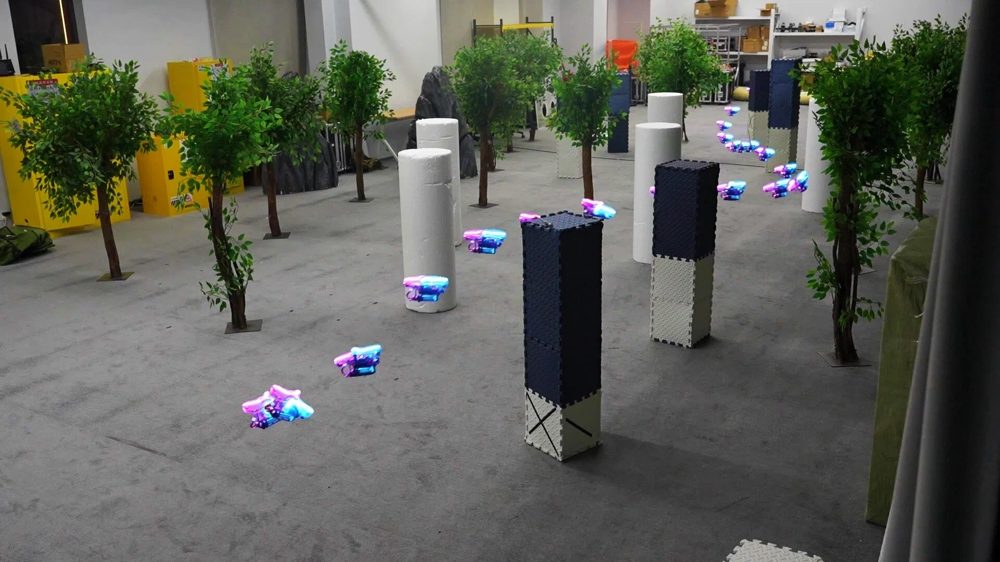
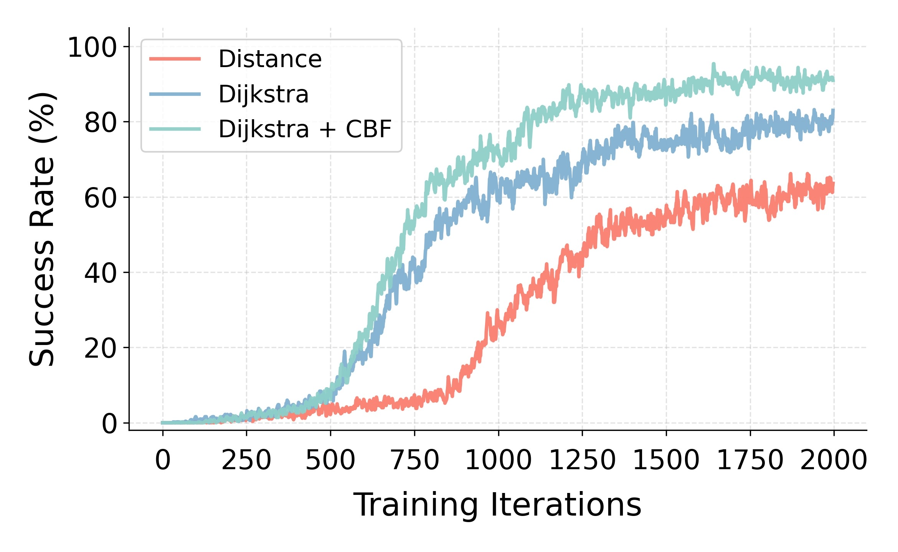
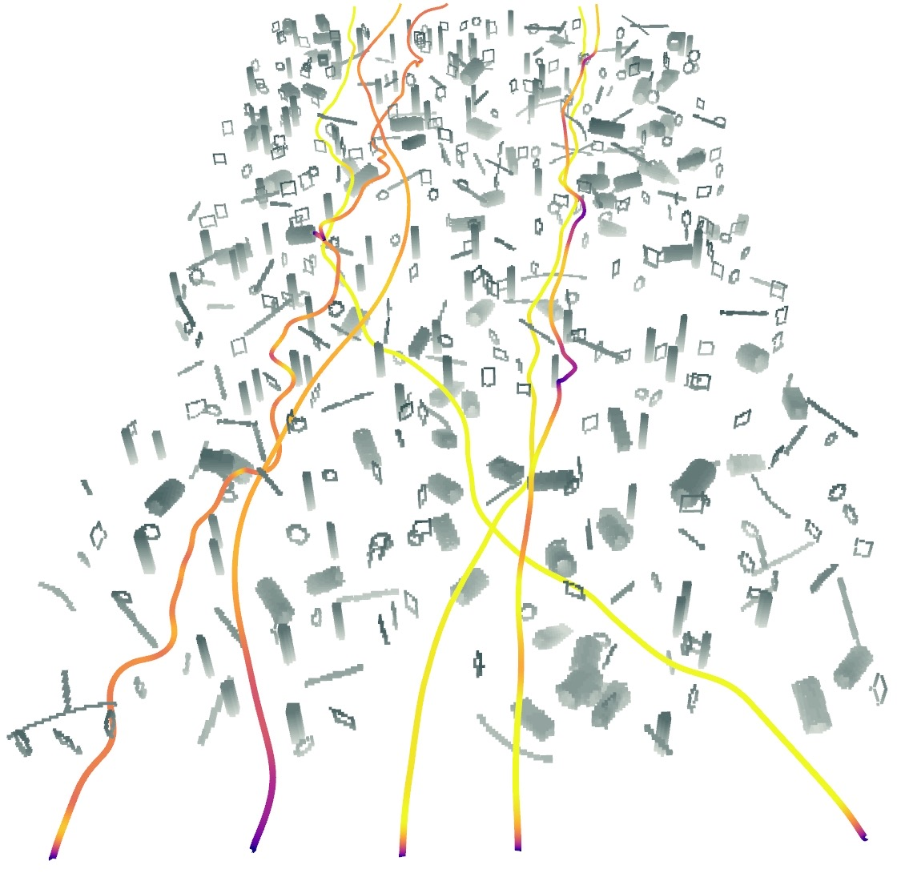
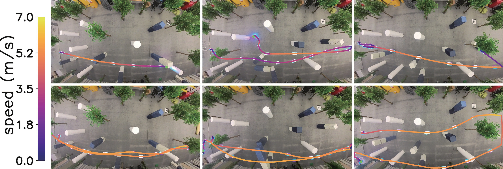
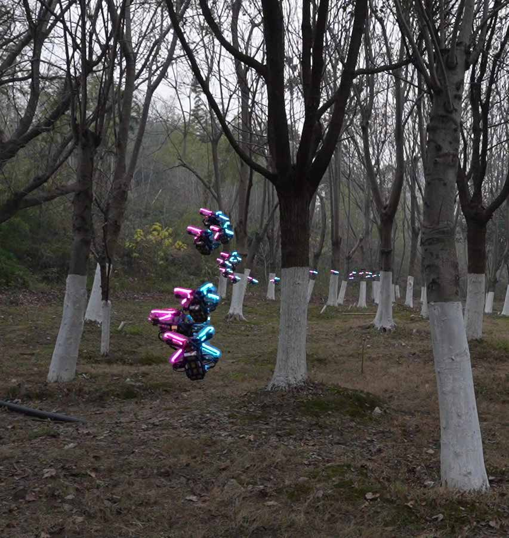

# 安全屏蔽强化学习高速飞行（05_High-Speed_Vision-Based_Flight_in_Clutter）：完整忠实学术翻译

> **原文标题**：05_High-Speed_Vision-Based_Flight_in_Clutter  
> **作者**：Jiarui Zhang、Chengyong Lei、Chengjiang Dai、Kenghou Hoi、Lijie Wang、Zhichao Han、Fei Gao  
> **发表信息**：arXiv:2602.08653v2，2026-06-30  
> **原文 PDF**：[05_High-Speed_Vision-Based_Flight_in_Clutter.pdf](../05_High-Speed_Vision-Based_Flight_in_Clutter.pdf) ｜ **对应中文详解**：[05_安全屏蔽强化学习高速飞行.md](../中文详解/05_安全屏蔽强化学习高速飞行.md)  

---

## 原文第 1 页核心内容与翻译

基于安全屏蔽强化学习的杂乱环境高速基于视觉飞行
Jiarui Zhang1,2†, Chengyong Lei1,2†, Chengjiang Dai1,2, Kenghou Hoi1,2, Lijie Wang1,2,
Zhichao Han1,2*, and Fei Gao1,2*
**摘要**——四旋翼无人飞行器（UAVs）正越来越多地被部署于需要可靠自主导航和稳健避障的复杂任务中。然而，传统的模块化流程通常会产生累积延迟，而纯强化学习（RL）方法通常提供有限的正式安全保证。为了弥合这一差距，我们提出了一种结合基于模型安全机制的端到端强化学习框架。我们在训练和部署中都引入了物理先验。在训练期间，我们设计了一个具有物理信息的奖励结构，提供全局导航引导。在部署期间，我们集成了一个实时安全滤波器，将策略输出投影到可证明的安全集合上，以强制执行严格的防碰撞约束。这种混合架构协调了高速飞行与稳健的安全保障。基准评估表明，我们的方法优于传统规划器以及最近基于可微物理的端到端避障方法。广泛的实验证明了强大的泛化能力，能够以高达7.5 m/s的速度在密集杂乱环境和具有挑战性的户外森林环境中实现可靠的高速导航。
**索引词**——空中机器人；强化学习；避障；安全控制。
I. 引言
近年来，四旋翼无人飞行器（UAVs）由于其出色的机动性和敏捷性，被广泛应用于物流、搜救和探索任务中[1], [2]。然而，在这些非结构化和动态环境中的导航，要求系统感知突然出现的障碍物并在短时间内执行规避动作。这就导致了对高速飞行的需求与保证严格避障所需的计算延迟之间的根本冲突。
传统的导航流程将自主性分解为顺序的感知、规划和控制模块，通过明确的算法结构和既定的安全裕度来实现可靠的性能[3]–[5]。然而，这种模块化设计不可避免地会产生累积延迟，因为感知更新、全局重新规划和轨迹优化在闭环中重复执行，导致在快速变化的环境中反应延迟[6]。此外，在密集的杂乱空间中进行规划通常需要高维搜索或优化，导致计算成本随环境复杂性的增加而急剧上升，从而限制了高速飞行时的实时性能。
†这些作者对这项工作做出了同等贡献。
*通讯作者：Zhichao Han 和 Fei Gao
1浙江大学控制科学与工程学院网络系统与控制研究所，中国杭州 310027
2Differential Robotics，中国杭州 311121。
邮箱：{jrzzz, fgaoaa}@zju.edu.cn
相比之下，基于学习的导航通过将传感器观测直接映射到控制命令[7]–[11]，已成为一种有吸引力的替代方案。这种端到端策略显著减少了处理延迟，并与模块化流程相比在高速飞行场景中表现出更卓越的敏捷性[12]。尽管有这些优势，纯粹基于学习的方法通常缺乏理论上的安全保证，并且容易受到分布外泛化失败的影响，这从根本上限制了它们在安全关键应用中的可靠性。
为了解决纯端到端导航策略中缺乏正式安全保证的问题，同时保留其在复杂环境中的敏捷性，我们提出了一种混合导航框架，将强化学习与基于模型的安全机制紧密耦合。核心思想是利用端到端策略的低延迟和强大表达能力进行高速机动，同时通过明确的物理约束来强制执行安全性。在训练期间，我们通过利用全局路径引导和安全相关的约束来塑造奖励，将基于模型的先验知识结合到学习过程中，鼓励策略获得既高效又具有风险意识的导航行为。在部署期间，我们进一步引入了基于高阶控制障碍函数的实时安全修正模块，该模块将策略输出投影到可证明的安全集合上，以保证在不可预见的干扰和分布偏移下实现避障。此外，我们采用鲁棒的仿真到现实转移策略，以确保在真实的四旋翼平台上性能一致。
我们的主要贡献总结如下：
1) 一种训练时的安全感知导航框架，将全局路径结构和局部避障整合到端到端强化学习中。所提出的方法缓解了欧几里得距离目标中的局部极小值，并在杂乱环境中实现了更具前瞻性的导航行为。
2) 一种基于控制障碍函数的安全执行机制，通过实时修正策略输出来保证避障。该机制用正式的安全约束补充了基于学习的敏捷性，实现了高速飞行而不会在分布偏移下牺牲可靠性。
3) 跨越仿真和真实平台的全面实验验证。广泛的基准测试表明其性能优于传统规划器和基于学习的基线，而真实世界的

---

## 原文第 2 页核心内容与翻译

实验验证了稳健的仿真到真实转移，以及在密集杂乱环境中的敏捷导航。
II. 相关工作
A. 无人机的模块化导航
传统的基于优化的导航方法通常依赖于从深度测量中构建显式的3D环境表示，以及人工推导的安全约束[3], [13], [14]。例如，硬约束方法将规划解耦为提取安全飞行走廊（SFC）——由立方体、球体或多面体表示——随后通过凸优化生成轨迹[15]。虽然保证了走廊内的全局最优性，但这些方法通常依赖于启发式的时间分配策略，这会降低轨迹质量并导致保守的动态约束，从而限制敏捷性。
相反，使用欧几里得符号距离场（ESDF）的软约束方法联合优化规划和控制，利用梯度信息在连续空间中收敛到可行的轨迹。然而，维护实时的ESDF对机载处理器施加了巨大的计算开销，因为线积分的计算代价高昂，需要在建图精度和更新频率之间做出艰难的权衡。为了缓解这一问题，Ego-Planner [14] 避开了显式的ESDF构建，而是通过迭代生成安全引导路径来提供避障梯度。尽管如此，这类方法缺乏理论收敛保证，并且在复杂的非凸环境中容易陷入不安全的局部极小值。此外，这些多模块系统的级联架构引入了显著的参数复杂性和累积延迟，导致高速飞行期间状态估计的不稳定，并限制了在动态场景中的稳健性。
B. 基于学习的方法
最近的研究强调了基于学习的方法的巨大潜力，这些方法避免了密集建图或显式环境建模的需求。通过将传感器观测直接映射到控制命令，这些方法规避了与模块化轨迹优化相关的累积延迟和计算负担，展示了令人印象深刻的机动性[16]–[18]。NavRL [19] 引入了一个基于PPO的框架，能够在包含移动障碍物的动态环境中实现安全和反应式的导航，通过仔细的奖励设计和课程训练实现了低碰撞率。类似地，诸如 [10] 和 [20] 的方法提出了一种RL流程，能够根据环境杂乱程度动态调整飞行速度，在未知杂乱空间中的成功率和敏捷性之间取得了有效的平衡。此外，新兴研究利用了可微模拟器和嵌入优化的网络来提升控制器的性能。混合方法[21]将传统的轨迹优化嵌入到神经网络中，直接从深度输入生成动态可行的轨迹，在没有显式建图的情况下桥接感知与规划，并确保运动学约束。
虽然这些基于学习的方法将无人机的敏捷性推向了新的高度，但其固有的理论完备性缺乏通常会损害安全关键场景中的可靠性。集成了控制障碍函数（CBFs）的混合架构已成为解决这一限制的突出方法。例如，Cheng等人提出的RL-CBF框架将无模型的RL算法与基于模型的CBF控制器结合起来，以确保整个训练过程中的安全性[22]。为了克服将硬约束集成到基于梯度的学习中的挑战，Emam等人引入了嵌入在软执行者-评论家（SAC）框架中的可微鲁棒控制障碍函数安全层[23]。同时，最近的方法证明了在训练期间将全局路径结构作为特权信息结合起来的有效性，以防止策略陷入非凸障碍物中。例如，Lee等人利用到达时间（ToA）地图定义明确的速度设定点梯度，有效引导策略穿过高度杂乱的空间和死胡同[24]。
虽然这些先前的工作优雅地将分析模型嵌入神经网络，但我们在PPO框架内提出了一种独特的基于位置的奖励[25]。通过避免严格的速度跟踪，这种混合策略桥接了敏捷性和安全性，赋予策略增强的鲁棒性和全局可达性，而不会过度约束机动性。
III. 方法论
A. 问题表述
我们将模拟无人机与其复杂动态环境之间的实时交互构建为马尔可夫决策过程（MDP）。形式上，MDP被定义为元组 (S, A, P, R, γ)，其中 S 表示状态空间，A 表示动作空间，P : S × A × S → [0, 1] 表示状态转移概率，R : S × A → R 表示奖励函数，γ ∈ [0, 1) 表示折扣因子。Actor-Critic网络直接从 S 映射到 A，而不是采用多阶段或显式的课程学习方法。仿真步长设置为 0.01 秒，因此策略输出和控制执行都在 100 Hz 下运行。关于观察空间、动作空间和奖励设计的详细描述在后续的小节 III-A1、III-A2 和 III-A3 中提供。
1) 观察空间：训练循环从获取无人机当前状态的观察开始。输入到我们策略网络的观察被构造为一个多模态的复合向量 ot，整合了环境的外部感知和无人机的本体感受状态。具体而言，观察定义为：
ot =
h
Dt, vt, Rt, aπ
t−1, dxy
t , zself
t
, zgoal
t
i
,
(1)
其中各个组成部分详述如下：
• Dt ∈ R100×60：机载相机捕获的深度图像。
• vt ∈ R3：在机体坐标系中表达的线速度向量。

---

## 原文第 3 页核心内容与翻译

𝐯!
𝐚!"#
𝐑!
𝐝!
$%
z!
&'()
z!
*+),
Dropout
Add Noise
Critic
Actor
𝐃!
MLP
Fusion Module
(GRU)
𝑉(!
Depth Encoder
(CNN)
𝐚! =
𝑓"
𝜙#$%
𝜃#$%
𝜓#$%
Ground Truth
Add Noise
Delay
Asymmetric
Actor-Critic
Observations
Real World
HOCBF
Filter
Training
Deployment
Forward
propagation
Backward
propagation
Simulation
Vectorized
PX4 Controller
Motor Thrusts
Depth Encoder
(CNN)
MLP
Fusion Module
(GRU)
π

**图 1**：Fig. 1: 网络架构与控制流程。非对称Actor-Critic策略通过GRU融合深度图像（CNN）和本体感受状态。Actor输出姿态参考和归一化推力，由PX4控制器进行跟踪。在训练期间，域随机化（dropout/噪声/延迟）提高了鲁棒性；在部署期间，实时的HOCBF滤波器改进原始命令，以执行安全约束。

• Rt ∈ SO(3)：表示无人机当前姿态的旋转矩阵。
• aπ
t−1：在上一个时间步执行的动作，包括滚转、俯仰、偏航和总推力。这个历史动作作为参考，以确保控制的平滑性。
• dxy
t
= [∆x, ∆y]⊤：相对于目标的归一化水平位置差。
• zself
t
和 zgoal
t
：分别是无人机的当前高度和目标高度。
2) 动作空间：策略网络处理上述观察，并输出一个四维动作向量 aπ
t ∈ R4，定义为：
aπ
t = [fn, ϕref, θref, ψref]⊤,
(2)
该向量由质量归一化的集体推力 fn 和期望的姿态角（滚转 ϕref、俯仰 θref 和偏航 ψref）组成。控制命令以固定的 100 Hz 频率更新，以保证实时响应性。随后，低层机载飞行控制器解算出各个电机所需的转速，以实现对这些高层命令的精确跟踪。
为了确保操作安全，真实的无人机通常会强制执行有界的姿态命令，以防止可能导致失控的激进机动。因此，我们不发出如直接电机速度等低层控制输入，而是采用姿态级别的控制命令作为策略输出。这种更高层次的控制抽象通过使仿真中的动作空间与物理平台上使用的实际飞行控制器保持一致，显著缩小了仿真到现实的差距，从而提高了仿真到现实转移的稳健性 [26]。
3) 奖励函数设计：在这项工作中，总奖励 rt 定义为不同组成部分的加权和：
rt = α1rnavigation + α2rsafety + α3rsmooth
+ α4rcollision + α5rsuccess
+ α6rspeed + α7rheight.
(3)
具体来说，总奖励由导航引导、安全调节、控制正则化和终止信号组成。在第 III-C 节详述的基于模型的组件 rnavigation 和 rsafety，在训练期间提供了全局路径引导和具有安全意识的奖励塑造。为了确保可执行且稳定的控制行为，平滑项 rsmooth 惩罚大控制幅度和连续动作之间的剧烈变化，鼓励动态可行和平滑的轨迹。终止奖励 rcollision 和 rsuccess 分别在发生碰撞和成功完成任务时应用，提供清晰的情节反馈。此外，辅助项 rspeed 和 rheight 将无人机的速度和高度软约束在预定义的安​​全范围内，防止在探索过程中出现不切实际或不安全的行为。总奖励被表述为加权和，其中 αi 表示第 i 项的系数。这些权重在训练期间凭经验进行调整，以平衡安全性、敏捷性和任务完成情况。
B. 网络架构
我们在非对称的 Actor-Critic 框架内采用近端策略优化（PPO）算法。这种架构利用了特权学习范式：当 Critic 网络在无噪声的真实状态下进行训练以促进稳定的价值估计时，Actor 网络仅在有噪声的观测下运行，以确保在真实的现实世界不确定性下的部署稳健性。
完整的网络结构如图 1 所示。为了有效处理多模态输入，Actor 采用了异构神经网络架构。视觉流通过由顺序的卷积、激活（ReLU）和池化层组成的卷积神经网络（CNN）处理 100 × 60 的深度图像，提取对空间几何进行编码的紧凑视觉特征向量 fCNN。我们直接将此视觉嵌入与原始的本体感受观测进行拼接，本体感受观测包括四旋翼飞行器的线速度、旋转矩阵、先前的动作以及与目标相对的位移。这个统一的向量随后被输入到门控循环单元（GRU）中。GRU 维持一个时间隐藏状态 ht 来聚合历史上下文，

---

## 原文第 4 页核心内容与翻译

使策略能够缓解部分可观测性并随着时间的推移平滑传感器噪声。最后，GRU 输出被传递到一个多层感知机（MLP）头部，该头部预测连续动作命令 at 的高斯分布参数。
C. 基于模型的奖励整形
我们首先公式化导航奖励 rnavigation。传统的基于距离的奖励通常依赖于欧几里得距离来塑造策略。虽然这提供了密集的反馈，但它往往会在非凸环境中导致收敛失败。智能体在贪婪地最小化欧几里得距离的驱动下，很容易陷入局部极小值陷阱，无法绕过复杂的障碍物。为了克服这个问题，我们提出了一种测地线引导的奖励机制。我们利用通过Dijkstra算法导出的预计算成本地图，而不是欧几里得距离，该地图代表了考虑障碍物的真实最短路径距离。在训练期间，这张地图充当了一个密集的势场。通过应用三线性插值，我们在无人机的实时坐标处提取连续成本值 Vt。然后根据沿着这个势场的进展 δ 来制定奖励。这种方法为智能体提供了全局几何感知，有效地将长视野任务分解为可访问的局部子目标，并引导无人机走出局部极小值。
令 Φg 表示针对给定场景 g 预先计算的测地线距离场（通过 Dijkstra）。时间步 t 的导航奖励 rnavigation,t 被定义为沿着这个势场取得的经过裁剪的进展：
rnavigation,t = λ · clamp(Interp(Φg, pt−1)
|
{z
}
Vt−1
−Interp(Φg, pt)
|
{z
}
Vt
, −C, C), (4)
其中 Interp(·) 表示三线性插值函数，它将连续的无人机位置 p 映射到离散的 Dijkstra 成本网格，λ 是一个比例因子，clamp 函数通过将奖励限制在 [−C, C] 范围内来确保数值稳定性。
为了提高飞行安全，我们纳入了基于控制障碍函数 [22], [27], [28] 的整形奖励。我们首先从障碍物地图构建 ESDF，其中 d(x) 表示从位置 x 到最近障碍物的最小距离。障碍函数定义为 b(x) = d(x) − dsafe，其中 dsafe 是规定的安全裕度。根据 CBF 理论，如果满足前向不变性条件 ˙b(x) + γb(x) ≥ 0，则可以保证安全。我们没有明确强制执行这个约束，而是将违反该条件的情况编码到奖励函数中。具体来说，在每个时间步 t，我们计算障碍函数的时间导数 ˙b(xt) = ∇d(xt) · vt，利用 ESDF 的梯度和无人机的当前速度向量。安全奖励 rsafety 然后被表达为：
rsafety = clip
 
˙b(xt) + γb(xt), δmin, 0
 
,
(5)
其中 γ 是 CBF 系数。我们对安全奖励施加裁剪阈值 δmin = −2.0。这个下界防止了无界的惩罚破坏价值函数近似的稳定并导致梯度爆炸，从而确保训练期间的数值稳定性。该机制鼓励无人机主动将其速度与 ESDF 梯度对齐，以满足障碍条件，有效预测和避免碰撞风险。
尽管我们利用特权的地图信息来构建 rnavigation 和 rsafety 以增强策略的导航能力和安全性，但这两个奖励严格地仅在训练阶段使用，而不在部署期间使用。
D. 基于 HOCBF 的校正循环
由于奖励整形仅作为一种软激励而不是硬约束，智能体仍然可能遭受严重的失败。为了在实际部署期间提供理论上的安全保证，我们集成了一个基于高阶控制障碍函数（HOCBF）的安全滤波器 [29]。这个优化层偏离原始参考加速度 araw （它可以从策略输出 aπ
t 中得出）的程度最小，以严格满足安全约束。我们将其公式化为二次规划（QP）：
a∗ = arg min
a
1
2|a − araw|2
s.t.
C(rt, a) ≥ 0.
(6)
对于障碍物 i，我们定义候选障碍函数 Bi(rt) = ∥rt∥2 − r2
safe，其中 rt 表示从无人机延伸到在由实时深度观测重建的局部点云中识别的最近障碍物点的相对位置向量，rsafe 是安全半径。考虑到四旋翼动力学的二阶特性，我们采用 HOCBF 公式以确保安全集的前向不变性。相关的安全约束定义为：
¨Bi(rt) + α1 ˙Bi(rt) + α0Bi(rt) ≥ 0,
(7)
其中 α0, α1 > 0 是可调系数。在实践中，这些系数是凭借经验调整的，以在严格的安全执行和轨迹可达性之间取得平衡。较大的系数引入了过度的保守性，而较小的系数会导致优化效果不足。
通过代入时间导数 ˙Bi(rt) = 2rt · vt 和 ¨Bi(rt) = 2∥vt∥2 + 2rt · at，我们得出了关于控制动作 a 的线性不等式约束：
2r⊤
t
|{z}
Acbf
at ≥ −2∥vt∥2 − α1 ˙Bi(rt) − α0Bi(rt)
|
{z
}
bcbf
.
(8)
在这里，Acbf 封装了用于避障的梯度方向，而 bcbf 量化了抵消系统惯性并确保边界不变性所需的最小控制努力。这种线性约束允许 QP 求解器高效地实时计算安全的控制命令 a∗，有效地纠正不安全的机动，同时保留预期的飞行轨迹。我们评估了 HOCBF 滤波器的计算开销，结果显示单次 HOCBF 执行的平均优化时间仅为 90.61 µs，最大优化时间严格限制在 384.5 µs 以下。这确保了滤波器在实际部署期间不会引入任何明显的控制延迟。

---

## 原文第 5 页核心内容与翻译

IV. 实验
为了验证所提出框架的有效性，我们首先评估了不同奖励配置下的训练性能。随后，通过在各种未见过的环境中部署策略来进行消融实验，以评估其对成功率的影响。此外，我们将提出的方法与最先进的方法进行了基准测试，包括基于规划的 Ego-Planner [14] 以及基于学习的 NavRL [19]、YOPO [30] 和 DiffPhys [11]，证明了我们的方法在确保严格安全性的同时，始终如一地保持目标速度设定点。通过在不同障碍物配置下的室内实验验证了在现实世界中的可行性，并与 Ego-PlannerV2 [5] 进行了比较。最后，我们展示了该框架在杂乱的户外森林中的高速导航能力，实现了高达 7.5 m/s 速度的敏捷飞行。
A. 仿真
1) 训练结果：我们的框架在 Isaac Lab 中使用大规模并行仿真进行训练，同时部署了 1,000 架四旋翼飞行器，分布在 16 个程序生成的难度递增的场景中。每个场景包含随机放置的树木和圆柱体，障碍物密度随着难度级别的提高而逐渐增加。在每集的开始，无人机的初始位置在位于障碍物场前方的自由空间内均匀随机化。如果无人机到达目标区域（定义为在目标位置的 5 米半径内），则该集被认为是成功的。
为了研究奖励整形对学习效率和导航性能的影响，我们比较了三种奖励公式：(i) Distance，它利用到目标的欧几里得距离作为导航奖励；(ii) Dijkstra，它用基于 Dijkstra 的势值代替欧几里得度量进行全局引导；(iii) Dijkstra + CBF，它用额外的基于 CBF 的安全项来增强 Dijkstra 奖励，以惩罚靠近障碍物的行为。图 2a 中的学习曲线表明，在相同的训练条件下，基于 Dijkstra 的导航奖励大大加速了策略学习，并实现了始终高于 Distance 基线的训练成功率。此外，结合基于 CBF 的安全奖励鼓励了更安全的探索，并在最终性能上产生了进一步的改善，在所有比较的变体中实现了最高的成功率。
2) 消融实验：我们通过在八个尺寸为 64×32×3 m 的未见过的杂乱几何场景中进行消融实验，评估了基于 Dijkstra 的导航奖励、基于 CBF 的安全奖励和 HOCBF 安全滤波器的各自贡献。与训练场景不同，这些场景由随机放置的倾斜或垂直圆柱体、框架结构和细杆组成，导致高度非凸的可通行性（图 3b），而部署的策略仅依赖于其标准的机载观察，无法访问训练期间用于构建奖励的特权地图信息。我们每个场景执行 50 次独立试验，其中起始位置和目标位置随机采样
a
b

**图 2**：Fig. 2: 训练表现与环境。(a) 不同奖励配置下随迭代次数成功率的比较训练曲线。(b) 充满密集障碍物的代表性训练场景可视化。

分别在环境起跑线和终点尺寸为 1 m × 32 m × 2 m 的矩形区域内，结果汇总在表 I 中。总的来说，结果有力地验证了我们的分层设计：全局引导确保了可达性，而混合安全机制（软整形 + 硬滤波）保证了整个速度包线内的稳健性。
全局引导确保可达性。由于其短视性质，欧几里得距离基线在较高速度下会出现性能急剧下降，经常导致在复杂的杂乱环境中失败。相比之下，集成基于 Dijkstra 的势场通过编码全局拓扑信息显著提高了可达性，该势场提供了一致的梯度来引导智能体远离局部极小值（例如，U 形陷阱）。这种策略有效地将长视野规划能力提取到反应策略中，而不会产生在线搜索延迟。值得注意的是，5 m/s 时的表现略好于 3 m/s，这可以解释为一种由约束引起的可达性现象。由于具有更严格的速度上限，飞行器在每个决策步向前推进的距离更短，并且在非凸障碍物结构附近停留的时间更长，从而增加了其暴露于局部陷入配置中的风险。此外，因为在低速区间的名义动作在幅度上较小，所以基于 CBF 的修正构成了更大的相对修改，并且可以抑制命令的向前推进分量。因此，3 m/s 时的失败更可能源于任务进展不足和局部停滞，而不是由于安全性的丧失。
混合安全架构的必要性。利用基于 CBF 的安全奖励增强策略能够提高在中低速范围内的性能。为了分离这一贡献，我们比较了我们的公式和几何膨胀基线，以 5 m/s 的速度在 16 个未见场景中进行了 160 次试验，该基线通过终止碰撞惩罚强制执行了 0.4 m 的双倍静态安全裕度。膨胀方法的表现不如我们基于 CBF 引导的策略，成功率较低（87.08% 对比 92.50%），并且平均轨迹间隙变小（0.89 m 对比 0.92 m ESDF）。简单地扩大静态裕度会人为地阻塞狭窄的走廊，而我们连续的 CBF 公式提供了物理支持的、具有速度感知能力的梯度，从而在不牺牲可达性的情况下动态地提高安全性。然而，在高动态条件下（7 m/s 和 9 m/s），软奖励整形在高速时表现出轻微的下降，显著的系统惯性使安全裕度对控制极其敏感

---

## 原文第 6 页核心内容与翻译

表 I：不同目标速度下消融实验结果
配置
3 m/s
5 m/s
7 m/s
9 m/s
SR↑
Vel
SR↑
Vel
SR↑
Vel
SR↑
Vel
Distance
51.75
3.04
35.00
5.16
21.25
7.11
0
-
Dijkstra
62.25
3.02
67.75
5.18
56.25
6.76
43.75
8.36
Dijkstra + CBF
84.50
3.03
94.00
4.99
52.25
6.99
37.25
8.70
Ours (Full)
88.75
3.00
100
4.90
75.00
6.79
47.50
9.00
∗SR: 成功率 (%), Vel: 平均速度 (m/s).
表 II：不同目标速度下成功率的基准比较
方法
3 m/s
5 m/s
7 m/s
9 m/s
Ego-Planner [14]
70.62%
0.62%
0.00%
0.00%
NavRL [19]
43.12%
5.00%
3.12%
0.00%
YOPO [30]
26.88%
21.25%
10.62%
6.88%
DiffPhys [11]
70.62%
55.62%
57.50%
51.25%
Ours
96.88%
96.25%
73.75%
56.88%
输入，使得强化学习智能体很难仅通过奖励反馈来近似刚性约束。这一限制凸显了我们的 HOCBF 安全滤波器的关键必要性。作为部署期间的确定性保障，滤波器求解实时 QP 将原始命令投影到可证明的安全集合上。在复杂的仿真测试中，HOCBF 滤波器在总控制步数的 13.06% 中被触发，成功补偿了神经网络策略在关键边界情况下的近似误差。因此，完整框架有效地弥合了基于学习的敏捷性与基于模型的安全性之间的差距。
3) 基准测试：我们将我们提出的框架与四种代表性基线进行了基准测试：基于规划的 Ego-Planner [14] 以及基于学习的 NavRL [19]、YOPO [30] 和 DiffPhys [11]。每种方法都在相同的目标速度预算下使用其原生的观测设计进行评估。实验在 16 个未见过的基准场景中进行，这些场景与第 IV-A2 节中使用的场景尺寸相同且未包含在训练中（图 3b），分为两种类型：(1) 12 个杂乱几何场景，由随机分布的基元组成，导致高度非凸的可通行性；以及 (2) 4 个基于 Perlin 噪声的程序生成障碍物场。在这两种场景类型中，场景难度随着障碍物密度的增加而增加，这反映在中值自由空间 ESDF 从 1.24 m 减少到 0.49 m 上。对于每种方法和目标速度，我们总共进行了 160 次独立试验，只有当无人机在没有碰撞的情况下完成场景并在距离目标 5 m 内完成时，一次运行才被视为成功。有代表性的成功率结果在表 II 中报告。
正如表 II 中详细说明的那样，Ego-Planner [14] 仅在最低目标速度下可行，在超过 3 m/s 时几乎完全失败，这反映了在密集的杂乱环境中进行迭代建图和重规划的延迟瓶颈。在基于学习的基线中，NavRL [19] 随着速度的增加性能下降最为急剧，从 3 m/s 时的 43.12% 下降到此后的几乎为零。这种行为可能归因于其相对规律的训练场景与高度杂乱的
a
Ego-Planner
NavRL
YOPO
Diffphys
Ours
b

**图 3**：Fig. 3: 针对最新方法的基准比较。(a) 在 16 个场景基准库中选出的 4 个代表性场景上，在不同目标速度下成功试验的平均实际速度，比较了 Ego-Planner [14]、NavRL [19]、YOPO [30]、DiffPhys [11] 和我们的方法。(b) 各方法在几何杂乱（左）和 Perlin 噪声（右）场景下生成的飞行轨迹可视化。

基准环境之间的不匹配，再加上其静态障碍物的输入设计限制了鲁棒性，因为反应时间在更高的速度下会缩小。YOPO [30] 比 NavRL 更稳定，能够相对较好地跟踪目标速度，但它基于深度的条件性地在一组有限短视距运动基元上的选择在高度非凸的杂乱环境中仍然脆弱，在这种环境中，局部有利的基元仍可能将车辆引向死角或碰撞。DiffPhys [11] 实现了比 NavRL 和 YOPO 更高的成功率，但其实现速度在 3 m/s 附近达到饱和（图 3a）。这种有限的高速可扩展性可能源于将相机朝向与命令的运动相绑定。在激进的机动中，较大的俯仰偏差将相机视野移向地面或天空，严重降低了前方障碍物的可见度。因此，策略采取了保守的行为，以速度换取感知的稳定性，并在较高的目标速度下失败。
相反，我们的方法实现了安全性与敏捷性之间的最佳权衡，在所有速度和配置下保持了最高的成功率和实际速度（图 3a）。具体而言，在从 3 到 9 m/s 的过程中，成功率分别保持在 96.88%、96.25%、73.75% 和 56.88%，平均成功速度从 3.00 增加到 7.58 m/s。这些结果验证了结合低延迟学习与基于模型的安全性的优势：学习到的策略保留了积极的速度跟踪，而安全层则强制执行了可靠的近乎

---

## 原文第 7 页核心内容与翻译

(a) Target speed: 3 m/s
(b) Target speed: 5 m/s
(c) Target speed: 7 m/s

**图 4**：Fig. 4: 不同目标速度下室内真实世界实验的截图。每个子图展示了在不同障碍物配置下进行的三个独立试验，以评估鲁棒性。在每个面板中，上方和下方的行分别比较了 Ego-Planner（上）和我们提出的方法（下）的性能。

障碍物行为，并在环境和目标速度变得越来越具有挑战性时提高鲁棒性。
B. 真实世界实验
为了进一步验证提出的框架，我们在物理四旋翼飞行器上部署了训练好的策略，并在杂乱的室内环境和非结构化的室外森林中进行了广泛的实验。
我们构建了一个杂乱的室内环境，如图 4 所示。使用 3 m/s、5 m/s 和 7 m/s 的目标速度约束训练的网络对策略进行评估。为了评估泛化能力，四旋翼飞行器的任务是在 15 米长的障碍物路线中来回导航，布局在每次飞行前随机重新配置。
我们的策略在不同的速度和配置下均实现了非常高的避障和导航成功率。与传统的 Ego-PlannerV2 [5] 相比，它展示了更优的飞行稳定性和最大可达速度。如图 4 所示（其中红圈表示碰撞），Ego-PlannerV2 [5] 的失败率在较高目标速度下显著增加。相比之下，我们的方法在轨迹的大部分时间内持续实现成功的导航，同时保持紧密跟踪目标设定点的实际速度。
为了对真实世界场景复杂性提供更有原则的评估，我们进一步使用文献 [31] 遵循的可通行性指标量化了室内测试环境的难度。
6.847
7.689
7.989
8.231
Traversability
0
1
2
3
4
5
6
7
8
Actual Speed (m/s)
Speed (3m/s Limit)
Speed (5m/s Limit)
Speed (7m/s Limit)
Succ. Rate (3m/s)
Succ. Rate (5m/s)
Succ. Rate (7m/s)
0
20
40
60
80
100
Success Rate (%)

**图 5**：Fig. 5: 相对于环境复杂度的飞行性能定量评估。该图展示了在四个可通行性递减的室内环境中，不同目标速度下的成功率和统计速度测量值（均值和标准差）。

构建了四个障碍物级别递增的室内环境，策略在三个目标速度设置下进行了评估，即 3 m/s、5 m/s 和 7 m/s。对于环境复杂性和目标速度的每种组合，都进行了 10 次独立的真实世界试验。
如图 5 所示，在两个难度较低的环境中，所提出的方法在所有目标速度下均实现了 100% 的成功率。在更加杂乱的场景中，策略仍然保持稳健：5 m/s 设置仅在最困难的环境中失败一次，而 7 m/s 设置在两个最具挑战性的环境中分别实现了 90% 和 80% 的成功率。相应的速度统计数据进一步表明，实际速度保持在目标速度附近，并未随着环境复杂性的增加而出现显著下降。这些结果表明，所提出的策略在增加障碍物的情况下保持了安全性和敏捷性，而不是依赖于保守的降速。
在室外森林场景中（图 6），我们采用了一种调整了训练配置的策略，与原始训练配置相比，仅降低了障碍物密度并提高了目标速度上限。四旋翼飞行器成功地实现了稳定、高速、长距离的避障，在超过 35 米的距离上保持 7 m/s 的平均速度抵达目标。
此外，我们还在仿真和真实世界中的动态条件下评估了我们的策略。尽管完全在静态环境中训练，无人机仍然成功泛化到了未知的动态场景，在包含密集移动障碍物的 100 次仿真试验中达到了 64% 的成功率，并在真实世界中完成全部 10 次飞行测试而没有与以 0.5 m/s 移动的障碍物发生碰撞。失败主要发生在移动障碍物从传感器的盲区接近时，这使得局部感知视野不足以进行成功的反应式机动。
V. 结论
在本文中，我们提出了一种混合强化学习框架，将无模型策略优化与基于模型的物理先验相结合，用于四旋翼飞行器的高速避障。该先验通过几何引导加速了训练收敛，并通过实时滤波确保了可行的控制部署。目前，硬件限制使得真实世界中的飞行速度难以达到策略的仿真最大能力。未来的工作将集中在提高四旋翼硬件的性能，并将该方法扩展到特定任务的场景。

---

## 原文第 8 页核心内容与翻译

goal
start
a
c
b
d

**图 6**：Fig. 6: 室外飞行实验可视化。(a) 全局点云图覆盖有执行的轨迹及对应的实际速度剖面。(b) 自我视角观测，包括 RGB 和对齐的深度图像 (Intel RealSense D435i)，以及增强的实时姿态和速度计显示。(c) 环境的俯视图。(d) 侧视图复合图像展示了穿过密集植被的连续飞行机动。

几何指导并通过实时过滤确保可行的控制部署。目前，硬件限制阻碍了现实世界飞行速度达到策略的最大模拟能力。未来的工作将集中在增强四旋翼硬件性能以及将该方法扩展到特定任务场景上。
REFERENCES
[1] B. Zhou, Y. Zhang, X. Chen, and F. Gao, “FUEL: Fast uav exploration
using incremental frontier structure and hierarchical planning,” IEEE
Robotics and Automation Letters, vol. 6, no. 2, pp. 779–786, 2021.
[2] Z. Xu, B. Chen, X. Zhan, Y. Xiu, C. Suzuki, and K. Shimada,
“A vision-based autonomous uav inspection framework for unknown
tunnel construction sites with dynamic obstacles,” IEEE Robotics and
Automation Letters, vol. 8, no. 8, pp. 4983–4990, 2023.
[3] B. Zhou, F. Gao, L. Wang, C. Liu, and S. Shen, “Robust and effi-
cient quadrotor trajectory generation for fast autonomous flight,” IEEE
Robotics and Automation Letters, vol. 4, no. 4, pp. 3529–3536, 2019.
[4] F. Gao, L. Wang, B. Zhou, X. Zhou, J. Pan, and S. Shen, “Teach-repeat-
replan: A complete and robust system for aggressive flight in complex
environments,” IEEE Transactions on Robotics, vol. 36, no. 5, pp. 1526–
1545, 2020.
[5] X. Zhou, X. Wen, Z. Wang, Y. Gao, H. Li, Q. Wang, T. Yang, H. Lu,
Y. Cao, C. Xu et al., “Swarm of micro flying robots in the wild,” Science
Robotics, vol. 7, no. 66, p. eabm5954, 2022.
[6] T. Wu, Y. Chen, T. Chen, G. Zhao, and F. Gao, “Whole-body
control through narrow gaps from pixels to action,” arXiv preprint
arXiv:2409.00895, 2024.
[7] G. Kahn, P. Abbeel, and S. Levine, “Badgr: An autonomous self-
supervised learning-based navigation system,” IEEE Robotics and Au-
tomation Letters, vol. 6, no. 2, pp. 1312–1319, 2021.
[8] H. Nguyen, S. H. Fyhn, P. De Petris, and K. Alexis, “Motion primitives-
based navigation planning using deep collision prediction,” in 2022
International Conference on Robotics and Automation (ICRA).
IEEE,
2022, pp. 9660–9667.
[9] Y.
Song,
K.
Shi,
R.
Penicka,
and
D.
Scaramuzza,
“Learning
perception-aware agile flight in cluttered environments,” arXiv preprint
arXiv:2210.01841, 2022.
[10] H. Yu, C. De Wagter, and G. C. E. de Croon, “Mavrl: Learn to fly
in cluttered environments with varying speed,” IEEE Robotics and
Automation Letters, 2024.
[11] Y. Zhang, Y. Hu, Y. Song, D. Zou, and W. Lin, “Learning vision-based
agile flight via differentiable physics,” Nature Machine Intelligence, pp.
1–13, 2025.
[12] A. Loquercio, E. Kaufmann, R. Ranftl, M. M¨uller, V. Koltun, and
D. Scaramuzza, “Learning high-speed flight in the wild,” Science
Robotics, vol. 6, no. 59, p. eabg5810, 2021.
[13] D. Scaramuzza, M. C. Achtelik, L. Doitsidis, F. Friedrich, E. Kos-
matopoulos, A. Martinelli, M. W. Achtelik, M. Chli, S. Chatzichristofis,
L. Kneip et al., “Vision-controlled micro flying robots: from system
design to autonomous navigation and mapping in gps-denied environ-
ments,” IEEE Robotics & Automation Magazine, vol. 21, no. 3, pp.
26–40, 2014.
[14] X. Zhou, Z. Wang, H. Ye, C. Xu, and F. Gao, “Ego-planner: An esdf-
free gradient-based local planner for quadrotors,” IEEE Robotics and
Automation Letters, vol. 6, no. 2, pp. 478–485, 2020.
[15] S. Liu, M. Watterson, K. Mohta, K. Sun, S. Bhattacharya, C. J. Taylor,
and V. Kumar, “Planning dynamically feasible trajectories for quadrotors
using safe flight corridors in 3-d complex environments,” IEEE Robotics
and Automation Letters, vol. 2, no. 3, pp. 1688–1695, 2017.
[16] Z. Han, X. Huang, Z. Xu, J. Zhang, Y. Wu, M. Wang, T. Wu, and
F. Gao, “Reactive aerobatic flight via reinforcement learning,” arXiv
preprint arXiv:2505.24396, 2025.
[17] G. Xu, T. Wu, Z. Wang, Q. Wang, and F. Gao, “Flying on point clouds
with reinforcement learning,” arXiv preprint arXiv:2503.00496, 2025.
[18] T. Wu, G. Xu, Z. Wang, J. Lin, T. Chen, Y. Wu, Z. Han, Z. Liu,
and F. Gao, “Precise aggressive aerial maneuvers with sensorimotor
policies,” Science Robotics, vol. 11, no. 115, p. eaeb0180, 2026.
[19] Z. Xu, X. Han, H. Shen, H. Jin, and K. Shimada, “Navrl: Learning
safe flight in dynamic environments,” IEEE Robotics and Automation
Letters, 2025.
[20] G. Zhao, T. Wu, Y. Chen, and F. Gao, “Learning speed adaptation for
flight in clutter,” IEEE Robotics and Automation Letters, vol. 9, no. 8,
pp. 7222–7229, 2024.
[21] Z. Han, L. Xu, L. Pei, and F. Gao, “Dynamically feasible trajectory gen-
eration with optimization-embedded networks for autonomous flight,”
IEEE Robotics and Automation Letters, 2025.
[22] R. Cheng, G. Orosz, R. M. Murray, and J. W. Burdick, “End-to-end
safe reinforcement learning through barrier functions for safety-critical
continuous control tasks,” in Proceedings of the AAAI conference on
artificial intelligence, vol. 33, no. 01, 2019, pp. 3387–3395.
[23] Y. Emam, G. Notomista, P. Glotfelter, Z. Kira, and M. Egerstedt, “Safe
reinforcement learning using robust control barrier functions,” IEEE
Robotics and Automation Letters, vol. 10, no. 3, pp. 2886–2893, 2022.
[24] J. Lee, A. Rathod, K. Goel, J. Stecklein, and W. Tabib, “Quadrotor
navigation using reinforcement learning with privileged information,”
arXiv preprint arXiv:2509.08177, 2025.
[25] J. Schulman, F. Wolski, P. Dhariwal, A. Radford, and O. Klimov,
“Proximal policy optimization algorithms,” CoRR, vol. abs/1707.06347,
2017. [Online]. Available: http://arxiv.org/abs/1707.06347
[26] Y. Song, A. Romero, M. M¨uller, V. Koltun, and D. Scaramuzza, “Reach-
ing the limit in autonomous racing: Optimal control versus reinforcement
learning,” Science Robotics, vol. 8, no. 82, p. eadg1462, 2023.
[27] A. D. Ames, X. Xu, J. W. Grizzle, and P. Tabuada, “Control barrier
function based quadratic programs for safety critical systems,” IEEE
Transactions on Automatic Control, vol. 62, no. 8, pp. 3861–3876, 2016.
[28] A. D. Ames, S. Coogan, M. Egerstedt, G. Notomista, K. Sreenath, and
P. Tabuada, “Control barrier functions: Theory and applications,” in 2019
18th European control conference (ECC).
Ieee, 2019, pp. 3420–3431.
[29] Xiao and Belta, “High-order control barrier functions,” IEEE Transac-
tions on Automatic Control, vol. 67, no. 7, pp. 3655–3662, 2021.
[30] J. Lu, X. Zhang, H. Shen, L. Xu, and B. Tian, “You only plan
once: A learning-based one-stage planner with guidance learning,” IEEE
Robotics and Automation Letters, vol. 9, no. 7, pp. 6083–6090, 2024.
[31] H. Yu, G. C. de Croon, and C. De Wagter, “Avoidbench: A high-fidelity
vision-based obstacle avoidance benchmarking suite for multi-rotors,”
arXiv preprint arXiv:2301.07430, 2023.

---
