# 基于传感运动策略的精准激进空中机动

> **原文标题**：06_Precise_Aggressive_Aerial_Maneuvers  
> **作者**：Tianyue Wu、Guangtong Xu、Zihan Wang、Junxiao Lin、Tianyang Chen、Yuze Wu、Zhichao Han、Zhiyang Liu、Fei Gao  
> **发表信息**：arXiv:2604.05828v2，2026-04-08  
> **原文 PDF**：[06_Precise_Aggressive_Aerial_Maneuvers.pdf](../06_Precise_Aggressive_Aerial_Maneuvers.pdf) ｜ **对应中文详解**：[06_传感运动策略精准激进机动.md](../中文详解/06_传感运动策略精准激进机动.md)  

---

## 原文第 1 页翻译

### 摘要（中文翻译）

利用轻量化机载传感器实现精准的激进行为，是充分发挥无人机机动能力的关键瓶颈。这类行为能够扩大系统可到达的区域，使无人机可以穿过环境中的狭窄开口。本文研究四旋翼在 SE(3) 约束下穿越窄缝这一代表性问题：无人机必须利用短暂的倾斜姿态和机体的不对称性通过缝隙。

本文设计了一种传感运动策略，将机载视觉和本体感觉直接映射为低层控制指令。策略通过仿真中的强化学习和端到端策略蒸馏进行训练。为减轻无模型强化学习在受限可行解空间中的探索困难，作者使用基于模型的规划器生成轨迹，并利用这些轨迹初始化训练状态。通过细致的仿真到现实设计，该策略能够以较小间隙和较高重复性控制四旋翼穿过窄缝。例如，在不知道缝隙位置和姿态的情况下，无人机可以以 5 cm 间隙穿过矩形缝，并通过最大 90° 倾斜的缝隙。即使没有使用动态缝隙进行训练，策略也能对移动缝隙作出反应并完成穿越。

作者还在紧密排列的连续窄缝测试中验证了该方法，并针对不同几何形状的缝隙训练策略。该学习方法不依赖人工预先规定的穿越姿态或手工视觉特征，能够适应多种机动任务。

论文题目为《利用传感运动策略实现精准激进空中机动》，作者、单位和通讯作者信息见原文首页。本文的研究对象是只使用轻量化机载传感器的四旋翼。作者把机载视觉和本体感觉直接映射为低层控制指令，并在仿真中通过强化学习与端到端策略蒸馏进行训练。为减轻无模型强化学习在狭窄可行解空间中的探索困难，训练状态由基于模型的规划器生成的轨迹提供引导。

本文把四旋翼穿越窄缝作为代表性任务。飞行器需要利用短暂的倾斜姿态和机体的非对称结构，在 SE(3) 约束下通过缝隙。系统不要求预先知道缝隙的位置和姿态，也不依赖人工规定的穿越姿态或手工视觉特征。

1

---

## 原文第 2 页核心内容与翻译

基于模型规划器生成的轨迹能够为训练提供有效的初始状态。经过仿真到现实的专门设计，策略可以让四旋翼以很小的余量、较高的重复性穿过窄缝。例如，在不知道矩形缝隙位置和姿态的情况下，四旋翼可以在 5 cm 间隙下穿越最大倾斜 90° 的缝隙。即使训练中没有出现动态缝隙，策略也能根据实时观测跟随移动缝隙完成穿越。作者还在多个近距离窄缝组成的复杂轨道上验证了该方法，并针对不同几何形状的缝隙训练了相应策略。

四旋翼是机动能力很强的飞行机器人，已经展现出通过激进行为提高任务完成效率的能力（1–6）。在受限环境中，能否准确执行这些动作直接关系到飞行安全，而安全执行又依赖于连续决策所需的状态反馈。使用外部定位设备的系统可以获得较可靠、直接的状态信息；只依靠机载传感器的四旋翼则很难获得同等精度和稳定性的反馈。

自然界提供了一个清晰的参照。鸟类能够依靠自身感觉系统，在接近自身尺寸的狭窄空间中完成激进飞行（7–9），如图 1A 所示。它们将视觉输入与前庭系统提供的本体感觉结合起来，产生精确的运动指令。对于自主四旋翼而言，若要充分发挥机动能力，也应能够穿过建筑窗户、树间缝隙或洞口等狭窄通道，即使可用余量很小。

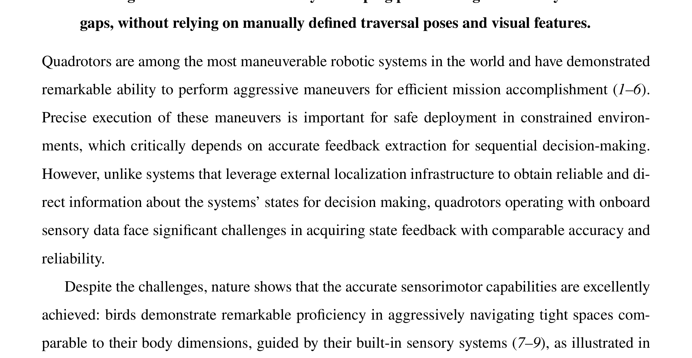

**图 1A**：这种能力使鸟类能够充分利用复杂环境中的空间资源，并在结构复杂的栖息地中获得生存优势（10、11）。同样，为了充分发挥自主四旋翼的机动能力并扩大可执行任务的范围，四旋翼应能在余量很小的情况下穿过建筑窗户、树间空隙和洞口等受限开口。一个典型例子是全机体激进机动：系统通过有计划地滚转或俯仰机体，穿过接近悬停姿态时无法通过的狭窄开口（1、12）。这类问题可以概括为经典的窄缝穿越任务（1、12–14）。
2

---

## 原文第 3 页核心内容与翻译

**图 1**：工作原理和系统实现。（A）苍鹰在两根树干之间的窄缝中进行精准激进飞行，完全依靠自身感知系统引导；（B）搭载传感运动策略的四旋翼平台，只使用机载传感器实现精准激进飞行；（C）本文展示的关键能力，包括单缝穿越、动态缝穿越、连续缝穿越，以及不同几何形状缝隙的穿越。
**图 1（英文图注翻译）**：图（A）表示苍鹰完全依靠自身感觉系统，在两根树干之间的窄缝中完成精准激进飞行。鸟类将眼睛获得的视觉信息与前庭系统提供的本体感觉结合起来，产生穿越缝隙所需的精确运动指令。图（B）表示搭载传感运动策略的四旋翼平台，只使用机载传感器完成精准激进飞行。该策略融合视觉和本体感觉，直接输出低层控制指令，不设置状态估计和参考轨迹等显式中间接口。图（C）表示本文展示的主要能力，包括单个缝隙穿越、动态缝隙穿越、连续缝隙穿越，以及不同几何形状缝隙的穿越。

3

---

## 原文第 4 页核心内容与翻译

这要求自主四旋翼在平移和旋转动力学强耦合的情况下，准确判断适合穿越的姿态和时机。多数早期工作假设任务状态完全可观测，借助外部定位系统实时获得四旋翼状态，从而完成缝隙穿越（1、12、15、16）。随着计算机视觉和传感器融合技术的发展（17、18），少数研究开始利用视觉惯性里程计进行状态估计，在没有外部定位设备的情况下完成窄缝穿越（13、14）。

文献（13）在部署前预先规划穿越轨迹，飞行中不实时感知缝隙，也不根据感知不确定性和跟踪偏差重新规划。文献（14）为矩形缝隙设计了两阶段规则轨迹规划器和人工视觉特征，实现了实时规划和缝隙姿态检测，在 8 cm 间隙下可穿越最大 45° 的缝隙。但这套方法与具体场景结合较紧，扩展到连续缝隙或不同几何形状时不够方便，也可能不是最优选择。

上述方法还把状态估计、轨迹优化等功能人为拆成多个模块（20、21）。各模块分别调试和优化（13、14、21），模块之间人工规定的接口会造成信息损失和误差逐级传递（20、22、23）。在精度要求不高的任务中，这些误差尚可接受；在容错空间很小的激进穿越中，则可能直接造成碰撞。

因此，一个基本问题是：要完成精准激进机动，是否必须坚持带有人工接口的模块化结构？生物系统中的直接感知—动作闭环给出了另一种思路。鸟类并不需要显式估计缝隙姿态、积累里程计或规划完整轨迹，而是将视觉和前庭输入直接转换为动作。本文据此研究一种数据驱动的直接感知—动作映射。
4

---

## 原文第 5 页核心内容与翻译

这种直接映射不依赖显式误差传播和固定的中间状态表示。传感运动学习或视觉运动学习（23）已经在物体操作、感知型腿式运动和高速无人机竞速等机器人任务中显示出潜力（23–25）。但这些任务有的接近静态，有的具有较多自由度、可以通过动作补偿误差，有的可行解空间相对宽松。本文采用类似文献（30）的二值化地标观测代替原始单目图像，以便实现轻量化感知和仿真到现实迁移，并坚持端到端的自主飞行设计。

本文任务的特殊困难在于，窄缝穿越要求四旋翼利用非对称机体和瞬时倾斜姿态，在四旋翼碰撞体与环境之间满足严格的、非凸的 SE(3) 约束（12）。这不同于无人机竞速中相对宽松的位置约束。本文需要回答：在控制容错很小的高动态窄缝穿越中，传感运动策略是否仍然可行？

本文提出一种传感运动策略学习框架，将强化学习（RL）（26、27）与策略蒸馏（28）结合起来，用于仿真到现实迁移中的精准激进机动。该方法通过端到端的系统级梯度传播优化完整控制流程（23），不依靠人工设计的特征提取流程，而是通过经验学习自主形成与任务有关的表示（29、30）。最终策略只使用机载视觉和本体感觉，将高维视觉信号和惯性数据直接映射为总推力、机体角速度等低层控制指令。

直接使用高维、带历史信息的观测训练策略并不容易。复杂观测空间和狭窄可行解空间叠加后，强化学习探索效率很低。作者采用解耦方法（31）分两步处理：第一步，用强化学习在“上帝视角”的马尔可夫决策过程中找到稳定解；第二步，通过在线模仿学习（32）进行策略蒸馏，把历史像素观测映射为动作。
5

---

## 原文第 6 页核心内容与翻译

mapping from historical pixel observations to actions through policy distillation (28) via online
imitation learning (32). Even with a low-dimensional oracle observation space, exploration for
feasible solutions using general model-free RL algorithms remains challenging due to the narrow
feasible solution space, which poses a significant barrier to efficient learning. To address this, we
leverage model-based trajectory optimization (12) in simulation to generate open-loop trajectories
using differentiable flatness dynamics (33) and initialize the agent at states along these trajectories
to effectively guide exploration.
Due to complex aerodynamic effects (34,35) and noisy actuation mechanisms caused by factors
such as voltage fluctuations (20), perfect simulation of quadrotor dynamics is challenging. In par-
ticular, the state distribution encountered during real-world flight can deviate from that experienced
during simulation training, potentially resulting in poorly trained states that cause failure given
the small control clearance. Moreover, without direct access to position and velocity feedback or
knowledge of the traversal pose, the deployed policy must learn to infer the decision-making cues
by developing (latent) task-relevant representation from high-dimensional exteroception. This rep-
resentation, learned entirely in simulation, should demonstrate sufficient robustness to withstand
the sim-to-real distribution shift over time. To this end, we conduct various types of randomization
during training to expand the well-trained state space of the policy and learn a robust representation
for extracting decision-making cues, as a key to successful deployment in the real world.
The presented system successfully achieves gap traversal, where a quadrotor navigates through
a rectangular gap measuring across various previously unknown poses and positions, with gap
orientations up to 90° (Fig. 1C-I), demonstrating very high repeatability. Notably, despite not being
trained on dynamic gaps, the policy successfully servos the quadrotor through gaps with unpre-
dictable motion patterns (Fig. 1C-II), highlighting the policy’s robust reactive control capabilities.
By training policies on tracks containing multiple gaps, the system can traverse consecutive closely
placed gaps, as an extreme validation for the capabilities of sensorimotor precise aggressive flight
(Fig. 1C-III). We also demonstrate that our method can develop policies that enable a quadrotor
to navigate through narrow regions of various geometries in the real world (Fig. 1C-IV), without
requiring a manually defined traversal state or handcrafted visual features. In summary, the pri-
mary contribution of this work lies in the realization of sensorimotor precise aggressive maneuvers
under strict SE(3) constraints through end-to-end policies, and demonstrates that the resulting
6

---

## 原文第 7 页核心内容与翻译

### 结果概述

本文首先考察四旋翼能否在间隙很小的窄缝中完成精准的激进行为。窄缝通过视觉地标确定。作者搭建了定制四旋翼平台，机体尺寸为 38 cm×10 cm（按最外侧桨尖测量），配备视场角为 82°×72° 的单目相机和 PX4 飞控，计算由机载 NVIDIA Jetson Orin NX 完成。相机原始分辨率为 1280×1024，输入策略前下采样到 320×256。策略输出推力和机体角速度指令，飞控同时提供滚转、俯仰姿态测量。

为减少硬件损耗，部分实验使用硬件在环平台。神经网络仍部署在真实四旋翼上，但不在环境中搭建实体缝隙，而是将动捕系统和机载 IMU 融合得到的状态生成合成图像输入，以替代真实地标观测。飞行试验中，净推力范围设置为重力加速度的 0.61 倍到 2.04 倍，最大角速度限制为 6 rad/s。

本文在这一经典机器人基准任务上取得了超越既有报告的结果。策略学习框架将已有的策略蒸馏方法与针对狭窄可行解空间改进的强化学习过程结合起来，并通过系统设计仿真到现实迁移环节、开展现实环境消融试验，使策略在多种窄缝穿越任务中都具有较高重复性。
Results
Our primary interest lies in determining whether a quadrotor can precisely execute aggressive
maneuvers through narrow passable regions with low clearances. The narrow passable region, often
referred to as a gap throughout this work, is identified through a visual landmark, as illustrated in

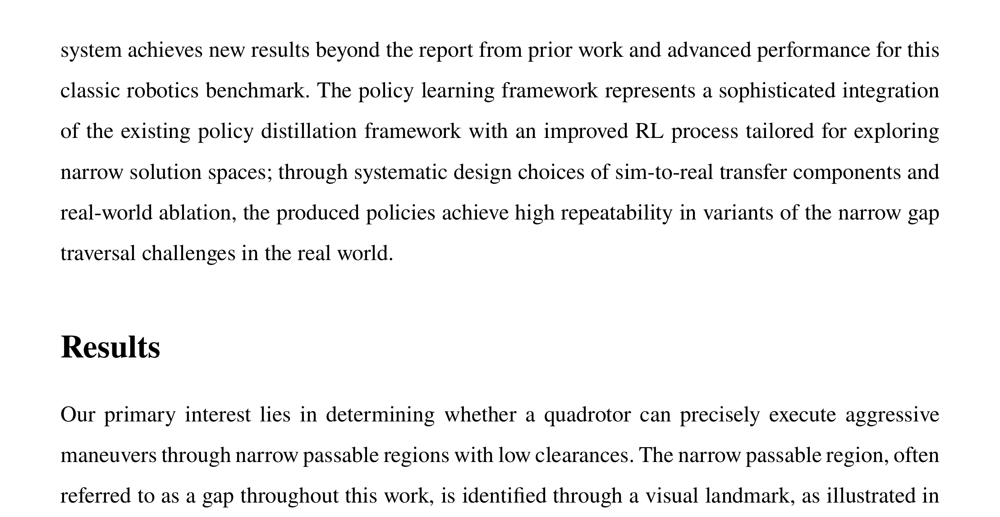

**图 1C**：与把任务表述为目标状态跟踪的方法[1,13]不同，穿越状态由策略自主确定[12]。这一点对于非矩形缝隙尤其重要，因为此时很难凭直觉预先规定最优穿越状态。

traversal state is autonomously determined by the policy (12), which is essential for non-rectangular
gap traversal where optimal traversal states cannot be intuitively predefined.
We develop a custom quadrotor platform as shown in Fig. 1B, with dimensions of 38cm×10cm
(measured between the outermost propeller tips), to validate our proposed method. The quadrotor
is equipped with a monocular camera featuring a Field of View (FoV) of 82°×72° and an onboard
PX4 Autopilot flight controller (36). All computational processing is performed on an NVIDIA
Jetson Orin NX (37) integrated into the platform. The camera captures gap instances at a resolution
of 1280×1024 pixels, which are subsequently downsampled to 320×256 pixels for neural network
policy input. The flight controller executes thrust and bodyrate commands generated by the policy
while providing real-time measurements of the quadrotor’s roll and pitch attitude components. To
hover the quadrotor before policy takeover, the flight controller integrates data from an optical
flow module. This optical flow-based control system also stabilizes the drone after the policy
autonomously triggers a recovery protocol upon complete gap traversal, as detailed in the Real-
World Deployment section. In all the experiments, the range of the net thrust is set from 0.61 (i.e.,
6m/s2) to 2.04 times the acceleration due to gravity (i.e., 20m/s2), whereas the maximum angular
velocity is restricted to 6 radians per second.
To avoid frequent hardware damage, we use a hardware-in-the-loop (HIL) testbed for some of
7

---

## 原文第 8 页核心内容与翻译

在硬件在环（HIL）平台上，我们将神经网络策略部署到真实四旋翼，用它控制实体飞行器。环境中不搭建实体缝隙，而是利用飞控中融合动捕系统和机载惯性测量单元（IMU）得到的状态信息生成合成图像输入，以替代直接观测地标。我们根据记录的状态估计数据，判断四旋翼是否无碰撞地穿过窄缝可通行区域。

借助上述试验平台，本文在三种不同设置下给出了完整结果，包含 100 余次真实环境中的实体窄缝自主穿越试验。这些试验体现了所提方法的几项主要能力。首先，在缝隙姿态未知（极端情况下倾角达到 90°）、空间位置任意的矩形缝隙上进行验证。尽管成功穿越要求控制误差仅为 5 cm，所提方法在多种初始位置条件下仍取得了较高成功率。即使训练阶段没有使用动态缝隙，策略也能控制四旋翼穿过手持移动缝隙。随后，本文考察了多个缝隙近距离排列的连续穿越场景。结果还表明，借助统一的目标函数设计和训练流程，可以较方便地训练出适用于不同缝隙形状的策略；这不同于文献（13、14）面向矩形缝隙专门设计的规划方法。最后，作者通过消融试验找出高效策略训练和仿真到现实迁移的关键因素，并实现基准方法，与本文方法进行了大量对比。

### 低间隙矩形窄缝穿越

首先在可通行区域为 20 cm × 60 cm 的矩形缝隙上评估所提方法。当四旋翼位于缝隙中央时，考虑到飞行器高度为 10 cm，沿缝隙短边方向的允许间隙只有 5 cm。该设置与文献（12）相近，但文献（12）使用动捕系统提供准确的四旋翼状态跟踪。下面试验中的部分飞行录像见补充影片 S2。
8

---

## 原文第 9 页核心内容与翻译

### 矩形窄缝穿越

图 2 展示了低间隙矩形缝穿越结果。试验从多种初始位置开始，缝隙姿态在部署前未知但保持不变。部分起点相对缝隙中心线偏离约 40°，距缝隙中心约 4 m；从状态估计角度看，这样的距离会放大估计不确定性。传感运动策略不再要求精确检测缝隙姿态和相对位置，而是利用端到端优化和域随机化适应飞行中的感知变化。

当缝隙滚转角不超过 60° 时，策略在 30 次试验中成功 29 次；超过 60° 时，成功率为 90%，即 30 次中成功 27 次。即使没有显式施加穿越姿态约束，系统也会在通过缝隙平面的瞬间使机体纵轴自动与矩形缝边缘平行。对于 90° 倾斜的缝隙，策略将机体滚转角速度提高到 6 rad/s 的限制值，使四旋翼在穿越时接近 90° 滚转姿态。

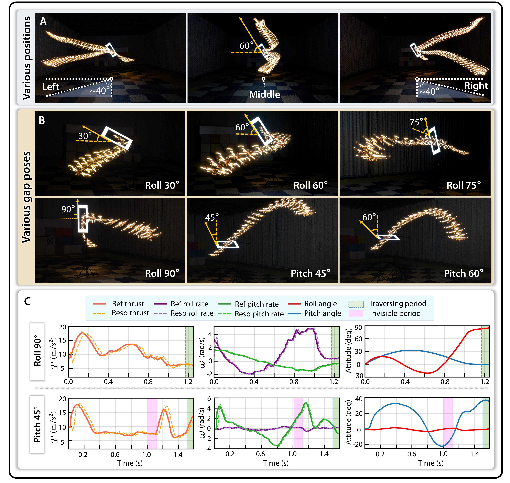

**图 2**：低间隙矩形缝穿越。（A）从多种初始位置自主穿过姿态未知但保持不变的倾斜缝隙；（B）穿过不同姿态的缝隙；（C）策略输出的控制指令及两次试验中的实测响应。图中“Ref”表示策略输出的参考控制量，“Resp”表示对应的实测响应。
在图 2A 中，作者展示了从多种起始位置穿越滚转角为 60° 的缝隙的轨迹；部署前并不知道该倾斜姿态。图 2A 左、右两侧的一些起点相对于缝隙中心线约偏离 40°，距缝隙中心约 4 m。从状态估计角度看，这样的距离会放大估计不确定性（14）。传感运动策略不需要精确检测缝隙姿态，也不需要求出相对于缝隙的准确位置，而是利用端到端优化和域随机化（38），在飞行过程中适应不同程度的感知不确定性。

在 60°及以下的缝隙滚转角条件下，策略 30 次试验成功 29 次；当滚转角超过 60°时，成功率略降至 90%，即 30 次中成功 27 次。飞行轨迹表明，虽然系统没有显式施加穿越姿态约束，但在穿过缝隙平面的瞬间，机体纵轴会自动与矩形缝隙边缘保持平行，而且不需要显式检测缝隙姿态。图 2C 上排给出了穿越 90°倾斜缝隙时的控制输入。此时策略将机体 x 轴角速度推到预设上限 6 rad/s，使四旋翼在穿越过程中达到接近 90°的滚转姿态。在接近竖直的姿态下，四旋翼几乎无法产生向上的升力，决策一旦出错就可能撞上框架的长边或短边。尽管存在这些固有局限，系统仍在大多数试验中避免了碰撞，表现出较强的精准传感运动控制能力。

对于俯仰倾斜的窄空间，作者另行训练了一套强化学习策略。当缝隙俯仰角为 30°时，部署成功率为 100%；俯仰角为 45°时降为 80%，为 60°时降为 73.3%，每种情况均进行 15 次试验。图 2C 下排的控制曲线表明，策略首先增大俯仰角推动四旋翼向前飞行，然后细致调整俯仰角和推力，使飞行器在水平方向减速，最后安全穿过缝隙。由于垂直方向视场有限，缝隙有时会完全离开视场，形成图 2C 所示的“不可见时段”；即便如此，大多数试验仍能完成穿越。这一表现归因于“信念状态”，该状态由“通过监督学习进行观测空间蒸馏”一节所述的循环神经网络（RNN）输出。

试验表明，最主要的失败形式是四旋翼上部与缝隙结构发生碰撞。失败通常源于缺少明确的速度反馈；当这一问题与可能出现的目标检测丢失叠加时，系统难以精确控制机体坐标系中的 x 轴速度。

9

---

## 原文第 10 页核心内容与翻译

图 2A 展示了从多种起始位置穿越滚转角为 60° 的缝隙的轨迹，部署前并不知道该倾斜姿态。左、右两侧的一些起点相对于缝隙中心线偏离约 40°，距缝隙中心约 4 m。从状态估计角度看，这样的距离会放大估计不确定性（14）。传感运动策略不需要精确检测缝隙姿态，也不需要求出相对于缝隙的准确位置，而是利用端到端优化和域随机化（38），在飞行过程中适应不同程度的感知不确定性。

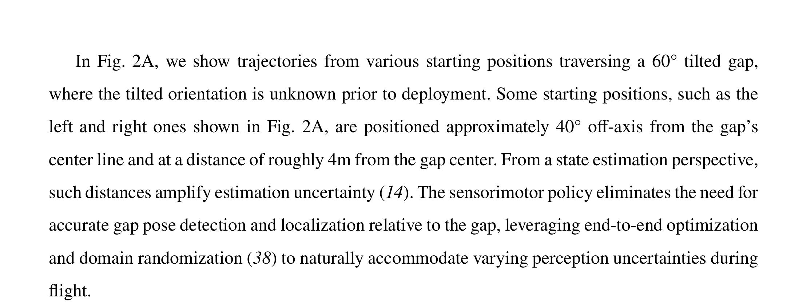

**图 2B**：不同未知滚转角倾斜缝隙的轨迹结果。滚转角不超过 60° 时，30 次试验成功 29 次；滚转角超过 60° 时，成功率为 90%，即 30 次中成功 27 次。

在缝隙滚转角不超过 60° 时，策略几乎达到完美表现，30 次试验成功 29 次；滚转角超过 60° 时，成功率略降至 90%，即 30 次中成功 27 次。轨迹表明，虽然系统没有显式施加穿越姿态约束，但在通过缝隙平面的瞬间，机体纵轴会自动与矩形缝隙边缘平行，而且不需要显式检测缝隙姿态。图 2C 上排给出了穿越 90° 倾斜缝隙时的控制输入。此时策略将机体 x 轴角速度推到预设上限 6 rad/s，使四旋翼在穿越过程中达到接近 90° 的滚转角。接近竖直时，四旋翼几乎无法产生向上的升力，决策错误可能导致撞上框架长边或短边；尽管有这些限制，系统仍在大多数试验中避免了碰撞。

对于俯仰倾斜的窄空间，作者另行训练了一套强化学习策略。缝隙俯仰角为 30° 时，部署成功率为 100%；俯仰角为 45° 时降为 80%，俯仰角为 60° 时降为 73.3%，每种情况进行 15 次试验。图 2C 下排的控制曲线表明，策略首先增大俯仰角推动四旋翼向前飞行，然后同时调整俯仰角和推力，使飞行器在水平方向减速，最后安全穿过缝隙。由于垂直视场有限，缝隙有时会完全离开视场，形成“不可见时段”；即使如此，大多数试验仍能完成穿越。
10

---

## 原文第 11 页核心内容与翻译

这一表现归因于“信念状态”，该状态由“通过监督学习进行观测空间蒸馏”一节所述的循环神经网络（RNN）输出。试验表明，最主要的失败形式是四旋翼上部与缝隙结构碰撞。失败通常源于缺少明确的速度反馈；当这一问题与可能出现的目标检测丢失叠加时，系统难以精确控制机体坐标系中的 x 轴速度。

### 动态缝隙反应式穿越

作者还开展了动态缝隙穿越试验，证明即使训练中没有出现移动地标，策略仍能控制四旋翼穿越运动规律未知的缝隙。具体而言，在四旋翼飞行过程中，人工操纵手持缝隙做平移或旋转运动，如图 3A 及补充影片 S3 所示。图 3A 上排是一项初始静止的试验：四旋翼飞出一定距离后，操作者有意旋转框架。尽管受到旋转扰动，四旋翼仍能调整飞行轨迹并保持准确的穿越姿态，最后一帧显示其成功通过缝隙。下排考察缝隙的平移运动。当操作者使缝隙向上移动时，策略表现出有效的跟踪行为：四旋翼在接近缝隙平面的同时上升，跟随缝隙的向上运动，并最终完成穿越。

作者还在仿真中进行了受控试验，结果见图 3B。图中上排显示缝隙和四旋翼的空间轨迹，中排显示缝隙及四旋翼运动的时间曲线，下排显示缝隙中心投影到像平面后的轨迹。三种试验分别考察水平单向运动、水平双向运动和向下运动的缝隙。结果表明，无论缝隙采用哪种运动方式，策略都能稳定跟踪目标。由图中下排可以看出，四旋翼接近移动缝隙时，缝隙中心始终保持在图像水平中心线附近，说明学习到的策略能够在整个机动过程中保持与目标的视觉对准。这也表明，奖励函数中加入的感知相关行为（见“奖励公式”一节）在动态缝隙场景下仍然有效。
11

---

## 原文第 12 页核心内容与翻译

### 动态缝隙

动态缝隙实验检验了策略能否在没有见过动态缝隙训练数据的情况下，根据视觉输入及时调整动作。结果表明，策略能够根据缝隙运动更新机体姿态和穿越时机，说明端到端的传感运动映射保留了对环境变化的反应能力。

**图 3**：动态缝隙穿越。（A）飞行过程中穿越动态缝隙的连续画面。
每一行均按从左到右的时间顺序排列。上排展示穿越旋转缝隙过程中的飞行画面，下排展示穿越向上移动缝隙过程中的飞行画面。半透明的框表示缝隙在历史时刻所处的位置。（B）三种不同运动方式缝隙的仿真试验。案例 1 至案例 3 分别对应水平单向移动缝隙、水平双向移动缝隙和向下移动缝隙。第一行图像表示飞行过程中的空间轨迹，其中重点标出

12

---

## 原文第 13 页核心内容与翻译

**图 3（续）**：第一行图像表示四旋翼接近并穿越缝隙时的轨迹，其中案例 1 和案例 2 使用 X-Y 视图，案例 3 使用 Y-Z 视图。中间一行分别绘制缝隙和四旋翼的 y 轴速度（案例 1 和案例 2）、z 轴速度（案例 3），以及缝隙与四旋翼之间的 y 轴位置差 (y_{gap}-y_{quad})（案例 1 和案例 2）和 z 轴位置差 (z_{gap}-z_{quad})（案例 3）。最下方图像显示矩形缝隙中心投影到像平面后的轨迹；四旋翼与缝隙平面距离小于 0.5 m 的数据未计入。（C）有无域随机化时的能力边界。左图给出不同缝隙朝向下可穿越的最大缝隙速度；中图和右图分别显示采用域随机化和未采用域随机化训练的策略，在缝隙高速运动（3～5 m/s）时缝隙中心在像平面上的轨迹，轨迹点的颜色由浅到深表示时间由早到晚。

即使动态缝隙在训练中没有出现，策略在该场景下仍表现良好。图 3B 中间一行的绿色曲线表明，这种类似伺服控制的行为来自位置跟踪与主动航向补偿的协调作用，而不是简单地对齐位置。
这些试验表明，策略能够学习与任务有关的表示，用于目标条件飞行，并表现出较强的反应式控制能力：它根据实时观测作出响应，而不是简单复现仿真中学到的飞行轨迹。为了解析这种反应能力的来源，作者开展了受控消融试验，对比使用同一个经过域随机化训练的强化学习专家、但分别采用有域随机化和无域随机化进行蒸馏的策略。
第一项试验评估不同缝隙朝向下可穿越的最大缝隙速度。
试验初始条件统一设置为：四旋翼从距离缝隙 5 m 处出发，缝隙中心与视场中心对齐。缝隙在缝隙平面内沿水平方向以恒定速度、平行于地面移动；不同试验的速度以 0.25 m/s 为增量变化。
结果（图 3C 左图）显示，采用域随机化的策略与未采用域随机化的策略之间存在明显差异。前者对动态目标具有显著更强的适应能力。此外，在不低于 3 m/s 的极端速度下，采用域随机化蒸馏的策略仍能使缝隙中心保持在视场内（图 3C 中图）；未采用域随机化的策略则会使缝隙中心轨迹迅速漂出视场（图 3C 右图）。
根据这些结果，作者认为域随机化是形成反应能力的关键：它扩大了训练期间观测序列的分布，使策略覆盖四旋翼与目标之间多种相对运动模式。
13

---

## 原文第 14 页核心内容与翻译

这种适应能力无法通过不重新规划、仅依赖预先规划轨迹的方法获得（12、13、33）。据作者所知，这是首次仅依靠机载传感器展示动态窄缝穿越。针对这种纯反应式方法的失败模式分析见补充材料中的“动态缝隙穿越中的失败模式”一节。

### 低间隙连续窄缝穿越

与穿越单个缝隙相比，穿越彼此靠近的连续缝隙对强化学习探索和现实部署都提出了更高要求。本节展示了据作者所知首次仅使用机载传感器在真实环境中精准穿越连续窄缝的结果（见补充影片 S4）。上一节采用的目标函数设计和训练流程可以直接扩展到这一任务。
作者设计了由两个或三个 20 cm × 60 cm 矩形缝隙组成的轨道，并通过轨迹优化方法确保存在可行的开环解。训练时，针对每种轨道构型对缝隙的姿态和位置进行小幅随机化。这样，在现实部署时就不必精确测量缝隙之间的相对位置和朝向。图 4 展示了轨道构型、策略生成的轨迹展开结果（图 4A）、记录到的状态（图 4B）和控制指令（图 4C）；表 S1 对训练使用的轨道构型作了定量说明。
轨道 1 至轨道 3 各包含两个缝隙。例如，轨道 1 中两个缝隙的滚转倾角差约为 75°，缝隙间距只有 0.8 m。由图 4 上排的指令轨迹可见，策略将滚转速率提高到预设上限 6 rad/s，从而成功通过第二个缝隙。轨道 2 中，第一个缝隙倾斜 60°，四旋翼穿越时需要快速滚转到约 60°，并不可避免地受到向下重力加速度影响而失去部分高度控制。因此，策略必须精确把握滚转时机：如图 4C 所示，

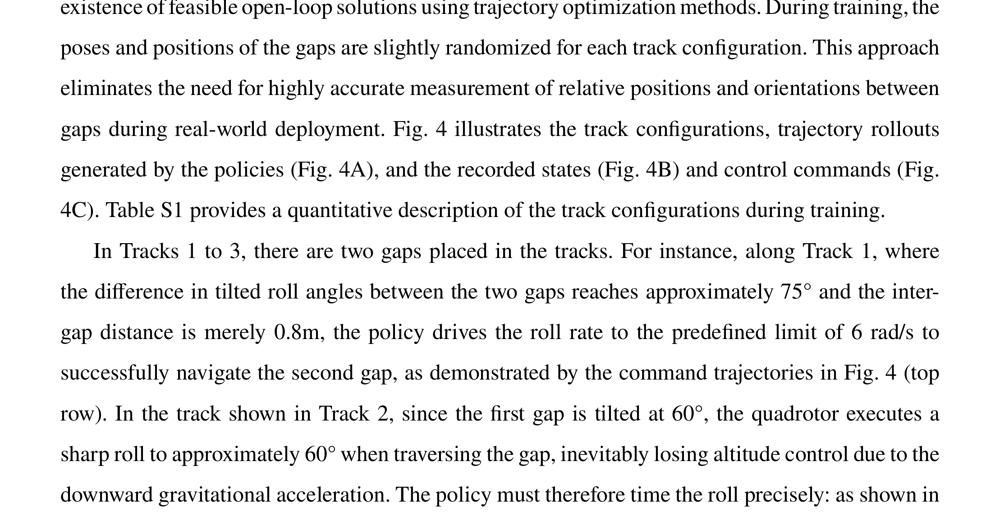

**图 4C**：图 4C 中排显示，策略只有在接近第一个缝隙时才开始将滚转速率提高到预设上限；待整个机体通过第一个缝隙后，再迅速增大推力，以
14

---

## 原文第 15 页核心内容与翻译

**图 4**：低间隙连续窄缝穿越。（A）策略在 6 种不同轨道上的自主飞行结果；每种轨道包含两个或三个彼此靠近的缝隙。（B）轨道 4 和轨道 5 的真实轨迹与仿真轨迹对比，真实数据由硬件在环平台记录。轨迹颜色表示速度大小。（C）试验期间的策略输出和系统实测响应。三行分别对应轨道 1、轨道 2 和轨道 4 的结果。图例缩写与图 2C 保持一致，另外使用以下颜色块：“接近缝隙 1”表示穿越第一个缝隙之前的阶段；“缝隙 1—2”表示第一个和第二个缝隙之间的阶段；“缝隙 2—3”表示第二个和第三个缝隙之间的阶段。

15

---

## 原文第 16 页核心内容与翻译

防止高度损失过大，确保安全通过第二个缝隙。
轨道 4 至轨道 6 包含三个需要穿越的缝隙，其中轨道 5 和轨道 6 的缝隙在横向上有明显错开。对于横向错开的轨道，四旋翼除了要精确调整姿态，还要进行细致的横向机动，才能成功穿越。因此，与轨道 4 这类各缝隙中心线更接近对齐的轨道相比，这些轨道更容易发生螺旋桨与缝隙碰撞。尽管如此，策略仍能在关键时刻执行精确的姿态机动和速度调节，使四旋翼以较高重复性通过这些缝隙。
图 4B 给出了硬件在环平台中的仿真到现实对比，真实数据由硬件在环部署平台记录。结果表明，仿真和现实中的轨迹展开结果相近，差异保持在有限范围内而没有逐渐累积，从而验证了策略的闭环控制能力。图 4B 中轨道 5 的速度曲线显示，策略能够准确复现仿真中的减速行为，这为后续在快速机体滚转的同时进行充分横向机动创造了条件。
### 穿越不同几何形状的狭窄可通行区域

在现实场景中，缝隙的几何形状差异很大，最佳穿越朝向也不总是显而易见。因此，有必要训练能够适应多种缝隙形状的策略。本节展示在多种可通行区域几何形状和地标外观上训练的策略，说明所提出的策略学习方法能够完成多种精准的激进机动。狭窄可通行区域的几何参数见表 S2。
实体三角形缝隙和平行四边形缝隙的轨迹展开结果见图 5A，不同倾斜角度下的补充试验见影片 S5。椭圆形、菱形和拱形缝隙的仿真示例见图 5B，更完整的仿真轨迹见图 S1。
对于三角形缝隙，作者观察到四旋翼相对缝隙的穿越朝向高度一致：如图 5A 上排所示，四旋翼使机体坐标系的 x-y 平面与三角形最长边平行。这一现象在图 5C 上图中得到了定量验证。
16

---

## 原文第 17 页核心内容与翻译

**图 5**：穿越不同几何形状的狭窄开口。（A）自主穿越实体三角形缝隙和平行四边形缝隙的结果，突出显示四旋翼穿越缝隙时的状态。（B）自主穿越椭圆形、菱形和拱形缝隙的仿真结果。轨迹使用 Blender（40）进行可视化，突出显示四旋翼的穿越时刻，其他轨迹点用白色遮罩表示。穿越时刻定义为轨迹上距离缝隙平面最近的点。（C）仿真和硬件在环（真实世界）试验中，四旋翼相对缝隙的滚转角分布。各类缝隙用于统计分析的参考角度已在图中标出。

17

---

## 原文第 18 页核心内容与翻译

图 5C 上图显示，无论在仿真还是真实试验中，角度偏差都较小，且大多数小于 5°。相比之下，图 5C 中图显示，穿越平行四边形缝隙时的朝向呈现多峰分布。四旋翼会采用两种偏好的朝向之一：与平行四边形的长边对齐，或与其长对角线对齐。当平行四边形长边接近水平时，也偶尔会出现介于两者之间的朝向，如图 5A 左下方所示。
图 5C 下图给出了穿越拱形缝隙时的姿态统计分布。与其他缝隙相比，拱形缝隙的相对穿越姿态分散程度更大。这种差异反映出，拱形可通行区域对飞行器朝向施加的几何约束相对较弱。基于顶点的状态估计方法（例如 PnP（41））需要人工设计特征，并且难以处理椭圆形或拱形地标；本文提出的灵活传感运动策略学习方法不依赖手工特征，可以自动提取地标观测表示，因此更便于扩展到实际应用中的一般视觉地标。
### 在更嘈杂的地标观测下验证学习分割

主要结果依赖发光框架，以便通过颜色阈值进行稳定分割，因此试验条件较为简化。为评估方法在更接近现实的感知条件下的稳健性，作者在不同视觉背景中的非发光矩形缝隙上测试同一策略；在这些背景中，颜色分割无法正常工作。

作者训练并部署了一种轻量级分割模型，由 MobileNetV3 编码器（42）和空洞空间金字塔池化（ASPP）模块（43）组成。该网络移植到 TensorRT 后，在机载设备上的平均推理时间为 4 ms。由于部署环境在训练时未出现，且标注数据有限，学习得到的分割结果明显不够理想：与发光缝隙设置相比，掩膜边缘误差更大，背景杂波会产生虚警（图 6B 上图），地标观测也会偶尔不完整（图 6B 中图和下图）。

图 6C 的结果表明，在相对较近的 2 至 4 m 距离内，即使掩膜含有噪声，当缝隙姿态不小于 60°时，策略在大多数试验中仍能成功。
18

---

## 原文第 19 页核心内容与翻译

但在更远距离或视角偏斜时，随着分割质量下降，失败次数会增加。早期飞行轨迹因此变得不理想，误差不断积累并最终影响穿越结果。尽管如此，这些结果仍说明学习得到的控制行为能够容忍具有现实特征的分割噪声，这是进一步扩展到一般感知系统的必要基础。

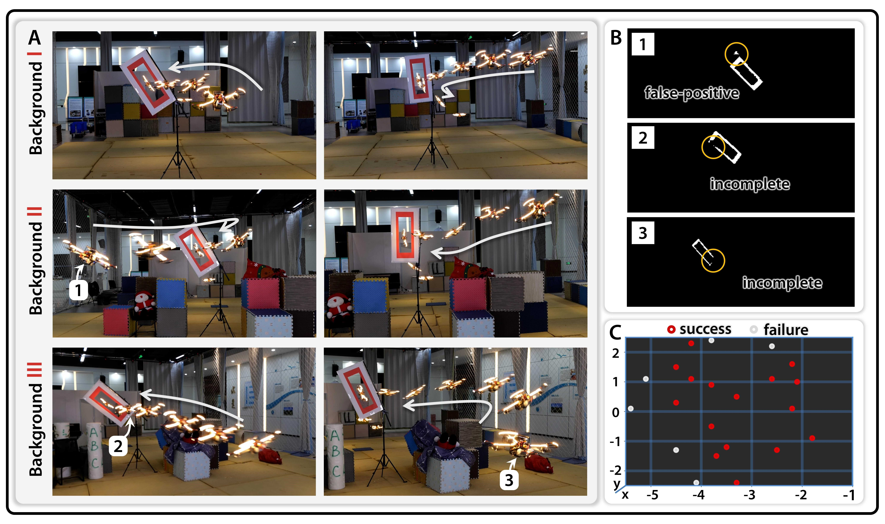

**图 6**：不同视觉背景下使用学习分割进行窄缝穿越。（A）在 3 种不同视觉背景和不同缝隙朝向下的自主飞行结果。（B）飞行过程中的错误分割结果，图中标出的数字对应于（A）中标记的四旋翼画面。（C）试验成功情况记录，每个点表示实测的近似水平（X-Y）起始位置。在这些试验中，缝隙朝向均不小于 60°；缝隙位于（0,0）处，并处于 x=0 平面内。红点表示试验成功，白点表示试验失败。

### 策略学习和仿真到现实迁移的关键因素
除基本的教师—学生强化学习框架外，作者采用两类训练技术，分别用于提高策略学习效率和缩小仿真到现实的性能差距，并通过消融试验验证这些技术是否必要。
19

---

## 原文第 20 页核心内容与翻译

**图 7**：策略学习和仿真到现实迁移关键因素的消融。（A）有依据重置（IR）策略的消融。左图显示矩形缝隙上强化学习训练的成功率变化，均值用实线表示，标准差用阴影区域表示，统计结果来自 3 次试验；右图显示包含三个缝隙的轨道 5 上的成功率变化。右图中的“1 个缝隙”“2 个缝隙”和“3 个缝隙”分别表示成功穿越第一个、第二个和第三个缝隙的成功率。（B）仿真到现实迁移技术的消融试验。图中展示去除部分随机化组成后的若干失败案例。图像从左到右四列分别对应使用全部随机化组成、去除扰动力（PF）随机化、去除响应随机化（RR）和去除响应参数随机化（RPR）的情况。两行试验分别对应：上行为倾斜 60° 缝隙的测试点 4，下行为倾斜 80° 缝隙的测试点 8。测试点构型

20

---

## 原文第 21 页核心内容与翻译

**图 7**：图 S3 展示了测试点构型。（C）消融试验的定量结果。该图展示不同随机化组成对三种缝隙倾角（分别为 30°、60°和 80°）下成功率的影响。每一行表示一种组合，其中 A(B) 的含义为：A 表示具体的随机化类型（RR、PF、RPR），B 表示实施阶段（RL 表示强化学习阶段，Dist 表示蒸馏阶段，RL+Dist 表示两个阶段均实施）。✓表示启用该组成，×表示未启用。

### 有依据的重置

由于窄缝限制了可行解空间，标准强化学习算法可能探索效率很低。为解决这一问题，作者提出有依据的重置（IR）策略，在有利于有效探索的状态上有策略地初始化智能体。图 7A 展示了两个强化学习问题在使用和不使用 IR 时的成功率变化。左图对应滚转姿态任意的 60 cm × 20 cm 矩形缝隙，右图对应“低间隙连续窄缝穿越”一节中的轨道 5；该轨道包含三个近距离排列的缝隙。

对于单个矩形缝隙，不使用 IR 的策略学习在 1G 样本预算内最多收敛到 70% 的平均成功率；要达到这一水平，所需样本量约为使用 IR 时的 3 倍。更重要的是，在相同的 1G 样本预算内，IR 可达到约 96% 的平均成功率，有效缓解了低容错控制问题固有的探索困难，而不需要显式设计人工课程（16）。最佳性能通常出现在 1G 至 1.2G 个样本之间。因此，在本文方法概述一节所述的设备条件下，强化学习阶段约需 1.5 小时。
在连续窄缝穿越问题中，IR 不仅减少了使策略获得首次穿越成功率所需的样本量，也解决了穿越后续缝隙时的关键探索困难。具体而言，不使用 IR 时，策略无法发现成功穿越第二个窄缝的可行方案：穿越前所需的减速动作与即时奖励结构相冲突，使强化学习算法（44）陷入只追求立即前进奖励的次优方案（见“奖励公式”一节）。启用 IR 后，强化学习智能体从更有信息量的状态开始回合，包括但不限于悬停状态，因此在早期探索阶段能够遇到更多高回报状态，
21

---

## 原文第 22 页核心内容与翻译

这样，强化学习智能体在训练初期就能接触更多具有信息量的状态（包括但不限于悬停状态），并能获得关于不同动作序列长期后果的更丰富反馈。更全面的状态覆盖使策略能够发现减速方法并跳出局部最优。

### 仿真到现实的迁移技术

如“面向目标的精准激进飞行仿真到现实迁移”一节所述（下文简称“仿真到现实迁移”一节），作者采用多种随机化技术，以提高真实部署中的重复性。本节通过消融部分随机化因素，分析它们对性能的作用。具体消融包括：（i）扰动力（PF）；（ii）响应随机化（RR），即使用仿真到现实迁移一节定义的因子 c；（iii）响应参数随机化（RPR），即对该节定义的低层控制延迟参数 h 进行随机化。

已有基于强化学习的无人机竞速研究（20、45）表明，类似的 RR 实现对仿真到现实迁移很重要。预计它也有助于本文的迁移，因为本文的窄缝穿越与无人机竞速中的竞速门穿越或航路点导航具有相似性。不过，PF 在基于强化学习的自主飞行中并不常见，因此它能否改善本文任务在真实环境中的表现，尚不明确。作者开展了大量 HIL 试验，比较加入和不加入这些因素时的仿真到现实迁移效果。图 7B 展示了不同消融设置下的典型失败情况；起始位置分布和更详细的结果见图 S3。
并据此比较采用或不采用这些组成部分时的仿真到现实迁移性能。不同消融设置下的典型失败案例见图 7B；该试验的初始位置分布和更多详细结果见图 S3。
图 7C 的结果表明，去掉任意一种随机化组成，对强化学习策略的性能影响都很小；但相同的消融会降低蒸馏策略的性能。如图 7C 所示，所有蒸馏策略都由同时采用 RR 和 PF 训练得到的强化学习策略进行监督。蒸馏策略在仿真到现实迁移过程中对随机化设计更加敏感，可能是因为它面对的运行条件更困难：在没有明确位置或速度反馈的情况下，它必须解决部分可观测问题；历史噪声观测以及仿真与现实之间的动力学差异，会通过在仿真中学习的、用于提取决策线索的隐变量表示影响当前决策。当倾角达到 60°
22

---

## 原文第 23 页核心内容与翻译

当倾角达到 60°和 80°时，如果不采用 RR 或 PF，成功率会明显下降。失败模式分析显示，主要有两类情况：一是横向偏差导致撞上缝隙长边（图 7B 上排）；二是在调整姿态时高度损失，导致撞上缝隙短边（图 7B 下排）。图 7C 还表明，在已经采用另外两种随机化技术时，是否采用 RPR 对真实环境性能影响不大。作者认为，这与所选控制接口，即总推力和机体角速度，具有较低延迟有关。例如，本文硬件平台的机体角速度平均延迟约为 20 ms。这样的短延迟使控制系统能够在后续控制周期内及时发出修正指令，从而减轻此前指令延迟波动对任务性能的影响。
### 与参考基线系统的性能比较

为便于理解本文方法的性能，并验证其相对于已有系统的能力，作者实现了此前工作的两个代表性基线方法。

基线 1：Wang 等人（12）。该方法已知缝隙的位置和姿态，在包含 SE(3) 几何约束与动力学约束的条件下进行轨迹优化，再由低层控制器跟踪生成的参考轨迹；系统状态由外部动捕系统完整反馈。

基线 2：Falanga 等人（14）。该系统无需外部定位，也不需要事先知道缝隙姿态即可穿越窄缝。它使用视觉与惯性融合进行状态估计，通过矩形和点检测得到缝隙角点，并用透视 n 点（PnP）方法估计姿态（41）。专门设计的轨迹生成方法支持快速在线重规划，可穿越姿态最高 45°、允许间隙 8 cm 的缝隙（14）。随着四旋翼接近缝隙，该系统的定位精度会提高。

两种基线的实现细节以及两种轨迹生成方法的讨论，放在补充材料“基线系统的实现与讨论”一节。

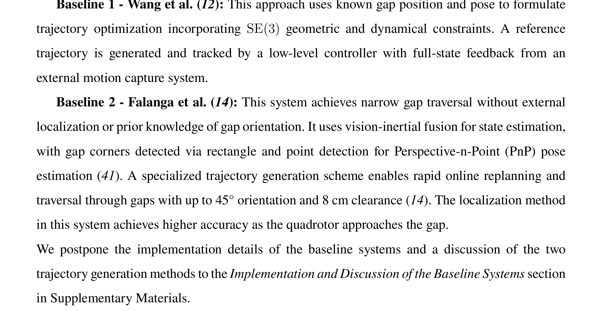

**图 8A**：图 8A 展示了不同方法的飞行轨迹，可以直观看到学习策略与基于模型的轨迹优化之间存在不同的轨迹形态。这种
23

---

## 原文第 24 页核心内容与翻译

这种差异主要来自优化问题的构造方式。例如，与强化学习奖励机制不同，基线规划器没有把缝隙可见性的 SE(3) 感知约束纳入优化，同时还需要在避碰约束之外增加辅助约束，以提高轨迹生成的稳定性和现实环境中的跟踪性能。

**图 8**：基线性能评估。（A）Falanga 规划器、Wang 规划器和蒸馏视觉策略展开轨迹的跟踪结果。（B）相对于缝隙的穿越位置（左）和倾角差（中），以及每种方法 9 次试验的成功率。图中 Falanga 和 Wang 表示使用特权状态的轨迹生成与跟踪方法；左图和中图中的“Ours”表示蒸馏视觉策略，“Ours（RL）”表示使用特权信息的强化学习策略。（C）在机载传感条件下，对比本文方法与 Falanga 系统时，相对于缝隙的穿越位置（左）、倾角差（中），以及不同初始距离 d0 下成功试验的分布（右）。

图 8B 和图 8C 分别包含基于特权状态的基线和基于视觉的基线。具体而言，图 8B 还包含使用与 Wang 方法相同的低层控制器实现，对 Falanga 系统采用的方法（46）所生成轨迹进行跟踪的结果。
24

---

## 原文第 25 页核心内容与翻译

由于 Falanga 的轨迹生成方法在 80° 倾角下不能生成动力学可行轨迹，因此结果只展示到 60°。图 8B 对应的实验设置与“仿真到现实的迁移技术”一节相同。

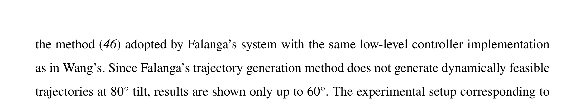

**图 8B**：图 8B 的实验设置与“仿真到现实的迁移技术”一节相同。

图 8B 的结果表明，尽管蒸馏策略使用间接视觉观测且没有外部定位，但在给定缝隙尺寸下，其成功率与使用特权信息的轨迹跟踪方法相当，只略低于使用特权信息的强化学习策略。在某些初始条件下，即图 S3 的测试点 1，Wang 系统规划出的轨迹发生变形且不可行，难以跟踪，因此没有在图中展示。按照 Falanga 规划器进行跟踪时，本文实现得到的穿越过程姿态误差最大，这也是失败的原因之一。

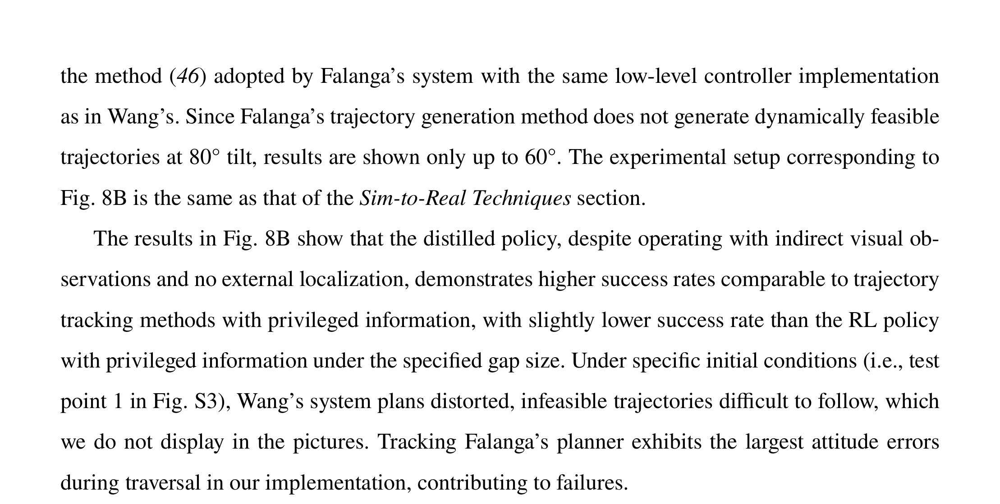

**图 8C**：图 8C 在视觉条件一致的情况下比较蒸馏策略与 Falanga 系统；

二者在 HIL 试验中均使用二值图像。为满足 Falanga 对
持续观测缝隙角点的要求，本文采用 120° 视场角和 512×512 分辨率，而不是 320×256，并
重新训练蒸馏策略，以保证比较公平。Falanga 系统从较大
初始距离 d0 出发时在大多数试验中失败，位置误差也较大。四旋翼接近缝隙时，角点
会离开视场，重规划随之停止；如文献（14）所述，接近阶段到穿越阶段既要求准确的状态估计，也要求精确
跟踪，任一条件不满足都会逐步累积为穿越
误差。试验中经常观察到超过 5 cm 的跟踪误差，可能源于
模块之间的延迟和简化的动力学模型。该系统在过渡点要求对
位置、速度和加速度施加硬状态约束，有时难以
在飞行过程中求得动力学可行解，因而最终一次成功重规划只能在
距离缝隙更远的位置进行，此时状态估计更加不准确。补充材料展示了这一重规划
局限，具体见“基线系统的实现与讨论”一节。
相比之下，本文方法在随机化仿真中从展开结果学习，避免了人工设计偏差，并通过
端到端优化减轻了显式误差
传递和模型失配。
本文还开展了硬件在环试验，设置不同尺寸的缝隙，
对比基于特权信息的策略、基于视觉的策略和 Wang 系统。图 9 给出了
不同设置下各方法的统计成功率，具体说明见图注。
25

---

## 原文第 26 页核心内容与翻译

图注）。

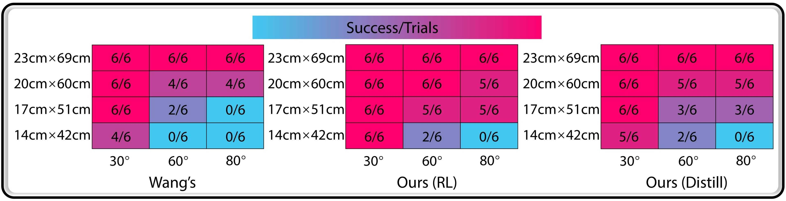

**图 9**：不同尺寸和倾角缝隙下各方法的成功率。每个单元格给出某一缝隙尺寸（高度 × 宽度）和倾角组合下 6 次试验中的成功穿越次数，对应图 S3 所定义的测试点 1–6。

### SE(3) 约束多紧才算过紧？
可以用可通行几何区域的大小和缝隙倾角的大小来描述 SE(3) 约束的紧张程度。比较使用特权状态的强化学习策略与轨迹规划基线（Wang 系统）的性能可见，图 9 中两种方法的成功率都对约束紧张程度敏感。在约束相对宽松的 23 cm×69 cm 缝隙上，两种方法的性能差异很小；当缝隙尺寸缩小到 14 cm×42 cm 且倾角为 80° 时，两种方法都完全失败。不过，对基线系统而言，17 cm×51 cm 的缝隙已经过于苛刻，而强化学习策略在这一条件下仍保持明显更好的性能。这说明不同方法对“过紧”的判定界限存在较大差异。
### 穿越困难主要来自 SE(3) 约束、视觉，还是二者共同作用？
比较图 9 的中图和右图可以看到，在 23 cm×69 cm 缝隙上，基于视觉和基于状态的强化学习策略表现相近；但在更困难的 17 cm×51 cm 设置下，当倾角为 60°和 80°时，两者的成功率出现明显差异。在极端的 14 cm×42 cm 尺寸下，两种策略的成功率都很低。这说明穿越困难是多种因素共同作用的结果：随着几何约束逐步收紧，视觉因素首先成为主要性能瓶颈；当几何约束严苛到一定程度后，无论采用何种感知方式，两种方法都会失败。此外，比较图 8B 和图 8C 可以发现，
26

---

## 原文第 27 页核心内容与翻译

仅依靠机载传感器，对传统模块化轨迹规划器的影响远大于对学习策略的影响。
## 讨论
本文提出的传感运动策略训练方法，拓展了欠驱动多旋翼自主、精准和激进机动的能力边界。不过，在机器人领域，学术研究（47、48）和工业系统（49、50）广泛采用模块化控制架构，以便不同研发团队分别开展工作。在这种架构下，当机器人只能依靠机载传感器进行自主精准控制时，工程人员往往需要仔细调整每个模块，以抑制误差累积；同时，系统可能缺少一组能够在整个任务空间内稳定工作的统一参数。本文结果表明，基于直接传感运动映射的控制器，有可能不再需要繁琐调参，就能实现接近完美的状态估计和准确的轨迹跟踪。该方法更易部署，主要得益于从经验中学习、端到端优化和仿真随机化：它从观测中提取稳健的任务相关表示，而不是依赖状态估计等固定模块接口，也不会引入人工设计可能带来的次优偏差。
将本文展示的能力扩展到一般非结构化环境，仍是当前的主要局限和长期目标。实现这一目标，首先需要超越本文使用人工地标所提供的简化感知结构；人工地标可以通过颜色阈值或轻量级学习分割直接提取视觉掩膜。在更一般的感知场景中，一条路径是部署稳健的通用视觉基础模型（51），根据自然特征识别并跟踪可穿越缝隙，但高速动态飞行要求高频、低延迟的感知，而当前模型很难在机载计算预算内满足这一要求。另一条路径是直接从深度图像（52）或 LiDAR（53）等原始传感模态中学习，这有利于直接进行仿真到现实迁移，但也带来了实时提取紧凑且可泛化的高维数据表示的困难。从算法设计角度看，当前框架还提供了一条自然的
27

---

## 原文第 28 页核心内容与翻译

通向一般化精准激进全机体机动的扩展路径：低维自由空间表示，例如凸多面体（54、55），可以作为理想观测的替代形式，用于高效强化学习训练；策略蒸馏与传感器模态无关的特点，则允许后续接入多种传感器输入。不过，根本困难仍然存在：如何打破精度与泛化之间的矛盾（56）仍是机器人学习领域的重要挑战，因为针对特定场景的优秀表现与广泛适用性仍常常难以兼得。作者认为，这是值得研究群体长期持续投入的方向。
另一方面，仿真与现实之间的差异也会限制可达到的精度。例如，在仿真中能够完成连续缝隙轨道的策略，在相同的现实条件下可能失败（见补充材料“连续窄缝穿越中的失败模式”）。一种有前景的方法是在实体平台上进行交互式学习（23、57、58），对仿真训练得到的策略继续进行现实环境微调。在没有实体缝隙的情况下，结果部分采用的 HIL 设置通过外部定位生成合成外部感知观测，既能降低现实展开时的碰撞风险，又能让策略学习真实动力学。但这种方法无法消除外部感知方面的仿真到现实差异，并且受到外部定位设备覆盖范围的限制。
## 方法与材料

### 问题描述

本研究的主要目标是只使用机载传感数据，实现多种带目标条件的精准激进机动，包括矩形缝隙穿越、连续缝隙穿越，以及不同几何形状缝隙的穿越。视觉地标（14、59）向系统提供需要穿越的狭窄区域信息。本文根据地标观测训练策略，控制四旋翼穿过环境中指定的狭窄可通行区域，同时不提供明确的位置或速度反馈。在仿真训练中，如果代表四旋翼的碰撞体在指定可通行区域之外未与缝隙平面发生接触，则认为穿越成功；在现实试验中，如果实体四旋翼未与缝隙结构发生碰撞，则认为穿越成功。本文在补充材料的问题建模一节对上述控制问题作了形式化描述。
28

---

## 原文第 29 页核心内容与翻译

问题的形式化描述见补充材料“问题建模”一节。

### 方法概述

本文采用一般的仿真到现实在线策略学习范式：利用仿真样本训练神经网络策略，然后以零样本方式将策略部署到实体四旋翼上（38、60）。本文问题具有几个使标准无模型强化学习方法效率较低的特点：（i）输入维度高且具有循环历史信息；（ii）部分可观测；（iii）可行解空间受限且奖励稀疏（61）。为解决这些问题，作者采用教师—学生训练方法（31），也称为策略蒸馏（28）。如图 10 所示，作者将原始强化学习问题，即以像素循环观测为输入的部分可观测马尔可夫决策过程，拆成两个子问题：第一步，在低维替代观测空间中构造马尔可夫决策过程；第二步，通过监督学习（SL）将原始观测空间直接映射为最优动作。具体而言，作者设计理想观测空间，并构造一个马尔可夫决策过程来近似原始部分可观测问题。如果该马尔可夫决策过程的最优解与部分可观测问题的最优解足够接近，那么监督学习阶段就可以把前者蒸馏为一个基于原始观测空间运行的策略，从而近似恢复最优解（24）。对于可行解空间受限这一困难，作者在替代马尔可夫决策过程中采用有依据的重置策略，提高探索效率。

两个阶段的控制步之间的状态转移和强化学习阶段的观测生成使用 Intel i9-14900K 中央处理器（CPU）；两个阶段的神经网络优化以及蒸馏阶段的图像生成使用 NVIDIA RTX 4090 图形处理器（GPU）。

### 基于替代观测的在线强化学习

#### 观测空间与动作空间

作者沿缝隙边缘均匀采样 ng 个三维点 gt，用它们替代图像观测 It；本文实现中 ng = 32。对于连续缝隙穿越，策略只接收即将穿越的当前缝隙对应的点。只有当整个
29

---

## 原文第 30 页核心内容与翻译

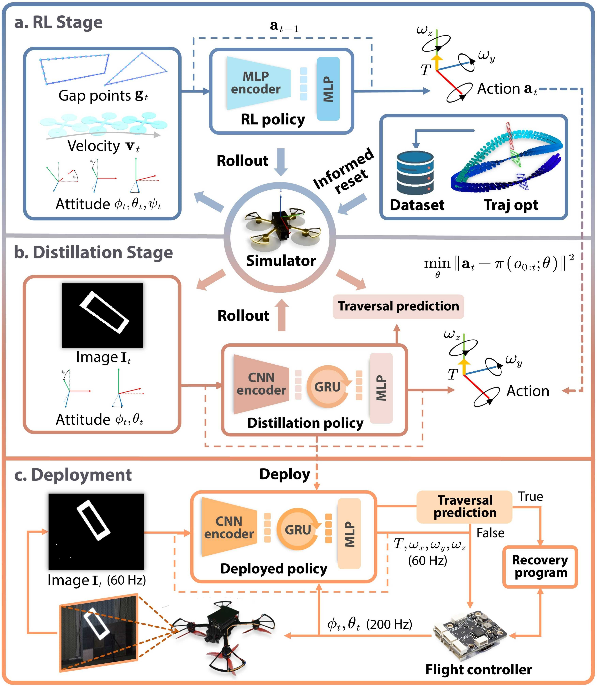

**图 10**：策略训练框架。作者采用两阶段的仿真到现实策略学习方法，让智能体通过与仿真环境交互学习策略。第一阶段，强化学习策略在有依据的重置策略引导下，为一个理想观测的 MDP 学习解决方案；随后使用监督学习，将强化学习策略的行为蒸馏为循环神经策略（图中记为 SL 策略）。SL 策略无需微调即可直接部署到四旋翼上。当穿越预测头判定缝隙已经通过后，系统触发恢复程序，使四旋翼重新稳定。

30

---

## 原文第 31 页核心内容与翻译

只有当四旋翼的碰撞体通过当前缝隙平面后，输入点才更新为下一个缝隙上的点。四旋翼的滚转角 ϕt 和俯仰角 θt 可以从机载飞控中高精度读取，并在强化学习和蒸馏阶段都作为输入。理想观测还包含部署时无法获得的特权信息，即机体坐标系线速度 vt；同时把上一时刻动作 at−1 作为输入。输出是由飞控执行的低层控制指令 at := [Tt, ωx_t, ωy_t, ωz_t]，包括总推力 Tt 和三个方向的机体角速度 ωx_t、ωy_t、ωz_t。

作者没有针对每种缝隙形状从头训练独立策略，而是用此前在滚转角任意的矩形缝隙上训练得到的演员网络和评论家网络初始化一个强化学习策略，并在“不同几何形状窄可通行区域穿越”一节涉及的全部形状上继续训练。缝隙观测的通用点表示向策略提供可通行区域的几何信息，从而支持联合训练，并促进不同任务变体之间的知识迁移，使训练流程能够扩展到更多任务。
### 奖励信号

强化学习以最大化折扣累计奖励为目标，其中即时奖励 rt 的设计应能引导系统找到当前控制问题的解。本文使用的奖励分为精准奖励、塑形奖励、平滑奖励、蒸馏正则奖励和速度约束奖励，各项公式放在“奖励公式”一节。只有当保守建模为 34 cm × 34 cm × 11 cm 长方体的四旋翼碰撞体无碰撞地通过缝隙时，演员才获得精准奖励。塑形奖励鼓励四旋翼向缝隙飞行，帮助探索；平滑奖励惩罚相邻控制步之间动作变化，并限制动作幅值。这些奖励使飞行动作更平滑自然，也有利于仿真到现实迁移。蒸馏正则奖励鼓励四旋翼主动发现缝隙，保证蒸馏阶段输入给强化学习策略的信息大部分可以从视觉观测中推断。速度约束奖励在四旋翼速度超过限制时进行惩罚，本文将该限制设为 4 m/s。
31

---

## 原文第 32 页核心内容与翻译

### 策略表示

策略由演员网络和评论家网络组成，二者均采用神经网络表示，网络包括简单的缝隙点编码器和前馈输出网络。点编码器接收缝隙点作为输入，是一个带中间全局最大池化层的多层感知机（MLP），用于编码与点排列顺序无关的特征（62）。前馈网络也是 MLP，将点特征与其他观测融合后输出动作。策略结构详见图 S4A。
### 有依据的重置

在仿真训练中，作者不再每个回合都把四旋翼重置到起飞悬停状态，而是把它初始化到具有信息量的状态，以调整强化学习的探索分布。
作者此前的工作采用简化的可微平坦性模型和基于商空间的轨迹优化方法（12），能够在四旋翼倾斜碰撞体与缝隙之间满足 SE(3) 几何约束的条件下，高效生成完整状态轨迹。通过仔细设计飞行通道并调整参数，可以用该方法生成穿过窄缝的轨迹。
收集由这些轨迹组成的离线数据集后，作者从规划轨迹上采样位置、速度和姿态等状态，用这些状态初始化四旋翼；在本文实现中，仍以一定概率把四旋翼初始化为悬停状态（见补充材料“有依据重置的实施流程”一节）。这种重置策略的道理很直观：高质量轨迹会使探索分布集中在关键状态附近，而从这些状态开始回合，会提高随机探索动作获得高奖励的可能性。如果策略在从有信息量的状态初始化时学会获得高回报，那么之后再次遇到相似状态时，就更可能产生完整且无碰撞的轨迹，从而有效引导探索分布。这种引导使策略能够学习更稳健的方案，而不是简单模仿局部优化得到的、带有任意次优性和简化确定性动力学的轨迹。不过，IR 的效果本质上依赖参考轨迹的质量。直观地说，质量较低的轨迹会降低探索效率，或使强化学习智能体陷入较浅的局部最优。未来一个值得研究的方向，是为轨迹规划器或参考轨迹质量建立形式化验证方法，
32

---

## 原文第 33 页核心内容与翻译

以此确保探索样本量的减少确实有益，而不会无意中限制性能。

### 策略优化

由于替代缝隙观测的计算开销很小，强化学习策略可以通过高效的数据生成进行训练。作者采用近端策略优化（PPO）（44）算法进行策略优化；已有研究表明，该算法适合处理吞吐量较大的数据（63）。演员网络和评论家网络不共享参数。强化学习训练的超参数见表 S3。
### 通过监督学习进行观测空间蒸馏

#### 观测空间与动作空间

作者使用分辨率为 320×256 的缝隙掩膜图像作为图像观测，并将从机载飞控直接读取的滚转角和俯仰角作为本体感觉输入。采用掩膜图像，是因为与使用原始图像训练的策略相比，使用这种简化图像更容易把策略从仿真迁移到现实，同时也符合背景和纹理与任务无关的假设。这一选择受到既有工作的启发（64、65）：相关工作使用类似的目标级视觉掩膜，在尽量减少信息损失的同时简化图像处理。对于连续缝隙穿越，输入图像中只计算四旋翼即将穿越的当前缝隙掩膜。只有当上一个缝隙无法再被观测到，即四旋翼正在接近或穿越缝隙平面时，程序才检测下一个缝隙的掩膜。与把所有缝隙的掩膜都放入图像相比，这种设计使仿真流程更简单，并避免缝隙在视场中重叠时产生的问题，例如悬挂支架造成遮挡。

除 4 维控制指令外，输出动作还包含一个附加维度，用于判断整个碰撞体是否已经通过缝隙平面，从而在现实试验中触发恢复程序。该输出头的取值范围为 -1 到 1：小于 0 表示四旋翼碰撞体尚未完全通过缝隙平面，大于 0 表示已经完全通过。监督信号可以直接在仿真器中计算得到。
33

---

## 原文第 34 页核心内容与翻译

### 策略表示

如图 6 所示，当前图像输入 It 由轻量级卷积神经网络（CNN）编码。得到的视觉特征与姿态测量值、上一时刻动作拼接后，输入单层门控循环单元（GRU），根据历史观测维持信念状态（39）。作者没有直接堆叠固定数量的历史帧（66），原因是不同任务变体很难找到同时兼顾机载推理效率和记忆长度的统一帧数。随后，前馈 MLP 将 GRU 输出的特征、姿态测量值和上一动作融合，生成当前动作。策略结构详见图 S4B。
### 策略优化

作者采用数据聚合（DAgger）算法（32）这一元算法训练 SL 策略。DAgger 是一种在线、交互式模仿学习方法，从理论和实践上都能有效抑制离线学习中的协变量偏移问题（32、57）。本文采用 DAgger 的在策略变体，只使用当前策略采集的样本进行策略优化。DAgger 的训练超参数见表 S3。
### 面向目标条件精准激进飞行的仿真到现实迁移

对于这种容错空间很小的机动，需要研究有效的仿真到现实迁移技术。作者基于系统辨识（67）和域随机化（38）的思想，引入以下方法，以实现成功的仿真到现实迁移。

**扰动力**：提高训练策略部署成功率的一个关键因素，是向仿真四旋翼施加扰动力。该力用于模拟未建模动力学，扩大策略能够支持的状态范围（66、68），并防止策略过拟合特定仿真器的特性。例如，在蒸馏阶段，作者希望避免策略只依赖历史动作输入进行决策，因为这可能使策略过拟合仿真动力学（69、70），同时弱化对质量更高的视觉输入的利用。不可观测的扰动力会促使策略
34

---

## 原文第 35 页核心内容与翻译

更多依赖视觉观测。具体而言，作者以一定概率沿每个坐标轴施加随机扰动力，并使该扰动力持续数十个仿真步。扰动力的实现细节见“仿真与域随机化的实现”一节。
飞控响应仿真：准确模拟真实四旋翼的系统动力学，包括飞控执行和螺旋桨产力，并不容易（5）；对于使用消费级飞控的系统尤其如此，因为这类飞控包含复杂的稳定控制机制（36）。为此，作者仔细调整飞控参数，使平滑指令具有相对稳定的响应延迟。随后，以一种简单方式模拟总推力和机体角速度的响应：使用真实数据直接拟合一组结构化参数，根据策略输出的历史参考推力和机体角速度模拟当前时刻的响应。具体而言，作者定义了执行器响应的离散时间动力学：
执行器响应的离散时间动力学定义为 ˆa(n)
k
=
1
w
Ph(n)+w−1
i=h(n)
a(n)
k−i,
n = 0, 1, 2, 3,
其中，ˆak := [ˆa(0)
k , ˆa(1)
k , ˆa(2)
k , ˆa(3)
k ] 表示离散时间步 k 的总推力和机体角速度执行器响应；连续动力学按照文献（71）采用固定时间步长的四阶 Runge–Kutta 方法积分。ak := [a(0)
k , a(1)
k , a(2)
k , a(3)
k ] 表示指令设定值，取策略最近一次输出的动作。参数 h := [h(0), h(1), h(2), h(3)] ∈(N+)4 表示以离散时间步计的执行延迟，w ∈N+ 表示用于描述执行器响应低通滤波特性的平均窗口长度。

PX4 Autopilot 飞控通过计算油门值来实现总推力，油门取值范围为 0 到 1（36）。因此，准确建立期望推力与油门之间的映射，是限制推力执行所引入的仿真到现实差异的关键，因为仿真器只根据策略输出的历史推力指令模拟推力响应。该映射的标定方法见补充材料“四旋翼系统的低层控制”一节。

**响应随机化**：受既有工作（20、45）的启发，作者在动作输入动力学模型之前，用随机化因子乘以策略输出，对
35

---

## 原文第 36 页核心内容与翻译

在动力学模型中，作者通过向计算得到的飞控响应加入随机性，对四旋翼动力学进行随机化。具体而言，加入随机化后的仿真响应为
˜a(n)
k
= ˆa(n)
k
· c，c ∈U(1 −c(n), 1 + c(n))，其中 U(·, ·) 表示均匀分布。此外，作者让这些随机化因子 c 在一段时间内保持不变，例如持续数十个决策步，而不是每一步都刷新。这样可以使策略更容易遇到新颖但相关的状态，从而扩大策略能够支持的状态范围。用于计算响应的拟合参数也采用类似方式随机化。随机化因子的取值见补充材料“仿真与域随机化的实现”一节。

**感知延迟仿真**：作者标定（i）图像生成时间，即从相机开始采集图像到图像传入策略输入端的时间；（ii）决策时间，即神经网络推理所需的时间，并在仿真器中对这些延迟进行建模。

**掩膜观测随机化**：虽然作者使用掩膜图像作为视觉输入，以缩小仿真到现实的差异，但仿真与现实之间仍可能存在外观不一致。为此，作者采用以下两种域随机化方式处理采集图像：（i）随机化相机内参，每个回合内随机化因子保持不变；（ii）对每个 2×2 或 4×4 的相邻像素块，以 50% 的概率随机取渲染图像中的最大值或最小值作为输入，由此生成带边缘噪声的掩膜。试验观察到，这种随机化可以提高结果的重复性。

### 现实环境部署

在大多数试验中，作者使用带颜色的发光框，通过 HSV（色调、饱和度、明度）分割实现稳健的掩膜计算；在“采用学习分割验证更嘈杂的地标观测”一节中，也使用了分割模型。

现实试验分为两个阶段。系统收到触发信号后，机载计算机启动策略，控制四旋翼穿过缝隙，这标志着第一阶段开始。
36

---

## 原文第 37 页核心内容与翻译

机载计算机启动策略，控制四旋翼穿过缝隙，第一阶段由此开始。当负责判断是否穿过缝隙的神经网络输出头连续输出预定数量的阳性结果时，系统进入第二阶段，并由恢复程序接管控制。本文试验将这个数量设为 4，表示四旋翼已经成功通过缝隙所在平面。

在恢复阶段，比例-微分（PD）控制器利用飞控反馈的姿态信息，将四旋翼恢复到稳定姿态，使俯仰角和滚转角接近于零。随后，PX4 飞控中集成的基于光流的控制模块使四旋翼减速并保持悬停。

参考文献与注释
1. Daniel Mellinger, Nathan Michael, and Vijay Kumar. Trajectory generation and control for
precise aggressive maneuvers with quadrotors. The International Journal of Robotics Research,
31(5):664–674, 2012.
2. Charles Richter, Adam Bry, and Nicholas Roy. Polynomial trajectory planning for aggressive
quadrotor flight in dense indoor environments. In Robotics Research: The 16th International
Symposium ISRR, pages 649–666. Springer, 2013.
3. Gilhyun Ryou, Ezra Tal, and Sertac Karaman.
Multi-fidelity black-box optimization for
time-optimal quadrotor maneuvers. The International Journal of Robotics Research, 40(12-
14):1352–1369, 2021.
4. Philipp Foehn, Angel Romero, and Davide Scaramuzza. Time-optimal planning for quadrotor
waypoint flight. Science robotics, 6(56):eabh1221, 2021.
5. Elia Kaufmann, Leonard Bauersfeld, Antonio Loquercio, Matthias M¨uller, Vladlen Koltun,
and Davide Scaramuzza. Champion-level drone racing using deep reinforcement learning.
Nature, 620(7976):982–987, 2023.
6. Yunfan Ren, Fangcheng Zhu, Guozheng Lu, Yixi Cai, Longji Yin, Fanze Kong, Jiarong Lin,
Nan Chen, and Fu Zhang. Safety-assured high-speed navigation for mavs. Science Robotics,
10(98):eado6187, 2025.
37

---

## 原文第 38 页核心内容与翻译

7. Ingo Schiffner, Hong Duc Vo, Prasanna S Bhagavatula, and Mandyam V Srinivasan. Minding
the gap: in-flight body awareness in birds. Frontiers in Zoology, 11(1):64, 2014.
8. Per Henningsson. Flying through gaps: how does a bird deal with the problem and what costs
are there? Royal Society Open Science, 9(3):211072, 2022.
9. Marc A Badger, Kathryn McClain, Ashley Smiley, Jessica Ye, and Robert Dudley. Side-
ways maneuvers enable narrow aperture negotiation by free-flying hummingbirds. Journal of
Experimental Biology, 226(21):jeb245643, 2023.
10. Thomas E Martin. Nest predation and nest sites: new perspectives on old patterns. Bioscience,
43(8):523–532, 1993.
11. Scott K Robinson, Frank R Thompson III, Therese M Donovan, Donald R Whitehead, and John
Faaborg. Regional forest fragmentation and the nesting success of migratory birds. Science,
267(5206):1987–1990, 1995.
12. Zhepei Wang, Xin Zhou, Chao Xu, and Fei Gao. Geometrically constrained trajectory opti-
mization for multicopters. IEEE Transactions on Robotics, 38(5):3259–3278, 2022.
13. Giuseppe Loianno, Chris Brunner, Gary McGrath, and Vijay Kumar. Estimation, control, and
planning for aggressive flight with a small quadrotor with a single camera and imu. IEEE
Robotics and Automation Letters, 2(2):404–411, 2016.
14. Davide Falanga, Elias Mueggler, Matthias Faessler, and Davide Scaramuzza.
Aggressive
quadrotor flight through narrow gaps with onboard sensing and computing using active vision.
In 2017 IEEE international conference on robotics and automation (ICRA), pages 5774–5781.
15. Jiarong Lin, Luqi Wang, Fei Gao, Shaojie Shen, and Fu Zhang. Flying through a narrow
gap using neural network: an end-to-end planning and control approach. In 2019 IEEE/RSJ
international conference on intelligent robots and systems (IROS), pages 3526–3533. IEEE,
2019.
38

---

## 原文第 39 页核心内容与翻译

16. Chenxi Xiao, Peng Lu, and Qizhi He. Flying through a narrow gap using end-to-end deep
reinforcement learning augmented with curriculum learning and sim2real. IEEE transactions
on neural networks and learning systems, 34(5):2701–2708, 2021.
17. Michael Bloesch, Sammy Omari, Marco Hutter, and Roland Siegwart. Robust visual inertial
odometry using a direct ekf-based approach. In 2015 IEEE/RSJ international conference on
18. Stefan Leutenegger, Simon Lynen, Michael Bosse, Roland Siegwart, and Paul Furgale.
Keyframe-based visual–inertial odometry using nonlinear optimization. The International
Journal of Robotics Research, 34(3):314–334, 2015.
19. Randall Smith, Matthew Self, and Peter Cheeseman. Estimating uncertain spatial relationships
in robotics. In Autonomous robot vehicles, pages 167–193. Springer, 1990.
20. Yunlong Song, Angel Romero, Matthias M¨uller, Vladlen Koltun, and Davide Scaramuzza.
Reaching the limit in autonomous racing: Optimal control versus reinforcement learning.
Science Robotics, 8(82):eadg1462, 2023.
21. Yunfan Ren, Siqi Liang, Fangcheng Zhu, Guozheng Lu, and Fu Zhang. Online whole-body
motion planning for quadrotor using multi-resolution search. In 2023 IEEE International
22. Yihan Hu, Jiazhi Yang, Li Chen, Keyu Li, Chonghao Sima, Xizhou Zhu, Siqi Chai, Senyao
Du, Tianwei Lin, Wenhai Wang, et al. Planning-oriented autonomous driving. In Proceedings
of the IEEE/CVF conference on computer vision and pattern recognition, pages 17853–17862,
2023.
23. Sergey Levine, Chelsea Finn, Trevor Darrell, and Pieter Abbeel. End-to-end training of deep
visuomotor policies. Journal of Machine Learning Research, 17(39):1–40, 2016.
24. Ananye Agarwal, Ashish Kumar, Jitendra Malik, and Deepak Pathak. Legged locomotion in
challenging terrains using egocentric vision. In Conference on robot learning, pages 403–415.
PMLR, 2023.
39

---

## 原文第 40 页核心内容与翻译

25. Ismail Geles, Leonard Bauersfeld, Angel Romero, Jiaxu Xing, and Davide Scaramuzza.
Demonstrating agile flight from pixels without state estimation. Robotics: Science and Systems
(RSS), 2024.
26. Richard S Sutton, Andrew G Barto, et al. Reinforcement learning: An introduction, volume 1.
MIT press Cambridge, 1998.
27. Marvin Lee Minsky. Theory of neural-analog reinforcement systems and its application to the
brain-model problem. Princeton University, 1954.
28. Andrei A Rusu, Sergio Gomez Colmenarejo, Caglar Gulcehre, Guillaume Desjardins, James
Kirkpatrick, Razvan Pascanu, Volodymyr Mnih, Koray Kavukcuoglu, and Raia Hadsell. Policy
29. David J Herzfeld, Pavan A Vaswani, Mollie K Marko, and Reza Shadmehr. A memory of
errors in sensorimotor learning. Science, 345(6202):1349–1353, 2014.
30. Ahmad Suhaimi, Amos WH Lim, Xin Wei Chia, Chunyue Li, and Hiroshi Makino. Rep-
resentation learning in the artificial and biological neural networks underlying sensorimotor
integration. Science Advances, 8(22):eabn0984, 2022.
31. Dian Chen, Brady Zhou, Vladlen Koltun, and Philipp Kr¨ahenb¨uhl. Learning by cheating. In
Conference on robot learning, pages 66–75. PMLR, 2020.
32. St´ephane Ross, Geoffrey Gordon, and Drew Bagnell. A reduction of imitation learning and
structured prediction to no-regret online learning. In Proceedings of the fourteenth interna-
tional conference on artificial intelligence and statistics, pages 627–635. JMLR Workshop and
Conference Proceedings, 2011.
33. Daniel Mellinger and Vijay Kumar.
Minimum snap trajectory generation and control for
quadrotors. In 2011 IEEE international conference on robotics and automation, pages 2520–
34. Michael O’Connell, Guanya Shi, Xichen Shi, Kamyar Azizzadenesheli, Anima Anandkumar,
Yisong Yue, and Soon-Jo Chung. Neural-fly enables rapid learning for agile flight in strong
winds. Science Robotics, 7(66):eabm6597, 2022.
40

---

## 原文第 41 页核心内容与翻译

35. Leonard Bauersfeld, Elia Kaufmann, Philipp Foehn, Sihao Sun, and Davide Scaramuzza.
Neurobem: Hybrid aerodynamic quadrotor model. arXiv preprint arXiv:2106.08015, 2021.
36. PX4 Development Team. Px4 autopilot. https://px4.io/, 2023. Accessed: 2024-01-20.
37. NVIDIA.
Robotics
and
Edge
AI,
NVIDIA
Jetson
Orin.
https://www.nvidia.com/enus/autonomous-machines/embedded-systems/jetson-orin/, 2025.
38. Xue Bin Peng, Marcin Andrychowicz, Wojciech Zaremba, and Pieter Abbeel. Sim-to-real
transfer of robotic control with dynamics randomization. In 2018 IEEE international conference
39. Takahiro Miki, Joonho Lee, Jemin Hwangbo, Lorenz Wellhausen, Vladlen Koltun, and Marco
Hutter. Learning robust perceptive locomotion for quadrupedal robots in the wild. Science
robotics, 7(62):eabk2822, 2022.
40. Blender Online Community. Blender - a 3d modelling and rendering package, 2023. Version
3.6.
41. Robert M Haralick, Hyonam Joo, Chung-Nan Lee, Xinhua Zhuang, Vinay G Vaidya, and
Man Bae Kim. Pose estimation from corresponding point data. IEEE Transactions on Systems,
Man, and Cybernetics, 19(6):1426–1446, 1989.
42. Andrew Howard, Mark Sandler, Grace Chu, Liang-Chieh Chen, Bo Chen, Mingxing Tan,
Weijun Wang, Yukun Zhu, Ruoming Pang, Vijay Vasudevan, et al. Searching for mobilenetv3.
In Proceedings of the IEEE/CVF international conference on computer vision, pages 1314–
1324, 2019.
43. Liang-Chieh Chen, Yukun Zhu, George Papandreou, Florian Schroff, and Hartwig Adam.
Encoder-decoder with atrous separable convolution for semantic image segmentation.
In
Proceedings of the European conference on computer vision (ECCV), pages 801–818, 2018.
44. John Schulman, Filip Wolski, Prafulla Dhariwal, Alec Radford, and Oleg Klimov. Proximal
41

---

## 原文第 42 页核心内容与翻译

45. Elia Kaufmann, Leonard Bauersfeld, and Davide Scaramuzza. A benchmark comparison of
learned control policies for agile quadrotor flight. In 2022 International Conference on Robotics
46. Mark W Mueller, Markus Hehn, and Raffaello D’Andrea. A computationally efficient motion
primitive for quadrocopter trajectory generation. IEEE Transactions on Robotics, 31(6):1294–
1310, 2015.
47. Scott Kuindersma, Robin Deits, Maurice Fallon, Andr´es Valenzuela, Hongkai Dai, Frank
Permenter, Twan Koolen, Pat Marion, and Russ Tedrake. Optimization-based locomotion
planning, estimation, and control design for the atlas humanoid robot. Autonomous robots,
40:429–455, 2016.
48. Xin Zhou, Xiangyong Wen, Zhepei Wang, Yuman Gao, Haojia Li, Qianhao Wang, Tiankai
Yang, Haojian Lu, Yanjun Cao, Chao Xu, et al. Swarm of micro flying robots in the wild.
Science Robotics, 7(66):eabm5954, 2022.
49. Boston
Dynamics.
Flipping
the
script
with
atlas,
2020.
https://bostondynamics.com/blog/flipping-the-script-with-atlas/.
50. Mobileye. Mobileye under the hood, 2022. https://www.mobileye.com/ces-2022/.
51. Alexander Kirillov, Eric Mintun, Nikhila Ravi, Hanzi Mao, Chloe Rolland, Laura Gustafson,
Tete Xiao, Spencer Whitehead, Alexander C Berg, Wan-Yen Lo, et al. Segment anything. In
Proceedings of the IEEE/CVF international conference on computer vision, pages 4015–4026,
2023.
52. Yuang Zhang, Yu Hu, Yunlong Song, Danping Zou, and Weiyao Lin. Back to newton’s laws:
Learning vision-based agile flight via differentiable physics. arXiv preprint arXiv:2407.10648,
2024.
53. Guangtong Xu, Tianyue Wu, Zihan Wang, Qianhao Wang, and Fei Gao. Flying on point clouds
42

---

## 原文第 43 页核心内容与翻译

54. Robin Deits and Russ Tedrake. Computing large convex regions of obstacle-free space through
semidefinite programming. In Algorithmic Foundations of Robotics XI: Selected Contributions
of the Eleventh International Workshop on the Algorithmic Foundations of Robotics, pages
109–124. Springer, 2015.
55. Qianhao Wang, Zhepei Wang, Mingyang Wang, Jialin Ji, Zhichao Han, Tianyue Wu, Rui Jin,
Yuman Gao, Chao Xu, and Fei Gao. Fast iterative region inflation for computing large 2-d/3-d
56. Maria Bauza, Antonia Bronars, Yifan Hou, Ian Taylor, Nikhil Chavan-Dafle, and Alberto
Rodriguez. Simple, a visuotactile method learned in simulation to precisely pick, localize,
regrasp, and place objects. Science Robotics, 9(91):eadi8808, 2024.
57. Yunpeng Pan, Ching-An Cheng, Kamil Saigol, Keuntaek Lee, Xinyan Yan, Evangelos
Theodorou, and Byron Boots. Agile autonomous driving using end-to-end deep imitation
learning. Robotics: Science and Systems (RSS), 2017.
58. Jianlan Luo, Zheyuan Hu, Charles Xu, You Liang Tan, Jacob Berg, Archit Sharma, Stefan
Schaal, Chelsea Finn, Abhishek Gupta, and Sergey Levine. Serl: A software suite for sample-
efficient robotic reinforcement learning. In 2024 IEEE International Conference on Robotics
59. Sunggoo Jung, Sungwook Cho, Dasol Lee, Hanseob Lee, and David Hyunchul Shim. A direct
visual servoing-based framework for the 2016 IROS autonomous drone racing challenge.
Journal of Field Robotics, 35(1):146–166, 2018.
60. Jie Tan, Tingnan Zhang, Erwin Coumans, Atil Iscen, Yunfei Bai, Danijar Hafner, Steven Bohez,
and Vincent Vanhoucke. Sim-to-real: Learning agile locomotion for quadruped robots. arXiv
61. Andrew Y Ng, Daishi Harada, and Stuart Russell. Policy invariance under reward transforma-
tions: Theory and application to reward shaping. In Icml, volume 99, pages 278–287. Citeseer,
1999.
43

---

## 原文第 44 页核心内容与翻译

62. Charles R Qi, Hao Su, Kaichun Mo, and Leonidas J Guibas. Pointnet: Deep learning on point
sets for 3d classification and segmentation. In Proceedings of the IEEE conference on computer
vision and pattern recognition, pages 652–660, 2017.
63. Viktor Makoviychuk, Lukasz Wawrzyniak, Yunrong Guo, Michelle Lu, Kier Storey, Miles
Macklin, David Hoeller, Nikita Rudin, Arthur Allshire, Ankur Handa, et al. Isaac gym: High
performance gpu-based physics simulation for robot learning. Thirty-fifth Conference on Neural
Information Processing Systems Datasets and Benchmarks Track, 2021.
64. Haoyu Xiong, Russell Mendonca, Kenneth Shaw, and Deepak Pathak. Adaptive mobile ma-
nipulation for articulated objects in the open world. arXiv preprint arXiv:2401.14403, 2024.
65. Minghuan Liu, Zixuan Chen, Xuxin Cheng, Yandong Ji, Ri-Zhao Qiu, Ruihan Yang, and
Xiaolong Wang. Visual whole-body control for legged loco-manipulation. arXiv preprint
66. Zhongyu Li, Xue Bin Peng, Pieter Abbeel, Sergey Levine, Glen Berseth, and Koushil Sreenath.
Reinforcement learning for versatile, dynamic, and robust bipedal locomotion control. The
International Journal of Robotics Research, 44(5):840–888, 2025.
67. Taeyoon Lee, Jaewoon Kwon, Patrick M Wensing, and Frank C Park. Robot model identification
and learning: A modern perspective. Annual Review of Control, Robotics, and Autonomous
Systems, 7, 2024.
68. OpenAI: Marcin Andrychowicz, Bowen Baker, Maciek Chociej, Rafal Jozefowicz, Bob Mc-
Grew, Jakub Pachocki, Arthur Petron, Matthias Plappert, Glenn Powell, Alex Ray, et al. Learn-
ing dexterous in-hand manipulation. The International Journal of Robotics Research, 39(1):3–
20, 2020.
69. Barza Nisar, Philipp Foehn, Davide Falanga, and Davide Scaramuzza. Vimo: Simultaneous
visual inertial model-based odometry and force estimation. IEEE Robotics and Automation
Letters, 4(3):2785–2792, 2019.
44

---

## 原文第 45 页核心内容与翻译

70. Ziming Ding, Tiankai Yang, Kunyi Zhang, Chao Xu, and Fei Gao. Vid-fusion: Robust visual-
inertial-dynamics odometry for accurate external force estimation. In 2021 IEEE International
71. Yunlong Song, Selim Naji, Elia Kaufmann, Antonio Loquercio, and Davide Scaramuzza.
Flightmare: A flexible quadrotor simulator. In Conference on Robot Learning, pages 1147–
1157. PMLR, 2021.
72. Zhepei Wang, Xin Zhou, Chao Xu, and Fei Gao. Geometrically constrained trajectory opti-
mization for multicopters. https://arxiv.org/pdf/2103.00190v1, 2021.
73. Simon Lynen, Markus W Achtelik, Stephan Weiss, Margarita Chli, and Roland Siegwart. A
robust and modular multi-sensor fusion approach applied to mav navigation. In 2013 IEEE/RSJ
international conference on intelligent robots and systems, pages 3923–3929. IEEE, 2013.
74. Weikang Wan, Haoran Geng, Yun Liu, Zikang Shan, Yaodong Yang, Li Yi, and He Wang.
Unidexgrasp++: Improving dexterous grasping policy learning via geometry-aware curriculum
and iterative generalist-specialist learning. In Proceedings of the IEEE/CVF International
Conference on Computer Vision, pages 3891–3902, 2023.
75. Logan Engstrom, Andrew Ilyas, Shibani Santurkar, Dimitris Tsipras, Firdaus Janoos, Larry
Rudolph, and Aleksander Madry. Implementation matters in deep policy gradients: A case
45

---

## 原文第 46 页核心内容与翻译

致谢

感谢 Weijie Kong、Jiarui Zhang、Rui Jin 和 Yuman Gao 提供宝贵的摄影、摄像服务，并就图像和多媒体内容的改进提出建议。感谢 Yuhang Zhong、Mingyang Wang 和 Donglai Xue 审阅本文。感谢 Yeke Chen 和 Guangyu Zhao 为代码库作出的贡献。感谢 Zhenyu Hou 和 Mengze Tian 在回复审稿意见期间提出的重要建议。

特别感谢 Kaihan Chen，他在分割模型开发方面提供了很大帮助；也感谢 Yuhan Xie，他无私提供了轨迹生成代码库，本文正是在此基础上实现了 Falanga 的系统。我们谨向所有推动空中机器人领域发展的研究人员表示感谢，尤其感谢 Robotics and Perception Group 的成员，他们在数据驱动的无人机控制方面开展了开创性工作；同时感谢 Zhepei Wang，他开发的代表性窄缝穿越演示给了我们重要启发。没有这些人的帮助，本研究无法完成。

感谢实验室为机器人学习和研究提供的环境。我们关注近年来大语言模型智能体的发展，并使用 Claude Opus 对稿件进行了润色。最后，衷心感谢编辑和审稿人提出公正的意见，并为提高本文质量付出的努力。

资助信息：本项目由国家自然科学基金项目 6232231 和国家自然科学基金项目 62203256 资助。作者贡献：T.W. 提出项目并确定研究范围，建立主要思路，开发训练和部署代码，开展实验并撰写论文。G.X. 实现系统，开发部署代码，改进训练算法，制作多媒体材料，开展数百次实验并修改论文。Z.W. 设计硬件平台，参与系统实现并协助实验。J.L. 制作多媒体材料。T.C. 协助图像制作。Y.W. 和 Z.H. 修改论文。F.G. 提供关键写作指导和重要实验设计建议，并提供经费支持。

利益冲突：作者声明不存在利益冲突。数据和材料可用性：评价本文结论所需的全部数据均已包含在本文或补充材料中。本研究数据已存入数据库，DOI 为 10.5281/zenodo.18005929。
46

---

## 原文第 47 页核心内容与翻译

## 《基于传感运动策略的精准激进空中机动》补充材料
Tianyue Wu†, Guangtong Xu†, Zihan Wang, Junxiao Lin, Tianyang Chen, Yuze Wu, Zhichao Han,
Zhiyang Liu, Fei Gao∗
∗通信作者。电子邮箱：fgaoaa@zju.edu.cn
†上述作者对本文贡献相同。
本 PDF 文件包括：补充材料 S1 至 S15 节、图 S1 至图 S13、表 S1 至表 S4 以及算法 S1。本论文的其他补充材料包括影片 S1 至 S6。
47

---

## 原文第 48 页核心内容与翻译

补充材料各节
### S1 问题建模

本节对本文研究的控制问题进行形式化描述。四旋翼飞行器被建模为单个刚体。该刚体的碰撞体记为 C(·)，它取决于四旋翼在特殊欧氏群（SE(3)）中的当前状态 xk，并用于判断四旋翼与环境之间是否发生碰撞。四旋翼被视为具有连续状态和控制输入的离散时间动力学系统。控制问题的目标，是确定一组最优控制序列，使四旋翼无碰撞地通过平面 Pg。平面上由几何形状 G 围成的闭合区域是唯一可通行空间，本文称为缝隙。因此，自由空间分为三个部分：位于 Pg 上的可通行区域 Fg、四旋翼的起始区域 F0，以及目标区域 F1。这些空间关系见图 S6。
由于平面上的可通行区域可能非常狭窄，四旋翼必须调整姿态，利用短暂的倾斜姿态和机体的不对称几何形状，在不发生碰撞的情况下通过该平面。本文的目标是开发闭环策略解决这一控制问题，具体形式如下：
∃T < ∞，满足：
x0 = xinit, xk+1 = xk + f(xk, uk),
C (xk) ∈F := Fg ∪F0 ∪F1, ∀k,
C (x0) ∈F0, C (xT) ∈F1,
uk ∼π(·|o0:k).
其中，f(·) 是系统的离散时间动力学函数；{uk} 是沿时间展开的控制序列，作为待决策变量；π 是根据历史观测 o0:k 做出决策的策略。
48

---

## 原文第 49 页核心内容与翻译

S2 奖励函数
我们根据图 S6 所示的几何关系构造奖励函数。
具体而言，定义坐标轴 Xg，使其垂直于待穿越的缝隙平面。对于连续穿越缝隙的任务，Xg 表示在下一个待穿越缝隙上建立的坐标轴。该坐标轴的原点记为 Og，是坐标轴与缝隙平面的交点。每个控制步骤之后的奖励由以下几部分相加得到。
• 穿越奖励：
λtraver · I

|xg
k| ≤lC and C (xk) ∈F

· (min(lC, xg
k) −max(−lC, xg
k−1)),
其中，I[·] 是指示函数；xg 表示沿 Xg 轴的坐标；lC>0 是由碰撞体尺寸决定的阈值，在本文实现中取 0.2 m。奖励并非只有在完全穿越后才给出：当四旋翼接近缝隙平面或正在穿越缝隙平面时，智能体都可以获得该奖励。对于滚转穿越，λtraver 取 10；对于俯仰穿越，取 λtraver=10·cθ 对奖励进行缩放，其中 cθ=exp(−|θk−θg|/20°)。加入这个因子，是为了鼓励四旋翼通过俯仰调整适应倾斜的缝隙；否则训练结果往往过于保守。对俯仰穿越和滚转穿越的分析表明，即使俯仰方向存在较明显的偏差，四旋翼仍可能成功通过缝隙；相比之下，穿越过程对滚转方向的偏差容忍度更低。
• 塑形奖励：
λshaping · I [xg
k < 0] · (∥pk−1 −pg∥−∥pk −pg∥) ,
其中，pg 是下一个待穿越可通行区域的几何中心，λshaping=0.3。
• 平滑性惩罚：
−
4
X
i=1
λmag(i) 


a(i)
k
−
4
X
i=1
λvar(i) 


a(i)
k −a(i)
k−1
,
49

---

## 原文第 50 页核心内容与翻译

其中，λmag(i) 和 λvar(i) 均大于 0，分别是动作分量幅值和变化量的惩罚系数。这两项惩罚用于鼓励自然、平滑的运动。在本文实现中，[λmag(0), λmag(1), λmag(2), λmag(3)] = [0.04/(m/s2), 0.05/rad, 0.04/rad, 0.02/rad]，且 [λvar(0), λvar(1), λvar(2), λvar(3)] = [0.06/(m/s2), 0.015/rad, 0.01/rad, 0.00/rad]。
• 速度约束：
λspeed · I [∥vk∥≤vmax] · (−exp (∥vk∥−vmax) + 1) .
其中，vmax 取 4 m/s，λaggressive=0.05。该奖励用于对运动速度进行软约束。
• 蒸馏正则项：
λdistill · I

xg
k < −lapproach
· (⟨νb|x
k , νg
k⟩−⟨νb|x
k−1, νg
k−1⟩),
(1)
其中，νb|x 表示四旋翼机体 x 轴的方向，也就是视场（FoV）的中心线方向；νg 表示从四旋翼机体指向缝隙几何中心的方向。
• 接近与穿越正则项：
I

xg
k ≥−lapproach
· (λv(⟨vb|x
k , ng⟩−⟨vb|x
k−1, ng⟩) −λθ|θk −θg| −λψ|ψk −ψg|),
其中，vb|xk 表示四旋翼在机体坐标系中的速度，ng 是表示 Xg 正方向的单位向量。该项用于规范接近和穿越行为：要求四旋翼以垂直于缝隙平面的速度穿越缝隙，同时保持机头朝向该平面。如果没有这一约束，
50

---

## 原文第 51 页核心内容与翻译

四旋翼的行为可能进一步拉大真实实验与仿真中观测到的成功率差异。在本文实现中，对于横滚方向的窄缝，λv 设为 0.375，λθ 和 λϕ 分别设为 0.25 和 0.5，公式中的角度单位为 rad。对于俯仰方向的窄缝，这些权重取上述数值的 0.8 倍。

S3 四旋翼动力学模型

将四旋翼视为由四个螺旋桨驱动的刚体，四个螺旋桨产生相互平行的升力 f1、f2、f3 和 f4。四旋翼的状态表示为 s = [p, q, v, ω]，其简化运动学方程为：
˙p = v,
˙v = R(q)(zB −f drag) + g,
˙q = 1
2[ω]× · q,
˙ω = J−1(τ −ω × Jω).
(2)
其中，p、v 和 q = [qw, qx, qy, qz] 分别表示四旋翼在世界坐标系中的位置、线速度和单位四元数。R(q) 表示由四元数 q 计算得到的旋转矩阵。ω = [ωx, ωy, ωz] 为四旋翼的机体角速度。[·]× 表示向量对应的反对称矩阵形式。g = [0, 0, −9.81]T 为恒定重力加速度，J 为惯性矩阵。zB = [0, 0, T]T 表示机体坐标系中的质量归一化推力，τ = [τx, τy, τz] 为机体力矩。确定质量归一化升力 [f1, f2, f3, f4] 后，即可根据 Newton-Euler 方程直接计算总推力 T 和机体力矩 τ。在仿真中，阻力 f drag 建模为 f drag = d ⊙vb + k ⊙|vb| ⊙vb，其中 d = [dx, dy, dz]T 和 k = [kx, ky, kz]T 分别为线性阻力和二次阻力系数向量，vb 为四旋翼机体坐标系中的线速度，|vb| = [|vbx|, |vby|, |vbz|]T 表示逐元素取绝对值，⊙ 表示 Hadamard（逐元素）乘积。
51

---

## 原文第 52 页核心内容与翻译

S4 四旋翼系统的底层控制

集体推力与机体角速度控制接口

在本文系统中，策略输出的控制量是集体推力和机体角速度，这是常用飞行控制器支持的控制接口。与直接控制单个电机的推力相比，该接口无需位置或速度反馈即可利用系统的机动能力，同时更有利于从仿真迁移到真实系统（45）。具体而言，机载计算机将期望推力 T 以油门量 T̂ ∈ [0, 1] 的形式发送给 PX4 飞行控制器。随后针对每架飞行器建立精确的推力映射关系。该关系根据 PX4 Autopilot 官方文档（36）修改得到，形式如下。
T = λ1V λ2 
λ3 ˆT 2 + (1 −λ3) ˆT

,
其中，V 为当前电池电压，λi（i = 1, 2, 3）为需要标定的系统参数。准确标定 λi 十分重要，因为策略在仿真中输出的是质量归一化推力，而真实执行时需要将其转换为油门量。

推力模型的标定方法如下：在无人机上逐步增加载荷，使用比例-积分-微分（PID）控制器使无人机保持悬停，并从电池充满电到电量耗尽的全过程连续记录悬停时的电压和油门量。在悬停状态下，将无人机重量视为有效推力。随后使用 MATLAB 曲线拟合工具箱1 拟合这些参数，具体参数和拟合结果见图 S7。

恢复模式下基于光流的控制

使用 PX4 Autopilot 飞行控制器（36）的 Position Mode 实现姿态恢复和悬停。飞行控制器固件2 要求配备光流模块，该模块包括一台朝下的相机和一个飞行时间（ToF）距离传感器。
1https://www.mathworks.com/products/curvefitting.html
2https://docs.px4.io/main/zh/sensor/optical flow.html
52

---

## 原文第 53 页核心内容与翻译

S5 四旋翼平台配置

四旋翼轴距直径为 250 mm，总质量为 820 g。动力系统由四个额定转速为 2550 KV3 的 F60PROV 无刷电机构成，每个电机配备一个 5 英寸螺旋桨，使推重比达到 5.81。飞行器采用 NxtPX4v2 飞行控制器4，并集成额定连续电流最高为 60 A 的四合一电子调速器5。感知系统采用 Hikrobotics MV-CB013-A0UM-S 单目相机6 7，以及集成飞行时间（ToF）测距功能的 Upixels 光流传感器8。选择面向嵌入式和边缘系统设计的 NVIDIA Orin NX（37）作为机载计算机，用于执行控制策略。

S7 有依据重置的过程

为了在每个回合开始时将四旋翼重置到具有信息量的状态，首先构建一个离线数据集，其中包含通过轨迹优化（12）生成的状态。具体而言，在规定任务空间内均匀采样窄缝姿态和四旋翼初始位置，使数据覆盖整个任务空间。观察发现，利用图 S8 所示的保守安全飞行走廊（SFC），所采用的轨迹优化方法在单窄缝穿越任务中大多数情况下都能规划出可行且平滑的轨迹。

更具体地说，SFC 由 2n + 1 个多面体组成，用于约束最终多项式轨迹的 2n + 1 个分段，其中 n 为待穿越窄缝的数量。所有轨迹均以零初速度生成。这是因为我们观察到，受优化器的局部性以及 SE(3) 规划器（12）的优化形式影响，非零初速度可能导致轨迹变形并使问题无解。

构建具有信息量的状态数据集后，在训练程序中设置概率 p = 0.5：以该概率从数据集中的轨迹上随机采样一个状态作为四旋翼的初始状态，同时采样对应的窄缝姿态。改进后的强化学习训练过程形式化表示在算法 S1 中。
3kv2550. https://store.tmotor.com/product/f60prov-fpv-motor.html
4https://micoair.cn/docs/nxtpx4
5http://www.hikrc.com/pd.jsp?fromColId=103&id=62# pp=103 435
6https://www.hikrobotics.com/cn/machinevision/productdetail/?id=9706
7https://www.hikrobotics.com/en/machinevision/productdetail/?id=5908
8http://www.upixels.com/hnyx2019/vip doc/15917119.html
53

---

## 原文第 54 页核心内容与翻译

S8 分割模型的实现

网络结构

如图 S2 所示，本文采用编码器—解码器结构，在资源受限的设备上实现实时窄缝分割。网络由 MobileNetV3-Small（42）骨干网络（具体为 PyTorch9 中实现的 MobileNet V3 Small）、包含五个并行分支的简化 ASPP 模块（43），以及将 ASPP 高层特征与骨干网络低层特征融合的解码器组成。

训练

模型采用监督学习，损失函数由交叉熵（CE）损失、形态学损失和 Dice 损失组成，权重分别为 1.0、0.1 和 0.3。形态学损失计算形态变换后的预测结果与目标之间的均方误差（MSE）：使用 5×5 卷积核，将腐蚀实现为 -max pool2d(-x)，将膨胀实现为 max pool2d(x)，再组合得到 Lmorph = 0.5 · Lerosion + 0.5 · Ldilation。Dice 损失以 1e-5 作为平滑因子，用于优化 Dice 系数。模型采用 Adam 优化器，以 0.0005 的固定学习率训练 400 个 epoch，批量大小为 128。

S9 基线系统的实现与讨论

实现

基线1（12）中的轨迹优化方法已在“有依据重置的过程”一节介绍，具体使用开源代码10 实现。最大速度约束和机体角速度约束与结果部分所展示的策略保持一致。轨迹跟踪控制器按照（72）实现，为经过仔细调参的 PID 控制器。
9https://pytorch.org/vision/main/models/mobilenetv3.html
10https://github.com/ZJU-FAST-Lab/GCOPTER
54

---

## 原文第 55 页核心内容与翻译

基线2中的接近轨迹生成方法（见（14）的第二节 C 部分）使用开源代码11 实现，该代码是所采用轨迹规划器（46）的官方实现。该规划器需要指定初始状态、终止状态和轨迹执行时间。由于轨迹优化过程中不能施加最大、最小推力以及机体角速度等动力学约束，本文通过对执行时间进行采样并检查轨迹可行性来寻找可行轨迹。具体方法如下：给定初始执行时间猜测值 tapproach，规划器以 r 为采样分辨率，在 tapproach 的 αmin 至 αmax 倍范围内取样。其
初始值 tapproach，即第一条规划轨迹的执行时间，通过人工调节确定。此后，每当触发重新规划，规划器就把 tapproach 的初始值设为当前时刻正在执行的轨迹的剩余时间。如果在该时间窗口内找不到可行轨迹，控制器继续执行上一条轨迹。每次视觉反馈更新后，系统都会立即尝试重新规划。规划器的可行净推力范围设为 0.41（即 4 m/s²）至重力加速度的 2.04 倍（即 20 m/s²），机体角速度设为 8 rad/s。之所以采用这一上限，是因为实验观察到，6 rad/s 会明显限制系统的重新规划能力。在所有实验中，αmin 和 αmax 分别设为 50% 和 200%，r 设为 5%。穿越轨迹通过 NLopt 库12 求解（14）中的问题（6）生成。参数 v0,max 和 dmin 分别设为 4 m/s 和 0.3 m。轨迹跟踪采用与基线1 相同的 PID 控制器。

基于动作捕捉和基于视觉的两种状态估计方法都在绝对全局坐标系中运行。对于动作捕捉系统，该坐标系由动作捕捉设备建立；对于视觉估计，该坐标系相对于静态窄缝地标定义。两种系统都提供六维位姿估计：动作捕捉系统直接提供位姿，视觉系统则使用 OpenCV13 实现的 PnP 算法。随后，按照类似（73）的方法，将位姿估计与机载 IMU 数据通过扩展卡尔曼滤波（EKF）融合，得到位置、速度和偏航角估计。但横滚角和俯仰角直接由飞行控制器的机载 IMU 处理得到，不参与融合。这两个姿态分量被视为足够准确，因为实验观察表明，它们与动作捕捉融合得到的姿态测量平均差异小于 1°，因此不是系统的主要误差来源。
11https://github.com/markwmuller/RapidQuadrocopterTrajectories
12http://ab-initio.mit.edu/nlopt
13https://opencv.org/
55

---

## 原文第 56 页核心内容与翻译

平均差异小于 1°，说明这两个姿态分量不是系统的主要误差来源。

轨迹生成方法的讨论
两个规划器都存在限制其在线规划能力的基本权衡。Wang 等人的规划器（12）在完整 SE(3) 约束下建立问题，但需要对非凸问题进行数值优化，其效果取决于人工设计的通道和优化初值。因此，解的质量会受到通道设计的明显影响，在初速度和初加速度不为零时也容易失败。Falanga 系统采用的轨迹规划方法（46）通过指定终止状态实现了较高的计算效率，但没有明确施加避碰和动力学可行性约束，
因此这种问题形式本身不能保证所得解可行。

为研究（14）的规划限制，受“使用参考基线系统的性能评估”一节实验结果的启发，本文在不同状态估计噪声水平下对该规划器进行仿真。按照（14），将状态估计不确定度建模为随窄缝距离的平方增加。仿真结果（图 S9）表明，即使只考虑位置和偏航角估计误差，规划轨迹本身也可能撞上窄缝框架，即使不存在轨迹跟踪误差。初始距离越大、窄缝方向角越大、噪声水平越高，碰撞概率越高。产生这种失效的原因是：无人机接近窄缝后，视觉精度虽然提高，但该规划形式无法生成动力学可行的修正轨迹。因此系统只能继续执行上一条成功计算的轨迹；而该轨迹是在距离更远、状态估计不确定度更大的位置规划的，因而可能并不具备避碰能力。
S10 仅位置约束设置下的消融实验

本节在连续穿越场景中训练仅使用位置约束的特权信息策略，以模拟标准无人机竞速设置。具体而言，将位置约束范围的中心设为与轨道4和轨道5中窄缝中心重合（详见表 S1）。
56

---

## 原文第 57 页核心内容与翻译

无人机穿过门平面时，其中心被限制在半径为 5 cm 的圆环内，这对应于窄缝穿越时沿无人机高度方向的容差。分别在策略自身的训练设置和连续窄缝场景中评估这一仅位置约束策略，同时也在这些仅位置约束轨道上评估窄缝穿越策略。
结果（图 S10）表明，仅位置约束策略无法穿越大多数窄缝，唯一例外是轨道5 的第一个窄缝；该策略也无法完成整条轨道。这个单次成功率很高的穿越（如图 S10(B) 所示）很大程度上是偶然的：尽管策略没有意识到完整的 SE(3) 约束，但无人机穿越时的姿态恰好与窄缝的倾斜方向较为一致，姿态误差通常在 10° 以内。然而，在尝试穿越轨道5 的第二个或第三个窄缝时，姿态误差经常达到 20°，从而导致失败。相反，严格按照窄缝几何约束训练的策略，在仅要求位置约束的轨道上评估时仍表现出较高的成功率。反向评估中的失败主要是因为受 SE(3) 约束的策略沿窄缝长边学到了更宽的位移容差，使一些原本可以成功的轨迹违反了中心处严格的 5 cm 位置约束。
S11 仿真与域随机化的实现

动力学与观测仿真方法

本文基于开源 Flightmare 仿真器（71）构建训练所需的动力学仿真，在强化学习和蒸馏阶段均使用 CPU 多进程计算状态转移函数。强化学习阶段所需的窄缝点观测和其他状态信息由 CPU 生成；蒸馏阶段所需的二值图像观测则使用 GPU 计算，具体通过 NVIDIA Warp 库14 实现。对于矩形、三角形等非曲线窄缝，先对窄缝实例进行三角剖分，再使用 Warp 库进行光线追踪。如果某像素对应的光线距离小于 10 m，则将该像素值设为 1，表示该像素位于窄缝掩膜内；否则设为 0。对于椭圆形、拱形等曲线窄缝，建立一个较大的矩形窄缝平面并进行光线追踪。
14https://github.com/nvidia/warp
57

---

## 原文第 58 页核心内容与翻译

只有当像素对应的光线与平面的交点满足窄缝的几何方程时，才将该像素值设为 1。

域随机化的实现与参数
• 扰动力：在每个控制步，以概率 pf 施加随机扰动力，但必须同时满足以下条件：当前没有正在施加的扰动力，四旋翼距窄缝平面的距离超过 1.5 m，且四旋翼角速度低于 3 rad/s。施加扰动力后持续 20 个控制步（即 1/3 s）。扰动力是在全局坐标系中均匀采样的三维加速度向量 af（单位为 m/s²），其 x、y、z 分量分别从 (0, axmax]、(0, aymax] 和 (0, azmax] 范围内采样。这种采样方式既能有效考验四旋翼的控制响应，又不会违反系统约束。对于单窄缝穿越，强化学习训练阶段设置 pf = 0.1、axmax = 2 m/s²、aymax = 1 m/s²、azmax = 1 m/s²；蒸馏阶段将 axmax 设为 1.5 m/s²。对于连续窄缝穿越，蒸馏阶段设置 pf = 0.05、axmax = 1 m/s²、aymax = 0.5 m/s²、azmax = 0.5 m/s²；强化学习阶段的参数设置与单窄缝穿越相同。
• 响应随机化：按照“飞行控制器响应仿真”一节的方法计算当前响应后，再乘以随机因子 c := [c(0), c(1), c(2), c(3)]。同一个 c 持续作用于 nc 次策略输出，nc 在本文实现中从 [30, 90] 范围均匀采样，之后更新为新的取值。表示响应延迟的参数中，h(0) 表示推力延迟，h(1)～h(3) 表示机体角速度延迟，二者的随机化幅度分别为 40% 和 30%。
• 空气阻力：将空气阻力系数进行 50% 的大范围随机化。

S12 动态窄缝穿越中的失效模式

仅在静态窄缝上训练的策略也能通过反应式控制穿越移动窄缝；训练过程中加入域随机化后，性能得到明显提升。但由于策略无法预测窄缝未来的运动，也没有针对动态场景进行明确训练，策略的行为完全是反应式的，只根据当前观测作出响应，而不会预判运动模式。
58

---

## 原文第 59 页核心内容与翻译

这种反应式特性揭示了方法的基本局限，也形成了可能导致失败的场景。

一种关键失效情况是四旋翼接近窄缝时，窄缝的运动模式突然改变。策略可以根据相对视觉观测对窄缝的新位置作出反应，但如果变化发生得离窄缝太近，严格的 SE(3) 约束可能使可行的穿越方案无法找到。为展示这一点，设计如下实验：窄缝沿 y 轴以恒定速度 ∥vgap∥ = 1 m/s 横向移动，直到四旋翼与窄缝的距离减小到阈值 dmin，此时窄缝突然停止运动：vgap = I[d > dmin] · [0, 1, 0] m/s。其中，I[·] 为指示函数，d 为窄缝中心与四旋翼之间的距离。窄缝在整个过程中保持高度不变。初始条件与图 3C 相同，图 S11 给出了不同 dmin 下的轨迹。

结果表明，是否碰撞很大程度上取决于运动变化发生的时机。当 dmin 较大时（例如 2 m，图 S11 中间图），四旋翼有足够的反应时间和距离调整机动动作，因此能够成功穿越已经停止的窄缝。当 dmin 很小时（例如 0.5 m，最右图），运动变化发生得太晚；即使窄缝停止，四旋翼状态仍与窄缝保持较好对齐，同样能够成功穿越。然而，中间的 dmin 值（例如 1 m，最左图）会形成关键失效区域：运动变化发生得足够近，几何约束阻止四旋翼及时修正；但又没有近到可以保持明显的位置对齐。这种不匹配会导致四旋翼撞上窄缝平面。

第二种基本失效模式来自四旋翼在穿越过程中的方向控制能力有限。当窄缝以倾斜姿态移动时，飞行器的姿态约束会将加速度限制在特定方向上。窄缝移动过快必然导致位置约束被违反并发生碰撞。如图 3C 所示，对于不同的窄缝倾斜姿态，成功穿越要求窄缝速度低于相应的上限。这些速度上限构成反应式方法的基本边界；除非针对明确的高速动态场景进行训练或规划，否则无法突破这些限制。
59

---

## 原文第 60 页核心内容与翻译

S13 连续窄缝穿越中的失效模式

从头探索时的训练失败

正如预期，当连续窄缝轨道中的可行解空间变窄时，例如窄缝间距更小或相邻窄缝方向差异更大，即使采用信息引导重置（IR），强化学习训练也可能无法找到可行策略，如图 S12 所示。这种失效模式揭示了精准激进飞行问题中强化学习面临的基本矛盾：任务难度增加时，两个因素会叠加作用。一方面，规划器本身更难工作，提供的参考轨迹质量下降且碰撞更频繁；另一方面，真实可行解空间缩小，使探索更加困难。

一种实用的解决办法是采用课程式初始化：先在稍容易但结构相近的轨道配置上训练策略，再用该策略的权重初始化目标轨道的训练。图 S12 给出了一个成功例子，这种启动方式可以实现快速收敛，实验设置见图 S12 图注。需要指出的是，这种方法缺少有原则的扩展方式，因为寻找合适的初始化策略需要人工反复试验，结构相似性的要求也尚不清楚。最终仍需要扩大训练规模、建立有原则的课程，或增强训练算法的探索能力。

仿真到现实性能差距导致的部署失败

即使策略训练成功，也可能在仿真中完成轨道而在实物部署时失败。在要求更精细动作的轨道上，这种失效更容易出现，例如“连续窄缝穿越”一节中的轨道5，它要求在窄缝之间协调横向修正，姿态变化接近 70°。图 S12 展示了硬件在环（HIL）实验中的典型失败试验。

与单窄缝穿越相比，连续轨道部署更脆弱的原因之一，是时间上的轨迹偏移不断累积，而恢复余量逐渐减小。例如，四旋翼穿过第一个窄缝后的状态会越来越偏离策略训练所依据的仿真状态分布，使后续窄缝逐渐变得更难。但是，从轨迹可以看出，四旋翼穿过第一个窄缝后，仿真状态与真实状态并没有明显差异；然而，失败却发生在第二个或第三个窄缝处。因此，我们推测还有两个因素在起作用。
60

---

## 原文第 61 页核心内容与翻译

仿真状态与真实状态在穿过第一个窄缝后并没有明显差异，但失败却发生在第二个或第三个窄缝处。因此，我们推测还有两个因素在起作用。第一，策略通过循环处理观测历史来维持对当前情况的内部表示；即使瞬时状态看起来相似，这一内部表示也可能因分布偏移而在仿真和实物部署之间发生偏离。第二，连续窄缝穿越本身比单窄缝场景留给误差的余量更小。接近单个窄缝时，策略可以通过调整接近轨迹来修正小误差；而在连续场景中，前一个窄缝穿越后的受限出口状态可能缩小穿越下一个窄缝的可行解空间。在这种情况下，策略的非最优性对最终成功率的影响会被大幅放大。

S14 不同速度约束下的性能
本文主要结果采用 4 m/s 的软速度约束（见“奖励公式”一节）。为了解这一选择的影响，评估在不同速度上限下训练的策略：3 m/s、4 m/s、5 m/s，以及不设速度约束的情况（峰值速度约为 6.5 m/s）。仿真和 HIL 结果见图 S13。

结果显示出几个值得注意的规律。带特权状态信息的强化学习策略在放宽速度上限后仍保持稳定的高成功率，
这说明在状态反馈准确时，即使速度较高也可以实现精确机动。然而，随着速度提高，基于视觉的蒸馏策略与强化学习策略之间的性能差距逐渐扩大。这种下降可能来自两个相互关联的因素：第一，策略必须从连续视觉序列中推断速度等运动信息，但在固定 60 Hz 观测频率下，运动越快，每单位飞行距离能够获取的信息越少。第二，飞行速度越高，留给修正轨迹偏差的时间余量越小，从而放大感知不确定性和蒸馏过程中的模仿误差。

正如预期，真实环境中的性能也会随速度增加而下降。除仿真中策略性能下降外，在控制容差较低的情况下，更高速度还会放大仿真器中不准确的系统和传感器动力学的影响。尽管域随机化能够缓解其中一部分影响，
61

---

## 原文第 62 页核心内容与翻译

其中一部分影响，剩余的分布不匹配在较高速度下会更加明显。因此，选用 4 m/s 的约束是在展示激进机动能力与保持真实环境部署稳健性之间作出的实际折中。该选择主要受视觉系统限制和仿真到现实迁移因素影响，而不是由基本控制能力决定。

S15 策略统一

在结果部分，针对单窄缝穿越、连续窄缝穿越等不同任务变体分别训练策略。本节尝试将多个策略统一起来。在“低间隙矩形窄缝穿越”一节中，分别训练了用于横滚窄缝和俯仰窄缝的强化学习策略，因为直接在强化学习训练中合并这两个任务空间较为困难。这里采用已有的多专家蒸馏方法（74），将两个强化学习策略蒸馏为一个可部署的统一视觉策略。

蒸馏过程中，学生策略根据窄缝方向学习模仿相应的专家：遇到横滚窄缝时模仿横滚窄缝专家，遇到俯仰窄缝时跟随俯仰窄缝专家。通过为不同任务子集训练相应的专家策略，这种方法可以扩展到任意数量的任务子集。

仿真结果见表 S4。在大多数情况下，统一策略的性能与分别训练的专用策略相当。但在俯仰角为 20° 时，统一策略的成功率出现了较明显的下降。我们推测，原因可能是中等俯仰角的窄缝处于两个专家域的边界区域。在这些边界处，视觉观测有时并不明确，使统一策略难以可靠判断应该跟随哪一个专家的行为。
62

---

## 原文第 63 页核心内容与翻译

图 S1：不同几何形状窄缝穿越的仿真轨迹。结果分别展示椭圆形窄缝（A）、菱形窄缝（B）和拱形窄缝（C）。
63

---

## 原文第 64 页核心内容与翻译

图 S2：轻量化分割模型的详细神经网络结构。“C”“K”“S”“P”分别表示（2D）CNN 的输入通道数、卷积核大小、步长和填充。“BN”表示批量归一化。“Avg Pooling”表示全局平均池化。“Bilinear Up”表示双线性上采样。“feature[0]”表示 MobileNetv3 编码器输出的特征堆栈中的第一个特征，该特征堆栈采用 PyTorch 的 Sequential 数据结构。
64

---

## 原文第 65 页核心内容与翻译

图 S3：“策略学习与仿真到现实迁移的关键因素”一节中的测试点和消融实验选定结果。（A）窄缝某一姿态下的测试点布局。（B）方向为 60° 的窄缝消融结果。（C）方向为 60° 的窄缝消融结果。不同颜色的扇区表示相应测试点处的不同配置能否成功穿越窄缝；如果穿越成功，该点处显示对应颜色的扇区，否则不显示。
65

---

## 原文第 66 页核心内容与翻译

线性层
ReLU
线性层
最大池化
线性层
线性层
ReLU
线性层
D=3
D=128
D=64
D=42
ReLU
D=256
线性层
D=128
四旋翼状态
上一时刻动作
窄缝点
动作/价值
卷积层
ELU
卷积层
ELU
卷积层
ELU
卷积层
线性层
线性层
滚转角+俯仰角
上一时刻动作
GRU
线性层
图像
动作
终止预测
隐藏状态
D=96
线性层
ELU
K=8
S=4
P=2
C=1
K=6
S=4
P=1
C=32
K=4
S=2
P=1
C=48
K=3
S=2
P=1
C=64
D=134 D=134
L=1
D=96
D=102
（A）
（B）

图 S4：策略所用神经网络的详细结构。（A）强化学习训练中使用的 actor 和 critic 网络结构。“D”表示相应线性层的输入维度。（B）蒸馏阶段部署策略的神经网络结构。“C”“K”“S”“P”分别表示二维 CNN 的输入通道数、卷积核大小、步长和填充。D 和 L 分别表示 GRU 的输入维度和层数。隐藏状态后的“D”表示隐藏状态的维度。
66

---

## 原文第 67 页核心内容与翻译

图 S5：本文工作与基于视觉的无人机竞速研究（25）的技术比较。两个椭圆分别表示两项研究所包含的技术组成部分。重叠区域表示两项工作的共同点或相似之处，未重叠区域表示二者的差异。
67

---

## 原文第 68 页核心内容与翻译

图 S6：本文研究问题的几何关系示意图。建立一个坐标系，使其坐标轴与窄缝平面 $P_g$ 的法向量平行，以便清楚描述奖励函数。
68

---

## 原文第 69 页核心内容与翻译

图 S7：油门—推力映射参数标定。黑色点表示记录的标定数据，彩色曲面表示最终拟合结果。相关标定信息列于表格中。
69

---

## 原文第 70 页核心内容与翻译

矩形
1
2
3
三角形
1
2
3
1
2
3
4
5
6
7
(A)
(B)
(C)
3
图 S8：SFC 布局与规划的 SE(3) 轨迹可视化。图中标注的数字表示组成 SFC 的凸多面体编号。（A）穿越平面矩形可通行区域时的 SFC 和规划轨迹。（B）穿越平面三角形可通行区域时的 SFC 和规划轨迹。（C）穿越位于不同平面上的三个连续可通行区域时的 SFC 和规划轨迹。
70

---

## 原文第 71 页核心内容与翻译

图 S9：在模拟状态估计噪声下，公式（14）中规划器的轨迹生成性能。（A）、（B）和（C）展示不同状态估计误差下重新规划的轨迹，窄缝平面的初始距离 $X_0$ 为 2.5 m。飞行过程中不同时间重新规划的轨迹用不同颜色表示；最终成功规划的轨迹末端黄色轨迹表示公式（14）所描述的穿越轨迹。

其中，偏航角估计噪声模拟为 $n_\psi(d)=U(-\varepsilon d^2,\varepsilon d^2)(°)$，位置误差模拟为 $n_p(d)=[U(-\delta d^2,\delta d^2),U(-\delta d^2,\delta d^2),U(-\delta d^2,\delta d^2)](m)$。这里 $d$ 是四旋翼到窄缝中心的距离，单位为米；$\varepsilon$ 和 $\delta$ 是噪声等级系数；$U(\cdot)$ 表示均匀分布。图（D）展示不同状态估计误差等级下的成功率。图中标出了起点处相应的 $X_0$、窄缝倾角 $\phi_{gap}$ 和噪声系数。
71

---

## 原文第 72 页核心内容与翻译

图 S10：策略学习和轨道配置中 SE(3) 约束的消融实验。（A）分别在 SE(3) 成功判据和仅位置成功判据下，对轨道 4 和轨道 5 进行评估，比较采用完整 SE(3) 约束和未采用完整 SE(3) 约束训练的策略成功率（详见 S10 节）。“Succ n Gap(s)”表示在一条轨道中连续穿越 n 个窄缝的成功率。（B）轨道 5 上仅采用位置约束的策略轨迹。该策略训练时没有考虑完整的 SE(3) 约束，因此四旋翼只是偶然成功穿过第一个窄缝，随后在后续窄缝处发生碰撞。
72

---

## 原文第 73 页核心内容与翻译

图 S11：运动窄缝突然停止时的自主运行轨迹。上排图像分别展示 $d_{min}$ 为 1 m（左）、2 m（中）和 0.5 m（右）时的三维轨迹。下排图像为相应轨迹的 X-Y 平面视图。
73

---

## 原文第 74 页核心内容与翻译

图 S12：连续窄缝穿越的失效模式。（A）在更具挑战性的轨道 5 变体上采用信息引导重置进行策略学习（见表 S1）。其中，第二个和第三个窄缝的 x 坐标范围分别为 1.1∼1.2 m 和 2.3∼2.4 m。成功率变化曲线比较从头训练（标记为“from scratch”）与使用原始轨道 5 策略进行课程式初始化（标记为“resume”）的结果。（B）轨道 5 上的仿真到现实性能下降。左图和右图分别给出了四旋翼与第二个和第三个窄缝短边发生碰撞的典型失败情况。
74

---

## 原文第 75 页核心内容与翻译

图 S13：不同速度约束下 60° 倾斜窄缝的策略性能。图中标注的数字表示组成 SFC 的凸多面体编号。（A）穿越平面矩形可通行区域时的 SFC 和规划轨迹。（B）穿越平面三角形可通行区域时的 SFC 和规划轨迹。（C）穿越位于不同平面上的三个连续可通行区域时的 SFC 和规划轨迹。
75

---

## 原文第 76 页核心内容与翻译

表 S1：低间隙矩形窄缝连续穿越一节中不同轨道的训练配置。下列坐标信息中的 x 方向定义为窄缝平面的法向，正方向从起始位置一侧指向另一侧。z 轴正方向与重力方向相反，并与 x 轴、y 轴正方向共同构成右手坐标系。假设放置机架的地面垂直于重力方向，且各窄缝平面彼此平行。下列坐标信息给出 x、y、z 轴坐标的分布范围。
轨道
窄缝
位置（m）
窄缝滚转角（rad）
轨道 1
窄缝 1
(0, 0, 1.5)
π/4.3 ∼π/3.7
窄缝 2
(0.80 ∼0.90, −0.05 ∼0.05, 1.45 ∼1.55)
π/7 ∼π/6
轨道 2
窄缝 1
(0, 0, 1.5)
π/3.3 ∼π/2.7
窄缝 2
(0.85 ∼0.95, −0.10 ∼0.00, 1.35 ∼1.45)
π/6.5 ∼π/5.5
轨道 3
窄缝 1
(0, 0, 1.5)
π/4.3 ∼π/3.7
窄缝 2
(1.30 ∼1.40, −0.75 ∼−0.65, 1.45 ∼1.55)
−π/5.8 ∼−π/6.2
轨道 4
窄缝 1
(0, 0, 1.5)
π/4 ∼π/3.5
窄缝 2
(1.00 ∼1.10, −0.10 ∼0.00, 1.35 ∼1.45)
−π/18 ∼−π/36
窄缝 3
(1.80 ∼1.85, 0.00 ∼0.05, 1.35 ∼1.40)
−π/3.7 ∼−π/4.3
轨道 5
窄缝 1
(0, 0, 1.5)
π/4.3 ∼π/3.7
窄缝 2
(1.3 ∼1.4, −0.70 ∼−0.60, 1.40 ∼1.45)
−π/5.8 ∼−π/6.2
窄缝 3
(2.7 ∼2.8, −0.05 ∼0.05, 1.45 ∼1.55)
π/4.3 ∼π/3.7
轨道 6
窄缝 1
(0, 0, 1.5)
π/6.2 ∼π/5.8
窄缝 2
(0.9 ∼0.95, −0.45 ∼−0.40, 1.45 ∼1.55)
−π/5.8 ∼−π/6.2
窄缝 3
(1.75 ∼1.8, −0.05 ∼0.00, 1.45 ∼1.55)
π/6.2 ∼π/5.8
76

---

## 原文第 77 页核心内容与翻译

表 S2：各种几何形状可通行区域一节中的窄缝几何形状。表中的二维坐标描述每个窄缝对应可通行区域的几何参数。
窄缝
几何形状
三角形
平行四边形
椭圆形
菱形
拱形
77

---

## 原文第 78 页核心内容与翻译

表 S3：策略优化算法的超参数设置。标注“单个/连续”表示单窄缝穿越任务和连续窄缝穿越任务使用的参数不同。
PPO
超参数
数值
超参数
数值
环境数量
2048
批量大小
100000（步）
λGAE
0.95
奖励折扣
0.99
Actor 学习率
0.0003
Critic 学习率
0.0005
状态归一化方法（75）
是
梯度裁剪范数（75）
1.5
每个环境在网络更新之间的运行步数
200
DAgger
环境数量（单个/连续）
275/200
批量大小（单个/连续）
25/22（环境）
学习率（单个/连续）
0.0002/0.0001
每个环境在网络更新之间的运行步数
135/180
每次网络更新的学习轮数
3
梯度裁剪范数
3.0
表 S4：不同倾角下统一学生策略和分离学生策略的成功率。从第二列开始，各列表示指定倾角下的成功率。
策略
滚转 30°
滚转 60°
滚转 80°
俯仰 20°
俯仰 45°
俯仰 60°
统一
100%
95.7%
88.6%
90.8%
76.8%
74.4%
分离
100%
97.5%
92.3%
100%
81.8%
76.8%
78

---

## 原文第 79 页核心内容与翻译

算法 S1：采用信息引导重置的 MDP 在线学习

输入：信息状态缓冲区 B，其中包括四旋翼状态和窄缝位姿；任务空间 D；信息状态采样概率 p；时间范围 H；最大迭代次数 kmax；……

输出：策略 π

1. 对 k=0,1,…,kmax 进行迭代：
2. 　　对 i=0,1,…,H 进行循环：
3. 　　　　运行 π(k)，获得样本 (si, ai, ri, donei)。
4. 　　　　将该样本追加到运行缓冲区 Bπ。
5. 　　　　如果 donei 为真：
6. 　　　　　　如果 u∈U(0,1)<p：
7. 　　　　　　　　从 B 中采样一个状态，重置智能体和环境（信息引导重置）。
8. 　　　　　　否则：
9. 　　　　　　　　从 D 中随机采样一个状态和窄缝位姿，重置智能体和环境。
10. 　　　　结束判断。
11. 　　结束循环。
12. 　　使用 Bπ 中的数据更新 π(k)（必要时同时更新价值网络 V）。
13. 结束迭代。
14. 返回 π。
79

---
