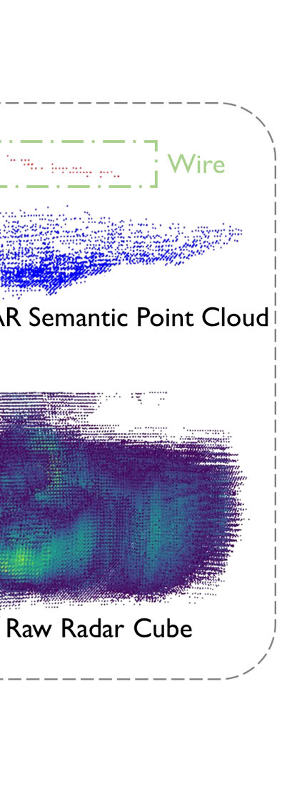
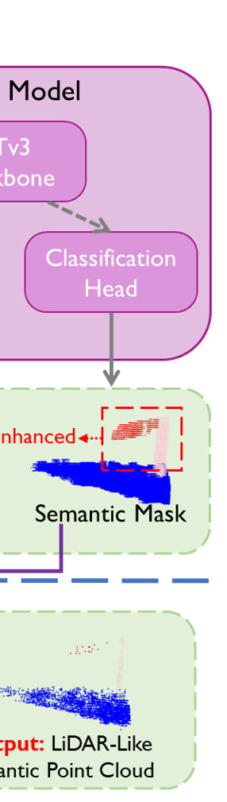
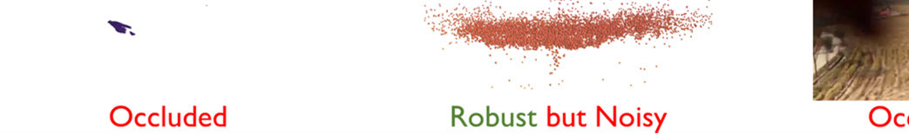
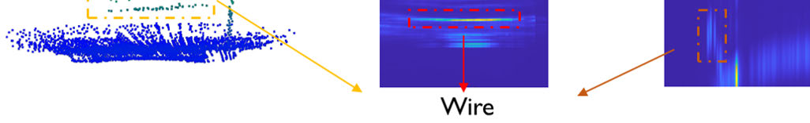
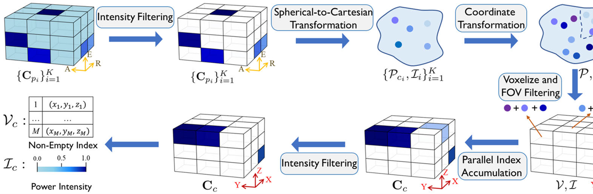
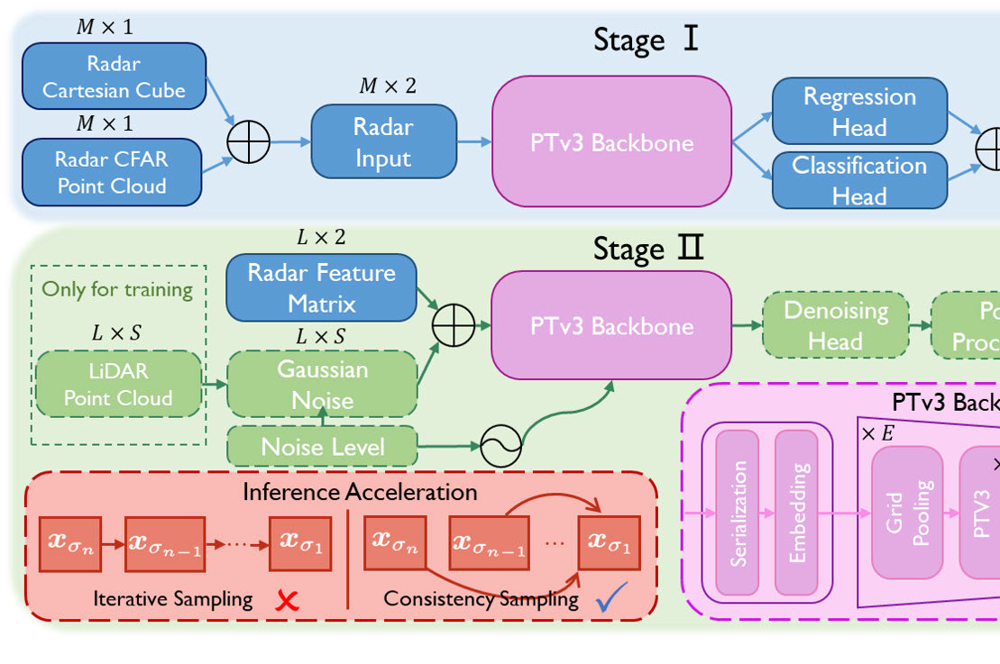
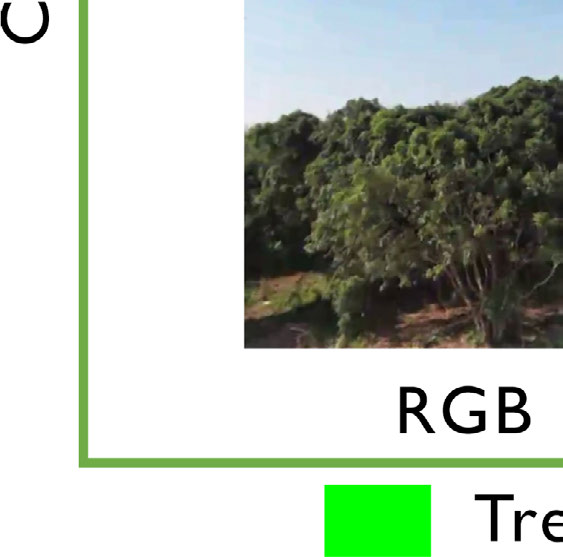
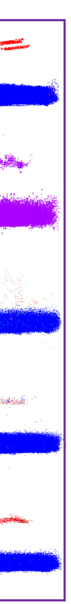

# 基于扩散模型的三维雷达语义感知

> **原文标题**：07_Diffusion-Based_3-D_Radar_Semantic_Perception  
> **作者**：Ruibin Zhang、Jialiang Hou、Fei Gao  
> **发表信息**：IEEE Transactions on Automation Science and Engineering, Vol. 23（2026），DOI 10.1109/TASE.2026.3691400  
> **原文 PDF**：[07_Diffusion-Based_3-D_Radar_Semantic_Perception.pdf](../07_Diffusion-Based_3-D_Radar_Semantic_Perception.pdf) ｜ **对应中文详解**：[07_扩散模型三维雷达语义感知.md](../中文详解/07_扩散模型三维雷达语义感知.md)

---

## 原文第 1 页翻译

### 摘要

在复杂农业环境中，准确而稳定的环境感知是机器人自主导航的基础。相机和激光雷达能够提供丰富的视觉或距离信息，但镜头沾染泥土、被水滴覆盖或受到实体遮挡后，性能会明显下降，严重时会导致自主任务失效。针对机载传感器容易受到污染的农业场景，本文利用雷达较强的穿透能力，提出一种三维雷达环境感知框架。

该框架包括三个核心模块：一是并行帧累积，用于提高原始雷达数据的信噪比；二是基于扩散模型的分层学习框架，先滤除雷达旁瓣伪影，再生成细粒度三维语义点云；三是面向大规模原始雷达数据设计的稀疏三维网络。作者在真实农业田间采集的自建数据集上进行了对比和验证。结果表明，该方法在结构预测和语义预测方面优于已有方法，同时将计算量和内存开销分别降低 44.3% 和 27.5%，并能够较完整地重建和准确分类杆、导线等细小结构。

给工程人员的说明：本文研究的是复杂农业环境中的三维语义感知，即同时生成点云并判断点云的类别。视觉传感器和激光雷达容易因污染失效，毫米波雷达虽然更可靠，却存在噪声大、点云稀疏等固有问题。本文将分层扩散模型与跨模态监督学习结合，在只使用雷达的条件下获得较稠密、较准确的三维语义感知结果，并验证其在嵌入式设备上实时运行的可能性。

作者、机构、收稿日期、基金信息、DOI 和索引词按原文保留。

### 引言

农业机械的发展持续提高了播种、收获、灌溉和施药等工作的效率。随着农业机器人逐步实现自主作业，环境感知成为自主定位建图、决策和路径规划的基础。例如，部分农业无人机的自动喷洒效率约为人工喷洒的 70 倍[1]，这类提升很大程度上得益于自主导航技术的发展。

目前的机载感知设备主要包括相机和 LiDAR。相机成本较低，能够提供丰富的语义信息；LiDAR 能够提供准确的距离信息和较大的探测范围，但成本较高。二者都容易受到微小颗粒或泥土遮挡，导致性能下降，甚至使自主任务完全失败。

为解决这一问题，学术界和工业界开始研究雷达，特别是毫米波雷达，将其作为补充感知手段；这类设备已经用于部分商用农业机器人[2]、[3]。毫米波雷达工作在毫米波频段，穿透能力强，在多种天气条件下仍能工作，因此有望在农业场景中替代部分光学传感器。不过，它也存在信噪比低和角分辨率低等固有缺陷。传统雷达目标检测方法（例如 CFAR 和 MUSIC）可以作为基础信号处理手段，但难以直接满足稠密三维语义感知的要求。

---

## 原文第 2 页翻译

传统 CFAR 和 MUSIC 等方法在自动驾驶中已经得到广泛应用，但直接用于原始毫米波雷达数据的稠密语义感知时，难以可靠区分噪声与有效目标，也难以恢复物体的结构细节。因此，它们通常只能生成稀疏点云，并伴随漏检和虚警，进而限制自运动估计、目标检测和语义分割等后续任务[4]–[15]。

毫米波雷达感知面临三类主要问题。第一，信噪比低且容易受干扰。复杂环境中的多次散射会削弱有效目标回波，低雷达散射截面的目标回波强度甚至低于噪声；多径和地面反射还会进一步污染回波。农业环境中作物和树木密集，感知难度更高。第二，角分辨率低并受到旁瓣污染。毫米波雷达需要较大的天线孔径才能获得接近 LiDAR 的角分辨率，这不适合安装在农业机器人上。角分辨率不足时，附近目标难以分开，强目标旁瓣还可能淹没弱目标。第三，原始数据规模大。4D 雷达单帧数据可达到约 260 MB[18]，完整利用数据能够保留更多环境信息，但会给机载计算机带来很大压力。

已有方法主要有两类。判别式方法直接学习雷达数据到 LiDAR 点云的条件关系，但从含噪雷达数据恢复准确点云具有多解性，逐点损失容易使输出变成多个可能结构的平均结果。生成式方法学习雷达数据与真实点云的联合分布，能够产生更有细节的结果，但训练难度和推理开销更大。将数据压缩成鸟瞰图，或者只使用传统检测器生成的稀疏点云，又会丢失三维信息。

本文提出 Sem-RaDiff 由粗到细的扩散模型框架。首先对当前帧和历史帧进行实时非相干累积，提高信噪比；第一阶段利用膨胀后的 LiDAR 点云监督网络，滤除旁瓣伪影并生成粗粒度结构和语义信息；第二阶段以这些结果为条件，通过扩散模型生成细粒度、类似 LiDAR 的三维语义点云。同时，系统采用稀疏三维表示和专用稀疏三维网络，并通过单步一致性推理降低在线计算量。

---

## 原文第 3 页翻译

农业机器人正在承担播种、收获、灌溉和施药等任务，但农药飞溅、水滴和作物残渣会污染机载传感器。相机和 LiDAR 被泥土遮挡后视场会严重缩小，甚至使无人机失去视觉；毫米波雷达基本不受这类遮挡影响，却仍会因为信噪比低和角分辨率低而产生漏检与虚警。本文的目标是通过数据驱动方法改善毫米波雷达点云质量，并为点云增加语义信息。

在判别式点云生成方面，RPDNet 使用 U-Net 结构，在 LiDAR 点云监督下过滤距离-多普勒矩阵中的错误点，再通过传统到达方向估计生成三维雷达点云；后续方法将监督信息改为视觉惯性数据。DREAM-PCD 结合非相干累积和相干累积，提高点云密度和角分辨率，但相干累积要求亚毫米级位姿估计，在机器人应用中难以满足。还有一些方法把雷达点云和真实点云编码为深度图或柱状表示，以降低计算量，但仍受到传统雷达处理和角分辨率的限制。

生成式方法中，条件生成对抗网络能够学习雷达数据和真实点云的联合分布，但容易出现训练不稳定和模式坍塌，只适合场景种类较少的任务。扩散模型具有更稳定的训练过程和更好的样本多样性，已经用于鸟瞰图、仰角图、深度图和三维体素等多种表示。已有工作通常使用距离-方位热图或雷达点云作为条件输入，而不是完整的三维或四维雷达立方体，因此会丢失信息。SDDiff 使用 4D 雷达立方体进行点云生成和自运动估计，但没有充分解决低信噪比和低角分辨率问题，弱回波目标容易漏检。

本文的三项贡献如下：提出 Sem-RaDiff，将并行帧累积和分层扩散学习结合起来；提出保留完整三维结构的稀疏表示、专用稀疏三维网络和单步扩散推理；在商用农业无人机采集的真实农业田间数据上开展基准比较、消融实验和实地验证。

**图 1**：不同跨模态雷达感知方法的比较。（a）判别式方法通过监督学习，使雷达输出接近高性能传感器；（b）生成式方法把雷达数据作为条件输入，利用扩散模型等生成式学习方法增强感知；（c）本文将两类方法结合为由粗到细的流程，先把大量、含噪的雷达数据滤成可解释的粗粒度掩码，再预测细粒度三维语义点云。

---

## 原文第 4 页翻译

农业机器人经常在农药、水滴和作物残渣较多的环境中工作，机载传感器容易被污物覆盖。相机和 LiDAR 被泥土遮挡后，视场会明显缩小；毫米波雷达虽然基本不受遮挡影响，但仍会因为自身限制产生漏检和虚警。本文希望通过数据驱动方法提高毫米波雷达点云质量，并为农业场景中的点云提供语义信息。

### 相关工作：农业环境中的机器人感知

农业机器人已经能够承担播种、收获、灌溉和施药任务[1]。许多商用农业机器人已经具备自主导航能力[2]、[3]。这些设备工作时容易受到农药、水滴和作物残渣影响，如图 3 所示。当泥土覆盖相机和 LiDAR 时，二者的视场会严重受阻，使无人机几乎失去视觉；毫米波雷达则基本不受遮挡影响，但在正常和污染条件下都可能出现大量漏检和虚警。本文因此采用数据驱动方式改善毫米波雷达点云，并增加语义信息。

### 判别式雷达点云生成

已有判别式方法广泛研究了雷达点云生成问题[19]–[29]。RPDNet 以 U-Net 为基础，在 LiDAR 点云监督下过滤距离-多普勒矩阵中的错误点，再利用传统到达方向估计生成三维点云。后续工作使用视觉惯性监督代替 LiDAR 监督。DREAM-PCD 同时使用非相干和相干累积，并通过神经网络滤除噪声；但相干累积要求亚毫米级位姿估计，在机器人平台上难以实现，最终生成的点云仍可能受到噪声影响。将点云编码为深度图或柱状表示能够降低计算量，但仍然受传统雷达处理和角分辨率限制。

**图 2**：Sem-RaDiff 的总体框架。系统包括三个模块：（1）雷达数据预处理，将多帧雷达球坐标立方体转换为累积雷达笛卡尔立方体和雷达 CFAR 点云；（2）粗掩码学习，在膨胀后的 LiDAR 语义点云监督下预测结构掩码和语义掩码；（3）细粒度语义点云学习，以结构掩码和语义掩码为条件，通过扩散模型和单步一致性采样生成类似 LiDAR 的语义点云。

**图 3**：农业场景中传感器在正常状态和受到污物影响时的感知效果比较。

---

## 原文第 5 页翻译

### 生成式雷达点云生成

近年来，研究者使用生成模型生成高质量雷达点云[30]–[40]。早期方法通常采用条件生成对抗网络，在成对的雷达数据和真实点云之间学习联合分布。Millimap 在 LiDAR 监督下，结合室内空间几何先验，由雷达点云学习鸟瞰图点云；Hawkeye、3DRIMR 和 DeepPoint 则利用三维雷达立方体重建指定物体。条件生成对抗网络容易出现训练不稳定和模式坍塌，因此通常只能用于场景种类有限的任务。

扩散模型通过逐步生成和较简单的训练目标，通常比生成对抗网络具有更好的训练稳定性和样本多样性。Radar-Diffusion 首次将扩散模型用于雷达点云生成，展示了根据距离-方位热图生成类似 LiDAR 的鸟瞰图点云的可能性。之后的研究使用鸟瞰图、仰角图、深度图或三维体素等表示作为条件，尝试生成类似 LiDAR 的点云。另有研究使用任意 LiDAR 领域知识引导扩散模型，而不依赖成对的雷达和 LiDAR 点云。

上述方法通常使用距离-方位热图或雷达点云作为条件，而不是三维或四维雷达立方体，因此存在明显的信息损失。SDDiff 使用 4D 雷达立方体进行点云生成和自运动估计，但没有解决低信噪比和低角分辨率问题，弱回波目标容易漏检。传统旁瓣抑制和点云累积能够改善数据质量，却难以处理原始 4D 雷达立方体带来的计算压力；依赖大型三维卷积网络也增加了机载部署难度。

Sem-RaDiff 采用并行帧累积和神经雷达立方体过滤，分别改善信噪比和角分辨率问题，并过滤多径反射造成的虚假目标，使后续扩散生成建立在物理上更可信的位置基础上。系统进一步采用稀疏三维网络和单步推理，以支持在农业机器人上的实时、高质量点云生成。

### 仅使用雷达的语义预测

已有研究尝试只使用雷达进行语义预测[12]、[14]、[48]–[50]。部分方法基于 PointNet++ 对雷达点云进行语义分割，并利用时间信息完成运动实例分割。但稀疏且含噪的雷达点云包含的语义信息十分有限，例如行人和自行车都可能只表现为少数散射点，难以区分。另一些方法使用 4D 雷达立方体进行三维语义场景补全，但低分辨率和伪影问题仍会传递到生成结果中。

Sem-RaDiff 同时改善雷达感知质量和语义预测质量。第一阶段输出粗粒度结构掩码与语义掩码，第二阶段以二者共同作为条件，生成细粒度三维语义点云。

---

## 原文第 6 页翻译

### 雷达信号处理

毫米波雷达通常采用 FMCW 技术，连续发射频率随时间变化的电磁调频波，并通过接收信号分析目标的距离、速度和方向。采用线性调频时，发射信号为：

$$
s_{TX}(t)=A_{TX}\exp\left[j2\pi\left(f_0t+\frac{1}{2}\frac{B}{T_c}t^2\right)\right],\quad t\in[0,T_c].
$$

其中，$A_{TX}$ 为振幅，$f_0$ 为载波频率，$B$ 为带宽，$T_c$ 为调频周期。接收信号是发射信号的延迟版本：

$$
s_{RX}(t)=s_{TX}(t-\tau),\qquad \tau=\frac{2r}{c},
$$

其中 $r$ 是目标与雷达的距离，$c$ 是光速。发射信号和接收信号经混频得到中频信号。在线性调频条件下，中频信号频率为 $\\\frac{B}{T_c}\tau$。对中频信号进行模数转换和 FFT 后，频率峰值对应一个检测目标，其距离为：

$$
r_i=\frac{f_i cT_c}{2B},
$$

距离分辨率为：

$$
\Delta r=\frac{c}{2B}.
$$

商用毫米波雷达的典型带宽为 1–4 GHz，对应的距离分辨率约为 3.75–15 cm。

速度通常通过连续调频周期之间的多普勒效应测量。但对于本文使用的扫描雷达，传感器转动会影响多普勒速度的可靠估计。本文将说明，即使没有速度信息，也能够通过多帧累积和三维空间结构得到较高质量的环境感知结果。

方位角和俯仰角通过分析不同接收天线之间的相位差获得。利用 MIMO 技术，$N_T$ 个发射天线和 $N_R$ 个接收天线以间距 $d$ 排列，可以形成 $N_a=N_T\imes N_R$ 个虚拟阵元。对相位序列进行 FFT 后，位于相位 $\\\phi_i$ 的峰值对应一个目标，其方位角为：

$$
\theta_i=\sin^{-1}\left(\frac{\lambda\phi_i}{2\pi d}\right),
$$

角分辨率为：

$$
\Delta\theta=\frac{\lambda}{N_a d}.
$$

本文分别在距离、方位和俯仰三个维度对时域雷达信号进行 FFT，得到球坐标系中的三维数据立方体，如图 4 所示。立方体中的每个单元保存回波强度，峰值表示潜在目标；但低信噪比和有限角分辨率会使这些峰值受到影响。

**图 4**：雷达信号处理流程，以及雷达球坐标立方体与 LiDAR 点云的对比。

### 扩散模型

扩散模型是一类概率生成模型。正向扩散过程使用高斯扰动逐步把样本变成噪声；反向扩散过程学习逐步恢复原始样本，从而学习真实数据分布 $p_{data}(x)$。连续时间扩散模型的正向随机微分方程为：

$$
dx=f(x,\sigma)d\sigma+g(\sigma)d\omega_\sigma.
$$

其中 $\sigma\in[0,\\\sigma_{max}]$ 表示噪声水平，$\omega_\sigma$ 为标准 Wiener 过程，$f(\cdot,\\\sigma)$ 为漂移系数，$g(\cdot)$ 为扩散系数。在 EDM 设置下，$f(x,\\\sigma)=0$、$g(\\\sigma)=\\\sqrt{2\sigma}$，因此：

$$
p(x_\sigma|x)\sim\mathcal{N}(x,\sigma^2I).
$$

反向过程通过反向随机微分方程从 $x_\sigma$ 生成样本：

$$
dx=[f(x,\sigma)-g(\sigma)^2\nabla_x\log p_\sigma(x)]d\sigma+g(\sigma)d\omega_\sigma.
$$

其中 $p_\sigma(x)$ 是噪声水平为 $\sigma$ 时的边缘概率密度。未知的得分函数通过得分匹配估计，去噪函数 $D_\theta(x_\sigma;\\\sigma)$ 的训练目标为：

$$
\mathbb{E}_{x,\sigma}\|D_\theta(x_\sigma;\sigma)-x\|_2^2,\qquad \nabla_x\log p_\sigma(x)=\frac{D_\theta(x_\sigma;\sigma)}{\sigma^2}.
$$

训练时，先对数据样本加噪，再训练去噪函数恢复原始样本；条件生成时，将条件输入 $C$ 一并送入去噪函数。推理时，使用训练好的去噪函数和数值求解器完成反向过程。

---

## 原文第 7 页翻译

### 任务定义与数据预处理

本文的任务是根据连续 $K$ 帧三维雷达球坐标立方体及其对应的 $SE(3)$ 位姿，恢复带语义类别的三维点云。输入表示为：

$$
C_p=\{C_{p_i}\in\mathbb{R}^{R\times E\times A},\ i=1,2,\ldots,K\},
$$

以及对应的位姿：

$$
T=\{T_i=(R_i,t_i)\mid R_i\in SO(3),\ t_i\in\mathbb{R}^3,\ i=1,2,\ldots,K\}.
$$

其中 $R$、$E$、$A$ 分别表示距离、俯仰和方位三个维度。目标是从大规模但含噪的雷达立方体中恢复：

$$
L=\{(P_j,s_j)\mid P_j\in\mathbb{R}^3,\ s_j\in\{1,2,\ldots,S\}\}_{j=1}^{N},
$$

其中 $P_j$ 是点的位置，$s_j$ 是从 $S$ 个类别中选择的语义标签。

雷达立方体中大多数体素属于旁瓣伪影或自由空间，而不是有效目标，因此需要先过滤和稀疏化。具体做法是：先对每个球坐标雷达立方体进行强度筛选，仅保留强度最高的前 $q$%；再把球坐标转换为笛卡尔坐标，并利用各帧的自身位姿，将历史帧点云对齐到当前第 $K$ 帧坐标系。超出当前视场的点被删除，剩余点体素化。随后在 GPU 上以稀疏并行方式进行非相干累积，把落入同一体素的功率相加；最后再次按强度筛选，得到包含 $M$ 个非空体素的稀疏雷达笛卡尔立方体。

同时，对每个球坐标雷达立方体使用传统 CFAR 生成雷达点云，并以同样方式将多帧点云对齐到当前坐标系。为使点数与雷达立方体一致，缺少的位置补为“自由空间”类别。雷达笛卡尔立方体和 CFAR 点云共同作为后续网络输入。

**图 5**：所提出的雷达立方体预处理方法。多帧雷达球坐标立方体经过累积和强度筛选后，转换成稀疏格式的雷达笛卡尔立方体。

### 第一阶段：粗粒度结构和语义掩码预测

预处理后的雷达笛卡尔立方体仍包含大量明显的旁瓣伪影，难以直接识别目标结构，与 LiDAR 点云之间存在较大的模态差异。第一阶段学习粗粒度结构并抑制旁瓣伪影，以缩小这种差异。

首先，将 LiDAR 点云体素化到与雷达数据相同的三维笛卡尔网格中。对二值占用图进行高斯模糊，对带类别的语义图进行灰度膨胀。高斯模糊后，有效目标中心位置的置信度高，向边缘逐渐降低，从而提供结构信息；灰度膨胀后的语义图提供类别信息。二者都转换为稀疏表示，作为第一阶段监督信号。该处理尤其能够增强导线等弱目标，有助于完整预测。

输入由共同的体素索引矩阵 $V_c$、雷达笛卡尔立方体的功率强度 $I_c$ 和 CFAR 点云的自由/占用信息 $I_p$ 组成。结构标签 $y_{st}$ 归一化到 $[0,1]$，表示体素非空的置信度；语义标签 $y_{se}$ 采用独热编码。网络 $R_\theta$ 通过回归头和分类头分别预测结构掩码和语义掩码：

$$
\hat y_{st}=R_\theta^{st}(V_c,I_c,I_p),\qquad \hat y_{se}=R_\theta^{se}(V_c,I_c,I_p).
$$

结构回归使用二元交叉熵损失，语义预测使用加权交叉熵损失，以平衡地面和杆等类别数量差异。总损失为：

$$
L_{stage1}=L_{bce}(\hat y_{st},y_{st})+L_{wce}(\hat y_{se},y_{se}).
$$

推理时删除预测为自由空间的体素，保留 $L<M$ 个体素，并通过 argmax 得到语义类别。结构掩码与语义掩码拼接为条件矩阵 $C\in\\\mathbb{R}^{L\times(1+1)}$，作为第二阶段扩散学习的输入。

---

## 原文第 8 页翻译

### 第二阶段：基于扩散模型的细粒度三维语义点云生成

第二阶段根据第一阶段得到的混合结构和语义特征矩阵 $C$，预测细粒度、类似 LiDAR 的三维语义点云。整个过程包括扩散训练、扩散推理和一致性蒸馏。

扩散训练的目标是：在已经与雷达数据完成空间和时间对齐的条件矩阵 $C$ 下，恢复受到噪声污染的 LiDAR 语义点云。将以独热形式表示的 LiDAR 样本 $x\\sim p_{data}$ 扩展到 $L$ 个点，新增加的点赋予“自由空间”类别，然后按照预设噪声分布采样 $\sigma$，通过：

$$
p(x_\sigma|x)\sim\mathcal{N}(x,\sigma^2I)
$$

得到带噪样本 $x_\sigma$。去噪函数采用 EDM 形式：

$$
D_\theta(x_\sigma;\sigma,C)=c_{skip}(\sigma)x_\sigma+c_{out}(\sigma)F_\theta(c_{in}(\sigma)x_\sigma;\sigma,C).
$$

本文使用直接预测干净样本 $x$ 的方式训练去噪网络，损失函数为：

$$
L_{stage2}=\mathbb{E}_{\sigma,x,C}\left[\lambda(\sigma)w_c\left\|D_\theta(x_\sigma;\sigma,C)-x\right\|_2^2\right].
$$

其中，$\\\lambda(\\\sigma)$ 用于平衡整个噪声范围内的初始损失，$w_c$ 用于处理类别不平衡问题。

推理时，从高斯噪声 $x_{\\\sigma_{max}}sim\\\mathcal{N}(0,\\\sigma_{max}^2I)$ 开始，在条件 $C$ 下求解反向随机微分方程。作者使用二阶 Runge-Kutta 求解器，在离散噪声水平 $\sigma_1=\\\sigma_{min}<\\\cdots<sigma_n=\\\sigma_{max}$ 上反复调用去噪网络。为提高速度，系统加入一致性蒸馏：一致性模型学习从任意噪声水平的 $(x_\\\sigma,\\\sigma)$ 直接映射到接近干净样本的 $x_{\\\sigma_{min}}$。该模型由预训练扩散模型通过均方误差损失蒸馏得到，因此可以从最大噪声一次前向计算直接预测结果。

网络预测完成后，再次删除“自由空间”体素，剩余 $N<L$ 个点转换成三维语义点云。Sem-RaDiff 的训练和推理流程分别如下。

### 算法 1：Sem-RaDiff 训练流程

1. 将 LiDAR 点云体素化为 $L_c$。
2. 对 $L_c$ 进行高斯模糊和灰度膨胀，得到结构标签 $y_{st}$ 和语义标签 $y_{se}$。
3. 使用第一阶段损失训练网络 $R_\heta$。
4. 根据雷达输入和 $R_\heta$ 的输出生成条件矩阵 $C$。
5. 将 $L_c$ 扩展为数据样本 $x$，并通过正向扩散得到 $x_\sigma$。
6. 使用第二阶段损失训练去噪网络 $D_\heta$。
7. 通过均方误差损失，从 $D_\heta$ 蒸馏一致性模型 $f_\heta$。

### 算法 2：Sem-RaDiff 推理流程

1. 将雷达立方体和 CFAR 点云输入 $R_\heta$，预测结构掩码和语义掩码。
2. 滤除自由空间体素，构造条件矩阵 $C$。
3. 采样高斯噪声 $x_{\\\sigma_{max}}$。
4. 使用一致性模型 $f_\heta(x_{\\\sigma_{max}},C)$ 预测三维语义体素。
5. 将预测体素转换为三维语义点云。

---

## 原文第 9 页翻译

### 模型结构

Sem-RaDiff 的两个学习阶段都采用 Point Transformer V3 作为骨干。该骨干建立在稀疏三维 U-Net 框架上，包括编码器、解码器、网格池化、网格反池化和注意力模块。网络首先对非空体素进行序列化和嵌入，将原本无序的点云转换为结构化表示；随后通过 5 个编码器和 4 个解码器逐步提取和恢复特征。每个模块由网格池化或反池化以及 PTv3 模块组成，PTv3 模块以稀疏三维卷积和多头注意力为核心。

为适应本文任务，第一阶段增加结构输出头和语义输出头，分别使用 1 个和 $S$ 个输出通道。第二阶段把噪声水平 $\sigma$ 的正弦位置编码加入各个 PTv3 模块，并将条件矩阵 $C$ 与带噪样本共同输入网络；最后增加具有 $S$ 个输出通道的稀疏三维卷积去噪头。网络的具体配置见表 II。

### 数据集与评价指标

作者使用商用农业无人机采集真实田间数据。无人机搭载毫米波雷达、垂直放置的 LiDAR 和前视 RGB 相机，雷达与 LiDAR 完成空间标定和时间同步，以 5 Hz 记录数据；RTK-GPS 提供位置和姿态。数据包含 8 条飞行序列，前 6 条共 12728 帧用于训练，后 2 条共 2587 帧用于测试。LiDAR 标签包括自由空间、地面、树木、杆和导线五类，帧累积使用当前帧及前 4 帧。

评价指标包括各类别 IoU、平均 IoU、Chamfer 距离、IoU、精度和召回率。IoU 用于衡量预测区域与真实区域的重叠程度；Chamfer 距离用于衡量预测点云与真实点云之间的几何差异；精度表示预测点中属于真实目标的比例，召回率表示真实目标点被预测出来的比例。

**图 6**：Sem-RaDiff 的网络结构。两个阶段共用稀疏三维骨干，第一阶段预测结构和语义掩码，第二阶段以粗粒度结果为条件生成细粒度语义点云。

---

## 原文第 10 页翻译

### 实验配置与对比方法

作者设置三种模型规模：中等模型采用 EDM 迭代采样；中等模型经过一致性蒸馏后支持单步推理；大模型使用更多参数并采用迭代采样。对比方法包括传统 CFAR、RadarHD、Sun、Radar-Diffusion 和 Luan。为便于比较，作者根据各方法原有任务对二维骨干进行三维改造，把输入统一到三维雷达体素表示，并使用加权交叉熵或类别亲和损失处理类别不均衡。

定量结果显示，本文方法在多数指标上取得前三名，在平均语义 IoU 及困难类别 IoU 上具有明显优势。中等模型和大模型的输入同时包含雷达笛卡尔立方体与雷达点云，在保证结构和语义效果的同时降低了计算和内存开销。相比次优方法，推理计算量和 GPU 内存占用分别降低 44.3% 和 27.5%。

### 单帧定性结果

单帧结果表明，Sem-RaDiff 生成的三维结构和语义信息更稠密、更准确，尤其是杆和导线等细小目标。判别式方法容易产生伪影；单阶段扩散方法对地面和树木的预测较好，但对杆和导线仍有漏检。本文的雷达预处理提高了信噪比，第一阶段抑制旁瓣伪影，因此即使使用单步推理，也能够较好地恢复细小结构。

**图 7**：自建测试集上的单帧三维雷达点云重建和语义预测定性结果。

---

## 原文第 11 页翻译

### 多帧定性结果

在第一类场景中，本文方法比 CFAR 和其他学习方法更完整地生成了两条空中导线；在第二类场景中，本文方法成功检测到导线并完成杆的重建；在第三类场景中，本文方法对树木形状以及树木之间的自由空间预测更准确。

多帧结果进一步表明，本文方法能够区分相邻的小树并正确分类。与其他方法相比，左侧杆和上方导线的结构恢复更完整，误分类更少。斜向导线仍容易被判断为树木，原因是训练集中主要包含水平导线样本，缺少斜向导线。部分斜向导线还会因雷达点云没有检测到而漏检，这说明训练数据的覆盖范围和雷达输入质量都会影响最终结果。

**图 8**：自建测试集上的多帧累积三维雷达点云重建和语义预测定性结果。

---

## 原文第 12 页翻译

### 定量结果

作者在不同距离阈值下，同时统计语义指标和几何指标。语义指标包括各类别 IoU 和平均 IoU，几何指标包括 Chamfer 距离、IoU、精度和召回率。本文方法在多数指标上取得前三名，在平均语义 IoU 及各类别 IoU 上具有明显优势。对于杆和导线等困难类别，即使采用单步推理的中等模型，其 IoU 也约为最佳对比方法的 1–2 倍。

在几何指标方面，大模型使用 EDM 迭代采样时总体表现最好，在距离阈值为 0.25 m 时除召回率外的指标均达到最高。RadarHD 和 Sun 在某些召回率指标上较高，但其他指标明显较差，说明其生成点云的精度不足。中等模型的 EDM 版本和单步一致性版本与扩散基线结果接近，但计算开销明显更低；单步版本虽然几何指标略低于部分基线，在除地面外的环境目标类别上却更有优势。

只使用雷达笛卡尔立方体作为条件时，性能明显下降，说明原始雷达立方体与真实点云之间的模态差异较大；只使用雷达点云时下降相对较小，但召回率降低，因为稀疏点云会造成更多漏检。两类输入结合后，既保留了雷达立方体中的空间信息，又利用了点云提供的目标提示。

---

## 原文第 13 页翻译

### 消融实验

消融实验在相同模型配置和超参数下进行，目的是验证各模块的结构作用，而不是在测试集上调节参数。所有变体均采用中等模型和 EDM 推理设置。

去除信噪比增强后，用单帧雷达笛卡尔立方体代替多帧累积结果。多数指标下降，导线类别的 IoU 下降尤其明显。这说明非相干多帧累积能够提高雷达笛卡尔立方体的信噪比，对导线等弱目标的改善更加明显。

去除雷达立方体过滤后，直接将雷达笛卡尔立方体和雷达点云作为条件输入。整体性能在多个指标上下降，导线 IoU 明显降低。原因是原始立方体中的导线回波很弱，雷达点云中的导线点又很稀疏；第一阶段生成的粗掩码能够把导线表示为较稠密的结构和语义信息，为第二阶段提供更有效的条件。

输入模态实验分别只使用雷达立方体和只使用雷达点云。仅使用雷达立方体时性能下降最严重；仅使用雷达点云时性能也会下降，但幅度较小，主要表现为召回率损失。作者认为，雷达立方体单独使用效果不佳还与数据集场景数量有限有关，现有数据不足以充分学习雷达点云与真实点云之间的联合分布。

---

## 原文第 14 页翻译

### 系统效率

作者在配备 Intel Core i7-10700 CPU 和 NVIDIA GeForce RTX 4090 GPU 的 Linux 台式机上测试 Sem-RaDiff 的推理速度。FFT 和 CFAR 在雷达传感器处理器上运行，不占用 GPU 资源，因此完整流程包括并行帧累积、第一阶段和第二阶段；两个阶段都使用半精度推理。

GPU 加速使多帧雷达立方体累积速度提高约 40 倍。中等模型和大模型在 RTX 4090 上分别达到 13.6 FPS 和 7.3 FPS，但嵌入式设备的算力更低，当前结果仍不能直接满足机载部署要求。例如，RTX 4090 约为 1321 AI TOPS，而 Jetson Orin AGX 约为 275 AI TOPS。作者指出，模型剪枝、量化等措施有望进一步降低计算开销。与许多三维占用学习方法相比，Sem-RaDiff 的推理速度已经较高，经过进一步加速后具有机载实时运行潜力。

### 结论

本文提出面向农业应用的三维毫米波雷达语义感知方法 Sem-RaDiff。针对雷达数据噪声大、分辨率低和规模大的问题，作者构建了由粗到细的框架，将判别式学习和生成式扩散模型结合起来，并配合并行雷达数据累积和稀疏三维网络。真实农业田间数据上的实验表明，Sem-RaDiff 在三维结构重建和语义预测方面优于已有方法，同时显著降低了计算开销。

该方法说明，在相机和 LiDAR 容易受到污染的环境中，只使用雷达也可以获得较可靠的结构和语义感知结果。后续工作将研究其机载部署，并将方法扩展到农业机器人的自主导航等下游任务；同时建立更大规模、场景更多样、标注更丰富的农业雷达数据集。

REFERENCES
[1]
M. Wakchaure, B. K. Patle, and A. K. Mahindrakar, “Application of AI
techniques and robotics in agriculture: A review,” Artif. Intell. Life Sci.,
vol. 3, Dec. 2023, Art. no. 100057.
[2]
XAG. (2021). XAG Reveals New-Generation Drones and Robots
for Agrifuture. [Online]. Available: https://www.xa.com/en/news/official/
xag/144
[3]
Eavision.
(2021).
Thor
(EA-20X).
[Online].
Available:
https://
www.eavisionag.com/thor-ea-20x p6.html
[4]
M. A. Richards, Fundamentals of Radar Signal Processing, vol. 1. New
York, NY, USA: McGraw-Hill, 2005.
[5]
R. Schmidt, “Multiple emitter location and signal parameter estimation,”
IEEE Trans. Antennas Propag., vol. AP-34, no. 3, pp. 276–280, Mar.
1986.
[6]
S. H. Cen and P. Newman, “Precise ego-motion estimation with
millimeter-wave radar under diverse and challenging conditions,” in
Proc. IEEE Int. Conf. Robot. Autom. (ICRA), May 2018, pp. 6045–6052.
[7]
A.
Kramer,
C.
Stahoviak,
A.
Santamaria-Navarro,
A.-A.
Agha-
Mohammadi, and C. Heckman, “Radar-inertial ego-velocity estimation
for visually degraded environments,” in Proc. IEEE Int. Conf. Robot.
Autom. (ICRA), May 2020, pp. 5739–5746.
[8]
Y. Almalioglu, M. Turan, C. X. Lu, N. Trigoni, and A. Markham, “Milli-
RIO: Ego-motion estimation with low-cost millimetre-wave radar,” IEEE
Sensors J., vol. 21, no. 3, pp. 3314–3323, Feb. 2021.
[9]
X. Gao, G. Xing, S. Roy, and H. Liu, “RAMP-CNN: A novel neural net-
work for enhanced automotive radar object recognition,” IEEE Sensors
J., vol. 21, no. 4, pp. 5119–5132, Feb. 2021.
[10] Y. Wang, Z. Jiang, Y. Li, J.-N. Hwang, G. Xing, and H. Liu, “RODNet:
A real-time radar object detection network cross-supervised by camera-
radar fused object 3D localization,” IEEE J. Sel. Topics Signal Process.,
vol. 15, no. 4, pp. 954–967, Jun. 2021.
[11] Y. Cheng, H. Xu, and Y. Liu, “Robust small object detection on the water
surface through fusion of camera and millimeter wave radar,” in Proc.
IEEE/CVF Int. Conf. Comput. Vis. (ICCV), Oct. 2021, pp. 15263–15272.
[12] O. Schumann, M. Hahn, J. Dickmann, and C. W¨ohler, “Semantic
segmentation on radar point clouds,” in Proc. 21st Int. Conf. Inf. Fusion
(FUSION), Jul. 2018, pp. 2179–2186.
Authorized licensed use limited to: National Institute of Technology- Delhi. Downloaded on August 24,2026 at 05:41:35 UTC from IEEE Xplore.  Restrictions apply.

---

## 原文第 15 页核心内容与翻译

[13] P. Kaul, D. de Martini, M. Gadd, and P. Newman, “RSS-Net: Weakly-
supervised multi-class semantic segmentation with FMCW radar,” in
Proc. IEEE Intell. Vehicles Symp. (IV), Oct. 2020, pp. 431–436.
[14] M. Zeller, V. S. Sandhu, B. Mersch, J. Behley, M. Heidingsfeld, and
C. Stachniss, “Radar instance transformer: Reliable moving instance
segmentation in sparse radar point clouds,” IEEE Trans. Robot., vol. 40,
pp. 2357–2372, 2023.
[15] Y. Dalbah, J. Lahoud, and H. Cholakkal, “TransRadar: Adaptive-
directional
transformer
for
real-time
multi-view
radar
semantic
segmentation,” in Proc. IEEE/CVF Winter Conf. Appl. Comput. Vis.,
Jan. 2024, pp. 353–362.
[16] A. Battaglia, S. Tanelli, S. Kobayashi, D. Zrnic, R. J. Hogan, and
C. Simmer, “Multiple-scattering in radar systems: A review,” J. Quant.
Spectrosc. Radiat. Transf., vol. 111, no. 6, pp. 917–947, Apr. 2010.
[17] S. Rao, “Introduction to mmWave sensing: FMCW radars,” TexasIn-
strum. (TI) mmWave Training Ser., Texas Instrum., Dallas, TX, USA,
pp. 1–11, 2017.
[18] S.-H.
Kong,
D.-H.
Paek,
and
K.
T.
Wijaya,
“K-radar:
4D
radar object detection for autonomous driving in various weather
conditions,” in Proc. Adv. Neural Inf. Process. Syst., vol. 35, 2022,
pp. 3819–3829.
[19] Y. Cheng, J. Su, H. Chen, and Y. Liu, “A new automotive radar 4D
point clouds detector by using deep learning,” in Proc. IEEE Int. Conf.
Acoust., Speech Signal Process. (ICASSP), Jun. 2021, pp. 8398–8402.
[20] Y. Cheng, J. Su, M. Jiang, and Y. Liu, “A novel radar point cloud
generation method for robot environment perception,” IEEE Trans.
Robot., vol. 38, no. 6, pp. 3754–3773, Dec. 2022.
[21] O. Ronneberger, P. Fischer, and T. Brox, “U-Net: Convolutional net-
works for biomedical image segmentation,” in Proc. 18th Int. Conf. Med.
Image Comput. Comput.-Assist. Intervent., vol. 9351. Cham, Switzer-
land: Springer, 2015, pp. 234–241.
[22] C. Fan, S. Zhang, K. Liu, S. Wang, Z. Yang, and W. Wang, “Enhancing
mmWave radar point cloud via visual-inertial supervision,” in Proc.
IEEE Int. Conf. Robot. Autom. (ICRA), May 2024, pp. 9010–9017.
[23] R. Geng et al., “DREAM-PCD: Deep reconstruction and enhancement
of mmWave radar pointcloud,” IEEE Trans. Image Process., vol. 33,
pp. 6774–6789, 2024.
[24] R. Xu, W. Dong, A. Sharma, and M. Kaess, “Learned depth estimation
of 3D imaging radar for indoor mapping,” in Proc. IEEE/RSJ Int. Conf.
Intell. Robots Syst. (IROS), Oct. 2022, pp. 13260–13267.
[25] J. Kim et al., “PillarGen: Enhancing radar point cloud density and quality
via pillar-based point generation network,” in Proc. IEEE Int. Conf.
Robot. Autom. (ICRA), May 2024, pp. 9117–9124.
[26] A. Prabhakara et al., “High resolution point clouds from mmWave
radar,” in Proc. IEEE Int. Conf. Robot. Autom. (ICRA), May 2023,
pp. 4135–4142.
[27] D. Hunt et al., “RadCloud: Real-time high-resolution point cloud gen-
eration using low-cost radars for aerial and ground vehicles,” in Proc.
IEEE Int. Conf. Robot. Autom. (ICRA), May 2024, pp. 12269–12275.
[28] Z. Han et al., “DenserRadar: A 4D millimeter-wave radar point
cloud detector based on dense LiDAR point clouds,” in Proc.
IEEE
27th
Int.
Conf.
Intell.
Transp.
Syst.
(ITSC),
Apr.
2024,
pp. 930–936.
[29] I. Roldan, A. Palffy, J. F. P. Kooij, D. M. Gavrila, F. Fioranelli, and
A. Yarovoy, “A deep automotive radar detector using the RaDelft
dataset,” IEEE Trans. Radar Syst., vol. 2, pp. 1062–1075, 2024.
[30] C. X. Lu et al., “See through smoke: Robust indoor mapping with
low-cost mmWave radar,” in Proc. 18th Int. Conf. Mobile Syst., Appl.,
Services, Jun. 2020, pp. 14–27.
[31] J.
Guan,
S.
Madani,
S.
Jog,
S.
Gupta,
and
H.
Hassanieh,
“Through fog high-resolution imaging using millimeter wave radar,”
in Proc. IEEE/CVF Conf. Comput. Vis. Pattern Recognit., Jun. 2020,
pp. 11464–11473.
[32] Y. Sun, Z. Huang, H. Zhang, Z. Cao, and D. Xu, “3DRIMR: 3D
reconstruction and imaging via mmWave radar based on deep learning,”
in Proc. IEEE Int. Perform., Comput., Commun. Conf. (IPCCC), Austin,
TX, USA, Oct. 2021, pp. 1–8.
[33] Y. Sun, H. Zhang, Z. Huang, and B. Liu, “DeepPoint: A deep learning
model for 3D reconstruction in point clouds via mmWave radar,” 2021,
arXiv:2109.09188.
[34] R. Zhang, D. Xue, Y. Wang, R. Geng, and F. Gao, “Towards dense
and accurate radar perception via efficient cross-modal diffusion model,”
IEEE Robot. Autom. Lett., vol. 9, no. 9, pp. 7429–7436, Sep. 2024.
[35] J. Wu et al., “DiffRadar: High-quality mmWave radar perception with
diffusion probabilistic model,” in Proc. IEEE Int. Conf. Acoust., Speech
Signal Process. (ICASSP), Apr. 2024, pp. 8291–8295.
[36] K. Luan, C. Shi, N. Wang, Y. Cheng, H. Lu, and X. Chen, “Diffusion-
based point cloud super-resolution for mmWave radar data,” in Proc.
IEEE Int. Conf. Robot. Autom. (ICRA), May 2024, pp. 11171–11177.
[37] R. Wu et al., “Diffusion-based mmWave radar point cloud enhancement
driven by range images,” 2025, arXiv:2503.02300.
[38] B. Zheng et al., “R2LDM: An efficient 4D radar super-resolution
framework leveraging diffusion model,” 2025, arXiv:2503.17097.
[39] Y. Yang et al., “Unsupervised radar point cloud enhancement via
arbitrary LiDAR guided diffusion prior,” 2025, arXiv:2505.09887.
[40] S. Wang, X. Luo, Y. Xie, and W. Wang, “SDDiff: Boost radar perception
via spatial-Doppler diffusion,” 2025, arXiv:2506.16936.
[41] M. Mirza and S. Osindero, “Conditional generative adversarial nets,”
2014, arXiv:1411.1784.
[42] J. Ho, A. Jain, and P. Abbeel, “Denoising diffusion probabilistic models,”
in Proc. NIPS, vol. 33. Vancouver, BC, Canada: Curran Associates,
2020, pp. 6840–6851.
[43] Y. Song, J. Sohl-Dickstein, D. P. Kingma, A. Kumar, S. Ermon, and
B. Poole, “Score-based generative modeling through stochastic differen-
tial equations,” in Proc. Int. Conf. Learn. Represent, 2021.
[44] I. J. Goodfellow et al., “Generative adversarial nets,” in Proc. Adv.
Neural Inf. Process. Syst., vol. 27, 2014.
[45] D. P. Kingma and M. Welling, “Auto-encoding variational Bayes,” 2013,
arXiv:1312.6114.
[46] F. J. Harris, “On the use of windows for harmonic analysis with
the discrete Fourier transform,” Proc. IEEE, vol. 66, no. 1, pp. 51–83,
1978.
[47] A. Palffy, E. Pool, S. Baratam, J. F. P. Kooij, and D. M. Gavrila,
“Multi-class road user detection with 3+1D radar in the view-of-
delft dataset,” IEEE Robot. Autom. Lett., vol. 7, no. 2, pp. 4961–4968,
Apr. 2022.
[48] M. Zeller, D. C. Herraez, B. Ayan, J. Behley, M. Heidingsfeld,
and C. Stachniss, “SemRaFiner: Panoptic segmentation in sparse and
noisy radar point clouds,” IEEE Robot. Autom. Lett., vol. 10, no. 2,
pp. 923–930, Feb. 2024.
[49] Y. Ma et al., “LiCROcc: Teach radar for accurate semantic occupancy
prediction using LiDAR and camera,” IEEE Robot. Autom. Lett., vol. 10,
no. 1, pp. 852–859, Jan. 2025.
[50] F. Ding, Y. Li, C. X. Lu, X. Wen, and Y. Zhu, “RadarOcc: Robust 3D
occupancy prediction with 4D imaging radar,” in Proc. Adv. Neural Inf.
Process. Syst. 37, 2024, pp. 101589–101617.
[51] C. R. Qi, H. Su, K. Mo, and L. J. Guibas, “PointNet: Deep learning on
point sets for 3D classification and segmentation,” in Proc. IEEE Conf.
Comput. Vis. Pattern Recognit. (CVPR), Jul. 2017, pp. 652–660.
[52] B. Sun, I. Roldan, and F. Fioranelli, “Automatic labelling & semantic
segmentation with 4D radar tensors,” in Proc. IEEE Int. Conf. Acoust.,
Speech Signal Process. (ICASSP), Apr. 2025, pp. 1–5.
[53] X. Gao, S. Roy, and G. Xing, “MIMO-SAR: A hierarchical high-
resolution imaging algorithm for mmWave FMCW radar in autonomous
driving,” IEEE Trans. Veh. Technol., vol. 70, no. 8, pp. 7322–7334, Aug.
2021.
[54] T. Karras, M. Aittala, T. Aila, and S. Laine, “Elucidating the design
space of diffusion-based generative models,” in Proc. Adv. Neural Inf.
Process. Syst., vol. 35, 2022, pp. 26565–26577.
[55] A. Hyv¨arinen and P. Dayan, “Estimation of non-normalized statisti-
cal models by score matching,” J. Mach. Learn. Res., vol. 6, no. 4,
pp. 695–709, Apr. 2005.
[56] T.
Salimans
and
J.
Ho,
“Progressive
distillation
for
fast
sam-
pling of diffusion models,” in Proc. Int. Conf. Learn. Represent.,
2022.
[57] Y. Song, P. Dhariwal, M. Chen, and I. Sutskever, “Consistency models,”
2023, arXiv:2303.01469.
[58] X. Wu et al., “Point transformer V3: Simpler, faster, stronger,” in Proc.
IEEE/CVF Conf. Comput. Vis. Pattern Recognit. (CVPR), Jun. 2024,
pp. 4840–4851.
[59] X. Wu, Y. Lao, L. Jiang, X. Liu, and H. Zhao, “Point transformer V2:
Grouped vector attention and partition-based pooling,” in Proc. Adv.
Neural Inf. Process. Syst., vol. 35, 2022, pp. 33330–33342.
[60] L. Liu et al., “On the variance of the adaptive learning rate and beyond,”
in Proc. Int. Conf. Learn. Represent., 2020.
[61] A. Shaker, M. Maaz, H. Rasheed, S. Khan, M.-H. Yang, and F. S. Khan,
“UNETR++: Delving into efficient and accurate 3D medical image
segmentation,” IEEE Trans. Med. Imag., vol. 43, no. 9, pp. 3377–3390,
Sep. 2024.
[62] A.-Q. Cao and R. de Charette, “MonoScene: Monocular 3D semantic
scene completion,” in Proc. IEEE/CVF Conf. Comput. Vis. Pattern
Recognit. (CVPR), Jun. 2022, pp. 3991–4001.
Authorized licensed use limited to: National Institute of Technology- Delhi. Downloaded on August 24,2026 at 05:41:35 UTC from IEEE Xplore.  Restrictions apply.

---

## 原文第 16 页核心内容与翻译

ZHANG et al.: DIFFUSION-BASED 3-D RADAR SEMANTIC PERCEPTION
9549
[63] Z. Xing, L. Wan, H. Fu, G. Yang, and L. Zhu, “Diff-UNet: A
diffusion embedded network for volumetric segmentation,” 2023,
arXiv:2303.10326.
[64] S. Sze and L. Kunze, “Real-time 3D semantic occupancy prediction
for autonomous vehicles using memory-efficient sparse convolution,” in
Proc. IEEE Intell. Vehicles Symp. (IV), Jun. 2024, pp. 1286–1293.
Ruibin Zhang received the bachelor’s degree in
mechatronics from Zhejiang University, Hangzhou,
China, in 2021, where he is currently pursuing the
Ph.D. degree in control science and engineering with
the FAST Laboratory, under the supervision of Prof.
Fei Gao. His research interests include environmen-
tal perception, motion planning, and autonomous
navigation for mobile robots.
Jialiang Hou (Member, IEEE) received the Ph.D.
degree in computer application technology from
Fudan University, Shanghai, China, in 2025.
He is currently an Assistant Research Fellow/Post-
Doctoral Fellow with the College of Control Science
and Engineering, Zhejiang University, Hangzhou,
China. His research interests include autonomous
navigation, swarm intelligence, and embodied intel-
ligence for mobile robots.
Fei Gao (Member, IEEE) received the Ph.D. degree
in electronic and computer engineering from The
Hong Kong University of Science and Technol-
ogy, Hong Kong, in 2019. He is currently a
tenured Associate Professor with the College of
Control Science and Engineering, Zhejiang Univer-
sity, Hangzhou, China, where he leads the Aerial
Embodied Intelligence Laboratory. He is also the
Founder of Differential Robotics. His research inter-
ests include aerial robots, autonomous navigation,
motion planning, embodied intelligence, and swarm
intelligence.
Authorized licensed use limited to: National Institute of Technology- Delhi. Downloaded on August 24,2026 at 05:41:35 UTC from IEEE Xplore.  Restrictions apply.

---

