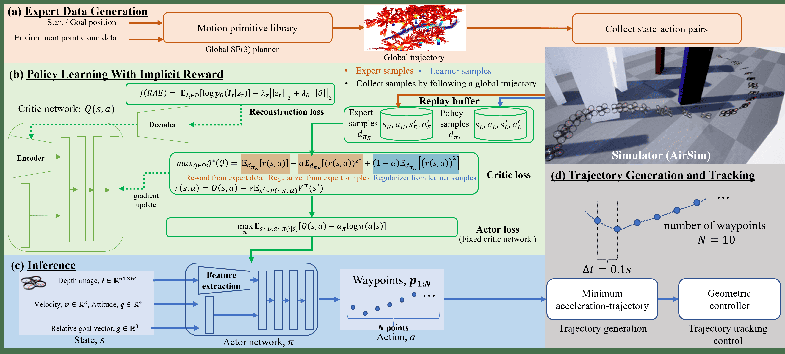
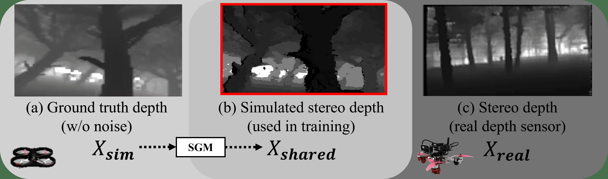
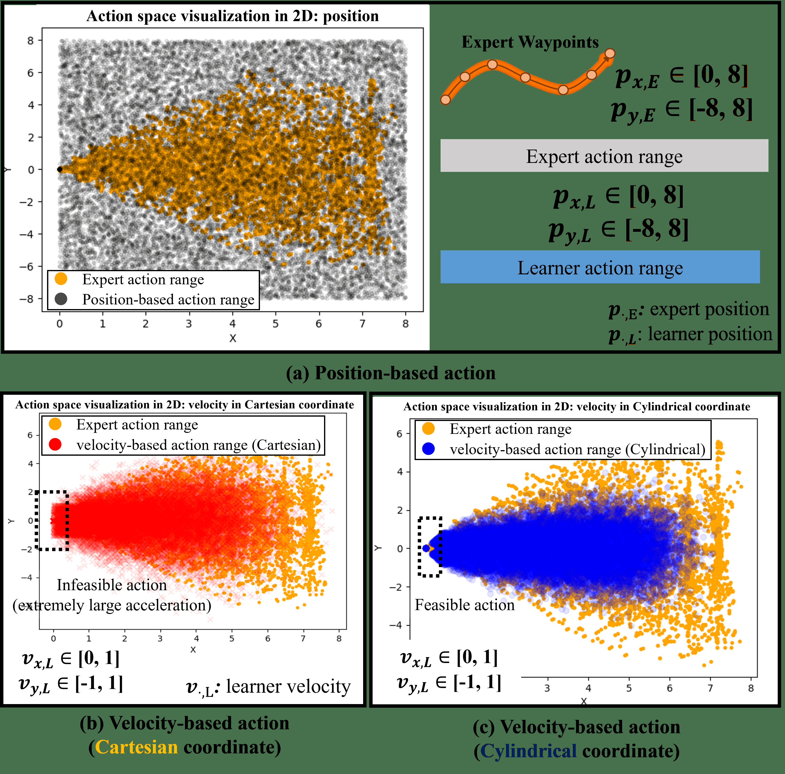
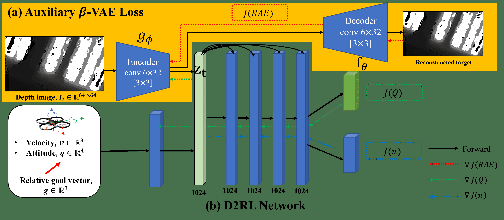
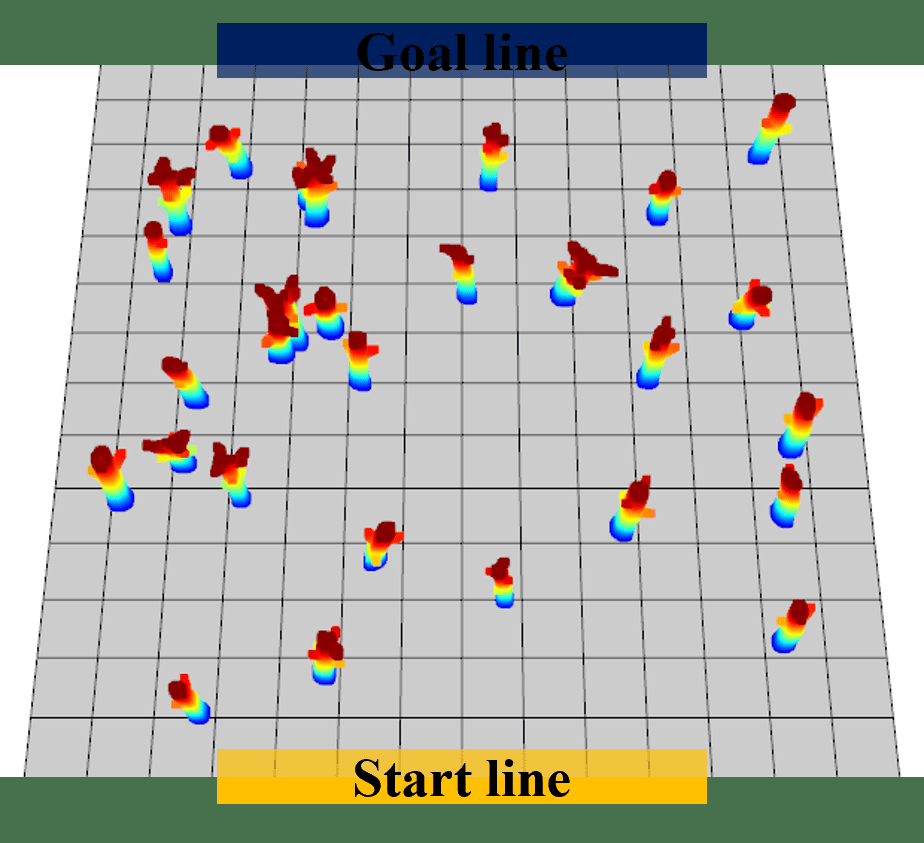
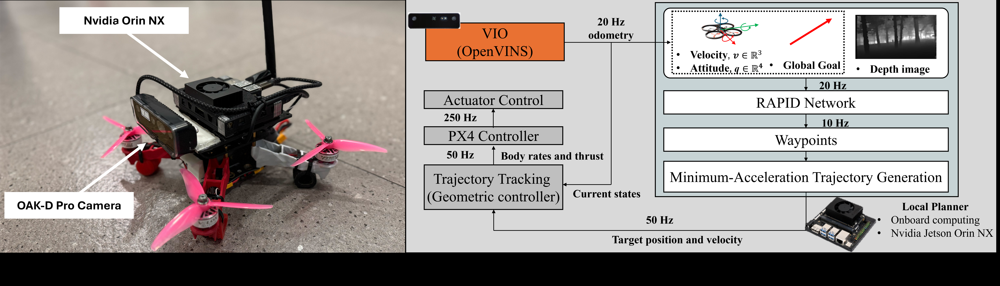
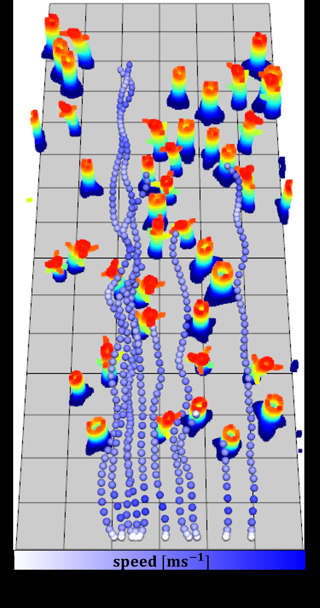

# RAPID：基于逆强化学习的鲁棒敏捷视觉无人机规划

> **原文标题**：09_RAPID_Robust_and_Agile_Planner
> **作者**：Minwoo Kim、Geunsik Bae、Jinwoo Lee、Woojae Shin、Changseung Kim、Myong-Yol Choi、Heejung Shin、Hyondong Oh
> **发表信息**：Robotics: Science and Systems（RSS）2025；arXiv:2502.02054v2
> **原文 PDF**：[09_RAPID_Robust_and_Agile_Planner.pdf](../09_RAPID_Robust_and_Agile_Planner.pdf) ｜ **对应中文详解**：[09_RAPID逆强化学习视觉导航.md](../中文详解/09_RAPID逆强化学习视觉导航.md)

## 原文第 1 页翻译

发表于 Robotics: Science and Systems（RSS）2025 会议论文集。

### RAPID：基于逆强化学习的鲁棒敏捷视觉无人机规划器

Minwoo Kim∗,†,1, Geunsik Bae∗,1, Jinwoo Lee1, Woojae Shin1, Changseung Kim1, Myong-Yol Choi1, Heejung Shin1, and Hyondong Oh††,1

**摘要**——本文提出一种面向复杂环境敏捷飞行的学习型视觉规划器。该规划器能够在毫秒级生成无碰撞航点，使无人机不必分别建立感知、建图和规划模块，也能在复杂环境中进行敏捷机动。行为克隆（BC）依赖专家示范，容易产生逐步累积的误差；强化学习（RL）则面临奖励函数难以设计和样本利用率低的问题。

为解决这些问题，本文提出用于高速视觉导航的逆强化学习（IRL）框架。该框架从专家行为中学习隐含奖励，在保留强化学习策略鲁棒性的同时，减少与仿真环境交互所需的次数，并改善对高维视觉信息的处理能力。作者采用基于运动基元的路径规划器，利用包含完整地图信息的专家数据，在窄缝、立方体、球体和树木等多种环境中采集示范。系统结合专家数据和学习者与仿真环境交互产生的数据，在多种状态下学习奖励函数和飞行策略。

该方法只在仿真环境中训练，但不需要额外训练或调参即可直接应用于真实环境。仿真和真实飞行实验覆盖森林及多种城市结构，真实飞行平均速度达到 7 m/s，最高速度达到 8.8 m/s。据作者所知，这是首次将逆强化学习框架成功用于无人机高速视觉导航的工作。实验视频见 https://youtu.be/ZfV6ij0qZMI。

## 原文第 2 页翻译

视觉逆强化学习仍面临两个困难。生成对抗模仿学习可能出现模式坍塌，吸收状态处理不当还会产生有偏奖励；同时，视觉输入维度高、动作空间连续，系统必须同时学习视觉特征、奖励和飞行策略。真实部署时，图像噪声以及无人机动力学与仿真之间的不一致，会进一步扩大仿真到现实的差距。因此，训练阶段需要考虑视觉噪声和控制跟踪误差。

本文提出 RAPID，即 Robust and Agile Planner using Inverse reinforcement learning for Vision-Based Drone Navigation。主要贡献包括：建立基于逆软 Q 学习的高速视觉导航框架，通过适合高速飞行的吸收状态处理，在不手工设计奖励函数的情况下实现稳定学习；引入辅助自编码器损失，降低高维视觉输入带来的状态复杂度；训练时考虑控制器跟踪误差，缩小仿真与现实的差距，使生成轨迹能够被真实飞行硬件准确跟踪，并在自然和城市环境中完成高速飞行验证。

### II. 相关工作

#### A. 传统方法

传统视觉导航将感知、建图、规划和控制划分为独立模块[17,18]。系统把深度图转换为三维点云，再形成占据栅格图或欧氏符号距离场（ESDF）；随后生成无碰撞轨迹并由闭环控制执行[19,20]。这种方法直观、易解释，但栅格分辨率会带来离散误差，高速机动时姿态估计误差还会降低地图精度，串行模块也会积累延迟。

#### B. 模仿学习

学习方法可以直接根据原始图像生成轨迹或控制指令，减少对显式感知、建图和规划的依赖[2,21–23]。行为克隆实现简单且样本利用率高，但需要高质量数据；一旦偏离训练分布，误差会连续积累。DAgger 通过对未见状态补采专家数据缓解这一问题，但成本较高，实时环境中也未必有能够及时标注的专家。

#### C. 强化学习与逆强化学习

强化学习通过环境交互和奖励最大化提高策略鲁棒性，但直接使用原始视觉信息时收敛慢、数据需求大，奖励设计也很困难。逆强化学习从专家样本中寻找合适的奖励函数，适合奖励难以手工设计的任务。无人机还需要三维空间感知以及俯仰、横滚和偏航控制，高速飞行中的视觉噪声、风扰、动力学差异和机载计算限制，使这一问题更加复杂。

## 原文第 3 页翻译

### III. 方法

RAPID 是一种基于逆强化学习的视觉规划器，以深度图和无人机状态为输入，输出一组航点；航点转换为连续轨迹后，由跟踪控制器执行。视觉导航被建模为无限时域马尔可夫决策过程（MDP）：

$$
(s,a,p(s_0),s',p(s',s|a),r(s,a),\gamma),
$$

其中 $s$ 为状态，$a$ 为动作，$p(s_0)$ 为初始状态分布，$s'$ 为下一状态，$p(s',s|a)$ 为状态转移概率，$r(s,a)$ 为奖励，$\gamma\in[0,1]$ 为折扣因子。专家策略和学习者策略分别产生数据分布 $d^{\pi_E}$ 与 $d^\pi$。

### A. 状态与动作

策略状态定义为：

$$
s_t=[I_t,v_t,q_t,g_t],
$$

其中 $I\in\mathbb{R}^{64\times64}$ 为深度图，$v\in\mathbb{R}^3$ 为速度，$q\in\mathbb{R}^4$ 为姿态四元数，$g\in\mathbb{R}^3$ 为相对目标向量。为缩小仿真到现实的差距，作者用半全局匹配（SGM[38]）由仿真双目图像生成类似真实传感器的深度图，并使用 $64\times64$ 的低分辨率输入降低过拟合。

## 原文第 4 页翻译

动作由前方 $N$ 个航点组成，相邻航点时间间隔为 $T$。每个航点以相对距离和相对角度表示：

$$
a_t^{raw}=\{(\Delta r_1,\Delta\psi_1),\ldots,(\Delta r_N,\Delta\psi_N)\}。
$$

令 $\theta_0=\psi_t$ 为当前航向，第 $i$ 个航点的累计航向为：

$$
\theta_i=\theta_{i-1}+\Delta\psi_i,\quad i=1,2,\ldots,N。
$$

笛卡尔坐标中的航点递推为：

$$
p_i=p_{i-1}+\Delta r_i\begin{bmatrix}\cos\theta_i\\\sin\theta_i\end{bmatrix},\quad p_0=\begin{bmatrix}x_t\\y_t\end{bmatrix}。
$$

最终动作 $a_t=\{p_1,p_2,\ldots,p_N\}$。本文取 $N=10$，固定时间间隔 $T=0.1$ s。

**图 1**：所提出逆软 Q 模仿学习方法的学习框架，包括（a）专家数据生成；（b）带隐式奖励的策略学习；（c）推理；（d）轨迹生成与跟踪。

**图 2**：仿真和真实环境中的深度图：（a）真值深度图；（b）仿真的双目深度图；（c）真实深度传感器的双目深度图。仿真双目深度图通过立体视觉算法生成，以反映真实传感器噪声。

## 原文第 5 页翻译

笛卡尔位置动作能够覆盖专家动作范围，但会显著扩大搜索空间；笛卡尔速度动作虽能缩小搜索空间，训练初期仍可能产生加速度过大的不可行轨迹。柱坐标动作范围更接近专家行为，可以减少初始不可行动作并稳定训练。

**图 3**：不同坐标系下的动作空间表示：（a）基于位置的动作空间；（b）笛卡尔坐标系下基于速度的动作空间；（c）柱坐标系下基于速度的动作空间。神经网络生成的动作称为学习者动作，以区别于专家动作。

### B. 基于图像重建的高效训练

视觉强化学习需要从高维输入中提取有意义的特征，通常样本利用率较低、训练时间较长。本文使用 β-变分自编码器（β-VAE[41]）学习紧凑的状态表示。卷积编码器 $g_\phi$ 将图像 $I_t$ 映射为潜向量 $z_t$，反卷积解码器 $f_\theta$ 再将其重建为原始图像。目标函数为：

$$
J^{(RAE)}=\mathbb{E}_{I_t\sim D}[\log p_\theta(I_t|z_t)+\lambda_z\|z_t\|^2+\lambda_\theta\|\theta\|^2]。
$$

演员和评论家网络共享卷积编码器，但演员梯度不更新编码器，使视觉表示主要由评论家学习信号塑造。目标 Q 网络中的编码器采用较快的 Polyak 平均率；高速飞行中作者使用 $\rho_{enc}=0.01$、$\rho_Q=0.005$。

## 原文第 6 页翻译

演员与评论家网络采用 D2RL 深层稠密结构，在后续隐藏层中保留重要输入信息。全连接层使用正交初始化，卷积层和反卷积层使用 delta-orthogonal 初始化。

### C. 使用隐式奖励学习策略

本文使用最小二乘逆 Q 学习（LS-IQ[16]），通过隐式奖励直接学习 Q 函数。逆 Bellman 算子为：

$$
(T^\pi Q)(s,a)=Q(s,a)-\gamma\mathbb{E}_{s'\sim P(\cdot|s,a)}V^\pi(s'),
$$

其中 $V^\pi(s)=\mathbb{E}_{a\sim\pi(\cdot|s)}[Q(s,a)-\log\pi(a|s)]$。因此 $r(s,a)=T^\pi Q$，不需要单独训练奖励网络。固定 Q 函数时，软 Q 学习的最优策略为：

$$
\pi_Q(a|s)=\frac{1}{Z_s}\exp Q(s,a)。
$$

LS-IQ 将专家数据和学习者数据混合用于正则化，混合系数 $\alpha=0.5$：

$$
\psi(r)=\alpha\mathbb{E}_{d^{\pi_E}}[r(s,a)^2]+(1-\alpha)\mathbb{E}_{d^{\pi_L}}[r(s,a)^2]。
$$

## 原文第 7 页翻译

到达目标或发生碰撞后，训练回合进入吸收状态。非终止状态采用自举，吸收状态直接计算价值：$V(s_A)=r_A/(1-\gamma)$。本文取专家终止奖励上界 $r_{max}=0$、学习者失败终止奖励下界 $r_{min}=-2$，避免无人机贴近障碍物到达终点时得到过高奖励。

策略使用 Soft Actor-Critic（SAC[47]）更新：

$$
\max_\pi\mathbb{E}_{s\sim D,a\sim\pi(\cdot|s)}[Q(s,a)-\alpha_\pi\log\pi(a|s)]。
$$

网络输出的离散航点被转换为连续、可微轨迹。三维轨迹为 $\tau(t)=[\tau_x(t),\tau_y(t),\tau_z(t)]^T$，每个坐标轴采用分段多项式表示，在中间航点保持导数连续，第一段满足当前位置、速度和加速度。通过最小化加速度平方积分生成平滑轨迹：

$$
\min J=\int_{t_0}^{t_N}\|\ddot\tau(t)\|^2dt。
$$

本文使用四次多项式，在中间航点保持速度连续，并在终点令速度和加速度为零。MPC 能显式考虑动力学约束但计算量较大，因此本文采用计算量更低的几何控制器。

**图 4**：自编码器辅助学习和跳跃连接网络。（a）自编码器辅助视觉表示学习；（b）D2RL 跳跃连接结构。

## 原文第 8 页翻译

### IV. 仿真

#### A. 数据采集与训练

训练环境中生成树、锥体、球体、方块和墙等障碍物。作者使用 AirSim 进行建图、训练和测试。专家规划器[50]需要预先知道地图，先根据点云建立全局轨迹，再结合障碍物代价采样局部轨迹。全局轨迹是从起点到目标点的完整路径，局部轨迹是其中经过障碍代价细化的短段。

专家规划器从随机起点和目标点生成高度固定为 2 m 的全局轨迹。平均速度为 7 m/s，最大速度和最大加速度分别为 8 m/s 和 10 m/s²；滚转角和偏航角加入最高 0.3 弧度的扰动。在 600 张训练地图中生成 1,800 条全局轨迹，再以 0.1 s 间隔采样约 100,000 条局部状态—动作样本。

训练时随机改变起点、控制器增益和图像顺序；无人机碰撞或到达目标时结束回合，每 5 个回合更换地图。

#### B. 仿真结果设置

比较方法包括行为克隆（BC）、LS-IQ、基于 DAgger 的 AGILE，以及基于占据地图的 EGO。EGO 设置 EGO-LOW（最高 4 m/s）和 EGO-HIGH（最高 7 m/s）。

**图 5**：仿真训练环境。锥体、方块、树和墙等障碍物以随机位置和随机尺寸布置。

## 原文第 9 页翻译

测试环境改变树木密度、障碍物尺寸和形状。树木随机倾斜和转向，地图为 $50\text{ m}\times50\text{ m}$；起点位于中心线左右 20 m 范围内，目标在起点正前方 60 m，每种方法在每张地图上测试 10 次。

**图 6**：不同树木密度的测试环境。树木密度表示单位面积内的树木数量，网格大小为 $5\text{ m}\times5\text{ m}$。

**表 I：不同树木密度下的评价结果（10 次试验）**

| 方法 | 1/80 任务进度 | 1/50 任务进度 | 1/30 任务进度 | 1/25 任务进度 | 平均速度 |
|---|---:|---:|---:|---:|---:|
| EGO-LOW | 90.62% [8/10] | 88.83% [7/10] | 85.39% [7/10] | 40.82% [0/10] | 3.24 m/s |
| EGO-HIGH | 75.40% [5/10] | 52.56% [0/10] | 52.76% [1/10] | 34.18% [0/10] | 5.28 m/s |
| BC | 48.36% [4/10] | 43.38% [0/10] | 37.19% [0/10] | 24.27% [0/10] | 6.30 m/s |
| LS-IQ | 58.26% [5/10] | 45.85% [1/10] | 32.88% [0/10] | 31.86% [0/10] | 6.58 m/s |
| AGILE | 82.12% [6/10] | 65.25% [5/10] | 52.20% [2/10] | 52.16% [2/10] | 5.53 m/s |
| RAPID（本文） | 94.44% [9/10] | 87.00% [8/10] | 85.04% [7/10] | 88.69% [6/10] | 7.46 m/s |

EGO-LOW 在低速、低密度环境中任务进度和成功率较高，但高速版本因规划延迟和累积位姿误差而下降。BC 受过拟合和误差累积影响，起点或环境偏离训练分布后容易进入无法恢复的状态。LS-IQ 比 BC 更好，但在高密度环境中更偏向高速，避碰不足。AGILE 在低密度环境中表现较强，密度和复杂度增加后，大幅方向调整会提高碰撞概率，也没有充分考虑真实控制器的跟踪误差。

RAPID 在全部测试条件下取得最好的避碰表现。它通过在线交互增加学习者样本，减轻状态分布变化，并把控制器跟踪误差纳入学习，因此在复杂条件下仍能保持较高速度和可靠性。

## 原文第 10 页翻译

### V. 实验

#### A. 硬件配置

作者按照竞速无人机思路设计轻量化平台。实验无人机使用 Velox 2550 kV 电机、Gemfan Hurricane 51466 螺旋桨和 Cyclone 45A BLHeli S 电子调速器，整机质量 1.1 kg，推重比 3.57。机载计算机为 NVIDIA Jetson Orin NX。RAPID 的参数量虽然更多，但浮点运算量约为 AGILE 的三分之一，GPU 推理时间为 10.24 ms，AGILE 为 63.89 ms。

系统使用 Oak-D Pro 双目深度相机，双目图像视场为 80°×55°，双目深度视场为 72°×50°，采集频率均为 20 Hz。双目图像用于视觉惯性状态估计，双目深度图作为神经网络输入。

**图 7**：实验无人机系统概览。

系统由 VIO、局部规划器和控制器组成。OpenVINS[52] 融合 20 Hz 图像和 200 Hz IMU，输出 20 Hz 局部里程计并接入 PX4。RAPID 以 10 Hz 根据深度图、速度、姿态和目标方向生成航点；航点经最小加速度轨迹生成器转换为连续轨迹，系统以 50 Hz 生成位置和速度指令，由几何控制器计算机体角速度和推力，PX4 以 250 Hz 控制执行机构。

## 原文第 11 页翻译

#### B. 自然环境

真实实验包括长森林和短森林。长森林中树木间距约 5 m，目标点距离起点 60 m，最高速度达到 7.5 m/s。短森林中的树木弯曲、间距约 2 m，目标点距离起点 30 m；航点跟踪时间由 1 s 缩短为 0.9 s，无碰撞情况下达到 8.8 m/s。

专家数据以 7 m/s 匀速采集，但 RAPID 学会了加速和减速，有时在障碍物前主动降低速度再执行规避。这表明策略学习到的不只是专家动作，还包含对避碰过程的判断。

#### C. 城市环境

城市实验包括大型块状障碍和柱状障碍。由于砖石地面碰撞风险更高，平均速度控制在约 6 m/s。大型块状环境中最高速度为 6.2 m/s；柱状环境中先减速绕行、通过后再加速，最高速度为 6.5 m/s。尽管模型只在仿真环境训练，在自然和城市环境中的性能下降较小。

**图 8**：自然环境和城市环境中的飞行实验结果。（a1–a2）和（b1–b2）为各场景的实验设置；（a3–a4）和（b3–b4）给出轨迹、地图以及机载灰度图和深度图；（a5）和（b5）给出对应的速度曲线。

## 原文第 12 页翻译

### VI. 局限性与讨论

#### A. 缺少时间信息

RAPID 根据单张深度图和当前状态生成轨迹，没有保留此前已经避开的障碍物信息。遇到大墙等宽障碍物时，错误的初始绕行方向可能使无人机陷入局部极小。一个可行方向是输入连续多帧图像，并使用 LSTM 等记忆结构获得时间信息，但这会增加推理延迟。

#### B. 探索阶段可能生成不可行轨迹

高速生成无碰撞轨迹的关键难点，是保证探索阶段产生物理上可执行的轨迹。早期大量探索会产生不可执行动作，使 Q 函数难以收敛；过度限制探索又会使策略停留在次优解。可以在轨迹生成中加入速度和加速度约束，或使用 MPC 进行可行轨迹跟踪，但实时优化会增加强化学习训练成本。柱坐标动作空间能够减少部分不可行动作，但不是根本解决方案；约束强化学习和预热策略仍需在演员和评论家网络之间进行平衡。

## 原文第 13 页翻译

#### C. 专家数据集的回合不完整

SE(3) 规划器能够生成平滑轨迹。为获得不同的避障轨迹，作者在已有轨迹中加入障碍物代价并随机采样，但这种采样可能打断原有轨迹，使状态—动作数据不能从初始状态连续连接到终止状态。逆强化学习要求完整回合，因此策略遇到远离专家轨迹的状态时难以继续改进。同一状态还可能存在多条等价避障路径，因而会出现多模态问题。一个解决方向是采集分布外状态之后的后续状态，重新组织为完整回合。

#### D. 仿真到现实差距尚未完全消除

作者使用 SGM 模拟真实双目深度相机输出，并在训练中对几何控制器增益进行域随机化。这些措施提高了一定的鲁棒性，但训练无人机和实际无人机在尺寸、动力学和控制跟踪性能上的差异，仍会引入额外差距。更根本的办法是使用尺寸和动力学特性不同的多种无人机同时训练。

## 原文第 14 页翻译

### VII. 结论与未来工作

本文提出 RAPID，一种利用逆强化学习实现高速视觉导航的鲁棒敏捷无人机规划器。RAPID 将视觉输入和规划结合起来，实时生成无碰撞航点，并在仿真和真实环境中取得较好结果。通过逆软 Q 学习、吸收状态处理和自编码器辅助损失，RAPID 改善了样本利用率和高维视觉输入的处理效果。训练策略在没有额外真实环境训练或调参的情况下，在自然和城市环境中取得平均 7 m/s、最高 8.8 m/s 的飞行速度。

该方法仍有三方面限制：缺少时间信息使其难以处理大型障碍物；探索阶段仍可能生成不可行轨迹；域随机化和立体视觉虽然部分缓解了仿真到现实差距，但还需要多种硬件条件下的训练。后续工作将研究带记忆的网络、约束强化学习以及更完善的数据采集方法。

致谢、资助信息和作者信息按原文保留。

## 原文第 15 页翻译

参考文献按原文保留，包括作者、论文题名、期刊或会议名称、卷期、页码和年份。参考文献中的英文不属于普通正文翻译范围。

文献 [17]–[59]：Jesús Tordesillas and Jonathan P. How, *FASTER: Fast and Safe Trajectory Planner for Navigation in Unknown Environments*；Boyu Zhou et al., *Raptor: Robust and Perception-Aware Trajectory Replanning for Quadrotor Fast Flight*；Taeyoung Lee et al., *Geometric Tracking Control of a Quadrotor UAV on SE(3)*；Davide Falanga et al., *PAMPC: Perception-Aware Model Predictive Control for Quadrotors*；Dhiraj Gandhi et al., *Learning to Fly by Crashing*；Antonio Loquercio et al., *Dronet: Learning to Fly by Driving*；Huan Nguyen et al., *Uncertainty-Aware Visually-Attentive Navigation Using Deep Neural Networks*；Junjie Lu et al., *LPNet: A Reaction-Based Local Planner for Autonomous Collision Avoidance Using Imitation Learning*；Junjie Lu et al., *You Only Plan Once: A Learning-Based One-Stage Planner With Guidance Learning*；Fan Yang, *iPlanner: Imperative Path Planning*；Jiaxu Xing et al., *Bootstrapping Reinforcement Learning With Imitation for Vision-Based Agile Flight*；Yunlong Song et al., *Learning Perception-Aware Agile Flight in Cluttered Environments*；Mihir Kulkarni and Kostas Alexis, *Reinforcement Learning for Collision-Free Flight Exploiting Deep Collision Encoding*；Viktor Makoviychuk et al., *Isaac Gym: High Performance GPU-Based Physics Simulation for Robot Learning*；Yunlong Song et al., *Flightmare: A Flexible Quadrotor Simulator*；Mihir Kulkarni et al., *Aerial Gym–Isaac Gym Simulator for Aerial Robots*；Yunlong Song et al., *Reaching the Limit in Autonomous Racing: Optimal Control Versus Reinforcement Learning*；Ismail Geles et al., *Demonstrating Agile Flight From Pixels Without State Estimation*；Keuntaek Lee et al., *Approximate Inverse Reinforcement Learning From Vision-Based Imitation Learning*；John Liu and Anna Smith, *Improved Trajectory Planning for Autonomous Drones*；Saurabh Arora and Prashant Doshi, *A Survey of Inverse Reinforcement Learning: Challenges, Methods and Progress*；Heiko Hirschmuller, *Stereo Processing by Semiglobal Matching and Mutual Information*；Yuang Zhang et al., *Back to Newton’s Laws: Learning Vision-Based Agile Flight via Differentiable Physics*；Anssi Kanervisto et al., *Action Space Shaping in Deep Reinforcement Learning*；Diederik P. Kingma and Max Welling, *Auto-Encoding Variational Bayes*；Denis Yarats et al., *Improving Sample Efficiency in Model-Free Reinforcement Learning From Images*；Samarth Sinha et al., *D2RL: Deep Dense Architectures in Reinforcement Learning*；Xavier Glorot and Yoshua Bengio, *Understanding the Difficulty of Training Deep Feedforward Neural Networks*；Andrew M. Saxe et al., *Exact Solutions to the Nonlinear Dynamics of Learning in Deep Linear Neural Networks*；Lechao Xiao et al., *Dynamical Isometry and a Mean Field Theory of CNNs*；Tuomas Haarnoja et al., *Soft Actor-Critic*；Charles Richter et al., *Polynomial Trajectory Planning for Aggressive Quadrotor Flight in Dense Indoor Environments*；Shital Shah et al., *AirSim: High-Fidelity Visual and Physical Simulation for Autonomous Vehicles*；Sikang Liu et al., *Search-based Motion Planning for Quadrotors using Linear Quadratic Minimum Time Control*；Andrew Howard et al., *Searching for MobileNetV3*；Patrick Geneva et al., *OpenVINS: A Research Platform for Visual-Inertial Estimation*；Patrick Geneva et al., *2019 FPV Drone Racing VIO Dataset*；Daniel Mellinger and Vijay Kumar, *Minimum Snap Trajectory Generation and Control for Quadrotors*；Yunho Kim et al., *Not Only Rewards but Also Constraints*；Jesus Tordesillas and Jonathan P. How, *Deep-PANTHER*；I Made Aswin Nahrendra et al., *DreamWaQ*；Jimmy Lei Ba et al., *Layer Normalization*；Boyu Zhou et al., *EGO-Planner*。

## 原文第 16 页翻译

### VIII. 附录

#### A. 含终止状态处理的完整 Q 函数目标

完整目标函数使用非终止状态的自举项和终止状态的解析项。令 $\nu=1$ 表示下一状态为终止状态，$\nu=0$ 表示非终止状态，则：

$$
r(s,a)=Q(s,a)-\gamma\mathbb{E}_{s'\sim P(\cdot|s,a)}V^\pi(s')。
$$

本文取 $r_{max}=0$、$r_{min}=-2$；若样本来自专家分布，吸收状态奖励取 $r_{max}$，否则取 $r_{min}$。

#### B. 演员和评论家网络

本文使用带单个评论家网络的 SAC 处理奖励歧义，而不是标准的双 Q 学习。演员和评论家网络均采用四层 MLP、LeakyReLU 激活函数和 1,024 维隐藏层，并结合 D2RL 结构。

#### C. 编码器、解码器和初始化

卷积层使用 $3\times3$ 卷积核和 32 个通道，除第一层步长为 2 外，其余卷积层步长均为 1；卷积输出经过全连接层得到 128 维嵌入。演员和评论家使用独立编码器，但卷积权重共享，只有评论家优化器更新共享权重。解码器由全连接层和四个转置卷积层组成，最后一层输出像素表示。全连接层使用正交权重和零偏置初始化，卷积层使用 delta-orthogonal 初始化。

#### D. 训练超参数

| 参数 | 数值 |
|---|---:|
| 卷积层数 | 4 |
| MLP 节点数 | 1,024 |
| 回放池容量 | 600,000 |
| 批量大小 | 128 |
| 编码器嵌入维度 | 128 |
| 折扣因子 $\gamma$ | 0.99 |
| 优化器 | Adam |
| 评论家 Q 函数软更新率 $\rho_Q$ | 0.005 |
| 评论家编码器软更新率 $\rho_{enc}$ | 0.01 |
| 评论家学习率 | $3\times10^{-4}$ |
| 自编码器学习率 | $3\times10^{-4}$ |
| 演员学习率 | $3\times10^{-5}$ |

**图 9**：树木密度为 1/25 的地图中的飞行轨迹和对应速度。为便于展示，图中省略树枝。EGO-planner 因规划延迟或失败在飞行中途停滞；AGILE 和 RAPID 能够适应新场景，RAPID 在开阔区域提高速度，在障碍物密集区域降低速度。
