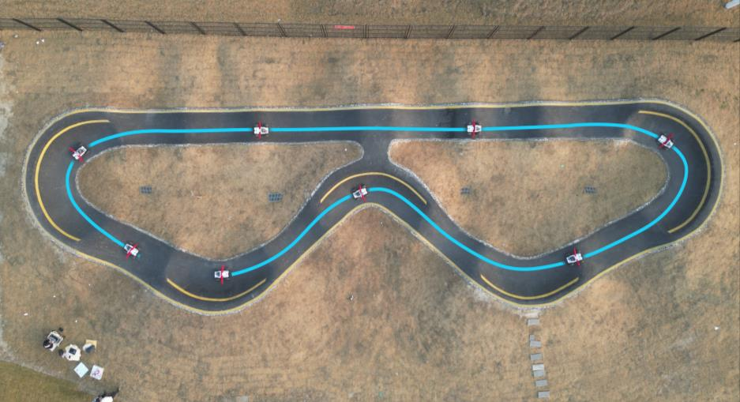
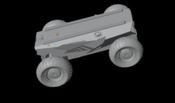
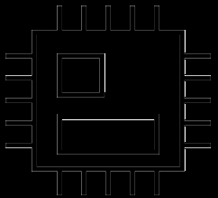
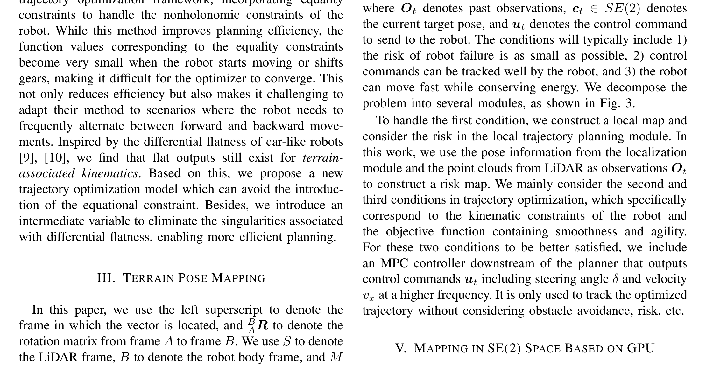
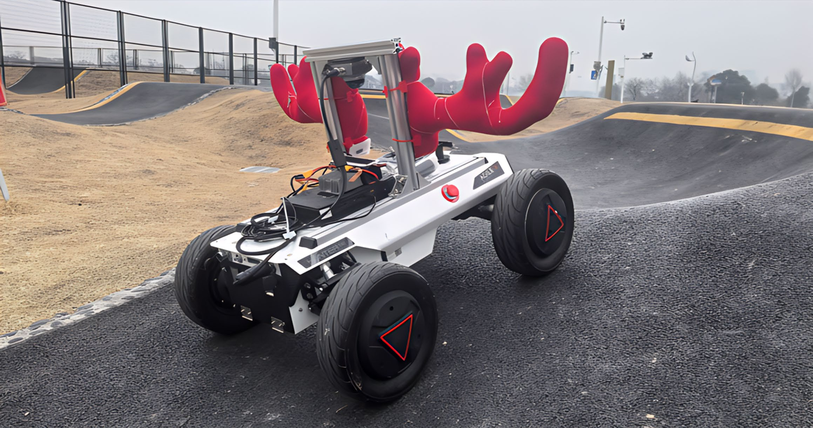
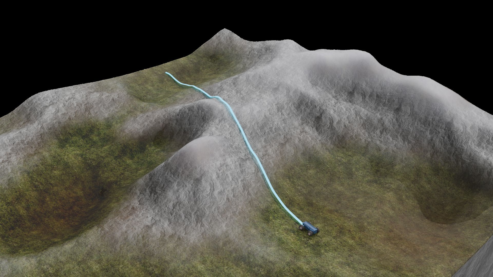

# SEB-Naver崎岖地形局部导航（11_SEB-Naver）：完整忠实学术翻译

> **原文标题**：11_SEB-Naver  
> **作者**：Xiaoying Li、Long Xu、Xiaolin Huang、Donglai Xue、Zhihao Zhang、Zhichao Han、Chao Xu、Yanjun Cao、Fei Gao  
> **发表信息**：arXiv:2503.02412v2，2025-03-05；论文提供开源实现  
> **原文 PDF**：[11_SEB-Naver.pdf](../11_SEB-Naver.pdf) ｜ **对应中文详解**：[11_SEB-Naver崎岖地形局部导航.md](../中文详解/11_SEB-Naver崎岖地形局部导航.md)  

---

## 原文第 1 页核心内容与翻译

SEB-Naver: A SE(2)-based Local Navigation
Framework for Car-like Robots on Uneven Terrain
Xiaoying Li†2, Long Xu†1,2, Xiaolin Huang†2, Donglai Xue2, Zhihao Zhang2,
Zhichao Han1,2, Chao Xu1,2, Yanjun Cao2, and Fei Gao1,2
B
D
C
A
E1
E2
E3
1.1
0.0
Height [m]

**图 1**：图 1：SEB-Naver 在草地（A）、农田（B）、森林（C）、地下停车场（D）和泵道（E）中的运行情况。

摘要——与平坦地形相比，类车机器人在崎岖地形上的自主导航面临独特挑战，尤其是在可通行性评估以及用于运动规划的地形相关运动学建模方面。本文提出 SEB-Naver，一种基于 SE(2) 的局部导航框架，用于应对上述问题。首先，提出一种适用于 SE(2) 栅格的高效可通行性评估方法，利用图形处理器并行计算，实现局部地图的实时更新和维护。其次，受微分平坦性启发，提出一种基于优化的轨迹规划方法，将地形相关运动学模型纳入规划过程，从而显著提高规划效率和轨迹质量。最后，将上述模块统一到 SEB-Naver 中，实现实时地形评估与轨迹优化。大量仿真和实地实验验证了该方法的有效性和效率。代码地址为 https://github.com/ZJU-FAST-Lab/seb_naver。
I. 引言

与平坦地形相比，类车机器人在不平整地形上自主行驶时，需要额外处理两类问题：一是评估地形是否能够安全通过，二是把地形对运动的影响纳入运动模型。前者是自主导航框架中的附加模块，用于根据地形和机器人状态估计风险；后者必须进入轨迹生成过程，才能保证机器人能够较好地跟踪规划轨迹。

传统的可通行性评估方法 [1]–[4] 主要关注坡度、曲率等地形几何信息。为了满足局部导航的实时更新要求，这些方法通常把二维空间离散成以机器人为中心的栅格，因此容易得到过于保守或过于激进的结果。如图 2(a) 所示，具有不同横滚角和俯仰角的机器人姿态可能被投影到二维空间中的同一栅格；但机器人对侧向倾斜和后仰的容忍程度并不相同，对应风险也应不同。若直接在 SE(3) 状态空间中进行更细致的评估，计算量会明显增加 [5]，而高维空间也使离散栅格难以满足实时更新要求。

作者此前提出地形姿态映射 [6]，用来描述地形对机器人的影响，使机器人能够由 SE(2) 状态恢复相应的 SE(3) 姿态。不过，SE(2) 栅格本身仍然很大，单纯增加栅格计算量不能满足实时要求。本文借鉴并行计算思想，利用 GPU 并行评估 SE(2) 栅格的可通行性，实现局部地图的实时更新和维护。

**图 2**：图 2(b) 表明，由于重力作用，机器人要获得相同的纵向加速度时，所需油门大小会随坡度变化。

---

## 原文第 2 页核心内容与翻译

𝒔𝒔𝑟𝑟= 𝑥𝑥, 𝑦𝑦, 𝜃𝜃1
(b) Terrain-associated kinematics
𝒚𝒚𝑏𝑏
𝒙𝒙𝑏𝑏
𝒛𝒛𝑏𝑏
Risk 𝒔𝒔𝑟𝑟= 0.25
Risk 𝒔𝒔𝑟𝑟= 0.75
𝒔𝒔𝑟𝑟= 𝑥𝑥, 𝑦𝑦, 𝜃𝜃2
𝒚𝒚𝑏𝑏
𝒛𝒛𝑏𝑏
(a) Traversability

**图 2**：图 2(a) 表明，具有不同横滚角和俯仰角的机器人姿态可能被投影到二维空间的同一栅格；图 2(b) 表明，由于重力作用，机器人要获得相同的纵向加速度时，所需油门大小会随坡度变化。

---

## 原文第 3 页核心内容与翻译

### 本页正文补译

近年来，研究人员把二维规划方法扩展到不平整地形上的类车机器人。Krusi 等人直接使用 LiDAR 获得的无序三维点云进行轨迹规划，并在规划过程中同时评估地形，但计算量使其难以满足实时要求。Han 等人提出二维动态采样方法，将实时高程图与基于物理的约束结合，并用 MPPI 和底层控制器支持复杂地形上的高速运动；不过，复杂环境中的密集采样会降低效率。Jian 等人把平面拟合、Informed-RRT*、高斯过程回归和 NMPC 组合起来，但随着规划时域增加，NMPC 的复杂度迅速上升。Xu 等人用多项式轨迹优化并通过等式约束处理非完整约束，提升了规划效率，但机器人起步或换挡时约束函数值很小，优化器不易收敛，也不适合频繁前后切换。本文借鉴类车机器人的微分平坦性，发现地形相关运动学仍存在平坦输出，据此可以不再引入等式约束；同时增加中间变量，消除微分平坦表示中的奇异点，从而提高规划效率。

### 本节正文补译

本文用左上标表示向量所在的坐标系，用 ${}^{B}R_A$ 表示从坐标系 A 到坐标系 B 的旋转矩阵。S、B、M 分别表示 LiDAR、机器人机体和地图坐标系；未特别标注时，默认使用世界坐标系 W。平坦地形上，类车机器人状态可以用 $s_r=[x,y,\theta]^T\in SE(2)$ 表示。当地形不平整时，由于高度变化，需要使用包含位置 $p_B=[x,y,z]^T$ 和姿态 ${}^{B}R=[x_b,y_b,z_b]\in SO(3)$ 的 SE(3) 状态。

作者此前提出地形姿态映射 $F:SE(2)\mapsto R\times S^2_+$，用来描述地形对机器人的影响。给定二维位置和航向角，该映射分别给出机器人高度和机体竖直方向；再利用 Z-X-Y 欧拉角关系，可以从 SE(2) 状态恢复机体位置、横向轴和前向轴。这样，虽然机器人实际处于三维不平整地形中，规划器仍可在较低维的 SE(2) 空间表达状态，而地形引起的高度和姿态变化由映射隐含表示。
本文用左上标表示向量所在的坐标系，用 ${}^{B}R_A$ 表示从坐标系 A 到坐标系 B 的旋转矩阵。S、B、M 分别表示 LiDAR、机器人机体和地图坐标系；未特别标注时默认使用世界坐标系 W。平坦地形上，类车机器人状态可表示为 $s_r=[x,y,\theta]^T\in SE(2)$。在不平整地形上，由于高度变化，需要用包含位置 $p_B=[x,y,z]^T\in R^3$ 和姿态 ${}^{B}R=[x_b,y_b,z_b]\in SO(3)$ 的 SE(3) 状态表示。

作者此前提出地形姿态映射 $F:SE(2)\mapsto R\times S^2_+$，其中 $S^2_+\triangleq\{x\in R^3\mid\|x\|_2=1, b_3^Tx>0\}$，$b_3=[0,0,1]^T$，用于描述地形对机器人的影响。令 $x_{yaw}=[\cos\theta,\sin\theta,0]^T$ 表示航向角方向，则映射可写成 $z=f_1(x,y,\theta)$ 和 $z_b=f_2(x,y,\theta)$。用 Z-X-Y 欧拉角表示机器人姿态，可得到：
pB = [x, y, z]T = [x, y, f1(x, y, θ)]T,
(1)
yb =
f 2(x, y, θ) × xyaw
∥f 2(x, y, θ) × xyaw∥,
(2)
xb = yb × f 2(x, y, θ).
(3)
由此，借助映射 $F$，即使在不平整地形上，也仍可用 SE(2) 中的元素描述机器人状态；映射 $F$ 隐含给出了该状态对应的地形高度和机器人姿态。

IV. SEB-Naver 框架概述

不平整地形上的类车机器人局部导航，可以表述为根据历史观测 $O_t$ 和当前目标位姿 $c_t\in SE(2)$，获得策略 $\pi\sim p(u_t\mid O_t,c_t)$，使机器人到达目标并满足以下要求：尽量降低失效风险，控制指令能够被机器人准确跟踪，同时保持较高速度并控制能耗。本文将问题分为多个模块，如图 3 所示。

为降低失效风险，系统利用定位模块提供的位姿和 LiDAR 点云建立局部风险地图，并在局部轨迹规划中使用该风险信息。轨迹优化主要处理机器人运动学约束，以及包含平滑性和机动性的目标函数。规划器后端设置高频 MPC 控制器，输出转向角 $\delta$ 和速度 $v_x$，只负责跟踪优化后的轨迹，不再重复处理避障和风险判断。

**图 3**：框架总览。LiDAR-惯性里程计（LIO）接收 IMU 和 LiDAR 点云并计算位姿；局部建图模块利用点云和位姿更新高程图，在 SE(2) 空间评估可通行性；风险图供局部规划器使用。规划器完成路径搜索和轨迹优化后输出 SE(2) 轨迹，再由 MPC 控制器生成发送给机器人的最终控制指令。

---

## 原文第 4 页核心内容与翻译

### 本页正文补译

对于不平整地形上的类车机器人，局部导航的目标是根据历史观测 $O_t$ 和当前目标位姿 $c_t\in SE(2)$ 生成控制策略 $\pi\sim p(u_t|O_t,c_t)$，使机器人到达目标，同时尽量降低失效风险、保证控制指令能够被跟踪，并兼顾速度与能耗。本文把问题拆成局部建图、可通行性评估、轨迹规划和控制几个模块。定位信息与 LiDAR 点云用于建立风险地图，轨迹优化负责处理机器人的运动学约束以及轨迹平滑性和机动性，后端 MPC 以较高频率输出转向角 $\delta$ 和速度 $v_x$，只负责跟踪优化轨迹，不再重复处理避障和风险判断。

SEB-Naver 的局部地图在 GPU 上维护。收到新的位姿和点云后，GPU 并行完成点云过滤、方差计算和射线投射，并清除因地图随机器人移动而移出范围的栅格；高程图随后通过卡尔曼滤波更新，空白区域可由经典方法或神经网络补全。对每个 SE(2) 状态，GPU 根据补全后的高程图并行计算可通行性，所得风险图传回 CPU，并生成用于避碰的有符号距离场（SDF）。

**图 4**：SE(2) 空间中的局部建图流程。

---

## 原文第 5 页核心内容与翻译

### 算法 1：可通行性与地形姿态映射评估

输入：高程图 M，状态 s_r∈SE(2)，椭圆参数 (e_x,e_y)，权重 w_r∈R^3，以及 κ_max、φ_xmax、φ_ymax。输出：Risk(s_r) 和 z_b(s_r)。算法先在机器人尺寸对应的椭圆区域内提取高程点，计算点集均值和协方差矩阵；协方差矩阵的最小特征向量给出地形竖直方向 z_b，相关曲率记为 κ_ter。若 κ_ter 超过 κ_max，直接返回风险 1。随后根据地形姿态映射求出机体轴 x_b、y_b，计算两轴与水平面的夹角 φ_x、φ_y；任一姿态角超过允许值时，同样返回风险 1。其余情况下，将 [κ_ter/κ_max, φ_x/φ_xmax, φ_y/φ_ymax]^T 与权重 w_r 加权，得到最终风险。

### B. 轨迹参数化

不平整地形上的运动学关系为：

$\dot p_B=v_x x_b$，

${}^B\dot R={}^BR\left\lfloor\frac{v_x\tan\delta}{L_w}z_b\right\rfloor$。（10）—（11）

其中 L_w 为轴距，符号 ⌊*⌋ 将向量写成反对称矩阵。传统非完整约束为 $\dot x(t)\sin\theta(t)-\dot y(t)\cos\theta(t)=0$。（12）当速度很低、机器人起步或换挡时，该约束的数值接近零，容易造成优化器数值不稳定。本文引入中间变量 s(t)。当平面速度不为零时，航向角可写成 $\theta(t)=\operatorname{arctan2}(\eta(t)\dot y(t),\eta(t)\dot x(t))$，并用 $\dot x(s)\dot s(t)\sin\theta(t)+\dot y(s)\dot s(t)\cos\theta(t)=0$ 表示同一约束。（13）再加入 $\dot x^2(s)+\dot y^2(s)>\delta_+$，就可以去掉原等式约束并避开 arctan2 在零速度处的奇异性。

每段轨迹采用五次分段多项式：$x_i(s)=c_{xi}^T\beta(s)$、$y_i(s)=c_{yi}^T\beta(s)$、$s_i(t)=c_{si}^T\beta(t)$。（14）—（16）其中 $\beta(t)=[1,t,t^2,t^3,t^4,t^5]^T$，相邻分段在四阶导数上连续。结合地形姿态映射，可由参数化轨迹计算速度、偏航角速度、转向角以及纵向和横向加速度，分别对应式（17）—（21）。

---

## 原文第 6 页核心内容与翻译

### B. 优化问题

本文将局部轨迹优化写成：

$\min_{c,e_m,T_f} f(c,e_m,T_f)=\int_0^{T_f}j(t)^Tj(t)dt+\rho_tT_f+\rho_r\int_0^{T_f}Risk^2(s_r(t))dt$。（22）

约束包括轨迹分段多项式的连续性与边界条件（23）—（24），$T_f>0$，路径变量满足 $\dot x^2(s)+\dot y^2(s)\ge\delta_+$（25）；转向角、纵向速度、纵向加速度和横向加速度分别满足（26）—（27）；机器人横滚角和俯仰角满足（28）；风险不超过 r_max，且有符号距离场满足 $G_c(s_r(t))\ge d_min$（29）。

其中 c 包括位置多项式系数 c_p 和时间多项式系数 c_s；e_m 的每一列记录一次换挡边界变量 [x(s_w),y(s_w),\dot x(s_w),\dot y(s_w)]。T_f 是轨迹总时长，j(t)=[x^(3)(t),y^(3)(t)]^T 是轨迹加加速度，ρ_t 和 ρ_r 分别调节机动性与风险。P 是分段点集合，S 是中间变量在各分段处的取值。实际优化时，作者设置 $\dot x^2(0)+\dot y^2(0)=1$、$\delta_+=0.9$。

### C. 问题求解

为处理等式约束（23）和（24），作者参考 [30]，在起点、终点和换挡时刻加入二阶导数为零的条件，使矩阵 M^p、M^s 可逆。这样可将优化变量改写为 {P,S,e_m,T_f}，同时降低问题维度。

为保证 T_f 为正，采用 $\tau=\ln(T_f)$ 替代 T_f。其余不等式约束在每段轨迹上离散为 K 个时间点 $\tilde t_p=(p/K)T_p$，风险积分也用离散累加近似。风险图和 SDF 的数值及梯度通过三线性插值得到，SO(2) 部分使用流形运算。最后采用 Powell-Hestenes-Rockafellar 增广拉格朗日法求解简化问题；初始解由 SE(2) 栅格上的轻量级 Hybrid-A* 搜索得到，并用 Reed-Shepp 曲线向目标状态试探，以便提前结束搜索。

---

## 原文第 7 页核心内容与翻译

### VII. 实验

作者使用 CUDA 实现 SE(2) 栅格的实时可通行性评估，并将 SEB-Naver 部署到类车机器人上。定位采用 FAST-LIO2。仿真环境由 EPFL terrain generator 构建，比较实验在 Intel i5-14600 CPU 和 NVIDIA GeForce RTX1660 GPU 上运行。

**图 5**：SEB-Naver 在泵道上的一次测试。图中同时给出了机器人硬件配置、运行轨迹以及运动过程中的位置和姿态变化。

### B. 对比实验

在 SE(2) 建图实验中，本文方法与 CPU 基线 [6] 在桌面计算机和 Jetson Xavier NX 上比较。二维空间范围从 8 m×8 m 到 18 m×18 m，分辨率为 0.1 m×0.1 m，SO(2) 栅格数量为 8 至 32。本文方法包含点云过滤、射线投射、方差计算、高程更新和可通行性评估；基线流程相同，但不进行射线投射，两者都用最近邻插值补全高程。结果如图 6 所示：GPU 方法在最大规模 972000 个栅格时仍可在 50 ms 内完成，达到 20 Hz 实时要求；CPU 基线多数情况下超过 100 ms。

**图 6**：SE(2) 栅格处理时间对比。横向分别为 GTX1660 和 Jetson Xavier NX，虚线表示 100 ms 的处理时间。

轨迹规划实验在图 7 所示山地和森林地形中，将本文方法与 Xu [6]、Jian [8] 方法比较。转向角限制为 δ_max=0.785 rad，速度限制为 v_mlon=1.0 m/s，纵向和横向加速度限制分别为 a_mlon=5.0 m/s²、a_mlat=10.0 m/s²，横滚和俯仰角限制为 φ_xmax=φ_ymax=0.52 rad。本文方法和 Xu 方法使用连续多项式表示轨迹，具有更好的连续性并能提供高阶加速度信息；Jian 方法只保证一阶连续。

**图 7**：两个基准场景示例，分别为山地和森林。$l_{traj}$ 表示 SEB-Naver 生成的轨迹长度。

为检验倒车能力，作者在不平整雪山地形上比较速度曲线，如图 8 所示。本文方法允许纵向速度为负，因此扩大了解空间，并获得了更短的轨迹时间和长度。

**图 8**：雪山地形上的速度曲线对比。本文方法支持倒车，速度曲线可以出现负值；Xu 方法不支持倒车。

---

## 原文第 8 页核心内容与翻译

### 表 I：方法定性比较

| 方法 | 是否支持倒车 | 加速度信息 | 连续性 |

|---|---|---|---|

| 本文方法 | 支持 | 有 | 四阶 |

| Xu [6] | 不支持 | 有 | 四阶 |

| Jian [8] | 支持 | 无 | 一阶 |

### C. 实物实验与结论

作者在 20 个仿真环境中进行了基准比较，每个环境采样 200 组起点和终点。表 II 中，t_p 表示规划时间，T_f 表示轨迹持续时间，l_traj 表示轨迹长度。结果表明，借助微分平坦性简化机器人在不平整地形上的状态表示后，本文方法相较 Jian [8] 和 Xu [6] 的计算效率提高了数倍。本文方法生成的平均轨迹长度虽然长于 Jian 方法，但 Jian 方法没有把轨迹时间纳入优化，机器人难以快速跟踪；Xu 方法虽然把 T_f 作为优化变量，却不支持倒车，解空间受到限制。

实物实验覆盖地下停车场、草地、森林、农田和泵道。结果表明，SEB-Naver 能够在多种不平整环境中完成自主导航；图 5 还展示了泵道实验中机器人位置和姿态的变化。

| 场景 | 方法 | 平均规划时间 t_p（ms） | 平均轨迹时间 T_f（s） | 平均轨迹长度 l_traj（m） |

|---|---|---:|---:|---:|

| 山地 | 本文方法 | 49.30 | 11.25 | 8.13 |

| 山地 | Xu [6] | 142.39 | 13.88 | 11.64 |

| 山地 | Jian [8] | 224.50 | 15.14 | 6.77 |

| 森林 | 本文方法 | 57.42 | 12.23 | 8.63 |

| 森林 | Xu [6] | 130.74 | 15.13 | 12.70 |

| 森林 | Jian [8] | 289.22 | 16.65 | 7.22 |

本文提出 SEB-Naver，一种面向不平整地形类车机器人的 SE(2) 局部导航框架：一方面利用 GPU 实现实时可通行性评估，另一方面利用微分平坦性提高轨迹优化效率。仿真和实物实验验证了方法的有效性。论文的限制在于依赖较准确的地形模型和状态估计，在动态环境或环境特征退化时可能不可靠；此外，当前尚未处理打滑和可变形地形等复杂动力学问题，后续工作将针对这些问题提高系统的鲁棒性和适用范围。

REFERENCES
[1] P. Fankhauser, M. Bloesch, and M. Hutter, “Probabilistic terrain
mapping for mobile robots with uncertain localization,” IEEE Robotics
and Automation Letters, vol. 3, no. 4, pp. 3019–3026, 2018.
[2] T. Miki, L. Wellhausen, R. Grandia, F. Jenelten, T. Homberger,
and M. Hutter, “Elevation mapping for locomotion and navigation
using gpu,” in 2022 IEEE/RSJ International Conference on Intelligent
Robots and Systems (IROS).
IEEE, 2022, pp. 2273–2280.
[3] D. D. Fan, K. Otsu, Y. Kubo, A. Dixit, J. Burdick, and A. Agha-
mohammadi, “STEP: stochastic traversability evaluation and planning
for risk-aware off-road navigation.”
Robotics: Science and Systems
(RSS), 2021.
[4] F. Atas, G. Cielniak, and L. Grimstad, “Elevation state-space: Surfel-
based navigation in uneven environments for mobile robots,” in
IEEE/RSJ International Conference on Intelligent Robots and Systems
(IROS).
IEEE, 2022, pp. 5715–5721.
[5] P. Kr¨usi, P. Furgale, M. Bosse, and R. Siegwart, “Driving on point
clouds: Motion planning, trajectory optimization, and terrain assess-
ment in generic nonplanar environments,” Journal of Field Robotics,
vol. 34, no. 5, pp. 940–984, 2017.
[6] L. Xu, K. Chai, Z. Han, H. Liu, C. Xu, Y. Cao, and F. Gao, “An
efficient trajectory planner for car-like robots on uneven terrain,” in
2023 IEEE/RSJ International Conference on Intelligent Robots and
Systems (IROS).
IEEE, 2023, pp. 2853–2860.
[7] M. Thoresen, N. H. Nielsen, K. Mathiassen, and K. Y. Pettersen, “Path
planning for ugvs based on traversability hybrid a,” IEEE Robotics and
Automation Letters, vol. 6, no. 2, pp. 1216–1223, 2021.
[8] Z. Jian, Z. Lu, X. Zhou, B. Lan, A. Xiao, X. Wang, and B. Liang,
“Putn: A plane-fitting based uneven terrain navigation framework,” in
IEEE/RSJ International Conference on Intelligent Robots and Systems
(IROS).
IEEE, 2022, pp. 7160–7166.
[9] Z. Han, Y. Wu, T. Li, L. Zhang, L. Pei, L. Xu, C. Li, C. Ma, C. Xu,
S. Shen, et al., “An efficient spatial-temporal trajectory planner for au-
tonomous vehicles in unstructured environments,” IEEE Transactions
on Intelligent Transportation Systems, 2023.
[10] Z. Han, M. Tian, and F. Gao, “Trajectory generation for vehicle
with stable time.” [Online]. Available: https://mengze3.github.io/files/
technical report .pdf
[11] K. Zhang, Y. Yang, M. Fu, and M. Wang, “Traversability assessment
and trajectory planning of unmanned ground vehicles with suspension
systems on rough terrain,” Sensors, vol. 19, no. 20, p. 4372, 2019.
[12] X. Meng, N. Hatch, A. Lambert, A. Li, N. Wagener, M. Schmittle,
J. Lee, W. Yuan, Z. Chen, S. Deng, et al., “Terrainnet: Visual modeling
of complex terrain for high-speed, off-road navigation,” arXiv preprint
arXiv:2303.15771, 2023.
[13] J. Frey, M. Patel, D. Atha, J. Nubert, D. Fan, A. Agha, C. Padgett,
P. Spieler, M. Hutter, and S. Khattak, “Roadrunner-learning traversabil-
ity estimation for autonomous off-road driving,” IEEE Transactions on
Field Robotics, 2024.
[14] Q. Zhu, Z. Sun, S. Xia, G. Liu, K. Ma, L. Pei, Z. Gong, and
C. Jin, “Learning-based traversability costmap for autonomous off-
road navigation,” in China Intelligent Robotics Annual Conference.
Springer, 2024, pp. 301–312.
[15] M. V. Gasparino, A. N. Sivakumar, Y. Liu, A. Velasquez, V. Higuti,
J. Rogers, H. Tran, and G. Chowdhary, “Wayfast: Traversability
predictive navigation for field robots,” CoRR, 2022.
[16] E. Chen, C. Ho, M. Maulimov, C. Wang, and S. Scherer, “Learning-
on-the-drive: Self-supervised adaptation of visual offroad traversability
models,” arXiv preprint arXiv:2306.15226, 2023.
[17] A. J. Sathyamoorthy, K. Weerakoon, T. Guan, J. Liang, and
D. Manocha, “Terrapn: Unstructured terrain navigation using online
self-supervised learning,” in 2022 IEEE/RSJ International Conference
on Intelligent Robots and Systems (IROS).
IEEE, 2022, pp. 7197–
7204.
[18] J. Seo, T. Kim, K. Kwak, J. Min, and I. Shim, “Scate: A scalable
framework for self-supervised traversability estimation in unstructured
environments,” IEEE Robotics and Automation Letters, vol. 8, no. 2,
pp. 888–895, 2023.
[19] M. G. Castro, S. Triest, W. Wang, J. M. Gregory, F. Sanchez,
J. G. Rogers, and S. Scherer, “How does it feel? self-supervised
costmap learning for off-road vehicle traversability,” in 2023 IEEE
International Conference on Robotics and Automation (ICRA). IEEE,
2023, pp. 931–938.
[20] J. Seo, J. Mun, and T. Kim, “Safe navigation in unstructured envi-
ronments by minimizing uncertainty in control and perception,” arXiv
preprint arXiv:2306.14601, 2023.
[21] A. Leininger, M. Ali, H. Jardali, and L. Liu, “Gaussian process-based
traversability analysis for terrain mapless navigation,” in 2024 IEEE
International Conference on Robotics and Automation (ICRA). IEEE,
2024, pp. 10 925–10 931.
[22] M. Ali, H. Jardali, N. Roy, and L. Liu, “Autonomous navigation,
mapping and exploration with gaussian processes.” Robotics: Science
and Systems (RSS), 2023.
[23] H. Jardali, M. Ali, and L. Liu, “Autonomous mapless navigation on
uneven terrains,” in 2024 IEEE International Conference on Robotics
and Automation (ICRA).
IEEE, 2024, pp. 13 227–13 233.
[24] T. Han, A. Liu, A. Li, A. Spitzer, G. Shi, and B. Boots, “Model
predictive control for aggressive driving over uneven terrain,” 2024.
[25] A. Telea, “An image inpainting technique based on the fast marching
method,” Journal of graphics tools, vol. 9, no. 1, pp. 23–34, 2004.
[26] M. Ebrahimi and E. Lunasin, “The navier–stokes–voight model for
image inpainting,” The IMA Journal of Applied Mathematics, vol. 78,
no. 5, pp. 869–894, 2013.
[27] Z. Qiu, L. Yue, and X. Liu, “Void filling of digital elevation models
with a terrain texture learning model based on generative adversarial
networks,” Remote Sensing, vol. 11, no. 23, p. 2829, 2019.
[28] M. St¨olzle, T. Miki, L. Gerdes, M. Azkarate, and M. Hutter, “Re-
constructing occluded elevation information in terrain maps with self-
supervised learning,” IEEE Robotics and Automation Letters, vol. 7,
no. 2, pp. 1697–1704, 2022.
[29] P. F. Felzenszwalb and D. P. Huttenlocher, “Distance transforms of
sampled functions,” Theory of computing, vol. 8, no. 1, pp. 415–428,
2012.
[30] Z. Wang, X. Zhou, C. Xu, and F. Gao, “Geometrically constrained tra-
jectory optimization for multicopters,” IEEE Transactions on Robotics,
vol. 38, no. 5, pp. 3259–3278, 2022.
[31] C. Hertzberg, R. Wagner, U. Frese, and L. Schr¨oder, “Integrating
generic sensor fusion algorithms with sound state representations
through encapsulation of manifolds,” Information Fusion, vol. 14,
no. 1, pp. 57–77, 2013.
[32] R. T. Rockafellar, “Augmented lagrange multiplier functions and du-
ality in nonconvex programming,” SIAM Journal on Control, vol. 12,
no. 2, pp. 268–285, 1974.
[33] J. Reeds and L. Shepp, “Optimal paths for a car that goes both
forwards and backwards,” Pacific journal of mathematics, vol. 145,
no. 2, pp. 367–393, 1990.
[34] NVIDIA, P. Vingelmann, and F. H. Fitzek, “Cuda, release: 10.2.89,”
2020. [Online]. Available: https://developer.nvidia.com/cuda-toolkit
[35] W. Xu, Y. Cai, D. He, J. Lin, and F. Zhang, “Fast-lio2: Fast direct lidar-
inertial odometry,” IEEE Transactions on Robotics, vol. 38, no. 4, pp.
2053–2073, 2022.

---
