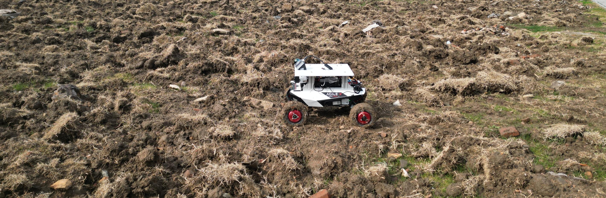
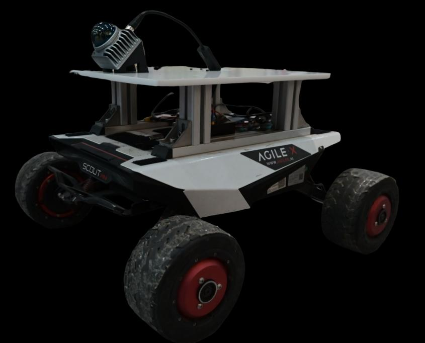
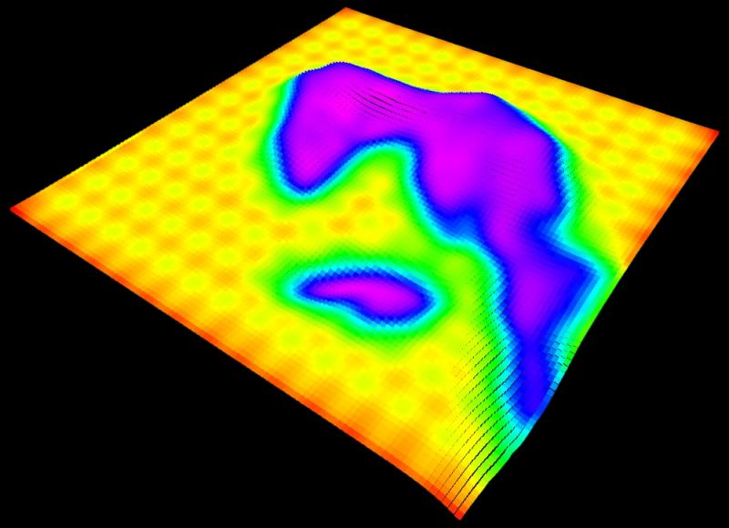
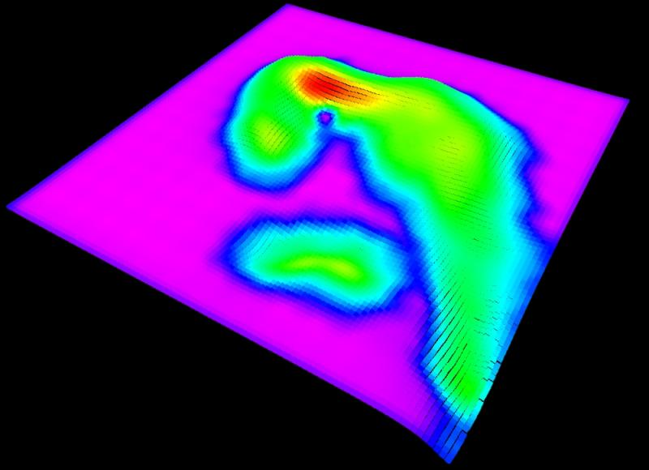
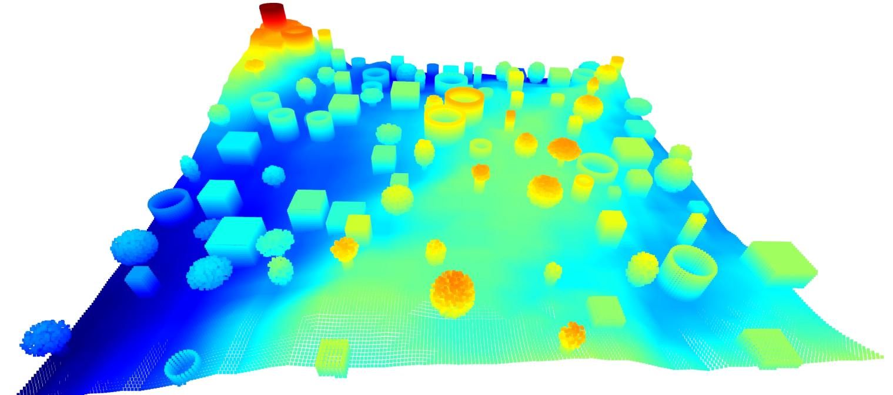
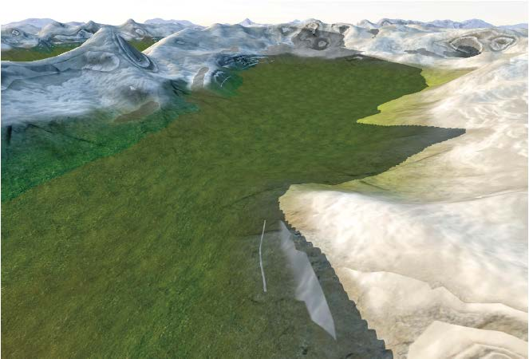
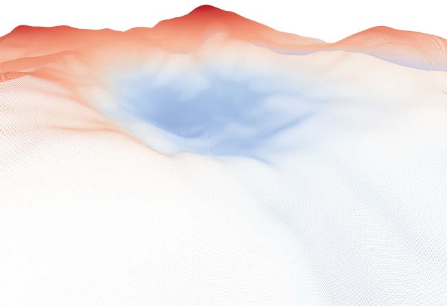
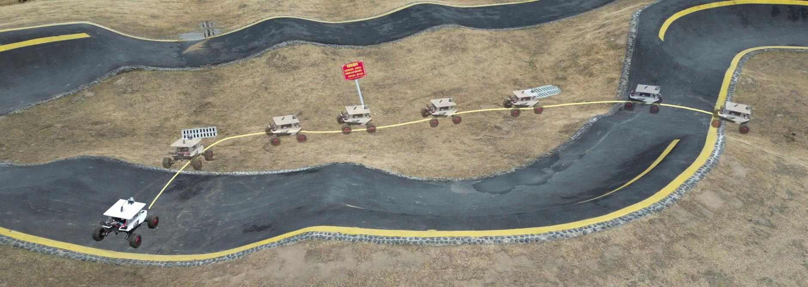
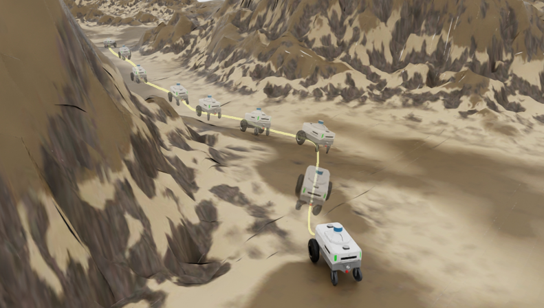
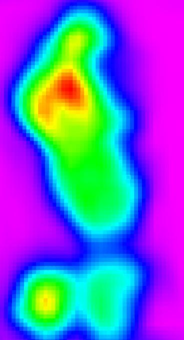

# FSGP-BGK时空可通行性评估（12_Real-time_Spatial-temporal_Traversability_Assessment）：完整忠实学术翻译

> **原文标题**：12_Real-time_Spatial-temporal_Traversability_Assessment  
> **作者**：Zhenyu Hou、Senming Tan、Zhihao Zhang、Long Xu、Mengke Zhang、Zhaoqi He、Chao Xu、Fei Gao、Yanjun Cao  
> **发表信息**：arXiv:2503.04134v2，2025-10-18；论文提供开源实现  
> **原文 PDF**：[12_Real-time_Spatial-temporal_Traversability_Assessment.pdf](../12_Real-time_Spatial-temporal_Traversability_Assessment.pdf) ｜ **对应中文详解**：[12_FSGP-BGK时空可通行性评估.md](../中文详解/12_FSGP-BGK时空可通行性评估.md)  

---

## 原文第 1 页核心内容与翻译

基于特征稀疏高斯过程的实时空-时可通行性评估
Zhenyu Hou1†, Senming Tan1†, Zhihao Zhang1†, Long Xu1,2, Mengke Zhang1,2, Zhaoqi He1,
Chao Xu1,2、Fei Gao1,2、Yanjun Cao1,2
摘要——地形分析是地面移动机器人在真实任务中实际应用的关键，尤其是在室外非结构化环境中。本文提出一种新的时空可通行性评估方法，使自主机器人能够有效通过复杂地形。该方法利用稀疏高斯过程（SGP）直接从点云扫描中提取曲率、梯度和高程等几何特征，并据此建立高分辨率局部可通行性地图。随后，设计时空贝叶斯高斯核（BGK）推断方法，结合历史数据和实时数据动态评估可通行性分数，同时考虑坡度、平整度、梯度和不确定性等因素。特征提取步骤采用图形处理器加速，系统能够实时运行。针对多种地形的大量仿真实验表明，该方法在准确性和计算效率方面均优于现有先进方法。此外，本文构建了与可通行性地图集成的自主导航框架，并在复杂室外环境中使用差速车辆进行了验证。代码将开源，供社区进一步研究和开发，地址为 https://github.com/ZJU-FAST-Lab/FSGP_BGK。
I. 引言
自主移动机器人已经成为环境感知和智能决策的重要平台。凭借对地形的自主通行能力，它们正在改变地质勘探、区域安防和生态监测等工作的实施方式[1]–[3]。可通行性评估是自主导航的关键，因为它能够向机器人指出危险区域，从而降低行驶风险[4]。近年来，基于高斯过程的可通行性分析受到广泛关注[5]、[6]。稀疏高斯过程（Sparse Gaussian Process，SGP）是传统高斯过程（Gaussian Process，GP）的一种改进，可降低 GP 的计算复杂度。利用 SGP 的连续性，可以有效描述不平整地形并生成局部可通行性地图，为高效导航和规划提供支持。然而，基于 SGP 的方法存在两个主要限制：第一，仅依据单帧点云进行的可通行性评估精度仍然不足；第二，这些方法难以在评估地形可通行性时融合历史观测数据，直接累积数据会增加 CPU 负担，并因计算开销限制实时性能。
本研究部分得到地方科技发展中央引导资金项目（项目编号：2024ZY01015）和浙江省先进智能仓储与物流装备重点实验室（项目编号：2024E10007）支持。通信作者：Yanjun Cao、Chao Xu。
†表示共同贡献（共同第一作者）。
1 浙江大学湖州研究院，中国湖州 313000；2 浙江大学工业控制技术国家重点实验室，中国杭州 310027。
电子邮箱：xiagelearn@gmail.com、yanjunhi@zju.edu.cn
FSGP-BGK
高程图
（a）
（b）

**图 1**：图 1：（a）仿真结果及其对应的可通行性地图；（b）实际测试环境，黄色线条表示容易通行的区域。

为提高基于高斯过程的可通行性评估精度，本文提出一种利用 GPU 实时处理的特征驱动可通行性建图框架。首先从点云数据中提取局部曲率和梯度，并结合特征点提取与体素降采样，构造稀疏但包含有效信息的表示。随后采用主成分分析（PCA）去除这些特征之间的相关性，为模型训练提供稳定而高效的输入。在建图阶段，将地形特征重新表述为高斯过程回归问题，并把诱导点策略引入 SGP 框架。这样既能明显降低计算复杂度，又能保持模型对地形的描述能力，从而准确估计局部曲率、梯度和坡度等关键参数，为细致的可通行性评估提供依据。
传统 SGP 难以有效利用历史观测数据，因为简单累积过去的输入会增加计算负担并降低处理速度。为解决这一限制并更好地融合历史观测，本文采用贝叶斯高斯核（Bayesian Gaussian Kernel，BGK）方法，将历史数据与初步可通行性估计合并，并进一步采用高斯核滤波进行局部平滑，得到精度高、连续且稳健的可通行性地图。这种方法解决了历史数据与 SGP 的融合问题，同时明显增强了系统在动态环境中的适应能力和稳定性。

本文的主要贡献如下：

1）提出高效的特征驱动 SGP 可通行性分析流程，将精确回归与稳健的不确定度建模结合起来，提高复杂环境中的评估性能。

2）提出空-时 BGK 推断框架，将历史观测融合到可通行性地图中，提高系统对环境变化的适应能力。

3）将可通行性评估集成到自主导航系统并开源，仿真和真实环境实验验证了其在复杂场景中的性能。该框架将公开，以促进结果复现并推动社区进一步研究。

本文的主要贡献如下：

1）提出高效的特征驱动 SGP 可通行性分析流程，将精确回归与稳健的不确定度建模结合起来，提高复杂环境中的评估性能。

2）提出空-时 BGK 推断框架，将历史观测融合到可通行性地图中，提高系统对环境变化的适应能力。

3）将可通行性评估集成到自主导航系统并开源，仿真和真实环境实验验证了其在复杂场景中的性能。该框架将公开，以促进结果复现并推动社区进一步研究。

---

## 原文第 2 页核心内容与翻译

定位
特征提取
规划器
控制器
投影位置
曲率
梯度
点云
稀疏高斯过程
Tn-m
空-时信息融合
Tn-2
Tn-1
Tn
BGK
可通行性

**图 2**：所提出的地形可通行性建图与导航框架。从左到右，定位结果和 LiDAR 点云数据输入特征提取模块，模块为每个点计算曲率和梯度特征。随后，带诱导点的 SGP 模型处理这些特征，输出局部高程预测、方差和梯度信息。接着，空-时 BGK 融合步骤将预测结果与历史地图结合，生成修正后的可通行性代价图。最后使用 A* 进行轨迹搜索，使用 MINCO [7] 进行轨迹优化，并由控制器进行轨迹跟踪，生成车辆安全、高效通过不平整地形所需的控制指令。

该方法有效解决了历史数据与 SGP 的融合问题，并明显增强了系统在动态环境中的适应能力和稳定性。
本文的主要贡献如下：
1）提出高效的特征驱动 SGP 可通行性分析流程，将精确回归与稳健的不确定度建模结合起来，提高复杂环境中的评估性能。
2）提出空-时 BGK 推断框架，将历史观测融合到可通行性地图中，提高系统对环境变化的适应能力。
3）将可通行性评估集成到自主导航系统并开源，仿真和真实环境实验验证了其在复杂场景中的性能。
II. 相关工作
A. 基于 LiDAR 的可通行性评估
近年来，基于 LiDAR 的可通行性地图评估受到越来越多关注。相关研究通常处理点云数据，生成包含高程、曲率和坡度等关键几何描述量的详细局部地形地图 [8]–[16]。
经典方法 [17]、[18] 从 LiDAR 数据中提取这些特征，并与统计模型结合，建立局部和全局地形表示。部分研究 [12]、[8] 进一步引入机器人完整的 SE(3) 状态，甚至考虑悬挂系统动力学 [16]，以提高地形评估的准确性，但这种全面建模通常会带来较大的计算负担。因此，一些研究 [10]、[11]、[12]、[13] 将问题简化为 R2 空间，这虽然降低了计算量，却可能削弱可通行性风险估计的准确性。深度学习的发展推动了自监督和端到端可通行性评估方法的出现。J. Seo 等人 [19] 利用车辆与地形的交互数据直接推断可通行性，从而减少
对人工标注的依赖。尽管这些方法具有应用前景，但在动态环境中保持稳定的特征提取能力，以及有效融合历史观测以维持全局空-时一致性方面，仍然存在困难。

B. 基于高斯过程的可通行性评估
高斯过程（GP）长期以来被用于建模连续空间现象 [18]、[20]、[21]。为减轻标准 GP 的计算负担，研究者提出了 SGP 方法，利用贝叶斯原理高效近似完整的后验分布 [22]–[24]。近年来，这类方法被用于地形评估，目标是生成比传统高程图（EM）[11] 更平滑、连续的可通行性地图，如图 1 所示。A. Leininger 等人 [25] 提出了基于 SGP 的方法，将高程、不确定度和坡度信息结合到路径规划中。Xue 等人 [26] 通过融合多帧 LiDAR 数据、正态分布变换（NDT）建图和空-时 BGK 推断，实现了稳健的地形建模和高精度可通行性分析。然而，这些方法主要依赖局部信息，难以充分利用历史观测数据。

---

## 原文第 3 页核心内容与翻译

难以充分利用历史观测数据。这一限制会导致评估精度下降，并使方法在动态环境中的表现变差。
（b.1）坡度
（b.2）曲率
（b.3）梯度
（b.4）不确定度
（a）点云
（c）可通行性

**图 3**：基于特征的 SGP 在不平整环境中的结果。从左到右依次为：不平整地形点云、提取出的 SGP 诱导特征点、SGP 预测的局部坡度、曲率、梯度和不确定度图层，以及最终融合得到的可通行性地图。

本节提出一种将基于地形特征的 SGP 回归模型与空-时 BGK 推断算法结合起来的可通行性地图构建方法。GPU 用于从点云中提取位置、曲率和梯度特征，并将这些特征组成 SGP 的训练集；同时采用反距离加权插值生成测试集，以表示周围地形的几何结构。系统把 SGP 预测的局部梯度与测试集得到的局部曲率和梯度结合，得到初步可通行性地图，再利用历史地图数据和 SGP 的空间方差对结果进行修正，从而提高精度和适应性。

**地形特征提取。** 为得到稀疏而有效的地形表示，作者在与世界坐标系水平轴对齐的点云中提取曲率和梯度。对每个点使用 KNN 找到欧氏距离最近的局部邻域，先计算邻域质心和协方差矩阵，再用协方差矩阵最小特征值与全部特征值之和的比值定义局部曲率。梯度用邻域内各点高程与当前点高程差的平均绝对值表示。曲率或梯度超过阈值的点作为特征点保留，其余点通过体素网格均匀降采样；如果点数仍超过上限，则随机取样。最后用 PCA 去除特征相关性，并在 GPU 上并行执行 KNN、协方差计算、特征值分解和 PCA。

III. 可通行性评估框架
本节提出一种地形可通行性地图构建方法，将基于地形特征的 SGP 回归模型与空-时 BGK 推断算法结合。系统使用 GPU 从点云中提取位置、曲率和梯度特征，并将这些特征组成 SGP 的训练集；同时采用反距离加权插值生成测试集，以表示周围地形的几何结构。系统融合 SGP 预测的局部梯度，以及测试集得到的局部曲率和梯度，形成初始可通行性地图；随后利用历史地图数据和 SGP 的空间方差进行修正，提高精度和适应性。

A. 地形特征提取
为有效利用点云构造稀疏地形表示，作者从与世界坐标系水平轴对齐的点云中提取曲率和梯度特征。设 P 为原始点云，其中每个点 pi ∈ P 表示为 pi = (xi, yi, zi)，三项分别为三维空间坐标。对于每个点 pi，使用 K 近邻（KNN）算法确定局部邻域 Ni，即按欧氏距离选取距离最近的 k 个点。
1）曲率计算：首先计算局部邻域质心 µi =
1
k
P
pj∈Ni pj
以及协方差矩阵：
Ci =
1
k −1
X
pj∈Ni
(pj −µi)(pj −µi)⊤.
(1)
随后定义曲率 κi = λmin/(Σj λj + ϵ)，其中 λmin 为 Ci 的最小特征值，ϵ 为防止分母为零而设置的小常数。
2）梯度计算：局部梯度用于表示高程变化，定义为 gi =
1
k
P
pj∈Ni|zj −
zi|，其中 zj 和 zi 分别为邻域点 pj 与当前点 pi 的高程，
其中 zj 和 zi 分别为邻域点 pj 与当前点 pi 的高程。
3）特征点识别：给定曲率阈值 τκ 和梯度阈值 τg。当 κi > τκ 或 gi > τg 时，将点 pi 判为特征点，形成特征集合 F = {pi | κi > τκ 或 gi > τg}。为减少冗余，将 P−F 划分为边长为 v 的体素网格，每个体素保留一个点，形成降采样集合 D。
4）最终点云构成：最终点云数据集为 Pfinal = F ∪ D。当保留点数超过上限 M 时，采用随机采样：
Pfinal = {(xi, yi, zi, κi, gi)}M
i=1 = RandomSample(F∪D, M).
(2)
5）特征去相关与加速：提取完成后，PCA 将数据投影到方差最大的主轴上，减少冗余，提高模型效率和稳定性。曲率较高或梯度较大的特征点通常对应山脊、山谷和悬崖等重要地形结构，因此优先保留。KNN 搜索、协方差计算、特征值分解和 PCA 均使用 GPU 加速，以提高计算效率。

B. 基于地形特征的 SGP 模型
作者采用 SGP 表示地形。为提高计算效率，引入与 Pfinal 对应的诱导点集合 Z。训练集定义为 Dtrain = {(Xi, zi)}，其中 Xi = (xi, yi, κi, gi) 是去相关后的特征，zi 是地形高程。假设 GP 先验为：
f(X) ∼GP

m(X), k(X, X′)

,
(3)
其中 m(X) 为均值函数，k(X, X′) 为核函数。为构造 Dtest，将空间划分为规则网格，得到测试点 G。对于每个 X∗ = (x∗, y∗)，通过 KNN 找到 K 个最近邻，并按下式插值计算局部曲率和梯度：
κ∗=
K
X
k=1
wk κk,
g∗=
K
X
k=1
wk gk,
(4)
wk =
1
dk + ϵ,
K
X
k=1
wk = 1,
(5)
由此得到 X∗ = (x∗, y∗, κ∗, g∗)，再将其输入训练好的 GP 模型预测高程。对于测试集 X∗，预测均值和方差分别为：
f ∗= K∗M K−1
MM zM,
(6)
σ2
∗= k∗∗−K∗M K−1
MM KM∗,
(7)

---

## 原文第 4 页核心内容与翻译

**SGP 预测。** 作者将诱导点集合与特征点数据对应起来，把位置、曲率和梯度作为回归输入，把地形高程作为回归目标。对规则网格中的测试点，先用 KNN 找到附近点，再按距离倒数加权插值得到曲率和梯度，随后输入 SGP，获得高程预测均值和方差。该近似在保持预测精度的同时减少了计算量。

**可通行性地图。** 对每个测试点，系统按曲率、梯度和坡度的加权和计算初始可通行性代价，三项权重之和为 1。每个网格还保存上一时刻的代价、方差和时间戳。历史信息的权重随时间指数衰减，并按历史方差调整可信度；BGK 用当前估计与历史估计的加权结果更新代价和方差。最后在相邻网格上使用高斯核平滑，减少局部跳变。算法以测试点、预测值和预测方差为输入，维护一个滑动历史窗口，逐格更新历史代价与不确定度，再对邻域进行平滑并输出最新地图。

**系统实现。** 整个框架包括定位、建图、规划和控制四部分。定位模块估计机器人 SE(3) 位姿，特征模块从 LiDAR 点云计算曲率和梯度，SGP 给出局部地形属性，BGK 将其与历史观测融合，形成可通行性地图。特征提取和地图计算由 GPU 加速；A* 用于全局路径搜索，MINCO 和 DDR-opt 用于轨迹优化与平滑，MPC 负责实时跟踪。作者将系统部署到实体机器人上，并在仿真和真实不平整环境中在线更新地图。

其中 K∗M 和 KMM 分别为测试点与诱导点之间的核矩阵，zM 包含与 Z 对应的目标值。该近似在保持较高精度的同时降低了计算复杂度。

C. 可通行性地图构建
作者利用 SGP 和 BGK 推断得到的局部特征构建可通行性代价图 Mτ。首先根据 SGP 得到的曲率、梯度和坡度信息计算初始可通行性估计；随后通过 BGK 融合历史数据，并使用高斯核滤波保证空间上的连续性。
对于每个测试点 X∗ = (x, y, κ∗, g∗)，其中 κ∗ 和 g∗ 分别为 SGP 预测的曲率和局部高程梯度，|∇f∗| 表示坡度大小，初始可通行性分数计算为：
$$
M_{\tau,\mathrm{pre}}=w_\kappa\kappa_*+w_g g_*+w_{\mathrm{grad}}\lvert\nabla f_*\rvert. \tag{8}
$$
其中权重满足 wκ + wg + wgrad = 1，可通过实验调节，也可以根据数据学习，以适应具体应用需求。为提高空-时一致性，将初始估计与每个网格单元（x, y）保存的历史观测进行融合。每个单元维护上一时刻的可通行性估计 Mτ,t−1、方差 σ²τ,t−1 和时间戳 t0。定义时间衰减权重 ωt = exp

−λ(t −t0)

以及基于不确定度的置信权重 ωσ = 1/(σ²τ,t−1 + ϵ)。BGK 融合更新为：
$$
M_\tau=\frac{\omega_t\omega_\sigma M_{\tau,t-1}+M_{\tau,\mathrm{pre}}}{\omega_t\omega_\sigma+1}. \tag{9}
$$
相应的方差更新为：
$$
\sigma_{\tau,t}^2=\frac{\omega_t\sigma_{\tau,t-1}^2+\sigma_{\mathrm{pre}}^2}{\omega_t+1}. \tag{10}
$$
最后，为减少局部不连续性，使用高斯滤波平滑 Mτ。对于每个网格单元 Xi，平滑后的可通行性计算为：
$$
M_{\tau,\mathrm{smooth}}=\sum_{j\in N(i)}k(X_i,X_j)M_{\tau,j}. \tag{11}
$$
其中高斯核定义为 k(Xi, Xj) = exp(−||Xi−Xj||²/(2σ²))。算法 1 给出了完整流程。该平滑过程以测试点 X∗、预测值 f∗（由曲率和梯度得到）及不确定度 σ∗² 为输入，输出平滑后的可通行性地图 Mτ,smooth。算法先初始化初始地图，再用滑动窗口维护历史可通行性和不确定度数据，随后根据相邻点进行空间平滑，最后从窗口中提取最新地图。这样可以得到精度较高、在空间和时间上连续的地形可通行性表示，为自主导航和路径规划提供支持。
算法 1 可通行性地图算法
1：输入：X∗、f∗、σ²∗
2：输出：Mτ,smooth
3：根据 X∗、f∗、σ²∗ 初始化初始可通行性地图 Mτ,pre
4：将 Mτ,pre、X∗、σ²∗ 加入地图历史缓冲区
5：更新历史缓冲区中的可通行性历史值
6：更新历史缓冲区中的不确定度历史值
7：对每个 Xi 计算邻域 N(i)
8：对邻域中的相邻点执行空间平滑
9：输出最新可通行性地图 Mτ,smooth
13：对 N(i) 中的每个（Xj，Mτ,j）执行：
14：根据 Xi、Xj 和 Mτ,j 对相邻数据进行平滑
15：结束循环
16：结束循环
17：从地图历史缓冲区获取最新可通行性地图 Mτ,smooth
D. 系统框架与实现
如图 2 所示，地形可通行性建图与导航框架包括定位、建图、规划和控制四个主要部分。系统使用基于 LiDAR 的方法估计机器人的 SE(3) 位姿，同时将原始点云输入特征提取模块，计算曲率和梯度信息。SGP 根据这些特征预测局部地形属性，BGK 再将预测结果与历史观测融合，生成可通行性地图。如图 4 所示，整个过程使用 GPU 加速。
为验证该框架，作者使用 A* 进行全局路径规划，并根据生成的可通行性地图，使用 MINCO [6] 和 DDR-opt [27] 进行轨迹优化和平滑处理，随后通过模型预测控制（MPC）进行实时轨迹跟踪。系统部署在实体机器人上，在线更新可通行性地图，并在仿真和真实实验中实现不平整地形上的自主导航。
CPU
GPU
机器人 SE(3)
点云
特征提取
随机器人移动清除网格
稀疏高斯过程
贝叶斯高斯核
可通行性评估
可通行性地图
发布可通行性地图
CPU 与 GPU 之间复制
处理步骤

**图 4**：可通行性地图生成过程中 CPU 和 GPU 的处理流程。

---

## 原文第 5 页核心内容与翻译

IV. 实验评价
为全面评估所提出的 FSGP-BGK 方法，作者开展了一系列包含定量评价和真实环境测试的实验。定量评价将 FSGP-BGK 与成熟方法进行比较，包括基于 SGP 的地形评估流程 [25] 和高程图（EM）[11]，并考察不同地形类型及不同诱导点数量下的表现。同时，作者在实体机器人平台上验证该方法的适用性，重点关注实时建图性能和避碰能力。

A. 数据样本与仿真设置

1）地形生成与数据样本：为严格评估所提出方法在一系列具有挑战性的场景中的性能，作者使用 EPFL 地形生成器¹ 合成大规模地形点云。这些地形覆盖 50 m × 50 m 的区域，包含四种不同类型；在实验中，作者模拟了五类地形：丘陵地形，即使用 Procedural Terrain Generator 生成的、具有小型丘陵和开阔地带的环境；森林地形，即在丘陵景观上叠加不同大小、随机分布的非结构化树木；废墟地形，即在丘陵地形上进一步加入非结构化树木以及规则的矩形和圆柱体；城市地形，即将 Complex Urban Dataset [28] 切分为方形区域，以模拟真实的城市道路环境；以及室内场景，即使用 SceneNet 数据集² 并将其切分为预定义区域，以模拟真实的室内环境。

¹ https://github.com/droduit/procedural-terrain-generation
² https://bitbucket.org/robotvault/downloadscenenet/src/master/

**图 5**：左：城市地形；右：废墟地形。其他地形类型将在后文讨论。

对于每类地形，作者生成 500 个具有不同点云的场景，共得到 2500 个样本。使用文中给定的公式（记为 [x]）处理这些点云，以生成真实可通行性地图。随后使用这些地图引导 A* 路径规划，并使用 MINCO 算法 [6] 进行轨迹优化，从而模拟机器人导航任务。

2）仿真配置：在仿真中，机器人在每类地形上导航时，有意遮挡 15% 的点云数据，以模拟真实 LiDAR 的阴影区域或传感器稀疏扫描等局限。采集到的点云按顺序处理，并以固定间隔输入模型。随后，通过计算生成的可通行性地图与真实全局地图之间的平均差异，得到相对于真实值的平均误差和方差。需要注意的是，由于二者表示可通行性分数，平均误差和方差均为无量纲量，取值范围为 0 到 1。

为确保与 EM [10] 的比较公平，作者排除由遮挡造成的空白区域，仅关注有数据的区域。所有仿真均在专用工作站上运行，该工作站配备 Intel i5-12400F CPU、16 GB RAM 和 NVIDIA RTX 4060 GPU，以确保所有试验具有一致的计算条件。

3）比较基线：作者将 FSGP-BGK 与以下方法进行比较：

- SGP：用于无地形图导航的经典 SGP 可通行性分析方法 [25]。
- FSGP：本文提出的基于特征的 SGP 方法，不包含 BGK。
- EM：广泛采用的栅格化空间表示方法 [11]，优点是简单，但在不可观测区域容易产生空白。

B. 定量评价

1）不同地形下的性能：如图 6 所示，作者分别从室外森林环境和室内房间环境中随机选取一个点云。随后，按时间顺序使用三种方法，即 SGP（基线）、FSGP 和 FSGP-BGK，为每个轨迹点生成可通行性估计，并将相对于真实值计算得到的平均误差和方差随时间绘制在图 6 中。

实验结果表明，在使用 125 个诱导点的室外森林场景中，FSGP-BGK 的平均精度相比基线 SGP 提高了 18%–20%，且误差方差显著更低。在室内环境中，FSGP-BGK 的平均表现比 SGP 最多提高 46%–48%，同时保持更好的稳定性。此外，在两个场景中，平均误差都随时间稳定下降，表明融合历史观测提高了地形估计精度。

2）大规模测试中的算法扩展性：为评估方法的稳健性和扩展能力，作者在丘陵、森林、废墟、道路和室内五类地形的 2500 个点云上开展实验。表 I 报告了各方法的平均误差和方差，数值越低表示性能越好，最佳结果以蓝色突出显示。室内数据集和道路数据集与前述实验所用数据一致，丘陵、森林和废墟地形则使用 EPFL 地形生成器生成。FSGP-BGK 始终取得最低的平均误差和方差，优于 SGP 基线和中间版本 FSGP。例如，在丘陵环境中，FSGP-BGK 将平均误差从 SGP 的 0.2604 降至 0.1237。

---

## 原文第 6 页核心内容与翻译

表 I：不同地形下的实验结果。

| 地形类型 | 方法 | 平均误差 | 平均方差 |
| --- | --- | ---: | ---: |
| 丘陵 | SGP | 0.2604 | 0.0392 |
|  | FSGP | 0.2321 | 0.0345 |
|  | FSGP-BGK | 0.1237 | 0.0085 |
| 森林 | SGP | 0.1831 | 0.0245 |
|  | FSGP | 0.1777 | 0.0227 |
|  | FSGP-BGK | 0.1687 | 0.0213 |
| 废墟 | SGP | 0.2003 | 0.0239 |
|  | FSGP | 0.1965 | 0.0219 |
|  | FSGP-BGK | 0.1831 | 0.0206 |
| 道路 | SGP | 0.1694 | 0.0373 |
|  | FSGP | 0.1434 | 0.0328 |
|  | FSGP-BGK | 0.1051 | 0.0240 |
| 室内 | SGP | 0.2455 | 0.0451 |
|  | FSGP | 0.2537 | 0.0429 |
|  | FSGP-BGK | 0.1978 | 0.0420 |

表 I 还显示，在丘陵场景中，方差由 0.0392 降至 0.0085，分别对应约 52.5% 的平均误差降幅和约 78.3% 的方差降幅。森林和废墟地形也取得了类似的收益：该方法不仅降低了误差，还使不确定度估计更加稳定。在室内场景中，尽管单独使用 FSGP 的平均误差略高于 SGP（0.2537 对 0.2455），引入 BGK 后误差显著降至 0.1978。

这些结果突出了两点。第一，准确的可通行性预测在根本上依赖于提取高密度地形特征，曲率和梯度可以作为底层可导航性的精确代理。第二，通过空-时 BGK 框架融合历史观测，该方法能够有效捕捉时间动态并逐步降低预测误差。这种双重策略不仅优于传统 SGP 方法，也进一步揭示了决定地形可通行性的关键因素。

3）诱导点数量的影响：如图 7（a、b）所示，作者生成不平整丘陵地形，并使用该方法构建相应的全局点云。随后，如图 7（c、d）所示，分别使用 50 个和 500 个诱导点评估 SGP、FSGP 和 FSGP-BGK。当仅使用 50 个诱导点时，FSGP-BGK 的平均精度相比基线 SGP 最多提高 19%。尽管 FSGP 受益于更丰富的特征融合，同样优于 SGP，但在长时间运行后最终趋于饱和。相比之下，FSGP-BGK 得益于通过 BGK 融合历史观测，能够持续保持其优势，从而得到更稳健、更稳定的可通行性估计。

当诱导点数量增加到 500 个时，SGP 与 FSGP 之间的性能差距缩小，因为更大的输入特征空间弥补了 SGP 较简单的建模能力。尽管如此，FSGP-BGK 的平均精度仍比两个基线方法提高约 12%。这表明，即使诱导点数量充足，基于 BGK 的历史数据融合对于在长轨迹运行中保持更高的精度和稳定性仍然至关重要。

**图 6**：（a）使用 EPFL 地形生成器渲染的森林场景点云；（b）从开源数据集⁴ 提取的室内场景点云；（c）和（d）展示平均误差和方差随时间的变化。

**图 7**：（a）由 EPFL 地形生成器生成的不平整丘陵地形；（b）从丘陵地形中提取的全局点云；（c）使用 50 个诱导点时，SGP、FSGP 和 FSGP-BGK 相对于真实值的平均误差和方差随时间的变化；（d）使用 500 个诱导点时，相同方法的平均误差和方差随时间的变化。该图直观展示了不同诱导点数量下各方法在建模精度和稳定性方面的差异。

4）与高程图比较：作者在与 SGP 基线相同的条件下，将 FSGP-BGK 与 EM [11] 进行比较。在该实验中，排除遮挡造成的空白区域，仅评价可观测区域。表 II 给出了相对于真实值的平均误差和方差绝对差异，以及平均运行时间。

---

## 原文第 7 页核心内容与翻译

在相同硬件上测得的运行时间如下。FSGP-BGK 的平均误差为 0.1139、方差为 0.0333，而 EM [11] 的对应数值分别为 0.1953 和 0.0422。此外，FSGP-BGK 的平均运行时间仅为 33.84 ms，而 EM [11] 为 107.85 ms。这些改进可归因于 BGK 融合所保持的空-时连续性，以及高效的特征驱动 SGP 框架。相比之下，高程图所采用的标准插值会产生更粗糙、方差更高的可通行性估计，并增加计算开销。因此，FSGP-BGK 能够生成更平滑、更准确的实时可通行性地图，非常适合自主导航。

表 II：FSGP-BGK 与 EM 方法的比较。

| 方法 | 平均误差 | 方差 | 平均运行时间（ms） |
| --- | ---: | ---: | ---: |
| FSGP-BGK | 0.1139 | 0.0333 | 33.84 |
| EM | 0.1953 | 0.0422 | 107.85 |

5）历史观测数据融合比较：为展示 FSGP 框架内基于 BGK 的方法的优越性，作者开展实验，将多帧点云的直接累积与所提出的 BGK 后处理方法进行比较。在相同硬件条件和同一不平整地形环境下，从内存使用量、GPU 内存占用和处理时间三个方面评价两种方法，结果详见表 III。结果表明，尽管两种方法的系统内存使用量相当（均为 9.4%），但基于 BGK 的方法显著降低了 GPU 内存占用（25% 对 36%）和处理时间（29.16 ms 对 42.37 ms）。这些改进源于通过 BGK 框架有效融合历史数据；该方法不仅保持了较高的估计精度，还显著降低了计算开销，从而提升了实时性能。

表 III：资源占用与性能比较。

| 指标 | FSGP-BGK | FSGP 直接累积 |
| --- | ---: | ---: |
| 内存占用（%） | 9.4 | 9.4 |
| GPU 内存占用（%） | 25 | 36 |
| 处理时间（ms） | 29.16 | 42.37 |

C. 真实环境测试

作者将 FSGP-BGK 和 SGP 部署在差速轮式机器人上（如图 8 所示）。机器人配备第 11 代 Intel® Core™ i7 CPU、NVIDIA® RTX 2060 GPU 和 LiDAR 传感器。该配置能够实时扫描和建图，为评价所提出方法的定性性能提供了可靠的测试平台。

a）自主导航：作者在不平整地形上开展真实环境导航实验，如图 8 所示，以验证可通行性地图的实际适用性。

NUC11PHKi7C
Agilex Scout Mini
电池
实体平台
Livox MID-360

**图 8**：实验使用的实体平台 Agilex Scout Mini 配备 DJI Livox MID-360 LiDAR。两块电池分别为 LiDAR 和 NUC11PHKi7C 供电。图中还展示了现场实验所用的真实不平整地形。

作者还在实体机器人上进行了实验。图 9 展示了 Isaac Sim 根据 FSGP-BGK 生成的可通行性地图生成的平滑、连续轨迹。

**图 9**：Isaac Sim 中基于可通行性地图生成的平滑、连续轨迹。

b）真实环境地图感知评价：作者进一步在真实环境中评价地图感知能力。该环境具有明显起伏的地形，如图 10（a）所示。使用 FAST-LIO2 获取高保真点云并提供准确定位，从而显现出场景中的小型障碍物（图 10（b））。当在相同硬件上、使用相同诱导点、分辨率和控制流程运行基线 SGP 时，其生成的可通行性地图无法捕捉这些细节。相比之下，FSGP-BGK 在相同条件下能够以 20 Hz 的频率准确识别这些小型障碍物（图 10（c））。此外，与 SGP 相比，FSGP-BGK 保持了显著更低的计算开销，进一步证实了其在具有挑战性的室外导航任务中进行实时感知和规划的优势。

---

## 原文第 8 页核心内容与翻译

图 10 展示了真实起伏地形、从点云提取的场景，以及两种方法生成的可通行性地图。可通行性取值范围为 0 到 1，数值越低表示可通行性越高。实验表明，FSGP-BGK 能够在真实环境中保持更连续的地图表达，并识别出小型障碍物。

(c) SGP 与 FSGP-BGK
(a) 真实场景
(b) 点云
(d) 说明
可通行性强度
警示牌
坡度
1.0
0.8
0.6
0.4
0.2
0.0
Robot SE(3)

**图 10**：（a）真实不平整地形（包含小型障碍物）；（b）从点云提取得到的场景；（c）可通行性地图比较；（d）可通行性范围为 0 到 1，数值越低表示可通行性越高。

V. 结论
本文提出了一种不依赖全局地图的导航框架，利用基于特征的稀疏高斯过程从 LiDAR 点云中提取关键几何特征。通过将 GPU 加速的特征提取与空-时贝叶斯高斯核推断相结合，该方法融合实时测量与历史数据，从坡度、平整度、梯度和不确定度等方面动态评估可通行性。仿真和真实环境实验均证实，与传统方法相比，所提出方法显著提高了估计精度和计算效率，是复杂地形自主导航的一种稳健方案。未来工作将利用 GP 和 BGK，把该方法扩展到不依赖全局地图的多机器人自主探索。
REFERENCES
[1] P. Papadakis, “Terrain traversability analysis methods for unmanned
ground vehicles: A survey,” Engineering Applications of Artificial
Intelligence, vol. 26, no. 4, pp. 1373–1385, 2013.
[2] H. Mousazadeh, “A technical review on navigation systems of agri-
cultural autonomous off-road vehicles,” Journal of Terramechanics,
vol. 50, no. 3, pp. 211–232, 2013.
[3] W. Yuan, Z. Li, and C.-Y. Su, “Multisensor-based navigation and
control of a mobile service robot,” IEEE Transactions on Systems,
Man, and Cybernetics: Systems, vol. 51, no. 4, pp. 2624–2634, 2019.
[4] M. Endo, T. Taniai, R. Yonetani, and G. Ishigami, “Risk-aware path
planning via probabilistic fusion of traversability prediction for plan-
etary rovers on heterogeneous terrains,” in 2023 IEEE international
conference on robotics and automation (ICRA).
IEEE, 2023, pp.
11 852–11 858.
[5] M. Ali, H. Jardali, N. Roy, and L. Liu, “Autonomous navigation,
mapping and exploration with gaussian processes.” Robotics: Science
and Systems (RSS), 2023.
[6] H. Jardali, M. Ali, and L. Liu, “Autonomous mapless navigation on
uneven terrains,” in 2024 IEEE International Conference on Robotics
and Automation (ICRA).
IEEE, 2024, pp. 13 227–13 233.
[7] Z. Wang, X. Zhou, C. Xu, and F. Gao, “Geometrically constrained tra-
jectory optimization for multicopters,” IEEE Transactions on Robotics,
vol. 38, no. 5, pp. 3259–3278, 2022.
[8] Z. Jian, Z. Lu, X. Zhou, B. Lan, A. Xiao, X. Wang, and B. Liang,
“Putn: A plane-fitting based uneven terrain navigation framework,” in
2022 IEEE/RSJ International Conference on Intelligent Robots and
Systems (IROS).
IEEE, 2022, pp. 7160–7166.
[9] L. Xu, K. Chai, Z. Han, H. Liu, C. Xu, Y. Cao, and F. Gao, “An
efficient trajectory planner for car-like robots on uneven terrain,” in
2023 IEEE/RSJ International Conference on Intelligent Robots and
Systems (IROS).
IEEE, 2023, pp. 2853–2860.
[10] F. Atas, G. Cielniak, and L. Grimstad, “Elevation state-space: Surfel-
based navigation in uneven environments for mobile robots,” in 2022
IEEE/RSJ International Conference on Intelligent Robots and Systems
(IROS).
IEEE, 2022, pp. 5715–5721.
[11] T. Miki, L. Wellhausen, R. Grandia, F. Jenelten, T. Homberger,
and M. Hutter, “Elevation mapping for locomotion and navigation
using gpu,” in 2022 IEEE/RSJ International Conference on Intelligent
Robots and Systems (IROS).
IEEE, 2022, pp. 2273–2280.
[12] P. Krüsi, P. Furgale, M. Bosse, and R. Siegwart, “Driving on point
clouds: Motion planning, trajectory optimization, and terrain assess-
ment in generic nonplanar environments,” Journal of Field Robotics,
vol. 34, no. 5, pp. 940–984, 2017.
[13] P. Fankhauser, M. Bloesch, C. Gehring, M. Hutter, and R. Siegwart,
“Robot-centric elevation mapping with uncertainty estimates,” in Mo-
bile Service Robotics.
World Scientific, 2014, pp. 433–440.
[14] P. Fankhauser, M. Bloesch, and M. Hutter, “Probabilistic terrain
mapping for mobile robots with uncertain localization,” IEEE Robotics
and Automation Letters, vol. 3, no. 4, pp. 3019–3026, 2018.
[15] A. Dixit, D. D. Fan, K. Otsu, S. Dey, A.-A. Agha-Mohammadi,
and J. W. Burdick, “Step: Stochastic traversability evaluation and
planning for risk-aware navigation; results from the darpa subterranean
challenge,” IEEE Transactions on Field Robotics, 2024.
[16] K. Zhang, Y. Yang, M. Fu, and M. Wang, “Traversability assessment
and trajectory planning of unmanned ground vehicles with suspension
systems on rough terrain,” Sensors, vol. 19, no. 20, p. 4372, 2019.
[17] A. Kleiner and C. Dornhege, “Real-time localization and elevation
mapping within urban search and rescue scenarios,” Journal of Field
Robotics, vol. 24, no. 8-9, pp. 723–745, 2007.
[18] R. Ouyang, K. H. Low, J. Chen, and P. Jaillet, “Multi-robot active
sensing of non-stationary gaussian process-based environmental phe-
nomena,” 2014.
[19] J. Seo, T. Kim, K. Kwak, J. Min, and I. Shim, “Scate: A scalable
framework for self-supervised traversability estimation in unstructured
environments,” IEEE Robotics and Automation Letters, vol. 8, no. 2,
pp. 888–895, 2023.
[20] C. K. Williams and C. E. Rasmussen, Gaussian processes for machine
learning.
MIT press Cambridge, MA, 2006, vol. 2, no. 3.
[21] T. X. Lin, J. Guo, S. Al-Abri, and F. Zhang, “Distributed field
mapping for mobile sensor teams using a derivative-free optimisation
algorithm,” IET Cyber-Systems and Robotics, vol. 6, no. 2, p. e12111,
2024.
[22] E. Snelson and Z. Ghahramani, “Sparse gaussian processes using
pseudo-inputs,” Advances in neural information processing systems,
vol. 18, 2005.
[23] R. Sheth, Y. Wang, and R. Khardon, “Sparse variational inference
for generalized gp models,” in International Conference on Machine
Learning.
PMLR, 2015, pp. 1302–1311.
[24] M. Titsias, “Variational learning of inducing variables in sparse
gaussian processes,” in Artificial intelligence and statistics.
PMLR,
2009, pp. 567–574.
[25] A. Leininger, M. Ali, H. Jardali, and L. Liu, “Gaussian process-based
traversability analysis for terrain mapless navigation,” in 2024 IEEE
International Conference on Robotics and Automation (ICRA). IEEE,
2024, pp. 10 925–10 931.
[26] H. Xue, H. Fu, L. Xiao, Y. Fan, D. Zhao, and B. Dai, “Traversability
analysis for autonomous driving in complex environment: A lidar-
based terrain modeling approach,” Journal of Field Robotics, vol. 40,
no. 7, pp. 1779–1803, 2023.
[27] M. Zhang, N. Chen, H. Wang, J. Qiu, Z. Han, Q. Ren, C. Xu,
F. Gao, and Y. Cao, “Universal trajectory optimization framework for
differential drive robot class,” arXiv preprint arXiv:2409.07924, 2024.
[28] J. Jeong, Y. Cho, Y.-S. Shin, H. Roh, and A. Kim, “Complex urban
dataset with multi-level sensors from highly diverse urban environ-
ments,” The International Journal of Robotics Research, vol. 38, no. 6,
pp. 642–657, 2019.

---
