# Tracailer牵引挂车轨迹规划（13_Tracailer）：完整忠实学术翻译

> **原文标题**：13_Tracailer  
> **作者**：Long Xu、Kaixin Chai、Boyuan An、Shuhang Ji、Zhenyu Hou、Jiaxiang Gan、Qianhao Wang、Yuan Zhou、Xiaoying Li、Junxiao Lin、Zhichao Han、Chao Xu、Yanjun Cao、Fei Gao  
> **发表信息**：arXiv:2502.19832v2，2025-09-14  
> **原文 PDF**：[13_Tracailer.pdf](../13_Tracailer.pdf) ｜ **对应中文详解**：[13_Tracailer牵引挂车轨迹规划.md](../中文详解/13_Tracailer牵引挂车轨迹规划.md)  

---

## 原文第 1 页核心内容与翻译

Tracailer：非结构化环境中牵引挂车机器人的高效轨迹规划器
Long Xu1,2, Kaixin Chai2, Boyuan An1, Shuhang Ji1, Zhenyu Hou2, Jiaxiang Gan2, Qianhao Wang1,2,
Yuan Zhou1,2, Xiaoying Li2, Junxiao Lin1,2, Zhichao Han1,2, Chao Xu1,2, Yanjun Cao1,2, 和 Fei Gao1,2

**图 1**：Fig. 1: 在狭窄车道中自主导航的牵引挂车机器人。图中顶部和底部的子图 A∼E 分别对应于子图 F 中黄色框时刻的第三人称视角和 Rviz [1] 视角。

摘要——牵引挂车机器人由一个可驱动的牵引车和一个或多个通过铰接机构连接的非驱动挂车组成。与典型的类车机器人相比，挂车的增加提供了更大的运输能力。然而，这也因机器人复杂的运动学、高维状态空间和可变形结构而使得运动规划变得复杂。为了有效地规划出满足机器人运动学约束并解决其独特特性所带来挑战的安全、时间最优轨迹，本文介绍了一种适用于牵引挂车机器人的轻量级、紧凑且高阶平滑的轨迹表示方法。基于此，我们设计了一个可高效求解的时空轨迹优化问题。为了处理因可变形结构导致的避障难题，我们充分利用环境中的无碰撞区域，直接在连续空间中对轨迹进行形变。这种方法不需要在每次优化之前通过无碰撞的种子点使用凸近似从环境中构建安全区域，避免了求解空间的损失，从而降低了优化对初始值的依赖。此外，我们提出了一种多终端快速路径搜索算法来生成优化的初始值。广泛的仿真实验表明，与现有算法相比，我们的方法在效率上实现了几倍的提升，同时还确保了更低的曲率和更短的轨迹时间。在室内外场景中涉及货物运输、装卸的实际实验进一步验证了我们方法的有效性。源代码可在 https://github.com/Tracailer/Tracailer 获取。

给实践者的说明——本文解决了牵引挂车机器人运动规划中的挑战，这在物流和农业等行业中至关重要。我们的方法引入了一种轻量级的轨迹规划方法，它能够高效生成安全且时间最优的路径，同时考虑了这些车辆独特的运动学约束。通过利用环境中的无碰撞区域，我们增强了安全性并减少了对初始条件的依赖。虽然我们的方法在仿真和现实世界的测试中显示出显著的效率提升，但其有效性在极度动态的环境中可能会有所不同。实践者可以轻松采用我们的开源代码，将这种规划技术集成到他们的操作中，从而提高牵引挂车系统的效率和安全性，并为自动运输未来的发展铺平道路。

索引词——运动规划，轨迹优化，牵引挂车机器人，非完整动力学

---

## 原文第 2 页核心内容与翻译

I. 引言
近年来，自动驾驶因其潜在的社会效益而引起了极大的兴趣并取得了巨大的发展。在运输大型货物时，人们的注意力往往转向牵引挂车系统（如半挂卡车），因为通过使用挂车，它们具有更强的运输能力。牵引挂车机器人是一类由一辆可驱动牵引车和多辆无动力挂车组成的车辆。挂车通常通过铰链连接到牵引车或其他挂车上，因此可以通过控制牵引车的运动来控制挂车的运动 [2]。
运动规划是自主导航框架中至关重要的一部分，牵引挂车机器人也不例外。与类车机器人相似，牵引挂车机器人的轨迹规划器旨在生成既最小化时间消耗又满足运动学约束的轨迹，从而使其能够平稳安全地导航至目标区域。尽管关于类车机器人的运动规划研究已相对广泛，但这些技术不能直接应用于牵引挂车机器人，因为在移动时不仅需要考虑牵引车的状态，还需要考虑挂车的状态。
具体而言，与类车机器人相比，牵引挂车机器人运动规划的挑战主要由以下三个因素引起：
1) 复杂的运动学：铰接结构和挂车的无驱动特性引入了更复杂的运动学约束。挂车的欠驱动约束与牵引车的非完整约束之间的耦合 [3]，要求规划器能够处理更多方程约束。同时，它必须避免发生折叠效应（jackknife），这会使得整个机器人系统失去控制 [4]。
2) 高维状态空间：机器人所连接的每一个挂车都会在空间上为机器人引入三个额外的维度，即位置和偏航角，这会显著增加基于搜索或采样的路径规划算法的时间消耗 [5], [6]。同样地，对于基于优化的方法 [3], [7]–[10]，状态维度的增加会导致优化变量维度的增加，从而可能导致更多的内存消耗和更慢的收敛。
3) 可变形结构：由铰接结构引起的牵引挂车机器人的可变形性，增加了避免碰撞的复杂性。由于机器人的形状随时间变化，必须对机器人的每个独立单元施加避障约束。当带有多个挂车时，这一挑战变得更加明显，因为还必须考虑额外的车间防碰撞约束。
为了解决前两个问题，我们从类车机器人运动规划 [12], [13] 中的多项式轨迹优化和微分平坦性 [11] 的高效性中汲取灵感，提出了一种适用于牵引挂车机器人的新轨迹表示方法。我们在连续空间中对牵引挂车机器人的时空轨迹优化问题进行建模，从而消除了运动过程的离散化，并大幅提高了优化的效率。受益于微分平坦性 [11]，我们可以显式推导出机器人的高阶状态，并降低优化变量的维度。然而，牵引车的运动学所带来的微分平坦性奇异问题可能会导致优化成功率降低和轨迹平滑度下降，从而使轨迹跟踪变得困难。因此，在这项工作中，我们引入松弛弧长来消除这种奇异性，以提高优化的成功率。此外，这种方法使可行性约束更容易满足，从而进一步提高了效率。
针对第三个可变形结构的问题，我们充分利用环境的无碰撞区域，直接在连续空间中对轨迹进行变形。这种方法不需要在每次优化之前通过无碰撞的种子点使用凸近似从环境中构建安全区域，避免了求解空间的损失，从而降低了优化对初始值的依赖，使优化器更容易找到更优解。借助这一优势，为了进一步提升效率，我们为牵引挂车机器人提出了一种多终端路径搜索算法，该算法仅在 SE(2) 空间中进行搜索。与在更大的状态空间中进行探索相比，我们的方法在极少损失最优性的情况下实现了近一个数量级的效率提升。
本文的贡献如下：
1) 我们提出了一种牵引挂车机器人的新轨迹表示方法，它保留了多项式表示的高效性优势，同时消除了微分平坦性的奇异性，进一步提高了轨迹优化的成功率。
2) 基于上述轨迹表示，我们提出了一种新的基于优化的牵引挂车机器人轨迹规划器（Tracailer）。它直接在连续空间中对轨迹进行变形以确保安全，降低了优化对初始值的依赖。同时，引入了一种高效的多终端路径搜索器
并将其嵌入规划器中获取问题初值，在较少牺牲最优性的情况下提高效率。
3) 为高效求解规划器中的优化问题，本文基于微分齐次映射和拉格朗日乘子降低优化变量和约束的维度。
4) 此外，本文构建了牵引挂车机器人的自主导航系统，包括实时重规划和建图模块，并通过大量仿真和实际实验验证所提方法的有效性与效率。

---

## 原文第 3 页核心内容与翻译

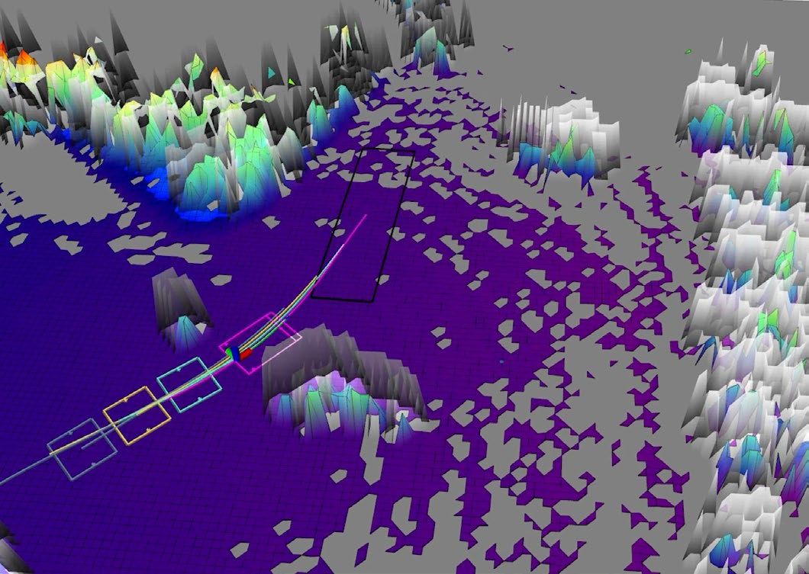

**图 1**：图 1：软件开源，以促进该领域的进一步研究。
该软件已开源，以促进该领域的进一步研究。

## II. 相关工作
牵引挂车机器人的运动规划大体可以分为几何方法和优化方法两类。

### A. 几何方法
几何方法通常只规划几何路径，再设计路径跟踪控制器进行跟踪。几何路径一般通过搜索或采样得到。搜索方法通常先建立表示环境的栅格地图或图结构，再在其中搜索路径 [14]。例如，Liu 等人 [15] 采用障碍物膨胀、机器人缩小的等效尺寸概念，并用启发式遗传算法规划路径。Sun 等人 [16] 将局部规则路网与通用概率路网结合，建立全局复合路网，从而降低规划计算的复杂度。为提高效率和路径质量，Ljungqvist 等人 [5] 在线下生成一组满足运动学约束的运动基元，在由这些基元构成的规则状态格上搜索一般双挂车系统的解。他们还提出可达状态空间的新参数化方法，使图搜索能够满足实时应用要求。Leu 等人 [17] 简化运动基元设计，并利用强化学习获得明确的启发函数，提出改进的 A* 搜索引导树，使系统能够快速进行脱离状态格的探索。
Sampling-based methods usually define a space for a path
planning task. They maintain a tree structure and iteratively
sample in this space, expanding tree nodes according to some
criteria, ultimately extracting the trajectories from the tree con-
taining the start and goal. By customizing the sampling space
based on motion primitives instead of the space containing all
SE(2) states of vehicles in the tractor trailer robot, Cheng
et al. [18], Lattarulo et al. [6] used the Rapidly-exploring
Random Tree [19], [20] (RRT) algorithm to efficiently plan
a feasible path that is satisfied with the nonholonomic and
mechanical constraints. Moreover, Manav et al. [21] proposed
an iterative analytical method, combining it with the Closed-
Loop Rapidly Exploring Random Tree (CL-RRT) approach
in cascade path planning, allowing the generation of both
kinematically feasible and deterministic parking maneuvers
with obstacle avoidance.
通过搜索或采样得到路径后，轨迹跟踪器根据机器人当前状态选取一段路径作为参考，并计算控制指令 [22]。例如，文献 [18] 使用模糊控制和视线法 [23] 进行跟踪；文献 [24] 将半正定规划与运动基元结合以获得控制指令。Dahlmann 等人 [25], [26] 使用模型预测控制器，并结合 Voronoi 场 [27] 对参考轨迹进行局部优化。
### B. 基于优化的方法
几何方法能够适用于多种场景，但通常在离散空间中搜索，解的质量与搜索时间和空间分辨率密切相关。当需要考虑机器人更高维状态以获得更优解时，搜索空间扩大，组合数量增加，效率会明显下降。基于优化的方法把运动规划建模为优化问题，并用数值求解器求解，初值通常来自搜索或采样得到的几何路径。轨迹优化在连续空间中寻找解，能够考虑高阶状态并具备局部最优性保证。Muralidhara 等人 [8] 将牵引挂车运动规划建模为最优控制问题 OCP，把轨迹描述为离散时刻的状态，并用直接多重射击法求解；但其避障处理只考虑不偏离交通车道跟踪线，不能直接用于复杂的非结构化环境。Mohamed 等人 [28] 将人工势场与最优控制结合以实现更通用的避障，但环境复杂时容易陷入局部最优，导致机器人无法到达目标区域。Wang 等人 [29] 采用路径积分策略改进方法优化势场表示下的几何路径，但计算耗时较长，难以用于未知环境和动态场景中的在线重规划。
通过几何方法得到的路径可以缓解图搜索方法在狭窄场景中受分辨率和搜索空间限制、性能较差的问题。但这种方法耗时较长，难以应用于需要在线重规划的任务，例如探索未知环境以及在动态变化的场景中导航。
changing scenarios.
本文提出的方法同样属于优化类算法。为提高规划效率，本文不采用离散状态表示轨迹，也不直接把问题建模为 OCP，而是提出一种轻量、紧凑且高阶平滑的轨迹表示，从而降低优化变量维度并简化问题。
文献 [9]、[30]、[31] 用多个圆表示障碍物和机器人，因为这种简单形状便于建模为 OCP。但真实环境复杂，仅用圆形难以准确表示。为更简洁、准确地描述环境，一些研究 [3]、[10]、[32]–[34] 使用凸多边形近似障碍物，并将牵引挂车机器人的运动规划建模为 OCP，在优化中同时考虑安全约束和运动时间。这些方法

---

## 原文第 4 页核心内容与翻译

𝜃𝜃0
𝜃𝜃2
𝜃𝜃1
𝒑𝒑𝟐𝟐
𝑣𝑣0
𝑣𝑣1
𝑣𝑣2
𝐘𝐘
𝐗𝐗
O
𝒑𝒑𝟏𝟏
𝒑𝒑𝟎𝟎
如何到达？
𝐯𝐯1
𝐯𝐯2
𝐯𝐯3
𝐯𝐯4
𝐯𝐯0
𝐧𝐧0
𝐧𝐧1
𝐧𝐧2
𝐧𝐧3
𝐧𝐧4
目标区域

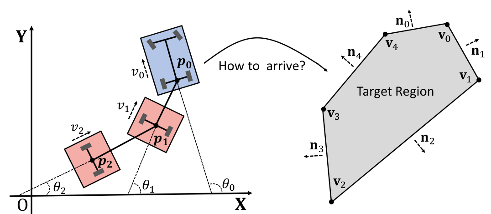

**图 2**：牵引挂车机器人示例（N = 2）。第一辆挂车连接在牵引车后部中心，其余挂车连接在前一辆挂车的中心。

要求在每个时刻对每个障碍物和机器人的每个车体施加约束。这一特性使得它们的计算复杂度与环境紧密耦合，限制了在障碍物密集环境中规划的效率。
为了解决这个问题，一些研究 [7], [35] 转向使用安全行驶走廊 (STC) 作为避障约束。这种方法施加的约束仅与轨迹长度有关，而与障碍物密度无关。然而，经典的安全走廊必须在轨迹优化之前计算，因为它们是基于优化的初始值构建的。对于牵引挂车机器人的运动规划来说，这将花费大量时间，特别是当挂车数量众多时，因为需要分别为机器人的每个车体独立构建安全走廊。安全走廊的第二个缺点是其对初始值的高度依赖，由于状态维度高和机器人运动学复杂，获得一个好的初始值需要花费更多时间。通常，安全走廊生成过程选择轨迹的一些状态点作为种子，这将影响生成的安全走廊的位置和大小。因此，在某些难以获得良好轨迹初始值的场景中（例如，牵引挂车机器人需要在狭窄环境中转弯），安全走廊约束的可行区域可能无法包含足够好的解。为了降低优化对初始值的依赖，Li 等人 [36] 提出了一种多阶段方法，仅将 A* 算法生成的路径作为牵引挂车机器人穿越弯曲隧道时轨迹优化的初始值，从而提高了该任务的部分效率。
在本文中，我们充分利用环境的无碰撞区域，直接在连续空间中对轨迹进行变形，从而避免了上述由安全走廊带来的问题。在已知场景中，可以预先处理环境以适应我们的方法；而在未知环境中，我们也可以使用单独开启的线程进行维护，而不占用轨迹规划的时间。

III. 规划框架
在本文中，我们主要关注其牵引车采用阿克曼底盘的牵引挂车机器人，如图 2 所示。使用简化的自行车模型 [37]，并假设具有 N 个挂车的机器人，其牵引车后轴中心为 p0 = [x0, y0]T，每个挂车的位置表示为 pi = [xi, yi]T，i = 1, 2, ..., N，我们可以将机器人的运动学模型写为：
˙x0(t) = v0(t) cos θ0(t),
(1)
˙y0(t) = v0(t) sin θ0(t),
(2)
˙v0(t) = a(t),
(3)
˙θ0(t) = v0(t)tan δ(t) / L0,
(4)
˙θ1(t) = v0(t) sin(θ0(t) − θ1(t)) / L1,
(5)
...
(6)
˙θi(t) = vi−1(t) sin(θi−1(t) − θi(t)) / Li,
(7)
...
˙θN(t) = vN−1(t) sin(θN−1(t) − θN(t)) / LN,
(8)
其中 t ∈ (0, +∞) 表示时间，v0、a、δ、L0 分别表示牵引车的速度、纵向加速度、转向角和轴距长度。θi（i = 0, 1, ..., N）是各车体在世界坐标系中的偏航角。为了方便起见，我们使用 θ(t) = [θ1(t), θ2(t), ..., θN(t)] 来表示所有挂车的偏航角。vi = vi−1 cos(θi−1 − θi) 和 Li（i = 1, ...N）分别表示每个挂车的速度和刚性连接杆的长度。
我们的目标是规划一条运动学可行且无碰撞的轨迹，在给定机器人的初始状态 [xinit_0 , yinit_0 , vinit_0 , θinit_0 , θinit]T（其中 θinit = [θinit_1 , θinit_2 , ..., θinit_N ]）和障碍物信息 Infoc 的情况下，使得机器人能够沿着该轨迹行驶，并最终到达指定的任务目标区域内。在这项工作中，由于点云可以直接从激光雷达中获取，因此我们使用点云来表征障碍物信息。此外，我们利用二维凸多边形 Infoe 来描述目标区域，与文献 [7] 相比，这是一个更一般的条件，并且也为轨迹优化带来了便利。

A. 轨迹参数化
微分平坦性和多项式表示极大地提高了类车机器人轨迹生成的效率 [12]。本研究中的轨迹表示同样受此启发。对于图 2 所示的机器人，Deligiannis 等人 [38] 已经证明，它是一个以 pN 为平坦输出的微分平坦系统。然而，在推导诸如牵引车纵向加速度和转向角等物理变量时，所涉及的导数阶数与挂车数量正相关。因此，随着挂车数量的增加，系统的非线性将会急剧增强。同时，这种方法无法推广到更一般的牵引挂车机器人系统，在那种系统中，挂车 pi+1 并非直接连接到前一个挂车的中心 pi（i = 1, 2, ..., N），而是距离该中心有一定距离。[2]

---

## 原文第 5 页核心内容与翻译

为了简化机器人状态的表示，并使该方法能够推广到更一般的牵引挂车系统，我们使用 [x0(t), y0(t), θ(t)]T 来表示机器人的轨迹。结合公式 (1)~(7)，我们可以计算一些有用的物理变量，如下所示：
θ0(t) = atan2( ˙y0(t), ˙x0(t)),
(8)
v0(t) = q( ˙x2_0(t) + ˙y2_0(t) ),
(9)
a(t) = ( ˙x0(t)¨x0(t) + ˙y0(t)¨y0(t) ) / p( ˙x2_0(t) + ˙y2_0(t) ),
(10)
κ(t) = ( ˙x0(t)¨y0(t) − ˙y0(t)¨x0(t) ) / p( (˙x2_0(t) + ˙y2_0(t))^3 ),
(11)
其中 κ(t) 是轨迹的曲率。然而，当机器人处于静止状态时，即存在一个时刻 t = ts 使得 v0(ts) = 0 时，上述方程部分的分母将为零，这被称为微分平坦性的奇异性 [13]。为了避免这个问题，现有的研究通常在分母中加上较小的正常数 [12] 或设置最小速度约束 [39]。这会导致更大的轨迹跟踪误差，并且使得优化器难以收敛到满足运动学约束（尤其是曲率约束）的解。为了证明这一点，我们引入了一个基于模型预测控制 (MPC) 的控制器来测量跟踪误差。具体细节可以在第 IV-C 节和第 IV-D 节中找到。
为了解决这个问题，受利用弧长 s(t) 表示轨迹的文献 [40] 的启发，我们引入了松弛弧长轨迹 s(t) 并添加一个约束来避免奇异性。这里 s 和 s 都是关于时间 t 的函数。为简洁起见，在本文的其余部分，必要时我们将用 s 和 s 来简化书写，而不是使用 s(t) 和 s(t)。
根据文献 [40]，弧长 s(t) 满足：
s(0) = 0, ˙s(t) = p( ˙x2_0(t) + ˙y2_0(t) ) = v0(t) ≥ 0。同时，公式 (1) 和 (2) 可以重写为：
˙x0(s) ˙s(t) = ˙s(t) cos θ0(t),
(12)
˙y0(s) ˙s(t) = ˙s(t) sin θ0(t).
(13)
因此，我们可以将公式 (8)~(11) 重写如下：
θ0(t) = atan2( ˙y0(s) ˙s(t), ˙x0(s) ˙s(t)),
(14)
v0(t) = ˙s(t),
(15)
a(t) = ¨s(t),
(16)
κ(t) = ( ˙x0(s)¨y0(s) − ˙y0(s)¨x0(s) ) ˙s3(t) / ˙s3(t).
(17)
由于机器人状态的连续性，对于 ˙s(ts) = 0 的时刻 t = ts，我们只需定义：
θ0(ts) = limt→ts θ0(t)，κ(ts) = limt→ts κ(t) 并确保 ˙x2_0(s(ts)) + ˙y2_0(s(ts)) > 0。至此，我们已经解决了奇异性问题，但引入了以下约束：
s(t) ≥ 0,
(18)
˙s(t) ≥ 0,
(19)
当 ˙s(t) ̸= 0 时，˙x2_0(s) + ˙y2_0(s) = 1,
(20)
当 ˙s(t) = 0 时，˙x2_0(s) + ˙y2_0(s) > 0。
(21)
对于牵引车而言，前向速度为零的情况极为罕见。因此，使用多项式表示轨迹对优化器提出了更大的挑战，因为需要在每个时间戳处施加等式约束 (20)。
为了松弛约束 (20) 并促进优化，我们定义了一个新变量，即松弛弧长 s(t) 以取代弧长 s(t)。在本文中，我们通过设置 s(0) = 0 和 ˙s(t) ≥ 0 来遵循弧长 s(t) 的部分定义。类似地，我们可以将等式 (1) 和 (2) 重写为：
˙xnew(s(t))˙s(t) = v0(t) cos θ0(t),
(22)
˙ynew(s(t))˙s(t) = v0(t) sin θ0(t),
(23)
其中 xnew 和 ynew 都是关于 s 的可微函数，s 是关于时间 t 的可微函数，且 xnew(s(t)) = x0(t)，ynew(s(t)) = y0(t)。请注意，通过链式法则，很容易证明公式 (22) 和 (23) 分别等价于公式 (1) 和 (2)。因此，为简洁起见，在本文的后续部分，我们将仍然使用符号 x0(s(t)) 和 y0(s(t))，而不是 xnew(s(t)) 和 ynew(s(t))。
随后，加上约束 ˙x2_0(s) + ˙y2_0(s) ≥ δ+，其中 δ+ > 0 为常数，并利用前文提到的关于机器人状态连续性的技巧，我们可以将公式 (8)~(11) 重写如下：
θ0(t) = atan2( ˙y0(s), ˙x0(s)),
(24)
v0(t) = ˙s(t) p( ˙x2_0(s) + ˙y2_0(s) ),
(25)
a(t) = ¨s(t) p( ˙x2_0(s) + ˙y2_0(s) ) + ˙s2(t) ( ˙x0(s)¨x0(s) + ˙y0(s)¨y0(s) ) / p( ˙x2_0(s) + ˙y2_0(s) ),
(26)
κ(t) = ( ˙x0(s)¨y0(s) − ˙y0(s)¨x0(s) ) / p( (˙x2_0(s) + ˙y2_0(s))^3 ).
(27)
与文献 [12], [41] 中通过最小化加加速度积分 [42] 来考虑人体舒适度的方法相同，基于 Wang 等人 [43] 为多阶段控制量最小化问题证明的最优性条件，我们选择在分段点处四次连续可微的五次分段多项式作为机器人轨迹的表示。引入 s(t) 后，每段轨迹表示为：
xj0(s) = cT_xj γ(s),
s ∈ [0, sj(Tp) − sj(0)],
(28)
yj0(s) = cT_yj γ(s),
s ∈ [0, sj(Tp) − sj(0)],
(29)
sj(t) = cT_sj γ(t),
t ∈ [0, Tp],
(30)
θki(t) = cT_θki γ(t),
t ∈ [0, Tθ],
(31)
其中 j = 1, 2, ..., M；k = 1, 2, ..., Ω 为分段多项式的索引，T∗，∗ = {p, θ} 为一段轨迹的持续时间，c∗ ∈ R6，∗ = {xj, yj, sj, θki} 为多项式系数，γ(∗) = [1, ∗, ∗2, ..., ∗5]T，∗ = {t, s} 为自然基。

---

## 原文第 6 页核心内容与翻译

B. 优化问题
在本文中，我们将牵引挂车机器人的轨迹优化问题表述为：
min
C,e,Tf f(C, e, Tf) =
Z ΣM
j=1 sj(Tp)
0
jp(s)T W_p jp(s) ds
(32)
+
Z Tf
0
jθ(t)T W_θ jθ(t) dt + ρt Tf
(33)
s.t.
˙θi(t)Li = vi−1(t) sin(θi−1(t) − θi(t)),
(34)
M_p(S)cp = b_p(P , e),
(35)
M_s(Tp)cs = b_s(S),
(36)
M_θ(Tθ)cθ = b_θ(Θ, e),
(37)
Tf > 0,
s(t) ≥ 0,
˙s(t) ≥ 0,
(38)
˙x2_0(s) + ˙y2_0(s) ≥ δ+,
(39)
|θi−1(t) − θi(t)| ≤ δθmax,
(40)
v2_0(t) ≤ v2_mlon,
a2(t) ≤ a2_mlon,
(41)
a2_lat(t) ≤ a2_mlat,
κ2(t) ≤ κ2_max,
(42)
Ge(e, Infoe) ≤ 0,
(43)
Gc(C, e, Tf, Infoc) ≤ 0,
(44)
其中
cp = [[cx1, cy1]T, [cx2, cy2]T, ..., [cxM, cyM]T]T ∈ R6M×2，
cs = [cT_s1, cT_s2, ..., cT_sM]T ∈ R6M×1，
cθ = [cT_θ1, cT_θ2, ..., cT_θΩ]T ∈ R6Ω×N，
cθk = [cθ11, cθ12, ..., cθ1N] ∈ R6×N 是系数矩阵。C = {cp, cs, cθ}。对于其他优化变量，e = [xfina_0 , yfina_0 , θfina_0 , θfina]T，Tf = M Tp = Ω Tθ 分别表示机器人的终端状态和轨迹的总持续时间，其中 θfina = [θfina_1 , θfina_2 , ..., θfina_N ]。
在目标函数 f(C, e, Tf) 中，jp(s) = [x(3)_0 (s), y(3)_0 (s)]T 和 jsθ(t) = [s(3)(t), θ(3)(t)]T 表示轨迹的加加速度（jerk）。它们的加权平方积分代表了轨迹的平滑度。W_p ∈ R2×2，W_sθ ∈ R(N+1)×(N+1) 是表示权重的正对角矩阵。ρt > 0 是一个常数，用于赋予轨迹一定的激进性。
公式 (34) 表示运动学约束 (6)。公式 (35)~(37) 表示上一小节中提到的连续性约束与轨迹边界条件的组合：
[x0(0), ˙x0(0)] = [xinit_0 , cos θinit_0 ],
(45)
[y0(0), ˙y0(0)] = [yinit_0 , sin θinit_0 ],
(46)
[s(0), ˙s(0)] = [0, vinit_0 ],
(47)
[θi(0), ˙θi(0)] = [θinit_i , vinit_i−1 sin θinit_d(i−1) / Li],
(48)
[x0(sf), ˙x0(sf)] = [xfina_0 , cos θfina_0 ],
(49)
[y0(sf), ˙y0(sf)] = [yfina_0 , sin θfina_0 ],
(50)
[s(Tf), ˙s(Tf)] = [sf, 0],
(51)
[θi(Tf), ˙θi(Tf)] = [θfina_i, 0],
(52)
其中 θinit_d(i−1) = θinit_i−1 − θinit_i，vinit_i = vinit_i−1 cos θinit_d(i−1)，i = 1, 2, ..., N。P ∈ R2×(M−1)，Θ ∈ RN×(Ω−1) 分别是牵引车和挂车轨迹的分段点。sf = ∥S∥1 且 S ∈ RM×1_>0 分别表示松弛弧长轨迹的总长度和每段的长度。因此 Mp, Ms ∈ R(6M−2)×6M，Mθ ∈ R(6Ω−2)×6Ω。在这项工作中，我们设定 ˙x2_0(0) + ˙y2_0(0) = 1 和 δ+ = 0.9，这对于优化来说已经足够了。
条件 (38)~(39) 表示正的持续时间以及由于引入 s(t) 带来的上一小节提到的约束。条件 (40)~(42) 是动态可行性约束，包括避免折叠效应 [4]、纵向速度 v0(t) 的限制、纵向加速度 a(t) 的限制、横向加速度 alat(t) = v2_0(t)κ(t) 的限制，以及曲率 κ(t) 的限制，其中 δθmax, vmlon, amlon, amlat, κmax 是常数。
条件 (43) 表示机器人的终端状态约束。在本文中，我们设定表示目标区域的二维凸多边形的顶点为 vλ，并且其对应边指向多边形外部的法向量为 nλ，λ = 0, 1, .., Ne − 1，如图 2 右侧给出的凸五边形示例。我们只需确保机器人的每个车体的各个顶点都在该区域内。设机器人各个车体在其自身坐标系中的顶点位置为 piµ，i = 0, 1, ..., N，µ = 1, 2, 3, 4，我们可以得到 4×(N+1)×(Ne−1) 个约束：nT_λ(Rfina_i piµ + pfina_i − vλ) ≤ 0，其中
pfina_0 = [xfina_0 , yfina_0 ]T,
(53)
pfina_i = pfina_i−1 − Rfina_i [Li, 0]T，i = 1, 2, ..., N,
(54)
Rfina_i = [cos θfina_i, −sin θfina_i; sin θfina_i, cos θfina_i]，i = 0, 1, ..., N.
(55)
在条件 (43) 中，0 = [0, 0, ..., 0]T ∈ R4(N+1)(Ne−1) 并且不等式是逐元素成立的。
条件 (44) 表示安全约束。在本文中，我们使用 3D 点云 Infoc ∈ R3×Nc 来表示环境，并从中进一步提取障碍物信息，其中 Nc 是点云的数量。随后，我们构建了一个符号距离场 (SDF) 以融合无碰撞区域和障碍物的信息。在 SDF 中，空间各个状态的值表示到最近障碍物边缘的距离，其中障碍物内部的值为负，这可以直接用于使机器人的轨迹发生变形。例如，假设机器人的车体可以被半径为 ri 且圆心分别为 pci(t)（i = 0, 1, ..., N）的圆所包围，S (p) : R2 7→ R 表示 SDF 的值，即从位置 p 到最近障碍物边缘的符号距离。那么，我们可以在优化问题上施加以下 N + 1 个约束：
S (pci(t)) > ri，i = 0, 1, ..., N，其中
p0(t) = [x0(s(t)), y0(s(t))]T,
(56)
pc0(t) = p0(t) + [Lrear cos θ0(t), Lrear sin θ0(t)]T,
(57)
pci(t) = pi(t) = pi−1(t) − Ri(t)[Li, 0]T,
(58)
Ri(t) = [cos θi(t), −sin θi(t); sin θi(t), cos θi(t)]，i = 1, ..., N.
(59)
Lrear 是 p0 与牵引车中心之间的距离。条件 (44) 中的不等式也是逐元素成立的。条件 (44) 还包括了车间防碰撞约束。我们施加的约束是，机器人的各个车体的中心 pci，i =

---

## 原文第 7 页核心内容与翻译

0, 1, ..., N 相互之间的距离必须大于某个阈值。
C. 问题的简化与求解
观察等式 (35)~(37)，我们可以发现 C 的值与 P , S, Θ, e, Tf 有关。受文献 [43] 启发，我们在起始时间和终止时间增加了轨迹的二阶导数为零的约束，以确保矩阵 M_p, M_s, M_θ 可逆。因此，利用文献 [43] 中提出的方法将优化变量 {C, e, Tf} 转换为 {P , S, Θ, e, Tf}，我们消除了等式约束 (35)~(37)，同时降低了优化变量的维度。
为了处理约束 Tf > 0 和 s(t) ≥ 0，我们参考了微分同胚映射 [44]，使用以下便于计算的 C2 函数，分别将 S ∈ RM×1_>0 和 Tf ∈ R_>0 的每个元素转换为 S ∈ RM×1 和 τf ∈ R：
Lc2(x) =
 
1 − p(2x−1 − 1)，0 < x ≤ 1
p(2x − 1) − 1，x > 1
 
(60)
在约束 ˙s(t) ≥ 0 的前提下，我们就可以确保 s(t) ≥ 0。同时，为了保证当 t = Tf 时约束 (40) 得到满足，我们使用一个类似反 sigmoid 的函数将 θfina 转换为 ϑfina_d = [ϑfina_d1 , ϑfina_d2 , ..., ϑfina_dN ]，相应的公式如下：
θfina_di = θfina_i−1 − θfina_i，i = 1, 2, ..., N,
(61)
ϑfina_di = Lc2( (δθmax + θfina_di) / (δθmax − θfina_di) )，i = 1, 2, ..., N.
(62)
对于其余的运动学约束 (34) 和其他不等式约束，我们将每段时长 Tp 离散为 K 个时间戳 ˜tp = (p/K) · Tp，p = 0, 1, ..., K − 1，并在这些时间戳上施加约束。
然后，我们使用 Powell-Hestenes-Rockafellar 增广拉格朗日法 [45] (PHR-ALM) 来求解这个简化的优化问题，该方法对于求解大规模和带有复杂约束的问题非常有效。为了让读者更准确地理解我们的工作，我们在附录 A 中给出了该算法的收敛性证明，并提供了定量分析来展示约束被满足的程度。
受到其他同样需要处理等式约束的机器人轨迹优化问题的启发 [41], [46]，我们将挂车轨迹设置为具有更多的分段（即 Ω > M），从而使优化器更容易收敛并更好地拟合运动学约束 (34)。基于工程经验，我们发现当 Ω = ceil(2.0 × M) 时，求解器能够达到良好的效率和成功率，其中函数 ceil(x) 用于向上取整，即不小于 x 的最小整数。
D. 初始值获取
有许多方法可用于获取轨迹优化的初始值。文献 [36] 直接对机器人的所有车体使用 A* 算法搜索以快速获取路径，但由于该路径在运动学上是不可行的，优化需要更长时间才能收敛到良好的解。文献 [3] 提出了一种扩展的 Hybrid-A* 算法 [14]，在包含牵引车位置和所有车体偏航角的 R × SO(2)N+1 空间中搜索轨迹，这可以获得更好的初始值。然而，由于搜索空间大，它通常需要多得多的时间，这导致整个系统无法满足在未知环境中为了避开刚出现的障碍物而进行实时重规划的要求。
为了在质量和效率之间取得平衡，我们提出了一种基于 Hybrid-A* [14] 的多终端路径搜索方法 SE(2)-MHA，该方法仅在 SE(2) 空间中为牵引车进行搜索，并使用类似于文献 [3] 中的近似积分方法来获得对应于每个终端的搜索路径中挂车的路径和终端位置。最后，我们使用加权代价来评估路径的质量。

算法 1：SE(2)-MHA：基于 Hybrid-A* 的牵引挂车快速多终端路径搜索
输入：网格地图 M，起始状态 sstart ∈ R × SO(2)N+1，目标区域 Infoe，dshoot > 0，权重 wg, wl, we。
输出：最佳路径 P
开始
O, C, E ← ∅, T ← GetEnds(Infoe), l = +∞;
ns ← O.AddStart(sstart), E.Insert(ns);
当 O 非空时循环执行：
    nc ← O.Pop(), C.Insert(nc), E.Insert(nc);
    对每个 τ ∈ T：
        如果 HasPath(τ)，则继续；
        如果 ReachEnd(nc, τ) 或（Dist(nc, τ) < dshoot 且 ShootEnd(nc, τ)）成立，则：
            Pa ← GetFullPath(nc);
            la = CalcCost(Pa, Infoe, wl, we);
            如果 la < l，则：
                l = la, P = Pa;
            如果 AllPathFound()，则返回 P。
    对每个 c ∈ GetInputs()：
        sc ← StateTrans(nc, c);
        如果 sc 不在地图 M 内，则继续；
        nt ← E.Find(sc);
        如果（nt 为空或 C 中不存在 nt）且 NoCollision(nc, c) 成立，则：
            gt ← nc.g + GetCost(nc, c, wg);
            如果 O 中不存在 nt，则：
                O.SetAndInsert(nt), E.Insert(nt);
            否则，如果 gt > nt.g，则：
                nt.g ← gt, nt.parent ← nc;
                nt.f ← gt + GetHeu(nt, Infoe);
返回 ∅。

---

## 原文第 8 页核心内容与翻译

Livox Mid-360
AgileX Hunter SE
Intel NUC 11 
Phantom Canyon
Reflective stickers

**图 3**：Fig. 3: 牵引挂车机器人。它由三个定制挂车和一个 AgileX Hunter SE 作为牵引车组成。

Perception
Localization 2
LiDAR-Inertial
Odometry
Pose1
Yaw1
Reflector-based
Yaw Estimation
LiDAR1
IMU1
Localization 1
Point Cloud
SE(2)-MHA
Planning and Control
MPC Controller
Tractor-Trailer 
Trajectory Optimization
State
Map
Control Command
GPU-based Traversability
Assessment

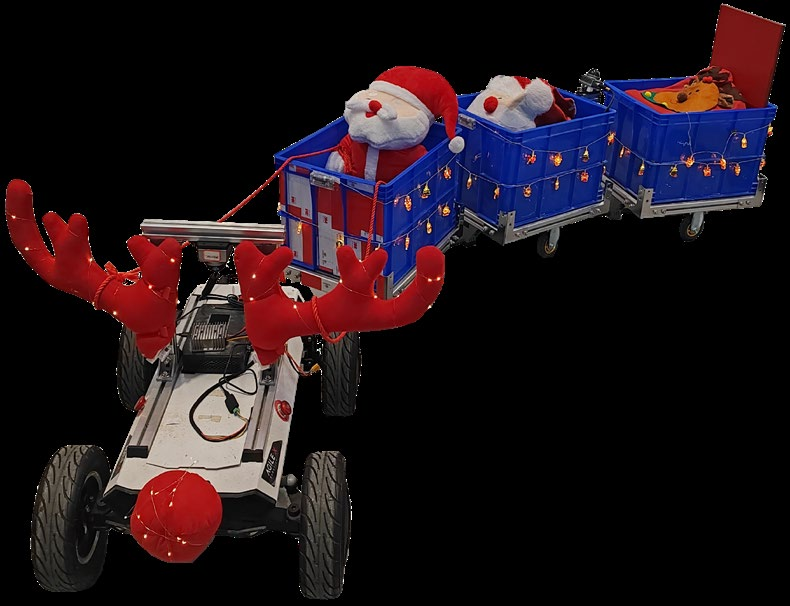

**图 4**：Fig. 4: 机器人的软件系统。感知模块包括机器人的全局定位、自身状态估计和可通行性评估。规划与控制模块包括所提出的规划流程和轨迹跟踪控制器。

路径长度以及每个车体距离目标区域的距离，并选择其中具有最小代价值的路径作为轨迹优化的初始值。具体而言，假设牵引车路径长度为 ltra，第 i 个挂车的终端位置与目标凸多边形区域之间的距离为 dit，i = 1, 2, ..., N，则路径代价为 Costtraj = wr2 ltra + wtrailer \sum_{i=1}^N dit，其中 wr2 和 wtrailer 是权重。在我们的算法中，如果第 i 个挂车的终端位置在目标凸区域内，则 dit 将被设置为零。所提方法的伪代码见算法 1。
在算法 1 中，O 和 C 分别指代开放列表和关闭列表。而 E 则用于存储扩展过的节点以进行剪枝，从而加快搜索过程。T 包含不同的终端状态，每个状态 {pe_λ, θe_λ} 由凸多边形每条边的中点 pλc 和牵引车的长度 Lf 决定，pe_λ = pλc − (Lrear + 0.5Lf)nλ，θe_λ = atan2(nλ(1), nλ(0))。为了进一步加速该过程，当当前节点与终端状态之间的距离小于阈值 dshoot 时，我们还采用 Dubins 曲线 [47] 来向终端状态进行连线（shoot）以实现提前终止。一旦我们获得了牵引车的可行路径，将估计路径中两个相邻状态之间的 v0 和 θ0 的变化量。然后我们

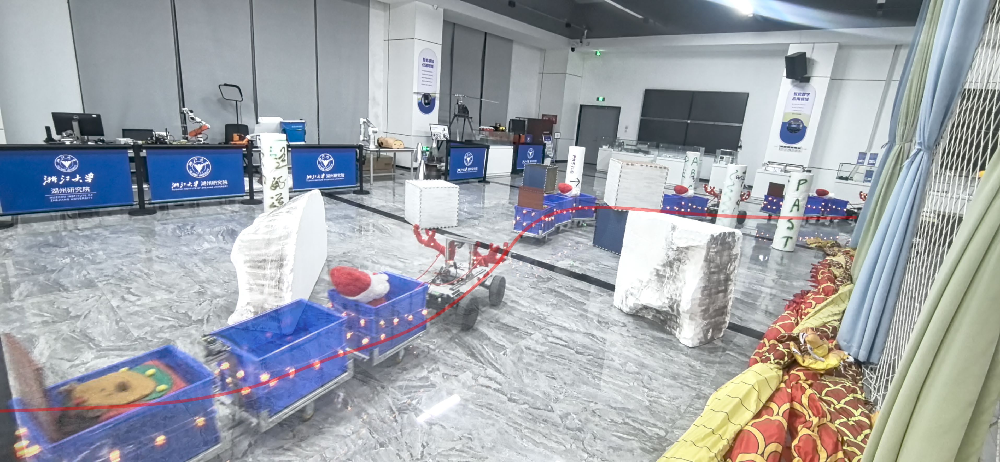

**图 5**：Fig. 5: 室内实验区域的一部分。牵引挂车机器人正在穿越复杂的室内环境。

表 I：真实世界实验统计数据
统计数据
实验
均值
最大值
标准差
ˆv0 (m/s)
室内 (Indoor)
1.03
1.20
0.215
室外第1次 (Outdoor 1st)
1.05
1.20
0.188
室外第2次 (Outdoor 2nd)
1.07
1.20
0.184
ˆa (m/s2)
室内 (Indoor)
0.0651
0.649
0.0685
室外第1次 (Outdoor 1st)
0.0758
0.625
0.0758
室外第2次 (Outdoor 2nd)
0.0878
0.739
0.0883
ˆalat (m/s2)
室内 (Indoor)
0.117
0.754
0.102
室外第1次 (Outdoor 1st)
0.139
0.641
0.111
室外第2次 (Outdoor 2nd)
0.157
1.16
0.125
ˆδθ (rad)
室内 (Indoor)
0.137
0.427
0.0930
室外第1次 (Outdoor 1st)
0.110
0.442
0.0887
室外第2次 (Outdoor 2nd)
0.0899
0.452
0.0828
跟踪误差 (m)
室内 (Indoor)
0.115
0.172
0.0226
室外第1次 (Outdoor 1st)
0.115
0.248
0.0270
室外第2次 (Outdoor 2nd)
0.114
0.242
0.0211
通过离散化公式 (6) 来近似挂车的状态。状态转移方程公式 (1)、(2) 和 (4) 也将被离散化，以便将离散化的 v0 和 δ 作为控制输入来扩展状态。在本文中，我们使用不同值的加权和作为代价函数 g，包括扩展的距离、偏航角 θ0 变化的幅度，以及控制量随时间的累积。对于启发式函数 h，我们选择到目标区域中心的最短欧几里得距离。

IV. 实验结果
A. 实施细节
为了验证我们的方法在实际应用中的性能，我们将其部署在牵引挂车机器人上，如图 3 所示。该机器人由阿克曼底盘驱动，并搭载了三个易于拆卸的无动力挂车。我们使用铰链将挂车与牵引车以及挂车与挂车连接起来。

**图 4**：Fig. 4 展示了机器人的软件系统。在感知模块中，我们结合使用了激光雷达和

---

## 原文第 9 页核心内容与翻译

①
②
③
①
②
④
⑤
⑥
④
⑤
⑥
③

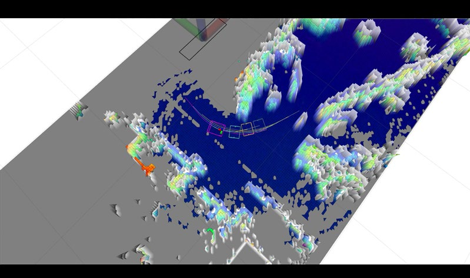

**图 6**：室内实验的完整过程。不同数字表示不同时间的第三人称视角或对应的 Rviz 视角。在 Rviz 中，彩色部分表示以机器人为中心的高程地图，半透明的黑白部分表示可通行性地图，颜色越深表示越难通行。

系统使用反光标记 [48], [49] 获取机器人状态，包括牵引车位姿和每辆挂车的偏航角。后车上的反光标记会为前车上的激光雷达提供高强度点云；筛选这部分点云并计算拟合平面的法向量，即可得到两车之间的相对位姿。两个激光雷达分别运行激光雷达—惯性里程计 LIO。将牵引车激光雷达建立的初始点云地图作为挂车 LIO 的初始地图，即可对齐两个 LIO 的坐标系。本文采用 FAST-LIO2 [50] 作为 LIO 算法。
配准后的点云和机器人状态进一步用于构建高程地图 [51] 并评估可通行性。为满足实时性，系统通过光线投射去除动态障碍物，并借助 GPU 并行计算点云协方差矩阵 [52]。随后以并行方式用最近邻方法补齐未观测栅格，计算每个栅格拟合平面的法向和近似曲率 [53]，再通过可通行性阈值生成以机器人为中心的最终占据栅格地图。该地图送入规划与控制模块，由高效的 O(n) 算法 [54] 计算符号距离场 SDF。
当定时器触发或目标区域更新时，系统启动重规划，以机器人当前状态或预测状态作为起点调用 SE(2)-MHA，并进行轨迹优化。MPC 控制器接收优化轨迹，计算速度和转向角控制指令；其状态包括牵引车位置以及所有车辆的偏航角。目标函数同时考虑状态与参考状态之间的误差，以及控制输入的大小。系统使用 Casadi [55] 构造 MPC 问题，并通过序列二次规划求解。

---

## 原文第 10 页核心内容与翻译

Start
: Edges of obstacles
Goal
FPV1
Rviz1
Rviz2
FPV2

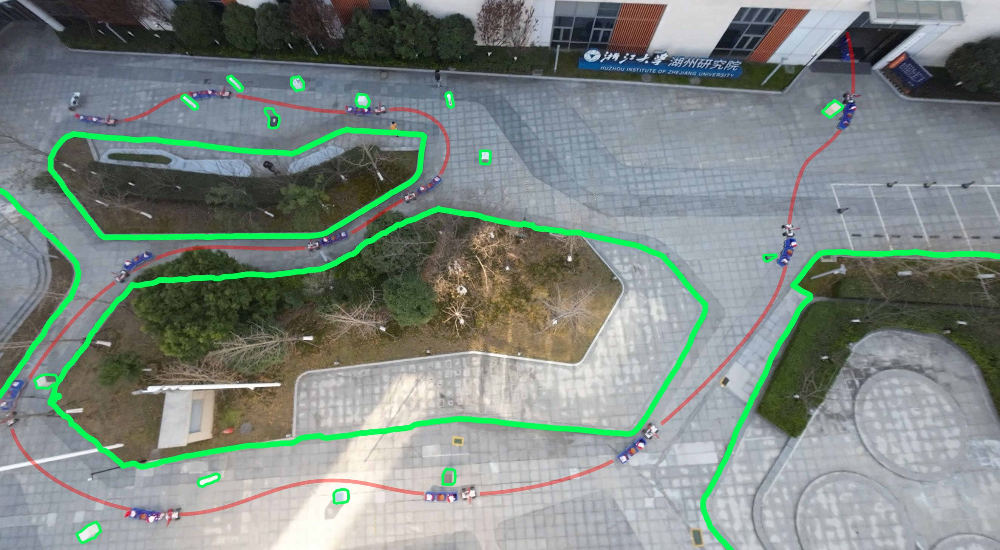

**图 7**：第二组室外实验场景。牵引挂车机器人使用所提出的规划算法自主穿过园区，并通过自动门进入建筑物内部。

系统通过序列二次规划求解。我们还基于 ROS1 构建了多个仿真环境，用于验证方法在不同场景中的有效性，并与其他算法进行对比，详见第 IV-C 和 IV-D 节。所有仿真均在 Ubuntu 20.04、Intel i9-14900 CPU 和 GeForce RTX 4090D GPU 上运行。
B. Real-World Experiments
我们在室内和室外的复杂环境中进行了多组实验。室内实验设置牵引挂车机器人运输、装载和卸载货物，以展示所提出导航系统的实际应用，如图 6 的截图所示。实验开始时，货物放在其中一辆挂车上。机器人收到装卸货区域后，利用实时更新的地图持续重规划轨迹，以避开未知障碍物。穿过图 5 所示的复杂环境并到达装卸货停车区后，机器人继续重规划，返回起始区域。
为在更多场景中验证所提框架，我们开展了两组室外实验。第一组场景是图 1 所示的非机动车停车区旁通道，环境中有立方体、圆柱体、手推车、汽车、自行车和电动自行车等多种障碍物，机器人需要不断重规划以避开障碍并通过狭窄通道。第二组室外实验如图 7 所示，机器人需要装载货物，并依次驶向预设航点进入建筑物。与室内实验类似，机器人通过实时更新的局部可通行性地图感知环境，持续重规划以避开沿途未知障碍物，最终通过触发自动门进入建筑物。
1https://www.ros.org/
在真实环境实验中，纵向速度、纵向加速度、横向加速度、曲率以及相邻车辆之间的偏航角差分别限制为 vmlon = 1.2m/s、amlon = 0.8m/s2、amlat = 1.2m/s2、κmax = 0.6m−1 和 δθmax = 0.9 rad。同时将时间权重 ρt 设为 10.0，以保证轨迹具有足够的行驶积极性。
表 I 给出了机器人在真实环境实验中的动态指标。其中，ˆv0 是由车轮转速计得到的牵引车估计纵向速度；ˆa 和 ˆalat 分别是由随激光雷达安装的 IMU 测得的纵向加速度和横向加速度；ˆδθ 是由机器人估计状态得到的相邻车辆偏航角差的最大值。跟踪误差是牵引车当前位置与参考位置之间的距离。
对 ˆv0 随时间积分，得到牵引车在室内、第一组室外和第二组室外实验中的行驶距离分别为 36.178m、26.774m 和 81.987m。由表 I 可见，机器人穿越环境时保持了较高速度和较小跟踪误差。纵向、横向加速度的均值和方差较小，说明即使面对未知环境需要持续重规划，机器人仍能保持较高稳定性。各指标的最大值也表明，实验过程中没有违反预设约束。更多演示见随附的多媒体材料。

---

## 原文第 11 页核心内容与翻译

表 II：停车场仿真的关键参数设置。M.P. 表示本文提出的方法，M.O. 表示 OCP-STC [7]。缩写 m.s.、mu.s.、b.p.、l.s.、m.c.t. 分别表示“内存大小”“障碍参数更新策略”“边界推动”“线性求解器”和“最大 CPU 时间”。
类型
参数
说明
设置
本文方法（M.P.）
Lq
从前端路径提取状态点并作为优化变量的间隔
5 m
K
每条分段多项式轨迹中用于施加约束的采样点数量
16
m.s.
L-BFGS 中用于近似 Hessian 逆矩阵的修正次数
64
δinner
L-BFGS 的期望收敛容差
1.0−4
past
基于变化量的收敛检验距离
3
Niter
L-BFGS 的最大迭代次数
10000
ϵcond
ALM 的期望收敛容差
1.0−1
Nout
ALM 的最大迭代次数
100
对比方法（M.O.）
Lfe
根据前端路径初始化有限元的间隔
0.3 m
mu.s.
障碍参数的更新策略
adaptive
b.p.
初始点到边界的期望最小绝对距离
1.0e−8
l.s.
Ipopt 使用的核心线性求解器
MA97
m.c.t
Ipopt 求解单个问题允许使用的 CPU 时间上限
200.0 s
C. 案例研究
在停车场场景中，我们使用两种不同的初值获取方法，对本文方法和 OCP-STC [7] 进行了定性和简单的定量比较，如图 8 所示。OCP-STC [7] 是一种面向非结构化环境中牵引挂车机器人的高效轨迹优化方法，使用 Ipopt [56] 作为求解器，并利用安全行驶走廊施加避障约束。本实验设置 L0 = 2.7m、N = 3、L1 = L2 = L3 = 4.0m，牵引车和挂车的宽度 Lw = 2.0m。运动学约束相关常数设置为 vmlon = 10.0m/s、amlon = 5.0m/s2、amlat = 10m/s2、κmax = 0.95m−1、δθmax = 1.47rad。与原论文 [7] 一致，我们使用 AMPL [57] 构建 OCP-STC [7] 的优化问题。优化算法的关键参数列于表 II。使用文献 [3] 提出的改进 Hybrid-A* 作为初值时，结果如图 8(a) 所示。由于场景中存在狭窄空间和大幅转弯，很难为机器人每个车体的安全走廊生成合适的前端路径种子，因此 OCP-STC [7] 会产生更大的转弯，也没有充分利用停车区域边缘的无碰撞空间。
定量比较结果见表 III。SE(2)-MHA 只在牵引车的 SE(2) 空间中扩展状态，并不检查挂车碰撞，因此与 Hybrid-
(a) 本文方法 + Hybrid-A*；OCP-STC [1]。 (b) 本文方法 + SE(2)-MHA；SE(2)-MHA。

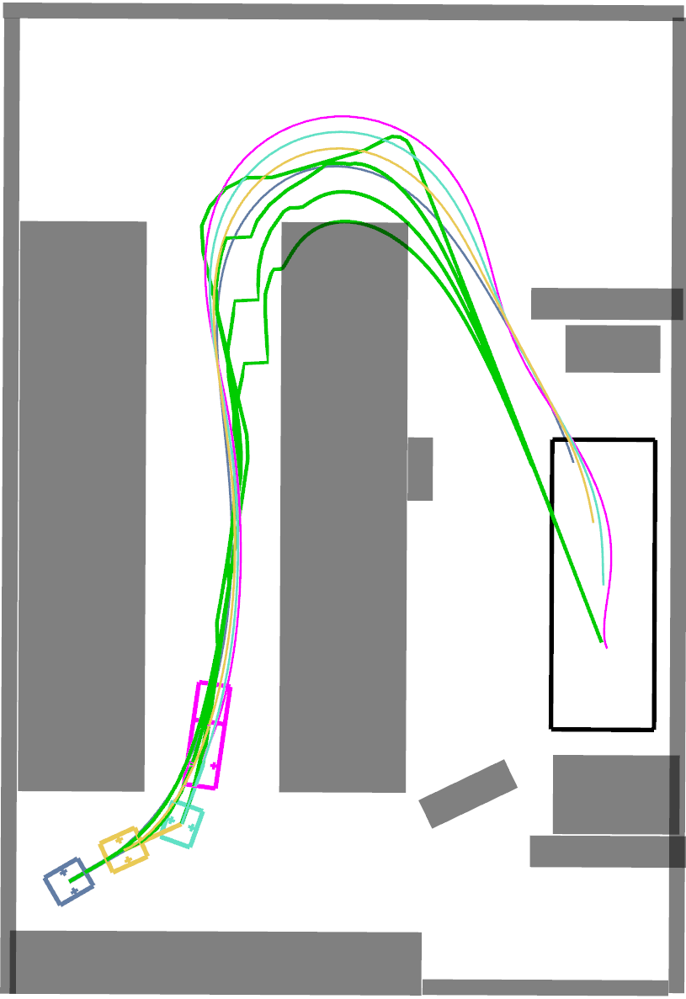

**图 8**：推土机牵引三辆运输车进入停车场中的停车区域。图（a）展示了该任务以及以 Hybrid-A* 作为前端生成的轨迹；图（b）中的灰色区域表示障碍物分布。

尽管这种初值会增加优化时间，但可以缩短总体规划时间。基于走廊的方法 OCP-STC [7] 要求初值完全无碰撞，才能生成安全走廊，因此 SE(2)-MHA 不能作为其初值。此外，走廊会压缩问题的可行解空间，在本场景中无法包含更优解，导致轨迹更长。
第二个案例是在仿真村庄中进行消融实验，用于说明松弛弧长的重要性，如图 9 所示。其中 vs 是为避免奇异性而设置的最小速度约束。本实验设置 L0 = 2.6m、N = 3、L1 = L2 = L3 = 4.0m，牵引车和挂车的宽度 Lw = 2.8m。运动学约束相关常数设置为 vmlon = 10.0m/s、amlon = 5.0m/s2、amlat = 2m/s2、κmax = 0.99m−1、δθmax = 1.47rad。优化算法的关键参数与表 II 中相同，分别用于采用和不采用松弛弧长 s 的方法。图 9(b) 中的黑色虚线表示约束边界。可以看出，vs 越小，奇异性对轨迹优化的影响越明显。虽然较小的 vs 有助于优化器约束机器人的最大曲率，但会使牵引车在初始状态和终止状态附近的速度突变更加严重，这与真实情况不符，也可能增加精确跟踪轨迹的难度。我们引入基于模型预测控制（MPC）的控制器 [58] 来测量跟踪误差。

---

## 原文第 12 页核心内容与翻译

表 III：停车场实验统计数据
前端方法
方法
搜索时间（ms）
优化方法
走廊生成时间（ms）
优化时间（ms）
规划总时间（s）
轨迹长度（m）
Hybrid-A*
1224
OCP-STC
27.7
2892.5
4.14
100.7
本文方法
0.0
156.36
1.38
86.75
SE(2)-MHA
178.7
OCP-STC
/
/
/
/
本文方法
0.0
185.53
0.364
86.66
本文方法 + Hybrid-A*，不使用 s，vs = 0.01
本文方法 + Hybrid-A*，不使用 s，vs = 0.1
本文方法 + Hybrid-A*，不使用 s，vs = 1.0
本文方法 + Hybrid-A*，使用 s
（a）仿真中的轨迹。
0
2
4
8
10
12
6
时间（s）
10
8
6
4
2
0
速度（m/s）
本文方法 + Hybrid-A*，不使用 s，v_s = 0.01
本文方法 + Hybrid-A*，不使用 s，v_s = 0.1
本文方法 + Hybrid-A*，不使用 s，v_s = 1.0
本文方法 + Hybrid-A*，使用 s
0
2
4
8
10
12
6
时间（s）
1.5
1.0
0.5
0.0
0.5
1.0
1.5
（m⁻¹）
0
2
4
8
10
12
6
时间（s）
1.0
0.8
0.6
0.4
0.2
0.0
跟踪误差（m）
：违反约束
：速度极不连续
（b）优化轨迹的速度、曲率和跟踪误差曲线。

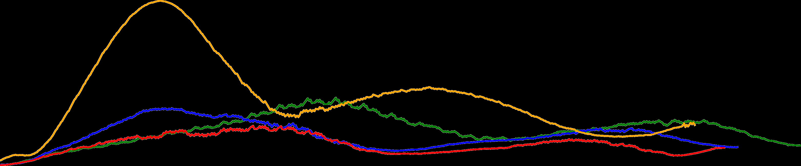

**图 9**：牵引车牵引三辆运输挂车穿过仿真村庄环境。图（a）中的曲线表示牵引车的轨迹。

仿真中的跟踪误差。在本文中，牵引挂车机器人的跟踪误差定义为机器人所有车体跟踪误差的平均值。统计结果见表 IV，曲线见图 9(b)。不使用 s 的优化轨迹由于在初始和终止阶段出现速度突变或约束违反，跟踪误差更大。尤其当 vs = 1.0 时，极不连续的速度使控制器在起始阶段几乎发散。
表 IV：消融实验的跟踪误差统计数据
方法 | 平均跟踪误差（m） | 最大跟踪误差（m） | 标准差（m）
本文方法（不使用 s）
vs = 0.01
0.227
0.434
0.0959
本文方法（不使用 s）
vs = 0.1
0.191
0.366
0.0868
本文方法（不使用 s）
vs = 1.0
0.443
1.06
0.259
本文方法（使用 s）
0.133
0.254
0.0595
Gazebo 仿真
Rviz
机器人

**图 10**：基于 Gazebo 的物理仿真。在 Rviz 中，紫色部分表示障碍物；点云高度从低到高用由白色到紫色的颜色表示。

 D. 基准比较
如图 10 所示，我们在 40m × 40m 的仿真环境中进行基准比较，环境内随机生成三角形、四边形和五边形障碍物。机器人初始状态和目标区域均随机设置，其中初始状态包括牵引车的 SE(2) 状态以及每辆挂车的偏航角。考虑到现实中的停车区域通常为矩形，我们将目标区域设为矩形。牵引车的长和宽分别设为 0.6m 和 0.4m，挂车的长和宽均设为 0.4m，最大速度为 2.0m/s，最大

---

## 原文第 13 页核心内容与翻译

1
2
3
挂车数量
100
300
500
平均优化时间（ms）
OCP-STC
SE(2)-MHA
OCP-STC
Hybrid-A*
本文方法（不使用 s）
SE(2)-MHA
本文方法（不使用 s）
Hybrid-A*
本文方法（使用 s）
SE(2)-MHA
本文方法（使用 s）
Hybrid-A*
近距离
(3m ~ 10m)
中距离
(10m ~ 20m)
远距离
(20m ~ 40m)
到目标区域的距离
0
100
200
300
400
平均优化时间（ms）

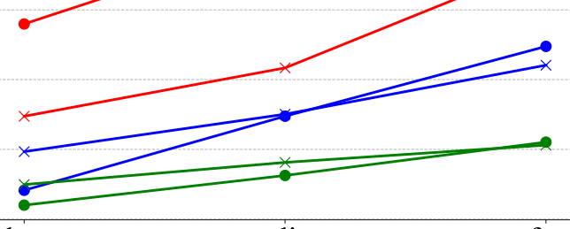

**图 11**：中等障碍物密度环境中，平均优化时间随问题维度变化的折线图。

纵向加速度上限为 2.0m/s2，发生折叠效应的最小角度为 1.47rad。牵引车轴距设为 0.5m，最大转向角设为 0.7rad。所有算法的参数均经过细致调整以获得最佳性能。
此外，优化算法的关键参数
优化算法的关键参数与表 II 一致；
考虑到场景和机器人尺寸，本实验设置
Lq = 1.0m、K = 8、Lfe = 0.1m。与第 IV-C 节相同，
我们遵循原论文 [7]，使用
AMPL [57] 部署 OCP-STC。
在上述环境中测试了两种初值获取方法和三种优化方法。初值获取方法为本文提出的 SE(2)-MHA 和 Hybrid-A*；后者是文献 [3] 提出的路径搜索方法，在完整的 R × SO(2)N+1 状态空间中进行搜索。优化方法包括 OCP-STC [7]、本文不使用 s 的方法和本文使用 s 的方法，其中 w.o. s 和 w. s 分别表示是否将松弛弧长作为优化变量。我们在不同障碍物密度的环境中比较这些方法，并分别设置挂车数量 N 为 1、2 和 3。此外，还分别测试牵引车后轮中心到目标区域中心距离为 3m～10m、10m～20m 和 20m～40m 的任务。每种条件均进行了 100 次以上的比较测试。

**图 11**：图 11 展示了轨迹优化时间
随问题规模的变化。无论采用哪种方法
获取初值，使用
松弛弧长 s 的本文方法优化耗时均最少。
随着挂车数量增加以及
目标区域距离变远，该方法的
计算耗时增长也较慢。这是因为在问题规模相近时，
这是因为在问题维度相近时，

OCP-STC
本文方法（不使用 s）
本文方法（使用 s）
0
6
12
18
24
失败率（%）
6.18
4.58
0.133
17.6
17.2
3.84
Hybrid-A*
SE(2)-MHA

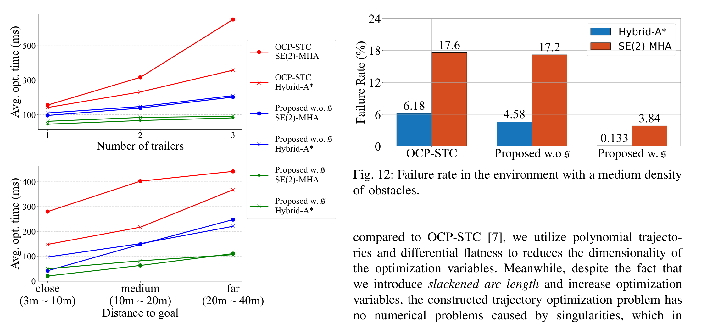

**图 12**：中等障碍物密度环境中的失败率。

与 OCP-STC [7] 相比，我们使用多项式轨迹和微分平坦性降低了优化变量的维度。
虽然引入松弛弧长会增加优化变量，但构建的轨迹优化问题不会出现由奇异性造成的数值问题，更容易收敛到局部最优解，因此优化时间更短。不使用松弛弧长时，随着问题变复杂、约束增多，奇异性的影响会更加明显，优化效率也会大幅下降。此外，从图 11 还可以看出，OCP-STC [7] 对初值依赖较强。Hybrid-A* 提供的无碰撞路径能够显著缩短优化时间。

**图 12**：图 12 展示了不同初值选择
方法对三种方法成功率的影响，
场景障碍物密度为中等。OCP-STC [7]
优化耗时超过
30 秒即视为失败；本文不使用 s 和使用 s 的方法在
PHR-ALM 迭代次数超过 50 次时视为失败。Hybrid-A*
Hybrid-A* 在完整状态空间中搜索并能够提供无碰撞初值，因此各优化器的成功率均高于使用 SE(2)-MHA 的情况。但根据初值为所有车体生成走廊，在较狭窄的环境中可能产生不可行问题，使 OCP-STC [7] 的失败率更高。不使用 s 时，奇异性会导致较差的优化初值，优化器可能无法在有限步数内收敛，或收敛到不满足约束的局部最小值，因此本文不使用 s 的方法失败率也较高。使用 SE(2)-MHA 时，可能无法根据初值生成走廊，从而使 OCP-STC [7] 的失败率明显升高；较差的初值还会进一步放大奇异性对本文不使用 s 方法的影响，导致失败率增加。SE(2)-MHA 也会使本文使用 s 的方法出现更多失败，这主要是由于 SE(2)-MHA 本身并不完备：它为了提高效率而牺牲了生成无碰撞路径的能力，因此更容易生成使优化器无法找到可行局部最小值的初值。

关于效率和质量的更多结果汇总于表 V。

---

## 原文第 14 页核心内容与翻译

表 V：不同条件下的基准比较
N
环境
低复杂度
(10, 10, 10)
中复杂度
(20, 20, 20)
高复杂度
(40, 40, 40)
方法
轨迹长度 ltraj（m）
轨迹时间 td（s）
曲率 κ（m−1）
ltraj (m)
td (s)
κ(m−1)
ltraj (m)
td (s)
κ(m−1)
1
Hybrid-A*
(89.57%)
(926.2ms)
OCP-STC
17.80
11.68
0.3267
17.98
12.83
0.3381
18.68
15.08
0.3593
本文方法（不使用 s）
17.46
10.58
0.3829
17.38
10.55
0.4198
17.55
10.60
0.4163
本文方法（使用 s）
17.27
9.959
0.2489
17.23
9.940
0.2595
17.39
10.00
0.2603
SE(2)-MHA
(98.49%)
(115.7ms)
OCP-STC
17.69
11.24
0.3389
18.44
13.75
0.3458
19.32
20.04
0.5986
本文方法（不使用 s）
17.32
10.61
0.4935
17.29
10.56
0.5095
17.84
11.11
0.5504
本文方法（使用 s）
17.30
10.05
0.2469
17.23
9.956
0.2474
17.72
10.24
0.2733
2
Hybrid-A*
(84.80%)
(904.6ms)
OCP-STC
18.14
11.41
0.2687
18.76
13.65
0.2955
18.87
17.79
0.2948
本文方法（不使用 s）
17.88
10.80
0.3629
18.11
11.09
0.3609
17.75
10.81
0.3735
本文方法（使用 s）
17.58
10.10
0.2353
17.84
10.23
0.2395
17.53
10.07
0.2416
SE(2)-MHA
(98.53%)
(132.1ms)
OCP-STC
18.57
12.18
0.3017
19.92
18.11
0.3171
20.49
29.39
0.3401
本文方法（不使用 s）
18.02
11.27
0.5010
18.29
11.19
0.4965
18.75
11.44
0.4731
本文方法（使用 s）
17.69
10.17
0.2470
18.04
10.34
0.2410
18.49
10.56
0.2535
3
Hybrid-A*
(75.05%)
(887.7ms)
OCP-STC
19.30
12.72
0.2799
19.10
13.90
0.2710
19.44
18.25
0.3619
本文方法（不使用 s）
18.75
11.35
0.3489
18.21
10.99
0.3475
18.24
11.11
0.2844
本文方法（使用 s）
18.46
10.55
0.2231
17.94
10.28
0.2156
17.97
10.29
0.2274
SE(2)-MHA
(98.50%)
(109.8ms)
OCP-STC
19.79
15.39
0.3330
20.36
22.64
0.3136
20.87
30.71
0.4271
本文方法（不使用 s）
18.26
11.41
0.5202
18.48
11.47
0.4662
18.92
11.78
0.4899
本文方法（使用 s）
17.96
10.33
0.2376
18.21
10.44
0.2317
18.57
10.61
0.2540
表 V 中，环境复杂度下的三元组（x，y，z）分别表示三角形、四边形和五边形随机障碍物的数量。ltraj 表示牵引车轨迹的平均长度，td 表示优化轨迹的平均持续时间，κ 表示牵引车的平均曲率，用于反映轨迹的平滑程度。前端路径搜索时间超过 5 秒的情况计为失败。
从表中可以看出，随着挂车数量增加，SE(2)-MHA 的成功率和计算时间变化不大：成功率均高于 98%，耗时均低于 140 ms。这是因为它只在 SE(2) 空间中搜索，并通过数值积分近似获得挂车轨迹。相比之下，Hybrid-A* 需要在完整状态空间中进行搜索和碰撞检测，在 5 秒时间限制下，挂车数量越多，成功率越低；其平均耗时至少是 SE(2)-MHA 的 7 倍。
在表 V 中，Hybrid-A* 与本文使用松弛弧长的方法组合，在大多数情况下表现最好。Hybrid-A* 对状态空间搜索得更充分，得到的初值通常优于 SE(2)-MHA。多数情况下，以 SE(2)-MHA 为初值的本文方法位居第二，与“Hybrid-A* + 本文使用松弛弧长”的差距较小。虽然本文不使用松弛弧长时的轨迹长度和持续时间在多数情况下略优于 OCP-STC [7]，但由于无法处理奇异性，牵引车轨迹的平均曲率在许多情况下最大。OCP-STC [7] 为每个车体生成安全走廊，这可能缩小可行域并排除较优解，因此在轨迹长度和持续时间方面不如本文方法。
挂车数量 N=1
挂车数量 N=2
挂车数量 N=3
0.5
0.4
0.3
0.2
0.1
0.0
跟踪误差（m）
0.6
最大值
第三四分位数
平均值
中位数
第一四分位数
最小值
0.65
本文方法（不使用 s）
vs = 0.01
本文方法（不使用 s）
vs = 0.1
本文方法（不使用 s）
vs = 0.5
OCP-STC
本文方法（使用 s）

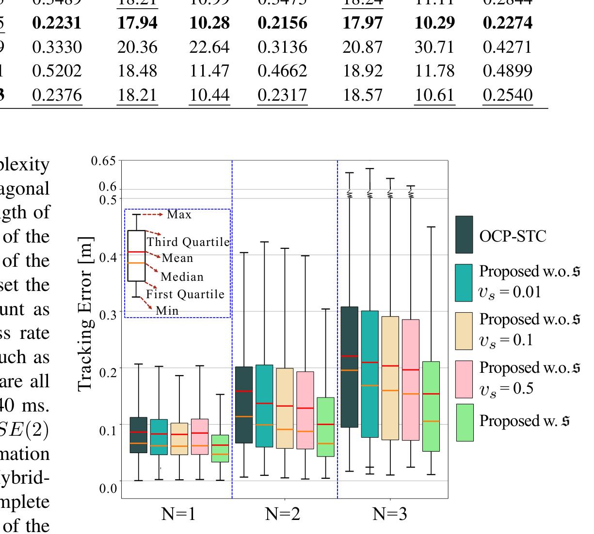

**图 13**：各条轨迹执行过程中的跟踪误差统计分析。

为进一步评估轨迹的执行性能，我们使用 Gazebo [59] 将真实实验中的机器人建模为图 10 所示的物理仿真系统。针对不同挂车数量的机器人，分别记录 100 条以上轨迹，并按照消融实验的方式测试跟踪误差，结果如图 13 所示。与不使用松弛弧长 s 的方法相比，本文方法使轨迹跟踪误差降低了近 20%；与 OCP-STC [7] 相比，本文方法的跟踪误差也更小。我们认为，这得益于高阶连续的多项式轨迹表示。与采用离散运动过程的方法相比，本文方法基本保证了状态及其有限阶导数的连续性，使生成轨迹更接近真实物理运动过程，也更容易执行。

---

## 原文第 15 页核心内容与翻译

𝜃𝜃0
𝜃𝜃2
𝜃𝜃1
𝒑𝒑𝟐𝟐
𝑣𝑣0
𝑣𝑣1
𝑣𝑣2
𝐘𝐘
𝐗𝐗
O
𝒑𝒑𝟏𝟏
𝒑𝒑𝟎𝟎
𝜃𝜃0
𝜃𝜃2
𝒑𝒑𝟐𝟐
𝑣𝑣2
𝐘𝐘
𝐗𝐗
O
𝑣𝑣0
𝒑𝒑𝟎𝟎
𝛽𝛽2
𝒑𝒑𝒐𝒐𝟐𝟐
(a)
(b)
𝒑𝒑𝟏𝟏
𝑣𝑣1
𝜃𝜃1
𝒑𝒑𝒐𝒐𝒐𝒐
𝛽𝛽1
𝒑𝒑𝒇𝒇𝟐𝟐
𝒑𝒑𝒇𝒇𝒇𝒇

**图 14**：本文（a）与文献 [30]（b）研究的不同牵引挂车模型。

derivatives, making our trajectories closer to real physical
motion processes, and thus easier to execute.
V. 讨论
A. Generalizability
In this work, we focus on tractor-trailer robots with trailers
having only two passive wheels, as shown in Fig. 14(a).
However, there are also tractor-trailer robots with trailers
having four passive wheels in the real world, as shown in
Fig. 14(b), which had been studied in the work [30]. In this
setup, each trailer has four passive wheels, two axles, an on-
axle hitch (points po1 and po2) and an off-axle hitch (points
pf1 and pf2). This trailer model is more elaborate with the
advantage of reducing the forces on the linkage, while making
the motion of the trailer smoother and less likely to result
in jackknife [4]. Despite such a more complex trailer model,
with two more degrees of freedom compared to the model we
studied, our method can still be quickly transferred on it, with
only simple modifications to the optimization variables and
constraints. Taking the example of a tractor with two identical
trailers, the kinematic model for a robot similar to the one in
the work [30] is:
˙x0(t) =v0(t) cos θ0(t),
(63)
˙y0(t) =v0(t) sin θ0(t),
(64)
˙v0(t) =a(t),
(65)
˙θ0(t) =v0(t)tan δ(t)
L0
,
(66)
˙β1(t) =v0(t) sin(θ0(t) −β1(t))
Lh
−Lt ˙θ0(t) cos(θ0(t) −β1(t))
Lh
,
(67)
˙θ1(t) =vf1(t) sin(β1(t) −θ1(t))
Lw
,
(68)
˙β2(t) =v1(t) sin(θ1(t) −β2(t))
Lh
−Lt ˙θ1(t) cos(θ1(t) −β2(t))
Lh
,
(69)
˙θ2(t) =vf2(t) sin(β2(t) −θ2(t))
Lw
,
(70)
Optimized  
Trajectory
SE(2)-MHA
Tractor-trailer
robot
Obstacles
Target Area
t = 0.0 s
t = 5.5 s
t = 9.2 s
t = 13.4 s

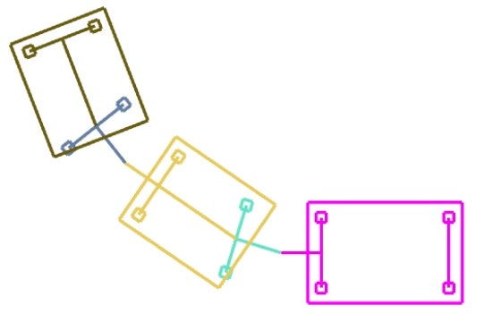

**图 15**：本文流程可以推广到文献 [30] 研究的更复杂模型。

其中 v0、a、δ、L0 分别为牵引车速度、纵向加速度、转向角和轴距；Lt 为前车后中心到偏置连接点的距离；Lh 为挂车偏置连接点到轴上连接点的距离；Lw 为挂车轴距。vf1、v1 和 vf2 按式（67）～（70）中的关系计算。

与本文研究的模型相比，只需增加 β1 和 β2 两条轨迹，并将轨迹优化问题中的运动学约束（34）改为约束（67）～（70），即可为这类机器人进行运动规划。如图 15 所示，我们在 ROS 环境中进行了仿真，要求机器人穿越含有障碍物的区域并到达目标区域。面向该复杂挂车模型的代码也已在 GitHub 的 general model 分支中开源，供研究者参考。
为进一步展示算法的可推广性，我们在更大尺寸的机器人上开展了真实环境实验。我们选用 PIX KIT 2.0 底盘作为牵引车，并设计了与文献 [30] 类似的挂车，如图 16A 所示。实验中，牵引车的最大纵向速度为 vmlon = 1.0m/s，最大纵向加速度为 amlon = 0.8m/s2，最大横向加速度为 amlat = 1.2m/s2，最大曲率为 κmax = 0.28m−1。为使控制指令更平滑，在轨迹优化中还将牵引车最大转向角速度限制为 ˙δmax = 0.6rad/s。

由于底盘控制接口为油门、制动和转向角，我们将轨迹跟踪控制器的输出改为加速度和转向角，并根据速度和加速度对油门—制动标定表进行插值，得到最终油门或制动指令。定位模块在每辆挂车上安装激光雷达并分别运行 LIO，将世界坐标系与牵引车上的 LIO 对齐。已知相邻车辆的绝对位置后，可利用余弦定理计算与轴上连接点对应的车轴偏航角 β1、β2。
2https://github.com/Tracailer/Tracailer/tree/general model

---

## 原文第 16 页核心内容与翻译

NUC11 Panther Canyon
Livox Mid-360
Lithium Battery
C
D
E
F
G
G
F
E
D
C
Cargo Area
Cargo being placed
A
B
t=2.1s
t=11.5s
t=29.5s
t=47.5s
t=71.0s
Livox Mid-360
PIX KIT 2.0
: Edges of obstacles
Intel i7 +
NVIDIA RTX3060

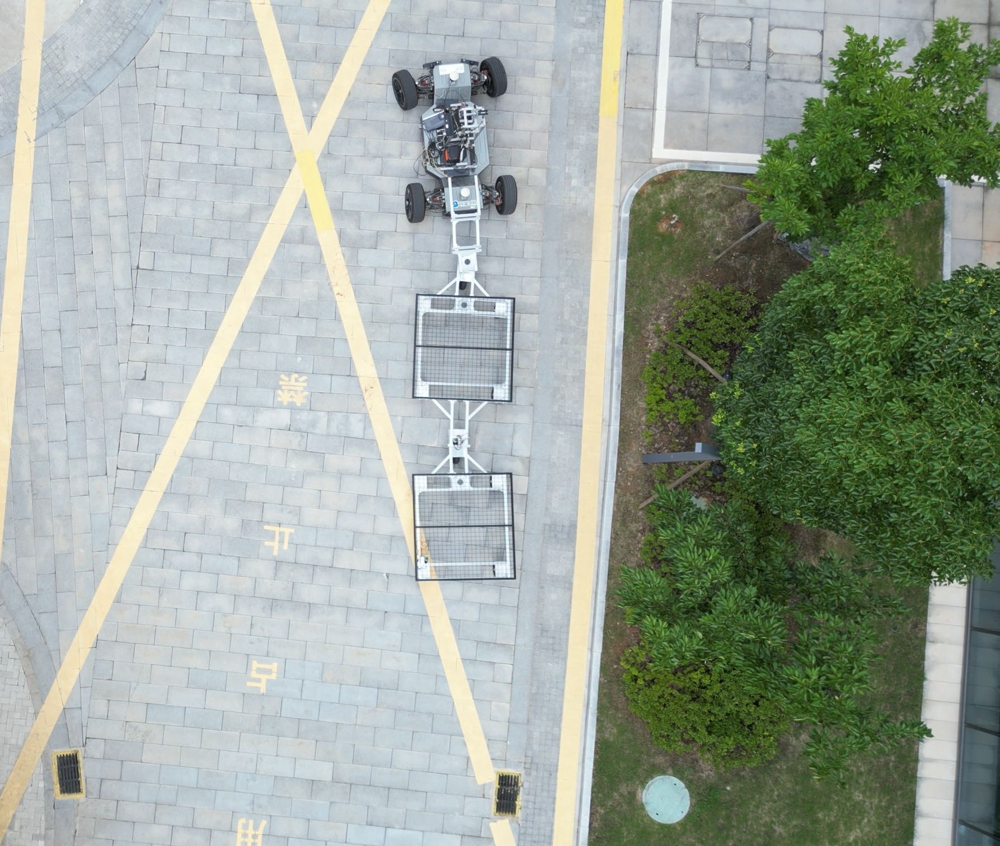

**图 16**：文献 [30] 所研究的更复杂模型的真实环境实验。A 图给出了机器人的组成和尺寸，B 图给出了实验场景俯视图，C～G 图给出了不同时间的第三人称视角或对应的 Rviz 视角。

我们在工业园区的一条道路上放置电动自行车、假山和箱子作为障碍物，并设置装货区域，如图 16B 所示。机器人需要避开障碍物，到达装货区域附近。工作人员装好货物后，机器人继续穿越障碍区域，具体过程见图 16C～G，完整过程见随附的多媒体材料。

### B. 不同不确定性和噪声下的测试
为进一步评估各种不确定性和噪声对规划器的影响，我们在 60m×10m 的未知环境中进行仿真，如图 17 所示。牵引挂车机器人采用真实环境实验中的相同参数，并配备能够感知长度不超过 10m 物体的全向雷达。规划器输出轨迹后，使用基于 MPC 的控制器 [58] 进行跟踪。
在真实环境中，不确定性和噪声主要来自感知模块和控制模块。前者主要包括环境障碍物感知的不确定性以及机器人状态估计的不确定性，后者主要来自机器人模型的不确定性。因此，我们从以下三个方面加入噪声：
1）环境感知不确定性：实验中机器人通过激光雷达感知环境，因此对激光雷达测得的距离加入噪声：ˆdi = di + ndi，i = 1, 2, ..., Nl。其中 di 为真实距离，Nl 为扫描距离的数量，ndi ∼ N(0, σ²d)，σd > 0 为正态分布的标准差。
2）机器人状态感知不确定性：由于牵引挂车机器人具有可变形结构，我们在挂车偏航角估计中加入噪声：ˆθi − ˆθi+1 = θi − θi+1 + nθi，i = 0, 1, ..., Nt。其中 θi 为真实偏航角，θ0 = ˆθ0 为牵引车偏航角，Nt + 1 = 3 为挂车数量，nθi ∼ N(0, σ²θ)。
3）机器人模型不确定性：参考文献 [12] 的模型不确定性实验，本文采用如下带噪声 nm 的运动学模型：
˙s = f(s, u, nm),
(71)
s = [x0, y0, v0, θ0, θ1, θ2, θ3]T,
(72)
u = [a, δ]T,
(73)
其中 [x0, y0] 为牵引车后轴中心位置，v0 为纵向速度，a 为纵向加速度，δ 为转向角，θ0 为牵引车偏航角，θi（i = {1, 2, 3}）分别为挂车偏航角。带噪声的状态转移方程 f 定义为：
f(s, u, nm) =q(s, u) + N(s, u, nm),
(74)
q(s, u) =[v0 cos θ0, v0 sin θ0, a, v0 tan δ/Lw,
v0 sin(θ0 −θ1)/Lt,
v1 sin(θ1 −θ2)/Lt,
v2 sin(θ2 −θ3)/Lt]T,
(75)
其中 v1 = v0 cos(θ0 − θ1)，v2 = v1 cos(θ1 − θ2)。Lw 为牵引车轴距，Lt 为挂车刚性连接杆长度，q 为理论状态转移函数，

---

## 原文第 17 页核心内容与翻译

无不确定性
牵引车轨迹
障碍物
与真实环境实验采用相同模型的机器人
：
高不确定性
随机初始状态或目标状态范围
：
来自激光雷达的点云

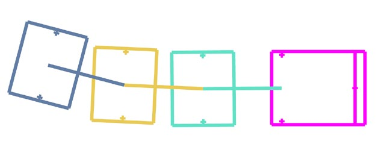

**图 17**：图 17：无不确定性和高不确定性条件下的运动轨迹可视化。

表 VI：不同不确定性条件下的轨迹运动特性统计。
不确定性
σd
(m)
σθ
(Deg)
延迟
(ms)
模型
M.R
S.R
(%)
M.TE
(cm)
M.TL
(m)
M.V
(m/s)
M.SR
(rad/s)
无不确定性
0
0
0
[0, 0]
33
100
1.67
55.80
0.98
0.030
低
0.05
1
0.02
[-0.05, 0.15]
34
100
2.73
55.94
0.93
0.033
中
0.1
2
0.05
[-0.075, 0.225]
43
100
5.07
56.18
0.87
0.042
高
0.15
4
0.07
[-0.1, 0.3]
248
84
9.59
58.45
0.45
0.060
其中 N = nmq 是与运动变化成正比定义的不确定性项。nm 是表示随机噪声强度的对角矩阵，其每个元素均服从 [h1，h2] 上的均匀分布。此外，在控制器和执行器之间加入延迟，以更好地模拟真实场景。
在本实验中，如果原轨迹与新发现的障碍物发生碰撞，或跟踪误差超过 0.1m，则触发重新规划。机器人在运动过程中撞到障碍物即视为本次尝试失败。根据噪声和延迟水平，将实验分为无不确定性、低不确定性、中不确定性和高不确定性四组。低不确定性条件下的 σd = 5cm 参考 Livox MID-360、Ouster [60] 等常见激光雷达的数据表和规格设置。σθ = 1° 参考 OMRON 和 HEIN LANZ 绝对编码器的规格设置。不同条件下的延迟和噪声则参考文献 [12] 关于模型不确定性的实验进行设置。
每组进行 100 次测试，并计算成功率 S.R、平均重规划次数 M.R、平均跟踪误差 M.TE、平均轨迹长度 M.TL、平均速度 M.V 和平均转向角速度 M.SR，定量结果汇总于表 VI。即使存在不确定性，凭借高频轨迹跟踪控制器和重规划能力，机器人仍表现出一定韧性；在高不确定性条件下，仍能以 84% 的成功率安全通过未知环境。本测试环境中的噪声强度实际上超过了绝大多数真实环境，因此这些严格仿真验证了流程的鲁棒性。
表 VI 还表明，高不确定性会带来更多超限跟踪误差，进而使重规划次数大幅增加。另一方面，重规划能够消除积累的跟踪误差，提高机器人应对不确定性的能力。但不确定性增加也会带来其他影响：平均跟踪误差和转向角速度增大，说明轨迹更难跟踪；平均速度降低、轨迹变长，则说明轨迹的最优性下降。未来将把可能的不确定性纳入控制器和规划器，以进一步提高系统的实际适用性和抗不确定性能力。
VI. 结论
本文提出了一种适用于牵引挂车机器人的新轨迹表示方法，并据此将运动规划建模为可简化、可由数值算法高效求解的优化问题。通过使用 SDF 表示环境并提出多终端路径搜索方法，我们实现了更高效的

---

## 原文第 18 页核心内容与翻译

我们在非结构化环境中实现了更高效的牵引挂车轨迹生成。
未来将进一步提高算法应对动态环境的能力。还可以引入机器学习或图形学技术，使自主导航更加智能，例如使用 RGB 相机获取语义信息、增强机器人与真实环境的交互，或减小轨迹扫掠体积以降低碰撞风险 [61]。通过这些工作，牵引挂车机器人在运输和物流任务中的应用前景将进一步扩大。
附录
A. 优化分析
在本文流程中，采用 PHR-ALM [45] 作为优化问题的数值求解器。它求解的原问题如下：
min
x
f(x)
(76)
s.t.
hi(x) = 0
i = 1, 2, ..., m
其中 h(x) = [h1(x), h2(x), ..., hm(x)]T。PHR-ALM 的详细步骤见算法 2。函数 FindSolution(L, x0) 表示以 x0 为起点、以 L 为目标函数迭代求解最小化问题。文献 [62] 给出了 PHR-ALM 的一个重要性质，如引理 1 所示；利用该引理，可以证明 PHR-ALM 收敛的充分条件，即定理 1。
算法 2：PHR-ALM
输入：问题（76）中的 f、h；起点 x0、λ0；γ > 1、ρ0 > 0。
输出：近似解 ˆx*。
开始
对 k = 0, 1, 2, ... 循环执行：
Lk
A ←f(x) + λT
kh(x) + 1
2ρk
Pm
i=1 h2
i (x);
xk+1 = FindSolution(Lk
A, xk);
如果 Convergence(f, h, xk+1) 成立，则返回 xk+1。
λk+1 = λk + ρkhk(xk+1);
ρk+1 = γρk;
引理 1：设 x∗ 是问题（76）的一个局部解，且该点满足 LICQ 条件（即
Jacobian 矩阵 ∇h(x∗) 行满秩），
存在拉格朗日乘子向量 λ∗，使得
∇xL(x∗, λ∗) = 0。进一步假设：对于所有 w ∈ {w|∇hi(x∗)Tw =
0，i = 1, 2, ..., m} 中的非零 w，都有 wT∇2xxL(x∗, λ∗)w > 0。
则存在正数 ρ̄、δ、ϵ 和 M，使得：
对于满足 ∥λk − λ∗∥ ≤ ρkδ 且 ρk > ρ̄ 的所有 λk 和 ρk，问题：
min
x
LA(x, λk, ρk) = f(x) + λT
kh(x) + 1
2ρk
m
X
i=1
h2
i (x)
(77)
s.t.
∥x −x∗∥≤ϵ
该问题有唯一解 x̂，且满足 ∥x̂ − x∗∥ ≤ M∥λk − λ∗∥/ρk、∥λ̂ − λ∗∥ ≤ M∥λk − λ∗∥/ρk。其中 L(x，λ) = f(x) + λTh(x)，λ̂ = λk + ρkh(x̂)。
定理 1：设 x∗、λ∗ 以及正数 ρ̄、δ、ϵ、M
满足引理 1 的条件。假设
∥λ0 − λ∗∥ ≤ ρ0δ 且 ρ0 > ρ̄。如果算法 2 中从 xk 开始、使 LkA 最小的 xk+1 满足 ∥xk+1 − x∗∥ ≤ ϵ，则有
limk→∞∥xk+1 −x∗∥= 0.
证明：在算法 2 中，每一步求解关于 LkA 的子问题时，都保证
∥xk+1 − x∗∥ ≤ ϵ，
xk+1 因此也是问题（77）的解。根据引理 1，问题（77）的解 x̂ 是唯一的，所以 x̂ = xk+1。因此有
lim
k→∞∥xk+1 −x∗∥≤lim
k→∞
M
ρk
∥λk −λ∗∥
≤lim
k→∞
M 2
ρkρk−1
∥λk−1 −λ∗∥
≤... ≤lim
k→∞(
k
Y
i=0
M
ρi
)∥λ0 −λ∗∥= 0,
最后一个等号成立，是因为根据算法 2，
ρk+1 = γρk = ... = γk+1ρ0。当 k →∞ 时，ρk →∞。
在本文流程中，我们求解如下形式的问题：
min
x
f(x)
(78)
s.t.
hi(x) = 0, i = 1, 2, ..., m,
gj(x) ≤0, j = 1, 2, ..., r,
其中 g(x) = [g1(x), g2(x), ..., gr(x)]T 为不等式
约束。实际应用中，我们将问题（78）转换为下面的等价问题，以匹配问题（76）的可求解形式。
min
x,s
f(x, s)
(79)
s.t.
hi(x) = 0, i = 1, 2, ..., m,
gj(x) + s2
j = 0, j = 1, 2, ..., r.
对于算法 2 中关于 LkA 的子问题，我们使用 L-BFGS [63] 求解。这是一种适合大规模无约束优化问题的高效拟牛顿方法。为检查约束是否得到充分满足，我们在算法 2 的收敛检验中加入与约束无穷范数有关的条件，即判断 ∥h(xk+1)∥∞ ≤ ϵcond 是否成立，其中 ϵcond 为正数。
下面给出所提算法的部分数值统计，用于展示约束满足程度；参数设置与基准比较实验相同。表 VII 展示了

---

## 原文第 19 页核心内容与翻译

表 VII：约束违反程度统计。
N
∥Kerr∥∞
Min. ˙s
PCT. δs
PCT. v0
PCT. a
PCT. alat
PCT. κ
PCT. SDF
max(de)
1
0.100
0.0423
0%
1.24%
1.13%
1.24%
1.74%
1.99%
3.60cm
2
0.100
0.0471
0%
1.24%
1.07%
1.20%
1.74%
1.99%
2.83cm
3
0.100
0.0140
0%
1.23%
1.02%
1.23%
1.75%
1.84%
3.00cm
表 VII 给出了基准比较中成功收敛的解的约束违反程度。
其中，
∥Kerr∥∞ 表示等式约束函数的无穷范数，
该函数由牵引挂车机器人的运动学模型引入，对应公式（34）。Min. ṡ 表示最小 ṡ，对应约束 ṡ ≥ 0。PCT. x 表示与 x 相关的约束违反比例。
PCT.δs = max(δ+ −min(δs), 0)
δ+
× 100%,
(80)
PCT.v0 = max(∥v0∥∞−vmlon, 0)
vmlon
× 100%,
(81)
PCT.a = max(∥a∥∞−amlon, 0)
amlon
× 100%,
(82)
PCT.alat = max(∥alat∥∞−amlat, 0)
amlat
× 100%,
(83)
PCT.κ = max(∥κ∥∞−κmax, 0)
κmax
× 100%,
(84)
PCT. SDF = max(rs −min(d), 0)
rs
× 100%.
(85)
δs 是由离散轨迹点处的值 ẋ0²(s) + ẏ0²(s) 构成的向量，
对应条件（39）。v0、a、alat、κ 分别表示轨迹点的纵向速度、纵向加速度、横向加速度和曲率向量。d 是由离散轨迹点处机器人各车体中心的 SDF 值构成的向量。de 是机器人终止状态到目标区域的最大距离。δ+、vmlon、amlon、amlat、κmax、rs 是分别对应不同限制的常数。
REFERENCES
[1] H. R. Kam, S.-H. Lee, T. Park, and C.-H. Kim, “Rviz: a toolkit for
real domain data visualization,” Telecommunication Systems, vol. 60,
pp. 337–345, 2015.
[2] P. Rouchon, M. Fliess, J. L´evine, and P. Martin, “Flatness, motion
planning and trailer systems,” in Proceedings of 32nd IEEE Conference
on Decision and Control.
IEEE, 1993, pp. 2700–2705.
[3] B. Li, T. Acarman, Y. Zhang, L. Zhang, C. Yaman, and Q. Kong,
“Tractor-trailer vehicle trajectory planning in narrow environments with
a progressively constrained optimal control approach,” IEEE Transac-
tions on Intelligent Vehicles, vol. 5, no. 3, pp. 414–425, 2019.
[4] M. Beglini, L. Lanari, and G. Oriolo, “Anti-jackknifing control of tractor-
trailer vehicles via intrinsically stable mpc,” in 2020 IEEE International
Conference on Robotics and Automation (ICRA).
IEEE, 2020, pp.
8806–8812.
[5] O. Ljungqvist, N. Evestedt, M. Cirillo, D. Axehill, and O. Holmer,
“Lattice-based motion planning for a general 2-trailer system,” in 2017
IEEE Intelligent Vehicles Symposium (IV).
IEEE, 2017, pp. 819–824.
[6] R. Lattarulo, J. P´erez, and J. Murgoitio, “Rrt trajectory planning
approach for automated semi-trailer truck parking,” in 2022 IEEE
International Conference on Vehicular Electronics and Safety (ICVES).
IEEE, 2022, pp. 1–7.
[7] H. Cen, B. Li, T. Acarman, Y. Zhang, Y. Ouyang, and Y. Dong,
“Optimization-based maneuver planning for a tractor-trailer vehicle
in complex environments using safe travel corridors,” in 2021 IEEE
Intelligent Vehicles Symposium (IV).
IEEE, 2021, pp. 974–979.
[8] D. B. Muralidhara, O. Gehring, H. G. Bock, and L. Wirsching, “Scenario
analysis for optimized trajectories of a truck-trailer model utilizing
coupled dynamics,” in 2022 IEEE Intelligent Vehicles Symposium (IV).
IEEE, 2022, pp. 708–717.
[9] K. Bergman, O. Ljungqvist, and D. Axehill, “Improved path planning
by tightly combining lattice-based path planning and optimal control,”
IEEE Transactions on Intelligent Vehicles, vol. 6, no. 1, pp. 57–66, 2020.
[10] N. Ito, H. Okuda, S. Inagaki, and T. Suzuki, “Configuration-aware model
predictive motion planning in narrow environment for autonomous
tractor-trailer mobile robot,” in IECON 2021–47th Annual Conference
of the IEEE Industrial Electronics Society.
IEEE, 2021, pp. 1–7.
[11] D. Mellinger and V. Kumar, “Minimum snap trajectory generation
and control for quadrotors,” in 2011 IEEE international conference on
robotics and automation.
IEEE, 2011, pp. 2520–2525.
[12] Z. Han, Y. Wu, T. Li, L. Zhang, L. Pei, L. Xu, C. Li, C. Ma, C. Xu,
S. Shen, et al., “An efficient spatial-temporal trajectory planner for
autonomous vehicles in unstructured environments,” IEEE Transactions
on Intelligent Transportation Systems, 2023.
[13] Z. Han, M. Tian, and F. Gao, “Trajectory generation for vehicle
with stable time.” [Online]. Available: https://mengze3.github.io/files/
technical report .pdf
[14] D. Dolgov, S. Thrun, M. Montemerlo, and J. Diebel, “Practical search
techniques in path planning for autonomous driving,” Ann Arbor, vol.
1001, no. 48105, pp. 18–80, 2008.
[15] Z.-J. Liu, P. Huang, J.-L. Huang, and J.-L. Que, “Path planning for
tractor-trailer mobile robot based on heuristic genetic algorithm,” in
Proceedings of 2004 International Conference on Machine Learning
and Cybernetics (IEEE Cat. No. 04EX826), vol. 2.
IEEE, 2004, pp.
1119–1124.
[16] F. Sun, Y. Huang, J. Yuan, Y. Kang, and F. Ma, “A compound prm
method for path planning of the tractor-trailer mobile robot,” in 2007
IEEE International Conference on Automation and Logistics.
IEEE,
2007, pp. 1880–1885.
[17] J. Leu, Y. Wang, M. Tomizuka, and S. Di Cairano, “Improved a-
search guided tree for autonomous trailer planning,” in 2022 IEEE/RSJ
International Conference on Intelligent Robots and Systems (IROS).
IEEE, 2022, pp. 7190–7196.
[18] J. Cheng, Y. Zhang, and Z. Wang, “Motion planning algorithm for
tractor-trailer mobile robot in unknown environment,” in 2012 8th
International Conference on Natural Computation.
IEEE, 2012, pp.
1050–1055.
[19] S. Karaman and E. Frazzoli, “Sampling-based algorithms for optimal
motion planning,” The international journal of robotics research, vol. 30,
no. 7, pp. 846–894, 2011.
[20] D. J. Webb and J. Van Den Berg, “Kinodynamic rrt*: Asymptotically
optimal motion planning for robots with linear dynamics,” in 2013 IEEE
international conference on robotics and automation.
IEEE, 2013, pp.
5054–5061.
[21] A. C. Manav and I. Lazoglu, “A novel cascade path planning algorithm
for autonomous truck-trailer parking,” IEEE Transactions on Intelligent
Transportation Systems, vol. 23, no. 7, pp. 6821–6835, 2021.
[22] X. Zhang, J. Eck, and F. Lotz, “A path planning approach for tractor-
trailer system based on semi-supervised learning,” in 2022 IEEE 25th
International Conference on Intelligent Transportation Systems (ITSC).
IEEE, 2022, pp. 3549–3555.
[23] J. Cheng, Y. Zhang, and Z. Wang, “Backward tracking control of mobile
robot with one trailer via fuzzy line-of-sight method,” in 2009 Sixth
International Conference on Fuzzy Systems and Knowledge Discovery,
vol. 4.
IEEE, 2009, pp. 66–70.
[24] O. Ljungqvist, N. Evestedt, D. Axehill, M. Cirillo, and H. Pettersson,
“A path planning and path-following control framework for a general
2-trailer with a car-like tractor,” Journal of field robotics, vol. 36, no. 8,
pp. 1345–1377, 2019.

---

## 原文第 20 页核心内容与翻译

[25] J. Dahlmann, A. V¨olz, M. Lukassek, and K. Graichen, “Local predictive
optimization of globally planned motions for truck-trailer systems,”
IEEE Transactions on Control Systems Technology, 2023.
[26] J. Dahlmann, A. V¨olz, T. Szabo, and K. Graichen, “Trajectory optimiza-
tion for truck-trailer systems based on predictive path-following control,”
in 2022 IEEE Conference on Control Technology and Applications
(CCTA).
IEEE, 2022, pp. 37–42.
[27] D. Dolgov, S. Thrun, M. Montemerlo, and J. Diebel, “Path planning for
autonomous vehicles in unknown semi-structured environments,” The
international journal of robotics research, vol. 29, no. 5, pp. 485–501,
2010.
[28] A. Mohamed, J. Ren, H. Lang, and M. El-Gindy, “Optimal collision free
path planning for an autonomous articulated vehicle with two trailers,”
in 2017 IEEE International Conference on Industrial Technology (ICIT).
IEEE, 2017, pp. 860–865.
[29] Y. Wang, Z. Wang, J. Wang, R. Guo, and P. Xiao, “Pi2-cma based
trajectory planning method for the tractor-trailer vehicle,” in 2023 IEEE
6th International Conference on Pattern Recognition and Artificial
Intelligence (PRAI).
IEEE, 2023, pp. 1230–1235.
[30] H. Zhao, W. Chen, S. Zhou, F. Zheng, and Y.-H. Liu, “Localization and
motion planning of industrial tractor–trailers vehicles,” IEEE Transac-
tions on Control Systems Technology, vol. 31, no. 6, pp. 2928–2936,
2023.
[31] H. Zhao, W. Chen, S. Zhou, Z. Liu, F. Zheng, and Y.-H. Liu, “Online
trajectory planning for an industrial tractor towing multiple full trailers,”
in 2020 IEEE International Conference on Robotics and Automation
(ICRA).
IEEE, 2020, pp. 6089–6095.
[32] B. Li, Y. Zhang, T. Acarma, Q. Kong, and Y. Zhang, “Trajectory
planning for a tractor with multiple trailers in extremely narrow en-
vironments: A unified approach,” in 2019 international conference on
robotics and automation (ICRA).
IEEE, 2019, pp. 8557–8562.
[33] M. Zhao, T. Shen, F. Wang, G. Yin, Z. Li, and Y. Zhang, “Apten-planner:
Autonomous parking of semi-trailer train in extremely narrow environ-
ments,” IEEE Transactions on Intelligent Transportation Systems, 2023.
[34] X. Ruan, Y. Huang, Y. Wang, Z. Fu, L. Xiong, and Z. Yu, “An efficient
trajectory-planning method with a reconfigurable model for any tractor-
trailer vehicle,” IEEE Transactions on Transportation Electrification,
vol. 9, no. 2, pp. 3360–3374, 2022.
[35] H. Zhuang, Q. Shen, Y. Qian, W. Yuan, C. Wang, and M. Yang,
“Fast bidirectional motion planning for self-driving general n-trailers
vehicle maneuvering in narrow space,” IEEE Open Journal of Intelligent
Transportation Systems, 2023.
[36] B. Li, L. Li, T. Acarman, Z. Shao, and M. Yue, “Optimization-based
maneuver planning for a tractor-trailer vehicle in a curvy tunnel: A
weak reliance on sampling and search,” IEEE Robotics and Automation
Letters, vol. 7, no. 2, pp. 706–713, 2021.
[37] R. M. Murray and S. S. Sastry, “Nonholonomic motion planning:
Steering using sinusoids,” IEEE Transactions on Automatic Control,
vol. 38, no. 5, pp. 700–716, 1993.
[38] V. Deligiannis, G. Davrazos, S. Manesis, and T. Arampatzis, “Flatness
conservation in the n-trailer system equipped with a sliding kingpin
mechanism,” Journal of Intelligent and Robotic Systems, vol. 46, pp.
151–162, 2006.
[39] M. Zhang, C. Xu, F. Gao, and Y. Cao, “Trajectory optimization for
3d shape-changing robots with differential mobile base,” in 2023 IEEE
International Conference on Robotics and Automation (ICRA).
IEEE,
2023, pp. 10 104–10 110.
[40] A. Kelly and B. Nagy, “Reactive nonholonomic trajectory generation
via parametric optimal control,” The International Journal of Robotics
Research, vol. 22, no. 7-8, pp. 583–601, 2003.
[41] L. Xu, K. Chai, Z. Han, H. Liu, C. Xu, Y. Cao, and F. Gao, “An
efficient trajectory planner for car-like robots on uneven terrain,” in 2023
IEEE/RSJ International Conference on Intelligent Robots and Systems
(IROS).
IEEE, 2023, pp. 2853–2860.
[42] I. Bae, J. Moon, J. Jhung, H. Suk, T. Kim, H. Park, J. Cha, J. Kim,
D. Kim, and S. Kim, “Self-driving like a human driver instead of a
robocar: Personalized comfortable driving experience for autonomous
vehicles,” arXiv preprint arXiv:2001.03908, 2020.
[43] Z. Wang, X. Zhou, C. Xu, and F. Gao, “Geometrically constrained tra-
jectory optimization for multicopters,” IEEE Transactions on Robotics,
vol. 38, no. 5, pp. 3259–3278, 2022.
[44] J. Leslie, “On a differential structure for the group of diffeomorphisms,”
Topology, vol. 6, no. 2, pp. 263–271, 1967.
[45] R. T. Rockafellar, “Augmented lagrange multiplier functions and duality
in nonconvex programming,” SIAM Journal on Control, vol. 12, no. 2,
pp. 268–285, 1974.
[46] H. Wang, H. Li, B. Zhou, F. Gao, and S. Shen, “Impact-aware planning
and control for aerial robots with suspended payloads,” IEEE Transac-
tions on Robotics, 2024.
[47] L. E. Dubins, “On curves of minimal length with a constraint on
average curvature, and with prescribed initial and terminal positions and
tangents,” American Journal of mathematics, vol. 79, no. 3, pp. 497–516,
1957.
[48] F. Zhu, Y. Ren, F. Kong, H. Wu, S. Liang, N. Chen, W. Xu, and F. Zhang,
“Swarm-lio: Decentralized swarm lidar-inertial odometry,” in 2023 IEEE
international conference on robotics and automation (ICRA).
IEEE,
2023, pp. 3254–3260.
[49] L. Yin, F. Zhu, Y. Ren, F. Kong, and F. Zhang, “Decentralized swarm
trajectory generation for lidar-based aerial tracking in cluttered envi-
ronments,” in 2023 IEEE/RSJ International Conference on Intelligent
Robots and Systems (IROS).
IEEE, 2023, pp. 9285–9292.
[50] W. Xu, Y. Cai, D. He, J. Lin, and F. Zhang, “Fast-lio2: Fast direct lidar-
inertial odometry,” IEEE Transactions on Robotics, vol. 38, no. 4, pp.
2053–2073, 2022.
[51] P. Fankhauser, M. Bloesch, and M. Hutter, “Probabilistic terrain mapping
for mobile robots with uncertain localization,” IEEE Robotics and
Automation Letters, vol. 3, no. 4, pp. 3019–3026, 2018.
[52] T. Miki, L. Wellhausen, R. Grandia, F. Jenelten, T. Homberger, and
M. Hutter, “Elevation mapping for locomotion and navigation using
gpu,” in 2022 IEEE/RSJ International Conference on Intelligent Robots
and Systems (IROS).
IEEE, 2022, pp. 2273–2280.
[53] M. Pauly, M. Gross, and L. P. Kobbelt, “Efficient simplification of point-
sampled surfaces,” in IEEE Visualization, 2002. VIS 2002. IEEE, 2002,
pp. 163–170.
[54] P. F. Felzenszwalb and D. P. Huttenlocher, “Distance transforms of
sampled functions,” Theory of computing, vol. 8, no. 1, pp. 415–428,
2012.
[55] J. A. E. Andersson, J. Gillis, G. Horn, J. B. Rawlings, and M. Diehl,
“CasADi – A software framework for nonlinear optimization and opti-
mal control,” Mathematical Programming Computation, vol. 11, no. 1,
pp. 1–36, 2019.
[56] A. W¨achter and L. T. Biegler, “On the implementation of an interior-
point filter line-search algorithm for large-scale nonlinear programming,”
Mathematical programming, vol. 106, pp. 25–57, 2006.
[57] R. Fourer, D. M. Gay, and B. W. Kernighan, “Ampl: A mathematical
programming language,” Management Science, vol. 36, no. 5, pp. 519–
554, 1990.
[58] K. R. Muske and J. B. Rawlings, “Model predictive control with linear
models,” AIChE Journal, vol. 39, no. 2, pp. 262–287, 1993.
[59] N. Koenig and A. Howard, “Design and use paradigms for gazebo,
an open-source multi-robot simulator,” in 2004 IEEE/RSJ international
conference on intelligent robots and systems (IROS)(IEEE Cat. No.
04CH37566), vol. 3.
Ieee, 2004, pp. 2149–2154.
[60] O. M.-R. H.-R. Imaging, “Os1 mid-range high-resolution imaging lidar,”
San Francisco: Ouster, 2021.
[61] T. Hu, S. Yuan, R. Bai, X. Xu, Y. Liao, F. Liu, and L. Xie, “Swept
volume-aware trajectory planning and mpc tracking for multi-axle
swerve-drive amrs,” arXiv preprint arXiv:2412.16875, 2024.
[62] S. J. Wright, Numerical optimization.
Springer, pp. 517–519, 2006.
[63] D. C. Liu and J. Nocedal, “On the limited memory bfgs method for
large scale optimization,” Mathematical programming, vol. 45, no. 1,
pp. 503–528, 1989.
Long Xu received the B.Eng. degree in automa-
tion from Zhejiang University, Hangzhou, China, in
2022, where he is currently pursuing the Ph.D. de-
gree in electronic information. His research interests
include motion planning and robot learning.

---

## 原文第 21 页核心内容与翻译

Kaixin Chai graduated from Xi’an Jiaotong Uni-
versity in 2022, with a major in Energy and Power
Engineering. After graduation, he began his research
in robotics and worked as a visiting student at
Zhejiang University, City University of Hong Kong,
and Korea Advanced Institute of Science & Tech-
nology. His research interests include perception-
aware planning, mobile manipulation, and humanoid
whole-body control.
Boyuan An is currently an undergraduate student
in Robotics Engineering at Zhejiang University, ex-
pected to graduate in 2027. He is presently working
as a research intern at the AI4CE Lab, New York
University. His research interests include reinforce-
ment learning, computer vision, and autonomous
robotic systems.
Shuhang Ji received the B.Eng. degree in control
science and engineering from Zhejiang University,
Hangzhou, China, in 2025, currently working as
a research assistant. His research interests include
aerial manipulator, robot system and control.
Zhenyu Hou received the B.Eng. degree in Cyber
Security from the Civil Aviation University of China,
Tianjin, China, in 2024. He is currently a Research
Assistant with the Huzhou Institute, Zhejiang Uni-
versity. His research interests include navigation and
planning for mobile robots.
Jiaxiang Gan received the M.Eng. degree in Con-
trol Engineering from North China Electric Power
University, Baoding, China, in 2025. His research
interests include Path Planning and UAV control.
Yuan Zhou received the B.Eng. degree in mechan-
ical engineering in 2022 from Northeastern Uni-
versity, Shenyang, China. He is currently working
toward the Ph.D. degree in control science and en-
gineering at Zhejiang University, Hangzhou, China.
His research interests include formation planning for
multirobot systems, swarm intelligence.
Qianhao Wang received the M.Eng. degree in con-
trol science and engineering in 2022 from Zhejiang
University, Hangzhou, China, where he is currently
working toward the Ph.D. degree in control sci-
ence and engineering. His research interests in-
clude motion planning, computational geometry, Li-
DAR SLAM, and autonomous navigation for aerial
robotics.
Xiaoying Li received the M.Eng. degree in Control
Science and Engineering from Harbin Engineering
University, China, in 2018. She has worked in both
industry and research labs, focusing on robotics
applications such as obstacle avoidance, autonomous
driving, and robotic manipulation. Her research in-
terests include motion planning and trajectory opti-
mization for autonomous systems, robot navigation
on uneven terrain, and intelligent control.
Junxiao Lin received the B.Eng. degree in me-
chanical
engineering
from
Zhejiang
University,
Hangzhou, China, in 2023, where he is currently
pursuing the M.Phil. degree in control engineering.
His research interests include mobile robots, design
and control.
Zhichao
Han
received
the
B.Eng.
degree
in
Automation from Zhejiang University, Hangzhou,
China, in 2021. Currently, he is actively pursuing a
Ph.D. degree in the Fast Lab at Zhejiang University,
where he is under the supervision of Prof. Fei Gao.
His research interests include motion planning and
robot learning.
Chao Xu received the Ph.D. degree in mechanical
engineering from Lehigh University in 2010. He is
currently the Associate Dean and a Professor with
the College of Control Science and Engineering,
Zhejiang University. He is the Inaugural Dean of
ZJU Huzhou Institute. His research expertise is
flying robotics and control-theoretic learning. He has
published over 100 articles in international journals,
including Science Robotics and Nature Machine
Intelligence. He will join the organization committee
of the IROS-2025 in Hangzhou.
Yanjun Cao received his Ph.D. degree in computer
and software engineering from the University of
Montreal, Polytechnique Montreal, Canada, in 2020.
He is currently an associate researcher at the Huzhou
Institute of Zhejiang University, as a PI in the
Center of Swarm Navigation. He leads the Field
Intelligent Robotics Engineering group of the Field
Autonomous System and Computing Lab. His re-
search focuses on key challenges in multi-robot sys-
tems, such as collaborative localization, autonomous
navigation, perception and communication.
Fei Gao received the Ph.D. degree in electronic
and computer engineering from the Hong Kong
University of Science and Technology, Hong Kong,
in 2019. He is currently a tenured associate pro-
fessor at the Department of Control Science and
Engineering, Zhejiang University, where he leads the
Flying Autonomous Robotics (FAR) group affiliated
with the Field Autonomous System and Computing
(FAST) Laboratory. His research interests include
aerial robots, autonomous navigation, motion plan-
ning, optimization, and localization and mapping.

---
