# 隐式扫掠体 SDF：为任意形状生成连续无碰撞轨迹

> **英文题名**：Implicit Swept Volume SDF: Enabling Continuous Collision-Free Trajectory Generation for Arbitrary Shapes  
> **作者**：Jingping Wang、Tingrui Zhang、Qixuan Zhang、Chuxiao Zeng、Jingyi Yu、Chao Xu、Lan Xu、Fei Gao  
> **发表信息**：arXiv:2405.00362v1，2024-05-01  
> **原文 PDF**：[14_Implicit_Swept_Volume_SDF.pdf](../14_Implicit_Swept_Volume_SDF.pdf) ｜ **对应中文详解**：[14_隐式扫掠体SDF连续避碰.md](../中文详解/14_隐式扫掠体SDF连续避碰.md)

---

## 原文第 1 页

JINGPING WANG∗、TINGRUI ZHANG∗，浙江大学，中国；QIXUAN ZHANG、CHUXIAO ZENG，上海科技大学与 Deemos Technology Co., Ltd.，中国；JINGYI YU，上海科技大学，中国；CHAO XU、FEI GAO†，浙江大学，中国；LAN XU†，上海科技大学，中国。

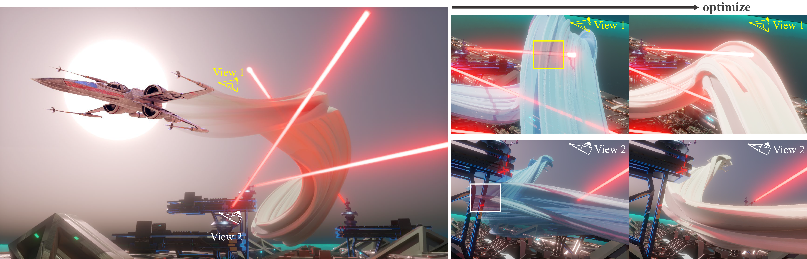

**图 1**：本文方法能够为 X-wing 生成连续、无碰撞的动画轨迹。左图显示 X-wing 飞行期间形成的扫掠体；右侧四幅图从两个不同视角展示优化前后的轨迹。扫掠体用于表示运动过程中物体占据的空间。

**摘要**——在物体轨迹生成中，如何保证任意形状物体在连续运动过程中不发生碰撞，尤其是在物体和环境都具有非凸复杂几何形状时，仍然是一个重要问题。已有方法要么过度简化物体和环境形状，牺牲可行空间；要么用离散采样近似连续运动，容易漏掉碰撞，即产生“隧穿效应”。为解决这些问题，本文提出一种分层轨迹生成流程，利用扫掠体有符号距离场（SVSDF）引导连续碰撞规避（CCA）的轨迹优化。本文把 SVSDF 的计算表述为广义半无限规划问题，并在查询点处隐式求解数值结果，从而不需要显式重建扫掠体表面。算法在多种复杂场景中得到验证，适用于刚性和可变形形状，并表现出较好的通用性和连续碰撞规避性能。代码将发布在 https://github.com/ZJU-FAST-Lab/Implicit-SVSDF-Planner。

CCS 分类：数学优化；机器人规划。  
关键词：有符号距离场；扫掠体；连续碰撞规避；优化。

∗两位作者对本研究贡献相同。†通讯作者。作者地址、版权声明、引用格式和 DOI 信息按原文保留。

---

## 原文第 2 页

### 1 引言

为任意形状的物体生成连续且无碰撞的运动轨迹，在动画制作、计算机辅助设计、制造以及机器人导航规划等领域都很有价值。然而，实际应用中的物体和环境通常具有复杂的非凸几何形状，这使连续运动过程中的碰撞处理十分困难。已有方法通常有两类局限：一类过度简化物体或环境形状，导致复杂狭窄环境中的可行轨迹无法被正确生成；另一类用离散时刻近似连续运动，理论上可能漏掉碰撞，因而不能保证全程无碰撞。这种现象称为“隧穿效应”[Ericson 2004]。因此，在不简化形状、不牺牲可行空间的前提下实现连续碰撞规避，一直是轨迹生成中的重要目标。

本文从扫掠体（SV）的角度处理这一问题。物体连续运动形成的扫掠体，表示物体在整个运动过程中实际占据的最小空间。如果扫掠体内没有障碍物，就可以从理论上保证物体连续运动时不会与障碍物相撞，而且不要求简化物体或环境形状。本文据此提出任意形状物体的连续无碰撞轨迹生成流程：对时空联合轨迹进行数值优化，并利用扫掠体的隐式有符号距离场在危险障碍物处产生梯度，推动轨迹远离障碍物。由于扫掠体能够紧凑地描述运动期间所占空间，该方法不需要额外缩小可行空间，也不受隧穿效应影响。

本文首先计算扫掠体有符号距离场。已有研究多关注扫掠体表面重建，但表面重建本身很困难，而且仅有表面也不能直接提供可微的轨迹优化目标。轨迹生成更关心障碍物相对于扫掠体的有符号距离：距离越小，表示障碍物越接近物体；距离为负则表示障碍物已经进入扫掠体。本文把 SVSDF 求解表述为广义半无限规划，在查询点处隐式求解距离，而不显式重建扫掠体表面。理论上，该方法能够得到任意数值精度的精确结果。随后，作者构建分层轨迹优化算法，用 SVSDF 引导扫掠体避开障碍物，同时优化轨迹能量，例如机器人规划中的控制输入平方积分。实验表明，该方法适用于车辆、飞机、船舶以及可变形机器人。

本文贡献如下：提出基于 GSIP 的多种形状精确 SVSDF 计算方法；提出以分层优化为核心、适用于任意形状机器人的轨迹生成框架；在多种场景中验证连续碰撞规避性能；开放算法以便图形学和机器人领域使用。

### 2 相关工作

#### 2.1 扫掠体 SDF 的计算

关于扫掠体的研究已有较长历史。过去的工作主要通过包络理论、微分方程、运动学方法和精确布尔运算来构造扫掠体表面。Sellán 等人提出把时空连续隐式函数的零水平集扩展为扫掠体表面，在泛化能力、稳健性和效率方面有所改进。该隐式函数来自刷形物体运动过程中的最小有符号距离，本身是扫掠体的保守 SDF，在扫掠体外部能够给出精确值，但在内部通常只能给出上界。而在轨迹优化中，扫掠体内部的距离更重要，因为内部障碍物需要提供正确的避碰方向。

Marschner 等人通过最近点损失修正神经网络在 CSG 操作中产生的保守 SDF，并针对三次 Bézier 路径训练网络。但为了获得准确距离，神经网络可能需要数小时训练；更换轨迹和物体形状时还要重新编码或调整输入维度，网络输出也缺少严格的理论保证。本文的数值方法具有理论保证，可以处理不同轨迹和刷形物体，只要求能够提供物体本身的 SDF。

---

## 原文第 3 页

#### 2.2 连续碰撞规避轨迹生成

机器人和图形学领域越来越重视连续无碰撞运动的生成。早期路径规划方法通过搜索或采样产生一系列路径点，并保证线段安全，但容易受到分辨率影响，在非结构化环境中表现受限，也难以同时满足动力学等非线性约束。近年来，研究重点转向对连续运动轨迹进行准确表示，并通过数值优化处理这些约束。

许多方法在优化时只在轨迹上的离散状态进行碰撞检查。由于连续时间问题被离散化，某些时间段的碰撞可能没有被发现。例如高速运动的物体可能在两个采样时刻之间穿过薄墙，这就是隧穿效应。连续碰撞检测算法可以连续检查碰撞，但通常只能输出布尔结果，不能为轨迹优化提供方向和梯度。

安全走廊方法把安全区域划分为凸包，并要求轨迹留在这些凸包中，但会牺牲可行空间，且不适合复杂形状或密集障碍物。已有扫掠体方法有的只用凸包近似扫掠体，结果不够紧；有的只针对二维汽车；还有的方法使用半无限规划计算刚体最大穿透深度，却忽略了物体运动的连续性。基于隐式 SDF 的近期方法虽然开始考虑连续碰撞，但在扫掠体内部不能正确计算有符号距离，优化时容易出现梯度振荡，在复杂场景中的成功率会下降。

总体而言，已有规划算法尚不能在不牺牲解空间的情况下有效实现连续碰撞规避。本文把 SVSDF 与分层优化结合起来：先通过 GSIP 计算精确 SVSDF，再用该距离场建立适用于任意形状物体的连续碰撞规避框架。

### 3 隐式扫掠体 SDF

本章把 SVSDF 的计算建模为 GSIP，从而在整个空间内获得精确的距离值，为复杂环境中的任意形状轨迹生成提供准确引导。符号 SV 表示扫掠体集合，斜体函数 SVSDF(p) 表示在点 p 处查询扫掠体有符号距离的函数。

#### 3.1 扫掠体 SDF 的 GSIP 模型

扫掠体是物体沿轨迹运动时经过的全部点的集合。设可能随时间变化的形状为 M(t)，刚体变换 T(t) 表示其轨迹，则

SV = ⋃(t∈[t_start,t_end]) T(t)M(t)。

T(t)M(t) 表示在时刻 t 物体的姿态和位置。计算 SVSDF 的本质，是求点 p 到扫掠体边界 Fr(SV) 的最短有符号距离。以 p 为球心、半径为 r 的开球 Bp(r) 为例，若该球是与边界相切的最小球，则 |SVSDF(p)|=r。点在扫掠体外部时距离为正，在内部时距离为负。

令 g(q) 在扫掠体外部为正、内部为负。本文取

g(p) = min(t∈[t_start,t_end]) SDF_M(t)(T⁻¹(t)p)，

并以 t*(p) 为取得最小值的时间。该函数在扫掠体外等于 SVSDF，在扫掠体内是 SVSDF 的上界。这样，在点位于扫掠体外时可直接取得距离；在点位于扫掠体内时，只需继续求解约束问题。保守性质还可以加快优化变量的收敛。

---

## 原文第 4 页

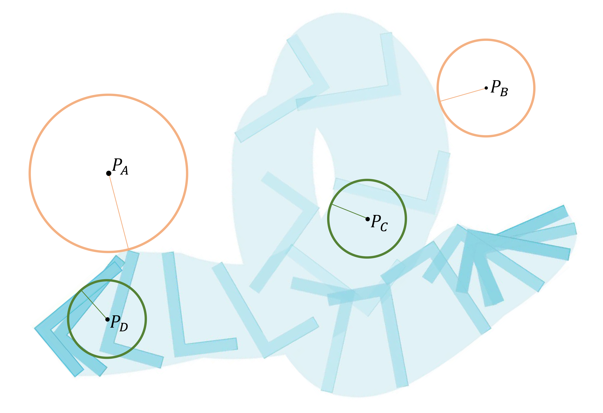

**图 2**：L 形物体同时平移和旋转，形成浅蓝色扫掠体。p_A、p_B 在扫掠体外部，黄色圆表示与扫掠体边界相切的最小圆，其半径就是这些点的 SVSDF 值。p_C、p_D 在扫掠体内部，绿色圆的半径取负值，表示其到扫掠体边界的有符号距离。

#### 3.2 GSIP 问题的求解

一般 GSIP 可写成：在一个由无限个不等式约束构成的可行集合中最小化目标函数。本文将无限约束集合替换为约束上界，并分解成上下两层问题。下层问题在给定半径的球内寻找 g 的最大值，上层问题根据该最大值更新球半径，使球逐渐逼近扫掠体边界。

下层问题为：LP(r,s)：s* = argmax_s g(q(s))，且 q(s)∈Y(r)≡B_p(r)。上层问题为：UP(r,s)：minimize_r (-r)，且 g(q(s*))≤0。

其中 s={θ,φ,α}，θ 和 φ 是球坐标角度，α 是半径缩放因子，取值范围为 0 到 1。球内点写为 q(s)=p+[x_r,y_r,z_r]^T，其中 x_r=αr sin(θ)cos(φ)，y_r=αr sin(θ)sin(φ)，z_r=αr cos(θ)。

上下层问题一般是非凸的，因此采用离散化方法迭代求解。上层问题是线性问题，具有解析解。算法在不重建扫掠体表面的情况下，隐式获得查询点处的 SVSDF 值；其离散化方法的收敛证明见补充材料 C 节。

---

## 原文第 5 页

**图 3**：图中用二维例子说明使用 GSIP 计算扫掠体内部 SVSDF 的迭代过程，三维情况相同。对离散数据中的扫掠体外部绿色采样点，使用梯度下降求 g，即相切圆的半径。所有采样点中最大的 g* 表示当前约束违反程度，下一轮半径减小 g*。提高采样密度并增加迭代次数，可以快速得到扫掠体内部的准确距离。

**算法 1：SVSDF 计算**

1. 在球 B_p(r) 内均匀采样，把球坐标参数离散化为集合 Y。
2. 输入查询点 p；若 g(p)>0，直接返回 g(p)。
3. 若 g(p)≤0，令 k=0，并设置较大的初始半径 r_k。
4. 在球内采样，求解下层问题，得到 s_k*。
5. 若 g(q(s_k*)) 小于数值精度，则返回 -r_k。
6. 否则求解上层问题，按解析式 r_(k+1)=r_k-g(q(s_k*)) 更新半径，进入下一轮。

### 4 使用隐式 SVSDF 生成轨迹

由于扫掠体和 SVSDF 能够紧凑地描述物体运动所占空间，本文提出基于 SVSDF 的分层轨迹生成流程。该流程可用于 R(2)、SE(2)、R(3)、SE(3) 等配置空间。以 SE(3) 和多旋翼动力学为例，整个流程包括三层：前端快速搜索离散的位置—姿态状态；中端把这些状态拟合为连续轨迹并生成优化初值；后端使用精确 SVSDF 建立连续碰撞规避优化问题，同时满足动力学约束。

#### 4.1 分层轨迹优化：前端

在 SE(3) 中，刚体在时刻 t 的状态由旋转矩阵 R(t) 和平移向量 p(t) 决定，即 T(t)M(t)=R(t)M(t)+p(t)。直接把普通 A* 用在包含姿态的配置空间中，需要大量碰撞检查和节点扩展，在 SE(3) 等高维空间中速度很慢。本文改造 A*：位置维度只扩展当前节点的相邻位置，姿态维度则优先寻找与父节点姿态最接近的可行姿态，因此不同维度采用不对称扩展。

本文还用离散碰撞检测替代昂贵的精确几何检测。因为最终轨迹会由 SVSDF 再次优化，前端路径不必极细，也不必严格达到最终碰撞精度。对每组离散滚转、俯仰和偏航角，预先把物体形状栅格化并保存在多通道地图中；碰撞检测时，将环境地图与对应姿态通道进行布尔卷积，从而快速判断潜在碰撞。若当前姿态发生碰撞，则换用与父节点偏差更大的姿态继续检查。

前端输出的离散状态序列为 T_A*={N_node^i:(x^i,y^i,z^i,γ^i,β^i,α^i)∈SE(3)}，其中同时包含位置和姿态，并作为中端生成连续轨迹的输入。

---

## 原文第 6 页

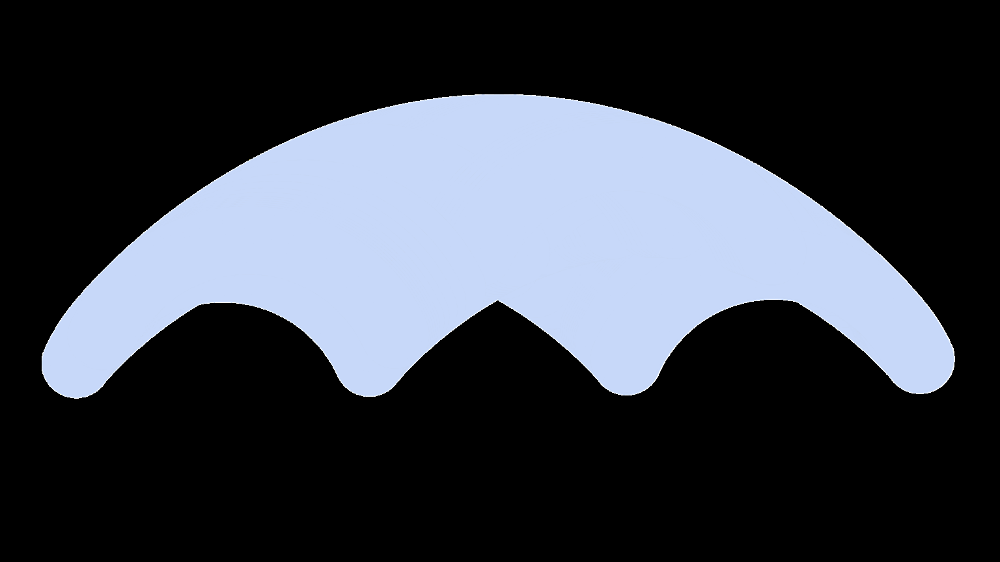

**图 4**：分层轨迹生成框架由前端、中端和后端组成。前端生成离散的位置—姿态状态序列；中端根据这些状态生成优化轨迹的初值；后端利用精确 SVSDF 建立连续碰撞规避轨迹。

前端采用改造后的 A* 在 SE(3) 空间中搜索。每个扩展节点 N_node 的坐标为 (x,y,z,γ,β,α)，分别对应物体位置和姿态。位置扩展方式与标准 A* 相同；对姿态 γ、β、α，从最接近父节点姿态的方向开始进行碰撞评价。若无碰撞，就更新节点并加入关闭列表；若发生碰撞，就选择偏离父节点更大的姿态重新评价。

作者预先为不同滚转、俯仰和偏航组合存储形状栅格 M_map(γ_j,β_j,α_j)，并使其分辨率与环境栅格 E_map 一致。碰撞检测时，在环境地图和相应姿态的多通道形状地图之间进行布尔卷积。由于形状数据预先载入内存，该过程可以快速完成。每次扩展优先选择无碰撞且姿态变化较小的节点，从而有效搜索高维空间。

---

## 原文第 7 页

#### 4.2 中端：轨迹表示与初值生成

轨迹 p(t) 由 N 段五次多项式组成。第 i 段定义为 p_i(t)=c_i^Tβ(t)，其中 β(t)=[1,t,…,t^5]^T，c_i∈R^{6×m} 为系数矩阵，T_i=t_i−t_{i−1} 为该段时长。MINCO 轨迹由中间航路点 q 和各段时间 T 唯一确定，映射 c=M(q,T) 把这组参数转换成多项式系数，因此任意二阶连续代价 J(c,T) 都可以写成 H(q,T)=J(M(q,T),T)，其梯度可由系数梯度和时间梯度得到。

前端输出的是没有时间戳的离散点，因此中端的作用是把这些位置—姿态点拟合成动态可行轨迹，为后端提供质量较好的初始值。离散点对应的位置和旋转为 p_i=(x_i,y_i,z_i)，R_i=R_z(α_i)·R_y(β_i)·R_x(γ_i)。

中端最小化 Cost_mid-end = λ_m J_m + λ_t J_t + λ_p G_p + λ_R G_R。其中 J_m 为平滑性代价，J_t 为总时间代价，G_p 和 G_R 分别为位置和姿态残差。位置残差为 G_p(t)=L_μ[||p(t)-p_i(t)||²]；姿态残差为 G_R(t)=L_μ[||R(t)⁻¹R_i(t)-I||²_F]。L_μ 是平滑的非负惩罚函数：x≤0 时为 0；0<x≤μ 时采用平滑过渡；x>μ 时为 x−μ/2。中端优化完成后，得到拟合离散状态序列的初始连续轨迹。

---

## 原文第 8 页

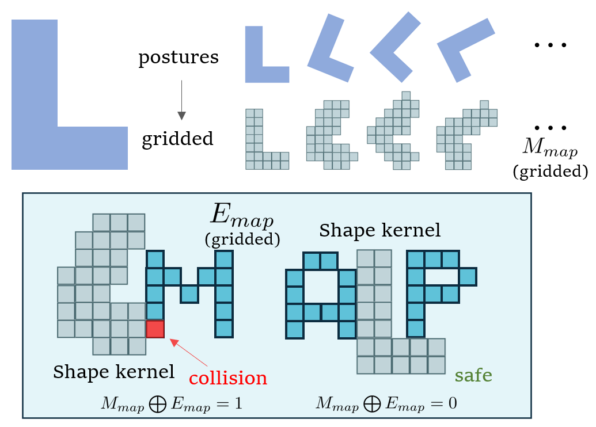

**图 5**：用二维例子说明碰撞检测过程。L 形机器人在环境中运动，姿态维度用偏航角离散化。

#### 4.3 后端：连续碰撞规避优化

后端使用 GSIP 求得的 SVSDF 建立优化问题，使扫掠体远离障碍物。与只在离散时刻计算碰撞梯度的方法不同，SVSDF 直接反映整个连续运动过程，给出的梯度能够把扫掠体整体推离障碍物。传统方法把每个离散时刻当成相互独立的状态，忽略物体前后状态之间的连续联系，因此在复杂形状下可能出现梯度振荡。本文使用 SVSDF 把这种连续性纳入优化。

后端代价函数为 Cost_back-end = G_d + λ_o G_o + λ_m J_m + λ_t J_t。其中 G_d 是动力学约束惩罚，G_o 是障碍物惩罚，J_m 和 J_t 分别是平滑性和总时间代价，λ_o 是碰撞规避权重。对离散障碍物采样点 x_ob^i，障碍物代价为 G_o=Σ_(i=1)^(N_obs) L_μ[J_o(x_ob^i)]；当 SVSDF(x_ob)>s_thr 时 J_o(x_ob)=0，当 SVSDF(x_ob)≤s_thr 时 J_o(x_ob)=s_thr−SVSDF(x_ob)。其中 s_thr 是安全阈值，N_obs 是障碍物采样点数量。梯度由障碍物采样点传递到整条轨迹，使优化同时考虑轨迹形状、姿态和连续运动占据的空间。

---

## 原文第 9 页

### 5 实现细节

求解算法 1 中的数值容差不依赖物体形状。实验中，该容差设置为碰撞规避安全因子 s_thr 的一半，不会产生隧穿效应。

#### g 函数的计算

SVSDF 计算中的关键步骤是求 metric 函数 g。根据式（5），g 是函数 d=SDF_M(t)(T⁻¹(t)p) 的全局最小值。由于 d 是连续且可能非凸的函数，作者使用梯度下降寻找局部最小值，再比较多个局部最小值以获得全局最小值。实现时先用包围球 B 替代原始形状 M(t)。函数 d′=SDF_B(T⁻¹(t)p) 具有容易快速计算的解析表达式。设包围球半径为 r，则任意 t 满足 0<d−d′<2r，因此 d 位于 d′ 与 d′+2r 之间。作者按时间分辨率划分区间，在每个区间中对 d′进行梯度下降，求出 d′+2r 的最小值和包围球的最小值，再找出 d′小于该值的区间。全局最小值必在这些区间内。随后继续细分这些区间，再次执行梯度下降并比较局部最小值，得到 g。

#### 利用连续性加速内部 SVSDF

SVSDF 的幅值在空间上具有连续性，可以加速扫掠体内部的计算。算法 1 迭代时，邻近点的 SVSDF 幅值可以提供接近最优解的初始半径。具体地，初始半径可以取 r_init=r_SVSDF^neighbor+d_neighbor，其中 d_neighbor 是查询点到邻近点的距离。该策略使求解速度提高约 4 至 5 倍。

### 6 结果与评价

本文使用 C++ 实现，轨迹优化部分采用 L-BFGS 求解器。

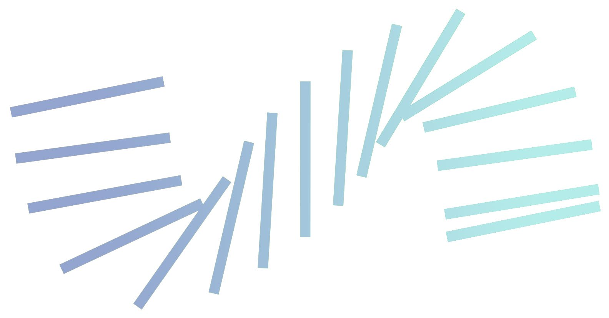

**图 6**：二维场景中不同方法施加在机器人轨迹上的障碍物避让梯度比较。对于形状更加复杂的机器人，本文方法产生的梯度最有效，能够把扫掠体推离障碍物，从而实现连续碰撞规避。

---

## 原文第 10 页

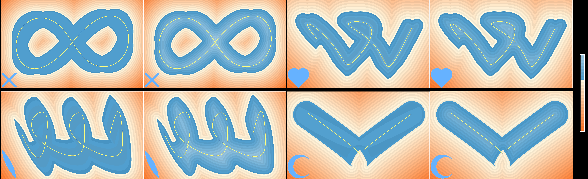

**图 7**：在二维场景中，将四种不同形状沿指定轨迹移动，比较本文方法与 Sellán 等人的方法计算得到的 SVSDF 和梯度等值线。

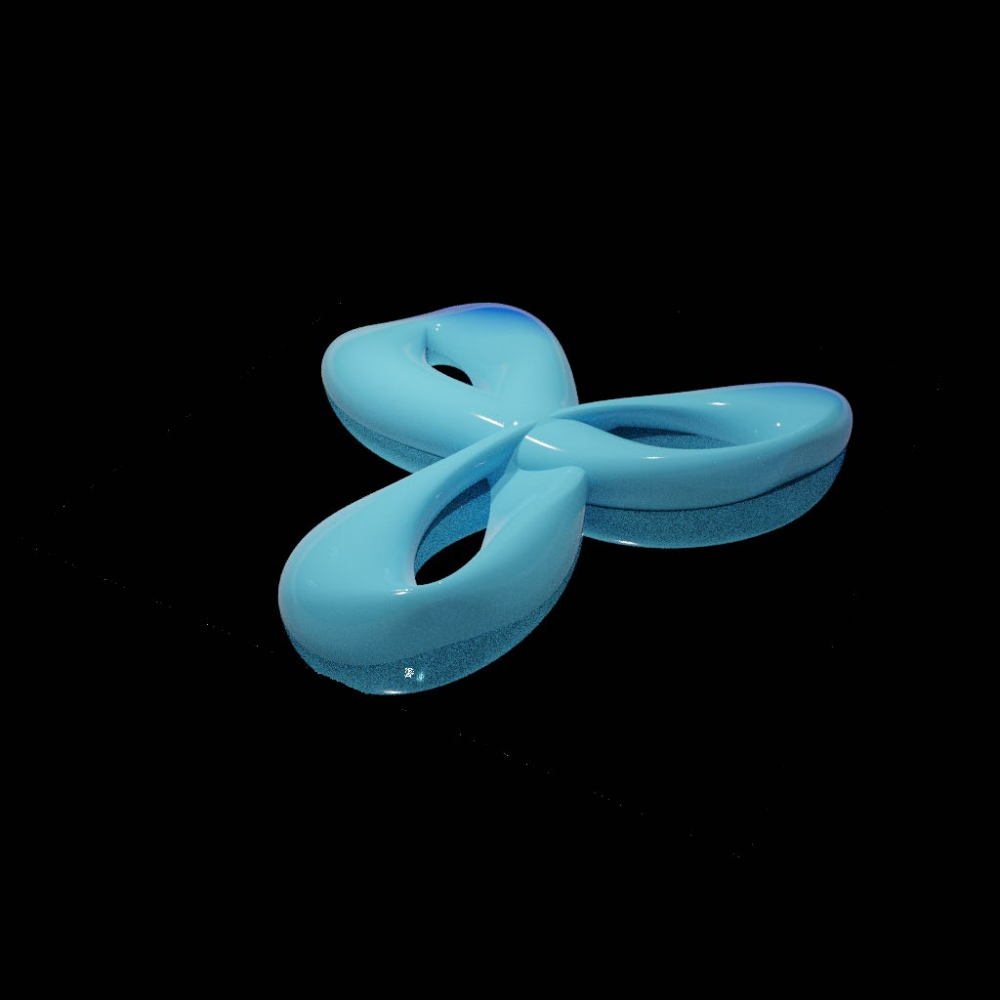

**图 8**：图 a 为三维圆形扇面物体形成的扫掠体；图 b 为内部保守的 SDF；图 c 为本文方法生成的正确 SDF。

#### 6.1 扫掠体 SDF 结果

作者首先将本文方法与 Sellán 等人根据隐式函数得到的伪 SDF 进行比较。图 7 和图 8 展示了不同形状沿指定轨迹运动时的 SVSDF 和梯度等值线。本文方法能够在扫掠体内部准确计算有符号距离和梯度，这对于轨迹优化非常重要，障碍物点处的梯度可以有效引导扫掠体避开障碍物。

作者还比较了本文方法与学习方法计算扫掠体内部一个查询点的平均时间，以及将两种方法分别作为 SVSDF 模块时完成一条轨迹生成的总时间。学习方法虽然可以并行处理多个查询点，但轨迹优化每次迭代都会改变轨迹，面对新轨迹通常需要重新训练。因此，把它用于轨迹生成会带来很长的计算时间。本文方法不需要为每条新轨迹重新训练。

---

## 原文第 11 页

**图 9**：左图比较本文方法与学习方法计算扫掠体内部查询点的平均时间；右图比较两种方法完成一次轨迹生成的总时间。学习方法为适应变化后的轨迹需要额外训练，计算时间明显更长。所有训练均在一块 RTX2060 上完成。

#### 6.2 基准比较与消融实验

作者在二维和三维环境中对不同形状进行测试，环境包括随机密集障碍物和狭窄间隙两类。每种情况进行 500 次随机试验，随机选择轨迹起点和终点，并比较连续碰撞规避成功率和障碍物到扫掠体的平均最小有符号距离。连续碰撞规避成功率表示轨迹全程无碰撞的比例；平均最小 SVSDF 更细致地反映轨迹与障碍物的接近程度。

实验差异主要来自障碍物施加在优化过程中的梯度。Geng 等人的方法沿轨迹离散检查碰撞，在复杂密集障碍物场景中可能漏检；Hauser 的分支定界方法仍以单个形状计算梯度，不能消除梯度振荡；Zhang 等人的连续碰撞评估方法在扫掠体内部会遇到错误的有符号距离和梯度。统计结果显示，本文方法取得最高的连续碰撞规避成功率，并把扫掠体碰撞约束违反程度降到最低，原因是其碰撞检测具有连续性，并且内外部有符号距离和梯度更准确。

作者还在三维环境中进行了消融实验，用于分别评估分层规划各组成部分的作用。表 1 列出了基准测试和消融实验中的主要参数。

---

## 原文第 12 页

**表 1：消融实验与基准测试中的相关参数**

| 参数 | 符号 | 数值 |
|---|---:|---:|
| 最大速度（m/s） | v_m | 10.0 |
| 最大加速度（m/s²） | a_m | 5.0 |
| 最大加加速度（m/s³） | j_m | 10.0 |
| 障碍物优化权重 | λ_o | 4000.0 |
| 总时间优化权重 | λ_t | 20.0 |
| 位置残差优化权重 | λ_p | 1000.0 |
| 姿态残差优化权重 | λ_R | 32000.0 |
| 平滑性优化权重 | λ_m | 1.0 |
| 速度优化权重 | λ_v | 1000.0 |
| 加速度优化权重 | λ_a | 1000.0 |
| 加加速度优化权重 | λ_j | 1000.0 |
| 安全阈值 | s_thr | 0.366 |
| 后端离散评价密度 | κ | 32 |
| L_μ 中的平滑参数 | μ | 0.01 |

#### 6.3 实验

##### 6.3.1 静态形状实验

图 14 模拟 TIE fighter 在充满小行星的复杂空间环境中飞行。本文直接使用原始网格模型，没有专门简化形状，并采用多旋翼动力学模型生成平滑、连续、满足动力学约束的无碰撞轨迹。通过替换优化过程中的动力学公式，该方法也可以适配其他动力学模型。图 15 展示固定翼飞机在极窄峡谷中的飞行轨迹，说明该方法同样适用于固定翼轨迹规划。图 13 展示小车在密集停车场中的连续无碰撞自动泊车。

图 16 中，形状与 “SIGGRAPH” 字样相近的物体穿过三个带孔墙面，即使孔洞形状几乎与物体相同，也能生成连续无碰撞轨迹，说明该方法没有人为缩小可行空间。图中扫掠体主要用于可视化，算法实际不需要显式重建扫掠体表面。

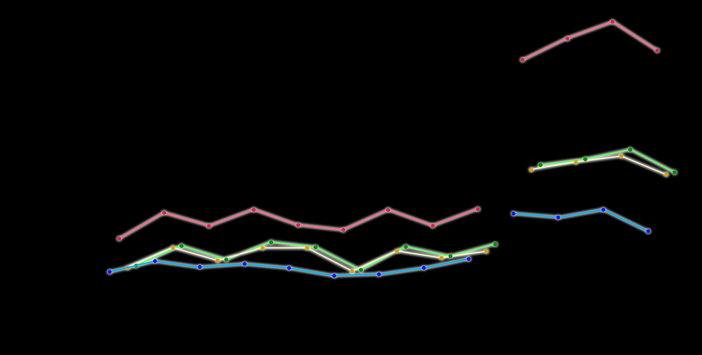

**图 10**：每种形状在随机地图中进行 500 次轨迹生成测试，随机选择起点和终点。左侧柱状图表示不同形状机器人的连续碰撞规避成功率，折线表示平均轨迹生成时间；右侧表示所有试验中的平均最小 SVSDF 值。由于 SV 及其 SDF 能够紧凑地描述碰撞，该指标可以有效衡量轨迹的连续碰撞规避程度。

---

## 原文第 13 页

##### 6.3.2 可变形形状实验

只要形状变化 M(t) 可微，本文方法也可以处理可变形物体。第一个例子是由磁铁驱动、运输红色颗粒的月牙形铁磁流体机器人。该机器人可以通过调整下方环形磁铁的倾角，在月牙形和环形之间变形，并成功避开障碍物。第二个例子是受变形生物启发的机器人模型，由可独立全向运动的顶点组成，顶点形成的多边形具有很强的可变形能力。本文把各顶点的轨迹作为优化目标，并对这些顶点组成的机器人形状应用轨迹生成算法。

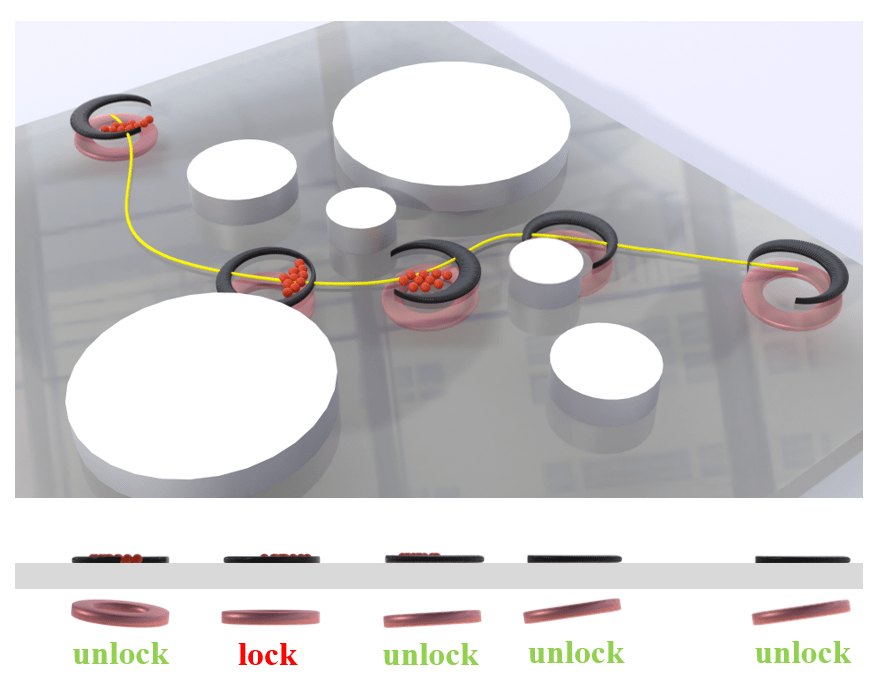

**图 11**：图 a 展示铁磁流体机器人由磁铁驱动运输红色颗粒；银白色圆柱表示障碍物。图 b 展示模拟可变形生物的机器人模型，机器人每个顶点都可以进行全向运动。

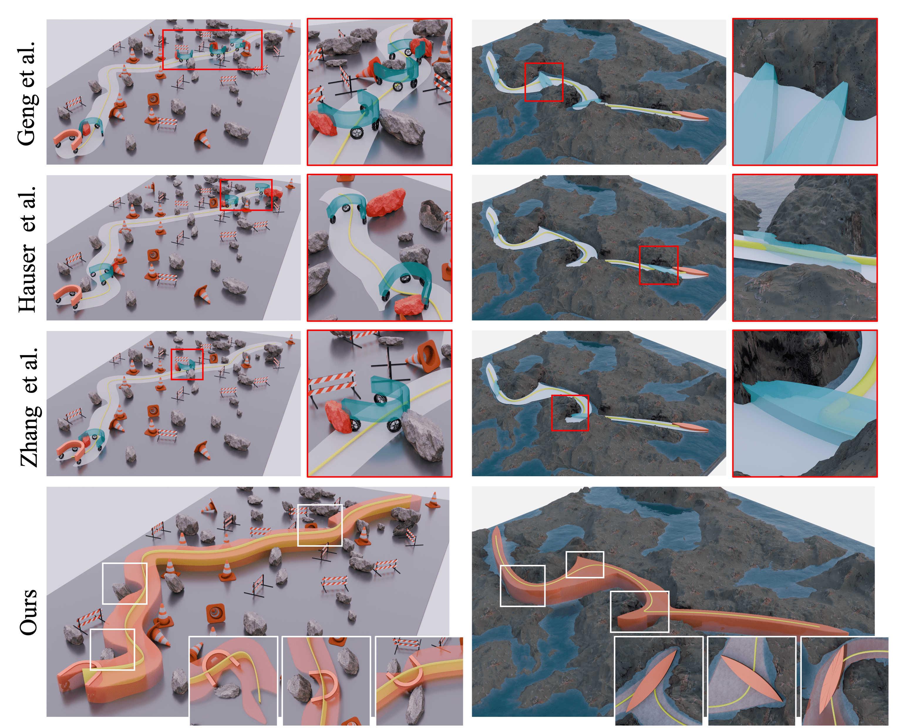

**图 12**：左图为带麦克纳姆轮的 U 形小车在有障碍物的道路下行驶；右图为梭形船在布满岩石的狭窄湖面中航行；下排展示无碰撞扫掠体。

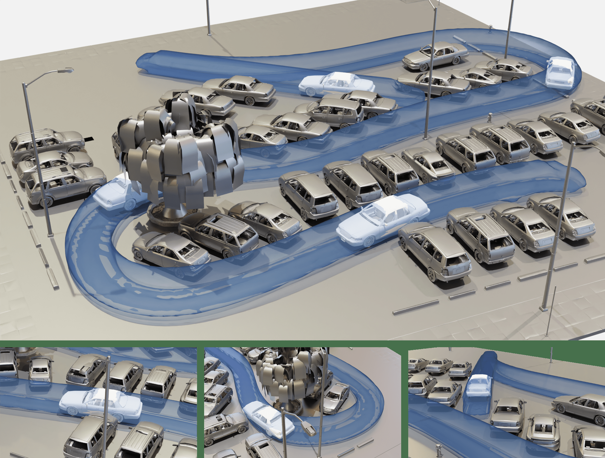

**图 13**：利用分层规划器，小车在复杂、密集的环境中优化出无碰撞泊车轨迹。

---

## 原文第 14 页

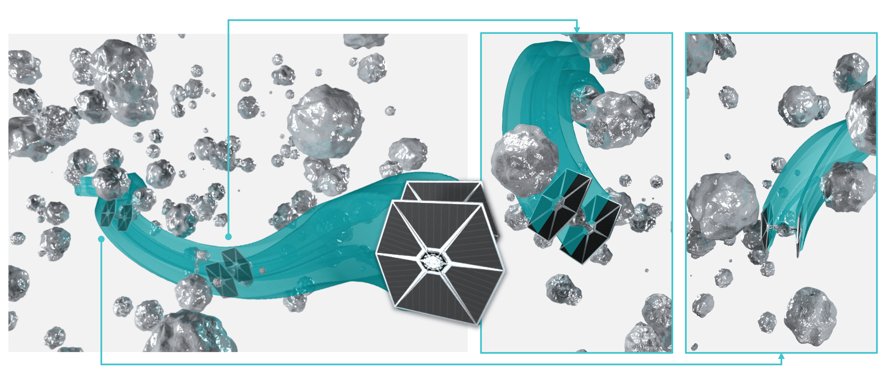

**图 14**：TIE fighter 的初始轨迹及其对应扫掠体与陨石相交。复杂的 TIE fighter 形状使传统优化方法难以提供合适的避障梯度；本文分层规划框架，特别是基于 SVSDF 的后端，保证最终优化后的扫掠体无碰撞。

**图 15**：由于 SVSDF 对碰撞进行了精确表示，飞船能够在极其狭窄的峡谷中高效规划连续无碰撞轨迹，效果超过依靠离散碰撞评价的规划方法。

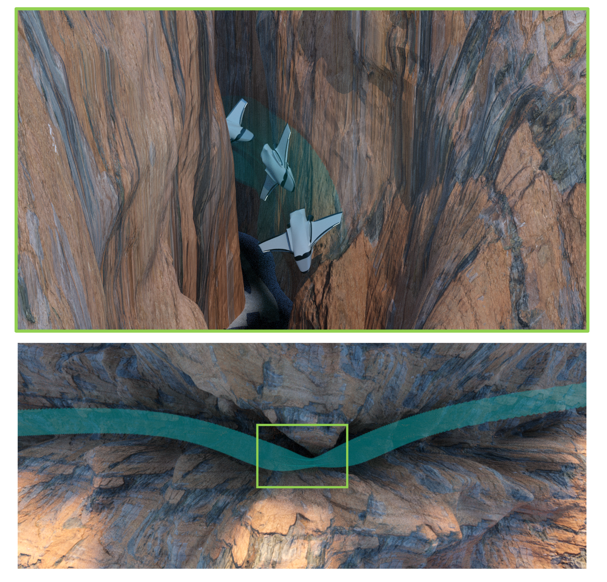

**图 16**：“SIGGRAPH” 标志和字母连续、无碰撞地穿过由三面墙形成的狭窄间隙。

### 7 结论与局限

据作者所知，本文通过求解 GSIP，提出了首个无需深度学习即可计算任意形状精确 SVSDF 的方法。该流程把计算机图形学中的扫掠体计算与机器人轨迹优化结合起来，在复杂形状和复杂环境中实现连续碰撞规避，并且可用于插值动画、体表示与渲染、逆向工程、物理仿真以及 CAD/CAM 等任务。

本文仍有四点局限。第一，轨迹优化问题具有很强的非凸性，即使使用精确 SVSDF，也不能保证每次都达到 100% 的连续碰撞规避。第二，在三维环境中计算 SVSDF 需要大量评价，当前还不能实时生成轨迹，作者正在研究时空连续方法以进一步提速。第三，当前用采样点表示障碍物，后续可扩展到 SE(3) 空间中计算物体到最近障碍物的距离。第四，当前方法不适合直接处理动态障碍物，现阶段是把动态障碍物的扫掠体当作静态障碍物；未来可通过两个物体轨迹之差计算相对轨迹，形成“相对运动扫掠体”的扩展。

---

## 参考文献

参考文献作者、题名、期刊会议、卷期、页码和 DOI 按英文原文保留，以便检索和核对。

Denis Blackmore and Ming C Leu. 1992. Analysis of swept volume via Lie groups and differential equations. The International Journal of Robotics Research 11, 6, 516–537.  
Denis Blackmore, Ming C Leu, and Liping P Wang. 1997. The sweep-envelope differential equation algorithm and its application to NC machining verification. Computer-Aided Design 29, 9, 629–637.  
Jerry W Blankenship and James E Falk. 1976. Infinitely constrained optimization problems. Journal of Optimization Theory and Applications 19, 261–281.  
Tyson Brochu, Essex Edwards, and Robert Bridson. 2012. Efficient geometrically exact continuous collision detection. ACM Transactions on Graphics 31, 4, 1–7.  
Gianmarco Cherchi, Marco Livesu, Riccardo Scateni, and Marco Attene. 2020. Fast and robust mesh arrangements using floating-point arithmetic. ACM Transactions on Graphics 39, 6, 1–16.  
Wenchao Ding, Wenliang Gao, Kaixuan Wang, and Shaojie Shen. 2019. An efficient b-spline-based kinodynamic replanning framework for quadrotors. IEEE Transactions on Robotics 35, 6, 1287–1306.  
Wenchao Ding, Lu Zhang, Jing Chen, and Shaojie Shen. 2019. Safe Trajectory Generation for Complex Urban Environments Using Spatio-Temporal Semantic Corridor. IEEE Robotics and Automation Letters 4, 3, 2997–3004.  
Christer Ericson. 2004. Real-time collision detection. CRC Press.  
Matthias Faessler, Antonio Franchi, and Davide Scaramuzza. 2017. Differential flatness of quadrotor dynamics subject to rotor drag for accurate tracking of high-speed trajectories. IEEE Robotics and Automation Letters 3, 2, 620–626.  
Xinjian Fan, Xiaoguang Dong, Alp C Karacakol, Hui Xie, and Metin Sitti. 2020. Re-configurable multifunctional ferrofluid droplet robots. Proceedings of the National Academy of Sciences 117, 45, 27916–27926.  
Philip L Frana and Thomas J Misa. 2010. An interview with Edsger W. Dijkstra. Communications of the ACM 53, 8, 41–47.  
Shuang Geng, Qianhao Wang, Lei Xie, Chao Xu, Yanjun Cao, and Fei Gao. 2023. Robo-Centric ESDF: A Fast and Accurate Whole-Body Collision Evaluation Tool for Any-Shape Robotic Planning. IROS, 290–297.  
James Guthrie. 2022. A Differentiable Signed Distance Representation for Continuous Collision Avoidance in Optimization-Based Motion Planning. In 2022 IEEE 61st Conference on Decision and Control, 7214–7221.  
Peter E Hart, Nils J Nilsson, and Bertram Raphael. 1968. A formal basis for the heuristic determination of minimum cost paths. IEEE Transactions on Systems Science and Cybernetics 4, 2, 100–107.  
Kris Hauser. 2021. Semi-infinite programming for trajectory optimization with non-convex obstacles. The International Journal of Robotics Research 40, 10–11, 1106–1122.  
D. Hsu, J.-C. Latombe, and R. Motwani. 1997. Path planning in expansive configuration spaces. In Proceedings of International Conference on Robotics and Automation, 2719–2726.  
Lucas Janson, Edward Schmerling, Ashley Clark, and Marco Pavone. 2015. Fast marching tree: A fast marching sampling-based method for optimal motion planning in many dimensions. The International Journal of Robotics Research 34, 7, 883–921.  
Bert Jüttler and Michael G. Wagner. 1996. Computer-aided design with spatial rational B-spline motions.  
Jean-Claude Latombe. 2012. Robot motion planning. Springer.  
Steven LaValle. 1998. Rapidly-exploring random trees: A new tool for path planning. Research Report 9811.  
Changliu Liu, Chung-Yen Lin, and Masayoshi Tomizuka. 2018. The convex feasible set algorithm for real time optimization in motion planning. SIAM Journal on Control and Optimization 56, 4, 2712–2733.  
Dong C Liu and Jorge Nocedal. 1989. On the limited memory BFGS method for large scale optimization. Mathematical Programming 45, 1–3, 503–528.  
Sikang Liu, Michael Watterson, Kartik Mohta, Ke Sun, Subhrajit Bhattacharya, Camillo J. Taylor, and Vijay Kumar. 2017. Planning Dynamically Feasible Trajectories for Quadrotors Using Safe Flight Corridors in 3-D Complex Environments. IEEE Robotics and Automation Letters 2, 3, 1688–1695.  
Zoë Marschner, Silvia Sellán, Hsueh-Ti Derek Liu, and Alec Jacobson. 2023. Constructive Solid Geometry on Neural Signed Distance Fields. In SIGGRAPH Asia 2023 Conference Papers, 1–12.  
Ralph R Martin and PC Stephenson. 1990. Sweeping of three-dimensional objects. Computer-Aided Design 22, 4, 223–234.  
Daniel Mellinger and Vijay Kumar. 2011. Minimum snap trajectory generation and control for quadrotors. IEEE International Conference on Robotics and Automation, 2520–2525.  
Jorge Nocedal and Stephen J Wright. 1999. Numerical optimization. Springer.  
Inigo Quilez. 2018. Interior SDFs. https://iquilezles.org/articles/interiordistance/. Accessed: 2023-09-13.  
Evgeniı̆ I〈A〉kovlevich Remez. 1962. General computational methods of Chebyshev approximation: The problems with linear real parameters. US Atomic Energy Commission, Division of Technical Information.  
Silvia Sellán, Noam Aigerman, and Alec Jacobson. 2021. Swept volumes via spacetime numerical continuation. ACM Transactions on Graphics 40, 4, 1–11.  
Silvia Sellán, Christopher Batty, and Oded Stein. 2023. Reach For the Spheres: Tangency-aware surface reconstruction of SDFs. In SIGGRAPH Asia 2023 Conference Papers, 1–11.  
Oliver Stein. 2012. How to solve a semi-infinite optimization problem. European Journal of Operational Research 223, 2, 312–320.  
Bolun Wang, Zachary Ferguson, Teseo Schneider, Xin Jiang, Marco Attene, and Daniele Panozzo. 2021. A large-scale benchmark and an inclusion-based algorithm for continuous collision detection. ACM Transactions on Graphics 40, 5, 1–16.  
WP Wang and KK Wang. 1986. Geometric modeling for swept volume of moving solids. IEEE Computer Graphics and Applications 6, 12, 8–17.  
Zhepei Wang, Xin Zhou, Chao Xu, and Fei Gao. 2022. Geometrically constrained trajectory optimization for multicopters. IEEE Transactions on Robotics 38, 5, 3259–3278.  
Dustin J Webb and Jur Van Den Berg. 2013. Kinodynamic RRT*: Asymptotically optimal motion planning for robots with linear dynamics. IEEE International Conference on Robotics and Automation, 5054–5061.  
John D Weld and Ming C Leu. 1990. Geometric representation of swept volumes with application to polyhedral objects. The International Journal of Robotics Research 9, 5, 105–117.  
Tingrui Zhang, Jingping Wang, Chao Xu, Alan Gao, and Fei Gao. 2023. Continuous Implicit SDF Based Any-Shape Robot Trajectory Optimization. IROS, 282–289.
Qingnan Zhou, Eitan Grinspun, Denis Zorin, and Alec Jacobson. 2016. Mesh arrangements for solid geometry. ACM Transactions on Graphics 35, 4, 1–15.
