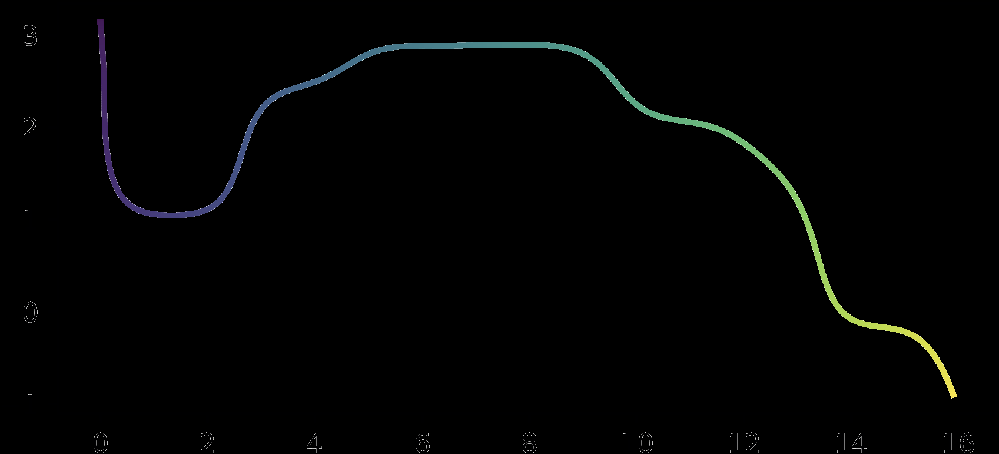
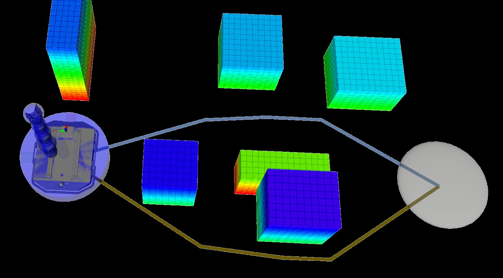
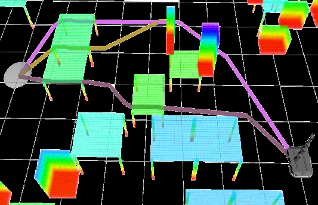
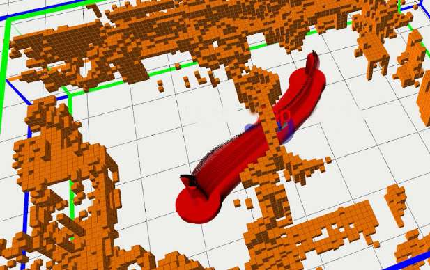
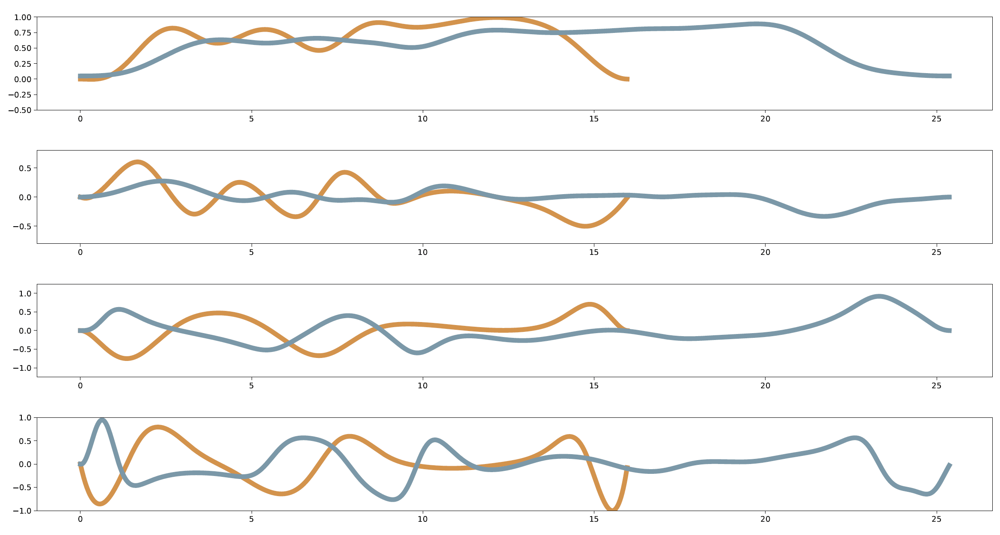

# TopAY移动操作器轨迹规划（15_TopAY_Trajectory_Planning_for_Mobile_Manipulators）：完整忠实学术翻译

> **原文标题**：15_TopAY_Trajectory_Planning_for_Mobile_Manipulators  
> **作者**：Long Xu、Choilam Wong、Mengke Zhang、Junxiao Lin、Jialiang Hou、Fei Gao  
> **发表信息**：arXiv:2507.02761v2，2025-11-17  
> **原文 PDF**：[15_TopAY_Trajectory_Planning_for_Mobile_Manipulators.pdf](../15_TopAY_Trajectory_Planning_for_Mobile_Manipulators.pdf) ｜ **对应中文详解**：[15_TopAY移动操作器轨迹规划.md](../中文详解/15_TopAY移动操作器轨迹规划.md)  

---

## 原文第 1 页核心内容与翻译

TopAY：基于拓扑路径搜索与弧长—偏航角参数化的差速移动操作器高效轨迹规划
Long Xu†,1,2、Choilam Wong†,2、Mengke Zhang1,2、Junxiao Lin1,2、Jialiang Hou1,2、Fei Gao1,2
摘要——差速移动操作器将轮式底盘的机动能力与多关节机械臂的操作能力结合起来，能够适用于多种任务，但其高维状态空间和非完整约束也给轨迹规划带来了很大困难。本文提出 TopAY，一种面向差速移动操作器的优化规划框架，用于高效生成安全轨迹。该框架采用分层初值获取策略，包括为底盘搜索拓扑路径，以及为机械臂进行并行采样；同时提出一种带弧长—偏航参数化的多项式轨迹表示，在保持动力学可行性的同时降低优化复杂度。大量仿真和实际实验表明，在密集、复杂场景中，TopAY 的规划效率和成功率均高于现有先进方法。源代码发布于 https://github.com/TopAY-Planner/TopAY。
I. 引言
差速移动操作器（DDMoMa）由安装在差速驱动底盘（DDB）上的一个或多个多关节机械臂组成，将机械臂的操作能力与轮式底盘的移动能力结合起来。这种组合使设备能够服务于工业制造、医疗、农业等多种领域 [1]。要完成复杂任务，自主导航和避障是 DDMoMa 的基础能力。
现有方法 [2]–[4] 通常通过数值优化，在给定标准下求解安全、满足动力学约束且性能较优的轨迹。优化初值一般由采样和搜索方法共同获得 [5], [6]。这些方法虽然已经具备实时规划能力，但在复杂场景中需要同时处理 DDB 的非完整约束和 DDMoMa 的高维状态空间，效率会明显下降。
状态空间体积会随维数呈指数增长，因此 DDB 与机械臂的联合状态空间远大于各自单独的状态空间。这既增加了初值获取的难度，也增加了轨迹优化变量的数量。尤其是机械臂的存在要求进行三维碰撞检查，使
†表示共同第一作者。
1 浙江大学工业控制技术国家重点实验室，中国杭州 310027。通信作者：Jialiang Hou
2 浙江大学湖州研究院，中国湖州 313000。
电子邮箱：{gaolon, fgaoaa}@zju.edu.cn
(a)
弧长 [m]
偏航角 [rad]
0 2 4 6 8 10 1214 16
0
-1
1
2
3
平滑
X [m]
-5
-4
-3
-2
-1
0
1
2
奇异
点
-6
-8
-4
-2
0
Y [m]
(b)
0
1000
时间戳
目标
起点

**图 1**：使用所提出的规划器，一台差速移动操作器将一只鼠标从办公室前台送到工作台。图 (a) 中的红线表示夹爪轨迹；图 (b) 展示底盘在弧长—偏航角空间和笛卡尔空间中的运动曲线。

室内轮式机器人常用的简化二维规划方法并不适用于这一问题。除此之外，底盘具有运动能力，意味着必须在更大的物理空间内进行碰撞检查。

直观地说，差速移动操作器中底盘部分的可行路径，是独立差速底盘可行路径的子集。基于这一点，本文提出分层的初值获取算法：先为差速底盘搜索拓扑路径，再以找到的底盘路径为条件，并行采样机械臂状态。将两部分解耦后，可以大幅减轻高维状态空间带来的计算负担，从而提高复杂场景下的规划效率和成功率。

针对高维状态空间导致的优化变量数量过多问题，本文进一步提出一种新的移动操作器轨迹表示方法，其设计受到多项式轨迹参数化的启发。

---

## 原文第 2 页核心内容与翻译

多项式轨迹参数化近年来在机器人运动规划中表现出很高的有效性，这是因为它本身具有平滑性，并且与有限元离散相比，所需变量数量显著减少 [7]–[9]。为处理差速底盘的非完整约束，本文引入弧长—偏航角参数化：时刻 (t=\tau) 的弧长定义为从 (t=0) 沿轨迹到 (t=\tau) 的带符号距离，如图 1(b) 所示。与现有先进方法 [2] 相比，这种表示方式的效率更高，后者在笛卡尔空间中使用微分平坦性 [10]。

将上述内容结合起来，本文提出 TopAY，一种面向差速移动操作器的高效优化式轨迹规划框架。该框架集成分层初值获取算法和本文提出的轨迹表示，并通过并行轨迹优化进一步提高效率。全面的仿真和实际实验表明，该方法有效且高效。本文的主要贡献如下：

• 提出面向差速移动操作器的高效分层路径获取方法：为底盘搜索拓扑路径，并行采样机械臂状态。

• 提出基于多项式的轨迹表示，通过弧长—偏航角参数化处理差速底盘的非完整运动学约束。

• 将上述两个模块结合为高效的优化式轨迹规划框架，并采用并行轨迹优化提高效率。
II. 相关工作
A. 基于采样的路径规划
基于采样的方法 [5] 通过均匀采样离散路点，或采用启发式策略 [11]，近似表示构型空间。算法逐步构建图，其中节点表示采样路点，边表示无碰撞路径，再通过查询图得到可行路径。这类方法通常具有概率完备性和渐近最优性两项理论保证。但在移动操作器等高自由度系统中 [2]，性能会明显下降。随着维度增加，采样空间体积呈指数增长，导致复杂场景下规划时间过长，限制了实际应用。
提高效率的一种方法是利用工作空间先验，采用不同的采样策略。由于只有一部分采样路点会进入最终路径，可以优先在更可能产生有效路点的区域采样，即根据工作空间和规划任务使用有偏采样分布 [12]–[15]。将均匀分布与有偏分布结合，可以同时保留完备性和最优性保证。难点在于平衡采样或迭代的代价和频率，因为获得有偏样本通常需要额外时间。
另一种方法 [2], [3] 将机械臂运动和底盘运动分解，并让其中一部分以另一部分为条件，从而减轻高自由度带来的性能下降。虽然这种策略牺牲了完备性，但能显著提高差速移动操作器的规划效率，实现实时规划。

近期研究还使用扩散模型直接在轨迹空间采样 [16]，绕过反复构建图的过程。其主要限制是训练和推理速度较慢，并且高度依赖目标函数的设计。
B. 基于优化的轨迹生成
当需要考虑加速度、角加速度等更高阶机器人状态以获得更优解时，基于采样的方法必须在更大的空间中搜索，组合爆炸问题会进一步加剧，严重影响效率。基于优化的方法将运动规划写成优化问题，以生成平滑、较优且满足动力学约束的轨迹。在实际应用中，基于采样的路径规划通常作为前端，为后端轨迹优化提供初值。
差速移动操作器的高自由度使优化计算代价很高，也给实时规划带来显著挑战。一种保证问题可处理性的方法是滚动时域规划 [3], [17]。例如，RAMPAGE [3] 将运动生成写成规划与控制一体化问题，在滚动时域内规划，从而大幅降低计算量。但由于无法考虑长期影响，可能出现陷入死路等短视行为。
为实现实时全局规划，REMANI [2] 利用 MINCO 轨迹类 [7] 减少优化变量数量，从而显著加快 DDMoMa 的轨迹规划。但其参数化方法采用微分平坦性，优化过程会受到奇异点引起的数值问题影响。此外，路径搜索采用贪心策略，无法为轨迹优化提供多样化的初值集合，因而在复杂场景下整体效率受到影响。
本文同样采用基于优化的规划方法。与 REMANI [2] 不同，本文在弧长—偏航角空间中表示 DDB 轨迹，以避免微分平坦性带来的奇异点；同时采用拓扑路径搜索为 DDMoMa 生成路径采样，从而增加初值的多样性并提高复杂场景下的成功率。受 cuRobo 使用 CUDA [18] 高效生成机械臂轨迹和求解逆运动学的启发，本文将机械臂模块和轨迹优化模块都进行并行化，以提高计算效率。
III. 规划框架
图 2 展示了本文的规划框架。当机器人接收到末端执行器的目标 SE(3) 位姿后，规划器执行以下流程：

---

## 原文第 3 页核心内容与翻译

最优轨迹
选择
线程 N
轨迹 1
受约束的双向 RRT*
机械臂状态
采样
底盘节点
初始化
PHR-ALM 求解器
轨迹优化
弧长—偏航角
参数化
多项式
表示
线程 2
轨迹 1
受约束的双向 RRT*
机械臂状态
采样
底盘节点
初始化
PHR-ALM 求解器
轨迹优化
弧长—偏航角
参数化
多项式
表示
路线图
构建
缩短
与剪枝
深度优先
搜索
线程 1
轨迹 1
机械臂
状态采样
底盘节点
初始化
PHR-ALM 求解器
轨迹
优化
弧长—偏航角
参数化
多项式
表示
目标
状态
拓扑
路径搜索
受约束的
双向 RRT*

**图 2**：规划框架。

首先通过拓扑路径搜索为差速底盘获取不同的二维路径。随后，规划器为这些路径初始化 SE(2) 底盘状态序列，并行采样机械臂状态，得到机器人的全身路径，再将这些路径交给轨迹优化器，生成满足动力学约束的轨迹。

### A. 分层路径获取
差速移动操作器的分层路径获取主要包括拓扑路径搜索和受约束的双向启发式 RRT*，对应图 2 中橙色标出的部分。处理流程见算法 1。本文采用统一可见性变形（UVD）类别 [20]，在二维环境中高效搜索拓扑路径（第 1–4 行）。
<!-- 原文下述说明已合并为中文段落 -->
拓扑路径的思想已用于许多运动规划工作 [19]–[22]。具体来说，首先构建可见性概率路线图（PRM）[22]，再对该图执行深度优先搜索（DFS），得到一组多样化路径。随后通过检查节点之间的可见性并行缩短这些路径，再按 UVD 类别归类、按路径长度排序和筛选，得到最终拓扑路径 (P_b)。
利用设定的间隔 (Delta l)，将 (P_b) 中的每条拓扑路径离散为一系列 SE(2) 状态（记为 (ar P_b)），并将其作为机械臂路径采样的约束（第 7–33 行）。本文结合 RRT-connect [23] 和 iRRT* [11]，完成采样、节点扩展、重连、树切换、连接尝试和树合并。在本文中，(ar P_b) 对算法施加两项约束：1）采样节点以及树 (T_a,T_b) 中节点的底盘状态只能取自离散序列点 (ar P_b)；2）搜索相邻节点（Nearest）和扩展节点（Steer）时，底盘状态从对应序列中相邻的 SE(2) 状态中选取。
B. 轨迹表示
设差速底盘的 SE(2) 状态轨迹为 ([x(t), y(t), 	heta(t)]^T)。文献 [2] 使用微分平坦性处理差速底盘的非完整运动学约束，其中 (dot{x}(t)=v(t)cos	heta(t))、(dot{y}(t)=v(t)sin	heta(t))、(dot{	heta}(t)=omega(t))。该方法在笛卡尔空间中用 (x(t)) 和 (y(t)) 表示底盘轨迹，并显式计算速度 (v(t)=etasqrt{dot{x}^2+dot{y}^2})、偏航角 (	heta(t)=operatorname{atan2}(etadot{y},etadot{x})) 以及角速度
算法 1：差速移动操作器的分层路径获取
输入：栅格地图 (M)，起始状态和目标状态 (s_0,s_fin SE(2)	imes R^N)，常数 (Delta l,t_{smax})。
输出：差速移动操作器路径 (P)
1 G ←CreatePRM(s0, sf, M);
2 Praw
b
←DFS(s0, sf, G);
3 Psc
b ←ParallelShortCut(Praw
b
, M);
4 Pb ←PruneUVD(Psc
b , M); P ←∅;
5 #pragma parallel for
6 for each P r ∈Pb do
7
P b ←DiscreteSE2(P r, ∆l);
8
Ta.init(s0); Tb.init(sf);
9
na, nb ←NULL; cmax ←+∞;
10
while ¬ TimeOut(tsmax) do
11
TrySwap(Ta, Tb); nr ←Sample(P b, cmax);
12
nn ←Nearest(Ta, nr);
13
ns ←Steer(nn, nr);
14
if IsInvalid(ns) then continue ;
15
if ns ∈Tb then
16
// 尝试更新 cmax，即执行 TryUpdateCost
17
c = Cost(nn)+Cost(ns)+Heu(nn, ns);
18
if cmax > c then
19
cmax ←c; na ←nn; nb ←ns;
20
continue;
21
if JustExpand(ns) ∨(Cost(ns) >
Cost(nn) + Heu(nn, ns)) then
22
Link(nn, ns); Rewire(Ta, ns);
23
non ←Nearest(Tb, ns);
24
nos ←Steer(non, ns);
25
if IsInvalid(nos) then continue ;
26
if nos ∈Ta then
27
TryUpdateCost(non, nos, cmax);
28
if JustExpand(nos) ∨(Cost(nos) >
Cost(non) + Heu(non, nos)) then
29
Link(non, nos); Rewire(Tb, nos);
30
TryConnect(nos, Ta);
31
if IsValid(na) ∧IsValid(nb) then
32
MergeTree(Ta, Tb, na, nb);
33
P.Push(GetPath(Ta, Tb));
34 return P.
差速底盘角速度为 (omega(t)=(dot{x}ddot{y}-dot{y}ddot{x})/(dot{x}^2+dot{y}^2))，其中 (eta=1ee-1) 表示底盘向前或向后运动。
但是，当底盘静止或原地旋转，即 (v(t)=0) 时，偏航角公式中的 atan2 没有定义，角速度公式的分母也为零，这被称为微分平坦性奇异点 [9]。该奇异点会造成数值不稳定，使差速底盘的角速度和角加速度约束难以满足。
为缓解这一问题，已有方法采用最小速度约束 [10]，或在奇异点附近设置密集约束点 [2]，但这些处理会无意中降低规划效率。

---

## 原文第 4 页核心内容与翻译

此外，这种参数化方法无法表示原地旋转动作；此时 (dot{x}(t)=dot{y}(t)=0)，导致偏航角和角速度没有定义。

针对这一问题，本文提出一种基于弧长 (s(t)) 和偏航角 (	heta(t)) 的新轨迹表示方法，如图 1(b) 所示。位置由运动学方程积分得到：
x(t) =
Z t
0
˙s(τ) cos θ(τ)dτ + x0,
(1)
y(t) =
Z t
0
˙s(τ) sin θ(τ)dτ + y0,
(2)
其中 ([x_0,y_0]^T) 是差速底盘的初始位置。根据多阶段控制量最小化问题的最优性条件 [7]，本文使用五次分段多项式表示差速移动操作器轨迹，并要求分段点处具有四阶连续可微性，以最小化加加速度（jerk）[18]。每一段轨迹表示为：
sj(t) = cT
sjγ(t)
t ∈[0, Tj],
(3)
θj(t) = cT
θjγ(t)
t ∈[0, Tj],
(4)
qkj(t) = cT
qkjγ(t)
t ∈[0, Tj],
(5)
其中 (q_{kj}(t)) 是机械臂轨迹；(kin Zcap[1,N]) 是关节编号，(jin Zcap[1,M]) 是分段多项式编号；(T_j) 是该段轨迹的持续时间；(c^*in R^6,*={s_j,	heta_j,q_{kj}}) 是多项式系数；(gamma(t)=[1,t,t^2,ldots,t^5]^T) 是自然基。本文采用 Simpson 法对式（1）和式（2）进行数值积分。

### C. 轨迹优化

本文将差速移动操作器的轨迹优化问题写成：
min
c,e,Tf(c, e, T ) =
Z PM
j=1 Tj
0
j(t)TW j(t)dt + ρ∥T ∥1
(6)
s.t. FK(sf) = pe,
(7)
M(T )c = b(P , e),
T > 0,
(8)
|vmaxω(t) ± ωmaxv(t)| ≤vmaxωmax,
(9)
a2(t) ≤a2
max,
β2(t) ≤β2
max,
(10)
(q ◦q)(t) ≤qmax2,
( ˙q ◦˙q)(t) ≤˙qmax2,
(11)
(¨q ◦¨q)(t) ≤¨qmax2,
(12)
SDF(ColliPts(c, T )) ≥rthr,
(13)
SelfColli(c, T ) ≥0,
(14)
其中
c
=
[cT
1, cT
2, ..., cT
M]T
∈
R6M×(N+2),
ck
=
[ck1, ck2, ..., ck(N+2)] ∈R6×(N+2), k = 1, 2, ..., M 是系数矩阵。其他优化变量中，(s_f=[x_f,y_f,\theta_f,q_f]^T)、(T=[T_1,T_2,\ldots,T_M]^T) 分别表示机器人的末状态和各段轨迹的持续时间，其中 (q_f=[q_{1f},q_{2f},\ldots,q_{Nf}])。(x_f,y_f) 根据 (e=[s_f,\theta_f,q]^T)、(c) 和 (T) 计算。以下等式和不等式均按元素理解。

目标函数中的 (j(t)=[s^{(3)}(t),\theta^{(3)}(t),q^{(3)}(t)]^T) 表示轨迹的加加速度。(Win R^{(2+N)\times(2+N)}) 是表示权重的对角正矩阵，(
ho>0) 是用于调节轨迹激进程度的常数。式（7）表示机器人末状态下的末端执行器位姿约束。(FK:SE(2)\times R^N\rightarrow SE(3)) 是正运动学函数。式（8）由上一节所述连续性约束和轨迹边界条件组成：
[s(0), ˙s(0), ¨s(0)] = [0, v0, a0],
(15)
[θ(0), ˙θ(0), ¨θ(0)] = [θ0, ω0, β0],
(16)
[q(0), ˙q(0), ¨q(0)] = [q0, ˙q0, ¨q0],
(17)
[s(Tf), ˙s(Tf), ¨s(Tf)] = [sf, 0, 0],
(18)
[θ(Tf), ˙θ(Tf), ¨θ(Tf)] = [θf, 0, 0],
(19)
[q(Tf), ˙q(Tf), ¨q(Tf)] = [qf, 0, 0].
(20)
其中 (P\in R^{(N+2)\times(M-1)}) 是分段点矩阵，(T_f=\|T\|_1) 是轨迹总持续时间。
式（9）–（12）是动力学可行性约束，包括线速度 (v(t)=dot{s}(t)) 与角速度 (omega(t)=dot{	heta}(t)) 的耦合约束 [8]，以及线加速度 (a(t)=dot v(t))、角加速度 (eta(t)=dotomega(t))、关节角度、关节角速度和关节角加速度限制。其中 (v_{max},omega_{max},a_{max},eta_{max},q_{max}^2=q_{max}circ q_{max},dot q_{max}^2=dot q_{max}circdot q_{max},ddot q_{max}^2=ddot q_{max}circddot q_{max}) 为常数或常向量。运算符 (circ:R^N\times R^N\rightarrow R^N) 表示 Hadamard 乘积。
式（13）表示避障约束。本文构建有符号距离场（SDF）表示环境。在 SDF 中，空间每个状态的取值是该点到最近障碍物边界的距离，位于障碍物内部时为负值。如图 3 所示的机器人碰撞模型，本文用一组圆柱体和球体近似表示碰撞几何体。函数 ColliPts(·) 将状态点映射为碰撞检测点集合，即图 3 所示碰撞模型中圆柱体和球体的中心。函数 SDF(·) 将这些点映射为相应的 SDF 值，其中差速底盘的 SDF 由二维栅格地图构建。(r_{thr}) 是包含圆柱体和球体半径的常向量。式（14）对机器人构型施加自碰撞规避约束。由于碰撞模型由圆柱体和球体组成，函数 SelfColli(·) 计算每个轨迹状态点处各几何体对之间的距离向量。

### D. 问题求解

本文采用已有工作 [7] 中的技术处理式（8），将优化变量 ({c,e,T}) 转换为 ({P,e,	au})。对于 (T) 中的每个元素 (T_j) 和 (	au) 中的对应元素 (	au_j)，有
τj = Lc2(Tj) =
(
1 −
q
2T −1
j
−1
0 < Tj ≤1
p
2Tj −1 −1
Tj > 1
. (21)
为保证在 t = T_j（j ∈ Z∩[1, M]）以及 q_f 处满足约束 (q ◦q)(t) ≤qmax2，本文采用如下变换：

---

## 原文第 5 页核心内容与翻译

为保证在 (t=T_j)（(jin Zcap[1,M])）以及 (q_f) 处满足关节角约束 ((qcirc q)(t)le q_{max}^2)，对于 (P) 中与机械臂关节角相关的子矩阵 (Qin R^{N	imes(M-1)}) 的每一列，以及 (q_f)，分别使用如下类逆 Sigmoid 函数转换为 (Q_f) 和 (q_f)：
q(q) = Lc2
qmax + q
qmax −q

.
(22)
对于连续的多项式轨迹，将每段持续时间 (T_j) 离散为 (K) 个时刻 (	ilde t_l=(l/K)cdot T_j, l=0,1,ldots,K-1)，并在这些时刻施加约束。为高效求解该优化问题，本文将所有不等式约束转化为惩罚项，并以离散积分形式加入目标函数。具体地，设目标函数为 (g(traj))，某个约束函数为 (C(traj))，则新的目标函数为
g(traj) + ρc
M
X
j=1
K−1
X
l=0
Tj
K L(max{0, C[trajj(lTj
K )]}),
(23)
其中，(L) 是将约束函数 (C) 平滑为二阶连续可微函数的映射，(traj_j) 是第 (j) 段多项式轨迹，(
ho_c) 是惩罚权重。已有研究 [2], [7], [8], [10] 表明，这种处理在实践中有效。
本文采用 Powell–Hestenes–Rockafellar 增广拉格朗日方法 [24]（PHR-ALM）处理等式约束（7）。该方法结合拉格朗日乘子和二次惩罚项来强化约束，同时保持良好的收敛性质。在 PHR-ALM 的内层迭代中，采用高效的拟牛顿优化器 L-BFGS [25]。
IV. 实验结果
### A. 实现细节

为验证该流程在实际应用中的表现，本文将其部署在一台差速移动操作器上，如图 3 右上方所示。所有计算由机载 Intel NUC 11 Phantom Canyon 计算机完成。
机器人的软件系统主要由感知、规划和控制三个模块组成，如图 3 绿色区域所示。感知模块使用 FAST-LIO2 [26] 完成定位，使用 ROG-Map [27] 维护并实时更新三维栅格地图和 SDF。
规划与控制模块使用 Boost¹ 启动和管理多线程。本文采用提前终止策略：任一线程返回第一个成功结果后，再等待一段额外时间；随后从所有成功线程中选择优化轨迹最短的一条。选定轨迹输入基于模型预测控制的控制器，生成差速底盘的速度、角速度以及机械臂关节速度指令。为适应动态环境，当检测到障碍物与当前跟踪轨迹发生碰撞时，调用重新规划程序。
1https://www.boost.org/
模型预测控制器
位姿
激光雷达—惯性
里程计
Wheeltec
夹爪
Realman
RM75-6F
Livox
Mid-360
AgileX
Tracer
感知
碰撞
模型
规划与控制
控制指令
三维栅格地图
三维 SDF 地图
二维 SDF 地图
拓扑路径
差速底盘
搜索
轨迹优化
机械臂路径
采样
线程 N
轨迹
选择
轨迹优化
机械臂路径
采样
线程 1

**图 3**：实际实验所用差速移动操作器的硬件配置和软件系统。

此外，本文基于 ROS2 构建了两个不同的仿真环境，用于在不同场景下开展对比实验。所有仿真均在 Ubuntu 20.04 和 Intel i7-12700 CPU 上运行。
### B. 实际实验
在实际实验中，本文让 DDMoMa 在三个不同的室内环境中完成经典的抓取—放置任务，如图 4 所示。任务要求机器人穿过障碍物到达指定区域，抓取物体，将物体送到另一个区域，最后返回初始位置。
每次实验中，机器人除已知初始位置和物体的放置位置外，不预先掌握环境信息，因此需要依靠机载传感器和实时重新规划来适应动态环境。
案例 1 中，机器人在 t=16.2 s 和 t=23.0 s 发现原规划轨迹上存在障碍物，并进行了两次重新规划。最终，机器人找到无碰撞路径，从梁状障碍物下方通过。
案例 3 中，机器人执行任务期间环境发生变化：在两个立方体障碍物上方放置梁状障碍物，t=40.2 s 时形成的桥状结构清晰可见。机器人通过弯曲机械臂，实时规划出避开新障碍物的轨迹，体现了对动态环境的适应能力。
上述实验说明了本文算法的有效性和实时性能。附带的多媒体材料还展示了更多静态场景实验。在这些实验中，随机设置机器人的目标状态，使其连续穿越障碍物区域，以验证该方法的实际可用性。
2https://www.ros.org/

---

## 原文第 6 页核心内容与翻译

案例 2：(t=0)；(t=10.0) s 开始任务；(t=11.2) s 抓取物体；(t=21.7) s 避障；(t=29.8) s 放置物体；随后出现新的障碍物；(t=40.2) s 避障；(t=48.6) s 返回起点。

案例 3：(t=17.0sim24.3) s 为前往工作台的轨迹，(t=30.6sim44.7) s 为返回起点的轨迹。

时间线：案例 1 在 (t=12.0) s、(t=16.2) s 和 (t=23.0) s 发现新障碍并调用重新规划；(t=27.1) s 至 (t=38.0) s 前往目标工作台并放置物体；(t=52.6) s 返回起点。

**图 4**：实际实验。差速移动操作器成功完成抓取和放置任务。图中按时间顺序给出了视频截图和 RViz 可视化结果。在 RViz 可视化中，橙色方框表示实时更新的三维占据栅格地图，蓝色轮廓表示差速移动操作器的当前状态，连续的红色轮廓表示操作器当前跟踪的轨迹。

在实际实验中，差速底盘的线速度、线加速度、角速度和角加速度上限分别设为 (v_{max}=1.0) m/s、(a_{max}=0.8) m/s²、(omega_{max}=0.9) rad/s 和 (eta_{max}=1.0) rad/s²。机械臂的关节角度、关节角速度和关节角加速度上限设为 (q_{max}=[3.1,2.26,3.1,2.355,3.1,2.23,6.28]^T)、(dot q_{max}=ConstantVec(2.35)) 和 (ddot q_{max}=ConstantVec(6.28))，单位分别为 rad、rad/s 和 rad/s²。函数 (ConstantVec:R
ightarrow R^7) 根据一个常数构造常向量。出于安全考虑，设 (r_{thr}=[40,6,6,8,4,4,7,3.5,3.5,6,3.5,3.5,8])，单位为厘米，其顺序对应图 3 碰撞模型中从下到上的几何实体。

### C. 仿真实验

本文在仿真中采用两个不同场景开展消融研究和基准对比，分别称为 Cuboids 和 Tables，如图 5(a)、(b) 所示。两个场景都是 20 m × 20 m 的封闭房间，内部随机放置不同尺寸的障碍物。Cuboids 场景包含 80 个落地长方体和 80 个悬空长方体；Tables 场景包含 80 个落地长方体和 40 张带有成排支腿的桌子。Tables 场景更具挑战性，因为杂乱桌面形成了许多非凸结构的狭窄通道，密集分布的桌腿也使差速移动操作器更容易发生碰撞。
1）消融研究：开展消融实验，以验证所提出流程中的拓扑路径搜索和并行处理。
表 I：消融实验。在每个场景中，粗体或下划线分别表示 TopAY 获得最好或次好的结果。
场景
方法
成功率（%）
规划时间（ms）
轨迹持续时间（s）
Cuboids
TopAY
94.4
218.0
13.2
JPSOnly
88.1
226.3
13.7
Sequential
95.1
783.3
13.0
Tables
TopAY
92.5
312.0
15.6
JPSOnly
88.4
295.0
15.6
Sequential
92.2
1363
15.3
在起始位置固定于房间中心的条件下，随机生成 1,000 个目标状态，并采用三种方法进行规划：（1）TopAY；（2）将拓扑路径搜索替换为 Jump Point Search 的 TopAY，记为 JPSOnly；（3）取消机械臂路径采样和轨迹优化并行处理的 TopAY，记为 Sequential。

记录成功率（S.R.）、平均规划耗时（T.P.）和平均轨迹持续时间（T.D.），结果见表 I。如果规划器在限定时间内无法为 DDB 和机械臂找到可行路径，或者所有优化过程都未返回满足动力学约束且无碰撞的轨迹，则该次规划视为失败。只有所有规划器都成功的样本才计入 T.P. 和 T.D. 的统计。

与 JPSOnly 相比，TopAY 取得了更高的成功率，这是因为拓扑路径搜索提高了找到可行路径的概率。

---

## 原文第 7 页核心内容与翻译

时间 [s]
0.0
5.0
10.0
15.0
20.0
0.0
5.0
10.0
15.0
20.0
0.0
5.0
10.0
15.0
20.0
0.0
5.0
10.0
15.0
20.0
1.0
-1.0
0.0
-1.0
0.0
1.0
-0.5
0.5
-0.5
0.0
0.0
1.0
0.5
T.D.= 
15.96 s
T.D.= 
25.37 s
0.0
5.0
10.0
15.0
20.0
0.0
5.0
10.0
15.0
20.0
0.0
5.0
10.0
15.0
20.0
0.0
5.0
10.0
15.0
20.0
时间 [s]
T.D.= 
16.46 s
T.D.= 
23.10 s
(b) 场景二：桌子
起点
目标
目标
起点
(a) 场景一：长方体
0
1.6
高度 [m]
障碍物
从优化轨迹中
采样的状态
末端执行器的
轨迹
:
TopAY
REMANI
速度
𝑣𝑣(𝑡𝑡) [m/s]
加速度
𝑎𝑎(𝑡𝑡) [m/s2]
角
速度
𝜔𝜔(𝑡𝑡) [rad/s]
角加速度̇
𝜔𝜔(𝑡𝑡) [rad/s2]
𝑣𝑣max = 1.0𝑚𝑚/𝑠𝑠
𝑎𝑎max = 0.8𝑚𝑚/𝑠𝑠2
𝜔𝜔max = 1.25rad/𝑠𝑠̇
𝜔𝜔max = 1.0rad/𝑠𝑠2
TopAY
REMANI

**图 5**：差速移动操作器的运动轨迹（上半部分）以及差速底盘运动学变量随时间的变化曲线（下半部分）。

表 II：算法对比
场景
规模
小（3m ∼8m）
中（8m ∼15m）
大（15m ∼30m）
方法
成功率（%）
规划时间（ms）
轨迹持续时间（s）
成功率（%）
规划时间（ms）
轨迹持续时间（s）
成功率（%）
规划时间（ms）
轨迹持续时间（s）
Cuboids
TopAY
98.0
225.4
11.4
98.2
382.6
18.1
97.0
581.1
25.5
REMANI [2]
88.1
467.6
17.1
81.4
845.5
24.1
71.1
1491
31.8
Tables
TopAY
87.5
225.6
12.4
74.1
417.6
20.0
61.8
794.7
28.6
REMANI [2]
55.1
800.5
18.0
25.1
1346
26.5
11.4
4442
37.5
通过拓扑路径搜索为机械臂确定搜索子空间。同样，这种策略使优化器能够获得更好的初值，从而缩短轨迹持续时间。虽然引入多个初值会增加计算量，但由于采用并行处理，效率差距仍控制在 6% 以内。在 Cuboids 场景中，得益于并行轨迹优化中的提前终止策略，TopAY 的效率更高。
与 Sequential 相比，本文方法通过大规模并行处理显著降低了规划时间，约提升至原来的三倍效率。同时，提前终止策略没有明显降低成功率或最优性，两者差距分别保持在 1% 和 2% 以内。
2）与 REMANI [2] 的对比：本文将 TopAY 与差速移动操作器的先进轨迹优化方法 REMANI [2] 进行比较。采用与消融实验相同的场景、评价指标和失败判据，在每个场景以及底盘不同距离范围内随机生成 1,000 个规划任务，并对所有算法的参数进行细致调节，以获得最佳总体表现。结果汇总于表 II。
在 Cuboids 场景中，TopAY 在所有距离范围内都保持很高的成功率（超过 95%），而 REMANI [2] 的表现会随着距离增加而明显下降，在 Tables 场景中更加突出。这是因为 REMANI [2] 采用贪心的初值获取方法，只基于一条满足底盘运动学的路径采样机械臂路径。当该策略失败时，算法退回到完整状态空间采样。随着问题规模增大，贪心策略失败的概率上升，完整状态采样也更加困难，因此在有限时间内的失败率明显增加。
在规划效率方面，TopAY 所需时间不到 REMANI [2] 的一半，在 Tables 场景中甚至达到约五倍加速。本文认为，这主要得益于拓扑路径和并行处理。在障碍物密集的环境中，规划器很容易失败，可能需要多次优化尝试。REMANI [2] 采用简单的“重试直到成功”策略，没有机制保证初值具有多样性。相比之下，TopAY 利用拓扑路径产生的多样化初值进行并行优化，显著加快了这一过程。

表 II 还显示，TopAY 在轨迹持续时间方面优于 REMANI [2]。这主要归因于拓扑路径和弧长—偏航角参数化的使用。

---

## 原文第 8 页核心内容与翻译

偏航角参数化。前者有利于探索多样化的初值，相比只使用单一初值的方法，可能得到更好的解。从理论上看，后者解决了微分平坦性奇异性导致的差速底盘角速度和角加速度约束难以施加的问题。图 5 通过机器人的运动轨迹以及差速底盘运动学变量随时间的变化曲线，更直观地对比了 TopAY 和 REMANI [2]。
V. 结论与局限性
本文提出 TopAY，一种面向差速移动操作器的优化式轨迹规划器。该框架将分层初值获取方法与基于弧长—偏航角参数化的多项式轨迹表示结合起来，用于处理高维状态空间和非完整约束。仿真实验表明，与现有先进方法相比，TopAY 在复杂场景中具有更高的规划效率和成功率。
尽管结果较为理想，但要扩大应用范围，仍有一些局限需要解决。本文以解耦方式获取初值，显著加快了处理过程，但这种方法牺牲了完备性保证。此外，在具有挑战性的场景中，本文方法仍可能计算量较大，并且无法在合理时间内找到稳定且高效的解。

神经网络是一种强大的隐式表示，已被证明是运动规划中很有前景的技术 [9], [16]。未来将尝试引入神经网络，解决上述问题，提高方法的鲁棒性和适用性。此外，为进一步发挥本文方法的效率优势，还将考虑将其扩展到多机械臂系统和不同的浮动基座，例如双臂移动操作器、腿式操作器和人形机器人。
参考文献
[1] C. A. Contreras, A. Rastegarpanah, M. Chiou, and R. Stolkin, “A mini-
review on mobile manipulators with variable autonomy,” Frontiers in
Robotics and AI, vol. 12, p. 1540476, 2025.
[2] C. Wu, R. Wang, M. Song, F. Gao, J. Mei, and B. Zhou, “Real-
time whole-body motion planning for mobile manipulators using
environment-adaptive search and spatial-temporal optimization,” in
2024 IEEE International Conference on Robotics and Automation
(ICRA).
IEEE, 2024, pp. 1369–1375.
[3] Y. Yang, F. Meng, Z. Meng, and C. Yang, “Rampage: Toward whole-
body, real-time, and agile motion planning in unknown cluttered envi-
ronments for mobile manipulators,” IEEE Transactions on Industrial
Electronics, vol. 71, no. 11, pp. 14 492–14 502, 2024.
[4] J. Schulman, Y. Duan, J. Ho, A. Lee, I. Awwal, H. Bradlow, J. Pan,
S. Patil, K. Goldberg, and P. Abbeel, “Motion planning with sequential
convex optimization and convex collision checking,” The International
Journal of Robotics Research, vol. 33, no. 9, pp. 1251–1270, 2014.
[5] S. Karaman and E. Frazzoli, “Sampling-based algorithms for optimal
motion planning,” The international journal of robotics research,
vol. 30, no. 7, pp. 846–894, 2011.
[6] D. Dolgov, S. Thrun, M. Montemerlo, and J. Diebel, “Practical search
techniques in path planning for autonomous driving,” ann arbor, vol.
1001, no. 48105, pp. 18–80, 2008.
[7] Z. Wang, X. Zhou, C. Xu, and F. Gao, “Geometrically constrained tra-
jectory optimization for multicopters,” IEEE Transactions on Robotics,
vol. 38, no. 5, pp. 3259–3278, 2022.
[8] M. Zhang, N. Chen, H. Wang, J. Qiu, Z. Han, Q. Ren, C. Xu,
F. Gao, and Y. Cao, “Universal trajectory optimization framework
for differential drive robot class,” IEEE Transactions on Automation
Science and Engineering, 2025.
[9] Z. Han, M. Tian, Z. Gongye, D. Xue, J. Xing, Q. Wang, Y. Gao,
J. Wang, C. Xu, and F. Gao, “Hierarchically depicting vehicle tra-
jectory with stability in complex environments,” Science Robotics,
vol. 10, no. 103, p. eads4551, 2025.
[10] M. Zhang, C. Xu, F. Gao, and Y. Cao, “Trajectory optimization for 3d
shape-changing robots with differential mobile base,” in 2023 IEEE
International Conference on Robotics and Automation (ICRA). IEEE,
2023, pp. 10 104–10 110.
[11] J. D. Gammell, S. S. Srinivasa, and T. D. Barfoot, “Informed rrt*:
Optimal sampling-based path planning focused via direct sampling of
an admissible ellipsoidal heuristic,” in 2014 IEEE/RSJ international
conference on intelligent robots and systems.
IEEE, 2014, pp. 2997–
3004.
[12] B. Ichter, J. Harrison, and M. Pavone, “Learning sampling distributions
for robot motion planning,” in 2018 IEEE International Conference
on Robotics and Automation (ICRA).
IEEE, 2018, pp. 7087–7094.
[13] C. Chamzas, A. Cullen, A. Shrivastava, and L. E. Kavraki, “Learning
to retrieve relevant experiences for motion planning,” in 2022 Interna-
tional Conference on Robotics and Automation (ICRA).
IEEE, 2022,
pp. 7233–7240.
[14] Y. Lu, Y. Ma, D. Hsu, and P. Cai, “Neural randomized planning for
whole body robot motion,” arXiv preprint arXiv:2405.11317, 2024.
[15] A. H. Qureshi, Y. Miao, A. Simeonov, and M. C. Yip, “Motion
planning networks: Bridging the gap between learning-based and
classical motion planners,” IEEE Transactions on Robotics, vol. 37,
no. 1, pp. 48–66, 2020.
[16] S. Yan, Z. Zhang, M. Han, Z. Wang, Q. Xie, Z. Li, Z. Li, H. Liu,
X. Wang, and S.-C. Zhu, “M 2 diffuser: Diffusion-based trajectory
optimization for mobile manipulation in 3d scenes,” IEEE Transac-
tions on Pattern Analysis and Machine Intelligence, 2025.
[17] C. Zheng, Y. Li, Z. Song, Z. Bi, J. Zhou, B. Zhou, and J. Ma, “Local
reactive control for mobile manipulators with whole-body safety in
complex environments,” IEEE Robotics and Automation Letters, 2025.
[18] B. Sundaralingam, S. K. S. Hari, A. Fishman, C. Garrett, K. Van Wyk,
V. Blukis, A. Millane, H. Oleynikova, A. Handa, F. Ramos et al.,
“Curobo: Parallelized collision-free robot motion generation,” in 2023
IEEE International Conference on Robotics and Automation (ICRA).
IEEE, 2023, pp. 8112–8119.
[19] L. Zheng, R. Yang, M. Y. Wang, and J. Ma, “Barrier-enhanced parallel
homotopic trajectory optimization for safety-critical autonomous driv-
ing,” IEEE Transactions on Intelligent Transportation Systems, 2024.
[20] B. Zhou, F. Gao, J. Pan, and S. Shen, “Robust real-time uav replanning
using guided gradient-based optimization and topological paths,” in
2020 IEEE International Conference on Robotics and Automation
(ICRA).
IEEE, 2020, pp. 1208–1214.
[21] O. De Groot, L. Ferranti, D. M. Gavrila, and J. Alonso-Mora,
“Topology-driven parallel trajectory optimization in dynamic environ-
ments,” IEEE Transactions on Robotics, 2024.
[22] T. Siméon, J.-P. Laumond, and C. Nissoux, “Visibility-based proba-
bilistic roadmaps for motion planning,” Advanced Robotics, vol. 14,
no. 6, pp. 477–493, 2000.
[23] J. J. Kuffner and S. M. LaValle, “Rrt-connect: An efficient approach to
single-query path planning,” in Proceedings 2000 ICRA. Millennium
conference. IEEE international conference on robotics and automa-
tion. Symposia proceedings (Cat. No. 00CH37065), vol. 2.
IEEE,
2000, pp. 995–1001.
[24] R. T. Rockafellar, “Augmented lagrange multiplier functions and du-
ality in nonconvex programming,” SIAM Journal on Control, vol. 12,
no. 2, pp. 268–285, 1974.
[25] D. C. Liu and J. Nocedal, “On the limited memory bfgs method for
large scale optimization,” Mathematical programming, vol. 45, no. 1,
pp. 503–528, 1989.
[26] W. Xu, Y. Cai, D. He, J. Lin, and F. Zhang, “Fast-lio2: Fast direct lidar-
inertial odometry,” IEEE Transactions on Robotics, vol. 38, no. 4, pp.
2053–2073, 2022.
[27] Y. Ren, Y. Cai, F. Zhu, S. Liang, and F. Zhang, “Rog-map: An efficient
robocentric occupancy grid map for large-scene and high-resolution
lidar-based motion planning,” in 2024 IEEE/RSJ International Con-
ference on Intelligent Robots and Systems (IROS).
IEEE, 2024, pp.
8119–8125.

---
