# FIRI快速凸安全区域膨胀（16_Fast_Iterative_Region_Inflation）：完整忠实学术翻译

> **原文标题**：16_Fast_Iterative_Region_Inflation  
> **作者**：Qianhao Wang、Zhepei Wang、Mingyang Wang、Jialin Ji、Zhichao Han、Tianyue Wu、Rui Jin、Yuman Gao、Chao Xu、Fei Gao  
> **发表信息**：arXiv:2403.02977v3，2025-03-18  
> **原文 PDF**：[16_Fast_Iterative_Region_Inflation.pdf](../16_Fast_Iterative_Region_Inflation.pdf) ｜ **对应中文详解**：[16_FIRI快速凸安全区域膨胀.md](../中文详解/16_FIRI快速凸安全区域膨胀.md)  

---

## 原文第 1 页核心内容与翻译

1
Fast Iterative Region Inflation for Computing Large
2-D/3-D Convex Regions of Obstacle-Free Space
Qianhao Wang†, Zhepei Wang†, Mingyang Wang, Jialin Ji,
Zhichao Han, Tianyue Wu, Rui Jin, Yuman Gao, Chao Xu, and Fei Gao∗
摘要——凸多面体具有紧凑的表示形式和凸性，适合从各种环境中抽象出无障碍空间。现有方法难以同时兼顾区域质量与生成效率；许多任务还要求区域准确包含机器人或前端路径等指定种子点集，本文将这一要求称为可管理性。本文提出快速迭代区域膨胀（FIRI），由限制性膨胀（RsI）和最大体积内接椭球（MVIE）两个迭代模块组成，在保证效率和可管理性的同时生成高质量凸多面体。本文还针对二维 MVIE 给出线性复杂度的最大面积内接椭圆解析算法，并通过基准测试和实际应用验证 FIRI 的性能。
凸多面体具有凸性，适合从各种环境中抽象出无障碍空间。现有生成方法难以兼顾输出质量和效率。许多任务还要求凸多面体准确包含指定种子点集，例如机器人或前端路径，本文将这一要求称为可管理性。为同时保证效率和可管理性，本文提出快速迭代区域膨胀方法 FIRI，用于生成高质量凸多面体。
FIRI 由两个迭代执行的子模块组成：限制性膨胀（RsI）和最大体积内接椭球（MVIE）计算。RsI 显式加入包含种子点集的约束，从而保证可管理性；迭代 MVIE 优化则通过单调改善体积界保证结果质量。在效率方面，本文针对两个模块低维、多约束的特点设计专用方法，相比通用求解器可将效率提高多个数量级。
特别是在二维 MVIE 中，本文给出一个线性复杂度的最大面积内接椭圆解析算法，进一步提高二维场景性能。与先进方法的大量基准测试验证了 FIRI 在质量、可管理性和效率方面的优势；多种实际应用也表明了它的通用性和实用性。FIRI 的高性能代码将开源。
I. 引言
在机器人领域，无碰导航是一项基本任务。机器人需要频繁处理环境中大量离散的障碍物信息。针对这种交互需求，凸多面体能够以紧凑、结构化的几何形式表示可行空间，从而减轻避碰计算负担 [1]–[3]。这种表示还有利于大范围空间的存储和拓扑分析，例如构建路线图 [4] 和凸区域覆盖 [5]。此外，凸多面体可以把非凸障碍物转化为凸线性安全约束，有助于问题建模和求解。在一些应用中，这种处理甚至能够把问题转化为凸优化问题，从而获得全局最优解 [6]，[7]。
尽管凸多面体表示紧凑，但要生成满足要求的多面体并不简单。首先，
† Equal contribution.
∗Corresponding author.
All authors are with the State Key Laboratory of Industrial Control Technol-
ogy, Institute of Cyber-Systems and Control, Zhejiang University, Hangzhou
310027, China and Huzhou Institute, Zhejiang University, Huzhou 313000,
China. {qhwangaa, wangzhepei, fgaoaa}@zju.edu.cn
较大的凸多面体能够从安全空间中提取更多信息，对需要在安全空间内进行空间搜索的任务（如轨迹规划）更有利。如图 1(a) 所示，较大的凸多面体可以支持更平滑的轨迹。因此，本文将最大化多面体体积作为目标，并将其定义为多面体质量。提高计算效率还能够支持在线高速任务以及机载计算资源受限的应用。
尽管已有大量研究 [1]，[2]，[8]，[9]，多面体质量与生成效率仍难以兼顾。已有方法要么能够生成质量较高的区域，但需要较大的计算开销 [1]，[8]；要么计算速度较快，却会得到较为保守的结果 [2]，[9]。
除质量和效率外，一些应用还要求生成的凸多面体准确包含指定点集，本文将这一要求称为可管理性。例如，图 1(b) 所示的轨迹规划采用基于走廊的方法 [2]，[10]，以蓝色路径段作为种子生成凸包，从而形成安全走廊。如果凸包未能包含对应的线段，生成的走廊可能出现断裂，使得无法在走廊内生成连续轨迹。在全身规划中 [3]，[11]，如果机器人外形覆盖不足，也会由于缺少可行解空间而导致规划失败，如图 1(b) 所示。然而，大多数现有算法主要优化区域大小，没有充分考虑可管理性 [1]，[2]，或者难以保证可管理性 [9]，[12]。
为满足上述要求，本文提出快速迭代区域膨胀算法（Fast Iterative Region Inflation，FIRI），用于计算无障碍凸多面体，并同时实现较高的质量、效率和可管理性。FIRI 的输入包括障碍物、必须包含的点集种子以及初始椭球。算法反复执行两个模块（详见图 2）：
1) 限制性膨胀（Restrictive Inflation，RsI）：膨胀椭球，并利用与障碍物相切的接触平面生成一组包含种子的半空间，使凸多面体与障碍物分离。
2) 计算该凸多面体的最大体积内接椭球（Maximum Volume Inscribed Ellipsoid，MVIE），并将其用于下一轮膨胀。
MVIE 的体积是凸多面体体积的一个下界。该下界在迭代更新中单调增大，从而推动无障碍区域逐步扩展，并保证算法具有较高的结果质量。

---

## 原文第 2 页核心内容与翻译

2
高质量
低质量
(a) 不同质量凸多面体对轨迹生成影响的比较。红色曲线表示轨迹。
具有可管理性
不具有可管理性
(b) 具有和不具有可管理性的多面体比较。上图：根据蓝色线段生成多面体以构造安全走廊时，缺少可管理性可能导致走廊断裂。下图：全身规划缺少可管理性时，可能无法生成包含机器人的凸多面体。

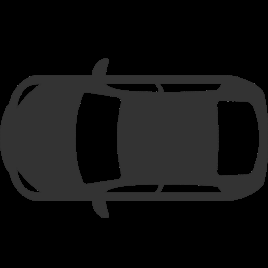

**图 1**：质量和可管理性的示意图。灰色多面体表示障碍物，绿色多面体表示生成的无障碍多面体。

这也保证了 FIRI 的高质量。单调更新体积下界的思想来源于 Deits 的基础工作 IRIS [1]，但 IRIS 没有考虑可管理性，而且在复杂环境中计算开销较大 [1]，[9]，限制了其实时应用。相比之下，FIRI 在可管理性和计算效率方面都改进了 IRIS。为保证可管理性，FIRI 通过 RsI 生成组成多面体的半空间，使这些半空间在包含种子的同时排除障碍物。为提高效率，本文根据两个优化模块的几何性质设计专用方法，相比 IRIS 将计算速度提高了多个数量级。
对于 RsI，本文将半空间计算转化为最小范数问题，即严格凸二次规划（QP）。考虑到该问题维度低但约束多，本文将原本用于线性复杂度线性规划的 Seidel 方法 [13] 推广到最小范数问题。与多种通用 QP 求解器 [14]–[16] 相比，该方法能够在明显更短的时间内得到解析解。
MVIE 是最具挑战性的极值椭球问题之一 [17]，在许多应用中都有需求 [18]，[19]。现有方法大多采用半定规划（SDP）形式 [1]，[20]，并使用内点法求解 [17]，[21]–[23]。但在处理远多于空间维数的约束时，每轮迭代都需要求解大型方程组，计算效率较低。为降低开销且不牺牲解的质量，本文给出 MVIE 的等价二阶锥规划（SOCP）形式，从而显著提高计算效率。
特别是在二维场景中，本文进一步提出 MVIE 的解析算法，实现更高的计算效率。据作者所知，该方法首次使计算复杂度与输入凸多面体的超平面数量呈线性关系。作为 MVIE 的对偶问题，最小体积包围椭圆（MVEE）早已利用 LP 型问题结构 [25] 发展出线性时间解析算法 [24]。但由于 MVIE 不满足相应的 LP 型问题性质，且缺少基问题的解析求解方法 [26]，几十年来一直没有类似的线性复杂度算法。本文通过重新构造问题、改进随机算法，并借鉴 GJK 算法距离子程序的自底向上策略 [27]，解决了这些困难。因此，专用二维方法相比其他先进方法 [1]，[23] 可获得多个数量级的效率提升。
结合 RsI 和 MVIE 的上述方法，FIRI 能够在保持高效率的同时生成具有可管理性的高质量凸多面体。为评价质量、效率和可管理性，本文将 FIRI 与多种多面体生成算法 [1]，[2]，[9] 进行了全面比较。结果表明，FIRI 在三项要求上均优于其他方法。本文还通过多个真实应用展示 FIRI 的适用性，包括带非完整约束的二维车辆、三维四旋翼，以及质点模型和全身模型。

本文的主要贡献如下：
1) 引入 RsI 以保证生成多面体的可管理性，并针对变量少、约束多的特点设计专用高效求解器。
2) 提出 MVIE 的新型 SOCP 形式，避免正定约束并提高计算效率。
3) 首次针对二维 MVIE 提出线性时间解析算法，进一步实现极高的计算速度。
4) 在上述方法基础上提出 FIRI 凸多面体生成算法。大量实验验证了其在质量、效率和可管理性方面的综合优势。
II. 相关工作
A. 无障碍凸多面体的生成
Deits 等人 [1] 提出了基于半定规划的迭代区域膨胀方法（IRIS），目标是生成尽可能大的无障碍凸多面体。IRIS 先膨胀一个椭球，将其作为种子，再利用接触平面的交集得到凸多面体；下一轮迭代则把所得凸多面体的 MVIE 作为新的膨胀种子。然而，该方法每轮都需要通过半定规划计算 MVIE，严重影响计算效率。此外，IRIS 的超平面计算不能直接加入额外的种子包含约束，

---

## 原文第 3 页核心内容与翻译

3
导致可管理性不足。相比之下，FIRI 的 RsI 统一处理排除障碍物和包含种子的约束，使求解更简单、更高效。Wu 等人 [28] 使用类似 IRIS 的椭球超平面方法生成凸多面体，并提出基于 ADMM 的方法，迭代细化多面体和优化轨迹，以获得更短、更优的轨迹。Dai 等人 [29] 在 IRIS 基础上提出 C-IRIS，依据运动学把任务空间中的碰撞映射到构型空间，再在构型空间生成经过验证的安全凸包。类似地，Mark 等人 [30] 通过非线性规划将 IRIS 扩展到构型空间，提出 IRIS-NP。随后，Werner 等人 [31] 在 IRIS-NP 基础上采样附近的构型空间障碍物，显著加快了多面体生成。这些 IRIS 衍生方法主要针对构型空间中的多关节机械臂，与本文关注的问题不同。

为解决 IRIS 效率低和局部可管理性不足的问题，Liu 等人 [2] 提出区域线搜索膨胀算法（Regional Inflation by Line Search，RILS），以线段作为种子输入。RILS 首先生成一个包含该线段且排除所有障碍物的最大椭球，然后利用障碍物接触平面膨胀椭球形成凸多面体，其基本上对应 IRIS 一轮迭代中的膨胀步骤。RILS 计算速度较快，但由于把输入线段作为椭球长轴，往往会得到较保守的凸包。

针对体素地图，Gao 等人 [8] 提出了并行凸簇膨胀算法。该方法从一个未占用的种子体素开始，依据可见性沿坐标轴逐层扩展，同时保持体素集合的凸性。尽管采用并行计算加速，该算法只有在地图分辨率较低时才能接近实时。另一方面，Savin 等人 [12] 使用空间反演思想，以输入种子点为中心进行球极映射，将外部障碍点翻转；计算反演障碍点的凸包后，再将其变换回原空间得到最终凸包。球极映射的强非线性限制了该方法，因为反演空间中的体积损失会使最终多面体与障碍物之间出现间隙，导致结果保守。

为解决这一问题，Zhong 等人 [9] 采用球翻转映射。由于该映射中固有的隐藏点移除算子 [32] 的性质，该方法能够得到种子点周围的可见星形凸区域，然后通过启发式方法将其划分为最终的凸多面体。但该方法使用 Quickhull [33]，当映射后的点集中在球面附近时，算法性能会下降；此外，启发式划分也会产生较保守的结果。总的来看，现有方法普遍至少存在效率低、结果保守或缺少可管理性中的一个问题，从而限制了实际应用。
B. 最大体积内接椭球（MVIE）
MVIE 也称为内 L¨owner-John 椭球 [34]。
Nesterov 等人 [22] 在每轮迭代中采用带专用重新缩放方法的内点算法，以多项式时间求解 MVIE，性能超过椭球算法 [35]。Khachiyan 等人 [36] 利用障碍函数法，将问题转化为一系列仅含线性约束的子问题。与 Nesterov 的方法 [22] 相比，该方法所需计算更少。随后，Anstreicher 等人 [37] 改进了这两种方法 [22]，[36]，并指出事先计算多面体的近似解析中心能够有效降低复杂度。Zhang 等人 [21] 也改进了 Khachiyan 的方法 [36]，用原始—对偶内点法替代效率较低的原始障碍函数法来求解子问题。

此外，他们没有继续处理多个子问题，而是提出一种不含矩阵变量的新型原始—对偶内点法，直接求解 MVIE。通过非线性变换，他们在迭代过程中消除了椭球系数矩阵的正定约束，并证明这种非线性变换保持解的唯一性。沿用消除矩阵变量的思路，Nemirovskii [38] 利用拉格朗日对偶性将 MVIE 重构为鞍点问题，再依据 Nesterov 的自协调理论 [22]，通过路径跟踪法寻找近似鞍点。

然而，当约束数远大于空间维数时，这些内点法会遇到困难。本文关注的正是这类场景：每轮迭代都需要求解大规模线性方程组，使其无法在可接受时间内计算 MVIE。为提高效率，Lin 等人 [39] 采用快速近端梯度法 [40]，提出一种基于一阶优化的 MVIE 方法。虽然该方法明显提高了效率，但由于用单边 Huber 函数近似正定约束中的不可微指示函数，不能得到精确解。

MVIE 是极值椭球问题中最具挑战性的一类 [17]。其他极值椭球问题，例如最小体积包围椭球（MVEE），可以通过线性归约转化为 MVIE，但这种转化不可逆。除内点法外，二维 MVEE 还可以通过线性时间随机方法得到解析解 [24]。然而，对于更具挑战性的 MVIE，几十年来一直没有相应的线性复杂度算法。本文将解决这一空缺。
III. 快速迭代区域膨胀
A. 问题定义
考虑一个障碍物较多的 n 维环境中的凸种子，其中 n∈{2,3}。种子的几何形状用凸多面体的 V 表示 [41] 给出，即有限个点的凸组合
Q = conv{v1, . . . , vs},
(1)
其中 v1，…，vs∈Rn 可以存在冗余，也就是说，这些点不必仅包含 Q 的极点。障碍区域 O 虽然可以是非凸的，

---

## 原文第 4 页核心内容与翻译

4
(b)  RsI
(c)  MVIE
(a)  Input of FIRI
①
②
③
④
⑤
⑥
具有可管理性的凸多面体
能够包含种子
不具有可管理性
无法包含种子

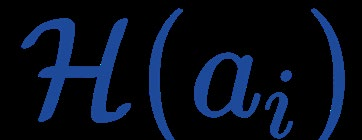

**图 2**：FIRI 的计算过程概览，对应算法 1 中反复执行的 RsI 和 MVIE 计算模块。(b) 左图给出了在变换空间中针对 Oi 计算半空间的一个具体示例，并比较了有、无可管理性两种情况。

（b）中的 ①—⑥把第 14—18 行的处理过程综合展示出来。(b) 中逐渐变大的膨胀椭球对应第 14 行对最近半空间的迭代搜索；半空间数量逐渐增加对应第 15 行；障碍物数量逐渐减少对应第 16 行。
假设障碍区域由多个凸障碍物的并集构成，即 O = ∪N
i=1Oi，其中第 i 个障碍物由 si 个点确定：
Oi = conv{ui,1, . . . , ui,si}.
(2)
这使 FIRI 能够直接处理多面体类型的障碍物；相比之下，只处理点的现有方法 [2]，[9] 需要先离散化这类障碍物。本文要求种子 Q 与障碍区域 O 不发生碰撞，即 Q∩O=∅。
本文要计算一个无障碍凸多面体 P，要求它包含种子 Q，同时排除所有障碍物 O。此外，在给定的关注区域内，P 应具有尽可能大的体积。为方便起见，将关注区域的边界视为障碍物并编码到 O 中，这样就能限制 Q 周围无障碍空间的体积。上述要求可写成如下优化问题：
max
P
vol(P),
s.t. Q ⊆P, O ∩int(P) = ∅,
(3)
其中 vol(P) 表示凸多面体 P 的体积，int(·) 表示集合的内部。注意，问题 (3) 的解集不会为空，因为种子 Q 本身已经是一个可行解。
B. Algorithm Overview
即使忽略包含种子的约束 Q⊆P，问题 (3) 在二维中仍需要 O(N^7) 的计算量 [42]，在三维中属于 NP-hard 问题 [43]；加入该约束后，问题会更加复杂。
为平衡效率和质量，本文不追求问题 (3) 的全局最优解，而是高效地寻找一个高质量可行解。此外，计算目标函数 vol(P) 至少与 NP 完全问题一样困难 [44]，因此本文优化一个容易计算的 vol(P) 合理下界，以间接增大原目标函数。与文献 [1] 一样，本文选择 P 的 MVIE 体积作为这一​​下界。
为在满足问题 (3) 约束的同时高效增大凸多面体 P 的体积下界，本文提出算法 1 所示的快速迭代区域膨胀算法 FIRI。
任何严格包含于 Q 的椭球都可以用来初始化算法。FIRI 在外层循环（第 4—21 行）中反复执行 RsI 和 MVIE 两个模块：第 k 轮中，前者以椭球为输入并将其扩展为新的凸多面体 Pk，后者以 Pk 为输入并计算其 MVIE Ek。如图 2 所示，两个模块的输出互相作为下一步的输入。下面将分别介绍这两个模块，以及 FIRI 的收敛性和可管理性。
本文将椭球 E 定义为
E =

p
p = AEDEx + bE, x ∈Rn, ∥x∥= 1
,
(4)
其中 AE∈Rn×n 为正交矩阵，DE∈Rn×n 为对角正定矩阵，bE∈Rn。DE 的对角元素对应 E 的半轴长度。

1) RsI：对于每个障碍物 Oi，在满足存在一个半空间、该半空间不包含障碍物但同时包含膨胀后的椭球和种子 Q 的条件下，尽可能膨胀输入椭球 E。随后利用这些半空间形成新的多面体，作为 RsI 的输出。

具体而言，利用上一轮生成的椭球 E 所确定的逆仿射变换，将 Q 和 Oi 变换到新空间（第 8 行和第 10 行）。由于 Q 和 Oi 都采用 V 表示，变换后的图形仍是其顶点变换结果的凸组合，即
¯Q = conv{D−1
E AT
E (vj −bE), 1 ≤j ≤s},
(5)
¯
Oi = conv{D−1
E AT
E (ui,j −bE), 1 ≤j ≤si}.
(6)
需要注意的是，在变换空间中，椭球 E 被变换为单位球 B：
B = {x ∈Rn | ∥x∥= 1} ,
(7)
与椭球相比，单位球的碰撞检查计算量小得多。随后，在第一个内层循环（第 10—11 行）中，为每个变换后的障碍物 Ōi 计算一个限制性半空间。与不能保证包含种子的已有方法 [1]，[2] 相比，本文提出的 RsI 要求该半空间同时包含种子和相应的膨胀球，但排除障碍物。

---

## 原文第 5 页核心内容与翻译

5
算法 1：FIRI
说明：障碍物数量为 N；椭球 E 的参数为 AE、DE、bE；半空间 H(a) 定义见式 (9)。
输入：种子 Q、障碍物 O、初始椭球 E0、阈值 ρ。
输出：凸多面体 P。
1 begin
2
k ←0
3
repeat
4
k ←k + 1
5
/* RsI starts */
6
I ←{1, . . . , N}
7
E ←Ek−1, ¯P ←Rn
8
¯Q ←D−1
E AT
E (Q −bE)
9
foreach i ∈I do
10
¯Oi ←D−1
E AT
E (Oi −bE)
11
ai ←arg maxa∈Rn aTa,
s.t. ¯Q ⊆H(a), ¯Oi ∩int(H(a)) = ∅
12
end
13
repeat
14
j ←arg mini∈I aT
i ai
15
¯P ←¯P ∩H(aj)
16
I ←I\

i ∈I
¯Oi ∩int(H(aj)) = ∅
17
until I = ∅
18
Pk ←AEDE ¯P + bE
19
/* RsI ends */
20
/* MVIE starts */
21
Ek ←E∗(Pk)
22
/* MVIE ends */
23
until vol(Ek) ≤(1 + ρ) vol(Ek−1)
24
return Pk
25 end
该半空间包含 Q̄ 和相应的膨胀球 Bi，同时排除 Ōi。此外，算法还要最大化 Bi 的大小。Bi 定义为
Bi =

x ∈Rn | ∥x∥= aT
i ai
,
(8)
其中 ai 是半空间边界与膨胀球 Bi 的唯一接触点。半空间 H(ai) 定义为
H(ai) =

x ∈Rn  aT
i x ≤aT
i ai
.
(9)
限制性半空间的计算可以写成第 11 行所示的优化问题，本文将在第 IV 节给出高效求解器。在图 2(b) 左图中，本文在变换空间中给出了限制性半空间计算的具体示例，并比较了有、无可管理性的情况。特别是，在没有可管理性的情况下（IRIS 采用的方式），只追求椭球膨胀最大化，会导致计算出的半空间无法保证包含种子点。

在第二个内层循环（第 14—16 行）中，根据得到的半空间生成新的凸多面体。算法反复寻找最近的半空间 H(ai)，将其加入 P̄，然后删除对应障碍物位于 H(ai) 外部的半空间。这种广泛采用的贪心策略 [1]，[2]，[31] 能够减少组成凸多面体的半空间数量，使其相对于大量障碍物尽可能少。处理完全部半空间后，就能在变换空间中得到 H 表示 [41] 的无障碍多面体。随后将 P̄ 变换回原空间，得到新的多面体 Pk（第 18 行）。因此，FIRI 的输出是 H 表示的无障碍凸多面体，即 m 个半空间的交集：
P =

x ∈Rn  APx ≤bP
,
(10)
其中 AP∈Rm×n，bP∈Rm。如图 2(b) 中的 ①—⑥ 所示，本文综合展示了上述两个过程（第 14—18 行）。
2) MVIE：只要闭集 P 的内部非空，就可以通过求解下式确定其唯一的 MVIE [45] E∗(P)：
max
AE,DE,bE vol(E), s.t. E ⊆P,
(11)
该问题用于第 21 行。需要指出的是，MVIE 只以一个凸多面体作为输入，与生成该多面体时使用的具体障碍物无关。为求解 MVIE，本文将在第 V 节和第 VI 节提出高效方法，使 MVIE 的计算开销不再成为这种单调膨胀方法应用于实时场景的障碍 [1]。
3) FIRI 的可管理性与收敛性：在迭代计算过程中，FIRI 始终保证解的可行性，也就是说，随着 k 增大，生成的凸多面体 Pk 始终满足原问题的约束。同时，FIRI 保持 MVIE Ek 体积的单调性，而该体积是凸多面体 Pk 体积的下界。下面通过分析 FIRI 输出的可行性和单调性，说明它所带来的可管理性和收敛性。

对于可行性，由于 RsI 计算出的每个半空间（第 11 行）都满足原问题约束，由这些半空间交集形成的新凸多面体 Pk 必然可行：
Q ⊆Pk, O ∩int(Pk) = ∅
(12)
这就保证了 FIRI 的可管理性。此外，按照第 III-A 节的定义，给定关注区域是有界的，其边界已编码到 O 中。因此，可行性还表明 RsI 始终生成闭多面体 Pk。
对于单调性，在第 k 轮迭代中，RsI 针对每个变换后的障碍物 Ōi 膨胀单位球 B，并始终保证接触点 ai 满足 ||ai||≥1。因此，在变换空间中，第二个内层循环（第 14—16 行）得到的 P̄ 始终满足 B⊆P̄；这意味着在原空间（第 18 行）有 Ek−1⊆Pk。由于 Ek 是包含在 Pk 中的最大椭球，因此有
vol(Ek−1) ≤vol(Ek).
(13)
这就得到体积的单调性。不断重复迭代会产生序列 {P1，E1，…，Pk，Ek，…}。由于 vol(Ek) 非递减且有上界，椭球体积将收敛到有限值。

---

## 原文第 6 页核心内容与翻译

6
因此，当 vol(Pk) 的这一体积下界无法得到足够改善时，FIRI 终止（第 23 行）。总的来说，RsI 为 FIRI 带来可管理性，单调迭代更新则优化多面体体积下界，从而得到高质量结果。需要指出的是，FIRI 的效率很大程度上取决于第 11 行和第 21 行两个优化问题的求解性能。后续章节将利用这两个优化问题的几何结构，提出高效、可靠的子算法，以显著提高 FIRI 的计算效率。
IV. 通过 SDMN 求解 RsI 中的限制性半空间计算
A. 限制性半空间计算的重构
本节针对算法 1 第 11 行定义的 RsI 半空间计算，设计高效方法。结合式 (9) 中半空间 H(ai) 的定义，可将半空间计算写成
max
ai∈Rn aT
i ai,
(14a)
s.t. vTai ≤aT
i ai, ∀v ∈¯Q,
(14b)
uTai ≥aT
i ai, ∀u ∈¯Oi.
(14c)
算法 1 保持 aiT ai>0，从而保证原点始终位于半空间 H(ai) 的内部。因此，尽管膨胀球 Bi 的最大化问题是非凸的，但可以利用极对偶性得到其等价的最小范数形式。具体来说，引入新变量 b，并代入 ai=b/(bTb)，即可得到等价的 L2 范数最小化问题
min
b∈Rn bTb,
(15a)
s.t. vTb ≤1, ∀v ∈¯Q,
(15b)
uTb ≥1, ∀u ∈¯Oi,
(15c)
该问题具有维度低但约束多的特点。在重构式 (15) 中，两类约束统一为同一种不等式形式。该形式既能处理包含种子约束的情况，也能处理不包含种子约束的情况，因此后续求解器 SDMN 可以直接适用。相比之下，IRIS [1] 等已有方法在保持原有问题结构的同时难以加入种子包含约束，因而难以通过简单增加约束实现可管理性。

B. 小维度多约束最小范数问题的求解
为高效求解限制性半空间计算的重构问题 (15)，本文提出一种针对小维度最小范数问题的解析方法，称为 SDMN。该方法将 Seidel 的随机算法 [13] 从线性规划（LP）推广到最小范数问题，并且复杂度与约束数量呈线性关系。
不失一般性，考虑如下小维度最小范数问题：
min
y∈Rn yTy, s.t. Ey ≤f,
(16)
算法 2：SDMN
说明：已检查的约束集合为 I；递归调用的输入和输出为 H′E、y′。
输入：半空间约束集合 HE。
输出：y。
1 begin
2
y ←0
3
if dim(HE) == 1 then
4
y ←OneDimMinNorm(HE)
5
return y
6
end
7
I ←{}
8
foreach h ∈HE in a random order do
9
if y /∈h then
10
/* Detail in Sec. IV-B2 */
11
{M, v, HE
′} ←HouseholderProj(I, h)
12
y′ ←SDMN(HE
′)
13
y ←My′ + v
14
end
15
I ←I ∪{h}
16
end
17
return y
18 end
其中 E∈Rd×n，f∈Rd，d 表示约束数量，且远大于 n。下面在算法 2 中给出一个求解小维度最小范数问题 (16) 的线性复杂度随机算法。
如算法 2 所示，这是一个递归算法。下面先概述算法，再详细说明如何构造递归问题，最后分析复杂度。
1) 算法概述：记 HE 为与最小化 L2 范数问题 (16) 的约束对应的超平面集合，记 I 为已经检查过的约束集合（第 15 行）。算法 2 从 y=0 开始，这是无约束 L2 范数最小化的解（第 2 行），然后按照随机顺序逐步检查 h∈HE（第 8 行）。算法检查满足 I 中约束的当前解是否违反新约束 h。如果没有违反，则检查下一个约束；如果违反，则 h 必须是有效约束，也就是说，解必须位于 h 的边界上。此时，在约束 I∪{h} 下，问题 (16) 可写为
min
y∈Rn yTy,
(17a)
s.t. EIy ≤fI,
(17b)
Ehy = fh,
(17c)
其中 EI 和 fI 表示 I 中超平面对应的系数，Eh 和 fh 表示 h 的系数。利用问题 (17) 的几何结构，可以将其变换为一个 n−1 维的 L2 范数最小化子问题，其形式与式 (16) 相同，具体见第 IV-B2 节。该变换允许递归调用算法 2（第 12 行）。当 n=1 时，问题 (16) 等价于在一个区间内求最小绝对值的问题（第 4 行），

---

## 原文第 7 页核心内容与翻译

7
原点
可行域
可行
区域
原点
可行
区域
原点
可行
区域
(a)
(b)
(c)
(d)

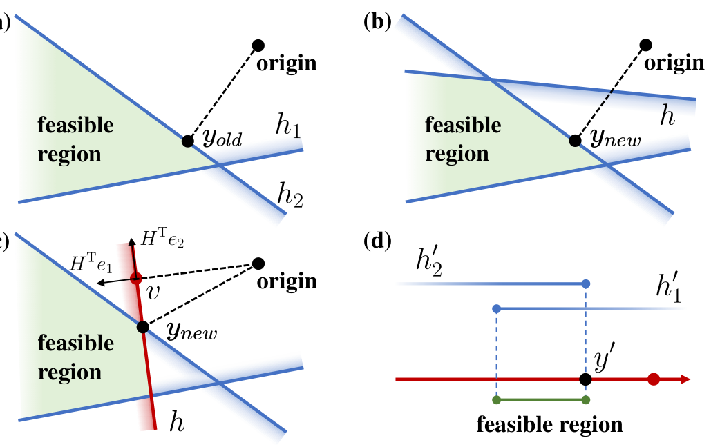

**图 3**：算法 2 在二维情况下的一个具体示例，分别对应第 IV-B1 节和第 IV-B2 节。对于第 IV-B1 节：(a) 已检查不等式约束 h1 和 h2，即 I={h1，h2}；yold 是满足 I 的二维 L2 范数最小化问题的解。(a)⇒(b)：当 yold 不违反新加入的约束 h 时，ynew=yold。(a)⇒(c)：当 yold 违反新约束 h 时，需要在对应 h 的约束平面上寻找新的解 ynew，这相当于式 (17) 所示的等式约束问题。对于第 IV-B2 节：向量 v 垂直于约束平面，HTe1 和 HTe2 是二维空间的一组正交基，其中 HTe2⊥v。(d)：以 v 为原点、HTe2 为正交基，在约束平面上的一维子空间建立新坐标，并将已经检查的约束 h1、h2 变换为该坐标下的 h′1、h′2。最后，将 (c) 变换为仅含不等式约束 (23) 的一维 L2 范数最小化问题。
其解可以直接计算得到。假设子问题能够成功求解，就可以计算满足 I∪{h} 约束的新解（第 13 行）。随后继续检查下一个约束，直到检查完 HE 中的全部约束，此时得到算法 2 的结果。为直观展示约束违反检查过程，图 3 给出了一个示例，其中用 yold 和 ynew 区分满足 I 以及满足 I∪{h} 的解。
2) 递归问题构造：算法 2 的一个关键步骤是构造递归问题（第 11—12 行），即把带等式约束的式 (17) 转化为一个形式与原问题 (16) 相同的 n−1 维子问题。该过程的效率和稳定性会明显影响算法 2。由于 L2 范数在正交变换下保持不变，本文在约束平面 (17c) 上建立新的 n−1 维笛卡尔坐标系，用于构造降维后的递归问题。图 3(c) 和 3(d) 给出了该过程的具体示例。如图 3(c) 所示，将约束平面上 L2 范数最小化的点作为坐标系原点：
v = fhET
h
EhET
h
.
(18)
显然，约束平面上的任意点 y 都满足
yTy = (y−v)T(y−v)+vTv，
(19)
这意味着，在约束 (17c) 下，y 的 L2 范数最小化等价于 y−v 的 L2 范数最小化，而后者可以在新坐标系中表示为 n−1 维向量。
通过寻找满足下式的正交矩阵 H∈Rn×n，构造新的坐标系：
Hv ∝ej,
(20)
其中 ej∈Rn 是单位向量，其第 j 个元素为 1。j 的选择方式和 H 的计算方法将在第 IV-B2 节末尾给出。条件 (20) 表明，正交矩阵 HT 除第 j 列外的所有列向量构成 v 的正交补空间的一组标准正交基，如图 3(c) 所示。由于 v 垂直于约束平面，因此采用这组标准正交基定义约束平面上 n−1 维子空间的新坐标系，并引入相应坐标 y′∈Rn−1。记 M∈Rn×(n−1) 为删除 HT 第 j 列后得到的矩阵，则与 y′ 对应的原坐标系向量 y 可写为
y = My′ + v.
(21)
根据分解式 (19) 和式 (21)，在约束平面上最小化 y 的 L2 范数，等价于最小化
(22)
最终，对于带等式约束的式 (17)，可以在约束平面上构造对应的、仅含不等式约束的 n−1 维 L2 范数最小化问题：
min
y′∈Rn−1 y′Ty′,
(23a)
s.t. EIMy′ ≤fI −EIv.
(23b)
如图 3(d) 所示，将式 (21) 代入原问题不等式约束 (17b)，即可得到关于 y′ 的线性不等式约束，其对应的超平面集合记为 H′E（第 11—12 行）。显然，式 (23) 与式 (16) 结构相同但维度更低，因此可以递归调用算法 2 求解（第 12 行），从而形成递归算法结构。

下面给出式 (20) 中 j 和 H 的具体构造方法。采用 Householder 反射 [46] 得到正交矩阵 H。v 是约束平面的法向量，其大小与问题的几何尺度相关，具有直观的数值稳定性。因此，使用法向量 v 计算 Householder 反射。首先，将 v 中绝对值最大的元素对应的下标设为
j = argmaxk∈{1,...,n}∥vTek∥.
(24)
随后，将 v 变换为与 ej 平行的反射向量 u 可计算为
u = v + sgn(vj)∥v∥ej,
(25)
相应的 Householder 矩阵为
H = In −2uuT
uTu ,
(26)
该矩阵是正交矩阵，并满足前述条件 (20)。采用与 v 中绝对值最大元素相反方向对应的钝角反射向量 u，可以避免 Householder 变换因反射角过小而产生病态条件。

---

## 原文第 8 页核心内容与翻译

8
这样可以避免因反射角过小而产生病态条件。该过程在数学上等价于执行一步 Householder QR 分解；与可能受到灾难性消去影响的 Gram–Schmidt 正交化相比，Householder 方法具有更高的数值稳定性 [47]。

3）复杂度分析：本节最后分析随机算法 2 的复杂度。每次迭代都可能递归调用维数为 n−1 的子问题。对于维数较低、约束数量较大的情况，新约束很少成为有效约束，因此递归调用通常很小。算法的期望复杂度为 O(n!d) [13]；在常用的 n∈{2,3} 情况下，复杂度随约束数量近似线性增长。预先随机打乱约束顺序后，算法性能基本不再依赖输入顺序，通常可以达到期望线性复杂度。因此，在算法 1 的 RsI 中处理全部障碍物时，计算量只随障碍物和种子的总顶点数线性增长。
V. 通过仿射尺度算法求解 MVIE 的 SOCP 重构
本节针对 FIRI 所需的低维、大量约束 MVIE 问题（算法 1 第 21 行）设计高效求解方法。通过恰当处理椭球矩阵的正交约束和含矩阵行列式的目标函数，我们将 MVIE 重构为二阶锥规划（SOCP），再利用仿射尺度法 [48] 高效求解。

A. MVIE 的 SOCP 重构
首先具体展开式（11）中的 MVIE 定义。根据式（4）中椭球 E 的参数，DE 的对角元素是椭球半轴长度，因此问题（11）的目标 vol(E) 与 det(DE) 成正比 [49]。此外，半无限约束 E⊆P 等价于下式给出的二阶锥约束：
1
2 ≤bP −APbE [20]，这是一个二阶锥约束。
其中 AP、bP 是式（10）所定义凸多面体 P 的半空间系数，[·] 表示逐元素运算。因此，问题（11）可以写成：
max
AE,DE,bEdet(DE),
(27a)
s.t. [[APAEDE]21]
1
2 ≤bP −APbE,
(27b)
DE = diag(dE), dE ∈Rn
≥0,
(27c)
AT
E AE = In,
(27d)
其中 diag(·) 既表示构造对角矩阵，也表示取方阵的全部对角元素。但该形式仍然对 AE 施加正交归一约束。若将 AEDE 作为决策变量，式（27）会成为带有困难正交约束的半定规划问题，这正是已有 MVIE 方法常采用的形式 [1]，[20]，[23]。
1 关于复杂度的具体推导可参见 Seidel 文献 [13] 的定理 1。
下面消除式（27d）的正交约束。对于式（27）的非退化最优解，AEDE²A_E^T 始终为正定矩阵，因此 Cholesky 分解 AEDE²A_E^T=L_EL_E^T 唯一 [50]，其中 LE 是对角元素为正的下三角矩阵。将 LE 作为决策变量，由于 AE 是正交矩阵，目标函数（27a）和约束（27b）可改写为式（28）和式（29）。
det(DE) =
q
det(AED2
EAT
E ) = det(LE),
(28)
[[APAEDE]21]
1
2 = [[APLE]21]
1
2 .
(29)
因此，AE 的正交归一约束（27d）被消除，式（27）等价于：
max
LE,bE det(LE),
(30a)
s.t. [[APLE]21]
1
2 ≤bP −APbE,
(30b)
LE is lower triangular.
(30c)
接下来处理 det(LE)。它等于 LE 对角元素的乘积。定义几何平均数的下图集为：
K1/n =
n
(x, t) ∈Rn
≥0 × R
(x1 · · · xn)
1
n ≥t
o
,
(31)
于是，最大化椭球 E 等价于最大化新变量 t，并满足 (diag(LE),t)∈K^(1/n)。对于式（27b）的约束，记二阶锥为 K_n，并将 m 个二阶锥的笛卡尔积记为 K_n^m：
Kn =

(t, x) ∈R × R1×n−1  t ≥∥x∥
,
(32)
Km
n = Kn × · · · × Kn ⊆Rm×n.
(33)
于是，优化问题（30）可写成：
max
t,LE,bE t,
(34a)
s.t. (diag(LE), t) ∈K1/n,
(34b)
(bP −APbE, APLE) ∈Km
n+1,
(34c)
LE is lower triangular,
(34d)
其中 m 是式（10）中构成 P 的半空间数量。此外，K^(1/n) 还可以使用 O(n) 个附加变量和 K_3 锥表示为二阶锥约束 [20]。至此，问题（34）被转化为只含二阶锥约束、目标函数为简单线性形式的优化问题。

B. 使用仿射尺度法求解大量约束的 SOCP
由式（34）得到纯 SOCP 后，为简化记号，将其记为：
min
x
cT
Kx,
(35a)
s.t. (cT
i x + di, xTAi) ∈Kni, 1 ≤i ≤¯m,
(35b)
其中 x∈R^n̄、cK∈R^n̄、ci∈R^n̄、di∈R 和 Ai 均为常量。
其中 x 由 LE 的全部下三角元素、bE、式（34）中的 t，以及为处理几何平均数下图集约束而增加的变量组成。由于 n 维椭球已有 n(n+3)/2 个变量，因此 n̄=O(n²)。

---

## 原文第 9 页核心内容与翻译

9
一个 n 维椭球已有 n(n+3)/2 个变量。为方便起见，将 t 设为 x 的第 n̄ 个元素，于是：
cK = (0, 0, ..., 0, −1)T ∈R¯n.
(36)
其中 m̄=O(m+n) 表示二阶锥约束的数量。
式（35b）中对应式（34b）附加 K3 锥的约束具有 Ai∈R^n̄×2、ni=3；对应式（34c）原始约束的约束具有 Ai∈R^n̄×n、ni=n+1。
下面高效求解 SOCP（35）。虽然原问题（11）的维数 n 仅为 2 或 3，但较大的约束数 m 会使重构后的 SOCP 包含大量约束。
为处理这种多约束 SOCP，我们将原用于线性规划的内点仿射尺度法（AS）[48] 推广到 SOCP。该算法每次迭代都有闭式更新步骤，并具有超线性收敛性质 [51]。每次迭代中，AS 使用约束的对数障碍函数确定严格可行域，并在该区域内计算更新步长。对于式（35），其对数障碍函数 φ(x) 定义为：
ϕ(x) = −
¯m
X
i=1
log (fi(x)) ,
(37)
fi(x) =

cT
i x + di
2 −xTAiAT
i x.
(38)
由此得到 φ(x) 的 Hessian 矩阵：
Hϕ(x) =
¯m
X
i=1
1
fi(x)2 ∇fi(x)∇fi(x)T −
¯m
X
i=1
1
fi(x)∇2fi(x),
(39)
其中 fi(x) 的梯度和 Hessian 矩阵为：
∇fi(x) = 2

cT
i x + di

ci −2AiAT
i x,
(40)
∇2fi(x) = 2

cicT
i −AiAT
i

.
(41)
Now we obtain the strictly feasible region of AS at (k + 1)-th
iteration based on the feasible k-th solution xk as

x ∈Rn | (x −xk)THϕ(xk)(y −xk) ≤1
,
(42)
which is an ellipsoidal region as Hϕ(xk) is positive definite.
Then the update step of (35) can be given by
xk+1 = xk −τ
H−1
ϕ cK
q
cT
KH−1
ϕ cK
,
(43)
其中 τ∈(0,1] 为步长。
VI. 通过线性复杂度算法解析求解二维 MVIE
受到对偶问题最小体积包围椭球（MVEE）线性时间算法 [24] 的启发，本节利用二维 MVIE 特有的 LP-type 问题结构 [25]，构造线性时间算法。VI-A 节介绍 LP-type 问题的必要背景，并分析现有通用方法用于 MVIE 时的局限；VI-B 节针对这些局限提出线性复杂度算法；VI-C 节给出算法所需子问题的解析解。
A. Background of LP-type Problem
Let us consider an abstract minimization [25] specified by
pairs (H, w), where H is a finite set of constraints and w :
2H →W is a value function that maps subsets of H to values
in a ordered set (W, <), which has a unique minimum value
−∞. For the sake of simplicity in subsequent descriptions, we
define finite sets G, F and a constraint h, which satisfy G ⊆
F ⊆H, h ∈H. The problem with (H, w) can be considered
as an LP-type problem as long as the following two properties
are satisfied [25]: for any G, F and h we have
• Monotonicity: w(G) ≤w(F),
• Locality: with −∞< w(G) = w(F), if w(F) < w(F ∪
{h}), then w(G) < w(G ∪{h}).
Three important definitions of LP-type problem are given:
• w(H) is called the value of H,
• constraint h is violated by H, if w(H) < w(H ∪{h}),
• the basis of H is the minimal subset of H with the same
value of H.
Then two primitive operations is defined: given a basis B,
• Violation test: determine whether w(B) < w(B ∪{h}),
for a constraint h /∈B,
• Basis computation: compute the basis of B ∪{h} when
h is violated by the basis B.
To give readers an intuitive understanding, we provide a
specific example: for the dual problem MVEE [24], H is the
input points set and w(H) is the area of the minimum ellipse
that can contain all the input points.
The goal of LP-type problem is to compute the basis of the
input set H and its corresponding value w(H). A generalized
algorithm for the LP-type problem is given by Matouˇsek et
al. [26]. The algorithm operates by randomly selecting a con-
straint h from the input set H and a known basis B ⊆H and
performing a violation test. If a violation is detected, a basis of
B ∪{h} is computed, then the algorithm is recursively called
with the new basis and the set of checked constraints. This
algorithm provides an efficient solution to LP-type problems
with finite primitive operations, whose expected number is
linear in the input set number |H|, thanks to its randomized
recursive structure. We refer the reader interested in this
complexity conclusion to Matouˇsek’s work [26].
However, for 2-D MVIE, the aforementioned generalized
algorithm described above is not available for two reasons:
i) In MVIE, the subset of input constraints may not form a
closed polygon, which leads to an undefined ellipse. Using
the volume of the ellipse, similar to its dual problem MVEE,
to define the value function w(·) is not feasible. ii) There is
currently no known method for performing analytical basis
computation directly for any subsets in MVIE.
B. Randomized Maximal Inscribed Ellipse Algorithm
In this subsection, we address the aforementioned chal-
lenges, and then we present a linear-time complexity algorithm
by improving the generalized algorithm [26] for 2-D MVIE.

---

## 原文第 10 页核心内容与翻译

10
𝑴𝒂𝒙
𝑴𝒂𝒙

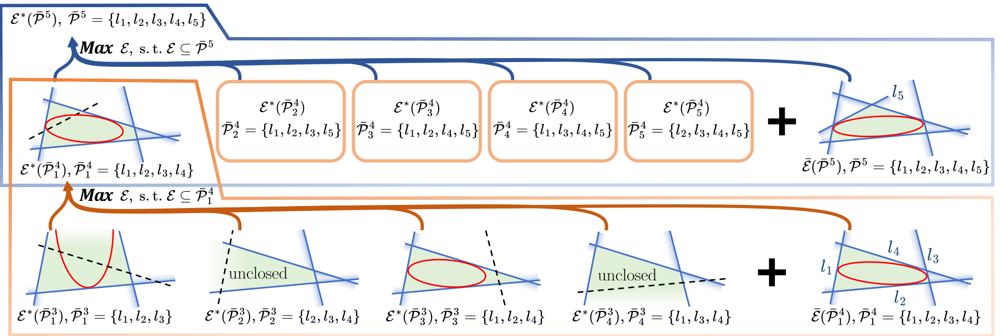

**图 4**：自底向上策略的一个具体示例。橙色大框表示根据式（49）计算
¯P4

1 的 MVIE 的过程：利用其子集 ¯P3
j（1≤j≤4）的 MVIE 以及自身的 MENN 进行比较。红色椭圆根据各子集下方的公式分别表示 MVIE E∗或 MENN ¯E。以左下角的子集为例，蓝色实线表示子集 ¯P3
1 中的元素，黑色虚线表示属于 ¯P4
1 但不属于 ¯P3
1 的元素。蓝色框以同样方式说明计算 ¯P5 的 MVIE 的过程。
1）值函数：对于未闭合的约束子集，本文增加一个表示其接近闭合程度的评价量；对于闭合子集，则使用 MVIE 面积，从而构造出满足 LP-type 问题性质的新值函数。值域 W 采用字典序集合（W，<）。在 R2 中，字典序定义为：对于任意 x=(x1，x2)T、y=(y1，y2)T∈R2，当 x1<y1，或 x1=y1 且 x2<y2 时，记 x<y。进一步将该顺序扩展到 R2∪{−∞}，并规定 −∞ 是唯一的最小值。考虑到约束子集经常不能形成闭合多边形，值函数定义为
w(G) =





−∞
if G = ∅
¯wu(G)
若 G 未闭合
¯wc(G)
若 G 已闭合
,
(44)
其中，¯wu(G) 表示 G 未闭合时接近闭合的程度。为定义 ¯wu(G)，首先构造集合 Gn，去除重复元素；Gn 中的元素均来自 G 所含半空间约束对应的单位法向量。随后按字典序定义
¯wu(G) = (−ap(Gn), min{|Gn|, 3}),
(45)
其中 ap(Gn) 表示 Gn 的极锥角度。采用这一特定定义，是为了处理 G 中存在平行元素时出现的边界情形。
对于 G 已闭合的情况，定义
¯wc(G) = (area(E∗(G))−1, ξ),
(46)
其中第一项表示 G 的 MVIE 面积的倒数，第二项 ξ 用于将该函数扩展到 R2。¯wc(G) 的第一项始终大于0，而 ¯wu(G) 的第一项始终小于或等于0。因此无论 ξ 取何值，都有 ¯wc>¯wu。根据这一满足单调性和局部性的值函数（证明见附录 A、B），MVIE 可以作为 LP-type 问题处理。
2）基集计算：为对 MVIE 进行解析基集计算，本文将 MVIE 分解为若干可以解析求解的子问题。于是，式（11）中 P 的 MVIE 等价于
E∗(P) = max
¯
PN⊆P area
 ¯E( ¯PN)

, s.t. ¯E ⊆P,
(47)
其中，P 是输入多边形；在本节中，P 同时表示构成该多边形的有限半空间集合。含有 N 个元素的子集记为 ¯PN。需要强调的是，¯PN 来自 MVIE 的唯一输入 P，与 RsI 中用于生成 P 的障碍物无关。¯E(¯PN) 是如下子问题的解：
¯E( ¯PN) = max
E
area(E),
(48a)
s.t. E ⊆¯PN,
(48b)
E 与 h 相切，∀h ∈¯PN。
(48c)
二维闭合区域至少需要 3 个半空间，而椭圆只有 5 个自由度，因此取 3≤N≤5。当 ¯PN 闭合且不含冗余元素时，式（48）具有解析解，其结果 ¯E 是与 ¯PN 形成的 N 边形所有边相切的最大椭圆，称为 MENN，详见第 VI-C 节。下文分别用 E∗和 ¯E 表示 MVIE 和 MENN。
对于式（48）不可行的两种情况，作如下特殊处理：i）若 ¯PN 未闭合，则将其 ¯E 定义为 ∞；ii）若闭合的 ¯PN 含有冗余元素，即某些元素不是所形成闭合多边形的边，则这些元素不可能满足式（48c），同样将 ¯E 定义为 ∞。在此基础上，通过枚举具有解析解的式（48）子问题，即可求得式（47）的 MVIE。
受 GJK 距离算法 [27] 启发，本文采用自底向上的策略有序组织枚举过程，图 4 给出了具体示例。在图 4 中，下标用于区分同一集合的不同子集，例如 ¯P4
1 表示 ¯P5 中的一个子集。

---

## 原文第 11 页核心内容与翻译

11
算法 3：MaxEllipse
说明：组合维数 δ = 5
输入：
H：输入集合；X：H 的基集的一个子集
输出：B：H 的基集；vB：B 的值
1 begin
2
vX ←w(X)
/* 按式（44）定义 */
3
if |X| ≥δ then
4
return X, vX
5
end
6
S ←{}
7
B ←X
8
vB ←vX
9
按随机顺序遍历 h∈H：
10
如果 ViolateTest(h, vB, X) 为真，则
11
B, vB ←MaxEllipse(S, X ∪{h})
12
end
13
S ←S ∪{h}
14
end
15
return B, vB
16 end
¯P5。具体而言，对于含有 4 个元素的子集 ¯P4
1，按照下式计算其 MVIE：
E∗( ¯P4
1) = max
E
area(E),
(49a)
s.t. E ⊆¯P4
1,
(49b)
E ∈{ ¯E( ¯P4
1)} ∪{E∗( ¯P3
j )}, 1 ≤j ≤4,
(49c)
其中 ¯P3
j 表示 ¯P4
1 中含有 3 个元素的子集。需要指出的是，闭合 ¯P3
j 的 MVIE 正好就是其 MENN [52]。
式（49）对应图 4 橙色大框中的过程：在各子集 ¯P3
j 的 MVIE 与 ¯P4
1 自身的 MENN 中，选取满足式（49b）且面积最大的椭圆，作为 ¯P4
1 的 MVIE。随后可采用相同方法向上构造含 5 个元素的 P5 的 MVIE，如图 4 蓝色框所示。
需要强调的是，对于通常含有超过 5 个半空间的实际输入 P，也采用类似的自底向上枚举：计算所有 ¯P5 子集的 MVIE，并选取完全包含在 P 中的最大椭圆。综上，通过自底向上连接上述过程，可以仅依据 3≤N≤5 的子集 MENN，在高效的枚举顺序下解析计算输入 P 的 MVIE。
3）算法概述：在上述工作基础上，本文改进通用框架 [26]，提出如算法 3 所示的二维 MVIE 随机算法。首次调用算法 3 时，令 H←P、X←{}。第 11 行的递归框架与前述自底向上策略结合后具有如下效果：发生递归调用时，说明输入 X 的所有子集已经检查过，并且对于 X 的任意子集
¯
¯X，总存在一个被 ¯X 违反的元素 h∈X。因此，若 X 已闭合，可在第 2 行直接求由 X 形成多边形的 MENN，得到 w(X)；若 X 未闭合，则可利用式（45）计算其值。由第 VI-A 节的复杂度结论，算法 3 只需进行有限次违反检查（第 10 行），并在闭合情况下计算 MENN、在未闭合情况下计算式（45），其期望次数与输入集合大小呈线性关系。
此外，任意基集的最大元素数称为组合维数。根据值函数（44），组合维数 δ=5。这意味着第 2 行只会遇到三角形、四边形和五边形的 MENN 计算，与式（48）的分解一致。第 3 行的组合维数 δ 保证递归次数上限为常数。
第 VI-C 节所述解析方法在输入含冗余元素时可能产生错误。因此按照第 VI-B2 节的处理方式，将冗余情况单独处理并把其解设为 ∞，避免影响整体算法。在算法 3 的违反检查（第 10 行）中，如果 h 被 B 违反，且 X∪{h} 形成含 N 条边的凸多边形但 N<|X∪{h}|，则判定为冗余并返回 false。
由于算法按自底向上策略检查，冗余闭合集合 X∪{h} 的非冗余闭合子集一定会被检查，因此无需再检查该冗余集合。由此得到二维 MVIE 的线性复杂度算法。MENN（式（48））的求解也会影响实际效率，第 VI-C 节给出其高效解析解。
C. 与 N 边形 N 条边相切的最大椭圆
本节给出算法 3 所需的 MENN 解析计算方法。MENN 是与任意凸 N 边形全部边相切的最大内接椭圆，其中 N∈{3，4，5}。对于任意非退化三角形 [52]、凸四边形 [53] 或凸五边形 [45]，这样的椭圆唯一存在。由于算法 3 的输入是非退化凸集合，以下默认 MENN 存在且唯一。
根据式（4）的定义，在二维情况下，椭圆 E 边界上的点 p∈R2 满足
(p −bE)T(AED2
EAT
E )−1(p −bE) = 1,
(50)
将点 p 的齐次坐标 [54] 记为
ˆp =

pT, 1
T。由于 AED2
EAT
E 是正定对称矩阵，式（50）是关于 p 的两个分量的二次多项式方程。将式（50）变换为二次型后，椭圆 E 可用齐次坐标表示为
P =

ˆp ∈R3  ˆpTMP ˆp = 0
,
(51)
其中系数矩阵 MP∈R3×3 为对称矩阵。
对于本节的 MENN 问题，直接使用式（51）求解并不现实，因为这需要先求出切点。因此，本文根据点和直线相对于椭圆 E 的极性关系 [55]，直接利用切线信息。首先，将切线写成代数形式。

---

## 原文第 12 页核心内容与翻译

12
直线的代数表示如下。在射影平面中，给定齐次坐标为 ˆp 的点，经过该点的直线可用直线坐标 l∈R3 表示，并满足
ˆpTl = 0,
(52)
根据这一表示，直线坐标可通过 Grassmann 展开 [56] 计算。依据椭圆的极性关系 [55]，当 ˆp 位于椭圆 E（式（51））上时，E 在 ˆp 处的切线直线坐标为
l = MP ˆp.
(53)
由于椭圆非退化，MP 可逆。根据式（51）和式（53），类似于式（51）的点集表示，椭圆 E 也可用其全部切线的直线坐标表示为
L =

l ∈R3  lTMLl = 0
,
(54)
ML ∝MP
−1.
(55)
现在可以直接利用切线信息计算 MENN。具体而言，先计算多边形各边的直线坐标以求得 ML，再得到 MP，最终获得式（4）所需的椭圆。整个过程依次使用式（52）、（54）、（55）、（50）和（51）。下面分别说明不同 N 的实现细节。
1）凸五边形的 MENN：对式（54）而言，对称矩阵 ML 含有 6 个变量。将凸五边形 5 条边的直线坐标分别代入式（54），可得到由 5 个方程组成的 6 元齐次线性方程组。由于凸五边形存在且仅存在一个与全部边相切的椭圆 [45]，该方程组始终具有非平凡解。根据这一解，再按前述过程逐步得到 MENN。
2）凸四边形的 MENN：与凸五边形不同，凸四边形只能提供四条切线。
因此，与四边形全部边相切的内接椭圆构成唯一的一参数集合；如图 5 所示，可把该参数取为某一条边上的预定切点 [45]。其中只有一个椭圆面积最大 [53]，它就是四边形的 MENN。
为简化计算，如图 5 所示，将四边形平移，使其中一个顶点与原点重合，并使与该顶点相连的一条边与 x 轴重合；这一变换不会改变四边形的形状。记该边的直线坐标为 lλ。受 Hayes [57] 工作启发，利用 lλ 上的切点引入新约束，记该点为 ˆpλ，则有
ˆpλ = (λ, 0, 1)T,
lλ = (0, 1, 0)T,
(56)
其中 λ 为变量。结合式（53）和式（55），两者的极性关系可写为
MLlλ ∝ˆpλ,
(57)

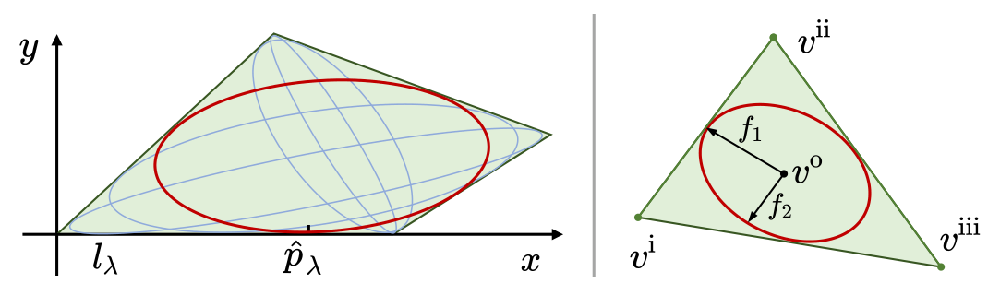

**图 5**：
左：凸四边形 MENN 计算示意。蓝色和红色椭圆表示在同一条边 lλ 上选取不同点 ˆpλ 后得到的椭圆。右：三角形 MENN 计算示意。

这为 ML 增加了一个独立约束。后续操作与第 VI-C1 节相同，不同之处在于最终将椭圆面积 [57] 写成 λ 的函数 AE(λ)。通过求 AE(λ) 一阶导数的零点，即可得到对应四边形 MENN 的最优 λ。该计算只需解析求解关于 λ 的二次方程。受篇幅限制，不再展开推导。
3）三角形的 MENN：与三角形三条边中点相切的 Steiner 内切椭圆就是 MENN [52]。如图 5 所示，记三角形顶点的二维笛卡尔坐标为 v∗=(v∗0，v∗1)T，∗∈{i，ii，iii}。
Steiner 内切椭圆的中心 vo 及两条共轭直径 f1、f2∈R2 可写为
vo = 1
3(vi + vii + viii),
(58)
f1 = 1
2(vo −viii), f2 =
1
2
√
3(vi −vii).
(59)
式（4）所需参数可计算为
bE = vo, AED2
EAT
E =

f1 f2

f1 f2
T.
(60)
VII. 评估与基准测试
为全面展示 FIRI 在效率、质量和可管理性方面的优势，本文设计了大量基准实验，将 FIRI 与多种先进的凸多面体生成算法进行比较。
FIRI 的效率来自针对算法 1 第 11 行和第 21 行两个优化问题设计的专用方法。为验证这些方法的有效性，分别对小维度多约束最小范数问题和 MVIE 求解方法开展对比实验。所有实验运行于 Intel Core i7-12700KF CPU、Linux 系统，使用 C++14，未采用硬件加速。
A. 无障碍凸多面体生成对比
根据第 II 节对多种先进凸多面体生成算法的介绍和分析，本文将 FIRI 与 IRIS [1]、Galaxy [9] 和 RILS [2] 进行基准比较。Gao 等人的方法 [8] 依赖栅格地图建模环境，只有在较低地图分辨率下才能接近实时运行，因此不在此处比较。Galaxy 可视为 Savin 方法 [12] 的改进，两者都基于空间反演，因此直接采用 Galaxy 进行基准测试。

---

## 原文第 13 页核心内容与翻译

13
表 I
不同方法生成无障碍凸多面体的适应性比较
方法
适应性
种子类型
障碍物类型
点
线段
多面体
点
多面体
FIRI
"
"
"
"
"
IRIS [1]
"
%
%
"
"
Galaxy [9]
"
%
%
"
%
RILS [2]
"
"
%
"
%
表 II
不同场景的输入障碍物数量
场景
输入障碍物数量
平均值
标准差
最小值
最大值
二维
稀疏
246.7
111.0
44
525
中等
1157.6
277.8
553
1683
密集
3007.5
515.2
1443
4048
三维
稀疏
453.6
119.6
303
670
中等
2677.8
613.6
1524
3929
密集
12659.0
764.9
11032
14536
对于 IRIS 和本文提出的 FIRI，均设置 ρ=0.02，即当本轮所得凸包 MVIE 的体积相对上一轮增长小于 2% 时停止。Galaxy 和 RILS 使用默认参数。
首先比较各方法对不同种类种子和障碍物输入的适应能力。表 I 表明，FIRI 对多种输入的适应能力最高。表 II 中，面向多面体障碍物的适应能力，是指无需离散化即可直接处理多面体障碍物。由于多面体表示是环境建模中广泛采用的方法 [58]，[59]，直接处理多面体障碍物具有实际价值。随后依据上述结果开展基准实验，以验证 FIRI 的性能优势。
1）可管理性：如第 I 节所述，可管理性在许多应用中十分重要。例如，前端生成的路径可能要求其线段完全位于凸包内 [10]；在全身规划中，还要求凸包能够包住机器人 [11]。因此，本文分别以点、线段和凸多面体作为种子，比较不同方法的可管理性。障碍物类型不影响可管理性，为保证公平，输入障碍物均采用点表示。
实验在 50×50 m 的复杂环境中进行，三维场景高度为 10 m，使用 Perlin 噪声 [60] 生成随机障碍物。
每次测试在环境中随机生成一个无碰撞种子作为输入。各算法的边界均限制为以种子中心为中心、边长 6 m 且与坐标轴平行的正方形（三维时为立方体），障碍物输入为地图中位于该边界内的点。当
种子为线段时，长度设为 1.5 m；种子为凸多面体时，三维设为 1.5×0.75×0.25 m 的长方体，二维设为 1.5×0.75 m 的矩形。生成不同障碍物密度的实验环境，输入障碍物数量见表 II。每种密度生成 10 个不同环境，每个环境针对每种种子输入进行 500 次随机试验。
为保证公平，依据表 I 对不同种子情况作如下处理。种子为线段时，Galaxy 和 IRIS 只能使用一个点作为输入，因此分别使用线段两个端点和中点作为种子，计算 3 个凸多面体，再选择包含线段程度最高的凸包作为结果。种子为凸多面体时，FIRI 可直接使用该多面体；IRIS 和 Galaxy 分别以种子各顶点及中心点为输入，计算多个凸包。对于适配线段输入的 RILS，则以种子的对角线计算多个凸包。上述三种方法均选择对种子包含程度最大的凸包作为结果。
本文计算生成完全包含种子的凸多面体的成功率，结果见表 III。为更直观地展示结果，还给出一个需要可管理性的全身规划应用示例。
如图 12(b) 所示，本文以矩形机器人作为种子，该应用的具体内容见第 VIII-A2 节。由于 IRIS 采用贪心方式寻找体积尽可能大的凸包，其表现较差，
表 III
不同场景和种子类型下，各方法生成包含种子凸多面体的成功率
场景
成功率 [%]
点种子
线段种子
多面体种子
FIRI
IRIS [1]
Galaxy [9]
RILS [2]
FIRI
IRIS [1]
Galaxy [9]
RILS [2]
FIRI
IRIS [1]
Galaxy [9]
RILS [2]
二维
稀疏
100
98.4
100
100
100
74.7
81.6
100
100
88.9
95.8
97.0
中等
100
97.0
100
100
100
53.9
64.2
100
100
79.7
91.1
95.3
密集
100
96.6
100
100
100
48.5
39.1
100
100
69.7
73.9
90.6
三维
稀疏
100
99.1
100
100
100
96.5
79.1
100
100
96.2
85.1
98.0
中等
100
97.8
100
100
100
78.2
61.3
100
100
70.6
78.0
88.3
密集
100
96.2
100
100
100
59.6
47.0
100
100
37.3
45.1
70.6

---

## 原文第 14 页核心内容与翻译

14
表 IV
不同方法生成无障碍凸多面体的计算时间比较
种子
类型
场景
方法
计算时间 [ms]
稀疏
中等
密集
平均值
标准差
最小值
最大值
平均值
标准差
最小值
最大值
平均值
标准差
最小值
最大值
点种子
二维
FIRI
0.038
0.013
0.013
0.069
0.120
0.035
0.032
0.189
0.273
0.068
0.127
0.451
IRIS [1]
34.444
2.978
24.997
40.125
37.730
2.982
28.001
46.620
39.671
5.111
20.848
48.155
Galaxy [9]
0.069
0.013
0.042
0.099
0.123
0.023
0.077
0.168
0.233
0.038
0.143
0.327
RILS [2]
0.011
0.004
0.005
0.021
0.037
0.010
0.016
0.061
0.082
0.017
0.027
0.122
FIRI(SI)
0.008
0.003
0.002
0.017
0.032
0.010
0.014
0.052
0.066
0.021
0.016
0.103
三维
FIRI
0.143
0.035
0.069
0.237
0.660
0.224
0.259
1.259
2.116
0.560
1.109
3.535
IRIS [1]
34.638
7.083
16.966
76.988
55.724
15.327
11.173
103.176
87.897
20.823
14.826
167.441
Galaxy [9]
0.144
0.054
0.054
0.328
1.337
0.467
0.445
2.476
5.916
1.079
4.321
9.185
RILS [2]
0.044
0.017
0.020
0.113
0.346
0.165
0.120
0.658
1.649
0.431
0.920
2.817
FIRI(SI)
0.020
0.007
0.008
0.041
0.149
0.058
0.046
0.341
0.544
0.173
0.310
1.049
线段种子
二维
FIRI
0.038
0.014
0.010
0.068
0.120
0.039
0.047
0.204
0.263
0.086
0.040
0.440
RILS [2]
0.014
0.004
0.007
0.028
0.041
0.012
0.016
0.073
0.085
0.028
0.030
0.142
FIRI(SI)
0.008
0.003
0.002
0.018
0.029
0.010
0.011
0.050
0.079
0.017
0.045
0.115
三维
FIRI
0.163
0.037
0.090
0.239
0.678
0.208
0.272
1.110
2.977
0.930
1.709
4.651
RILS [2]
0.061
0.020
0.027
0.114
0.417
0.134
0.148
0.721
2.069
0.532
1.099
3.214
FIRI(SI)
0.025
0.007
0.012
0.039
0.148
0.049
0.053
0.249
0.696
0.216
0.349
1.084
在可管理性方面，IRIS 的表现较差，甚至不能保证生成的凸包包含单个点种子。RILS 能够保证包含线段种子，但当种子表示为凸包时，不能保证生成的凸包仍然包含该种子。Galaxy 的启发式切分方法同样不能保证在线段或凸多面体作为种子时将种子包含在结果中。相比之下，FIRI 虽然与 IRIS 和 RILS 一样通过膨胀椭球计算半空间并生成多面体，但结合本文提出的 RsI 后，每一个由 FIRI 计算得到的半空间都保证包含种子。因此，最终生成的多面体始终包含种子，保持了方法的可管理性。
2）效率与质量：在上述随机环境中，按照第 VII-A1 节相同的障碍物和边界设置，对各方法的效率与质量进行比较。记录点种子情况下各算法的计算时间。如果 IRIS 在迭代过程中生成了不包含种子的凸多面体，则强制其提前停止，并返回此前包含种子的多面体作为结果。由于 RILS 和 FIRI 都能保证线段种子的可管理性，因此在线段种子情况下也记录两者的时间开销。此外，非迭代方法 RILS 本质上相当于不计算 MVIE 的一次 IRIS 迭代，因而同时记录 FIRI 单次迭代的结果，记为 FIRI(SI)。为直观比较各算法生成的凸多面体大小，以旨在最大化凸包体积的 FIRI 作为基准，报告各方法凸包体积与 FIRI 结果体积之比，如图 6 所示。图中
IRIS
RILS
Galaxy
FIRI(SI)
FIRI
二维
三维

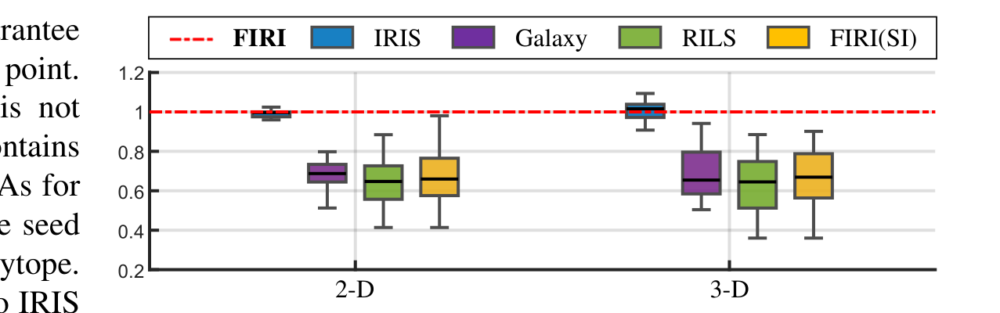

**图 6**：不同方法生成的无障碍凸多面体大小比较。数值为 1 的虚线表示 FIRI 的结果，本文以此作为基准。

效率结果见表 IV。为便于区分，在点种子情况下用虚线区分迭代方法和非迭代方法。由于输入障碍物数量是影响计算效率的主要因素，表 II 列出了不同密度环境中的障碍物数量，便于理解各方法的计算效率。如图 6 所示，IRIS 和 FIRI 都通过持续膨胀 MVIE 迭代计算更大的凸多面体，因此大小相近。但 IRIS 采用基于 SDP 的 MVIE 求解方法，计算时间较长 [1]；如第 VII-C 节所示，FIRI 显著提高了 MVIE 计算效率，因此表 IV 中明显快于 IRIS。此外，FIRI 的计算时间不超过不计算 MVIE 的非迭代 RILS 的 3 倍。其他三个非迭代方法生成的多面体更小，但表 IV 中比 IRIS 更快。Galaxy 由于其中使用的 Quickhull [33] 在相应场景下性能下降，效率甚至低于 FIRI，这在三维情况下尤其明显。FIRI(SI) 与 RILS 类似，直接更新

---

## 原文第 15 页核心内容与翻译

15
稀疏
中等
密集

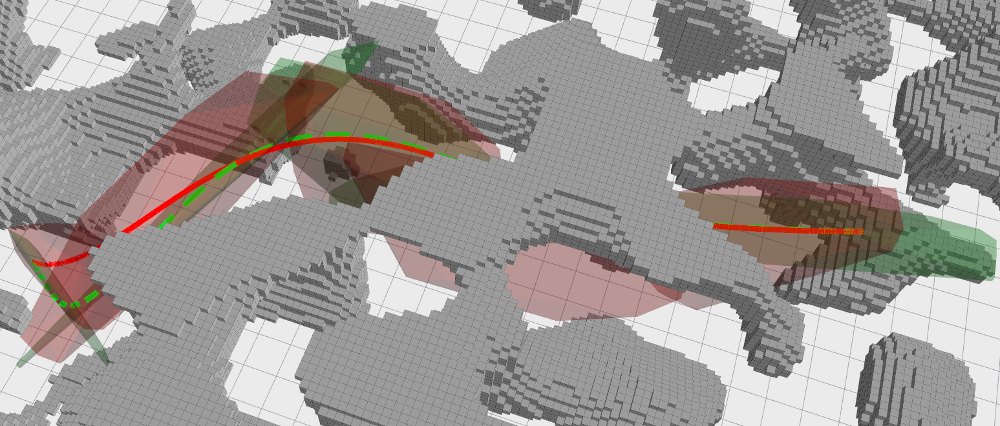

**图 7**：不同环境密度下，FIRI 和 IRIS 随障碍物顶点数变化的计算时间基准。上部为二维情况，下部为三维情况。FIRI 的计算效率比 IRIS 高出多个数量级。

凸包，并能生成与 RILS 大小相近但计算效率更高的多面体。此外，得益于 RsI 带来的可管理性，如果目标是在不追求最大体积的情况下尽快得到包含种子的无障碍凸多面体，FIRI(SI) 是更合适的选择。
除上述点表示外，凸多面体也是常用的环境表示方式。RILS 等方法虽可将多面体障碍物离散为点后处理，但对大尺度简单凸多面体进行离散会增加计算负担，栅格化等方法还可能降低环境建模精度。因此，直接处理多面体障碍物的能力具有实际价值。在表 I 的方法中，只有
FIRI 和 IRIS 支持以凸包形式输入障碍物，因此进一步比较这两种算法。每次测试在封闭空间中生成一定数量的随机分布障碍物，并取空间中心作为种子，封闭空间边界同时作为限制边界。将单个障碍物的顶点数 Nv 从 3 变化到 10^3，并改变障碍物数量；由于多面体障碍物的相对体积大于点障碍物，障碍物数量取 10 到 10^3，结果中分别记为稀疏、中等和密集。对于每种障碍物数量和顶点数，进行 500 次测试。随着障碍物数量增加，用于构造凸包的半空间数量趋于稳定，因此 MVIE 专用解法带来的效率优势逐渐减小。但得益于高效的 SDMN 半空间计算方法，即使在障碍物密集的场景中，FIRI 仍明显优于 IRIS，计算量降低超过 95%。
3）质量案例：为说明凸包质量及其对轨迹规划的影响，在图 8(a) 所示随机环境中，基于不同凸包生成方法开展轨迹规划实验。使用 RRT* [61] 生成起点与终点之间的无碰撞路径。该路径
FIRI
RILS
起点
终点
(a) 随机森林环境中由 FIRI 和 RILS 生成的走廊，以及分别约束在走廊内的时间最优轨迹。
FIRI
RILS
(b) 轨迹的速度曲线，颜色表示速度大小。FIRI 生成的凸多面体更大，为轨迹优化提供了更大的空间自由度。
(c) 分别约束在 FIRI 和 RILS 走廊中的轨迹速度、加速度大小。FIRI 提供的空间更宽裕，因此能够实现更激进的轨迹性能。

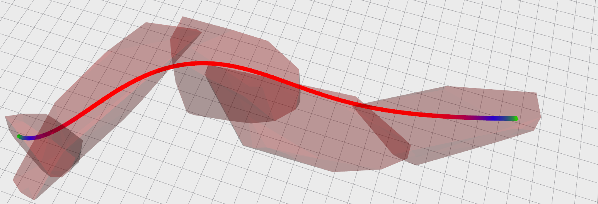

**图 8**：
复杂环境中基于 FIRI 和 RILS 建立的走廊，以及约束在生成走廊内的最优轨迹比较。

该路径可以看作一组首尾相接的线段，并据此继续生成凸包。如表 III 所示，只有 FIRI 和 RILS 对线段种子具有可管理性。因此，本文选用这两种方法建立走廊进行比较，分别代表以最大体积为目标的迭代方法和非迭代方法。安全飞行走廊的生成过程如下：依次遍历路径中的每条线段；如果当前线段已经包含在此前生成的多面体中，则处理下一条线段；否则，以当前线段为种子生成新的凸多面体。由于可管理性要求，相邻多面体之间必须存在交集，从而形成连续走廊。在此走廊内，采用 GPOPS-II [62] 求解受走廊约束的最优轨迹。该配点方法使用 Gauss 伪谱法，将轨迹优化转化为带约束的非线性规划，再由成熟的非线性规划求解器 SNOPT [63] 求解。在 GPOPS-II 中，每一段轨迹限制在一个多面体内，速度和加速度可行性约束分别设为 3 m/s 和 6 m/s²，时间权重设为 20。如图 8(b) 所示，RILS 在黑色虚线圆标出的区域生成了较窄的多面体，限制了轨迹优化的机动空间。因此，约束在该走廊中的轨迹

---

## 原文第 16 页核心内容与翻译

16
三维
约束数量
二维
SDMN（本文提出）
SDMN（本文提出）

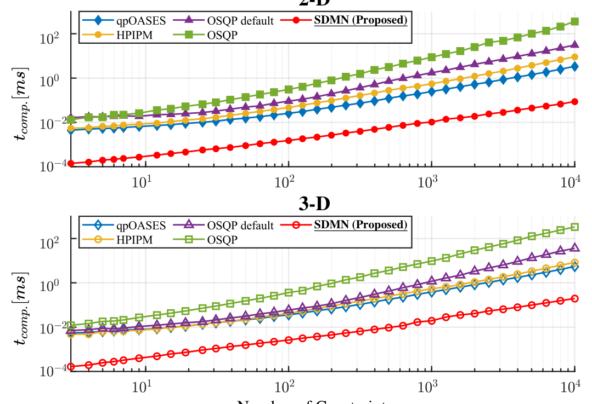

**图 9**：不同约束数量下，各方法求解严格凸小维度二次规划的计算时间 tcomp。本文提出的 SDMN 在计算效率上比其他方法高出多个数量级。

表 V
不同方法求解小维度最小范数问题的精度 ψN 比较
场景
精度 ψN
qpOASES [14] OSQP [15]
默认参数
OSQP [15] HPIPM [16]
SDMN（本文提出）
二维
1.28e-15
5.05e-2
6.61e-11
7.79e-06
2.78e-17
三维
2.91e-15
2.43e-2
2.95e-11
4.41e-06
3.55e-17
RILS 生成的走廊在标记区域表现出较为保守的特征。相比之下，FIRI 以最大化凸包为目标，能够生成更大的走廊，为轨迹规划提供更大的空间灵活性。
 B. 严格凸小维度多约束最小范数问题的求解对比
对于最小范数问题（16），本文将 SDMN 与多种通用二次规划求解器进行比较，包括参数化有效集算法 qpOASES [14]、基于算子分裂的一阶近似算法 OSQP [15]，以及基于内点法的二次规划近似算法 HPIPM [16]。本文使用这些求解器的开源代码分别求解式（16），其中 qpOASES 和 HPIPM 使用默认参数。

实验发现，OSQP 的默认参数在约束规模较大时精度不足。因此，将其相对收敛容差设为 10−12、最大迭代次数设为 106，并将该版本记为 OSQP；使用默认参数的版本记为 OSQP default。本文提出的 SDMN 不需要额外设置参数。

本文比较各方法的求解时间及平均精度，平均精度定义为
ψN = Lψ(Ey∗−f),
(61)
2https://github.com/coin-or/qpOASES
3https://github.com/osqp/osqp
4https://github.com/giaf/hpipm
其中 y∗是各方法得到的对应解，E 和 f 是定义最小范数问题（16）约束的参数，Lψ(·) 表示取输入向量中绝对值最大的元素。精度 ψN 表示所得解接近输入问题最活跃约束的程度。结果见图 9 和表 V。SDMN 的计算效率显著高于其他方法，达到多个数量级的提升；同时，SDMN 能够给出解析解，在不增加参数设置的情况下保持很高精度。
 C）MVIE 求解比较
对于 MVIE（11），本文提出两种算法：
SOCP 重构算法，以及针对二维情况的随机算法。随机算法能够得到解析解，简称 RAN。为与前述方法区分，
将采用仿射尺度法求解 SOCP 重构形式的算法记为 CAS，并与三种方法比较：1）
IRIS [1] 中基于 MVIE 半正定规划形式的优化方法；2）Mosek [23] 示例 5 中计算多面体 Löwner–John 内接椭球近似的方法；3）使用 Mosek 求解 MVIE 的 SOCP 形式（35）。Mosek 示例将 MVIE 表述为混合锥二次和半正定问题，分别记为 Mosek SDP 和 Mosek SOCP。IRIS 和 Mosek 均使用默认参数。
对于由不同数量半空间构成的闭合凸多面体，比较各方法计算最大椭球的时间和平均精度。精度定义为
ψE = Lψ

[[APAE
∗DE
∗]21]
1
2 + APbE
∗−bP

,
(62)
其中 A∗E、D∗E 和 b∗E 是各方法求得的最大内接椭球参数，AP 和 bP 是式（10）中定义的输入多面体半空间参数，Lψ(·) 是式（61）定义的函数。精度 ψE 表示各方法得到的椭球距离最活跃半空间约束的程度，该约束采用式（27b）所示的二阶锥形式构造。结果见图 10 和表 VI。

比较 Mosek SDP 与 Mosek SOCP 可知，将通常使用的 SDP 形式转换为第 V-A 节提出的 SOCP 形式，可以在不牺牲精度的情况下显著提高计算效率。此外，针对本文所处理的低维多约束问题，仿射尺度法不需要像 Mosek 使用的原始—对偶内点法那样在每次迭代中求解大规模线性方程组。因此，
5https://docs.mosek.com/latest/cxxfusion/examples-list.html#
doc-example-file-lownerjohn-ellipsoid-cc

---

## 原文第 17 页核心内容与翻译

17
约束数量
CAS（本文提出）
三维
二维
CAS（本文提出）
RAN（本文提出）

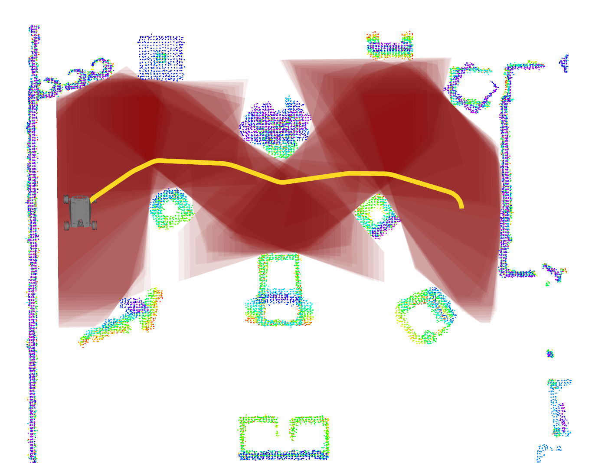

**图 10**：不同约束数量下，各方法求解 MVIE 的计算时间 tcomp。本文提出的 CAS 在计算效率上比其他方法高出多个数量级；对于二维情况，本文提出的解析方法 RAN 进一步提高了效率。

表 VI
不同方法求解 MVIE 的精度 ψE 比较
场景
精度 ψE
IRIS [1]
Mosek [23] SDP
Mosek [23] SOCP
CAS（本文提出）
RAN（本文提出）
二维
8.56e-8
6.47e-9
4.87e-12
1.59e-8
4.41e-16
三维
1.54e-8
1.56e-8
4.05e-12
2.04e-8
/
结果表明，CAS 能够在保持相近精度的同时缩短 MVIE 的求解时间。此外，对于二维情况，本文提出的线性复杂度算法 RAN 进一步将计算效率提高了多个数量级，并能够给出解析结果。
VIII. 实际应用
为验证 FIRI 在实际应用中的性能，
本文设计了两个应用：
二维环境中带非完整约束车辆的全局轨迹规划，
以及三维环境中四旋翼的局部规划。
A）二维全身规划的密集走廊
狭窄环境中的大型车辆进行轨迹规划时，
需要保证车体全部位于
安全区域内，因此对方法的可管理性提出了要求。
本文采用差速驱动的 AgileX SCOUT MINI 作为
实验平台。平台搭载 Intel
NUC，处理器为 Intel Core i7-1165G7，并配备
与 IMU 集成的 LiDAR 传感器进行感知。
采用 FAST-LIO2 [64] 完成环境预建图
和规划轨迹执行过程中的实时定位，
因此障碍物以点表示。
6https://global.agilex.ai/products/scout-mini
7https://www.intel.com/content/dam/support/us/en/documents/intel-nuc/
NUC11PH TechProdSpec.pdf
8https://ouster.com/products/hardware/os1-lidar-sensor
(a)
(b)
(c)
(d)
(e)
(f)

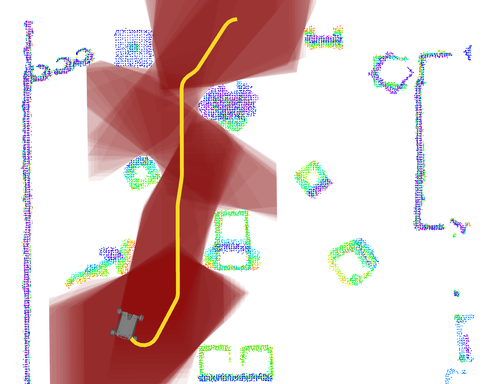

**图 11**：(a)–(e)：机器人在杂乱环境中从 G1 依次经过 G2–G5 并最终返回 G1 时，FIRI 生成的走廊示意。(f)：机器人导航结果的现场图。

在前期工作 [11] 的基础上，采用混合 A* 作为前端，
先获得一条初始可行轨迹，再沿轨迹进行密集采样。
以每个采样状态对应的机器人形状作为
种子，通过 FIRI 生成凸多面体，
形成图 12 所示的密集安全走廊。
在后端采用多项式表示轨迹，
并约束车体形状
完全位于轨迹约束状态对应的
安全走廊凸多面体内。
考虑定位误差和控制误差，
为保证安全，在规划时适当膨胀机器人形状，
以生成更安全的走廊和轨迹。
1）杂乱环境：结果见图 11。
要求机器人穿越充满不规则障碍物的杂乱环境，
从 G1 出发，
依次到达 G2–G5，最后返回 G1。
由于本文重点是无障碍凸多面体的生成，
只展示用于引导多面体生成的前端轨迹及
生成的凸多面体，
详细导航过程见
配套视频。本实验中，
如图 11 所示，共生成 5 条密集走廊，
每条走廊平均包含 91.8 个凸多面体。每个
凸多面体平均输入障碍物点数为
715.3 个，平均处理时间为 0.131 ms；
生成一条走廊的平均时间为 12.02 ms。
2）狭窄迷宫：要求机器人穿越狭窄迷宫。图 12(a) 表明，
FIRI 根据黄色前端轨迹
生成了质量较高的凸多面体，为后端轨迹优化提供了足够的空间自由度。

---

## 原文第 18 页核心内容与翻译

18
场景 1
场景 2
根据前端轨迹生成走廊
约束在走廊内的优化轨迹
(a) 左：根据前端得到的黄色粗略轨迹生成密集走廊的示意。右：在后端将轨迹约束在生成的走廊内，优化得到平滑且安全的全身轨迹。
Galaxy
FIRI
IRIS
RILS
场景 1
场景 2
完全包含
完全包含
(b) 左：展示 (a) 中两个狭窄场景下不同方法生成的凸多面体。结果表明，只有 FIRI 能够生成完全包含机器人的多面体，满足全身规划要求。右：机器人导航结果的现场画面。
图 12：采用 FIRI 抽象可行区域的差速驱动机器人穿越迷宫的实际应用。
为后端轨迹优化提供足够的空间自由度。此外，如图 12(b) 所示，为直观展示实验的可管理性，选取迷宫中两个特别狭窄的场景，展示第 VII-A 节比较的多种方法 [1]，[2]，[9] 生成的凸多面体结果。可以看到，只有 FIRI 能够完全包住机器人。沿整条轨迹从每个种子生成对应凸多面体的详细过程见配套视频。本实验生成了由 550 个凸多面体组成的密集走廊。每个凸多面体平均输入障碍物点 1307.1 个，平均处理时间 0.249 ms，生成整条走廊总耗时 136.74 ms。
B）三维局部重规划的稀疏走廊
实验平台为定制四旋翼，搭载
NVIDIA Orin NX 作为机载处理器，并使用 Livox
MID-360 LiDAR 进行感知。由于四旋翼
尺寸较小，与许多已有工作一样，将其建模为质点，
参考文献 [2]，[8]。采用 FAST-LIO2 [64] 进行在线
状态估计，并利用占据栅格地图过滤传感器
噪声；该地图便于加入安全裕度。对于轨迹
规划，路径和走廊的生成方式与
第 VII-A3 节相同。在此基础上，结合前期
工作 [3]，采用分段多项式表示
9https://www.nvidia.com/en-us/autonomous-machines/
10https://www.livoxtech.com/mid-360
轨迹。每一段轨迹均约束在对应的多面体内，以保证安全。如图 13 所示，实验在密集森林中进行，要求四旋翼依次飞过多个航点。由于环境未知，四旋翼根据实时感知结果以 20 Hz 的频率进行高频重规划。飞行过程中的最大速度达到 4.5 m/s。每次重规划涉及 3–7 个凸多面体，每个多面体的平均生成时间为 2.76 ms，FIRI 的平均输入障碍物点数为 8219.6。更多信息可参见配套视频。

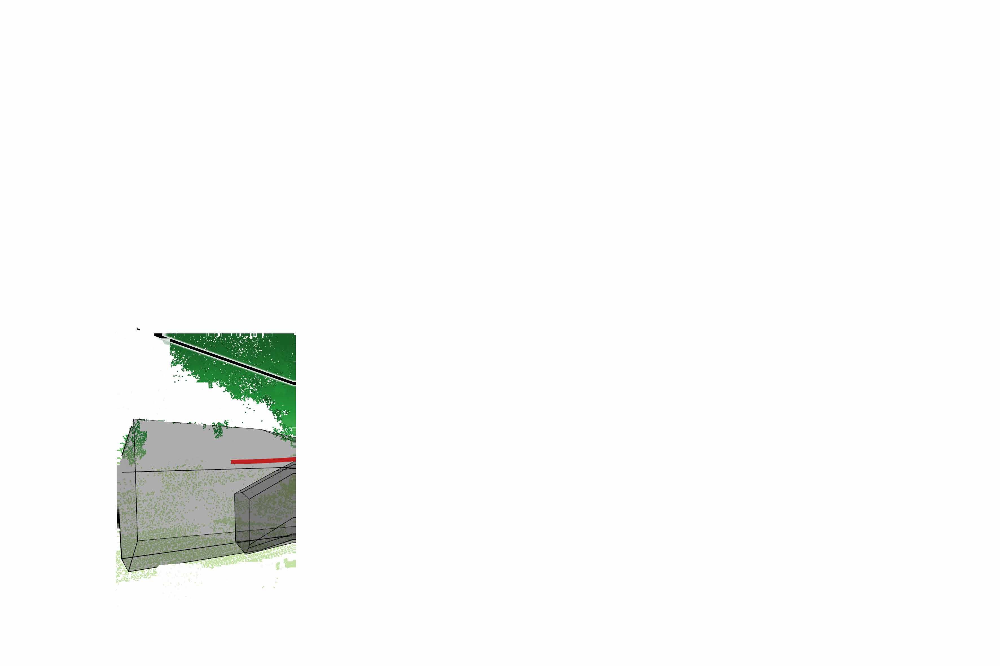

**图 13**：FIRI 应用于四旋翼杂乱森林环境局部轨迹规划的示意。上部为四旋翼穿越森林的现场图；下部为红框所示时刻的四旋翼重新规划结果。黑色透明多面体由 FIRI 生成。

---

## 原文第 19 页核心内容与翻译

19
IX. 讨论与结论
FIRI 的目标是生成尽可能大的凸多面体。但在轨迹规划等实际应用中，不能保证多面体的膨胀方向始终有利于轨迹优化。例如机器人高速运动时，若膨胀方向垂直于速度方向，生成的多面体可能不利于轨迹优化。后续研究将关注生成更适合具体应用的凸多面体。此外，生成多面体的面数会显著影响运动规划的求解速度。如第 III-B1 节所述，当前采用常用的贪心方法减少面数；今后将在兼顾多面体体积的同时，把面数明确纳入区域质量评价。
总之，本文提出了新的无障碍凸多面体生成算法 FIRI，同时实现了较高的质量、效率和可管理性。为提高效率，针对 FIRI 涉及的两个优化问题设计了专用方法。针对二维 MVIE，首次提出线性复杂度方法。通过与多种凸多面体生成算法进行大量基准比较，验证了 FIRI 的性能优势；与通用求解器的比较表明，专用方法可带来多个数量级的加速。两个典型应用进一步展示了该方法的实用性。
CGAL [65] 尚未提供二维 MVIE 的专用求解器。今后将继续研究二维 MVIE，并进一步实现采用有理判定的版本。
X. 致谢
二维 MVIE 的线性复杂度算法最初由 Zhepei Wang 设计，后由 Qianhao Wang 完成。作者感谢 Yuan Zhou 和 Mengze Tian 在二维应用硬件方面提供的帮助。

附录
第 VI-B1 节给出了二维 MVIE 所用值函数（44）的单调性和局部性证明。
A）单调性证明
证明。G 未闭合：对于一个集合的极锥，向集合中增加元素时，极锥角度只会保持不变或减小。因此，函数 w̄u(G) 的第一项单调增加。此外，第二项显然也单调增加。由于这两项按照字典序组合，函数 w̄u(G) 满足单调性。
G 已闭合：由于函数 w̄c(G) 的第二项为常数，只需证明第一项具有单调性。设 h∉G。G∪{h} 的 MVIE 必然满足 G 的原有约束，因此其面积小于或等于 G 的 MVIE 面积。第 VI-B1 节指出，w̄c 的第一项始终大于 0，而 w̄u 的第一项始终小于或等于 0，因此有 w̄c>w̄u。
B）局部性证明
证明。设有限集合 G、F 以及约束 h 满足 G⊆F、h∉F，并且 −∞<w(G)=w(F)。这两个集合要么同时闭合，要么同时未闭合。
G 未闭合：根据上述条件，由 G 和 F 中元素单位法向量形成的两个新集合的极锥相同。因此，加入 h 后，无论极锥发生变化，还是 h 对应的法向量落入该极锥，都会使集合闭合，而且对两者得到相同的结果。
G 已闭合：由 MVIE 的唯一性，若 G⊆F 且 w(G)=w(F)，则两者的 MVIE 是同一个椭圆。因此，如果 h 违反 F，也必然违反 G。
参考文献
[1] R. Deits and R. Tedrake, “Computing large convex regions of obstacle-
free space through semidefinite programming,” in Algorithmic Founda-
tions of Robotics XI.
Springer, 2015, pp. 109–124.
[2] S. Liu, M. Watterson, K. Mohta, K. Sun, S. Bhattacharya, C. J. Taylor,
and V. Kumar, “Planning dynamically feasible trajectories for quadrotors
using safe flight corridors in 3-D complex environments,” IEEE Robotics
and Automation Letters, pp. 1688–1695, 2017.
[3] Z. Wang, X. Zhou, C. Xu, and F. Gao, “Geometrically constrained tra-
jectory optimization for multicopters,” IEEE Transactions on Robotics,
vol. 38, no. 5, pp. 3259–3278, 2022.
[4] J. Guo, Z. Xun, S. Geng, Y. Lin, C. Xu, and F. Gao, “Dynamic free-
space roadmap for safe quadrotor motion planning,” in 2022 IEEE/RSJ
International Conference on Intelligent Robots and Systems (IROS).
IEEE, 2022, pp. 10 523–10 528.
[5] P. Werner, A. Amice, T. Marcucci, D. Rus, and R. Tedrake, “Approx-
imating robot configuration spaces with few convex sets using clique
covers of visibility graphs,” in 2024 IEEE International Conference on
Robotics and Automation (ICRA).
IEEE, 2024, pp. 10 359–10 365.
[6] R. Deits and R. Tedrake, “Efficient mixed-integer planning for UAVs in
cluttered environments,” in IEEE International Conference on Robotics
and Automation, Seattle, USA, 2015, pp. 42–49.
[7] T. Marcucci, M. Petersen, D. von Wrangel, and R. Tedrake, “Motion
planning around obstacles with convex optimization,” Science robotics,
vol. 8, no. 84, p. eadf7843, 2023.
[8] F. Gao, L. Wang, B. Zhou, X. Zhou, J. Pan, and S. Shen, “Teach-Repeat-
Replan: A complete and robust system for aggressive flight in complex
environments,” IEEE Transactions on Robotics, vol. 36, no. 5, pp. 1526–
1545, 2020.
[9] X. Zhong, Y. Wu, D. Wang, Q. Wang, C. Xu, and F. Gao, “Gener-
ating large convex polytopes directly on point clouds,” arXiv preprint
arXiv:2010.08744, 2020.
[10] J. Ji, N. Pan, C. Xu, and F. Gao, “Elastic tracker: A spatio-temporal
trajectory planner for flexible aerial tracking,” in 2022 International
Conference on Robotics and Automation (ICRA).
IEEE, 2022, pp.
47–53.
[11] Z. Han, Y. Wu, T. Li, L. Zhang, L. Pei, L. Xu, C. Li, C. Ma, C. Xu,
S. Shen et al., “An efficient spatial-temporal trajectory planner for
autonomous vehicles in unstructured environments,” IEEE Transactions
on Intelligent Transportation Systems, 2023.
[12] S. Savin, “An algorithm for generating convex obstacle-free regions
based on stereographic projection,” in 2017 International Siberian
Conference on Control and Communications (SIBCON).
IEEE, 2017,
pp. 1–6.
[13] R. Seidel, “Small-dimensional linear programming and convex hulls
made easy,” Discrete & Computational Geometry, vol. 6, no. 3, pp.
423–434, 1991.

---

## 原文第 20 页核心内容与翻译

20
[14] H. J. Ferreau, C. Kirches, A. Potschka, H. G. Bock, and M. Diehl,
“qpoases: A parametric active-set algorithm for quadratic programming,”
Mathematical Programming Computation, vol. 6, pp. 327–363, 2014.
[15] B. Stellato, G. Banjac, P. Goulart, A. Bemporad, and S. Boyd, “Osqp:
An operator splitting solver for quadratic programs,” Mathematical
Programming Computation, pp. 1–36, 2020.
[16] G. Frison and M. Diehl, “Hpipm: a high-performance quadratic program-
ming framework for model predictive control,” IFAC-PapersOnLine,
vol. 53, no. 2, pp. 6563–6569, 2020.
[17] L. G. Khachiyan and M. J. Todd, “On the complexity of approximating
the maximal inscribed ellipsoid for a polytope,” Mathematical Program-
ming, vol. 61, no. 1, pp. 137–159, 1993.
[18] L. Lov´asz, An algorithmic theory of numbers, graphs and convexity.
SIAM, 1986.
[19] H. W. Lenstra Jr, “Integer programming with a fixed number of vari-
ables,” Mathematics of operations research, vol. 8, no. 4, pp. 538–548,
1983.
[20] A. Ben-Tal and A. Nemirovski, Lectures on Modern Convex Optimiza-
tion: Analysis, Algorithms, and Engineering Applications. SIAM, 2001.
[21] Y. Zhang and L. Gao, “On numerical solution of the maximum volume
ellipsoid problem,” SIAM Journal on Optimization, vol. 14, no. 1, pp.
53–76, 2003.
[22] Y. Nesterov and A. Nemirovskii, Interior-Point Polynomial Algorithms
in Convex Programming.
SIAM, 1994.
[23] MOSEK Aps, “MOSEK Optimizer API for C,” 2020. [Online].
Available: https://www.mosek.com
[24] E. Welzl, “Smallest enclosing disks (balls and ellipsoids),” in New
Results and New Trends in Computer Science: Graz, Austria, June 20–
21, 1991 Proceedings.
Springer, 2005, pp. 359–370.
[25] M. Sharir and E. Welzl, “A combinatorial bound for linear programming
and related problems,” in STACS 92: 9th Annual Symposium on Theo-
retical Aspects of Computer Science Cachan, France, February 13–15,
1992 Proceedings 9.
Springer, 1992, pp. 567–579.
[26] J. Matouˇsek, M. Sharir, and E. Welzl, “A subexponential bound for
linear programming,” in Proceedings of the eighth annual symposium
on Computational geometry, 1992, pp. 1–8.
[27] M. Montanari, N. Petrinic, and E. Barbieri, “Improving the gjk algorithm
for faster and more reliable distance queries between convex objects,”
ACM Transactions on Graphics (TOG), vol. 36, no. 3, pp. 1–17, 2017.
[28] Y. Wu, I. Spasojevic, P. Chaudhari, and V. Kumar, “Optimal convex
cover as collision-free space approximation for trajectory generation,”
arXiv preprint arXiv:2406.09631, 2024.
[29] H. Dai, A. Amice, P. Werner, A. Zhang, and R. Tedrake, “Certified
polyhedral decompositions of collision-free configuration space,” The
International Journal of Robotics Research, p. 02783649231201437,
2023.
[30] M. Petersen and R. Tedrake, “Growing convex collision-free regions
in configuration space using nonlinear programming,” arXiv preprint
arXiv:2303.14737, 2023.
[31] P. Werner, T. Cohn, R. H. Jiang, T. Seyde, M. Simchowitz, R. Tedrake,
and D. Rus, “Faster algorithms for growing collision-free convex poly-
topes in robot configuration space,” arXiv preprint arXiv:2410.12649,
2024.
[32] S. Katz, A. Tal, and R. Basri, “Direct visibility of point sets,” in ACM
SIGGRAPH 2007 papers, 2007, pp. 24–es.
[33] C. B. Barber, D. P. Dobkin, and H. Huhdanpaa, “The quickhull algo-
rithm for convex hulls,” ACM Transactions on Mathematical Software
(TOMS), vol. 22, no. 4, pp. 469–483, 1996.
[34] F. John, “Extremum problems with inequalities as subsidiary condi-
tions,” Traces and emergence of nonlinear programming, pp. 197–215,
2014.
[35] S.
P.
Tarasov,
“The
method
of
inscribed
ellipsoids,”
in
Soviet
Mathematics-Doklady, vol. 37, no. 1, 1988, pp. 226–230.
[36] L. G. Khachiyan and M. J. Todd, “On the complexity of approximating
the maximal inscribed ellipsoid for a polytope,” Cornell University
Operations Research and Industrial Engineering, Tech. Rep., 1990.
[37] K. M. Anstreicher, “Improved complexity for maximum volume in-
scribed ellipsoids,” SIAM Journal on Optimization, vol. 13, no. 2, pp.
309–320, 2002.
[38] A. Nemirovski, “On self-concordant convex–concave functions,” Opti-
mization Methods and Software, vol. 11, no. 1-4, pp. 303–384, 1999.
[39] C.-H. Lin, R. Wu, W.-K. Ma, C.-Y. Chi, and Y. Wang, “Maximum
volume inscribed ellipsoid: A new simplex-structured matrix factoriza-
tion framework via facet enumeration and convex optimization,” SIAM
Journal on Imaging Sciences, vol. 11, no. 2, pp. 1651–1679, 2018.
[40] A. Beck and M. Teboulle, “A fast iterative shrinkage-thresholding algo-
rithm for linear inverse problems,” SIAM journal on imaging sciences,
vol. 2, no. 1, pp. 183–202, 2009.
[41] C. D. Toth, J. O’Rourke, and J. E. Goodman, Handbook of Discrete and
Computational Geometry.
CRC Press, 2017.
[42] J.-S. Chang and C.-K. Yap, “A polynomial solution for the potato-peeling
problem,” Discrete & Computational Geometry, vol. 1, no. 2, pp. 155–
182, 1986.
[43] P. Song, B. Deng, Z. Wang, Z. Dong, W. Li, C.-W. Fu, and L. Liu, “Cofi-
fab: coarse-to-fine fabrication of large 3d objects,” ACM Transactions
on Graphics (TOG), vol. 35, no. 4, pp. 1–11, 2016.
[44] M. E. Dyer and A. M. Frieze, “On the complexity of computing the
volume of a polyhedron,” SIAM Journal on Computing, vol. 17, no. 5,
pp. 967–974, 1988.
[45] M. Agarwal, J. Clifford, and M. Lachance, “Duality and inscribed
ellipses,” Computational Methods and Function Theory, vol. 15, pp.
635–644, 2015.
[46] A. S. Householder, “Unitary triangularization of a nonsymmetric ma-
trix,” Journal of the ACM (JACM), vol. 5, no. 4, pp. 339–342, 1958.
[47] G. H. Golub and F. V. Loan, Matrix Computations. The Johns Hopkins
University Press, 2013.
[48] J. Lagarias and R. Vanderbei, “Ii dikin’s convergence result for the affine
scaling algorithm,” Contemp. Math, vol. 114, p. 109, 1990.
[49] S. Boyd and L. Vandenberghe, Convex Optimization.
Cambridge
University Press, 2004.
[50] R. A. Horn and C. R. Johnson, Matrix Analysis.
Cambridge University
Press, 2012.
[51] T. Tsuchiya and R. D. C. Monteiro, “Superlinear convergence of the
affine scaling algorithm,” Mathematical Programming, vol. 75, no. 1,
pp. 77–110, 1996.
[52] D. Minda and S. Phelps, “Triangles, ellipses, and cubic polynomials,”
The American Mathematical Monthly, vol. 115, no. 8, pp. 679–689,
2008.
[53] A. Horwitz, “Ellipses of maximal area and of minimal eccentricity
inscribed in a convex quadrilateral,” Australian Journal of Mathematical
Analysis and Applications, vol. 2, no. 1, p. 12, 2005.
[54] A. C. Jones, An introduction to algebraical geometry. Clarendon Press,
1912.
[55] J. Richter-Gebert and J. Richter-Gebert, “Conics and their duals,”
Perspectives on projective geometry: A guided tour through real and
complex geometry, pp. 145–166, 2011.
[56] F. Klein, C. A. T. Noble, and E. R. T. Hedrick, Elementary Mathematics
from an Advanced Standpoint-Geometry: Transl. from the Third German
Ed. by ER Hedrick and CA Noble.
Dover, 1939.
[57] M. J. D. Hayes, Z. A. Copeland, P. J. Zsombor-Murray, and A. Gfrerrer,
“Largest area ellipse inscribing an arbitrary convex quadrangle,” in
Advances in Mechanism and Machine Science: Proceedings of the 15th
IFToMM World Congress on Mechanism and Machine Science 15.
Springer, 2019, pp. 239–248.
[58] J. Lin, C. Yuan, Y. Cai, H. Li, Y. Ren, Y. Zou, X. Hong, and F. Zhang,
“Immesh: An immediate lidar localization and meshing framework,”
IEEE Transactions on Robotics, 2023.
[59] Q. Wang, Z. Wang, L. Pei, C. Xu, and F. Gao, “A linear and exact
algorithm for whole-body collision evaluation via scale optimization,”
in 2023 IEEE International Conference on Robotics and Automation
(ICRA).
IEEE, 2023, pp. 3621–3627.
[60] J. C. Hart, “Perlin noise pixel shaders,” in Proceedings of the ACM
SIGGRAPH/EUROGRAPHICS workshop on Graphics hardware, 2001,
pp. 87–94.
[61] S. Karaman and E. Frazzoli, “Sampling-based algorithms for optimal
motion planning,” The international journal of robotics research, vol. 30,
no. 7, pp. 846–894, 2011.
[62] M. A. Patterson and A. V. Rao, “Gpops-ii: A matlab software for solving
multiple-phase optimal control problems using hp-adaptive gaussian
quadrature collocation methods and sparse nonlinear programming,”
ACM Transactions on Mathematical Software (TOMS), vol. 41, no. 1,
pp. 1–37, 2014.
[63] P. E. Gill, W. Murray, and M. A. Saunders, “Snopt: An sqp algorithm
for large-scale constrained optimization,” SIAM review, vol. 47, no. 1,
pp. 99–131, 2005.
[64] W. Xu, Y. Cai, D. He, J. Lin, and F. Zhang, “Fast-lio2: Fast direct lidar-
inertial odometry,” IEEE Transactions on Robotics, vol. 38, no. 4, pp.
2053–2073, 2022.
[65] A. Fabri and S. Pion, “Cgal: The computational geometry algorithms
library,” in Proceedings of the 17th ACM SIGSPATIAL international
conference on advances in geographic information systems, 2009, pp.
538–539.

---
