# RE-Formation大规模分布式无人机编队（17_RE-Formation_Large-Scale_Distributed_Aerial_Swarms）：完整忠实学术翻译

> **原文标题**：17_RE-Formation_Large-Scale_Distributed_Aerial_Swarms  
> **作者**：Yuan Zhou、Lun Quan、Chao Xu、Guangtong Xu、Fei Gao  
> **发表信息**：IEEE Transactions on Automation Science and Engineering, Vol. 22（2025），DOI 10.1109/TASE.2025.3603614  
> **原文 PDF**：[17_RE-Formation_Large-Scale_Distributed_Aerial_Swarms.pdf](../17_RE-Formation_Large-Scale_Distributed_Aerial_Swarms.pdf) ｜ **对应中文详解**：[17_RE-Formation大规模分布式无人机编队.md](../中文详解/17_RE-Formation大规模分布式无人机编队.md)  

---

## 原文第 1 页核心内容与翻译

RE-Formation：大规模分布式空中集群的抗故障高效编队规划
Yuan Zhou , Lun Quan , Chao Xu , Senior Member, IEEE, Guangtong Xu , and Fei Gao , Member, IEEE
摘要——由于在线计算资源有限，以及真实机器人不可避免地存在软硬件故障，大规模编队规划面临两个常见问题：计算难以承受和个体失效。本文基于稀疏图与最大团理论，提出具有抗故障能力且高效的编队规划方法 RE-Formation。为提高轨迹规划效率并保证编队灵活机动，本文用稀疏图描述连接关系，并提出具有闭式解的稀疏图构造方法。这类图保证全局刚性，使其与几何形状唯一对应，同时保留完全图的主要特征，称为 GRPF 稀疏图。为减少异常个体的影响，本文将异常个体剔除转化为离群点剔除问题，通过最大团求解，并周期性计算最大 k-core 对最大团进行近似，以满足大规模集群的实时计算要求。论文通过实际实验和 100 架无人机仿真验证方法性能，基准比较和消融实验表明该方法有效。
由于真实机器人软硬件故障不可避免，且在线计算资源有限，大规模编队规划面临计算难以承受和个体失效两个问题。本文基于稀疏图和最大团理论，提出抗故障且高效的编队规划方法 RE-Formation。为提高轨迹规划效率并保持编队机动灵活性，本文用稀疏图表示连接关系，并给出具有闭式解的构图方法。该稀疏图具有全局刚性，能够唯一对应几何形状，同时保留完全图的主要特征，称为 GRPF 稀疏图。为抑制异常个体的影响，本文将异常个体剔除转化为离群点剔除问题，通过计算最大团求解，并周期性计算最大 k-core 近似最大团，以满足大规模集群的实时计算需求。本文通过实际实验和 100 架无人机仿真验证方法性能，基准比较和消融实验表明该方法有效。
给实践者的说明——本文研究的是大规模空中集群编队规划中的两个实际问题：机载计算资源有限，以及个体可能发生软硬件故障。作者用具有全局刚性的稀疏图减少计算量，同时保留编队机动能力；发现异常个体后将其暂时排除，避免错误状态影响其他成员，从而提高编队规划的可靠性。

索引词——大规模编队，抗故障集群，高效规划，稀疏图，离群点剔除。
I. 引言
编队规划是集群机器人必须具备的基本能力。现实环境中的机器人并不完美，通常受到计算资源限制，并且不可避免地存在硬件和软件故障。随着编队规模扩大，成员之间的协同关系会带来更多约束，有限的机载计算资源因此面临更大压力。此外，大规模集群容易出现个体故障，故障个体产生的异常状态信息可能沿协同网络传播，显著影响其余个体的编队协调。因此，建立合理的协作关系，是保证大规模编队性能的关键。

已有研究提出了多种协作关系。一类直观方法只利用邻近个体的信息。这样做简单有效，个体不必处理或依赖全体成员的信息，有利于扩展集群规模，而且单个成员失效通常不会明显影响整体协作[3]，[4]。但这类系统在受到扰动后，重新建立目标编队往往需要较长时间。

另一些研究用密度抽象表示整体编队状态，但难以充分描述完整编队，因此对扰动的响应速度有限[5]，[6]。相反，另一类方法使用其他所有个体的状态信息[7]，[8]。个体能够掌握集群整体状态，在复杂环境中实现协调导航，保持编队稳定，并及时从扰动中恢复。然而，在全连接协作网络下，少数故障个体可能对整个编队产生过大的影响；同时，随着规模扩大，约束数量增加，求解时间明显延长，需要大量计算资源。总的来说，现有编队系统难以同时满足复杂环境下的大规模运动规划和个体故障容忍要求。

自然界的鸟群提供了一个启发：单只鸟只需关注少数个体的运动，就能形成并保持大规模群体飞行[9]。即使部分个体偏离鸟群，也不会明显影响整体协作[10]。本文的目标是借助稀疏协作关系，建立一个类似鸟群、能够在复杂环境中运行的抗故障大规模编队导航系统。为兼顾避障、编队保持和灵活机动，本文采用分布式轨迹优化框架，并用图衡量编队之间的相似程度。

收稿日期：2025年2月19日；修回日期：2025年6月27日；录用日期：2025年8月13日。
论文发表于2025年8月28日，当前版本日期为2025年9月26日。本文经审稿人评议后，由副编辑B. Lacevic和编辑J. Yi推荐发表。
本研究得到国家自然科学基金项目（62322314和62203256）资助。（通信作者：Guangtong Xu、Fei Gao。）
作者、机构、邮箱、DOI、版权声明和许可信息按原文保留。

## 原文第 2 页核心内容与翻译

ZHOU 等：RE-Formation：抗故障高效编队规划
21213
本文算法的整体流程见图2。为减少大规模集群带来的过多约束，本文使用稀疏图替代计算量较大的完全图，使每个个体只需考虑部分其他个体的信息。根据机载计算资源的实际能力确定稀疏化比例后，本文将稀疏图构造转化为拉普拉斯矩阵的子矩阵选择问题[11]。为防止故障个体的异常状态信息影响大多数成员，本文剔除差异明显的边，并计算能够使期望编队图与当前编队图误差最小的最大团。随后，利用最大团中正常个体的状态进行轨迹优化，并将稀疏图作为编队约束，由此得到抗故障、高效率的大规模编队方法 RE-Formation。

消融实验表明，本文的异常状态剔除方法能够提高编队飞行的抗故障能力。实物实验和大量基准测试验证了所构造稀疏图在可微编队规划指标下的效率和性能优势。与先进的分布式编队规划方法[1]相比，当无人机数量超过80架时，规划效率约提高一个数量级；如图1所示，通过仿真实现了复杂环境下100架无人机的实时编队规划。

本文的主要贡献如下：

1）提出一种通过子矩阵选择构造 GRPF 稀疏图的编队规划方法。研究了与编队性能相关的子矩阵选择指标，并确定 Max-Trace 是适合本文问题的指标；进一步利用 Max-Trace 推导闭式解，实现 GRPF 稀疏图的实时构造。

2）分析表明，GRPF 稀疏图具有全局刚性，能够与编队形状唯一对应，同时保留完全图的主要结构特征，从而保证编队性能。复杂度分析和实验验证表明，GRPF 稀疏图能够显著提高编队规划效率。

3）将个体故障容忍问题转化为离群点剔除问题，并通过计算最大团求解。考虑到最大 k-core 具有线性复杂度[12]，进一步用最大 k-core 高效近似最大团。将异常状态信息剔除方法纳入编队轨迹规划后，实现抗故障编队。

## 相关工作

已有大量研究致力于集群和编队系统的发展[1]，[3]，[13]，[14]。本文首先回顾大规模编队生成方面的研究，并综述编队导航领域的相关工作；此外，还进一步考察引入个体故障后的抗故障增强方法。

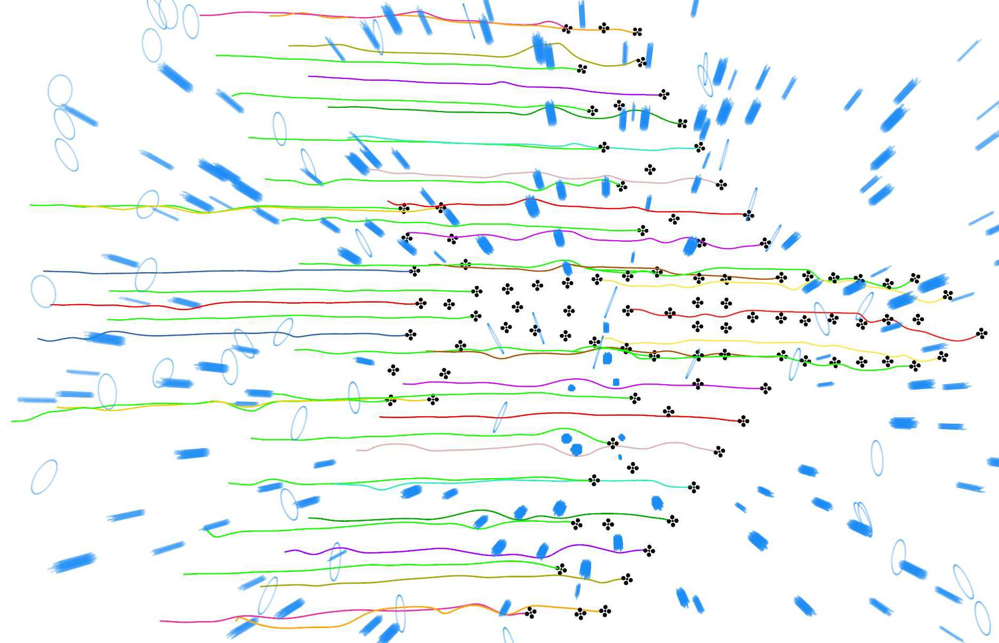

**图 1**：100架无人机在避障过程中保持喷气式飞机形状的抗故障高效编队规划仿真结果。

本文尤其关注包含个体故障的抗故障增强策略。
### A. 大规模编队生成
实现大规模集群协同一直是研究热点。一类方法把目标构型表示为一组按概率分布的网格，并利用马尔可夫链算法逐步收敛到指定编队[5]，[15]，[16]。Bandyopadhyay 等人[5]提出基于非齐次马尔可夫链的概率集群引导算法，通过实时反馈控制自主个体的密度分布；仿真规模最多达到100万个个体。但这类方法收敛到目标构型较慢，而且依赖无障碍环境，因此不适合复杂场景。人工势场（APF）也被用于定义目标几何形状[3]，[6]，[17]，通过吸引力和集群排斥力引导个体形成编队。Rubenstein 等人[3]使用结构简单的机器人，通过可编程的局部交互和局部感知实现二维形状的自组装。Sun 等人[6]利用均值漂移算法提出集群机器人形状组装策略，同样基于密度控制，使集群能够以较强适应性形成复杂形状。然而，这些方法收敛效率不高，缺少明确的避障处理，也难以满足复杂环境下的实时规划要求。
### B. 复杂环境中的编队导航
复杂环境中的编队导航已有许多有代表性的研究，包括虚拟结构[18]，[19]、基于一致性的控制律[20]，[21]以及领航者—跟随者方法[22]，[23]。这些方法通过设计合适的控制律来保持编队并实现避障，通常只需要较少的计算资源。为进一步减少通信开销、简化约束，研究者采用了基于稀疏图的通信架构[4]，[24]，[25]。此外，要保证编队控制收敛，还必须保持通信拓扑的刚性。

## 原文第 3 页核心内容与翻译

编队控制需要保持通信拓扑的刚性[26]，[27]。理论分析表明，收敛速度与图拉普拉斯矩阵的第二小特征值有内在联系[28]。不过，这类局部反馈方法在复杂障碍物环境中存在局限，容易陷入僵局。

相比之下，基于优化的预测框架能够在避障和编队保持之间取得平衡，但需要较多计算资源。集中式编队规划具有更好的整体机动能力[7]，[29]，但同时为所有个体优化轨迹，在大规模实时应用中会产生难以承受的计算量。把编队作为一个整体，在地图中搜索可通行区域，可以降低计算量；但这类方法要么依赖预先处理的地图[30]，难以实时规划，要么简单地用飞行走廊描述可通行区域[14]，[31]，在复杂环境中的适应性不足。

另一类方法采用分布式轨迹优化框架[1]，[8]。然而，完全图会引入过多约束，导致计算代价过高，难以扩展。也有研究使用强化学习在障碍环境中保持编队[32]，[33]，[34]。Xie等人[33]实现了三架无人机编队对静态和动态障碍物的规避；与优化方法相比，这类方法具有更强的编队保持能力，但仍难以在复杂环境中实现大规模协同。上述方法也很少讨论故障个体产生的异常状态对编队的影响。

为在复杂环境中部署大规模编队规划系统，本文采用分布式轨迹规划框架，并通过子矩阵选择构造稀疏图，使其保留原完全图的谱特征[35]，[36]。

### C. 个体故障容忍与离群点剔除

已有大量研究关注集群的抗故障能力，尤其是机器人退出情况下的集群恢复[37]，[38]。不过，这些工作主要研究通信网络层面的故障，并作出了一些限制实际应用的假设。另一些工作从任务分配角度考虑机器人故障，例如Morgan等人[39]依据竞价信息确定集群中剩余个体的数量，并按照竞价数量分配目标位置。

本文关注故障个体产生的异常状态信息对编队协调的影响。这些异常状态可以看作编队轨迹优化中的离群点。因此，本文将个体故障容忍问题转化为离群点剔除问题[40]，在轨迹优化中排除异常状态信息。

离群点剔除有多种求解方法。一类方法将其视为最大一致集问题（MC），可用随机抽样一致性（RANSAC）[41]或最大团求解[42]。另一类方法采用M估计[43]，在原有优化代价中加入鲁棒损失函数；常用处理方法是逐步非凸化（GNC）[44]。此外，也可以将问题松弛为半定规划（SDP）[45]。

本文先识别离群点，再在移除异常个体后进行图稀疏化。为避免影响后续稀疏化，并满足大规模编队规划的实时要求，本文将问题作为最大一致集处理，并通过计算具有线性复杂度的最大 k-core 近似最大团。

## III. 刚性图与子矩阵选择

本节介绍图刚性的概念，并说明子矩阵选择的基本原理。

### A. 全局刚性图与拉普拉斯矩阵

用有向图 G = (v, e) 描述 N 架无人机的编队约束，其中 v := 1, 2, . . . , N 和 e ⊂v × v 分别表示顶点集合和边集合。在有向图 G 中，顶点 vi ∈v 表示第 i 架无人机，其位置向量为 pi = [xi, yi, zi]T；组合向量定义为 P = (p1, . . . , pN) ∈R3N。图 G 的刚性函数定义为

fG := (. . . , ||pi −p j||2, . . .),
(1)

其中，|| · ||2 表示二范数，||pi −pj||2 表示连接顶点 vi 和 vj 的边 ei j ∈e 的长度，代表无人机 i 利用无人机 j 的几何距离和轨迹信息进行协同。本文只使用个体之间的欧氏距离作为编队协调信息。与基于方位的方法[27]和基于位移的方法[46]不同，本文在杆件—铰链框架下进行刚性分析[26]。下面的刚性定义采用Asimow和Roth[47]给出的定义。

定义1（刚性图）：设 G 是顶点集为 v 的图。如果存在 P 的一个邻域 U ∈R3N，使得

f −1
G ( fG(P)) ∩U = f −1
K ( fK(P)) ∩U，

其中 K 是具有相同顶点集 v 的完全图，则称 G 为刚性图。这意味着图在受到扰动时不会发生连续变形。

定义2（全局刚性图）：如果

f −1
G ( fG(P)) = f −1
K ( fK(P))，

则称 G 为全局刚性图，也就是说，该图能够唯一确定编队形状。

水平集 f −1
G (fG(P)) 包含所有边长相同的可能点集；完全图 K 的集合 f −1
K (fK(P)) 包含由刚体运动相互关联的点集。按照文献[48]的定义，全局刚性图不仅能保证对应的几何形状在受到扰动时不发生连续变形，还能唯一确定该形状。因此，基于图的编队规划必须满足图 G 全局刚性的条件。图3给出了图刚性的直观解释。

## 原文第 4 页核心内容与翻译

ZHOU et al.: RE-Formation: RESILIENT AND EFFICIENT FORMATION PLANNING
21215

**图 2**：所提出规划方法的总体框架。左侧蓝色虚线框表示异常故障个体的排除过程，每个个体在黄色背景框内独立剔除离群点。右上方绿色虚线框表示从集群中去除异常个体后，在稀疏图中建立的连接关系；这样可以进一步减少参与协作的个体数量。个体之间的实线表示双向连接，虚线表示单向连接，箭头表示连接方向。右下方黄色虚线框表示编队轨迹规划只使用部分个体的信息。

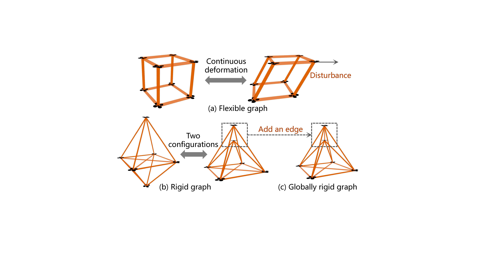

**图 3**：图刚性的示意图。（a）柔性图受到扰动后会发生变形；（b）刚性图可能对应多个几何形状；（c）全局刚性图能够保证形状的稳定性和唯一性。

由于拉普拉斯矩阵 L 包含图的结构并反映顶点之间的连接关系[49]，本文使用 L 表示编队约束：

L = D −A,
(2)

其中，A ∈RN×N 和 D ∈RN×N 分别表示图的邻接矩阵和度矩阵。A 和 D 中的元素为

Ai, j =
(
||pi −p j||2, if eij ∈e,
0, otherwise,
(3)

Di, j =
(
PN
j=1 Ai, j, if i = j,
0, otherwise.
(4)

### B. 图稀疏化与子矩阵选择

对于完全图 Gcmp = (vcmp, ecmp)，本文提出一种构造对应稀疏图 Gspr = (vspr, espr) 的方法，使稀疏图同样具有全局刚性，其中 vspr = vcmp := 1, 2, . . . , N，且 espr ⊂ecmp。

给定顶点集合 v := {1, 2, . . . , N}，按照算法1（A1）可以构造满足全局刚性的稀疏图 Gspr。当集群规模小于4时，由于编队约束数量较少，直接构造完全图以保持编队（A1：第3至7行）。算法A1的核心是选择关键顶点，函数 SelectionVbas 的伪代码见算法2（A2）。由于线形、平面和立体编队达到全局刚性所需的条件不同，本文分别处理这三种情况，得到 vbas，并按照A2构造全局刚性稀疏图。

1）线形编队：通过函数 GRPFVertexSelset 直接选择 k 个顶点作为 vbas（A2：第4、5行）。函数 GRPFVertexSelset 的具体内容见第IV节。

2）平面编队：通过函数 GRPFVertexSelset 选择 k 个顶点作为 vbas（A2：第6、7行）。随后引入以下判据[50]：

∃va, vb, vc ⊆vcmp, det(|−−−→
vbva, −−→
vcva|T) , 0,
(5)

用于判断顶点是否共线，也是函数 IsCollinear 的依据（A2：第8行），其中 det(·) 表示行列式。如果这 k 个顶点共线，就从剩余顶点中随机选择一个与 vbas 不共线的顶点，并将其加入 vbas（A2：第9至11行）。

3）立体编队：通过函数 GRPFVertexSelset 选择 k 个顶点作为 vbas（A2：第12、13行）。引入判据[50]：

∃va, vb, vc, vd ⊆vcmp, det(|−−→
vbva, −−→
vcva, −−−→
vdva|T) , 0,
(6)

用于判断顶点是否共面，也是函数 IsCoplanar 的依据（A2：第13行）。如果这 k 个顶点共面，就从剩余顶点中随机选择一个与 vbas 不共面的顶点，并加入 vbas（A2：第15至17行）。

随后，利用 vbas 构造完全图 Gbas = (vbas, ebas)，并将其余顶点设为 vrmn = v −vbas（A1：第10至12行）。将 vrmn 中的每个顶点连接到 vbas 中的全部顶点，但 vrmn 内部的顶点彼此不连接（A1：第13至17行）。最终得到全局刚性稀疏图。

## 原文第 5 页核心内容与翻译

算法1 全局刚性图构造

虽然线形和平面编队中，两个顶点就足以保证 vbas 不共线，三个顶点可以保证 vbas 不共线，但为保证编队性能和算法简洁性，本文统一配置 |vbas| ≥4。

定义3（图的锥[51]）：图 G 的锥是在 G 上增加一个新顶点 v，并从 v 向 G 的每个顶点增加新边后得到的图。

引理1（扩展引理[52]）：若 G1 是在 G2 基础上增加新顶点 v 并添加与 v 相连的 K 条边得到的图；若 G2 在 Rd 中全局刚性且 K ≥d+1，则 G1 在 Rd 中全局刚性，其中 d 是图所在的空间维数。

引理2[53]：如果从四个不共面的顶点构成的团开始，并不断增加与至少四个不共面的已有顶点相连的新顶点，则得到的图是全局刚性图。

引理3（粘合引理[52]）：设 G1 和 G2 满足 |V(G1) ∩V(G2)| = K，且 G = G1 ∪G2。如果 G1 和 G2 在 Rd 中均全局刚性并且 K ≥d+1，则 G 在 Rd 中全局刚性。V(G) 表示图 G 的顶点集合，|V(G)| 表示顶点数。

引理4[51]：图 G 在 Rd 中全局刚性，当且仅当图 G 的锥在 Rd+1 中全局刚性。

由于图由拉普拉斯矩阵描述，从完全图中选取部分边等价于子矩阵选择。本文将稀疏化机制转化为子矩阵选择，即从拉普拉斯矩阵中提取若干列。完全图的拉普拉斯矩阵记为 Lcmp，子矩阵选取后得到的 Lspr 表示规划问题中的编队约束。如果 Lspr 的元素 Lspr i,j = 0，则表示个体 i 不把个体 j 纳入编队约束。图4给出了子矩阵选择和图稀疏化的直观解释。

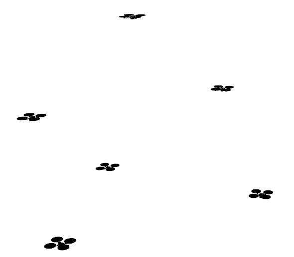

**图 4**：子矩阵选择示意图。（a）六个顶点完全图的拉普拉斯矩阵；（b）通过子矩阵选择得到的稀疏图拉普拉斯矩阵。虚线框中的元素对应稀疏图中的连接边，并用相同颜色表示。矩阵中选取四列形成子矩阵，因此顶点1、2、3和5被选为基集合 vbas。顶点1、2、3和5之间用无向边相互连接，构成完全图；顶点4和6通过有向边与 vbas 相连。

## 原文第 6 页核心内容与翻译

ZHOU et al.: RE-Formation: RESILIENT AND EFFICIENT FORMATION PLANNING
21217

算法2 SelectionVbas

通过子矩阵选择，可以得到一个与完全图具有相同顶点、同时满足全局刚性的稀疏图。把顶点看作分布式集群系统中的个体可以看出，在稀疏图中，每个个体需要处理的位置数据少于完全图，因此编队约束数量减少。

## IV. GRPF 稀疏图构建方法

本节构造一个具有全局刚性、同时能够充分保留原完全图主要特征的稀疏图，并比较不同子矩阵评价指标，通过分析得到本文问题的闭式解。

### A. GRPF 稀疏图构造问题

根据第III-B节，在依据机载计算资源确定连接率 ϱc ∈(0, 100%) 后，向上取整得到待选列数 ⌈ϱc × N⌉。显然，随机选取子矩阵的结果并不唯一。为保证编队性能并得到最优子矩阵，需要谨慎选择 Lspr，从而构造能够充分保留原完全图主要特征的 GRPF 稀疏图[35]。如算法2所示，本文通过子矩阵选择实现函数 GRPFVertexSelset，并将子矩阵选择写成以下组合优化问题：

P1 :
min
Hclm⊆{1, 2, ..., N}, |Hclm|=k ||Lcmp −Lcmp
[Hclm]||2,
(7)

其中，Hclm 是优化变量，包含从拉普拉斯矩阵 Lcmp 中选取的列块索引子集。Lcmp
[Hclm] ∈RN×N 是按列选取的子矩阵：索引属于 Hclm 的列块与 Lcmp 中对应元素完全相同，其余列块置为 0 ∈RN×1。于是得到 Lspr = Lcmp
[Hclm]。

虽然P1中的组合优化可以通过枚举求解，但问题维度随规模呈指数增长，会产生组合爆炸。P1目标函数的计算复杂度为 O(N3)[54]，不适合大规模组合优化。受文献[35]启发，本文采用矩阵揭示指标替代耗时的目标函数，将P1转化为：

P2 :
max
Hclm⊆{1, 2, ..., N}, |Hclm|=k R(Lcmp
[Hclm]),
(8)

其中，R(·)为矩阵揭示指标。常用指标见表I。

P1和P2的目标都是保留原完全图的结构信息，相关效果将在第VII节仿真中验证。

### B. 稀疏图构造问题的求解

为研究适合子矩阵选择的矩阵揭示指标，本文对表I中的四种候选指标进行仿真，并在复杂障碍环境中测试三种编队构型（立方体、三棱柱和八面体），如图5(a)、(b)所示。为避免控制、局部感知等模块的耦合影响造成不公平比较，本文离线规划每架无人机长40 m的全局轨迹。每种构型均测试24、36和48架无人机。仿真使用一台配备 Intel Core i7 8700K 3.2 GHz CPU、32 GB 3200 MHz 内存的个人计算机，算法用C++实现。

将不同矩阵揭示指标得到的稀疏图用于编队规划。按照文献[1]的测量方法，采用平均编队误差 ar{e}_{dist} 作为定量指标：

ar{edist} =
1
L fma
maxLtr j
∫
L
min
R,t,s
N
Σ
i=1
||pdes
i
−(sRpatu
i
+ t)||2 dl,
(9)

其中，L fma
max 和 Ltr j 分别为编队最大对角线长度和集群轨迹 L 的长度；l 为轨迹长度。旋转 R ∈S O(3)、平移 t ∈R3 和尺度因子 s ∈R+ 组成相似变换，用于将实际编队 Aatu 与期望编队 Ades 对齐。本文用具有明确物理意义的参数 L fma max 替代文献[1]中的初始编队尺度，以计算测量误差。用 L fma max 归一化后，在性能相同的情况下，不同物理尺度的编队具有一致的误差量级。pdes
i 和 patu
i 分别表示期望编队 Ades 和实际编队 Aatu 中第 i 架无人机的位置。由于归一化消除了旋转、平移、缩放和轨迹长度的影响，ar{edist} 可以公平衡量实际编队沿全局轨迹相对期望编队的变形程度。

## 原文第 7 页核心内容与翻译

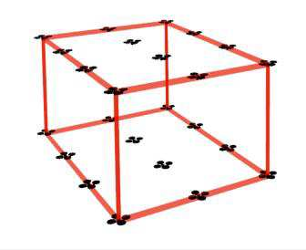

**图 5**：四种候选矩阵评价指标的对比仿真。（a）在随机生成的复杂地图中，模拟无人机以不超过2 m/s的速度从左侧向右侧保持编队飞行，并规划从起点到终点的全局编队轨迹。（b）测试三种编队构型。（c）给出沿全局轨迹计算的编队误差 ar{e}_{dist} 对比结果。

本文用文献[1]的评价方式计算平均编队误差，但将其初始编队尺度替换为具有明确物理意义的参数 L fma max，即编队的物理尺度。用该尺度归一化编队误差后，相同性能下不同物理尺寸的编队具有一致的误差量级。pdes
i 和 patu
i 分别表示实际编队 Aatu 和期望编队 Ades 中第 i 架无人机的位置。由于归一化消除了旋转、平移、缩放和轨迹长度的影响，ar{edist} 可以公平衡量实际编队沿全局轨迹相对于期望编队的变形程度。

图5(c)给出了不同矩阵揭示指标的比较结果。Max-Trace 和 Max-logDet 的 ar{edist} 数值相近，并明显优于另外两种指标。Max-Trace 的计算复杂度只有 O(N)，而 Max-logDet 的计算复杂度为 O(N3)[35]。因此，本文选用 Max-Trace 作为指导子矩阵选择的评价指标。

### C. GRPF 稀疏图构造的闭式解

进一步分析 Max-Trace 在稀疏化中体现的几何特征。假设基集合中有 k 个顶点，且 Hclm 是问题P2的解。根据 Hclm 可得到一个 N 维向量 vH = [vH[0], . . . , vH[m], . . . , vH[N]]，其元素仅为0或1，其中

vH[m] =
(
1, if m ∈Hclm,
0, otherwise,
(10)

根据第III-A节公式（2）至（6），有

tr{Lcmp
[Hclm]} =
N
Σ
i=0
N
Σ
j=0
Acmp
i, j , j < Hclm.
(11)

其中，tr{·}表示迹，Acmp表示完全图对应的邻接矩阵。由于 Lcmp 为对称矩阵，且邻接矩阵元素由 || · ||2 计算，因此 Acmp
i,j = Acmp
j,i。由此可知，按列求和的结果等价于按行求和，即

N
Σ
i=0
N
Σ
j=0
Acmp
i, j , j < Hclm
⇔
N
Σ
i=0
N
Σ
j=0
Acmp
i, j , i < Hclm，

其中，Σj=0N Acmp
i, j = Lcmp
i,i = Dcmp
i,i，Dcmp 为完全图对应的度矩阵。定义度向量 Dv = [Dcmp
0,0, . . . , Dcmp
i,i, . . . , Dcmp
N,N]。根据 vH 的定义，有

N
Σ
i=0
N
Σ
j=0
Acmp
i, j , i < Hclm
⇔ vH · DvT.
(12)

因此：

max
Hclm⊆{1,2,...,N}, |Hclm|=k R(Lcmp
[Hclm])
⇔ max(vH · DvT).

(13)

vH 等价于一个选择向量，从度向量中选择 k 个元素求和。问题P2的最优解 Hclm∗ 等价于选择 DvT 中最大的 k 个元素，因此无需优化即可求解。Lcmp每一列的对角元素（即 DvT 中的元素）表示相应顶点与其他顶点之间距离之和。Max-Trace倾向于选择 Lcmp 对角元素最大的顶点，因此选出的顶点位于编队几何外轮廓上。

于是，基于 Max-Trace 的 GRPF 稀疏图闭式解为

Hclm = {. . . , S max[Lcmp, i], . . . , S max[Lcmp, k], . . .},

其中，S max[Lcmp, k] 表示矩阵 Lcmp 中前 k 个最大对角元素对应的列索引。这样便能按照给定连接率高效选择子矩阵，支持实时构造 GRPF 稀疏图。

## 原文第 8 页核心内容与翻译

ZHOU et al.: RE-Formation: RESILIENT AND EFFICIENT FORMATION PLANNING
21219

### V. 异常智能体状态剔除

由于实际系统的软硬件特性并不完美，大规模编队系统中很容易出现个体故障。本节介绍如何在编队轨迹优化过程中剔除异常状态信息，从而获得正常个体的状态，并利用这些状态进行编队协调。由于本文使用图表示编队相似性，求解过程实际上是在表示实际相对位置的图中寻找最大团，使其与期望编队图之间的误差最小，从而有效识别出大多数正常个体。

本文使用拉普拉斯矩阵描述图的结构，并据此衡量实际编队形状与期望形状的偏差。实际相对位置对应的归一化拉普拉斯矩阵记为 ˆLcur = D−1/2LD−1/2 = I −D−1/2AD−1/2，期望拉普拉斯矩阵记为 ˆLdes。差值矩阵记为 △ˆL = ˆLcur −ˆLdes，其中 △ˆL 的非对角元素表示相应边长误差。根据环境和编队规模设定适当的边长误差阈值，就能识别 △ˆL 中误差过大的边。随后，在由所有个体组成的完全图中断开这些边，得到稀疏图。计算该稀疏图的最大团，就可以识别出大多数正常个体。

最大团对应的完全图记为 Gmc = (vmc, emc)，其中 vmc 和 emc ⊂vmc × vmc 分别表示最大团的顶点集合和边集合，其拉普拉斯矩阵记为 Lmc。这样，剔除异常个体状态的问题就转化成了最大团求解问题。

为在大规模场景的有限计算资源下实时获得最大团，本文用最大 k-core 近似最大团，并以低于2 Hz的频率启动剔除过程。k-core 是图 G 的极大子图 Ck，且其中每个顶点至少与 k 个顶点相邻[57]。文献[58]指出，在实际问题中最大团位于最大 k-core 内，而 k-core 的求解复杂度是线性的[12]。

## VI. 基于稀疏图的编队规划

剔除异常个体后，本文依据相应的稀疏协作关系进行编队轨迹规划。

### A. 轨迹表示

本文采用 TMINCO[59] 作为轨迹表示基础。这类表示用控制量最小的多项式轨迹描述飞行轨迹：

TMINCO = {p(t) : [0, TΣ] →Rm|c = M(q, T),
q ∈Rm(M−1), T ∈RM
>0},
(15)

其中，p(t) 表示由 M 段组成的 m 维 N 次多项式轨迹，N = 2s − 1，s 为相应积分器链的阶数。多项式系数 c = (cT
1 , . . . , cT
M)T ∈R2Ms×m 由 M(q, T) 得到；q = (q1, . . . , qM−1) 表示中间航路点，T = (T1, T2, . . . , TM)T 表示各段分配的时间，TΣ = Σi=1M Ti 表示总时间跨度。

每个 m 维 M 段轨迹定义为：

p(t) = pi(t −ti−1)，对所有 t ∈[ti−1, ti),

(16)

其中第 i 段轨迹是 N = 5 次多项式：

pi(t) = cT
i β(t)，对所有 t ∈[0, Ti),

(17)

ci ∈R(N+1)×m 为系数矩阵，β(t) = [1, t, . . . , tN]T 为自然基，Ti = ti −ti−1 为第 i 段分配的时间。TMINCO 的唯一性由 (q, T) 决定。参数映射 c = M(q, T) 将轨迹表示 (c, T) 转换为 (q, T)，因此任意二阶连续的代价函数 J(c, T) 都可以写成 H(q, T) = J(M(q, T), T)。

为处理避碰、动力学可行性和可通行性代价等时间积分约束，将每段轨迹离散为 κi 个约束点：

p̃i, j = pi ((j/κi) · Ti)，j = 0, 1, . . . , κi − 1。

### B. 问题建模

本文采用分布式轨迹优化框架，将编队规划写成以下约束优化问题：

min
q,T
∫ t0
tM
∥p(s)(t)∥
2dt + ρ · TΣ,
(18)

s.t. p(t) = Mq,T
∀t ∈[t0, tM],
(19)

p[s−1](0) = ¯p0,
(20)

p[s−1](tM) = ¯pf,
(21)

H(p(t), . . . , p(s)(t)) ⪯0
∀t ∈[t0, tM].
(22)

机器人状态 p(t) 由优化变量 {q, T} 参数化，ρ 是时间正则化参数。连续时间约束 H 包括群体编队相似性、动力学可行性、障碍物规避和集群相互避让。p[s−1](t) = (p(t)T, ṗ(t)T, . . . , p[s−1](t)T)T ∈Rms 表示 s 阶积分器链的高阶导数状态，p̄0 和 p̄f 分别表示初始状态和终端状态。

本文使用 MINCO 的优化变量消除等式约束（22）至（24），以实时求解连续约束优化问题；使用惩罚函数方法[60]处理不等式约束（25），具体的约束消除和最优性保证方法见文献[59]。随后将连续约束优化问题转化为离散无约束优化问题：

P3 : min [Jf, Jo] · µ,

(23)

其中，µ = {µ f, µe, µt, µc, µs, µd} 为权重向量。本文沿用相同分布式无约束轨迹优化框架中的权重比例，并将避障权重设置得更高以保证安全。具体参数见表II。Jo 包含控制量、飞行时间、碰撞规避、集群相互避让、动力学可行性和建模代价，其计算方法与同一框架一致。

## 原文第 9 页核心内容与翻译

表 II
轨迹优化问题的权重参数

关于具体实现细节，读者可参阅文献[1]。相似编队代价写作 J_f=f(F_f)，其中 f(·) 是用于计算相似距离的可微度量，当前编队与目标编队之间的距离为 F_f=||L^{mc}_{sqr}-(L^{sqr}_{mc})_{des}||_F^2。L^{mc}_{sqr} 是表示稀疏图 G^{mc}_{spr} 的拉普拉斯矩阵，(L^{sqr}_{mc})_{des} 是描述最大团中目标编队构型的矩阵，||·||_F 表示 Frobenius 范数。虽然本文与文献[1]一样采用可微函数计算编队相似距离，但作为度量的拉普拉斯矩阵已经经过离群点剔除和稀疏化处理。

这种无约束优化从理论上不能保证所有约束都得到满足。为保证实际轨迹规划中的避障安全性，本文首先使用 A* 算法生成初始路径，并将其作为轨迹优化的初值。该路径本身已经包含避障结果，因此能够提供质量较好的优化起点。优化时进一步提高避障项的权重，把安全性放在优先位置。为保证轨迹满足动力学要求，在优化模型中采用低于无人机实际可执行上限的保守动力学约束。除此之外，本文的局部重规划系统以 10 Hz 运行，并通过严格检查立即丢弃未收敛的结果，避免输出不满足约束的轨迹。

### C. 复杂度分析

本文分析问题 P3 的计算复杂度。由于编队相似度代价是计算量最大的部分，因此重点推导 F_f 对无人机位置的梯度。根据链式法则，F_f 相对于无人机位置 p_i(t) 的梯度为

∂F_f/∂p_i(t) = (∂F_f/∂w_i^T)(∂w_i^T/∂p_i(t)), （24）

∂F_f/∂w_i^T = [∂F_f/∂w_i1, …, ∂F_f/∂w_ij, …, ∂F_f/∂w_in], j∈N_i， （25）

∂w_i^T/∂p_i(t) = [∂w_i1/∂p_i(t), …, ∂w_ij/∂p_i(t), …, ∂w_in/∂p_i(t)], j∈N_i。 （26）

其中，N_i 表示与无人机 i 相邻的顶点集合，w_i^T 是由 N_i 中边权组成的权重向量。使用完全图时，相关导数计算复杂度为 O(N)，因此 ∂F_f/∂p_i(t) 的计算复杂度为 O(N^2)。对于连接率为 ϱ_c 的稀疏图，计算量降为 O((ϱ_cN)^2)；当 ϱ_c=30% 时，复杂度相比完全图几乎降低一个数量级。

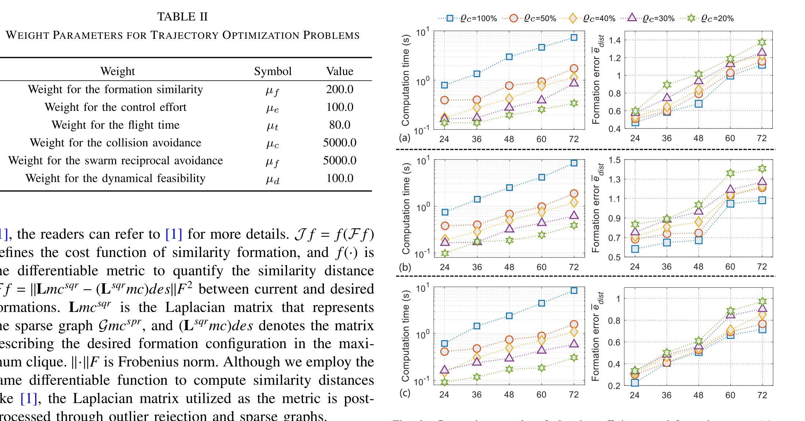

**图 6**：规划效率和编队误差对比结果。（a）～（c）分别为立方体、三棱柱和八面体三种编队构型下的结果。测试的图连接率 ϱ_c 为 20%～50%，无人机数量分别为 24、36、48、60 和 72 架。第一列和第二列分别表示计算时间和编队误差。数据为 20 次运行的平均值，每次测试都重新随机生成地图。

## VII. 基准比较与实验

本文分别在全局规划和局部规划框架下开展了大量仿真，并通过实物实验验证基于稀疏图的编队规划方法的性能。

### A. 高效全局规划仿真

本文考察不同图连接率 ϱ_c 对编队误差和计算效率的影响。为单独分析规划性能，仿真采用全局规划框架：直接生成连接起点和终点的轨迹，不进行局部重规划。仿真环境和硬件配置与第 IV-B 节相同，同时与其他稀疏图构造方法进行比较。

#### 1）规划效率与性能

本小节分析不同稀疏图连接率和不同无人机数量下的规划耗时及编队性能。随着 ϱ_c 减小，计算时间明显下降。当无人机数量为 72 架时，ϱ_c=30% 的计算效率比 ϱ_c=100% 提高了 10 倍以上。连接率降低会带来一定性能下降，但 ϱ_c=30% 时的平均编队误差相比 ϱ_c=100% 仅增加约 30%。因此，ϱ_c=30% 能够支持 72 架无人机实时编队规划，误差增加处于可接受范围；完全图规划需要数秒，难以满足实时要求。

#### 2）编队保持对比

为验证本文稀疏图构造方法的优势，选取随机稀疏图（Random）、最近邻稀疏图（Nearest）[4]、未对基集合 v_bas 进行优化的本文方法（Ours w/o opt）三种方法，与本文完整方法比较编队误差和编队恢复能力。各方法的实现细节列于表 III。测试设置为 48 架无人机保持八面体编队，连接率 ϱ_c=30%，每架无人机连接 15 条边。每种方法在随机生成的地图上运行 80 次。

结果表明，Nearest 和 Random 的平均编队误差及离散程度都较大。Ours w/o opt 利用稀疏图的全局刚性改善了性能，但随机选取基集合会导致结果不稳定。本文方法的平均误差更低、结果更集中，并且非常接近 Complete，说明优化后的基集合保留了更完整的结构信息。

#### 3）编队恢复对比

设置 48 架无人机从分散状态恢复为八面体编队，不考虑避障，连接率设为 30%。与完全图相比，基于稀疏图的编队规划速度提高了一个数量级。本文方法比其他方法更快形成目标八面体构型，恢复时间与 Complete 非常接近。总体来看，GRPF 稀疏图能够在获得满意编队效果的同时，显著提高规划效率。
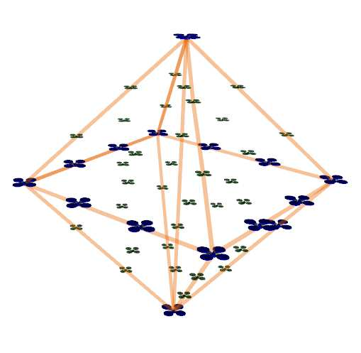

**图 7**：编队误差对比仿真。（a）不同方法编队误差的箱线图；（b）分别显示 Ours w/o opt 和 Ours 选出的基集合。

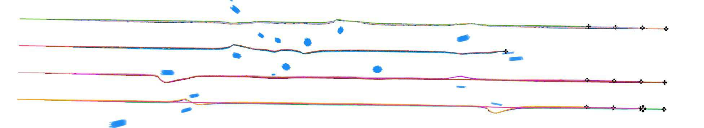

**图 8**：局部规划框架下与 Quan 方法[1]及基于 VRB 方法的对比仿真。（a）100 架无人机的立方体编队；（b）编队误差；（c）编队规划运行时间；（d）基于 VRB 方法的局部规划结果。

### B. 高效局部规划仿真

本文把稀疏图构造方法纳入分布式局部规划框架，并与 Quan 方法[1]和虚拟刚体（VRB）方法[19]比较。连接率设置为 ϱ_c=30%，在障碍物较多的环境中测试 10～100 架无人机保持立方体编队的规划过程。超过 80 架时，个人计算机的感知和建图模块几乎耗尽计算资源，因此改用配备多颗 AMD EPYC 7B13 CPU 和 256 GB 内存的高性能工作站。图 8（b）给出编队误差，图 8（c）给出各无人机局部规划最长耗时的平均值和方差。

随着无人机数量增加，Quan 方法的计算时间增长更快。本文方法在 80 架无人机时仍将耗时保持在 100 ms 以下，而 Quan 方法在同等规模下的轨迹优化耗时超过 1 s。Quan 方法的计算结果更新不及时，导致共享轨迹滞后和编队误差增大；在 80 架无人机时，本文方法的编队误差低于 Quan 方法。VRB 方法计算量虽小，但在障碍环境中容易陷入僵局：8 架无人机能够通过稀疏障碍区域，增加到 16 架时则无法通过。100 架无人机保持喷气式飞机形状的局部规划每次耗时 0.12 s，结果见图 1。

### C. 全局刚性图构造消融实验

为验证三维空间中的基集合 v_bas 应当不共面，本文开展了消融实验。若有意选择共面顶点构成 v_bas，所得到的稀疏图在三维空间中可能只有刚性而非全局刚性，不能唯一确定几何形状。不同形状对应的局部极小值彼此接近，规划会在多个局部极小值之间振荡，无法收敛到可行解，最终造成编队解体。改变一个顶点的位置构造不共面的 v_bas 后，三种构型均能保持稳定编队。

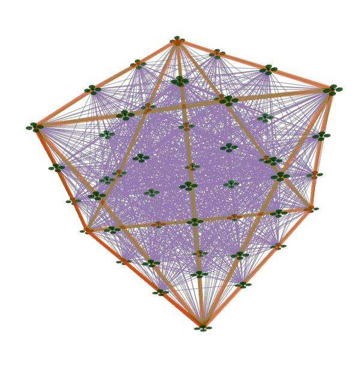

**图 9**：编队恢复对比仿真。图中给出了不同时刻的编队状态。粗橙色线表示几何形状的整体骨架，细灰色线表示无人机之间的连接边。瞬时编队误差定义为 e_dist(t)=min_{R,t,s}(Σ_{i=1}^N||p_i^{des}-(sRp_i^{atu}+t)||_2)/L_{max}^{fma}。当 e_dist(t)≤0.65 时，认为编队已经收敛到目标构型。

## 原文第 10 页核心内容与翻译

在 72 架无人机的测试中，连接率为 30% 时的规划效率超过完全图方案的 10 倍。虽然连接率降低会带来一定性能下降，但平均编队误差仅比 100% 连接率增加约 30%，因此能够在实时性和编队误差之间取得平衡。完全图规划需要数秒，难以满足实时要求。

在编队保持对比中，本文方法与 Random、Nearest 以及 Ours w/o opt 进行比较。测试包含 48 架无人机，目标为八面体编队，连接率为 30%，每种方法在随机地图上运行 80 次。Nearest 和 Random 的平均误差及离散程度较大；Ours w/o opt 虽然利用了全局刚性，但随机选取基集合会造成性能不稳定。本文方法的误差更低、结果更集中，并接近 Complete，说明优化后的基集合保留了更完整的结构信息。

编队恢复测试要求 48 架无人机从分散状态恢复为八面体编队。稀疏图方案相对于完全图可获得一个数量级的速度提升，本文方法形成目标构型的速度优于对比方法，恢复时间接近 Complete。

## 原文第 11 页核心内容与翻译

在分布式局部规划测试中，连接率设置为 30%，测试 10～100 架无人机在障碍物较多的环境中保持立方体编队。本文方法在 80 架无人机时仍能将局部规划时间保持在 100 ms 以下，而 Quan 方法超过 1 s。Quan 方法因计算耗时较长，使共享轨迹变得滞后，编队误差随之增大。VRB 方法虽然计算量小，但在障碍环境中容易陷入僵局：8 架无人机能够通过稀疏障碍区域，增加到 16 架时则无法通过。

在全局刚性图构造消融实验中，有意选择共面顶点构成基集合 v_bas。这样得到的图在三维空间中可能只有刚性而不是全局刚性，不能唯一确定编队形状，规划会在多个局部极小值之间振荡，最终导致编队解体。将其中一个顶点移出共面位置后，三种编队构型均能保持稳定。

## 原文第 12 页核心内容与翻译

本文通过计算最大 k-core，得到包含正常个体的最大团，从而剔除异常个体，减少异常状态对整体编队中大多数成员的影响。消融实验比较了是否剔除异常状态，以验证本文方法的有效性。如图 12 所示，实验将一架无人机设置在远离目标编队位置的地方，本文方法能够自动将其排除；当该异常个体重新接近目标位置后，方法又能够平滑地将其纳入编队。结果表明，大多数正常个体的轨迹保持平滑，整体编队形状也得到保持。相比之下，始终把所有个体纳入计算的方法会使所有无人机的轨迹变得曲折，明显影响整体编队的完整性。

如表 IV 所示，本文进一步比较了障碍物较多环境中不同无人机数量下的编队误差，每个编队都包含一架处于异常状态的个体。随着无人机数量增加，两种方法的平均编队误差都趋于增大。但当无人机数量少于 20 架时，采用离群点剔除的方法，其平均编队误差始终低于不剔除方法的 50%；当无人机数量少于 10 架时，误差最多可降低 78%。与不包含异常个体时的编队误差相比，离群点剔除方法在保持其余成员的整体性能方面具有明显优势。

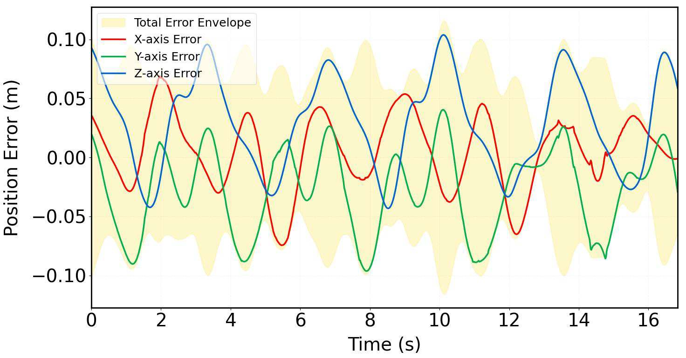

**图 10**：编队规划消融实验结果。测试三种编队构型，无人机数量和连接率分别设置为 48 架和 30%。（a）基集合 v_bas 中的顶点共面，阴影区域表示 v_bas 中的顶点；（b）基集合 v_bas 中的顶点不共面，阴影区域和圆圈表示 v_bas 中的顶点。
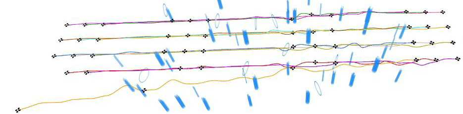

**图 11**：无人机系统中 SE(5) 控制器的三轴位置跟踪误差和总误差。

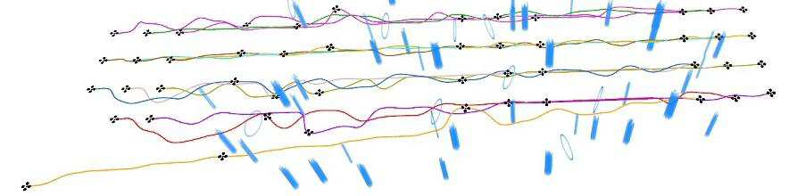

**图 12**：局部规划框架下的离群点剔除消融实验。（a）剔除离群点；（b）不剔除离群点。

## 原文第 13 页核心内容与翻译

此外，在保持编队规模相同的条件下，本文研究了不同异常个体比例下的编队规划。如图 13 所示，与不剔除异常个体的方法相比，离群点剔除方法能够使正常个体保持稳定协同，整体轨迹也更加平滑。正常个体的平均编队误差均低于不剔除方法的 60%，最低达到后者的 30%。但是，随着异常个体比例增加，如图 13（d）所示，本文方法仍不可避免地受到异常个体过多造成的轨迹变形影响。即使在这种情况下，平均编队误差仍约为不剔除方法的 56%。总体而言，本文方法能够有效处理异常个体带来的影响。

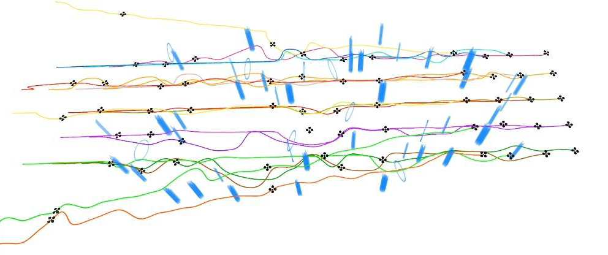

**图 13**：不同异常个体比例下的离群点剔除消融实验。绿色框中的编队采用离群点剔除，正常个体受到的轨迹扰动较小；红色框中的编队不剔除离群点，轨迹明显扭曲，编队保持能力下降。（a）～（d）分别表示编队中包含 1、2、3 和 4 个离群点。

### E. 实物实验

本文将基于稀疏图的轨迹规划方法集成到分布式空中集群实物系统中，用于保持编队。实物系统的结构如图 14（a）所示。每架无人机都具有独立的控制、感知和轨迹规划模块。具体硬件包括用于控制的 KAKUTE H7 Mini 飞行控制器、用于感知的 Intel RealSense D435 双目相机，以及用于状态估计的 NOKOV 动作捕捉系统。建图、状态估计和编队规划均由机载 Xavier NX 计算机实时运行。

如图 14（e）所示，无人机 0～3 对应稀疏图中的基顶点 v_bas，无人机 4 对应其余顶点 v_rem。实线蓝线表示双向连接，虚线表示单向连接。根据命题 1，该稀疏图具有全局刚性。无人机最大速度为 1 m/s。每架无人机都依靠本地感知进行避障，不使用预先建立的地图。本文采用 SE(3) 上的经典几何跟踪控制方法[61]跟踪目标轨迹，并在真实无人机上进行实验。如图 11 所示，三个坐标轴方向的跟踪误差和总跟踪误差均保持在 0.1 m 以内，编队性能几乎没有明显下降。实验结果表明，本文方法能够引导集群在障碍物较多的环境中保持编队。整个飞行过程中，e_dist(t) 不超过 0.3。由于障碍物干扰，图 14（d）所示编队的 e_dist(t) 明显增大；但离开密集障碍区域后，编队能够迅速恢复目标构型。

### F. 讨论

本文提出的 GRPF 稀疏图能够有效减少轨迹优化时间，并在复杂环境中表现出较好的编队保持和恢复能力。但本文尚未研究通信拓扑随时间变化时的编队协同性能，稀疏图连接率目前也依赖经验选取。考虑到集群成员之间需要相互避让，各无人机仍需接收其他无人机的轨迹。不过，采用少量参数即可紧凑表示多项式轨迹，所需通信带宽很小，低于 10 bps。对于更大规模的编队规划，还可以通过集群分组进一步降低通信复杂度[62]。

此外，异常剔除机制能够同时减少连接数量和异常个体的影响，但当前方法仍局限于异常个体比例较小的场景。剔除阈值仍是通过经验确定的阈值，需要利用数据驱动的阈值自适应机制进行系统改进。本文还采用了理想化的通信假设，没有考虑实际场景中的通信延迟[63]，[64]和链路失效[25]。

## 原文第 14 页核心内容与翻译

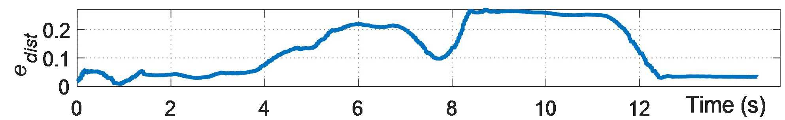

**图 14**：实物实验结果。（a）分布式空中集群系统结构；（b）实物实验中的四旋翼无人机；（c）最终编队的现场照片和 Rviz 示意图；（d）飞行 5 s 时编队的现场照片和 Rviz 示意图；（e）初始编队的现场照片和 Rviz 示意图；（f）飞行过程中的编队误差 e_dist；（g）采用稀疏图描述编队约束的五机方形分布式集群系统穿越未知障碍区域时的 Rviz 示意图。

尽管存在上述局限，本文方法在计算效率和异常状态适应能力方面仍优于先进的编队规划方法[1]，[19]，尤其适用于大规模集群编队。

## VIII. 结论与未来工作

本文通过计算最大 k-core，剔除处于异常状态的个体，保证大多数正常个体能够继续协同。随后，本文提出一种用于高效编队规划的稀疏图构造方法。
本文将图稀疏化机制与子矩阵选择结合起来，确保稀疏图具有全局刚性，并保留完全图的主要结构特征。基准比较和仿真结果表明，该方法能够显著减少计算时间，同时使编队性能保持在接近完全图的水平。本文还通过自主分布式空中集群实物系统验证了方法的有效性。下一步将把编队系统扩展到更大规模，并研究通信延迟和链路失效的影响；同时开发基于学习的方法，在剔除离群个体的情况下进一步提高编队保持能力。
REFERENCES

## 原文第 15 页核心内容与翻译

[2]
H. Xu, L. Wang, Y. Zhang, K. Qiu, and S. Shen, “Decentralized visual-
inertial-UWB fusion for relative state estimation of aerial swarm,” in
Proc. IEEE Int. Conf. Robot. Autom. (ICRA), May 2020, pp. 8776–8782.
[3]
M. Rubenstein, A. Cornejo, and R. Nagpal, “Programmable self-
assembly in a thousand-robot swarm,” Science, vol. 345, no. 6198,
pp. 795–799, Aug. 2014.
[4]
C. C. Cheah, S. P. Hou, and J. J. E. Slotine, “Region-based shape control
for a swarm of robots,” Automatica, vol. 45, no. 10, pp. 2406–2411, Oct.
2009.
[5]
S. Bandyopadhyay, S.-J. Chung, and F. Y. Hadaegh, “Probabilistic and
distributed control of a large-scale swarm of autonomous agents,” IEEE
Trans. Robot., vol. 33, no. 5, pp. 1103–1123, Oct. 2017.
[6]
G. Sun et al., “Mean-shift exploration in shape assembly of robot
swarms,” Nature Commun., vol. 14, no. 1, p. 3476, Jun. 2023.
[7]
A. Kushleyev, D. Mellinger, C. Powers, and V. Kumar, “Towards
a swarm of agile micro quadrotors,” Auto. Robots, vol. 35, no. 4,
pp. 287–300, Nov. 2013.
[8]
X. Zhou et al., “Swarm of micro flying robots in the wild,” Sci. Robot.,
vol. 7, no. 66, p. 5954, May 2022.
[9]
M. Ballerini et al., “Interaction ruling animal collective behavior depends
on topological rather than metric distance: Evidence from a field study,”
Proc. Nat. Acad. Sci. USA, vol. 105, no. 4, pp. 1232–1237, Jan. 2008.
[10] D. W. Sankey, R. F. Storms, R. J. Musters, T. W. Russell, C. K. Hemel-
rijk, and S. J. Portugal, “Absence of ‘selfish herd’ dynamics in bird
flocks under threat,” Current Biol., vol. 31, no. 14, pp. 3192–3198,
2021.
[11] C. Boutsidis, M. W. Mahoney, and P. Drineas, “An improved approxima-
tion algorithm for the column subset selection problem,” in Proc. 20th
Annu. ACM-SIAM Symp. Discrete Algorithms, Jan. 2009, pp. 968–977.
[12] N. S. Dasari, R. Desh, and M. Zubair, “ParK: An efficient algorithm
for k-core decomposition on multicore processors,” in Proc. IEEE Int.
Conf. Big Data (Big Data), Oct. 2014, pp. 9–16.
[13] R. Chai, Y. Guo, Z. Zuo, K. Chen, H.-S. Shin, and A. Tsourdos,
“Cooperative motion planning and control for aerial-ground autonomous
systems: Methods and applications,” Prog. Aerosp. Sci., vol. 146, Apr.
2024, Art. no. 101005.
[14] J. Alonso-Mora, S. Baker, and D. Rus, “Multi-robot formation con-
trol and object transport in dynamic environments via constrained
optimization,” Int. J. Robot. Res., vol. 36, no. 9, pp. 1000–1021, Aug.
2017.
[15] B. Ac¸ıkmes¸e and D. S. Bayard, “Markov chain approach to probabilistic
guidance for swarms of autonomous agents,” Asian J. Control, vol. 17,
no. 4, pp. 1105–1124, Jul. 2015.
[16] F. Trotti, A. Farinelli, and R. Muradore, “A Markov decision process
approach for decentralized UAV formation path planning,” in Proc. Eur.
Control Conf. (ECC), Jun. 2024, pp. 436–441.
[17] L. Sabattini, C. Secchi, and C. Fantuzzi, “Arbitrarily shaped for-
mations of mobile robots: Artificial potential fields and coordinate
transformation,” Auto. Robots, vol. 30, no. 4, pp. 385–397, May 2011.
[18] M. A. Lewis and K.-H. Tan, “High precision formation control of mobile
robots using virtual structures,” Auto. Robots, vol. 4, no. 4, pp. 387–403,
Oct. 1997.
[19] D. Zhou, Z. Wang, and M. Schwager, “Agile coordination and assistive
collision avoidance for quadrotor swarms using virtual structures,” IEEE
Trans. Robot., vol. 34, no. 4, pp. 916–923, Aug. 2018.
[20] J. Wang and M. Xin, “Integrated optimal formation control of multiple
unmanned aerial vehicles,” IEEE Trans. Control Syst. Technol., vol. 21,
no. 5, pp. 1731–1744, Sep. 2013.
[21] Z. Kan, A. P. Dani, J. M. Shea, and W. E. Dixon, “Network connec-
tivity preserving formation stabilization and obstacle avoidance via a
decentralized controller,” IEEE Trans. Autom. Control, vol. 57, no. 7,
pp. 1827–1832, Jul. 2012.
[22] D. Panagou and V. Kumar, “Cooperative visibility maintenance for
leader–follower formations in obstacle environments,” IEEE Trans.
Robot., vol. 30, no. 4, pp. 831–844, Aug. 2014.
[23] H. Xiao, Z. Li, and C. L. Philip Chen, “Formation control of
leader–follower mobile Robots’ systems using model predictive control
based on neural-dynamic optimization,” IEEE Trans. Ind. Electron.,
vol. 63, no. 9, pp. 5752–5762, Sep. 2016.
[24] F. Xiao, L. Wang, J. Chen, and Y. Gao, “Finite-time formation control
for multi-agent systems,” Automatica, vol. 45, no. 11, pp. 2605–2611,
Nov. 2009.
[25] Z. Du, S. Wang, X. Wang, and J. Chen, “Formation-aware UAV network
self-organization with game-theoretic distributed topology control,”
IEEE Trans. Cognit. Commun. Netw., early access, Jan. 16, 2025, doi:
10.1109/TCCN.2025.3530443.
[26] L. Krick, M. E. Broucke, and B. A. Francis, “Stabilisation of infinitesi-
mally rigid formations of multi-robot networks,” Int. J. Control, vol. 82,
no. 3, pp. 423–439, Mar. 2009.
[27] S. Zhao and D. Zelazo, “Bearing rigidity and almost global bearing-only
formation stabilization,” IEEE Trans. Autom. Control, vol. 61, no. 5,
pp. 1255–1268, May 2016.
[28] R. Olfati-Saber, J. A. Fax, and R. M. Murray, “Consensus and coop-
eration in networked multi-agent systems,” Proc. IEEE, vol. 95, no. 1,
pp. 215–233, Jan. 2007.
[29] P. Peng, W. Dong, G. Chen, and X. Zhu, “Obstacle avoidance of
resilient UAV swarm formation with active sensing system in the dense
environment,” in Proc. IEEE/RSJ Int. Conf. Intell. Robots Syst. (IROS),
Oct. 2022, pp. 10529–10535.
[30] W. Liu, J. Hu, H. Zhang, M. Y. Wang, and Z. Xiong, “A novel graph-
based motion planner of multi-mobile robot systems with formation and
obstacle constraints,” IEEE Trans. Robot., vol. 40, pp. 714–728, 2024.
[31] R. Sharma, T. Weiss, and M. Kallmann, “Formation-aware planning and
navigation with corridor shortest path maps,” Comput. Graph. Forum,
vol. 43, no. 1, p. 14995, Feb. 2024.
[32] Z. Sui, Z. Pu, J. Yi, and S. Wu, “Formation control with collision
avoidance through deep reinforcement learning using model-guided
demonstration,” IEEE Trans. Neural Netw. Learn. Syst., vol. 32, no. 6,
pp. 2358–2372, Jun. 2021.
[33] Y.
Xie
et
al.,
“Multi-UAV
formation
control
with
static
and
dynamic
obstacle
avoidance
via
reinforcement
learning,”
2024,
arXiv:2410.18495.
[34] Y. Yan et al., “Relative distributed formation and obstacle avoidance with
multi-agent reinforcement learning,” in Proc. Int. Conf. Robot. Autom.
(ICRA), May 2022, pp. 1661–1667.
[35] Y. Zhao and P. A. Vela, “Good feature matching: Toward accurate,
robust VO/VSLAM with low latency,” IEEE Trans. Robot., vol. 36,
no. 3, pp. 657–675, Jun. 2020.
[36] M. Shamaiah, S. Banerjee, and H. Vikalo, “Greedy sensor selection:
Leveraging submodularity,” in Proc. 49th IEEE Conf. Decis. Control
(CDC), Dec. 2010, pp. 2572–2577.
[37] K. Saulnier, D. Saldana, A. Prorok, G. J. Pappas, and V. Kumar,
“Resilient flocking for mobile robot teams,” IEEE Robot. Autom. Lett.,
vol. 2, no. 2, pp. 1039–1046, Apr. 2017.
[38] L. Guerrero-Bonilla, A. Prorok, and V. Kumar, “Formations for resilient
robot teams,” IEEE Robot. Autom. Lett., vol. 2, no. 2, pp. 841–848, Apr.
2017.
[39] D. Morgan, G. P. Subramanian, S.-J. Chung, and F. Y. Hadaegh, “Swarm
assignment and trajectory optimization using variable-swarm, distributed
auction assignment and sequential convex programming,” Int. J. Robot.
Res., vol. 35, no. 10, pp. 1261–1285, Sep. 2016.
[40] X. Zhang, J. Yang, S. Zhang, and Y. Zhang, “3D registration with
maximal cliques,” in Proc. IEEE Conf. Comput. Vis. Pattern Recognit.,
Jun. 2023, pp. 17745–17754.
[41] M. A. Fischler and R. C. Bolles, “Random sample consensus: A
paradigm for model fitting with applications to image analysis and
automated cartography,” Commun. ACM, vol. 24, no. 6, pp. 381–395,
1981.
[42] J. G. Mangelson, D. Dominic, R. M. Eustice, and R. Vasudevan,
“Pairwise consistent measurement set maximization for robust multi-
robot map merging,” in Proc. IEEE Int. Conf. Robot. Autom. (ICRA),
May 2018, pp. 2916–2923.
[43] P. J. Huber and E. M. Ronchetti, Robust Statistics. Hoboken, NJ, USA:
Wiley, 2011.
[44] H. Yang, P. Antonante, V. Tzoumas, and L. Carlone, “Graduated non-
convexity for robust spatial perception: From non-minimal solvers
to global outlier rejection,” IEEE Robot. Autom. Lett., vol. 5, no. 2,
pp. 1127–1134, Apr. 2020.
[45] H. Yang, J. Shi, and L. Carlone, “TEASER: Fast and certifiable point
cloud registration,” IEEE Trans. Robot., vol. 37, no. 2, pp. 314–333,
Apr. 2021.
[46] H. G. de Marina, “Maneuvering and robustness issues in undirected
displacement-consensus-based formation control,” IEEE Trans. Autom.
Control, vol. 66, no. 7, pp. 3370–3377, Jul. 2021.
[47] L. Asimow and B. Roth, “The rigidity of graphs, II,” J. Math. Anal.
Appl., vol. 68, no. 1, pp. 171–190, Mar. 1979.
[48] B. Jackson and T. Jord´an, “Connected rigidity matroids and unique
realizations of graphs,” J. Combinat. Theory, Ser. B, vol. 94, no. 1,
pp. 1–29, May 2005.
[49] M. Tantardini, F. Ieva, L. Tajoli, and C. Piccardi, “Comparing methods
for comparing networks,” Sci. Rep., vol. 9, no. 1, p. 17557, Nov. 2019.
[50] K.-T. Leung, Linear Algebra and Geometry, vol. 1. Hong Kong: Hong
Kong University Press, 1974.
Authorized licensed use limited to: National Institute of Technology- Delhi. Downloaded on August 24,2026 at 05:42:45 UTC from IEEE Xplore.  Restrictions apply.

---

## 原文第 16 页核心内容与翻译

ZHOU et al.: RE-Formation: RESILIENT AND EFFICIENT FORMATION PLANNING
21227
[51] D. Garamv¨olgyi and T. Jord´an, “Minimally globally rigid graphs,” Eur.
J. Combinatorics, vol. 108, Feb. 2023, Art. no. 103626.
[52] T. Jord´an and S.-I. Tanigawa, “Globally rigid powers of graphs,”
J. Combinat. Theory, Ser. B, vol. 155, pp. 111–140, Jul. 2022.
[53] N. B. Priyantha, H. Balakrishnan, E. D. Demaine, and S. Teller,
“Mobile-assisted localization in wireless sensor networks,” in Proc.
IEEE 24th Annu. Joint Conf. IEEE Comput. Commun. Societies, Mar.
2022, pp. 172–183.
[54] G. H. Golub and C. F. Van Loan, Matrix Computations. Baltimore, MD,
USA: JHU Press, 2013.
[55] S. T. Jawaid and S. L. Smith, “Submodularity and greedy algorithms in
sensor scheduling for linear dynamical systems,” Automatica, vol. 61,
pp. 282–288, Nov. 2015.
[56] T. H. Summers, F. L. Cortesi, and J. Lygeros, “On submodularity and
controllability in complex dynamical networks,” IEEE Trans. Control
Netw. Syst., vol. 3, no. 1, pp. 91–101, Mar. 2016.
[57] V. Batagelj and M. Zaversnik, “An O(m) algorithm for cores decompo-
sition of networks,” 2003, arXiv: cs/0310049.
[58] J. L. Walteros and A. Buchanan, “Why is maximum clique often easy
in practice?,” Oper. Res., vol. 68, no. 6, pp. 1866–1895, Nov. 2020.
[59] Z. Wang, X. Zhou, C. Xu, and F. Gao, “Geometrically constrained
trajectory optimization for multicopters,” IEEE Trans. Robot., vol. 38,
no. 5, pp. 3259–3278, Oct. 2022.
[60] L. S. Jennings and K. L. Teo, “A computational algorithm for functional
inequality constrained optimization problems,” Automatica, vol. 26,
no. 2, pp. 371–375, Mar. 1990.
[61] T. Lee, M. Leok, and N. H. McClamroch, “Geometric tracking control
of a quadrotor UAV on SE(3),” in Proc. 49th IEEE Conf. Decis. Control
(CDC), Dec. 2010, pp. 5420–5425.
[62] J. Hou et al., “Primitive-swarm: An ultra-lightweight and scalable
planner for large-scale aerial swarms,” IEEE Trans. Robot., vol. 41,
pp. 3629–3648, 2025.
[63] K. Kondo et al., “Robust MADER: Decentralized and asynchronous
multiagent trajectory planner robust to communication delay,” in Proc.
IEEE Int. Conf. Robot. Autom. (ICRA), May 2023, pp. 1687–1693.
[64] R. Chai, A. Tsourdos, A. Savvaris, S. Chai, Y. Xia, and C. L. Philip
Chen, “Review of advanced guidance and control algorithms for
space/aerospace vehicles,” Prog. Aerosp. Sci., vol. 122, Apr. 2021, Art.
no. 100696.
Yuan Zhou received the B.Eng. degree in mechan-
ical
engineering
from
Northeastern
University,
Shenyang, China, in 2022. He is currently pursuing
the Ph.D. degree in control science and engineering
with Zhejiang University, Hangzhou, China.
His research interests include formation planning
for multirobot systems and swarm intelligence.
Lun Quan received the Ph.D. degree in control
science and engineering from Zhejiang University,
Hangzhou, China, in 2024.
His research interests include motion planning
for multirobot systems, swarm intelligence, and
autonomous vehicles.
Chao Xu (Senior Member, IEEE) received the Ph.D.
degree in mechanical engineering from Lehigh Uni-
versity in 2010. He is currently the Associate Dean
and a Professor at the College of Control Science
and Engineering, Zhejiang University (ZJU). He is
the inaugural Dean of Huzhou Institute, ZJU. His
research expertise is flying robotics and control-
theoretic learning. He will join the organization
committee of the IROS-2025 in Hangzhou. He plays
the role of a Managing Editor of IET Cyber-Systems
and Robotics.
Guangtong
Xu
received the Ph.D. degree in
aeronautical and astronautical science and technol-
ogy from Beijing Institute of Technology, Beijing,
China, in 2021. He was a Post-Doctoral Fellow
with Tsinghua University, Beijing, from 2021 to
2023. He is currently an Associate Researcher
with Huzhou Institute, Zhejiang University, Huzhou,
China. His research interests include path and trajec-
tory planning, numerical optimization, and swarm
intelligence.
Fei Gao (Member, IEEE) received the Ph.D. degree
in electronic and computer engineering from The
Hong Kong University of Science and Technology,
Hong Kong, in 2019. He is currently a tenured Asso-
ciate Professor at the Department of Control Sci-
ence and Engineering, Zhejiang University, where
he leads the Flying Autonomous Robotics (FAR)
Group, Field Autonomous System and Computing
(FAST) Laboratory. His research interests include
aerial robots, autonomous navigation, motion plan-
ning, optimization, and localization and mapping.
Authorized licensed use limited to: National Institute of Technology- Delhi. Downloaded on August 24,2026 at 05:42:45 UTC from IEEE Xplore.  Restrictions apply.

---
