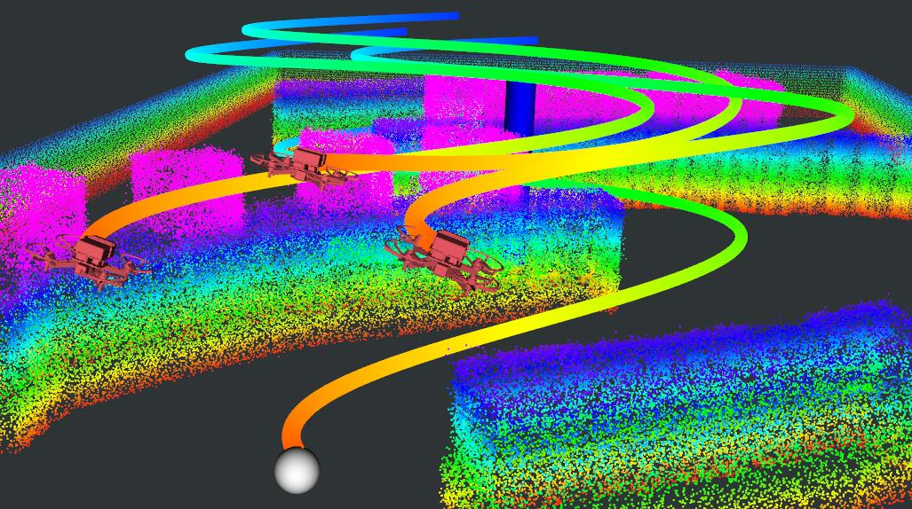
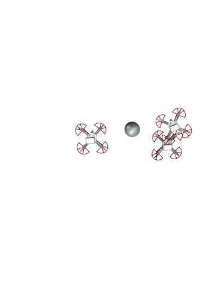
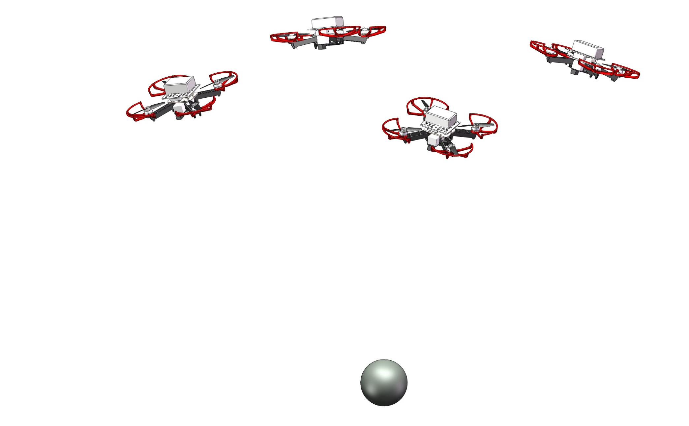
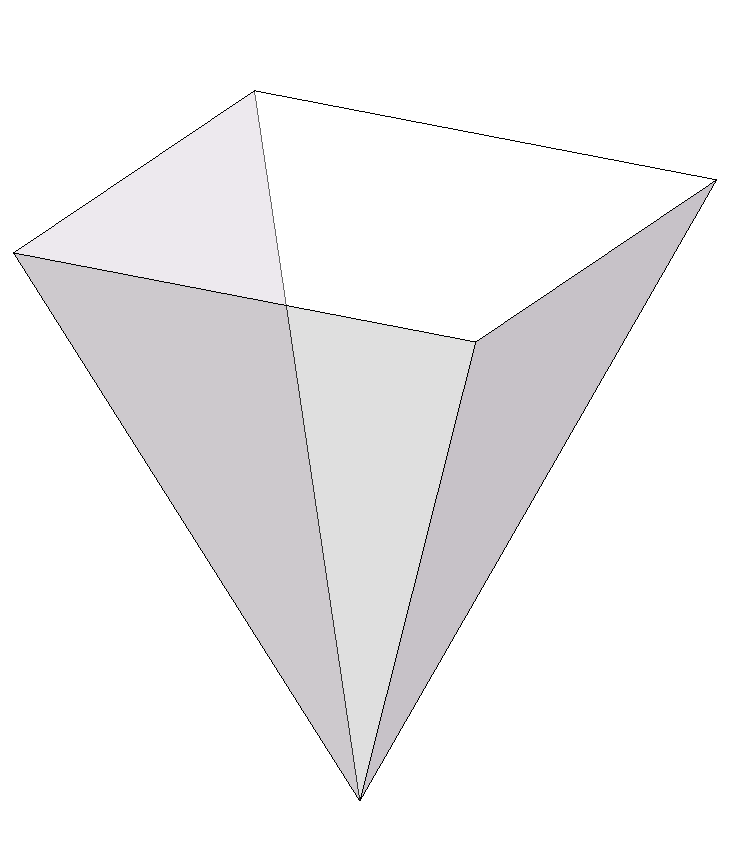
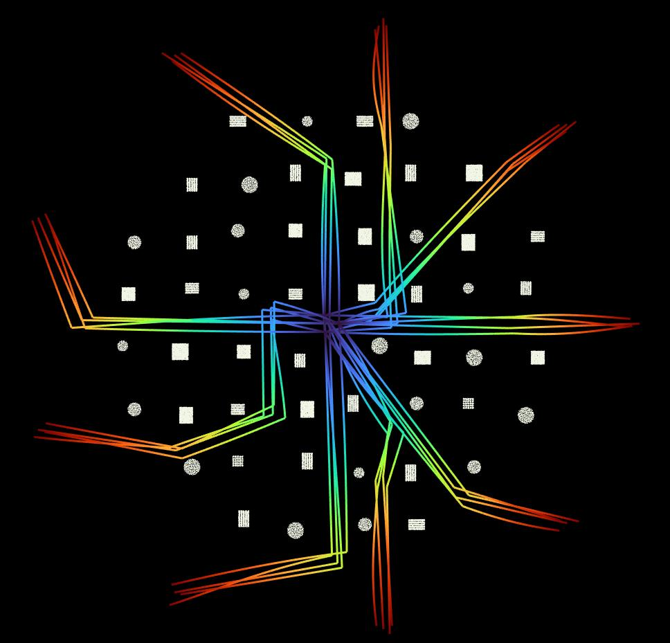
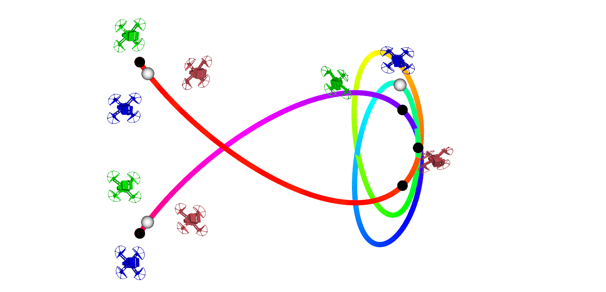
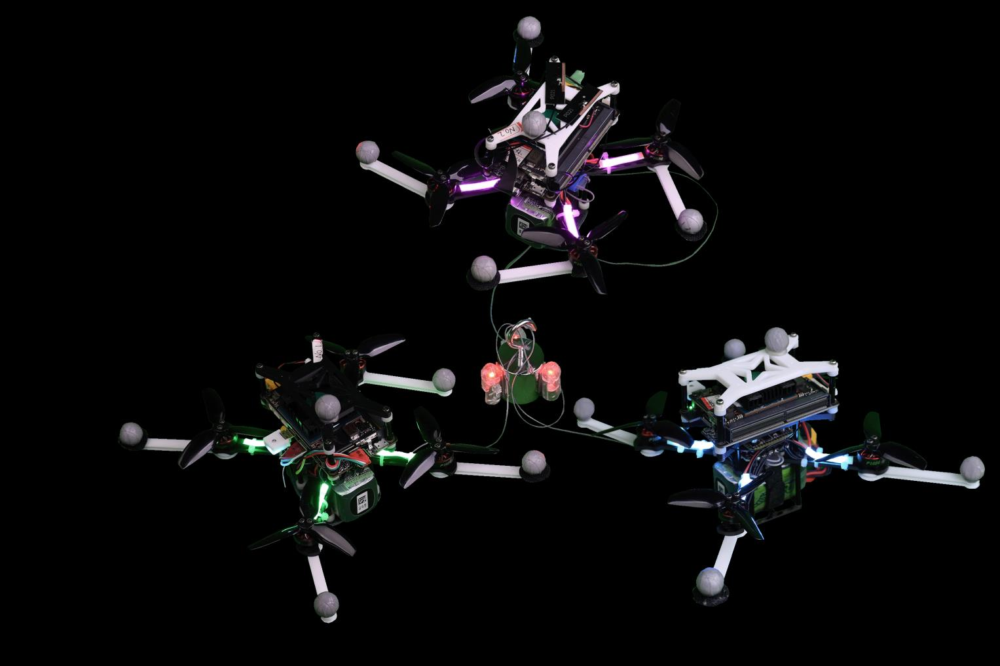
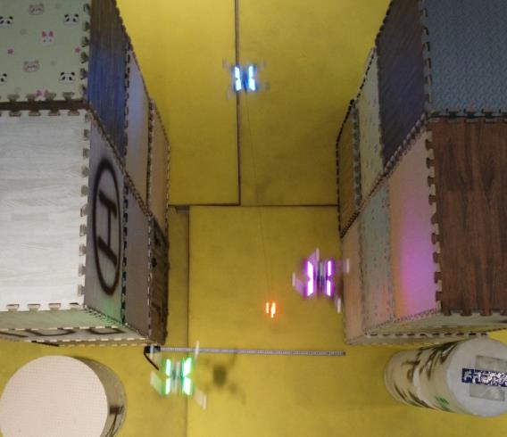
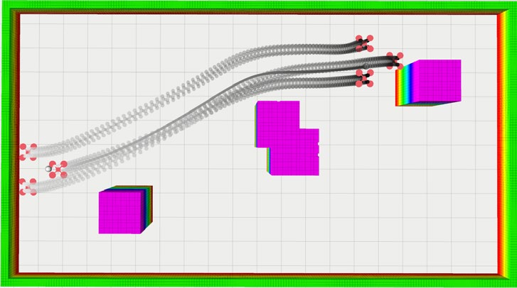

# MARTS 多机绳吊载荷运输：安全且灵活的运输

> **原文标题**：18_MARTS_Cable-Suspended_Payloads
> **作者**：Yongchao Wang、Junjie Wang、Xiaobin Zhou、Tiankai Yang、Chao Xu、Fei Gao
> **发表信息**：arXiv:2501.15272v1，2025-01-25
> **原文 PDF**：[18_MARTS_Cable-Suspended_Payloads.pdf](../18_MARTS_Cable-Suspended_Payloads.pdf) ｜ **对应中文详解**：[18_MARTS多机绳吊载荷运输.md](../中文详解/18_MARTS多机绳吊载荷运输.md)

---

## 原文第 1 页核心内容与翻译

### 标题

**多架空中机器人对绳吊载荷的安全灵活运输**

Yongchao Wang、Junjie Wang、Xiaobin Zhou、Tiankai Yang、Chao Xu、Fei Gao（`*` 表示贡献相同，`†` 表示通信作者）。通信作者：fgaoaa@zju.edu.cn。Yongchao Wang 就读于北京航空航天大学航空科学与工程学院，北京 100191（wangyongchao@buaa.edu.cn）；其余作者来自浙江大学工业控制技术重点实验室、网络系统与控制研究所，杭州 310027，以及浙江大学湖州研究院，湖州 313000（wwwangjunjie@zju.edu.cn）。本研究得到国家自然科学基金（项目编号 62403419）和中央高校基本科研业务费资助。

### 摘要

利用多架空中机器人（MARs）运输重载荷，可以有效扩展单架空中机器人的载荷能力。然而，现有多架空中机器人运输系统（MARTS）仍缺乏在实时条件下生成无碰撞、动力学可行轨迹的能力，尤其是在无法获得载荷和绳索状态测量的情况下，也难以进一步跟踪灵活轨迹。因此，这些方法通常只能在简单环境中进行低灵活性运输。为弥补这一缺陷，本文针对 MARTS 提出完整的规划与控制方案，实现复杂环境中的绳吊载荷安全灵活空中运输（SAAT）。本文推导了同时考虑完整运动学约束以及各空中机器人与载荷之间动力学耦合的平坦性映射。为提高复杂环境中安全、动力学可行且灵活轨迹的生成响应速度，本文为 MARTS 提出一种实时空时轨迹规划方案。此外，本文摆脱了对载荷和绳索状态测量以及载荷闭环控制的依赖，提出一种全分布式控制方案，用于跟踪灵活轨迹，并且能够抵抗载荷质量估计不准确和载荷非质点特性带来的影响。所提出的方案通过基准对比、消融研究和仿真得到了广泛验证。最后，本文在一套由三架搭载机载计算机和传感器的空中机器人组成的 MARTS 上开展了大量真实世界实验。实验结果验证了所提方案在复杂环境中实现 SAAT 的效率与鲁棒性。

**关键词**：多架空中机器人；空中运输；轨迹规划；分布式鲁棒控制

### I. 引言

与地面运输相比，空中运输不受地形和交通拥堵影响，因此更加高效。在物流、医疗救援以及危险火灾和灾害现场等场景中，空中运输可以投送各种具有时效性的物资和设备。利用单架空中机器人运输载荷的问题已经得到广泛研究 [1]–[9]，但单架空中机器人的载荷能力有限，极大地限制了其在不同领域中的应用。

通过多架空中机器人协同运输载荷，可以增强对任意尺寸载荷的运输能力。载荷可以通过夹持器 [10]、电磁铁 [11] 和刚性杆 [12] 等刚性连接方式连接到 MARs 上，从而形成一个大型欠驱动系统。该系统只能先调节整体姿态来产生加速度；由于载荷增加了系统的转动惯量，系统的灵活性也会随之降低。因此，采用绳索悬吊载荷受到机器人学界的广泛关注 [13]–[16]。这种方式无需额外执行器并能降低结构复杂度，从而提高系统载荷能力；同时还能在尽量减小载荷姿态变化的情况下实现灵活运输。本文研究 MARTS 中的绳吊载荷运输问题。

**图 1**：本文 MARTS 的仿真和实物实验。(A) 自由空间中的灵活运输，推力接近 MARTS 中实际空中机器人能够提供的上限；(B) 和 (C) 分别为复杂环境中 SAAT 的实物快照和 RViz 仿真画面。更多信息请观看随文附带的视频：https://youtu.be/deD2wD673iI。

---

## 原文第 2 页核心内容与翻译

复杂环境中的快速载荷运输依赖于能够生成安全、灵活轨迹的规划器，以及能够跟踪该轨迹的控制方案。然而，紧绷绳索在每架空中机器人与载荷之间引入的动力学耦合和运动学约束使问题变得复杂，这些工作并不容易。具体挑战如下。

**第一项挑战**是如何在动力学耦合和运动学约束存在的情况下，保证为 MARTS 规划的灵活轨迹具备动力学可行性。由于电池续航有限，提高轨迹灵活性对于提升任务效率十分必要 [17]。但随着轨迹变得更加灵活，空中机器人的状态和控制输入可能瞬时或持续超过机动能力上限，造成较大的跟踪误差，进而导致系统发散甚至坠毁。动力学耦合还会进一步加剧这一趋势。因此，需要推导考虑 MARTS 中动力学耦合和运动学约束的平坦性映射，以计算每架空中机器人的状态和控制输入，并在此基础上施加精细约束，保证动力学可行性。

**第二项挑战**是在载荷存在不确定性的情况下，不测量载荷和绳索状态仍能跟踪灵活轨迹。通常，MARTS 的控制方案需要对载荷实施闭环控制。然而，包含这种载荷闭环控制的控制器并不适合 MARTS 跟踪灵活轨迹。一方面，载荷闭环控制实质上是 MARTS 控制方案中的集中式部分，控制律需要分配并传输给每架空中机器人；这不仅会引入不利的时延，还不可避免地把控制律中的振荡传播到各空中机器人的期望位置。另一方面，从任务角度看，很难预先获得精确的载荷质量信息。此外，在绳索上，尤其是在载荷上安装传感器以测量状态并不现实，实际载荷也不可能严格地视为质点。因此，需要一种能够应对载荷不确定性、摆脱对载荷闭环控制以及载荷和绳索状态测量依赖的鲁棒控制方案。

除上述要求外，部署 MARTS 时还必须考虑轨迹安全性和规划器响应速度。安全性至关重要，因为系统整体与障碍物碰撞，或空中机器人之间发生相互碰撞，都可能导致坠毁。响应速度同样重要，因为快速生成轨迹可以提高部署速度，并增强系统应对目标突变等情况的能力。

基于上述分析，本文提出 MARTS 的完整规划与控制方案。据我们所知，这是首项在复杂环境中实现 MARTS 绳吊载荷 SAAT 实时轨迹生成的工作，并通过将空中机器人的推力推向极限，实现接近 MARTS 最大灵活性的载荷运输。

本文通过绳索方向向量和载荷位置间接表示空中机器人的位置，从而消除运动学约束。首先，推导考虑 MARTS 中动力学耦合和运动学约束的平坦性映射，以获得空中机器人的高阶状态。其次，提出一种高效、轻量的无约束轨迹规划方案，根据由稀疏空时参数表示的轨迹类别快速生成轨迹。该规划方案不仅为 MARTS 的每个组成部分建立障碍物规避约束，并为每一对空中机器人建立相互规避约束以保证安全，还建立精细的动力学可行性约束，确保灵活轨迹能够被动力学执行。此外，方案还为每根绳索的力建立向量约束，并通过微分同胚巧妙消除这些约束，避免轨迹落入不理想的局部最优。第三，提出一种全分布式控制方案，仅依赖空中机器人的状态测量来跟踪灵活轨迹，并能够抵抗载荷质量估计不准确和载荷非质点特性的影响。最后，将规划与控制方案部署到由三架空中机器人组成的实际 MARTS 上，并设计多种实验进行验证。部分结果如图 1 所示。

本文贡献如下：

1. 基于空中机器人位置的间接表示，推导同时考虑每架空中机器人与载荷之间动力学耦合和运动学约束的平坦性映射。
2. 提出 MARTS 实时轨迹规划器，综合考虑空中机器人的动力学可行性、复杂环境下整个系统的安全性以及绳索有限的向量范围，生成安全且灵活的轨迹。
3. 提出鲁棒分布式控制方案，用于跟踪灵活轨迹；该方案不依赖载荷闭环控制以及载荷和绳索状态测量，并能够抵抗载荷模型不确定性。
4. 通过多种仿真和真实世界实验，在实际 MARTS 上验证所提规划与控制方案的有效性；同时开源代码，以便社区进一步开发 MARTS。

### II. 相关工作

#### A. MARTS 的运动规划

已有研究 [18]–[20] 基于准静态假设研究了 MARTS 对载荷的协同操作与运输。然而，这些方法受到严重限制，因为灵活运输中的惯性力不能被简单忽略。

Manubens 等人 [21] 使用基于过渡的 RRT 搜索 MARTS 的无碰撞非光滑路径。但该方法只考虑了简单动力学，同样不适合灵活运输。Sreenath 等人 [22] 发现，当所有绳索均处于绷紧状态时，MARTS 具有微分平坦性，并通过最小化平坦输出的六阶导数来规划光滑轨迹。然而，该规划方案忽略了复杂环境中 MARTS 的安全性和所规划轨迹的动力学可行性；此外，它所依赖的 minimum-snap 轨迹类别 [23] 的变形效率无法保证轨迹规划的实时性。Jackson 等人 [24] 在简单环境中将障碍物简化为圆柱，同时考虑 MARTS 的安全性和动力学可行性，并通过并行求解优化问题缓解空中机器人数量增加导致的优化时间爆炸。但即使 MARTS 仅包含三架空中机器人，收敛仍需数秒。由于该方法只在空中机器人与载荷之间施加不完整的运动学约束（相对距离约束），忽略了相对速度和加速度的高阶约束，所优化轨迹的质量也值得怀疑。Sun 等人 [25] 考虑完整运动学约束和轨迹动力学可行性，并提出对空中机器人数量具有高可扩展性的实时非线性模型预测控制（NMPC），但忽略了复杂环境中 MARTS 的安全性。Wahba 等人 [26] 同时考虑完整运动学约束、动力学可行性和复杂环境中的 MARTS 安全性，但仍未解决轨迹规划的实时问题。

#### B. MARTS 的控制

Lee 等人 [27]、[28] 在已知载荷状态和绳索状态的假设下，分别针对质点载荷和刚体载荷为 MARTS 提出了几何控制器。Li 等人 [29] 采用单目视觉和惯性模块，以分布式方式估计绳索状态和载荷的部分状态，但计算几何控制律所需的载荷加速度和加加速度仍被忽略。由于采用确定性的最小范数原则分配用于载荷控制的各绳索期望力向量，这些控制器 [27]–[29] 都无法保证空中机器人之间的相互避碰。为保证相互规避，研究者利用零空间中的冗余，提出了基于优化 [30] 和基于 NMPC [31] 的力分配方法，以保证空中机器人之间的最小安全距离。

然而，控制器 [27]–[31] 都依赖安装在载荷上的特殊传感器或标记来估计或测量载荷状态，不便于实际部署。此外，载荷的加速度和加加速度以及绳索角速度会给载荷控制律引入噪声，导致数值不稳定。更重要的是，这些控制器的力分配均属于集中式控制。集中式计算和数据传输引入的时延会限制控制器的性能，尤其是在灵活运输中。Wahba 等人 [32] 提出分布式力分配方法：每架空中机器人以较低频率优化同一个仅具有一个全局极小值的问题，从而更新其期望力向量；在输入相同的情况下，可以保证一致结果。但该方法同样没有从根本上解决对载荷状态的依赖，也没有解决噪声对控制的不利影响。

上述控制器 [27]–[32] 的共同点是都追求载荷闭环控制。然而，载荷跟踪误差中的振荡会直接引起空中机器人期望位置的振荡。此外，只有在空中机器人调节姿态和推力以调节绳索力向量之后，载荷控制力才能被间接提供。因此，响应滞后和不可避免的控制误差会从根本上限制这些控制器的性能，这也是现有研究中很少实现灵活运输的原因。

为应对上述控制器的缺陷，已有研究提出了若干全分布式控制方案 [33]、[34]。这些方案通过编队运输载荷，并简单地将绳索力视为可以由观测器补偿的外部扰动，但忽略了动力学耦合带来的不利影响。此外，针对梁状载荷的分布式领航者—跟随者控制方案也在 [35]–[37] 中得到研究。然而，跟随者控制器只能被动响应领航者运动，导致轨迹不光滑，也缺乏避免相互碰撞所需的前瞻性。

---

## 原文第 3 页核心内容与翻译

### III. 系统概述与预备知识

#### A. 系统架构

本文规划与控制方案的总体架构如图 2 所示。利用 FAST-lio2 [38] 软件包融合 LiDAR 特征点和 IMU 数据，构建环境地图。系统级全局路径规划方法（第 V-A 节）将 MARTS 视为凸的、可缩放的正交棱锥，并基于该地图寻找全局安全路径；该路径作为后端安全灵活轨迹优化中稀疏参数的初值。

在安全灵活轨迹优化的每次迭代中，首先通过微分同胚（第 V-C1 节）将辅助稀疏参数 `ϖ*`、`τ*` 映射为实际稀疏参数 `w`、`T`。后者是轨迹的唯一表示，因此可以直接消除施加在实际稀疏参数上的绳索向量约束。随后，通过求解线性方程组，从实际稀疏参数生成新轨迹，其空时计算复杂度为线性（第 IV-B 节）。接下来利用平坦性映射（第 IV-A 节）计算高阶状态和控制输入，据此分别从安全性（第 IV-C 节）、动力学可行性（第 IV-D 节）以及本方案特有的耦合动力学约束（第 IV-E 节）评价轨迹质量。然后计算总惩罚代价及其相对于轨迹参数 `c`、`T` 的梯度。最后，将这些梯度逐步反向传播，得到相对于实际和辅助稀疏参数的梯度，并据此更新辅助稀疏参数（第 V-D 节）。优化满足收敛条件后，将优化轨迹传输给每架空中机器人。

对每架空中机器人，使用扩展卡尔曼滤波器（EKF）融合运动捕获系统提供的位置和速度与机载 IMU 数据，得到里程计信息。鲁棒分布式控制方案主要包含一套由所有空中机器人共享的双环控制方法。测量电机转速（RPM），用于估计空中机器人的推力和控制力矩。外环（第 VI-A 节）采用增量非线性动态逆（INDI），根据闭环轨迹跟踪控制律、滤波后的加速度和估计的推力向量获得推力向量指令。内环（第 VI-B 节）采用 Hopf fibration 旋转分解重构期望姿态，并通过平坦性映射计算期望机体角速度和角加速度；该环同样使用 INDI，根据几何姿态控制律、估计的角加速度和估计的控制力矩获得控制力矩指令。最后，将控制指令转换为各电机的 RPM 控制信号。

图 2 中流程图文字对应关系如下：安全灵活轨迹优化；轨迹生成；稀疏参数更新或初始化；绳索向量约束消除；惩罚函数；梯度反向传播；预生成地图；安全路径规划；耦合动力学约束；安全约束；动力学可行性约束；障碍物规避；相互规避；最大机体角速度；最大推力；最大倾角；轨迹；位置与速度控制；期望姿态（Hopf Fibration）；EKF；几何控制；INDI 外环控制；IMU；INDI 内环控制；平坦性映射；力向量估计；电机；推力估计；是否收敛；是；否；运动捕获；起点；终点；空中机器人；鲁棒分布式控制。

**图 2**：安全灵活轨迹规划方案和 MARTS 鲁棒分布式控制方案的总体概览。

#### B. 动力学模型

本文考虑由 `N` 架空中机器人组成的 MARTS 运输质点载荷的情况，如图 3 所示。动力学模型所需符号定义见表 I。载荷通过无质量绳索悬挂在每架空中机器人下方。需要指出的是，绳索在松弛模式和绷紧模式之间频繁切换，会导致动力学模型切换，不利于控制，甚至可能造成危险的系统失稳。为应对这一风险，本文规划器会避开松弛模式，生成始终维持绷紧模式的轨迹。因此，只需考虑绷紧模式下的一致动力学模型。载荷动力学为：

$$
\dot{p}=v, \tag{1a}
$$

$$
\dot{v}=-ge_3+\sum_{n=1}^{N}\frac{F_n\rho_n}{m_L}. \tag{1b}
$$

所有空中机器人共享相同的动力学模型，其中第 `n` 架空中机器人的动力学为：

$$
\dot{p}_n=v_n, \tag{2a}
$$

$$
\dot{v}_n=-ge_3+\frac{f_nR_ne_3}{m_n}-\frac{F_n\rho_n}{m_n}, \tag{2b}
$$

$$
\dot{R}_n=R_n\hat{\omega}_n, \tag{2c}
$$

$$
J_n\dot{\omega}_n=-\omega_n\times J_n\omega_n+\tau_n. \tag{2d}
$$

其中，`^·` 表示用于得到斜对称矩阵的算子。

---

## 原文第 4 页核心内容与翻译

#### C. 运动学约束消除

第 `n` 根绷紧绳索在载荷与第 `n` 架空中机器人之间施加运动学约束：

$$
\|p_n-p\|_2\equiv l. \tag{3}
$$

**图 3**：MARTS 绳吊载荷运输示意图，以及用于表示 `ρ_n` 的 `θ_n`、`ϕ_n` 定义。

式（3）的微分还隐含地对 `v_n`、`v` 及其高阶导数施加约束。本文使用载荷位置 `p` 和第 `n` 根绳索的方向向量 `ρ_n`，间接表示第 `n` 架空中机器人的位置：

$$
p_n=p+l\rho_n. \tag{4}
$$

这样，`p`、`p_n` 及其高阶导数始终满足式（3）施加的完整运动学约束，该约束随后被消除。

一般而言，与文献 [22] 相同，可以选择力向量 `F_nρ_n` 的三个分量作为表示 `F_nρ_n` 的变量。对其单位化后即可得到 `ρ_n`，进而求解 `p_n`。但当范数 `||F_nρ_n||_2` 趋近于零时，求解 `p_n` 会出现奇异性。为避免该奇异性，本文引入第 `n` 根绳索的俯仰角 `θ_n` 和方位角 `ϕ_n`，如图 3 所示。于是：

$$
\rho_n=[\cos(\theta_n)\cos(\phi_n),\ \cos(\theta_n)\sin(\phi_n),\ \sin(\theta_n)]^T. \tag{5}
$$

令 `ξ_n=(θ_n,ϕ_n,F_n)^T∈R^3`，则 `F_nρ_n` 可以由 `ξ_n` 唯一表示。以 `ξ_n` 为变量的另一优点是，可以直接对 `ξ_n` 施加与 `F_nρ_n` 方向和大小有关的约束，而无需构造由 `F_nρ_n` 计算 `ξ_n` 的非线性映射；这样便可以方便地通过设计微分同胚消除这些约束（第 V-C1 节）。

#### D. 扩展平坦输出变量

MARTS 是微分平坦系统。对于第 `n` 架空中机器人，`p`、`ξ_n` 和 `ψ_n` 构成平坦输出变量。将所有 `n∈[1,···,N]` 的 `p`、`ξ_n`、`ψ_n` 组合得到：

$$
Z=(p^T,\xi_1^T,\psi_1,\cdots,\xi_N^T,\psi_N)^T\in R^{4N+3}. \tag{6}
$$

称为 MARTS 的扩展平坦输出变量。实际上，`Z\{ξ_N}∈R^{4N}` 可以作为 MARTS 的一种平坦输出变量选择，因为 `Z\{ξ_N}` 足以按照文献 [22] 中的说明唯一确定 `ξ_N`。为避免从 `Z\{ξ_N}` 映射到 `ξ_N` 的复杂映射，本文解除 `ξ_N` 对 `Z\{ξ_N}` 的绑定，并将冗余自由度（DoF）`ξ_N` 加入 `Z`。因此，优化过程中需要在 `Z` 上施加一个额外的动力学约束（式（1b），见第 IV-E 节）。微分平坦特性使我们能够仅在低维扩展平坦输出空间 `Z` 中优化轨迹。

对于任意 `s∈{s|s∈N^+,s≥1}`，记 `Z^[s−1]∈R^{s×(4N+3)}` 为：

$$
Z^{[s-1]}=(Z^T,\dot Z^T,\ldots,Z^{(s-1)T})^T. \tag{7}
$$

---

## 原文第 5 页核心内容与翻译

### 表 I  符号定义

| 符号 | 定义 |
|---|---|
| `I, B_n` | 世界坐标系、第 `n` 架机器人机体坐标系 |
| `z_I,z^B_n∈R^3` | `I` 和 `B_n` 的 `z` 轴 |
| `e_3` | 单位向量 `[0,0,1]^T` |
| `m_L∈R_{>0}` | 载荷质量 |
| `m_n∈R_{>0}` | 第 `n` 架空中机器人质量 |
| `J_n∈R^{3×3}` | 第 `n` 架空中机器人的转动惯量 |
| `p,v∈R^3` | 载荷的位置和速度 |
| `p_n,v_n∈R^3` | 第 `n` 架空中机器人的位置和速度 |
| `p^k_n∈R^3` | 第 `n` 根绳索上第 `k` 个采样点的位置 |
| `R_n∈SO(3)` | 第 `n` 架空中机器人的旋转矩阵 |
| `ψ_n∈R` | 第 `n` 架空中机器人的偏航角 |
| `ϑ_n∈R` | 第 `n` 架空中机器人的倾角，即 `z^B_n` 与 `z_I` 的夹角 |
| `q_n` | 第 `n` 架空中机器人的四元数 |
| `ω_n∈R^3` | 第 `n` 架空中机器人相对于 `B_n` 的机体角速度 |
| `ρ_n∈S^2` | 第 `n` 根绳索相对于 `I` 的单位方向向量，方向由载荷指向第 `n` 架空中机器人 |
| `τ_n∈R^3` | 第 `n` 架空中机器人相对于 `B_n` 的控制力矩 |
| `f_n∈R^3` | 第 `n` 架空中机器人的质量归一化推力向量 |
| `f_n∈R_{>0}` | 第 `n` 架空中机器人的质量归一化推力 |
| `F_n∈R_{>0}` | 第 `n` 根绳索的张力 |
| `θ_n,ϕ_n∈R` | 第 `n` 根绳索相对于 `I` 的俯仰角和方位角 |
| `l∈R_{>0}` | 第 `n` 根绳索的长度 |
| `g∈R_{>0}` | 重力加速度 |

### IV. 安全灵活运输规划

#### A. 平坦性映射

本节基于间接表示（式（4））推导第 `n` 架空中机器人的平坦性映射。由式（2b）可得其质量归一化推力向量：

$$
f_n=\ddot p+l\ddot\rho_n+ge_3+\frac{F_n\rho_n}{m_n}. \tag{8}
$$

由于 `f_n` 的方向与 `z^B_n` 平行，因此：

$$
z^B_n=N(f_n). \tag{9}
$$

其中，`N():R^3→R^3` 是向量单位化函数，定义为 `N(x)≜x/||x||_2`，`x∈R^3`。为根据 `z^B_n`、`ψ_n` 和旋转矩阵 `R_n` 恢复四元数 `q_n`，本文采用称为 Hopf Fibration 的旋转分解 [40]，该分解引入的奇异性最少。机体坐标系 `z^B_n` 的构造方式是：先将世界坐标系 `I` 绕其 `z` 轴 `z_I` 旋转 `ψ_n`，再绕当前 `y` 轴持续旋转，直至其 `z` 轴与 `z^B_n` 重合。于是：

$$
q_n=q^{z^B_n}\odot q^{\psi_n}. \tag{10}
$$

其中 `⊙` 表示四元数乘法。对于任意向量 `x∈R^3` 和四元数 `q`，令 `x_1,x_2,x_3` 表示 `x` 的三个元素，令 `q_w,q_x,q_y,q_z` 表示 `q` 的四个元素，则：

$$
q^{\psi_n}=\left(\cos\frac{\psi_n}{2},0,0,\sin\frac{\psi_n}{2}\right). \tag{11a}
$$

$$
q^{z^B_n}=\frac{1}{\sqrt{2(z^B_{n,3}+1)}}(z^B_{n,3}+1,-z^B_{n,2},z^B_{n,1},0). \tag{11b}
$$

由于倾角 `ϑ_n` 只与 `q^x_n`、`q^y_n` 有关，给出：

$$
q^x_n=-\frac{1}{\sqrt{2(z^B_{n,3}+1)}}\left(z^B_{n,2}\cos\frac{\psi_n}{2}-z^B_{n,1}\sin\frac{\psi_n}{2}\right). \tag{12a}
$$

$$
q^y_n=\frac{1}{\sqrt{2(z^B_{n,3}+1)}}\left(z^B_{n,1}\cos\frac{\psi_n}{2}+z^B_{n,2}\sin\frac{\psi_n}{2}\right). \tag{12b}
$$

倾角和机体角速度分别为：

$$
\vartheta_n=\arccos\left[1-2\left((q^x_n)^2+(q^y_n)^2\right)\right]. \tag{13}
$$

$$
\omega_n=2q_n^{-1}\odot\dot q_n. \tag{14}
$$

对 `q_n` 求逆并求导，可得：

$$
\omega_{n,1}=\dot z^B_{n,1}\sin\psi_n-\dot z^B_{n,2}\cos\psi_n-\frac{\dot z^B_{n,3}(z^B_{n,1}\sin\psi_n-z^B_{n,2}\cos\psi_n)}{z^B_{n,3}+1}. \tag{15a}
$$

$$
\omega_{n,2}=\dot z^B_{n,1}\cos\psi_n+\dot z^B_{n,2}\sin\psi_n-\frac{\dot z^B_{n,3}(z^B_{n,1}\cos\psi_n+z^B_{n,2}\sin\psi_n)}{z^B_{n,3}+1}. \tag{15b}
$$

$$
\omega_{n,3}=\frac{z^B_{n,2}\dot z^B_{n,1}-z^B_{n,1}\dot z^B_{n,2}}{z^B_{n,3}+1}+\dot\psi_n. \tag{15c}
$$

其中，`z^B_n` 的向量导数为：

$$
\dot z^B_n=\frac{1}{\|f_n\|_2}\left(I-\frac{f_nf_n^T}{\|f_n\|_2^2}\right)\dot f_n. \tag{16a}
$$

$$
\dot f_n=\overset{...}{p}+l\overset{...}{\rho}_n+\frac{1}{m_n}(\dot F_n\rho_n+F_n\dot\rho_n). \tag{16b}
$$

---

## 原文第 6 页核心内容与翻译

#### B. 轨迹表示

平坦性映射只依赖平坦输出变量，无需积分动力学方程即可获得状态和控制输入。本文使用多维分段多项式表示平坦输出轨迹，使 MARTS 的运动规划可以通过变形平坦输出轨迹来完成。令 `Z(t)` 表示一个 `4N+3` 维、由 `M` 段组成的 `2s` 阶多项式。`Z(t)` 的第 `m` 段定义为：

$$
Z|_m(t)=c_m^T\beta(t),\qquad\forall t\in[0,T_m]. \tag{17}
$$

其中，`c_m∈R^{2s×(4N+3)}` 为系数矩阵，`β(t)=[1,t^1,···,t^{2s−1}]^T` 为自然基，`T_m∈R_{>0}` 为第 `m` 段的持续时间。因此，平坦输出轨迹 `Z(t)` 可以由系数矩阵 `c=(c_1^T,···,c_M^T)^T∈R^{2sM×(4N+3)}` 和时间向量 `T=(T_1,···,T_M)^T∈R^M_{>0}` 完整表示。

为提高轨迹优化效率，本文采用先进的多项式轨迹类别 CMINCO [41]。给定稀疏表示参数 `{w,T}`，CMINCO 构造线性方程组 `L`，从 `{w,T}` 求解 `{c,T}`：

$$
(c,T)=L(w,T). \tag{18}
$$

由此生成分段多项式，即平坦输出轨迹 `Z(t)`。其中，`w=(w_1,···,w_{M−1})^T∈R^{(4N+3)×(M−1)}`，对于任意 `m'∈[1,···,M−1]`：

$$
w_{m'}=(p_{m'}^T,\xi_{1}^{m'T},\psi_1^{m'},\cdots,\xi_N^{m'T},\psi_N^{m'})^T\in R^{4N+3},
$$

它表示连接第 `m'` 段和第 `m'+1` 段轨迹的第 `m'` 个连接点。CMINCO 使用 `{w,T}` 确定连接点处的连续性条件，并结合初始时刻和终止时刻的边界条件，通过直接求解 `L` 唯一生成满足全部条件且控制输入代价最小的轨迹，从而避免耗时的迭代优化。

#### C. 安全约束

在复杂环境中，MARTS 的任意部分与障碍物碰撞，或系统内任意两架空中机器人发生相互碰撞，都可能导致系统失稳。本节构造障碍物规避约束和空中机器人相互规避约束，并设计微分度量，推导其相对于轨迹参数 `c`、`T` 的梯度。以下各节假设表 I 中定义的所有状态和控制输入均与轨迹第 `m` 段上的某个特定点关联。

##### 1）障碍物规避约束

障碍物规避约束用于避免与障碍物碰撞。完整的障碍物规避意味着：所有绳索轨迹扫掠出的 `N` 个表面、`N` 架空中机器人的轨迹以及载荷轨迹，都不应与任何障碍物相交。本文维护欧氏符号距离场（ESDF）。为评价点 `p*∈R^3` 与障碍物之间的安全裕度，定义微分度量：

$$
M_{oa}(p^*,d)=d-E(p^*). \tag{19}
$$

其中，`E(p*)` 是由 ESDF 计算的 `p*` 到最近障碍物的距离，`d∈R_{>0}` 是距离障碍物的安全距离。令 `d^c_{oa}`、`d^Q_{oa}`、`d^L_{oa}` 分别表示绳索采样点、空中机器人和载荷的安全距离。对载荷施加：

$$
M_{oa}(p,d^L_{oa})<0. \tag{20}
$$

对任意 `n∈[1,···,N]`，对第 `n` 架空中机器人施加：

$$
M_{oa}(p_n,d^Q_{oa})<0. \tag{21}
$$

对于第 `n` 根绳索，沿绳索均匀采样 `K` 个点。对任意 `k∈[1,···,K]` 和 `n∈[1,···,N]`，对绳索上的第 `k` 个采样点 `p_n^k` 施加：

$$
M_{oa}(p_n^k,d^c_{oa})<0, \tag{22}
$$

其中：

$$
p_n^k=p+\frac{lk}{K+1}\rho_n. \tag{23}
$$

对式（20）中载荷约束的惩罚函数为：

$$
J^0_{oa}=L_\mu[M_{oa}(p,d^L_{oa})]. \tag{24}
$$

对式（21）和式（22）中第 `n` 架空中机器人及其绳索约束的惩罚函数为：

$$
J^n_{oa}=\sum_{k=1}^{K}L_\mu[M_{oa}(p_n^k,d^c_{oa})]+L_\mu[M_{oa}(p_n,d^Q_{oa})]. \tag{25}
$$

其中，`L_μ:R→R` 是 `C^2` 光滑函数：

$$
L_\mu(x)=\begin{cases}0,&x\leq0,\\(\mu-x/2)(x/\mu)^3,&0<x\leq\mu,\\x-\mu/2,&x>\mu.\end{cases} \tag{26}
$$

该函数在 `x=0` 处平滑截断线性函数的过渡。

由此，`M_oa(p,d^L_oa)` 相对于 `c_{m,p}`、`T_m` 的梯度为：

$$
\frac{\partial M_{oa}(p,d^L_{oa})}{\partial c_{m,p}}=-\nabla E(p)^T\otimes\beta. \tag{27a}
$$

$$
\frac{\partial M_{oa}(p,d^L_{oa})}{\partial T_m}=-\nabla E(p)^Tv. \tag{27b}
$$

其中 `⊗` 是 Kronecker 积，`∇E:R^3→R^3` 是查询 ESDF 梯度的算子。令 `Φ_n=(θ_n,ϕ_n)^T`、`ϱ_k=lk/(K+1)`，则：

$$
\frac{\partial M_{oa}(p_n^k,d^c_{oa})}{\partial c_{m,p}}=-\nabla E(p_n^k)^T\otimes\beta, \tag{28a}
$$

$$
\frac{\partial M_{oa}(p_n^k,d^c_{oa})}{\partial c_{m,\Phi_n}}=-\varrho_k\left(\nabla E(p_n^k)^T\frac{\partial\rho_n}{\partial\Phi_n}\right)\otimes\beta, \tag{28b}
$$

$$
\frac{\partial M_{oa}(p_n^k,d^c_{oa})}{\partial c_{m,F_n}}=0, \tag{28c}
$$

$$
\frac{\partial M_{oa}(p_n^k,d^c_{oa})}{\partial T_m}=-\left(\dot p+\varrho_k\frac{\partial\rho_n}{\partial\Phi_n}\dot\Phi_n\right)^T\nabla E(p_n^k). \tag{28d}
$$

这里 `c_{m,p}` 表示 `c_m` 中相对于 `Z` 的变量 `p` 的子矩阵。`M_oa(p_n,d^Q_oa)` 相对于 `c_m`、`T_m` 的梯度可按式（28a）–（28d）类似计算，只需分别将 `p_n^k`、`d^c_oa`、`ϱ_k` 替换为 `p_n`、`d^Q_oa`、`1`，具体表达式略去。

##### 2）相互规避约束

相互规避约束用于避免空中机器人之间发生碰撞。为评价两架空中机器人之间的安全裕度，定义：

$$
M_{ra}(p,p',d)=d^2-\|p-p'\|_2^2. \tag{29}
$$

对于 `n∈[1,···,N−1]`、`n'∈[n+1,···,N]`，对第 `n` 架和第 `n'` 架空中机器人施加：

$$
M_{ra}(p_n,p_{n'},d^Q_{ra})<0, \tag{30a}
$$

其中 `d^Q_{ra}` 是空中机器人之间的安全距离。所有相互规避约束的惩罚函数为：

$$
J_{ra}=\sum_{i=1}^{N-1}\sum_{j=i+1}^{N}L_\mu[M_{ra}(p_i,p_j,d^Q_{ra})]. \tag{31}
$$

相对于 `c_m`、`T_m` 的梯度为：

$$
\frac{\partial M_{ra}(p_i,p_j,d^Q_{ra})}{\partial c_{m,p}}=0, \tag{32a}
$$

$$
\frac{\partial M_{ra}(p_i,p_j,d^Q_{ra})}{\partial c_{m,\rho_i}}=-2l[(p_i-p_j)^T\frac{\partial\rho_i}{\partial\Phi_i}]\otimes\beta, \tag{32b}
$$

$$
\frac{\partial M_{ra}(p_i,p_j,d^Q_{ra})}{\partial c_{m,\rho_j}}=2l[(p_i-p_j)^T\frac{\partial\rho_j}{\partial\Phi_j}]\otimes\beta, \tag{32c}
$$

$$
\frac{\partial M_{ra}(p_i,p_j,d^Q_{ra})}{\partial c_{m,F_i}}=\frac{\partial M_{ra}(p_i,p_j,d^Q_{ra})}{\partial c_{m,F_j}}=0, \tag{32d}
$$

$$
\frac{\partial M_{ra}(p_i,p_j,d^Q_{ra})}{\partial T_m}=-2l\left(\frac{\partial\rho_i}{\partial\Phi_i}\dot\Phi_i-\frac{\partial\rho_j}{\partial\Phi_j}\dot\Phi_j\right)^T\cdot(p_i-p_j). \tag{32e}
$$

---

## 原文第 7 页核心内容与翻译

#### D. 动力学可行性约束

对于 MARTS 中的任意空中机器人，其状态或控制输入超限都可能导致 MARTS 坠毁。本节对每架空中机器人的状态和控制输入施加动力学可行性约束，确保实际 MARTS 能够执行灵活轨迹。随着轨迹持续时间缩短、灵活性增强，这些约束用于限制轨迹上的瞬时状态和控制输入。每架空中机器人包含四类约束：最大速度约束、质量归一化推力的最大值和最小值约束、最大倾角约束以及最大机体角速度约束。

##### 1）最大速度约束

对于标量 `a`，定义度量 `M:R×R_{>0}→R`，用于判断 `a` 是否超过上界 `ā`：

$$
M(a,\bar a)=a-\bar a. \tag{33}
$$

因此，对每个 `n∈[1,···,N]`，第 `n` 架空中机器人的最大速度约束为：

$$
\|v_n\|_2^2<v_{max}^2. \tag{34}
$$

其中 `v_max` 是空中机器人允许的最大速度。对应惩罚函数为：

$$
J_v^n=L_\mu\left(M_{df}^{v_n}(\|v_n\|_2^2,v_{max}^2)\right). \tag{35}
$$

式（35）中，`M` 的上标 `v_n` 和下标 `df` 分别表示与该上标对应的动力学约束。下文将 `M_{df}^{v_n}(||v_n||_2^2,v_{max}^2)` 简写为 `M_{df}^{v_n}`。其梯度为：

$$
\frac{\partial M_{df}^{v_n}}{\partial c_{m,p}}=\left(\frac{\partial M_{df}^{v_n}}{\partial\dot p}\right)^T\otimes\dot\beta. \tag{36a}
$$

$$
\frac{\partial M_{df}^{v_n}}{\partial c_{m,\rho_n}}=\sum_{j\in\Pi_v}\left[\left(\frac{\partial M_{df}^{v_n}}{\partial\dot\rho_n}\right)^T\frac{\partial\dot\rho_n}{\partial\Phi_n^{(j)}}\right]\otimes\beta^{(j)}. \tag{36b}
$$

$$
\frac{\partial M_{df}^{v_n}}{\partial c_{m,F_n}}=0. \tag{36c}
$$

$$
\frac{\partial M_{df}^{v_n}}{\partial T_m}=\left(\frac{\partial M_{df}^{v_n}}{\partial\dot\rho_n}\right)^T\sum_{j\in\Pi_v}\frac{\partial\dot\rho_n}{\partial\Phi_n^{(j)}}\Phi_n^{(j+1)}+\left(\frac{\partial M_{df}^{v_n}}{\partial\dot p}\right)^T\ddot p. \tag{36d}
$$

其中 `Π_v={0,1}` 是与该约束相关的指标集合。

##### 2）最大、最小推力约束

实际空中机器人只能提供有限推力。为保证系统可控性，对所有 `n∈[1,···,N]`，限制质量归一化推力 `||f_n||` 不超过实际空中机器人可提供的最大推力 `f_max`，且不低于最小推力 `f_min`：

$$
f_{min}\leq\|f_n\|\leq f_{max}. \tag{37}
$$

令 `f_avg=(f_max+f_min)/2`、`f_rag=(f_max−f_min)/2`，式（37）的惩罚函数为：

$$
J_f^n=L_\mu\left(M_{df}^{f_n}((\|f_n\|-f_{avg})^2,f_{rag})\right). \tag{38}
$$

其梯度为：

$$
\frac{\partial M_{df}^{f_n}}{\partial c_{m,p}}=\left[\left(\frac{\partial M_{df}^{f_n}}{\partial f_n}\right)^T\frac{\partial f_n}{\partial\ddot p}\right]\otimes\ddot\beta, \tag{39a}
$$

$$
\frac{\partial M_{df}^{f_n}}{\partial c_{m,\rho_n}}=\sum_{i\in\Pi_f}\sum_{j=0}^{i}\left[\left(\frac{\partial M_{df}^{f_n}}{\partial f_n}\right)^T\frac{\partial f_n}{\partial\rho_n^{(i)}}\frac{\partial\rho_n^{(i)}}{\partial\Phi_n^{(j)}}\right]\otimes\beta^{(j)}, \tag{39b}
$$

$$
\frac{\partial M_{df}^{f_n}}{\partial c_{m,F_n}}=\left[\left(\frac{\partial M_{df}^{f_n}}{\partial f_n}\right)^T\frac{\partial f_n}{\partial F_n}\right]\beta, \tag{39c}
$$

$$
\frac{\partial M_{df}^{f_n}}{\partial T_m}=\sum_{i\in\Pi_f}\sum_{j=0}^{i}\left(\frac{\partial M_{df}^{f_n}}{\partial f_n}\right)^T\frac{\partial f_n}{\partial\rho_n^{(i)}}\frac{\partial\rho_n^{(i)}}{\partial\Phi_n^{(j)}}\Phi_n^{(j+1)}+\left(\frac{\partial M_{df}^{f_n}}{\partial f_n}\right)^T\left(\frac{\partial f_n}{\partial\ddot p}\overset{...}{p}+\frac{\partial f_n}{\partial F_n}\dot F_n\right). \tag{39d}
$$

其中指标集合 `Π_f={0,2}`。

##### 3）最大倾角约束

对于每个 `n∈[1,···,N]`，限制第 `n` 架空中机器人的最大倾角 `ϑ_n`：

$$
\vartheta_n\leq\vartheta_{max}. \tag{40}
$$

其中 `ϑ_max` 是允许的最大倾角。对应惩罚函数为：

$$
J_\vartheta^n=L_\mu(M_{df}^{\vartheta_n}(\vartheta_n,\vartheta_{max})). \tag{41}
$$

由于 `M_{df}^{ϑ_n}` 与 `M_{df}^{f_n}` 一样依赖 `f_n`，其相对于 `c_m`、`T_m` 的表达式与式（39a）–（39d）类似，只需将 `M_{df}^{f_n}` 替换为 `M_{df}^{ϑ_n}`。其中：

$$
\frac{\partial M_{df}^{\vartheta_n}}{\partial f_n}=\sum_{i\in\Pi_\vartheta}\frac{\partial M_{df}^{\vartheta_n}}{\partial q_n^i}\left(\frac{\partial q_n^i}{\partial z_n^B}\right)^T\frac{\partial z_n^B}{\partial f_n},\qquad \Pi_\vartheta=\{x,y\}. \tag{42}
$$

---

## 原文第 8 页核心内容与翻译

##### 4）最大机体角速度约束

对于每个 `n∈[1,···,N]`，限制机体角速度上界：

$$
\|\omega_n\|\leq\omega_{max}. \tag{43}
$$

其中 `ω_max` 是激烈飞行允许的最大机体角速度。式（43）的惩罚函数为：

$$
J_\omega^n=L_\mu(M_{df}^{\omega_n}(\|\omega_n\|_2^2,\omega_{max}^2)). \tag{44}
$$

令 `Π_ω={0,1}`、`Π_ω^0={0,2}`、`Π_ω^1={0,1,3}`，则梯度为：

$$
\frac{\partial M_{df}^{\omega_n}}{\partial c_{m,p}}=\sum_{i\in\Pi_\omega}\left[\left(\frac{\partial M_{df}^{\omega_n}}{\partial f_n^{(i)}}\right)^T\frac{\partial f_n^{(i)}}{\partial p^{(i+2)}}\right]\otimes\beta^{(i+2)}. \tag{45a}
$$

$$
\frac{\partial M_{df}^{\omega_n}}{\partial c_{m,\rho_n}}=\sum_{i\in\Pi_\omega}\sum_{j\in\Pi_\omega^i}\sum_{k=0}^{j}\left[\left(\frac{\partial M_{df}^{\omega_n}}{\partial f_n^{(i)}}\right)^T\frac{\partial f_n^{(i)}}{\partial\rho_n^{(j)}}\frac{\partial\rho_n^{(j)}}{\partial\Phi_n^{(k)}}\right]\otimes\beta^{(k)}. \tag{45b}
$$

$$
\frac{\partial M_{df}^{\omega_n}}{\partial c_{m,F_n}}=\sum_{i\in\Pi_\omega}\sum_{j=0}^{i}\left[\left(\frac{\partial M_{df}^{\omega_n}}{\partial f_n^{(i)}}\right)^T\frac{\partial f_n^{(i)}}{\partial F_n^{(j)}}\right]\beta^{(j)}. \tag{45c}
$$

$$
\begin{aligned}\frac{\partial M_{df}^{\omega_n}}{\partial T_m}={}&\sum_{i\in\Pi_\omega}\sum_{j\in\Pi_\omega^i}\sum_{k=0}^{j}\left(\frac{\partial M_{df}^{\omega_n}}{\partial f_n^{(i)}}\right)^T\frac{\partial f_n^{(i)}}{\partial\rho_n^{(j)}}\frac{\partial\rho_n^{(j)}}{\partial\Phi_n^{(k)}}\Phi_n^{(k+1)}\\&+\sum_{i\in\Pi_\omega}\sum_{j=0}^{i}\left(\frac{\partial M_{df}^{\omega_n}}{\partial f_n^{(i)}}\right)^T\frac{\partial f_n^{(i)}}{\partial F_n^{(j)}}F_n^{(j+1)}+\sum_{i\in\Pi_\omega}\left(\frac{\partial M_{df}^{\omega_n}}{\partial f_n^{(i)}}\right)^T\frac{\partial f_n^{(i)}}{\partial p^{(i+2)}}p^{(i+3)}.\end{aligned} \tag{45d}
$$

对于任意 `i∈Π_ω`：

$$
\frac{\partial M_{df}^{\omega_n}}{\partial f_n^{(i)}}=\sum_{j=i}^{1}\left(\frac{\partial M_{df}^{\omega_n}}{\partial\omega_n}\right)^T\frac{\partial\omega_n}{\partial z_n^{B(j)}}\frac{\partial z_n^{B(j)}}{\partial f_n^{(i)}}. \tag{46}
$$

#### E. 耦合动力学约束

如第 III-D 节所述，需要根据式（1b）对扩展平坦输出变量 `Z` 施加额外的载荷动力学约束：

$$
\dot v\equiv-ge_3+\sum_{n=1}^{N}\frac{F_n\rho_n}{m_L}. \tag{47}
$$

据此构造惩罚函数：

$$
J_d=M\left(\ddot p+ge_3-\sum_{n=1}^{N}\frac{F_n\rho_n}{m_L},0\right). \tag{48}
$$

记 `M_cd` 为式（47）右侧的耦合动力学约束度量，则：

$$
\frac{\partial M_{cd}}{\partial c_{m,p}}=\left(\frac{\partial M_{cd}}{\partial\ddot p}\right)^T\otimes\ddot\beta, \tag{49a}
$$

$$
\frac{\partial M_{cd}}{\partial c_{m,\rho_n}}=\left[\left(\frac{\partial M_{cd}}{\partial\rho_n}\right)^T\frac{\partial\rho_n}{\partial\Phi_n}\right]\otimes\beta, \tag{49b}
$$

$$
\frac{\partial M_{cd}}{\partial c_{m,F_n}}=\frac{\partial M_{cd}}{\partial F_n}\beta, \tag{49c}
$$

$$
\frac{\partial M_{cd}}{\partial T_m}=\sum_{n=1}^{N}\left[\left(\frac{\partial M_{cd}}{\partial\rho_n}\right)^T\frac{\partial\rho_n}{\partial\Phi_n}\dot\Phi_n+\frac{\partial M_{cd}}{\partial F_n}\dot F_n\right]+\left(\frac{\partial M_{cd}}{\partial\ddot p}\right)^T\overset{...}{p}. \tag{49d}
$$

#### F. 绳索向量约束

考虑加速度 `a` 和包含所有满足式（1b）的绳索力向量的集合 `𝔽={F_1ρ_1,···,F_Nρ_N}`。将 `𝔽` 中的所有向量绕 `a+ge_3` 旋转任意角度 `ϕ` 后得到的新集合 `𝔽'={R(ϕ)F_1ρ_1,···,R(ϕ)F_Nρ_N}`，仍然满足式（1b），其中 `R(ϕ)∈SO(3)` 是旋转矩阵。此外，由式（1b）可知，将各绳索之间的力向量重新排列得到的集合 `𝔽''={F_{σ(1)}ρ_{σ(1)},···,F_{σ(N)}ρ_{σ(N)}}` 不会改变载荷动力学，其中 `σ:Z^+→Z^+` 是指标置换算子。像 `𝔽'` 和 `𝔽''` 这样的无限可行集合会增加优化变量陷入局部最优的可能性，从而产生不理想的轨迹。

为缓解局部最优并加快优化收敛，本文分离绳索的向量范围，将每个力向量的优化限制在其自身向量范围内。具体而言，对每个 `n∈[1,···,N]`，构造：

$$
0\leq\theta_n\leq\theta_{max}, \tag{50a}
$$

$$
-\frac{(2n-3)\pi}{N}\leq\phi_n\leq\frac{(2n-1)\pi}{N}. \tag{50b}
$$

其中 `θ_max` 是允许的最大绳索俯仰角。此外，对每根绳索的力施加：

$$
F_{min}\leq F_n\leq F_{max}. \tag{51}
$$

其中 `F_min`、`F_max` 分别是绳索允许的最小和最大力。该约束可以防止绳索松弛，也可以防止某根绳索提供相对于其他绳索过大的力。

---

## 原文第 9 页核心内容与翻译

### V. 空间—时间轨迹优化

#### A. 系统级路径规划

为轨迹优化提供合理的初始路径，本文设计系统级全局路径规划方法。将 MARTS 简化为可移动、可缩放的正则棱锥，其侧棱长度等于绳索长度。如图 4 所示，`γ` 是用于调节正则多边形底面大小的缩放变量。令 `C_rp` 为该正则棱锥的构型空间，则给定载荷位置 `p` 和 `γ` 后，`C_rp` 中的任意构型都可以由有序对 `(p,γ)` 唯一表示。本文将 `C_rp` 离散化，并使用 A* 算法获得无碰撞路径。路径上的无碰撞构型意味着位于 `p` 处、尺度为 `γ` 的整个正则棱锥不会与环境障碍物碰撞。

**图 4**：第 V-A 节所提系统级路径规划方法示意图。(A) MARTS 的简化构型；(B) 对简化构型进行缩放，以适应不同宽度的通道。

**图 5**：式（54）所定义微分同胚的示意图。(A) 选择辅助变量 `η_θ∈R`、`η_ϕ∈R` 的轨迹，通过式（54）求解 `θ`、`ϕ` 的轨迹。(B) 根据式（5）利用 `θ`、`ϕ` 的轨迹求得的 `ρ_n` 轨迹始终可以压缩在有界的红色扇形区域内。

本文使用实心、凸且偏保守的正则棱锥，而不是仅包络 MARTS 整体的空心非凸紧致几何体来进行碰撞检测。这样，通过合并连续的凸正则棱锥，可以为后端轨迹变形打开一条不被障碍物穿透的安全走廊。

#### B. 轨迹优化问题构造

SAAT 的轨迹优化问题可写为：

$$
\min_{w,T}J_E=\int_0^T\|p^{(s)}(t)\|_2^2dt+\lambda_Z\sum_{n=1}^{N}\int_0^T\|\xi_n^{(s)}(t)\|_2^2dt+\lambda_TT_\Sigma. \tag{52a}
$$

$$
(c,T)=L(w,T). \tag{52b}
$$

$$
T_m>0,\qquad\forall m\in[1,\cdots,M]. \tag{52c}
$$

$$
Z^{[s-1]}(0)=\bar Z_0. \tag{52d}
$$

$$
Z^{[s-1]}(T_\Sigma)=\bar Z_{T_\Sigma}. \tag{52e}
$$

$$
G(Z^{[s-1]}(t))\preceq0,\qquad\forall t\in[0,T_\Sigma]. \tag{52f}
$$

$$
H(Z^{[s-1]}(t))=0,\qquad\forall t\in[0,T_\Sigma]. \tag{52g}
$$

其中 `T_Σ=Σ_{m=1}^M T_m`。代价函数（52a）兼顾轨迹 `Z(t)` 的平滑性和灵活性；`λ_Z` 调节与载荷相关的空中机器人运动平滑性，`λ_T` 是时间正则化参数。式（52b）限制：表示 `Z(t)` 的参数 `{c,T}` 只能由 CMINCO 提供的稀疏优化变量 `{w,T}` 映射得到。式（52c）保证每段持续时间为正。式（52d）和式（52e）设置轨迹边界条件。式（52f）表示沿整条轨迹连续施加的不等式约束，式（52g）表示为确保平坦输出轨迹 `Z(t)` 满足载荷动力学而设计的附加等式约束。

代价函数梯度为：

$$
\frac{\partial J_E}{\partial c_{m,p}}=2\left(\int_0^{T_m}\beta^{(s)}(t)\beta^{(s)}(t)^Tdt\right)c_{m,p}. \tag{53a}
$$

$$
\frac{\partial J_E}{\partial c_{m,\xi_n}}=2\lambda_Z\left(\int_0^{T_m}\beta^{(s)}(t)\beta^{(s)}(t)^Tdt\right)c_{m,\xi_n}. \tag{53b}
$$

$$
\frac{\partial J_E}{\partial T_m}=\|p^{(s)}(T_m)\|_2^2+\lambda_Z\sum_{n=1}^{N}\|\xi_n^{(s)}(T_m)\|_2^2+\lambda_T. \tag{53c}
$$

#### C. 约束消除

由于不等式（52f）和等式（52g）是在整个轨迹持续时间 `T_Σ` 上施加的，因而引入了无穷多个约束，使式（52）的优化难以求解。为简化问题，本文设计如下方法消除这些无穷约束以及时间约束（52c）。

##### 1）向量约束消除

式（50）–（51）中的向量约束直接施加在 `ξ_n` 上。因此，对任意 `m'∈[1,···,M−1]`，可以通过设计光滑微分同胚 `S:R→R`，消除第 `m'` 个连接点 `ξ_n^{m'}∈w_{m'}` 上的约束。引入辅助变量 `η_n^{m'}∈R^3`，对 `ξ_n^{m'}` 中的每个元素选择 `η_n^{m'}` 中对应元素，并令：

$$
\xi=S(\eta)=\frac{\xi_{min}+\xi_{max}}{2}+\frac{\xi_{max}-\xi_{min}}{\pi}\arctan\eta. \tag{54}
$$

其中 `ξ_min`、`ξ_max` 分别是 `ξ` 的下界和上界。`S` 将 `R` 映射到区间 `[ξ_min,ξ_max]`，因此在 `R` 上对 `η` 进行任意优化，都能保证 `ξ∈[ξ_min,ξ_max]`。任意惩罚函数 `J` 相对于 `η` 的梯度为：

$$
\frac{\partial J}{\partial\eta}=\frac{\xi_{max}-\xi_{min}}{\pi(\eta^2+1)}\frac{\partial J}{\partial\xi}. \tag{55}
$$

##### 2）时间约束消除

为消除 `T_m` 上的约束（52c），引入辅助时间向量 `τ=[τ_1,···,τ_M]^T∈R^M`，并定义：

$$
T_m=e^{\tau_m}. \tag{56}
$$

这样，在 `R` 上优化 `τ_m` 总能保证 `T_m>0`。

---

## 原文第 10 页核心内容与翻译

##### 3）无穷连续时间约束消除

受文献 [42] 启发，为将无穷多个不等式约束转换为有限约束，本文引入积分型约束：

$$
J_G^R=\int_0^{T_\Sigma}J_Gdt\leq0. \tag{57}
$$

由于 `J_G^R` 的解析值通常难以求得，本文沿轨迹均匀采样惩罚函数，并用求积法近似：

$$
J_G^R\approx J_G^\Sigma=\sum_{m=1}^{M}J_{G,m}^\Sigma. \tag{58}
$$

第 `m` 段的近似求积为：

$$
J_{G,m}^\Sigma=\frac{T_m}{\kappa}\sum_{k=0}^{\kappa}\bar\omega_kJ_G\left(Z_m^{[s-1]}(t_k)\right). \tag{59}
$$

其中，`κ` 是每段的采样数；`(ω̄_0,ω̄_1,···,ω̄_{κ−1},ω̄_κ)=(1/2,1,···,1,1/2)` 是按照梯形法则 [43] 对采样惩罚函数进行求积时使用的系数，`t_k=kT_m/κ`。于是：

$$
\frac{\partial J_{G,m}^\Sigma}{\partial c_m}=\frac{T_m}{\kappa}\sum_{k=0}^{\kappa}\bar\omega_k\frac{\partial J_G(Z_m^{[s-1]}(t_k))}{\partial c_m}, \tag{60a}
$$

$$
\frac{\partial J_{G,m}^\Sigma}{\partial T_m}=\frac{J_{G,m}^\Sigma}{T_m}+\frac{T_m}{\kappa^2}\sum_{k=0}^{\kappa}k\bar\omega_k\frac{\partial J_G(Z_m^{[s-1]}(t_k))}{\partial t_k}. \tag{60b}
$$

与耦合动力学约束（式（47））相关的优化变量 `Z` 的自由度为 `3+3×N`，远大于该约束的数量 3。因此，可以构造类似式（58）–（59）的有限约束 `J_H^R≤0`，使轨迹近似满足式（47），并以类似方式计算 `J_H^Σ`、`J_{H,m}^Σ`。`J_{H,m}^Σ` 相对于 `c_m`、`T_m` 的梯度与式（60a）–（60b）类似，故略去。

#### D. 无约束 NLP 的构造

消除第 V-C1 节的向量约束后，复杂环境下 SAAT 的连续时间惩罚函数可归纳为：

$$
J_G=\sum_{n=0}^{N}\lambda_{oa}J_{oa}^n+\sum_{\upsilon\in\Upsilon}\sum_{n=1}^{N}\lambda_\upsilon J_\upsilon^n+\lambda_{ra}J_{ra},\qquad \Upsilon=\{v,f,\vartheta,\omega\}. \tag{61a}
$$

$$
J_H=\lambda_dJ_d. \tag{61b}
$$

其中 `λ_oa`、`λ_ra`、`λ_v`、`λ_f`、`λ_ϑ` 和 `λ_ω` 是预设的惩罚函数权重。进一步地，用辅助稀疏参数 `{ϖ,τ}` 替代实际稀疏轨迹参数 `{w,T}`，其中 `ϖ=(ϖ_1,···,ϖ_{M−1})^T∈R^{(4N+3)×(M−1)}`，且：

$$
\varpi_{m'}=(p_{m'}^T,\eta_1^{m'T},\psi_1^{m'},\cdots,\eta_N^{m'T},\psi_N^{m'})^T\in R^{4N+3}.
$$

根据第 V-C3 节介绍的约束消除方法，将式（52）的原始优化问题转换为无约束优化问题：

$$
\min_{\varpi,\tau}J_E+\sum_{m=1}^{M}(J_{G,m}^\Sigma+J_{H,m}^\Sigma). \tag{62}
$$

该问题可以通过 CMINCO 提供的快速空时变形高效求解。每次变形包含图 2 所示的两个过程。在正向轨迹生成过程中，首先将 `{ϖ,τ}` 映射为 `{w,T}`，然后 CMINCO 利用带状矩阵的 PLU 分解求解式（18），从 `{w,T}` 得到 `{c,T}`。在反向梯度传播过程中，通过巧妙复用已求得的 PLU 矩阵，CMINCO 避免求逆 `2sM` 维矩阵；梯度 `{∂J/∂c,∂J/∂T}` 首先传播为 `{∂J/∂w,∂J/∂T}`，再传播为 `{∂J/∂ϖ,∂J/∂τ}`。两个过程都只需要线性空时计算复杂度。因此，通过更新 `{ϖ,τ}` 即可执行快速空时轨迹变形。

---

## 原文第 11 页核心内容与翻译

### VI. 灵活运输控制方案

本文提出一种实现灵活运输的鲁棒分布式控制方案，其架构位于图 2 下部。本节在符号上标或下标中加入 `n`，表示对应第 `n` 架空中机器人；为简洁起见，图 2 中省略 `n`。该方案摆脱了文献 [29]–[32] 对载荷和绳索状态测量的依赖，也摆脱了文献 [27]–[32] 对载荷闭环控制的依赖，转而对每架空中机器人实施闭环控制。换言之，载荷的位置和速度误差不会进入空中机器人的控制律，从根本上避免由载荷控制律引起的系统振荡以及控制信号传输引起的时延。

INDI 用于估计每根绳索张力的方向和大小，因此不需要额外部署张力传感器或姿态传感器测量这些状态，同时还可以在线估计未知载荷质量。绳索力向量的实际估计值和规划轨迹共同用于计算平坦性映射并进一步获得期望状态。由于 INDI 始终补偿绳索施加的实际力，该控制方案能够抵抗规划轨迹偏差；这些偏差来自载荷绕绳索连接点的摆动，而摆动又由不可避免的连接误差和载荷质量估计误差引起。该方案包含的外环轨迹跟踪控制器和内环几何姿态控制器如下。

#### A. 外环控制器

在推导控制律之前，首先利用电机 RPM `r_{n,1},···,r_{n,4}` 和混控矩阵，估计第 `n` 架空中机器人的实际质量归一化推力 `f_n` 与控制力矩 `τ_n`。

对于外环，将每架空中机器人所受外力（如绳索施加的实际张力和空气动力学阻力）作为整体考虑。第 `n` 架空中机器人的前馈轨迹跟踪控制律为：

$$
a_{n,c}=K_p(p_{n,d}-p_n)+K_v(v_{n,d}-v_n)+a_{n,d}. \tag{63}
$$

根据 INDI 原理，产生 `a_{n,c}` 的质量归一化推力向量指令可由增量关系计算：

$$
f_{n,c}=F_L(f_nz_n^B)+a_{n,c}-F_L(a_n). \tag{64}
$$

其中 `F_L(·)` 是低通滤波器。于是得到质量归一化推力指令及其单位方向：

$$
f_{n,c}=\|f_{n,c}\|_2,\qquad z^B_{n,c}=N(f_{n,c}). \tag{65}
$$

将式（2b）改写，可估计第 `n` 根绳索对第 `n` 架空中机器人施加的张力 `−\hat F_n\rho_n`：

$$
-\hat F_n\rho_n=-m_n\left(F_L(a_n)-ge_3+F_L(f_nz_n^B)\right). \tag{66}
$$

于是，第 `n` 根绳索的张力和方向可估计为：

$$
\hat F_n=\|\hat F_n\rho_n\|_2,\qquad \hat\rho_n=N(\hat F_n\rho_n). \tag{67}
$$

需要指出的是，`−\hat F_nρ_n` 不仅包含第 `n` 根绳索的张力，还包含空中机器人所受的风力、空气动力学阻力等扰动。

#### B. 内环控制器

通常无法将绳索严格连接到空中机器人的质心，因此内环同样采用 INDI，补偿绳索引起的不可避免的外部力矩。根据期望偏航角 `ψ_{n,d}` 和推力单位方向，利用 Hopf fibration 提供的旋转分解重构期望姿态：

$$
q_{n,d}=q^{z^B_{n,c}}\odot q^{\psi_{n,d}}. \tag{68}
$$

随后计算表示从当前姿态 `q_n` 对准期望姿态 `q_{n,d}` 的旋转四元数：

$$
q_{n,e}=q_n^{-1}\odot q_{n,d}. \tag{69}
$$

`q_{n,e}` 表示绕轴 `ι_n=(q^x_{n,e},q^y_{n,e},q^z_{n,e})^T` 的旋转，因此定义向量 `Θ_{n,e}` 描述该旋转：

$$
\Theta_{n,e}=2\arccos(q^w_{n,e})N(\iota_n). \tag{70}
$$

姿态跟踪控制律为：

$$
\dot\omega_{n,c}=K_\Theta\Theta_{n,e}+K_\omega(\omega_{n,e})+K_I\int\omega_{n,e}dt+\dot\omega_{n,d}. \tag{71}
$$

其中，机体角速度误差为：

$$
\omega_{n,e}=q_n^{-1}\odot q_{n,d}\odot\omega_{n,d}-F_L(\omega_n). \tag{72}
$$

期望机体角速度 `ω_{n,d}` 根据轨迹状态由式（15a）–（15c）计算；其中用于计算 `z^B_n`（式（9）和式（16a））的 `F_n`、`ρ_n`，替换为其估计值 `\hat F_n`、`\hatρ_n`。根据 INDI 的基本原理，力矩指令的增量表达式为：

$$
\tau_{n,c}=F_L(\tau_n)+J_n(\dot\omega_{n,c}-\dot\omega_n). \tag{73}
$$

`a_n`、`f_nz^B_n`、`ω_n` 和 `τ_n` 所使用的低通滤波器设置为相同截止频率 `c_{of}`。

#### C. 载荷质量估计

载荷被吊起后，MARTS 稳定在预先设定的位置。此时，可以根据每架空中机器人对与其连接的绳索力向量的有限序列估计值，估计载荷质量：

$$
\hat m_L=\sum_{n=1}^{N}\frac{\sum_{w=1}^{W}\hat F_n\rho_{n|w,3}}{Wg}. \tag{74}
$$

其中，`\hat F_nρ_{n|w,3}` 表示序列中第 `w` 次 `F_nρ_n` 估计值的 `z` 分量，`W` 表示估计值数量。

---

## 原文第 12 页核心内容与翻译

### VII. 基准对比与仿真

本节通过基准对比和仿真，验证所提 SAAT 轨迹规划方案在复杂环境中的性能。首先，将本文规划方案与先进规划器进行比较，从响应速度和轨迹质量方面分析性能（第 VII-A 节）。随后进行消融研究（第 VII-B 节），验证施加在绳索上的向量约束（式（50））对于避免不理想局部最优轨迹是不可或缺的。轨迹优化和可视化在配备 Intel Core i5-10300H CPU（2.5 GHz）的笔记本电脑上完成，不依赖任何硬件加速；本文方法基于 C++11 实现。后续基准、仿真以及第 VIII 节真实世界实验使用的重要参数见表 II。

### 表 II  仿真与实验参数设置

| 参数类别 | 参数 | 数值 |
|---|---:|---:|
| 系统参数 | `m_i` | 320 g |
|  | `l` | 1.2 m |
|  | `J_i` | `diag(4.463, 4.725, 5.340)×10^-4 kg·m^2` |
| 规划参数 | `d^L_oa` | 0.2 m |
|  | `d^Q_oa` | 0.3 m |
|  | `d^c_oa` | 0.2 m |
|  | `K` | 7 |
|  | `d_s` | 0.2 m |
|  | `v_max` | 6.0 m/s |
|  | `f_max` | 30 N/kg |
|  | `ϑ_max` | 1.05 rad |
|  | `ω_max` | 2.7 rad/s |
|  | `θ_max` | 1.0 rad |
|  | `F_min` | 0.24 N |
|  | `F_max` | 2.4 N |
|  | `λ_T` | 2000.0 |
|  | `λ_Z` | 0.3 |
|  | `λ_oa` | 10000.0 |
|  | `λ_ra` | 10000.0 |
|  | `λ_v` | 1000.0 |
|  | `λ_τ` | 1000.0 |
|  | `λ_ω` | 1000.0 |
|  | `λ_ϑ` | 1000.0 |
|  | `λ_ς` | 10000.0 |
| 控制参数 | `c_of` | 20 Hz |
|  | `W` | 1000 |
|  | `K_p` | `diag(12.0, 12.0, 3.0)` |
|  | `K_v` | `diag(4.0, 4.0, 2.0)` |
|  | `K_Θ` | `diag(70.0, 100.0, 19.0)` |
|  | `K_ω` | `diag(10.0, 12.0, 3.0)` |
|  | `K_I` | `diag(0.0, 0.0, 0.3)` |

#### A. 基准对比

本文选择 Wahba 等人 [26] 提出的先进 MARTS 载荷运输动力学运动规划器，与本文轨迹规划方案进行性能比较。该方法依靠 Flexible Collision Library [44] 进行碰撞检测，并基于 Crocoddyl [46] 中的 differential dynamic programming 求解器 [45] 实现。

第一项实验测试两种方法所规划优化轨迹的质量。构造半径为 18 m 的三个圆形环境，障碍物密度分别为稀疏、中等和密集，其中中等密度环境如图 6 所示。选取圆形环境中心作为起点，并在半径为 21 m 的圆上均匀选取 36 个点作为目标点，分别使用两种方法规划 36 条轨迹。两种方法考虑的约束上下界均设置为表 II 所列值。如果规划器生成动力学可行轨迹，则认为该优化结果成功。对于每种障碍物密度，在由三架空中机器人组成的 MARTS 上，以成功率和 36 条轨迹的平均长度评价两种方法。

### 表 III  两种方法的性能对比

| 场景 | 方法 | 成功率（%） | 长度（m） |
|---|---|---:|---:|
| 稀疏 | Wahba’s | 83.3 | 22.069 |
| 稀疏 | Ours | 100 | 21.422 |
| 中等 | Wahba’s | 66.8 | 23.477 |
| 中等 | Ours | 100 | 21.568 |
| 密集 | Wahba’s | 44.5 | 25.282 |
| 密集 | Ours | 100 | 22.211 |

---

## 原文第 13 页核心内容与翻译

实验结果见表 III。随着障碍物密度增加，Wahba 方法的成功率显著下降，而本文方法始终保持较高成功率。结果表明，在密集环境中，Wahba 方法容易陷入动力学不可行的局部最优，导致轨迹规划失败。图 6 给出了中等密度环境中两种方法生成的成功轨迹对比。与 Wahba 方法相比，本文方法能够生成更短的轨迹，尤其是在密集环境中；这得益于 CMINCO 空时变形提供的灵活性。此外，Wahba 方法生成的轨迹存在明显的突变转弯点，而本文方法的轨迹更加平滑。

第二项实验测试 MARTS 包含不同数量空中机器人时两种方法的响应速度。实验在中等密度环境中进行。对于两种规划方法，决策变量和约束的数量都随空中机器人数量线性增长。然而，与 Wahba 方法相比，本文方法将轨迹优化耗时降低了两个数量级。轨迹优化耗时随空中机器人数量变化的曲线如图 7 所示。从理论上看，Wahba 方法的耗时呈三次增长，而本文规划器的耗时近似线性增长。本文规划器响应速度提高的原因在于：每次优化迭代中，随着空中机器人数量增加，约束评估和惩罚函数计算耗时线性增加，而轨迹生成（图 2 中 `ϖ*、τ*→c、T`）的耗时几乎不变。

**图 6**：中等密度环境中，两种方法优化得到的部分轨迹对比。

**图 7**：两种方法的响应速度对比。

#### B. 消融研究

式（50）定义的绳索向量约束分别将空中机器人及其连接的绳索限制在三个区域内，如图 8A 右下角所示。在本实验中，将点 O 和点 E 分别设为载荷轨迹的起点和目标点；A、B、C 是载荷轨迹必须经过的固定航点。带向量约束的本文规划方案优化出如图 8A 所示的拓扑简单的最优轨迹；不带向量约束的本文规划方案则陷入局部最优，生成如图 8B 所示的拓扑复杂轨迹。

两条轨迹的主要差异在于：图 8B 的点 D' 处，红色和蓝色空中机器人的相对排列不同于起点 O 处的初始排列以及目标点 E 处的最终排列；而图 8A 的点 D 处，三架空中机器人始终保持与起点 O 和目标点 E 相同的相对排列。

图 8B 出现局部最优的主要原因是：存在无穷多种绳索力向量组合，可以使轨迹满足载荷动力学（式（1b））。规划器过快地减小 `J_d`，即载荷动力学的违反程度，通过大幅变形空中机器人轨迹，使绳索力向量进入不理想的组合，而代价是轨迹能量 `J_E` 增加，最终在 `J_d` 与 `J_E` 之间形成平衡。此时，如果规划器继续优化以降低 `J_E`，就会不可避免地导致 `J_E` 增加，从而形成局部最优。因此，向量约束通过减少绳索力向量的可能组合数量，限制轨迹变形幅度，大幅缓解局部最优问题。

**图 8**：式（50）所定义绳索向量约束的消融研究。(A) 和 (B) 分别为有约束和无约束时优化得到的轨迹。

---

## 原文第 14 页核心内容与翻译

### VIII. 真实世界实验

#### A. 系统配置

为开展真实实验，本文部署了一套由三架空中机器人组成的实际 MARTS。每架机器人质量为 320 g，轴距为 140 mm，如图 10 所示。每架机器人配备 NVIDIA Jetson Orin NX 机载计算机、Kakute H7 MINI 飞控单元和 WIFI 模块。飞控单元刷写 APM 固件，以获取电机转速。采用融合运动捕获系统与 IMU 信息的 EKF，估计每架空中机器人的里程计。IMU 频率设置为 333 Hz。包括里程计估计和飞行控制（外环和内环控制器）在内的软件模块，都在 NX 计算机上以 IMU 频率实时运行。优化轨迹可通过广播网络传输给每架空中机器人。

对于复杂环境实验，预先使用 FAST-lio2（一种优秀的 LiDAR—惯性里程计框架）获取点云数据，并据此构建 ESDF。

#### B. 灵活运输控制方案验证

从以下四个方面验证控制方案的性能：首先评估载荷质量估计的精度；其次逐渐提高轨迹灵活性，直到任一空中机器人的平均电机转速接近极限，以评估控制方案的跟踪误差；第三，测试控制方案抵抗实际运输中常见载荷模型不确定性的鲁棒性；最后验证是否必须精确估计和补偿绳索力。具体构造四个测试场景。

##### 1）场景 1：载荷质量估计

事先通常无法知道载荷的精确质量。本实验选取五种质量不同的载荷。MARTS 将载荷吊离地面，然后使每架空中机器人稳定在预先设定的悬停位置。利用第 VI-C 节式（74）对每种载荷的质量估计 10 次，结果见图 11。所有估计误差均不超过 8%。本文使用固定推力系数估计空中机器人的实际推力，这会导致不同 RPM 下的实际推力估计存在误差。实际推力估计误差、RPM 测量误差以及悬停时载荷在 `z_I` 轴方向的残余加速度，是载荷质量估计误差的主要来源。实验结果表明，本文方法可以近似估计载荷质量。

**图 9**：自由空间中跟踪灵活轨迹的控制结果，该轨迹的灵活性接近 MARTS 能够成功执行的极限。(A) 灵活运输轨迹的连续快照，红色曲线表示载荷轨迹，另外三条曲线表示三架空中机器人轨迹。(B) 分别展示第 2 架空中机器人沿轨迹运动时的瞬时速度、倾角和 RMSE。(C) 轨迹跟踪结果，包括位置、速度、加速度、姿态、机体角速度和旋翼 RPM。颜色方块对应的三组曲线表示期望状态，另外三组颜色方块对应的曲线表示实际状态。

**图 10**：由三架空中机器人组成的 MARTS 示意图。

图 10 中标注：机载计算机（NVIDIA Orin NX）、飞控单元（PX4 Autopilot）、绳索、电池、WIFI 贴片天线、LED 灯带、LED 灯、砝码。

**图 11**：五种不同载荷的质量估计结果。

---

## 原文第 15 页核心内容与翻译

##### 2）场景 2：达到空中机器人推力极限的灵活运输

接下来，需要验证所提控制方案能否保持 MARTS 的最大灵活性。对于 MARTS，其最大灵活性主要与载荷可执行的最大加速度有关。因此，生成图 9A 所示的一类灵活轨迹。沿轨迹进入小圆之前，MARTS 需要先加速到足够的速度，以产生较大的向心加速度；通过缩短轨迹持续时间，可以调节圆周运动的加速度。

选取质量分别为 100 g、150 g 和 200 g 的三个砝码作为载荷。对于每个砝码，凭经验尽可能提高轨迹加速度，直到 MARTS 中任一空中机器人沿轨迹运动时的最大瞬时平均电机 RPM 接近 24000 RPM（无载荷悬停只需 13600 RPM）。更高的 RPM 可能导致电池电压急剧下降，进而造成系统坠毁。规划轨迹的最大速度（MAX Vel）和最大加速度（Max Acc）记录于表 IV。每条轨迹重复执行 5 次，以计算轨迹跟踪的均方根误差（RMSE）。结果表明，本文控制方案可以成功跟踪灵活轨迹，直至达到实际 MARTS 空中机器人能够提供的推力极限。此外，随着载荷质量增加，MARTS 允许的灵活性降低。

### 表 IV  MARTS 对不同质量载荷的最大灵活性测试

| 载荷 | 最大速度（m/s） | 最大加速度（m/s²） | RMSE（cm） |
|---|---:|---:|---:|
| 100 g | 4.4 | 9.104 | 4.634 |
| 100 g | 4.5 | 9.126 | 4.916 |
| 100 g | 4.55 | 9.175 | 5.261 |
| 100 g | 4.6 | 9.184 | 6.406 |
| 150 g | 4.0 | 7.278 | 4.412 |
| 150 g | 4.1 | 7.859 | 4.569 |
| 150 g | 4.15 | 7.942 | 5.454 |
| 150 g | 4.2 | 8.443 | 6.209 |
| 200 g | 3.6 | 5.749 | 4.553 |
| 200 g | 3.7 | 6.126 | 5.042 |
| 200 g | 3.75 | 6.292 | 5.288 |
| 200 g | 3.8 | 6.458 | 5.574 |

##### 3）场景 3：绳索力补偿对比研究

本实验评估每架空中机器人外环控制中精确力估计和补偿对控制误差的影响。将本文控制方案外环中基于 INDI 的精确力补偿替换为轨迹提供的参考力，作为对比控制方案。为开展对比，规划四条最大速度不同的轨迹，然后使用质量为 100 g 的砝码沿每条轨迹分别执行 5 次。每条轨迹上两种控制方案的最大误差（MAXE）和 RMSE 见表 V。

结果表明，使用参考力的控制方案，其 RMSE 和 MAXE 均大于本文控制方案；当最大加速度为 9.1 m/s² 时，使用参考力的控制方案甚至无法成功执行轨迹。对于参考力方案，载荷不可避免的跟踪误差会使实际绳索力周期性偏离参考力，导致空中机器人位置振荡；这种振荡又会进一步恶化载荷的跟踪精度。本文控制方案能够准确补偿实际绳索力，从而有效避免这种振荡。因此，该实验验证了在本文灵活运输控制方案中，采用基于 INDI 的精确绳索力补偿来替代轨迹参考力的重要性。

### 表 V  绳索力补偿消融研究

| 最大加速度（m/s²） | INDI：RMSE（cm） | INDI：MAXE（cm） | 参考力：RMSE（cm） | 参考力：MAXE（cm） |
|---:|---:|---:|---:|---:|
| 4.9 | 3.910 | 7.141 | 7.898 | 11.713 |
| 6.3 | 4.129 | 7.449 | 8.214 | 14.667 |
| 7.7 | 4.383 | 9.315 | 8.435 | 17.399 |
| 9.1 | 4.674 | 10.267 | — | — |

**图 12**：MARTS 穿越狭窄间隙的示意图。(A) 通过调节空中机器人之间的相对位置，仿真展示为安全穿越间隙而优化得到的完整轨迹。(B) 穿越间隙时 RViz 的俯视图。(C) 与 (B) 对应的实验快照。(D) RViz 中优化轨迹的侧视图。(E) 与 (D) 对应的实验连续快照。

---

## 原文第 16 页核心内容与翻译

##### 4）场景 4：对载荷不确定性的鲁棒性

载荷质量估计始终存在不确定性，绳索连接点附近不可避免的摆动也会带来不确定性，因此本实验测试控制方案抵抗这些不确定性的鲁棒性。选取砝码、快递纸箱和水瓶作为载荷，三者质量均为 200 g。首先以 200 g 作为载荷质量规划轨迹，记为 `±0%`。随后在轨迹规划时将 200 g 分别增加或减少 10%、20% 和 30%，以模拟载荷质量估计不准确的情形，共规划 6 条轨迹。调整优化参数，使这 7 条轨迹的速度均为 3.5 m/s。每种载荷沿每条轨迹执行 5 次，以计算 RMSE。

在所有测试中，绳索都无法严格连接到载荷质心，且所有载荷都不是质点，这意味着载荷会不可避免地绕连接点摆动。测试 RMSE 记录于表 VI。第一列结果表明，水瓶和纸箱的 RMSE 大于砝码的 RMSE，说明非质点载荷引起的不可避免摆动会损害控制精度。此外，对于三种载荷，随着载荷质量估计误差增大，RMSE 均有所增加。尽管如此，使用由不准确载荷质量规划出的全部轨迹时，三种载荷都能被 MARTS 成功运输，验证了所提控制方案抵抗载荷不确定性的鲁棒性。

### 表 VI  存在不确定性的多种载荷 RMSE

| 载荷 | `±0%` | `+10%` | `−10%` | `+20%` | `−20%` | `+30%` | `−30%` |
|---|---:|---:|---:|---:|---:|---:|---:|
| 砝码 | 4.472 | 4.563 | 4.804 | 4.747 | 4.867 | 4.897（↑9.5%） | 5.158（↑15.3%） |
| 纸箱 | 4.935（↑10.4%） | 5.243 | 5.054 | 5.424 | 5.142 | 5.493（↑22.8%） | 5.450（↑21.9%） |
| 水瓶 | 5.039（↑12.7%） | 5.227 | 5.132 | 5.386 | 5.383 | 5.575（↑24.7%） | 5.499（↑23.0%） |

---

## 原文第 17 页核心内容与翻译

#### C. 不同场景下的系统方案验证

进一步构造多种场景验证 MARTS 的性能，包括复杂环境中的安全灵活运输、狭窄空间中的轨迹灵活性以及轨迹规划的响应速度，具体如下。

##### 1）连续 S 形转弯

如图 1B 所示，构造包含多个连续 S 形转弯的实验环境。在该实验中，仅用 162 ms 就规划出长度为 24.43 m 的安全灵活轨迹。MARTS 搭载 200 g 载荷平稳通过连续 S 形转弯并到达目标点，过程中没有与任何障碍物碰撞。该实验验证了本文规划方案实时生成安全灵活轨迹的能力。

##### 2）狭窄间隙

构造宽度为 1 m 的狭窄间隙，比 MARTS 的初始尺寸（1.6 m）小 1 m。在本实验中，规划方案通过优化所有绳索方向，收缩 MARTS 的横向尺寸，保证其安全穿过狭窄间隙。如图 12 所示，结果验证了规划方案可以通过调节 MARTS 构型生成灵活轨迹并保证系统安全，从而增强系统对狭窄空间的适应性。该实验验证了规划方案所生成轨迹的灵活性。

##### 3）面向新目标的紧急重新规划

在许多任务中，重新规划的响应速度对任务效率十分重要。为验证规划方案的响应速度，人工构造图 13A 所示的紧急重新规划场景。测试包含以下五个阶段：

1. 选定点 E 为目标后，生成轨迹 `g_OE`。
2. MARTS 沿 `g_OE` 飞行；当载荷到达点 A 时，为 MARTS 选择新的目标点 F。
3. 规划模块将位于点 A 前方 100 ms 的点 C 处的状态作为初始状态，并重新规划轨迹。
4. MARTS 继续沿 `g_AE` 飞行，直到在点 B 处收到新轨迹 `g_CF`。
5. 在点 C 处，MARTS 将轨迹从 `g_OE` 切换为 `g_CF`。

得益于实时能力，规划模块仅用 72 ms 就完成新轨迹的重新规划，缩短了重新规划所需时间，从而争取到更大的障碍物安全距离。此外，规划方案生成了灵活轨迹，使 MARTS 能够通过大幅机动绕过障碍物，并在有限安全距离内成功切换轨迹拓扑，进一步提升 MARTS 的效率。图 13C–D 展示了该机动过程的快照。

##### 4）连续重新规划

最后，为进一步验证规划方案的重新规划响应速度，围绕障碍物依次选择目标 A、B、C、D，为 MARTS 构造连续重新规划场景，如图 14 所示。所有重新规划均在 50–80 ms 内完成，并保证连续状态转换，使轨迹能够在点 A'、B'、C' 处平滑切换。该实验以及前一项实验的结果充分验证了规划方案的响应速度。更多信息请观看实验视频。

### IX. 结论

本文针对 MARTS 中受载荷动力学耦合和绳索运动学约束影响的空中机器人，仔细推导了其平坦性映射。提出实时轨迹规划方案，为复杂环境中的 MARTS 生成安全、动力学可行且灵活的轨迹；提出鲁棒分布式控制方案，即使载荷存在不确定性，也无需依赖载荷和绳索的闭环控制及状态测量即可跟踪灵活轨迹。最后，将实际 MARTS 部署为包含三架空中机器人的系统，并通过充分的仿真和实验验证规划与控制方案的有效性，展现其较大的应用价值。

---

## 原文第 18 页核心内容与翻译

**图 13**：MARTS 面向新目标进行紧急重新规划的示意图。(A) 实际实验及 MARTS 轨迹。(B) 紧急重新规划的仿真示意图。(C) 点 D 处 MARTS 帧的局部放大视图。(D) 紧急重新规划仿真示意图的侧视图。

## 参考文献

[1] K. Sreenath, T. Lee, and V. Kumar, “Geometric control and differential flatness of a quadrotor uav with a cable-suspended load,” in 52nd IEEE conference on decision and control. IEEE, 2013, pp. 2269–2274.
[2] P. Foehn, D. Falanga, N. Kuppuswamy, R. Tedrake, and D. Scaramuzza, “Fast trajectory optimization for agile quadrotor maneuvers with a cable-suspended payload,” July 2017.
[3] S. Tang, V. Wüest, and V. Kumar, “Aggressive flight with suspended payloads using vision-based control,” IEEE Robotics and Automation Letters, vol. 3, no. 2, pp. 1152–1159, 2018.
[4] C. Y. Son, H. Seo, D. Jang, and H. J. Kim, “Real-time optimal trajectory generation and control of a multi-rotor with a suspended load for obstacle avoidance,” IEEE Robotics and Automation Letters, vol. 5, no. 2, pp. 1915–1922, 2020.
[5] J. Zeng, P. Kotaru, M. W. Mueller, and K. Sreenath, “Differential flatness based path planning with direct collocation on hybrid modes for a quadrotor with a cable-suspended payload,” IEEE Robotics and Automation Letters, vol. 5, no. 2, pp. 3074–3081, 2020.
[6] S. Belkhale, R. Li, G. Kahn, R. McAllister, R. Calandra, and S. Levine, “Model-based meta-reinforcement learning for flight with suspended payloads,” IEEE Robotics and Automation Letters, vol. 6, no. 2, pp. 1471–1478, 2021.
[7] G. Yu, D. Cabecinhas, R. Cunha, and C. Silvestre, “Aggressive maneuvers for a quadrotor-slung-load system through fast trajectory generation and tracking,” Autonomous Robots, vol. 46, no. 4, pp. 499–513, 2022.
[8] H. Li, H. Wang, C. Feng, F. Gao, B. Zhou, and S. Shen, “Autotrans: A complete planning and control framework for autonomous uav payload transportation,” IEEE Robotics and Automation Letters, vol. 8, no. 10, pp. 6859–6866, 2023.
[9] H. Wang, H. Li, B. Zhou, F. Gao, and S. Shen, “Impact-aware planning and control for aerial robots with suspended payloads,” IEEE Transactions on Robotics, vol. 40, pp. 2478–2497, 2024.
[10] D. Mellinger, M. Shomin, N. Michael, and V. Kumar, “Cooperative grasping and transport using multiple quadrotors,” in Distributed Autonomous Robotic Systems: The 10th International Symposium. Springer, 2013, pp. 545–558.
[11] G. Loianno and V. Kumar, “Cooperative transportation using small quadrotors using monocular vision and inertial sensing,” IEEE Robotics and Automation Letters, vol. 3, no. 2, pp. 680–687, 2017.
[12] Z. Wang, S. Singh, M. Pavone, and M. Schwager, “Cooperative object transport in 3d with multiple quadrotors using no peer communication,” in 2018 IEEE International Conference on Robotics and Automation (ICRA). IEEE, 2018, pp. 1064–1071.
[13] M. Bernard, K. Kondak, I. Maza, and A. Ollero, “Autonomous transportation and deployment with aerial robots for search and rescue missions,” Journal of Field Robotics, vol. 28, no. 6, pp. 914–931, 2011.
[14] C. Masone, H. H. Bülthoff, and P. Stegagno, “Cooperative transportation of a payload using quadrotors: A reconfigurable cable-driven parallel robot,” in 2016 IEEE/RSJ International Conference on Intelligent Robots and Systems (IROS). IEEE, 2016, pp. 1623–1630.
[15] P. Prajapati, S. Parekh, and V. Vashista, “On the human control of a multiple quadcopters with a cable-suspended payload system,” in 2020 IEEE International Conference on Robotics and Automation (ICRA). IEEE, 2020, pp. 2253–2258.
[16] G. Li, X. Liu, and G. Loianno, “Rotortm: A flexible simulator for aerial transportation and manipulation,” IEEE Transactions on Robotics, vol. 40, pp. 831–850, 2024.
[17] E. Kaufmann, L. Bauersfeld, A. Loquercio, M. Müller, V. Koltun, and D. Scaramuzza, “Champion-level drone racing using deep reinforcement learning,” Nature, vol. 620, no. 7976, pp. 982–987, 2023.
[18] N. Michael, J. Fink, and V. Kumar, “Cooperative manipulation and transportation with aerial robots,” Autonomous Robots, vol. 30, pp. 73–86, 2011.
[19] J. Fink, N. Michael, S. Kim, and V. Kumar, “Planning and control for cooperative manipulation and transportation with aerial robots,” The International Journal of Robotics Research, vol. 30, no. 3, pp. 324–334, 2011.
[20] Q. Jiang and V. Kumar, “The inverse kinematics of cooperative transport with multiple aerial robots,” IEEE Transactions on Robotics, vol. 29, no. 1, pp. 136–145, 2012.
[21] M. Manubens, D. Devaurs, L. Ros, and J. Cortés, “Motion planning for 6-d manipulation with aerial towed-cable systems,” in Proceedings of Robotics: Science and Systems, Berlin, Germany, June 2013, p. 8p.
[22] K. Sreenath and V. Kumar, “Dynamics, control and planning for cooperative manipulation of payloads suspended by cables from multiple quadrotor robots,” June 2013.
[23] D. Mellinger and V. Kumar, “Minimum snap trajectory generation and control for quadrotors,” in 2011 IEEE international conference on robotics and automation. IEEE, 2011, pp. 2520–2525.
[24] B. E. Jackson, T. A. Howell, K. Shah, M. Schwager, and Z. Manchester, “Scalable cooperative transport of cable-suspended loads with uavs using distributed trajectory optimization,” IEEE Robotics and Automation Letters, vol. 5, no. 2, pp. 3368–3374, 2020.
[25] S. Sun and A. Franchi, “Nonlinear mpc for full-pose manipulation of a cable-suspended load using multiple uavs,” in 2023 International Conference on Unmanned Aircraft Systems (ICUAS). IEEE, 2023, pp. 969–975.
[26] K. Wahba, J. Ortiz-Haro, M. Toussaint, and W. Hönig, “Kinodynamic motion planning for a team of multirotors transporting a cable-suspended payload in cluttered environments,” arXiv preprint arXiv:2310.03394, 2023.
---

## 原文第 19 页核心内容与翻译

**图 14**：MARTS 面向新目标连续重新规划的示意图。(A) 实验中的连续快照。(B) 连续重新规划的仿真示意图。(C) 面向第一个目标点 A 规划的轨迹 `g_OA`。(D) 面向第二个目标点 B 重新规划的轨迹 `g_A'B`。(E) 面向第三个目标点 C 重新规划的轨迹 `g_B'C`。(F) 面向第四个目标点 D 重新规划的轨迹 `g_C'D`。

[27] T. Lee, K. Sreenath, and V. Kumar, “Geometric control of cooperating multiple quadrotor uavs with a suspended payload,” in 52nd IEEE conference on decision and control. IEEE, 2013, pp. 5510–5515.
[28] T. Lee, “Geometric control of quadrotor uavs transporting a cable-suspended rigid body,” IEEE Transactions on Control Systems Technology, vol. 26, no. 1, pp. 255–264, 2017.
[29] G. Li, R. Ge, and G. Loianno, “Cooperative transportation of cable suspended payloads with mavs using monocular vision and inertial sensing,” IEEE Robotics and Automation Letters, vol. 6, no. 3, pp. 5316–5323, 2021.
[30] J. Geng and J. W. Langelaan, “Cooperative transport of a slung load using load-leading control,” Journal of Guidance, Control, and Dynamics, vol. 43, no. 7, pp. 1313–1331, 2020.
[31] G. Li and G. Loianno, “Nonlinear model predictive control for cooperative transportation and manipulation of cable suspended payloads with multiple quadrotors,” in 2023 IEEE/RSJ International Conference on Intelligent Robots and Systems (IROS). IEEE, 2023, pp. 5034–5041.
[32] K. Wahba and W. Hönig, “Efficient optimization-based cable force allocation for geometric control of a multirotor team transporting a payload,” IEEE Robotics and Automation Letters, vol. 9, no. 4, pp. 3688–3695, 2024.
[33] K. Klausen, C. Meissen, T. I. Fossen, M. Arcak, and T. A. Johansen, “Cooperative control for multirotors transporting an unknown suspended load under environmental disturbances,” IEEE Transactions on Control Systems Technology, vol. 28, no. 2, pp. 653–660, 2018.
[34] H. G. De Marina and E. Smeur, “Flexible collaborative transportation by a team of rotorcraft,” in 2019 International Conference on Robotics and Automation (ICRA). IEEE, 2019, pp. 1074–1080.
[35] M. Gassner, T. Cieslewski, and D. Scaramuzza, “Dynamic collaboration without communication: Vision-based cable-suspended load transport with two quadrotors,” in 2017 IEEE International Conference on Robotics and Automation (ICRA). IEEE, 2017, pp. 5196–5202.
[36] M. Tognon, C. Gabellieri, L. Pallottino, and A. Franchi, “Aerial co-manipulation with cables: The role of internal force for equilibria, stability, and passivity,” IEEE Robotics and Automation Letters, vol. 3, no. 3, pp. 2577–2583, 2018.
[37] A. Tagliabue, M. Kamel, R. Siegwart, and J. Nieto, “Robust collaborative object transportation using multiple mavs,” The International Journal of Robotics Research, vol. 38, no. 9, pp. 1020–1044, 2019.
[38] W. Xu, Y. Cai, D. He, J. Lin, and F. Zhang, “Fast-lio2: Fast direct lidar-inertial odometry,” IEEE Transactions on Robotics, vol. 38, no. 4, pp. 2053–2073, 2022.
[39] E. Tal and S. Karaman, “Accurate tracking of aggressive quadrotor trajectories using incremental nonlinear dynamic inversion and differential flatness,” IEEE Transactions on Control Systems Technology, vol. 29, no. 3, pp. 1203–1218, 2021.
[40] M. Watterson and V. Kumar, “Control of quadrotors using the hopf fibration on so (3),” in Robotics Research: The 18th International Symposium ISRR. Springer, 2019, pp. 199–215.
[41] Z. Wang, X. Zhou, C. Xu, and F. Gao, “Geometrically constrained trajectory optimization for multicopters,” IEEE Transactions on Robotics, vol. 38, no. 5, pp. 3259–3278, 2022.
[42] L. S. Jennings and K. L. Teo, “A computational algorithm for functional inequality constrained optimization problems,” Automatica, vol. 26, no. 2, pp. 371–375, 1990.
[43] W. H. Press, W. H. Teukolsky, W. T. Vetterling, and F. W. Flannery, Numerical Recipes 3rd Edition: The Art of Scientific Computing, 3rd ed. USA: Cambridge University Press, 2007.
[44] J. Pan, S. Chitta, and D. Manocha, “Fcl: A general purpose library for collision and proximity queries,” in 2012 IEEE International Conference on Robotics and Automation. IEEE, 2012, pp. 3859–3866.
[45] J. Ortiz-Haro, W. Hönig, V. N. Hartmann, and M. Toussaint, “idb-a*: Iterative search and optimization for optimal kinodynamic motion planning,” IEEE Transactions on Robotics, pp. 1–19, 2024.

---

## 原文第 20 页核心内容与翻译

[46] C. Mastalli, R. Budhiraja, W. Merkt, G. Saurel, G. Hammoud, M. Naveau, J. Carpentier, L. Righetti, S. Vijayakumar, and N. Mansard, “Crocoddyl: An efficient and versatile framework for multi-contact optimal control,” in 2020 IEEE International Conference on Robotics and Automation (ICRA). IEEE, 2020, pp. 2536–2542.

---
