# Ring-Rotor 可伸缩环形四旋翼：一种具备空中抓取与运输能力的新型四旋翼

> **原文标题**：19_Ring-Rotor_Retractable_Quadrotor  
> **作者**：Yuze Wu、Fan Yang、Ze Wang、Kaiwei Wang、Yanjun Cao、Chao Xu、Fei Gao  
> **发表信息**：IEEE Robotics and Automation Letters, Vol. 8, No. 4（2023），DOI 10.1109/LRA.2023.3245499  
> **原文 PDF**：[19_Ring-Rotor_Retractable_Quadrotor.pdf](../19_Ring-Rotor_Retractable_Quadrotor.pdf) ｜ **对应中文详解**：[19_Ring-Rotor可伸缩环形四旋翼.md](../中文详解/19_Ring-Rotor可伸缩环形四旋翼.md)

---

## 原文第 1 页

Ring-Rotor：一种具备空中抓取与运输能力的新型可伸缩环形四旋翼

Yuze Wu、Fan Yang、Ze Wang、IEEE 学生会员、Kaiwei Wang、Yanjun Cao、Chao Xu、IEEE 高级会员、Fei Gao

**摘要——**本文提出了一种新型可伸缩环形四旋翼，称为 Ring-Rotor，它能够同时调整飞行器的长度和宽度。与其他平台复杂度高且可控性差的变形四旋翼不同，Ring-Rotor 仅使用一个伺服电机进行变形，却能使飞行器的最大尺寸缩减约 31.4%。它在紧凑形态下飞过狭小空间时可以保证通过性，并在标准形态下节省能量。同时，该飞行器打破了普通四旋翼四个机臂连接至中心机身的十字形配置，创新性地采用了中心留有空余空间的环形机械结构。基于这一结构，本文设计了一种巧妙的全身空中抓取与运输方案，无需外部机械臂机构即可搬运各种形状的物体。此外，我们采用了一种非线性模型预测控制（NMPC）策略，该策略使用时变物理参数模型来适应四旋翼的形态变化。上述应用均通过真实世界实验进行了验证，以展示系统的高度多功能性。

**索引词——**空中系统：力学与控制；空中系统：应用；智能交通系统。

### I. 引言

四旋翼具有简单的结构和动力学特性，近年来得到了广泛应用并快速发展。尽管传统四旋翼具有紧凑、稳定和可靠等固有优势，机器人领域仍在持续探索新的四旋翼构型，以拓展其应用范围。一些研究 [1], [2], [3], [4] 提出了基于可变机臂结构改变四旋翼构型的方法。然而，这些变结构无人机仍受传统设计思路限制，即多个机臂必须连接到中心机身，因而导致平台复杂度高、适用性有限，例如需要增加四个或更多执行器，或者只能改变单一维度的尺寸。

在本文中，我们跳出四旋翼的传统设计方式，基于一种新颖的环形构型设计了可伸缩四旋翼 Ring-Rotor。该构型主要由四个彼此连接的部件组成。基于这种串联结构，相邻部件之间的距离可以同步改变，从而调整 Ring-Rotor 的尺寸。与以往的主动式设计 [2]、[3]、[5]、[6] 相比，Ring-Rotor 进一步简化了机械结构，仅使用一个执行器即可实现两个维度上的尺寸缩减。Patnaik 等人 [7] 提出了一种被动式四旋翼，但该飞行器需要接触环境才能变形。如图 1(a) 所示，Ring-Rotor 在开阔环境中展开至最大尺寸，以保持最长续航；在狭窄环境中则收缩至最小尺寸，以探索更多可通过的空间。

此外，这种新颖的环形构型在中心区域释放了足够的空余空间，可以完成传统四旋翼无法完成的复杂任务。如图 1(b) 和 (c) 所示，Ring-Rotor 具备新颖的全身空中抓取与运输能力，能够适应各种形状的物体，可方便地应用于救灾、包裹递送及其他领域。尽管以往配备额外机械臂的抓取无人机 [8], [9], [10], [11] 能够完成复杂的空中操作，但这也增加了机械复杂度和重量。Ring-Rotor 仅使用一个伺服电机和一个准解耦线性控制器即可完成抓取动作，从而提高了空中抓取系统的简洁性。一些设计 [2]、[12]、[13] 使用飞行器机架抓取物体，但与 Ring-Rotor 相比，它们需要更多执行器或具有更低的承载能力。

然而，Ring-Rotor 的物理属性（惯性张量、重心、质量等）会随变形或抓取动作而改变。当惯性张量显著减小时，恒定增益的级联 PID 控制器 [14]、[15] 会在角速度上产生振荡，从而增大跟踪误差。尽管 LQR 控制器 [16] 能够根据惯性张量自适应地调整控制输入，但它无法有效处理高加速度下的电机饱和问题，也难以应对最小尺寸下较小的电机力矩臂。

稿件于 2022 年 9 月 5 日收到；于 2023 年 1 月 23 日录用；于 2023 年 2 月 15 日出版；当前版本日期为 2023 年 2 月 28 日。经审阅者意见评估后，本文由副编辑 G. Loianno 和编辑 P. Pounds 推荐发表。本工作部分得到中国国家自然科学基金项目 62003299 和 62088101 的资助，部分得到中央高校基本科研业务费的资助。（通信作者：Fei Gao。）

Yuze Wu、Chao Xu 和 Fei Gao 就职于浙江大学工业控制技术国家重点实验室（中国杭州 310027），同时就职于浙江大学湖州研究院（中国湖州 313000）。Fan Yang 和 Yanjun Cao 就职于浙江大学湖州研究院（中国湖州 313000）。Ze Wang 就职于浙江大学湖州研究院（中国湖州 313000），同时就职于浙江大学现代光学仪器国家重点实验室（中国杭州 310027）。Kaiwei Wang 就职于浙江大学现代光学仪器国家重点实验室（中国杭州 310027）。

本文提供作者上传的可下载补充材料，网址为 https://doi.org/10.1109/LRA.2023.3245499。

---

## 原文第 2 页

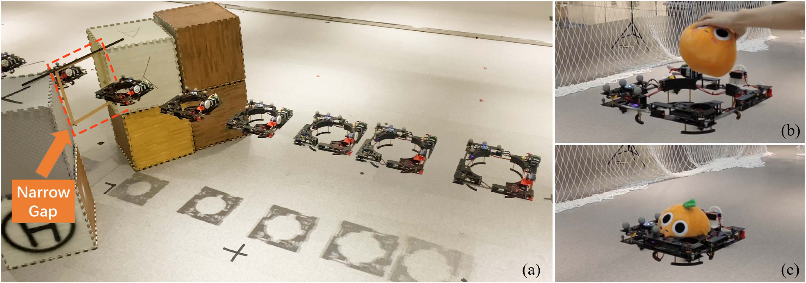

**图 1**：(a) 长曝光照片显示，新型可伸缩环形四旋翼 Ring-Rotor 正在变形并通过狭窄缝隙。(b)–(c) 环形四旋翼在没有额外机械臂的情况下收缩并抓取玩偶。

因此，我们采用一种能够实时更新状态方程动态参数并自适应优化输入的 NMPC 控制器。实验表明，所提出的方法更适合 Ring-Rotor。

本文的贡献总结如下：

1. 一种新型可伸缩环形四旋翼，仅使用一个执行器即可在长度和宽度两个维度上动态调整物理尺寸。
2. 一种新型一体化全身空中运输策略，无需增加外部机械臂即可抓取和装载多种形状的物体。
3. 一种非线性模型预测控制框架，能够适应飞行器时变的动力学参数，在变形过程中实现可靠的飞行性能。

### II. 相关工作

#### A. 变结构飞行器

为了提高飞行器的环境适应性，研究者提出了一些基于改变飞行器拓扑结构的设计。Sakaguchi 等人 [6] 开发了一种采用平行连杆机构的四旋翼。平行连杆的变形可以使机架倾斜并缩小尺寸；Zheng 等人 [17] 也开展了类似研究。Zhao 等人 [1] 提出了一种基于剪刀状可折叠结构、用于调整尺寸的新型四旋翼。Zhao 等人 [5]、[12] 研究了两代变结构多旋翼飞行器。第二代 DRAGON 基于成对的旋翼模块，四个模块通过两自由度云台连接。该飞行器能够通过多自由度空中变形穿过狭窄缝隙。上述设计扩展了空中机器人的应用，但也增加了机器人的机械复杂度和重量。

动态改变四旋翼尺寸的另一种策略是改变机臂的角度或长度。Bucki 等人 [13] 设计了一种采用被动旋转关节实现空中变形的四旋翼。推力足够大时机臂展开，推力较低时机臂折叠。Desbiez 等人 [3] 开发了一种带有旋转机臂的变结构四旋翼。该四旋翼由两个可旋转机臂组成，执行器可以主动改变机臂角度，以缩短四旋翼的尺寸。Riviere 等人 [4] 提出了一种基于弹性变形的新型四旋翼，利用两个伺服旋转模块减小一个维度的尺寸。Falanga 等人 [2] 设计了一种带有可折叠机构的四旋翼，可通过调整四个机臂的角度改变自身尺寸；Patnaik 等人 [7] 则研究了另一种带有被动可折叠机臂的四旋翼。上述设计具有创新性和实用性，但我们仍可以进一步改进机械结构，例如减少执行器数量，同时实现更多维度的尺寸缩减，从而增强空中机器人的适用性。

#### B. 飞行器抓取

目前已经提出了一些飞行器抓取方法。第一种策略是增加额外的抓取机构。一些方法 [8]、[9]、[11] 致力于在飞行器上搭载机械臂机构，以抓取物体并完成更多空中操作，从而拓展飞行器的应用领域。然而，这些设计增加了飞行器的重量，并且需要考虑机械臂产生的外部力矩的影响。Hingston 等人 [10] 提出了两种可重构抓取机构，可用于空中抓取，有助于实现飞行器抓取。

第二种策略是利用飞行器自身的机身机构进行抓取。Zhao 等人 [12] 利用可变形空中机器人的全身设计了一种空中机械操作系统。Bucki 等人 [13] 设计了一种无需任何执行器、能够搬运轻量物体的四旋翼，但被动弹簧变形产生的抓取力可能有限。Gabrich 等人 [18] 提出了一种能够抓取和运输物体的新型飞行模块化平台。该平台由四个协同工作的相同模块组成，这些模块能够独立飞行，并通过匹配彼此的垂直边缘实现物理连接，形成铰链。Gioioso 等人 [19] 也使用一群能够抓取物体的无人机，其中每架无人机通过工具尖端的单一接触点为抓取任务作出贡献。与上述设计相比，我们可以用更简单的机械结构和控制器实现抓取动作。

### III. 机械设计

本节介绍所提出四旋翼的机械设计。我们采用四个电机作为 Ring-Rotor 的推力生成旋翼—螺旋桨组，并配备一个伺服电机作为被动环形可伸缩机构的执行器，以构建一体化可变形四旋翼平台。因此，该飞行器能够自适应地动态调整长度和宽度。

---

## 原文第 3 页

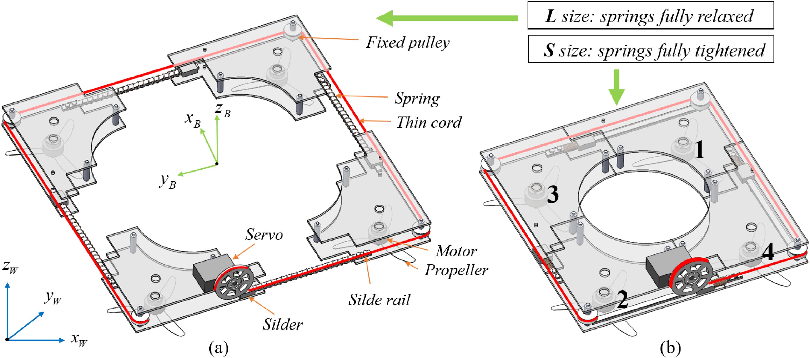

**图 2**：Ring-Rotor 机械设计的原理图。

Ring-Rotor 由四个尺寸和形状相同的结构模块组成，相邻模块由轻质弹簧、滑块和滑轨组成的被动可伸缩机构连接，如图 2(a) 所示。每个模块的端部边缘均装有一个轻质定滑轮，一条细尼龙绳沿定滑轮凹槽的方向缠绕。当伺服电机拉动绳索使其收缩时，弹簧在绳索拉力作用下被压缩，使整体机身尺寸减小。由于绳索各处的张力相等，连接各模块的弹簧在相同作用力下会收缩相同长度。这意味着相邻模块之间的距离会同步减小，因此 Ring-Rotor 在水平面内的几何形状始终大致保持为正方形，如图 2(b) 所示。当弹簧自然伸展时，Ring-Rotor 保持 41.4 × 41.4 cm 的最大尺寸（标记为 L 尺寸）。此时，伺服电机几乎不消耗维持 Ring-Rotor 形状所需的能量。当弹簧完全收缩时，Ring-Rotor 缩小 31.4%，达到 28.4 × 28.4 cm 的最小尺寸（标记为 S 尺寸）。

如图 2(b) 所示，Ring-Rotor 的中心设计有全身抓取结构，无需额外机械臂。此外，可伸缩抓取区域的几何形状近似圆形，能够适应不同尺寸、形状和轮廓的物体，显著提高四旋翼平台的承载能力。

### IV. 动力学与控制

本文用粗体小写字母表示向量（例如 \(\boldsymbol v\)），用粗体大写字母表示矩阵（例如 \(\boldsymbol J\)）；除此之外的符号均为标量。如图 2 所示，我们使用带有标准正交基 \(\{\boldsymbol x^W,\boldsymbol y^W,\boldsymbol z^W\}\) 的世界坐标系 \(W\)，其中 \(\boldsymbol z^W\) 指向与重力相反的上方。机身坐标系 \(B\) 定义在四旋翼的几何中心，具有标准正交基 \(\{\boldsymbol x^B,\boldsymbol y^B,\boldsymbol z^B\}\)。设 \(\boldsymbol p^W=(p_x,p_y,p_z)^T\)、\(\boldsymbol q^W=(q_x,q_w,q_y,q_z)^T\) 和 \(\boldsymbol v^W=(v_x,v_y,v_z)^T\) 分别表示四旋翼在世界坐标系中的位置、姿态和线速度。此外，设 \(\boldsymbol\omega^B=(\omega_x,\omega_y,\omega_z)^T\) 为在机身坐标系中表示的角速度。

#### A. 惯性张量

如第 III 节所述，惯性张量会随变形而改变。四旋翼由四个电机、一个伺服电机、一块主控板、一块电池和四个结构模块组成。假设被抓取物体的质量和惯性张量分别为 \(m_{ext}\) 和 \(\boldsymbol J_{ext}\)，四旋翼的几何中心为原点，则飞行器的重心为：

$$
\boldsymbol r_{COG}=\frac{\boldsymbol A}{m_{bat}+m_{ser}+m_{boa}+m_{ext}+\sum_{i=1}^{4}(m_{modi}+m_{moti})}. \tag{1}
$$

$$
\boldsymbol A=\sum_{i=1}^{4}(m_{modi}\boldsymbol r_{modi}+m_{moti}\boldsymbol r_{moti})+m_{ser}\boldsymbol r_{ser}+m_{bat}\boldsymbol r_{bat}+m_{boa}\boldsymbol r_{boa}+m_{ext}\boldsymbol r_{ext}. \tag{2}
$$

下面计算飞行器相对于其重心的惯性张量 \(\boldsymbol J\)。假设电机为圆柱体，半径和高度分别为 \(r_{mot}\) 和 \(h_{mot}\)；电池为长方体，长度、宽度和高度分别为 \(l_{bat}\)、\(w_{bat}\) 和 \(h_{bat}\)。则：

$$
\boldsymbol J^o_{mot}=\frac{m_{mot}}{12}\operatorname{diag}\left(3r_{mot}^{2}+h_{mot}^{2},\;3r_{mot}^{2}+h_{mot}^{2},\;6r_{mot}^{2}\right),
$$

$$
\boldsymbol J^o_{bat}=\frac{m_{bat}}{12}\operatorname{diag}\left(w_{bat}^{2}+h_{bat}^{2},\;h_{bat}^{2}+l_{bat}^{2},\;w_{bat}^{2}+l_{bat}^{2}\right). \tag{3}
$$

伺服电机的 \(\boldsymbol J^o_{ser}\) 和主控板的 \(\boldsymbol J^o_{boa}\) 可以像电池一样求得。各模块形状不规则，可以先将其补全为长方体，以计算整体惯性张量；然后减去增加的惯性张量，得到模块的真实惯性张量：

---

## 原文第 4 页

$$
\begin{aligned}
\boldsymbol J^o_{mod}={}&\boldsymbol J'_{mod}-m'_{mod}[\boldsymbol r_{mod}]_\times^2\\
&+\left(\boldsymbol J_{cuboid1}-m_{cuboid1}[\boldsymbol r_{cuboid1}-\boldsymbol r_{mod}]_\times^2\right)\\
&-\left(\boldsymbol J_{cuboid2}-m_{cuboid2}[\boldsymbol r_{cuboid2}-\boldsymbol r_{mod}]_\times^2\right).
\end{aligned}\tag{4}
$$

其中 \([\cdot]_\times\) 表示斜对称矩阵。

由于各模块的安装角度不同，其惯性张量也不同。框架 \(i\) 的最终惯性张量为：

$$
\boldsymbol J^o_{modi}=\boldsymbol R_z(\theta_i)\boldsymbol J^o_{mod}\boldsymbol R_z(\theta_i)^T,\qquad \theta_i=\frac{(i-1)\pi}{2},\quad i=1,2,3,4. \tag{5}
$$

飞行器的惯性张量 \(\boldsymbol J\) 如下：

$$
\begin{aligned}
\boldsymbol J={}&\sum_{i=1}^{4}\left(\boldsymbol J^o_{modi}-m_{modi}[\boldsymbol r_{modi}-\boldsymbol r_{COG}]_\times^2+\boldsymbol J^o_{moti}-m_{moti}[\boldsymbol r_{moti}-\boldsymbol r_{COG}]_\times^2\right)\\
&+\boldsymbol J^o_{bat}-m_{bat}[\boldsymbol r_{bat}-\boldsymbol r_{COG}]_\times^2\\
&+\boldsymbol J^o_{ser}-m_{ser}[\boldsymbol r_{ser}-\boldsymbol r_{COG}]_\times^2\\
&+\boldsymbol J^o_{boa}-m_{boa}[\boldsymbol r_{boa}-\boldsymbol r_{COG}]_\times^2+\boldsymbol J_{ext}.
\end{aligned}\tag{6}
$$

#### B. 动力学模型

四旋翼模型采用六自由度（6-DoF）刚体运动学和动力学方程建立。对于平移动力学，有：

$$
\dot{\boldsymbol p}^{W}=\boldsymbol v^{W},\qquad \dot{\boldsymbol v}^{W}=\frac{T\boldsymbol z^{B}+\boldsymbol f_{ext}}{m}+\boldsymbol g. \tag{7}
$$

其中，\(T\) 和 \(m\) 分别为总推力和总质量；\(\boldsymbol z^{B}\) 是用世界坐标系表示的机身坐标系 Z 轴；\(\boldsymbol g=[0,0,-g]^T\) 是重力向量；\(\boldsymbol f_{ext}\) 表示外部气动阻力。

旋转运动学和动力学方程表示为：

$$
\dot{\boldsymbol q}^{W}=\frac{1}{2}\begin{bmatrix}0\\\boldsymbol\omega^{B}\end{bmatrix}_{\times}\boldsymbol q^{W},\qquad \dot{\boldsymbol\omega}^{B}=\boldsymbol J^{-1}\left(\boldsymbol\tau-\boldsymbol\omega^{B}\times\boldsymbol J\boldsymbol\omega^{B}+\boldsymbol\tau_{ext}\right). \tag{8}
$$

其中 \([\cdot]_\times\) 是斜对称矩阵；\(\boldsymbol\tau\) 和 \(\boldsymbol J\) 分别为总扭矩和惯性张量矩阵；\(\boldsymbol\tau_{ext}\) 表示机身扭矩上的模型不确定性。

设 \(k_t\)、\(k_c\) 分别为第 \(j\) 个电机的推力系数和扭矩系数。\(\Omega_j\) 和 \(\boldsymbol l_j=[l_{xj},l_{yj},l_{zj}]^T\) 分别为第 \(j\) 个电机的转速及其在机身坐标系中的位置。执行器产生的总推力 \(T\) 和总扭矩 \(\boldsymbol\tau\) 表示为：

$$
\begin{bmatrix}T\\\boldsymbol\tau\end{bmatrix}=\boldsymbol H_k\boldsymbol t. \tag{9}
$$

其中，\(\boldsymbol t=[k_t\Omega_1^2,k_t\Omega_2^2,k_t\Omega_3^2,k_t\Omega_4^2]^T\) 表示各旋翼产生的推力；\(\boldsymbol H_k\) 是四旋翼变形过程中的时变控制分配矩阵。假设此时重心为 \(\boldsymbol r_{COG}=(r_x,r_y,r_z)\)，则 \(\boldsymbol H_k\) 为：

$$
\boldsymbol H_k=\begin{bmatrix}
1&1&1&1\\
r_y+l_{y1}&r_y+l_{y2}&r_y+l_{y3}&r_y+l_{y4}\\
r_x-l_{x1}&r_x-l_{x2}&r_x-l_{x3}&r_x-l_{x4}\\
k_c/k_t&k_c/k_t&k_c/k_t&k_c/k_t
\end{bmatrix}. \tag{10}
$$

#### C. NMPC 控制器

第 IV-B 节中的四旋翼动力学方程 (7)–(8) 是非线性的，给控制器设计带来了复杂性。以往一些方法忽略动力学系统中的非线性部分，通过线性化简化非线性动力学方程。带前馈的级联 PID 方法 [14]、[15] 被用于设计四旋翼的姿态控制器和位置控制器。但对于变结构飞行器，带有恒定 PID 参数的级联控制器在动态变形过程中表现不佳。尽管 Faessler 等人 [16] 采用线性二次型调节器（LQR）作为角速率控制器来适应飞行性能，但该方法仍基于小角度假设，且无法很好地处理电机饱和问题。

受 [20] 启发，本文为 Ring-Rotor 采用非线性模型预测控制。四旋翼被视为一个完全非线性的动力学系统，并综合考虑每个旋翼的推力限制和气动效应。NMPC 算法求解四旋翼的完整非线性模型，而不依赖级联结构或线性假设。

我们考虑四旋翼的状态 \(\boldsymbol x\) 和推力输入 \(\boldsymbol u=\boldsymbol t\)：

$$
\boldsymbol x=\begin{bmatrix}(\boldsymbol p^W)^T&(\boldsymbol v^W)^T&(\boldsymbol q^W)^T&(\boldsymbol\omega^B)^T\end{bmatrix}^T.
$$

于是，四旋翼的离散动力学 \(\boldsymbol x_{k+1}=f(\boldsymbol x_k,\boldsymbol u_k)\) 可以通过对方程 (7)–(8) 离散化得到。

NMPC 在大小为 \([t,t+h]\) 的时间范围内，以 \(dt=h/N\) 为间隔将状态和输入划分为 \(N\) 个相等区间，其中 \(h\) 表示预测时域长度。随后，NMPC 将状态误差和输入误差作为代价，并将系统动力学约束和输入范围作为约束条件，用于求解最优控制输入序列：

$$
\begin{aligned}
\boldsymbol u_{des}=\arg\min_{\boldsymbol u}\;&\sum_{i=0}^{N-1}\left((\boldsymbol x_i-\boldsymbol x_{i,r})^TQ(\boldsymbol x_i-\boldsymbol x_{i,r})+(\boldsymbol u_i-\boldsymbol u_{i,r})^TR(\boldsymbol u_i-\boldsymbol u_{i,r})\right)\\
&+(\boldsymbol x_N-\boldsymbol x_{N,r})^TQ_N(\boldsymbol x_N-\boldsymbol x_{N,r}),\\
\text{s.t. }&\boldsymbol x_{k+1}=f(\boldsymbol x_k,\boldsymbol u_k),\quad \boldsymbol x_0=\boldsymbol x_{now},\\
&\boldsymbol u\in[\boldsymbol u_{min},\boldsymbol u_{max}].
\end{aligned}\tag{11}
$$

其中，\(i\) 是当前时间步；\(\boldsymbol x_{i,r}\) 和 \(\boldsymbol x_{N,r}\) 是参考状态向量；\(\boldsymbol u_{i,r}\) 是参考输入向量；\(Q=\operatorname{diag}(Q_p,Q_v,Q_q,Q_\omega)\)、\(Q_N\) 和 \(R\) 是正定权重矩阵；\(\boldsymbol u_{min}\) 和 \(\boldsymbol u_{max}\) 是电机提供的最小和最大推力值，以确保所需推力输入处于合理范围内。

---

## 原文第 5 页

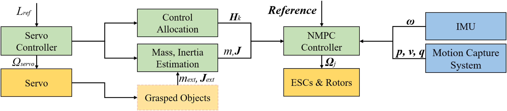

**图 3**：Ring-Rotor 用于变形或抓取物体的控制框架示意图。

**表 I　Ring-Rotor 的初始配置**

| 参数 | 数值 |
|---|---:|
| \(mass\,[kg]\) | 1.665 |
| \(\max(J_{xx},J_{yy},J_{zz})\,[kg\cdot m^2]\) | (0.0380, 0.0459, 0.0823) |
| \(\min(J_{xx},J_{yy},J_{zz})\,[kg\cdot m^2]\) | (0.0144, 0.0188, 0.0317) |
| \(k_t\,[N\cdot s^2]\) | \(7.19544\times10^{-9}\) |
| \(k_c\,[N\cdot m\cdot s^2]\) | \(1.07932\times10^{-10}\) |
| \(\boldsymbol r_{COG}\,[m]\) | (-0.027, -0.009, 0.000) |
| \(S\ size,\ L\ size\,[m]\) | 0.284, 0.414 |

为避免使用欧拉角造成奇异性问题，我们使用四元数计算姿态误差：

$$
\boldsymbol q-\boldsymbol q_r=\Phi(\boldsymbol q^{-1})\cdot\boldsymbol q_r. \tag{12}
$$

我们采用带有 qpOASES [22] 的 ACADO [21] 工具包作为该非线性算法的求解器。这一非线性二次优化问题可以通过实时迭代方案求解。

#### D. 伺服控制器

伺服系统可以近似为具有时间常数 \(\sigma\) 的一阶系统。我们设计如下比例控制器：

$$
\Omega_{servo}=\frac{1}{\sigma}(L_{ref}-L). \tag{13}
$$

其中，\(L_{ref}\) 是期望的飞行器长度，\(L\) 是当前飞行器长度，\(\Omega_{servo}\) 是伺服电机的期望转速。

### V. 实验

#### A. Ring-Rotor 平台

如图 4 所示，Ring-Rotor 平台可分为飞行模块、变形模块和运动规划控制模块。

飞行模块的驱动器主要由 4 个 T-Motor F2203.5 KV2850 无刷电机构成。电机驱动 GEMFAN 4023-3 螺旋桨旋转，能够提供最大 25.97 N 的总推力。飞控采用 Kakute H7 飞行控制器，具有良好的计算性能。电调采用 Tekko32 F4 Metal 4 合 1 电调，允许的最大电流为 65 A。电源为一块 1300mAh、6S、22.2 V、130 C 的锂电池，130 C 的放电倍率能够提供更高的瞬时功率。Ring-Rotor 的主要支撑板为 3 mm 和 1 mm 的碳纤维板。

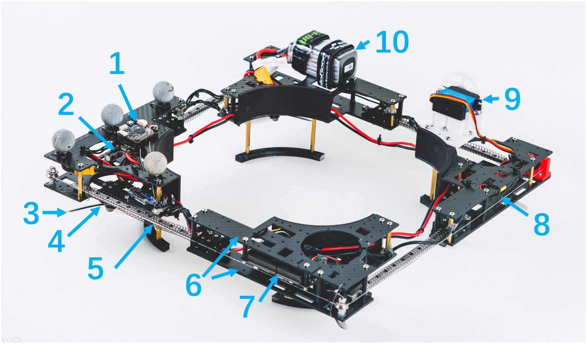

**图 4**：Ring-Rotor 平台的详细组成。编号分别代表：(1) 飞控；(2) 电调；(3) 螺旋桨；(4) 电机；(5) 弹簧；(6) 碳纤维板；(7) 机载电脑；(8) 伺服控制板；(9) 伺服电机；(10) 电池。

变形模块的驱动器是 DS3230 数字伺服电机，最大扭矩为 35 kg·cm；该电机驱动 3D 打印的尼龙转盘连续旋转。在伺服电机的牵引下，细绳拉动滑块沿滑轨移动，使四个尺寸为 0.7 × 11 × 180 mm 的弹簧发生变形。伺服电机的控制板为 Arduino nano，控制器频率为 400 Hz。此外，其他物理参数见表 I。

运动规划控制模块使用 Jetson Xavier NX 作为机载电脑。飞行器的控制图如图 3 所示。频率为 100 Hz 的 NMPC 控制器订阅多项式轨迹的参考状态以及来自 IMU 和动作捕捉系统的状态反馈，以求解控制器的最优控制输入；这些输入随后被转换为电机转速值并发送至电调。

**续航时间：**我们使用 1300mAh、6S、22.2 V、130 C 的锂电池，测试 Ring-Rotor 在 L 尺寸和 S 尺寸下悬停飞行的续航时间。实验表明，L 尺寸的平均续航时间为 126.39 s，而 S 尺寸为 113.69 s。造成差异的原因包括：Ring-Rotor 处于 S 尺寸时，伺服电机需要提供外部动力来压缩弹簧，而处于 L 尺寸时无需提供任何扭矩；处于 S 尺寸时，相邻模块之间的间隙显著减小，阻挡了固定在模块下方的电机—螺旋桨组的部分进气气流，从而造成能量损失。

#### B. 控制器验证

我们进行了在变形过程中飞行 8 字形轨迹的动态运动控制测试，以验证所提出 NMPC 控制器的有效性。

---

## 原文第 6 页

**表 II　PID、LQR 和 NMPC 控制器的参数**

| NMPC 参数 | NMPC 数值 | PID 参数 | PID 数值 |
|---|---|---|---|
| \(Q_p\) | \(\operatorname{diag}(200,200,200)\) | \(K_p\) | \(\operatorname{diag}(2.0,2.0,2.0)\) |
| \(Q_v\) | \(\operatorname{diag}(1,1,1)\) | \(K_v\) | \(\operatorname{diag}(2.2,2.2,2.2)\) |
| \(Q_q\) | \(\operatorname{diag}(100,100,100)\) | \(K_R\) | \(\operatorname{diag}(0.25,0.25,0.25)\) |
| \(Q_\omega\) | \(\operatorname{diag}(1,1,1)\) | \(K_\omega\) | \(\operatorname{diag}(0.23,0.23,0.23)\) |
| \(R\) | \(\operatorname{diag}(1,1,1)\) | LQR |  |
| \(dt\) | 50 ms | \(Q\) | \(\operatorname{diag}(10,10,\ldots,10)\) |
| \(N\) | 20 | \(R\) | \(\operatorname{diag}(1,1,1)\) |

**表 III　PID、LQR 和所提出控制器的误差**

| \(v_{max}\) [m/s] | 平均误差：PID [14] [m] | 平均误差：LQR [16] [m] | 平均误差：所提出控制器 [m] | 最大误差：PID [14] [m] | 最大误差：LQR [16] [m] | 最大误差：所提出控制器 [m] |
|---:|---:|---:|---:|---:|---:|---:|
| 1.5 | 0.0759 | 0.0665 | **0.0561** | 0.1549 | 0.1365 | **0.1297** |
| 2.0 | 0.1131 | 0.0865 | **0.0754** | 0.2361 | 0.1902 | **0.1682** |
| 2.5 | 0.1422 | 0.1214 | **0.0963** | 0.3641 | 0.2902 | **0.2103** |

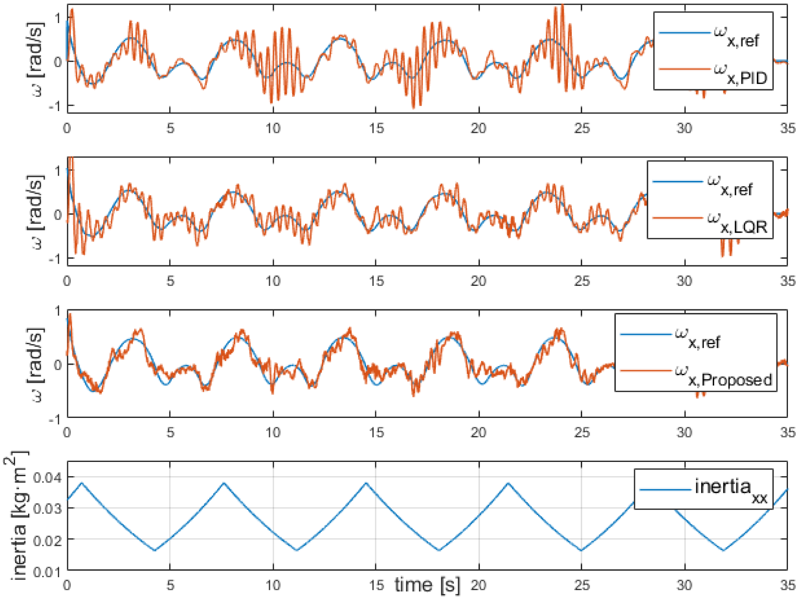

**图 5**：持续变形的同时，以 2.5 m/s 的最大速度跟踪 8 字形轨迹的基准测试。

我们还将所提出的控制器与 PID [14] 和 LQR [16] 控制器进行了比较，各控制器的参数如表 II 所示。

如表 III 的跟踪误差（RMSE）比较和图 5 的跟踪轨迹所示，LQR 和所提出控制器的跟踪误差均小于 PID 控制器。主要原因是变形过程中惯性张量的变化会导致角速度跟踪误差，如图 7 所示。例如，S 尺寸下的 \(J_{xx}\) 比 L 尺寸下小 62.1%，角加速度也会根据方程 (8) 发生变化。尽管 PID 控制律对与惯性张量相关的项进行了调整，但随着惯性张量逐渐减小，具有恒定 \(K_R\)、\(K_\omega\) 增益的 PID 控制器会使角速度发生振荡。由于姿态控制与位置控制相互耦合，位置跟踪误差会进一步增大。基于模型的最优控制器（例如 LQR 和所提出的控制器）可以根据惯性张量自适应地调整控制输入，因此角速度跟踪性能更好。

此外，所提出的控制器能够处理电机饱和问题，这一问题可能在尺寸缩小导致高加速度或电机力矩臂变小时出现。图 6 显示，当 Ring-Rotor 以 2.5 m/s 的最大速度跟踪 8 字形轨迹时，第四个电机的推力 \(t_4\) 达到 6.5 N 的上限。

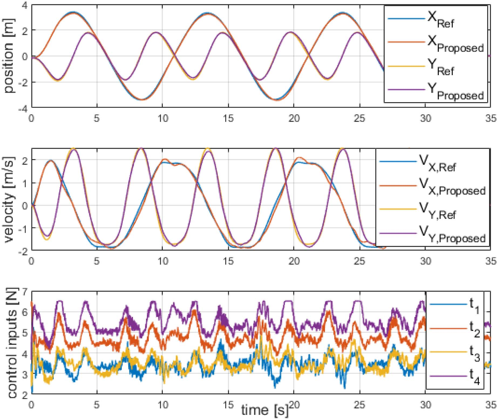

**图 6**：由 NMPC 控制器计算的参考跟踪图和实时控制输入。

**图 7**：随着惯性张量变化，PID、LQR 和所提出控制器的角速度跟踪结果。

由于 LQR 和 PID 控制器不能有效处理电机饱和，因此如表 III 所示，它们在 \(v_{max}=2.5\) m/s 时具有更大的跟踪误差。

总之，在上述控制器中，所提出的控制器最适合 Ring-Rotor。随着模型参数估计精度提高，预计总体误差也会按比例降低。

#### C. 穿越狭窄空间

Ring-Rotor 相较于普通四旋翼的一个优势是能够通过变形调整尺寸，以适应不同环境。我们设置了水平缝隙和垂直洞口等场景进行实验，以验证 Ring-Rotor 的环境适应性。

1. **水平穿越缝隙：**如图 8 所示，飞行器初始宽度为 41.4 cm，水平缝隙宽度为 40 cm。由于缝隙小于飞行器宽度，飞行器无法直接通过。Wang 等人 [23] 提出了一种基于 SE(3) 的规划方法来处理这一问题，但该方法需要很大的加速和减速空间，在狭窄环境中尤其难以实现。

然而，飞行器可以主动收缩到 30.0 cm 的宽度，无需加速或减速即可通过缝隙。

---

## 原文第 7 页

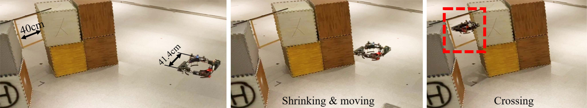

**图 8**：飞行器水平通过缝隙。

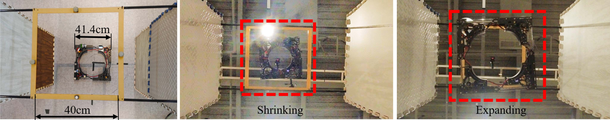

**图 9**：飞行器垂直通过狭窄洞口。

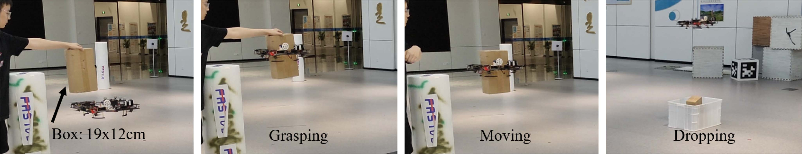

**图 10**：飞行器自主抓取目标物体并将其运输到目标位置。

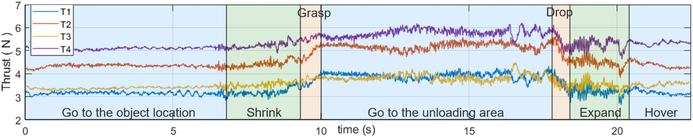

**图 11**：抓取和运输物体阶段四个电机的推力曲线。

图 8 展示了飞行器通过缝隙的瞬间。

2. **垂直通过洞口：**Ring-Rotor 可以同时减小长度和宽度。图 9 展示了一个 40 × 40 cm 的矩形框架，用于模拟水平洞口。Ring-Rotor 初始时处于 L 尺寸。飞行器可以收缩到 S 尺寸并垂直通过洞口。图 9 显示，飞行器平稳地飞过垂直洞口，然后再次展开至最大尺寸。

#### D. 抓取与运输

Ring-Rotor 具有一种环形机械机构，用于抓取各种形状的物体并将其运输到目标位置。我们设置实验来验证抓取和运输功能。被抓取物体的 \(\boldsymbol\tau_{ext}\) 和 \(\boldsymbol J_{ext}\) 预先已知。

1. **抓取：**我们模拟快递运输应用场景，如图 10 所示。将待抓取物体（尺寸为 19 × 12 × 35 cm 的快递箱）放置在固定位置。飞行器规划一条可通过的轨迹飞到箱子下方，并垂直向上移动，使快递箱保持在抓取区域中心。到达合适的抓取位置后，飞行器开始收缩，直到抓取区域完全抓住快递箱；此时飞行器总质量增加。NMPC 控制器实时更新状态方程中的总质量，并计算期望的总推力。从图 11 的推力曲线可以看出，四个电机的推力显著增加，最终达到新的稳态。

---

## 原文第 8 页

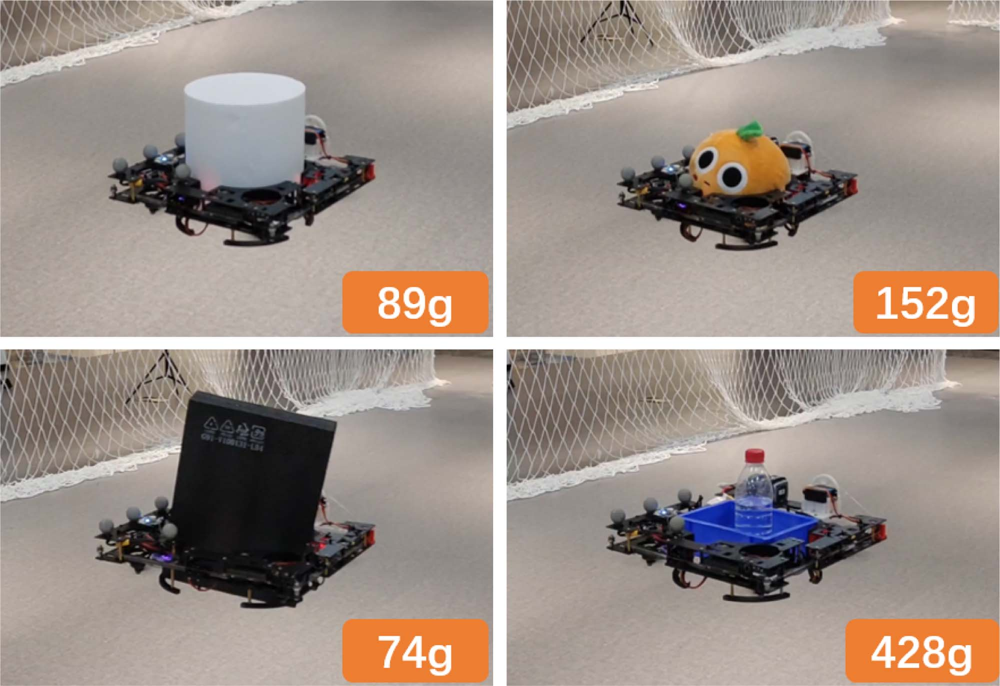

**图 12**：Ring-Rotor 抓取各种形状的物体。

2. **运输：**抓取物体后，飞行器以新的物理参数开始向卸货区飞行。到达最终目标位置后，飞行器在存放快递箱的区域上方悬停。如图 11 所示，当抓取区域扩展到比箱子更大的尺寸时，物体开始落入卸货区。飞行器总质量减小，各电机的推力逐渐降低到抓取物体前的数值，最终形成新的稳定状态。

此外，如图 12 所示，Ring-Rotor 还能够在飞行中抓取不同形状和重量的物体，包括长方体盒子、圆柱体、条状物、椭球体等。此外，我们还可以使用装满物体的容器来运输任何尺寸和形状合适的物体，从而在现实世界中实现广泛的抓取与运输。

### VI. 结论

本文提出了一种能够同时动态调整长度和宽度的新型可伸缩环形四旋翼，提高了四旋翼的环境适应性。该飞行器创新了四旋翼的机械设计，并扩展了中心空余空间，可在没有外部机械臂的情况下抓取和运输各种形状的物体。此外，我们提出了一种基于时变动力学模型的 NMPC 控制器，以实现动态变形过程中的飞行控制。实验表明，所提出的控制器能够处理惯性张量变化和电机饱和问题，从而减小跟踪误差。

未来，我们首先将迭代升级 Ring-Rotor 的数字伺服电机，以实现更快速的收缩和释放。其次，所提出的 NMPC 控制器将考虑未来的变形状态（惯性和电机力矩臂），以减小跟踪误差。第三，我们将估计被抓取物体的参数，以自适应地抓取未知物体。此外，我们将在物体信息估计不准确的场景下验证算法的鲁棒性。最后，中心的可伸缩空间可用于在各种场景中实现自主栖息。

## 参考文献

[1] N. Zhao, Y. Luo, H. Deng, Y. Shen, and H. Xu, “The deformable quadrotor enabled and wasp-pedal-carrying inspired aerial gripper,” in Proc. IEEE/RSJ Int. Conf. Intell. Robots Syst., 2018, pp. 1–9.

[2] D. Falanga, K. Kleber, S. Mintchev, D. Floreano, and D. Scaramuzza, “The foldable drone: A morphing quadrotor that can squeeze and fly,” IEEE Robot. Automat. Lett., vol. 4, no. 2, pp. 209–216, Apr. 2019.

[3] A. Desbiez, F. Expert, M. Boyron, J. Diperi, S. Viollet, and F. Ruffier, “X-Morf: A crash-separable quadrotor that morfs its X-geometry in flight,” in Proc. Workshop Res., Educ. Develop. Unmanned Aerial Syst., 2017, pp. 222–227.

[4] V. Riviere, A. Manecy, and S. Viollet, “Agile robotic fliers: A morphing-based approach,” Soft Robot., vol. 5, no. 5, pp. 541–553, 2018.

[5] M. Zhao, T. Anzai, F. Shi, X. Chen, K. Okada, and M. Inaba, “Design, modeling, and control of an aerial robot dragon: A dual-rotor-embedded multilink robot with the ability of multi-degree-of-freedom aerial transformation,” IEEE Robot. Automat. Lett., vol. 3, no. 2, pp. 1176–1183, Apr. 2018.

[6] A. Sakaguchi and K. Yamamoto, “A novel quadrotor with a 3-axis deformable frame using tilting motions of parallel link modules without thrust loss,” IEEE Robot. Automat. Lett., vol. 7, no. 4, pp. 9581–9588, Oct. 2022.

[7] K. Patnaik, S. Mishra, S. M. R. Sorkhabadi, and W. Zhang, “Design and control of SQUEEZE: A spring-augmented quadrotor for interactions with the environment to squeeZE-and-fly,” in Proc. IEEE/RSJ Int. Conf. Intell. Robots Syst., 2020, pp. 1364–1370.

[8] K. Kondak et al., “Aerial manipulation robot composed of an autonomous helicopter and a 7 degrees of freedom industrial manipulator,” in Proc. IEEE Int. Conf. Robot. Automat., 2014, pp. 2107–2112.

[9] D. Mellinger, Q. Lindsey, M. Shomin, and V. Kumar, “Design, modeling, estimation and control for aerial grasping and manipulation,” in Proc. IEEE/RSJ Int. Conf. Intell. Robots Syst., 2011, pp. 2668–2673.

[10] L. Hingston, J. Mace, J. Buzzatto, and M. Liarokapis, “Reconfigurable, adaptive, lightweight grasping mechanisms for aerial robotic platforms,” in Proc. IEEE Int. Symp. Saf., Secur., Rescue Robot., 2020, pp. 169–175.

[11] F. Ruggiero, V. Lippiello, and A. Ollero, “Aerial manipulation: A literature review,” IEEE Robot. Automat. Lett., vol. 3, no. 3, pp. 1957–1964, Jul. 2018.

[12] M. Zhao, K. Kawasaki, X. Chen, S. Noda, K. Okada, and M. Inaba, “Whole-body aerial manipulation by transformable multirotor with two-dimensional multilinks,” in Proc. IEEE Int. Conf. Robot. Automat., 2017, pp. 5175–5182.

[13] N. Bucki, J. Tang, and M. W. Mueller, “Design and control of a midair reconfigurable quadcopter using unactuated hinges,” IEEE Trans. Robot., vol. 39, no. 1, pp. 539–557, Feb. 2023.

[14] T. Lee, M. Leok, and N. H. McClamroch, “Geometric tracking control of a quadrotor UAV on SE(3),” in Proc. IEEE 49th Conf. Decis. Control, 2010, pp. 5420–5425.

[15] D. Mellinger and V. Kumar, “Minimum snap trajectory generation and control for quadrotors,” in Proc. IEEE Int. Conf. Robot. Automat., 2011, pp. 2520–2525.

[16] M. Faessler, D. Falanga, and D. Scaramuzza, “Thrust mixing, saturation, and body-rate control for accurate aggressive quadrotor flight,” IEEE Robot. Automat. Lett., vol. 2, no. 2, pp. 476–482, Apr. 2017.

[17] P. Zheng, X. Tan, B. B. Kocer, E. Yang, and M. Kovac, “TiltDrone: A fully-actuated tilting quadrotor platform,” IEEE Robot. Automat. Lett., vol. 5, no. 4, pp. 6845–6852, Oct. 2020.

[18] B. Gabrich, D. Saldaña, V. Kumar, and M. Yim, “A flying gripper based on cuboid modular robots,” in Proc. IEEE Int. Conf. Robot. Automat., 2018, pp. 7024–7030.

[19] G. Gioioso, A. Franchi, G. Salvietti, S. Scheggi, and D. Prattichizzo, “The flying hand: A formation of UAVs for cooperative aerial tele-manipulation,” in Proc. IEEE Int. Conf. Robot. Automat., 2014, pp. 4335–4341.

[20] S. Sun, A. Romero, P. Foehn, E. Kaufmann, and D. Scaramuzza, “A comparative study of nonlinear MPC and differential-flatness-based control for quadrotor agile flight,” IEEE Trans. Robot., vol. 38, no. 6, pp. 3357–3373, Dec. 2022.

[21] R. Verschueren et al., “Towards a modular software package for embedded optimization,” IFAC-PapersOnLine, vol. 51, no. 20, pp. 374–380, 2018.

[22] H. J. Ferreau, C. Kirches, A. Potschka, H. G. Bock, and M. Diehl, “qpOASES: A parametric active-set algorithm for quadratic programming,” Math. Program. Comput., vol. 6, no. 4, pp. 327–363, 2014.

[23] Z. Wang, X. Zhou, C. Xu, and F. Gao, “Geometrically constrained trajectory optimization for multicopters,” IEEE Trans. Robot., vol. 38, no. 5, pp. 3259–3278, Oct. 2022.
