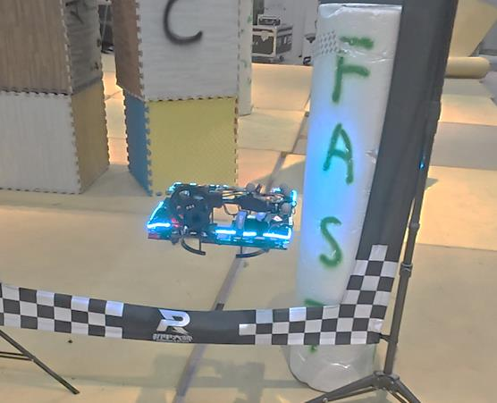
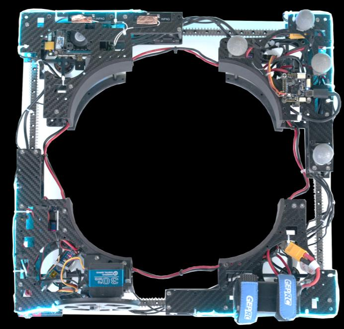
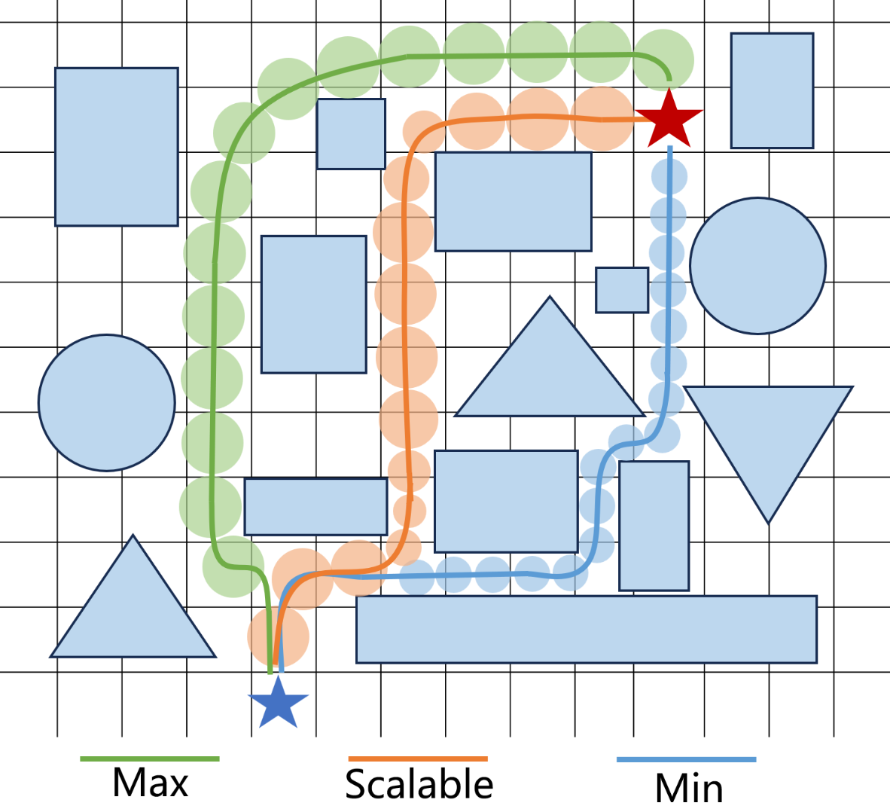
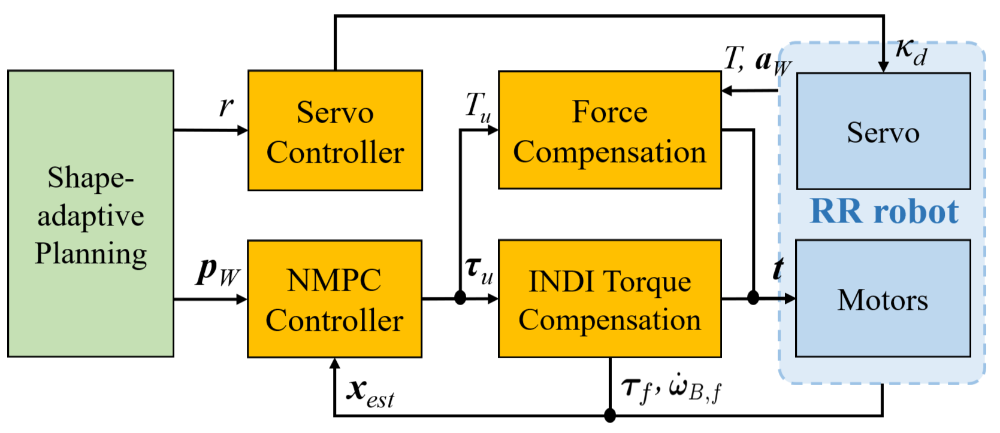
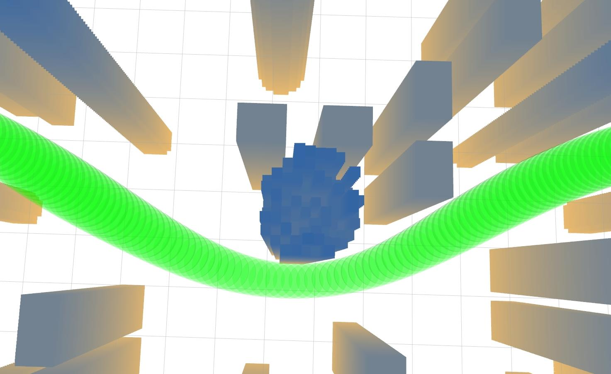
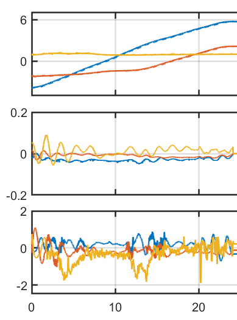
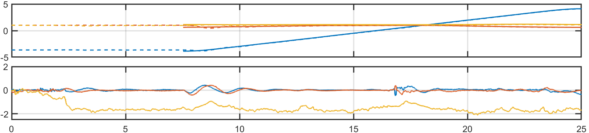
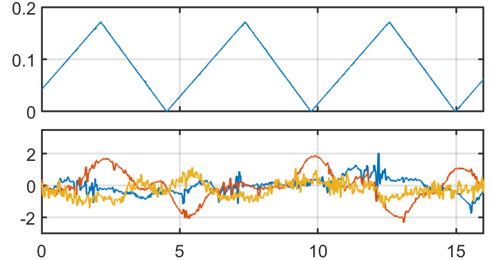

# 可变形四旋翼形状自适应规划与控制（20_Shape-Adaptive_Planning_and_Control_for_a_Deformable_Quadrotor）：完整忠实学术翻译

> **原文标题**：20_Shape-Adaptive_Planning_and_Control_for_a_Deformable_Quadrotor  
> **作者**：Yuze Wu、Zhichao Han、Xuankang Wu、Yuan Zhou、Junjie Wang、Zheng Fang、Fei Gao  
> **发表信息**：IEEE/RSJ IROS 2025，DOI 10.1109/IROS60139.2025.11245898  
> **原文 PDF**：[20_Shape-Adaptive_Planning_and_Control_for_a_Deformable_Quadrotor.pdf](../20_Shape-Adaptive_Planning_and_Control_for_a_Deformable_Quadrotor.pdf) ｜ **对应中文详解**：[20_可变形四旋翼形状自适应规划与控制.md](../中文详解/20_可变形四旋翼形状自适应规划与控制.md)

## 原文第 1 页核心内容与翻译

可变形四旋翼形状自适应规划与控制

Yuze Wu、Zhichao Han、Xuankang Wu、Yuan Zhou、Junjie Wang、Zheng Fang、Fei Gao

**图 1**：(a) 面向可变形穿越和全身抓取运输的形状自适应运动规划；(b) 自主变形穿越受限区域；(c) 自主抓取并运输物体穿过狭窄的十字形间隙。

**摘要**——无人机已经广泛应用于各种场景，但传统四旋翼在狭窄空间和复杂任务中受到固定尺寸的限制。能够实时改变形状的可变形无人机为解决这些问题提供了一种有前景的途径，同时还能提高机动能力，并支持抓取物体等新任务。本文提出一种面向可变形四旋翼的自主运动规划与控制方法。我们提出形状自适应轨迹规划器，将变形动力学纳入路径生成过程，并使用可扩展的动力学约束 A* 搜索处理复杂环境中的变形参数。后端时空优化能够生成包含形状变化的平滑最优轨迹。此外，我们提出一种增强型控制策略，用于补偿外力和力矩扰动；与先前工作相比，轨迹跟踪误差降低了 37.3%。仿真和实物实验验证了该方法在狭窄间隙穿越以及多种可变形任务中的有效性。

### 一、引言

无人机正越来越多地应用于各种场景，从动态航拍到复杂的隧道探测。然而，传统四旋翼的物理尺寸固定，因此存在固有局限。尺寸较大的无人机在狭窄空间中通常难以灵活机动，难以通过狭窄通道。相反，尺寸较小的无人机虽然更容易进入受限区域，却往往牺牲飞行续航和载荷能力，并且对风等外部扰动的抵抗能力较弱。

为克服这些局限，可变形无人机逐渐成为一种有前景的新方向[1]–[3]。这类平台具有主动变形能力，可以实时调整自身尺寸。这种动态适应性不仅显著提升了无人机在复杂、受限空间中的通行能力，也使传统无人机难以完成的任务成为可能，例如抓取和运输物体[1,4,5]，从而扩大了其在人机协作领域的应用范围，如室内物流。

在此前的工作[6]中，我们提出了一种轻量化可变形四旋翼硬件平台。该平台只使用一个执行器，就能实现两个自由度的变形，并通过实验验证了其抓取运输能力。不过，该平台本身缺少自主运动规划能力。因此，复杂操作仍需要人工遥控或预先编写的动作序列，这限制了它的自主应用，也带来了较大的人力成本。

传统运动规划算法并不适合直接用于可变形无人机。这些方法通常忽略形状变形带来的自由度，把机器人占据的空间近似为固定大小的球体[7,8]。这种简化会缩小可利用的解空间，并影响规划结果的最优性。在复杂的抓取运输任务中，传统方法还经常忽略被抓物体的形状及其对避障的影响，从而可能发生碰撞。

要实现可靠的轨迹跟踪，还需要稳定的控制器。但变形和抓取会改变系统动力学，载荷变化和未建模扰动也会降低控制性能。

针对上述问题，我们提出一种形状自适应运动规划器，按照分层框架，根据环境要求生成能够主动考虑形状变化的轨迹（图 1(b)）。前端采用可扩展的动力学约束 A* 路径搜索，将变形参数加入机器人状态空间，通过离散搜索从初始状态建立搜索树，最终得到包含形状变化的路径。随后，该路径作为后端轨迹优化模块的初始值。后端在笛卡尔空间和变形空间中采用紧凑的分段多项式表达，建立非线性优化问题，使轨迹在连续时空中平滑并稳定地收敛到较优解（图 1(a)）。这种表达方式具有统一性和可扩展性，可以自然地把被抓物体的体积纳入避障计算（图 1(c)）。

为提高变形过程中的轨迹跟踪精度，我们提出一种增强型控制策略。该策略以非线性模型预测控制器（NMPC）为基础，在推力控制器中加入实时外力估计和补偿，并结合增量非线性动态逆（INDI）算法抵消外部力矩扰动。实验表明，与此前工作[6]相比，该控制策略使轨迹跟踪误差降低了 37.3%。

本文的主要贡献如下：

1. 提出一种形状自适应轨迹规划器，对飞行轨迹和变形状态进行联合优化，适用于复杂、狭窄环境中的可变形四旋翼飞行。
2. 提出一种带有力和力矩补偿的增强型控制器，降低多种可变形任务中的跟踪误差。
3. 通过大量仿真和实物实验验证形状自适应运动规划和增强型控制方法的性能。

## 原文第 2 页核心内容与翻译

**图 2**：(a)–(b) 名为 RR 的变形四旋翼机械结构示意图。机器人利用一个电机和绳腱驱动系统，在最大尺寸和最小尺寸之间动态切换；(c) RR 硬件平台；(d) RR 能够利用机身完成物体抓取。

### 二、相关工作

#### A. 变形运动规划

传统运动规划器[9]通常采用基于梯度的方法生成可行轨迹，并经常使用球体或质点等简化机器人模型，因此得到的结果往往过于保守。近年来，也有研究在 SE(3) 中进行全形状避障规划[10,11]，使机器人能够在受限空间中进行激进机动，但这需要较大的控制能力。

相比之下，可变形无人机能够通过主动减小尺寸，以更自然、更高效的方式通过狭窄空间。不过，面向自主变形的运动规划研究在工程领域仍然不足。Bucki 等人[5]依靠弹道运动实现变形穿越，但其轨迹通常是预先设定的。Zhao 等人的“空中机器龙”[3]也采用了类似方法。Cui 等人[12]提出了基于矩形包络的变形无人机全形状轨迹规划框架，但没有在大规模、密集环境中验证。

从技术角度看，该方法缺少能够感知形状的前端模块。因此，优化所使用的拓扑结构来自人工指定或质点图搜索，轨迹本身容易偏离最优解。此外，该方法主要关注通过变形避开障碍物，却没有考虑不同形状对飞行动力学的影响，例如能量消耗，因此难以得到真正的综合最优结果。

#### B. 变形飞行控制

可变形无人机在变形过程中会遇到变形干扰、模型不匹配和外部扰动等控制问题，这些因素会降低轨迹跟踪性能。在穿越间隙等高精度跟踪任务中，这一问题更加突出。已有研究中，Falanga 等人[1]使用线性二次型调节器（LQR）进行变形飞行控制；Derrouaou 等人[13]和 Kim 等人[14]采用线性 PID 控制器完成飞行和抓取；Hu 等人[15]使用强化学习实现稳定悬停。但这些研究没有考虑空气动力学扰动。

为解决这一问题，Chen 等人[16]提出非线性扰动观测器，用于补偿内部耦合效应和外部扰动。本文在位置控制环中加入外力观测反馈机制，并在姿态控制环中引入 INDI 力矩补偿机制，从而主动补偿变形扰动、模型偏差和外部扰动。

## 原文第 3 页核心内容与翻译

### 三、动力学模型

在此前的工作中，我们提出了变形与抓取一体化的四旋翼 RR（图 2(c)）。该机器人采用环形结构，主要由四个彼此相邻连接的部件组成。基于这种串联结构，只需一个执行器和绳腱驱动机构，就可以同步改变相邻部件之间的距离，实现两个方向的尺寸收缩（图 2(a)–(b)）。此外，RR 具有新颖的全身空中抓取和运输能力，可以适应不同形状的物体（图 2(d)），可用于灾害救援、包裹配送等领域。

在本文中，我们对 RR 的机械结构进行了改进，以提高变形性能。现在其最大尺寸为 42.2×42.2 cm，最大可缩小 37.8%，最小尺寸为 26.2×26.2 cm。

随后，我们建立四旋翼的动力学模型。如图 2(a)所示，定义世界坐标系 {xW, yW, zW} 和机体坐标系 {xB, yB, zB}。令 pW=(px, py, pz)T、qW=(qx, qw, qy, qz)T 和 vW=(vx, vy, vz)T 分别表示在世界坐标系中表达的四旋翼位置、姿态和线速度；令 ωB=(ωx, ωy, ωz)T 表示在机体坐标系中的角速度。

四旋翼模型采用 6 自由度刚体运动学和动力学方程。平移动力学为：

˙pW = vW ,
˙vW = (FzB + fext)/m + g,
(1)

其中，F 和 m 分别为总推力和总质量；zB 为用世界坐标系表达的机体 Z 轴；g=[0,0,−g]T 为重力向量；fext 表示外部空气阻力。

转动运动学和动力学方程为：

˙qW = 1/2([0;ωB]×)·qW,
˙ωB = J−1(τ−ωB×JωB+τext),
(2)

其中，[·]× 为反对称矩阵；τ 和 J 分别为总力矩和惯性张量矩阵；τext 为外部力矩扰动。

令 kt、kc 分别表示第 j 个电机的推力系数和力矩系数，Ωj 和 lj=[lxj, lyj, lzj]T 分别表示第 j 个电机的转速及其在机体坐标系中的位置。

**图 3**：最大尺寸、最小尺寸和可变尺寸条件下，前端动力学约束 A* 路径搜索的对比示意图。

执行器产生的总推力 F 和力矩 τ 可表示为：

F
τ = Hkt,
(3)

其中，t=[ktΩ1², ktΩ2², ktΩ3², ktΩ4²]T 表示各旋翼产生的推力；Hk 是四旋翼变形时随时间变化的控制分配矩阵。

### 四、方法

#### A. 可扩展的动力学约束 A* 路径搜索

传统动力学约束 A* 算法在搜索可通行路径时，通常把机器人看作质点或固定尺寸的物体，不适合具有多种形态的可变形无人机。本文提出一种可扩展的动力学约束 A* 路径搜索算法，把半径变形明确加入状态空间表示，在避障能力和续航之间进行平衡，如图 3 所示。状态空间定义为 X=[pWT,r,vWT,vr]T，由质心位置 pW、可变形半径 r 及其一阶时间导数组成。控制输入 u 是控制系统动力学的加速度参数。状态转移通过离散时间传播方程表示：

Xk+1=AXk+Bu,
(4)

A=I4 I4∆T
0 I4，B=1/2I4(∆T)²
I4∆T，
(5)

其中，∆T 表示搜索过程中每次扩展节点所分配的时间间隔。在搜索树扩展时，算法从允许集合中采样离散控制输入 u∈[−umax,umax] 以及时间间隔 ∆T∈[∆Tmin,∆Tmax]，系统地产生后继状态 Xk+1。

我们引入欧氏有符号距离场（ESDF），严格约束路径搜索过程中的安全性：

Dmargin−DS(pW,r)≤0,
(6)

其中，DS 表示考虑机器人完整几何形状 S 后得到的障碍物间隙指标。以抓取运输任务为例，抓取前将机器人建模为半径为 r、高度固定为 h 的圆柱体；抓取后，还要把被抓物体的几何形状加入碰撞模型。在实际实现中，通过把机器人的完整几何形状离散为采样点来执行式（6）的安全约束，要求所有采样点的有符号距离都大于给定的安全阈值 Dmargin，具体数学形式将在下一节给出。

除避障约束外，超过预设速度或变形速率上限的节点也会被剪枝，以保证生成路径具有物理可行性。

已有研究[1,6]表明，变形四旋翼尺寸过小时，容易出现桨叶重叠、桨叶相互干扰和气流阻塞，降低飞行续航。同时，尺寸减小会缩短力臂，影响控制精度和抗扰能力。因此，除非避障确实需要，否则通常应尽量保持较大的机体尺寸，以获得更平稳且更节能的飞行。

为此，节点扩展时使用的运动基元综合代价 gc 在传统轨迹平滑度和飞行时间代价的基础上，加入半径的二阶正则项：

gc=||u||2²∆T+a((r−rmax)/rmax)²∆T+wT∆T,
(7)

其中，a 和 wT 是用户设定的权重。按照传统 A* 原理，一个既满足可采纳性、又具有信息量的启发函数对于加快搜索十分重要。受文献[17]启发，本文使用三次样条在当前扩展节点状态和目标状态之间进行解析连接，并将样条的代价作为启发函数。

## 原文第 4 页核心内容与翻译

#### B. 形状自适应轨迹优化

前端搜索可以得到无碰撞路径，但由于搜索空间维度较低且采用离散表示，生成的轨迹质量通常不足以直接执行。为解决这一问题，我们在连续时空中建立后续轨迹优化框架，以初始路径为热启动，通过系统地考虑更高阶运动学约束和轨迹平滑性来生成改进轨迹。

与把无人机建模为质点或固定半径球体的传统方法不同，本文同时优化质心运动和变形参数。给定控制代价阶数 s，在平坦空间中定义复合轨迹 σ(t)=[pWT,r]T(t):[0,T]，使用 M 段、阶数为 N=2s−1 的多项式表示质心运动 pW 和变形半径 r。该表示形式紧凑，并且在结构上保证所有运动状态跨段具有 C² 连续性。

在这一表示下，轨迹由多项式系数 c=[c1T,…,ciT,…,cMT]T∈R2Ms×4 以及各段时间间隔 T=[T1,…,Ti,…,TM]T∈RM 参数化。第 i 段轨迹为：

σi(t)=ciTβ(t),
(8)

β(t)=[1,t,t²,…,tN]T,
(9)

∀t∈[0,Ti], ∀i∈{1,…,M}。
(10)

完整轨迹 σ(t):[0,T] 定义为：

σ(t)=σi(t−∑k=0i−1Tk),
(11)

∀i∈{1,…,M}, ∀t∈[∑k=0i−1Tk,∑k=0iTk]。
(12)

轨迹规划问题被写成一个非线性约束优化问题，同时最小化位置控制代价（PCE）、半径控制代价（RCE）、半径二阶正则项（SORR）以及飞行时间代价，并满足避障和动力学可行性约束：

min c,T J=∫0T pW(s)(t)TpW(s)(t)+(r(s)(t))²+a((r(t)−rmax)/rmax)²dt+wTT
(13)

s.t. σ[s−1](0)=σ0, σ[s−1](T)=σf
(14)

||pW(1)(t)||2²≤vmax², ||pW(2)(t)||2²≤amax²,
(15)

(r(1)(t))²≤ωmax², (r(2)(t))²≤αmax²,
(16)

Dmargin−DS(pW(t),r(t))≤0,
(17)

σi[de](Ti)=σi+1[de](0),
(18)

∀t∈[0,T], ∀i∈{1,…,M}。
(19)

式（14）通过严格满足初始和终止状态的规定条件来施加边界约束，这些状态包括机器人位置、变形半径，以及截至 s−1 阶的时间导数。式（15）和式（16）通过限制机器人最大速度、最大加速度、变形速度和变形加速度来保证动力学可行性。

抓取物体前，将机器人系统抽象为半径可调的圆柱体；完整形状安全条件（17）通过对表面点 qB 进行离散采样来近似执行：

Dmargin−DS(pW,r)≤0 ∼ Dmargin−D(pW+RqB)≤0,
(20)

qB=[r cos(o 2π/Nθ), r sin(o 2π/Nθ), −h/2+l h/Nl]T,
(21)

∀o∈{0,1,…,Nθ}, ∀l∈{0,1,…,Nl}。

其中，R 表示机器人的姿态；Nθ 和 Nl 分别表示用户指定的角向离散分辨率以及沿 Z 轴的轴向离散分辨率。

## 原文第 5 页核心内容与翻译

这一建模方法同样可以扩展到抓取后的运动规划。此时变形半径 r 固定，不再作为优化变量；被抓物体的体积则加入复合几何形状 S。该复合表示相对于优化变量仍然具有解析可微性，因此便于采用基于梯度的方法进行优化。式（18）保证相邻多项式段在连接航点处具有 C^de 连续性。此外，当 s=3 时，本文将加加速度（jerk）作为轨迹的控制代价度量。

在实际求解中，我们利用最小能量轨迹原理[18]，通过把多项式系数重新参数化为相互连接的航点和时间间隔来改写优化问题。这种变换天然满足式（14）和式（18）的等式约束，同时降低解空间维数。对于式（15）–（17）的不等式约束，受文献[19]启发，我们在每个多项式段上均匀采样轨迹点，用采样结果近似连续时间约束，再通过惩罚项进行松弛。最终，原问题被转化为解析可微的无约束优化问题，并使用 L-BFGS[20] 高效求解。

#### C. 增强型自适应控制

飞行控制使用四旋翼状态 x=[pWT,vWT,qWT,ωBT]T 和系统输入 u=[FuT,τuT]T，并设计如下 NMPC 问题：

uNMPC=arg min u ∑i=0N−1((xi−xi,r)TQ(xi−xi,r)+(ui−ui,r)TW(ui−ui,r))+(xN−xN,r)TQN(xN−xN,r),
(22)

s.t. xk+1=f(xk,uk), x0=xnow, u∈[umin,umax]。

其中，N 为总时间步数，i 为当前时间步；xi,r 和 xN,r 是参考状态向量；ui,r 是参考输入向量；Q=diag(Qp,Qv,Qq,Qω)、QN 和 W 为正定权重矩阵；umin 和 umax 表示电机能够提供的最小和最大推力，以保证输入处于可行范围内。求解上述优化问题后，得到系统输入 [Fu,τuT]T。

1) 轻量化外力补偿：在实际环境中，RR 会受到变形引起的运动扰动、外部力以及旋翼空气动力学效应的影响。为提高控制性能，我们把这些不确定因素加入系统状态空间。根据系统平移动力学，外力扰动为：

Fext=m v̇W−mg−FzB。
(23)

在推力控制中补偿该外部扰动后，期望推力为：

Fdes=||FuzB−Fext||。
(24)

**图 4**：所提出的增强型自适应控制器示意图。

**表 I**：仿真中最大尺寸、最小尺寸和形状自适应规划方法的轨迹比较。

| 方法 | PCE (m²/s⁵) | RCE (m²/s⁵) | SORR | 时间代价 (s) | 总代价 | 总能量 (kJ) |
|---|---:|---:|---:|---:|---:|---:|
| 本文方法 | 7.34 | 0.16 | 1.76 | 23.58 | 32.84 | 18.97 |
| 最大尺寸 | 10.32 | 0 | 0 | 28.66 | 38.98 | 22.71 |
| 最小尺寸 | 6.98 | 0 | 10.48 | 23.43 | 41.25 | 20.60 |

2) INDI 力矩补偿：我们还采用 INDI 控制器补偿外部力矩。该策略对输入指令响应快，并且能够抵抗模型不确定性和外部扰动[21,22]。INDI 控制指令 τINDI 设计为：

ω̇B,d=J−1(τu−ωB×JωB)
τINDI=τf+J(ω̇B,d−ω̇B,f),
(25)

其中，τf 是在机体坐标系中估计的控制力矩；ω̇B,d 和 ω̇B,f 分别表示期望角加速度和估计角加速度；J 是在变形过程中实时估计和更新的惯性矩阵。图 4 给出了所提出控制器的示意图。四个旋翼的期望推力最终计算为：

t=Hk−1 Fdes
τINDI。
(26)

#### D. 变形伺服控制器

伺服系统可以用时间常数为 γ 的一阶系统近似。本文设计比例控制器：

κd=1/γ(ρ(r)−θest),
(27)

其中，ρ(r) 表示映射到 RR 半径的伺服电机角度；θest 是估计角度；κd 是电机期望旋转速度。

## 原文第 6 页核心内容与翻译

**图 5**：所提出方法与传统固定尺寸运动规划方法[18]的轨迹比较。

### 五、实验

#### A. 实验平台

我们开展仿真和实物实验，验证所提出算法的有效性。仿真均在 Linux 环境下进行，计算机配备 Intel Core i7-10700 处理器。实物实验使用经过优化的变形与抓取一体化四旋翼作为实验平台。除规划和控制模块外，我们还使用雷达构建环境点云地图，并融合 NOKOV 动作捕捉系统和 IMU 数据获得飞行器运动状态。

#### B. 仿真实验

在仿真中，我们构建了包含狭窄间隙和密集障碍物的复杂环境，用于评估形状自适应运动规划，如图 5 所示。为展示本文方法的优势，还将其与使用固定最大尺寸和固定最小尺寸的传统轨迹规划算法[18]进行比较。

此外，我们根据功率模型[6,23]计算飞行总能量消耗。该能量表示为 ||F||₂³ 和 ((r(t)−rmax)/rmax)² 随时间的积分。我们进行了数百次规划，并将各项指标的平均代价汇总在表 I 中。各缩写的含义在第 IV-B 节、式（13）的轨迹优化问题中给出。

结果表明，最大尺寸规划无法利用形状调整带来的通行能力，在时间、能量和轨迹位置控制代价方面都落后于本文方法。固定最小尺寸规划虽然具有最大的通行能力，但持续以最小尺寸飞行会增加能量消耗（表 I），不利于实际飞行性能[1]。相比之下，本文的形状自适应规划会根据环境要求动态调整机体尺寸，仅在避障确实需要时减小尺寸（图 5）。这种自适应策略在多项代价之间取得了较好的平衡：在尽量保持较大尺寸、降低能量消耗的同时，使飞行时间接近最小尺寸方案（表 I）。因此，本文方法在总成本方面表现出明显优势。

## 原文第 7 页核心内容与翻译

**图 6**：通过变形自主穿越狭窄、复杂空间的实验。

#### C. 实物实验

1) 变形导航：我们进一步通过实物实验验证形状自适应规划算法的有效性。实验环境包含多个狭窄间隙（宽度为 40 cm，小于 RR 的尺寸）和密集障碍区域，对自主变形穿越提出了较大挑战。如图 6(b)所示，RR 根据构建的点云地图生成可变尺度轨迹和一系列变形状态（MS），从而优化综合代价。

如图 6(a)所示，RR 依次进行了五次变形。这些变形不仅使它能够通过狭窄间隙，还能以更短的路径更高效地绕开障碍物。增强型控制器估计由变形等因素造成的外部扰动力，最终使平均控制误差小于 5 cm（图 6(c)）。

2) 全身抓取运输：RR 的变形特性不仅能够提高飞行过程中的避障效率，还支持全身抓取运输。重要的是，第 IV-B 节所述规划器可以方便地把被抓物体加入避障计算，生成考虑物体占据空间的全形状轨迹。

为验证这一能力，我们设计了一个复杂场景，其中有一个狭窄的十字形间隙。考虑被抓物体后，间隙仅比 RR 的整体尺寸宽 8 cm，并且场景中还包含多个障碍物。如图 7 所示，RR 抓取一个长、宽均为 20 cm，高 40 cm、质量 160 g 的物体后，规划器成功生成了穿过非规则间隙的抓取运输轨迹。

这一场景对精确控制提出了很高要求。通过增强型控制器，RR 能够准确估计主要由载荷引起的外力，并最终利用其抓取运输能力将物体成功带过障碍区域。

3) 增强型控制性能：为评估增强型自适应控制器的性能，我们开展了变形状态下的八字形轨迹跟踪实验，并与此前开发的控制器[6]进行比较。参考轨迹最大速度为 1.5 m/s。图 8 的跟踪结果表明，增强型控制器能够实现更精确的跟踪。

数据分析显示，增强型控制器的均方根误差（RMSE）为 0.0352 m，相比此前控制器降低了 37.3%。这一改进来自力和力矩补偿策略，该策略能够实时估计外部扰动（图 8），有效处理模型不匹配、变形扰动以及变形过程中推力系数变化带来的影响。上述变形和抓取运输实验也证明了该方法在多模态变形任务中的有效性。

**图 7**：利用全身抓取运输大型物体穿越不规则环境的自主实验。

## 原文第 8 页核心内容与翻译

**图 8**：变形状态下跟踪八字形轨迹时的增强型控制性能，以及与此前方法[6]的比较。

### 六、结论

本文提出了一种面向可变形四旋翼的形状自适应运动规划与控制框架，使其能够在复杂、受限环境中自主飞行。仿真和实物实验验证了该方法在狭窄间隙穿越和抓取运输任务中的有效性。这些结果说明，可变形无人机有潜力用于具有挑战性的自主任务。

未来工作将重点研究包含运动障碍物的动态环境，探索基于学习的方法以提高不确定条件下的鲁棒性，并融合三维建图和目标识别等先进感知能力，进一步提升自主性。

### 参考文献

[1] D. Falanga, K. Kleber, S. Mintchev, D. Floreano, and D. Scaramuzza, “The foldable drone: A morphing quadrotor that can squeeze and fly,” IEEE Robotics and Automation Letters, vol. 4, no. 2, pp. 209–216, 2019.

[2] A. Desbiez, F. Expert, M. Boyron, J. Diperi, S. Viollet, and F. Ruffier, “X-morf: A crash-separable quadrotor that morfs its x-geometry in flight,” in 2017 Workshop on Research, Education and Development of Unmanned Aerial Systems (RED-UAS), 2017, pp. 222–227.

[3] M. Zhao, T. Anzai, F. Shi, X. Chen, K. Okada, and M. Inaba, “Design, modeling, and control of an aerial robot dragon: A dual-rotor-embedded multilink robot with the ability of multi-degree-of-freedom aerial transformation,” IEEE Robotics and Automation Letters, vol. 3, no. 2, pp. 1176–1183, 2018.

[4] M. Zhao, K. Kawasaki, X. Chen, S. Noda, K. Okada, and M. Inaba, “Whole-body aerial manipulation by transformable multirotor with two-dimensional multilinks,” in 2017 IEEE International Conference on Robotics and Automation (ICRA), 2017, pp. 5175–5182.

[5] N. Bucki, J. Tang, and M. W. Mueller, “Design and control of a midair reconfigurable quadcopter using unactuated hinges,” ArXiv, vol. abs/2103.16632, 2021.

[6] Y. Wu, F. Yang, Z. Wang, K. Wang, Y. Cao, C. Xu, and F. Gao, “Ring-rotor: A novel retractable ring-shaped quadrotor with aerial grasping and transportation capability,” IEEE Robotics and Automation Letters, vol. 8, no. 4, pp. 2126–2133, 2023.

[7] J. Tordesillas and J. P. How, “Mader: Trajectory planner in multiagent and dynamic environments,” IEEE Transactions on Robotics, vol. 38, no. 1, pp. 463–476, 2021.

[8] R. Zhang, J. Lin, Y. Wu, Y. Gao, C. Wang, C. Xu, Y. Cao, and F. Gao, “Model-based planning and control for terrestrial-aerial bimodal vehicles with passive wheels,” in 2023 IEEE/RSJ International Conference on Intelligent Robots and Systems (IROS), 2023, pp. 1070–1077.

[9] Y. Ren, F. Zhu, W. Liu, Z. Wang, Y. Lin, F. Gao, and F. Zhang, “Bubble planner: Planning high-speed smooth quadrotor trajectories using receding corridors,” in 2022 IEEE/RSJ International Conference on Intelligent Robots and Systems (IROS), 2022, pp. 6332–6339.

[10] Z. Han, Z. Wang, N. Pan, Y. Lin, C. Xu, and F. Gao, “Fast-racing: An open-source strong baseline for SE(3) planning in autonomous drone racing,” IEEE Robotics and Automation Letters, vol. 6, no. 4, pp. 8631–8638, 2021.

[11] T. Wu, Y. Chen, T. Chen, G. Zhao, and F. Gao, “Whole-body control through narrow gaps from pixels to action,” arXiv preprint arXiv:2409.00895, 2024.

[12] G. Cui, R. Xia, X. Jin, and Y. Tang, “Motion planning and control of a morphing quadrotor in restricted scenarios,” IEEE Robotics and Automation Letters, 2024.

[13] S. H. Derrouaoui, Y. Bouzid, and M. Guiatni, “Pso based optimal gain scheduling backstepping flight controller design for a transformable quadrotor,” Journal of Intelligent & Robotic Systems, vol. 102, no. 3, p. 67, 2021.

[14] C. Kim, H. Lee, M. Jeong, and H. Myung, “A morphing quadrotor that can optimize morphology for transportation,” in 2021 IEEE/RSJ International Conference on Intelligent Robots and Systems (IROS), 2021, pp. 9683–9689.

[15] D. Hu, Z. Pei, J. Shi, and Z. Tang, “Design, modeling and control of a novel morphing quadrotor,” IEEE Robotics and Automation Letters, vol. 6, no. 4, pp. 8013–8020, 2021.

[16] H. Chen, B. Ye, X. Liang, W. Deng, and X. Lyu, “Ndob-based control of a uav with delta-arm considering manipulator dynamics,” arXiv preprint arXiv:2501.06122, 2025.

[17] B. Zhou, F. Gao, L. Wang, C. Liu, and S. Shen, “Robust and efficient quadrotor trajectory generation for fast autonomous flight,” IEEE Robotics and Automation Letters, vol. 4, no. 4, pp. 3529–3536, 2019.

[18] Z. Wang, X. Zhou, C. Xu, and F. Gao, “Geometrically constrained trajectory optimization for multicopters,” IEEE Transactions on Robotics, vol. 38, no. 5, pp. 3259–3278, 2022.

[19] X. Zhou, Z. Wang, H. Ye, C. Xu, and F. Gao, “Ego-planner: An esdf-free gradient-based local planner for quadrotors,” IEEE Robotics and Automation Letters, vol. 6, no. 2, pp. 478–485, 2020.

[20] D. C. Liu and J. Nocedal, “On the limited memory bfgs method for large scale optimization,” Mathematical Programming, vol. 45, no. 1, pp. 503–528, 1989.

[21] E. Tal and S. Karaman, “Accurate tracking of aggressive quadrotor trajectories using incremental nonlinear dynamic inversion and differential flatness,” IEEE Transactions on Control Systems Technology, vol. 29, no. 3, pp. 1203–1218, 2020.

[22] S. Sun, A. Romero, P. Foehn, E. Kaufmann, and D. Scaramuzza, “A comparative study of nonlinear mpc and differential-flatness-based control for quadrotor agile flight,” IEEE Transactions on Robotics, vol. 38, no. 6, pp. 3357–3373, 2022.

[23] G. Hoffmann, H. Huang, S. Waslander, and R. Tomlin, “Quadrotor helicopter flight dynamics and control: Theory and experiment,” in AIAA Guidance, Navigation and Control Conference and Exhibit, 2007, p. 6461.
